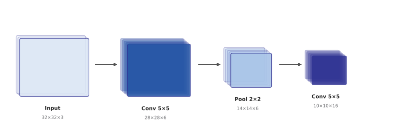

# Chapter 9. CNN Basics

In 1959, neurophysiologists David Hubel and Torsten Wiesel ran an experiment
where they implanted electrodes in a cat's visual cortex and showed it
various visual stimuli. They found that certain neurons respond not to the
**whole** screen, but only to a specific line orientation within a tiny
region (a receptive field) — meaning the brain doesn't look at an image as
a whole, but stacks layers of neurons that each detect small local
patterns, combining them into increasingly complex patterns (lines →
edges → shapes → objects). This discovery, via Kunihiko Fukushima's
Neocognitron in the 1980s, became the direct inspiration for what is now
the **Convolutional Neural Network (CNN)**.

## 9.1 Why You Shouldn't Feed Images to an MLP

To feed an image into the Multi-Layer Perceptron (MLP) from Chapter 7, you'd
have to flatten every pixel into one long vector. A 200×200 grayscale image
alone gives 40,000 inputs, and if the first hidden layer has 1000 neurons,
that's already 40 million weights just for that connection — and this
approach doesn't exploit the fact that "a cat is still a cat whether it's
in the top-left or bottom-right of the photo" at all. Shift a single pixel
and the whole thing is treated as a completely different input.

## 9.2 Convolution: Reusing a Small Filter Across the Whole Image

CNN's core idea is the same thing Hubel and Wiesel discovered: instead of
looking at the **entire** image at once, slide a small filter (e.g. 3×3)
across the whole image, reusing it **identically** everywhere. A \\(k
\times k\\) filter (kernel) slides over the input, and at each position
computes the sum of elementwise products with the overlapping region:

```python
def conv2d(image, kernel):
    img_h, img_w = len(image), len(image[0])
    k = len(kernel)
    out_h, out_w = img_h - k + 1, img_w - k + 1
    output = [[0.0] * out_w for _ in range(out_h)]
    for i in range(out_h):
        for j in range(out_w):
            total = 0.0
            for di in range(k):
                for dj in range(k):
                    total += image[i+di][j+dj] * kernel[di][dj]
            output[i][j] = total
    return output
```

Each filter is **trained** to respond strongly to a particular pattern
(vertical lines, edges, etc.) — the filter's values themselves are the
parameters being learned. An "edge-detecting filter" needs to detect edges
the same way no matter where it is in the image, so there's no need to
learn separate weights for each position — this reuse (**parameter
sharing**) is why CNNs can handle much larger images with far fewer
parameters than an MLP.

## 9.3 The Output Size Formula

For an input of size \\(n \times n\\), filter size \\(k \times k\\),
padding \\(p\\) (the number of zero pixels added around the input's edge),
and stride \\(s\\) (how many cells the filter moves each step), the output
size is:

\\[n_{\text{out}} = \left\lfloor \frac{n + 2p - k}{s} \right\rfloor + 1\\]

Example: with \\(n=28, k=3, p=0, s=1\\), \\(n_{\text{out}} = 28-3+1 = 26\\).
Without padding, the image shrinks a little every time a filter passes
over it — setting \\(p = (k-1)/2\\) (**"same" padding**) keeps the output
the same size as the input.

## 9.4 Counting Parameters and Computation

For a convolutional layer with \\(C_{\text{in}}\\) input channels,
\\(C_{\text{out}}\\) output channels (i.e., filters), and filter size
\\(k \times k\\), the number of parameters (including bias) is:

\\[\text{params} = (k \times k \times C_{\text{in}} + 1) \times C_{\text{out}}\\]

Comparing this to a fully-connected layer of the same size makes the
efficiency of CNNs obvious. Example: for a 32×32×3 image, a convolutional
layer with a 3×3 filter and 16 output channels uses only
\\((3 \times 3 \times 3 + 1) \times 16 = 448\\) parameters. Connecting the
same input to a fully-connected layer (assuming 32×32×16 output neurons
too) would need millions.

**Computation (FLOPs) is a different question from parameter count**:
parameter count measures "how many numbers do we need to store," while the
actual computational cost (speed) is measured by "how many
multiply-accumulate operations happen." Computing one output position, one
channel, takes \\(k \times k \times C_{\text{in}}\\) multiplications, and
this repeats for every output position (\\(n_{\text{out}} \times
n_{\text{out}}\\) of them) and every filter (\\(C_{\text{out}}\\) of them):

\\[\text{FLOPs} \approx n_{\text{out}}^2 \times C_{\text{out}} \times (k
\times k \times C_{\text{in}})\\]

This looks almost identical to the parameter-count formula, but **it has an
extra factor of \\(n_{\text{out}}^2\\) that the parameter count doesn't** —
the same filter (the same parameters) gets reused at every output position,
which is why parameters stay few, but the actual computation repeats once
per position.

Example: apply a single 3×3 filter (\\(C_{\text{out}}=1\\), no padding,
stride 1) to a 224×224 grayscale image (\\(C_{\text{in}}=1\\)). Then
\\(n_{\text{out}}=224-3+1=222\\), and:

\\[\text{FLOPs} = 222^2 \times 1 \times (3\times3\times1) = 49{,}284
\times 9 = 443{,}556\\]

About 440,000 multiply-accumulate operations. Real CNNs use dozens to
hundreds of filters, not just one — bump the same input up to 64 filters
(\\(C_{\text{out}}=64\\)) and computation scales up by exactly 64×, to about
28.39 million. **Adding more kernels (filters) scales parameter count and
computation in exact proportion.** Real CNNs stack dozens to hundreds of
such convolutional layers, which is why total computation is tracked just
as closely as parameter count when designing a model.



## 9.5 Pooling

After convolution, a pooling layer usually reduces the spatial size.
**Max pooling** keeps only the maximum value from each \\(2\times2\\)
region — if a feature shifts by a pixel or two, the same maximum is likely
to still be picked, creating features that are insensitive to small shifts
(translation-invariant). Pooling has no trainable parameters — it's a pure
downsampling operation.

## 9.6 The Typical CNN Structure

Stack `[convolution → activation (ReLU) → pooling]` several times, shrinking
spatial size while growing the number of channels (features), then finish
with one or two fully-connected layers to produce the classification
output. Shallow layers learn to detect low-level patterns like lines and
edges, while deeper layers learn increasingly high-level patterns like
eyes, noses, and wheels — the same hierarchical structure, from simple
cells to complex cells, that Hubel and Wiesel observed.

**A CNN implements a single insight — that an image's local patterns can be
reused regardless of position — through a single operation: convolution.**

---

## Exercises

**1. (Coding)** Complete `conv2d` above (key lines left blank) and the
following `max_pool`:

```python
def max_pool(feature_map, pool_size):
    # ADD ADDITIONAL CODE HERE!!

fm = [[1,3,2,4],
      [5,6,7,8],
      [9,1,2,3],
      [4,5,6,7]]
print(max_pool(fm, 2))  # [[6,8],[9,7]]
```

**2. (Hand derivation, Tier A — free derivation)** For an input of size
\\(n \times n\\), filter size \\(k \times k\\), padding \\(p\\), and stride
\\(s\\), derive the output size formula

\\[n_{\text{out}} = \left\lfloor \frac{n + 2p - k}{s} \right\rfloor + 1\\]

by directly counting the number of positions a filter can occupy on the
image. (Hint: after padding, the effective input size is \\(n+2p\\). Count
how many hops of size \\(s\\) are needed for the filter to move from one
end to the other.)

Then compute the output size, parameter count, and computation (FLOPs) at
each layer of the following CNN — input: 32×32×3, Layer 1: 5×5 filter, 6
output channels, padding 0, stride 1. Layer 2 (pooling): 2×2 max pooling
(no parameters or FLOPs to compute). Layer 3: 5×5 filter, 16 output
channels, padding 0, stride 1.
