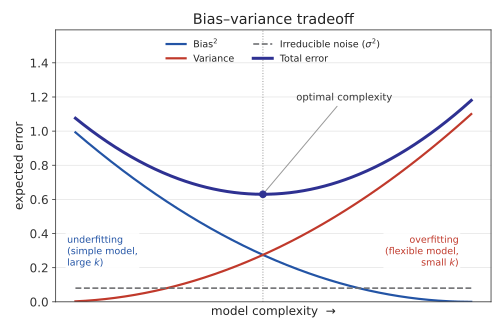

# 4.1 kNN: 알고리즘, 거리함수, 편향-분산 트레이드오프

### 학습이 없는 학습 알고리즘

지금까지 배운 선형회귀/로지스틱회귀는 데이터를 보고 파라미터 \\(w\\)를
최적화하는 **학습 단계**가 있었다. kNN은 그런 게 없다 — "학습"이라고 부를 만한
과정은 사실 데이터를 그냥 저장해두는 것뿐이다. 대신 모든 계산은 **예측 시점**에
일어난다: 새 점이 들어오면 그제서야 저장된 모든 점까지의 거리를 재고, 가장
가까운 것들을 찾는다. 이런 방식을 게으른 학습(lazy learning) 또는
instance-based learning이라 부른다.

### 알고리즘: 가장 가까운 k개의 다수결

새로운 점 \\(x\\)를 분류하려면:

1. 학습 데이터의 모든 점 \\(x^{(i)}\\)에 대해 \\(x\\)와의 거리를 계산한다.
2. 거리가 가장 가까운 \\(k\\)개를 고른다.
3. 그 \\(k\\)개의 라벨 중 다수결(분류) 또는 평균(회귀)을 예측값으로 낸다.

```python
def knn_predict(X_train, y_train, x_new, k):
    distances = []
    for i in range(len(X_train)):
        d = sum((X_train[i][j] - x_new[j]) ** 2 for j in range(len(x_new))) ** 0.5
        distances.append((d, y_train[i]))
    distances.sort(key=lambda p: p[0])
    k_nearest_labels = [label for _, label in distances[:k]]
    return max(set(k_nearest_labels), key=k_nearest_labels.count)  # 다수결
```

### 거리 함수와 정규화

가장 흔한 선택은 **유클리드 거리**(Euclidean distance):

\\[d(x, x') = \sqrt{\sum_{j=1}^n (x_j - x'_j)^2}\\]

다른 선택지로 맨해튼 거리(\\(\sum_j |x_j - x'_j|\\), 좌표축을 따라서만 이동)도
있다. 거리를 재기 전에 **특징 정규화**(normalization)가 거의 필수다 — "방
개수"(0~10 범위)와 "집값"(수억 원 단위)을 그대로 섞어 거리를 재면, 스케일이 큰
특징이 거리를 사실상 독차지해버린다.

### \\(k\\)를 고르는 트레이드오프: 편향과 분산

- \\(k\\)가 너무 작으면(예: \\(k=1\\)): 노이즈 하나에도 민감하게 반응한다 —
  훈련 데이터를 살짝만 바꿔도(다른 표본을 뽑아도) 예측이 크게 요동친다.
  이걸 **분산**(variance)이 크다고 한다 — **과적합**(overfitting).
- \\(k\\)가 너무 크면(예: \\(k=m\\), 전체 데이터): 항상 전체 다수결만
  예측해 지역적 패턴을 완전히 무시한다. 어떤 훈련 데이터를 줘도 거의
  똑같이 단순한 예측만 내놓으니 분산은 작지만, 애초에 잡아야 할 패턴을
  구조적으로 못 잡는다 — 이걸 **편향**(bias)이 크다고 한다 —
  **과소적합**(underfitting).

이 편향-분산 관계는 kNN만의 얘기가 아니라 지도학습 전체에 적용되는 원리다.
회귀 문제에서 모델의 기대 오차를 수학적으로 분해하면 세 항으로 나뉜다:

\\[\mathbb{E}\left[(y - \hat f(x))^2\right] =
\underbrace{\left(\text{Bias}[\hat f(x)]\right)^2}\_{\text{모델이 구조적으로
못 맞추는 정도}} + \underbrace{\text{Var}[\hat f(x)]}\_{\text{훈련 데이터가
바뀔 때 예측이 흔들리는 정도}} + \underbrace{\sigma^2}\_{\text{데이터 자체의
잡음(줄일 수 없음)}}\\]



모델이 너무 단순하면(\\(k\\)가 큰 kNN, 얕은 트리, 규제가 강한 선형모델 등)
Bias가 크고 Variance는 작다 — 과소적합. 모델이 너무 유연하면(\\(k=1\\)인
kNN, 아주 깊은 트리, 파라미터가 많은 신경망 등) Variance가 크고 Bias는
작다 — 과적합. 둘은 항상 이렇게 트레이드오프 관계이고, 최적의 모델
복잡도는 이 둘의 합(전체 오차)이 최소가 되는 지점이다 — 이 프레임은 Chapter
6(정규화), Chapter 7(트리 깊이 제한/가지치기), Chapter 9(신경망 정규화)에서
"과적합을 어떻게 막는가"를 다룰 때마다 다시 등장한다.

적절한 \\(k\\)는 보통 검증 데이터(validation set)로 여러 값을 시도해보고
정한다.

### 손으로 한 번: kNN 예측을 직접 계산하기

작은 데이터셋으로 kNN이 실제로 무엇을 하는지 손으로 따라가보자. 학습
데이터 6개가 두 반(불합격 0, 합격 1)으로 나뉘어 있다:

\\[(1,1){\to}0,\ (2,1){\to}0,\ (1,2){\to}0,\ (8,8){\to}1,\ (9,8){\to}1,\ (8,9){\to}1\\]

새 점 \\((7,7)\\)을 \\(k=3\\)으로 분류해보자. 유클리드 거리를 하나씩
계산하면:

| 학습 데이터 | 라벨 | \\((7,7)\\)까지 거리 |
|---|---|---|
| (8,8) | 1 | \\(\sqrt{1^2+1^2}=\sqrt{2}\approx1.414\\) |
| (9,8) | 1 | \\(\sqrt{2^2+1^2}=\sqrt{5}\approx2.236\\) |
| (8,9) | 1 | \\(\sqrt{1^2+2^2}=\sqrt{5}\approx2.236\\) |
| (2,1) | 0 | \\(\sqrt{5^2+6^2}=\sqrt{61}\approx7.810\\) |
| (1,2) | 0 | \\(\sqrt{6^2+5^2}=\sqrt{61}\approx7.810\\) |
| (1,1) | 0 | \\(\sqrt{6^2+6^2}=\sqrt{72}\approx8.485\\) |

가장 가까운 3개 — (8,8), (9,8), (8,9) — 가 모두 라벨 1이므로, 다수결로
\\((7,7)\\)은 **1(합격)**로 예측된다. 위 `knn_predict` 코드가 정확히 이
정렬·다수결 과정을 자동화한 것이다.

### 자주 하는 실수: 정규화 없이 스케일이 다른 특징을 그대로 섞기

두 번째 예시로, "공부 시간"(1~9시간)과 "가구 소득"(5000~6000만 원)이라는
스케일이 완전히 다른 두 특징으로 합격을 예측한다고 하자. 학습 데이터
\\(P_1=(9,\ 5000)\\)(합격), \\(P_2=(1,\ 5050)\\)(불합격)이 있고, 새 점은
\\((8,\ 6000)\\)이다. 직관적으로는 공부 시간이 8시간으로 \\(P_1\\)(9시간)에
훨씬 가까우니 \\(P_1\\)이 더 가까워야 할 것 같다. 그런데 정규화 없이 그대로
유클리드 거리를 재면:

\\[d(P_1, \text{new}) = \sqrt{(9-8)^2+(5000-6000)^2} \approx 1000.0005, \qquad
d(P_2, \text{new}) = \sqrt{(1-8)^2+(5050-6000)^2} \approx 950.026\\]

**\\(P_2\\)가 오히려 더 가깝다고 나온다** — 공부 시간의 차이(1시간 vs 7시간)는
소득 단위(수천만 원)에 비하면 사실상 무의미할 정도로 작아서, 소득 값 하나가
거리 계산을 독차지해버린 것이다. 두 특징을 각각 0~1로 정규화(이 세 점의
범위 기준: 공부 시간 1~9, 소득 5000~6000)하면:

\\[P_1{\to}(1.0,\ 0.0), \quad P_2{\to}(0.0,\ 0.05), \quad
\text{new}{\to}(0.875,\ 1.0)\\]

\\[d(P_1, \text{new}) \approx 1.008, \qquad d(P_2, \text{new}) \approx 1.292\\]

정규화 후에는 **\\(P_1\\)이 더 가깝게** 뒤집힌다 — 직관과 일치하는 결과다.
이 예시가 보여주듯, 정규화를 빼먹으면 "스케일이 큰 특징이 곧 중요한
특징"이라는, 데이터와 아무 상관 없는 잘못된 가정이 몰래 끼어들게 된다.
실전에서 kNN, k-means(4.3절)처럼 거리를 직접 재는 모델을 쓸 때는
`StandardScaler`나 `MinMaxScaler` 같은 정규화를 빼먹지 않는 것이
선형회귀의 학습률 선택만큼이나 기본적인 체크리스트 항목이다.

### 자주 묻는 질문

**Q. kNN은 왜 "학습이 없다"고 하나요? 데이터를 저장하는 것도 학습 아닌가요?**
선형회귀나 로지스틱회귀는 데이터를 본 뒤 몇 개의 숫자(\\(w\\))로
"압축"해서 저장하고, 그 이후로는 원본 데이터가 없어도 예측할 수 있다.
kNN은 원본 데이터 전체를 그대로 갖고 있어야만 예측할 수 있다 — 파라미터를
최적화하는 과정 자체가 없으므로, 관례적으로 "학습이 없다(게으르다)"고
부른다. 이 차이는 실전에서도 중요하다 — 데이터가 100만 개면 kNN은 예측
한 번마다 100만 개와 거리를 다 재야 해서 느리지만, 선형회귀는 학습이 끝난
뒤엔 예측이 \\(w^Tx\\) 한 번의 내적으로 끝난다.

**Q. \\(k\\)는 항상 홀수로 골라야 하나요?** 이진 분류라면 다수결에서
동점이 나오지 않도록 \\(k\\)를 홀수로 고르는 게 관례적으로 편하다(짝수면
2:2 같은 동점이 나올 수 있어 별도 처리 규칙이 필요해진다). 클래스가
3개 이상이면 홀수여도 동점이 날 수 있으므로, 실전에서는 동점 처리
규칙(예: 가장 가까운 점의 라벨을 우선)을 미리 정해두는 것이 안전하다.
