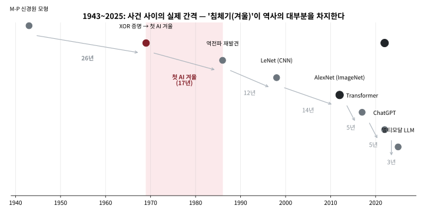

# 1.1 아주 짧은 역사와 이번 학기 로드맵

### 퍼셉트론에서 LLM까지

이번 학기에 배울 아이디어들이 실제로 언제, 어떤 순서로 등장했는지 알아두면
"왜 지금 이 순서로 배우는가"가 더 잘 보인다. 흥미로운 점은, 이 역사가 직선으로
쭉 발전한 게 아니라 침체기("겨울")를 두 번이나 거쳤다는 것이다.

| 연도 | 사건 |
|---|---|
| 1943 | 맥컬록-피터즈 신경원 모형 — "수학적으로 학습 가능한 뉴런"이라는 발상 자체의 시작. 퍼셉트론의 직전 아이디어 |
| 1950s | 퍼셉트론(단층 신경망) 등장 — 이번 학기 초반 고전 ML 모델들과 비슷한 시기 아이디어 |
| 1969 | 민스키·페퍼트가 단층 퍼셉트론이 XOR을 못 푼다는 것을 증명 → 첫 "AI 겨울" (Chapter 9) |
| 1986 | 역전파(backpropagation) 재발견으로 다층 신경망 학습이 가능해짐 (Chapter 9) |
| 1998 | LeCun의 CNN(LeNet)이 손글씨 숫자 인식에 성공 (Chapter 10) |
| 2012 | AlexNet이 ImageNet에서 압승 — 딥러닝 시대의 시작 (이 챕터의 도입부) |
| 2013 | word2vec, VAE 등 표현학습·생성모델의 현대적 형태 등장 (Chapter 14, 15) |
| 2017 | Transformer("Attention Is All You Need") 등장 (Chapter 12) |
| 2022 | ChatGPT — 사전학습 + RLHF로 조정된 대규모 언어모델의 대중화 (Chapter 13) |
| 2025 | GPT-4o·Gemini·Claude 등 멀티모달 대규모 언어모델이 스마트폰·워크스테이션에 내장 |

표를 **연도 축 위에** 그려보면 "직선으로 발전한 역사가 아니다"라는 말이
숫자로 보인다. 1943→1969의 26년, 1969→1986의 17년 같은 긴 침체기가
역사의 상당 부분을 차지하고, 2012년 이후에만 5년 간격이 반복된다.
실습 노트북의 1절에서는 이 간격들을 직접 계산해 보고, 4절에서는
"2012년 이전 평균 간격 vs 이후 평균 간격"을 비교해본다.

### 세 번의 결정적 순간을 조금 더 자세히

표만으로는 왜 이 사건들이 "결정적"이었는지 잘 안 와닿는다. 세 순간을
조금 더 풀어보자.

**1969년, 첫 겨울의 시작**: 민스키와 페퍼트는 단층 퍼셉트론이
XOR(배타적 논리합, "둘 중 정확히 하나만 참일 때만 참")조차 표현할 수
없다는 것을 수학적으로 증명했다. 이건 "아직 알고리즘이 부족하다"가 아니라
"이 구조로는 원리적으로 불가능하다"는, 훨씬 강한 주장이었다 — 그 결과
연구비가 끊기고 신경망 연구자 수가 급감하는 "첫 AI 겨울"이 10년 넘게
이어졌다. 흥미로운 점은 답이 이미 알려진 수학(층을 여러 개 쌓으면 XOR도
표현 가능하다) 안에 있었는데도, "어떻게 그 여러 층을 학습시킬 것인가"라는
계산적 문제가 안 풀려서 겨울이 그토록 길어졌다는 것이다.

**1986년, 역전파가 겨울을 끝내다**: 러멜하트, 힌튼, 윌리엄스가
역전파를 (재)발견하면서, 여러 층을 가진 신경망도 경사하강법으로 실제로
학습시킬 수 있다는 것이 드러났다 — 정확히 1969년의 한계(XOR)를 실제로
풀어내는 방법이었다. Chapter 9에서 이 알고리즘을 손으로 유도해볼 텐데,
그 유도에 등장하는 연쇄법칙은 1.3절에서 손으로 직접 계산해볼 바로 그 연쇄법칙과
정확히 같은 도구라는 점을 기억해두자.

**2012년, 딥러닝 시대의 개막**: 이 챕터 도입부에서 언급한 AlexNet은
사실 1986년의 역전파, 1998년의 CNN 구조(LeNet)와 근본적으로 다른 새
수학을 쓴 게 아니었다 — 결정적 차이는 **GPU로 병렬 연산을 하게 되면서
계산량이 감당 가능해졌고, 인터넷 덕분에 ImageNet 같은 대규모 라벨링된
데이터셋이 존재했다**는 것이었다. "좋은 아이디어가 있어도 데이터와 계산
자원이 받쳐주지 않으면 묻힐 수 있다"는 교훈이 여기서 나온다.

1969년의 증명 하나가 신경망 연구를 십수 년간 위축시켰다는 사실은, "이론적
한계를 정확히 아는 것"이 때로는 "무작정 더 시도해보는 것"보다 강력하다는
것을 보여준다 — 동시에, 1986년의 역전파가 바로 그 한계(XOR)를 정확히 풀어낸
해법이었다는 것도 기억할 만하다. **한 가지 반복되는 패턴**: 대부분의
"돌파구"는 완전히 새로운 수학이 아니라, 이미 있던 아이디어(경사하강법,
연쇄법칙, 확률론)를 더 큰 데이터·더 많은 계산 자원 위에서 다시 조합한
것이다. 이번 학기 목표는 그 재사용되는 기본 아이디어 자체를 손으로 짚어보는
것이다.

### "왜 2012년이었을까" — 데이터와 계산의 두 축

2012년의 교훈을 조금 더 구체적으로 펼쳐보자. "GPU + 대규모 데이터"라는
설명이 막연하게 들린다면, 두 축을 각각 따로 떼어서 살펴보는 편이 낫다.

**첫 번째 축: 계산.** AlexNet은 2012년 기준 최신 GPU 두 장(NVIDIA GTX 280)
으로 **약 5~11일** 걸리던 학습을 수행했다. 같은 모델을 당시 최고 수준 CPU
클러스터에서 돌리려 했다면 월 단위로 시간이 늘어난다는 것이 일반적 추정
이었다 — "학습이 불가능했다"가 아니라 "학기가 끝나기 전에 끝나지 않았다"는
차이인데, 연구의 속도 경쟁에서는 둘 다 사실상 불가능한 것과 같다. 여기서
연상해야 할 도구는 **무어의 법칙**(집적회로의 성능이 대략 2년마다 배가된다는
경험 법칙)다 — 연구팀은 대략 "한 학기 안에 끝나야 하는" 학습 시간 예산이
고정되어 있는데, 이 예산이 그대로라면 1998년에는 LeNet 크기의 모델을
돌리는 데 거의 다 썼겠지만, 2012년에는 같은 예산 안에 층과 폭이 훨씬 큰
모델을 돌려볼 수 있었다. 신경망 연구에서 "구조"와 "계산"은 이렇듯 한 쪽만
커져서는 안 되는 한 쌍이다 — Chapter 9에서 역전파의 연산 비용을 손으로
세어볼 때 이 감각이 다시 등장한다.

**두 번째 축: 데이터.** ImageNet은 약 140만 장의 이미지에 1000개 클래스
라벨을 붙인 데이터셋으로, 2009년에 공개됐다. 중요한 점은 이 라벨 대부분이
**일반인이 직접 매긴** 것이라는 사실이다 — 인터넷과 아마존 메카니컬 터크
같은 플랫폼이 없었다면, 100만 장 넘는 사진 하나하나에 "고양이", "셔터"
라는 라벨을 붙이는 비용 자체가 연구비를 압도했을 것이다. 다시 말해
AlexNet의 승리는 "140만 장의 데이터"와 "2장 GPU"가 **동시에** 갖춰진
2012년에만 가능했던 것이고, 어느 하나만 있었어도 그 해의 결과물은 달라졌을
것이다. 이번 학기 내내 등장하는 모든 모델이 이 "두 축" 위에 서 있다는
사실을 기억해두면, "우리 데이터가 작으니 신경망은 아직 이르다" 같은
실무 판단이 왜 이렇게 흔하게 나오는지도 자연스럽게 이해된다.

**세 번째 교훈: 라벨의 형태가 모델의 형태를 결정한다.** 2012년의
패러다임 전환은 "사진 + 범주 라벨"이라는 **지도학습**의 가장 전형적인
형태 위에서 일어났다. 정답이 없는 데이터만 있을 때(비지도학습, Chapter
14~15)나 보상 신호만 있을 때(강화학습, ML2)에는 같은 GPU·데이터 축도
마찬가지로 중요하지만, "어떤 신호로 학습하는가"에 따라 최적의 모델 가족
 자체가 달라진다 — 1.2절에서 "데이터의 형태가 문제를 결정한다"고 할 때
뜻하는 바가 정확히 이것이다.

### 이번 학기 로드맵

이번 학기는 8주씩 두 블록으로 나뉜다. **Block A(Chapter 2~7)**는 신경망 없이도
강력한 classical ML 모델들(회귀, 나이브베이즈/GDA, 거리 기반 모델, SVM, 정규화,
트리 기반 모델)을 다룬다 — 지금도 정형(tabular) 데이터에서는 이 모델들이
신경망보다 자주 이긴다. Chapter 8은 Block A를 마무리하는 팀 프로젝트와
중간고사 준비다.

중간고사 이후 **Block B(Chapter 9~16)**는 신경망으로 넘어간다. 역전파의
원리를 손으로 유도한 뒤(Chapter 9) CNN(Chapter 10)까지 신경망의 기본기를
다지고, 이어서 순서가 있는 데이터를 다루는 시퀀스 모델·Transformer·LLM까지
현대 딥러닝의 핵심 계보를 한 줄로 훑는다(Chapter 11~13). 마지막으로
비지도학습(PCA, 임베딩)과 잠재변수 기반 생성형 모델(EM/GMM에서 VAE·GAN·
Diffusion까지)로 학기를 마무리한다(Chapter 14~15). Chapter 16은 두 번째
팀 프로젝트 발표와 학기 총정리다.

아래 표로 전체 16개 챕터를 한 줄씩 요약해서 다시 본다 — 매 장 시작 전에
이 표를 다시 펼쳐 "지금 어디서 무엇을 배우고, 어디로 이어지는지"를
확인하는 습관을 들이면, 개별 챕터의 내용이 더 잘 붙는다.

| 장 | 제목 (한 줄 요약) | 블록 |
|---|---|---|
| 1 | 머신러닝 첫걸음: 역사·로드맵·문제 정식화·파이프라인·수학 리뷰 (지금 여기) | A |
| 2 | 회귀 모델: 선형·로지스틱회귀, 경사하강법, PR-AUC | A |
| 3 | 생성 모델 관점의 분류: 나이브베이즈와 GDA | A |
| 4 | 거리 기반 모델과 클러스터링: kNN과 k-means | A |
| 5 | SVM과 커널: 마진 최대화, 소프트 마진, 커널 트릭 | A |
| 6 | 정규화와 모델 선택: L1/L2, 교차검증, train/val/test 분리 | A |
| 7 | 트리 기반 모델: 결정트리, 랜덤 포레스트, GBDT와 SHAP | A |
| 8 | Block A 캡스톤: 팀 프로젝트, Peer-Review, 중간고사 대비 | A |
| 9 | 신경망 기초: 퍼셉트론의 한계, 순전파, 역전파, 정규화 기법 | B |
| 10 | CNN 기초와 응용: 합성곱, 풀링, 탐지·분할·전이학습 | B |
| 11 | 시퀀스 모델: RNN, BPTT, LSTM/GRU | B |
| 12 | 어텐션과 트랜스포머: QKV, Self-Attention, Multi-Head | B |
| 13 | LLM: 언어모델링, 프롬프팅, SFT·RLHF·DPO | B |
| 14 | 표현학습: PCA, word2vec, Node2Vec, PageRank | B |
| 15 | 잠재변수 생성모델: EM/GMM, VAE, GAN, Diffusion | B |
| 16 | Block B 캡스톤: 팀 프로젝트, Peer-Review, ML1 총정리 | B |

**강화학습과 로봇 시뮬레이션은 이번 학기(ML1)에서는 전혀 다루지 않는다** —
ML1과 ML2는 서로 독립된 과목으로 설계됐고, ML2가 이 주제를 처음부터 끝까지
전담한다. ML1을 먼저 듣지 않아도 ML2를 바로 들을 수 있다(ML2 1주차에 필요한
신경망 기초를 압축해서 다시 짚어준다).

### 이번 학기 쓸 도구들 (수학 + 코드로)

1.3절에서 수학 도구를 세 가지로 정리했지만, 이번 학기에 실제로 손이 닿는
"도구 목록"은 코드로도 한 번 더 나열해둔다. 이 목록을
"이번 학기에 새로 배워야 할 것"으로 읽는 게 아니라, "이 학기 내내 반복해서
손이 갈 것"으로 읽는 편이 정확하다 — 어느 하나를 완벽히 외우는 것보다,
필요할 때 10초 만에 꺼내 쓸 수 있는 것이 목표다.

| 도구 | 이 학기에서 쓰이는 곳 | 언제 처음 등장 |
|---|---|---|
| numpy (N-dimensional array) | 모든 실습의 기본. \\(w^Tx\\), 행렬곱, 경사하강법 반복 | Chapter 2 |
| matplotlib (plotting) | 손실 곡선, 결정경계, t-SNE/PCA 시각화 | Chapter 2 |
| pandas (table data) | EDA, 결측치 처리, 그룹별 통계 | Chapter 6 (1.3절 예습) |
| scikit-learn | 분류·회귀·클러스터링 모델의 표준 인터페이스 | Chapter 2 |
| PyTorch (deep learning) | 신경망·CNN·시퀀스 모델·VAE/GAN | Chapter 9 |
| Hugging Face Transformers | LLM 프롬프팅, 사전학습 모델 활용 | Chapter 13 |
| gymnasium | (ML2에서) 강화학습 환경. ML1에서는 등장하지 않음 | — |

**실습 노트북의 역할**: 각 절마다 붙는 실습 노트북(Colab 배지로 열 수 있다)
은 "개념을 손으로 확인"에 집중한다 — 예를 들어 이번 절의 노트북에서는
위 연표의 "격차"를 직접 계산하고, 2012년 이전의 AI 겨울을 시각화하고,
이 리스트에 있는 라이브러리들이 실제로 이 환경에서 import 되는지 확인한다.
"어떤 모델을 쓰느냐"보다 "도구가 손에 익었느냐"가 이 학기 전반부의
진짜 성패를 가른다는 점을 미리 강조해둔다.

### 자주 하는 실수: 로드맵을 건너뛰고 "최신 모델"부터 잡기

첫 학기에 가장 흔한 실패 패턴은, Chapter 12의 Transformer나 Chapter 13의
LLM이 "실제 산업에서 쓰는 것"이라고 듣고서 Block A를 대충 넘기고 Chapter
12로 건너뛰려 하는 것이다. 실제로 이렇게 한 학생의 경험을 떠올려보자 —
PyTorch로 작은 네트워크를 짜놓고 손실이 안 떨어지는데, (a) 데이터의 스케일
문제인지, (b) 학습률이 맞지 않는지, (c) 모델 구조 자체의 문제인지
구분하지 못한 채 "일단 층을 늘려보자"로 끝나고, 한 달 뒤에도 원인 모를
손실 곡선만 남아 있다. 원인 모를 실패를 겪을 때, Chapter 6에서 배운
"train/val/test 분리"와 Chapter 2의 "손실함수를 손으로 한 번 계산" 같은
기초 도구가 없었다면 디버깅이 사실상 불가능하다.

이 패턴의 본질은 "최신 = 어렵다 = 배우면 실력이 된다"는 착각이다.
실제로는 최신 모델의 논문 한 줄 한 줄이 전부, 이번 학기 Block A·B에서
다룰 기초 개념(경사하강법, 시그모이드, 교차 엔트로피, 어텐션)의 변형이다
— 기초가 없으면 논문을 "읽는" 게 아니라 "눈으로 훑어보는" 것에 그치고 만다.
반대로 Block A를 충실히 마치면, Chapter 12의 Transformer 논문을 읽을 때
"이 단락은 어텐션의 QKV를 다루는 건데, 12.1절의 QKV랑 같다"는 식으로
바로 위치를 잡을 수 있다. **로드맵은 "배울 것의 목록"이 아니라 "어디서
어떤 기초가 다시 쓰이는지"를 보여주는 지도** — 이 지도를 무시하고 특정
장만 독학하는 것이, 나중에 막힐 때 가장 비싼 대가를 치르게 하는 길이다.

### 실습: 나만의 학기 타임라인 만들기

연표를 눈으로 보는 것만으로는 "나"의 학기 계획이 안 된다. 아래 3가지를
노트로 직접 짜봐라 — 10분이면 충분하고, 이 3개가 이번 학기 내내 되돌아볼
"나만의 로드맵"이 된다.

1. **연표 다시 쓰기**: 위 연표(1943~2025)를 보지 않고, "이 사건이 왜
   결정적이었는가"를 각 한 문장으로 다시 써보기. 쓰다 막히면 1.2절
   "왜?" 설명을 다시 보는 것이 정상이다.
2. **교차점 찾기**: Block A(Ch 2~7)와 Block B(Ch 9~16) 중, (a) 팀
   프로젝트 발표가 있는 주간, (b) 새로 등장하는 수학 도구가 가장 많은
   장, (c) 1.3절의 세 가지 수학(내적·연쇄법칙·베이즈)이 전부 한 번에
   등장하는 장을 각각 하나씩 찾아보기.
3. **도구 점검**: "이번 학기 쓸 도구들" 표에서, 지금
   import 해서 실행해볼 수 있는 것(대개 numpy·matplotlib·pandas)과 아직
   설치/설명이 필요한 것(PyTorch, Hugging Face)을 나눠보기 — 이번 절
   실습 노트북(Colab)이 바로 이 점검을 코드 그대로 보여준다.

**힌트**: (2)의 (b)는 Chapter 9(역전파 — 연쇄법칙을 수십 층에 반복 적용)
이고, (c)는 Chapter 3(나이브베이즈 — 조건부 확률과 베이즈 정리 +
가우시안 밀도의 내적 형태)이다. 맞췄다면 1.3절의 수학이 "개별 장의
도구"가 아니라 "학기 전체를 관통하는 도구"라는 감각이 잡힌 것으로
생겨도 좋다.

### 확인 문제: 연표와 로드맵이 실제로 읽히는가

다음 질문에 **이 절의 내용만으로** 답해볼 것(각 문항 아래에 답이 있다.
먼저 스스로 답한 뒤 확인할 것).

- **(a)** "2012년 AlexNet이 ImageNet을 이긴 것은, 그보다 앞서 나온
  CNN(LeNet, 1998)이 수학적으로 더 좋았기 때문이다." — 이 주장에
  반대하려면, 이 절에서 어떤 근거 두 가지를 꺼내야 하는가?
  > 답: (1) AlexNet은 LeNet과 근본적으로 다른 새 수학을 쓰지 않았고,
  > (2) 결정적 차이는 GPU 병렬 연산과 ImageNet 같은 대규모 라벨링
  > 데이터셋의 동시 출현이었다. 즉 "수학의 우위"가 아니라 "계산 + 데이터"
  > 의 축이 2012년에야 비로소 갖춰진 것이 핵심 근거다.

- **(b)** "첫 AI 겨울(1969~1980s)이 10년 넘게 길어졌던 이유는, 답이
  이미 알려진 수학(층을 쌓으면 XOR 가능) 안에 있었기 때문이다." —
  이 문장의 인과관계가 잘못되었다면, 어떻게 고쳐야 하는가?
  > 답: 인과가 반전돼 있다. "답이 알려진 수학 안에 있었다"는 사실은
  > 오히려 겨울이 끝나는 데 걸린 시간이 더 길어졌다는 뜻이다 — 진짜
  > 이유는 "그 여러 층을 학습시킬 계산적 문제(역전파)가 1986년
  > 재발견되기까지 17년간 안 풀려 있었다"는 것이다.

- **(c)** Block A와 Block B 중, "정형(tabular) 데이터에서 지금도
  신경망보다 자주 이긴다"는 말이 어느 블록에 해당하는가? 왜 그런지
  이 절의 문맥으로 한 문장만 설명해라.
  > 답: Block A(Ch 2~7) — 회귀·나이브베이즈·kNN·SVM·정규화·트리
  > 기반 모델이 정형 데이터에서 아직까지도 신경망을 이기는 경우가
  > 흔하다는 것이 Block A를 학기 초반에 배치한 이유다.

### 자주 묻는 질문

**Q. ML1과 ML2를 둘 다 들어야 하나요?** 아니다 — 두 과목은 서로
완전히 독립적으로 설계됐다. ML1은 데이터사이언스부터 고전 ML, 딥러닝,
생성모델까지를 다루고, ML2는 강화학습·로봇 시뮬레이션만 처음부터 끝까지
전담한다. 어느 쪽을 먼저 들어도, 혹은 하나만 들어도 상관없다.

**Q. Block A(고전 ML)를 안 배우고 Block B(신경망)로 바로 넘어가면
안 되나요?** 이론적으로는 신경망만 배워도 되지만, 권장하지 않는다 —
Chapter 6의 정규화, Chapter 7의 트리 앙상블에서 배우는 "편향-분산
트레이드오프", "train/val/test 분리" 같은 개념은 신경망에도 그대로
적용되고(Chapter 9의 드롭아웃, 배치정규화가 정확히 같은 원리다), 지금도
정형 데이터에서는 classical ML이 신경망을 이기는 경우가 흔해서 실무에서
바로 쓸모가 있다.

**Q. 수학이 약한데 따라갈 수 있나요?** 1.3절에서 다룰 세 가지
수학(내적, 연쇄법칙, 베이즈 정리)이 사실상 전부다 — 그 이상의 새로운
수학 도구는 거의 등장하지 않고, 대신 그 세 가지를 점점 더 복잡한 상황에
반복해서 적용하는 것이 이번 학기의 실제 난이도다. 낯선 표기가 나올
때마다 1.3절을 참고하는 습관을 들이면 충분하다.

**Q. ML2를 먼저 듣고 ML1을 나중에 들어도 되나요?** 된다 — ML1과 ML2는
상호 선행 과목 관계가 아니라 완전히 독립 설계됐다. ML2는 1주차에
필요한 신경망 기초를 압축해서 다시 짚어주기 때문에, ML1 없이 ML2를
들어도 중간부터 막히지는 않는다. 다만 ML1에서 다루는 "정형 데이터에서
왜 아직도 classical ML이 강력한가"라는 실무 감각은 ML2(로봇·강화학습
중심)에서는 다루지 않으므로, 산업 현장에서 둘 다 쓰일 예정이라면
순서와 무관하게 두 과목 다 들을 것을 권한다.

**Q. Python이 약한데 코드를 따라갈 수 있나요?** 기본 문법(변수, for
루프, 함수, 리스트)만 있으면 충분하다. 이 책은 의도적으로 개념 코드를
순수 Python(리스트 + for 루프)으로 짠 경우가 많다 — 1.3절 하단의
numpy 실습에서도, "벡터 연산 뒤에 숨은 for 루프를 직접 눈으로 보기"가
우선이라고 설명할 것이다. scikit-learn이나 PyTorch의 *호출 이름*을
외우는 것은 이 학기의 목표가 아니라, "이 함수가 안에서 뭘 하는가"를
알고 쓰는 것이 목표다.

**Q. 모든 장을 같은 깊이로 배워야 하나요?** 아니다 — 이 학기의 목표는
"16개 장을 모두 동일하게 깊게 이해"하는 것이 아니라, **매 장에서
"h는 무엇이고, J는 무엇이며, 어떻게 최소화하는가"라는 세 가지 질문에
답할 수 있는 정도**로 이해하는 것이다(1.2절 후반의 공통 언어). 특정
장(예: Chapter 12의 Transformer)이 특히 흥미로우면 그 장을 더 깊게
파고들어도 좋지만, 그때도 기초(Chapter 9의 역전파)가 먼저 잡혀 있어야
"깊이 파는 것"과 "그저 보는 것"을 스스로 구분할 수 있다.

**어떤 모델을 쓸지보다 먼저 물어야 할 질문은 항상 같다: 이 문제는 무엇을 데이터로
갖고 있고, 무엇을 맞히고 싶은가.**
