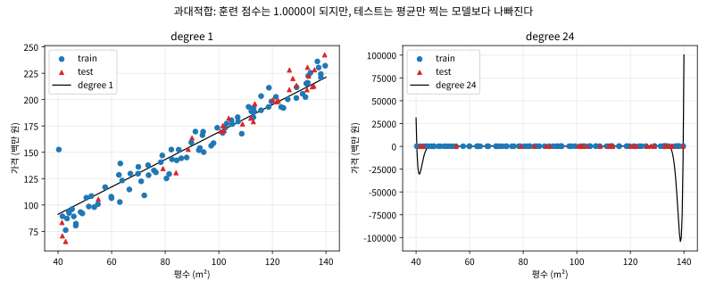

# 1.3 데이터사이언스 파이프라인과 사전지식 리뷰

[](https://colab.research.google.com/github/SuminHan/book-ml/blob/main/notebooks/ml1/chapter01_3_pipeline.ipynb)

### 모델은 파이프라인의 한 조각일 뿐이다

1.2절은 "모델을 어떻게 정의하는가"에 집중했지만, 실전에서 모델 학습은 전체
작업의 작은 일부에 불과하다. 실제 데이터 프로젝트는 보통 다음 순환을 따른다:

1. **수집**(Collection): 어디서 데이터를 구할 것인가 — 이번 학기 팀
   프로젝트(Chapter 8, 16)에서는 Kaggle, UCI Machine Learning Repository,
   Hugging Face Datasets 같은 공개 저장소를 주로 쓰게 된다. 실무에서는
   여기에 "이 데이터를 이 목적으로 써도 되는가"(라이선스, 개인정보) 확인도
   포함된다 — 캐글 대회 데이터라도 상업적 재사용이 금지된 경우가 흔하다.
2. **정제**(Cleaning): 결측치(missing value), 중복, 이상치(outlier)를
   처리한다 — 현실 데이터는 거의 항상 지저분하다. 센서 데이터라면
   기기 고장으로 -999 같은 비현실적인 값이 섞여 있을 수 있고, 설문
   데이터라면 같은 응답자가 중복 제출한 행이 섞여 있을 수 있다.
3. **탐색적 데이터 분석**(Exploratory Data Analysis, EDA): 본격적으로 모델을
   만들기 전에, 데이터의 분포·상관관계·클래스 비율을 눈으로 확인한다.
   이 단계에서 발견한 사실이 종종 4단계에서 어떤 모델을 고를지까지
   결정한다 — 예를 들어 클래스 비율이 99:1로 심하게 불균형하다면, 정확도
   대신 다른 평가지표(Chapter 2.3의 PR-AUC)를 처음부터 염두에 둬야 한다.
4. **모델링**(Modeling): 1.2절에서 정식화한 문제에 맞는 가설 \\(h\\)를
   고르고 학습시킨다 — 이번 학기 대부분의 장이 이 단계를 다룬다.
5. **평가**(Evaluation): 학습에 쓰지 않은 데이터로 성능을 검증한다
   (Chapter 6에서 이 원칙을 엄밀하게 다룬다). 평가 결과가 나쁘면
   반드시 4단계(다른 모델?)로만 돌아가는 게 아니라, 종종 1~3단계로
   되돌아가야 한다는 점도 기억할 것 — "모델이 나쁜 것"이 아니라
   "데이터가 애초에 그 신호를 담고 있지 않은 것"일 수 있다.

이 순환에서 **모델링은 다섯 단계 중 하나일 뿐**이라는 사실이, 처음 머신러닝을
배울 때 가장 자주 간과되는 점이다. 실제로 캐글 데이터로 프로젝트를 진행해보면
결측치 처리와 EDA에 들이는 시간이 모델 코드를 짜는 시간보다 긴 경우가 흔하다.
왜 이런 순서인가 하면, 파이프라인 앞 단계의 결함은 뒤 단계에서 아무리 좋은
모델을 써도 **수리되지 않기** 때문이다 — 결측치가 제대로 처리되지 않은
데이터로 아무리 정교한 모델을 학습시켜도, 그 모델은 "결측 처리의 흔적"을
정답인 양 학습하고, 겹쳐 있는 중복 행은 같은 사례를 여러 번 외워 "중요도가
부풀려진" 데이터를 만들며, 학습 시점에 알 수 없던 정보(예: "거래 완료
여부"를 특징으로 쓰는 집값 예측)가 섞여 있으면 훈련 때는 비현실적으로
정확하다가 실전에만 무너지는, 디버깅이 거의 불가능한 모델을 만들어준다.
**파이프라인은 위에서 아래로 흐르되, 결함은 위에서 아래로 "증폭"되는
구조**라는 점이 실무 경험자들의 일치된 증언이다.

### 자주 하는 실수: EDA를 건너뛰고 바로 모델링

1.2절의 "정의 없이 알고리즘부터 고르지 말라"는 교훈이 이 파이프라인
단계에도 그대로 적용된다. 흔한 실패 패턴: 캐글에서 데이터를 내려받자마자
`df.head()`만 한 번 찍어보고 바로 `model.fit(X, y)`를 돌린다. 나중에
성능이 이상해서 데이터를 다시 들여다보면 — 가격 열에 음수값이 섞여
있었거나, 한 지역 데이터가 전체의 90%를 차지해 다른 지역은 사실상
학습이 안 됐거나, 특정 열이 사실 "미래 정보"(예측 시점에는 알 수 없는
값)를 담고 있어서 학습 때만 비현실적으로 정확했던 것으로 드러나는 식이다.
이런 문제는 전부 `df.describe()`, `df.corr()`, 그룹별 통계 몇 줄만
먼저 찍어봤어도 모델을 돌리기 **전에** 잡을 수 있었던 것들이다 — EDA에
쓰는 10분이, 잘못된 가정 위에 쌓은 모델을 디버깅하는 데 드는 몇 시간을
아껴준다.

### 유명한 사고: 모델이 아니라 데이터가 "틀려" 있던 경우

머신러닝 역사에서 데이터 품질의 중요성을 보여주는 가장 유명한 사례 중 하나를
알아두자. 1992년, SRI 국제 AI 센터의 워프터(Wolpert)와 키블러(Kibler)는
"Do We Know the Data We're Using?"라는 제목의 논문을 썼다. 내용은 이렇다 —
당시 표준 벤치마크 데이터셋으로 쓰이던 UCI Machine Learning Repository의
"Aha!" 데이터셋을 들여다봤더니, **동일한 특징 벡터의 행이 서로 정답 라벨이
달라진 채 두 개 이상 들어 있는 경우가 100건** 있었다. 같은 입력에 서로
모순되는 정답이 두 개면, 아무리 완전한 모델이라도 그 쌍 중 적어도 한 건은
틀릴 수밖에 없다 — 수학적 문제다. 즉 그 데이터셋을 기반으로 쓰인 "어떤
알고리즘이 더 좋은가"의 알고리즘 비교 논문들에는, 알고리즘이 아니라
**데이터의 모순이 만든 "반드시 틀려야 하는" 바닥**이 이미 포함돼 있었다.
저자들은 중복 행을 정리(모순 쌍에서 하나를 제거)하자 알고리즘들의 정확도가
오른다는 것을 보여주었다. 교훈은 바로 이 절의 주제다 — 성능이 이상할 때
첫 번째로 의심할 대상은 "모델이 약해서"가 아니라 "데이터에 문제가 있어서"
일 수 있고, 그 확인은 고급 알고리즘이 아니라 `df.duplicated()` 같은
**단순한 검사**로 한다.

### 더티 데이터의 세 가지 표준 모양

"데이터가 지저분하다"는 말은 막연한 인상이 아니라, 실전에서 반복해서 나타나는
세 가지 표준 모양을 가리킨다 — 위 Aha! 사례는 두 번째 모양의 극단이다.

1. **결측치**(missing value): 값이 아예 비어 있는 경우 — `NaN`, 빈칸, 혹은
   0 / -1 / -999 / 999 같은 **센티넬 값**(의도된 "측정 실패" 표시). 센티넬
   값은 "비어 있음"처럼 보이지 않아 가장 위험하다 — 0으로 임의 채워진
   결측치를 그대로 쓰면, 모델에 "0은 특별한 값을 가짐"이라는 거짓 신호가
   들어가므로, EDA에서 `df.describe()`의 최솟값·분포를 보며
   "합리적인 범위를 벗어난 값이 모여 있는가"를 항상 확인한다.
2. **중복**(duplicate): 같은 행이 여러 번 들어 있는 경우 — 전체 행이
   완전히 같은 "완전 중복"부터, 같은 응답자·동일 물건이 다른 시점에 여러 번
   기록된 "부분 중복"까지 있다. `df.duplicated()`는 완전 중복만 잡아주고,
   부분 중복은 "어떤 열들의 조합을 동일 사례로 볼 것인가"를 사람이 먼저
   결정해야 한다(예: 부동산 데이터는 "지번+거래일" 조합이 같으면 동일 사례).
3. **이상치**(outlier): 범위는 합리적이지만 분포와 극단적으로 어긋난 값 —
   음수인 가격, 250세인 나이는 센티넬이므로 1번으로, "합법적이지만
   극단적"인 값(수백억짜리 단독주택 한 채)은 3번으로 처리해야 할지,
   그 값 자체가 드물지만 중요한 사례라면 그대로 둘지,는 **도메인
   지식으로만** 판단할 수 있는 문제다 — 이 판단이 "코드 짜는 것"이 아니라
   "문제를 이해하는 것"의 영역에 속한다는 점을 기억할 것.

### EDA: 모델을 돌리기 전에 데이터와 "대화"하기

EDA의 목적은 "데이터를 보는 것" 자체가 아니라, 모델링 **전에** 다음 질문들에
답을 얻어두는 것이다 — 그리고 이 질문들은 모델이 아니라 **데이터**에 대해
물어보는 것들이라는 점이 중요하다:

1. **각 특징의 스케일이 서로 얼마나 다른가?** 평수는 수십~백 단위, 연식은
   네 자리 연도, 가격은 억 단위면 — 이 스케일 차이가 크면 Chapter 4.1의
   특징 정규화를 모델에 넣기 전에 해야 하고, 이는 EDA의 첫 질문이다.
2. **어떤 특징이 목표 변수와 강하게 연관되어 있는가?** 어떤 특징도 목표와
   관련이 없다면, 모델이 아무리 좋아도 예측력은 한계가 있다 — 1.2절의
   "이 특징들이 애초에 정답과 관련이 있는가"가 항상 먼저라는 강조와
   정확히 같은 질문이다.
3. **목표 변수의 분포가 합리적인가?** 음수값이 있는가, 한쪽 꼬리가 극단적으로
   긴가(가격 데이터는 보통 오른쪽 꼬리가 긴 분포). 꼬리가 길면 "평균을
   얼마나 잘 맞히느냐"를 기준으로 하는 평가(Chapter 2의 MSE)가 극단값에
   지나치게 민감해질 수 있음을 미리 인지해둔다.
4. **클래스 균형(분류 문제)은 적당한가?** 양성:음성 = 99:1이면, 전부를
   "음성"으로 예측하는 멍한 모델도 정확도 99%를 얻는다 — 정확도는 이 경우
   무의미한 지표가 되고, PR-AUC 같은 지표(Chapter 2.3)를 처음부터
   염두에 둬야 한다.

실제로 이 네 질문이 얼마나 유용한지, 한 번도 공개된 데이터를 예로 들면
분명하다. Kaggle의 "House Prices"(2015~2016년 캐글 대회용 부동산 데이터,
1,460행 × 81개 특징)는 처음 받아서 `describe()`만 찍어도 목표 변수
`SalePrice`의 분포가 오른쪽으로 심하게 치우켜 있으며 최댓값이 99퍼센타일
보다 수 배 크다는 것을 즉시 보여준다 — "평균을 잘 맞히는 모델"을 만들 때
그 극단값 몇 개가 훈련을 얼마나 끌어당기는지, Chapter 6의 정규화 이야기를
배우기 전에 이미 감을 잡을 수 있게 된다.

### 실습: pandas로 첫 EDA 해보기

이번 학기 코드 예제는 이해를 돕기 위해 순수 Python이나 numpy로 개념을 손으로
짜보는 경우가 많지만(이 절 하단 참고), 실전 데이터 탐색 단계에서는 `pandas`가
사실상 표준 도구다. 아주 작은 예시로 EDA의 감을 잡아보자:

```python
import pandas as pd

data = {
    "size_sqm": [59, 84, 112, 46, 132, 78],
    "rooms": [2, 3, 4, 1, 4, 3],
    "year_built": [2015, 2008, 1998, 2020, 1995, 2011],
    "price_million": [320, 410, 505, 250, 560, 390],
}
df = pd.DataFrame(data)

print(df.describe())          # 각 열의 평균/표준편차/최소/최대 한눈에 보기
print(df.corr(numeric_only=True)["price_million"])  # 어떤 특징이 가격과 가장 관련 있는가
print(df.isna().sum())        # 결측치가 열마다 몇 개인지
```

`df.describe()`는 "이 데이터의 스케일이 서로 얼마나 다른가"(평수는 수십~백
단위, 연식은 네 자리 연도)를 즉시 보여준다 — Chapter 4.1에서 배울 특징
정규화가 왜 필요한지 이 시점에서 미리 감을 잡을 수 있다. `df.corr()`은 어떤
특징이 목표 변수와 강하게 연관돼 있는지 보여주는데, 이건 나중에 배울 어떤
모델보다도 먼저 실행해볼 만한 진단이다 — 모델이 이상한 성능을 내면, "애초에
이 특징들이 목표와 관련이 있기는 한가?"부터 되짚어보는 습관이 정규화(Chapter
6)나 신경망 구조(Chapter 9~10) 같은 복잡한 도구를 고민하기 전에 훨씬 자주
문제를 해결해준다.

### 실습: 결측치와 그룹별 통계 다루기

실제 데이터에는 결측치가 거의 항상 있다. 위 데이터에 결측치와 지역
정보를 추가해서, EDA에서 가장 자주 쓰는 두 가지 처리를 확인해보자:

```python
import numpy as np

data2 = {
    "size_sqm": [59, 84, 112, 46, 132, 78, np.nan],
    "district": ["A", "B", "A", "C", "B", "A", "C"],
    "price_million": [320, 410, 505, 250, 560, 390, np.nan],
}
df2 = pd.DataFrame(data2)

print(df2.isna().sum())               # size_sqm 1개, price_million 1개 결측
print(len(df2.dropna()))               # 결측 행 제거 후 6행
df2["size_sqm"] = df2["size_sqm"].fillna(df2["size_sqm"].median())  # 중앙값으로 채움
print(df2.groupby("district")["price_million"].mean())  # 지역별 평균가
```

`dropna()`(결측 있는 행을 통째로 버림)와 `fillna()`(중앙값·평균 등으로
채움) 중 뭘 쓸지는 상황에 따라 다르다 — 결측이 극히 일부라면 `dropna`가
간단하고 안전하지만, 데이터가 적거나 결측이 특정 그룹에 몰려 있다면
`dropna`가 그 그룹 전체를 지워버릴 위험이 있다(위 경우 지역 C의 결측을
그냥 지우면 지역 C의 평균가 정보 자체가 사라진다). `groupby()`로 지역별
평균을 보는 것만으로도 "지역 A가 B보다 확실히 싼가?" 같은, 모델링 전에
확인해야 할 가설을 즉시 검증할 수 있다.

### 데이터 나누기: 순서가 중요한 이유

EDA가 끝나면 모델링 전의 **첫 번째** 실제 결정을 한다 — 데이터를 **훈련
셋(train set)**과 **테스트 셋(test set)**으로 나누는 것이다. "왜 학습에
쓰지 않은 데이터로 평가해야 하는가"는 Chapter 6에서 엄밀하게 다룰 것이므로,
여기서 확립해둘 것은 실무 원칙 하나다: **데이터에 대한 통계를 써야 하는 모든
조작은 "훈련 셋에서 fit(계산) → 테스트 셋에 apply(적용)" 순서로, 결코
"전체에서 fit → 훈련 셋에 apply" 순서로 하지 않는다.**

이 원칙이 왜 필요한지 가장 흔한 위반 예시로 구체화해보자. 가격 열에 결측치가
5% 섞여 있고, 평균으로 채우기로 했다고 하자. 전체 데이터의 평균을 먼저
계산해 훈련 행의 결측을 채운 뒤 데이터를 나눠버리면 — 훈련 행의 값이
**테스트 행이 포함된 평균**으로 채워진 셈이 된다. 예측 시점(실전)에서는
"전체 집"의 평균을 알 수 없고 "지금까지의 집"의 평균만 알 수 있는데, 이
조작은 실전에서는 불가능한 정보를 훈련에 살짝 새겨넣은 것이다. 이를
**데이터 누수(data leak)**라 부르는데, 이 정도 크기(5% 결측의 평균)의
누수는 숫자에 거의 영향을 주지 않는다 — 그래서 위험하다. 작은 누수를
습관으로 익혀두면, 나중에 "거래 완료 여부" 같은 미래 정보를 특징에 섞어
넣는 **큰** 누수와 같은 버릇으로 인식되지 않고, 어느 순간 평가가 믿을
수 없게 되었을 때 원인 찾기가 몇 배로 어려워진다.

나누기 비율(70:30, 80:20 등)은 문제 크기에 따라 달라지지만, 비율 자체보다
중요한 것은 **테스트 셋은 마지막 평가 한 번에만 쓴다**는 원칙이다 — 테스트
성적이 나빠서 "테스트를 봐서 모델을 고치고, 다시 테스트"를 반복하기
시작하면, 테스트는 더 이상 "새 데이터"가 아니라 사실상 훈련 데이터가
되어버린다(Chapter 6에서 검증 셋의 역할을 배울 때 이 구분이 분명해진다).

### 실습: 파이프라인을 처음부터 끝까지

그럼 "수집 → 정제 → 나누기 → 채움 → 모델링 → 평가"를 하나로 연결해서
끝까지 돌려보자. 지저분한 부동산 가격 데이터를 만들어본다: 120채의 집,
평수 40~140㎡, 진짜 가격은 `1.5 × 평수 + 20 + 잡음`(단위: 백만 원). 그
위에 정제 단계가 실제로 할 일을 확인하기 위해 두 가지 "더티함"을
의도적으로 섞어 넣는다 — 3개 완전 중복 행, 센서 센티넬 값 `-999`가
가격에 기록된 1행.

```python
import numpy as np
import pandas as pd

# 1) 수집: 지저분한 데이터셋 시뮬레이션
rng = np.random.default_rng(0)
size = rng.uniform(40, 140, 120)
price = 1.5 * size + 20 + rng.normal(0, 8, 120)

for i in [5, 6, 7]:                                  # 3행 완전 중복
    size = np.append(size, size[i])
    price = np.append(price, price[i])
price[11] = -999.0                                   # 1행 센서 센티넬
df = pd.DataFrame({"size_sqm": size, "price_million": price})

# 2) 정제(행 수준): 중복 제거 — 통계량이 관여하지 않아 나누기 전에 해도 안전
print("rows before cleaning:", len(df))
print("min price:", df["price_million"].min())        # -999가 보인다!
print("duplicate rows:", df.duplicated().sum())
df = df.drop_duplicates().reset_index(drop=True)
print("rows after dedup:", len(df))

# 3) 통계량 기반 정제(채움) *이전*에 데이터를 나눈다
perm = rng.permutation(len(df))
cut = int(0.75 * len(df))
df_tr = df.iloc[perm[:cut]].copy()
df_te = df.iloc[perm[cut:]].copy()
print(f"train {len(df_tr)}, test {len(df_te)}")

# 4) 채움: 훈련 행에서만 중앙값을 계산, 그 통계량을 테스트에 그대로 적용
med = df_tr.loc[df_tr["price_million"] >= 0, "price_million"].median()
print("train median used for imputation:", round(med, 1))
for d in (df_tr, df_te):
    d.loc[d["price_million"] < 0, "price_million"] = med

# 5) 모델링: 선형회귀 y = slope*size + intercept (정상방정식, Chapter 2에서 유도)
def linreg(X, y):
    Xb = np.column_stack([X, np.ones_like(X)])
    w = np.linalg.solve(Xb.T @ Xb, Xb.T @ y)
    return w[0], w[1]

slope, intercept = linreg(df_tr["size_sqm"].values, df_tr["price_million"].values)
print(f"learned slope={slope:.3f}, intercept={intercept:.3f}  (true values: 1.5, 20)")
```

실행 결과:

```
rows before cleaning: 123
min price: -999.0
duplicate rows: 3
rows after dedup: 120
train 90, test 30
train median used for imputation: 152.6
learned slope=1.400, intercept=29.471  (true values: 1.5, 20)
```

출력을 읽는 법: 원본 123행에서 중복 3행을 지워 120행이 되고, 75/25로
나눠 train 90/test 30이 됐다. 학습된 기울기 `1.400`은 진짜 생성
기울기 `1.5`에 가깝다 — 0.1의 차이는 우리가 섞어 넣은 랜덤
잡음(`rng.normal(0, 8, ...)`) 때문이며, 이게 "모델이 못 배운 것"이
아니라 **데이터 자체의 불확실성**이라는 점이 중요하다. 절편은
`29.5`로 진짜 값 20에서 더 크게 벗어났다 — 표본 90개 수준에서 절편은
기울기보다 잡음에 더 민감하다. Chapter 6에서 이 "학습이 얼마나
잘 됐다"는 문제를 엄밀하게 다룬다.

**눈에 띄는 순서 하나** — 채움(중앙값 imputation)은 데이터를 *나눈
이후*에, 중앙값은 *훈련 행만*으로 계산해서(152.6) 테스트 행에 그대로
적용했다. 전체 중앙값으로 채운 뒤 나누는 순서였다면, 위 "데이터
누수"에서 말한 형태가 된다.

### 평가: R², 그리고 "잘 외운" 모델

파이프라인의 마지막 단계다. 90행의 훈련 데이터로 학습한 모델을 30행의
테스트 데이터에서 평가해보자:

```python
def r2(y, p):
    return 1 - ((y - p) ** 2).sum() / ((y - y.mean()) ** 2).sum()

def mae(y, p):
    return np.abs(y - p).mean()

Xtr, ytr = df_tr["size_sqm"].values, df_tr["price_million"].values
Xte, yte = df_te["size_sqm"].values, df_te["price_million"].values

print(f"train R2={r2(ytr, slope*Xtr+intercept):.4f}  MAE={mae(ytr, slope*Xtr+intercept):.2f}")
print(f"test  R2={r2(yte, slope*Xte+intercept):.4f}  MAE={mae(yte, slope*Xte+intercept):.2f}")
```

```
train R2=0.9406  MAE=7.13
test  R2=0.9561  MAE=7.58
```

`R²`(결정계수)는 "목표 변수의 변동 중 모델이 몇 퍼센트를
설명하는가"를 요약한다 — 1.0이면 완벽히 맞히고, 0이면 "모두 평균을
예측하는 모델"과 같은 수준이다(MAE 7.13은 평균적으로 713만 원
오차인데, 평균 가격의 약 2%로 이 잡음 수준 데이터에서는 합리적
범위). 주목할 점은 **train과 test의 R²가 거의 같다(0.94 vs 0.96)** —
모델이 "일반적인 규칙"을 배운 것이지 "90행만 외운" 것이 아님을
보여주는 좋은 신호다.

그 반대 — "외운" 모델 — 은 어떤 모습일까? 훈련 행의 앞 25행에
고차 다항식을 맞춰보면서 확인하자:

```python
Xs, ys = Xtr[:25], ytr[:25]
mu, sd = Xs.mean(), Xs.std()          # 표준화 — 스케일 문제(Chapter 4.1)
for deg in [1, 24]:
    V = np.vander((Xs - mu) / sd, N=deg + 1)   # 설계 행렬 [1, x, x^2, ...]
    coef, *_ = np.linalg.lstsq(V, ys, rcond=None)
    Vt = np.vander((Xte - mu) / sd, N=deg + 1)
    print(f"degree {deg}: train R2={r2(ys, V @ coef):.4f}  test R2={r2(yte, Vt @ coef):.4f}")
```

```
degree 1: train R2=0.8820  test R2=0.9368
degree 24: train R2=1.0000  test R2=-63495.2701
```



24차 다항식은 25개 훈련 점을 **완전히** 통과한다(train R²=1.0000 —
매우 "완벽"해 보인다) — 그런데 테스트 R²는 **마이너스 6만**이다.
"평균만 예측하는 모델"(R²=0)보다 몇만 배 나쁘다. 왜 그런가 —
25개 파라미터가 25개 점에 정확히 맞춰지는 순간, 그 다항식은 "점들과
점들 사이에서" 25개 점에 붙어 있던 **잡음 자체**를 외우고 말았다.
이것을 **과대적합**(overfitting)이라 하는데, 이 파이프라인 예제가
줄이는 핵심 교훈의 가장 작은 형태다: **"훈련 점수가 높다"는 사실은
잘 배웠다는 증거가 아니라, 외웠을 가능성을 알리는 신호**일 수 있으며,
모델이 좋은지 나쁜지를 결정하는 것은 언제나 **보지 않은 데이터의
점수**다. Chapter 6에서 이 주제를 엄밀하게 다룬다.

### 수학과 Python 사전지식 리뷰

이번 학기는 다음 세 영역의 수학을 계속 재사용한다 — 낯선 표기가 나올 때마다
여기로 돌아와 확인할 것:

- **선형대수**: 벡터의 내적(\\(w^Tx = \sum\_j w\_jx\_j\\)), 행렬-벡터 곱, 그리고
  "그래디언트"(다변수 함수를 각 변수로 편미분해서 만든 벡터, \\(\nabla\_w
  J\\)). 고유벡터/고유값은 Chapter 14(PCA)에서 다시 자세히 다룬다.
- **미적분**: 연쇄법칙(chain rule) — 합성함수 \\(f(g(x))\\)의 미분이
  \\(f'(g(x))g'(x)\\)라는 것. Chapter 9(역전파)의 핵심 도구가 바로 이것이다.
- **확률**: 조건부 확률과 베이즈 정리 \\(P(y|x) = \frac{P(x|y)P(y)}{P(x)}\\).
  Chapter 3에서 본격적으로 쓴다.

### 손으로 한 번: 내적과 연쇄법칙

표기가 낯설다면 아주 작은 숫자로 직접 계산해보는 것이 가장 빠르다.
\\(w=[2, -1, 3]\\), \\(x=[1, 4, 2]\\)일 때 내적은:

\\[w^Tx = (2)(1) + (-1)(4) + (3)(2) = 2 - 4 + 6 = 4\\]

각 자리끼리 곱해서 다 더하는 것뿐이다 — 이 계산이 이번 학기
거의 모든 챕터의 첫 줄에 등장한다. 연쇄법칙도 마찬가지로 작은 숫자로
확인해보자. \\(g(x) = 3x+1\\), \\(f(u) = u^2\\)이고 \\(x=2\\)일 때
합성함수 \\(f(g(x)) = (3x+1)^2\\)의 \\(x=2\\)에서의 미분을 두 가지
방식으로 구해보면:

\\[f'(g(x)) \cdot g'(x) = 2(3x+1) \cdot 3 = 2(3{\cdot}2+1){\cdot}3 = 2{\cdot}7{\cdot}3 = 42\\]

실제로 \\((3x+1)^2\\)을 전개해서 직접 미분해도(\\(9x^2+6x+1\\)의
도함수는 \\(18x+6\\), \\(x=2\\)에서 \\(18{\cdot}2+6=42\\)) 똑같이 42가
나온다 — 연쇄법칙은 "안쪽 함수를 미분하고 바깥쪽 함수를 미분해서 곱한다"는
지름길일 뿐, 다른 답을 주는 게 아니다. Chapter 9에서 신경망의 역전파를
배울 때, 이 계산을 손으로 한 번이 아니라 수십 개의 층을 거쳐 반복하게
된다 — 지금 이 작은 예제가 그 전체 과정의 축소판이다.

```python
import numpy as np

X = np.array([[1.0, 2.0], [3.0, 4.0]])  # 2x2 행렬
w = np.array([0.5, -0.5])               # 길이 2 벡터
print(X @ w)   # 행렬-벡터 곱: [-0.5, -0.5]
```

`X @ w`(행렬곱)는 앞으로 매 장에 나오는 \\(w^Tx\\) 형태의 계산을 한 줄로
표현해준다 — for 루프로 직접 짜는 것보다 빠르고 읽기 쉽다. 다만 이 책의
연습문제 코드는 **개념이 잘 드러나도록 순수 Python(리스트와 for 루프)으로
스텁을 짠 경우가 많다** — 실전에서는 numpy/PyTorch로 훨씬 빠르게 같은
계산을 하지만, 처음 배울 때는 벡터 연산 뒤에 숨은 for 루프를 직접 눈으로
보는 쪽이 이해에 더 도움이 된다는 판단에서다.

### 확인 문제

이 절의 파이프라인 원칙을 실제 상황으로 옮겨 적용해보는 연습이다 — 각
상황을 읽고 판단한 뒤, 바로 아래의 답과 비교하라(먼저 스스로 답해볼 것).

- **(a)** 고객 이탈 예측을 위해 "이탈 여부" 라벨이 붙은 10,000행의 데이터를
  준비했다. EDA를 해보니 "이탈" 라벨이 2%뿐이다. 이 사실이 파이프라인의
  어느 단계에 무엇을 바꾸는가?
  > 답: **EDA의 발견이 평가 단계(과 지표 선택)를 바꾼다** — 정확도는
  > "전부 '비이탈'로 예측"해도 98%가 나오므로 이 문제에서는
  > 무의미한 지표에 가까워진다. PR-AUC 같은 불균형 클래스 지표(Chapter
  > 2.3)를 처음부터 염두에 두고, 이후 단계(클래스 가중, 샘플링 전략 등)를
  > 계획해야 한다.
- **(b)** 1,000행의 데이터에서 `age` 열이 훈련 부분에 10개, 테스트 부분에
  3개 결측이다. 평균으로 채우기로 했다. **어느 부분**의 평균을 계산해야
  하는가?
  > 답: **훈련 부분** — "훈련에서 fit, 테스트에 apply" 원칙에 따라,
  > 통계량(평균)은 훈련 행에서 계산해 테스트 행에 그대로 적용한다.
  > 전체 평균을 쓰면 테스트 정보가 훈련에 살짝 새는 형태가 된다.
- **(c)** 어떤 모델의 훈련 R²는 0.99, 테스트 R²는 0.41이다. 가장 가능성
  높은 진단은 무엇이며, 이 절의 24차 다항식 예제와 어떻게 같은 이야기인가?
  > 답: **과대적합** — 모델이 훈련 데이터의 규칙이 아니라 잡음을 외웠다.
  > 24차 다항식 예제(train R²=1.0000, test R²=-63495)는 이 현상의
  > 극단적 버전이다. 두 경우 모두 "훈련 점수가 높다"는 사실 자체가
  > 의심의 대상이 된다.
- **(d)** 새로운 데이터를 받아 모델 실행 전에, 특징 벡터가 완전히 같은
  행 두 개가 서로 다른 라벨을 갖고 있음을 발견했다. 가장 먼저 무엇을
  해야 하는가?
  > 답: **데이터 문제를 먼저 의심**한다 — 이 절의 Aha! 데이터셋 사고가
  > 정확히 이 상황이다. `df.duplicated(keep=False)`로 그런 행이 몇 개인지
  > 파악한 뒤, 하나를 제거할지 정답 라벨을 재확인할지를 **문제의
  > 도메인 지식을 바탕으로** 결정한다(알고리즘을 바꾸는 문제가 아니다).

### 자주 묻는 질문

**Q. EDA는 `df.describe()`를 돌려보는 게 전부인가요?** 아니다 —
`describe()`, `corr()`, `isna().sum()`, `groupby()`는 *도구*일 뿐이고,
EDA는 그 도구로 *질문에 답하는* 과정이다(스케일은 적절한가? 이상치가
있는가? 특징이 목표와 관련 있는가? 균형은 적당한가?). 질문 없이 도구를
돌리는 것은 "EDA를 건너뜀"의 다른 이름이다 — 위에서 본 실패 사례
(음수 가격, 90% 한 지역, 미래 정보)는 전부 도구를 돌리기 전에
질문을 해야 잡아지는 것들이다.

**Q. `dropna`와 `fillna` 중 무조건 어느 쪽이 정답인가요?** 보편 정답은
없다 — 결측이 극히 일부이고 특정 그룹에 몰려 있지 않다면 `dropna`가
간단하고 안전하다. 데이터가 적거나, 결측이 특정 그룹에 몰려 있다면
(위의 지역 C 사례), `dropna`는 그 그룹의 정보를 통째로 지우므로
그룹 단위 통계(지역별 중앙값)로 `fillna`하는 쪽이 안전하다. 그리고
실전에서는 한 단계 앞에서 "**왜** 결측인가"를 먼저 조사한다 — 결측
패턴 자체가 정보인 경우가 있기 때문이다(예: "층 수"가 결측인 행이
단독주택에만 몰려 있다면, "결측 여부" 자체가 "타입"을 보여주는
특징이 될 수 있다).

**Q. 수학이 약한데, 이번 절의 수식에 필요한 준비는 정말 이 정도인가요?**
이 절 본문의 계산에 필요한 건 **내적**(각 자리끼리 곱해 더하기) 한 가지이고,
Chapter 9 이후에 필요한 도구는 **연쇄법칙** 하나다. 이 절의 작은 숫자
예제(42, 4)가 학기 전반기 수학의 전량이며, 이후 장의 복잡한 수식은
이 계산이 "여러 번, 다른 형태로" 반복된 것에 불과하다. 낯선 표기가 나올
때마다 이 절로 돌아오는 습관이면 충분하다.

**모델은 파이프라인 다섯 단계 중 하나일 뿐 — 그리고 모델의 상한을 가장
결정적으로 좌우하는 단계는 모델이 아니라, "데이터가 얼마나 깨끗하고 충분히
이해되었는가"다.**
