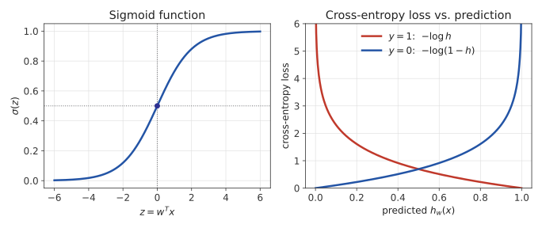

# Chapter 2. 회귀 모델: 선형회귀와 로지스틱회귀 (Regression Models: Linear & Logistic)

1805년, 수학자 아드리앵마리 르장드르(Adrien-Marie Legendre)는 혜성 궤도를 관측
데이터에 가장 잘 맞추는 방법을 고민하고 있었다. 관측은 항상 오차가 섞여 있으니, 모든
점을 정확히 지나는 곡선이 아니라 전체적으로 가장 잘 들어맞는 곡선이 필요했다. 그가
제안한 답 — **오차 제곱의 합을 최소화하는 직선을 찾는다** — 은 최소제곱법(least
squares)이라는 이름으로, 지금도 스프레드시트의 추세선부터 대규모 추천 시스템까지
곳곳에서 그대로 쓰인다. 180년 뒤, 벨기에 수학자 페르휠스트가 인구 증가를 설명하려고
만든 S자 곡선("로지스틱" 곡선)은 "이 이메일이 스팸일 확률은 몇 퍼센트인가" 같은
완전히 다른 문제에 그대로 쓰이게 된다. 이번 장은 이 둘을 한 이야기로 묶어서 다룬다 —
**같은 선형모델 \\(w^Tx\\)에, 출력을 다르게 해석하고 손실함수만 바꾸면 회귀와
분류가 된다.**

## 2.1 선형회귀: 모델

선형회귀는 입력 \\(x = (x_1, \ldots, x_n)\\)에서 출력을 다음과 같이 예측한다:

\\[h_w(x) = w_0 + w_1 x_1 + w_2 x_2 + \cdots + w_n x_n\\]

\\(w_0\\)은 절편(bias), \\(w_1, \ldots, w_n\\)은 각 특징의 가중치(weight)다.
표기를 간단히 하기 위해 \\(x_0 = 1\\)을 항상 추가해서 \\(h_w(x) = w^Tx =
\sum_{j=0}^n w_j x_j\\)로 쓴다 — bias까지 하나의 내적으로 통일하는 표기다.

## 2.2 비용함수: 평균제곱오차

\\(m\\)개의 학습 데이터 \\((x^{(i)}, y^{(i)})\\)에 대해, 모델이 얼마나 틀렸는지를
다음으로 정의한다:

\\[J(w) = \frac{1}{2m}\sum_{i=1}^m \left(h_w(x^{(i)}) - y^{(i)}\right)^2\\]

왜 오차를 제곱해서 더하는가? 오차를 그냥 더하면 양수 오차와 음수 오차가 서로
상쇄돼서, 엉망인 모델도 "평균 오차 0"이 나올 수 있다. 절댓값을 쓰면 상쇄는 막지만
미분이 불연속이라 최적화가 까다롭다. 제곱은 두 문제를 동시에 해결한다: 항상
양수이고, 매끄럽게 미분 가능하다. 앞의 \\(\frac{1}{2}\\)는 나중에 미분할 때 제곱의
지수 2와 상쇄돼서 식이 깔끔해지도록 넣은 관례적 상수이며, 최솟값의 위치 자체는
바뀌지 않는다.

## 2.3 경사하강법 (Gradient Descent)

\\(J(w)\\)를 최소화하는 \\(w\\)를 찾기 위해, 그래디언트(gradient, 가장 가파르게
증가하는 방향)의 **반대** 방향으로 조금씩 이동한다:

\\[w_j \leftarrow w_j - \alpha \frac{\partial J}{\partial w_j}, \qquad
\frac{\partial J}{\partial w_j} = \frac{1}{m}\sum_{i=1}^m \left(h_w(x^{(i)}) -
y^{(i)}\right) x_j^{(i)}\\]

\\(\alpha\\)는 **학습률(learning rate)** — 한 걸음의 크기다. 모든 \\(w_j\\)를
동시에 업데이트하는 이 과정을 손실이 충분히 작아질 때까지(또는 정해진 반복 횟수만큼)
반복한다.

```python
def gradient_descent(X, y, alpha, epochs):
    m, n = len(X), len(X[0])
    w = [0.0] * (n + 1)  # w[0]=bias
    for _ in range(epochs):
        grad = [0.0] * (n + 1)
        for i in range(m):
            pred = w[0] + sum(w[j+1] * X[i][j] for j in range(n))
            error = pred - y[i]
            grad[0] += error
            for j in range(n):
                grad[j+1] += error * X[i][j]
        for j in range(n + 1):
            w[j] -= alpha * grad[j] / m
    return w
```

**학습률의 함정**: \\(\alpha\\)가 너무 작으면 수렴이 느리다. \\(\alpha\\)가 너무
크면 최솟값 근처에서 오히려 튕겨 나가 발산할 수 있다 — 골짜기 바닥으로 가려다가
걸음이 너무 커서 반대편 벽으로 넘어가 버리는 것과 같다.

## 2.4 정규방정식: 미분으로 한 번에 풀기

\\(J(w)\\)는 \\(w\\)에 대한 이차함수이므로, 경사하강법 없이 미분을 0으로 놓아
**닫힌 형태**(closed-form)로 최적해를 구할 수도 있다:

\\[w^* = (X^TX)^{-1}X^Ty\\]

여기서 \\(X\\)는 각 행이 \\(x^{(i)}\\)(bias 포함)인 \\(m \times (n+1)\\) 행렬이다.
이 유도는 이번 장 연습문제의 핵심이다.

**경사하강법 대 정규방정식**: 정규방정식은 반복이 필요 없어 정확하지만,
\\((X^TX)^{-1}\\) 계산은 특징 개수 \\(n\\)의 세제곱에 비례하는 비용이 든다 —
\\(n\\)이 수천~수만이 되는 실전 문제에서는 감당이 안 된다. 반면 경사하강법은
\\(n\\)이 커져도 매 반복의 비용이 선형으로만 늘어난다. 특징이 적을 땐 정규방정식,
많을 땐 경사하강법을 쓰는 이유다.

## 2.5 회귀에서 분류로

여기서부터는 같은 선형모델을 **분류**에 쓴다. 로지스틱회귀라는 이름 때문에
헷갈리기 쉽지만, 이건 회귀가 아니라 **분류** 알고리즘이다. 선형회귀의 출력
\\(w^Tx\\)는 \\(-\infty\\)부터 \\(+\infty\\)까지 아무 값이나 될 수 있는데,
"스팸일 확률"은 반드시 0과 1 사이여야 한다. 로지스틱함수(시그모이드)는 정확히
이 변환을 해준다:

\\[\sigma(z) = \frac{1}{1+e^{-z}}\\]

\\(z \to +\infty\\)이면 \\(\sigma(z) \to 1\\), \\(z \to -\infty\\)이면
\\(\sigma(z) \to 0\\), \\(z=0\\)이면 \\(\sigma(0)=0.5\\)다. 어떤 실수든 이
함수를 통과하면 0~1 사이의 값이 되므로, "확률"로 해석할 수 있다.

\\[h_w(x) = \sigma(w^Tx) = \frac{1}{1+e^{-w^Tx}}\\]

\\(h_w(x)\\)는 "\\(x\\)가 양성 클래스(class 1)일 확률"로 해석한다. 예측은
\\(h_w(x) \ge 0.5\\)면 클래스 1, 아니면 클래스 0으로 정한다 — \\(h_w(x)=0.5\\)는
정확히 \\(w^Tx=0\\)인 지점이므로, 결정 경계(decision boundary)는 여전히
**직선**(또는 초평면)이다.

## 2.6 손실함수: 섀넌의 정보이론에서 교차 엔트로피까지

시그모이드에 평균제곱오차를 그대로 적용하면 \\(J(w)\\)가 \\(w\\)에 대해
**볼록하지 않아(non-convex)**, 경사하강법이 지역 최솟값(local minimum)에 갇힐
위험이 있다. 대신 **교차 엔트로피**(cross-entropy) 손실을 쓴다 — 이 이름은
1948년 클로드 섀넌(Claude Shannon)이 만든 **정보이론**(information theory)에서
왔다.

섀넌은 "정보량"을 수학적으로 재는 법을 고민했다. 확률 \\(p\\)로 일어나는 사건이
실제로 일어났다는 소식에는 얼마만큼의 "놀라움"(정보량)이 담겨 있을까? 섀넌은
이걸 \\(-\log_2 p\\)(단위: 비트)로 정의했다 — 자주 일어나는 사건(\\(p\\)가
1에 가까움)은 "해가 동쪽에서 떴다"처럼 정보량이 거의 0이고, 거의 안 일어나는
사건(\\(p\\)가 0에 가까움)은 "복권에 당첨됐다"처럼 정보량이 크다.

이 정보량의 **기댓값**이 **엔트로피**(entropy)다:

\\[H(p) = -\sum_k p_k \log_2 p_k\\]

확률분포 \\(p\\)를 따르는 사건들을 평균적으로 관찰할 때 얻는 정보량이자,
이 분포를 최적으로 부호화(encoding)하는 데 필요한 평균 비트 수다(Chapter
6.1에서 결정트리가 "가장 잘 나누는 질문"을 고르는 기준으로 다시 만난다).

그런데 만약 실제 분포는 \\(p\\)인데, (어쩌면 틀린) 다른 분포 \\(q\\)를 믿고
부호화한다면 몇 비트가 필요할까? 그 평균 비트 수가 **교차 엔트로피**다:

\\[H(p, q) = -\sum_k p_k \log_2 q_k\\]

\\(q\\)가 \\(p\\)와 정확히 같으면 \\(H(p,q) = H(p)\\)로 **최솟값**을 갖고,
\\(q\\)가 \\(p\\)에서 멀어질수록(즉 잘못된 분포를 믿을수록) \\(H(p,q)\\)는
커진다 — 그 초과분 \\(H(p,q) - H(p)\\)를 **KL 발산**(KL divergence,
\\(D_{KL}(p\|q)\\))이라 부른다(ML2 Chapter 10, VAE의 ELBO에서 다시 만난다).

로지스틱회귀에서 정답 \\(y^{(i)}\\)는 "정답 분포"(클래스 1일 확률이 100%
아니면 0%인 분포)이고, \\(h_w(x^{(i)})\\)는 모델이 예측한 분포다. **교차
엔트로피를 최소화한다는 것은 곧 모델의 예측 분포를 정답 분포에 최대한
가깝게 만든다는 뜻**이다 — 이게 바로 손실함수로 쓸 이유다:

\\[J(w) = -\frac{1}{m}\sum_{i=1}^m \left[y^{(i)}\log h_w(x^{(i)}) +
(1-y^{(i)}) \log(1-h_w(x^{(i)}))\right]\\]

(머신러닝에서는 보통 \\(\log_2\\) 대신 자연로그 \\(\log = \ln\\)을 쓴다 —
둘은 상수배(\\(1/\ln 2\\))만 차이나서, 손실이 최소가 되는 지점 \\(w\\)에는
영향을 주지 않는다.)



직관: 정답이 \\(y=1\\)인데 모델이 \\(h_w(x) \to 0\\)으로 확신하면
\\(-\log h_w(x) \to \infty\\) — 손실이 무한히 커진다. **확신을 갖고 틀리면
그만큼 크게 벌한다.** 신기하게도 이 손실함수를 미분하면 2.3절의 선형회귀와
**똑같은 형태**의 그래디언트가 나온다:

\\[\frac{\partial J}{\partial w_j} = \frac{1}{m}\sum_{i=1}^m \left(h_w(x^{(i)}) - y^{(i)}\right) x_j^{(i)}\\]

그래서 경사하강법 구현 코드 자체는 2.3절과 거의 동일하다 — \\(h_w\\)를
계산하는 부분에 시그모이드만 추가하면 된다.

```python
import math

def sigmoid(z):
    return 1 / (1 + math.exp(-z))

def logistic_gradient_descent(X, y, alpha, epochs):
    m, n = len(X), len(X[0])
    w = [0.0] * (n + 1)
    for _ in range(epochs):
        grad = [0.0] * (n + 1)
        for i in range(m):
            pred = sigmoid(w[0] + sum(w[j+1] * X[i][j] for j in range(n)))
            error = pred - y[i]
            grad[0] += error
            for j in range(n):
                grad[j+1] += error * X[i][j]
        for j in range(n + 1):
            w[j] -= alpha * grad[j] / m
    return w
```

## 2.7 "정확도"만으로는 안 되는 이유

암 검진 모델을 상상해보자. 전체 환자의 99%가 정상이라면, "무조건 정상"이라고만
찍는 모델도 정확도(accuracy) 99%를 자랑한다 — 하지만 이 모델은 암 환자를 단 한
명도 잡아내지 못하는, 쓸모없는 모델이다. Precision/Recall/F1은 바로 이런
상황(클래스 불균형)에서 정확도가 숨기는 진실을 드러내기 위한 지표다.

| 실제\\예측 | 양성 예측 | 음성 예측 |
|---|---|---|
| 실제 양성 | True Positive (TP) | False Negative (FN) |
| 실제 음성 | False Positive (FP) | True Negative (TN) |

- **Precision** \\(= \frac{TP}{TP+FP}\\): "양성이라고 예측한 것 중 진짜 양성
  비율" — 거짓 경보를 얼마나 피했는가.
- **Recall** \\(= \frac{TP}{TP+FN}\\): "실제 양성 중 잡아낸 비율" — 놓친 양성이
  얼마나 적은가.
- **F1** \\(= \frac{2 \cdot \text{Precision} \cdot \text{Recall}}{\text{Precision} + \text{Recall}}\\):
  Precision과 Recall의 조화평균 — 둘 다 낮으면 F1도 낮아지도록, 한쪽만
  높다고 점수를 후하게 주지 않는다.

**Precision-Recall 트레이드오프**: 임계값(threshold)을 0.5가 아니라 0.9로
올리면 Precision은 오르지만(확신 있을 때만 양성 판정) Recall은
떨어진다(애매한 양성을 놓침). 반대로 임계값을 낮추면 Recall은 오르고
Precision은 떨어진다. **PR-AUC**(Precision-Recall 곡선 아래 면적)는 이
트레이드오프 전 구간에서의 성능을 임계값 하나에 의존하지 않고 요약한 지표다 —
특히 클래스 불균형이 심할 때 accuracy보다 훨씬 신뢰할 수 있는 지표다.

**선형회귀와 로지스틱회귀는 겉보기엔 다른 문제(숫자 예측 vs. 확률 예측)를
풀지만, 뜯어보면 "선형모델 → 손실함수 정의 → 경사하강법으로 최소화"라는
완전히 같은 파이프라인이다 — 이 패턴은 이번 학기 내내 반복된다.**

---

## 연습문제

**1. (코딩)** 위 `gradient_descent`(핵심 줄 4개는 빈칸으로 남겨져 있다고 가정)를
완성하라:

```python
def gradient_descent(X, y, alpha, epochs):
    # ADD ADDITIONAL CODE HERE!!
    # 초기화: w를 0벡터로, bias 포함하여 길이 len(X[0])+1

    for epoch in range(epochs):
        # ADD ADDITIONAL CODE HERE!!
        # 예측값 계산 h_w(x) = w^T x, 그래디언트 계산, w 갱신

X = [[1.0], [2.0], [3.0], [4.0]]
y = [3.0, 5.0, 7.0, 9.0]
print(gradient_descent(X, y, alpha=0.01, epochs=1000))  # 대략 [1.0, 2.0]
```

**2. (손유도, Tier A — 자유 유도)** 선형회귀의 비용함수 \\(J(w) =
\frac{1}{2m}\|Xw - y\|^2\\)을 \\(w\\)에 대해 미분하여 0으로 놓고,

\\[w^* = (X^TX)^{-1}X^Ty\\]

가 되는 과정을 **처음부터 끝까지 손으로 유도**하라. (힌트: \\(\nabla_w \|Xw-y\|^2
= 2X^T(Xw-y)\\)임을 먼저 보인 뒤, 이를 0으로 놓고 \\(w\\)에 대해 정리한다.)
유도한 \\(w^*\\)가 실제로 \\(J(w)\\)의 **전역 최솟값**임을(Hessian이 양의
준정부호 행렬임을 보이는 방식으로) 논증하라.

**3. (코딩)** 위 `logistic_gradient_descent`(핵심 줄은 빈칸으로 남겨져 있다고
가정)와, 다음 `precision_recall_f1`을 완성하라:

```python
def precision_recall_f1(y_true, y_pred):
    # ADD ADDITIONAL CODE HERE!!
    # TP, FP, FN을 센 뒤 precision, recall, f1 계산
    # (0으로 나누는 경우는 각 값을 0.0으로 처리)

y_true = [1, 1, 1, 0, 0, 0, 1, 0]
y_pred = [1, 0, 1, 0, 1, 0, 1, 0]
print(precision_recall_f1(y_true, y_pred))  # (0.75, 0.75, 0.75)
```

**4. (손유도, Tier B — 힌트 제공)** 교차 엔트로피 손실 하나의 샘플에 대해:

\\[J^{(i)}(w) = -y^{(i)}\log h_w(x^{(i)}) - (1-y^{(i)})\log(1-h_w(x^{(i)}))\\]

를 \\(w_j\\)로 미분해서 \\(\frac{\partial J^{(i)}}{\partial w_j} =
(h_w(x^{(i)}) - y^{(i)})x_j^{(i)}\\)가 됨을 유도하라.

**힌트**(연쇄법칙을 세 단계로 나눠서 적용): (1) 먼저 \\(\frac{\partial
J^{(i)}}{\partial h}\\)를 구하라(h는 \\(h_w(x^{(i)})\\)의 줄임 표기,
\\(\frac{d}{dh}\log h = \frac{1}{h}\\)임을 이용). (2) \\(\sigma'(z) =
\sigma(z)(1-\sigma(z))\\)임을 이용해 \\(\frac{\partial h}{\partial z}\\)를
구하라(\\(z=w^Tx^{(i)}\\)). (3) \\(\frac{\partial z}{\partial w_j} =
x_j^{(i)}\\)임을 이용해 세 조각을 연쇄법칙으로 곱하면, 놀랍게도
\\(h(1-h)\\) 항이 통째로 약분되어 사라진다 — 왜 그런지 확인하라. 유도한
결과가 2.3절의 선형회귀 그래디언트와 형태가 똑같다는 것도 확인하라.
