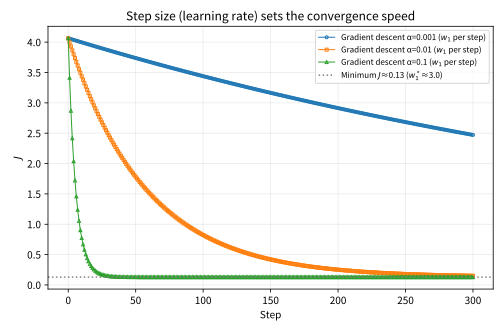
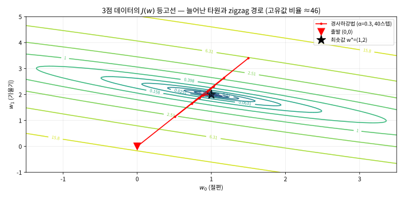
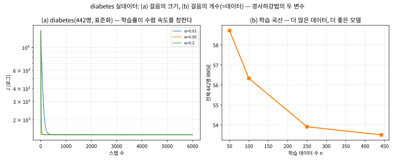

# 2.1 선형회귀: 모델, 비용함수, 경사하강법

[](https://colab.research.google.com/github/SuminHan/book-ml/blob/main/notebooks/ml1/chapter02_1_linear_regression_gd.ipynb)

이 절에서는 이 학기의 **첫 완전한 알고리즘** — 선형회귀(linear regression)와, 최적화의 기본
동력인 **경사하강법**(gradient descent)을 만난다. 알고리즘의 뼈대는 항상 같은 세 부류로
나뉘고, 이 틀은 학기 내내 이름만 바꿔 반복된다:

1. **모델** — 입력을 출력으로 매핑하는 함수의 *형태*
2. **비용함수**(loss function) — 모델이 "얼마나 틀렸는지"를 숫자로 재는 재
3. **최적화 알고리즘** — 모델의 파라미터를 그 숫자가 줄어드는 방향으로 바꾸는 방법

이 셋이 모여야 비로소 "알고리즘"이 된다. 그래서 이 절의 순서도 이 세 부류를 따라가고,
그 사이사이에는 이 셋이 "정말로 동작하는지"를 확인하기 위한 작은 수치 실험이 들어간다 —
모든 실험은 손으로, 또는 몇 줄의 코드로 재현할 수 있는 크기로 고른 것이다.

### 모델: 특징의 가중합

선형회귀는 입력 \\(x = (x\_1, \ldots, x\_n)\\)에서 출력을 다음과 같이 예측한다:

\\[h\_w(x) = w\_0 + w\_1 x\_1 + w\_2 x\_2 + \cdots + w\_n x\_n\\]

\\(w\_0\\)은 절편(bias), \\(w\_1, \ldots, w\_n\\)은 각 특징의 가중치(weight)다.
표기를 간단히 하기 위해 \\(x\_0 = 1\\)을 항상 추가해서 \\(h\_w(x) = w^Tx =
\sum\_{j=0}^n w\_j x\_j\\)로 쓴다 — bias까지 하나의 내적으로 통일하는 표기다.

### 파라미터는 어떻게 정해지는가: "직선을 맞추는" 작업

모델 \\(h\_w(x) = w^Tx\\)에서 우리가 조절할 수 있는 것은 \\(w = (w\_0, \ldots, w\_n)\\)
뿐이다. 학습 알고리즘의 임무는 정확히 **학습 데이터 \\((x^{(i)}, y^{(i)})\\)에 대해
예측값 \\(h\_w(x^{(i)})\\)가 실제 출력 \\(y^{(i)}\\)에 가깝게 되는 \\(w\\) 값을
찾는 것**이다. 특징이 하나뿐인 경우(\\(n=1\\))를 생각해보면 이 임무는
\\(x\\)-\\(y\\) 평면에서 \\(h\_w(x) = w\_0 + w\_1 x\\) — 곧 **직선** — 이므로,
임무는 평면 위에 있는 무수히 많은 직선 중 **데이터 점들에 가장 잘 들어맞는 한 줄**을
찾는 **맞춤(fitting)** 작업이 된다.

"가깝다"가 무엇인지 작은 예로 감각을 잡자. 데이터 (1, 3.2), (2, 5.1), (3, 6.8)이
참값 \\(y = 2x + 1\\) 직선에 소량의 잡음이 섞인 것이라 하자. 직선 \\(w = (1, 2)\\)
(참직선)는 예측 3, 5, 7을 주어 오차가 0.2, 0.1, −0.2다. 반면 직선
\\(w = (0, 2)\\)는 예측 2, 4, 6으로 오차가 1.2, 1.1, 0.8 — 전부 훨씬 크다. 둘 다
"직선"이지만 하나는 데이터에 "잘" 들어맞고 하나는 "잘못" 들어맞는다 — 둘을 가르는
것은 오차의 **숫자 크기**뿐이다.

여기서 짚고 갈 것이 하나 있다. "가장 잘"이라는 말은 데이터가 스스로 알려주는 것이
아니라, **"얼마나 틀린지를 어떤 숫자로 재느냐"를 먼저 정의한 다음에야** 뜻이 생긴다.
다음 절의 비용함수가 부수 주제가 아니라 알고리즘의 진짜 출발점인 이유가 바로 이것이다.
(이 절 말미의 가우스와 세레스(Ceres) 일화에서, "잡음 섞인 소량의 관측에 가장 잘
맞추는 곡선은 뭔가"라는 이 실용적 질문이 최소제곱법을 태동시켰는지를 확인한다.)

### 비용함수: 평균제곱오차

\\(m\\)개의 학습 데이터 \\((x^{(i)}, y^{(i)})\\)에 대해, 모델이 얼마나 틀렸는지를
다음으로 정의한다:

\\[J(w) = \frac{1}{2m}\sum\_{i=1}^m \left(h\_w(x^{(i)}) - y^{(i)}\right)^2\\]

왜 오차를 제곱해서 더하는가? 오차를 그냥 더하면 양수 오차와 음수 오차가 서로
상쇄돼서, 엉망인 모델도 "평균 오차 0"이 나올 수 있다. 절댓값을 쓰면 상쇄는 막지만
미분이 불연속이라 최적화가 까다롭다. 제곱은 두 문제를 동시에 해결한다: 항상
양수이고, 매끄럽게 미분 가능하다. 앞의 \\(\frac{1}{2}\\)는 나중에 미분할 때 제곱의
지수 2와 상쇄돼서 식이 깔끔해지도록 넣은 관례적 상수이며, 최솟값의 위치 자체는
바뀌지 않는다.

#### 비용이 파라미터에 대해 볼록한 이유

\\(J(w)\\)에는 뒤에서 계속 쓸 중요한 성질이 하나 더 있다: \\(J\\)는 \\(w\\)에
대해 **이차함수**(quadratic)다. 제곱을 전개해보면 \\(J\\)는
\\(w\_j w\_k\\) 형태(2차), \\(w\_j\\) 형태(1차), 상수의 합으로만 이루어진다.
왜 이게 중요한가? 이차함수의 "볼록함수"(convex) 여부는 **헤시안**(Hessian,
2차 편미분 행렬)이 양정치인지 하나의 계산으로 판정되는데, 이 \\(J\\)의 헤시안은

\\[\frac{\partial^2 J}{\partial w \partial w^T} = \frac{1}{m} X^TX\\]

— 즉 bias 열을 붙인 데이터 행렬 \\(X\\)의 \\(X^TX\\)에 비례한다. 이 장난감
데이터(\\(X=[1,2,3]\\), bias 열 포함)에서는

\\[\frac{1}{3}\begin{bmatrix}3 & 6\\\\6 & 14\end{bmatrix} =
\begin{bmatrix}1 & 2\\\\2 & 14/3\end{bmatrix}\\]

이고, 이 행렬의 두 고유값(\\(\approx 0.120\\), \\(\approx 5.547\\))이 모두 양수이므로
\\(J\\)는 **엄밀히 볼록(strictly convex)** 하다. 볼록 이차함수는 매끄러운 U자
그릇 모양이므로 **지역 최솟값이 없다** — 전역 최솟값이 정확히 하나 있고,
경사하강법은 어디서 출발하든 그 점에 도달한다. (이 "볼록 → 지역최솟값 없음"이
마지막 "자주 묻는 질문"의 첫 Q에 대한 정확한 답이며, 이 절의 학습을 걱정 없이
경사하강법만으로 할 수 있는 이유다. Chapter 9에서 손실이 비볼록해지면 이 성질이
사라지고, 그때 경사하강법은 보조 장치가 많이 붙는다.)

두 번째 고유값과 첫 번째 고유값의 비율, \\(5.547 / 0.120 \approx 46\\), 에도
눈을 주자. 기하학적 뜻은 이렇다: \\(J(w)\\)의 골짜기 단면이 두 고유방향으로
**약 46:1로 늘어진 타원**이라는 뜻이다. 이 "늘어짐"을 2.2절에서 **조건수**
(condition number)라고 이름 붙이고, (a) 경사하강법 경로가 얼마나
zigzag하는지, (b) 특징의 스케일을 바꾸면 안전한 학습률 범위가 얼마나 달라지는지를
바로 이 숫자로 재게 된다.

### 경사하강법 (Gradient Descent)

\\(J(w)\\)를 최소화하는 \\(w\\)를 찾기 위해, 그래디언트(gradient, 가장 가파르게
증가하는 방향)의 **반대** 방향으로 조금씩 이동한다:

\\[w\_j \leftarrow w\_j - \alpha \frac{\partial J}{\partial w\_j}, \qquad
\frac{\partial J}{\partial w\_j} = \frac{1}{m}\sum\_{i=1}^m \left(h\_w(x^{(i)}) -
y^{(i)}\right) x\_j^{(i)}\\]

\\(\alpha\\)는 **학습률(learning rate)** — 한 걸음의 크기다. 모든 \\(w\_j\\)를
동시에 업데이트하는 이 과정을 손실이 충분히 작아질 때까지(또는 정해진 반복 횟수만큼)
반복한다.

#### 업데이트는 왜 "동시"이고, 미분은 왜 그 모양인가

업데이트 수식에 두 개의 디테일이 숨어 있는데, 둘 다 "그냥 그렇게 쓰는 거다"로
넘어가면 코드를 쓸 때 실제로 부딪히는 함정이 된다.

**(1) 모든 \\(w\_j\\)를 "동시에" 업데이트해야 하는 이유.** \\(w\_0\\)를 먼저
업데이트한 뒤, 같은 스텝에서 \\(w\_1\\)를 업데이트할 때 *새* \\(w\_0\\)를 써서
그래디언트를 계산하면, "이동 전"과 "이동 후"에 계산된 그래디언트가 섞인 값으로
이동하는 셈이다 — 업데이트 방향이 더 이상 현재점에서의 \\(\nabla J\\)가 아니다.
볼록함수에서 "현재점의 경사 반대 방향으로 가면 확실히 내려간다"는 보장(아래 "학습률과
수렴 경계"에서 볼 수 있는)이 무너지는 것이다. 아래 순수 Python 코드에서
`grad[j]`를 전부 계산한 *다음*에 `w[j] -= ...`로 반영하는 **두 단계 구조**가 바로
이 동시 업데이트를 구현한 것이다.

**(2) \\(\partial J / \partial w\_j\\)가 그 합이 되는 이유.** 각 데이터점 \\(i\\)는
오차의 제곱 \\((h\_w(x^{(i)}) - y^{(i)})^2\\)을 \\(J\\)에 기여한다. 제곱의 미분에
연쇄법칙을 쓰면 2가 하나 나와서 \\(2(h\_w - y)\\)가 되고, 이 2는 \\(J\\) 앞의
\\(\frac{1}{2}\\)와 상쇄된다. 그리고 "이 오차가 \\(w\_j\\)를 움직이면 얼마나
바뀌는가" — \\(h\_w(x^{(i)}) = w\_0 + w\_1 x\_1 + \cdots + w\_n x\_n\\)을
\\(w\_j\\)로 미분하면 **\\(x\_j^{(i)}\\) 하나**가 남는다. 합치면, 데이터점 \\(i\\)의
\\(j\\)번 그래디언트 성분 기여는

\\[\left(h\_w(x^{(i)}) - y^{(i)}\right) \cdot x\_j^{(i)}\\]

— **그 데이터에서의 오차 × 해당 특징의 값**이다. 모든 데이터에 대해 이 기여를
평균한 것이 수식 전체다. 이 읽기를 실전 감각으로 번역하자면: **그래디언트는
"데이터점들의 불만 합**"이다. 오차가 큰 점은 큰 소리로 불평하고, 특징 값이 큰
점은 그 오차에 "더 책임"이 있으므로 \\(w\_j\\)를 더 크게 조정해야 한다는
불평을 한다. (2.3절 로지스틱회귀에서 이 패턴 — "오차 × 특징" — 이 시그모이드를
통과해도 그대로 살아남는 것을 확인한다. 지금 이 읽기를 확실히 해두면 그때
유도가 한 줄이 된다.)

```python
def gradient_descent(X, y, alpha, epochs):
    m, n = len(X), len(X[0])
    w = [0.0] * (n + 1)  # w[0]=bias
    for _ in range(epochs):
        grad = [0.0] * (n + 1)
        for i in range(m):
            pred = w[0] + sum(w[j+1] * X[i][j] for j in range(n))
            error = pred - y[i]
            grad[0] += error
            for j in range(n):
                grad[j+1] += error * X[i][j]
        for j in range(n + 1):
            w[j] -= alpha * grad[j] / m
    return w
```

#### 학습률과 수렴 경계: 경사하강법이 언제 발산하는가

본 절 말미의 "자주 하는 실수"는 학습률이 너무 크면 발산한다는 것을 *실험으로*
보여주지만, 선형회귀에서는 사실 **수렴과 발산의 경계값을 정확히 계산**할 수
있다. 이유는 \\(J\\)가 이차함수라서, 업데이트 \\(w \leftarrow w - \alpha \nabla J\\)
가 매 스텝마다 "현재점과 최솟값 \\(w^\*\\)의 오차"에 고정 행렬을 곱하는 선형
연산이기 때문이다:

\\[w^{(t+1)} - w^\* = \left(I - \frac{\alpha}{m} X^TX\right) (w^{(t)} - w^\*)\\]

(이 항등식의 증명은 2.2절에서 한다 — 여기서는 결과를 받아들이고 숫자를 본다.)
장난감 데이터에서 \\(\frac{1}{m}X^TX\\)의 고유값이 \\(\approx 0.120\\)과
\\(\approx 5.547\\)이므로, 매 스텝마다 오차가 고유방향별로
\\((1 - \alpha \cdot 0.120)\\)배와 \\((1 - \alpha \cdot 5.547)\\)배씩 곱해진다.
두 방향 모두 줄려면 \\(|1 - \alpha \cdot 5.547| < 1\\), 즉

\\[0 < \alpha < \frac{2}{5.547} \approx 0.361\\]

이어야 한다. 이 **단 하나의 숫자** \\(\alpha^\* \approx 0.361\\)가 지금까지
나온 학습률들의 운명을 결정한다:

| 학습률 \\(\alpha\\) | \\(\alpha / \alpha^\*\\) | 운명 |
|---|---|---|
| 0.1 | 0.28배 | 수렴 (조금 느리게) |
| 0.5 | 1.38배 | **발산** — 1.5보다 "조금 작은" 값이지만 |
| 1.5 | 4.2배 | 심각하게 발산 |

놀라운 결과: **\\(\alpha = 0.5\\)도 발산한다.** "발산한 1.5보다만 작으면 된다"는
직감이 틀린 것이다. 안전한 범위는 데이터 — 정확히 말해 \\(X^TX/m\\)의 고유값 — 가
전부 결정하고, 이것이 2.2절의 특징 스케일링이 "경사하강법의 걸음 수를 바꾸는
핵심 전처리"인 이유의 정량적 근거다.



**1D 단면: 걸음 크기가 속도를 정한다.** 비용의 1차원 단면(위 그림, 노트북 §5)
위에서 세 학습률의 경로를 겹쳐본다. 세 곡선은 같은 포물선 위의 같은 점에서
출발한다. \\(\alpha = 0.1\\)이 가장 빠르게 바닥에 닿고, \\(\alpha = 0.01\\)은
약 10배 느리다. \\(\alpha = 0.001\\)은 300스텝이 지나도 바닥에서 꽤 먼
채로 거의 움직이지 못했다. 1D 그림은 "속도"를 보여준다 — **학습률은 "가는
방향"이 아니라 "걸음 수"를 정하는 하이퍼파라미터**다.



**2D 지형: 경로는 왜 일직선이 아닌가.** 2차원 \\(J(w)\\) 지형(위 그림,
노트북 §6)은 "형상"을 보여준다. 등고선이 **늘어진 타원**인 이유는 앞선
고유값 비율(≈46)이 바로 그 타원의 축 비율이기 때문이다. 경사하강법은 매 스텝
"가장 가파르게 내려가는 방향"을 걷는데, 타원 등고선에서 그 방향은 골짜기
바닥(긴 축) 방향이 아니라 대각 방향이다 — 그래서 경로가 골짜기 바닥을
일직선으로 타지 못하고 짧은 축을 수직으로 오가며 **zigzag**한다. 등고선이
원형(두 고유값이 같을 때)에 가까우면 이 진동은 사라지고 경로가 직선에
가깝다. 2.2절이 이 "늘어짐"을 조건수로 정량화한다.

**10배 규칙.** 장난감 크기(3점)의 데이터로는 학습률 비교가 "발산/비발산"의
이분법으로만 보이지만, 실사용 크기의 데이터에서는 **느린 수렴**이 더 흔한
실패모드다. \\(y = 3x + 1 + \text{노이즈}(0, 0.5^2)\\)로 만든 300개 데이터에서
\\((0,0)\\) 출발로 경사하강법을 돌리면(노트북 §4), **소음 바닥**
\\(J\_{\text{floor}} = 0.1287\\)(이 데이터의 이론적 최소 비용 — 노이즈가
만들어낸, 어떤 직선도 더 낮출 수 없는 바닥)에 도달하는 데 걸리는 스텝은:

| 학습률 | 소음 바닥 도달 스텝 |
|---|---|
| \\(\alpha = 0.001\\) | 3000스텝 내 도달 불가 (최종 \\(J = 0.154\\), 바닥보다 20% 높음) |
| \\(\alpha = 0.01\\) | 489 |
| \\(\alpha = 0.1\\) | 47 |

학습률을 10배 올리면 수렴까지의 스텝 수도 약 10배 줄어든다 — 안전한 범위
(이 데이터의 경계는 \\(\alpha^\* \approx 1.98\\)) 안에서는 **학습률이 클수록
비례해서 빨리** 수렴한다. 따라서 실전 절차은 "작을수록 안전"이 아니라
**"비용 곡선이 매끄럽게 내려가는 가장 큰 학습률을 찾는 것**"이다. 경계는
데이터마다 다르지만(장난감: 0.361, 300개 데이터: 1.98), 이 절에서는
\\(\alpha^\* = 2/\lambda\_{\max}\\)로 계산하는 법을 이미 배웠다 — 2.2절에서는
이게 특징 스케일에 어떻게 흔들리는지 본다.

### 학습률의 함정: 너무 작은 값

\\(\alpha\\)가 너무 작으면 수렴이 느리다. 300개 데이터 위에서 \\(\alpha = 0.001\\)
은 3000스텝을 돌려도 소음 바닥까지 못 닿았다(위 표) — 발산하지는 않지만,
**"학습 중"이 아니라 "거의 멈춰 있는" 것과 구별하기 어려울 만큼 느리다**.
실전에서 비용 곡선이 거의 수평으로 뻗어 있다면 발산 문제 이전에 "학습률이
너무 작은 것"부터 의심해야 한다.

### 손으로 한 번: 경사하강법 세 스텝 직접 계산하기

수식이 실제로 숫자 위에서 어떻게 움직이는지 손으로 따라가보자. 아주 작은
데이터셋 \\(X=[1,2,3]\\), \\(y=[3,5,7]\\)(참값은 \\(y=2x+1\\))을 쓴다. 특징이
하나뿐이므로 \\(h\_w(x)=w\_0+w\_1x\\)이고, \\(w\_0=w\_1=0\\)에서 시작한다.

먼저 초기 비용을 계산하면:

\\[J(0,0) = \frac{1}{2\times3}\left[(0-3)^2+(0-5)^2+(0-7)^2\right] =
\frac{9+25+49}{6} = \frac{83}{6} \approx 13.83\\]

그래디언트는:

\\[\frac{\partial J}{\partial w\_0} = \frac{(-3)+(-5)+(-7)}{3} = -5, \qquad
\frac{\partial J}{\partial w\_1} = \frac{(-3)(1)+(-5)(2)+(-7)(3)}{3} =
\frac{-3-10-21}{3} \approx -11.33\\]

학습률 \\(\alpha=0.1\\)로 한 스텝 이동하면 \\(w\_0 \leftarrow 0-0.1\times(-5)=0.5\\),
\\(w\_1 \leftarrow 0-0.1\times(-11.33)\approx1.13\\)이 된다. 아래는 이 계산을
그대로 다섯 스텝까지 반복한 결과다(스크래치패드에서 실행 검증):

| 스텝 | \\(w\_0\\) | \\(w\_1\\) | \\(J(w)\\) |
|---|---|---|---|
| 0(초기) | 0.0000 | 0.0000 | 13.8333 |
| 1 | 0.5000 | 1.1333 | 2.7443 |
| 2 | 0.7233 | 1.6378 | 0.5448 |
| 3 | 0.8234 | 1.8621 | 0.1086 |
| 4 | 0.8687 | 1.9618 | 0.0221 |
| 5 | 0.8894 | 2.0059 | 0.0049 |

\\(w\_1\\)이 참값 2에, \\(w\_0\\)이 참값 1에 매 스텝 빠르게 가까워지고 비용이
단조 감소하는 것을 볼 수 있다 — "경사의 반대 방향으로 이동한다"는 말이
실제로 뜻하는 바가 이 표다.

### 자주 하는 실수: 학습률을 너무 크게 잡기

같은 데이터, 같은 초기값에서 학습률만 \\(\alpha=1.5\\)로 바꾸면 어떻게 될까?
직접 실행해보면:

```python
w0, w1 = 0.0, 0.0
alpha_big = 1.5
for i in range(1, 6):
    g0, g1 = grad(w0, w1, X, y)
    w0 -= alpha_big * g0
    w1 -= alpha_big * g1
    print(f"step {i}: w0={w0:.4f} w1={w1:.4f} cost={cost(w0, w1, X, y):.4f}")
```

```
step 1: w0=7.5000   w1=17.0000   cost=741.13
step 2: w0=-47.2500 w1=-107.5000 cost=39708.03
step 3: w0=353.6250 w1=803.7500  cost=2127480.20
step 4: w0=-2580.5625 w1=-5866.3750 cost=113986311.47
step 5: w0=18896.9062 w1=42956.9375 cost=6107168110.25
```

비용이 줄어들기는커녕 스텝마다 **자릿수가 계속 늘어나며 폭발**한다 — 걸음이
너무 커서 골짜기 바닥을 지나쳐 반대편 비탈로 튕겨 나가고, 다음 스텝엔 그
반대편에서 또 더 크게 튕겨 나가는 일이 반복되는 것이다. 실전에서 손실이
`NaN`이나 매우 큰 값으로 튀는 것을 보면, 가장 먼저 의심해야 할 것이 바로
학습률이다. 보통 \\(\alpha=0.1, 0.01, 0.001\\)처럼 10배씩 줄여가며 손실 곡선이
매끄럽게 내려가는 지점을 찾는다 — 이 "10배씩"이라는 경험칙이 임의가 아니라
데이터 특이적 경계값 \\(\alpha^\*\\)가 존재하기 때문인 것을, 앞의 "학습률과
수렴 경계"에서 이미 확인했다.

### 확인 문제: 학습률과 수렴

위 표에서 \\(\alpha=0.1\\)일 때는 비용이 매끄럽게 줄어들었고, \\(\alpha=1.5\\)일
때는 발산했다. 그렇다면 \\(\alpha=0.5\\) 정도라면 어떻게 될지 실행 전에 먼저
예상해보자 — 수렴하되 0.1보다 빠를지, 여전히 발산할지, 아니면 진동하다가
서서히 수렴할지. (힌트: 이 데이터셋에서 발산이 시작되는 정확한 경계값은
데이터의 스케일에 따라 달라진다 — 특징의 값이 훨씬 크거나 작아지면 같은
\\(\alpha\\)라도 안전한 범위가 달라진다는 점이, 2.2절 "정규방정식" 이후 배울
특징 스케일링이 중요한 이유 중 하나다.) 실제로 `alpha=0.5`를 코드에 넣고
5스텝을 돌려 표를 채워본 뒤, 예상과 비교해보라.

**정답**: \\(\alpha = 0.5 > \alpha^\* \approx 0.361\\)이므로 **발산**한다 —
1.5보다 "조금 작은" 값이어도 경계 밖이면 수렴하지 않는다. 5스텝 실행 결과:

| 스텝 | \\(w\_0\\) | \\(w\_1\\) | \\(J(w)\\) |
|---|---|---|---|
| 1 | 2.5000 | 5.6667 | 43.4954 |
| 2 | −1.9167 | −4.3889 | 136.7638 |
| 3 | 5.9306 | 13.4352 | 430.0336 |
| 4 | −7.9699 | −18.1775 | 1352.1803 |
| 5 | 16.6925 | 37.8732 | 4251.7440 |

\\(w\\)가 양수/음수로 **진동**하면서 크기는 계속 커진다 — "골짜기 바닥을
지나쳐 반대편으로 넘어간다"의 실제 모습. \\(\alpha=1.5\\)처럼 바로 크게
폭발하지 않고 느리게 발산하는 이 형태가 더 위험하다: 비용이 "줄어든 뒤
다시 올라가기 시작"하는 순간이 경계값을 넘은 신호다.

### 실데이터에서: diabetes 데이터셋과 학습 곡선

그동안 숫자 실험은 3개 데이터로 했지만, 실전 문제(특징 10개, 442명)에서
경사하강법이 어떤 모양으로 수렴하는지 확인한다. sklearn의 `load_diabetes`[^scikitlearn]
(당뇨 진행도 예측, 10개 신체 특징)[^diabetes]의 전체 442명을 쓰고, 모든 특징을
표준화한 뒤(2.2절 스케일링 섹션의 동기) 두 가지를 재본다(세부 코드는
노트북 §7):

1. **세 학습률의 비용 곡선** (\\(\alpha \in \\{0.01, 0.05, 0.2\\}\\)). 표준화
   후 \\((1/m)X^TX\\)의 최대 고유값이 \\(\lambda\_{\max} \approx 4.0\\)이므로
   경계는 \\(\alpha^\* = 2/\lambda\_{\max} \approx 0.50\\) — \\(\alpha=0.05\\)
  는 안정하고, 경계 안쪽인 \\(\alpha=0.2\\)도 발산하지 않는다. 초기 비용
   \\(J \approx 14537\\)에서 1000스텝 후 \\(J\\)는 1439 / 1435 / 1430,
   6000스텝 후 1433.9 / 1429.9 / 1429.9 — **학습률이 클수록 빠르게 바닥에
   붙고** "10배 규칙"이 실데이터에서도 대략 성립한다.

2. **학습 곡선(learning curve)** — 학습 데이터 크기 \\(n\\)을 줄여가며
   (\\(n = 50, 100, 250, 442\\)) 학습된 모델의 품질을 **전체 442명** 위에서
   RMSE로 잴 때: \\(58.7 \to 56.3 \to 53.9 \to 53.5\\). 데이터가 작을수록
   모델이 **나빠진다** — "배울 것이 적어서"다. 경사하강법의 수렴 스텝 수
   자체는 \\(n\\)에 따라 단조가 아니다(2869 → 912 → 2807 → 2405스텝) —
   이것은 "데이터가 적으면 빠르다"는 일반 법칙이 아니라, 소음 바닥의 크기
   자체가 \\(n\\)에 따라 달라지기 때문이다.
   (a)의 핵심은 모델의 품질이고, 스텝 수의 요동은 이 절에서는 그냥
   "관측"으로 남긴다.



**결과의 핵심 한 줄**: 전체 442명으로 학습한 경사하강법의 최종 RMSE 53.5는,
같은 데이터의 **정규방정식(닫힌 형태) 해의 RMSE와 일치**한다 — 2.2절에서
"경사하강법과 정규방정식은 같은 목적지"라고 할 때의 말이, 장난감 3점을
넘어 실데이터 위에서 검증된 셈이다. 3개 데이터의 장난감은 할 일을 다했다 —
이제 같은 모델과 최적화 도구로 "닫힌 형태의 답"(2.2절)과 "분류"(2.3절)로
나간다 [^cs229].

### 유명한 사례: 가우스와 사라진 소행성 세레스

이번 장 도입부에서 르장드르가 1805년에 최소제곱법을 **발표**했다고
소개했는데, 사실 이 방법을 먼저 **사용**한 사람은 따로 있었다. 1801년,
천문학자 피아치가 새로운 천체 세레스(Ceres)를 발견했지만, 관측한 지 얼마
안 돼 세레스가 태양 뒤로 가려지면서 궤도 계산에 필요한 관측치가 턱없이
부족해졌다. 당시 24세였던 가우스는 단 며칠치의 부정확한 관측 데이터만으로
세레스가 다시 나타날 위치를 예측했고, 그 예측은 실제로 정확히 들어맞았다.
가우스가 쓴 방법이 바로 오차 제곱합을 최소화하는 것 — 지금 우리가 이 절에서
배우는 바로 그 \\(J(w)\\)였다. 훗날 가우스와 르장드르 사이에 "누가 최소제곱법을
먼저 발명했는가"를 둘러싼 우선권 분쟁까지 벌어졌을 만큼, 이 아이디어는 처음
등장했을 때부터 실전에서 곧바로 위력을 증명한 방법이었다.

이 이야기와 "파라미터는 어떻게 정해지는가" 섹션의 연결고리를 다시 한 번
묶어두자. 세레스 문제에서 가우스가 직면한 것은 정확히 이 절의 형태였다 —
**관측(학습 데이터)이 참값(궤도)에 잡음을 섞인 것으로, 그 "얼마나 틀린
가"를 오차 제곱합으로 잴 때의 최선의 직선(궤도 매개변수)을 찾아야 한다**.
최소제곱법이 200년 넘게 쓰이는 이유는 "아름다워서"가 아니라, **이 구조의
문제가 실존 세계에 끊임없이 만들어지기 때문**이다.

### 자주 묻는 질문

**Q. 경사하강법이 지역 최솟값(local minimum)에 갇힐 수 있나요?** 이번 절의
\\(J(w)\\)(평균제곱오차)는 \\(w\\)에 대한 **볼록함수**(convex function)라서
지역 최솟값이 곧 전역 최솟값이다 — 어디서 출발하든 결국 같은 최적점으로
수렴한다. 지역 최솟값이 실제 골칫거리가 되는 건 Chapter 9의 신경망처럼
비볼록(non-convex) 손실함수를 쓸 때다.

**Q. 매 스텝 데이터 전체를 다 봐야 하나요?** 위 코드는 매 스텝마다 \\(m\\)개
데이터 전부로 그래디언트를 계산하는 **배치 경사하강법**(batch GD)이다.
데이터가 수백만 개면 스텝 하나조차 느려지는데, 실전에서는 데이터를 작은
묶음(mini-batch)으로 나눠 매 스텝 그 일부만 보고 이동하는 **확률적 경사하강법**
(SGD)[^sgd]을 훨씬 더 많이 쓴다 — 신경망을 다루는 Chapter 9에서 이 변형들을
자세히 다룬다.

**Q. 학습률은 실전에서 어떻게 정하나요?** 선형회귀처럼 \\(J\\)가 이차함수
이면 이 절의 공식 — 안전한 범위는 \\(0 < \alpha < 2/\lambda\_{\max}\\)(여기서
\\(\lambda\_{\max}\\)는 \\((1/m)X^TX\\)의 최대 고유값) — 로 정량적으로 알
수 있다. 신경망처럼 손실이 이차함수가 아니면 이런 공식이 없으므로, 보통
\\(\alpha = 0.1\\)~\\(0.01\\)에서 시작해 비용 곡선을 보고 조절한다:
매끄럽게 내려가면 더 큰 값으로, 흔들리거나 발산하면 10배 줄인다. 또한
파라미터마다 학습률을 자동으로 조절하는 **적응형 학습률 알고리즘**(SGD의
변형, Adam[^adam] 등)이 실전의 표준 — Chapter 9에서 다룬다.

**Q. `gradient_descent` 코드의 `w = [0.0] * (n + 1)`처럼 0에서 시작하는 것은
반드시 필요한가?** 아니요. 볼록함수라면 **어디서 시작하든** 같은 최솟값에
도달한다(FAQ 첫 Q). 0에서 시작하는 것은 관례일 뿐이다. 다만 초기값이
최솟값에서 너무 멀면 걸어야 할 스텝 수가 늘어나므로, 특징을 표준화하는 등
초기값과 최솟값의 스케일을 가깝게 만들어주는 전처리가 실용적이다(2.2절).

[^scikitlearn]: Pedregosa, F. et al. (2012). "Scikit-learn: Machine Learning in Python." arXiv:1201.0490.
[^diabetes]: scikit-learn `load_diabetes` 데이터 — 442명의 환자, 10개 임상 특징, 1년 후 당뇨 진행도를 나타내는 회귀 목표값.
[^adam]: Kingma, D. P., Ba, J. (2014). "Adam: A Method for Stochastic Optimization." arXiv:1412.6980.
[^cs229]: 더 깊이 보려면: Stanford CS229: Machine Learning, Lecture Notes. https://cs229.stanford.edu/main_notes.pdf — 이 절의 선형회귀 모델, 평균제곱오차와 경사하강법(수렴 경계 포함)은 CS229 강의 노트의 Linear Regression 단원과 직접 겹친다.
[^sgd]: Bottou, L., Curtis, F. E., Nocedal, J. (2016). "Optimization Methods for Large-Scale Machine Learning." arXiv:1606.04838.
