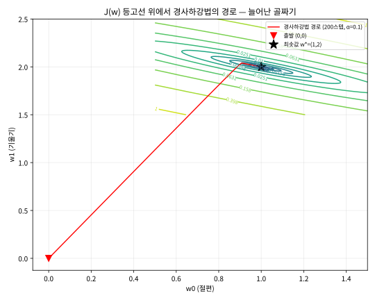

# 2.2 정규방정식과 "같은 모델, 다른 출력"이라는 다리

[](https://colab.research.google.com/github/SuminHan/book-ml/blob/main/notebooks/ml1/chapter02_2_normal_equations.ipynb)

### 정규방정식: 미분으로 한 번에 풀기

\\(J(w)\\)는 \\(w\\)에 대한 이차함수이므로, 경사하강법 없이 미분을 0으로 놓아
**닫힌 형태**(closed-form)로 최적해를 구할 수도 있다:

\\[w^\* = (X^TX)^{-1}X^Ty\\]

여기서 \\(X\\)는 각 행이 \\(x^{(i)}\\)(bias 포함)인 \\(m \times (n+1)\\) 행렬이다.
이 유도는 이번 장 연습문제의 핵심이다.

**경사하강법 대 정규방정식**: 정규방정식은 반복이 필요 없어 정확하지만,
\\((X^TX)^{-1}\\) 계산은 특징 개수 \\(n\\)의 세제곱에 비례하는 비용이 든다 —
\\(n\\)이 수천~수만이 되는 실전 문제에서는 감당이 안 된다. 반면 경사하강법은
\\(n\\)이 커져도 매 반복의 비용이 선형으로만 늘어난다. 특징이 적을 땐 정규방정식,
많을 땐 경사하강법을 쓰는 이유다.

### 손으로 한 번: 정규방정식으로 직접 풀어보기

2.1절에서 경사하강법으로 다섯 스텝 만에 \\(w\_0\approx0.89\\), \\(w\_1\approx2.01\\)에
근접했던 그 데이터셋 \\(X=[1,2,3]\\), \\(y=[3,5,7]\\)을 정규방정식으로 한 번에
풀어보자. bias 열을 추가한 행렬은:

\\[X = \begin{bmatrix}1 & 1\\\\1 & 2\\\\1 & 3\end{bmatrix}\\]

먼저 \\(X^TX\\)를 계산하면:

\\[X^TX = \begin{bmatrix}1&1&1\\\\1&2&3\end{bmatrix}
\begin{bmatrix}1&1\\\\1&2\\\\1&3\end{bmatrix} =
\begin{bmatrix}3&6\\\\6&14\end{bmatrix}\\]

이 \\(2\times2\\) 행렬의 역행렬은(\\(2\times2\\) 행렬 \\(\begin{bmatrix}a&b\\\\c&d\end{bmatrix}\\)의
역행렬 공식 \\(\frac{1}{ad-bc}\begin{bmatrix}d&-b\\\\-c&a\end{bmatrix}\\)를 그대로
적용하면 \\(ad-bc=3\times14-6\times6=42-36=6\\)이므로):

\\[(X^TX)^{-1} = \frac{1}{6}\begin{bmatrix}14&-6\\\\-6&3\end{bmatrix} =
\begin{bmatrix}2.333&-1\\\\-1&0.5\end{bmatrix}\\]

마지막으로 \\(X^Ty\\)를 구하고 곱하면:

\\[X^Ty = \begin{bmatrix}1&1&1\\\\1&2&3\end{bmatrix}\begin{bmatrix}3\\\\5\\\\7\end{bmatrix}
= \begin{bmatrix}15\\\\34\end{bmatrix}, \qquad
w^\* = \begin{bmatrix}2.333&-1\\\\-1&0.5\end{bmatrix}\begin{bmatrix}15\\\\34\end{bmatrix}
= \begin{bmatrix}1\\\\2\end{bmatrix}\\]

\\(w^\*=[1, 2]\\) — 정확히 데이터를 만들 때 쓴 참값 \\(y=2x+1\\)과 일치한다.
경사하강법은 다섯 스텝 만에 \\(0.89, 2.01\\)로 "근접"했을 뿐이지만, 정규방정식은
**단 한 번의 행렬 계산으로 정확히** 도달한다는 차이가 이 예시에서 분명하게
드러난다.

### 실습: numpy로 정규방정식 구현하고 경사하강법과 비교하기[^numpy]

```python
import numpy as np

X_raw = np.array([1.0, 2.0, 3.0])
y = np.array([3.0, 5.0, 7.0])
m = len(X_raw)
X = np.column_stack([np.ones(m), X_raw])  # bias 열 추가

w_star = np.linalg.inv(X.T @ X) @ X.T @ y
print("정규방정식 해:", w_star)            # [1. 2.]

# 경사하강법으로 충분히 오래(2000스텝) 돌리면 같은 값에 수렴하는지 확인
w0, w1, alpha = 0.0, 0.0, 0.1
for _ in range(2000):
    pred = w0 + w1 * X_raw
    err = pred - y
    w0 -= alpha * np.sum(err) / m
    w1 -= alpha * np.sum(err * X_raw) / m
print("GD(2000스텝):", w0, w1)             # 1.0, 2.0 (사실상 동일)
```

두 방법이 결국 같은 지점에 도달한다는 것은 우연이 아니다 — \\(J(w)\\)가
볼록함수라서 유일한 전역 최솟값을 가지므로, "미분해서 한 번에 푼다"와
"조금씩 내려간다"는 서로 다른 두 길이 같은 목적지로 이어지는 것뿐이다.

### 행렬로 다시 쓰기: 닫힌 형태 해는 미분이 아니라 "사영(projection)"

2.1절의 \\(J(w) = \frac{1}{2m}\sum\_i (h\_w(x^{(i)}) - y^{(i)})^2\\)은 벡터
\\(y = (y^{(1)}, \ldots, y^{(m)})^T\\)로 쓰면 행렬곱으로 깔끔하게
단축된다. 각 행이 bias 포함 \\(x^{(i)}\\)인 \\(X\\)를 쓰면:

\\[J(w) = \frac{1}{2m} \\|Xw - y\\|^2\\]

미분은 두 줄이다. 연쇄법칙(힌트는 연습문제 2에 있음)을 쓰면:

\\[\frac{\partial J}{\partial w} = \frac{1}{m} X^T(Xw - y)\\]

이를 \\(0\\)으로 놓고 \\(X^TXw = X^Ty\\)로 정리하면 \\(w^\* =
(X^TX)^{-1}X^Ty\\) — 즉 "정규방정식(normal equations)"이 나온다. \\((X^TX)\\)가
역행렬 가능한 조건은 다음 "자주 하는 실수"가 다룬다.

이 유도에서 정말 중요한 건 수식이 아니라 **최해의 기하학적 뜻**이다.
\\(Xw\\)는 어떤 \\(w\\)를 넣어도 **\\(X\\)의 열들이 펼치는 부분공간
(column space)** 안에만 살아 있다. "최소제곱으로 \\(y\\)에 가장 가까운
\\(Xw\\)"라는 것은, 이 부분공간 안에서 \\(y\\)에 가장 가까운 점 —
정확히 **\\(y\\)의 사영(projection)** — 을 찾는 것과 같다. 그리고
"가장 가까운 점"은 직각인 방향에서 찾을 수 있다: 최적점에서는 오차
벡터 \\(Xw^\* - y\\)가 \\(X\\)의 모든 열에 **수직**이다.

\\[X^T(Xw^\* - y) = 0\\]

이 한 줄이 **정규방정식 그 자체**다. \\(X^T\\)로 곱한다는 동작이
"모든 특징에 대해 수직이다"를 보장하는 것이므로, 정규방정식의 이름
"normal"(직각)은 이 수직성에서 온 것이다. "경사하강법으로 2000스텝을
내려가서 도착한 곳"과 "사영을 한 번에 계산한 곳"이 같은 점이 되는
이유도, 둘 다 이 수직 조건을 만족하는 점이 유일하기 때문이다.

### 왜 조건수(condition number)가 중요할까: "늘어난 골짜기"를 재는 숫자

경사하강법의 매 스텝은 \\(w \\leftarrow w - \alpha \nabla J\\)이고,
\\(J(w)\\)가 이차함수이므로 \\(\nabla J = \frac{1}{m}X^TX(w - w^\*)\\)다.
즉:

\\[w^{(t+1)} - w^\* = \left(I - \frac{\alpha}{m}X^TX\right)(w^{(t)} - w^\*)\\]

여기서 \\(I - \frac{\alpha}{m}X^TX\\)는 **오차를 줄여주는 곱셈 행렬**이다.
\\(X^TX\\)의 고유값이 \\(\lambda\_1 \le \lambda\_2 \\)이면(\\(2 \times 2\\)
행렬), 매 스텝마다 두 고유값 방향의 오차가 각각
\\((1 - \frac{\alpha \lambda\_i}{m})\\)배로 줄어든다. 수렴 속도는
**더 큰 고유값 방향** — \\(J(w)\\)의 등고선이 더 *늘어지는* 방향 — 을
재고, 이 "늘어짐"의 크기를 **조건수**(condition number)
\\(\kappa = \lambda\_{\max}/\lambda\_{\min}\\)라고 부른다.

이 데이터셋(\\(x=[1,2,3]\\))에서 \\(\kappa \approx 46.1\\)인데,
\\(100\\)개 데이터, \\(x \sim \text{정규분포}(0,1)\\) 같은 "균형 잡힌"
데이터에서는 \\(\kappa \approx 2\\)에 가깝다. 조건수가 46인 골짜기는
등고선이 타원이고 그 타원의 긴 축:짧은 축 비율이 약 46:1 — 경사하강법이
골짜기 바닥을 일직선으로 타는 게 아니라 **짧은 축 방향으로 진동
(zigzag)하며** 천천히 내려가는 이유가 바로 이 늘어난 등고선이다.

**스케일 10배가 조건수를 ~70배로 만들면**: 같은 데이터에 특징 스케일
\\(10\\)배로 바꾸면 — \\(x=[10,20,30]\\)으로, 참값 \\(y=0.2x+1\\)으로
직선은 같다 — \\(X^TX\\)의 조건수가 \\(46.1 \to 3278.7\\)으로
약 **71배** 커진다 (실습 노트북 §2). bias 열은 스케일링되지 않으므로
정확히 100배는 아니고, 두 고유값이 스케일에 따라 *다르게* 늘어나
비율이 바뀌기 때문이다. 조건수 3278이면 매 스텝 오차 감소율이
\\((\kappa-1)/(\kappa+1) \approx 0.9994\\) — 스텝마다 오차의 99.94%가
남아 **100스텝에도 오차의 약 \\(60\\%\\)가 남는다**. 반대로 조건수
\\(2\\)인 골짜기에서는 \\((\kappa-1)/(\kappa+1) = 0.333\\) — 100스텝이면
오차가 \\(10^{-48}\\)로 사라진다.

이것이 2.1절 "학습률의 함정"이 스케일에 민감하다는 것의 **정량적
용언**이다. 특징 스케일이 30배로 다르면, 같은 \\(\alpha\\)로
수렴하는 데 걸리는 스텝 수가 **수만 배**로 달라질 수 있다 —
특징 스케일링(Chapter 4에서 다시 만난다)이 "편의"가 아니라
**경사하강법의 걸음 수를 바꾸는 핵심 전처리**인 이유다.

### 특징 스케일링: 골짜기를 "둥근" 형태로 만든다

스케일링의 정밀한 효과는 실습 노트북 §3에서 확인한다. 참값
\\(y = 1.5\\,x + 20\\), 데이터 \\(x \in [50, 130]\\) 5개 — **같은
문제**에 스케일링만 차이가 있다.

- **raw 스케일** (\\(x = 50 \sim 130\\)): \\(X^TX\\)의 조건수
  \\(\approx 99033\\), 안정 학습률 \\(\alpha < 2/\lambda\_{\max}
  \approx 0.00022\\) 근처의 \\(\alpha = 0.0002\\)로 학습하면
  \\(J < 10^{-6}\\)가 되기까지 **464,595스텝**.
- **표준화** (\\((x - \mu)/\sigma\\)): 조건수 \\(\approx 1.0\\),
  안정 학습률 \\(\alpha < 2\\) 근처의 \\(\alpha = 0.5\\)로 학습하면
  **18스텝**.

스케일링 한 개가 학습 스텝을 약 **25,800배** 줄였다. 그런데 정규방정식은
두 경우 모두 한 번의 행렬 계산으로 정확히 \\((b=20, slope=1.5)\\)를
낸다(표준화 케이스는 \\(b = 155, slope\_s = 42.43\\)이 나와도,
스케일 변환으로 역변환하면 \\(slope = 42.43/\sigma = 1.5\\)가 된다).

**스케일링은 답을 바꾸는 게 아니라 경사하강법의 걸음 수를 바꾸는 것** —
이 구분이 이 절에서 꼭 잡아야 할 핵심이다. 정규방정식은 스케일링 여부와
무관하게 같은 답(단, 스케일이 바뀌면 계수 스케일도 같이 바뀜)을
주므로, "답이 바뀌어서" 스케일링을 하는 게 아니다.



위 등고선 그래프에서 빨간 경로는 \\((0,0)\\)에서 출발한 경사하강법
200스텝 경로다. 타원 등고선이 **\\(w\_0\\) 축으로 늘어난** 모양(이
데이터셋의 \\(\kappa \approx 46\\)에 대응)을 보면, 경사하강법이
골짜기 바닥을 일직선으로 타는 게 아니라 짧은 축 방향으로 진동하며
천천히 내려가는 이유가 선명하다. 조건수 46인 골짜기에서
\\((\kappa-1)/(\kappa+1) \approx 0.958\\) — 매 스텝 오차의 95.8%가
남으므로, 200스텝이 꽤 "느리게" 보이는 것은 이 수치에서 나온다.

### Gauss-Markov 정리: 최소제곱이 "최선"인 이유

최소제곱 해(정규방정식의 해)는 단순히 "편하게 풀 수 있는" 해가 아니라,
**특정 의미에서 최선의** 해다. 이 결과를 **Gauss-Markov 정리**라고
부른다 — 가우스(1821)가 먼저 증명했고, 마코프(Andrey Markov, 1905)가
일반적 형태로 다시 증명해 이름이 합쳐진 것이다:

> **Gauss-Markov 정리**: 선형모형 \\(y = Xw + \varepsilon\\)에서 오차
> \\(\varepsilon\\)의 기댓값이 0이고 분산이 균일(\\(\sigma^2\\)로
> 동일)하며 상호 독립이면, **최소제곱 추정치(OLS, 즉 정규방정식의 해)는
> 모든 선형 무편차 추정치 중 분산이 가장 작은 것**(BLUE — Best Linear
> Unbiased Estimator)이다.

"최선"의 기준은 **선형 무편차** 추정치라는 범주 안에서만 성립한다.
비선형 추정치나 편이 있는 추정치(Chapter 6의 정규화는 의도적으로
편이를 만들어 분산을 줄이는)는 이 정리의 대상이 아니다. 그러나 이
정리가 주는 실전 의미는 크다: **최소제곱 해가 "정답"이 아니라도,
"어느 선형 무편차 방법으로도 분산을 더 줄일 수는 없다"** 는
보장이므로, "왜 이 방법으로 풀까?"라는 질문에 "수학적으로 최선"이
라는 답을 할 수 있는 근거다.

#### 역사: 가우스가 정규방정식을 발견한 자리

2.1절의 "유명한 사례"에서 가우스가 1801년 소행성 세레스(Ceres)의
궤도를 최소제곱으로 예측한 이야기를 소개했다. 그런데 이 에피소드
뒤에는 **정규방정식 그 자체**의 발견이 있다. 가우스는 세레스의 궤도
문제를 풀 때 "관측 데이터 \\(y\\)가 \\(Xw\\)의 선형 결합에 오차
\\(\varepsilon\\)가 섞인 구조"를 인식하고, **\\(X^TX\\)가 대칭
행렬이고, 이 대칭 행렬을 풀어 \\(w^\*\\)를 구하는 과정**을
정식화했다 — 지금 우리가 이 절에서 쓰는 \\(w^\* = (X^TX)^{-1}X^Ty\\)다.

이것이 중요한 이유는, **최소제곱이라는 "손실함수"**와 **그를
최적화하는 "닫힌 형태 해"**가 **같은 시기에, 같은 문제에서
발견**되었다는 것이다. 손실함수만 있고 최적화 방법이 없으면
"어떤 값을 골라야 할지" 모르는 상황이 되는데, 가우스는 이 두 가지를
**하나의 체계**로 연결했다. 르장드르는 1805년에 최소제곱 *손실함수*
를 독립적으로 제안했고(가우스보다 4년 늦은 *발표*), 가우스는
1809년 『천체 궤도 이론』(Theoria Motuum Corporum Coelestium)에서
최소제곱 *해의 계산법*을 출판했다 — 둘 다 "최소제곱"을 쓰지만,
**르장드르는 손실함수(목표), 가우스는 최적해(수단)**를 먼저
정식화한 것이다. 이 구분은 이 학기 내내 반복된다: **손실함수를
정의하는 것**과 **그 손실함수를 최소화하는 알고리즘을
발견하는 것**은 분리될 수 있는 두 작업이고, 로지스틱회귀(2.3절)와
신경망(Chapter 9)에서는 이 둘이 **분리된다** — 교차 엔트로피
손실함수는 이차함수가 아니라서 닫힌 형태 해가 없고, 경사하강법이
*독립적으로* 발견된 알고리즘이 손실함수를 최소화한다.

### 자주 하는 실수: 특징이 겹쳐서 행렬이 특이(singular)해지는 경우

정규방정식은 \\((X^TX)^{-1}\\)이 **존재할 때만** 계산할 수 있다. 만약 두 번째
특징이 첫 번째 특징의 배수(예: "미터 단위 넓이"와 "제곱피트 단위 넓이"를
둘 다 특징으로 넣는 경우처럼 완전히 선형종속인 경우)라면 어떻게 될까?

```python
X2_raw = np.column_stack([X_raw, 2 * X_raw])   # 두 번째 특징 = 첫 번째의 2배
X2 = np.column_stack([np.ones(m), X2_raw])
print("det(X^T X) =", np.linalg.det(X2.T @ X2))   # 0.0
np.linalg.inv(X2.T @ X2)   # LinAlgError: Singular matrix
```

행렬식이 정확히 0이 되어 역행렬 계산 자체가 **에러로 실패**한다. 두 특징이
완전히 같은 정보를 중복해서 담고 있으면(다중공선성, multicollinearity), 그
정보가 \\(w\\)의 두 성분 중 어느 쪽에 얼마나 배분돼야 하는지를 수학적으로
결정할 방법이 없어지기 때문이다 — 무한히 많은 \\((w\_1, w\_2)\\) 조합이 똑같은
예측을 내놓을 수 있게 된다.

그렇다면 `inv` 대신 **유한한 값을 돌려주는** `np.linalg.pinv`
(**무어-펜로즈 준역행렬**, Moore-Penrose pseudoinverse)를 쓰면? 에러
없이 어떤 \\(w\\)를 돌려준다 — 그리고 그 해는 특별한 의미를 가진다.
위 예에서:

```python
w_pinv = np.linalg.pinv(X2.T @ X2) @ X2.T @ y
print(w_pinv)                 # [1.  0.4 0.8]
print(X2 @ w_pinv)            # [3. 5. 7.] — 데이터에 정확히 들어맞음

w_alt = np.array([1.0, 1.0, 0.5])   # 똑같은 예측을 내는 *다른* 해
print(X2 @ w_alt)                # [3. 5. 7.]
print("||w_pinv||^2 =", w_pinv @ w_pinv, "  ||w_alt||^2 =", w_alt @ w_alt)
# 1.8 vs 2.25
```

두 해 모두 세 데이터를 정확히 맞춰서 같은 예측을 내놓는데, `pinv`가 고른
해의 \\(\\|w\\|^2\\)가 더 작다. 사실 `pinv`는 무한히 많은 해 중 **\\(\\|w\\|^2\\)가
가장 작은 해**(최소범위 해, minimum-norm solution)를 골라준다 — "정보의
배분"은 데이터가 결정하지 못하는 자유도이고, `pinv`가 그 자유도에 "가장
단순한" 값(0에 가까운 쪽)을 대는 관례일 뿐이다. **실전 해석 시 주의**:
완전히 중복된 특징이 섞인 모델에서 \\(w\_1, w\_2\\) 각각의 값은 "진짜"
계수가 아니라 이 배분의 산물이다 — 그런 특징끼리는 **하나를 골라
버리는 것**이 해석을 위한 정석적인 해결이다.

실전에서 `LinAlgError`를 만나면(또는 `det`가 0에 아주 가깝게 나와
**조건수**(condition number)가 거대하게 나온다면) "특징들 중 서로 거의
같은 정보를 담은 게 있는지"부터 점검하는 것이 첫 단추다. "완전히"
종속이 아니라 **거의** 종속(상관계수 0.99)인 경우가 더 흔하고 더
슬프다 — 역행렬은 존재하지만 조건수가 \\(10^{15}\\)을 넘으면 float64의
유효숫자가 바닥나서 \\(w\\)가 데이터의 미세한 흔들림에 따라
**거대하게** 요동친다. 경사하강법은 이런 경우에도 에러 없이 돌아가긴
하지만(수치적으로 "거의 특이한" 행렬을 암묵적으로 다루는 셈), \\(w\\)가
매우 불안정하게 나올 수 있다는 점은 동일하다 — Chapter 6의 정규화
(regularization)가 바로 이런 상황을 다스리는 정식 도구다(\\(\ell\_2\\)
정규화가 조건수를 기계적으로 잘 다듬는 이유도 6.1절에서 확인한다).

### 회귀에서 분류로: 같은 도구를 다른 문제에

여기서부터는 같은 선형모델을 **분류**에 쓴다. 로지스틱회귀라는 이름 때문에
헷갈리기 쉽지만, 이건 회귀가 아니라 **분류** 알고리즘이다. 선형회귀의 출력
\\(w^Tx\\)는 \\(-\infty\\)부터 \\(+\infty\\)까지 아무 값이나 될 수 있는데,
"스팸일 확률"은 반드시 0과 1 사이여야 한다 — 2.1절에서 배운 모델과 경사하강법을
그대로 재사용하고 싶다면, "출력을 확률로 바꾸는 변환"과 "그 확률에 맞는 새
손실함수"만 추가하면 된다는 게 이번 장 후반부의 핵심 아이디어다 [^cs229].

표로 정리하면 이 "다리"가 한 눈에 들어온다.

| 단계 | 선형회귀 (2.1절) | 로지스틱회귀 (2.3절) |
|---|---|---|
| 모델 | \\(h\_w(x) = w^Tx\\) | \\(h\_w(x) = \sigma(w^Tx)\\) |
| 출력의 의미 | 연속 숫자(예: 방 가격) | 확률(0~1) |
| 손실함수 | 평균제곱오차 \\(\frac{1}{2m}\\|Xw-y\\|^2\\) | 교차 엔트로피 |
| 손실이 \\(w\\)에 대해 | **이차함수**(볼록) → 정규방정식 존재 | 비이차(볼록) → 닫힌 형태 해 없음 |
| 최적화 | 정규방정식 **또는** 경사하강법 | 경사하강법만 |
| 그래디언트 형태 | \\(\frac{1}{m}X^T(Xw - y)\\) | \\(\frac{1}{m}X^T(\sigma(Xw) - y)\\) — **형태 동일** |

"그래디언트 형태가 동일"이라는 마지막 줄은 2.3절에서 증명할 내용이지만,
여기서 미리 눈여겨봐두자 — **시그모이드의 미분 \\(\sigma'(z) =
\sigma(z)(1-\sigma(z))\\)가 교차 엔트로피 손실의 미분과 만나서 통째로
약분**되어, 최종 그래디언트가 선형회귀와 똑같은 \\((h - y) \cdot x\\)
형태가 된다. "같은 도구를 다른 문제에 쓴다"는 말이 여기서 구체적으로
뜻하는 바는: **경사하강법의 코드 줄 자체를 그대로 복사해서, `h`를 계산하는
부분에 시그모이드 한 줄만 추가하는 것**이다.

이 패턴 — **모델 구조는 그대로 두고, 출력 해석과 손실함수만 문제에 맞게
바꾼다** — 은 이번 학기 내내 반복해서 등장하니 여기서 확실히 잡아두자.
2.3절은 이 패턴의 첫 완전한 예(회귀→분류)이고, Chapter 9의 신경망은
"출력 변환"을 여러 층으로 늘린 것, Chapter 15의 생성모형은 같은 파이프라인을
"생성"이라는 새 문제에 맞춘 것이다.

#### 확인 문제: 이 절의 세 가지를 다시 말해보자

1. **왜 둘은 같은 점에 도달할까?** 경사하강법 2000스텝과 정규방정식 1회가
   같은 \\(w^\*\\)를 준다. \\(J(w)\\)의 어떤 성질이 "어디서 출발하든 같은
   목적지"를 보장하는가? (힌트: 2.1절 FAQ의 볼록함수를 떠올려라.)
2. **왜 조건수가 걸음 수를 정할까?** \\(x=[1,2,3]\\)의 조건수 \\(\approx
   46\\)와 \\(x=[10,20,30]\\)의 \\(\approx 3279\\)를 대입해보면, 매 스텝
   오차 감소율 \\((\kappa-1)/(\kappa+1)\\)은 각각 \\(\approx 0.958\\)과
   \\(\approx 0.9994\\)다. 조건수 3279일 때 오차가 절반으로 줄어드는 데
   몇 스텝이 필요한가? (힌트: \\(0.9994^t = 0.5\\)를 풀어라 — 답은 약
   1140스텝. 조건수 46이면 약 16스텝으로, 약 71배 차이.)
3. **사영과 수직성.** 정규방정식 \\(X^T(Xw^\* - y) = 0\\)이 "오차 벡터가
   \\(X\\)의 모든 열에 수직"을 뜻하는 이유를 한 문장으로 설명하라.
   이 수직성에서 "normal(직각)"이라는 이름이 온다는 것을 떠올려라.

### 자주 묻는 질문

**Q. 그럼 정규방정식이 있는데 왜 경사하강법을 배우나요?** 정규방정식은
선형회귀처럼 \\(J(w)\\)가 이차함수라서 미분=0을 대수적으로 풀 수 있는 특수한
경우에만 존재한다. 2.3절의 로지스틱회귀부터는 손실함수(교차 엔트로피)가
\\(w\\)에 대해 이차함수가 아니라서 애초에 닫힌 형태 해가 없고, Chapter
9의 신경망은 손실함수가 비볼록이기까지 하다 — 경사하강법(과 그 변형들)이
이 학기 전체를 통틀어 실제로 쓰이는 범용 도구이고, 정규방정식은 선형회귀라는
좋은 특수 사례에서 "정답과 비교해서 경사하강법이 맞게 수렴하는지 검산하는
용도"로 특히 유용하다.

**Q. 실전에서 `np.linalg.inv`를 그냥 쓰면 되나요?** 수치적으로는
`np.linalg.solve(X.T @ X, X.T @ y)`가 역행렬을 명시적으로 구하는 것보다 더
안정적이고 빠르다(역행렬을 구한 뒤 곱하는 것은 필요 이상의 계산과 오차를
더한다). 이 절에서는 유도 과정을 눈으로 보여주기 위해 `inv`를 그대로 썼지만,
실무 코드에서는 `solve`를 쓰는 습관을 들이는 게 좋다.

[^cs229]: 더 깊이 보려면: Stanford CS229: Machine Learning, Lecture Notes. https://cs229.stanford.edu/main_notes.pdf — 이 절의 정규방정식, 조건수, 그리고 선형회귀에서 로지스틱회귀로의 "다리"는 CS229 강의 노트의 핵심 주제와 겹친다.
[^numpy]: Harris, C. R. et al. (2020). "Array programming with NumPy." Nature 585, 357 (2020); arXiv:2006.10256.
