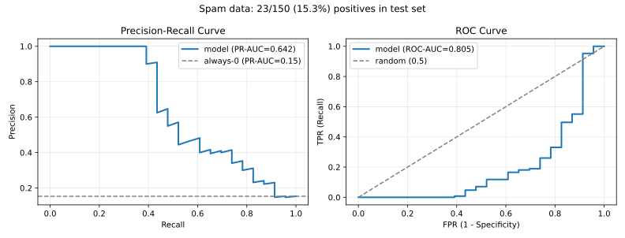

# 2.3 로지스틱회귀: 시그모이드에서 PR-AUC까지

[](https://colab.research.google.com/github/SuminHan/book-ml/blob/main/notebooks/ml1/chapter02_3_logistic_regression.ipynb)

### 시그모이드: 실수를 확률로

로지스틱함수(시그모이드)는 정확히 "\\(-\infty\\)~\\(+\infty\\)를 0~1로 바꾸는"
변환을 해준다:

\\[\sigma(z) = \frac{1}{1+e^{-z}}\\]

\\(z \to +\infty\\)이면 \\(\sigma(z) \to 1\\), \\(z \to -\infty\\)이면
\\(\sigma(z) \to 0\\), \\(z=0\\)이면 \\(\sigma(0)=0.5\\)다. 어떤 실수든 이
함수를 통과하면 0~1 사이의 값이 되므로, "확률"로 해석할 수 있다.

\\[h\_w(x) = \sigma(w^Tx) = \frac{1}{1+e^{-w^Tx}}\\]

\\(h\_w(x)\\)는 "\\(x\\)가 양성 클래스(class 1)일 확률"로 해석한다. 예측은
\\(h\_w(x) \ge 0.5\\)면 클래스 1, 아니면 클래스 0으로 정한다 — \\(h\_w(x)=0.5\\)는
정확히 \\(w^Tx=0\\)인 지점이므로, 결정 경계(decision boundary)는 여전히
**직선**(또는 초평면)이다.

#### 역사의 한 귀퉁이: 뉴런의 수식

시그모이드가 머신러닝에 등장한 데에는 작은 역사적 우연이 있다. 1943년,
생리학자 월터 매컬로크(Walter McCulloch)와 수학자 워런 피츠(Warren Pitts)는
"뉴런은 이산적 결정기를 가질 수 있다"는 논문을 썼다 — 흥분 입력이 임계값을 넘으면
신호를 보내고, 아니면 보내지 않는, 0/1 기계다. 뉴런의 실제 출력은 연속적이고
확률적이지만, 이 "맥컬로크-피츠 뉴런" 모델은 수학적으로 다루기 쉬운 첫
뉴런 모델이었다. 그 모델에서 입력이 임계값을 넘는 강도를 "연속적 확률"로 부드럽게
바꿔준 것이 바로 시그모이드 함수다 — 뉴런의 활동전위(activity potential)가
시간에 따라 올라가는 S자 모양을 본떠 1952년, 심리학자 소스 루빈스타인(Sos
Rubinstein)의 조언을 받은 통계학자 오스틴 브런트(Austin Brant)와 동료
패트릭 파울(Patrick Faul)이 "학습의 확률적 모델"(A stochastic model for
learning, 1953)이라는 논문에 처음 썼다고 전해진다. 이후 프rank 로젠블라트
(Frank Rosenblatt)가 1958년 퍼셉트론(Perceptron)을 만들면서 시그모이드는
인공뉴런의 "활성함수(activation function)"로 정설이 되었고 — 그 인기가
너무 커서 1969년 마빈 민스키(Marvin Minsky)의 『Perceptrons』 비판까지 불러
일어났다. (이 파동이 "제1 AI 겨울"으로 불리는지는 Chapter 15에서 논쟁을
다시 짚는다.)

#### log-odds 직관: 시그모이드는 "대수적 기울기"

시그모이드를 "반전"해보면 이 변환이 왜 자연스러운지 더 선명해진다.
\\(p = \sigma(z)\\)를 \\(z\\)에 대해 정리하면:

\\[z = \log \frac{p}{1-p} = \log \text{odds}(p)\\]

\\(\text{odds}(p) = p/(1-p)\\)는 **승산(odds)** — "양성일 가능성 대
음성일 가능성"의 비율이다. 시그모이드의 역함수가 log-odds(로지트, logit)이므로,
로지스틱회귀는 실제로 **log-odds를 선형 모델로 설명**하고 있다:

\\[\log \frac{h\_w(x)}{1-h\_w(x)} = w^Tx\\]

숫자로 보면: \\(w^Tx = 1.0986\\)이면 \\(h\_w(x) = 0.75\\)다 — 승산이
\\(0.75/0.25 = 3\\)이므로 "양성일 가능성은 음성의 3배"라는 뜻이다. 특징
\\(x\_j\\)의 계수 \\(w\_j\\)는 "다른 게 다 같을 때 \\(x\_j\\)을 1 올리면
log-odds가 \\(w\_j\\)만큼 바뀐다"는 뜻이므로, \\(e^{w\_j}\\)배만큼 승산이
변한다. 이 해석 덕분에 로지스틱회귀 계수는 "이 특징이 양성을 얼마나 밀어올리는가"의
**강도와 방향**을 읽을 수 있는, 해석 가능한 모델로 쓰인다 — 의학적 위험인자
분석에서 로지스틱회귀가 수십 년간 표준인 이유다(Chapter 7의 결정트리와 비교하면,
트리 경계는 "x1가 5.3 이상"처럼 임계값이 아니라 계수 해석을 주지 않는다).

### 손실함수: 섀넌의 정보이론에서 교차 엔트로피까지

시그모이드에 평균제곱오차를 그대로 적용하면 \\(J(w)\\)가 \\(w\\)에 대해
**볼록하지 않아(non-convex)**, 경사하강법이 지역 최솟값(local minimum)에 갇힐
위험이 있다. 대신 **교차 엔트로피**(cross-entropy) 손실을 쓴다 — 이 이름은
1948년 클로드 섀넌(Claude Shannon)이 만든 **정보이론**(information theory)에서
왔다.

섀넌은 "정보량"을 수학적으로 재는 법을 고민했다. 확률 \\(p\\)로 일어나는 사건이
실제로 일어났다는 소식에는 얼마만큼의 "놀라움"(정보량)이 담겨 있을까? 섀넌은
이걸 \\(-\log\_2 p\\)(단위: 비트)로 정의했다 — 자주 일어나는 사건(\\(p\\)가
1에 가까움)은 "해가 동쪽에서 떴다"처럼 정보량이 거의 0이고, 거의 안 일어나는
사건(\\(p\\)가 0에 가까움)은 "복권에 당첨됐다"처럼 정보량이 크다.

이 정보량의 **기댓값**이 **엔트로피**(entropy)다:

\\[H(p) = -\sum\_k p\_k \log\_2 p\_k\\]

확률분포 \\(p\\)를 따르는 사건들을 평균적으로 관찰할 때 얻는 정보량이자,
이 분포를 최적으로 부호화(encoding)하는 데 필요한 평균 비트 수다(Chapter
7.2에서 결정트리가 "가장 잘 나누는 질문"을 고르는 기준으로 다시 만난다).

그런데 만약 실제 분포는 \\(p\\)인데, (어쩌면 틀린) 다른 분포 \\(q\\)를 믿고
부호화한다면 몇 비트가 필요할까? 그 평균 비트 수가 **교차 엔트로피**다:

\\[H(p, q) = -\sum\_k p\_k \log\_2 q\_k\\]

\\(q\\)가 \\(p\\)와 정확히 같으면 \\(H(p,q) = H(p)\\)로 **최솟값**을 갖고,
\\(q\\)가 \\(p\\)에서 멀어질수록(즉 잘못된 분포를 믿을수록) \\(H(p,q)\\)는
커진다 — 그 초과분 \\(H(p,q) - H(p)\\)를 **KL 발산**(KL divergence,
\\(D\_{KL}(p\\|q)\\))이라 부른다(Chapter 15, VAE의 ELBO에서 다시 만난다).

로지스틱회귀에서 정답 \\(y^{(i)}\\)는 "정답 분포"(클래스 1일 확률이 100%
아니면 0%인 분포)이고, \\(h\_w(x^{(i)})\\)는 모델이 예측한 분포다. **교차
엔트로피를 최소화한다는 것은 곧 모델의 예측 분포를 정답 분포에 최대한
가깝게 만든다는 뜻**이다 — 이게 바로 손실함수로 쓰는 이유다:

\\[J(w) = -\frac{1}{m}\sum\_{i=1}^m \left[y^{(i)}\log h\_w(x^{(i)}) +
(1-y^{(i)}) \log(1-h\_w(x^{(i)}))\right]\\]

(머신러닝에서는 보통 \\(\log\_2\\) 대신 자연로그 \\(\log = \ln\\)을 쓴다 —
둘은 상수배(\\(1/\ln 2\\))만 차이나서, 손실이 최소가 되는 지점 \\(w\\)에는
영향을 주지 않는다.)


직관: 정답이 \\(y=1\\)인데 모델이 \\(h\_w(x) \to 0\\)으로 확신하면
\\(-\log h\_w(x) \to \infty\\) — 손실이 무한히 커진다. **확신을 갖고 틀리면
그만큼 크게 벌한다.** 신기하게도 이 손실함수를 미분하면 2.1절의 선형회귀와
**똑같은 형태**의 그래디언트가 나온다:

\\[\frac{\partial J}{\partial w\_j} = \frac{1}{m}\sum\_{i=1}^m \left(h\_w(x^{(i)}) - y^{(i)})\right) x\_j^{(i)}\\]

그래서 경사하강법 구현 코드 자체는 2.1절과 거의 동일하다 — \\(h\_w\\)를
계산하는 부분에 시그모이드만 추가하면 된다.

```python
import math

def sigmoid(z):
    return 1 / (1 + math.exp(-z))

def logistic_gradient_descent(X, y, alpha, epochs):
    m, n = len(X), len(X[0])
    w = [0.0] * (n + 1)
    for _ in range(epochs):
        grad = [0.0] * (n + 1)
        for i in range(m):
            pred = sigmoid(w[0] + sum(w[j+1] * X[i][j] for j in range(n)))
            error = pred - y[i]
            grad[0] += error
            for j in range(n):
                grad[j+1] += error * X[i][j]
        for j in range(n + 1):
            w[j] -= alpha * grad[j] / m
    return w
```

#### 확인 문제 1. 시그모이드의 미분

연습문제 5의 힌트(2)를 미리 확인하자: \\(\sigma'(z) = \sigma(z)(1-\sigma(z))\\).
이 항은 \\(0 < \sigma(z) < 1\\)에서 항상 양수이고, \\(\sigma(z) = 0.5\\)
즉 \\(z=0\\)에서 **최대값 0.25**를 가진다. 실습 노트북 §3에서 수치미분과
해석미분을 비교하면 최대 오차가 약 \\(2 \times 10^{-4}\\)로 확인된다.
직관적으로, 시그모이드는 "가장 많이 틀린 예측(확률 0.5)에서 가장 민감하게
반응하고, 이미 확신을 가진 예측(0 또는 1에 가까움)에서는 거의 움직이지
않는다" — 그래서 경사하강법이 학습 초반에는 빠르게, 후반에는 천천히 수렴한다.

#### 손으로 한 번: 3샘플 로지스틱회귀, 두 단계 수렴

손실편의 그래디언트가 \\((h-y)\cdot x\\)인지 직접 확인해보자. 한 특징
\\(x \in \\{1, 2, 3\\}\\), 정답 \\(y = [1, 0, 1]\\), 초깃값
\\(w\_0 = w\_1 = 0\\), 학습률 \\(\alpha = 0.5\\)로 시작한다.

**단계 0**: 모든 예측이 \\(h = \sigma(0) = 0.5\\).
손실 \\(J = -\frac{1}{3}[2\log 0.5 + \log 0.5] = -\log 0.5 = 0.6931\\).

**단계 1**: 그래디언트 계산 —

\\[\frac{\partial J}{\partial w\_0} = \frac{1}{3}\sum\_i (h\_i - y\_i) = \frac{1}{3}[(0.5-1)+(0.5-0)+(0.5-1)] = -0.1667\\]

\\[\frac{\partial J}{\partial w\_1} = \frac{1}{3}\sum\_i (h\_i - y\_i)x\_i = \frac{1}{3}[(0.5-1)(1)+(0.5-0)(2)+(0.5-1)(3)] = -0.3333\\]

업데이트: \\(w\_0 = 0 - 0.5(-0.1667) = 0.0833\\),
\\(w\_1 = 0 - 0.5(-0.3333) = 0.1667\\).

이제 예측이 더 이상 0.5가 아니다:
\\(h(1) = \sigma(0.0833 + 0.1667) = 0.5619\\),
\\(h(2) = \sigma(0.0833 + 0.3333) = 0.5381\\),
\\(h(3) = \sigma(0.0833 + 0.5) = 0.6418\\).
손실은 \\(0.6475\\)로 떨어졌다. 두 샘플(\\(x=1, 3\\))은 양성이므로
모두 \\(h > 0.5\\)로 "정답 쪽"으로 움직였고, 유일한 음성(\\(x=2\\))은
가장 작은 기울기(\\(w\_1\\)가 작음)로 0.5를 겨우 넘겨 예측되었다 —
**한 샘플이 "반쯤 맞고" 반쯤 틀린 예측을 받으면 그래디언트도 그만큼 작아진다**는
것이 직관이다. (이 예는 실습 노트북 §2의 완전한 데이터로 확장되어 있다 —
numpy 버전으로 300 epoch 돌리면 \\(w = [-1.494, 1.345, 0.608]\\), 최종
손실 0.3626, sklearn의 `LogisticRegression(C=1e6)`와 거의 같은
\\([-1.573, 1.492, 0.662]\\)를 확인한다.)

### "정확도"만으로는 안 되는 이유

암 검진 모델을 상상해보자. 전체 환자의 99%가 정상이라면, "무조건 정상"이라고만
찍는 모델도 정확도(accuracy) 99%를 자랑한다 — 하지만 이 모델은 암 환자를 단 한
명도 잡아내지 못하는, 쓸모없는 모델이다. Precision/Recall/F1은 바로 이런
상황(클래스 불균형)에서 정확도가 숨기는 진실을 드러내기 위한 지표다.

숫자로 확인해보자. 환자 1000명 중 10명(1%)이 실제 암 환자이고, 모델이
무조건 "정상"이라고만 예측한다고 하자. 정확도는 \\(990/1000=99\\%\\)로
매우 높아 보이지만, Recall은 \\(0/10=0\\%\\)다 — 실제 암 환자를 **단 한
명도** 잡아내지 못했는데도 정확도라는 지표 하나만 보면 이 모델이 훌륭해
보이는 것이다. 이것이 "정확도의 함정(accuracy paradox)"이라 불리는
현상이다.

### 손으로 한 번: 혼동행렬에서 Precision·Recall·F1 계산하기

이번엔 클래스가 좀 더 섞인 예로 직접 계산해보자. 환자 100명을 검사해서
다음과 같은 혼동행렬을 얻었다고 하자: TP=18, FP=2, FN=7, TN=73(전체
100명 중 실제 양성은 \\(18+7=25\\)명, 모델이 양성이라 예측한 건
\\(18+2=20\\)명).

\\[\text{Precision} = \frac{TP}{TP+FP} = \frac{18}{18+2} = \frac{18}{20} = 0.9\\]

\\[\text{Recall} = \frac{TP}{TP+FN} = \frac{18}{18+7} = \frac{18}{25} = 0.72\\]

\\[F1 = \frac{2 \times 0.9 \times 0.72}{0.9+0.72} = \frac{1.296}{1.62} = 0.8\\]

Precision 0.9는 "양성이라고 예측한 20명 중 18명이 진짜 양성"이라는
뜻이고, Recall 0.72는 "실제 양성 25명 중 18명만 잡아냈다"(7명을
놓쳤다)는 뜻이다. 이 예에서 Precision이 Recall보다 높다는 것은, 모델이
"확신이 설 때만 양성으로 판정"하는 쪽으로 약간 보수적이라는 신호로 읽을
수 있다 — 아래에서 다룰 임계값 조정이 바로 이 균형을 바꾸는 손잡이다.

| 실제\\예측 | 양성 예측 | 음성 예측 |
|---|---|---|
| 실제 양성 | True Positive (TP) | False Negative (FN) |
| 실제 음성 | False Positive (FP) | True Negative (TN) |

- **Precision** \\(= \frac{TP}{TP+FP}\\): "양성이라고 예측한 것 중 진짜 양성
  비율" — 거짓 경보를 얼마나 피했는가.
- **Recall** \\(= \frac{TP}{TP+FN}\\): "실제 양성 중 잡아낸 비율" — 놓친 양성이
  얼마나 적은가.
- **F1** \\(= \frac{2 \cdot \text{Precision} \cdot \text{Recall}}{\text{Precision} + \text{Recall}}\\):
  Precision과 Recall의 조화평균 — 둘 다 낮으면 F1도 낮아지도록, 한쪽만
  높다고 점수를 후하게 주지 않는다.

**Precision-Recall 트레이드오프**: 임계값(threshold)을 0.5가 아니라 0.9로
올리면 Precision은 오르지만(확신 있을 때만 양성 판정) Recall은
떨어진다(애매한 양성을 놓침). 반대로 임계값을 낮추면 Recall은 오르고
Precision은 떨어진다. **PR-AUC**(Precision-Recall 곡선 아래 면적)는 이
트레이드오프 전 구간에서의 성능을 임계값 하나에 의존하지 않고 요약한 지표다 —
특히 클래스 불균형이 심할 때 accuracy보다 훨씬 신뢰할 수 있는 지표다.

### 임계값은 조절할 손잡이: 같은 모델, 다른 성능

아래 예는 **같은 모델**의 예측 확률을 임계값 0.5, 0.6, 0.1로 자를 때
혼동행렬이 어떻게 달라지는지를 보여준다 — "모델 성능"이라는 말은 사실
"임계값 + 모델"의 성능이다.

스팸 필터로 가자. 이메일 한 통당 두 특징을 만들었다: \\(x\_1\\)는 스팸 단어
빈도(실제 메일에서 10~36개 범위), \\(x\_2\\)는 "발신자 미등록" 여부(0/1).
정규 메일은 스팸 단어가 적고 대부분 발신자가 등록되어 있고, 스팸의 70%는
스팸 단어가 많은 "분명한" 스팸이지만 30%는 정규 메일과 겹치는 "교묘한"
스팸이다 — 그래서 임계값을 아무리 올려도 잡을 수 없는 스팸이 항상
남는다. 전체 500통 중 스팸은 100통(20%), 테스트 세트는 150통(스팸 23통,
15.3%)이다.

실습 노트북 §1에서 이 데이터를 만들어 `StandardScaler`로 표준화한 뒤,
본문 `logistic_gradient_descent`로 학습시켰다. (스케일링은 꼭 해야 한다 —
\\(x\_1\\)의 스케일(10~36)이 \\(x\_2\\)(0/1)의 30배라서, 스케일링을 안 하면
2.1절의 "학습률의 함정"이 그대로 살아남고, \\(w\_1\\)만 천천히, \\(w\_2\\)만
빨리 움직이는 왜곡된 경사하강법이 된다.)

#### 임계값을 움직여보자: 스팸 필터 예

실습 노트북 §4에서 임계값 \\(t\\)를 0.05에서 0.95까지 0.05씩 움직이면서
혼동행렬을 계산했다. 테스트 세트(스팸 23통, 정상 127통)에서의 주요 결과:

| 임계값 | TP | FP | FN | TN | 정확도 | Precision | Recall | 비용(FP+10·FN) |
|---|---|---|---|---|---|---|---|---|
| 0.05 | 21 | 119 | 2 | 8 | 0.193 | 0.150 | 0.913 | 139 |
| 0.10 | 19 | 62 | 4 | 65 | 0.560 | 0.235 | 0.826 | 102 |
| 0.20 | 16 | 24 | 7 | 103 | 0.793 | 0.400 | 0.696 | 94 |
| 0.30 | 12 | 14 | 11 | 113 | 0.833 | 0.462 | 0.522 | 124 |
| 0.40 | 11 | 7 | 12 | 120 | 0.873 | 0.611 | 0.478 | 127 |
| 0.50 | 10 | 2 | 13 | 125 | 0.900 | 0.833 | 0.435 | 132 |
| 0.60 | 9 | 0 | 14 | 127 | 0.907 | 1.000 | 0.391 | 140 |
| 0.80 | 4 | 0 | 19 | 127 | 0.873 | 1.000 | 0.174 | 190 |
| 0.95 | 2 | 0 | 21 | 127 | 0.860 | 1.000 | 0.087 | 210 |

세 가지 점을 주목하라:

1. **Precision/Recall 트레이드오프가 그대로 보인다.** 임계값을 0.05에서
   0.95로 올리면 Precision은 0.150에서 1.000으로, Recall은 0.913에서 0.087로
   움직인다 — "양성 판정을 할 확신이 드는 문턱"을 높이면 오경보는 사라지지만
   진짜 양성도 놓친다.

2. **비용 최소화 임계값은 0.5가 아니다.** FP(정상 메일을 스팸으로 오진 →
   재검사 1건의 비용)와 FN(스팸을 놓침 → 진단 지연, 비용 10배)의 비용을
   합산하면 \\(\text{cost} = \text{FP} + 10 \cdot \text{FN}\\). 임계값을
   0.05~0.95까지 0.01 간격으로 sweeping하면 **비용이 최소인 임계값은
   \\(\approx 0.14\\)**(이때 FN=4, FP=44, 비용 84)다 — 0.5(비용 132)보다
   훨씬 낮다. "FN이 10배로 비싸다"는 비용 구조가 임계값을 0.14로 끌어내린
   것이다. 임계값은 **비용 함수로 선택**하는 하이퍼파라미터다.

3. **정확도는 오히려 떨어진다.** 임계값 0.5에서 정확도는 0.900, 0.30에서
   0.833 — 0.5보다 **낮다**. 하지만 비용은 132 → 124로 **떨어진다**.
   "정확도가 더 낮은 모델이 더 쓸모있다"는 역설적인 결론이 나오는데,
   정확도가 "전체 중 맞힌 비율"을 재는 반면 비용은 "특정 오류의 가중 합"을
   재기 때문이다. 정확도 하나만 보고 임계값을 정하면, 실제로는 비용을
   더 많이 내는 지점을 고르게 된다.

#### 정리: PR-AUC의 기준선은 "무조건 0" 모델

클래스 불균형이 심할 때 PR-AUC의 **하한(baseline)** 은 "무조건 음성으로
예측하는 모델"의 정확도, 즉 **양성 비율**이다. 직관적으로, 임계값을 매우
낮추면 이 모델은 "모두 양성"으로 예측해서 Recall=1.0, Precision=양성 비율이
된다 — PR 곡선의 y-좌표(Precision)는 최대 양성 비율까지만 올라간다.
반대로 임계값을 매우 높이면 "모두 음성"으로 예측해서 Precision=1.0(양성을
예측한 게 없으므로), Recall=0이 된다 — PR 곡선은 (0,1)에서 시작한다.
즉 **PR-AUC는 항상 "양성 비율"과 1.0 사이의 값**이고, 양성 비율이 15%면
"무조건 0" 모델도 PR-AUC=0.15를 받는다.

실습 노트북 §5에서 이걸 검증한다. 위 스팸 데이터(테스트 세트 양성 비율
15.3%)에서:

- 학습한 모델: PR-AUC = 0.642, ROC-AUC = 0.805
- **무조건 0 모델**: 정확도 0.847, PR-AUC = **0.153**(= 양성 비율 0.15와
  일치), ROC-AUC = 0.5

모델의 정확도(0.847 @ 임계값 0.5)와 "무조건 0" 모델의 정확도(0.847)가
**정확히 같은데도** PR-AUC는 0.642 대 0.153으로 4배 차이 나고, ROC-AUC도
0.805 대 0.5로 뚜렷하게 다르다. **정확도는 이 두 모델을 구분하지 못하지만,
PR-AUC와 ROC-AUC는 구분한다** — 불균형 데이터에서 정확도가 "허위 지표"가
되는 이유다.



왼쪽 PR 곡선에서 점선은 "무조건 0" 모델의 PR-AUC(= 양성 비율 0.15),
오른쪽 ROC 곡선에서 점선은 무작위 모델(ROC-AUC=0.5)이다. 모델 곡선이
점선보다 위에 있는지 보기 — 이 차이가 "모델이 양성의 순서를 얼마나 잘
짜는지"를 보여준다.

#### ROC-AUC와 PR-AUC: 언제 무엇을 보아야 하는가

- **ROC-AUC**(Receiver Operating Characteristic — 임계값을 움직일 때
  TPR과 FPR의 쌍을 그리는 곡선)는 **클래스 균형이 거의 맞을 때** 좋은
  스크리닝 지표다. 무작위 모델은 0.5, 완벽 모델은 1.0. 클래스 균형이
  무너지면 "무조건 0" 모델의 ROC-AUC가 여전히 0.5라서, 0.15% 양성 비율
  데이터에서 ROC-AUC=0.51인 모델도 "무작위보다 낫다"고 해석할 수 있어
  과대평가되기 쉽다.
- **PR-AUC**는 **클래스 불균형이 심할 때** 더 "정직한" 지표다 — 기준선이
  양성 비율이라, 양성 비율 15%에서 PR-AUC=0.151인 모델은 "무조건 0과
  거의 같은 모델"이라는 것이 바로 읽힌다. ROC-AUC=0.51은 "무작위보다
  약간 낫다"로 읽혀서, 둘의 절대 척도가 다르다.
- 실무 권장 흐름: **ROC-AUC로 후보 모델 스크리닝 → PR-AUC와 비용 곡선으로
  최종 임계값 선택**. ROC-AUC는 모델의 "순서 짓기 능력"을 빠르게 비교하고,
  PR-AUC + 비용 최소화는 "이 문제를 실제로 풀 때 어떤 임계값이 가장
  이익을 주나"를 결정한다.

### 자주 하는 실수: 세 함정

**1. 로지스틱회귀에 스케일링을 안 하면 경사하강법이 왜곡된다.**
선형회귀(2.1절)에서는 스케일링이 "학습률 선택의 편의"를 위해 권장사항
이었지만, 로지스틱회귀에서는 더 심하다. 시그모이드의 그래디언트
\\(\sigma'(z) = \sigma(z)(1-\sigma(z))\\)가 \\(z = w^Tx\\)에 의존하는데,
특징 스케일이 30배로 다르면 \\(z\\)의 크기 자체가 30배 차이 나고,
스케일이 큰 특징 쪽 그래디언트가 더 커진다. 결과적으로 경사하강법이
"스케일 큰 특징을 먼저 학습"하는 왜곡된 경로를 타고, 학습률이 스케일에
맞춰 조정되지 않으면 발산하거나 극도로 느려진다. **실전 로지스틱회귀
코드의 표준 전처리는 `StandardScaler`**다 — 이 절의 실습 노트북도
스케일링 후 학습한다.

**2. `sigmoid(z)`를 직접 계산하면 오버플로가 날 수 있다.**
\\(z = -1000\\)이면 \\(e^{-z} = e^{1000}\\)가 float64의 표현 범위를
넘어 `inf`가 되고, `1/(1+inf) = 0`으로 **실제로는 0이 아니라 "0과
거의 같은 값"을 0으로 잘림**。 반대로 \\(z = +1000\\)이면 \\(e^{-z}
= e^{-1000} \approx 0\\)이 되어 `1/(1+0) = 1`이 되는데, 이것도
"1과 거의 같은 값"을 1로 잘림. 둘 다 **확률 0 또는 1에 가까울 때의
손실 \\(-\log p\\)가 `log(0) = -inf`가 되어 NaN이 된다.** 실전 코드에서
흔히 쓰는 해결책:

- `scipy.special.expit(z)`(C로 구현된, 오버플로 없는 시그모이드)
- `np.where(z >= 0, 1/(1+np.exp(-z)), np.exp(z)/(1+np.exp(z)))`
  — 음수 영역과 양수 영역을 나눠서 계산
- 손실 계산 시 `np.clip(h, 1e-12, 1-1e-12)`로 확률을 0/1에 딱 붙지
  않게 클리핑

본문의 순수 Python `sigmoid`는 교육용이라 오버플로를 막지 않았지만,
실제 모델에 옮기면 이 중 하나로 교체하라.

**3. 임계값 0.5를 "모델의 성능"으로 보고 버그를 찾는다.**
"정확도가 왜 75%야?"라고 물을 때, 답은 "모델이 나쁘다"가 아니라
**"임계값 0.5가 이 문제의 비용 구조에 맞지 않는다"** 일 수 있다.
2.1절의 선형회귀에서는 "예측값"이 숫자 자체가 최종 답이지만,
로지스틱회귀의 "예측 확률"은 **임계값을 적용하기 전의 중간 값**이다.
"모델이 나쁘다"고 하기 전에, (a) PR-AUC/ROC-AUC로 순위 능력을 먼저
확인하고, (b) 비용 구조에 맞는 임계값을 sweeping해서 "이 임계값에서
나쁘다"를 확인한 뒤, 그때 "모델이 나쁘다"고 결론내려라. 순서가 반
거꾸면 "모델을 갈아엎어야 하나"라는 결론에서 "임계값을 0.14로 바꾸면
된다"는 결론으로 바뀌지 않는다.

### 실습: sklearn으로 분류 평가 지표 한 번에 계산하기

직접 구현한 `precision_recall_f1`(연습문제 3번)로 원리를 이해했다면, 실전에서는
`scikit-learn`이 이 모든 지표를 한 번에 계산해준다:

```python
from sklearn.metrics import classification_report, average_precision_score

y_true = [1, 1, 1, 0, 0, 0, 1, 0]
y_pred = [1, 0, 1, 0, 1, 0, 1, 0]
y_scores = [0.9, 0.4, 0.8, 0.3, 0.6, 0.2, 0.7, 0.1]  # 임계값 0.5를 적용하기 전의 확률

print(classification_report(y_true, y_pred, target_names=["정상", "스팸"]))
print("PR-AUC:", round(average_precision_score(y_true, y_scores), 3))
```

`classification_report`는 Precision/Recall/F1을 클래스별로 한 번에 출력하고,
`average_precision_score`는 임계값을 하나로 고정하지 않고 `y_scores`(확률)
전체를 보고 PR-AUC를 계산한다 — 임계값 0.5에서의 성능만 보는 `y_pred` 기반
지표와 달리, 모델 자체의 순위(ranking) 능력을 평가한다는 점이 다르다.

**같은 예측에 두 종류의 PR-AUC**: 위 예에서 `y_scores`로 계산한 PR-AUC는
0.95, `y_pred`(임계값 0.5 고정)로 계산한 PR-AUC는 0.688이다 — **같은
데이터, 같은 모델인데 임계값을 "고정"했느냐 "스윕"했느냐에 따라 지표가
0.26 차이 난다.** 임계값 하나에 갇힌 지표와 모델의 순서짓기 능력을
평가하는 지표의 차이가 수치로 보이는 것이다. 실습 노트북 §6에서 이
비교를 다시 확인한다.

[](https://colab.research.google.com/github/SuminHan/book-ml/blob/main/notebooks/ml1/chapter02_3_logistic_regression.ipynb)

**실습 노트북**에서 이 절의 모든 내용을 코드로 재현할 수 있다: §1에서
스팸 데이터를 만들고 스케일링, §2에서 본문 `logistic_gradient_descent`를
numpy로 학습(그래디언트 `(h-y)·x` 확인), §3에서 \\(\sigma'(z) =
\sigma(z)(1-\sigma(z))\\)를 수치로 검증, §4에서 임계값 sweeping으로
Precision/Recall 트레이드오프와 비용 최소화 임계값(≈0.14) 직접 계산,
§5에서 PR-AUC/ROC-AUC와 "무조건 0" 모델의 기준선(= 양성 비율) 검증,
§6에서 본문 실습 코드를 실행한다.

**선형회귀와 로지스틱회귀는 겉보기엔 다른 문제(숫자 예측 vs. 확률 예측)를
풀지만, 뜯어보면 "선형모델 → 손실함수 정의 → 경사하강법으로 최소화"라는
완전히 같은 파이프라인이다 — 이 패턴은 이번 학기 내내 반복된다.**

### 확인 문제

1. \\(w^Tx = -2\\)일 때 \\(h\_w(x)\\)는 몇이고, 이 예는 음성으로 예측되는가?
   \\(w^Tx = 3\\)일 때는? (힌트: \\(\sigma(z)\\)를 대입하고 0.5와 비교.)
2. "무조건 음성으로 예측하는 모델"의 ROC-AUC는 항상 0.5인가?
   (힌트: 임계값을 움직여 TPR과 FPR의 쌍을 그려라.)
3. Precision=0.5, Recall=0.9일 때 F1은 몇인가?
   (힌트: 조화평균 공식. 단답.)
4. "양성이 5%인 데이터에서 PR-AUC=0.051이면 이 모델은 쓸모가 있다"는
   진술은 옳은가? (힌트: PR-AUC의 기준선이 양성 비율임을 떠올려라.)

### 자주 묻는 질문

**Q. 왜 F1은 Precision과 Recall을 그냥 평균 내지 않고 조화평균을 쓰나요?**
산술평균은 한쪽이 극단적으로 낮아도 다른 쪽이 높으면 값이 크게 낮아지지
않는다 — 예를 들어 Precision=1.0, Recall=0.01이면 산술평균은 0.505로
꽤 높아 보이지만, 이 모델은 사실상 쓸모가 없다(양성을 거의 못 잡아낸다).
조화평균은 작은 값 쪽에 훨씬 민감하게 반응해서, 이 경우 F1은
\\(2\times1.0\times0.01/(1.0+0.01)\approx0.0198\\)로 훨씬 낮게 나와
"둘 중 하나라도 극단적으로 나쁘면 나쁜 모델"이라는 판단을 더 정확히
반영한다.

**Q. 임계값 0.5는 항상 최선인가요?** 아니다. 임계값은 문제의 성격에 맞춰
조정하는 하이퍼파라미터다 — 암 검진처럼 "양성을 놓치는 비용(FN)"이
"오진해서 재검사시키는 비용(FP)"보다 훨씬 크다면 임계값을 0.5보다
**낮춰서** Recall을 올리는 쪽이 합리적이고, 반대로 스팸 필터처럼 "정상
메일을 스팸으로 잘못 거르는 비용(FP)"이 더 부담스럽다면 임계값을 **높여서**
Precision을 올리는 쪽이 낫다. PR-AUC가 유용한 이유가 바로 여기 있다 — 아직
임계값을 정하기 전에, 모델 자체의 순위 능력을 먼저 평가할 수 있기 때문이다.

**Q. 클래스 불균형이 심한 데이터에서 PR-AUC와 ROC-AUC 중 무엇을 봐야
하나요?** PR-AUC를 우선 보라. 양성 비율이 15%인 데이터에서 "무조건 0"
모델의 PR-AUC는 0.15, ROC-AUC는 0.5인데, 학습한 모델의 PR-AUC가 0.16이면
"거의 무조건 0과 같은 모델"이라는 것이 바로 읽히지만, ROC-AUC가 0.51이면
"무작위보다 약간 낫다"로 해석되어 과대평가되기 쉽다. 불균형이 심할수록
PR-AUC의 기준선(양성 비율)이 더 "정직"하다. ROC-AUC는 스크리닝(후보 모델
비교)에는 여전히 유용하지만, 최종 선택은 PR-AUC + 비용 곡선으로 하라.

**Q. 교차 엔트로피 손실의 그래디언트가 선형회귀와 같은 형태
\\((h-y)\cdot x\\)인 이유는?** 연습문제 5의 힌트를 따라가면,
(1) \\(\frac{\partial J}{\partial h} = -\frac{y}{h} + \frac{1-y}{1-h}\\),
(2) \\(\frac{\partial h}{\partial z} = \sigma(z)(1-\sigma(z)) =
h(1-h)\\), (3) 세 조각을 곱하면 \\(h(1-h)\\)가 **통째로 약분**되어
\\((h-y)\\)만 남는다. "시그모이드의 미분이 정확히 시그모이드의
출입구"라서, 손실함수의 "벌"과 시그모이드의 "압축"이 상쇄되는 것이다.
이 약분이 없으면 로지스틱회귀의 경사하강법은 선형회귀와 다른 코드가
되어야 하는데, 실제로는 **코드 구조가 완전히 동일**하다 — 이 절의
파이프라인 요약이 "같은 패턴"을 강조하는 이유가 바로 여기 있다.

---

## 연습문제

**1. (코딩)** 위 `gradient_descent`(핵심 줄 4개는 빈칸으로 남겨져 있다고 가정)를
완성하라:

```python
def gradient_descent(X, y, alpha, epochs):
    # ADD ADDITIONAL CODE HERE!!
    # 초기화: w를 0벡터로, bias 포함하여 길이 len(X[0])+1

    for epoch in range(epochs):
        # ADD ADDITIONAL CODE HERE!!
        # 예측값 계산 h_w(x) = w^T x, 그래디언트 계산, w 갱신

X = [[1.0], [2.0], [3.0], [4.0]]
y = [3.0, 5.0, 7.0, 9.0]
print(gradient_descent(X, y, alpha=0.01, epochs=1000))  # 대략 [1.0, 2.0]
```

**2. (손유도, Tier A — 자유 유도)** 선형회귀의 비용함수 \\(J(w) =
\frac{1}{2m}\\|Xw - y\\|^2\\)을 \\(w\\)에 대해 미분하여 0으로 놓고,

\\[w^\* = (X^TX)^{-1}X^Ty\\]

가 되는 과정을 **처음부터 끝까지 손으로 유도**하라. (힌트: \\(\nabla\_w \\|Xw-y\\|^2
= 2X^T(Xw-y)\\)임을 먼저 보인 뒤, 이를 0으로 놓고 \\(w\\)에 대해 정리한다.)
유도한 \\(w^\*\\)가 실제로 \\(J(w)\\)의 **전역 최솟값**임을(Hessian이 양의
준정부호 행렬임을 보이는 방식으로) 논증하라.

**3. (코딩)** 위 `logistic_gradient_descent`(핵심 줄은 빈칸으로 남겨져 있다고
가정)와, 다음 `precision_recall_f1`을 완성하라:

```python
def precision_recall_f1(y_true, y_pred):
    # ADD ADDITIONAL CODE HERE!!
    # TP, FP, FN을 센 뒤 precision, recall, f1 계산
    # (0으로 나누는 경우는 각 값을 0.0으로 처리)

y_true = [1, 1, 1, 0, 0, 0, 1, 0]
y_pred = [1, 0, 1, 0, 1, 0, 1, 0]
print(precision_recall_f1(y_true, y_pred))  # (0.75, 0.75, 0.75)
```

**4. (개념 서술)** 위 sklearn 실습에서 `y_pred` 기반 지표(Precision/Recall/F1)와
`y_scores` 기반 지표(PR-AUC)가 답하는 질문이 어떻게 다른지 두세 문장으로
설명하라. 임계값을 0.5가 아니라 0.7로 바꾸면 `classification_report`의 결과가
어떻게 달라질지도 예상해보라.

**5. (손유도, Tier B — 힌트 제공)** 교차 엔트로피 손실 하나의 샘플에 대해:

\\[J^{(i)}(w) = -y^{(i)}\log h\_w(x^{(i)}) - (1-y^{(i)})\log(1-h\_w(x^{(i)}))\\]

를 \\(w\_j\\)로 미분해서 \\(\frac{\partial J^{(i)}}{\partial w\_j} =
(h\_w(x^{(i)}) - y^{(i)})x\_j^{(i)}\\)가 됨을 유도하라.

**힌트**(연쇄법칙을 세 단계로 나눠서 적용): (1) 먼저 \\(\frac{\partial
J^{(i)}}{\partial h}\\)를 구하라(h는 \\(h\_w(x^{(i)})\\)의 줄임 표기,
\\(\frac{d}{dh}\log h = \frac{1}{h}\\)임을 이용). (2) \\(\sigma'(z) =
\sigma(z)(1-\sigma(z))\\)임을 이용해 \\(\frac{\partial h}{\partial z}\\)를
구하라(\\(z=w^Tx^{(i)}\\)). (3) \\(\frac{\partial z}{\partial w\_j} =
x\_j^{(i)}\\)임을 이용해 세 조각을 연쇄법칙으로 곱하면, 놀랍게도
\\(h(1-h)\\) 항이 통째로 약분되어 사라진다 — 왜 그런지 확인하라. 유도한
결과가 2.1절의 선형회귀 그래디언트와 형태가 똑같다는 것도 확인하라.
