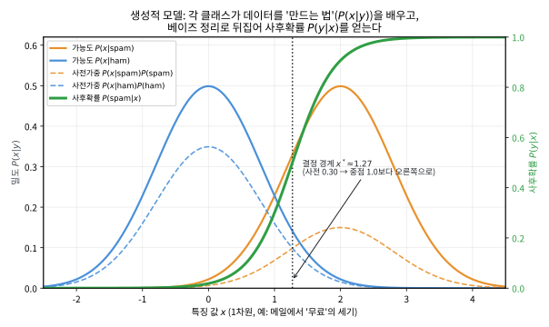
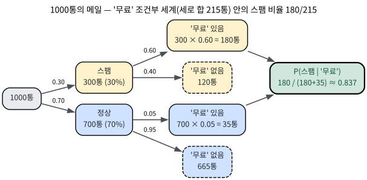
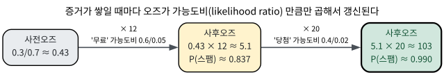

# 3.1 베이즈 정리, 그리고 생성 vs 판별

[](https://colab.research.google.com/github/SuminHan/book-ml/blob/main/notebooks/ml1/chapter03_1_bayes.ipynb)

### 판별적 접근과 정반대의 길

Chapter 2의 로지스틱회귀는 \\(P(y|x)\\)(입력이 주어졌을 때 정답의 확률)를
**곧바로** 모델링했다 — 이런 접근을 **판별적**(discriminative) 모델이라
부른다. 이번 장의 접근은 정반대다: 각 클래스가 데이터를 어떻게
"만들어내는지"(\\(P(x|y)\\))를 먼저 모델링하고, **베이즈 정리**로 뒤집어서
원하는 \\(P(y|x)\\)를 얻는다 — 이런 접근을 **생성적**(generative) 모델이라
부른다.

\\[P(y|x) = \frac{P(x|y)P(y)}{P(x)}\\]

분류에서는 \\(x\\)가 고정된 채 \\(y\\)의 각 값(클래스)을 비교하므로, 분모
\\(P(x)\\)(모든 클래스에 걸쳐 동일)는 무시하고 분자만 최대화하는 클래스를
고르면 된다:

\\[\hat{y} = \arg\max\_y P(x|y)P(y)\\]

여기서 \\(P(y)\\)는 **사전확률**(prior, 예: 전체 메일 중 스팸 비율)이고,
\\(P(x|y)\\)는 **가능도**(likelihood, 예: 스팸 메일이 이런 단어들을 포함할
확률)다. "생성적"이라는 이름은, 이 모델이 사실상 "클래스 \\(y\\)가 주어지면
데이터 \\(x\\)를 어떻게 생성하는가"를 학습한다는 데서 온다 — 실제로 학습이
끝난 \\(P(x|y)\\)에서 샘플을 뽑으면, 그 클래스의 "전형적인" 가짜 데이터를
만들어낼 수도 있다(Chapter 15의 EM/GMM·생성형 모델과 같은 계열의
아이디어다)[^gan].


이 "먼저 \\(P(x|y)\\)를 배우고 베이즈 정리로 뒤집는다"는 흐름을 1차원
스팸 예(특징 \\(x\\) = 메일에 '무료'가 얼마나 강한가)로 그림으로 본다. 각
클래스의 가우시안 가능도를 사전확률(스팸 0.30)로 가중한 두 곡선을 겹치면,
그 **교차점** \\(x^\*\\!\\approx\\!1.27\\)이 곧 결정 경계가 된다(사전이
0.5였다면 정중앙 1.0이었을, 스팸이 드물다 보니 그보다 오른쪽으로 밀린다) —
오른쪽 초록 곡선은 이 교차 구조를 뒤집어서 얻은 사후확률
\\(P(\text{spam}|x)\\)다. 3.2절 GDA[^gda]는 바로 이 구조의 표준형이다:



### 왜 베이즈 "정리"가 필요한가: 확률을 뒤집는 계산

이 절의 모든 것이 이 한 줄에서 시작된다:

\\[P(y|x) = \frac{P(x|y)P(y)}{P(x)}\\]

정리이긴 하지만 **증명할 것이라기보다 정의에서 직접 떨어지는 식**이다.
조건부확률의 정의 \\(P(x|y) = \frac{P(x,y)}{P(y)}\\)("\\(y\\)가 주어졌을
때 \\(x\\)의 확률"은, \\(x\\)와 \\(y\\)가 **동시에** 일어날 확률을 \\(P(y)\\)로
나눈 값)로부터 \\(P(x,y) = P(x|y)P(y)\\)로 고쳐 쓰면, 같은
\\(P(x,y)\\)를 반대 방향에서 다시 나누는 \\(P(y|x) =
\frac{P(x,y)}{P(x)}\\)와 비교하면:

\\[P(y|x) = \frac{P(x,y)}{P(x)} = \frac{P(x|y)P(y)}{P(x)}\\]

여기서 "정리"가 아니라 "계산"이라는 말이 나오는 이유다 — 베이즈 정리는
새로운 사실이 아니라, **같은 결합확률 \\(P(x,y)\\)을 앞뒤로 나누는 두
방법을 이어준 등식**이다.

그런데 왜 이게 머신러닝에서 이토록 중요한가? **데이터가 주는 증거의
방향과, 우리가 알고 싶은 것의 방향이 반대**이기 때문이다. 스팸 필터를
만든다고 해보자. 학습 데이터에서 우리가 직접 세어볼 수 있는 확률은
"P(스팸 메일에 '무료'가 등장할 확률)" 쪽이다 — 스팸 메일 뭉치를 꺼내
단어 빈도를 세면 되니까. 그런데 실제 작동할 때 필요한 건 그 반대,
"'무료'가 등장한 메일이 스팸일 확률"이다. 학습 가능 방향(\\(P(x|y)\\))과
필요 방향(\\(P(y|x)\\))이 반대인 문제를 "뒤집기 문제"(inversion
problem)라고 하는데, 베이즈 정리가 바로 이 뒤집기를 가능하게 하는
다리는 **고유한 것**이다 — 이 장의 GDA(3.2절)[^gda]와 나이브베이즈(3.3절)
모두 이 다리를 건너는 모델이고, 3.2절 끝에서 GDA의 사후확률이
로지스틱회귀의 시그모이드와 정확히 같은 형태가 된다는 사실도 결국
"베이즈 정리로 뒤집었다"는 공통 구조에서 나온다.

이름의 유래도 같은 맥락이다. "베이즈 정리"는 리처드 베이즈(Richard
Bayes, 1701–1761)의 미발표 논문(사후에 1763년 발표)에서 나온 아이디어에
피에르-시몽 라플라스가 체계화하고, 그 뒤 19~20세기에 "베이즈주의"라는
확률 철학의 이름으로 자리 잡은 것이다. "증거가 쌓일 때마다 확신을
갱신한다"는 이 방식이 실전에서 결정적 위력을 보인 사례(튜링의 에니그마
해독)는 이번 절 뒤에 따로 다룬다.

### 사전확률, 가능도, 사후확률: 세 단어가 하나의 이야기

베이즈 정리의 세 구성 요소를 스팸 예시에서 한 번에 붙여보자.

- \\(P(y)\\) — **사전확률**(prior): 증거를 보기 **전에** 알고 있는
  "스팸이 전체 메일에서 차지하는 비율". 우리 메일함의 실제 스팸 비율이
  30%라면 \\(P(\text{spam})=0.3\\)이다.
- \\(P(x|y)\\) — **가능도**(likelihood): "클래스가 주어졌을 때, 이 증거가
  나올 확률". 스팸 메일에 '무료'가 60%로, 정상 메일에는 5%로 등장한다면
  \\(P(\text{무료}|\text{spam})=0.6\\),
  \\(P(\text{무료}|\text{ham})=0.05\\)다.
- \\(P(y|x)\\) — **사후확률**(posterior): 증거 \\(x\\)를 **보았을 때**
  갱신된 확률. 바로 우리가 분류에 쓰고 싶은 값이다.
- \\(P(x)\\) — **증거**(evidence) 또는 **분할합**(marginal
  likelihood): 어떤 클래스가든 '무료'가 등장할 전체 확률. 모든 클래스에
  걸쳐 같으므로 **분류 결정**에서는 약수로 사라진다(3.3절 FAQ 참고).

이 네 용어는 이번 절뿐 아니라 Chapter 15의 EM/GMM, VAE[^vae] (ELBO의 이름이
Expected Lower Bound, "사후확률의 기대 하한"에서 온 것)까지 이어지는
공통 어휘다 — 이제부터는 식을 볼 때마다 "어디가 사전이고, 어디가 가능도
고, 어디가 사후인가"를 자동으로 짚을 수 있어야 한다.


### 손으로 한 번: 베이즈 정리로 스팸 확률 직접 계산하기

이 챕터 도입부에서 언급한 스팸 필터를 아주 단순화해서 숫자로 직접
풀어보자. 전체 메일의 30%가 스팸이라고 하자(\\(P(\text{spam})=0.3\\),
\\(P(\text{ham})=0.7\\)). "무료"라는 단어가 스팸 메일에는 60% 확률로
등장하고, 정상 메일에는 5% 확률로만 등장한다고 하자
(\\(P(\text{"무료"}|\text{spam})=0.6\\), \\(P(\text{"무료"}|\text{ham})=0.05\\)).
"무료"라는 단어가 포함된 메일을 받았을 때, 이 메일이 스팸일 확률은?

베이즈 정리를 그대로 적용하면:

\\[P(\text{spam}|\text{"무료"}) =
\frac{P(\text{"무료"}|\text{spam})P(\text{spam})}
{P(\text{"무료"}|\text{spam})P(\text{spam}) + P(\text{"무료"}|\text{ham})P(\text{ham})}\\]

분자는 \\(0.6 \times 0.3 = 0.18\\), 분모는 \\(0.18 + 0.05 \times 0.7 =
0.18 + 0.035 = 0.215\\)이므로:

\\[P(\text{spam}|\text{"무료"}) = \frac{0.18}{0.215} \approx 0.837\\]

"무료"라는 단어 하나를 관찰하는 것만으로, 스팸일 확률이 사전확률
30%에서 사후확률 약 83.7%로 크게 뛰어오른다. 이것이 바로 나이브베이즈
필터가 하는 일의 본질이다 — 3.3절에서는 이런 계산을 단어 하나가 아니라
메일에 등장하는 **모든 단어**에 대해 곱해서(정확히는 로그를 더해서)
수행한다.

식 하나로는 아직 "왜 0.18/0.215인가"가 직관적으로 와닿지 않을 수
있다 — 같은 계산을 **확률 없이, 그냥 사람(메일)을 세는** 방식으로 다시
해보자. 1000통의 메일이 있다고 가정하면(사전확률 그대로: 스팸 300통,
정상 700통):

| | 스팸 (300통) | 정상 (700통) |
|---|---|---|
| '무료'가 **들어가 있는** 메일 | 300 × 0.6 = **180통** | 700 × 0.05 = **35통** |
| '무료'가 없는 메일 | 120통 | 665통 |

"'무료'가 든 메일"이라는 **조건**으로 세상을 좁혀 보면, 그런 메일은
전체 215통(180+35)이고, 그중 스팸이 180통이므로
\\(P(\text{spam}|\text{무료}) = 180/215 \approx 0.837\\) — 확률론 기호
없이 **빈도를 세어 본 것만으로** 정확히 같은 답이 나온다. 이 표를
"확률 트리"라 부르는데, 의학과 보험, 사기 탐지 등 모든 베이즈 문제에서
가장 신뢰할 수 있는 검증 도구다 — **세로 합(215)이 조건부 세계의
전체 크기이고, 그 안에서 원하시는 칸(180)이 차지하는 비율이 곧
사후확률**이다. (기저율 오류의 의료 예에서도 뒤에서 같은
트리/카운팅으로 검증한다.) 같은 계산을 나무 그림으로 그리면 다음과 같다 —
"조건에 맞는 열"(스팸+정상 215통)만 세로로 합해서 전체로 쓰고, 그 안에서
원하는 칸의 비율을 읽으면 된다:



### 실습: 여러 증거를 곱해서 갱신하기

메일에 "무료"뿐 아니라 "당첨"이라는 단어도 함께 등장했다면 어떻게 될까?
나이브베이즈의 핵심 가정(3.3절에서 다룰 "독립 가정")을 미리 써보면, 두
단어가 클래스가 주어졌을 때 독립이라 가정하고 가능도를 곱하기만 하면 된다:

```python
def bayes_update(prior_spam, likelihoods_spam, likelihoods_ham):
    """likelihoods_*: 관찰된 각 단어의 P(단어|클래스) 리스트"""
    p_spam = prior_spam
    for l_spam in likelihoods_spam:
        p_spam *= l_spam
    p_ham = 1 - prior_spam
    for l_ham in likelihoods_ham:
        p_ham *= l_ham
    return p_spam / (p_spam + p_ham)

# "무료"(0.6 vs 0.05)와 "당첨"(0.4 vs 0.02)이 함께 등장
result = bayes_update(0.3, [0.6, 0.4], [0.05, 0.02])
print(round(result, 4))  # 0.9904
```

증거(단어)가 하나 더해질수록 사후확률이 점점 더 극단으로("거의 확실히
스팸") 쏠리는 것을 볼 수 있다 — 베이즈 정리는 이렇게 새 증거가 들어올
때마다 이전 확신(사전확률 또는 직전 사후확률)을 갱신해나가는 **순차적
추론**의 자연스러운 틀이기도 하다.

이 갱신을 **오즈**(odds, \\(P/(1-P)\\))로 다시 쓰면 한결 단정해진다. 베이즈
정리의 양변을 \\(P(y)\\)로 나누면:

\\[\frac{P(y|x)}{1-P(y|x)} = \frac{P(y)}{1-P(y)} \cdot \frac{P(x|y)}{P(x|1-y)}\\]

즉 **사후오즈 = 사전오즈 × 가능도비**(likelihood ratio,
\\(P(x|y)/P(x|1-y)\\))다 — "가능도를 곱한다"는 말은 정확히 이 한 줄이다.
앞서의 스팸 예로 보면, 사전오즈 \\(0.3/0.7 \approx 0.43\\)에 '무료'의
가능도비 \\(0.6/0.05 = 12\\)를 곱해 \\(\approx 5.1\\)(\\(P \approx 0.837\\)),
다시 '당첨'의 가능도비 \\(0.4/0.02 = 20\\)를 곱해 \\(\approx 103\\)(\\(P
\approx 0.990\\))으로 갱신된다. 증거가 하나씩 들어올 때마다 오즈가 가능도비
만큼만 곱해지며, 이 "곱의 연쇄"가 나이브베이즈가 로그를 더하는 이유(3.3절)와
로지스틱회귀가 시그모이드를 쓰는 이유(Chapter 2)를 같은 자리에서 설명해
준다:



### 자주 하는 실수: 사전확률을 무시하는 "기저율 오류"

베이즈 정리를 쓸 때 가장 흔한 실수는 가능도 \\(P(x|y)\\)만 보고 사전확률
\\(P(y)\\)를 빼먹는 것이다. 유명한 예로 의료 검진을 보자 — 어떤 병의
유병률이 0.1%(1000명 중 1명)이고, 검사의 정확도가 99%(민감도·특이도 모두
99%)라고 하자. 이 정도면 검사가 양성이 나오면 병에 걸렸을 확률도 99%
근처일 것 같지만, 실제로 계산해보면 전혀 다르다:

\\[P(\text{병}|\text{양성}) = \frac{0.99 \times 0.001}{0.99 \times 0.001 +
0.01 \times 0.999} = \frac{0.00099}{0.01098} \approx 0.090\\]

검사가 양성으로 나와도 실제로 병에 걸렸을 확률은 **약 9**%밖에 안 된다 —
직관과 크게 어긋난다. 이유는 병에 걸린 사람 자체가 워낙 드물어서(1000명
중 1명), 나머지 999명 중 1%(약 10명)가 잘못 양성 판정을 받는 것만으로도
"진짜 양성 1명"보다 "가짜 양성 10명"이 훨씬 많아지기 때문이다. 스팸 예의
확률 트리와 똑같이, 이번에도 **사람만 세어** 검증해보자. 1000명을 검사한다고
가정하면(유병률 0.1% 그대로: 병든 1명, 건강한 999명):

| | 병 걸림 (1명) | 건강 (999명) |
|---|---|---|
| 검사 **양성** | 1 × 0.99 = **0.99명** | 999 × 0.01 = **9.99명** |
| 검사 음성 | 0.01명 | 989.01명 |

"양성"이라는 조건으로 세상을 좁혀 보면 양성 판정을 받은 사람은 10.98명
(0.99+9.99)이고, 그중 실제로 병든 사람은 0.99명뿐이므로
\\(P(\text{병}|\text{양성}) = 0.99/10.98 \approx 0.090\\) — 확률 기호
없이 세어 본 것과 정확히 같은 답이다. 가짜 양성 10명 대 진짜 양성 1명, 이
**비율**이 사후확률을 9%로 붙잡아 놓는 것이다.
이 현상을 **기저율 오류**(base rate fallacy) 또는 위양성의 역설(false
positive paradox)이라 부른다 — 가능도(검사 정확도)가 아무리 높아도,
사전확률(유병률)이 낮으면 사후확률은 생각보다 훨씬 낮아진다. 나이브베이즈나
GDA 같은 생성적 모델을 실전에 쓸 때, 사전확률 \\(P(y)\\)를 학습 데이터의
클래스 비율로 정확히 추정하는 것이 왜 중요한지가 바로 이 계산에서
드러난다.

### 유명한 사례: 튜링과 에니그마 암호 해독

베이즈 정리가 스팸 필터보다 수십 년 앞서 실전에서 위력을 발휘한 사례가
있다. 2차 세계대전 중 영국 블레츨리 파크에서 앨런 튜링과 동료들은 독일군의
에니그마 암호를 깨기 위해, 각 암호 설정이 정답일 "가능성"을 베이즈적으로
갱신해나가는 방법을 썼다 — 튜링은 이 확률 갱신량의 단위를 "반"(ban)이라고
불렀는데, 이는 정확히 이번 절에서 다룬 로그 가능도비(log-likelihood
ratio)와 같은 개념이다. 새로운 암호문 조각(증거)이 들어올 때마다 각
설정의 사후확률을 갱신해서, 가능한 설정 수를 사실상 무한대에서 실용적으로
확인 가능한 범위까지 줄여나갔다. 정답을 몰라도 "증거가 쌓일수록 확신이
어떻게 바뀌는가"를 수학적으로 다루는 이 방식은, 스팸 필터의 단어 하나하나가
확신을 갱신해가는 것과 원리적으로 동일하다.

### 자주 묻는 질문

**Q. 생성적 모델과 판별적 모델 중 뭐가 더 좋은가요?** 상황에 따라
다르다 — 데이터가 적을 때는 생성적 모델(GDA, 나이브베이즈)이 "각 클래스가
데이터를 어떻게 만드는가"라는 강한 가정을 미리 깔고 들어가는 만큼 적은
데이터로도 안정적으로 학습되는 경향이 있다. 데이터가 충분히 많을 때는
판별적 모델(로지스틱회귀)이 그런 가정 없이 직접 결정 경계를 학습하기
때문에 가정이 틀렸을 위험이 없어 보통 더 안정적이다. 3.2절에서 GDA와
로지스틱회귀가 사실 같은 형태의 결정 경계로 수렴한다는 것을 직접
확인한다. 분류 설정에서 생성적·판별적 모델의 비교를 더 깊이 보려면
Stanford CS229(Machine Learning) 강의자료를 참고할 수 있다: [^cs229]

**Q. \\(P(x)\\)를 왜 무시해도 되나요?** 분류 문제에서는 이미 관찰된
고정된 \\(x\\) 하나를 놓고 "이 \\(x\\)에 대해 \\(y{=}0\\)이 맞을 확률이
높은가, \\(y{=}1\\)이 맞을 확률이 높은가"만 비교하면 된다. \\(P(x)\\)는
어느 클래스를 비교하든 항상 같은 값이라서(분모가 같으면 분자만 비교해도
대소관계가 그대로 유지된다), 실제 계산에서는 생략하고 분자
\\(P(x|y)P(y)\\)만 최대화하는 클래스를 고르면 충분하다.

## 연습문제

**1. (코딩)** 본문의 `bayes_update`는 사후확률만 반환한다. 이것을
**사후오즈**도 함께 반환하도록 고치고, 스팸 예(사전 0.30, '무료' 0.6/0.05,
'당첨' 0.4/0.02)로 "사후오즈 = 사전오즈 × 가능도비의 곱"이 성립함을 확인하라
(사전오즈 ≈ 0.43 → '무료' 후 ≈ 5.1 → '당첨' 후 ≈ 103). 마지막 오즈를
\\(P = \text{odds}/(1+\text{odds})\\)로 확률로 되돌려, 본문의 ≈0.990과
붙는지 확인하라.

**2. (손계산)** "자주 하는 실수"의 의료 검진 예를 손으로 다시 풀어라.
유병률 1%(100명 중 1명), 민감도·특이도 99%라고 하면, 베이즈 정리로
\\(P(\text{병}|\text{양성})\\)를 구한 뒤 "100명 세기" 방식(진짜 양성
1×0.99명, 가짜 양성 99×0.01명)으로 교차 검증하라. 왜 검사 정확도가 99%인데
사후확률이 99%가 아닌가, 가짜 양성과 진짜 양성의 **비율**로 한 문장
설명하라.

**3. (손유도, Tier B — 힌트 제공)** 베이즈 정리로부터, 이산 2클래스
(\\(y \in \\{0,1\\}\\))에서

\\[\frac{P(y{=}1|x)}{P(y{=}0|x)} = \frac{P(y{=}1)}{P(y{=}0)} \cdot
\frac{P(x|y{=}1)}{P(x|y{=}0)}\\]

(사후오즈 = 사전오즈 × 가능도비)가 됨을 유도하라.

**힌트**: \\(y{=}1\\)과 \\(y{=}0\\)에 각각 베이즈 정리를 적용한 뒤 두 식을
**나눈다**. 이 때 "분류에서는 무시해도 되는" \\(P(x)\\)가 여기서는 양변에서
통째로 약분된다는 점에 주목하라. 유도 후, "가능도비를 곱한다"는 것이
왜 "로그 가능도비를 **더한다**"(튜링의 '반', 3.3절의 로그-스패밍)와 같은
연산인지를 한 문장으로 연결하라.

**4. (개념 서술)** (a) 생성적 모델이 "데이터가 적을 때" 유리하고,
판별적 모델이 "데이터가 많을 때" 안정적인 이유는 각각 무엇인가(각 1~2문장).
(b) 이번 절의 그림(사전가중 가능도 두 곡선의 **교차점**이 결정 경계)을
들며, 이 교차점 구조가 3.2절 GDA와 어떻게 이어지는지 한 문장으로
써라.

[^vae]: Kingma, D. P., Welling, M. (2013). "Auto-Encoding Variational Bayes." arXiv:1312.6114.
[^cs229]: Stanford CS229: Machine Learning, Lecture Notes. https://cs229.stanford.edu/main_notes.pdf
[^gda]: Ng, A. Y., Jordan, M. I. (2001). "On Discriminative vs. Generative Classifiers." NIPS 14 (Advances in Neural Information Processing Systems). — GDA(Generalized Discriminative Analysis)를 제안한 원 논문: 판별 모델(로지스틱회귀)과 생성 모델(나이브베이즈)의 결정 경계를 비교하고, 올바른 파라미터화 시 GDA의 사후확률이 로지스틱회귀의 시그모이드와 정확히 같은 형태가 됨을 보인다.
[^gan]: Goodfellow, I. J. et al. (2014). "Generative Adversarial Networks." arXiv:1406.2661.
