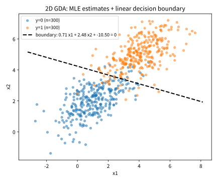

# 3.2 가우시안 판별분석 (GDA)

[](https://colab.research.google.com/github/SuminHan/book-ml/blob/main/notebooks/ml1/chapter03_2_gda.ipynb)

### 왜 가우시안인가: 연속 데이터에 가장 자연스러운 가정

3.1절에서 생성적 분류기는 "각 클래스가 데이터를 어떻게 만들어내는가"
(\\(P(x|y)\\))를 먼저 모델링하고 베이즈 정리로 뒤집는다고 배웠다. 그런데 이
'만들어내는 법'을 쓰려면 \\(x\\)에 대한 **구체적인 분포**를 골라야 한다.
\\(x\\)가 이산값(문서의 단어 등장 여부 같은)이면 자연스러운 선택은 빈도
카운팅 — 3.3절의 나이브베이즈가 하는 일이다. 그런데 \\(x\\)가 실수 벡터인
연속값(키, 공부 시간, 픽셀 값 등)이면? 가장 자연스러운 선택은 **가우시안
분포**(정규분포)다. 이유는 두 가지다. 첫째, 가우시안은 평균 \\(\mu\\)와
공분산 \\(\Sigma\\)라는 두 파라미터만으로 "중심이 어디에 있고" "얼마나
퍼져 있는지"를 표현할 수 있어 간결하다. 둘째, 현실의 많은 연속 측정값은
수많은 작은 효과의 합으로 만들어지는데, 중심극한정리 덕분에 이런 합은
분포가 가우시안에 가까워지는 경향이 있다. 각 클래스를 가우시안으로
모델링하는 이 분류기가 바로 **가우시안 판별분석**(GDA)이다. 이진 분류라면:

\\[y \sim \text{Bernoulli}(\phi), \qquad x \mid y{=}0 \sim
\mathcal{N}(\mu\_0, \Sigma), \qquad x \mid y{=}1 \sim \mathcal{N}(\mu\_1, \Sigma)\\]

두 클래스가 **같은 공분산 행렬** \\(\Sigma\\)를 공유하되, 평균 \\(\mu\_0,
\mu\_1\\)만 다르다고 가정한다(두 클래스의 데이터가 같은 "모양"으로 퍼져
있지만 중심 위치만 다르다는 뜻). 파라미터 \\(\phi, \mu\_0, \mu\_1, \Sigma\\)는
학습 데이터의 평균·공분산을 그대로 계산해서 구한다(최대우도추정, maximum
likelihood estimation) — 경사하강법 없이 닫힌 형태로 바로 구해진다는 점이
로지스틱회귀와의 실전적 차이다.

### 파라미터 추정: 그냥 평균·공분산을 세면 된다 (최대우도)

"평균·공분산을 그대로 계산"한다는 말을 조금 더 구체적으로 풀어보자.
**최대우도추정**(MLE)은 학습 데이터를 "가장 그럴듯하게" 설명하는 파라미터를
뽑는 것인데, 데이터가 서로 독립이면 전체 데이터의 확률은 각
\\(P(x\_i, y\_i)\\)의 곱이고, 로그를 취하면 합이 된다:

\\[\ell(\phi, \mu\_0, \mu\_1, \Sigma) =
\sum\_{i: y\_i=0} \log P(x\_i \mid y{=}0) + \sum\_{i: y\_i=1} \log
P(x\_i \mid y{=}1) + \sum\_i \left[ y\_i \log \phi + (1{-}y\_i) \log (1{-}\phi) \right]\\]

이 것을 각 파라미터로 편미분해서 0이 되는 점을 풀면(이번 장 연습문제
2번의 전개와 같은 계산), 해가 놀랍도록 단순한 "샘플 통계량"으로
나온다:

- \\(\hat{\phi}\\) = 학습 데이터 중 \\(y{=}1\\)인 비율 — 사전확률의 추정
- \\(\hat{\mu}\_0, \hat{\mu}\_1\\) = 클래스별 **샘플 평균**
- \\(\hat{\Sigma}\\) = 모든 샘플의 **클래스 평균 기준 편차를 함께 모아서**
  (pooling) 제곱평균:

\\[\hat{\Sigma} = \frac{1}{N} \sum\_{i=1}^{N} (x\_i - \hat{\mu}\_{y\_i})(x\_i -
\hat{\mu}\_{y\_i})^T\\]

여기서 \\(\hat{\mu}\_{y\_i}\\)는 샘플 \\(i\\)가 속한 클래스의 평균이다 —
분모가 클래스별 샘플 수 \\(n\_0, n\_1\\)이 아니라 전체 \\(N = n\_0 + n\_1\\)인
것에 주목하라. 바로 두 클래스의 편차를 **합쳐서** 평균내기 때문이다.
위 1차원 예시에서 "편차 6개를 한꺼번에" 나누던 것과 똑같은 절차다. 이것이
"닫힌 형태"의 구체적 의미다 — 로지스틱회귀가 경사하강으로 \\(w, b\\)를
반복 탐색해야 하는 반면, GDA는 이 수식에 대입하는 순간 파라미터가
끝난다(2.2절 정규방정식의 "한 번에 풀기"와 같은 계열의 기법). (세세한
차이로, 통계학에서는 편차를 \\(N{-}d{-}1\\)로 나누어 편향을 없애는
버전도 쓰지만, 학습에는 위 MLE 버전이 표준이며 데이터가 커지면 차이가
없어진다.)

### 손으로 한 번: 1차원 GDA로 결정 경계 직접 구하기

행렬 연산 없이 원리를 눈으로 보기 위해, 특징이 하나뿐인(1차원) 가장 단순한
경우부터 손으로 풀어보자. "공부 시간(시간)으로 시험 합격/불합격을
예측"하는 문제라 하고, 불합격 그룹의 공부 시간이 \\([2, 3, 4]\\), 합격
그룹은 \\([6, 7, 8]\\)이라 하자(두 그룹 크기가 같으므로 사전확률은
\\(\phi=0.5\\)로 동일).

각 그룹의 평균(1차원이므로 \\(\Sigma\\) 대신 스칼라 분산 \\(\sigma^2\\)을 쓴다):

\\[\mu\_0 = \frac{2+3+4}{3} = 3, \qquad \mu\_1 = \frac{6+7+8}{3} = 7\\]

공유 분산은 두 그룹의 편차를 **함께 모아서** 평균 낸 것이다(그룹별로 각각
평균을 뺀 편차 6개를 한꺼번에 제곱평균):

\\[\sigma^2 = \frac{(2{-}3)^2+(3{-}3)^2+(4{-}3)^2+(6{-}7)^2+(7{-}7)^2+(8{-}7)^2}{6}
= \frac{1+0+1+1+0+1}{6} = \frac{2}{3} \approx 0.667\\]

사전확률이 두 클래스 모두 0.5로 같으므로, 결정 경계(두 클래스의 사후확률이
같아지는 지점)는 정확히 두 평균의 중점이 된다:

\\[x^\* = \frac{\mu\_0+\mu\_1}{2} = \frac{3+7}{2} = 5\\]

실제로 \\(x{=}4.5\\)와 \\(x{=}5.5\\)에서 각 클래스의 확률밀도를 직접
계산해 비교해보면(스크래치패드에서 검증):

| \\(x\\) | \\(P(x\\|y{=}0)\\)에 비례 | \\(P(x\\|y{=}1)\\)에 비례 | 예측 |
|---|---|---|---|
| 4.5 | 0.0452 | 0.0022 | 0 (불합격) |
| 5.0 | 0.0122 | 0.0122 | 경계(동점) |
| 5.5 | 0.0022 | 0.0452 | 1 (합격) |

정확히 \\(x{=}5\\)를 기준으로 예측이 뒤집힌다 — 손으로 구한 \\(x^\*=5\\)와
정확히 일치한다. 실전에서 다루는 GDA는 특징이 여러 개(다차원)이고
\\(\sigma^2\\) 대신 공분산 **행렬** \\(\Sigma\\)를 쓰지만, "두 평균의
중점 근처에서 결정 경계가 생긴다"는 직관 자체는 그대로 유지된다.

### 결정 경계의 모양: 왜 항상 직선이 되는가

2차원 GDA의 결정 경계가 어떤 모양인지 확인해보자. 결정 규칙은
\\(P(y{=}1|x) > P(y{=}0|x)\\)일 때 1을 고르는 것인데, 양변에 로그를 취하면
**로그 우도비** \\(z(x) = \log \frac{P(y{=}1|x)}{P(y{=}0|x)}\\)가 0보다
큰가 아닌가로 바뀐다. 가우시안 밀도와 사전확률을 대입하면:

\\[z(x) = -\tfrac{1}{2}(x{-}\mu\_1)^T\Sigma^{-1}(x{-}\mu\_1) +
\tfrac{1}{2}(x{-}\mu\_0)^T\Sigma^{-1}(x{-}\mu\_0) + \log\tfrac{\phi}{1{-}\phi}\\]

여기서 핵심 한 줄: \\((x{-}\mu)^T\Sigma^{-1}(x{-}\mu)\\)를 전개하면
\\(x^T\Sigma^{-1}x\\) 항이 **두 클래스 모두에** 나타나는데, \\(\Sigma\\)를
공유하므로 이 이차항이 **정확히 상쇄**된다. 남는 것은 \\(x\\)에 대한
**일차식**뿐이다:

\\[z(x) = w^Tx + b, \qquad w = \Sigma^{-1}(\mu\_1{-}\mu\_0), \qquad
b = -\tfrac{1}{2}(\mu\_1{-}\mu\_0)^T\Sigma^{-1}(\mu\_1{+}\mu\_0) +
\log\tfrac{\phi}{1{-}\phi}\\]

즉 결정 경계 \\(z(x){=}0\\)는 **직선**(\\(d\\)차원이면 초평면) —
"**선형** 판별"이라는 이름이 바로 여기에서 온다. 두 가지 관찰이
값지울(worthwhile) 정도는 아니다. 핵심만 짚자:

- **\\(w\\)의 방향은 "마할라노비스(Mahalanobis) 거리"로 두 평균을
  잇는 방향**이다. \\(\Sigma^{-1}\\)이 데이터의 퍼진 모양에 맞게
  방향을 보정하기 때문이다. 데이터가 어떤 방향(예: \\(x\_1\\)축)으로
  넓게 퍼져 있으면, 그 방향의 차이는 두 클래스를 구별하는 데
  정보가 덜하므로 \\(\Sigma^{-1}\\)가 그 방향의 기여를 줄여준다.
  반대로 두 클래스가 좁게 모여 있는 방향은 증폭된다.
  \\(\Sigma = \sigma^2 I\\)(방향이 없는 원형)인 특별한 경우에는
  \\(w\\)가 그냥 \\(\mu\_1{-}\mu\_0\\)에 비례한다 — "두 평균을 잇는
  수직선에 경계를 긋는" 초보 직관이 그대로 성립한다.
- **사전확률 \\(\phi\\)는 방향이 아니라 위치(\\(b\\))만 움직인다.**
  \\(\phi\\)는 \\(\log(\phi/(1{-}\phi))\\) 항에만 등장한다. 클래스 비율이
  무엇이든 직선의 **기울기는 그대로**고, 직선이 **밀리는 정도**만
  바뀐다 — 이 효과를 숫자로 확인하는 것이 바로 "실습" 부분 바로
  다음 절이다.

(전개 과정의 전체 유도는 이번 장 연습문제 2번이 담당한다. 연습문제
2번의 "정확성 확인" 부분에서 \\(\Sigma\_0 \ne \Sigma\_1\\)인 경우를
묻는데 — 이차항이 상쇄되지 않아 결정 경계가 **곡선**(쌍곡선)이 되며,
이것이 바로 **이차판별분석**(Quadratic Discriminant Analysis, QDA)이다.)

### 로지스틱회귀와 만나는 지점

**놀라운 사실**: 이렇게 구한 \\(P(y=1|x)\\)를 베이즈 정리로 전개하면, 정확히
Chapter 2의 로지스틱회귀와 **같은 시그모이드 형태** \\(P(y=1|x) =
\sigma(w^Tx+b)\\)가 나온다(유도는 이번 장 연습문제 2번). 즉 GDA는 "로지스틱
회귀와 같은 결정 경계(직선)에 도달하는 또 다른 길"이다 — 다만 가는
경로(데이터가 정규분포를 따른다고 먼저 가정하는가, 아니면 결정 경계를
바로 학습하는가)가 다르다. 데이터가 실제로 가우시안에 가깝다면 GDA가 더
적은 데이터로도 잘 맞고, 그 가정이 틀렸다면 판별적 모델(로지스틱회귀)이
더 안정적인 경향이 있다 — "모델을 데이터에 맞출 것인가, 데이터가 모델을
따른다고 가정할 것인가"라는, 생성적 모델과 판별적 모델의 근본적인
트레이드오프다[^cs229]. 이 주장도 아래 "실현" 절에서 수치로 바로 확인한다 —
2차원 가우시안 데이터에서 GDA의 닫힌 형태가 내놓는 \\(w, b\\)와,
로지스틱회귀를 경사하강으로 적합해 얻은 \\(w, b\\)는 거의 같은 방향을
향한다.

### 유명한 사례: 피셔의 1936년 "선형 판별"

GDA가 기계학습 시대에 처음 등장한 모델은 아니다. 1936년, **로널드
피셔**(Ronald Fisher — 분산분석(ANOVA)과 최대우도추정 방법을 세운
통계학자)는 "분류 문제에서 다중 측정의 이용"(The Use of Multiple
Measurements in Taxonomic Problems)이라는 논문을 발표했다[^fisher1936]. 문제는
아이리스(iris) 꽃의 종을, 꽃술·꽃잎(세팔·페탈)의 길이·너비 같은 **여러
측정값**으로 분류하는 것이었다. 피셔의 아이디어: 각 꽃을 단일 숫자
\\(z = w^Tx\\)로 "꾄" 다음, **두 종의 중심 간 거리**를 **각 종 내부의
퍼진 정도**로 나눈 비를 **최대화**하는 방향 \\(w\\)를 찾자 —

\\[\text{최대화 } \frac{(\text{종 간 중심 사이 분산})}{(\text{종
내부 분산})} = \frac{w^T S\_B w}{w^T S\_W w}\\]

이 비(레이리 코시언트, Rayleigh quotient)를 풀면 나오는 최적 방향은
\\(w \propto S\_W^{-1}(\mu\_1{-}\mu\_0)\\) — **공유 공분산 GDA가 가우시안
모델에서 도출해 내는 \\(w\\)와 정확히 같은 방향**이다. 즉, "데이터를
가우시안으로 모델링하고 베이즈 정리로 뒤집은 경로"와 "분류 성능
기준(분류 간 거리/내부 퍼짐)을 직접 기하학적으로 최적화한 경로"는
**같은 직선**을 내놓는다 — 철학이 완전히 다른 두 경로가 같은 곳에 도착
하는 것은, 가우시안이라는 가정이 "잘못된 모양"이 아님을 보여주는
작지만 설득력 있는 증거다. 이 모델은 오늘날 **피셔 선형 판별**
(Fisher's Linear Discriminant, LDA)으로 불리며, 이진 분류 + 공유
공분산의 경우 "피셔 LDA"와 "GDA"는 이름만 다른 **同一个(同一個, "동일한 하나")** 모델이다.

### 실현: numpy로 GDA 구현하기[^numpy]

이 절의 수식을 그대로 코드로 옮기자. `fit_gda`는 최대우도추정(위의
닫힌 형태)을, `gda_scores`는 로그 우도비 \\(z(x) = w^Tx + b\\)를 계산
한다:

```python
import numpy as np

def fit_gda(X, y):
    """GDA 파라미터 (phi, mu0, mu1, Sigma)의 최대우도추정."""
    phi = y.mean()                                  # P(y=1) 추정
    mu0, mu1 = X[y == 0].mean(axis=0), X[y == 1].mean(axis=0)
    d0, d1 = X[y == 0] - mu0, X[y == 1] - mu1
    Sigma = (d0.T @ d0 + d1.T @ d1) / len(X)        # 두 클래스 편차 pooling
    return phi, mu0, mu1, Sigma

def gda_scores(X, phi, mu0, mu1, Sigma):
    """log P(y=1|x)/P(y=0|x) = w^Tx + b  (결정 경계는 직선!)"""
    Sigma_inv = np.linalg.inv(Sigma)
    w = Sigma_inv @ (mu1 - mu0)
    b = -0.5 * (mu1 - mu0) @ Sigma_inv @ (mu1 + mu0) + np.log(phi / (1 - phi))
    return X @ w + b, w, b

rng = np.random.default_rng(42)
mu0, mu1 = np.array([1.0, 2.0]), np.array([4.0, 5.0])
Sigma_true = np.array([[1.5, 0.8], [0.8, 1.2]])
X = np.vstack([rng.multivariate_normal(mu0, Sigma_true, 300),
               rng.multivariate_normal(mu1, Sigma_true, 300)])
y = np.concatenate([np.zeros(300), np.ones(300)])

phi, mu0_hat, mu1_hat, Sigma_hat = fit_gda(X, y)
print(np.round(mu0_hat, 2), np.round(mu1_hat, 2))  # 참 평균에 근접
scores, w, b = gda_scores(X, phi, mu0_hat, mu1_hat, Sigma_hat)
print("w =", np.round(w, 3), " b =", round(b, 3))
```

추정된 \\(\hat{\mu}\_0, \hat{\mu}\_1\\)이 참 평균 \\([1, 2], [4, 5]\\)에
접근하는 것을 확인할 수 있다(표본 300개·300개라 샘플링 노이즈가 ±0.1
정도 섞여 있다). 결정 경계는 \\(w\_0 x\_1 + w\_1 x\_2 + b = 0\\)인 직선인데,
아래 [실습 노트북](https://colab.research.google.com/github/SuminHan/book-ml/blob/main/notebooks/ml1/chapter03_2_gda.ipynb)에서
이 직선을 데이터 위에 겹쳐 그린다.



### 실습: sklearn LDA로 GDA 확인하기[^scikitlearn]

scikit-learn의 `LinearDiscriminantAnalysis`(LDA)가 정확히 "공분산을
공유하는" GDA에 해당한다. 위 손 계산과 같은 데이터로 확인해보자:

```python
import numpy as np
from sklearn.discriminant_analysis import LinearDiscriminantAnalysis

X = np.array([[2.0], [3.0], [4.0], [6.0], [7.0], [8.0]])
y = np.array([0, 0, 0, 1, 1, 1])

lda = LinearDiscriminantAnalysis()
lda.fit(X, y)
print(lda.predict([[4.5], [5.0], [5.5]]))   # [0 ? 1] (5.0 근처가 경계)
print(lda.means_)                            # [[3.] [7.]]
```

`lda.means_`가 손으로 구한 \\(\mu\_0{=}3, \mu\_1{=}7\\)과 정확히 일치하는
것을 확인할 수 있다 — sklearn 안에서는 "LDA"라는 이름을 쓰지만, 이진
분류에서 공분산을 공유하는 가정 하에서는 이번 절에서 배운 GDA와 완전히
같은 모델이다. 참고로 `predict`의 실제 출력은 \\([0, 0, 1]\\)이다 —
\\(x{=}5.0\\)은 정확히 경계 위에서 두 클래스의 점수가 동점이므로,
sklearn은 내부적으로 "동점이면 클래스 0" 규칙을 적용한다. "실현" 절의
numpy GDA와 sklearn LDA를 2차원 데이터에서 동시에 돌려보면, 두 모델의
결정 방향(\\(w\\)의 방향)은 동일하고 예측도 거의 모든 데이터에서
일치함을 확인할 수 있다(결정 경계는 같은 직선이고, 확률값만 스케일
상수 차이로 스케일링될 뿐이므로).

### 가정이 깨질 때: 불균형한 사전확률의 효과

"\\(\phi\\)는 경계의 위치만 미는" 역할이 실제로 얼마나 큰지, 앞서
손으로 푼 예시(\\(\mu\_0{=}3, \mu\_1{=}7, \sigma^2{=}2/3\\))에 숫자를
대입해 보자. 이번엔 불합격 클래스 0이 80%, 합격 클래스 1이 20%인
"매우 어려운 시험" 상황을 상상한다(\\(\phi\_0{=}0.8, \phi\_1{=}0.2\\)).
1차원 GDA의 로그 우도비는 항상 \\(x\\)에 대한 일차식이 되는데,
전개하면:

\\[z(x) = 6x - 30 + \log\tfrac{0.2}{0.8}\\]

(\\(6x{-}30\\)은 \\((x{-}3)^2\\)과 \\((x{-}7)^2\\)을 전개해서 이차항을
상쇄한 결과, 마지막 항이 사전확률의 로그 비). 경계 \\(z(x){=}0\\)은:

\\[x^\* = \frac{30 + \log(0.8/0.2)}{6} = \frac{30 + 1.386}{6} \approx
5.23\\]

클래스가 50:50일 때 경계는 \\(x^\*{=}5\\)였는데, "불합격"이 많아지자
경계가 **5.23으로, 소수 클래스(합격) 쪽으로** 밀렸다. 분류기가 소수
클래스에 대해 **보수적**이 된 것이다 — 이 장면은 3.1절의 "기저율
오류"(병이 드문데 검사가 양성이 나와도 실제 발병 확률은 9%
뿐)과 정확히 같은 이야기다. "증거(가능도)가 아무리 강해도 사전확률이
낮으면 사후확률은 기대만큼 올라가지 않는다"는 사실이, **결정 경계가
물리적으로 이동하는** 형태로 나타나는 것. 실전 데이터의 클래스
비율이 9:1처럼 기울어 있으면, GDA는 "소수 클래스로 예측하기 전에
더 확실한 증거"를 요구하며 자동으로 경계를 옮겨준다. [실습
노트북](https://colab.research.google.com/github/SuminHan/book-ml/blob/main/notebooks/ml1/chapter03_2_gda.ipynb)에서는
이 효과를 2차원으로 시각화한다 — 기울이는 같은 직선이 \\(\phi\\) 값에
맞게 **병렬 이동**하는 것을 직접 볼 수 있다.

### 자주 하는 실수: 공분산이 실제로 다른데 "공유"라고 가정하기

GDA는 두 클래스가 **같은 모양**(공분산)으로 퍼져 있다고 가정한다. 만약
실제로는 한 클래스가 다른 클래스보다 훨씬 넓게 퍼져 있다면(예: 불합격
그룹은 촘촘한데 합격 그룹은 공부 시간 편차가 훨씬 큰 경우) 이 가정이
깨진다 — 위 예시의 분산을 각각 따로 계산하면(\\(\text{fail}=[2,3,4]\\),
\\(\text{pass}=[6.5, 7, 10.5]\\)) \\(\sigma\_0^2 \approx 0.667\\),
\\(\sigma\_1^2 \approx 3.167\\)로 거의 5배 차이가 난다. 이런데도 공유
공분산을 강제하면, 실제보다 넓게 퍼진 클래스의 "진짜 모양"을 무시하고
평균적인 모양 하나로 뭉뚱그리게 되어 결정 경계가 부정확해진다. 이 경우
클래스마다 **다른** 공분산 \\(\Sigma\_0 \ne \Sigma\_1\\)을 허용하는
**이차판별분석**(Quadratic Discriminant Analysis, QDA, 연습문제 2번의
"정확성 확인" 참고)을 쓰면 결정 경계가 직선이 아니라 곡선(이차식)이
되어 이런 상황을 더 잘 표현할 수 있다 — 다만 그만큼 추정해야 할
파라미터가 늘어나 더 많은 데이터가 필요해진다는 트레이드오프가 따른다.

### 자주 묻는 질문

**Q. \\(\Sigma\\)를 공유한다는 가정이 항상 나쁜 건가요?** 아니다 —
오히려 데이터가 적을 때는 장점이 된다. 공분산 행렬 하나를 두 클래스가
공유하면 추정해야 할 파라미터 수가 절반으로 줄어서(QDA처럼 클래스마다
따로 추정하는 것보다), 데이터가 적어도 비교적 안정적으로 추정된다.
데이터가 충분히 많고 실제로 클래스마다 퍼진 모양이 다르다면 QDA가 더
정확할 수 있다.

**Q. GDA가 로지스틱회귀와 같은 결정 경계로 수렴한다면, 왜 로지스틱회귀
대신 GDA를 쓰나요?** 데이터가 실제로 정규분포에 가깝고 표본 수가 적을
때, GDA는 "정규분포"라는 강한 사전 지식을 활용해서 로지스틱회귀보다
빠르게(적은 데이터로도) 안정적인 추정에 도달한다. 반면 로지스틱회귀는
그런 가정이 없는 대신 데이터가 정규분포를 따르지 않아도 안정적으로
작동한다 — 3.1절 FAQ에서 다룬 "생성적 vs 판별적" 트레이드오프가 정확히
이 지점에서 실전 선택 기준이 된다.

**Q. 특징이 표본보다 많아서 \\(\hat{\Sigma}\\) 역전역이 안 되면
어떻게 하나요?** 공분산 행렬이 비특이(역전행렬 존재)가 되려면 대략
표본 수 \\(N\\)이 특징 수 \\(d\\)보다 커야 한다. \\(N \le d\\)이면
(예: 문장 수백 개에 단어 특징 수천 개) \\(\hat{\Sigma}\\)가 특이 행렬이
되어 \\(\Sigma^{-1}\\) 자체가 존재하지 않는다. 실전에서는 작은 대각
항을 더해 역전역을 가능하게 만든다: \\(\hat{\Sigma} \leftarrow
\hat{\Sigma} + \lambda I\\)("자이더" 또는 대각 정규화라 부른다).
이는 2.1절에서 본 정규화(L2 페널티)와 같은 직관이다 — "데이터가
부족하면 샘플 통계를 100% 믿지 말고, 더 안전한 모양으로 당긴다".
다만 특징 수가 매우 큰 영역(텍스트 등)에서는 공분산 행렬 자체를
피하는 모델(3.3절의 나이브베이즈)로 갈아타는 것이 보통 더 낫다.

**Q. GDA는 이진 분류에서만 쓰나요?** 아니다 — \\(K\\)개 클래스라면
각 클래스에 하나의 가우시안(\\(\mu\_k, \Sigma\\), 공유)을 두고
\\(P(x|y{=}k)P(y{=}k)\\)가 가장 큰 클래스를 예측하면 된다. 어느 두
클래스 사이의 결정 경계도 이번 절에서 유도한 "일차함수" 형태이므로
여전히 선형 판별이다(QDA의 경우엔 각 쌍마다 다른 곡선). 3클래스
이상의 경우에는 "공분산을 모든 클래스가 공유"할지, "클래스마다
따로"할지 등 추가 선택지가 생기며, sklearn의 LDA/QDA가 이 옵션들을
직접 지원한다.

[^cs229]: 이 주제를 더 깊이 다루는 자료: Stanford CS229: Machine Learning, Lecture Notes. https://cs229.stanford.edu/main_notes.pdf
[^fisher1936]: Fisher, R. A. (1936). "The Use of Multiple Measurements in Taxonomic Problems." Annals of Eugenics 7(2), 179–188. — 선형 판별(LDA)의 원 논문.
[^numpy]: Harris, C. R. et al. (2020). "Array programming with NumPy." Nature 585, 357 (2020); arXiv:2006.10256.
[^scikitlearn]: Pedregosa, F. et al. (2012). "Scikit-learn: Machine Learning in Python." arXiv:1201.0490.
