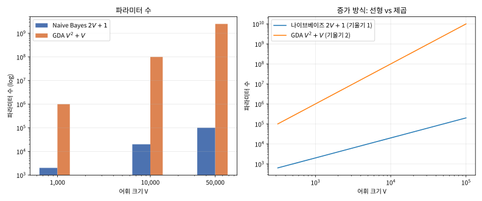

# 3.3 나이브베이즈: 독립을 가정하고 차원의 저주를 피한다

[](https://colab.research.google.com/github/SuminHan/book-ml/blob/main/notebooks/ml1/chapter03_3_naivebayes.ipynb)

### 독립 가정으로 차원의 저주를 피하다

GDA[^gda]는 \\(x\\)가 저차원 연속값일 때는 잘 맞지만, 스팸 필터처럼 \\(x\\)가
"어휘 사전 크기(수만 개)만큼의 차원을 가진, 각 단어의 등장 여부" 같은
고차원 데이터라면 공분산 행렬 \\(\Sigma\\)(어휘 크기 × 어휘 크기)를 추정하는
것 자체가 감당이 안 된다. **나이브베이즈**(Naive Bayes)는 과감한 단순화로
이 문제를 피한다 — 클래스 \\(y\\)가 주어지면 **각 특징(단어)이 서로
독립**이라고 가정해버린다:

\\[P(x|y) = \prod\_{j=1}^n P(x\_j|y)\\]

"나이브(순진)"라는 이름은 이 가정이 현실적으로 거의 항상 틀리기 때문이다 —
"무료"라는 단어와 "당첨"이라는 단어는 스팸 메일에서 실제로 같이 나타나는
경향이 있어 독립이 아니다. 그런데도 나이브베이즈는 실전에서(특히 텍스트
분류) 놀랄 만큼 잘 작동한다 — 각 \\(P(x\_j|y)\\)는 데이터에서 단어 \\(j\\)의
빈도만 세면 바로 추정되므로, 어휘가 아무리 커도 파라미터 수가 어휘
크기에 **선형**으로만 늘어난다(GDA의 공분산 행렬처럼 제곱으로 늘지 않는다).

### 파라미터 수: 나이브베이즈가 이기는 자리

"선형으로만 늘어난다"는 말의 무게를 숫자로 확인해보자. 이진 분류에서
파라미터 수를 비교하면:

| 어휘 크기 \\(V\\) | 나이브베이즈 \\(2V+1\\) | GDA \\(V^2+V\\) | 격차 |
|---|---|---|---|
| 1,000 | 2,001 | 1,001,000 | 약 500배 |
| 10,000 | 20,001 | 100,010,000 | 약 5,000배 |
| 50,000 | 100,001 | 2,500,050,000 | 약 25,000배 |

(나이브베이즈 쪽 \\(+1\\)은 사전확률 \\(\phi\\) 하나를, GDA 쪽 \\(+V\\)는
\\(\mu\_1-\mu\_0\\) 평균 차 벡터 \\(V\\)개를, \\(V^2\\)은 공분산 행렬을
세운 것이다 — 3.2절에서 GDA가 \\(\mu\_0, \mu\_1, \Sigma, \phi\\)를 추정한다고
배운 바로 그 파라미터들이다.)



왜 차원이 커지면 파라미터 수의 **증가 방식**이 분류 품질을 좌우하는가?
파라미터는 데이터에서 직접 "계산해서" 얻는 값인데, 표본 수에 비해
파라미터가 많으면 각각의 추정치가 실제 값 근처가 아니라 **노이즈 근처**를
돌게 된다. \\(\Sigma\\)의 각 원소는 "단어 \\(i\\)의 등장 여부와 단어 \\(j\\)의
등장 여부가 얼마나 함께 변하는가"를 헤아리는 추정치인데, 메일 수만 수천
통이면 이 수백만 개의 추정치가 전부 "데이터가 아니라 노이즈에 대한
추정"이 되어버린다 — 4.2절에서 다룰 **차원의 저주**가 분류기에 물리치는
전형적인 방식이다. 나이브베이즈는 \\(\Sigma\\)의 모든 옳각성분(off-diagonal)을
**0이라고 선언**하는 것(= 독립 가정)으로 이 문제를 원천적으로 피한다.
"정확히는 틀린 가정이지만, 틀려도 안전한 방향"으로 틀리는 것인데 —
독립을 깨뜨려 상관까지 추론하려다 노이즈를 모델링하게 되는 것보다, 상관
전체를 무시하고 대각선만 정확히 세는 쪽이 차원이 크면 거의 항상
이득이다.

### 왜 단어 간 의존성을 무시해도 되나 (그리고 어디서 깨지나)

3.1절 FAQ에서 "순위는 맞기만 하면 된다"고 했지만, 독립 가정이 정확히
어떤 방향으로 틀리는지 한 번 살펴보자. "무료"와 "당첨"은 실제로 서로
독립이 **아니다**(스팸에서 같이 나올 확률이 높다). 나이브베이즈는 이
단어들을 "클래스가 주어지면 독립"이라 가정하고 가능도를
\\(P(\text{무료}|\text{spam}) \times P(\text{당첨}|\text{spam})\\)로
곱해서 — 실제로는 그보다 **더 큰** 값이 될 가능성을 무시한 채 —
계산한다. 즉 독립 가정은 "같은 클래스 안의 증거가 쌓이면 쌓을수록"
가능도를 **과대평가**하는 편향(bias)을 만든다.

그런데 중요한 점은 이 과대평가가 **두 클래스 모두에 동시에** 일어난다는
것이다. 스팸 메일의 "무료+당첨" 조합을 과대평가하듯, 정상 메일 쪽도
자신들의 상관관계(예: "회의"와 "보고서"가 같이 나오는 현상)를 무시해서
같은 방식으로 과대평가한다. 두 클래스의 점수가 **비슷한 방향으로**
왜곡되면 어느 쪽이 위에 있는가(순위)는 거의 바뀌지 않는다 — "두 후보의
점수를 둘 다 10%씩 부풀렸을 때 누가 이기나"는 원래의 점수 순서와
동일한 경우가 대부분이다.

**그런데 이 안전장치는 항상 작동하지 않는다.** 의존성의 방향이 두
클래스에서 **다르면** 순위가 뒤집힐 수 있다. 예: "무료"와 "당첨"이
스팸에서 강하게 같이 나오지만, 정상 메일에서는 "무료"가 나올 때
"당첨"이 오히려 안 나오는(음의 상관) 패턴이라면, 나이브베이즈가
과대평가하는 크기가 클래스마다 달라져 스팸 점수만 불리하게 부풀어
오를 수 있다. 실전에서 이런 패턴은 드물지만(스팸/정상 모두 "비슷한
단어가 뭉쳐 나오는" 구조를 공유하는 경우가 많음), "나이브베이즈가
영원히 틀리지 않는다"가 아니라 "틀리더라도 대개 **동일한 방향**으로
틀린다"는 점이 정확한 이해다.

### 간단한 역사: 스펠링 수정기에서 스팸 필터까지

나이브베이즈가 "스팸 필터"로만 알려졌지만, 실용화 된 역사는 스팸보다
한 세대 앞선다. 1980년대 후반~1990년대에 Peter Norvig[^norvig]와 Peter
Fellbaum 등 연구자들이 **자동 스펠링 수정**(spell correction)에
나이브베이즈를 썼다 — "단어 하나가 틀려졌을 때, 원래 정답이 어떤
단어였을 확률"을 \\(P(\text{타자 오류}|\text{정답 단어}) P(\text{정답
단어})\\)로 모델링했는데, "타자 오류"를 인접 키/유사 철자로, "정답
단어"를 사전 빈도로 독립적으로 가정하는 것은 스팸 필터의 "단어
등장 여부" 모델과 구조가 거의 동일하다(이 아이디어는 2.3절에서
다룰 Viterbi 알고리즘의 전신이기도 하다).

2002년, 이 책의 Chapter 3 도입부에서 소개한 폴 그레이엄(Paul Graham)이
"A Plan for Spam"[^planforspam]에서 나이브베이즈 스팸 필터를 대중화했다. 그레이엄은
단순히 "나이브베이즈를 쓰자"는 것뿐 아니라, 스팸의 사전확률이 시간
경과에 따라 변하는(1990년대엔 스팸이 30%였는데 2000년대엔 90%에
다가갔다) 현실을 반영해 **사전확률을 학습 데이터의 클래스 비율로
계속 갱신해야 한다**는 점과, **단어 하나만으로는 판단하지 않고 모든
단어의 로그 가능도를 더해야 한다**는 점을 강조했는데, 이 두 가지는
바로 이번 절에서 다룬 "기저율 오류를 피하라(3.1절)"와 "로그를
더하라"와 정확히 겹친다. "독립을 가정하고 빈도를 세라"는 간단한
원리가, 스펠링 수정 → 스팸 필터 → 텍스트 분류(감성 분석, 주제
분류) → 의문문 감지 → 챗봇의 의도 분류까지, 텍스트 분류의 기본
기초(baseline)가 돼 온 이유를 기억해두면 좋다 — "우선 나이브베이즈를
돌려보고, 그 정확도가 어느 정도인지부터 확인하라"는 실전 습관의
출발점이다.

### 다항 vs 베르누이: 독립 가정의 두 버전

위 코드는 각 단어가 **등장했는가(0/1**)만 세는 **베르누이**(Bernoulli)
나이브베이즈다. 그런데 같은 독립 가정이라도 "단어가 몇 번 나왔는가"
까지 세는 **다항**(Multinomial) 나이브베이즈가 있다:

- **베르누이 나이브베이즈**: \\(x\_j \in \\{0,1\\} \\) "단어 \\(j\\)가
  문서에 등장했는가". 문서의 **길이와 무관**하다("free"가 1번이든
  10번이든 '등장' 1건으로 카운트) — 문서 길이가 신호가 되는 문제
  (짧은 제목 vs 긴 본문)에선 유용하다.
- **다항 나이브베이즈**: \\(x\_j = \\) "단어 \\(j\\)가 문서에서 몇 번
  나온 횟수", \\(P(x|y) = \prod\_j P(x\_j|y)^{x\_j}\\) (다항분포) —
  "free"가 10번 나온 메일은 1번 나온 메일보다 확실히 더 스팸처럼
  보이길 원할 때(대부분의 스팸/감성 분석) 더 자연스럽다.

둘 다 "클래스가 주어지면 단어들이 독립"이라는 같은 가정을 쓰지만,
**등장 여부(0/1) 모델**이냐 **등장 횟수(0,1,2,…) 모델**이냐의
차이일 뿐이다. 실전에서는 보통 다항이 더 잘 되는 경우가 많고
(scikit-learn의 `MultinomialNB`[^scikit-learn]), 이번 절 코드는 교육적으로 단순한
베르누이 버전을 선택했다 — 둘 다 나이브베이즈의 "독립 가정 + 빈도
추정" 구조를 공유하므로 핵심 논리는 동일하다.

### 실습: 나이브베이즈 스팸 필터 구현

```python
import math

def train_naive_bayes(emails, labels):
    # emails: 단어 리스트의 리스트, labels: 0(정상)/1(스팸) 리스트
    vocab = set(w for email in emails for w in email)
    n_spam = sum(1 for l in labels if l == 1)
    n_ham = len(labels) - n_spam
    word_counts = {0: {}, 1: {}}
    for email, label in zip(emails, labels):
        for w in set(email):  # 등장 여부만 세는 Bernoulli 나이브베이즈
            word_counts[label][w] = word_counts[label].get(w, 0) + 1
    return {"vocab": vocab, "word_counts": word_counts,
            "n_spam": n_spam, "n_ham": n_ham, "n_total": len(labels)}

def classify(email, model):
    words = set(email)
    log_prob = {}
    for label, n_docs in [(0, model["n_ham"]), (1, model["n_spam"])]:
        log_p = math.log(n_docs / model["n_total"])  # log P(y)
        for w in model["vocab"]:
            p_present = (model["word_counts"][label].get(w, 0) + 1) / (n_docs + 2)
            log_p += math.log(p_present) if w in words else math.log(1 - p_present)
        log_prob[label] = log_p
    return 1 if log_prob[1] > log_prob[0] else 0
```

이 코드가 "정말" 3.1절의 베이즈 정리와 같은 계산을 하는지, 작은 데이터로
실제 실행해서 확인해보자. 앞의 "다항 vs 베르누이"에서 언급한 **다항**
버전(스팸 8통·정상 8통, 어휘 26개)을 numpy 없이 `math`만으로 한 번
쓰고, **학습에서 보지 못한** 메일 4통으로 분류 정확도를 측정한다(실습
노트북 `chapter03_3_naivebayes.ipynb`의 2번 셀):

```python
import math

def train_multinomial_nb(emails, labels):
    vocab = sorted(set(w for e in emails for w in e))
    counts, nwords, ndocs = {0: {}, 1: {}}, {0: 0, 1: 0}, {0: 0, 1: 0}
    for e, l in zip(emails, labels):
        ndocs[l] += 1
        for w in e:                       # 이번엔 등장 횟수까지 센다
            counts[l][w] = counts[l].get(w, 0) + 1
            nwords[l] += 1
    return {"vocab": vocab, "counts": counts,
            "nwords": nwords, "ndocs": ndocs, "n_total": len(labels)}

def multinomial_log_probs(email, model):
    out = {}
    for l in (0, 1):
        lp = math.log(model["ndocs"][l] / model["n_total"])   # log P(y)
        for w in email:
            p = (model["counts"][l].get(w, 0) + 1) / \
                (model["nwords"][l] + len(model["vocab"]))    # 라플라스
            lp += math.log(p)                                  # log 가능도 합
        out[l] = lp
    return out

spam_train = ["free money now", "win prize today", "free cash click",
              "prize free offer", "money win now", "free click here",
              "prize cash deal", "offer win cheap"]
ham_train = ["meeting project tomorrow", "project deadline review",
             "team meeting report", "meeting notes call", "project update plan",
             "report review friday", "team lunch call", "meeting agenda notes"]

emails = spam_train + ham_train
labels = [1]*8 + [0]*8
model = train_multinomial_nb(emails, labels)

test_emails = [
    ("free prize money", 1),        # 학습에서 보지 못한 스팸 조합
    ("win click offer", 1),
    ("meeting project report", 0),  # 학습에서 보지 못한 정상 조합
    ("team call notes", 0),
]
for email, truth in test_emails:
    lp = multinomial_log_probs(email.split(), model)
    pred = 1 if lp[1] > lp[0] else 0
    print(f"{'SPAM' if truth else 'HAM ':4s} pred={pred} "
          f"margin={abs(lp[1]-lp[0]):.2f} nats  {email!r}")
# 4/4 모두 올바르게 분류:
#   SPAM pred=1 margin=4.09 nats  'free prize money'
#   SPAM pred=1 margin=3.58 nats  'win click offer'
#   HAM  pred=0 margin=4.09 nats  'meeting project report'
#   HAM  pred=0 margin=3.30 nats  'team call notes'
```

여기서 **margin**(로그 점수 차이, nat 단위)이 실전적으로 중요한 지표다.
margin 4.09 nat은 \\(e^{4.09} \approx 60\\)배의 가능도비를 뜻하므로,
"거의 확실하게" 스팸이라는 뜻이다. margin이 0.3 nat밖에 안 되면
\\(e^{0.3} \approx 1.35\\)배 — "거의 동점"이라서 그 메일이 어디에
속을지 데이터가 약간만 바뀌어도 뒤집힐 수 있다. **정확도(맞은 비율)
뿐 아니라 margin 분포까지 보는 것**이 나이브베이즈(그리고 모든
분류기)의 예측을 신뢰하는 방식이다 — margin이 작은 메일만 따로 골라
"모델이 가장 자신 없어하는 예시"를 분석하면, 데이터셋에 어떤
패턴이 부족한지(또는 레이블이 잘못되어 있는지) 빠르게 드러난다.

### 손으로 한 번: 아주 작은 어휘로 나이브베이즈 손 계산하기

위 코드가 실제로 어떤 계산을 하는지 손으로 따라가보자. 어휘를 "공짜",
"회의" 두 단어로 줄이고, 스팸 메일 2통 \\(\\{\text{공짜}\\}\\),
\\(\\{\text{공짜, 회의}\\}\\)와 정상 메일 2통 \\(\\{\text{회의}\\}\\),
\\(\\{\text{회의}\\}\\)로 학습했다고 하자. "공짜"라는 단어가 스팸 2통 중
2통, 정상 0통에 등장했고, "회의"는 스팸 1통, 정상 2통에 등장했다.

새 메일 \\(\\{\text{공짜}\\}\\)("공짜"만 있고 "회의"는 없음)를 분류해보자.
\\(P(y)\\)는 두 클래스 모두 \\(2/4=0.5\\)로 같다. 라플라스 스무딩을 적용한
가능도는:

\\[P(\text{공짜 있음}|\text{spam}) = \frac{2+1}{2+2} = 0.75, \qquad
P(\text{회의 없음}|\text{spam}) = 1 - \frac{1+1}{2+2} = 0.5\\]

\\[P(\text{공짜 있음}|\text{ham}) = \frac{0+1}{2+2} = 0.25, \qquad
P(\text{회의 없음}|\text{ham}) = 1 - \frac{2+1}{2+2} = 0.25\\]

각 클래스의 (정규화 전) 점수를 계산하면, 스팸 쪽은
\\(0.5 \times 0.75 \times 0.5 = 0.1875\\)이고 정상 쪽은
\\(0.5 \times 0.25 \times 0.25 = 0.03125\\)다.

정규화하면 \\(P(\text{spam}|\\{\text{공짜}\\}) =
\frac{0.1875}{0.1875+0.03125} \approx 0.857\\) — "공짜"라는 단 하나의
단어만으로도 스팸일 확률이 85.7%까지 올라간다(가능도비 6:1). 3.1절의 베이즈 정리 계산과
완전히 같은 절차이고, 다만 여기서는 곱해지는 증거(단어)가 "공짜 있음"과
"회의 없음" 두 개로 늘어났을 뿐이다 — 실제 스팸 필터는 어휘 전체(수만 개
단어)에 대해 이 곱을 전부 수행한다.

같은 학습 데이터(스팸: \\(\\{\text{공짜}\\}\\), \\(\\{\text{공짜, 회의}\\}\\);
정상: \\(\\{\text{회의}\\}\\), \\(\\{\text{회의}\\}\\))로 네 가지 메일을 모두
분류해보면, 나이브베이즈가 실제로 "어디를 경계로" 정하는지 한눈에
보인다:

| 메일 | \\(P(\text{spam}|x)\\) | 예측 | 직관 |
|---|---|---|---|
| \\(\\{\text{공짜}\\}\\) | **0.857** | 스팸 | "공짜"는 스팸에서 2/2통, 정상에서 0/2통에 등장 |
| \\(\\{\text{공짜, 회의}\\}\\) | 0.667 | 스팸 | "공짜"가 스팸 쪽으로 끌고, "회의"가(양쪽 모두 1/2) 약한 정상 신호 |
| \\(\\{\text{회의}\\}\\) | 0.182 | 정상 | "회의"만 있으면 정상 쪽(0.5×0.25×0.75=0.09375)이 스팸(0.5×0.5×0.25=0.0625)을 이김 |
| \\(\varnothing\\) (어떤 단어도 없음) | 0.400 | 정상 | 사전확률(0.5)과 "단어 없음" 신호(정상에서 공짜·회의 모두 0이 아님 → 약한 스팸 신호)이 부분 상쇄 |

두 번째 행이 특히 흥미롭다 — "회의"라는 단어는 스팸에도 정상에도
나타나는데, **정상에 더 자주** 등장(2/2 vs 1/2)해서 약한 정상 신호로
작용한다. "공짜"의 강한 스팸 신호(0.75 vs 0.25, 즉 스팸 쪽이 3배)과
"회의 없음"의 약한 스팸 신호(0.5 vs 0.25, 2배)가 합쳐져 스팸 점수
\\(0.5 \times 0.75 \times 0.25 = 0.09375\\)가 정상 점수
\\(0.5 \times 0.25 \times 0.5 = 0.0625\\)를 이긴다. 개별 단어가 "스팸
단어"나 "정상 단어"로 딱 떨어지지 않아도, 로그를 더하면서 신호가
**적립**되어 어느 쪽을 지지하는지 정해지는 과정이다 — 이것이
"단어 하나가 아니라 전체 메일을 본다"는 나이브베이즈의 본질이다.

### 자주 하는 실수: 같은 단어가 여러 번 나와도 한 번만 세기(또는 그 반대)

위 코드의 `for w in set(email)` 줄은 메일에 같은 단어가 여러 번
나와도 **한 번만** 카운트한다(베르누이 버전). 그런데 실전에서는 이 선택
 자체가 버그의 원인이 되기도 한다. "free"가 10번 반복되는 메일은 분명
1번 나온 메일보다 스팸일 가능성이 높은데, `set(email)`은 둘을
**동일하게** 처리해버린다 — 신호를 9개 정도 버리는 것이다. 반대로
"단어 수로 정규화하지 않은 채 횟수만 그대로 곱해버리면"(다항 버전의
스무딩 없이), 긴 메일일수록 모든 단어의 확률 곱이 무조건 작아져서
**문서 길이가 예측에 영향을 주는** 엉뚱한 인과가 생긴다. "등장 여부만
볼 것인가(베르누이), 횟수까지 볼 것인가(다항), 볼 때 어떻게 정규화할
것인가"를 의식적으로 정하고, 데이터셋의 특성(길이가 신호인가, 반복
빈도가 신호인가)에 맞게 고르라는 뜻이다.

### 자주 하는 실수: 라플라스 스무딩 없이 그대로 곱하기

스무딩이 왜 필요한지 숫자로 직접 확인해보자. 만약 학습 데이터에 "당첨"이라는
단어가 정상 메일에서 단 한 번도 등장한 적이 없다면, 스무딩 없이
\\(P(\text{당첨}|\text{ham}) = 0/n\_{\text{ham}} = 0\\)이 된다. 새 메일에
"당첨"이 등장하는 순간, 그 메일이 다른 단어들로 볼 때 아무리 정상 메일에
가까워 보여도 \\(P(\text{ham}) \times \cdots \times 0 \times \cdots = 0\\)으로
**전체 곱이 강제로 0**이 되어버린다 — 단어 하나가 다른 모든 증거를 무시하고
결론을 독단적으로 정해버리는 것이다. 라플라스 스무딩(분자에 +1, 분모에
+2)은 "학습 데이터에서 못 본 조합이라고 해서 확률이 정확히 0이라고 단정하지
않는다"는 보수적인 가정을 수학적으로 표현한 것이다 — 데이터가 적을수록
이 스무딩의 영향이 커지고(위 예시처럼 \\(n\\)이 2, 3처럼 작으면 +1이 결과를
크게 바꾼다), 데이터가 많아질수록 스무딩의 영향은 무시할 만큼 작아진다.

위 "손으로 한 번"의 학습 데이터(어휘 {공짜, 회의})로 숫자를 직접
계산해보자. 학습에서 **한 번도** 보지 못한 단어 "당첨"이 포함된 새 메일
\\(\\{\text{공짜, 당첨}\\}\\)이 들어왔다.

- **스무딩 없이**: \\(P(\text{당첨 있음}|\text{spam}) = 0/2 = 0\\)이고
  \\(P(\text{당첨 있음}|\text{ham}) = 0/2 = 0\\)이다 — 두 클래스의
  가능도가 **모두 정확히 0**. 스팸인지 정상인지에 대한 판단 근거가
  완전히 사라진 것이다(0 vs 0은 비교가 안 된다).
- **라플라스 스무딩으로**: \\(P(\text{당첨 있음}|\text{spam}) = 1/4\\),
  \\(P(\text{당첨 있음}|\text{ham}) = 1/4\\)로, "당첨"은 두 클래스에서
  **동일한**(중립적인) 신호가 된다. 이제 나머지 단어 "공짜"의 신호
  (스팸 3/4 vs 정상 1/4)가 판단을 결정한다:
  \\(P(x|\text{spam}) = \tfrac{3}{4} \times \tfrac{1}{4} = 0.1875\\),
  \\(P(x|\text{ham}) = \tfrac{1}{4} \times \tfrac{1}{4} = 0.0625\\) —
  "당첨"은 0으로 만들어버리지 않고 **중립**으로 처리되면서, "공짜"가
  본래 가질 3배의 증거(0.1875/0.0625 = 3)를 그대로 살려 스팸으로
  분류하게 된다.

"0/0 비교 불가"에서 "3:1로 스팸"으로 바뀌는 이 차이가, 스무딩이
'확률이 0인 사건'을 "아직 한 번도 관찰되지 않았을 뿐, 매우 희소할
것"으로 다시 정의해주는 방식이다.

### 사전확률 \\(P(y)\\)의 힘: 그레이엄의 "스팸이 90%"

3.1절의 "기저율 오류"가 나이브베이즈에도 그대로 적용된다 — 나이브베이즈의
점수 \\(\log P(y) + \sum\_j \log P(x\_j|y)\\)에서 첫 항 \\(\log P(y)\\)가
바로 그 사전확률이다. 위 "손으로 한 번"의 학습 데이터로 만든 나이브베이즈를
이용해서, **가능도(단어)가 전혀 도움이 안 되는** 메일 \\(\\{\text{공짜,
회의}\\}\\)을 분류해보자. "공짜"는 스팸 2/2통·정상 0/2통, "회의"는 스팸
1/2통·정상 2/2통이라, 스무딩을 넣어도

\\[P(\text{공짜}|\text{spam})\\,P(\text{회의}|\text{spam}) = \tfrac{3}{4}
\times \tfrac{1}{2} = \tfrac{3}{8}
= \tfrac{1}{4} \times \tfrac{3}{4} = P(\text{공짜}|\text{ham})\\,
P(\text{회의}|\text{ham})\\]

가 되어 **가능도비는 정확히 2**(스팸 쪽)다 — 단어 증거는 이 메일에 대해
"스팸도 정상도 똑같이 잘 설명한다"고 말한다. 이 메일의 분류는 완전히
\\(P(y)\\), 즉 사전확률로 결정된다:

| 학습된 스팸 비율(사전확률) | \\(P(\text{spam}\mid \\{\text{공짜, 회의}\\})\\) | 예측 |
|---|---|---|
| 50% | 0.667 | 스팸 |
| 90% | 0.947 | 스팸 |
| 10% | 0.182 | 정상 |

가능도비가 2처럼 **작게(동점 쪽으로) 쏠린 메일**이면, "스팸이 흔한 시대에
살고 있는가"가 판단을 좌우한다 — 같은 "가능도비 2"의 증거라도 사전확률
50%에서는 0.667으로 스팸이 **불확실하게** 이기고, 90%에서는 0.947로
거의 확실해지며, 반대로 스팸이 10%만 되는 환경에서는 0.182로
예측이 **정상 쪽으로 완전히 뒤집힌다**(단어 증거는 "스팸 쪽 2:1"인데
사전확률의 우위 9:1이 그보다 크므로). 이 현상은 2002년 당시의 스팸 현실과 정확히
맞닿아 있다 — 그레이엄의 "A Plan for Spam"은 메일함에서 스팸 비율이
수십 퍼센트까지 올랐기 때문에, 같은 단어 증거라도 스팸 쪽의
사전확률이 커져 스팸 판정을 더 쉽게 내리는 **적응적 필터**를
주장했다. 반대로, 스팸이 드문 환경(예: 내부 사내 메일)에서는 같은
"공짜"라는 단어를 봐도 스팸으로 덜 민감하게 반응해야 한다 —
\\(P(y)\\)를 학습 데이터의 클래스 비율로 정확히 넣어야(3.1절 FAQ
참조) 이 균형이 자동으로 맞춰진다.

### 확인 문제: 사전확률만 바꿔 예측이 뒤집히는 메일 찾기

위 표는 사전확률이 50% → 90% → 10%로 바뀌면 예측이 뒤집히는(가능도비
2에 맞서 사전확률의 우위 9:1이 이겨) \\(\\{\text{공짜, 회의}\\}\\) 메일을
만들었다. 다음을 직접 계산해보자.

**(a)** 같은 학습 데이터(스팸: \\(\\{\text{공짜}\\}\\),
\\(\\{\text{공짜, 회의}\\}\\); 정상: \\(\\{\text{회의}\\}\\),
\\(\\{\text{회의}\\}\\))에서, 사전확률이 **50/50일 때**와 **90/10
(스팸/정상)일 때**의 \\(P(\text{spam}\mid \\{\text{회의}\\})\\)를 각각
라플라스 스무딩을 적용해서 계산하라. 어느 쪽에서 "회의"만 있는 메일을
스팸으로 분류하게 되는지, 그리고 그 차이가 사전확률
\\(\log \frac{0.9}{0.1} \approx 2.2\\) nats에서 오는 것인지
가능도에서 오는 것인지 구별하라.

**(b)** (힌트: \\(\\{\text{공짜}\\}\\)는 사전확률이 50/50일 때 이미 0.857로
스팸이다. 사전확률을 90/10으로 올려도 이 메일의 예측이 뒤집히지
않는다 — **가능도비가 6인** 이 메일은 \\(P(y)\\)의 우도가 0.9/0.1(=9배)로
바뀌어도 0.857 → 0.982 정도로 **스팸 쪽으로만 더 강화**된다.
반대로, 어떤 메일이 사전확률 변화(50/50 → 90/10, 사전확률 우도
1 → 9)로 예측이 뒤집히려면 가능도비가 어떤 조건이어야 하는가?
50/50일 때 정상 예측, 90/10일 때 스팸 예측의 조건을 가능도비로
써보고 한 문장으로 정리하라.)

### 왜 로그를 더하는가: 언더플로우 방지

단어가 수천 개면 \\(P(x\_j|y)\\)를 수천 번 곱해서
극도로 작은 수(0에 가까운)가 되고, 컴퓨터의 부동소수점 정밀도로는 구분이
안 될 수 있다(underflow). Chapter 2에서 교차 엔트로피가 확률의 곱 대신 로그의
합을 쓴 것과 정확히 같은 이유로, 여기서도 \\(\log \prod\_j P(x\_j|y) = \sum\_j
\log P(x\_j|y)\\)로 곱을 합으로 바꿔서 계산한다.

"구분이 안 된다"가 어떤 의미인지 숫자로 확인하자. float64는
약 \\(10^{-308}\\)보다 작은 수가 **정확히 0.0**으로 떨어진다.
어휘 \\(V=2000\\)의 메일에서 각 단어의 기여가 평균적으로 0.98 수준이면
\\(0.98^{2000} \approx 2.8 \times 10^{-18}\\)로 아직 살아있지만,
\\(V=200{,}000\\)가 되면 \\(0.98^{200000} = 0.0\\) — **두 클래스의
가능도가 모두 0.0**이 되어 "0.0 vs 0.0" 비교가 불가능해진다.
반면 로그 공간에서는 \\(200{,}000 \times \log 0.98 \approx -4041\\)로
유한한 숫자가 남아, 스팸 \\(-4041\\) vs 정상 \\(-4364\\) 같은 비교가
평범하게 동작한다. "정확한 확률값" \\(P(x|y) \approx 10^{-1755}\\)는
누가 필요로 하는 값이 아니며(분류에 쓰이지도 않는), **두 로그 점수의
차이**만 의미 있다 — 그래서 실제 구현(위 코드 포함)은 확률 곱을
한 번도 만들지 않고, 처음부터 로그만 쌓는다.

**GDA와 나이브베이즈는 접근 방식(연속값에 정규분포 vs. 이산값에 독립 가정)은
다르지만, 둘 다 "먼저 각 클래스가 데이터를 어떻게 만드는지 모델링하고,
베이즈 정리로 뒤집는다"는 같은 생성적 철학을 공유한다.**

### 자주 묻는 질문

**Q. 독립 가정이 명백히 틀렸는데 왜 나이브베이즈가 실전에서 잘 되나요?**
분류 문제는 사실 정확한 확률값 \\(P(y|x)\\)를 완벽히 맞힐 필요가 없고,
**어느 클래스의 점수가 더 큰가**(순위)만 맞으면 된다. 단어들 사이의
의존성을 무시해서 확률값 자체는 왜곡되더라도(예: "무료"와 "당첨"이 같이
나오면 실제보다 확률을 과대평가), 그 왜곡이 두 클래스(스팸/정상) 모두에
비슷한 방향으로 일어나는 경우가 많아서 상대적인 순위는 크게 안 틀리는
경우가 많다. 이것이 나이브베이즈가 "확률 추정으로는 부정확해도 분류기로는
쓸 만하다"고 알려진 이유다.

**Q. 나이브베이즈와 GDA 중 텍스트 데이터엔 뭘 써야 하나요?** 거의 항상
나이브베이즈다 — 어휘 크기가 수만에 달하면 GDA가 요구하는 공분산 행렬
\\(\Sigma\\)(어휘 크기의 제곱만큼의 원소)를 추정할 데이터가 절대적으로
부족하다. 반대로 특징이 몇 개 안 되는 저차원 연속값 데이터(키·몸무게처럼)라면
GDA가 특징 간 상관관계(공분산)까지 반영할 수 있어 더 유리할 수 있다 — "특징이
많고 이산적인가, 적고 연속적인가"가 실전에서 둘 중 하나를 고르는 가장 빠른
기준이다. 더 깊이 보려면: 스탠포드 CS229 노트의 생성적/판별적 분류
섹션이 이 비교를 더 체계적으로 다룬다[^cs229].

---

## 연습문제

**1. (코딩)** 위 `train_naive_bayes`와 `classify`(핵심 줄은 빈칸으로 남겨져
있다고 가정)를 완성하라:

```python
def train_naive_bayes(emails, labels):
    # ADD ADDITIONAL CODE HERE!!
    # vocab 구성, 클래스별 문서 수 계산, 클래스별 단어 등장 문서 수 카운트

def classify(email, model):
    # ADD ADDITIONAL CODE HERE!!
    # 클래스 0, 1 각각에 대해 log P(y) + sum(log P(x_j|y))를 계산해 비교

emails = [["free", "money", "now"], ["meeting", "tomorrow", "project"],
          ["free", "prize", "click"], ["project", "deadline", "meeting"]]
labels = [1, 0, 1, 0]
model = train_naive_bayes(emails, labels)
print(classify(["free", "prize"], model))  # 1 (스팸)
print(classify(["project", "meeting"], model))  # 0 (정상)
```

**2. (손유도, Tier B — 힌트 제공)** \\(x|y{=}0 \sim \mathcal{N}(\mu\_0,
\Sigma)\\), \\(x|y{=}1 \sim \mathcal{N}(\mu\_1, \Sigma)\\)(공분산 공유),
\\(y \sim \text{Bernoulli}(\phi)\\)일 때,

\\[P(y{=}1|x) = \sigma(w^Tx+b), \qquad w = \Sigma^{-1}(\mu\_1-\mu\_0)\\]

가 됨을 유도하라(즉 GDA의 사후확률이 Chapter 2의 로지스틱회귀와 정확히
같은 시그모이드-선형 형태임을 보여라).

**힌트**(세 단계로 나눠서): (1) \\(z = \log\frac{P(x|y{=}1)P(y{=}1)}{P(x|y{=}0)P(y{=}0)}\\)로
정의하면 \\(P(y{=}1|x) = \sigma(z)\\)임을 먼저 확인하라(베이즈 정리와
시그모이드 정의를 이용). (2) 다변량 정규분포의 로그를 전개하면
\\(\log P(x|y{=}k) = -\frac{1}{2}(x-\mu\_k)^T\Sigma^{-1}(x-\mu\_k) + \text{상수}\\)
형태다 — 이걸 \\(k=0,1\\) 각각에 대해 \\(z\\)에 대입하고 전개하라. (3) 두
클래스가 **같은** \\(\Sigma\\)를 쓰므로 \\(x^T\Sigma^{-1}x\\) 이차항이
정확히 상쇄되어 사라진다 — 무엇이 남는지 정리해서 \\(z\\)가 \\(x\\)에
대한 **일차식**(선형)임을 확인하고, \\(w\\)와 \\(b\\)를 \\(\mu\_0, \mu\_1,
\Sigma, \phi\\)로 표현하라.

**정확성 확인**: 만약 두 클래스의 공분산이 서로 다르다면(\\(\Sigma\_0 \ne
\Sigma\_1\\)) 이차항이 상쇄되지 않는다 — 이 경우 결정 경계가 더 이상
직선이 아니라 어떤 모양이 될지(힌트: 이차식) 한 문장으로 설명하라.

### 연습문제 정답

**1 (정답)** — 본문 "실습"의 `train_naive_bayes`(베르누이)와
`classify`가 답안이다. `classify`의 핵심은 클래스 0, 1 각각에 대해
\\(\log P(y) + \sum\_j \log P(x\_j|y)\\)를 라플라스 스무딩
((+1)/(+2))으로 계산해 더 큰 쪽을 고르는 것 — 위 예에서는
`["free","prize"]` → 1, `["project","meeting"]` → 0이 나온다.

**2(a) (정답)** \\(\\{\text{회의}\\}\\): "회의"는 스팸 1/2통, 정상 2/2통에
등장. 스무딩으로 \\(P(\text{회의 있음}|\text{spam}) = \tfrac{1+1}{2+2} =
\tfrac12\\), \\(P(\text{회의 있음}|\text{ham}) = \tfrac{2+1}{2+2} =
\tfrac34\\) — **가능도비는 2/3(정상 쪽)**.

- 50/50일 때: \\(P(\text{spam}|\\{\text{회의}\\}) = \frac{1}{1 +
  \tfrac{3}{2}} = \frac{2}{5} = 0.4\\) → **정상**
- 90/10일 때: \\(\frac{0.9 \times 0.5}{0.9 \times 0.5 + 0.1 \times 0.75}
  = \frac{0.45}{0.525} \approx 0.857\\) → **스팸**

뒤집힘의 원인은 **사전확률**이다 — 가능도(2/3)는 두 경우 모두 동일하고,
바뀐 것은 \\(\log \tfrac{0.9}{0.1} \approx 2.2\\) nats의 사전확률 우위뿐이다.

**2(b) (정답)** 가능도비를 \\(r\\)라 쓰면: 50/50일 때 정상 예측 ⇔
\\(r < 1\\), 90/10일 때 스팸 예측 ⇔ \\(9r > 1\\) ⇔ \\(r > \tfrac19\\).
따라서 50/50 → 90/10 변화로 예측이 뒤집히려면 **\\(\tfrac19 < r <
1\\)**(가능도비가 1보다 작되 1/9보다 큰 "대개 정상" 메일)이어야 한다.
예: \\(r = 0.5\\)인 메일은 50/50에서 \\(P(\text{spam}) = \tfrac13\\)(정상)인데
90/10에서는 \\(\tfrac{0.45}{0.55} \approx 0.818\\)(스팸)로 뒤집힌다.
반면 위 "동점" 메일 \\(\\{\text{공짜, 회의}\\}\\)(\\(r = 2\\))는 50/50에서
이미 스팸이라 이 방향으로는 안 뒤집히고, **반대 방향**(50/50 → 10/90,
우도 1 → 1/9)에서만 뒤집힌다(스팸→정상 뒤집힘 조건: \\(1 < r \le 9\\),
그리고 2는 이 구간에 속한다). 한 문장으로: **가능도비가 1 근처(약 1/9
~ 9)로 "동점이 가까운" 메일만, 사전확률의 9:1 변화에 의해 예측이
뒤집힐 수 있다.**

**연습문제 2 (정답, Tier B)** — 세 단계 힌트를 따른 유도:

**단계 1**: \\(z = \log\frac{P(x|y{=}1)P(y{=}1)}{P(x|y{=}0)P(y{=}0)}\\)를
정의하면 베이즈 정리로

\\[P(y{=}1|x) = \frac{P(x|y{=}1)P(y{=}1)}{P(x|y{=}1)P(y{=}1) +
P(x|y{=}0)P(y{=}0)} = \frac{1}{1 + e^{-z}} = \sigma(z)\\]

**단계 2**: \\(P(x|y{=}k) = \mathcal{N}(x; \mu\_k, \Sigma)\\)의 로그를
전개하면 \\(\log P(x|y{=}k) = -\tfrac12 (x - \mu\_k)^T \Sigma^{-1} (x -
\mu\_k) + c\\)(\\(c\\)는 \\(k\\)에 무관한 상수). 이걸 \\(z\\)에 대입하면 상수
\\(c\\)가 분자·분모에서 상쇄된다:

\\[z = -\frac12 (x-\mu\_1)^T \Sigma^{-1} (x-\mu\_1)
+ \frac12 (x-\mu\_0)^T \Sigma^{-1} (x-\mu\_0)
+ \log \frac{\phi}{1-\phi}\\]

**단계 3**: 이차항 \\(\tfrac12 x^T \Sigma^{-1} x\\)가 두 항에 똑같이
나와 **상쇄**되고 남는 것은

\\[z = x^T \Sigma^{-1}(\mu\_1 - \mu\_0)
+ \left[-\frac12 \mu\_1^T \Sigma^{-1} \mu\_1
+ \frac12 \mu\_0^T \Sigma^{-1} \mu\_0 + \log \frac{\phi}{1-\phi}\right]
= w^T x + b\\]

따라서 \\(w = \Sigma^{-1}(\mu\_1 - \mu\_0)\\),
\\(b = -\tfrac12 \mu\_1^T \Sigma^{-1} \mu\_1 + \tfrac12 \mu\_0^T \Sigma^{-1}
\mu\_0 + \log \tfrac{\phi}{1-\phi}\\). \\(z\\)는 \\(x\\)의 **일차식**이므로
\\(P(y{=}1|x) = \sigma(w^T x + b)\\) — GDA의 사후확률은 Chapter 2의
로지스틱회귀와 **동일한 함수 형태**다. 다른 점은 로지스틱회귀가
\\(w, b\\)를 가능도 최대화(MLE)로 직접 배우는 것인 데 반해, GDA는
\\(\mu\_k, \Sigma, \phi\\)를 MLE로 추정하면 \\(w, b\\)가 자동으로
결정된다는 **생성적 경로**를 거친다는 점이다.

**정확성 확인 (정답)**: \\(\Sigma\_0 \ne \Sigma\_1\\)이면 이차항
\\(\tfrac12 x^T (\Sigma\_1^{-1} - \Sigma\_0^{-1}) x\\)가 사라지지 않고
남아 \\(z\\)가 \\(x\\)의 **이차식**이 된다 — 결정 경계
\\(\\{x : z = 0\\}\\)은 **원추곡선(타원·쌍곡선·파라볼라**)이
된다(이 QDA, Quadratic Discriminant Analysis).

[^planforspam]: Graham, P. (2002). "A Plan for Spam." https://www.paulgraham.com/spam.html
[^cs229]: Stanford CS229: Machine Learning, Lecture Notes. https://cs229.stanford.edu/main_notes.pdf
[^scikit-learn]: Pedregosa, F. et al. (2012). "Scikit-learn: Machine Learning in Python." Journal of Machine Learning Research 13: 2825–2830. arXiv:1201.0490.
[^norvig]: Norvig, P. (2007). "How to Write a Spelling Corrector." https://norvig.com/spell-correct.html
[^gda]: Ng, A. Y., Jordan, M. I. (2001). "On Discriminative vs. Generative Classifiers." NIPS 14 (Advances in Neural Information Processing Systems). — GDA(Generalized Discriminant Analysis)를 제안한 원 논문: 판별 모델(로지스틱회귀)과 생성 모델(나이브베이즈)의 결정 경계를 비교하고, 올바른 파라미터화 시 GDA의 사후확률이 로지스틱회귀의 시그모이드와 정확히 같은 형태가 됨을 보인다.
