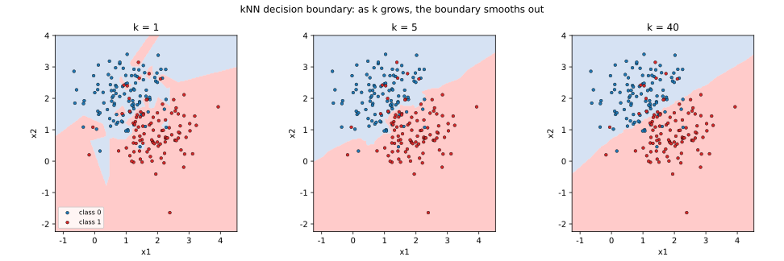

# 4.1 kNN: 알고리즘, 거리함수, 편향-분산 트레이드오프

[](https://colab.research.google.com/github/SuminHan/book-ml/blob/main/notebooks/ml1/chapter04_1_knn.ipynb)

"당신은 가장 가까운 다섯 친구의 평균이다"라는 말 — 이 장의 서두에서 나온 이 문장은
kNN의 알고리즘 그 자체다. 이 절에서는 이 문장을 엄밀한 알고리즘으로
완성한다: 거리를 어떻게 재는지, \\(k\\)를 어떻게 고를지, 그리고 이 단순한
방법이 왜 "너무 단순하게" 실패하는지(과적합)와 "너무 무심하게" 실패하는지
(과소적합)를 편향-분산 프레임으로 정확히 짚는다.

### 학습이 없는 학습 알고리즘

지금까지 배운 선형회귀/로지스틱회귀는 데이터를 보고 파라미터 \\(w\\)를
최적화하는 **학습 단계**가 있었다. kNN은 그런 게 없다 — "학습"이라고 부를 만한
과정은 사실 데이터를 그냥 저장해두는 것뿐이다. 대신 모든 계산은 **예측 시점**에
일어난다: 새 점이 들어오면 그제서야 저장된 모든 점까지의 거리를 재고, 가장
가까운 것들을 찾는다. 이런 방식을 게으른 학습(lazy learning) 또는
instance-based learning이라 부른다.

이 "게으름"은 두 면이 있다. 먼저 장점이 있다 — 데이터 분포가 예측 직전까지
바뀌어도(데이터스트림처럼), 모델을 다시 학습하지 않아도 언제나 **최신 데이터**로
예측한다. 선형회귀는 학습이 끝난 뒤 분포가 바뀌면 "낡은 \\(w\\)"를 계속 쓰지만,
kNN은 저장된 점 자체가 곧 모델이므로 이런 걱정이 없다. 반면 단점도 뚜렷하다 —
예측 비용이 훈련 데이터 크기 \\(m\\)에 선형으로 비례한다. 100만 개의 데이터로
학습한 kNN은 예측 **한 번**에 100만 번의 거리 계산을 해야 하고, 이는
\\(O(m \cdot d)\\)(\\(d\\)는 특징 수)다. 선형회귀의 예측은 \\(w^Tx\\) 한 번의
내적(\\(O(d)\\))으로 끝나는데, kNN은 학습을 게으르게 미뤄둔 대가로 예측이
매번 \\(m\\)배 비싸지는 것이다. 실데이터 수백만 개의 분류(예: 이미지 분류)에
kNN을 그대로 쓰면 이 비용이 감당 불가능해지므로, 실제로는 KD-트리(4.2절
끝에서 언급)나 근사최근접검색(ANN, approximate nearest neighbor) 같은
인덱스 자료구조로 "거리를 다 재지 않고도 가까운 점만 찾는다"는 최적화가
필요해진다 — 하지만 개념적으로는 항상 "모든 점을 다 본다"는 전제로 이해하면
된다.

**역사적 한 줄**: 이 아이디어의 이론적 정립은 1967년 Cover와 Hart의 논문
("Nearest Neighbor Pattern Classification")에서 나왔는데, 이 논문은
"가장 가까운 이웃의 답을 따른다"는 단순한 방법도 **데이터가 무한히 많으면
오류율이 베이즈 오류율(어떤 방법으로도 줄일 수 없는 이론적 하한)의 2배를
넘지 못한다**는, 직관적으로는 믿기 힘든 정리를 증명했다. 더 놀라운 것은
1차원(특징이 하나)인 경우에는 2배가 아니라 **정확히 베이즈 오류율 자체**로
수렴한다는 사실이다. 이 정리 덕분에 kNN은 "맹목적인 방법"이 아니라
"어디까지 틀릴 수 있는지 이론적으로 보증된 방법"이라는 지위를 얻었다.

### 알고리즘: 가장 가까운 k개의 다수결

새로운 점 \\(x\\)를 분류하려면:

1. 학습 데이터의 모든 점 \\(x^{(i)}\\)에 대해 \\(x\\)와의 거리를 계산한다.
2. 거리가 가장 가까운 \\(k\\)개를 고른다.
3. 그 \\(k\\)개의 라벨 중 다수결(분류) 또는 평균(회귀)을 예측값으로 낸다.

```python
def knn_predict(X_train, y_train, x_new, k):
    distances = []
    for i in range(len(X_train)):
        d = sum((X_train[i][j] - x_new[j]) ** 2 for j in range(len(x_new))) ** 0.5
        distances.append((d, y_train[i]))
    distances.sort(key=lambda p: p[0])
    k_nearest_labels = [label for _, label in distances[:k]]
    return max(set(k_nearest_labels), key=k_nearest_labels.count)  # 다수결
```

세 단계 중 두 번째 — "거리를 계산하고 정렬" — 가 \\(O(m \\log m)\\)의
사실상 가장 비싼 작업이다(단, \\(m\\)이 크면 부분 정렬인 `heapq.nsmallest(k, ...)`로
\\(O(m \log k)\\)까지 줄일 수 있다). 첫 번째 단계의 거리 계산은 \\(O(m \cdot d)\\)
이고, 세 번째 단계의 다수결은 \\(O(k)\\)라 무시할 만하다. 즉 **kNN의 모든 비용은
예측 시점의 거리 계산+정렬에 몰려 있다**는 점이, 학습 비용이 있는 모델들과의
가장 실질적인 차이다.

**회귀용 kNN**: 분류는 다수결 대신 **가장 가까운 \\(k\\)개의 \\(y\\)값의
평균**을 내면 바로 회귀 알고리즘이 된다:

```python
def knn_predict_regression(X_train, y_train, x_new, k):
    d = [sum((a - b) ** 2 for a, b in zip(xi, x_new)) ** 0.5 for xi in X_train]
    k_idx = sorted(range(len(X_train)), key=lambda i: d[i])[:k]
    return sum(y_train[i] for i in k_idx) / k
```

같은 코드가 분류(다수결)와 회귀(평균)를 모두 수행할 수 있다는 점은, kNN이
"모델의 가설 공간"에 대한 강한 가정을 하지 않는다는 뜻이다 — \\(y\\)가 숫자든
카테고리든, "가까운 점의 답을 집계한다"는 규칙 자체는 변하지 않는다.
비슷한 예로, 회귀에서 단순 평균 대신 **거리 가중 평균**
\\(\hat y(x) = \frac{\sum\_{i \in \text{NN}\_k(x)} w\_i \\, y^{(i)}}{\sum\_i w\_i},
\quad w\_i = \frac{1}{d(x, x^{(i)}) + \epsilon}\\)
을 쓰면, 이웃이 가까울수록 그 이웃의 의견을 더 많이 반영하게 된다 —
"가장 가까운 1개의 의견에 거의 100%를 준다"는 극단(\\(k=1\\))과 "모든
이웃을 동등하게 본다"는 극단(평범한 평균) 사이의 연속적인 선택지다.

### 거리 함수와 정규화

가장 흔한 선택은 **유클리드 거리**(Euclidean distance):

\\[d(x, x') = \sqrt{\sum\_{j=1}^n (x\_j - x'\_j)^2}\\]

다른 선택지로 맨해튼 거리(\\(\sum\_j |x\_j - x'\_j|\\), 좌표축을 따라서만 이동)도
있다. 거리를 재기 전에 **특징 정규화**(normalization)가 거의 필수다 — "방
개수"(0~10 범위)와 "집값"(수억 원 단위)을 그대로 섞어 거리를 재면, 스케일이 큰
특징이 거리를 사실상 독차지해버린다.

이것을 좀 더 정확히 말하면, \\(p\\)-노름 거리
\\(d\_p(x, x') = \left(\sum\_j |x\_j - x'\_j|^p\right)^{1/p}\\)
에 대한 얘기다. \\(p=2\\)가 유클리드, \\(p=1\\)이 맨해튼, \\(p\to\infty\\)
(각 축 차이의 최대치, 체비셰프 거리)가 한계를 이룬다. \\(p\\)의 값이
"어떤 점이 더 가까운지"라는 **순위 자체를 뒤집을 수** 있다는 간단한
예를 보자. 새 점 \\(x=(0,0)\\)에서 두 후보 학습점 \\(A=(10,1)\\),
\\(B=(6,6)\\)까지의 거리를 재면:

\\[d\_1(A, x) = 10+1 = 11, \quad d\_1(B, x) = 6+6 = 12
\qquad\Rightarrow\quad p=1\text{에서는 } A\text{가 더 가까움}\\]

\\[d\_2(A, x) = \sqrt{10^2+1^2} = \sqrt{101} \approx 10.05, \quad
d\_2(B, x) = \sqrt{6^2+6^2} = \sqrt{72} \approx 8.49
\qquad\Rightarrow\quad p=2\text{에서는 } B\text{가 더 가까움}\\]

같은 두 점에서 **거리의 순위가 \\(p\\)에 따라 뒤집힌다** — \\(p=1\\)은
"차이의 합"을 세므로 한 축에 차이가 몰린 \\(A\\)가 유리하고, \\(p=2\\)는
차가 두 축에 나눠져 있으면 더 작아지므로 \\(B\\)가 유리하다. 일반적으로
\\(p\\)를 키울수록 거리가 "가장 큰 차이를 가진 축" 쪽으로 집중되어
(\\(p\to\infty\\)에서는 최대 축 차이에 수렴), 어떤 축 하나만 크게 다르고
나머지는 비슷할 때 \\(p\\)의 선택이 결과를 바꿀 수 있다. 다만 실전에서
\\(p\\)를 1과 2 사이에서 고르는 것보다, 정규화를 빼먹는 실수(아래)가
훨씬 더 큰 성능 차이를 만든다 — **스케일 문제가 해결된 뒤**에야
\\(p\\)의 선택이 의미가 있다.

정규화 방법도 두 가지가 흔하다. **MinMax 정규화**(범위를 0~1로 스케일
변환, 이번 절의 예제에 썼던 방식)와 **표준화**
(\\(z\_j = (x\_j - \mu\_j)/\sigma\_j\\), 평균 0·표준편차 1로 변환). kNN처럼
거리를 직접 재는 모델에는 둘 다 유효하며, 극단값(outlier)이 있으면
MinMax가 극단값에 휘어질 수 있어 표준화가 조금 더 방어적이다. 핵심 원리는
둘이랑 같다: **각 특징이 거리에 "동등한 목소리"를 가지게 한다**.

### \\(k\\)를 고르는 트레이드오프: 편향과 분산

- \\(k\\)가 너무 작으면(예: \\(k=1\\)): 노이즈 하나에도 민감하게 반응한다 —
  훈련 데이터를 살짝만 바꿔도(다른 표본을 뽑아도) 예측이 크게 요동친다.
  이걸 **분산**(variance)이 크다고 한다 — **과적합**(overfitting).
- \\(k\\)가 너무 크면(예: \\(k=m\\), 전체 데이터): 항상 전체 다수결만
  예측해 지역적 패턴을 완전히 무시한다. 어떤 훈련 데이터를 줘도 거의
  똑같이 단순한 예측만 내놓으니 분산은 작지만, 애초에 잡아야 할 패턴을
  구조적으로 못 잡는다 — 이걸 **편향**(bias)이 크다고 한다 —
  **과소적합**(underfitting).

이 편향-분산 관계는 kNN만의 얘기가 아니라 지도학습 전체에 적용되는 원리다.
회귀 문제에서 모델의 기대 오차를 수학적으로 분해하면 세 항으로 나뉜다:

\\[\mathbb{E}\left[(y - \hat f(x))^2\right] =
\underbrace{\left(\text{Bias}[\hat f(x)]\right)^2}\\_{\text{모델이 구조적으로
못 맞추는 정도}} + \underbrace{\text{Var}[\hat f(x)]}\\_{\text{훈련 데이터가
바뀔 때 예측이 흔들리는 정도}} + \underbrace{\sigma^2}\\_{\text{데이터 자체의
잡음(줄일 수 없음)}}\\]


모델이 너무 단순하면(\\(k\\)가 큰 kNN, 얕은 트리, 규제가 강한 선형모델 등)
Bias가 크고 Variance는 작다 — 과소적합. 모델이 너무 유연하면(\\(k=1\\)인
kNN, 아주 깊은 트리, 파라미터가 많은 신경망 등) Variance가 크고 Bias는
작다 — 과적합. 둘은 항상 이렇게 트레이드오프 관계이고, 최적의 모델
복잡도는 이 둘의 합(전체 오차)이 최소가 되는 지점이다 — 이 프레임은 Chapter
6(정규화), Chapter 7(트리 깊이 제한/가지치기), Chapter 9(신경망 정규화)에서
"과적합을 어떻게 막는가"를 다룰 때마다 다시 등장한다.

적절한 \\(k\\)는 보통 검증 데이터(validation set)로 여러 값을 시도해보고
정한다.

#### "분산이 크다"가 실제로는 무슨 뜻인가 — 손가락으로 따져보기

"분산이 크다"는 말이 추상적으로 들리면, \\(k=1\\)과 \\(k=5\\)의 차이를
구체적인 시나리오로 비교해보자. 아래 두 개의 그림을 상상해보자(이후
실습에서 직접 그린다):

- **그림 A**: 진짜 경계가 "대각선으로 갈라진 두 덩어리"라고 하자.
  훈련 데이터에 **한 점만** 경계 근처에서 잘못 찍혀 있다고 가정한다
  (노이즈, 또는 측정 오류). \\(k=1\\) kNN은 그 잘못 찍힌 점 바로 옆에서
  "그 점이 정답"이라 생각한다 — **경계 전체가 한 점의 위치를 따라
  출렁인다**. \\(k=5\\) kNN은 잘못 찍힌 한 점을 4개의 정상 점들이
  "투표로" 이기므로, 그 한 점의 위치는 경계에 거의 영향을 주지 못한다.
- **그림 B**: 반대로, 진짜 경계가 매우 복잡하게 꼬여 있다고 하자. \\(k=5\\)
  kNN은 "이웃 5개"를 평균내듯 다수결하므로, 꼬인 부분의 **세부 곡선**을
  따라가지 못하고 매끄럽게(너무 단순하게) 그은다 — 이쪽은 **편향**의
  문제다.

즉 "분산이 크다"는 **훈련 데이터의 미세한 변화(노이즈 한 점, 표본
재추출)가 예측의 미세한 변화(경계의 출렁임)를 낳는 정도**를 말하는 것이다.
kNN에서 이 "미세한 변화"는 정확히 "훈련 집합에서 한 두 점이 빠지거나
바뀌는 것"이고, "예측의 변화"는 "그 점 근처의 결정경계가 움직이는
것"이다. 이 둘의 인과가 kNN에서는 눈으로 직접 확인할 수 있다는 점이,
편향-분산 개념을 kNN으로 처음 배우면 좋은 이유다 — 더 복잡한 모델
(신경망)에서는 "분산"을 눈으로 보기 훨씬 어렵다.

#### 수치 실험: 편향·분산을 실제로 측정해보기

위 개념을 숫자로 확인해보자. 1차원 데이터에서 진짜 함수
\\(f^\*(x) = \sin(2\pi x)\\)(\\(x \in [-1, 1]\\))에 잡음
\\(\sigma = 0.5\\)를 더해 100개 점을 뽑고, 이 **표본을 300번 다시 뽑는다**
(각 회마다 30%를 검증용으로 따로 둔다). 고정된 테스트 지점 40개에서
각 kNN의 예측을 모으면:

\\[\text{Bias}^2 = \text{mean}\left[\left(\bar{\hat f}(x) - f^\*(x)\right)^2\right],
\qquad
\text{Var} = \text{mean}\left[(\hat f(x) - \bar{\hat f}(x))^2\right]
\quad \text{(표본 300개, 지점 40개에 대해)}\\]

여기서 \\(\bar{\hat f}(x)\\)는 300개 표본의 예측 평균이다.
실제 실행 결과(이후 실습 노트북의 5절에서 같은 코드를 돌린다):

| \\(k\\) | \\(\text{Bias}^2\\) | \\(\text{Var}\\) |
|---|---|---|
| 1  | 0.001 | 0.255 |
| 5  | 0.006 | 0.056 |
| 50 | 0.470 | 0.019 |

\\(k=1\\)에서는 편향은 거의 0(진짜 함수를 잘 따라가는 경향이 있음)인데
분산이 \\(0.255\\)로 매우 크다 — 표본을 다시 뽑을 때마다 예측이 크게
달라진다. \\(k=50\\)에서는 분산이 \\(0.019\\)로 거의 사라지지만, 편향이
\\(0.470\\)까지 치솟는다 — 50개 평균을 내다 보니 \\(\sin\\)의 곡률을
거의 못 따라가고, "전체 평균" 쪽으로 수렴하기 때문이다. \\(k=5\\)는 둘
다 중간이다. 이 표는 "분산이 크다 = 훈련 데이터가 바뀌면 예측이 크게
바뀐다"는 정의를 숫자로 그대로 보여준다.

### 손으로 한 번: kNN 예측을 직접 계산하기

작은 데이터셋으로 kNN이 실제로 무엇을 하는지 손으로 따라가보자. 학습
데이터 6개가 두 반(불합격 0, 합격 1)으로 나뉘어 있다:

\\[(1,1){\to}0,\ (2,1){\to}0,\ (1,2){\to}0,\ (8,8){\to}1,\ (9,8){\to}1,\ (8,9){\to}1\\]

새 점 \\((7,7)\\)을 \\(k=3\\)으로 분류해보자. 유클리드 거리를 하나씩
계산하면:

| 학습 데이터 | 라벨 | \\((7,7)\\)까지 거리 |
|---|---|---|
| (8,8) | 1 | \\(\sqrt{1^2+1^2}=\sqrt{2}\approx1.414\\) |
| (9,8) | 1 | \\(\sqrt{2^2+1^2}=\sqrt{5}\approx2.236\\) |
| (8,9) | 1 | \\(\sqrt{1^2+2^2}=\sqrt{5}\approx2.236\\) |
| (2,1) | 0 | \\(\sqrt{5^2+6^2}=\sqrt{61}\approx7.810\\) |
| (1,2) | 0 | \\(\sqrt{6^2+5^2}=\sqrt{61}\approx7.810\\) |
| (1,1) | 0 | \\(\sqrt{6^2+6^2}=\sqrt{72}\approx8.485\\) |

가장 가까운 3개 — (8,8), (9,8), (8,9) — 가 모두 라벨 1이므로, 다수결로
\\((7,7)\\)은 **1(합격)**로 예측된다. 위 `knn_predict` 코드가 정확히 이
정렬·다수결 과정을 자동화한 것이다.

같은 예시로 **회귀**를 손으로 계산해볼 수도 있다. 라벨이 숫자라고 하자 —
위 6개 점의 라벨을 각각 \\(1, 1, 1, 4, 4, 4\\)라고 가정하고, 새 점
\\((7,7)\\)에 \\(k=3\\)을 적용하면 가장 가까운 3개는 여전히 (8,8), (9,8),
(8,9)이고, 그 라벨의 평균은 \\((4+4+4)/3 = 4.0\\)이다. 분류의 "다수결"과
회귀의 "평균"이 **같은 k개의 이웃**을 사용한다는 점에 주목하라 —
kNN의 분류/회귀 차이는 3번째 단계(집계 방식)만 다르다.

### 결정경계: kNN이 그리는 "선"은 어떤 모양인가

분류에서 kNN이 실제로 하는 일을 공간적으로 보면, **결정경계**(decision
boundary)가 생긴다. 2차원 평면의 각 지점 \\(x\\)에 대해 "이 지점을 kNN이
어느 클래스로 분류할 것인가"를 알면, "클래스가 바뀌는 경계선"이 결정된다.

kNN의 결정경계는 **어떤 점 \\(x\\)의 가장 가까운 \\(k\\)개 이웃의 라벨
분포가 바뀌는 곳**에 있다. \\(k=1\\)인 경우, 결정경계는 정확히 두 점 사이의
수직등분선들의 합 — 즉 "두 훈련 점 중 더 가까운 쪽의 클래스"가 바뀌는
위치들이다. \\(k\\)가 커질수록, "가장 가까운 \\(k\\)개"라는 집합이 커지면서
경계가 **매끄럽게** 변한다.

실습에서 직접 그릴 예정인 장면: 두 개의 원형 blob(클래스 0이 왼쪽 위,
클래스 1이 오른쪽 아래)을 200개 점으로 만들고, \\(k=1, 5, 40\\) 각각의
결정경계를 그린다.

- **\\(k=1\\)**: 경계가 훈련 점 주변에 톱니바퀴처럼 복잡하게 접힌다 —
  각 훈련 점의 "영향권"(보로노이 셀, Voronoi cell) 경계가 그대로
  결정경계가 된다. 한 점의 노이즈가 경계의 작은 출렁임을 만든다.
- **\\(k=5\\)**: 톱니가 눈에 띄게 매끄러워진다. 한두 점의 노이즈는
  5표에서 다수결을 뒤집지 못하므로, 경계가 "대표적인 경계" 쪽으로
  안정화된다.
- **\\(k=40\\)** (전체 140개 훈련점의 3분의 1): 경계가 **거의 직선**에
  가까워진다. 40개의 다수결은 사실상 "전체 클래스 비율"을 반영하므로,
  지역적 패턴을 거의 무시한다 — 과소적합의 공간적 모습이다.



이 세 장면을 나란히 보면, "k를 키우면 경계가 매끄러워진다"는 말을
눈으로 확인할 수 있다 — 그리고 그 매끄러움이 어느 시점부터는 **정보를
잃는 매끄러움**(진짜 패턴을 지우는 것)이 되는지, 검증 정확도로
판단할 수 있다(4.2절에서 실제로 k를 검증셋으로 튜닝한다).

#### kNN 결정경계의 기하학적 성격: 보로노이 다이어그램

\\(k=1\\) kNN의 결정경계는 **보로노이 다이어그램**(Voronoi diagram)의
경계와 정확히 일치한다. 보로노이 셀이란, "특정 훈련점 \\(x\_i\\)에 가장
가까운 모든 지점들의 영역" \\(\\{x : d(x, x\_i) \le d(x, x\_j) \ \forall j\\}\\)
이다. 이 영역은 각 \\(x\_i\\)를 "중심"으로 한 **볼록 다각형**이고, 이웃
셀들과의 경계는 두 점의 **수직등분선**이다.

이 기하학적 사실은 두 가지 실용적인 의미를 준다. 첫째, \\(k=1\\) kNN의
결정경계는 **항시 각진(비선형) 다각형의 합**으로, 아무리 많은 점을 써도
**곡선을 그을 수 없다** — 곡률이 큰 진짜 경계가 있어도, kNN은 "충분히
작은 직선 조각"으로 근사할 뿐이다(점이 많아지면 근사가 좋아지긴 한다).
둘째, **두 훈련 점이 아주 가까우면** 그 수직등분선이 두 점 사이를
지나므로, 그 근처의 결정경계는 그 두 점의 **상대적 위치에만** 달려 있다 —
"가까운 두 점 중 어느 쪽이 정답인지에 따라 경계가 크게 출렁일 수
있다"는 분산 얘기의 기하학적 번역이다.

\\(k>1\\)에서는 보로노이 셀을 "크기 \\(k\\)의 다수결"로 일반화한
**k-보로노이**(k-Voronoi)가 결정경계를 정의한다 — "이 지점의 가장 가까운
\\(k\\)개 훈련점 중 클래스 1이 더 많으면 클래스 1"이므로, 경계는
"k-이웃의 클래스 분포가 50:50으로 바뀌는 곳"이다. \\(k\\)가 커질수록
이 경계가 매끄러워진다는 직감의 기하학적 근거가 여기 있다.

### 자주 하는 실수: 정규화 없이 스케일이 다른 특징을 그대로 섞기

두 번째 예시로, "공부 시간"(1~9시간)과 "가구 소득"(5000~6000만 원)이라는
스케일이 완전히 다른 두 특징으로 합격을 예측한다고 하자. 학습 데이터
\\(P\_1=(9,\ 5000)\\)(합격), \\(P\_2=(1,\ 5050)\\)(불합격)이 있고, 새 점은
\\((8,\ 6000)\\)이다. 직관적으로는 공부 시간이 8시간으로 \\(P\_1\\)(9시간)에
훨씬 가까우니 \\(P\_1\\)이 더 가까워야 할 것 같다. 그런데 정규화 없이 그대로
유클리드 거리를 재면:

\\[d(P\_1, \text{new}) = \sqrt{(9-8)^2+(5000-6000)^2} \approx 1000.0005, \qquad
d(P\_2, \text{new}) = \sqrt{(1-8)^2+(5050-6000)^2} \approx 950.026\\]

**\\(P\_2\\)가 오히려 더 가깝다고 나온다** — 공부 시간의 차이(1시간 vs 7시간)는
소득 단위(수천만 원)에 비하면 사실상 무의미할 정도로 작아서, 소득 값 하나가
거리 계산을 독차지해버린 것이다. 두 특징을 각각 0~1로 정규화(이 세 점의
범위 기준: 공부 시간 1~9, 소득 5000~6000)하면:

\\[P\_1{\to}(1.0,\ 0.0), \quad P\_2{\to}(0.0,\ 0.05), \quad
\text{new}{\to}(0.875,\ 1.0)\\]

\\[d(P\_1, \text{new}) \approx 1.008, \qquad d(P\_2, \text{new}) \approx 1.292\\]

정규화 후에는 **\\(P\_1\\)이 더 가깝게** 뒤집힌다 — 직관과 일치하는 결과다.
이 예시가 보여주듯, 정규화를 빼먹으면 "스케일이 큰 특징이 곧 중요한
특징"이라는, 데이터와 아무 상관 없는 잘못된 가정이 몰래 끼어들게 된다.
실전에서 kNN, k-means(4.3절)처럼 거리를 직접 재는 모델을 쓸 때는
`StandardScaler`나 `MinMaxScaler` 같은 정규화를 빼먹지 않는 것이
선형회귀의 학습률 선택만큼이나 기본적인 체크리스트 항목이다.

**정규화가 성능에 실제로 얼마나 영향을 주는지 숫자로**: 두 클래스가
**x축 하나**로만 분리되는 데이터(클래스 0은 \\(x \approx 0.5\\), 클래스 1은
\\(x \approx 0.1\\), y축은 두 클래스 모두 \\(5 \pm 3\\)의 잡음)를
만들어보자. x의 범위(약 0.6)가 y의 범위(약 9)에 비해 매우 작다. \\(k=3\\)
으로 검증 정확도를 재면, **정규화 없이**는 \\(0.556\\), **정규화 후**는
\\(1.000\\)이다 — "x가 y의 15배로 스케일이 크기 때문에 x 차이를 사실상
무시하고 y의 잡음으로만 분류하던" 모델이, 정규화 후 x가 분리 축으로서
정상적으로 작동하게 되어 정확도가 거의 두 배가 됐다. 이 숫자는
"정규화를 빼먹으면 성능이 40%나 깎일 수 있다"는 극단적 사례이며,
실데이터에서 이런 극단적 스케일 차이는 흔하다(특히 센서 데이터나
금융 데이터).

### 확인 문제: 정규화 전후 거리를 직접 계산해보기

위 "스케일이 다른 특징" 예시에서, 정규화 **전**에 \\(P\_1=(9, 5000)\\)과
\\(P\_2=(1, 5050)\\) 사이의 거리를 유클리드 기준으로 계산하면:

\\[d(P\_1, P\_2) = \sqrt{(9-1)^2 + (5000-5050)^2}
= \sqrt{64 + 2500} = \sqrt{2564} \approx 50.64\\]

정규화 **후**의 두 점은 \\(P\_1'=(1.0, 0.0)\\), \\(P\_2'=(0.0, 0.05)\\)
(0~1 MinMax 기준)이므로:

\\[d(P\_1', P\_2') = \sqrt{(1.0-0.0)^2 + (0.0-0.05)^2}
= \sqrt{1 + 0.0025} \approx 1.001\\]

두 값의 **비**는 약 \\(50.5\\)배다. 이 비가 의미하는 바를 한 문장으로
설명해보라(힌트: "특징 간 상대적 중요도"가 정규화 전후에서 어떻게
달라지는가). 추가로, 만약 두 특징의 스케일이 **동일**했다면(예:
공부 시간 1~9, 소득 5000~5009처럼 폭이 비슷하다면) 정규화 전후의
**순위**(\\(P\_1\\)가 가까운지 \\(P\_2\\)가 가까운지)는 바뀌는가? —
계산해보고, "정규화가 항상 순서를 바꾸는가?"에 대해 답해보라
(답: 스케일이 같으면 정규화는 등비확대이므로 모든 거리를 같은
비율로 바꿔 **순서는 보존**된다 — 정규화가 순서를 바꾸는 경우는
**스케일이 다른 축**이 있을 때만이다).

### 실습으로 연결하기

이 절의 개념을 직접 실행하는 노트북을 제공한다:
[chapter04_1_knn.ipynb](https://smhanlab.com/book-ml/notebooks/ml1/chapter04_1_knn.ipynb)
(Colab 배지를 누르면 브라우저에서 바로 열린다). 이 노트북에서는:

1. 두 blob 데이터에 kNN을 적용하고 \\(k=1, 5, 40\\)의 결정경계를
   나란히 그린다.
2. 같은 데이터에 k를 1에서 40까지 쭉 늘리며 **훈련 정확도 vs 검증
   정확도**를 그래프로 그린다 — kNN이 "과적합 → 정상 → 과소적합"으로
   넘어가는 궤적을 직접 본다.
3. 1차원 \\(\sin\\) 함수 + 잡음 데이터에서 편향·분산을 **수치적으로
   측정**한다 (위 표의 숫자가 여기서 나온다).
4. 스케일이 다른 특징 데이터를 정규화 전/후로 나누어 kNN 정확도를
   비교한다 (위 "0.556 vs 1.000" 예시가 여기서 나온다).

### 유명한 사례: "너무 단순해서 오히려 안전한" 베이스라인

1960년대 초, Cover와 Hart가 각각 캘리포니아 공과대학(Caltech)과
스탠퍼드에 있을 때, 패턴인식 연구는 아직 "특성(feature)을 잘 골라
분류기를 맞춘다"는 공방의 시대였다. 1967년 논문에서 이 둘이 던진
주장은 반전이었다 — **어떤 특성 선택도, 어떤 분류기 설계도 없이,
그저 가장 가까운 이웃을 따라가라** — 그리고 그 "무모한" 방법이
데이터가 충분히 많으면 이론적으로 안전한 것(앞에서 본, 베이즈
오류율의 2배 이내)을 증명했다. 당시에는 "이론적으로만 안전할 뿐
실용성은 낮다"는 평가로 잊히다시피 했는데, 1990년대 MNIST
(4.2절의 유명한 사례: kNN으로 약 97%) 같은 공개 데이터셋 시대가
되며 "복잡한 모델 없이도 경쟁력 있는 베이스라인"으로 다시 주목받았다.

현대에서는 kNN이 "주류 알고리즘"은 아니지만 — 큰 데이터셋에서
예측이 \\(O(m \cdot d)\\)라 느리다는 단점이 명확해 CNN(Chapter 10),
신경망(Chapter 9) 같은 "학습이 있는" 모델에 자리를 내줬다 —
여전히 **베이스라인**으로 쓰인다. "새로운 데이터셋을 받았다, 어떤
모델을 써볼까?"라는 질문의 정석적 답은 "먼저 kNN으로 베이스라인을
잡아봐라"다 — kNN은 이론적 가정이 거의 없으므로, **데이터 자체의
"학습 가능성"의 하한**을 알려준다. 만약 kNN으로조차 좋은 성능을
내지 못한다면, 더 복잡한 모델도 (거의) 확실히 좋은 성능을 내기
어렵다 — kNN은 "이 데이터는 학습이 어려울 수 있다"는 조기
경보기도 된다. 반대로 kNN으로 90%를 나갔다면, 더 복잡한 모델은
그 90%를 **초과**해야 의미가 있다.

### 자주 묻는 질문

**Q. kNN은 왜 "학습이 없다"고 하나요? 데이터를 저장하는 것도 학습 아닌가요?**
선형회귀나 로지스틱회귀는 데이터를 본 뒤 몇 개의 숫자(\\(w\\))로
"압축"해서 저장하고, 그 이후로는 원본 데이터가 없어도 예측할 수 있다.
kNN은 원본 데이터 전체를 그대로 갖고 있어야만 예측할 수 있다 — 파라미터를
최적화하는 과정 자체가 없으므로, 관례적으로 "학습이 없다(게으르다)"고
부른다. 이 차이는 실전에서도 중요하다 — 데이터가 100만 개면 kNN은 예측
한 번마다 100만 개와 거리를 다 재야 해서 느리지만, 선형회귀는 학습이 끝난
뒤엔 예측이 \\(w^Tx\\) 한 번의 내적으로 끝난다.

**Q. \\(k\\)는 항상 홀수로 골라야 하나요?** 이진 분류라면 다수결에서
동점이 나오지 않도록 \\(k\\)를 홀수로 고르는 게 관례적으로 편하다(짝수면
2:2 같은 동점이 나올 수 있어 별도 처리 규칙이 필요해진다). 클래스가
3개 이상이면 홀수여도 동점이 날 수 있으므로, 실전에서는 동점 처리
규칙(예: 가장 가까운 점의 라벨을 우선)을 미리 정해두는 것이 안전하다.

**Q. kNN으로 회귀를 하면 안 되나요?** 되며, 실제로도 쓴다 — 위
`knn_predict_regression`이 바로 그것이다. 회귀에서 kNN은 "가장 가까운
\\(k\\)개의 \\(y\\)값의 평균"을 내므로, **국소적 평균 smoother**(local
averaging)라고도 불린다. 비모수 회귀(nonparametric regression)의 가장
기본적인 형태이며, Chapter 9의 신경망이 "복잡한 비모수 함수 근사"라면
kNN 회귀는 "가장 단순한 비모수 함수 근사"라고 볼 수 있다. 다만
**차원이 높아지면**(4.2절의 차원의 저주) "가장 가까운 \\(k\\)개"의
평균이 노이즈에 완전히 지배돼 의미가 사라지므로, 고차원 회귀에는
선형회귀나 트리 기반 모델이 더 실용적이다.

**Q. kNN의 예측 확률 \\(P(y=1|x)\\)를 어떻게 구하나요?** "가장 가까운
\\(k\\)개 중 클래스 1의 비율"을 쓰면 된다:
\\(\hat P(y=1|x) = \frac{\\#\\{\text{클래스 1인 이웃}\\}}{k}\\).
이는 다수결 분류기의 **확률적 버전**으로, 분류는 이 확률이 0.5를
넘으면 1로 예측한다. 이 확률은 **경험적(empirical) 추정**으로, k가
클수록 더 안정적인 확률 값을 준다(k=1이면 0 또는 1만 나와서
"확신 100%"라는 극단적 확률이 나온다). 실전에서는 이 확률을
**distance-weighted**로 고치기도 한다 — \\(w\_i = 1/d(x, x^{(i)})^2\\)
같은 가중치를 붙여 "가까운 이웃의 의견"에 더 큰 가중치를 준다.

**Q. kNN은 특징이 100개 넘으면 쓸 수 없나요?** 쓸 수는 있지만
**성능이 크게 떨어진다** — 4.2절에서 다룰 차원의 저주 때문이다.
100차원에서는 "가장 가까운 이웃"조차 평균적으로 매우 멀어지므로,
"가까운 = 비슷하다는 답을 가진다"는 kNN의 핵심 가정이 무너진다.
실전에서 고차원 kNN을 쓰려면 **특징 선택**(중요한 축만 남기기)이나
**차원 축소**(Chapter 14의 PCA)를 먼저 적용하는 것이 표준적이다.
반면 특징이 10개 미만인 저차원 데이터(예: 이 절의 2D 예제)라면 kNN은
여전히 매우 경쟁력 있는 선택이다.

---

## 연습문제

**1. (코딩)** 위 `knn_predict`(핵심 줄은 빈칸으로 남겨져 있다고 가정)를
사용해, 아래 2D 데이터에서 (3, 3)을 \\(k=3\\)으로 분류하라:

```python
# X_train: [x, y], y_train: 0/1
X_train = [[1, 1], [2, 1], [1, 2], [6, 6], [7, 6], [6, 7]]
y_train = [0, 0, 0, 1, 1, 1]
print(knn_predict(X_train, y_train, [3, 3], k=3))  # ? (계산해보라)
```

힌트: (3,3)까지의 거리를 6개 점에서 각각 계산하고, 가장 가까운 3개를
골라라. 정답은 0이다 — (1,2), (2,1), (1,1)이 모두 0이라 다수결로 0이
나온다(6,6)까지는 \\(\sqrt{18}\approx 4.24\\)이지만 (1,2)까지는
\\(\sqrt{5}\approx 2.24\\)라 훨씬 가깝다).

**2. (손유도, Tier B — 힌트 제공)** kNN이 회귀를 할 때, "가장 가까운
\\(k\\)개의 평균"을 내는 것의 **기대값**을 분석해보자. 진짜 함수
\\(f^\*(x)\\)가 매끄럽고, 훈련 점들이 \\(x\\) 주변에 균일하게 분포되어
있다고 가정할 때,

**단계 1**: 가장 가까운 \\(k\\)개 점의 평균 \\(\hat f\_k(x)\\)은,
"\\(x\\) 반경 \\(r\_k\\) 안의 \\(f^\*\\)의 평균"에 근사한다. \\(r\_k\\)를
\\(k, m\\)(전체 데이터 크기), \\(d\\)(차원)로 표현하라.
(힌트: \\(d\\)차원 부피 \\(\propto r^d\\), 그 안에 \\(m\\)개 점이
균일하게 있으므로 \\(m \cdot r\_k^d \approx k\\).)

**단계 2**: \\(f^\*\\)가 매끄러우므로 \\(r\_k \to 0\\)일 때
\\(\hat f\_k(x) \to f^\*(x)\\) (편향 0). 하지만 \\(k\\)가 고정된
채로 \\(m \to \infty\\)라면 \\(r\_k \to 0\\)이므로 편향이 0이고,
반대로 \\(m\\)이 고정된 채로 \\(k \to m\\)이라면 \\(r\_k\\)가 전체
도메인이므로 편향이 "전체 평균과 \\(f^\*\\)의 차이"로 커진다.
이 두 극한을 위 "편향-분산 표"와 연결해서 설명하라.

**단계 3 (정확성 확인)**: \\(d=1, m=100\\), \\(f^\*(x) = x\\)(직선)
일 때, \\(k=1\\)과 \\(k=50\\)의 **편향**을 각각 추정하라.
힌트: \\(f^\*\\)가 직선이므로 "반경 안의 평균"은 "반경의 중심값"과
같다 — \\(k=1\\)은 "그 점의 값"이므로 편향 0에 가깝고, \\(k=50\\)은
"도메인의 절반 정도의 평균"이므로 편향이 0이다(대칭 직선).
**그런데** \\(f^\*(x) = x^2\\)(곡선)이라면? — \\(k=50\\)의 편향이
0이 아닌 이유를 "곡선"이라는 점과 연결해 한 문장으로 설명하라.
