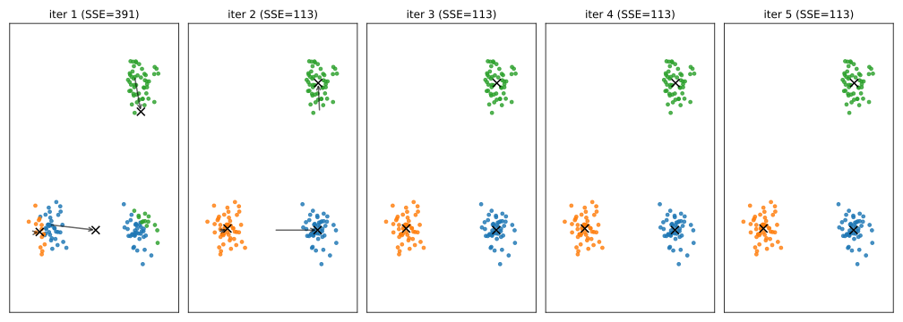
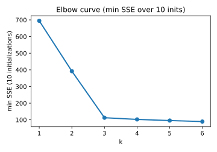

# 4.3 k-means 클러스터링

[](https://colab.research.google.com/github/SuminHan/book-ml/blob/main/notebooks/ml1/chapter04_3_kmeans.ipynb)

### k-means 알고리즘

kNN이 "예측 시점에 거리만 재는" 게으른 방법이라면, k-means는 정답 라벨 없이
데이터 자체의 구조를 순전히 거리만으로 찾아내는 방법이다. 라벨이 없다는
점에서는 15장에서 다룰 EM/GMM(k-means를 확률적으로 일반화한 모델)과
직접 이어지지만, 핵심 동작(가장 가까운 대상을 찾는다)은 이번 장의 주제
그대로다. \\(k\\)개의 그룹으로 데이터를 나누고, 각 그룹은
**중심점**(centroid)으로 대표된다.

1. \\(k\\)개의 중심점을 무작위로 초기화한다.
2. **할당 단계**: 각 데이터 점을 가장 가까운 중심점의 그룹으로 배정한다.
3. **갱신 단계**: 각 그룹의 새 중심점을, 그 그룹에 속한 점들의 평균으로 다시
   계산한다.
4. 할당이 더 이상 바뀌지 않을 때까지 2~3을 반복한다.

```python
def kmeans(X, k, max_iters=100):
    import random
    centroids = random.sample(X, k)
    for _ in range(max_iters):
        clusters = [[] for _ in range(k)]
        for x in X:
            distances = [sum((x[j]-c[j])**2 for j in range(len(x))) for c in centroids]
            closest = distances.index(min(distances))
            clusters[closest].append(x)
        new_centroids = [
            [sum(pt[j] for pt in cluster) / len(cluster) for j in range(len(X[0]))]
            if cluster else centroids[i]
            for i, cluster in enumerate(clusters)
        ]
        if new_centroids == centroids:
            break
        centroids = new_centroids
    return centroids, clusters
```

(이 반복 절차의 기원 — 1957년과 1967년의 두 번의 독립적 발견 — 에 관한
이야기는 아래 "유명한 사례" 섹션에서 다룬다.)

### 이 알고리즘이 정말로 뭘 최소화하는가

k-means의 반복 과정 뒤에 숨어 있는 목표 함수가 하나 있다. **클러스터 내
분산**(within-cluster sum of squares, SSE)이다.

\\[J = \\sum\_{i=1}^{k} \\sum\_{x \\in C\_i} \\left\\| x - \\mu\_i \\right\\|\_2^2\\]

여기서 \\(C\_i\\)는 \\(i\\)번 클러스터에 속한 점들의 집합, \\(\\mu\_i\\)는 그
클러스터의 중심점이다. 해석은 직관적이다 — "각 점이 **자기 그룹의 대표**까지
제곱해서 얼마나 떨어져 있는가"의 합. k-means는 이 값을 작게 만드는
중심점과 분할을 찾는 알고리즘이다.

그런데 "할당→갱신"이라는 단순한 반복이 실제로 \\(J\\)를 줄여가는
**최적화 알고리즘**이라는 사실은 각 단계의 간단한 수학으로
보여줄 수 있다 — 이게 바로 "왜?"를 설명해야 하는 지점이다.

- **할당 단계가 \\(J\\)를 줄이는 이유**: \\(J\\)는 각 점의 기여
  \\(\\|x - \\mu\_{\text{own}}\\|^2\\)의 합이다. 어떤 점이 자기 중심점에서
  **다른** 중심점보다 가까워졌다면, 그 점만 그 그룹으로 옮기면 기여가
  작아지므로 전체 합 \\(J\\)는 줄거나 그대로다. "모든 점을 가장 가까운
  중심점에게 배정한다"는 규칙은 정확히 이 기여를 각 점마다 최소화하는
  동작이다.
- **갱신 단계가 \\(J\\)를 줄이는 이유**: 한 클러스터의 점
  \\(\\{x\_1, \\dots, x\_m\\}\\)가 고정되어 있을 때, 중심점 \\(c\\)에 대한
  \\(f(c) = \\sum\_j \\|x\_j - c\\|^2\\)를 미분해보자.
  \\(\\nabla\_c f(c) = -2\\sum\_j (x\_j - c)\\)이고, 이건 \\(c\\)가 점들의
  **평균**일 때 정확히 0이 된다(또한 \\(f\\)는 \\(c\\)에 대해 볼록한
  이차함수이므로 이안장점이 곧 전역 최소점이다). 즉 "새 중심점 = 그룹의 평균"
  은 해당 클러스터의 기여를 최소화하는 수학적으로 유일한 선택이다.

두 단계가 각각 \\(J\\)를 줄이므로, \\(J\\)는 매 반복마다 **절대 늘어나지
않는다**(단조감소). 이 값은 0 이상이고 점의 위치가 유한하므로, 언젠가
변화가 멈출 수밖에 없다 — 바로 "자주 묻는 질문"의 첫 답에서 말한
**수렴 보장**의 전부다. 다만 한계도 정확히 짚어두자: 이 보장은 \\(J\\)가
**어디까지** 줄어드는지에 대해 아무것도 말해주지 않는다. 다른 초기화에서
출발하면 다른 "국소적 골짜기"에 멈출 수 있는데(볼록하지 않은 최적화 —
4.1절의 경사하강법과 같은 구조), 그 결과가 이 섹션 후반의 "자주 하는
실수"다.

### 실습: 클러스터링 결과 시각화

2차원 데이터라면 클러스터 할당 결과를 눈으로 바로 확인할 수 있다 — 알고리즘이
"올바른" 그룹을 찾았는지 감으로 검증하는 가장 빠른 방법이다.

```python
import matplotlib.pyplot as plt

def plot_clusters(clusters, centroids):
    colors = ["tab:blue", "tab:orange", "tab:green", "tab:red"]
    for i, cluster in enumerate(clusters):
        xs = [pt[0] for pt in cluster]
        ys = [pt[1] for pt in cluster]
        plt.scatter(xs, ys, c=colors[i % len(colors)], label=f"cluster {i}")
    cx = [c[0] for c in centroids]
    cy = [c[1] for c in centroids]
    plt.scatter(cx, cy, c="black", marker="x", s=100, label="centroid")
    plt.legend()
    plt.savefig("kmeans_result.png")

# 사용 예: centroids, clusters = kmeans(X, k=3)
# plot_clusters(clusters, centroids)
```

같은 데이터에 `k=2`, `k=3`, `k=4`를 각각 돌려서 그림을 나란히 비교해보면,
"몇 개의 덩어리로 나누는 게 자연스러운가"라는 질문에 대한 감을 숫자(within-cluster
variance)보다 훨씬 빠르게 얻을 수 있다.

수반 노트북은 이 코드를 150점의 2차원 장난감 데이터(3개의 원형 덩어리,
각 50점)에 적용해, 수렴 과정에서 중심점이 실제로 어떻게 이동하는지
**단계별로 찍은 그림**(할당 결과 + 중심점 이동 화살표)을 한 장에
나란히 보여준다 — "중심점이 그룹의 평균으로 재계산된다"는 문장을
눈으로 확인할 수 있는 가장 빠른 방법이다.



### \\(k\\)를 고르는 법: 엘보우(elbow) 방법

여러 \\(k\\)에 대해 클러스터 내 분산(within-cluster variance)을 그려보고,
감소폭이 급격히 줄어드는 지점("팔꿈치", elbow)을 고르는 방법이 흔히
쓰인다. 앞선 3-블롭 장난감 데이터(3개의 원형 덩어리, 각 50점)에
\\(k=1\\)부터 \\(6\\)까지 적용해서 실제로 해보자. 각 \\(k\\)마다 무작위
초기화 10번을 돌려서 가장 작은 SSE를 취하면:

| \\(k\\) | SSE (최소) |
|---|---|
| 1 | 3753.3 |
| 2 | 1867.1 |
| 3 | **258.4** |
| 4 | 223.4 |
| 5 | 197.5 |
| 6 | 167.4 |

이 표를 읽는 법을 하나씩 짚자. \\(k=1\\to2\\)에서 SSE가 거의 반으로
줄어든다 — 하나의 덩어리를 둘로 쪼갠 첫 번째 분할이 큰 효과를 냈다.
그런데 \\(k=2\\to3\\)에서는 **일곱 배 이상**(1867 → 258) 폭락한다.
데이터에 실제로 세 번째 덩어리가 따로 존재했기 때문에, 그걸 인정하는
순간 오차가 거의 사라지는 것이다. 그리고 \\(k=3\\to4\\)에서는 겨우
35만 줄어든다 — 이미 "진짜 구조"를 다 건드렸고, 이제 노이즈 수준에서
덩어리를 억지로 쪼개고 있다는 뜻이다. 그래프를 그리면 \\(k=3\\)에서
각도가 꺾이는 "팔꿈치"가 정확히 여기에 온다.



솔직히 말하자면, 엘보우는 항상 이렇게 선명한 각도를 만들지는 않는다 —
덩어리들이 서로 가깝거나 크기가 비슷하면 곡선이 완만해져서 "여기다!"
라고 확신하기 어렵다. 그런 경우엔 (i) 여러 초기화를 돌려 SSE의 **분포**를
보거나, (ii) 실루엣(silhouette) 점수 같은 다른 지표로 교차 검증하는
것이 일반적이다. 중요한 원리는 하나다: SSE는 \\(k\\)가 커질수록 **항상**
줄어든다(클러스터가 하나 더 생기면 오차가 작아지는 건 당연한 결과)
그러니까 "SSE가 가장 작은 \\(k\\)"를 고르면 \\(k=n\\)(각 점을
개별 클러스터로)이 되버리기 때문에, **절대** 최소 SSE를 기준으로
\\(k\\)를 고르면 안 된다. 기준은 항상 "감소폭이 급격히 줄어드는 지점"
이다.

### 손으로 한 번: k-means 두 번의 반복을 직접 따라가기

작은 점 4개로 알고리즘을 손으로 따라가보자: \\((1,1), (1,2), (8,8),
(9,8)\\)에 \\(k=2\\)를 적용하고, 초기 중심점을 \\(c\_0=(1,2)\\),
\\(c\_1=(8,8)\\)로 잡는다(데이터 점 중 두 개를 그대로 초기 중심점으로 쓰는
흔한 방식).

**1회차 — 할당 단계**: 각 점을 가장 가까운 중심점에 배정한다.

- \\((1,1)\\): \\(c\_0\\)까지 거리 \\(1\\), \\(c\_1\\)까지 거리
  \\(\\sqrt{49+49}\\approx9.9\\) → \\(c\_0\\) 그룹
- \\((1,2)\\): \\(c\_0\\)와 정확히 같은 점이므로 거리 \\(0\\) → \\(c\_0\\) 그룹
- \\((8,8)\\): \\(c\_1\\)과 정확히 같은 점이므로 거리 \\(0\\) → \\(c\_1\\) 그룹
- \\((9,8)\\): \\(c\_0\\)까지 거리 \\(\\approx9.9\\), \\(c\_1\\)까지 거리
  \\(1\\) → \\(c\_1\\) 그룹

**1회차 — 갱신 단계**: 각 그룹의 평균으로 중심점을 다시 계산한다.

\\[c\_0 \leftarrow \left(\frac{1+1}{2}, \frac{1+2}{2}\right) = (1,\ 1.5),
\qquad c\_1 \leftarrow \left(\frac{8+9}{2}, \frac{8+8}{2}\right) = (8.5,\ 8)\\]

**2회차**: 새 중심점 \\((1, 1.5)\\), \\((8.5, 8)\\)으로 다시 할당해보면,
네 점의 소속 그룹이 1회차와 **정확히 동일**하게 나온다(각 점이 여전히
같은 그룹에 훨씬 가깝다) — 할당이 더 이상 바뀌지 않으므로 알고리즘이
**수렴**했다고 판단하고 멈춘다. 최종 중심점은 \\((1, 1.5)\\)와
\\((8.5, 8)\\)이다. 이 예시처럼 데이터가 두 덩어리로 뚜렷이 갈라져 있으면
k-means는 보통 한두 번의 반복만으로 빠르게 수렴한다.

수학적으로도 확인해볼 수 있다. 이 예시의 SSE를 매 단계에서 계산하면
초기 \\(J=2.0\\)(두 점 각각이 자기 중심점에서 거리 1), 갱신 후
\\(J=1.0\\)(각 점의 기여가 0.25로 줄어든 것) — 정확히 단조감소하고,
2회차에 할당이 바뀌지 않아 그 자리에서 멈춘다. "SSE는 절대 늘어나지
않는다"는 보장이 작은 예시에서도 그대로 성립하는 모습이다.

### 자주 하는 실수: 초기화에 따라 결과가 달라진다는 것을 무시하기

k-means는 **볼록하지 않은(non-convex)** 최적화 문제라서, 경사하강법이
그랬듯 초기 중심점을 어디서 시작하느냐에 따라 다른 지역 최적해에 도달할 수
있다. 위 예시는 두 덩어리가 워낙 멀리 떨어져 있어 초기화가 거의 영향을
안 줬지만, 실제 데이터에서는 초기 중심점 두 개가 우연히 **같은
덩어리** 안에 가깝게 잡히면, 알고리즘이 그 덩어리를 둘로 잘못 쪼개고
다른 덩어리 하나를 통째로 놓치는 결과로 수렴할 수 있다. 실전에서 흔히
하는 실수는 `kmeans(X, k)`를 **딱 한 번만** 돌리고 그 결과를 그대로 믿는
것이다 — 표준적인 대응은 서로 다른 무작위 초기화로 여러 번(예: 10회) 돌려서
그중 클러스터 내 분산(within-cluster variance)이 가장 작은 결과를 채택하는
것이다(`sklearn.cluster.KMeans`의 기본 `n_init` 파라미터가 정확히 이 역할을
한다). 또는 무작위 초기화 대신 **k-means++**처럼 서로 멀리 떨어진 점들을
우선적으로 초기 중심점으로 고르는 똑똑한 초기화 방법을 쓰면, 나쁜 지역
최적해에 빠질 확률 자체를 크게 줄일 수 있다.

이 실수가 실제로 얼마나 자주, 얼마나 큰 차이를 만드는지 앞에서 만든
3-블롭 데이터(각 50점, 총 150점)로 확인해보자. 무작위로 서로 다른 3점을
초기 중심점으로 찍고 k-means를 60번 돌려서 수렴한 SSE를 모두 기록하면:

| 초기화 | SSE |
|---|---|
| 59회 | 258.4 (정답 구조: 3개 덩어리 각각) |
| 1번 (실패) | **1845.3** (정답의 7.1배) |

실패한 경우의 초기 중심점은 \\((1.08,\ 2.50)\\), \\((7.73,\ 9.01)\\),
\\((0.80,\ 2.49)\\)였다 — **첫 번째와 세 번째가 왼쪽 덩어리 안에
가깝게** 잡혀 있었다. 그 결과 1회차에 왼쪽 덩어리 50점 중 43점이 첫
중심점에, 7점이 세 번째 중심점에 배정됐고, 두 오른쪽 덩어리는 통째로
중간 중심점 하나에 흡수됐다. 알고리즘은 이 "잘못된 분할"이 이미
지역적으로 일관되므로(각 점은 자기 중심으로 볼 때 여전히 가장 가깝다)
여기서 멈추는 게 최적이라고 판단한다 — 4회차 만에 수렴하지만,
**잘못된** 수렴이다. 최종 클러스터의 크기는 [41, 100, 9]: 왼쪽
덩어리가 41/9로 쪼개진 채, 오른쪽 두 덩어리가 100점짜리 한 덩어리로
합쳐진 상태다. 60번 중 1번(약 1.7%)이 이렇게 크게 망가지는 셈인데,
데이터가 더 조밀하고 덩어리 사이 간격이 좁아질수록 이 확률은 훨씬
높아진다. "한 번만 돌려도 대부분은 맞으니까"라는 믿음은 데이터에 따라
아주 위험한 베팅인 셈이다.

### 똑똑한 초기화: k-means++

무작위 초기화가 왜 문제인가를 구조적으로 보면, "k개의 초기 중심점을
데이터에서 **독립적으로** 무작위로 뽑는다"는 것 자체가, 여러 중심점이
같은 좁은 영역에 몰리는(위 실패 케이스처럼) 가능성을 스스로
만들어내는 구조다. **k-means++**는 이 구조적 결함을 정면으로 고친
초기화 방법이다.

1. 첫 중심점은 데이터에서 균등 무작위로 고른다.
2. 그 다음, 각 점 \\(x\\)에 대해 이미 고른 중심점까지의 최소 거리
   \\(D(x)\\)를 계산하고, **\\(D(x)^2\\)에 비례하는 확률**로 다음
   중심점을 고른다.
3. \\(k\\)개의 중심점을 다 고를 때까지 2를 반복한다.

"가장 가까운 중심점에서 **멀리** 있는 점을 더 높은 확률로 고른다"는
핵심 아이디어 — 첫 번째 중심점이 왼쪽 덩어리에 놓이면, 두 번째
중심점은 오른쪽 덩어리의 점들이 상대적으로 더 높은 확률로
추첨되므로, 같은 덩어리에 두 중심점이 몰리는 상황을 구조적으로
막는다. 왜 거리를 **제곱**해서 쓰느냐는 물음에는 Arthur와
Vassilvitskii(2006)의 k-means++ 논문이 답을 준다: \\(D(x)^2\\)에
비례한 이 선택을 쓸 때, k-means가 수렴시킨 최종 분할의 SSE가 **기댓값
기준**으로 최적 분할 SSE의 \\(O(\\log k)\\)배 이내(원论文的 bound는
\\(8\\ln k + 7\\)배)에 머문다는 **증명 가능한 근사 보장**이 성립한다 —
단순 무작위 초기화에는 없는 성질이다.

같은 3-블롭 데이터로 k-means++ 초기화 20회와 단순 무작위 초기화
20회를 비교해보면, 차이가 극명하다:

| 초기화 | SSE 범위 (20회) |
|---|---|
| 단순 무작위 | 258.4 ~ 2210.7 (최소한 1~2회가 크게 이탈) |
| k-means++ | 258.4 ~ 258.4 (모두 동일) |

즉, k-means++는 "무작위성을 없애주는" 게 아니라 "나쁜 무작위성의
가능성을 크게 줄여주는" 것이지 — 이론적으로는 여전히 지역 최소해에
빠질 수 있다. 그래서 실전 표준 조합은 **k-means++ 초기화 + `n_init`
회 반복** 두 가지를 함께 쓰는 것이다(`sklearn.cluster.KMeans`의
기본값이 `init="k-means++", n_init=10`인 이유가 바로 이것이다).

### k-means의 한계: "원형 덩어리"라는 전제

k-means가 "거리로 가장 자연스러운 분할"을 잘 찾는 **반면으로**,
데이터의 구조가 **원형(볼록) 덩어리**라는 전제에 묶여 있다는 점도
정확히 짚어야 한다.

- **볼록하지 않은 구조를 못 그린다**: 두 개의 초승달(반달) 모양
  덩어리가 마주 보고 있으면, k-means는 각 반달을 반으로 자르는
  직선 경계(두 중심점의 수직이등분선)로 잘게 쪼개는 것이 SSE를
  더 작게 만든다고 판단할 수 있다 — 시각적으로 "같은 덩어리"인
  점들을 다른 클러스터로 나누는 결과. 경계가 항상 직선(2차원
  기준)으로 나오기 때문에, 곡선을 따라 흐르는 구조를 표현할
  방법이 구조적으로 없다.
- **아웃라이어에 약하다**: 중심점이 **산술 평균**이므로, 한 클러스터
  안에 멀리 떨어진 점이 하나만 있어도 그 중심점이 그쪽으로 끌려간다.
  반면 중앙값(중위수)으로 대체하면 이 문제는 완화되지만, 그 순간
  "평균이 SSE를 최소화하는 점"이라는 수학(위 "왜?" 섹션)이 더 이상
  성립하지 않는다.
- **모든 클러스터를 "같은 크기/형상"으로 취급한다**: k-means의
  매 클러스터 표현은 **중심점 하나**(위치 벡터)뿐이다. 어떤
  클러스터가 넓고 어떤 것이 좁은지, 원형이 아니라 타원형인지 같은
  정보를 담을 수 없다. 이 한계를 바로 잡는 것이 15장의 GMM —
  매 클러스터에 (위치, 공분산 행렬)을 부여하면 타원형·서로 다른
  크기의 덩어리를 자연스럽게 표현할 수 있다.
- **\\(k\\)를 미리 알아야 한다** (앞 엘보우 섹션에서 다뤘음).

### 유명한 사례: 같은 알고리즘을 두 번 발견한 사람들

앞에서 간단히 언급했지만, k-means의 기원 이야기는 기계학습 역사에서
"동시 독립 발견(simultaneous discovery)"의 대표 사례로 꼽힌다.
스튜어트 로이드는 1957년 벨 연구소에서 PCM(상용 전화 신호를 디지털로
변환하는 방식)의 양자화 문제를 연구하며 이 반복 알고리즘을 이미
발명해 두었고, 논문으로 정식 발표하기 전에 내부 보고서로만 머물러
있었다. 10년 뒤, 스탠퍼드의 제임스 매퀸이 클러스터링 문제에서
**독립적으로** 같은 알고리즘을 다시 발명하고 "k-means"라는 이름과
함께 발표했다 — 로이드의 원래 결과가 훨씬 먼저였다는 사실이 알려지기
까지 꽤 시간이 걸렸다. 두 발견은 문제(신호 양자화 vs 데이터
클러스터링)가 달랐지만, 핵심 구조(거리로 가장 가까운 대표에 할당 →
대표를 재계산)가 정확히 같았다. 이 이야기가 주는 교훈은 단순하다:
**"거리에 기반한 반복 재할당"이라는 패턴은 특정 도메인의 트릭이
아니라, 거리 함수 위에서 자연스러운 최적화 구조 그 자체**라는
것 — 같은 패턴이 서로 다른 문제에서 반복해서 등장하는 이유는 바로
이거다.

### kNN과의 차이

kNN은 예측할 때마다 그때그때 거리를 재는 게으른(lazy)
방법인 반면, k-means는 중심점이 수렴할 때까지 데이터를 반복적으로 훑는다 —
거리 계산이 예측 시점이 아니라 "학습" 단계에 몰려 있다는 점에서, 오히려
선형회귀 같은 파라미터 학습 쪽에 더 가깝다. 라벨이 없다는 것만 지도학습과
다르다.

**단순함이 곧 약점이 아니다 — kNN과 k-means 둘 다 모델이 "무엇을 학습했는지"
설명해주는 복잡한 이론이 없지만, 바로 그 단순함(순전히 거리 계산) 덕분에
언제, 왜 실패하는지도 수식으로 정확히 짚어낼 수 있다.**

### 확인 문제: 1차원에서 k-means 한 번의 반복을 직접 계산하기

점 세 개 \\((0,0), (4,0), (10,0)\\)에 \\(k=2\\)를 적용하고, 초기
중심점을 \\(c\_0=(1,0)\\), \\(c\_1=(9,0)\\)로 잡는다.

**단계 1**: 할당 단계를 실행해서 각 점이 어느 클러스터에 속는지
정해라. (힌트: 1차원이므로 거리는 그냥 좌표 차이의 절댓값이다.)

**단계 2**: 갱신 단계에서 새 중심점 두 개를 계산하라.

**단계 3**: 새 중심점 기준으로 SSE를 계산하고, 이 결과로 **다음**
할당 단계에서 할당이 바뀌는지 확인해서 수렴했는지 판정하라.

정답(확인용): (0,0)과 (4,0)은 \\(c\_0\\)에, (10,0)은 \\(c\_1\\)에
배정되고, 새 중심점은 \\((2,0)\\)과 \\((10,0)\\)이다. SSE는
\\((0-2)^2 + (4-2)^2 + (10-10)^2 = 8\\)이다. 새 중심점 기준으로
다시 할당하면 여전히 (0,0),(4,0)→\\(c\_0\\), (10,0)→\\(c\_1\\)이므로
할당이 바뀌지 않아 **이 단계에서 수렴**한다.

### 자주 묻는 질문

**Q. k-means가 항상 수렴하나요?** 그렇다 — 매 반복마다 클러스터 내
분산(각 점과 자신이 속한 중심점 사이 거리 제곱의 합)이 절대 늘어나지
않고, 이 값은 0 이상이므로 언젠가는 반드시 변화가 멈춘다(유한한 시간
안에 수렴이 보장된다). 다만 **어디로** 수렴하는지(전역 최적해인지 나쁜
지역 최적해인지)는 보장되지 않는다는 게 위 "자주 하는 실수"의 핵심이다.

**Q. \\(k\\)를 몰라도 k-means를 쓸 수 있나요?** k-means 자체는
\\(k\\)를 미리 정해야 하는 알고리즘이다. \\(k\\)를 데이터로부터 자동으로
정하고 싶다면, 4.3절 본문에서 언급한 엘보우 방법으로 여러 \\(k\\)를 시도해
비교하거나, Chapter 15에서 다룰 EM/GMM처럼 각 클러스터의 "적합도"를
확률적으로 비교할 수 있는 모델로 넘어가는 것을 고려할 수 있다.

**Q. k-means가 왜 항상 "원형" 덩어리만 찾나요?** 구조적으로 결정되어
있다. 두 클러스터의 경계는 "두 중심점까지의 거리가 같은 점들의
집합"이고, 2차원에서는 그 집합이 **직선**(두 중심점을 잇는 선분의
수직이등분선)이다. 모든 경계가 직선이므로, 각 클러스터가 차지하는
영역은 반드시 **볼록** 다각형(보로노이 셀)이 될 수밖에 없다 — 반달
모양이나 고리 모양처럼 구부러진 경계를 그릴 자유 자체가 모델 안에
없다. 이 한계는 파라미터 튜닝으로 극복할 수 없는 **구조적** 한계다.

**Q. 어떤 클러스터가 빈 집합(멤버 0명)이 될 수 있나요?** 이론적으로
가능하다 — 어떤 중심점도 그 어떤 점에게도 "가장 가까운" 중심점이
아닌 상황이 생기면 그 클러스터는 비게 된다. 위에서 본 `kmeans` 코드
가 `if cluster else centroids[i]` 분기를 둔 이유가 바로 이것을
막기 위해서다(빈 클러스터의 "평균"은 정의되지 않으므로, 그 중심점을
그대로 유지하는 것이 관례적인 처리다).

**Q. 차원이 높으면 k-means도 안 쓰나요?** 4.2절의 차원의 저주 이야기
가 그대로 적용된다 — 차원이 높아지면 모든 점이 서로 비슷하게 멀어
보이므로, "가장 가까운 중심점"이라는 구분이 점점 무뎌진다. 실제로
높은 차원의 데이터에 k-means를 쓰려면, 보통 Chapter 14의 PCA로 차원을
떨인 뒤(또는 다른 차원 축소/특징 선택 기법으로) 2~3차원으로 압축한
공간에서 클러스터링하는 것이 표준적인 실무 절차다.

---

## 연습문제

**1. (코딩)** 위 `kmeans` 함수를 확장해서, 서로 다른 무작위 초기화
`n_init`회를 돌려서 그중 SSE가 가장 작은 결과를 반환하는
`kmeans_n_init`을 작성하라. "자주 하는 실수" 섹션의 실패 케이스처럼,
**특정** 나쁜 초기화(같은 덩어리에 두 중심점)를 의도적으로 주었을 때
SSE가 훨씬 크게 나오는 것을 직접 확인해보라:

```python
def kmeans_n_init(X, k, n_init=10):
    # ADD ADDITIONAL CODE HERE!!
    # (힌트: 각 반복마다 random.sample(X, k)로 새로운 초기 중심점을 만들고,
    #  수렴한 (centroids, clusters)의 SSE를 계산해서 가장 작은 것을 기억해두면 된다)

# 확인용: 3-블롭 데이터(각 50점)에 k=3, n_init=10
# -> SSE가 거의 항상 258.4 근처 (나쁜 지역최적해 1845가 안 나올 확률이 매우 높음)
```

**2. (손유도, Tier B — 힌트 제공)** \\(n\\)차원 단위 정육면체 \\([0,1]^n\\)에
점들이 균등하게 분포한다고 하자. 전체 부피의 \\(p\\)만큼을 포함하는, 한 변의
길이가 \\(\\ell\\)인 작은 정육면체(중심을 공유)를 생각한다.

**단계 1**: \\(\\ell = p^{1/n}\\)을 유도하라. (힌트: \\(n\\)차원 정육면체의
부피는 한 변 길이의 \\(n\\)제곱이다. 작은 정육면체의 부피가 전체(부피 1)의
\\(p\\)배가 되도록 \\(\\ell^n = p\\)를 풀어라.)

**단계 2**: \\(p=0.01\\)로 고정하고, \\(n=1, 10, 50, 100\\)일 때 각각
\\(\\ell\\)을 직접 계산하라.

**정확성 확인**: 계산 결과를 바탕으로, 특징(차원)이 많아질수록 "가까운
\\(k\\)개"라는 개념 자체가 왜 점점 의미를 잃는지 한 문단으로 설명하라.
(힌트: k-means의 할당 단계가 "가장 가까운 중심점"을 고르는 것인데,
이 차원의 저주가 k-means에 그대로 적용된다는 점을 연결해서 쓰라.)
