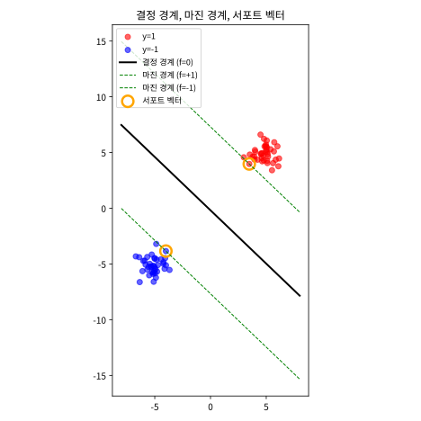

# 5.1 마진 최대화와 서포트 벡터

[](https://colab.research.google.com/github/SuminHan/book-ml/blob/main/notebooks/ml1/chapter05_1_svm_margin.ipynb)

### 순수 기하학적 질문

두 클래스가 완벽히 선형분리 가능한 데이터를 생각해보자. 두 클래스를 가르는
직선(초평면)은 무수히 많다 — 그런데 어떤 직선은 한쪽 클래스에 아슬아슬하게
붙어 있고, 어떤 직선은 양쪽에서 넉넉하게 떨어져 있다. SVM[^cortespapnikas95]은 **마진**(margin,
경계선에서 가장 가까운 데이터 점까지의 거리)이 **가장 큰** 직선을 고른다
[^cs229] —
새 데이터가 조금 다르게 나타나도 잘못 분류될 여지가 가장 적은 경계이기
때문이다.

한 걸음만 더 나아가보자. "두 클래스를 가르는 직선이 무수히 많다"는 말은
정확히 무엇을 뜻하는가? 같은 직선 위에서 \\(w^Tx+b=0\\)을 만족하는 해 \\((w,b)\\)는
하나뿐인 것 같은데, 왜 "무수히 많다"고 하는 걸까. 답은 의외로 단순하다.
\\(w^Tx+b=0\\)이라는 **직선 자체**는, \\((w,b)\\)를 어떤 (음수가 아닌) 상수 \\(k\\)로
곱해도 변하지 않는다:

\\[k\\,w^Tx + k\\,b = 0 \iff w^Tx+b=0\\]

즉 \\((w,b)\\)와 \\((3w,3b)\\)는 **정확히 같은 결정 경계**를 그려낸다. 이걸
**스케일 불변성**(scale invariance)이라 부른다. 이 사실이 왜 중요한가?
바로 "마진을 최대화하자"를 \\(\\|w\\|\\) 최소화 문제로 바꿀 때, **제약 없이**
\\(\\|w\\|\\)만 줄이려 하면 \\(w\to 0\\)으로 마음대로 쪼그라들 수 있어서 —
그동안 경계선은 한 치도 움직이지 않는데 — "마진" \\(2/\\|w\\|\\)는 끝없이
크게 부풀려진다. 스케일 불변성을 그대로 두면 "마진을 키운다"는 문제가
**정해지지 않은**(ill-posed) 문제다.

이 문제를 피하려면 스케일을 못 박는 조건이 반드시 필요하다 — "각 데이터
점이 올바른 쪽에 최소한 1만큼 떨어져 있으라"는 **마진 제약**이다. 이
제약이 \\(w^Tx+b\\)가 무한히 작아지는 것을 막아주므로, 이제 \\(\\|w\\|\\)는
"경계와 무관한 인공적인 크기"가 아니라 "경계가 데이터에서 얼마나 급하게
기울어지는가"를 나타내는 **의미 있는** 크기가 된다. 다음 단락에서 이
제약을 정식화한다.

### 마진과 서포트 벡터

결정 경계를 \\(w^Tx+b=0\\)으로 두면, 각 데이터가 올바른 쪽에 마진 1 이상의
여유를 두고 있어야 한다는 제약은:

\\[y^{(i)}(w^Tx^{(i)}+b) \ge 1, \qquad y^{(i)} \in \\{-1, +1\\}\\]

(로지스틱회귀와 달리 SVM에서는 라벨을 \\(0/1\\)이 아니라 \\(-1/+1\\)로 쓰는
게 관례다.) 이 제약 아래에서 마진의 크기는 \\(\frac{2}{\\|w\\|}\\)로
계산되므로, 마진을 최대화하는 것은 \\(\\|w\\|\\)를 **최소화**하는 것과
같다(이 유도는 연습문제 3번). 이 제약을 정확히 등호로 만족시키는(경계에
가장 가까운) 데이터 점들을 **서포트 벡터**(support vector)라 부른다 —
이름 그대로, 이 점들만이 경계의 위치를 "떠받친다." 서포트 벡터가 아닌
나머지 점들은 경계를 살짝 옮기거나 지워도 결과에 전혀 영향을 주지 않는다 —
로지스틱회귀가 **모든** 데이터를 손실함수에 반영하는 것과 대조적이다.

### 왜 마진은 \\(\frac{2}{\\|w\\|}\\)인가: 거리 공식을 다시 보기

연습문제 3번이 대수적으로 유도하는 결과를, 기하학적으로 한 번 더
느끼게 되자. \\(w\\) 벡터는 결정 경계에 **수직**이다 — \\(w^Tx+b=c\\)인
모든 점은 \\(w\\)와 수직인 초평면에 있기 때문이다. 따라서 "경계에서 어떤
점까지의 최단 거리"는 \\(w\\)의 방향으로만 측정하면 된다.

\\(w\\) 방향으로 1만큼(유클리드 거리로) 움직이면, \\(w^Tx+b\\)라는 식의 값은
얼마나 변할까? \\(w\\) 방향의 단위벡터는 \\(\hat w = w/\\|w\\|\\)이고,
\\(w^Tx\\)는 \\(w\\) 방향으로 이동할 때 **선형**으로 변하므로, 단위 이동마다
변하는 양은 정확히 \\(\\|w\\|\\)이다. 역으로, \\(w^Tx+b\\)가 1만큼 변하려면
\\(w\\) 방향으로 \\(\frac{1}{\\|w\\|}\\)만큼 이동하면 된다.

이제 서포트 벡터까지의 거리가 보인다. 양의 서포트 벡터 \\(x\_+\\)는
\\(w^Tx\_+ + b = 1\\)(최소 마진 제약이 등호로 성립), 경계 위의 점은
\\(w^Tx\_0 + b = 0\\)을 만족한다. 두 값을 빼면 \\(w^T(x\_+ - x\_0)=1\\)이고,
위에서 본 대로 \\(w^Tx+b\\)가 1만큼 변하는 데는 \\(w\\) 방향으로
\\(\frac{1}{\\|w\\|}\\)의 이동이 필요하므로, **경계에서 서포트 벡터까지의
직선 거리는 \\(\frac{1}{\\|w\\|}\\)**다. 마진은 양·음 양쪽의 서포트 벡터까지
의 거리를 합한 것이므로:

\\[\text{마진} = \frac{1}{\\|w\\|} + \frac{1}{\\|w\\|} = \frac{2}{\\|w\\|}\\]

여기서 "왜 \\(\\|w\\|\\)가 작은 것이 좋은가"의 기하학적 그림이 완성된다.
\\(\\|w\\|\\)가 작을수록 같은 "마진 1"을 얻는 데 더 먼 거리로 떨어져
있어야 하므로, 데이터가 더 넉넉한 여유를 얻는다 — 즉 **\\(\\|w\\|\\)를
작게 하는 것 = 마진을 넓게 하는 것**이다. 로지스틱회귀의 \\(w\\)가
"확률을 얼마나 급하게 바꾸는가"의 기울기를 뜻했다면, SVM의 \\(w\\)는
"마진이 얼마나 좁은가"의 역수 역할을 하는 것이다.

### 기능적 마진 vs 기하적 마진: 스케일이 사라지는 이유

앞에서 "직선은 \\((w,b)\\)를 \\(k\\)배로 써도 변하지 않는다(스케일
불변성)"고 했는데, 이 사실 때문에 *같은 점의 마진*을 재는 방식이
두 가지로 갈라진다. 어떤 점 \\(x\\)의 마진을

- **기능적 마진**(functional margin): \\(y^{(i)}(w^Tx^{(i)}+b)\\)
- **기하적 마진**(geometric margin): \\(\dfrac{y^{(i)}(w^Tx^{(i)}+b)}{\\|w\\|}\\)

로 정의한다. \\(w,b\\)를 \\(k\\)배로 스케일하면(같은 결정 경계) 기능적 마진은
\\(k\\)배로 변하지만, 기하적 마진은 \\(\frac{k(\cdot)}{k\\|w\\|}=\\) 그대로다 —
**실제 거리로 재는 기하적 마진만이 스케일에 무관하다**. 앞에서 유도한
"경계에서 서포트 벡터까지의 거리"가 바로 이 기하적 마진
\\(\frac{1}{\\|w\\|}\\)다.

대칭 데이터 예시로 직접 계산해보자. 최적해 \\(w=(1/6,1/6),\ b=0\\)에서
서포트 벡터 \\((3,3)\\)의 기능적 마진은 \\(1\cdot(3/6+3/6)=1\\), 기하적
마진은 \\(\frac{1}{\\|(1/6,1/6)\\|}=\frac{6}{\sqrt2}\approx4.24\\)다.
이제 같은 경계를 \\(3\\)배 스케일해서 \\(w'=(1/2,1/2),\ b'=0\\)로 다시 쓰면,
경계선 \\(x\_1+x\_2=0\\)은 **아무것도 안 변하는데** \\((3,3)\\)의 기능적 마진은
\\(1\cdot(1/2\cdot3+1/2\cdot3)=3\\)으로 \\(3\\)배 커진다. 반면 기하적 마진은
\\(\frac{3}{\\|(1/2,1/2)\\|}=\frac{3}{\sqrt2/2}=\frac{6}{\sqrt2}\approx4.24\\)로
**그대로**다. "마진을 최대화하자"에서 진짜 재고 싶은 것은 스케일에
무관한 **기하적 마진**(실제 거리)이므로, 최적화 문제에서는
\\(y^{(i)}(w^Tx^{(i)}+b)\ge1\\)이라는 제약으로 기능적 마진의 스케일을
"1로 고정"해 두고, 그 아래 \\(\\|w\\|\\)를 최소화하는 식으로 기하적 마진
\\(\frac{2}{\\|w\\|}\\)의 최대화를 풀게 된다.

### 손으로 한 번: 대칭 데이터로 최적 경계와 마진 직접 구하기

연습문제 1번의 데이터로 실제 최적해를 손으로 확인해보자. 양성 클래스
\\((3,3), (4,3), (3,4)\\), 음성 클래스 \\((-3,-3), (-4,-3), (-3,-4)\\)는
원점을 중심으로 대칭이므로, 대칭성만으로도 최적 경계가 원점을 지나는
직선 \\(x\_1+x\_2=0\\) 방향(즉 \\(w \propto (1,1)\\), \\(b=0\\))일 것이라
추측할 수 있다. \\(w=k(1,1)\\)이라 두고, 원점에 가장 가까운 점
\\((3,3)\\)이 정확히 마진 경계 위에 있다고(\\(y^{(i)}(w^Tx^{(i)}+b)=1\\))
놓으면:

\\[1 \times \left(k\times3 + k\times3\right) = 6k = 1 \quad\Longrightarrow\quad
k = \frac{1}{6}\\]

즉 \\(w = (1/6,\ 1/6)\\), \\(b=0\\)이다. 나머지 5개 점에서 제약이 실제로
만족되는지 하나씩 확인해보자:

| 점 | \\(y^{(i)}(w^Tx^{(i)}+b)\\) | 서포트 벡터? |
|---|---|---|
| (3,3) | \\(1\times(3/6+3/6)=1.000\\) | ✅ (등호) |
| (4,3) | \\(1\times(4/6+3/6)=1.167\\) | ✗ (여유 있음) |
| (3,4) | \\(1\times(3/6+4/6)=1.167\\) | ✗ |
| (-3,-3) | \\((-1)\times(-3/6-3/6)=1.000\\) | ✅ (등호) |
| (-4,-3) | \\((-1)\times(-4/6-3/6)=1.167\\) | ✗ |
| (-3,-4) | \\((-1)\times(-3/6-4/6)=1.167\\) | ✗ |

**모든 점이 제약을 만족**하고(6개 모두 \\(\ge1\\)), 그중 \\((3,3)\\)과
\\((-3,-3)\\) 딱 두 점만 정확히 등호를 만족한다 — 이 둘이 바로 서포트
벡터다. 마진은 \\(\frac{2}{\\|w\\|} = \frac{2}{\sqrt{(1/6)^2+(1/6)^2}} =
\frac{2}{\sqrt{2}/6} = \frac{12}{\sqrt2} \approx 8.485\\)이다. 이 손 계산
결과(\\(w\approx[0.167, 0.167]\\))는 연습문제 1번의 `hinge_loss_gradient_descent`가
2000 에폭 뒤에 수렴한다고 한 값과 정확히 일치하고, `sklearn.svm.SVC(kernel="linear")`[^scikitlearn]로
직접 학습시켜도 소수점까지 똑같은 \\(w, b\\)가 나온다(스크래치패드에서
검증).

### 대칭을 깨뜨리면 \\(b\\)만 변한다: 병진(shift) 예제

실제 데이터는 위처럼 원점에 대칭인 경우는 거의 없다. 대칭이 깨지면
\\(b\\)가 어긋나지만 **\\(w\\)는 그대로**라는 점을 작은 예제로 손으로
확인하자. 같은 6개 데이터를 전부 \\(+2\\)만큼 오른쪽으로 이동(병진)하면
양성 클래스는 \\((5,3),(6,3),(5,4)\\), 음성 클래스는 \\((-1,-3),(-2,-3),
(-1,-4)\\)가 된다. 이제 원점에 대칭이 아니므로 \\(b\\)가 변할 것이라
예상하는데, 실제로는 최적해가 \\(w=(1/6,1/6)\\)(**변함없음**),
\\(b=-1/3\\)이다. 왜 \\(b=-1/3\\)인가? 병진한 데이터에서 원점 방향으로
가장 가까운 양의 점은 \\((5,3)\\)이고, 이 점이 마진 경계 위에 있다고
(\\(y^{(i)}(w^Tx^{(i)}+b)=1\\)) 놓으면:

\\[1\times\left(\tfrac16\cdot5+\tfrac16\cdot3+b\right)=\tfrac86+b=1
\quad\Longrightarrow\quad b=1-\tfrac43=-\tfrac13\\]

음성 쪽의 가장 가까운 점 \\((-1,-3)\\)도 같은 \\(b\\)로 확인해보면
\\((-1)\times\left(\tfrac16(-1)+\tfrac16(-3)-\tfrac13\right)
=(-1)\times\left(-\tfrac46-\tfrac13\right)=-1\times(-1)=1\\)로 역시
등호를 만족한다 — 즉 새로운 두 서포트 벡터는 \\((5,3)\\)과 \\((-1,-3)\\)이다.
**데이터 전체를 이동시켜도 \\(w\\)는 그대로고 \\(b\\)만 변한다**는 이 결과는
"마진 최대화"의 본질이 *두 클래스 사이의 상대적 방향*(\\(w\\))을 정하는
것이고, *어디에 놓이느냐*(\\(b\\))는 데이터가 공간의 어떤 위치에 있느냐에
따라 달라진다는 점을 보여주는 좋은 예다. 노트북 2부에서 이 병진 실험을
코드로 재현한다.

### 실습: 마진과 서포트 벡터를 눈으로 보자

위 손 계산을 코드와 그림으로 확인한다. 대각선 방향으로 떨어진 두
클러스터를 만들어 선형 SVM을 학습시킨 뒤, **결정 경계**, **마진 경계선**
\\(w^Tx+b=\pm1\\), 그리고 **서포트 벡터**를 한 그림에 겹쳐 그린다.

```python
import numpy as np
from sklearn.svm import SVC
import matplotlib.pyplot as plt

# 대각선 방향으로 떨어진 두 클러스터
rng = np.random.default_rng(7)
X = np.vstack([rng.normal([5, 5], 0.8, (40, 2)),
               rng.normal([-5, -5], 0.8, (40, 2))])
y = np.r_[np.ones(40), -np.ones(40)]

clf = SVC(kernel="linear", C=1.0).fit(X, y)
w, b = clf.coef_[0], clf.intercept_[0]
sv = X[clf.support_]                       # 서포트 벡터만

# 결정 경계(w.T x + b = 0)와 마진 경계(= ±1)를 x1축으로 해 x2를 표현
x1 = np.linspace(-8, 8, 100)
f  = lambda c: (-w[0]*x1 - b + c) / w[1]   # w.T x + b = c  ->  x2 = ...

fig, ax = plt.subplots(figsize=(6, 6))
for lbl, m in [(1, "red"), (-1, "blue")]:
    ax.scatter(X[y == lbl, 0], X[y == lbl, 1], color=m, label=f"y={lbl}")
ax.plot(x1, f(0),  "k",  lw=2,  label="결정 경계 (f=0)")
ax.plot(x1, f(1),  "g--", lw=1, label="마진 경계 (f=+1)")
ax.plot(x1, f(-1), "g--", lw=1, label="마진 경계 (f=-1)")
ax.scatter(sv[:, 0], sv[:, 1], s=120, facecolors="none",
           edgecolors="orange", lw=2, label="서포트 벡터")
ax.set_aspect("equal"); ax.legend(); plt.show()

# 경계에서 서포트 벡터까지의 실제 거리 = 1/||w|| 인지 확인
p0 = np.array([(0, f(0)[50])])             # 경계 위의 한 점(대략)
d  = np.linalg.norm(sv[0] - (sv[0][0], f(0)[(sv[0][0]-x1[0]).argmin()]))
print("경계~SV 거리 =", round(d, 4), "  1/||w|| =", round(1/np.linalg.norm(w), 4))
```



이 그림에서 **마진 경계선(f=±1)은 결정 경계(f=0)와 평행**하며, 그 사이에
는 어떤 데이터도 존재하지 않는다. 오렌지 원으로 표시된 **서포트 벡터만이
마진 경계선 위에** 있고, 클러스터의 나머지 점들은 마진 바깥(안쪽)에
있다 — "서포트 벡터만 경계를 떠받친다"는 말이 그대로 눈에 들어온다.
마지막 두 줄은 **경계에서 서포트 벡터까지의 유클리드 거리가 정확히
\\(1/\\|w\\|\\)**임을 직접 재서, \\(\frac{2}{\\|w\\|}\\)라는 마진 공식이
"추상적 수식"이 아니라 **실제 거리**임을 확인해 준다.

- 실습 노트북: [notebooks/ml1/chapter05_1_svm_margin.ipynb](notebooks/ml1/chapter05_1_svm_margin.ipynb)
  (맨 위의 "Open in Colab" 배지로 바로 실행 가능) — 위 코드를 확장해
  병진(shift) 실험과 "서포트 벡터 아닌 점 이동" 실험까지 포함한다.

노트북에서 확인하는 핵심 세 가지는:

1. **마진 경계선이 경계에 평행하며, 그 사이가 "마진"** — 데이터는
   마진 경계선 바깥에만 있다.
2. **서포트 벡터는 마진 경계선 위에만 있다** — 그 밖의 점은 지워도
   \\(w,b\\)가 변하지 않는다.
3. **마진 너비 \\(2/\\|w\\|\\)가 실제 거리와 일치한다** — 경계에서 서포트
   벡터까지의 유클리드 거리가 정확히 \\(1/\\|w\\|\\)인지 직접 재본다.

### 역사: "마진"이라는 생각은 어디에서 왔나

"두 클래스를 가르는 경계 중 마진이 가장 큰 것을 택한다"는 이 아이디어는
단번에 떠올린 게 아니다. 1960년대, 벨 연구소의 블라디미르 바프닉(Vladimir
Vapnik)은 "모델이 얼마나 *복잡한가*"를 수치화하는 **VC 차원**(Vapnik–
Chervonenkis dimension)[^vc71]이라는 개념을 만들었다 — 이진 분류기의 VC 차원은
"그 모델이 완벽히(모든 라벨링에) 맞힐 수 있는 데이터의 최대 개수"로,
모델이 얼마나 많은 데이터 패턴을 기억할 수 있는지의 **용량** 척도다.
바프닉의 핵심 통찰은 이 용량이 작을수록(모델이 단순할수록) 과적합 위험이
줄어든다는 것, 그리고 **마진을 최대화하는 것은 이 용량을 자동으로
제한하는 방법**이라는 것이다 — 마진이 넓으면, 경계 근처에 있는 데이터
포인트를 뒤집으려면 \\(w\\)를 꽤 크게 돌려야 하므로, 그 "기울기 변화의
비용" \\(\frac{1}{2}\\|w\\|^2\\)이 자연스럽게 모델의 복잡도를 규제한다.

1990년대 중반, 코린나 코르테스(Corinna Cortes)[^cortespapnikas95]와 함께 SVM을 지금의
모양(소프트 마진, 커널 트릭 포함)으로 완성하면서 [^cs229], "마진 최대화"는
경험적 위험(empirical risk) 최소화만으로 끝나던 기존 분류법과 구별되는
독립된 원칙으로 자리 잡았다. 로지스틱회귀가 "확률"이라는 목적지를,
GDA[^gda]·나이브베이즈가 "데이터 생성 과정"이라는 목적지를 향했다면, SVM은
"경계의 안전 마진"이라는 **완전히 다른 목적지**를 향해 같은 분류 문제를
풀고 — 그 목적지가 다르다 보니 얻는 성질(서포트 벡터, 스케일 불변성,
커널 트릭)도 달랐다.

### 자주 하는 실수: "마진 최대화"를 "클러스터를 넓게 벌린다"로 오해하기

SVM을 처음 배울 때 흔한 오해는 "마진을 최대화한다"는 것을 "두 클래스
전체의 평균 위치를 최대한 멀리 벌린다"는 뜻으로 받아들이는 것이다. 위
표를 다시 보면 이게 왜 틀렸는지 분명해진다 — 결정 경계는 **오직**
\\((3,3)\\)과 \\((-3,-3)\\) 두 점의 위치에만 의존하고, 나머지 4개 점의
정확한 위치는 경계에 전혀 영향을 주지 않는다. 실제로 \\((4,3)\\)을
원점에서 훨씬 먼 \\((100,100)\\)으로 옮겨도(다른 5개 점은 그대로 두고),
다시 학습시킨 \\(w, b\\)는 **소수점까지 완전히 동일**하다(스크래치패드에서
직접 검증) — \\((100,100)\\)은 애초에 서포트 벡터가 아니었기 때문이다.
"마진 최대화"는 "전체 데이터의 평균적인 퍼짐"이 아니라, **경계에 가장
가까운 소수의 점(서포트 벡터)까지의 거리**만을 기준으로 삼는다는 점을
정확히 이해해야 한다 — 이것이 로지스틱회귀(모든 점이 손실에 기여)와
SVM(서포트 벡터만 경계를 결정)의 근본적인 차이다.

실습 노트북의 마지막 부분에서 이 점을 직접 재현한다: 선형 SVM을 학습시킨
뒤, 서포트 벡터 **아닌** 점을 데이터의 가장 바깥으로 크게 이동시켜
재학습하면 \\(w,b\\)가 소수점 아래까지 동일하게 유지되는 것을 확인한다.
반대로 로지스틱회귀는 같은 점 이동에도 \\(w\\)가 달라진다 — "모든 점이
손실에 기여"하는 모델에서는 멀리 있는 점도(비록 작게라도) 기울기에
영향을 주기 때문이다.

### 자주 묻는 질문

**Q. 서포트 벡터가 몇 개나 되나요?** 데이터와 문제에 따라 다르지만,
보통 전체 데이터 중 소수다(위 예시는 6개 중 2개). 서포트 벡터 개수가
적을수록 모델이 "기억"해야 할 정보가 적다는 뜻이라, SVM은 흔히 로지스틱
회귀보다 **메모리 효율적인 표현**을 갖는다고 설명된다 — 예측 시에도
전체 데이터가 아니라 서포트 벡터하고만 비교하면 된다(kNN이 전체 데이터를
다 봐야 하는 것과 대조적이다).

**Q. \\(w^Tx+b\\)의 값이 "1"이든 "0.5"이든 뭐가 다른가요? "마진 1"이
너무 임의적으로 느껴져요.** "1"이라는 숫자 자체는 아무 의미가 없다 —
위에서 본 대로 \\((w,b)\\)를 \\(k\\)배로 쓰면 \\(w^Tx+b\\)도 \\(k\\)배가 된다.
중요한 것은 **비율**이다. 제약 \\(y^{(i)}(w^Tx^{(i)}+b)\ge1\\)이 "가장
가까운 점의 함수적 마진을 정확히 1로 고정"하는 자물쇠 역할을 하고, 그
고정이 있어야 \\(\frac{2}{\\|w\\|}\\)가 스케일에 무관한 *실제 거리*가 된다.
만약 제약을 \\(\ge0.5\\)로 썼다면 \\(w\\)가 정확히 2배가 되고(경계는
동일), \\(\frac{2}{\\|w\\|}\\)는 절반 — 즉 실제 거리도 그대로 — 가
되어, "마진 최대화"의 답은 결국 동일하다. 숫자 "1"은 스케일을 못 박는
관습적 선택일 뿐이다.

**확인 문제**: 위 표에서 서포트 벡터가 아니었던 \\((4,3)\\)을 이번엔
원점 방향으로 훨씬 가깝게 당겨서 \\((0.5, 0.5)\\)로 옮긴다면(다른 5개
점은 그대로) 최적 경계 \\(w, b\\)가 바뀔지 안 바뀔지 먼저 예상해보라.
(힌트: \\((0.5,0.5)\\)는 라벨이 \\(+1\\)인데, 원래 경계 \\(w=(1/6,1/6)\\),
\\(b=0\\)을 그대로 대입하면 \\(y^{(i)}(w^Tx^{(i)}+b) =
1\times(0.5/6+0.5/6) \approx 0.167\\)로 **1보다 작다** — 이 점이 이제
마진을 위반하게 된다는 뜻이다. 위반하는 점이 새로 생기면 그 점도 서포트
벡터 후보가 되어, 원래 경계를 그대로 유지할 수 없다.) 예상이 맞는지
`sklearn.svm.SVC(kernel="linear")`로 직접 확인해보라.
(참고: 실제로 학습시키면 \\(w\approx(0.286,0.286)\\), \\(b\approx0.714\\)로
바뀌고, \\((0.5,0.5)\\)와 \\((-3,-3)\\)이 새로운 두 서포트 벡터가 된다.)

**Q. 라벨을 왜 굳이 \\(-1/+1\\)로 바꾸나요?** \\(y^{(i)}(w^Tx^{(i)}+b)\\)
하나의 식으로 "올바른 클래스 쪽에 있는가"와 "얼마나 여유 있게 있는가"를
동시에 표현하기 위한 표기상의 편의다. \\(y=+1\\)이면 \\(w^Tx+b\\)가
양수일수록, \\(y=-1\\)이면 음수일수록 좋은 것인데, 라벨을 \\(\pm1\\)로
두면 두 경우 모두 "곱이 클수록 좋다"는 하나의 부등식으로 통일된다 — 만약
라벨이 \\(0/1\\)이었다면 클래스마다 부등호 방향이 다른 두 개의 식을
따로 다뤄야 했을 것이다.

**Q. 로지스틱회귀도 결국 같은 \\(w^Tx+b=0\\) 경계를 찾는데, 둘을 어떻게
구별하면 되나요?** 둘 다 선형 결정 경계를 출력하지만, *어떤* 경계를
뽑을지가 다르고, 그 결과가 실무에서 실제로 차이를 만든다. 로지스틱회귀는
"라벨을 맞히는 확률을 최대화"하되 **모든 점**이 손실에 기여하기 때문에,
클러스터의 *외곽에 멀리 떨어진* 점의 위치도(비록 아주 작게라도) 경계의
기울기를 미세하게 조정한다. SVM은 마진 바깥의 점에는 손실이 **정확히 0**
이라 아예 신경 쓰지 않고, 경계의 위치를 오직 경계에 가장 가까운
**서포트 벡터**만 결정한다. 결과적으로 로지스틱회귀는 데이터 전체의
"분포적 밀도"에 민감한(매끄러운) 경계를, SVM은 가장자리의 "가장 가까운
몇 점"에 민감한(각진) 경계를 만든다. 이상치가 섞여 있으면 이 차이가
크게 나타난다 — SVM은 이상치가 서포트 벡터가 안 되는 한 무시를 하고,
로지스틱회귀는 이상치가 아무리 멀어도(아주 작은 기울기로라도) 손실에
영향을 주니, "이상치 견고성(robustness)" 측면에서는 두 모델이 서로
다른 트레이드오프를 가진다고 볼 수 있다.

[^cs229]: 더 깊이 보려면: Stanford CS229: Machine Learning, Lecture Notes. https://cs229.stanford.edu/main_notes.pdf — 이 절의 마진 최대화, 서포트 벡터, 기능적/기하적 마진은 CS229 강의 노트의 SVM 장과 거의 1:1로 겹친다.
[^cortespapnikas95]: Cortes, C., Vapnik, V. (1995). "Support-Vector Networks." Machine Learning 20(3), 273–297. — SVM(라그랑주 쌍대 문제와 커널 방법을 포함한)의 원 논문.
[^vc71]: Vapnik, V. N., Chervonenkis, A. Ya. (1971). "On the uniform convergence of frequencies of events to their probabilities." Theory of Probability and Its Applications 16(2), 264–286. — VC 차원을 정의한 원 논문.
[^scikitlearn]: Pedregosa, F. et al. (2012). "Scikit-learn: Machine Learning in Python." arXiv:1201.0490.
[^gda]: Ng, A. Y., Jordan, M. I. (2001). "On Discriminative vs. Generative Classifiers." NIPS 14 (Advances in Neural Information Processing Systems). — GDA(Generalized Discriminative Analysis)를 제안한 원 논문: 판별 모델(로지스틱회귀)과 생성 모델(나이브베이즈)의 결정 경계를 비교하고, 올바른 파라미터화 시 GDA의 사후확률이 로지스틱회귀의 시그모이드와 정확히 같은 형태가 됨을 보인다.
