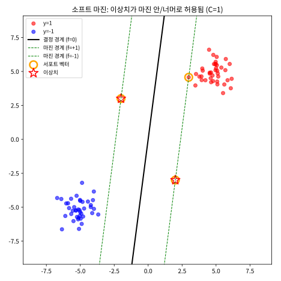
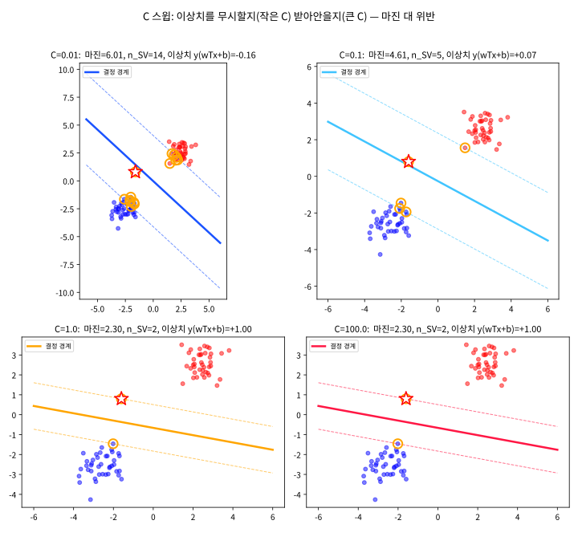
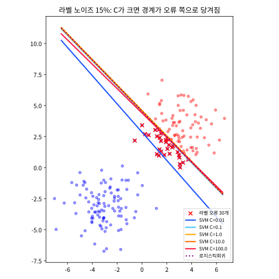

# 5.2 소프트 마진: 완벽히 나뉘지 않는 데이터

[](https://colab.research.google.com/github/SuminHan/book-ml/blob/main/notebooks/ml1/chapter05_2_soft_margin.ipynb)

### 도입: 5.1절이 놓친 가장 큰 문제

5.1절의 하드 마진 SVM은 "모든 데이터가 올바르게 분류되고, 최소한 마진
1 이상으로 떨어져 있어야 한다"는 제약 \\(y^{(i)}(w^Tx^{(i)}+b) \ge 1\\)
아래에서 \\(\\|w\\|\\)를 최소화하는 문제였다. 이 문제는 예쁜 수학적 성질
(쌍대 문제, 서포트 벡터, \\(\frac{2}{\\|w\\|}\\) 마진 공식)을 다 갖췄지만,
한 가지 치명적인 전제를 품고 있다 — **데이터가 완벽히 선형분리 가능하다는
가정**이다. 실전 데이터는 노이즈 때문에 이 가정을 거의 만족하지 않는다.
라벨링 오류(의사가 진단을 틀렸거나, 스팸 필터의 학습용 메일에 사람이
틀린 태그를 붙인 경우), 측정 오류(센서 오차), 그리고 애초에 모호한
경계 사례(도메인 밖의 데이터)가 섞이면, **어떤 \\((w,b)\\)로도 제약을
모두 만족시킬 수 없다.** 제약이 불일치(infeasible)인 이차계획 문제를
풀 수는 없으므로, 하드 마진 SVM은 라벨 오류가 단 하나만 있어도
**해 자체가 존재하지 않는 모델**이 된다 — 이걸 그대로 실전에 쓸 수는
없다.

소프트 마진은 이 불일치를 **허용**하는 방식으로 고친다. 고법의 핵심은
한 줄이면 충분하다: "제약을 만족 못 하면, 얼마만큼 못 했는지 재서 벌을
부리고, 벌의 크기는 하이퍼파라미터로 조절한다." 이 절에서는 그
"허용의 가격표"를 만들어 보고, 가격표의 유일한 손잡이인 \\(C\\)가
데이터의 경계에서 실제로 무엇을 바꾸는지(마진의 넓이, 서포트 벡터의
집단, 일반화 성능) 숫자와 그림으로 추적한다.

### 여유 변수와 힌지 손실

실전 데이터는 노이즈 때문에 완벽하게 선형분리되지 않는 경우가 대부분이다.
**소프트 마진**(soft margin) SVM[^cortespapnikas95]은 각 데이터마다 위반을 어느 정도
허용하는 여유 변수(slack variable) \\(\xi^{(i)} \ge 0\\)를 도입한다:

\\[y^{(i)}(w^Tx^{(i)}+b) \ge 1 - \xi^{(i)}\\]

\\(\xi^{(i)}\\)는 "몇 만큼까지 마진 제약을 무시할 수 있는가"의 **권한**이다.
\\(\xi^{(i)}=0\\)이면 5.1절의 제약과 정확히 같다. \\(\xi^{(i)}=0.5\\)이면
기능적 마진이 0.5까지 낮아져도(마진 경계 안쪽으로 0.5쯤 들어와도)
분류는 옳은 쪽이므로 "참을 수 있는 위반"이고, \\(\xi^{(i)}=1\\)이면
마진이 0까지(결정 경계 위에) 낮아져도 괜찮다는 뜻이며, \\(\xi^{(i)}>1\\)이면
**경계 너머(오히려 반대쪽 클래스 영역**)로 넘어가도 된다는 허락이다.
즉 하나의 수 \\(\xi^{(i)}\\)가 "정답인데 마진 안"에서 "오분류"까지의
스펙트럼을 연속적으로 표현한다.

전체 목적함수는 "마진을 최대화하고 싶다"(\\(\\|w\\|\\) 최소화)와 "위반을
최소화하고 싶다"(\\(\sum \xi^{(i)}\\) 최소화) 사이의 트레이드오프가 된다:

\\[J(w,b) = \frac{1}{2}\\|w\\|^2 + C\sum\_{i=1}^m \xi^{(i)}\\]

이 목적함수는 사실 **힌지 손실**(hinge loss)[^cortespapnikas95] \\(\max(0, 1-y^{(i)}(w^Tx^{(i)}+b))\\)의
합으로 다시 쓸 수 있다 — 마진을 충분히 만족하면(\\(\ge 1\\)) 손실 0, 위반하면
그만큼 선형으로 손실이 커진다. \\(C\\)는 "마진을 넓게 잡을 것인가, 위반을
덜 허용할 것인가"를 조절하는 하이퍼파라미터다: \\(C\\)가 크면 위반에
더 엄격해져(과적합 위험), \\(C\\)가 작으면 마진을 넓게 잡는 대신 위반을
더 허용한다(과소적합 위험) — Chapter 6에서 다룰 정규화 세기 조절과
정확히 같은 종류의 트레이드오프다.[^cs229]

힌지 손식으로 다시 쓴 목적함수는 다음과 같다. \\(\max(0,\cdot)\\)이
\\(\xi^{(i)}\\)의 최소값을 자동으로 계산해주기 때문이다 — \\(\xi^{(i)}\\)를
별도 변수로 두지 않고도, 제약을 "최소로 위반"하는 값이 바로 힌지 손실이
되므로:

\\[J(w,b) = \frac{1}{2}\\|w\\|^2 + C\sum\_{i=1}^m
\max\bigl(0,\ 1-y^{(i)}(w^Tx^{(i)}+b)\bigr)\\]

**힌지**(hinge, "힌지/경첩"라는 뜻)라는 이름은 이 함수의 그래프를 보면
알 수 있다 — \\(f = y^{(i)}(w^Tx^{(i)}+b)\\)를 자변수로 하면
\\(L(f) = \max(0, 1-f)\\)은 \\(f=1\\)에서 "접힌"(kink) 삼각형 모양을
이룬다: \\(f<1\\)에서는 기울기 \\(-1\\)로 선형 증가하다가 \\(f \ge 1\\)
에서는 **정확히 0으로 꺾여 평평해진다.** 이 "충분히 맞히면 아예 손실이
없다"는 성질이 5.1절의 "서포트 벡터만 경계를 결정한다"는 사실을
소프트 마진으로 연장해주는 핵심이며, 바로 아래 "손으로 한 번" 두 개에서
직접 계산한다.

### \\(C\\)는 "이상치 용인도"를 조절하는 손잡이

\\(C\\)의 의미를 정확히 잡자. \\(C\\)가 큰 것은 "위반을 무겁게 벌한다"는
것, 즉 **데이터의 라벨에 충실하게 경계를 맞추라**는 명령이다. 반대로
\\(C\\)가 작은 것은 "라벨이 틀려도 괜찮으니, 대신 경계가 단순하고 마진이
넓어야 한다"는 명령이다. 따라서 \\(C\\)는 Chapter 2의 학습률, Chapter 4의
\\(k\\)와 나란히, **모델의 "데이터 충실도 vs 단순함"을 한 자리에서
조절하는 손잡이**다. (5.3절의 RBF 커널에서는 \\(C\\) 옆에
"경계의 구부러짐"을 조절하는 \\(\gamma\\)가 더 생기는데, 그때도 둘은
같은 역할을 서로 다른 축에서 한다.)

이 절의 실험 데이터에는 이상치를 **의도적으로** 넣는다. 실전에서는
이상치가 항상 있는 것이 아니지만, 이상치가 있는 데이터에서 \\(C\\)가
무엇을 하는지 보면, 이상치가 없는 데이터에서 \\(C\\)가 "경계를 어디에
둘 것인가"를 미세 조절하는 것이 어떤 극한의 한계 행동인지
직관적으로 보인다 — 작은 \\(C\\)는 "경계가 이상치 없이 가장 단순하게
나눠지는 위치"로 수렴한다.

### 손으로 한 번: 힌지 손실과 \\(C\\)의 효과를 직접 계산하기

5.1절의 대칭 데이터에 이상치 두 개를 추가해보자: 정상 점
\\((3,3)\to+1\\), \\((-3,-3)\to-1\\)에 더해, 반대쪽 영역에 잘못 놓인
이상치 \\((2,-3)\to+1\\), \\((-2,3)\to-1\\)이 있다고 하자. 어떤 후보
경계 \\(w=(0.2,\ 0.2)\\), \\(b=0\\)에 대해, 각 점의 힌지 손실
\\(\max(0,\ 1-y^{(i)}(w^Tx^{(i)}+b))\\)를 계산하면:

| 점 | \\(y^{(i)}(w^Tx^{(i)}+b)\\) | 힌지 손실 |
|---|---|---|
| (3,3), \\(y{=}{+}1\\) | \\(0.2{\times}3+0.2{\times}3=1.2\\) | \\(\max(0, 1-1.2)=0\\) |
| (-3,-3), \\(y{=}{-}1\\) | \\((-1)(-0.6-0.6)=1.2\\) | \\(0\\) |
| (2,-3), \\(y{=}{+}1\\) | \\(0.2{\times}2+0.2{\times}(-3)=-0.2\\) | \\(\max(0, 1-(-0.2))=1.2\\) |
| (-2,3), \\(y{=}{-}1\\) | \\((-1)(-0.4+0.6)=-0.2\\) | \\(1.2\\) |

정상 점 두 개는 마진을 넉넉히 만족해서 손실이 0이지만, 이상치 두 개는
아예 반대쪽 영역에 있어서(\\(y^{(i)}(w^Tx^{(i)}+b)\\)가 음수) 손실이
크게(1.2씩) 발생한다. 전체 목적함수 \\(J(w,b)=\frac{1}{2}\\|w\\|^2 +
C\sum\_i \xi^{(i)}\\)를 계산해보면 \\(\\|w\\|^2=0.08\\)이므로
\\(\frac{1}{2}\\|w\\|^2=0.04\\), \\(\sum\_i \xi^{(i)}=1.2+1.2=2.4\\)이다:

\\[C{=}0.1: \quad J = 0.04 + 0.1\times2.4 = 0.28, \qquad
C{=}10: \quad J = 0.04 + 10\times2.4 = 24.04\\]

같은 \\((w,b)\\)인데도 \\(C\\)가 커질수록 이상치 두 개가 만드는 손실이
목적함수를 완전히 지배한다 — \\(C=10\\)에서는 이 두 이상치를 훨씬 강하게
"싫어하게" 되므로, 실제로 최적화를 돌리면 옵티마이저는 이 두 점을 위해
경계를 크게 구부리거나(마진을 희생해서라도) 더 촘촘히 맞추려 할
것이다. \\(C=0.1\\)에서는 이상치의 손실이 상대적으로 덜 중요해서, 옵티마이저는
차라리 마진을 넓게 유지하는 쪽(\\(\\|w\\|\\)를 작게)을 선호하고 이상치
두 개는 "어쩔 수 없는 노이즈"로 용인한다.

### 손으로 한 번: 힌지 손실의 그래디언트 — "어디서 멈추는가"

힌지 손실의 그래디언트를 직접 계산하면, 로지스틱회귀(Chapter 2)와의
"모든 점이 기여한다"는 대비가 **숫자로** 드러난다. \\(f = y^{(i)}(w^Tx^{(i)}+b)\\)
라 놓고 \\(L = \max(0, 1-f)\\)의 그래디언트는:

\\[\frac{\partial L}{\partial w} = \begin{cases}
-y^{(i)}x^{(i)} & \text{if } f < 1 \quad (\text{마진 위반})\\
0 & \text{if } f \ge 1 \quad (\text{마진 만족})
\end{cases}
\qquad
\frac{\partial L}{\partial b} = \begin{cases}
-y^{(i)} & \text{if } f < 1\\
0 & \text{if } f \ge 1
\end{cases}\\]

마진을 만족하는 점의 기여는 **정확히 0**이다 — 로지스틱회귀에서는
아무리 잘 맞혀도 \\(1-\sigma(f)>0\\)이므로 모든 점이 계속 기울기에
기여했지만, 힌지 손실은 "충분히 맞힌" 점의 기여가 **완전히**
사라진다. 이 차이가 "서포트 벡터" 개념을 가능하게 하는 것
(5.1절 FAQ의 "서포트 벡터만 경계를 결정한다"는 말의 정밀한 버전).

이걸 위 대칭 데이터에서 실제 학습 궤적으로 확인하자. 5.1절 연습문제
1번의 \\(hinge\_loss\_gradient\_descent\\)를 \\(C=1.0,\\alpha=0.01\\)로
돌리면(5.1절 데이터는 대칭이므로 \\(b\\)는 처음부터 끝까지 정확히
0):

| 에폭 | \\(w\_1\\) (\\(=w\_2\\)) | \\(b\\) |
|---|---|---|
| 1 | 0.0333 | 0.0000 |
| 10 | 0.1750 | 0.0000 |
| 100 | 0.1719 | 0.0000 |
| 2000 | 0.1735 | 0.0000 |

몇십 에폭 만에 \\(w \approx 0.17\\)로 수렴한다 — 이는 5.1절의
손계산으로 구한 정확해 \\((1/6,1/6)\approx(0.167,0.167)\\)
(\\(6k=1 \Rightarrow k=1/6\\))에 잘 붙는다. (정확히 0.1667이
아니라 0.1735에 머무는 것은, full-batch 경사하강이 힌지 손실의
"꺾임"(\\(f=1\\)에서 미분 불가) 때문에 최적해 근처에서 약간
진동하며 2000 에폭 만에 완전히 가라앉지 않기 때문이다 — 이
진동 자체도 연습문제 4번에서 다룬다.) 대칭 데이터에서는 두
클래스의 위반 패턴이 완전히 대칭이므로 \\(b\\)의 그래디언트가 항상
상쇄되어 0으로 남는다는 점에 주목하라. **실제 데이터는 대칭이
아니므로** \\(b\\)가 0에서 벗어나 "경계의 위치"를 결정한다 —
노트북 3부에서 \\(b/\\|w\\|\\)(경계의 원점부터의 거리)이 \\(C\\)에
따라 어떻게 변하는지 직접 측정한다.

**왜 \\(f\ge1\\)에서 그래디언트가 0인가?** \\(\max(0,1-f)\\)의
그래프가 \\(f=1\\)에서 꺾여 그 오른쪽은 완전히 평평하기 때문이다.
이 "비활성화" 성질 때문에, SVM의 경계는 **마진 경계 안에만 있는
점들(서포트 벡터**)에만 의해 결정되고, 그 바깥의 점들이 어디에
있든 경계는 변하지 않는다 — 5.1절의 "(4,3)을 (100,100)으로
옮겨도 \\(w,b\\)가 소수점까지 동일"라는 실험의 **메커니즘**이
여기서 완성된다.

### 소프트 마진의 세 가지 영역

하드 마진에서는 "마진 경계 \\(f=\pm1\\) 안에 데이터가 없다"는 것이
제약 그 자체였다. 소프트 마진에서는 그 안에도(그 너머에도) 데이터가
들어올 수 있으므로, 각 데이터는 \\(\xi^{(i)}\\)의 크기에 따라 세 영역
중 하나에 속하게 된다. 어떤 점의 기능적 마진 \\(f = y^{(i)}(w^Tx^{(i)}+b)\\)
로 쓰면:

| 영역 | 조건 | \\(\xi^{(i)} = \max(0,1-f)\\) | 의미 |
|---|---|---|---|
| ① 마진 바깥 정답 | \\(f \ge 1\\) | 0 | 손실 0, 경계에 영향 없음(서포트 벡터 아님) |
| ② 마진 안 정답 | \\(0 < f < 1\\) | \\(1-f\\) | 마진 일부 침범 — 경계에 기여(서포트 벡터) |
| ③ 옳은 쪽이지만 경계 너머 | \\(f \le 0\\) | \\(\ge 1\\) | 오분류 상태 — 손실 1 이상, 경계에 가장 강하게 기여 |

이 표의 핵심은 **\\(\xi\\)의 크기가 "문제의 심각도"를 연속적으로
재준다는 것**이다. \\(f=0.9\\)인 점(②, 아슬아슬하게 마진 안)은
\\(\xi=0.1\\)로 거의 정상이지만, \\(f=-0.2\\)인 점(③, 이미 반대
측)은 \\(\xi=1.2\\)로 12배 비싼 "오류"다 — 위반이 경계를 넘으면
손실이 1을 기점으로 기울기가 달라지거나 하는 것이 아니라, **기울기는
\\(-1\\)로 동일**한 채 절대값만 커지는 것이다. 힌지 손실은
"경계 너머로 멀리 떨어진" 점을 "직접 경계 위에 있는" 점보다 특별히
더 크게 벌하지 않는다(이건 로지스틱회귀의 교차 엔트로피가
\\(-\log\\sigma\\)로 지수적으로 벌하는 것과 대비된다 — 5.3절 FAQ에서
다시 만난다).

### 실습: 소프트 마진의 세 영역을 눈으로 보자

5.1절의 대각선 두 클러스터(\\(\pm(5,5)\\), 스프레드 0.8)에 본문
"손으로 한 번"의 이상치 두 개 \\((2,-3){\to}+1\\), \\((-2,3){\to}-1\\)
을 붙이고 \\(C=1.0\\)으로 선형 SVM을 학습시킨다. 이상치는 "완벽한
이상치"(다른 클래스 클러스터 근처)가 아니라 **경계 쪽 클러스터
사이에 놓인** 점이라, \\(C=1\\)에서는 어느 영역(② 또는 ③)에
빠지게 될지 예측해보고 학습 결과를 대조하라.

```python
import numpy as np
import matplotlib.pyplot as plt
from sklearn.svm import SVC

# 5.1절 대각선 클러스터 + 이상치 두 개
rng = np.random.default_rng(7)
X = np.vstack([rng.normal([5, 5], 0.8, (40, 2)),
               rng.normal([-5, -5], 0.8, (40, 2)),
               np.array([[2.0, -3.0], [-2.0, 3.0]])])
y = np.r_[np.ones(40), -np.ones(40), [1.0, -1.0]]

clf = SVC(kernel="linear", C=1.0).fit(X, y)
wc, bc = clf.coef_[0], clf.intercept_[0]
sv = X[clf.support_]                          # 서포트 벡터만
outs = X[80:82]                               # 이상치 두 개

x1 = np.linspace(-8, 8, 100)
f_line = lambda c: (-wc[0]*x1 - bc + c) / wc[1]   # f = c 의 직선

fig, ax = plt.subplots(figsize=(6.5, 6.5))
for lbl, col in [(1, "red"), (-1, "blue")]:
    ax.scatter(X[y == lbl, 0], X[y == lbl, 1], color=col,
               alpha=0.6, label=f"y={lbl}")
ax.plot(x1, f_line(0),  "k",   lw=2,  label="결정 경계 (f=0)")
ax.plot(x1, f_line(1),  "g--", lw=1,  label="마진 경계 (f=+1)")
ax.plot(x1, f_line(-1), "g--", lw=1,  label="마진 경계 (f=-1)")
ax.scatter(sv[:, 0], sv[:, 1], s=160, facecolors="none",
           edgecolors="orange", lw=2.5, label="서포트 벡터")
ax.scatter(outs[:, 0], outs[:, 1], s=260, marker="*",
           facecolors="white", edgecolors="red", lw=1.5, label="이상치")
ax.set_aspect("equal"); ax.legend(loc="upper left", fontsize=9)
ax.set_title("소프트 마진: 이상치가 마진 안/너머로 허용됨 (C=1)")
plt.show()

# 이상치가 어느 영역(②/③)에 빠졌는지 직접 계산
for i in [80, 81]:
    m = y[i] * (wc @ X[i] + bc)
    print(f"이상치 {tuple(X[i])}: f={m:+.3f} -> xi={max(0.0,1-m):.3f}, "
          f"{'서포트 벡터' if i in clf.support_ else '아님'}")
print(f"서포트 벡터 {len(sv)}개 / 전체 {len(X)}개,  마진 2/||w|| = {2/np.linalg.norm(wc):.3f}")
```



이 그림에서 하드 마진(5.1절)과의 차이를 세 가지로 읽자.

1. **마진 경계 안에 데이터가 들어와 있다** — 5.1절의 그림에서는
   \\(f=\pm1\\) 사이에 아무 점도 없었지만, 여기서는 이상치가
   마진 안(또는 경계 너머)에 있다. 그것이 허용된 것이지,
   결함이 아니다.
2. **서포트 벡터의 위치가 바뀌었다** — 5.1절에서는 클러스터
   가장자리의 두 점만 서포트 벡터였지만, 여기서는 이상치 두 개가
   서포트 벡터에 포함된다(코드 마지막 출력을 보면 인덱스 80, 81 모두
   \\(f=+1.000\\), \\(\xi=0\\)이고 "서포트 벡터"로 찍힌다).
   이상치를 "받아안으려다" 마진 경계 위에 정확히 올려놓은 것이며,
   이 때문에 경계가 이상치의 위치에 의해 조정되었다.
3. **마진이 5.1절보다 좁아졌다** — \\(2/\\|w\\|\\)를 출력해보면
   5.1절의 \\(\approx8.5\\)보다 작다. 이상치를 "받아안으려면"
   \\(\\|w\\|\\)가 커져야 하고, \\(\\|w\\|\\)가 커지면 마진이
   좁아진다 — 이것이 바로 \\(C\\)가 조절하는 트레이드오프의
   한 단면.

- 실습 노트북: [notebooks/ml1/chapter05_2_soft_margin.ipynb](notebooks/ml1/chapter05_2_soft_margin.ipynb)
  (맨 위의 "Open in Colab" 배지로 바로 실행 가능) — 위 코드를 확장해
  \\(C\\) 스윕(3부), 라벨 노이즈 실험(4부), 힌지 vs 교차 엔트로피
  그래디언트 비교(5부)까지 포함한다.

### 실습: \\(C\\) 스윕 — 이상치를 "무시할지 받아안을지"

앞서 "손으로 한 번"에서는 **같은** \\((w,b)\\)에 \\(C\\)를 바꿔
목적함수 값을 계산했다. 이번에는 반대로, \\(C\\)를 바꿔가며
**최적 \\((w,b)\\)가 어떻게 달라지는지** 추적한다.

데이터: 클러스터 \\(\pm(2.5,2.5)\\)(스프레드 0.6, 각 40개)에
\\(y{=}{+}1\\)인 이상치 \\((-1.6, 0.8)\\) 하나. 이 이상치는
\\((-2.5,-2.5)\\) 클러스터 쪽 여유 영역에 들어와 "거의" 옳은 쪽에
있지만(음성 클러스터의 스프레드 0.6을 고려하면 마진 경계 근처)
마진은 위반하는 점이다. \\(C\\)를 \\(0.01\\)부터 \\(100\\)까지
올리면:

```python
import numpy as np
from sklearn.svm import SVC

# 클러스터 ±(2.5,2.5) 스프레드 0.6, 각 40개 + 이상치 (-1.6,0.8)
rng = np.random.default_rng(21)
n = 40
X = np.vstack([rng.normal([2.5, 2.5], 0.6, (n, 2)),
               rng.normal([-2.5, -2.5], 0.6, (n, 2)),
               np.array([[-1.6, 0.8]])])
y = np.r_[np.ones(n), -np.ones(n), [1.0]]

# 같은 데이터를 C = 0.01, 0.1, 1, 10, 100 으로 학습
Cs = [0.01, 0.1, 1.0, 10.0, 100.0]
print(f"{'C':>7s} {'마진 2/||w||':>12s} {'b/||w||':>8s} "
      f"{'n_SV':>5s} {'이상치 f':>10s} {'정상점 오분류':>12s}")
for C in Cs:
    clf = SVC(kernel="linear", C=C).fit(X, y)
    wc, bc = clf.coef_[0], clf.intercept_[0]
    om = y[-1] * (wc @ X[-1] + bc)     # 이상치의 기능적 마진
    mis = (clf.predict(X[:-1]) != y[:-1]).sum()
    print(f"{C:7.2f} {2/np.linalg.norm(wc):12.3f} "
          f"{bc/np.linalg.norm(wc):+8.3f} {len(clf.support_):5d} "
          f"{om:10.3f} {mis:12d}")
```

| \\(C\\) | 마진 \\(2/\\|w\\|\\) | \\(b/\\|w\\|\\) | 서포트 벡터 수 | 이상치 \\(f\\) |
|---|---|---|---|---|
| 0.01 | 6.01 | +0.02 | 14 | −0.16 |
| 0.1 | 4.61 | +0.23 | 5 | +0.08 |
| 1.0 | 2.30 | +0.65 | 2 | +1.00 |
| 10.0 | 2.30 | +0.65 | 2 | +1.00 |
| 100.0 | 2.30 | +0.65 | 2 | +1.00 |

이 표에서 \\(C\\)의 역할을 세 단어로 읽자:

- **\\(C=0.01\\)(이상치 무시)**: 마진이 가장 넓고(6.01), 이상치의
  \\(f\\)는 \\(-0.16\\)로 **결정 경계 너머**다(오분류 상태,
  ③영역). 서포트 벡터가 14개 — 이상치를 무시하고 원래 두
  클러스터만 봐서 경계가 "정직한" 위치를 잡고 있지만, 그 대가로
  이상치를 버린다.
- **\\(C=0.1\\)(이상치 일부 수용)**: 마진이 4.61로 좁혀지고,
  이상치의 \\(f\\)는 \\(+0.08\\)로 **경계 안**으로 들어왔다(②영역,
  마진은 위반). 서포트 벡터 5개.
- **\\(C \ge 1\\)(이상치 완전 수용)**: 이상치의 \\(f\\)가 정확히
  \\(1.00\\)로, **마진 경계 위에** 놓인다(②영역의 한계,
  \\(\xi=0\\)). 이상치가 "서포트 벡터 중 하나"가 되어 경계를
  떠받치고, 마진은 2.30으로 좁아진다. \\(C=1\\)에서 이미
  이상치를 완전히 수용했으므로 \\(C=10,100\\)로 더 올려도
  결과(경계·마진·서포트 벡터)가 모두 동일하다 — **이상치가 하나뿐
  이고 그 이상치가 수용되면, \\(C\\)를 더 올려도 변하지 않는다.**
  (이 "지수" 현상은 \\(C\\) 튜닝의 실용적 상한선을 알려준다:
  검증셋 정확도가 더 이상 변하지 않는 \\(C\\) 이상은 과적합
  위험만 키울 뿐이다.)



이 그림에서 \\(C\\)의 영향을 한눈에 비교할 수 있다. \\(C=0.01\\)
(위쪽 왼쪽)에서는 이상치(빨간 별)가 결정 경계 너머(옅은 색 영역)에
남아 있고, \\(C=100\\) (아래쪽 오른쪽)에서는 이상치가 마진 경계
위에 정확히 놓여 있다. **같은 데이터, 다른 \\(C\\) → 다른 경계** —
\\(C\\)가 "경계의 위치"를 실제로 결정한다는 가장 직접적인 증거다.

### 라벨 노이즈: \\(C\\)가 과적합을 조절하는 방식

이상치가 "단 몇 개"만 있는 경우는 이미 봤다. 실전에서 더 흔한 문제는
**라벨링 오류**다 — 데이터가 수천 개면, 그중 라벨이 틀린 것이 5~15%
섞여 있는 것이 정상이다. 이상치와 라벨 노이즈의 차이는, 라벨 노이즈는
**"경계 근처에 있는" 점의 라벨이 뒤집혀 있다**는 것이다. 이 경우
\\(C\\)의 역할이 가장 극적으로 드러난다: \\(C\\)가 클수록 모델은
"모든 라벨에 충실하려" 하기 때문에, 틀린 라벨까지도 맞춰주려
경계를 그 오류 쪽으로 끌고 간다.[^dropout]

데이터: 클러스터 \\(\pm(3,3)\\)(스프레드 1.5, 각 100개, 총 200개).
\\(y{=}{+}1\\) 클래스 중 **경계에 가장 가까운 30개**(라벨 노이즈 15%)
의 라벨을 \\(-1\\)로 뒤집는다. 이 30개는 "정답은 +1인데 라벨이
\\(-1\\)"인 점들이므로, 이들을 맞춰주려면 경계를 \\((3,3)\\)
클러스터 쪽으로 밀어야 한다. 테스트 데이터는 같은 분포의 **깨끗한**
600개(라벨 오류 0%).

```python
import numpy as np
from sklearn.svm import SVC
from sklearn.linear_model import LogisticRegression

rng2 = np.random.default_rng(5)
n2 = 100
Xn = np.vstack([rng2.normal([3, 3], 1.5, (n2, 2)),
                rng2.normal([-3, -3], 1.5, (n2, 2))])
yn = np.r_[np.ones(n2), -np.ones(n2)]
pos_scores = Xn[:n2].sum(axis=1)            # 경계(원점)에 가까울수록 작음
flip_idx = np.argsort(pos_scores)[:30]      # +1 중 경계 가장 가까운 30개
yn[flip_idx] = -1                           # 라벨 15% 뒤집기

rng3 = np.random.default_rng(77)
Xt = np.vstack([rng3.normal([3, 3], 1.5, (300, 2)),
                rng3.normal([-3, -3], 1.5, (300, 2))])
yt = np.r_[np.ones(300), -np.ones(300)]

print(f"{'모델':>10s} {'train':>8s} {'test':>8s} {'b/||w||':>9s}")
for C in [0.01, 0.1, 1.0, 10.0, 100.0]:
    m = SVC(kernel="linear", C=C).fit(Xn, yn)
    wc, bc = m.coef_[0], m.intercept_[0]
    print(f"{'SVC C='+str(C):>10s} {m.score(Xn,yn):8.3f} "
          f"{m.score(Xt,yt):8.3f} {bc/np.linalg.norm(wc):+9.3f}")
m = LogisticRegression(max_iter=5000).fit(Xn, yn)
wc, bc = m.coef_[0], m.intercept_[0]
print(f"{'LogReg':>10s} {m.score(Xn,yn):8.3f} {m.score(Xt,yt):8.3f} "
      f"{bc/np.linalg.norm(wc):+9.3f}")
```

| 모델 | train | test | \\(b/\\|w\\|\\) |
|---|---|---|---|
| SVC \\(C=0.01\\) | 0.865 | **0.968** | −1.88 |
| SVC \\(C=0.1\\) | 0.995 | 0.877 | −3.13 |
| SVC \\(C=1.0\\) | 0.995 | 0.870 | −3.22 |
| SVC \\(C=10\\) | 0.995 | 0.875 | −3.17 |
| SVC \\(C=100\\) | 1.000 | 0.877 | −3.13 |
| 로지스틱회귀 | 0.995 | 0.873 | −3.17 |

이 표의 **가장 중요한 숫자**는 \\(C=0.01\\)의 test 정확도 \\(0.968\\)
이다 — train 정확도는 0.865로 "최악"이지만, **test는 0.968로
가장 높다.** 반대로 \\(C \ge 0.1\\)은 train 0.995~1.000(라벨 오류
까지 거의 다 맞힘)이지만 test는 0.87~0.88로 **떨어진다.** 이 패턴이
바로 과적합의 교과서적 신호(train↑ test↓)이고[^gda], \\(C\\)가 그
**조절 밸브**임을 보여준다.

\\(b/\\|w\\|\\)의 값도 주목하라. \\(b/\\|w\\|\\)는 결정 경계의 원점에서
의 거리(부호 포함)이므로, "경계가 원점(정직한 위치)에서 얼마나
밀렸는가"를 재는다. \\(C=0.01\\)에서는 \\(-1.88\\)로 원점 근처에
남아 있고, \\(C \ge 0.1\\)에서는 \\(-3.1\\) 이상으로 \\((-3,-3)\\)
클러스터 쪽으로 크게 밀린다 — 라벨 오류 30개(\\((3,3)\\) 근처에
\\(-1\\)로 라벨링된 점)를 "맞추기 위해" 경계가 그 쪽으로 끌려간
것이다. **\\(C\\)가 클수록 라벨(=오류)에 충실 → 경계가 오류 쪽으로
당겨짐 → 일반화 성능 하락.**



이 그림에서 \\(C=0.01\\)(청색)의 경계가 라벨 오류(빨간 x) 쪽에서
**가장 멀리** 떨어져 있고, \\(C=100\\)(적색)과 로지스틱회귀(보라)의
경계가 라벨 오류 쪽으로 **가장 가깝게** 밀려 있음을 확인할 수
있다. 로지스틱회귀의 경계가 \\(C \approx 1\\)의 SVM과 거의
 일치하는 것은 우연이 아니다 — 로지스틱회귀의 교차 엔트로피 손실은
힌지 손실과 "거의 같은" 모양을 가지고 있어(마진/확률이 부족할수록
손실이 증가), 라벨 오류에 대한 반응이 유사하다.

### 힌지 손실 vs 교차 엔트로피: "기여가 사라지는" 차이

5.1절 FAQ에서 예고한 차이 — 힌지 손실은 마진이 1을 넘으면
**점별 그래디언트 기여가 정확히 0**이 되지만, 교차 엔트로피는
아무리 확신 있게 맞혀도 \\(1-\sigma(f)>0\\)이므로 기여가
**절대 0이 안 된다.** 이 차이를 점별로 비교해보자:
\\(y{=}{+}1\\)인 점이 기능적 마진 \\(f\\)일 때, 그 점이 \\(w\\)
그래디언트에 기여하는 계수(\\(y\\,x\\)의 크기 1 가정).

```python
import math
def hinge_coef(f): return max(0.0, 1.0 - f)           # hinge: max(0,1-f)
def ce_coef(f):    return 1.0 / (1.0 + math.exp(f))   # CE: 1 - sigma(f) = sigma(-f)
print(f"{'f':>5s} {'힌지 기여':>10s} {'교차엔트로피 기여':>16s}")
for f in [-2.0, -1.0, -0.5, 0.0, 0.5, 1.0, 2.0, 3.0]:
    print(f"{f:5.1f} {hinge_coef(f):10.4f} {ce_coef(f):16.4f}")
```

| \\(f\\) | 힌지 기여 | 교차엔트로피 기여 |
|---|---|---|
| −2.0 | 3.0000 | 0.8808 |
| −1.0 | 2.0000 | 0.7311 |
| −0.5 | 1.5000 | 0.6225 |
| 0.0 | 1.0000 | 0.5000 |
| 0.5 | 0.5000 | 0.3775 |
| 1.0 | **0.0000** | 0.2689 |
| 2.0 | **0.0000** | 0.1192 |
| 3.0 | **0.0000** | 0.0474 |

\\(f \ge 1\\)에서 힌지는 **정확히 0**(그 점을 아예 무시),
교차 엔트로피는 0으로 **수렴만**한다(\\(f=3\\)에서도 0.047).
이 차이가 바로 "서포트 벡터만 경계를 결정한다"(힌지)와 "모든
점이 손실에 계속 기여한다"(교차 엔트로피)의 5.1절 대비를
**수치적으로** 뒷받침해 주는 것이다. 실무적 함의: 데이터에
이상치가 많으면 로지스틱회귀는 이상치가 아무리 멀리 있어도
(아주 작은 기울기로라도) 경계에 영향을 주지만, SVM은 이상치가
서포트 벡터가 안 되는 한(마진 바깥) 완전히 무시한다 —
"이상치 견고성" 측면에서 두 모델은 **서로 다른 트레이드오프**를
가진다(5.1절 FAQ의 마지막 Q와 정확히 연결된다).

### 실습: 힌지 손실 경사하강법 구현

```python
def hinge_loss_gradient_descent(X, y, C, alpha, epochs):
    # y[i]는 -1 또는 +1
    m, n = len(X), len(X[0])
    w, b = [0.0] * n, 0.0
    for _ in range(epochs):
        grad_w, grad_b = [0.0] * n, 0.0
        for i in range(m):
            margin = y[i] * (sum(w[j] * X[i][j] for j in range(n)) + b)
            if margin < 1:  # 마진을 위반한 점만 그래디언트에 기여
                for j in range(n):
                    grad_w[j] += -y[i] * X[i][j]
                grad_b += -y[i]
        for j in range(n):
            grad_w[j] = w[j] + C * grad_w[j] / m  # ||w||^2 항의 그래디언트 + 힌지 항
        grad_b = C * grad_b / m
        for j in range(n):
            w[j] -= alpha * grad_w[j]
        b -= alpha * grad_b
    return w, b
```

이 코드의 핵심 줄은 `if margin < 1`이다 — 마진을 만족한 점
(\\(f \ge 1\\))은 `grad_w`, `grad_b`에 **아무것도** 더하지
않는다(힌지 손실의 비활성화 성질). \\(C \times grad\\)는
\\(\frac{1}{2}\\|w\\|^2\\) 항(그래디언트 \\(w\\))과 힌지 항을
병합한 것인데, \\(C\\)가 이 곱셈에 들어가므로 **\\(C\\)가 클수록
힌지 위반에 대한 그래디언트가 상대적으로 커진다** — "이상치를
더 강하게 싫어한다"는 것을 옵티마이저가 숫자로 느낌. 이 코드를
5.1절 대칭 데이터에 적용하면 \\(w \approx (0.17, 0.17), b=0\\)
(앞서 "손으로 한 번"의 학습 궤적 표와 일치; 정확해
\\((1/6,1/6)\\) 근처에서 힌지 손실의 "꺾임" 때문에 약간
진동)를 얻고, 이상치가 들어간 데이터에 적용하면 \\(C\\)에 따라
\\(w,b\\)가 달라지는 것을 직접 확인할 수 있다.

### 자주 하는 실수: \\(C\\)를 검증 없이 "느낌"으로 고정하기

위 손 계산에서 봤듯, \\(C\\)를 한 번 정하면 그 값이 이상치를 얼마나
용인할지를 사실상 결정해버린다. 흔히 하는 실수는 \\(C=1.0\\)(scikit-learn의
기본값)[^scikitlearn] 같은 값을 별다른 검증 없이 그대로 쓰는 것이다 — 데이터에 라벨링
오류나 이상치가 많이 섞여 있다면 \\(C\\)가 너무 커서 그 소수의 이상치에
과도하게 맞추려다 전체 경계가 왜곡될 수 있고, 반대로 데이터가 매우
깨끗한데 \\(C\\)를 너무 작게 잡으면 굳이 필요 없는 여유(마진)를 과하게
허용해서 분류 성능을 낭비하게 된다. Chapter 2의 학습률, Chapter 4의
\\(k\\)와 마찬가지로 \\(C\\)도 **검증셋 성능으로 튜닝해야 하는
하이퍼파라미터**라는 점을 잊지 않아야 한다 — `sklearn.model_selection.GridSearchCV`로
여러 \\(C\\) 값(보통 로그 스케일로 0.01, 0.1, 1, 10, 100 등)을 검증셋
정확도로 비교하는 것이 표준적인 방법이다.

### 역사: "허용하는 마진"의 아이디어는 어디에서 왔나

소프트 마진의 수학적 형식(여유 변수 + \\(C\\) 트레이드오프)은
코르테스와 바프닉이 1995년 발표한 논문 *"Support-Vector Networks"*[^cortespapnikas95]
에서 완성되었다. 흥미로운 점은, 이 아이디어가 SVM의 "순수
기하학" 이미지에 비하면 **조금 더 실용적**이라는 것이다 — 하드
마진은 "완벽한 분리"를 가정하지만, 실전 데이터는 항상 노이즈가
있으므로, **실용적으로 쓸 수 있는** SVM은 사실상 소프트 마진
버전뿐이다[^vapnik95]. 실제로 scikit-learn[^scikitlearn]의 `SVC`는 하드 마진을 지원하지
않고(항상 \\(C\\)를 받음), "하드 마진"이 필요한 상황도
\\(C = 10^9\\) 정도의 큰 값으로 대체할 수 있다.

또 하나 주목할 점은, **\\(C\\)의 역수 \\(1/C\\)가
정규화 세기와 정확히 대응**한다는 것이다. \\(1/C\\)를
\\(\lambda\\)로 쓰면 목적함수는
\\(\frac{1}{2}\\|w\\|^2 + \frac{1}{C}\sum \xi\\)가 아니라,
데이터 수가 \\(m\\)이므로
\\(\frac{1}{2m}\\|w\\|^2 + \lambda\sum \xi\\)(정규화 항의
계수를 \\(\lambda = 1/(mC)\\)로)으로 쓸 수 있다 —
Chapter 6의 L2 정규화(\\(\frac{\lambda}{2}\\|w\\|^2 + \text{손실}\\))와
**구조적으로 동일한 형태**다. 즉 "SVM의 \\(C\\) 튜닝"과 "로지스틱
회귀의 정규화 세기 \\(\lambda\\) 튜닝"은 **같은 종류의
하이퍼파라미터 튜닝**이며, 둘 다 "모델의 데이터 충실도 vs
단순함"을 조절한다. 이 대응 덕분에, Chapter 6에서 배울
정규화 이론(편향-분산 트레이드오프, 학습 곡선)이 SVM의 \\(C\\)
에도 그대로 적용된다 — \\(C\\)가 작을수록 모델이 "더 단순"
(편향↑ 분산↓)해진다.

### 정리: 이 절의 핵심 세 가지

1. **소프트 마진 = "제약 풀기 + 위반 페널티"**:
   \\(y(w^Tx+b) \ge 1\\)을 \\(y(w^Tx+b) \ge 1 - \xi^{(i)}\\)로
   풀어놓고 \\(C\sum \xi\\)를 목적함수에 더함. \\(C\\)가 이
   트레이드오프의 손잡이.
2. **\\(C\\)는 항상 검증셋으로 튜닝**: \\(C \to \infty\\)는
   하드 마진(이상치에 취약), \\(C \to 0\\)은 아무것도
   분류하지 않는 모델. 라벨 노이즈가 많을수록 작은 \\(C\\).
3. **힌지 손실의 "비활성화" 성질**이 서포트 벡터 개념을 가능하게
   함 — 마진 바깥의 점은 경계에 아무 영향을 주지 않는다.

**5.3절 (커널 트릭)로 넘어가기 전, 마지막 연결고리**: 소프트
마진 목적함수는 \\(\frac{1}{2}\\|w\\|^2 + C\sum \xi\\)로,
\\(w^Tx\\)가 **내적** 형태로만 등장한다. 5.3절의 커널 트릭은
이 \\(w^Tx\\)를 \\(K(x, x')\\)로 대체하는 것 — **소프트 마진
목적함수는 그대로 두고, 내적만 커널로 바꾼다.** 커널이 소프트
마진을 "선형분리 불가능한 데이터"로 확장하는 메커니즘이
바로 여기에 있다.

### 자주 묻는 질문

**Q. \\(C\\)가 무한대에 가까워지면 어떻게 되나요?** \\(C \to \infty\\)이면
아주 작은 위반(\\(\xi^{(i)}>0\\))에도 목적함수가 폭발적으로 커지므로,
사실상 위반을 전혀 허용하지 않는 5.1절의 **하드 마진** SVM과 같아진다 —
데이터가 완벽히 선형분리 가능할 때만 해가 존재한다. 반대로 \\(C \to 0\\)이면
위반에 대한 페널티가 사라져서, 마진을 최대로 넓히는 것(\\(w=0\\))만
남는데, 이건 사실상 아무것도 분류하지 않는 모델이 된다 — 그래서 \\(C\\)는
항상 이 두 극단 사이의 적당한 값을 찾는 문제다.

**Q. 힌지 손실과 로지스틱회귀의 교차 엔트로피 손실은 뭐가 다른가요?**
둘 다 "마진(또는 확률)이 부족할수록 손실이 커진다"는 점은 같지만, 힌지
손실은 마진이 **충분하면**(\\(\ge1\\)) 손실이 정확히 0이 되어 더 이상
그 점에 신경 쓰지 않는 반면, 교차 엔트로피는 아무리 확신 있게 맞혀도
손실이 정확히 0이 되지는 않고 계속 아주 조금씩 줄어든다. 이 차이가 바로
"서포트 벡터만 경계를 결정한다"(힌지)와 "모든 점이 손실에 계속 기여한다"
(교차 엔트로피)는 5.1절의 대비로 이어진다.

**Q. 서포트 벡터의 개수가 \\(C\\)에 따라 변할 수 있나요?** — 앞
"C 스윕" 표에서 이미 봤다: \\(C=0.01\\)에서는 14개, \\(C=0.1\\)에서는
5개, \\(C \ge 1\\)에서는 2개. 일반적으로 **\\(C\\)가 작을수록 서포트
벡터가 많아진다** — 이상치를 무시하고 마진을 넓히려면 더 많은
점이 마진 경계에 달라붙어야 하므로. 반대로 \\(C\\)가 클수록
"마진을 충분히 만족하는 점"이 늘고, 경계에 기여하는 점(서포트
벡터)이 줄어든다. 이 "서포트 벡터 개수"가 SVM의 **효과적
모델 크기**(예측 시 비교할 점의 수)를 나타내므로, \\(C\\) 튜닝의
부수적 효과로 "모델의 간결함"도 함께 조절된다.

**Q. 이상치가 *많이* 있으면 \\(C\\)를 아무리 튜닝해도
해결되지 않나요?** — 맞다. 이상치가 **데이터의 상당 부분**
(예: 30% 이상)을 차지하면, "이상치를 무시하자"(작은 \\(C\\))와
"이상치를 맞춰보자"(큰 \\(C\\))의 어느 쪽을 택해도 일반화 성능이
떨어진다 — 작은 \\(C\\)는 진짜 신호도 함께 무시하고, 큰 \\(C\\)는
노이즈에 과적합한다. 이런 때는 **모델이 아니라 데이터 자체의
문제를 먼저** 해결해야 한다: 라벨링 품질 점검, 이상치 탐지
(Chapter 4의 kNN 또는 Chapter 8의 앙상블로 의심 점 찾기), 또는
**주변부 잘라내기**(주요 클러스터 밖에 고립된 의심점을 전처리
단계에서 제거)를 고려한다. \\(C\\)는
"몇 % 수준의 노이즈"를 조절하는 손잡이지, "데이터의 절반이
틀린" 문제를 해결하는 마법이 아니다.

**확인 문제**: 위의 C 스윕 표에서, \\(C=1.0\\)부터 \\(C=100\\)까지
결과가 **완전히 동일**하다는 사실(마진, 서포트 벡터 수, 이상치
\\(f\\) 모두 변함없음)을 예측할 수 있었는가? (힌트: \\(C=1.0\\)에서
이상치의 \\(f\\)가 정확히 \\(1.00\\) — 즉 \\(\xi=0\\) — 로
"마진 경계 위에" 놓였다면, 이 이상치는 **이미 마진 제약을
만족**하고 있으므로 더 큰 \\(C\\)가 추가로 "싫어할" 위반이
남아있지 않다. 이 상황에서 목적함수의 \\(C\\sum\xi\\) 항은
0으로 고정되어, \\(C\\)가 아무리 커져도 \\(\frac{1}{2}\\|w\\|^2\\)
항만의 최소화가 남는다 — 이미 최소화되었으므로 더 이상
변하지 않는다.) 이 "지수" 현상을 \\(C\\) 튜닝의 실용적 상한선
결정에 어떻게 활용하겠는가?

**Q. \\(C\\)가 0.01이면 "아무것도 분류하지 않는 모델" 아닌가요?** — 아니다.
\\(C=0\\)인 **극한**만 "아무것도 분류하지 않는다"(\\(w=0\\), 마진
무한히 넓음)이고, \\(C=0.01\\)는 "위반 페널티가 약하지만
아직 존재"한다 — 라벨 노이즈 실험에서 \\(C=0.01\\)의 test 정확도
\\(0.968\\)로 가장 높았던 것을 기억하라. \\(C=0.01\\)은
"이상치를 거의 무시하고 원래 두 클러스터의 분리 방향을
따른다"는 뜻이지, "클래스를 구분하지 않는다"는 뜻이 아니다.
"아무것도 분류하지 않는 극한"은 \\(C \\to 0\\)의 극한이지,
실제 데이터에서 쓰는 작은 \\(C\\) 값이 아니다.

---

## 연습문제

**1. (코딩)** 위 `hinge_loss_gradient_descent`를 완성하라:

```python
def hinge_loss_gradient_descent(X, y, C, alpha, epochs):
    # ADD ADDITIONAL CODE HERE!!
    # w, b를 0으로 초기화한 뒤, epochs번 반복하며:
    #   각 샘플의 마진 y[i]*(w.x[i]+b)을 계산해 1보다 작으면 그래디언트에 반영
    #   ||w||^2 항의 그래디언트(=w)를 더하고 w, b를 갱신

# 이상치가 들어간 데이터에서 C가 결과에 영향을 주는지 확인
X = [[3,3],[4,3],[3,4],[-3,-3],[-4,-3],[-3,-4],[2,-3],[-2,3]]
y = [1,1,1,-1,-1,-1,1,-1]
for C in [0.1, 1.0, 10.0]:
    w, b = hinge_loss_gradient_descent(X, y, C=C, alpha=0.01, epochs=2000)
    print(f"C={C}: w≈({w[0]:.3f}, {w[1]:.3f}), b={b:.3f}")
# 예상: C가 커질수록 이상치 (2,-3), (-2,3) 쪽으로 경계가 "당겨지고",
#       마진 2/||w||는 줄어든다.
```

**2. (개념 서술)** 다음 두 시나리오에서 \\(C\\)를 크게 할지 작게 할지와
그 이유를 각각 한두 문장으로 설명하라: (a) 학습 데이터에 라벨링 오류가
섞여 있다고 의심되는 경우, (b) 학습 데이터가 매우 깨끗하고 새 데이터도
비슷한 분포를 가질 것이라 확신하는 경우.

**3. (손계산)** 본문 "손으로 한 번"의 후보 경계 \\(w=(0.2,0.2), b=0\\)과
4개 점((3,3)⁺, (-3,-3)⁻, (2,-3)⁺, (-2,3)⁻)을 그대로 쓰되,
새로 추가한 점 \\((0,1){\to}+1\\), \\((1,0){\to}+1\\), \\((0,-1){\to}-1\\),
\\((-1,0){\to}-1\\)의 힌지 손실을 각각 계산하고, 전체 \\(\sum \xi\\)와
\\(J\\)를 \\(C=1.0\\)일 때 구하라. (힌트: 각 점의
\\(y^{(i)}(w^Tx^{(i)}+b)\\)를 먼저 계산. 예: \\((0,1)\\)는
\\(0.2{\times}0+0.2{\times}1=0.2\\)이므로 \\(\xi=\max(0,1-0.2)=0.8\\).)
이 4개 점의 합이 원래 2개 이상치의 합(2.4)과 비교해 얼마나 되는가?
"마진 경계 근처의 점"과 "경계 너머의 점" 중 어느 쪽이
\\(C\\)의 영향에 더 민감한지 한 문장으로 정리하라.

**4. (개념, Tier B)** 소프트 마진 목적함수
\\(J(w,b) = \frac{1}{2}\\|w\\|^2 + C\sum\_i \max(0, 1-y^{(i)}(w^Tx^{(i)}+b))\\)에서,
\\(\max(0,1-f)\\)의 그래프가 \\(f=1\\)에서 **미분 불가능**(각이 있음)인
점을 갖는다는 사실을 확인하라(왼쪽 미분 \\(-1\\), 오른쪽 미분 \\(0\\)).
이 "각" 때문에 `hinge_loss_gradient_descent`가 정확한
최적해를 찾지 못하고 수렴 부근에서 약간 떨리는(또는 천천히 수렴하는)
이유를 한두 문장으로 설명하라. (힌트: \\(f=1\\) 근처에서
"이 점이 기여해야 하는가"가 에폭마다 번갈아 바뀌면
그래디언트가 0과 \\(-yx\\) 사이에서 왔다 갔다 한다.)

[^cs229]: 더 깊이 보려면: Stanford CS229: Machine Learning, Lecture Notes. https://cs229.stanford.edu/main_notes.pdf — 이 절의 소프트 마진 SVM(여유 변수, \\(C\\) 트레이드오프)과 정규화 연결은 CS229 강의 노트 6.8절 "SVMs"에서 정규화 관점(\\(L\_2\\))로 다시 다루는 내용과 겹친다.
[^dropout]: Srivastava, N., Hinton, G. E., Krizhevsky, A., et al. (2014). "Dropout: A Simple Way to Prevent Neural Networks from Overfitting." JMLR 15(2014) 1929-1958. — 같은 "과적합을 막자"는 목적을, 네트워크 구조 자체를 훈련 중 랜덤하게 얇게 만드는 방식으로 달성한 대표적 기법이다.
[^cortespapnikas95]: Cortes, C., Vapnik, V. (1995). "Support-Vector Networks." Machine Learning 20(3), 273–297. — 소프트 마진 SVM(여유 변수 + \\(C\\) 트레이드오프)의 원 논문.
[^scikitlearn]: Pedregosa, F. et al. (2012). "Scikit-learn: Machine Learning in Python." arXiv:1201.0490.
[^vapnik95]: Vapnik, V. (1995). "The Nature of Statistical Learning Theory." Springer. — 코르테스와 바프닉의 1995년 논문을 확장한 바프닉의 저서로, 구조적 위험 최소화(SRM) 관점에서 SVM 이론을 체계화한 원전이다. 이 절의 소프트 마진(여유 변수 + \\(C\\) 트레이드오프)은 이 책의 5장에서 정식적으로 유도된다.
[^gda]: Ng, A. Y., Jordan, M. I. (2001). "On Discriminative vs. Generative Classifiers." NIPS 14 (Advances in Neural Information Processing Systems). — GDA(Generalized Discriminative Analysis)를 제안한 원 논문: 판별 모델(로지스틱회귀)와 생성 모델(나이브베이즈)의 결정 경계를 비교하고, 올바른 파라미터화 시 GDA의 사후확률이 로지스틱회귀의 시그모이드와 정확히 같은 형태가 됨을 보인다.
