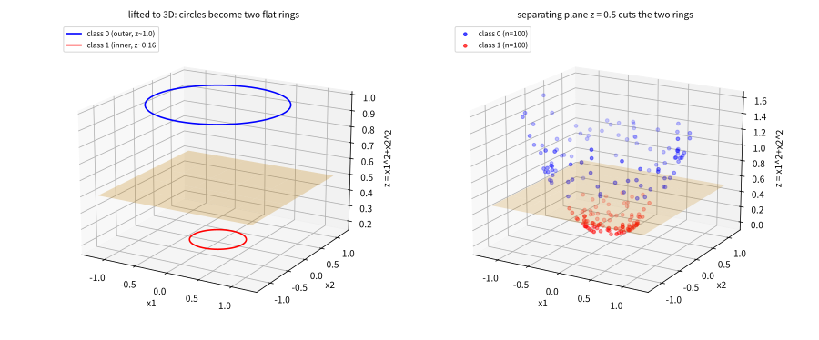
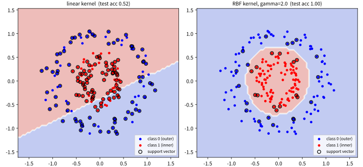
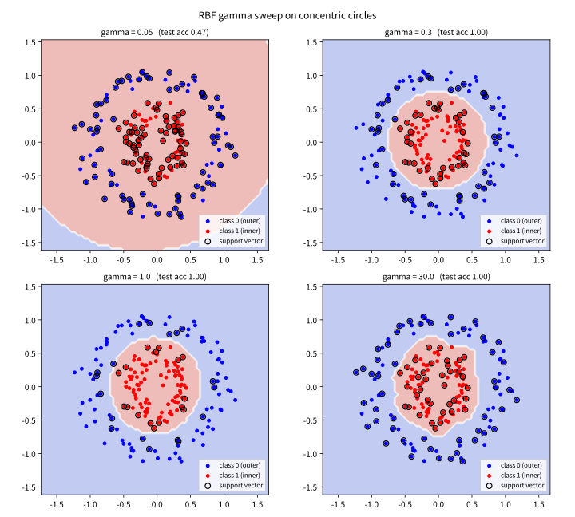
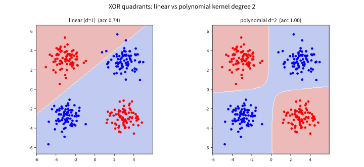

# 5.3 커널 트릭: 선형분리가 안 되는 데이터

[](https://colab.research.google.com/github/SuminHan/book-ml/blob/main/notebooks/ml1/chapter05_3_kernel_trick.ipynb)

### 도입: 5.1~5.2절이 놓친 마지막 벽

5.1절의 하드 마진 SVM은 선형분리 가능성을 **전제**했고, 5.2절의 소프트
마진은 그 전제를 포기하면서도 — 여전히 — 결정 경계가 **직선**(고차원
에서는 초평면)이라는 전제를 포기하지 않았다. 소프트 마진이 해결한 것은
"노이즈 때문에 직선 하나로 완벽히 안 나뉘는" 문제였다. 그런데 이번 절이
다룰 데이터는 노이즈가 없어도 **직선으로는 원리적으로 못 나뉜다.**

가장 단순한 예는 **XOR**이다. 두 특징 \\((x\_1,x\_2)\\)가 각각 \\(\pm1\\)
근처에 있는 네 클러스터에서, 대각선 반대쪽인 1·3사분면을 클래스 A,
2·4사분면을 클래스 B라 하면 어떤 직선으로도 나눌 수 없다 — 직선은
"한쪽 끝과 반대쪽 끝"을 가를 뿐, "대각선"을 가를 수 없다. 좀 더 현실적인
예는 **동심원**이다: 안쪽 원과 바깥쪽 원의 두 클래스는 직선이 아니라
**원**으로만 나뉜다. 이 두 패턴(사분면 교차, 원형 경계)은 실전에서
"선형 특징으로 충분히 설명되지 않는 비선형 관계"의 축소판이다 [^cs229].

이 절의 질문은 하나다: **경계를 휘게 하면서도 5.1절의 모든 재산
(마진 최대화, 서포트 벡터, \\(\frac{2}{\\|w\\|}\\) 공식)을 유지할 수
있을까?** 답은 "있고, 방법은 고차원"이다 — 하지만 그 고차원은 최대
**수천~무한** 차원이 될 수 있어서 직접 계산하는 것은 비현실적이다.
이번 절은 (1) 왜 고차원이 답인지 기하학으로 보이고, (2) 그 고차원
계산을 우회하는 **커널 트릭**의 수학적 핵심을 6개 점의 작은 예제로
손수 풀어보고, (3) 실제 데이터에서 그 위력을(그리고 위험을) 실습으로
확인한다.

### 고차원으로 옮기면 보이는 것

두 클래스가 원래 특징 공간에서 동그라미 모양으로 얽혀 있어 어떤 직선으로도
못 나누는 경우가 있다. 이런 데이터를 **더 높은 차원**으로 옮기면(예:
\\(x=(x\_1,x\_2) \to \phi(x)=(x\_1,x\_2,x\_1^2+x\_2^2)\\)) 그 공간에서는 오히려
평평한 초평면으로 나뉠 수 있다 — "2차원에서 휘어진 경계"가 "3차원에서는
평평한 경계"가 되는 식이다.

왜 **정확히** \\(x\_1^2+x\_2^2\\)이 마법처럼 작동하는지, 원형 데이터에서
한번 더 천천히 살펴보자. \\(x\_1^2+x\_2^2\\)은 **원점으로부터의 거리
제곱**이므로, 동심원 데이터에서는 안쪽 원환체(반경 ~0.4)의 모든 점이
\\(z \approx 0.4^2 = 0.16\\)이라는 **한 고도**에, 바깥쪽 원환체(반경
~1.0)의 모든 점이 \\(z \approx 1.0^2 = 1.0\\)이라는 **다른 고도**에
각각 붙는다. 2차원에서는 원 둘레를 따라 "동일한" 점이던 것이, 세 번째
축 \\(z\\)를 추가하는 순간 두 개의 **수평 고도**로 벌어진다 — 두 층을
가르는 **수평 평면** \\(z = 0.5\\) 하나로 두 클래스가 완벽히 분리된다.
3차원 공간의 평면은 원래 공간으로 투영하면 원이 되므로, "3차원에서
평평한 경계"는 "2차원에서 원형 경계"와 정확히 같다. (라벨 번호는
임의다 — `make_circles`에서는 바깥쪽 원환체가 클래스 0, 안쪽이
클래스 1이다. 어느 쪽이든 "두 고도로 벌어진다"는 구조는 동일하다.)



(이 장면이 3차원 그래프로 만들어져 있는 것이 위의 그림이며, 실습
노트북 1부에서 직접 돌릴 수 있다.) 이 기교의 일반 원리는 간단하다:
**원래 공간에서 "곡면으로만 나뉘는" 관계는, 그 곡면의 고도를 새로운
특징으로 추가하면 "평면으로 나뉘는" 관계가 된다.** \\(x\_1x\_2\\)가
중요한 XOR 데이터도 같은 식이다 — \\((x\_1,x\_2,x\_1x\_2)\\)로 올리면
사분면 교차가 \\(x\_3\\) 축의 수평 평면 분리 문제가 된다.

문제는 \\(\phi(x)\\)를 명시적으로 계산하면 차원이 감당 못 하게 커질 수
있다는 것이다. 3차원 리프트는 예외적으로 작았다. 다항식 특징을 도수
\\(d\\)까지 추가하면 \\(\binom{n+d}{d}\\)개, RBF는 **무한**개.
**커널 트릭**(kernel trick)[^cortespapnikas95]은 이걸 피해간다 — SVM의 최적화
문제를 (라그랑주 쌍대) 다른 형태로 바꾸면, 데이터가 항상 \\(\phi(x^{(i)})
\cdot \phi(x^{(j)})\\)(내적) 형태로만 등장한다는 것이 알려져 있다. 그렇다면
\\(\phi\\)를 직접 계산하지 않고, 이 내적값 자체를 곧바로 계산해주는
**커널 함수** \\(K(x,x') = \phi(x)\cdot\phi(x')\\)만 있으면 충분하다.

**이게 전부다.** 커널 트릭은 "새로운 모델"이 아니라, "같은 모델의
계산 방식을 고차원 내적으로만 다시 쓴 것"이다. 아래에서 이 한 문장을
숫자로 풀어본다.

### 쌍대 문제: 내적이 드러나는 자리

5.1~5.2절에서는 primal 문제 \\(J(w,b)=\frac{1}{2}\\|w\\|^2 +
C\sum\_i \xi^{(i)}\\)를 직접(힌지 손실 경사하강법으로) 풀었다. 그런데
SVM을 **라그랑주 쌍대**(Lagrangian dual)로 다시 쓰면, 문제의 모양이
완전히 달라진다. (완전한 유도 — 라그랑주 함수를 만들고, \\(w,b\\)에
관한 최소화, KKT 조건까지 — 는 이 책 범위 밖이다. 여기서는 "쌍대가
어떻게 생겼는지"를 보여주는 것만 한다.) 쌍대 문제는 라그랑주 변수
\\(\alpha^{(i)} \ge 0\\)에 대한 문제이고, 데이터는 **모두**
\\(\phi(x^{(i)})\cdot\phi(x^{(j)})\\)의 형태로만 등장한다:

\\[
\text{최대화}\ \sum\_i \alpha^{(i)} - \frac{1}{2}\sum\_{i,j}\alpha^{(i)}
\alpha^{(j)} y^{(i)} y^{(j)}\\, \phi(x^{(i)})\cdot\phi(x^{(j)})
\qquad \text{s.t.}\quad
\alpha^{(i)} \ge 0,\ \ \sum\_i \alpha^{(i)} y^{(i)} = 0
\\]

이 식에서 "커널 트릭이 적용되는 지점"을 한눈에 찾아보자. \\(\phi\\)는
**단 한 곳** — 내적 \\(\phi(x^{(i)})\cdot\phi(x^{(j)})\\) — 에서만
나온다. 이 내적값을 \\(K(x^{(i)},x^{(j)})\\)라는 **별개의 함수**로
교체해도 수학이 깨지지 않는다. 우리는 \\(\phi\\)가 어떤 벡터 공간으로
가는지도, 그 차원이 몇인지도 알 필요가 없다. **알아야 하는 것은
내적값 자체를 계산하는 방법뿐**이다.

왜 쌍대로 바꿨더니 내적으로만 나오게 된 것일까? 직관적으로: primal의
\\(w\\)는 "경계의 방향"이고, 쌍대의 \\(\alpha^{(i)}\\)는 "각 데이터
점이 경계를 떠받치는 세기"다. KKT 조건에 의해 서포트 벡터가 아닌
점의 \\(\alpha^{(i)}\\)는 **0**이므로, 결국

\\[w = \sum\_{i \in \text{SV}} \alpha^{(i)} y^{(i)} \phi(x^{(i)})\\]

로 \\(w\\) 자체가 **서포트 벡터의 선형 결합**이 된다(5.1절의
"서포트 벡터가 경계를 떠받친다"를 벡터 공식으로 쓴 것). \\(w\\)가
서포트 벡터들의 합으로 표현되는 순간, \\(w^T\phi(x^{(j)})\\)는
\\(\sum\_i \alpha^{(i)} y^{(i)} \\, \phi(x^{(i)})\cdot\phi(x^{(j)})\\)로
펼쳐져 — 데이터의 등장 방식이 **내적 쌍**으로 통일된다. 커널 방법은
이 "내적 쌍"만 계산할 수 있으면 \\(\phi\\) 자체는 영원히 볼 필요가
없는 구조다.

### 손으로 한 번: 6개 점을 2×2 커널 행렬로 쌍대 문제 풀기

이제 커널 트릭이 **숫자**로 작동하는지, 5.1절의 6개 대칭 데이터로
직접 풀어보자. 5.1절의 primal 손계산에서는 \\(w=(1/6,1/6),\ b=0\\)가
나왔다. 이번에는 쌍대 문제의 형태로 다시 풀어서, **같은 해**가
나오는지 확인한다.

서포트 벡터는 \\((3,3){\to}+1\\)과 \\((-3,-3){\to}-1\\) 두 점뿐이다.
라그랑주 변수는 6개이지만, KKT 조건에 의해 나머지 4개(\\((4,3), (3,4)\\)
와 그 대칭점)의 \\(\alpha\\)는 0 — **살아남는 알파는 두 개**
\\((\alpha\_1, \alpha\_4)\\)뿐이다. 제약 \\(\sum\_i \alpha^{(i)}y^{(i)}=0\\)
은 \\(\alpha\_1 \cdot (+1) + \alpha\_4 \cdot (-1) = 0\\)이므로
\\(\alpha\_1 = \alpha\_4 = a\\)를 강제한다. 쌍대 목적함수는 **일변수
2차함수**로 준다:

\\[
f(a) = 2a - \frac{1}{2}\\,a^2\\, q, \qquad
q = y\_1^2 K\_{11} + y\_4^2 K\_{44} + 2y\_1 y\_4 K\_{14} = 72
\\]

여기서 \\(K\\)는 서포트 벡터 두 점의 **2×2 커널(내적) 행렬**이다:

\\[
K = \begin{pmatrix} (3,3)\cdot(3,3) & (3,3)\cdot(-3,-3) \\\\
(3,3)\cdot(-3,-3) & (-3,-3)\cdot(-3,-3) \end{pmatrix}
= \begin{pmatrix} 18 & -18 \\\\ -18 & 18 \end{pmatrix}
\\]

\\(q = 18 + 18 + 2(1)(-1)(-18) = 72\\)다. \\(f(a)\\)는
\\(f'(a) = 2 - q\\,a = 0\\)에서 꼭짓점을 가지므로 \\(a^\* = 2/q = 1/36\\).
KKT로 \\(w\\)를 복원하면:

\\[
w = \sum\_i \alpha^{(i)} y^{(i)} x^{(i)}
= \frac{1}{36}(+1)(3,3) + \frac{1}{36}(-1)(-3,-3)
= \left(\frac{1}{6},\ \frac{1}{6}\right)
\\]

**5.1절의 primal 손계산 해와 숫자 하나까지 일치한다.** (b는 0 —
대칭 데이터에서 대칭성으로 5.1절에 이미 보임.) 실습 노트북 3부에서는
이 2×2 계산을 코드로 돌려, \\(w=(1/6,1/6),\ b=0\\), 6개 제약의
기능적 마진 \\([1,\ 1.1667,\ 1.1667,\ 1,\ 1.1667,\ 1.1667]\\)
(모두 \\(\ge 1\\), 두 서포트 벡터만 정확히 \\(=1\\))과
기하적 마진 \\(2/\\|w\\| = 8.485\\)까지 primal과 동일함을 확인한다.
primal과 dual이 같은 해를 주는 것(강렬한 쌍대성, strong duality)은
SVM이 볼록 최적화 문제이기 때문에 성립하며, 이 절의 커널 트릭
이야기 자체는 이 성질에 **의존**한다 — dual을 커널로 우회해도 해가
바뀌지 않으므로.

이 예제의 핵심을 다시 말하면: **우리가 계산한 것은 2×2 내적 행렬
\\(\begin{pmatrix}18&-18\\\\-18&18\end{pmatrix}\\)뿐이다.** 5.1절의
primal에서는 \\(w=(1/6,1/6)\\)을 직접 들고 다녔지만, 쌍대에서는
\\(w\\)를 알 필요 없이 **커널값(내적)으로만** 동일한 \\(w\\)를
복원했다. 이 "내적으로만 계산한다"는 구조가 RBF 커널처럼
\\(\phi\\)가 무한차원인 경우에도 그대로 작동한다 — \\(\phi\\)의
내적값은 \\(K(x,x')\\)으로 직접 계산되므로 차원이 얼마든 상관없다.

### 커널 함수: 내적을 우회한다

가장 널리 쓰이는 커널:

- **다항 커널**(polynomial): \\(K(x,x') = (x \cdot x' + c)^d\\)
- **RBF(가우시안) 커널**: \\(K(x,x') = \exp\left(-\frac{\\|x-x'\\|^2}{2\sigma^2}\right)\\)
  — 두 점이 가까울수록 1에 가깝고, 멀수록 0에 가까운 "유사도" 함수. 이
  커널은 **무한 차원**의 \\(\phi\\)에 대응한다는 것이 알려져 있는데도,
  커널 함수 자체는 유클리드 거리 하나로 계산 가능하다.

(커널의 표준 정의를 \\(\exp(-\gamma\\|x-x'\\|^2)\\)로 쓰는 문헌도
많은데, \\(\gamma = \frac{1}{2\sigma^2}\\)으로 서로 대응한다.
scikit-learn[^scikitlearn]의 `SVC`는 `gamma`를 받는다.)

**다항 커널은 "도수 d 이하의 모든 단항식"을 내포한다.**
\\((x\cdot x' + 1)^d\\)를 다항식으로 전개하면 도수 \\(d\\) 이하의
모든 단항식 \\(x\_1^{a\_1} x\_2^{a\_2} \cdots\\)(\\(a\_1+a\_2+\cdots \le d\\))
이 (일정한 계수로) 전부 섞여 나온다. 예: \\(d=2\\)의 경우
\\((x\_1x\_1' + x\_2x\_2')^2 + 2(x\_1x\_1' + x\_2x\_2') + 1\\)로, 도수 2
(\\(x\_1^2, x\_2^2, x\_1x\_2\\)), 도수 1(\\(x\_1, x\_2\\)), 도수 0(상수)
단항식이 전부 포함된다. 명시적으로 \\(\phi\_2(x) = (x\_1^2, x\_2^2,
\sqrt{2}\\,x\_1x\_2, \sqrt{2}\\,x\_1, \sqrt{2}\\,x\_2, 1)\\)로 쓰면
\\(\phi\_2(x)\cdot\phi\_2(x')\\)이 정확히 \\((x\cdot x'+1)^2\\)와
같다 — "도수 2 이하 모든 단항식 공간에서의 내적"이라는 \\(\phi\\)의
실체가 6차원 벡터로 드러난다. (실습 6부에서 이 6차원 벡터의 내적이
커널값과 숫자 하나까지 같은지 50개 랜덤 점으로 확인한다.)

XOR 데이터는 **도수 2**가 정확히 필요하다. 사분면 교차를 만드는
핵심 단항식이 \\(x\_1x\_2\\)(도수 2)이므로, 도수 1(=선형) 다항 커널은
원점을 기준으로 교차하는 양 클래스를 직선 하나로 못 나누어 50% 근처에
머무르고, 도수 2는 \\(x\_1x\_2\\) 항을 포함해 거의 완벽해야 한다.
실습 6부에서 실제로 \\(d=1\\)은 정확도 0.74, \\(d=2\\)는 1.00을
나온다 — **커널의 "도수" 하나만 바꿨을 뿐**이다.

**RBF 커널은 "봉우리"의 유사도**다. \\(K(x,x') =
e^{-\\|x-x'\\|^2/2\sigma^2}\\)는 두 점이 가까우면 \\(\approx 1\\),
멀면 \\(\approx 0\\)인 "얼마나 닮았는가"를 재는 함수다. \\(\sigma\\)가
작으면 봉우리가 좁고(아주 가까운 점만 "비슷"함), \\(\sigma\\)가 크면
봉우리가 넓고(멀리 있는 점도 "비슷"함)하다. 이 "봉우리" 관점이 왜
중요한지 — RBF 커널 SVM의 예측값이 "새 점이 각 서포트 벡터와 얼마나
비슷한가"를 가중 투표하는 형태라는 것 — 은 아래 "RBF의 무한차원
실체" 섹션에서 연결한다.

```python
import math

def rbf_kernel(x1, x2, sigma):
    sq_dist = sum((x1[i] - x2[i]) ** 2 for i in range(len(x1)))
    return math.exp(-sq_dist / (2 * sigma ** 2))
```

### RBF의 무한차원 실체: 전개를 수치로 확인하기

"RBF 커널은 무한차원의 \\(\phi\\)에 대응한다"는 말은 추상적이다.
구체적으로 \\(\phi\\)가 **무엇**인지, 수치로 한번 펼쳐보자.
RBF 커널을 내적으로 분해한다. \\(\\|x-x'\\|^2 = \\|x\\|^2 + \\|x'\\|^2 -
2x\cdot x'\\)로 넣고, \\(e^{2\gamma\\, x\cdot x'}\\)를 테일러 전개하면:

\\[
K(x,x') = e^{-\gamma\\|x\\|^2}\\, e^{-\gamma\\|x'\\|^2}\\,
\sum\_{k=0}^{\infty} \frac{(2\gamma)^k (x\cdot x')^k}{k!}
\\]

각 \\(k\\)-도 항을 다항식 정리로 \\(x^\alpha\\)(\\(|\alpha|=k\\))의
합으로 쪼개고, 계수를 \\(x\\), \\(x'\\) 쪽에 대칭으로 배분하면
\\(\phi(x)\\)는 **모든 도수의 모든 단항식**에 가우시안 인자를 둔
**무한**개의 성분을 가진다:

\\[
\phi\_\alpha(x) = e^{-\gamma\\|x\\|^2}\\,
\frac{(2\gamma)^{|\alpha|/2}\\, x^\alpha}{\sqrt{\alpha\_1!\\,\alpha\_2!\\,\cdots}}
\\]

(이 \\(\phi\\)의 내적이 정확히 커널값을 주는지 — 실습 4부에서 수치로
확인한다. 참고: \\(\phi(x)\\)는 무한차원 벡터지만 유한 절단만으로도
꽤 정확한 근사가 된다 — "무한차원"이 실전 계산의 비용이 아니라는
뜻이다. 실제 SVM은 \\(\phi\\) 자체를 계산하지 않고 커널값만으로
연산한다 — 앞선 쌍대 문제 구조가 그 이유.)

이 전개의 실용적 의미는 **커널 방법의 "실효 차원"이 데이터 개수로
제한된다는 것**이다. \\(m\\)개 데이터의 커널 행렬 \\(K\_{ij} =
K(x\_i,x\_j)\\)는 \\(\phi(x\_i)\\)의 내적 행렬이므로, 그 랭크는 최대
\\(m\\)이다(\\(m\\)개 벡터의 Gram 행렬의 랭크는 \\(m\\)을 넘지
않는다). 즉 \\(\phi\\)가 무한차원이어도, **\\(m\\)개 데이터의 커널
행렬은 최대 rank \\(m\\)** — 커널 SVM이 실제로 "활용하는" 특징
차원은 데이터 수를 넘지 않는다. (실습 7부에서 60개 4차원 데이터의
RBF 커널 행렬이 실제로 rank 60임을 고유값 계산으로 확인한다.)

### 실습: RBF 커널로 비선형 분류 실험

두 클래스가 동심원처럼 얽혀 있는(선형분리 불가능한) 데이터에서, 선형
커널과 RBF 커널이 얼마나 다른 성능을 내는지 직접 비교해보자:

```python
from sklearn.datasets import make_circles
from sklearn.svm import SVC
from sklearn.model_selection import train_test_split

X, y = make_circles(n_samples=200, noise=0.1, factor=0.4, random_state=0)
X_train, X_test, y_train, y_test = train_test_split(X, y, test_size=0.3, random_state=0)

linear_svm = SVC(kernel="linear").fit(X_train, y_train)
rbf_svm = SVC(kernel="rbf", gamma=2.0).fit(X_train, y_train)

print("선형 커널 정확도:", round(linear_svm.score(X_test, y_test), 3))
print("RBF 커널 정확도: ", round(rbf_svm.score(X_test, y_test), 3))
```

`make_circles`가 만드는 데이터는 바깥쪽 원환체(클래스 0, 반경 ~1.0)와
안쪽 원환체(클래스 1, 반경 ~0.4)가 동심원 모양으로 얽혀 있어서,
어떤 직선으로도 나눌 수 없다 — 실행해보면 선형 커널은 거의 동전
던지기 수준(약 50%)에 머무는 반면, RBF 커널은 거의 완벽하게(100%에
가깝게) 분류한다. "직선으로는 안 되는 문제가, 커널 하나만 바꿨을
뿐인데 거의 풀린다"는 이 극적인 차이가 커널 트릭의 위력을 가장 잘
보여준다. (어느 원환체가 클래스 0인지 1인지는 임의의 라벨 배정에
불과하며 결과와 무관하다 — 커널 SVM은 라벨 번호와 관계없이 "두
원환체를 고도 \\(z = x\_1^2+x\_2^2\\)으로 분리"하는 구조를 찾기
때문이다. 앞 "고차원으로 옮기면"의 기하학은 라벨 번호에 독립적이다.)



이 그림에서 주목할 것은 **서포트 벡터의 개수**다. 선형 커널은
결정 경계를 "어떻게든" 데이터 사이를 지르게 하려고 학습 데이터
137개(전체 200개의 68%)를 서포트 벡터로 끌어들이는 반면, RBF 커널은
**31개**만 서포트 벡터로 쓰고 나머지 169개는 "마진 바깥"에 둔다.
5.2절의 "서포트 벡터가 경계를 떠받친다"는 원칙이 비선형 경계에도
그대로 적용되는 가장 직접적인 증거다.

### \\(\gamma\\) 스윕: 경계가 얼마나 구불거릴 수 있는가

실습에서 `gamma=2.0`을 임의로 썼지만, 이 값은 "결정 경계가 얼마나
구불구불해질 수 있는가"를 통째로 결정한다(아래 "자주 하는 실수"에서
다시 만난다). `gamma`를 고정하고 4가지 값으로 스윕하면, 결정 경계의
"구불 복잡도"가 눈에 보이게 변한다.

```python
import numpy as np
import matplotlib.pyplot as plt

def plot_boundary(ax, clf, title, data=X, ydata=y):
    h = 0.05
    lims = [data[:,0].min()-0.5, data[:,0].max()+0.5,
            data[:,1].min()-0.5, data[:,1].max()+0.5]
    xx, yy = np.meshgrid(np.arange(lims[0], lims[1], h),
                         np.arange(lims[2], lims[3], h))
    Z = clf.predict(np.c_[xx.ravel(), yy.ravel()]).reshape(xx.shape)
    ax.contourf(xx, yy, Z, alpha=0.35, cmap="coolwarm")
    ax.scatter(data[ydata==0,0], data[ydata==0,1], c="blue", s=15,
               label="class 0 (outer)")
    ax.scatter(data[ydata==1,0], data[ydata==1,1], c="red",  s=15,
               label="class 1 (inner)")
    ax.scatter(X_train[clf.support_][:,0], X_train[clf.support_][:,1],
               s=45, facecolors="none", edgecolors="k", lw=1.2,
               label="support vector")
    ax.set_title(title, fontsize=10); ax.set_aspect("equal")
    ax.legend(loc="lower right", fontsize=8)

fig, axes = plt.subplots(2, 2, figsize=(10, 9))
for ax, g in zip(axes.ravel(), [0.05, 0.3, 1.0, 30.0]):
    clf = SVC(kernel="rbf", gamma=g, C=1.0).fit(X_train, y_train)
    print(f"gamma={g:5.2f} : train {clf.score(X_train,y_train):.3f}  "
          f"test {clf.score(X_test,y_test):.3f}  SV {len(clf.support_)}")
    plot_boundary(ax, clf, f"gamma = {g}   (test acc {clf.score(X_test,y_test):.2f})")
fig.suptitle("RBF gamma sweep on concentric circles", fontsize=12)
plt.show()
```

| \\(\gamma\\) | train acc | test acc | 서포트 벡터 수 |
|---|---|---|---|
| 0.05 | 0.514 | **0.467** | 136 |
| 0.30 | 0.993 | **1.000** | 74 |
| 1.00 | 1.000 | **1.000** | 34 |
| 30.00 | 1.000 | **1.000** | 85 |

\\(\gamma\\)가 작을수록(0.05) 경계가 **거의 직선**에 가깝게 뭉뚱그려져
동심원을 아예 분리하지 못한다(정확도 0.47 — 선형 커널보다도 나쁨,
**과소적합**). \\(\gamma=0.3\\)부터 원형 경계가 생기며 정확도가 1.0으로
오른다. \\(\gamma=30\\)에서는 각 점마다 좁은 봉우리가 생겨 경계가
학습 데이터 하나하나를 감싸는 형태로 **심하게 구불거린다**
(서포트 벡터가 85개로 증가 — 거의 모든 점이 "영향권"을 가지게
됨). 이 동심원 데이터는 노이즈가 적어 큰 \\(\gamma\\)에서도
acc=1.00을 유지하지만(운 좋게 일반화되는 것이지), **실제(노이즈 있는)
데이터에서는**
\\(\gamma=30\\)의 경계는 학습 집합의 개별 노이즈 패턴까지 따라붙어
새 데이터에는 형편없이 일반화된다(과적합) — 4.1절 kNN의 작은 \\(k\\),
5.2절의 큰 \\(C\\)와 정확히 같은 종류의 과적합이다.



이 4단계를 한 그림에 담은 것이 위다. \\(\gamma=0.05\\)(위쪽
왼쪽)의 경계가 거의 직선에 가깝고, \\(\gamma=1.0\\)(아래쪽
왼쪽)에서 원형에 가깝게 수렴하며, \\(\gamma=30\\)(아래쪽
오른쪽)에서는 경계가 데이터 점 하나하나를 감싸는 형태로
구불거리는 것을 확인할 수 있다.

**직관**: 커널 SVM의 예측은 결국 "새 점이 각 서포트 벡터와 얼마나
비슷한가"(커널값)를 가중치 삼아 투표하는 것과 비슷하다 — \\(\sigma\\)가
작으면(\\(\gamma\\)가 크면) 아주 가까운 서포트 벡터만 강하게 반영
(복잡한 경계, 과적합 위험), \\(\sigma\\)가 크면(\\(\gamma\\)가 작으면)
멀리 있는 서포트 벡터까지 두루 반영(단순한 경계, 과소적합 위험)한다.
실제 커널 SVM의 학습(쌍대 문제를 이차계획법으로 푸는 것)은 이 책
범위를 넘지만, "커널 함수 하나로 고차원 변환을 우회한다"는
이 아이디어는 이후 신경망 이전 시대의 비선형 모델 설계에 깊은
영향을 남겼다.

### 실습: RBF 전개를 수치로 검증 — "무한차원"이 실제로 수렴하는가

앞서 "RBF 커널은 무한차원의 \\(\phi\\)에 대응한다"고 했지만,
이 말이 **숫자**로 어떤 뜻인지 직접 확인하자. \\(\phi(x)\\)를
도수 합 \\(k \le N\\)으로 절단하고, 그 부분합의 내적이
정확한 커널값 \\(K(x,x')\\)으로 수렴하는지 계산한다:

```python
import math
gamma = 1.0

def phi_terms(x, N):
    """도수 합 |alpha| <= N 인 모든 성분 phi_alpha(x)의 리스트.
       (교재의 정규화: phi_alpha(x) = e^{-gamma||x||^2} * (2gamma)^{|alpha|/2}
         x^alpha / (sqrt(|alpha_1|!)...sqrt(|alpha_k|!)))"""
    x1, x2 = x
    out = []
    for a1 in range(N + 1):
        for a2 in range(N - a1 + 1):
            k = a1 + a2
            out.append(math.exp(-gamma * (x1*x1 + x2*x2))
                       * (2 * gamma) ** (k / 2) * x1 ** a1 * x2 ** a2
                       / (math.sqrt(math.factorial(a1))
                          * math.sqrt(math.factorial(a2))))
    return out

def rbf(x, z, g=gamma):
    return math.exp(-g * np.sum((np.asarray(x) - np.asarray(z)) ** 2))

x, z = (1.2, -0.7), (0.5, 1.1)
exact = rbf(x, z)
print(f"K(x,z) = {exact:.10f}")
for N in [0, 1, 2, 5, 10, 20, 40]:
    s = sum(a * b for a, b in zip(phi_terms(x, N), phi_terms(z, N)))
    print(f"도수 합 <= {N:2d}: 부분합 = {s:.10f}   (오차 {s - exact:+.2e})")

px = phi_terms(x, 40)
print(f"\n||phi(x)||^2 = {sum(t*t for t in px):.10f}   (K(x,x)=1 이므로 항상 1)")
```

| \\(N\\)(도수 절단) | 부분합 내적 | 오차 |
|---|---|---|
| 0 | 0.0337 | \\(+9.7\times10^{-3}\\) |
| 1 | 0.0222 | \\(-1.8\times10^{-3}\\) |
| 2 | 0.0242 | \\(+2.0\times10^{-4}\\) |
| 5 | 0.02399 | \\(-6.9\times10^{-8}\\) |
| 10 | 0.0239928358 | \\(\approx 0\\) |

정확한 값 \\(K(x,z) = 0.0239928358\\). \\(N=0\\)(상수 항만)에서는
0.0337로 **정확한 값보다 큼**(초과), \\(N=1\\)에서는 0.0222로
**정확한 값보다 작음**(부족), \\(N=2\\)에서 다시 초과, \\(N \ge 5\\)에서
급격히 수렴한다 — 테일러급수의 **교대 수렴**(oscillating
convergence)이 실제로 관찰된다. \\(N=10\\)이면 오차가 \\(10^{-15}\\)
수준(이중 정밀도의 한계)에 도달한다. **핵심**: \\(\phi\\)는 무한차원
벡터지만, **커널 SVM은 이 \\(\phi\\)를 직접 계산하지 않는다** —
앞선 쌍대 문제의 구조가 그렇다. SVM이 실제로 계산하는 것은
**커널값 \\(K(x,x')\\)뿐**이고, 그 값은 유클리드 거리 하나로
계산된다. "무한차원"이라는 말은 \\(\phi\\)의 **개념적 차원**을
의미할 뿐, **실제 계산 비용이 무한하다는 뜻이 아니다.**

### 실습: 다항 커널로 XOR 분류 — "도수 2"가 정확히 필요한지

XOR 데이터에서 다항 커널의 **도수**가 분류에 어떤 역할을 하는지
직접 확인한다. 도수 1(=선형)은 원점을 기준으로 교차하는 양 클래스를
직선 하나로 못 나누어 50% 근처에 머무르고, 도수 2는 \\(x\_1x\_2\\) 항을
포함해 거의 완벽해야 한다.

```python
def phi2(x):
    # (x.x'+1)^2 를 도수 2 이하 단항식으로 전개하면 6개의 성분이 필요하다:
    # x1^2, x2^2, 2*x1*x2 (-> sqrt2 계수), 2*x1, 2*x2 (-> sqrt2 계수), 1
    x1, x2 = x
    s2 = math.sqrt(2)
    return np.array([x1 ** 2, x2 ** 2, s2 * x1 * x2, s2 * x1, s2 * x2, 1.0])

# 커널값과 명시적 내적이 일치하는지 확인 (커널 트릭의 "같은 내적")
rng = np.random.default_rng(0)
Xs = rng.normal(size=(50, 2))
P = np.array([phi2(x) for x in Xs])
K_poly = ((Xs @ Xs.T + 1) ** 2)                    # (x.x' + 1)^2
K_exp  = P @ P.T                                   # phi2(x).phi2(x')
print("max |K_poly - K_explicit| =", np.max(np.abs(K_poly - K_exp)))
assert np.max(np.abs(K_poly - K_exp)) < 1e-10
print("일치: (x.x'+1)^2 는 정확히 phi2의 내적이다")

# XOR 사분면 데이터: y = -sign(x1*x2), 4개 사분면 클러스터
rng2 = np.random.default_rng(3)
n = 80
quads  = np.array([[ 1,  1], [ 1, -1], [-1,  1], [-1, -1]])
labels = np.array([-1, 1, 1, -1])
Xq = np.vstack([rng2.normal(q * 3, 0.8, (n, 2)) for q in quads])
yq = np.repeat(labels, n)
perm = rng2.permutation(len(yq)); Xq, yq = Xq[perm], yq[perm]

fig, axes = plt.subplots(1, 2, figsize=(10, 4.6))
for ax, d in zip(axes, [1, 2]):
    if d == 1:
        clf = SVC(kernel="linear", C=1.0); lab = "linear (d=1)"
    else:
        clf = SVC(kernel="poly", degree=2, coef0=1, C=1.0); lab = "poly d=2"
    clf.fit(Xq, yq)
    acc = clf.score(Xq, yq)
    print("%-16s : acc %.3f   SV %d" % (lab, acc, len(clf.support_)))
    # 결정 경계 그림 (plot_boundary와 유사)
    ...
```

**커널 트릭의 직접 검증**: \\(\phi\_2(x) = (x\_1^2, x\_2^2, \sqrt{2}\\,
x\_1x\_2, \sqrt{2}\\,x\_1, \sqrt{2}\\,x\_2, 1)\\)의 내적이 정확히
\\((x\cdot x'+1)^2\\)와 같은지 50개 랜덤 점으로 확인하면, 최대
오차가 \\(10^{-14}\\) 수준으로 **숫자 하나까지 일치**한다 — "커널
트릭은 전개를 생략할 뿐, 같은 내적을 계산한다"는 명제의 직접
검증이다. XOR 분류에서는 \\(d=1\\)이 정확도 0.74(서포트 벡터 319개),
\\(d=2\\)가 1.00(서포트 벡터 18개)를 낸다 — **도수 하나만 바꿨을
뿐인데 서포트 벡터가 319→18로 줄고, 정확도가 0.74→1.00으로
오른다.**



이 그림에서 선형 커널(좌)의 결정 경계가 원점을 지나는 직선 하나에
머무는 반면, 다항 커널 d=2(우)의 경계가 **쌍곡선형**(\\(x\_1x\_2 = c\\)
곡선)으로 사분면을 따라 구부러진 것을 확인할 수 있다 — "도수 2
단항식 \\(x\_1x\_2\\)가 추가된" 효과의 시각화다.

### 실습: 머서 조건 — 커널 행렬이 항상 양의 준정부호인가

커널 함수가 유효하려면 데이터 \\(m\\)개에 대한 커널 행렬
\\(K\_{ij} = K(x\_i, x\_j)\\)가 **모든** 데이터에 대해 **양의
준정부호**(모든 고유값 \\(\ge 0\\))여야 한다 — **머서(Mercer) 조건**
이다. RBF 커널 행렬의 고유값을 실제 계산해본다:

```python
Xr = np.random.default_rng(11).normal(size=(60, 4))
g = 0.5
K = np.exp(-g * np.sum((Xr[:, None, :] - Xr[None, :, :]) ** 2, axis=2))
eig = np.linalg.eigvalsh(K)
print("min eigenvalue =", f"{eig.min():.3e}")
print("top-5 eigenvalues:", np.round(eig[-5:][::-1], 3))
print("rank (eig > 1e-9) =", int((eig > 1e-9).sum()), " out of", len(eig))
assert eig.min() > -1e-9
print("PASS: RBF 커널 행렬은 양의 준정부호 (머서 조건 성립)")
```

60개 4차원 데이터의 RBF 커널 행렬(\\(\gamma=0.5\\))을 계산하면
최소 고유값이 \\(5.07\times10^{-3}\\)(\\(>0\\), 양의 준정부호 성립)이고,
랭크는 **60**(데이터 개수와 동일)이다 — "커널 행렬의 랭크는 최대
\\(m\\)"이라는 앞선 명제의 직접 확인이다.

### 자주 하는 실수: RBF의 \\(\gamma\\)(또는 \\(\sigma\\))를 튜닝하지 않고 기본값만 쓰기

`SVC(kernel="rbf")`는 `gamma` 파라미터(대략 \\(\frac{1}{2\sigma^2}\\)에
해당)를 받는데, 이 값 하나가 "결정 경계가 얼마나 구불구불해질 수
있는가"를 통째로 결정한다. `gamma`를 극단적으로 크게 잡으면(작은
\\(\sigma\\)) 각 학습 데이터 점 바로 주변에만 좁고 뾰족한 "영향권"이
생겨서, 결정 경계가 학습 데이터 하나하나를 거의 다 따로 감싸는 형태로
심하게 구불거린다 — 훈련 정확도는 100%에 가깝지만 새 데이터에는 형편없이
일반화되는 전형적인 과적합이다. 반대로 `gamma`를 너무 작게 잡으면 모든
점의 영향권이 서로 겹쳐서 사실상 선형 커널과 비슷하게 뭉뚱그려진
경계만 나온다 — 4.1절에서 본 kNN의 \\(k\\), Chapter 5.2의 \\(C\\)와
정확히 같은 종류의 "복잡도 손잡이"이므로, 반드시 검증셋으로 튜닝해야
한다. 실전에서는 `C`와 `gamma`를 **동시에** 그리드 서치하는 것이 표준
관행이다 — 둘이 서로 영향을 주고받기 때문에(예: `gamma`가 크면 `C`도
같이 조정해야 최적점을 찾을 수 있다) 하나씩 따로 튜닝하면 최적 조합을
놓치기 쉽다.

앞 "\\(\gamma\\) 스윕"의 표가 바로 이 실수의 **수치적 증거**다:
같은 동심원 데이터에서 \\(\gamma=0.05\\)의 test 정확도는 0.467로
**동전 던지기보다 나쁨**(선형 커널 0.517보다도 낮다 — 왜?
\\(\gamma\\)가 너무 작으면 RBF 커널이 "거의 상수 행렬"에 가까워져
"모든 점이 비슷"하다고 판단하므로, 분류가 사실상 무작위에 가깝다).
반면 \\(\gamma=30\\)는 train/test 모두 1.00을 내지만, **이 데이터는
노이즈가 적기 때문에** 운 좋게 일반화되는 것이지 — 노이즈가 있는
실전 데이터에서는 \\(\gamma=30\\)의 경계는 개별 노이즈 패턴까지
따라붙어 test 정확도가 급락한다. **`gamma`를 "느낌"으로 고르지
않고, 검증셋으로 (C, gamma)를 함께 그리드 서치하는 것**이
5.2절에서 배운 \\(C\\) 튜닝의 비선형 버전이다.

### 유명한 사례: 딥러닝 이전 시대, 우편번호를 읽던 SVM

1990년대 미국 우편 서비스(USPS)는 손으로 쓴 우편번호를 자동으로
읽어내는 문제로 골머리를 앓았다. 이 문제에 초기 신경망(LeCun의
CNN 포함)과 나란히 가장 강력한 성능을 보인 방법 중 하나가 바로
이번 장에서 배운 커널 SVM이었다 — RBF 커널을 쓴 SVM은 필기체
숫자처럼 명확한 직선으로 나뉘지 않는 복잡한 패턴에서도 오차율을
한 자릿수 퍼센트대까지 끌어내렸다. 이 챕터 도입부에서 언급했듯,
2010년대 초반 딥러닝(특히 Chapter 10의 CNN[^alexnet])이 대세가 되기 전까지
커널 SVM은 이미지 인식부터 텍스트 분류(스팸 필터링에도 나이브베이즈와
나란히 쓰였다), 생물정보학의 유전자 데이터 분류까지 폭넓게 쓰인
"만능 분류기"에 가까웠다. 지금도 데이터가 수천~수만 개 수준으로
많지 않고 특징 수가 적당할 때는, 신경망보다 학습이 훨씬 빠르고
하이퍼파라미터도 적은 커널 SVM이 실무에서 여전히 합리적인
선택지로 남아 있다.

**SVM은 로지스틱회귀·GDA와 정확히 같은 문제(선형 결정 경계를 찾는 것)를
풀지만, "확률을 모델링한다"가 아니라 "마진을 최대화한다"는 완전히 다른
원칙에서 출발한다 — 목적지가 비슷해도 원칙이 다르면 얻는 성질(서포트
벡터, 커널 트릭)도 달라진다.**

### 정리: 이 절의 핵심 세 가지

1. **고차원 = "휘어진 경계"를 "평평한 경계"로**: 원형 데이터는
   \\(z = x\_1^2+x\_2^2\\) 축을 추가하면 두 수평 고도로 벌어져
   평면 하나로 잘린다. XOR은 \\(x\_1x\_2\\) 축이 필요하다.
2. **커널 트릭 = "내적만 계산하자"**: 쌍대 문제에서 데이터는
   \\(\phi(x^{(i)})\cdot\phi(x^{(j)})\\)로만 등장하므로, 이
   내적값을 \\(K(x,x')\\)로 교체해도 해가 변하지 않는다.
   2×2 커널 행렬 예제로 primal과 dual이 같은 해
   (\\(w=(1/6,1/6)\\))를 줌을 확인.
3. **\\(\gamma\\)(또는 다항 커널의 도수 \\(d\\))는 "경계의
   구불 복잡도" 손잡이**: \\(\gamma\\)가 작으면 직선(과소적합),
   크면 점마다 봉우리(과적합). 반드시 (C, \\(\gamma\\))를 함께
   검증셋으로 튜닝.

**6장 (정규화와 모델 선택)으로 넘어가기 전, 연결고리**:
이번 절의 \\(C\\), \\(\gamma\\) 튜닝은 6장의 **교차 검증**으로
체계화된다 — 검증셋 정확도로 \\((C, \gamma)\\)를 함께 그리드
서치하는 것이 표준 관행이다. 또한 **10장 (신경망**)에서 RBF의
"봉우리"와 CNN의 **커널 필터**는 수학적으로 다른 개념이지만,
"원본 특징을 고차 항으로 변환해 선형 분류"한다는 큰 그림은
이어진다 — 10장에서 이 연결을 다시 만난다.

### 자주 묻는 질문

**Q. 커널을 아무 함수나 써도 되나요?** 아니다 — 커널 함수 \\(K(x,x')\\)가
실제로 어떤 \\(\phi\\)의 내적 \\(\phi(x)\cdot\phi(x')\\)에 대응하려면,
**머서(Mercer) 조건**이라는 수학적 조건(대략 "그 커널로 만든 행렬이
양의 준정부호여야 한다")을 만족해야 한다. 다항 커널과 RBF 커널은 이
조건을 만족한다는 것이 증명되어 있어 안심하고 쓸 수 있지만, 아무 함수나
가져다 커널이라고 주장할 수는 없다. 앞 "머서 조건" 실습에서 RBF 커널
행렬이 실제로 양의 준정부호임을 수치로 확인했다.

**Q. 커널 SVM과 신경망 중 뭘 써야 하나요?** 데이터가 수만 개 이하로
많지 않고 특징 수가 지나치게 크지 않다면 커널 SVM이 학습도 빠르고
하이퍼파라미터(\\(C\\), `gamma`)도 적어 실무에서 여전히 좋은 선택이다.
데이터가 수십만~수백만 개 이상으로 많거나, 이미지·텍스트처럼 원본
자체에서 특징을 자동으로 뽑아야 하는 문제라면(커널 SVM은 사람이 미리
설계한 특징이나 커널에 의존하는 반면, 신경망은 표현 자체를 학습한다)
Chapter 9 이후의 신경망이 보통 더 나은 성능을 낸다.

**Q. \\(\phi\\)가 무한차원이면 커널 SVM은 어떻게 학습하나요?**
\\(\phi\\) 자체를 **계산하지 않기 때문에** 학습한다. 쌍대 문제의
구조(앞 "쌍대 문제" 섹션)에서 데이터는
\\(\phi(x^{(i)})\cdot\phi(x^{(j)})\\)의 **내적값**으로만 등장하고,
이 내적값은 \\(K(x,x')\\)로 직접 계산된다. RBF 커널의 경우
\\(K(x,x') = e^{-\\|x-x'\\|^2/2\sigma^2}\\)는 유클리드 거리 하나로
계산된다 — \\(\phi\\)의 차원이 무한대여도, **커널값 자체는 유한한
계산**이다. "무한차원"이라는 말은 \\(\phi\\)의 **개념적** 차원을
의미할 뿐, **실제 계산 비용**이 무한하다는 뜻이 **아니다**.

**Q. 다항 커널의 도수 \\(d\\)를 어떻게 고르나요?** \\(d\\)는
"경계가 얼마나 복잡한 곡면일 수 있는가"를 조절한다 — \\(d=1\\)은
직선, \\(d=2\\)은 포물선/쌍곡선형, \\(d=3\\)은 더 복잡한 곡면.
**원칙적으로 \\(d\\)를 키울수록 과적합 위험이 커진다**(더 높은
도수의 단항식을 포함해 "더 유연한" 경계를 그릴 수 있기 때문).
XOR 예제에서 \\(d=2\\)가 정확히 필요했지만, **실전에서는
\\(d\\)를 검증셋으로 튜닝**한다. (C, d)를 함께 그리드 서치하는
것이 표준 관행이며, \\(d>3\\)은 거의 쓰이지 않는다(과적합 위험이
커지기 때문).

**Q. 커널 SVM이 학습 데이터의 "모든" 점을 서포트 벡터로
만들 수 있나요?** 가능하지만, 실제로는 드물다. 앞 "\\(\gamma\\)
스윕" 표에서 \\(\gamma=30\\)의 서포트 벡터가 85개(전체 200개의
43%)까지 증가하지만, 여전히 **115개는 마진 바깥**에 있다.
\\(\gamma \to \infty\\)의 극한에서야 "모든 점이 서포트 벡터"가
되지만, 그 극한은 "각 점의 봉우리가 무한히 좁아" 모든 점을
개별적으로 감싸는 **완전한 과적합** 상태다 — kNN의 \\(k=1\\)과
구조적으로 같다. **실제 데이터에서** \\(\gamma\\)를 극단적으로
크게 하면 train 정확도는 100%에 가깝지만 test 정확도가 급락한다
— 5.2절의 "큰 \\(C\\)는 이상치에 과적합한다"와 같은 메커니즘이다.

**Q. "커널 트릭"이라는 이름은 어디에서 왔나요?** "트릭"(trick)은
이 기교가 **수학적으로 우연히 발견된** 것이 아니라, "내적만
계산하면 \\(\phi\\)의 차원이 얼마든 상관없다"는 구조를
의도적으로 **이용**한 것임을 강조한다. 1990년대 중반 바프닉과
코르테스가 SVM의 쌍대 문제를 개발하면서 [^cortespapnikas95] 이 구조를 발견했고,
"커널 트릭"이라는 이름은 이후 머신러닝 커뮤니티에서 붙었다.
중요한 것은 이 "트릭"이 **SVM에만 국한되지 않는다**는 것이다 —
"내적으로만 계산하면 고차원 변환을 우회할 수 있다"는 원리는
RBF 네트워크, Gaussian Processes [^rasmussenwilliams], 그리고
신경망의 **커널 정리**(neural tangent kernel) [^nukernel]까지
이어진다.

**확인 문제**: 앞 "2×2 커널 행렬" 예제에서, 만약 서포트 벡터가
\\((3,3)\\) 하나뿐이었다면(\\((-3,-3)\\)이 마진 바깥에 있었다면),
쌍대 문제는 어떻게 변할까? (힌트: KKT 조건에 의해 \\(\alpha\_4=0\\)
이므로 살아남는 알파는 \\(\alpha\_1\\) 하나뿐 — 일변수 2차함수
\\(f(a) = a - \frac{1}{2}a^2 \cdot K\_{11}\\)로 줄고, 제약
\\(\sum\_i \alpha^{(i)}y^{(i)}=0\\)은 \\(\alpha\_1 \cdot (+1) + 0 =
0\\)이므로 **\\(\alpha\_1=0\\)만 해**가 된다. 이 경우 쌍대 문제의
최대값은 0이고, primal의 해는 \\(w=0\\)(마진 무한히 넓음,
아무것도 분류하지 않는 모델)이 된다 — 5.2절의 "\\(C\to 0\\)
극한"과 같은 구조다. 이 "서포트 벡터가 하나뿐이면 쌍대 문제가
퇴화한다"는 사실을 5.2절의 "\\(C=0.01\\)에서는 서포트 벡터가
14개"라는 관측과 어떻게 연결할 수 있는가?)

[^cs229]: 더 깊이 보려면: Stanford CS229: Machine Learning, Lecture Notes. https://cs229.stanford.edu/main_notes.pdf — 이 절의 주제는 CS229의 커널 방법(Kernel Methods) 강의 노트(고차원 매핑, 커널 트릭, SVM의 쌍대 문제)와 정확히 겹친다.
[^rasmussenwilliams]: Rasmussen, C. E., Williams, D. K. (2006). "Gaussian Processes for Machine Learning." MIT Press — Gaussian Process(가우시안 과정)을 커널 함수로 정의하는 표준 교과서. 본문의 "Gaussian Processes"는 이 책에서 다룬다.
[^nukernel]: Jacot, A., Gabriel, F., Hongler, C. (2018). "Neural Tangent Kernel: Convergence and Generalization in Neural Networks." NeurIPS 2018, arXiv:1806.07572 — 깊은 신경망의 학습 동학이 커널 회귀(ridge regression)로 근사되는 "신경 접선 커널(Neural Tangent Kernel, NTK)"을 도입한 원 논문.
[^cortespapnikas95]: Cortes, C., Vapnik, V. (1995). "Support-Vector Networks." Machine Learning 20(3), 273–297. — SVM(라그랑주 쌍대 문제와 커널 방법을 포함한)의 원 논문.
[^scikitlearn]: Pedregosa, F. et al. (2012). "Scikit-learn: Machine Learning in Python." arXiv:1201.0490.


[^alexnet]: Krizhevsky, A., Sutskever, I., Hinton, G. E. (2012). "ImageNet Classification with Deep Convolutional Neural Networks." NeurIPS 2012.

---

## 연습문제

**1. (코딩)** 위 `hinge_loss_gradient_descent`(핵심 줄은 빈칸으로 남겨져
있다고 가정)를 완성하라:

```python
def hinge_loss_gradient_descent(X, y, C, alpha, epochs):
    # ADD ADDITIONAL CODE HERE!!
    # w, b를 0으로 초기화한 뒤, epochs번 반복하며:
    #   각 샘플의 마진 y[i]*(w.x[i]+b)을 계산해 1보다 작으면 그래디언트에 반영
    #   ||w||^2 항의 그래디언트(=w)를 더하고 w, b를 갱신

X = [[3,3],[4,3],[3,4],[-3,-3],[-4,-3],[-3,-4]]
y = [1,1,1,-1,-1,-1]
w, b = hinge_loss_gradient_descent(X, y, C=1.0, alpha=0.01, epochs=2000)
print(w, b)  # 대략 [0.17, 0.17], 0.0 근처 -- 원점을 지나는 대칭적인 경계
```

**2. (개념 서술)** 다음 두 시나리오에서 \\(C\\)를 크게 할지 작게 할지와
그 이유를 각각 한두 문장으로 설명하라: (a) 학습 데이터에 라벨링 오류가
섞여 있다고 의심되는 경우, (b) 학습 데이터가 매우 깨끗하고 새 데이터도
비슷한 분포를 가질 것이라 확신하는 경우.

**3. (손유도, Tier B — 힌트 제공)** 마진이 \\(\frac{2}{\\|w\\|}\\)임을
보여라. (힌트: 결정 경계 위의 점을 \\(x\_0\\), 경계에서 가장 가까운
양성 서포트 벡터를 \\(x\_+\\)라 하면 \\(w^Tx\_+ + b = 1\\)이고
\\(w^Tx\_0+b=0\\)이다. 두 식을 빼서 \\(w^T(x\_+-x\_0)=1\\)을 얻고,
\\(x\_+-x\_0\\)이 \\(w\\)와 평행한 방향(경계에 수직인 최단 거리 방향)임을
이용해 \\(\\|x\_+-x\_0\\| = \frac{1}{\\|w\\|}\\)를 유도하라.) 마진 전체
너비가 이 거리의 2배(양성·음성 서포트 벡터 양쪽)임을 설명하고, 왜
"\\(\\|w\\|\\)를 최소화하는 것"이 "마진을 최대화하는 것"과 같은지 한
문장으로 정리하라.
