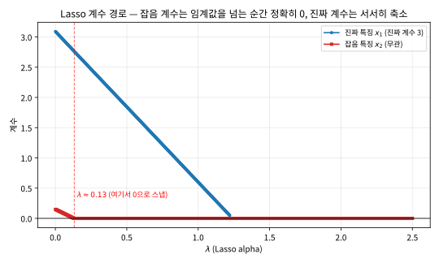
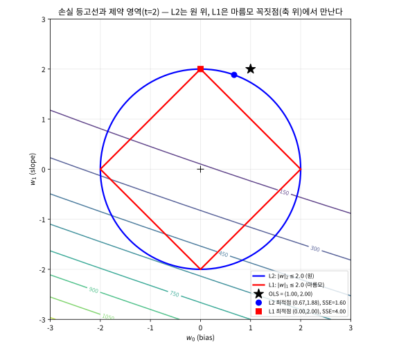
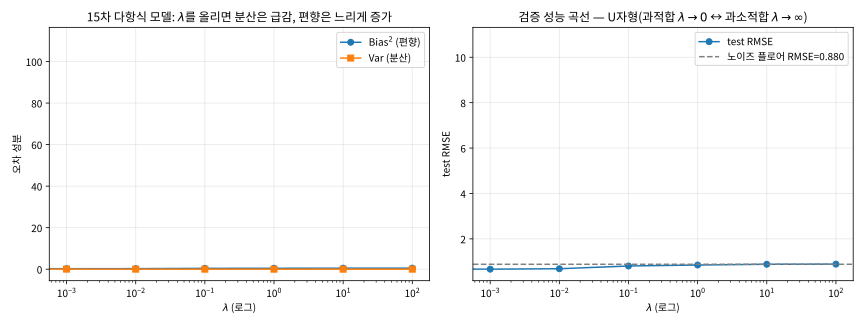

# 6.1 정규화: 편향-분산 복습과 L1/L2 페널티

[](https://colab.research.google.com/github/SuminHan/book-ml/blob/main/notebooks/ml1/chapter06_1_regularization.ipynb)

### 손실함수에 페널티를 더한다

Chapter 4.1에서 봤듯, 모델이 너무 유연하면(파라미터가 크고 자유로우면)
분산이 커져 과적합한다. **정규화**(regularization)는 손실함수에 "가중치가
너무 커지지 않도록" 페널티 항을 더해서, 모델의 유효 유연성을 인위적으로
낮추는 기법이다:

\\[J(w) = \underbrace{\frac{1}{2m}\sum\_{i=1}^m (h\_w(x^{(i)})-y^{(i)})^2}\\_{\text{원래 손실(적합도)}} +
\underbrace{\lambda R(w)}\_{\text{정규화 항(단순함을 요구)}}\\]

\\(\lambda\\)(정규화 강도)가 0이면 원래 손실함수와 같고(정규화 없음),
\\(\lambda\\)가 커질수록 "데이터에 딱 맞추기"보다 "가중치를 작게 유지하기"를
더 중요하게 여긴다 — Chapter 4.1의 언어로는, \\(\lambda\\)를 올릴수록
분산은 줄고 편향은 늘어난다.

이 절에서 다룰 순서는 이렇다: (1) "가중치가 작다 = 모델이 단순하다"는
말이 왜 성립하는지, (2) L2와 L1이 **구체적으로** 각각 무슨 일을 하는지,
(3) L1이 "정확히 0"을 만들어내는 대수적·기하학적 이유, (4) \\(\lambda\\)가
4.1절의 편향-분산 분해 위에서 모델을 움직이는 "손잡이"인지 숫자로 확인.

**왜 "가중치가 작다"가 "모델이 단순하다"인가?** 선형회귀에서 입력들을
평균 0·표준편차 1로 표준화해 놓고 생각하면, 특징 \\(x\_j\\)가 \\(\Delta\\)
만큼 변할 때 예측치는 \\(|w\_j|\\,\Delta\\) 이상으로 변할 수 있다 — 즉
\\(|w\_j|\\)는 "특징 \\(x\_j\\)가 출력을 흔들어놓을 수 있는 강도"다. 모든
\\(|w\_j|\\)가 작으면 입력이 아무리 요동쳐도 출력은 거의 못 흔들린다.
Chapter 4.1에서 "노이즈 한 점에 예측이 크게 출렁이는 모델"을 분산이 큰
모델이라 불렀는데, 가중치가 작은 모델은 정 반대 성질(흔들림이 억눌림)을
가지므로 분산이 작다 — "가중치 축소(shrinkage) = 유효 복잡도 감소"가
정규화의 핵심 메커니즘이다. 이 관점 때문에 가중치 크기 페널티는
deep learning에서 **weight decay**(가중치 감쇠)라는 이름으로 그대로
사용된다. (주의: 이 연결은 특징 스케일이 같을 때 성립한다. 특징들의
스케일이 다르면 "작은 가중치"의 기준 자체가 달라지므로, Ridge/Lasso 전에
**스케일링을 먼저** 하는 것이 실전 표준이다.)

역사적 고찰: Ridge는 이름보다 이력이 오래됐다. 1970년에 두 편의 논문이
거의 동시에 나왔다 — 마쿼트(Marquardt)는 이미 1962년부터
불량(ill-conditioned) 최소제곱 문제에 같은 기법을 써왔고, 통계학자
호엘·케나드(Hoerl & Kennard)는 \\(\lambda I\\)를 더한 행렬이 손실면 위에
"등정(ridge) 모양"의 돌출을 만들었다는 뜻에서 **ridge 회귀**라 불렀다.
Lasso는 그 26년 뒤, 1996년 티브시라니(Tibshirani)[^tibshirani1996]가 제안한
것이다 — 장
도입부의 일화와 같은 논문이다. 핵심 발견은 "페널티의 *모양*만
바꿨는데(\\(\sum w\_j^2\\) → \\(\sum|w\_j|\\)) 정확히 0이 *자동으로*
나온다"는 것이었고, 이 절의 주된 소재다.

### L2(Ridge)와 L1(Lasso): 페널티의 모양이 다르면 결과도 다르다

가장 흔한 두 페널티는 다음과 같다:

- **L2 정규화(Ridge)**: \\(R(w) = \\|w\\|\_2^2 = \sum\_j w\_j^2\\)
- **L1 정규화(Lasso)**: \\(R(w) = \\|w\\|\_1 = \sum\_j |w\_j|\\)

둘 다 "가중치를 작게 만든다"는 목표는 같지만, **모양이 다르면 결과도
다르다**. L2는 모든 가중치를 매끄럽게 0 쪽으로 축소시키지만(shrinkage),
좀처럼 정확히 0이 되지는 않는다. L1은 반대로 중요하지 않은 가중치를
**정확히 0**으로 만들어버리는 경향이 있다 — 그래서 Lasso는 정규화와
동시에 **특징 선택**(feature selection)을 자동으로 해내는 셈이다.

**L1은 왜 0으로 "뭉개지는"가: soft-thresholding.** L2의 페널티 미분은
\\(\lambda w\_j\\) — 현재 가중치에 비례하므로, 가중치가 0이 *아니면*
미분은 0이 아니다. "끌어당기는 힘"이 가중치를 0에 가깝게만 만들어줄 뿐,
0에서 *붙잡아 두는* 힘은 없다. L1의 \\(|w\_j|\\)는 0에서 뾰족하여
미분불가능하다. 0에서의 **서브그래디언트**(아래 확인 문제 3번에서
정의)는 구간 \\([-1, 1]\\)이며, "0이 최적점"일 필요조건은

\\[\left|\text{원래 손실의 기울기}(w\_j{=}0\ \text{에서})\right| \le \lambda\\]

로 정리된다 — 원래 손실이 \\(w\_j\\)를 0에서 밖으로 *당기려는 힘*이
페널티 강도 \\(\lambda\\)보다 약하면, \\(w\_j\\)는 **0에 박혀
나오지 않는다**. 이 조건에서 최적해가 다음과 같이 정리된다:

\\[w\_j \leftarrow \mathcal{T}\_\lambda(z\_j) =
\text{sign}(z\_j)\\,\max(|z\_j|-\lambda,\ 0)\\]

여기서 \\(z\_j\\)는 "페널티가 없는 세계에서 \\(w\_j\\)에 걸린 당기힘"
(나머지 가중치를 고정하고 \\(w\_j\\)만으로 최적 적합했을 때의 값)다.
행동을 세 줄로: \\(|z|\le\lambda\\) → **0**(0으로 스냅), \\(z>\lambda\\)
→ \\(z-\lambda\\)(\\(\lambda\\)만큼 축소), \\(z<-\lambda\\) →
\\(z+\lambda\\). "신호가 약하면 0으로 스냅하고, 강하면 초과분만
통과시킨다"는 이 함수를 **soft-thresholding**(부드러운 임계값 처리)이라
부른다. 이는 아래 기하학적 직관(마름모의 꼭짓점에서 만난다)의
*대수적 모습*이며, \\(|w|\\)가 미분불가능해 구배하강을 그대로 쓸 수
없는 Lasso를 **좌표하강**(coordinate descent — 한 번에 \\(w\_j\\) 하나만
이 공식으로 갱신, 나머지는 고정)으로 푸는 이유가 바로 이것이다.
scikit-learn[^scikit-learn]의 `Lasso`가 내부적으로 하는 일이 이 공식의 반복이다
(실습 노트북 §4에서 이 좌표하강을 손으로 구현해 `Lasso`와 동일한 해가
나오는지 대조한다).

**실습: 계수 경로(coefficient path) — 0은 점진적인 것이 아니라 도착지.**
"Lasso는 중요하지 않은 계수를 정확히 0으로 만든다"를 *경로 전체*로
보려면, 작은 데이터 하나에서 \\(\lambda\\)를 0에서 서서히 키우며 계수를
기록하면 된다. 실습 노트북 §3에서 만든 데이터: 30개 점에서
\\(x\_1\sim U(-1,1)\\), \\(y = 3x\_1 + \text{잡음}(\sigma{=}1)\\),
\\(x\_2\sim N(0,1)\\)(\\(y\\)와 무관한 순수 잡음 특징). \\(\lambda=0\\)
(OLS)에서의 계수는 \\(x\_1\approx3.09\\), \\(x\_2\approx0.15\\)다.
\\(\lambda\\)를 \\(0\to2.5\\)로 훑으면:

- **진짜 특징** \\(x\_1\\): 3.09에서 *점점* 줄어, 잡음 계수의 스냅
  (\\(\approx0.13\\))보다 훨씬 늦은 \\(\lambda\approx1.2\\)에 이르러서야
  정확히 0.
- **잡음 특징** \\(x\_2\\): 0.15에서 시작해 \\(\lambda\approx0.13\\)를
  넘는 순간 **정확히 0**이 되며, 그 뒤엔 다시 한 번도 0에서 벗어나지
  않는다.



그림의 "스냅"이 핵심이다: Lasso 해에서 계수가 0이면, 이는 "매우 작은
숫자"가 아니라 **모델 식에서 그 특징의 기여가 문자 그대로 0**이라는 뜻 —
모델에서 그 특징을 *삭제해도* 예측이 한 치도 달라지지 않는다. 특징이
수천 개인 실전 데이터에서, 수백 개의 계수가 이렇게 *정확히* 0이면
모델은 자동으로 축소된 특징 목록으로 단순해진다. "특징 선택을
자동으로 해낸다"는 말의 실제 모습이 이것이다.

**기하학적 직관**: 제약 \\(R(w) \le t\\) 아래에서 원래 손실을 최소화하는
문제로 다시 쓰면, L2의 제약 영역은 원(구)이고 L1의 제약 영역은 마름모(각
축 위에 뾰족한 꼭짓점이 있는 다면체)다. 손실함수의 등고선이 이 영역과
만나는 최적점을 찾을 때, 마름모는 꼭짓점(즉 어떤 좌표가 정확히 0인 지점)에서
만날 확률이 원보다 훨씬 높다 — 이게 L1이 정확히 0을 만들어내고 L2는 그렇지
않은 기하학적 이유다.

이 직관에 숫자를 넣어보자. 데이터 \\(X=[1,2,3,4]\\), \\(y=[3,5,7,9]\\)
(완벽한 직선 \\(y=2x+1\\), 즉 OLS 해는 정확히 \\((w\_0,w\_1)=(1,2)\\))에서
제약 \\(t=2\\)를 두면, 원(반지름 2)과 마름모(꼭짓점
\\((\pm2,0),(0,\pm2)\\)) 모두 OLS 해보다 안쪽이라 등고선이 제약 경계와
만나야 한다. 실습 노트북 §5에서 각각의 경계 위에서 최적점을 계산하면:

- **L2(원)**: 최적점 \\((0.67,\ 1.88)\\) — 두 좌표가 *둘 다* 0이 아닌
  점에서 만나고, SSE \\(\approx1.60\\).
- **L1(마름모)**: 최적점 \\((0,\ 2.0)\\) — \\(w\_0\\) 축 위의
  **꼭짓점에서** 만나고(= bias가 정확히 0, 기울기 2는 그대로), SSE
  \\(\approx4.00\\).

"같은 \\(t\\)에서 L1의 SSE가 더 크다"는 점은 주의하라 — 우리는
*제약 크기 \\(t\\)를 고정*하고 비교한 것이다. 실제 사용에서는 \\(\lambda\\)
가 고정되고 각 방법이 *자기의* 최적점을 스스로 찾는다(6.2절에서
\\(\lambda\\)를 데이터가 고르게 할 텐데, 그때 L1·L2는 *다른* 최적점을
가리킨다). 여기서 포인트는 SSE의 크기가 아니라 **L1의 최적점이
"어떤 좌표가 정확히 0"인 꼭짓점에 닿을 가능성이 원보다 극단적으로
높다**는 것이다. 이 2차원 그림에서 마름모의 꼭짓점은 4개에 불과하지만,
특징이 \\(p\\)개인 실제 문제에서는 마름모는 \\(p\\)차원 정다면체로
변하고 꼭짓점(=어떤 좌표가 0인 점)이 *방대하게* 많아진다 — 특징이 많을
수록 "등고선이 꼭짓점에서 만난다"는 확률은 더 커지므로, Lasso의
희소(sparse)한 해는 차원이 클수록 더 흔해진다.



```python
def ridge_gradient_descent(X, y, lam, alpha, epochs):
    m, n = len(X), len(X[0])
    w = [0.0] * (n + 1)  # w[0] = bias
    for _ in range(epochs):
        grad = [0.0] * (n + 1)
        for i in range(m):
            pred = w[0] + sum(w[j+1] * X[i][j] for j in range(n))
            error = pred - y[i]
            grad[0] += error
            for j in range(n):
                grad[j+1] += error * X[i][j]
        for j in range(n + 1):
            reg = lam * w[j] if j > 0 else 0  # bias(w[0])는 관례적으로 정규화에서 제외
            w[j] -= alpha * (grad[j] / m + reg)
    return w
```

`lam`(\\(\lambda\\))을 0에서 점점 키우면 학습된 가중치가 점점 0에 가까워지는
것을 직접 확인할 수 있다 — 같은 데이터에 \\(\lambda=0, 0.5, 5.0\\)을 넣으면
기울기 \\(w\_1\\)이 대략 \\(2.0 \to 1.4 \to 0.4\\)로 줄어든다.

### 손으로 한 번: Ridge 정규방정식으로 \\(\lambda\\)의 효과 직접 확인하기

Chapter 2.2에서 유도한 정규방정식은 정규화 항이 있어도 비슷한 닫힌 형태로
확장된다: \\(w^\* = (X^TX+\lambda D)^{-1}X^Ty\\)(\\(D\\)는 bias를 제외한
대각행렬, 연습문제 3번 참고). Chapter 2.2와 같은 데이터
\\(X=[1,2,3]\\), \\(y=[3,5,7]\\)(정규화 없는 해는 \\(w^\*=[1,2]\\))에
\\(\lambda=2\\)를 적용해보자. \\(D=\begin{bmatrix}0&0\\\\0&1\end{bmatrix}\\)
(bias는 정규화하지 않으므로 대각의 첫 원소가 0)이라 하면:

\\[X^TX+\lambda D = \begin{bmatrix}3&6\\\\6&14\end{bmatrix} +
\begin{bmatrix}0&0\\\\0&2\end{bmatrix} = \begin{bmatrix}3&6\\\\6&16\end{bmatrix}\\]

행렬식은 \\(3\times16-6\times6=12\\)이고, Chapter 2.2와 같은 방식으로
역행렬을 구해 \\(X^Ty=[15,34]\\)에 곱하면 \\(w^\*=[3,\ 1]\\)이 나온다
(스크래치패드에서 검증). \\(\lambda=0\\)일 때 \\(w^\*=[1,2]\\)였던 것과
비교하면, 기울기 \\(w\_1\\)은 \\(2\\)에서 \\(1\\)로 줄어들어 "가중치를
작게" 만들려는 정규화 항의 효과가 그대로 드러나고, bias \\(w\_0\\)은
오히려 \\(1\\)에서 \\(3\\)으로 **커졌다** — 기울기가 눌린 만큼, 절편이
데이터에 최대한 맞추려고 그 손실을 보상한 것이다. \\(\lambda=10\\)으로
더 키우면 \\(w^\*\approx[4.33,\ 0.33]\\)으로 기울기가 더욱 0에 가까워진다.

### 자주 하는 실수: bias(절편)까지 정규화해버리기

위 코드가 `reg = lam * w[j] if j > 0 else 0`로 굳이 `j==0`(bias)을
건너뛰는 이유를 직접 숫자로 확인해보자. 만약 실수로 bias까지 정규화에
포함시킨다면(\\(D\\)를 단위행렬 \\(I\\)로 잘못 쓰면), 같은 \\(\lambda=2\\)에서:

\\[w^\*\_{\text{wrong}} = (X^TX+2I)^{-1}X^Ty \approx [0.818,\ 1.818]\\]

bias가 원래(\\(\lambda=0\\)일 때) \\(1\\)이었는데 \\(0.818\\)로
불필요하게 끌려 내려간다 — 올바르게 계산한 \\(w\_0=3\\)과 전혀 다른
값이다. bias는 "이 모델이 얼마나 복잡한가"와 무관하게 데이터 전체의
평균적인 높이(원점을 지나야 할 이유가 없는 절편)를 나타낼 뿐이므로,
정규화가 억누르려는 "불필요한 복잡함"의 대상이 아니다 — 정규화 항에
bias를 포함시키면, 모델이 데이터에서 아무 이유 없이 원점 쪽으로
끌려가는 왜곡이 생긴다. scikit-learn의 `Ridge`, `Lasso` 등은 기본적으로
이 관례를 자동으로 지켜준다(bias/intercept는 정규화 대상에서 제외).

\\(\lambda\\)가 크면 이 왜곡은 더 극단적으로 드러난다. 같은 데이터에서
올바른 \\(D=\mathrm{diag}(0,1)\\)와 틀린 \\(D=I\\)를 나란히 두면:

| \\(\lambda\\) | 올바른 \\(D=\mathrm{diag}(0,1)\\) | 틀린 \\(D=I\\)(bias도 정규화) |
|---|---|---|
| 2 | \\([3.00,\ 1.00]\\) | \\([0.82,\ 1.82]\\) |
| 10 | \\([4.33,\ 0.33]\\) | \\([0.57,\ 1.28]\\) |

\\(\lambda\\)를 올리면 bias의 *올바른* 행동을 잊기 쉽다: 기울기가
눌리면 bias가 그 손실을 *보상하며 더 커져야* 한다(3.00 → 4.33).
그런데 bias까지 정규화하면 bias는 \\(\lambda\\)가 커질수록 0 쪽으로
*반대 방향*으로 끌려간다(0.82 → 0.57). 정규화가 "복잡함"을
억누르는 도구인데, bias는 복잡함이 아님에도 함께 억누르는 셈이 된다 —
특히 \\(y\\)의 평균이 원점에서 먼 데이터(예: 주택 가격)에서는
모델이 체계적으로 *아래*로 치우치는 결과를 낳는다.

### 유명한 사례: Lasso는 유전체학 문제에서 태어났다

Lasso가 제안된 1996년 티브시라니의 논문에서 이 방법을 검증한 데이터가
바로 **유전자 발현(genomics) 데이터**였다 — 수백 개의 후보 유전자
중에서 실제 발현에 관여하는 소수를 "수동으로" 고르는 것은 불가능에
가깝고, 특징 수(수백)가 샘플 수에 버금가는 문제에서, Lasso가 몇 개의
유전자만을 정확히 0이 아닌 계수로 남긴 것을 보였다. 이 "특징이 많고
진짜 신호는 소수"라는 문제 구조는 30년 뒤에도 그대로다 — 전장 유전체
연관 분석(수백만 SNP에서 원인 변이 찾기), 희소 신호 추정, 텍스트
데이터(수십만 단어 중 일부만 관련) 등에서 Lasso 계열이 1차 후보로
쓰이는 이유가 바로 이 절의 "soft-thresholding이 약한 계수를 0으로
스냅한다"는 성질 그 자체다.

### 실습: L1과 L2의 "정확히 0" 차이를 직접 확인하기

기하학적 직관(L1은 꼭짓점에서, L2는 매끄러운 원 위에서 최적점을 만난다)이
실제로 어떤 차이를 만드는지 코드로 확인해보자. 특징이 2개인 데이터에서
\\(x\_2\\)는 \\(y\\)와 사실 아무 관계가 없는 순수한 잡음이라고 하자:

```python
import numpy as np
from sklearn.linear_model import Ridge, Lasso

x1 = np.array([1,2,3,4,5,6], dtype=float)
x2 = np.array([5,3,8,1,9,2], dtype=float)   # y와 무관한 잡음
y = 2 * x1 + 1
X = np.column_stack([x1, x2])

for alpha in [0.1, 1.0, 5.0]:
    ridge = Ridge(alpha=alpha).fit(X, y)
    lasso = Lasso(alpha=alpha).fit(X, y)
    print(f"alpha={alpha}: ridge x2계수={ridge.coef_[1]:.4f}, lasso x2계수={lasso.coef_[1]:.4f}")
```

```
alpha=0.1: ridge x2계수=-0.0004, lasso x2계수=-0.0000
alpha=1.0: ridge x2계수=-0.0040, lasso x2계수=-0.0000
alpha=5.0: ridge x2계수=-0.0153, lasso x2계수= 0.0000
```

`alpha`(이 함수에서의 \\(\lambda\\))가 커질수록 Ridge의 \\(x\_2\\) 계수는
점점 작아지긴 하지만 **정확히 0이 되지는 않는다**(소수점 아래로 계속
남아있다). 반면 Lasso는 세 \\(\alpha\\) 값 모두에서 \\(x\_2\\) 계수를
**정확히 0.0000**으로 만든다 — 잡음 특징을 아예 "제거"해버린 것과
같다. 특징이 수천 개인 실전 데이터에서, Lasso가 자동으로 이런 특징들의
계수를 0으로 만들어주는 것이 바로 이 챕터 도입부에서 언급한 "특징 선택을
자동으로 해낸다"는 말의 실제 의미다.

한 뼘 더 — **등가인 특징 두 개가 있을 때 Lasso는 어느 쪽을 남기는가?**
이번엔 \\(x\_1\\)과 *완전히 같은 정보*를 담는 등가 특징
\\(x\_{2c}=3x\_1-4\\)를 새로 추가한다(\\(x\_1\\)을 3배로 늘리고 4를
뺀 값 — \\(x\_1\\)과 완벽히 상관되어 같은 직선을 그린다). 잡음
특징 \\(x\_3\\)도 하나 더 넣자:

```python
x2c = 3 * x1 - 4.0                    # x1과 등가인(완전 상관) 특징
x3  = np.array([2,9,1,7,3,6], dtype=float)  # 또 다른 잡음
Xc  = np.column_stack([x1, x2c, x3])
print(Lasso(alpha=2.0).fit(Xc, y).coef_)
# [0. 0.5905 0.]
```

(출력 순서는 특징 순서 \\([x\_1,\ x\_{2c},\ x\_3]\\).) 놀라운 결과:
Lasso는 **진짜 계수 2를 정확히 가진 \\(x\_1\\)을 0으로 만들고**,
등가인 \\(x\_{2c}\\)를 남겼다(계수 0.59, 환산 기울기
\\(0.59\times3\approx1.77\\)). 잡음 \\(x\_3\\)도 역시 0. "어느 쪽을
남길지"는 데이터가 결정하지 않는다 — 두 특징이 등가(완전 상관)이면
손실함수가 그 방향으로는 평탄해져 해가 유일하지 않고, 솔버가 어느
꼭짓점에 먼저 닿느냐에 따라 *둘 중 하나*가 임의로 낙점된다. FAQ의
"상관된 특징에서 Lasso는 하나만 임의로 남긴다"는 문장의
*구체적* 모습이 이 출력이다. (대조적으로 Ridge는 같은 정보를 가진
상관 특징들의 가중치를 나누어 갖고, Lasso는 둘 중 하나를 통째로
삭제한다 — 선택이 *안정적*인 모델이냐 *희소*한 모델이냐의
차이로, 둘 다 "합법적"해다.)

### \\(\lambda\\)는 편향-분산 트레이드오프 위를 움직이는 "손잡이"

Chapter 4.1의 분해(다시 인용한다)에서, kNN의 "유연도 손잡이"가 \\(k\\)
였다면 선형모델의 손잡이는 \\(\lambda\\)다:

\\[\mathbb{E}\left[(y - \hat f(x))^2\right] =
\underbrace{\left(\text{Bias}[\hat f(x)]\right)^2}\_{\text{모델이 구조적으로
못 맞추는 정도}} + \underbrace{\text{Var}[\hat f(x)]}\_{\text{훈련 데이터가
바뀔 때 예측이 흔들리는 정도}} + \underbrace{\sigma^2}\_{\text{데이터의
잡음}}\\]

(편향-분산 트레이드오프를 더 깊이 다루는 자료: Stanford CS229
강의록[^cs229].)

\\(\lambda\\)가 이 분해에서 *어떤 방향*으로 모델을 움직이는지, 4.1절의
수치 실험(\\(f^\*(x)=\sin(2\pi x)\\), 잡음 \\(\sigma=0.5\\), 100점,
300회 재추출)과 *완전히 같은 방식으로* 재측정한다. 이번엔 모델이
15차 다항식 특징(= 충분히 유연해서 \\(\lambda=0\\)이면 100점을 거의
자유자재로 통과할 수 있는 모델)이고, "유연도를 줄이는 조작"이
\\(\lambda\\)를 올리는 것이다(실습 노트북 §6):

| \\(\lambda\\) | \\(\text{Bias}^2\\) | \\(\text{Var}\\) | test RMSE |
|---|---|---|---|
| 0 | 5.64 | 110.90 | 10.81 |
| 0.001 | 0.24 | 0.030 | 0.66 |
| 0.01 | 0.26 | 0.015 | 0.68 |
| 0.1 | 0.40 | 0.008 | 0.80 |
| 1.0 | 0.44 | 0.004 | 0.85 |
| 10 | 0.48 | 0.004 | 0.88 |
| 100 | 0.49 | 0.004 | 0.89 |

세 줄을 읽어보자:

- **\\(\lambda=0\\)**: 15차 다항식이 100개 점을 거의 통과시키며
  "주사위"처럼 출렁이는 곡선을 그린다 — \\(\text{Var}=110.9\\)로
  극도로 크고, test RMSE는 \\(10.81\\)로 **잡음 플로어(0.88)의 12배**에
  달한다. "데이터에 완벽히 맞는 것"이 일반화 성능을 *참사*로 만드는
  것 — 4.1절의 과적합이 \\(\lambda\\) 축의 *왼쪽 끝*에 있다.
- **\\(\lambda=0.001\\)**: Var가 110.9 → 0.03으로 4개 자릿수
  급감했고, Bias²는 0.24로 아직 작다 — RMSE 0.66으로 **곡선의 바닥**.
  \\(\lambda\\)를 조금만 올려도 분산은 거의 소멸한다 — 정규화는
  "분산 제거"에 극도로 효율적이라는 뜻이다.
- **\\(\lambda=100\\)**: 가중치가 완전히 눌려 예측은 "훈련 평균값을
  거의 그대로 내뱉는" 수준으로 수렴 — Bias² 0.49, RMSE 0.89로
  잡음 플로어(0.88)에 붙는다. FAQ에서 예고한
  "\\(\lambda\to\infty\\)이면 평균값만 예측하는 모델"의 *숫자로
  확인*된 모습이다.



RMSE 곡선을 \\(\lambda\\)에 대해 그리면 **U자형**이 나온다 — 왼쪽 날개는
과적합(Var 지배), 오른쪽 날개는 과소적합(Bias² 지배), 바닥이 최적
\\(\lambda\\)의 *대략적인* 위치다. 이 U자형 곡선에서 "바닥을 *정직하게*
찾는 방법"을 정하는 것이 바로 6.2절(교차검증)의 존재 이유다 — 검증
데이터 없이 U자형 곡선을 보면 "아마 이 부근"까지만 알 수 있고, 검증
데이터로 재는 순간 *곡선 자체가 흔들리는* 문제(6.3절의 선택 편향)까지
다뤄야 하므로, 6.2·6.3절은 이 절의 "직후"다.

### 자주 묻는 질문

**Q. 그럼 항상 Lasso(L1)를 쓰는 게 낫나요?** 아니다 — 특징들이 서로
강하게 상관되어 있으면(예: "집 크기(㎡)"와 "방 개수"처럼 함께 움직이는
특징들) Lasso는 그중 하나만 임의로 남기고 나머지를 0으로 없애버리는
경향이 있어 불안정할 수 있다(어떤 특징이 남을지가 데이터를 살짝만
바꿔도 달라질 수 있다). Ridge는 상관된 특징들의 가중치를 서로 비슷하게
나눠 갖는 경향이 있어 더 안정적이다. 실전에서는 둘을 섞은
**엘라스틱넷**(Elastic Net, \\(R(w) = \alpha\\|w\\|\_1 +
(1-\alpha)\\|w\\|\_2^2\\))도 널리 쓰인다.

**Q. Lasso가 0으로 만든 특징이 *사실 중요했지만* 효과가 작아서
떨어진 경우를, 어떻게 구별할 수 있나요?** 구분할 *수 없는* 것이
정답에 가깝다 — \\(w\_j=0\\)은 "이 특징은 무관하다"는 증명(proof)이
아니라, *그 \\(\lambda\\)에서* 최적화 문제가 내린 **선택의 결과**다.
soft-thresholding 조건(\\(|z\_j|\le\lambda\\)면 0)을 다시 보라:
§계수경로의 진짜 특징 \\(x\_1\\)(진짜 계수 3)은 \\(z\\)가 강해서
\\(\lambda=0.13\\)을 넘겨도 살아남았지만, 만약 \\(x\_1\\)의 진짜 계수가
3이 아니라 0.2였으면 같은 \\(\lambda\\)에서 0이 되어버렸을 것이다 —
"정확히 0"이라는 결과의 신뢰도는 *진짜 계수 크기가 임계
\\(\lambda\\)보다 크다는 전제*에 달려 있고, 그 전제는 데이터
이전에 보장되지 않는다. 실전에서 이 위험을 줄이는 방법은 두 가지:
특징을 **스케일링**(표준화)해 \\(\lambda\\)의 임계 기준을 특징별
스케일에 좌우되지 않게 하고, \\(\lambda\\)를 6.2절의 교차검증으로
"너무 크게" 잡지 않도록 고르는 것이다.

**Q. \\(\lambda\\)가 너무 크면 어떻게 되나요?** \\(\lambda \to
\infty\\)이면 정규화 항이 원래 손실을 완전히 압도해서, 결국 모든
가중치(bias 제외)가 0에 수렴한다 — 위 손 계산에서 \\(\lambda=10\\)일
때 \\(w\_1\approx0.33\\)까지 눌린 것처럼, \\(\lambda\\)를 계속 키우면
\\(w\_1\\)은 점점 0에 가까워지고 모델은 사실상 "항상 평균값만 예측하는"
가장 단순한 모델로 수렴한다 — Chapter 4.1의 언어로는 분산이 0에 가까워지는
대신 편향이 극도로 커지는(과소적합) 극단이다.

**Q. \\(|w|\\)가 미분불가능하면 Lasso는 아예 최적화할 수 없는 것
아니에요?** 아니다 — 0에서의 서브그래디언트(\\([-1,1]\\) 구간)로
최적조건을 정의하면(§soft-thresholding의 \\(|z\_j|\le\lambda\\) 조건)
해가 존재하고, **좌표하강**이 이 해를 효율적으로 찾는다. L2(Ridge)는
모든 점에서 미분가능해서 구배하강·닫힌형(정규방정식) 어느 쪽으로든
풀 수 있지만, Lasso는 0에서의 "뾰족함" 때문에 구배하강을 *그대로* 쓸
수 없고(0에서 기울기가 불연속) 좌표하강이나 내적점법 같은 전용 알고리즘
을 쓴다. 실전에서 `Lasso`를 그냥 `.fit()`하는 것은 이 전용 알고리즘을
사용하는 것일 뿐이다.

**Q. 정규화 항의 계수 "\\(\lambda/2\\)"인지 "\\(\lambda\\)"인지,
sklearn의 `alpha`는 어떤 \\(\lambda\\)에 대응하나요?** 기호가 서로
다르다. 어떤 책/라이브러리는 \\(\frac{\lambda}{2m}\\|w\\|^2\\),
어떤 것은 \\(\frac{\lambda}{2}\\|w\\|^2\\), 어떤 것은
\\(\lambda\\sum w\_j^2\\)로 쓰며, sklearn의 `Ridge(alpha=a)`는
\\(\frac{a}{2}\\sum w\_j^2\\)를 의미한다. **상대적 강도**만 의미 있고
절대값은 의미가 없으므로, 서로 다른 라이브러리의 \\(\lambda\\) 값을
*숫자로* 비교하지 말 것(같은 1.0이어도 전혀 다른 강도다). "적절한
강도"는 항상 6.2절의 교차검증으로 *데이터가* 정한다.

### 확인 문제

**1.** 다음 명제 중 *참*인 것을 모두 고르라:
(a) Ridge에서 \\(\lambda\to0\\)이면 해는 OLS(정규화 없는) 해로 수렴한다.
(b) Lasso에서 \\(\lambda\to\infty\\)이면 bias를 제외한 모든 계수가
정확히 0이다.
(c) Lasso는 항상 \\(y\\)와 상관이 가장 큰 특징을 남기고 나머지를 0으로
만든다.
(d) L1과 L2의 "적당한" \\(\lambda\\)는 원래 손실(train loss)이 가장
작은 곳에서 고른다.
(힌트: (c)는 §실습의 등가 특징 예, (d)는 6.2절 서두의 "train loss만
보면 항상 \\(\lambda=0\\)")

**2. (손계산, soft-thresholding)** 1차원 문제
\\(f(w)=\tfrac12(2-w)^2+\lambda|w|\\)에서, \\(\lambda=0.5\\)와
\\(\lambda=3\\)일 때 각각의 최적 해 \\(w^\*\\)를 soft-thresholding
공식 \\(\mathcal{T}\_\lambda(z)\\)로 구하라(여기서 \\(z\\)는 페널티를
제외한 해, 즉 \\(z=2\\)). 각각의 해에서 "왜 0이 되고/안 되는지"를
\\(|z|\le\lambda\\) 조건으로 설명하라.

**3. (손유도, Tier A — 서브그래디언트)** 서브그래디언트의 정의:
\\(g\\)가 \\(w\_0\\)에서 \\(f\\)의 서브그래디언트 iff
\\(f(w) \ge f(w\_0) + g(w-w\_0)\\)가 모든 \\(w\\)에 성립. 이 정의로
\\(|w|\\)의 (a) \\(w\_0>0\\), (b) \\(w\_0<0\\), (c) \\(w\_0=0\\)에서
서브그래디언트를 각각 구하라(= \\(1\\), \\(-1\\), \\([-1,1]\\)).
그리고 \\(f(w)=\tfrac12(z-w)^2+\lambda|w|\\)에 대해,
"\\(w^\*=0\\)인 조건 \\(\iff |z|\le\lambda\\)"를 (c)의
서브그래디언트로 증명한 뒤, \\(|z|>\lambda\\)일 때
\\(w^\*=\text{sign}(z)(|z|-\lambda)\\)임을 확인하라 —
이것이 soft-thresholding의 *증명*이다.

**4. (코딩)** §계수경로의 코드를 수정해, \\(\lambda\\)를
\\(0.01, 0.1, 1.0, 10.0\\)으로 훑을 때 **0이 아닌(non-zero) 계수의
개수**(희소성)를 반환하는 `sparsity_path(X, y, alphas)`를 완성하라.
잡음 특징 \\(x\_2\\)는 \\(\lambda\ge\\) 얼마부터 0이 되는지(≈0.13
예상)와, \\(x\_1\\)는 언제 0이 되는지 출력으로 확인하라.

**5. (개념)** §실습의 등가 특징 예(\\(x\_{2c}=3x\_1-4\\))에서 Lasso가
\\(x\_1\\) 대신 \\(x\_{2c}\\)를 남겼다. "왜 \\(x\_1\\)(진짜 특징)이
떨어졌는가"를 L1 페널티의 관점에서 설명하라(힌트: \\(x\_{2c}=3x\_1-4\\)
이므로, 동일한 예측을 만드는 \\((w\_1,w\_{2c})\\) 중 어떤 쪽이
\\(|w\_1|+|w\_{2c}|\\)가 작나).

### 정리

정규화는 손실함수에 "가중치 크기" 페널티 한 항을 더해, 모델의 유효
유연성을 인위적으로 낮추는 기법이다 — 4.1절의 언어로 \\(\lambda\\)를
올리면 **분산을 편향과 바꾸는** 것인데, 본 절의 표로 확인했듯
\\(\lambda\\)를 살짝만 올려도 Var가 4개 자릿수 급감할 만큼
"분산 제거"에 효율적이다. L2는 모든 가중치를 매끄럽게 축소하고, L1은
soft-thresholding(\\(|z\_j|\le\lambda\\)이면 0)으로 약한 특징을
**정확히 0**에 스냅시켜 특징 선택을 *무상*으로 해준다 — 기하학적으로는
"원 위"와 "마름모 꼭짓점 위"의 최적점 차이. bias는 관례적으로
정규화 대상에서 제외한다. 그리고 "\\(\lambda\\) 자체는 얼마가
적당한가" — 그 U자형 곡선의 바닥을 *정직하게* 고르는 절차는
6.2절(교차검증)과 6.3절(train/val/test)에서 다룬다.

[^tibshirani1996]: Tibshirani, R. (1996). "Regression Shrinkage and Selection via the Lasso." *Journal of the Royal Statistical Society: Series B (Methodological)* 58(1), 267–284.
[^cs229]: Stanford CS229: Machine Learning, Lecture Notes. https://cs229.stanford.edu/main_notes.pdf
[^scikit-learn]: Pedregosa, F., Varoquaux, G., Gramfort, A., et al. (2011). "Scikit-learn: Machine Learning in Python." *Journal of Machine Learning Research* 12, 2825–2830. arXiv:1201.0490.
