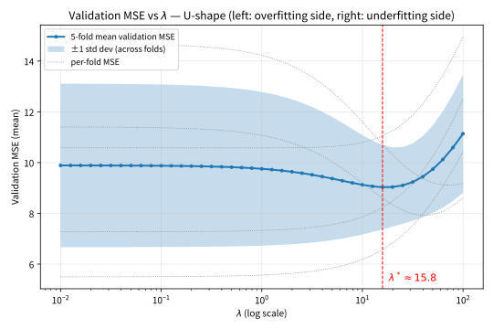
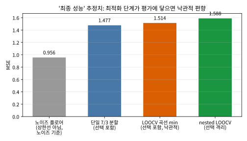

# 6.2 교차검증: \\(\lambda\\)를 데이터로 정한다

[](https://colab.research.google.com/github/SuminHan/book-ml/blob/main/notebooks/ml1/chapter06_2_cross_validation.ipynb)

### 왜 검증 데이터가 필요한가

\\(\lambda\\)는 사람이 직접 정해야 하는 **하이퍼파라미터**(hyperparameter) —
학습으로 정해지는 \\(w\\)와 달리, 학습 시작 전에 값을 정해줘야 하는
파라미터다. 학습 데이터에 대한 손실만 보고 \\(\lambda\\)를 고르면 항상
\\(\lambda=0\\)(정규화 없음)이 제일 낮은 손실을 내므로 의미가 없다 —
**검증 데이터**(validation set)로 성능을 재야 한다.

데이터가 넉넉하지 않을 때는 **k-겹 교차검증**(k-fold cross-validation)을
쓴다: 데이터를 \\(k\\)개로 쪼갠 뒤, 매번 한 조각을 검증용으로 남기고
나머지로 학습하는 것을 \\(k\\)번 반복해서 성능을 평균낸다 — 데이터
전체를 한 번씩은 검증에도, 학습에도 써보는 셈이다.

```python
def k_fold_split(data, k, fold_idx):
    n = len(data)
    fold_size = n // k
    start = fold_idx * fold_size
    end = start + fold_size if fold_idx < k - 1 else n
    val = data[start:end]
    train = data[:start] + data[end:]
    return train, val
```

### 손으로 한 번: "아무것도 못 배우는" 모델의 5-fold CV

검증 성능이 어떤 숫자가 되어야 "합리적인지" 감각을 만들기 위해, 가장 단순한
모델 — **학습 데이터의 평균만 되뇐다**(어떤 특징도 쓰지 않는
평균모델) — 로 5-fold CV를 손으로 계산해보자. \\(y\\)의 값이
\\(1, 2, \\dots, 10\\)인 데이터 10개를 순서대로 2개씩 5등분하면:

| fold | val | train 평균 | fold별 MSE |
|---|---|---|---|
| 0 | 1, 2 | 6.5 | 25.25 |
| 1 | 3, 4 | 6.0 | 6.50 |
| 2 | 5, 6 | 5.5 | 0.25 |
| 3 | 7, 8 | 5.0 | 6.50 |
| 4 | 9, 10 | 4.5 | 25.25 |
| **평균** | | | **12.75** |

fold 0만 따로 풀어쓰면: val이 \\(\\{1, 2\\}\\)이고 train은
\\(\\{3,\\dots,10\\}\\)이므로 train 평균은
\\((3+\\cdots+10)/8 = 6.5\\)이며,
\\(\\text{MSE} = [(1-6.5)^2 + (2-6.5)^2]/2 = [30.25 + 20.25]/2 = 25.25\\)다.
나머지 fold도 같은 방식으로, 전체 5-fold 평균은 **12.75**다.

여기서 "정직한" 기준선을 하나 세워보자. 이 평균모델의 **진짜** 일반화
오차는, 진짜 평균 \\(5.5\\)로 예측했을 때의 평균 제곱 오차다:

\\[\frac{1}{10}\sum\_{y=1}^{10}(y-5.5)^2 = \frac{82.5}{10} = 8.25\\]

그런데 CV 추정값(12.75)이 정직한 값(8.25)보다 **53%나 높다**. 왜일까 —
각 fold의 "train 평균"(6.5, 6.0, 5.5, 5.0, 4.5)이 진짜 평균 5.5 주위를
흔들리기 때문이다. train 평균이 1.0만큼 어긋난 fold 0에서는 그 어긋남
분량이 val 오차에 그대로 더쳐진다. **CV 추정값은 "진짜 성능"이 아니라
"검증 절차의 시뮬레이션**"이고, 절차 안의 작은 흔들림도 포함되므로
특정 모델 하나에 대해서는 오히려 *높게*(비관적으로) 나올 수도 있다.

여기서 한 박자 멈추자. 이 사실을 기억해둘 이유는, "CV 수치가 항상
낙관적"이라는 직관을 바로잡아주 때문이다 — **CV의 낙관적 편향은
"한 모델을 평가"할 때 생기는 게 아니라, "여러 후보 중 제일 좋은
모델을 고르는" 다음 단계에서 생긴다**(§최적화 편향). 모델 하나를
단순히 평가하는 단계에서는 — 이 평균모델처럼 모델이 유연하지
않을 때는 — CV가 진짜 오차보다 *낮게* 나올 리가 없고, 실제로는
여기처럼 *높게* 나올 수도 있다. (실습 노트북 §2에서 이 순서 분할
버전(CV=12.75)과 무작위 5-fold 버전(시드 고정, CV≈10.39, 정직한 값의
1.26배)을 모두 코드로 확인한다 — 무작위로 섞어도 바닥 8.25는 넘는다.)

### 실습: k-fold CV로 최적 \\(\lambda\\) 찾기

`ridge_gradient_descent`와 `k_fold_split`을 조합하면, "학습 손실이 아니라
검증 손실을 기준으로 \\(\lambda\\)를 고른다"는 원칙을 코드로 직접 확인할
수 있다:

```python
def mse(X, y, w):
    m, n = len(X), len(X[0])
    total = 0.0
    for i in range(m):
        pred = w[0] + sum(w[j+1] * X[i][j] for j in range(n))
        total += (pred - y[i]) ** 2
    return total / m

def cross_validate_lambda(X, y, lambdas, k=5, alpha=0.01, epochs=500):
    data = list(zip(X, y))
    results = {}
    for lam in lambdas:
        val_errors = []
        for fold in range(k):
            train, val = k_fold_split(data, k, fold)
            X_train, y_train = [d[0] for d in train], [d[1] for d in train]
            X_val, y_val = [d[0] for d in val], [d[1] for d in val]
            w = ridge_gradient_descent(X_train, y_train, lam, alpha, epochs)
            val_errors.append(mse(X_val, y_val, w))
        results[lam] = sum(val_errors) / len(val_errors)
    return results

# 특징 15개 중 실제로 y와 관련 있는 건 2개뿐이고, 나머지는 순수 잡음인
# 데이터에서 최적 lambda를 찾아보면 (실행 예):
# lambda=0.0: 평균 검증 MSE=12.520
# lambda=0.5: 평균 검증 MSE=10.872   <- 최적
# lambda=2.0: 평균 검증 MSE=11.780
# lambda=10.0: 평균 검증 MSE=13.740
```

정규화가 전혀 없을 때(\\(\lambda=0\\))도, 너무 강할 때(\\(\lambda=10\\))도
검증 MSE가 오히려 나빠지고, 그 사이 어딘가에 최적점이 있다 — 이 U자
모양이 바로 6.1절의 편향-분산 트레이드오프가 실제 숫자로 나타난 것이다.

### U자형 곡선: 왼쪽은 과적합, 오른쪽은 과소적합

위의 실행 예는 \\(\lambda\\) 후보 4개만 돌려봤지만, 같은 종류의 데이터
(15개 특징 중 2개만 진짜 관련, \\(n=100\\), 잡음 표준편차 3)에 로그
스케일 41개 후보를 밀게 돌려서 평균 검증 MSE를 \\(\lambda\\)에 대해
그리면 모양이 선명해진다. Ridge는 6.1절 연습문제 3의 정규방정식으로
닫혀 있으므로 경사하강의 수렴 걱정 없이 완전한 해로만 봤다:



이 U자형 곡선을 6.1절과 Chapter 4.1의 편향-분산 언어로 읽어보자:

- **U의 왼쪽(\\(\lambda\\)가 작은 쪽, 과적합 쪽)**: 13개 잡음 특징의
  가중치가 표본잡음에 맞춰져 분산이 지배한다. \\(\lambda \to 0\\)일수록
  이 쪽으로 밀려나, 정규화 없는 모델(위 실행 예의 12.520)은 최소점보다
  나쁘다.
- **U의 오른쪽(\\(\lambda\\)가 큰 쪽, 과소적합 쪽)**: 2개 *진짜* 관련
  특징의 가중치까지 0으로 쪼그라들면서 편향이 커진다.
- **최소점**: 둘의 합이 가장 작은 위치.

그림에서 놓치기 쉬운 한 가지를 더 보자. **평균 곡선이 U자형인 데다,
최소점 근처로 갈수록 fold 간 흩어짐(회색 점선과 ±1 표준편차 밴드)도
좁아진다** — 실습 노트북 §3에서 5개 fold별 값을 같은 그림에 겹쳐
확인할 수 있다. 검증 MSE는 k개 fold의 평균이라는 *추정치*인데,
최소점 근처에서는 fold끼리 서로 잘 합의하고 양쪽 끝에서는 벌어진다는
사실은, "제일 낮은 한 점"을 어디까지 믿을 수 있는가의 문제와 직결된다 —
바로 다음 절의 1SE 규칙이 이 점에서 출발한다.

### "최적" \\(\lambda^\*\\)는 어느 정도까지 믿을 수 있는가: 1SE 규칙

CV 곡선의 "최소점"은 *추정치*다 — 데이터가 조금만 바뀌어도 위치가
동네를 바꾼다. 실습 노트북 §4에서 같은 생성 과정(2개 관련 특징 +
13개 잡음 특징, 잡음 표준편차 3)을 시드 10개로 반복하면, 각 시드가
고른 \\(\lambda^\*\\)가 **5.0~20.0까지**(약 4배) 흩어진다. "최소점"은
뾰족한 꼭짓점이 아니라 **평탄한 대지(plateau**에 가깝다는 뜻이다.

그렇다면 대지 위의 어느 \\(\lambda\\)를 골라도 성능 차이가 본질적이지
않으므로, "절대 최소점"을 고집할 필요가 없다. Lasso 계열에서 널리
쓰이는 실용 규칙이 **1SE 규칙**(1-standard-error rule, Tibshirani의
Lasso 논문에서 널리 쓰이기 시작했다[^lasso])이다: **CV MSE가
(최소점 + fold 표준편차 1개) 이내인 후보 중 가장 큰 \\(\lambda\\)**
— 즉 가장 단순한 모델 — 를 고른다.

위 곡선에서 계산하면: 최소점은 \\(\lambda \approx 15.8\\)(MSE 9.03),
여기서 fold 표준편차 1개(1.66)를 더한 허용 상한은 10.69. 이 범위 안에
드는 후보 중 가장 큰 \\(\lambda\\)는 **\\(\lambda \approx 79.4\\)**
(MSE 10.59)다 — 최소점보다 **5배** 더 큰 \\(\lambda\\), 즉 더 작고
단순한 모델이 "통계적으로 구별되지 않는" 수준으로 좋다. 6.1절의
Lasso로 치면, 정확도를 사실상 그대로 유지하면서 *더 많은* 특징을
0으로 만들어 더 희소하고 해석하기 쉬운 모델을 얻는 것이다.

1SE 규칙의 논리를 한 줄로 말하면: **CV 평균의 불확실성은 ±1 표준편차
급[^bengio04]이고, 그 불확실성 범위 안에서는 "더 단순한 쪽"을 고르는 것이
합리적인 tie-breaker**라는 것이다. (같은 계산을 실습 노트북 §4의
코드에서 재현한다.)

### 손으로 한 번: 4-fold 분할을 직접 손으로 나눠보기

`k_fold_split`이 실제로 데이터를 어떻게 나누는지 손으로 따라가보자.
샘플 12개(인덱스 0~11)를 \\(k=4\\)로 나누면 `fold_size = 12 // 4 = 3`이다.
각 `fold_idx`에 대해 `start = fold_idx * 3`, `end = start + 3`(마지막
fold만 나머지를 전부 포함하도록 `n`까지)이 검증용으로 빠진다:

| `fold_idx` | 검증용(val) 인덱스 | 학습용(train) 인덱스 |
|---|---|---|
| 0 | 0, 1, 2 | 3, 4, ..., 11 |
| 1 | 3, 4, 5 | 0, 1, 2, 6, 7, ..., 11 |
| 2 | 6, 7, 8 | 0, 1, ..., 5, 9, 10, 11 |
| 3 | 9, 10, 11 | 0, 1, ..., 8 |

4번의 fold를 전부 돌리고 나면, 인덱스 0~11 **각각이 정확히 한 번씩**
검증용으로 쓰이고 나머지 세 번은 학습용으로 쓰인다 — "데이터 전체를
한 번씩은 검증에도 써본다"는 6.2절 서두의 설명이 실제로 이런 인덱스
분할로 구현된다는 것을 확인할 수 있다. `cross_validate_lambda`는 이
과정을 각 \\(\lambda\\) 후보마다 반복해서, 4번의 검증 오차를 평균 낸
값으로 그 \\(\lambda\\)를 평가한다. (실습 노트북 §1에서 이 표를 코드로
그대로 검증한다 — 인덱스 0~11 각각이 정확히 한 번씩 val에 등장함을
assert로 확인.)

### 자주 하는 실수: 섞지 않은 데이터를 그대로 fold로 나누기

위 `k_fold_split`은 데이터를 **주어진 순서 그대로** 앞에서부터 잘라
나눈다 — 만약 데이터가 정렬되어 있다면 심각한 문제가 생긴다. 예를 들어
샘플 12개 중 앞 6개가 전부 클래스 0, 뒤 6개가 전부 클래스 1로 정렬된
데이터라면, `fold_idx=0`의 검증셋(인덱스 0,1,2)은 **클래스 0만**,
`fold_idx=3`의 검증셋(인덱스 9,10,11)은 **클래스 1만** 포함하게 된다.
이런 fold로 평가하면, 모델이 학습 데이터에서 본 클래스 비율과 검증
fold의 클래스 비율이 서로 달라서 검증 성능이 실제보다 훨씬 나쁘게(또는
우연히 좋게) 나올 수 있다 — 4.2절의 `tune_k`가 쓰는 `train_val_split`은
`random.Random(seed).shuffle(idx)`로 먼저 섞은 뒤 나누는데, 여기
`k_fold_split`은 그 섞는 단계가 빠져 있다는 차이에 주의해야 한다. 실전
코드(`sklearn.model_selection.KFold(shuffle=True)` 또는 클래스 비율까지
유지해주는 `StratifiedKFold` [^sklearn])를 쓸 때는 이 옵션을 반드시 켜는 습관을
들이는 것이 좋다 — 데이터가 어떤 기준으로든 정렬되어 있을 가능성은
생각보다 흔하다(시간순 로그, 라벨순 정렬된 원본 파일 등).

이 "평균은 그럴듯해도 fold가 깨진다"는 현상을 숫자로 재현해보자.
실습 노트북 §5의 예: 분류 샘플 30개(앞 15개는 클래스 0, 뒤 15개는
클래스 1로 정렬), 특징 1개, \\(\lambda=0\\)로 5-fold를 돌리면:

| 분할 방식 | fold별 정확도 | 평균 | fold 간 표준편차 |
|---|---|---|---|
| 섞지 않음(순서대로) | 1.00, 1.00, 0.50, 0.00, 0.00 | 0.50 | 0.447 |
| 섞음(시드 42) | 0.50, 0.67, 0.33, 0.33, 0.67 | 0.50 | 0.149 |

첫 행을 읽어보자 — fold 0, 1의 검증셋은 클래스 0 쪽 끝에, fold 4의
검증셋은 클래스 1 쪽 끝에 배치되므로, fold별 정확도는 **모델의 성능이
아니라 검증셋이 어느 쪽 끝에 놓였는지가** 정해버린다(1.00 → 0.00).
이 예에서는 두 클래스의 개수가 같아서 *평균*이 우연히 0.50으로
같아졌지만, 클래스 비율이 한쪽으로 기울어지면 평균 자체가 왜곡된다.
"5-fold 평균이 0.50"이라는 숫자만 보고 모델을 비교하는 순간, 이
평균이 어떤 \\(\lambda\\)도 좋게(또는 나쁘게) 보이게 만드는
근거 없는 숫자일 수 있다는 점을 기억하라 — **fold별 값의 흩어짐을
볼 줄 알아야 "평균"을 읽을 수 있다.**

### \\(\lambda\\)를 고르는 것 자체가 "선택": 최적화 편향과 nested 교차검증

지금까지 "CV 곡선의 최소점"을 그 \\(\lambda\\)가 고르는 모델의
"진짜 성능"인 것처럼 다루었다. 그런데 절차 전체를 한 발 물러서서
보자:

1. 각 \\(\lambda\\) 후보마다 CV 평균을 계산한다(데이터 사용).
2. 그중 **가장 작은 값을 가진** \\(\lambda\\)를 고른다 — *이것도*
   같은 데이터로 한 **선택**이다.
3. 그 최소점의 값을 "선택된 모델의 기대 성능"으로 보고한다.

2단계는 6.3절의 선택 편향 — "후보 \\(m\\)개 중 최고 점"을 고르면
\\(\\mathbb{E}[\\max]\\)만큼 부푼다 — 과 정확히 같은 구조다. 고르는
대상이 모델이 아니라 \\(\lambda\\) 후보일 뿐이다. 따라서 **곡선의
최소점은 평균적으로 낙관적**이다 — 후보가 많을수록, 그리고 각 후보의
CV 평균 간 흔들림이 클수록. 이것을 **최적화 편향**
(optimization bias)라 부른다: CV 곡선 자체가 그 데이터로 "조정
된(tuned)" 결과이므로, 그 최솟값은 *보아온 숫자* 중 제일 좋은
숫자다.[^varmasimon]

원칙적인 고치는 데이터를 **두 층으로 분리**하는 **nested 교차검증**
(nested cross-validation)이다. *외층*의 검증 데이터는 "최종 측정"에만
쓰이고, \\(\lambda\\)를 고르는 *모든* 선택 단계는 *내층*에서만
벌인다:



편향이 실제로 얼마인지 작은 숫자로 확인해보자(\\(m=10\\), 특징 1개,
\\(\lambda \in \\{0, 1, 10\\}\\), 실습 노트북 §6):

| 추정 방법 | 추정 MSE | 선택 단계가 평가 데이터에 닿는가 |
|---|---|---|
| 노이즈 플로어(진짜 선형 + 잡음의 분산, 참고선) | 0.956 | — |
| (a) 단일 7/3 분할: 7개로 \\(\lambda\\) 골라 3개에서 재기 | 1.477 | 학습엔, 평가 3개에는 닿지 않음 |
| (b) LOOCV 곡선의 min: 각 \\(\lambda\\)의 LOOCV 평균 중 최솟값을 보고 | **1.514** | **당해 — 곡선 전체가 10개 점으로 그려짐** |
| (c) nested LOOCV: 매번 1개 제외한 9개로만 LOOCV해서 \\(\lambda\\) 고르고 그 1개 측정 | 1.588 | 닿지 않음(선택은 전부 내층 9개 안에서) |

핵심 비교는 (b) vs (c)다. (c)가 (b)보다 **0.07 높게** 나왔다 — 이
갭이 바로 "곡선의 최소점을 최종 성능으로 보고한" 것에 배어 있던
낙관적 편향이다. (참고로 (c)의 내부 선택 기록을 보면 10번 중 9번
\\(\lambda=1.0\\)을, 1번 \\(\lambda=0.0\\)을 고른다 — 선택이
*데이터에 따라서* 흔들리는 것 자체가 §1SE 규칙의 경고와 같은
이야기다.) 이 예에서는 \\(m=10\\)·후보 3개라 갭이 작지만, 구조는
6.3절과 동일하다: 후보가 100개, 측정 잡음 \\(\sigma=1\\)이면
\\(\\mathbb{E}[\\max] \approx 2.5\\)까지 부푼다는 것을 6.3절의
시뮬레이션이 보여주듯, **후보 수와 흔들림이 커질수록 갭은 함께
커진다.**

실전 가이드라인은 "항상 nested CV를 돌린다"는 것이 아니라
(nested CV는 보통 CV보다 \\(k\\)배 가까운 학습 횟수를 먹는다):

- 보통 CV로 \\(\lambda\\)를 **고르는 것**(selection)은 당연하다 —
  그것이 val의 정당한 용도다.
- **보고(reporting)** 할 때는, 어떤 선택에도 쓰인 적 없는 홀드아웃
  데이터(6.3절의 test set)로 재는 것이 원칙이다.
- 홀드아웃 데이터가 없는 상황(경쟁 대회, 데이터 전부 소진)이라면
  nested CV는 "같은 데이터로 정직한 추정치를 얻는" 방법이다.

이 최적화 편향은 이 절의 \\(\lambda\\) 선택이 만들어내는 것이다 —
그리고 "어떤 데이터로 무엇을 고르고, 어떤 데이터로 최종 측정하는가"를
엄격한 원리로 정리하는 것이 바로 6.3절의 주제다.

### 자주 묻는 질문

**Q. \\(k\\)는 몇으로 잡아야 하나요?** \\(k=5\\) 또는 \\(k=10\\)이
실전에서 가장 흔한 기본값이다. \\(k\\)가 커질수록(예: \\(k=m\\), 데이터
개수만큼 — 이를 **LOOCV**, leave-one-out cross-validation이라 부른다)
각 fold의 학습 데이터가 거의 전체 데이터와 같아져 편향은 줄지만, fold를
\\(m\\)번 전부 다시 학습해야 해서 계산 비용이 커지고 fold 간 결과의
분산도 커질 수 있다. \\(k\\)가 작을수록(예: \\(k=3\\)) 계산은 빠르지만
각 fold의 학습 데이터가 상대적으로 작아져 편향이 커질 수 있다 —
\\(5\sim10\\)이 이 둘 사이의 실용적인 절충점으로 알려져 있다.

**Q. 교차검증은 항상 해야 하나요?** 데이터가 아주 많다면(예: 수백만
개) 굳이 \\(k\\)번 반복해서 학습할 필요 없이, 데이터를 한 번만
train/validation으로 나눠도(6.3절의 단순 분할) 검증셋 자체가 이미
충분히 커서 안정적인 평가가 된다. 데이터가 적을수록(수백~수천 개) 한
번의 분할은 우연히 "쉬운" 또는 "어려운" 검증셋을 뽑을 위험이 커서,
여러 번 나눠 평균 내는 교차검증의 가치가 커진다.

**Q. 경진대회(Kaggle 등 [^kaggle][^kaggle21])에서 test의 라벨이 공개되지 않으면 CV를
어떻게 쓰나요?** 공개된 **public leaderboard** 점수는 사실상 *val*의
역할, 비공개 **private leaderboard**가 *test*의 역할에 해당한다 —
public 점수로 \\(\lambda\\)를 골라 계속 제출하면, public 리더보드를
"20번 봤다"는 뜻이므로 §최적화 편향의 관점에서 public 점수는
부풀려진 추정치다. private는 제출 횟수 제한이 있는 이유가 바로
이 선택 편향을 통제하기 위해서다. 교훈: **같은 검증 조각으로 비교한
후보가 \\(m\\)개면, 그 검증 점수는 \\(m\\)개 중 max를 본 셈**이다.

**Q. k-fold CV의 평균은 "진짜 성능"의 공정한(무편향) 추정치인가요?**
"한 모델을 단순히 평가"하는 용도라면 같은 분포에서 새로 들어올
데이터의 기대 오차에 대한 합리적인 추정치다. 하지만 이 절의 용도 —
*여러 \\(\lambda\\) 후보 중 최솟값을 고르는* 용도 — 로 쓰면, §최적화
편향에서 보듯 그 최솟값은 평균적으로 *낮게*(낙관적으로) 나온다.
따라서 "CV로 고른 모델의 성능은 CV 최소점이다"라는 보고는 원칙적으로
낙관적이며, 정직한 숫자가 필요하면 선택에 쓰지 않은 test(6.3절)나
nested CV(§nested 교차검증)를 쓴다 [^cs229].

### 확인 문제

**1.** 샘플 10개(인덱스 0~9)를 \\(k=5\\)로 `k_fold_split`한다고
하자. `fold_idx=2`일 때 val에 들어가는 인덱스를 쓰고, 5개 fold를
모두 돌렸을 때 각 인덱스가 val에 총 몇 번씩 등장하는지 확인하라.
(힌트: fold 0의 표와 같은 방식으로 \\(start, end\\)를 대입하면 된다.)

**2.** "손으로 한 번"의 평균모델 예(\\(y = 1, \\dots, 10\\), 순서대로
2개씩 5등분)에서 fold 0과 fold 4의 fold별 MSE를 각각 계산하고,
5-fold 평균을 구하라. 정직한 평균모델 오차 8.25와 비교해 CV 추정값
12.75가 어느 방향으로 얼마나 벗어나는지, 그 원인을 한 문장으로
설명하라.

**3.** 어떤 \\(\lambda\\) 후보 5개에 대한 5-fold CV 평균 MSE가 아래
표와 같다. (가) 최소점은 어느 \\(\lambda\\)인가? (나) 최소점인
\\(\lambda=1.0\\)의 fold별 MSE가 \\([4.2, 4.4, 4.6, 4.8, 5.0]\\)일
때, §1SE 규칙(최소점의 평균 + 그 fold 표준편차 1개 이내인 후보 중
**가장 큰** \\(\lambda\\))으로 고를 \\(\lambda\\)는? (힌트:
허용 상한을 먼저 숫자로 구해라.)

| \\(\lambda\\) | 0.1 | 0.3 | 1.0 | 3.0 | 10.0 |
|---|---|---|---|---|---|
| 5-fold 평균 MSE | 5.00 | 4.80 | **4.60** | 4.70 | 5.20 |

**4.** \\(\lambda\\) 후보 20개에 대해 5-fold CV를 돌려서, 곡선의
최소점(MSE 3.12)을 "배포할 모델의 기대 성능"으로 보고했다. 동료
연구자가 "그 숫자는 낙관적 편향이 있다"고 주장한다. 이 주장의
이유를 §최적화 편향의 구조(선택 단계가 평가 데이터에 닿았는가)로
설명하고, 정직한 추정치를 얻는 두 가지 방법(하나는 *데이터*를,
하나는 *계산*을 더 요구한다)을 쓰라.

### 정리

이 절은 두 가지를 손에 넣었다. 첫 번째는 **절차** — k-fold CV로
데이터 전체를 "한 번씩은 검증에도" 쓰면서, 학습 손실이 아니라
*검증* 손실이 가장 작은 \\(\lambda\\)를 고른다: U자형 곡선은 6.1절의
편향-분산 트레이드오프가 실제 숫자로 그려진 것이고, 1SE 규칙은
"최소점"이라는 단일 수치에 대한 건강한 불신을 제도화한 것이다.
두 번째는 **경고** — "여러 후보 중 최솟값을 고르는" 행위 자체가
또 하나의 선택이므로, CV 곡선의 최소점은 곧바로 "최종 성능"이 될
수 없다. 낙관적 편향을 격리하는 방법 — 선택에 쓰지 않은 test,
또는 nested CV — 은 6.3절의 train/val/test 분리 원리가 이 절과
맞닿는 지점이다.

[^lasso]: Tibshirani, R. (1996). "Regression Shrinkage and Selection via the Lasso." *Journal of the Royal Statistical Society, Series B (Methodological)*, 58(1), 267–288. https://doi.org/10.1111/j.2517-6161.1996.tb02080.x
[^sklearn]: Pedregosa, F., Varoquaux, G., Gramfort, A., et al. (2012). "Scikit-learn: Machine Learning in Python." *Journal of Machine Learning Research* 13 (JMLR Workshop on Machine Learning in Python), 1–22. https://arxiv.org/abs/1201.0490
[^kaggle]: Kaggle — 기계학습 경진대회 플랫폼. 공개/비공개 리더보드(public/private leaderboard) 제도를 통해 데이터가 없는 상황에서 검증-테스트 분리를 대체한다. https://www.kaggle.com/
[^cs229]: 더 깊이 보려면: Stanford CS229: Machine Learning, Lecture Notes. https://cs229.stanford.edu/main_notes.pdf — 이 절의 교차검증, 최적화 편향(선택 편향), nested CV는 CS229의 모델 선택/모델 평가 주제와 직접 겹친다.
[^varmasimon]: Varma, S., Simon, R. (2006). "Bias in error estimation when using cross-validation for model selection." *BMC Bioinformatics* 7:91. https://doi.org/10.1186/1471-2105-7-91 — CV를 모델 선택에 썼을 때 보고되는 오류 추정치가 실제보다 낙관적으로 나오는 편향(이 절의 "최적화 편향")을 정량화한 대표 논문이다.
[^bengio04]: Bengio, Y., Grandvalet, Y. (2004). "No Unbiased Estimator of the Variance of K-Fold Cross-Validation." *Journal of Machine Learning Research* 5. https://jmlr.org/papers/volume5/grandvalet04a/ — k-겹 CV 추정량의 분산에 대해 무편향 추정치가 존재하지 않음을 증명한 논문이다.
[^kaggle21]: Bergstrom, L., Karsz, A., Shah, N., Bubeck, S., Stojnic, R. (2021). "The Kaggle Competition Platform for Algorithmic Advances." arXiv:2106.04407. — 경진대회 플랫폼(public/private 리더보드, 제출 제한 등)이 알고리즘 발전에 기여하는 방식을 기술한 논문 — 본문의 public/private 리더보드 비유와 직접 대응한다.
