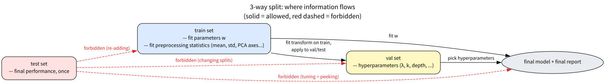
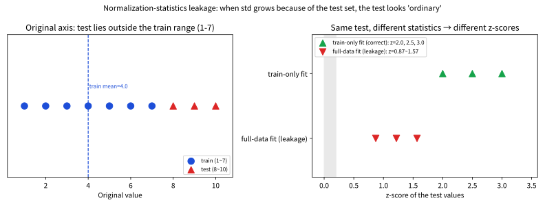
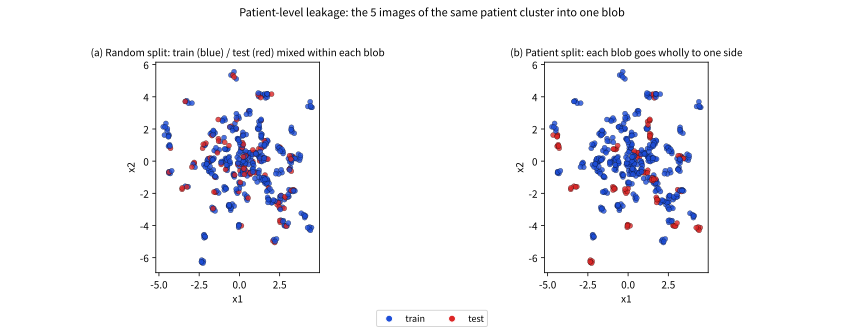

# 6.3 train/val/test 분리 원칙 실전

[](https://colab.research.google.com/github/SuminHan/book-ml/blob/main/notebooks/ml1/chapter06_3_train_val_test.ipynb)

### 왜 3분할이 필요한가: "배운 것"과 "재는 것"을 나누어야 한다

머신러닝 파이프라인은 사실 **두 가지 완전히 다른 일을 동시에** 한다. 하나는
**배우는 일**(train 데이터로 모델의 파라미터를 정하는 것)이고, 다른 하나는
**재는 일**(그 모델이 *보지 못한* 데이터에서 얼마나 잘하는지 평가하는 것)이다.
이 둘을 같은 데이터로 하면 치명적인 문제가 생긴다 — 모델이 "재는 데이터"까지
보고 만들어졌으므로, 그 데이터에서의 점수는 "학습을 얼마나
잘 했는가"를 재는 게 아니라 "기억을 얼마나 잘 했는가"를 재게 된다.
Chapter 4.1의 과적합이 "train에서 완벽, test에서 참사"로 나타나는 것과
정확히 같은 구조다.

6.1절의 정규화(\\(\lambda\\))와 6.2절의 교차검증[^cs229]은 이 문제를 *완화*했지만,
"어떤 데이터로 무엇을 결정하는가"라는 **역할 분리** 자체를 정한 곳은 아직 없다.
이 절은 그 역할을 정한다: 데이터를 세 조각으로 나눠, 각 조각이 서로 다른 질문
에 답하도록 **각각 딱 한 역할만** 쓰기로 약속하는 것 — train은 배운다, val은
모델을 고르고, test는 딱 한 번만 최종 점수를 준다.

### 모델 선택의 원칙

학습 데이터로 파라미터(\\(w\\))를 정하고, 검증
데이터로 하이퍼파라미터(\\(\lambda\\), \\(k\\)의 kNN, 트리 깊이 등)를
정하고, **테스트 데이터**로는 최종 성능만 딱 한 번 확인한다 — 테스트
데이터를 하이퍼파라미터 튜닝에 쓰면 "부정행위"(테스트 데이터를 몰래
봐서 고른 모델)와 다를 게 없다.

이 원칙을 한 줄로 압축하면 **"정보의 흐름 방향을 정한다"** 는 것이다.
train은 val·test로, val은 최종 모델로 정보가 흐를 수 있지만, **test에서는
어디로도 정보가 흘러나와서는 안 된다**. test는 파이프라인의 *마지막 관문* —
한 번 지나가면 돌아올 수 없다. 아래에서 이 "흐름"을 그림으로 그리고, 그
금지가 실제로 깨질 때마다 성능 숫자가 어떻게 부풀어 오르는지 하나씩 확인할
것이다.

### 정보 흐름: 어디서 어디로만 가야 하는가

3분할의 원칙을 한 장의 다이어그램으로 그리면 아래와 같다. 허용된 흐름(실선)은
왼쪽(train)에서 시작해 val을 거쳐 최종 모델로 흐르고, **테스트(빨간 점선)에서
나가는 모든 화살표는 금지**다.



화살표를 하나씩 읽어보자:

- **train → val / test**: 전처리 통계량(평균·표준편차, PCA 축 등)을
  *train으로만 fit*하고 val·test에는 그걸 *apply*하는 방향. "train에서 배운
  규칙을 안 본 데이터에 적용"하는 것이 허용되는 유일한 교차다.
- **train → 모델**: \\(w\\)를 fit하는 방향.
- **val → 모델**: 하이퍼파라미터를 고르는 방향. val은 "후보 모델들 중 어느
  쪽이 좋은지" 판정하는 역할을 하므로, 여기서 정보가 모델(= 하이퍼파라미터
  선택)로 흐르는 것은 정당한 용도다.
- **test → (val / train / 모델)**: **모두 금지.** 테스트를 보고
  하이퍼파라미터를 다시 고르면(test→모델 금지), 테스트를 train에 다시 넣거나
  분할을 바꿀 때 test를 기준으로 움직이면(test→train/val 금지) — 전부
  "테스트를 살짝 훔쳐보았다"는 뜻이다.

이 다이어그램이 이 절의 "지도"다. 다음 세 절(선택 편향, 시계열, 그룹 분할)은
이 지도의 **빨간 점선을 한 번씩 밟아봤을 때** 실제 숫자가 어떻게 변하는지를
각각 다른 각도에서 보여준다.

### 3분할이 실제로 깨지는 흔한 실수

이 원칙이 무너지는 흔한 패턴 세 가지: (1) 테스트 데이터로 여러 모델을
비교해보고 가장 잘 나온 걸 고르는 것("살짝 훔쳐보기"), (2) 검증 데이터
없이 테스트 데이터로 하이퍼파라미터까지 같이 튜닝하는 것(검증과 테스트를
사실상 섞어버림), (3) 데이터를 나누기 **전에** 정규화(스케일링) 같은
전처리 통계량(평균, 표준편차)을 전체 데이터로 계산하는 것 — 테스트
데이터의 정보가 전처리 단계에서 이미 학습에 스며든다("data leakage").
Chapter 8, 16의 팀 프로젝트와 ML2의 팀 프로젝트에서도 이 3분할 원칙을
그대로 지켜야 한다.

세 가지 실수가 모두 같은 범주("test 정보가 다른 곳으로 흘러나감")에 속한다는
점을 주의하라 — 겉모양은 달라(모델을 고르는 것 / 전처리 순서 / …) 보여도,
다 같은 **정보 흐름의 역주행**이다. 그래서 "이 코드에 leakage가 있는가?"를
묻는보다 좋은 질문은 **"test(또는 val)의 정보가 학습이나 선택 단계에 닿았
는가?"** — 아래 §에서 이 질문을 숫자로 답할 수 있는 도구를 하나씩 만든다.

### 손으로 한 번: 데이터 누수(leakage)를 숫자로 확인하기

세 번째 실수("정규화 통계량을 전체 데이터로 미리 계산하는 것")가 실제로
어떤 왜곡을 만드는지 숫자로 확인해보자. 값 \\(1\\)부터 \\(10\\)까지의
데이터를 앞 7개(train)와 뒤 3개(test)로 나눈다고 하자. 표준화(평균을 빼고
표준편차로 나누는 것)를 어느 통계량으로 하느냐에 따라 결과가 달라진다:

| 기준 | 평균 | 표준편차 |
|---|---|---|
| 전체 10개(누수) | 5.5 | 2.872 |
| train 7개만(올바름) | 4.0 | 2.000 |

test 데이터 \\([8, 9, 10]\\)을 각각의 통계량으로 표준화하면:

\\[\text{전체 통계량(누수)}: \quad [0.870,\ 1.219,\ 1.567]\\]
\\[\text{train 통계량(올바름)}: \quad [2.0,\ 2.5,\ 3.0]\\]

전체 데이터로 미리 계산한 평균·표준편차를 쓰면 test 값들이 실제보다
훨씬 "평범해(z값이 작아)" 보인다 — 표준편차 자체가 test의 큰 값들
때문에 이미 커져 있기 때문이다(2.872 vs 2.0). 하지만 실전 배포
시나리오를 생각해보면, 모델을 배포하는 시점에는 미래에 들어올 데이터
(test에 해당)를 아직 볼 수 없으므로 애초에 그 통계량을 계산에 쓸 수
없다 — **train 통계량만으로 표준화하는 것이 실제 배포 상황을 정확히
흉내 낸 것**이고, 전체 데이터로 계산하는 것은 "미래를 몰래 들여다본"
값이다. 이 차이가 검증 성능을 실제보다 낙관적으로 부풀리는 방향으로
작용하는 경우가 많다 — 정규화 통계량뿐 아니라 PCA(Chapter 14)의 주성분,
결측치 대체에 쓰는 평균값 등, "데이터를 보고 계산하는 모든 통계량"에
같은 원칙이 적용된다: **반드시 train으로만 계산하고, val/test에는 그
계산된 통계량을 그대로 적용만 한다.**

같은 예시를 그림으로 보면 더 선명하다 — 왼쪽은 원본 축, 오른쪽은 z-스코어
축인데, **같은 test 값 [8,9,10]이 어떤 통계량으로 나누느냐에 따라 "극단적
새로운 데이터(z=2~3)"와 "평범한 데이터(z≈1)"로 각각** 보인다.



**왜 std가 test 때문에 커지는가** — 전체 10개의 표준편차(2.872)를
train 7개(2.0)와 비교하면, test의 큰 값들(8,9,10)이 *분산의 계산에 이미
들어와* 전체 std를 끌어올린 것이다. 그래서 test 값을 그 "이미 test를
본" std로 나누면 z가 작아("평범") 보이는 것이다 — **재고 싶은 것(test)이
재는 자(통계량)를 미리 바꿔놓은 것**이 바로 누수의 핵심이다. scikit-learn[^sklearn]의
`StandardScaler().fit(X_train)` → `.transform(X_test)`이 이 원칙의 표준
구현이며, `.fit_transform(X_all)`을 val·test에 쓰면 위 표의 "누수" 열과
동일한 위장이 일어난다.

### 테스트를 "살짝 훔쳐보기"의 통계: 선택 편향(selection bias)[^varmasimon]

"테스트로 여러 후보를 돌려보고 제일 잘 나온 걸 고른다" — 이 한 줄의
"살짝 훔쳐보기"가 *정량적으로* 얼마나 낙관적인지, 확률로 계산해보자. 각
후보의 테스트 성능을 (진짜 성능 + 우연한 잡음)으로 모델링하고, 잡음을
독립 정규분포 \\(\mathcal{N}(0, \sigma^2)\\)라 하자. 후보 \\(m\\)개 중
**최고 점**을 고르는 행위는 \\(m\\)번의 잡음 뽑기 중 \\(\max\\)를 고르는
것과 같다. 그런데 \\(m\\)개 독립 정규분포의 max는 평균(=0, 진짜 성능)보다
**항상 위쪽으로 치우친다** — \\(m\\)이 커질수록 max는 더 위로 올라간다.

실습 노트북 §2에서 \\(\sigma=1\\), 진짜 성능 0인 경우를 4만 번 시뮬레이션
해, 후보 수 \\(m\\)에 따라 "고른 최고 점"의 평균 \\(\mathbb{E}[\max]\\)을
재면:

| 후보 수 \\(m\\) | \\(\mathbb{E}[\max]\\) (진짜 성능 0, \\(\sigma=1\\)) |
|---|---|
| 1 | \\(\approx 0\\) |
| 2 | 0.56 |
| 5 | 1.16 |
| 10 | 1.53 |
| 20 | 1.86 |
| 50 | 2.25 |
| 100 | 2.51 |
| 500 | 3.04 |

![후보 수 m(로그 축)에 따른 E[max] 곡선 — 잡음 한 개(sigma=1)를 붉은 점선으로 표시. m=50이면 잡음의 2배 이상, m=100이면 2.5배 부풀어 오른다](../../images/ch06_3_selection_bias.svg)

이 표가 "테스트로 모델을 고르면 안 된다"는 원칙의 **수학적 근거**다:

- \\(m=1\\)이면 편향이 0 — 후보 한 개만 있으면 "고르다"는 행위가 없다.
- \\(m=5\\)(\\(\lambda\\) 후보 5개)만 되도 \\(\approx 1.16\\), \\(m=50\\)이면
  \\(\approx 2.25\\) — **잡음 한 개(\\(\sigma=1\\))의 2배 이상**이
  테스트 성능에 *부풀려* 올라간다.
- 실전에서는 \\(m\\)이 "모델 수 × 하이퍼파라미터 수"의 **곱**으로 커지기
  쉽다(모델 5개 × \\(\lambda\\) 20개 = 100개 후보 → 부풀림 \\(\approx 2.5\\)).
  "살짝" 훔쳐본 것일지라도, 후보가 쌓이면 편향은 선형이 아니라
  *로그 스케일로* 계속 커진다.

이 편향이 **test가 아니라 val에 걸리는 한** 정직하다 — val은
"모델을 고르는 역할"이라 선택 편향을 *예상대로* 먹고, **test는 한 번만
마지막에** 쓰이므로 그 편향에 노출되지 않는다. 그런데 test로 고르면
*재야 할 대상(test)이 고르는 과정에 쓰여서* test 자체가 §2의
\\(\mathbb{E}[\max]\\)를 그대로 먹고 만다 — **평가자가 동시에 선수
선발위원**이 되는 셈이다. (참고: \\(\sigma\\)는 "성능 측정의 흔들림"
크기를 뜻하며, 실제에서는 \\(\sigma\\)를 곱하면 된다 — 잡음이 3배면
부풀림도 3배로 커진다.)

**한 줄 교훈**: 모델/하이퍼파라미터 후보가 \\(m\\)개라면, "제일 좋은
test 점"은 진짜 성능보다 \\(\mathbb{E}[\max]\\)만큼 *평균적으로* 높다.
따라서 "이 test 점수로 논문/보고서를 쓰면"은 \\(m\\)이 1이어야 정직하고,
\\(m\\)이 크면 그 수치는 *하한*이 아니라 *낙관적 상한*에 가깝다.

### 자주 하는 실수: 시계열 데이터를 무작위로 나누기

환자 단위 누수와 같은 "단위" 문제의 다른 얼굴이 **시간 순서**다. 6.2절의
`k_fold_split`이 "주어진 순서 그대로 자르는" 것이 문제인 것처럼, 시계열은
**데이터가 이미 시간순으로 정렬되어 있을 때 무작위 shuffle이 구조를 깨는**
방향으로 작용한다. 실습 노트북 §5에서 추세(매일 +1)가 있는 일일 데이터
365일을 만들고, kNN으로 무작위 분할과 시간순 분할을 비교하면:

| 분할 방식 | test RMSE |
|---|---|
| 무작위 분할 | 0.81 |
| 시간순 분할(뒤 20% = test) | 44.1 |

왜 이렇게 다른가 — **무작위 분할**에서는 test 점들이 시간축 곳곳에
흩어지고, 각 test 점의 *시간 근처*에는 train 점이 항상 있으므로(과거든
미래든 가리지 않고) kNN이 잘 맞힌다. 하지만 이건 **미래 값을 과거 값으로
"예측"**한 것이므로, 실전(미래는 아직 없음)에서는 성립하지 않는다 —
평가 시점에는 test 점의 시간 *이후* train 점이 존재할 수 없다. **시간순
분할**에서는 test가 train의 시간 범위(horizon)를 벗어나므로 kNN이 밖으로
외삽하게 되고, 추세를 못 쫓아 RMSE가 급등한다. 이 44.1이 **실제
일반화 성능**에 가까운 값이다.

교훈은 "시계열은 무작위가 아니라 **시간순으로** 나눠야 한다"는 것, 그리고
더 근본적으로는 **"실전에서 겹치지 않을 것"을 같은 조각에 두지 말라**는
것이다. 로그, 주가, 환자 반복 측정, IoT 센서 등 *시간/순서가 의미 있는*
데이터에서는 `train_test_split(shuffle=False)`(시간순)나
`sklearn.model_selection.TimeSeriesSplit`을 쓰고, 그룹이 있는 데이터
(환자, 기기, 지점 등)에서는 `GroupKFold`/`GroupShuffleSplit`을 쓰는 것이
표준이다.

### 실습: diabetes에서 3분할 파이프라인 전체

이 절의 원칙을 **하나의 흐름**으로 묶어 코드 전체를 보여준다[^cs230].
scikit-learn의 `load_diabetes`[^diabetesdata] (442건, 10개 특징)를 쓰고: (1) 2단계 분할로
train/val/test를 만들고, (2) \\(\lambda\\) 후보를 돌려 **val RMSE로만**
최적 \\(\lambda\\)를 고르고, (3) 그 \\(\lambda\\)로 train으로만 fit한 뒤
**test RMSE를 딱 한 번** 재고, (4) 대조로 (잘못) test로 \\(\lambda\\)를
고르면 어떤 차이가 나는지 보인다.

```python
import numpy as np
from sklearn.linear_model import Ridge  # Ridge(크레스트) 회귀
from sklearn.model_selection import train_test_split
from sklearn.metrics import mean_squared_error
from sklearn.datasets import load_diabetes

data = load_diabetes()
X, y = data.data, data.target

# 1) 2단계 3분할: 전체 40%를 (val+test)로 떼고, 그 40%를 절반씩
Xtr, Xtemp, ytr, ytemp = train_test_split(X, y, test_size=0.4, random_state=0)
Xva, Xte, yva, yte = train_test_split(Xtemp, ytemp, test_size=0.5, random_state=0)
print(f"크기: train={len(Xtr)}  val={len(Xva)}  test={len(Xte)}")

# 2) val RMSE로만 lambda 고르기 (선택 편향은 val에서만)
lams = [0.1, 1.0, 10.0, 100.0, 1000.0]
val_rmse = {lam: np.sqrt(mean_squared_error(yva,
              Ridge(alpha=lam).fit(Xtr, ytr).predict(Xva))) for lam in lams}
print("val RMSE per lambda:", {k: round(float(v), 2) for k, v in val_rmse.items()})
best = min(val_rmse, key=val_rmse.get)

# 3) 그 lambda로 train만 fit, test RMSE 한 번만
final_test = np.sqrt(mean_squared_error(yte,
              Ridge(alpha=best).fit(Xtr, ytr).predict(Xte)))
print(f"val로 고른 lambda = {best}  ->  최종 test RMSE (한 번만) = {final_test:.2f}")

# 4) 대조: (잘못) test로 lambda 고르기
test_rmse = {lam: np.sqrt(mean_squared_error(yte,
               Ridge(alpha=lam).fit(Xtr, ytr).predict(Xte))) for lam in lams}
print(f"(잘못) test로 고르면 lambda = {min(test_rmse, key=test_rmse.get)}")
```

```
크기: train=265  val=88  test=89
val RMSE per lambda: {0.1: 58.07, 1.0: 61.75, 10.0: 73.04, 100.0: 77.49, 1000.0: 78.07}
val로 고른 lambda = 0.1  ->  최종 test RMSE (한 번만) = 53.79
(잘못) test로 고르면 lambda = 1.0
```

**핵심은 숫자보다 절차**다. val로 고른 \\(\lambda\\)와 test로 고른
\\(\lambda\\)는 (이 작은 데이터에서) *같을 수도, 다를 수도* 있다 — 위 실행
에서는 0.1 vs 1.0으로 다르지만, 우연히 같아도 *원칙적으로는* test를
선택에 썼으므로 그 test 수치는 §선택편향의 \\(\mathbb{E}[\max]\\)를
먹고 있는 **부풀려진 추정치**다. val로 고르면 test는 *아직 한 번도 안
본* 데이터로 남아 최종 수치를 정직하게 재주지만, test로 고르면 *재야 할
대상*이 *고르는 과정*에 쓰여버린다. 데이터가 커질수록 이 절차적 차이가
실제 숫자 차이를 더 크게 벌린다(§선택편향에서 \\(m\\)이 커질수록
\\(\mathbb{E}[\max]\\)가 커지듯). **같은 모델, 같은 코드인데도 "λ를
어디서 고르느냐"만 달라져 최종 test 점의 *신뢰성*이 달라지는 것** —
이것이 3분할이 "코드가 아니라 *절차*"의 문제임을 보여주는 예다.

#### 확인 문제: 2단계 3분할은 정말 겹치지 않는가

실전에서는 데이터를 *한 번에* 3등분하기보다 **2단계**로 나눈다(위 실습
코드가 그렇다): 전체의 40%를 (val+test)로 떼고, 그 40%를 다시 절반씩
val/test로. 이 2단계가 **서로 안 겹치는**(pairwise disjoint) train/val/test
를 만드는지, 손으로 인덱스를 추적해 확인해보자. 샘플 100개(인덱스 0~99)를
"앞 60개=train, 뒤 40개=temp"으로 1차 분할하고, temp(인덱스 60~99)를
"앞 20개=val(60~79), 뒤 20개=test(80~99)"로 2차 분할한다고 하자:

| 조각 | 인덱스 범위 | 개수 |
|---|---|---|
| train | 0~59 | 60 |
| val | 60~79 | 20 |
| test | 80~99 | 20 |

이 세 범위가 서로 겹치지 않는지(train과 val, train과 test, val과 test
두루), 그리고 val과 test를 합치면 정확히 "처음 떼어둔 뒤 40%"(인덱스
60~99)와 일치하는지 확인하라. (힌트: 두 조각의 인덱스 집합의 **교집합이
빈집합**인지, val ∪ test가 60~99와 **등치**인지. 실습 노트북 §7에서
`train_test_split` 두 번을 unique id로 추적해 이 성질이 실제로
보존되는지 코드도 확인한다.) — "한 번에 3등분"과 "2단계 분할"이
**동일한 disjoint 조건**을 만족한다는 것을 보이면, 2단계 분할을 써도
3분할 원칙을 위반하지 않는다는 것이 확인된다.

### 유명한 사례: 의료 AI 논문들을 뒤흔든 "환자 단위 누수"

의료 영상 AI 연구에서 실제로 자주 발견되는 데이터 누수 유형이 있다 —
같은 환자를 촬영한 여러 장의 스캔 이미지 중 일부는 train에, 일부는
test에 무작위로 흩어져 들어가는 경우다. 같은 환자의 스캔들은 서로 매우
비슷하기 때문에(같은 신체 구조, 같은 촬영 장비), 모델이 test에서
"새로운 환자를 진단"하는 게 아니라 사실상 "이미 학습에서 본 그 환자를
살짝 다른 각도에서 다시 알아보는" 셈이 되어버린다 — 논문에 보고된
정확도가 실제 새로운 환자에게 적용했을 때보다 부풀려지는 것이다. 이
문제는 여러 의료 AI 논문에서 사후에 지적되어 재현성 논쟁으로 이어진
바 있다.[^medicalleakage]

이 "환자를 외운다"는 현상을 숫자로 재현하면 실습 노트북 §4의 예
(환자 100명, 각 5장 스캔, kNN)에서:

| 분할 방식 | test RMSE |
|---|---|
| 무작위 분할(이미지 단위) | 1.04 |
| 환자(그룹) 분할 | 3.65 |



무작위 분할 RMSE(\\(\approx 1.0\\))가 환자별 값의 표준편차(2.0)보다
훨씬 낮다 — **새로운 환자를 예측하는 것은 이론적으로
\\(\sigma\sqrt{2}\approx 2.8\\) 아래로 내려갈 수 없는데** 1.0을
"성취"했다. 이건 모델이 *관계를 배운* 것이 아니라 **환자를 외운
것**이다. 실전에서 `sklearn.model_selection.GroupKFold`(그룹 키=환자)를
써야 하는 이유가 바로 여기 — "실전에서 실제로 겹칠 수 없는 단위"를
그룹 키로, 그 단위의 모든 샘플을 *한쪽*에만 두도록 만드는 것이다.

교훈은 명확하다 — 데이터를 무작위로만 나누는 것으로는
부족하고, **"실전에서 실제로 겹칠 수 없는 단위"(이 경우 환자)를 기준으로
분리해야** 한다는 것이다. Chapter 8, 16의 팀 프로젝트에서 시계열
데이터나 그룹화된 데이터를 다룬다면, 단순 무작위 분할 대신 이런 그룹
단위 분할(`sklearn.model_selection.GroupKFold` 등)을 고려해야 한다.

```python
from sklearn.model_selection import GroupKFold
import numpy as np
groups = np.repeat(np.arange(100), 5)   # 100환자 x 5장, 그룹키=환자
gkf = GroupKFold(n_splits=5)
for tr_idx, te_idx in gkf.split(X, y, groups=groups):
    pass  # 같은 환자(그룹)의 5장은 항상 train 또는 test 중 하나로만
```

`GroupKFold`는 각 fold마다 *다른 환자*들을 train/test에 배정하므로,
같은 환자의 5장은 *절대* train/test에 걸리지 않는다 — 6.2절의
"fold가 구조를 깨면 안 된다"는 원칙의 그룹 버전이다.

### 확인 문제

**1.** 아래 중 *테스트 정보가 다른 단계로 흘러나가는* 것에 모두 체크하라:
(a) val RMSE로 \\(\lambda\\)를 고른다 (b) test RMSE로 \\(\lambda\\)를
고른다 (c) `StandardScaler().fit(X_all)` 후 train/val/test에 transform (d)
train으로 fit한 스케일러로 test를 transform (e) test에서 제일 잘 맞는
모델을 보고, "이 모델을 더 잘 맞추려고" train에 test를 추가로 넣는다.

**2.** 모델 후보 10개 × \\(\lambda\\) 후보 10개 = 100개 조합을 *테스트
데이터*로 평가해 가장 좋은 조합을 고른다. 잡음 \\(\sigma=0.5\\)라면,
"고른 조합의 test 점"은 진짜(평균) 성능보다 **평균적으로** 얼마나
높을까? (힌트: §선택편향의 \\(\mathbb{E}[\max]\\)를 \\(\sigma\\)로
곱하라.)

**3.** 아래 2단계 3분할 중 *원칙 위반*인 것을 골라라:
(가) 80/20 → (20%를) val/test 10/10, (나) 80/20 → test에서 제일 좋은
\\(\lambda\\) 골라서 train/val에 다시 적용, (다) train으로 fit한
PCA로 val/test 투영.

**4.** "데이터가 100개뿐이라 3분할하면 test가 20개밖에 안 된다.
그래서 val을 빼고 80/20만 쓰고, test로 \\(\lambda\\)를 고르되
'최종 수치는 그 test의 5-fold 평균'으로 보고하자"는 제안을 평가하라.
어떤 점이 원칙을 지키고, 어떤 점이 위반하는가?

### 자주 묻는 질문

**Q. 데이터가 너무 적어서 3분할하면 각 조각이 너무 작아지는데 어떻게
하나요?** 이런 경우 test를 아예 따로 떼어두는 대신, 6.2절의 교차검증으로
"학습+검증"을 반복하고, 정말 최종 성능이 필요할 때만 별도로 확보해둔
작은 test로 딱 한 번 확인하는 절충안을 쓴다. 데이터가 극도로 적다면
LOOCV(6.2절 FAQ)까지 고려할 수 있지만, 그래도 test를 완전히 없애고
검증 성능만으로 최종 성능을 주장하는 것은 피해야 한다 — 검증 성능은
이미 하이퍼파라미터 선택에 "간접적으로" 쓰였기 때문에, 정말 처음
보는 데이터에 대한 정직한 추정치가 아니다.

**Q. train/val/test를 몇 대 몇으로 나눠야 하나요?** 정해진 정답은
없지만 60/20/20이나 70/15/15가 흔한 시작점이다. 데이터가 아주 많다면
(수백만 개) val과 test가 각각 전체의 1~2%만 되어도 통계적으로 충분히
안정적인 평가가 가능하므로, 그만큼 더 많은 비율을 학습에 할당하는
경우도 흔하다.

**Q. val로 \\(\lambda\\)를 고르고, test로 "한 번" 확인했는데,
test 결과가 너무 기대에 못 미쳐서 val을 다시 보고 \\(\lambda\\)를
살짝만 조정했다. 이 test 수치를 신뢰할 수 있나?** **아니다.** "살짝만"
조정한 순간 test는 *선택 과정에 쓰였다* — §선택편향의 관점에서는
후보 수 \\(m\\)이 1에서 2로 늘어난 셈이라 편향이 0에서
\\(\mathbb{E}[\max\text{ of 2}]\\)로 뛴다. 원칙적으로 이 test 수치는
"2번 봤다"는 것을 명시해야 하고, 정직한 추정치는 *새로 확보한*
test에서 다시 한 번만 재는 것이다. "한 번만"은 **정말로 한 번**이라는
뜻이다 — 한 번 보고 마음에 안 들면, *같은 test를* 다시 보며
"이번엔 진짜 마지막으로"라고 해도 이미 두 번째다.

**Q. 교차검증(6.2절)을 쓰면 test는 굳이 필요없지 않나요?**
*보통*은 그렇지만, "정확히 한 번"의 최종 성능이 필요한
(논문 제출, 배포 전 검증 등) 상황에서는 필요하다. k-fold CV는 *val
역할* — 하이퍼파라미터를 고른다. test는 *최종 판정* — 고른 결과를
*아무 선택 없이* 처음 보는 데이터로 검증한다. CV만 있으면 "고르는
과정"만 있고 "판정"이 없다. 특히 **CV를 여러 번(\\(\lambda\\)마다, 시드마다)
돌리면서** test 점수를 보고 결정 내리면, test가 다시 *선택에* 쓰인다 —
test도 결국 "CV를 돌리는 횟수"만큼의 선택 편향을 먹는다.

**Q. 전처리(스케일링, 임베딩, 결측치 대체)를 *모델과 함께*
파이프라인으로 묶으면 leak이 안 생기나요?** 그 반대 — **파이프라인으로
묶는 것이 leak을 막는 정석**이다. `sklearn.pipeline.Pipeline([
('scaler', StandardScaler()), ('model', Ridge())])`에서 `pipeline.fit(X_train,
y_train)`만 하고 `pipeline.predict(X_test)`를 쓰면, scaler가 *train만*
fit되어 val/test에는 *train 통계량*이 자동으로 적용된다. 반대로
`scaler.fit_transform(X_all)`을 *분할 전에* 하고 조각을 나눠주면
§손으로한번의 "누수" 열이 그대로 재현된다 — **전처리 fit은 항상
*분할 이후*, train 조각에만** 일어나야 한다.

### 정리

정규화는 "모델을 덜 유연하게 만들어서 분산을 줄인다"는 Chapter 4.1의
편향-분산 원리를, 손실함수에 항 하나를 더하는 것만으로 실제로 조절
가능하게 만든 도구다 — 그리고 그 조절 손잡이(\\(\lambda\\)) 자체는
교차검증이라는 또 다른 절차로 정해야 한다.

그리고 그 교차검증/분리 *절차* 자체가 이 절의 주제다 — **train으로
\\(w\\), val로 \\(\lambda\\), test로 딱 한 번의 최종 점수.** 이 세
역할을 한 조각이 *두 가지*로 겸하면(특히 test가 *재는 것*과 *고르는
것*을 겸하면), §선택편향이 보여준 것처럼 보고된 숫자는 *진짜 성능*이
아니라 *잡음의 max*가 되어버린다. 3분할은 "데이터를 셋으로 쪼갠다"는
기계적 절차가 아니라, **정보의 흐름에 방벽을 세우는** 일이다.

---

## 연습문제

**1. (코딩)** 위 `ridge_gradient_descent`와 `k_fold_split`(핵심 줄은
빈칸으로 남겨져 있다고 가정)을 완성하라:

```python
def ridge_gradient_descent(X, y, lam, alpha, epochs):
    # ADD ADDITIONAL CODE HERE!!
    # Chapter 2의 gradient_descent에 L2 정규화 항(bias 제외)만 추가

def k_fold_split(data, k, fold_idx):
    # ADD ADDITIONAL CODE HERE!!
    # data를 k등분해서 fold_idx번째를 검증용, 나머지를 학습용으로 반환

X = [[1.0],[2.0],[3.0],[4.0]]
y = [3.0,5.0,7.0,9.0]
print(ridge_gradient_descent(X, y, lam=0.0, alpha=0.01, epochs=2000))  # 대략 [1.0, 2.0]
print(ridge_gradient_descent(X, y, lam=5.0, alpha=0.01, epochs=2000))  # w[1]이 0쪽으로 눌림

print(k_fold_split(list(range(10)), k=5, fold_idx=2))  # ([...], [4, 5])
```

**2. (개념 서술)** 다음 상황에서 L1과 L2 중 어느 쪽이 더 적합할지 이유와
함께 답하라: 특징이 10,000개인데 그중 실제로 결과에 영향을 주는 특징은
20개 정도일 것이라 추정되는 유전자 발현 데이터 분석 문제.

**3. (손유도, Tier A — 자유 유도)** L2 정규화가 있는 선형회귀(Ridge
회귀)의 비용함수 \\(J(w) = \frac{1}{2m}\\|Xw-y\\|^2 + \frac{\lambda}{2}\\|w\\|^2\\)를
\\(w\\)에 대해 미분해 0으로 놓고, 닫힌 형태의 해가

\\[w^\* = (X^TX + \lambda I)^{-1}X^Ty\\]

가 됨을 유도하라(Chapter 2의 정규방정식 유도와 같은 방식을 재사용하되,
정규화 항의 미분 \\(\nabla\_w \frac{\lambda}{2}\\|w\\|^2 = \lambda w\\)를
추가로 이용한다). \\(\lambda \to 0\\)일 때 이 식이 Chapter 2의 정규방정식
\\(w^\*=(X^TX)^{-1}X^Ty\\)로 돌아감을 확인하고, \\(\lambda \to \infty\\)일
때 \\(w^\*\\)가 어떤 값에 가까워지는지 한 문장으로 설명하라.

**4. (코딩)** 아래 `group_k_fold`를 완성하라: `groups` 리스트가 각 샘플의
그룹(예: 환자 ID)을 나타낼 때, \\(k\\)개의 fold를 만들어 *같은 그룹의
샘플이 항상 같은 fold*에 들어가도록 배정하라(각 fold는 서로 다른
그룹들의 합집합). `k=2`, `groups=[0,0,1,1,2,2]`에서 `fold_idx=0`일 때
train/val 인덱스를 반환한다.

```python
def group_k_fold(groups, k, fold_idx):
    # ADD ADDITIONAL CODE HERE!!
    # unique 그룹을 k개로 나눠, fold_idx번째 그룹 묶음의 샘플을 val,
    # 나머지를 train으로 반환 (같은 그룹은 절대 train/val에 걸리지 않음)

print(group_k_fold([0,0,1,1,2,2], k=2, fold_idx=0))  # (train, val) — val의 그룹은 {1,2} 중 일부
```

**5. (개념 서술)** §선택편향의 시뮬레이션(후보 \\(m\\)개 중 max)을
*너무* 단순화한 것이라 비판하는 학생이 있다 — "실제 모델 성능은
독립 정규 잡음이 아니라 서로 상관되어 있을 텐데." 이 비판에 대해,
(a) 상관 잡음일 때 \\(\mathbb{E}[\max]\\)가 독립 정규의 그것보다
크고 작을 수 있는지, (b) 그럼에도 불구하고 3분할 원칙이 여전히
필요한 이유를 두세 문장으로 답하라. (힌트: 상관 잡음은 "모든 후보가
함께 좋아질 때"를 만들고, 독립 가정은 그걸 못 재는데, *최고 점*을
*한 조각의 데이터*로 고르는 행위 자체가 상관 여부와 무관하게 그
조각에 편향을 심는다는 점을 생각해라.)

[^cs229]: Stanford CS229: Machine Learning, Lecture Notes. https://cs229.stanford.edu/main_notes.pdf
[^cs230]: Stanford CS230: Deep Learning. https://cs230.stanford.edu/
[^sklearn]: Pedregosa, F. et al. (2011). "Scikit-learn: Machine Learning in Python." JMLR 12, 2825-2830. 이 절에서 쓰는 `train_test_split`·`StandardScaler`·`Pipeline`·`GroupKFold` 등 API의 정석 참고자료.
[^medicalleakage]: Rumala, D. J. (2023). "How You Split Matters: Data Leakage and Subject Characteristics Studies in Longitudinal Brain MRI Analysis." arXiv:2309.00350. 같은 피험자(subject)의 이미지가 train/test에 섞여 "진단"이 아니라 "피험자 식별"을 배워 성능이 부풀러지는 현상을 정량적으로 분석한 논문 — 환자 단위(그룹) 분할이 왜 필요한지 보여주는 대표 사례.
[^diabetesdata]: Efron, B., Hastie, T., Johnstone, I., Tibshirani, R. (2004). "Least Angle Regression." Annals of Statistics 32(2), 407–499. 실습 예제에서 쓰는 scikit-learn `load_diabetes` 데이터셋(442명, 10개 특징)의 원천 — 이 논문의 데이터를 사용했고, scikit-learn 공식 문서도 데이터셋 출처로 이 논문을 명시하고 있다.
[^varmasimon]: Varma, S., Simon, R. (2006). "Bias in error estimation when using cross-validation for model selection." *BMC Bioinformatics* 7:91. https://doi.org/10.1186/1471-2105-7-91 — 교차검증 같은 평가 데이터를 하이퍼파라미터/모델 선택에 썼을 때 보고되는 오류 추정치가 실제보다 낙관적으로 부풀어 오르는 편향(이 절의 "선택 편향")을 정량화한 대표 논문이다.
