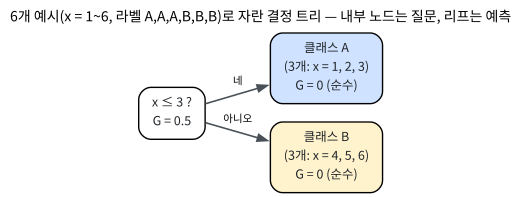
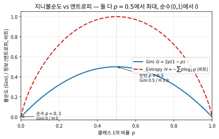
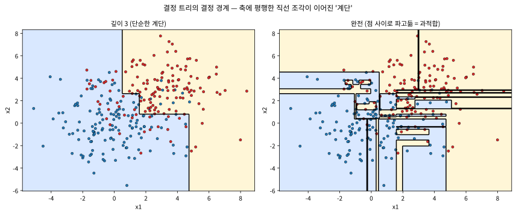
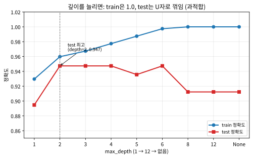

# 7.1 결정 트리: 구조, 지니불순도, 정보이득

[](https://colab.research.google.com/github/SuminHan/book-ml/blob/main/notebooks/ml1/chapter07_1_decision_tree.ipynb)

"동물인가요? 네 다리로 걷나요? 야옹 소리를 내나요?" — 스무고개(20 Questions)
게임은 예/아니오 질문을 잘 골라 20번 안에 답을 좁혀내는 게임이다. **결정
트리**(Decision Tree)는 이 게임을 **알고리즘**으로 그대로 옮긴 것이다:
"좋은 질문"을 고르는 기준(지니불순도 감소량, 정보이득)만 수학으로 정의하면,
컴퓨터가 스스로 가장 잘 좁히는 질문을 찾고, 그 질문을 나무 형태로 쌓아
분류기를 만든다. 이 절에서는 (1) 트리의 **구조**와 예측이 어떻게 이루어
지는지, (2) "잘 나누는 질문"을 재는 **지니불순도**와 **정보이득**의 정의와
"왜" 그 수식인지, (3) 손으로 두 가지 분기를 비교해 "좋은 질문"을 직접 고르는
연산, (4) 실제로 트리를 자를 때 언제 멈추느냐(과적합과 U자 곡선)까지 다룬다.
7.2절에서 이 **트리 하나**를 여러 개 합쳐 **숲**(랜덤 포레스트)[^randomforest]으로 키우고,
7.3절에서 **순차적으로** 합쳐 **GBDT**[^gbdt]로 키우는 것이므로, 이번 절의 "트리
하나를 잘 나누는 원리"가 이 장의 전부에서 재사용된다.

### 결정 트리의 구조

결정 트리는 이진나무다. 각 **내부 노드**(internal node)는 하나의 질문(예:
"\\(x\_2 > 5\\)?")이고, 각 **리프**(leaf, 잎) 노드는 **예측값**(분류에서는
클래스, 회귀에서는 숫자)이다. 예측할 때는 루트(root, 맨 위)에서 시작해
질문에 답하며 아래로 내려가, 리프에 닿으면 그 리프의 값을 답으로 내놓는다.



위의 그림은 이 절 뒤에서 "손으로" 자를 예시(특징 \\(x=[1,2,3,4,5,6]\\),
라벨 \\([A,A,A,B,B,B]\\))를 그대로 트리로 그린 것이다. 루트 노드는
"\\(x \le 3\\)?"이라는 질문을 던진다. **네**(1, 2, 3)면 왼쪽 리프에 가서
**클래스 A**를, **아니오**(4, 5, 6)면 오른쪽 리프에 가서 **클래스 B**를
예측한다. 두 리프 모두 "순수하다"(한 클래스만 포함, \\(G=0\\)) — 이 트리는
이 6개 예시를 **하나의 질문만으로** 완벽하게 분류한다.

"예측"을 구체적으로 따라가보자. 새 샘플이 들어오면: (1) 루트에서
"\\(x \le 3\\)?"을 평가한다. (2) 예/아니오에 따라 왼쪽 또는 오른쪽 자식
노드로 이동한다. (3) 그 자식도 내부 노드면 다시 질문을, 리프면 그 값을
돌려 예측을 끝낸다. 즉 예측은 **루트에서 리프까지 하나의 경로를 따라서
내려가는 것**뿐이다 — 이 경로 자체가 "왜 이렇게 예측했는가"의 설명이 된다.
대출 심사 모델에서 "이 신청자가 거절된 이유"를 물으면, "소득 < 3000만원 →
연령 > 45세 → 거절"이라는 경로를 **그대로 읽어**주면 된다. 이 "경로 = 설명"
특성이 결정 트리를 **설명가능성**(interpretability)이 높은 모델로 만들며,
이 장(7.3절의 SHAP[^shap])에서 그 대가를 다시 논한다.

**왜 질문이 "축에 평행"한가?** 결정 트리의 질문은 언제나 하나의 특징
하나만 쓴다: "\\(x\_j > t\\)?"의 형태. 여러 특징을 섞은 "\\(x\_1 + x\_2 >
5\\)?" 같은 대각선 경계는 **한 번에** 만들 수 없다. 그래서 트리의 결정
경계는 축에 평행한 직선 조각이 이어진 **계단**으로밖에 나오지 않는다 —
7.2절에서 "트리 하나는 계단, 숲은 부드러운 곡선"을 볼 때 이 계단이
재등장한다. 이 제약은 결정 트리의 강점(가독성, 스케일 불변)이면서 동시에
약점(대각선 경계에 서툴다)이다.

### 역사: 스무고개에서 CART까지

"질문을 잘 골라 답을 좁혀간다"는 아이디어는 통계학과 인공지능이 겹치는
장소에서, 1960~80년대에 여러 이름으로 태어났다.

- **1960년대, CHAID(Chid)**: 마케팅 연구에서 고객 세그먼트를 "질문으로
  쪼개는" 분할 알고리즘이 실무에 먼저 쓰였다.
- **1975년, TDIDT(Theory and Practice of Relational Learning)**:
  Chris Quinlan이 "연관 규칙/분류 문제를 예·아니오 질문의 트리로 푼다"는
  틀을 정식화했다.
- **1986년, ID3(Quinlan)**: Quinlan이 "어떤 속성(attribute)으로 나누면
  정보를 가장 많이 얻는가"를 **정보이득**( Shannon entropy 기반)으로 재서
  가장 큰 것부터 나누는 **탐욕스러운(greedy) 알고리즘**으로 결정 트리를
  자동 학습시켰다. "정보이득이 가장 큰 질문을 먼저"라는 7.1절의 규칙이
  바로 여기서 온 것이다.
- **1984년, CART(Classification and Regression Trees)**: Breiman,
  Friedman, Olshen, Stone의 고전. CART가 (1) 회귀 문제를 같은 트리 틀로
  확장하고, (2) 분기 기준을 **지니불순도**(분류)와 **제곱오차 감소**(회귀)
  라는 지금 우리가 쓰는 지표로 표준화했다. scikit-learn의
  `DecisionTreeClassifier`가 CART 계열이다.[^sklearn]

"스무고개 → CART"로 이어지는 이 흐름의 핵심은 하나다: **사람이 "잘
좁히는 질문"을 직감으로 고르는 것을, "지니불순도/엔트로피 감소량"이라는
숫자로 바꿔서 컴퓨터가 매 단계에서 가장 큰 것을 고르게 한 것.** 그 "숫자"가
이 절의 나머지 전부다.

### "가장 잘 나누는 질문"이란: 지니불순도

스무고개를 잘하는 사람은 아무 질문이나 던지지 않는다 — "생물인가요?"처럼
답이 반반으로 갈릴 만한 질문을 먼저 던져야 **정보를 가장 많이** 얻는다.
그런데 "이 질문이 정보를 많이 얻는다"를 **숫자로** 어떻게 재는가? 먼저
"노드가 얼마나 섞여 있는가"(불순도)를 재고, "나누기 전 불순도 − 나눈 뒤
불순도"가 클수록 좋은 질문이라고 정의한다. **지니불순도**(Gini Impurity)는
노드 안의 데이터가 얼마나 "섞여" 있는지를 재는 지표다. 클래스가 \\(K\\)개이고,
클래스 \\(k\\)의 비율이 \\(p\_k\\)일 때:

\\[G = 1 - \sum\_{k=1}^K p\_k^2\\]

노드 안이 한 클래스로만 순수하면(\\(p\_k=1\\), 나머지 0) \\(G=0\\) — 가장 좋은
상태다. 클래스가 반반이면(\\(K=2\\), \\(p\_1=p\_2=0.5\\)) \\(G = 1 - 0.25 -
0.25 = 0.5\\) — 이진 분류에서 가장 나쁜 상태(최댓값)다.

**왜 이 수식인가 — 두 가지 해석이 있다.**

1. **"잘못 고를 확률" 해석.** 노드에서 항목을 **무작위로 두 개** 뽑을 때,
   두 개가 **다른 클래스**일 확률이 정확히 \\(G\\)다. 클래스 1의 항목이
   \\(p\\)개 비율이면, "1번이 클래스1이고 2번이 클래스아님 + 1번이 클래스아님이고
   2번이 클래스1" = \\(2p(1-p)\\)(이진), 즉 \\(1-p^2-(1-p)^2 = 2p(1-p)\\).
   순수한 노드(\\(p=1\\))는 "다를 확률 0" → \\(G=0\\), 반반(\\(p=0.5\\))은
   "다를 확률 0.5"로 최대. 즉 **지니불순도는 "이 노드의 예측이 틀릴
   확률"이다.**
2. **"스무고개 정보" 해석.** 질문이 "이 항목이 클래스1인가?"일 때, 답이
   **반반으로 갈릴수록** 그 질문이 주는 정보가 가장 크다(앞 절의 스무고개
   직관). \\(G=2p(1-p)\\)는 정확히 \\(p=0.5\\)에서 최대가 되는 포물선이다.

두 해석이 같은 수식으로 만나는 것이 이 지표의 아름다움이다. 이진(\\(K=2\\))
에서는 \\(G = 2p(1-p)\\)로 단순해지는데, 아래 그래프가 그 모양을 보여준다.



이 그래프에서 두 가지가 보인다. **둘 다** \\(p=0.5\\)(반반)에서 최대,
\\(p=0\\) 또는 \\(p=1\\)(순수)에서 0이다 — "잘 나누는 질문"을 고르려는
목적에 둘 다 충분하다. 차이가 있는 것은 **곡선의 모양**이다. 지니불순도
\\(2p(1-p)\\)는 포물선이라 매끄럽지만, 엔트로피는 \\(p=0.5\\) 근처가 더
**완만**(평탄)하다 — 반반 근처에서는 "조금 더 순수해져도" 지니는 꽤 줄지만
엔트로피는 거의 안 줄어든다. 이 차이는 "지니와 엔트로피가 거의 같은 분기를
골라도, 가끔은 다른 분기를 골라낼 수 있다"는 FAQ의 근거가 되지만, 실무에서는
거의 항상 같은 트리를 만든다.

### 정보이득 (Information Gain)

먼저 **엔트로피**(entropy, Chapter 2.3에서 섀넌의 정보이론으로 이미 도입했다)를
정의한다:

\\[H = -\sum\_{k=1}^K p\_k \log\_2 p\_k\\]

지니불순도와 마찬가지로 순수할수록 작다(0), 섞여 있을수록 크다. 어떤 질문으로
노드를 왼쪽(\\(L\\))과 오른쪽(\\(R\\))으로 나눴을 때, **정보이득**은 "나누기
전 엔트로피 — 나눈 뒤 엔트로피(가중평균)"이다:

\\[\text{IG} = H(\text{parent}) - \left(\frac{|L|}{|L|+|R|}H(L) +
\frac{|R|}{|L|+|R|}H(R)\right)\\]

정보이득이 클수록 그 질문이 데이터를 잘 나눴다는 뜻이다. 결정 트리를 만들 때는
각 단계에서 **정보이득(또는 지니불순도 감소량)이 가장 큰 질문**을 고른다 —
이게 스무고개에서 "가장 잘 좁히는 질문을 먼저 물어라"에 해당하는 알고리즘이다.

**왜 자식 노드의 불순도를 "크기로 가중"하는가?** 위 식에서
\\(\frac{|L|}{|L|+|R|}\\)라는 가중치가 있다. 자식 중 하나가 1개 샘플,
다른 하나가 99개 샘플이라면, 1개짜리 순수 노드의 "G=0"을 무겁게 세면
불공정하다 — 99개짜리 노드가 여전히 얼마나 섞여 있는지가 더 중요하기
때문이다. 그래서 **각 자식의 불순도를 그 노드의 샘플 수 비율로 곱해
평균**한다. "가중평균"이 들어가는 이유의 전부다.

**왜 \\(\log\_2\\)인가(엔트로피).** 엔트로피의 단위는 **비트**(bit)다.
"이 항목의 클래스를 알려려면 예·아니오 질문을 **평균 몇 개** 해야 하는가"
라는 물건의 답이 바로 \\(H\\)다. 반반(\\(p=0.5\\))이면 1비트(질문 1번이면
알림), 한쪽으로 쏠려있으면(\\(p\approx1\\)) 거의 0비트(아예 안 물어봐도
알림). \\(\log\_2\\)를 쓰면 이 "비트 수" 해석이 정확히 성립한다. (다른 밑을
쓰면 단위가 니트(nat) 등으로 바뀌지만, **분기 비교의 순서**는 변하지 않는다 —
밑에 관계없이 같은 질문이 "더 좋은 질문"으로 순위가 정렬된다.)

```python
import math

def gini(labels):
    n = len(labels)
    if n == 0:
        return 0
    counts = {}
    for l in labels:
        counts[l] = counts.get(l, 0) + 1
    return 1 - sum((c / n) ** 2 for c in counts.values())

def entropy(labels):
    n = len(labels)
    if n == 0:
        return 0
    counts = {}
    for l in labels:
        counts[l] = counts.get(l, 0) + 1
    return -sum((c / n) * math.log2(c / n) for c in counts.values())

def information_gain(parent_labels, left_labels, right_labels):
    n = len(parent_labels)
    weighted_child = (len(left_labels) / n) * entropy(left_labels) + \
                      (len(right_labels) / n) * entropy(right_labels)
    return entropy(parent_labels) - weighted_child
```

`gini`는 "잘못 고를 확률" 해석(\\(1 - \sum p\_k^2\\))을, `entropy`는
"비트 수" 해석(\\(-\sum p\_k\log\_2 p\_k\\))을 그대로 구현한 것이다.
`information_gain`은 위 \\(\text{IG}\\) 식 — 부모 엔트로피에서 자식
엔트로피의 **크기 가중평균**을 뺀 값 — 을 계산한다.

### 손으로 한 번: 두 가지 분기를 비교해서 "잘 나누는 질문" 직접 골라보기

샘플 6개가 특징 \\(x=[1,2,3,4,5,6]\\)과 라벨 \\([A,A,A,B,B,B]\\)로 주어졌다고
하자. 전체(부모 노드)의 지니불순도는 \\(A, B\\)가 정확히 반반이므로:

\\[G\_{\text{parent}} = 1 - 0.5^2 - 0.5^2 = 0.5\\]

**분기 후보 1**(\\(x \le 3\\) vs \\(x>3\\)): 왼쪽은 \\([A,A,A]\\)(순수,
\\(G\_L=0\\)), 오른쪽은 \\([B,B,B]\\)(순수, \\(G\_R=0\\))로 완벽하게
갈린다. 가중평균 불순도는 \\(\frac{3}{6}\times0 + \frac{3}{6}\times0 = 0\\)이고,
정보이득(지니 감소량)은:

\\[\text{Gain} = G\_{\text{parent}} - 0 = 0.5\\]

**분기 후보 2**(\\(x \le 1\\) vs \\(x>1\\)): 왼쪽은 \\([A]\\) 1개뿐(순수,
\\(G\_L=0\\)), 오른쪽은 \\([A,A,B,B,B]\\) 5개(\\(A\\) 2개, \\(B\\) 3개
섞임, \\(G\_R = 1-0.4^2-0.6^2=0.48\\))다. 가중평균 불순도는
\\(\frac{1}{6}\times0 + \frac{5}{6}\times0.48 \approx 0.4\\)이고:

\\[\text{Gain} = 0.5 - 0.4 = 0.1\\]

같은 데이터인데 **어디서 자르느냐에 따라 정보이득이 0.5배나 차이난다**
(0.5 대 0.1) — 분기 후보 1이 훨씬 더 "좋은 질문"이라는 뜻이다. 엔트로피
기준으로 같은 비교를 해도 같은 결론이 나온다: 부모 엔트로피는
\\(H\_{\text{parent}}=1\\)(비트)이고, 분기 후보 1은 정보이득
\\(1.0\\)(완벽하게 나눔), 분기 후보 2는 정보이득 \\(\approx0.191\\)에
그친다. `best_split` 함수가 모든 가능한 threshold를 하나씩 시도해서
정보이득이 가장 큰 것을 고르는 이유가 바로 이것이다 — 나쁜 질문(후보 2)과
좋은 질문(후보 1)을 정보이득이라는 하나의 숫자로 비교할 수 있게 해준다.

이 수치를 코드로 바로 확인하자(실습 노트북 2번 셀과 동일):

```python
X = [1, 2, 3, 4, 5, 6]
y = ["A", "A", "A", "B", "B", "B"]
print("parent  Gini=%.3f  Entropy=%.3f" % (gini(y), entropy(y)))
for t in (1, 3):
    L = [y[i] for i in range(6) if X[i] <= t]
    R = [y[i] for i in range(6) if X[i] > t]
    wG = (len(L)/6)*gini(L) + (len(R)/6)*gini(R)
    wH = (len(L)/6)*entropy(L) + (len(R)/6)*entropy(R)
    print(f"t={t}: L={L} R={R}")
    print(f"      weighted Gini={wG:.3f} -> Gini gain={gini(y)-wG:.3f} | "
          f"weighted Entropy={wH:.3f} -> Ent gain={entropy(y)-wH:.3f}")
```

```
parent  Gini=0.500  Entropy=1.000
t=1: L=['A'] R=['A', 'A', 'B', 'B', 'B']
      weighted Gini=0.400 -> Gini gain=0.100 | weighted Entropy=0.809 -> Ent gain=0.191
t=3: L=['A', 'A', 'A'] R=['B', 'B', 'B']
      weighted Gini=0.000 -> Gini gain=0.500 | weighted Entropy=0.000 -> Ent gain=1.000
```

손 계산과 코드가 **정확히** 일치한다. 그리고 이 "모든 threshold를 하나씩
시도해 최대 IG를 고른다"는 탐색을 **모든 특징**에 걸쳐 반복하는 것이
실제 `DecisionTreeClassifier.fit`의 각 노드에서 일어나는 일이다. 특징이
연속값(예: 유방암의 `worst concave points`)이면, "가능한 threshold"는
인접한 두 값의 **중간**만 후보면 충분하다(인접 값 사이에서 자르는 것과
같으니까) — 그래서 \\(n\\)개 고유값이 있는 특징당 후보가 \\(n-1\\)개일
뿐이다.

### 실습: sklearn으로 실제 트리를 배우고, "읽기"

7.2절이 "숲"을 만든다면, 이번 절은 **트리 하나**를 실제로 배우고,
그가 어떤 질문을 던지는지 **읽어**본다. 유방암 진단 데이터셋(양성/악성,
30개 특징)[^breast_cancer]을 train/test 7:3으로 나누고, **깊이 3**짜리 트리를 학습시킨다:

```python
from sklearn.datasets import load_breast_cancer
from sklearn.model_selection import train_test_split
from sklearn.tree import DecisionTreeClassifier, export_text

data = load_breast_cancer()
X_train, X_test, y_train, y_test = train_test_split(
    data.data, data.target, test_size=0.3, random_state=0)

tree = DecisionTreeClassifier(max_depth=3, random_state=0).fit(X_train, y_train)
print(export_text(tree, feature_names=list(data.feature_names), max_depth=2))
print("train acc:", round(tree.score(X_train, y_train), 3))
print("test acc: ", round(tree.score(X_test, y_test), 3))
```

```
|--- worst concave points <= 0.14
|   |--- worst area <= 952.90
|   |   |--- area error <= 35.26
|   |   |   |--- class: 1
|   |   |--- area error >  35.26
|   |   |   |--- class: 1
|   |--- worst area >  952.90
|   |   |--- mean symmetry <= 0.15
|   |   |   |--- class: 1
|   |   |--- mean symmetry >  0.15
|   |   |   |--- class: 0
|--- worst concave points >  0.14
|   |--- area error <= 13.93
|   |   |--- class: 1
|   |--- area error >  13.93
|   |   |--- worst perimeter <= 79.13
|   |   |   |--- class: 1
|   |   |--- worst perimeter >  79.13
|   |   |   |--- class: 0
```
```
train acc: 0.967
test acc:  0.947
```

`export_text`가 "알고리즘이 스스로 골라낸 질문"을 그대로 보여준다. 루트가
`worst concave points`(가장 오목한 부분의 정도)를 쓰는 것 — **정보이득이
가장 큰 질문을 알고리즘이 자동으로 찾아 루트에 놓은 것**이다. 그리고 이
트리 하나는 사람이 **그대로 읽을 수 있다**: "worst concave points가 0.14
이하면(악성 쪽), worst area로 한 번 더 나누고…" — Chapter 7 서두의
"대출 거절 사유를 경로를 읽어서"라는 설명가능성이 여기 실재한다.

**예측 경로를 직접 추적해보자.** 테스트 샘플 하나를 골라, 어느 리프로
내려가는지 `decision_path`로 확인하면:

```python
X_one = X_test[:1]
path = tree.decision_path(X_one)
print("경로를 지난 노드(노드번호):", path.indices)
pred = tree.predict(X_one)
print("예측 클래스:", pred[0], "(1=악성, 0=양성)")
```

`path.indices`는 루트부터 리프까지 **지나간 노드들의 번호** 배열이다 —
이 경로가 곧 "이 환자가 악성으로 예측된 이유"다. 7.3절의 SHAP이
"수백 개의 트리"의 경로를 합성해서 설명을 만들어야 하는 것과 비교하면,
**트리 하나**의 설명은 이 `decision_path` 한 줄이면 끝난다는 점이
이번 절의 메시지다.

**특징 중요도.** `feature_importances_`는 "각 특징이 분기에 쓰일 때마다
줄인 지니불순도"를 트리 전체에 걸쳐 누적한 값이다(앞의 \\(\text{Gain}\\)
을 노드마다 합산한 것):

```python
import numpy as np
imp = tree.feature_importances_
idx = np.argsort(imp)[::-1][:3]
for i in idx:
    print(data.feature_names[i], round(imp[i], 3))
```

```
worst concave points 0.817
worst area 0.098
area error 0.054
```

"worst concave points"가 압도적으로 높다 — 이 특징이 노드를 **순수하게
나누는 데 가장 크게 기여**했다(루트 질문이 이것인 것과 일치). 다만 이
중요도는 "이 트리 전체"에 대한 설명이지 "한 환자의 예측"에 대한
설명은 아니다(7.3절의 SHAP이 그 격차를 메운다).

### 결정 경계를 눈으로: "계단"이 생기는 이유

30개 특징은 2D로 그릴 수 없으니, 2개 특징의 작은 데이터(두 덩어리,
오버랩이 좀 있는 400개 샘플)에서 **깊이 3** 트리와 **완전(깊이
제한 없음)** 트리의 결정 경계를 그리면:



두 그림이 보여줄 핵심은 **둘 다 계단**이라는 점이다. 결정 트리의
질문이 "\\(x\_j > t\\)?"(축에 평행)뿐이라, 결정 경계는 **필연적으로**
축에 평행한 직선 조각으로 이어진다 — 대각선 한 줄도 못 그린다. 왼쪽
(깊이 3)은 8개 리프로 비교적 단순한 계단을, 오른쪽(완전)은 학습 데이터를
100% 맞히기 위해 **학습 점 사이로 파고드는 복잡한 계단**을 만든다.
이 "계단으로 파고드는" 깊이가 바로 과적합이다 — 7.2절에서 랜덤 포레스트가
이 계단 100개를 **다수결**로 평균해서 "부드러운 곡선"을 만든다는 것과
정반대인 장면이다.

이 데이터(두 덩어리 중심 \\((0,0)\\),\\((3,3)\\), 오버랩 std=2.0)에서
숫자로 보면:

```
깊이 3:  train=0.846  test=0.792  (리프 8개)
완전:    train=1.000  test=0.733  (리프 59개)
```

완전 트리가 학습 데이터는 **100%** 맞히지만(깊이 3의 84.6%보다 훨씬
높은 train), 정작 새 데이터(test)에서는 **0.792에서 0.733으로 오히려
떨어진다**. "학습 데이터를 더 잘 맞히는 모델이 더 좋은 모델"이라는
직관이 여기서 처음 깨진다 — 다음 섹션의 U자 곡선이 이 현상을
깊이(d)의 함수로 본격적으로 보여준다.

### 언제 나누기를 멈추는가

트리를 끝까지 키우면 모든 리프가 완벽히 순수해질 때까지 나눈다 — 학습 데이터는
100% 맞히지만, 새 데이터에는 취약한(과적합) 트리가 된다. 실무에서는 최대
깊이(max depth), 리프의 최소 샘플 수 같은 **정지 조건**(stopping criteria)으로
트리 크기를 제한하거나, 트리를 다 키운 뒤 불필요한 가지를 잘라내는
**가지치기**(pruning)를 한다 — Chapter 6의 정규화와 같은 목적(모델을 덜
유연하게 만들어 분산을 줄인다)을 트리 구조에 맞게 적용한 것이다.

정지 조건은 대략 세 가지다. (1) `max_depth`: 트리의 높이 상한. (2)
`min_samples_leaf`: **리프에 들어갈 최소 샘플 수** — 샘플이 2개뿐인
리프는 "무엇이든 1:1로 예측하는" 노이즈 외우기이므로 금지. (3)
`min_samples_split`: **분기할 수 있는 최소 샘플 수**. 이 셋은 모두
"더는 나누지 마"라는 같은 신호의 다른 표현이며, Chapter 6의
정규화강도 \\(\lambda\\)에 대응한다 — **트리에서 "정규화"란 트리를
작게(간단하게) 유지하는 것**이다.

### 실습: 깊이를 늘리면 — U자 곡선

"언제 멈추느냐"를 **숫자로** 보자. 같은 유방암 데이터에서 `max_depth`를
1에서 12(그리고 제한 없음 `None`)까지 늘리며, 각각의 **train 정확도**와
**test 정확도**를 재면:

```python
depths = [1, 2, 3, 4, 5, 6, 8, 12, None]
train_acc, test_acc = [], []
for d in depths:
    m = DecisionTreeClassifier(max_depth=d, random_state=0).fit(X_train, y_train)
    train_acc.append(m.score(X_train, y_train))
    test_acc.append(m.score(X_test, y_test))
    print(f"max_depth={str(d):>4}: train={train_acc[-1]:.3f} test={test_acc[-1]:.3f} "
          f"leaves={m.get_n_leaves()}")
```

```
max_depth=   1: train=0.930 test=0.895 leaves=2
max_depth=   2: train=0.960 test=0.947 leaves=4
max_depth=   3: train=0.967 test=0.947 leaves=7
max_depth=   4: train=0.977 test=0.947 leaves=10
max_depth=   5: train=0.987 test=0.936 leaves=14
max_depth=   6: train=0.997 test=0.947 leaves=18
max_depth=   8: train=1.000 test=0.912 leaves=19
max_depth=  12: train=1.000 test=0.912 leaves=19
max_depth=None: train=1.000 test=0.912 leaves=19
```



이 곡선이 **편향-분산 트레이드오프**(Chapter 4.1/1.1)의 교과서적
모습이다.

- **왼쪽(깊이 1~2, "너무 얕은")**: train도 test도 낮다. 모델이 데이터의
  구조를 충분히 못 배운 **편향(bias)** 영역. 깊이 1(스텀, 2개 리프)은
  0.895로 test 최저점 근처 — "질문 1개"로는 부족하다.
- **가운데(깊이 2~6, "적당히")**: test가 **0.947**으로 정점. train은
  0.960→0.997로 서서히 오르고, test는 0.947 부근에서 **평탄하게**
  머문다. 이 "test가 더 이상 안 좋아지는" 구간이 **최적 깊이**다.
- **오른쪽(깊이 8~None, "너무 깊은")**: train은 **1.000**(학습 데이터를
  100% 외움)까지 단조로 오르는 반면, test는 **0.912로 다시 떨어진다** —
  **분산(variance)** 영역. 노이즈까지 외우느라 새 데이터에 흔들린다.

test 곡선이 **일단 올랐다가 다시 떨어지는 U자** — 이 "정점을 지나
떨어지는" 모양이 과적합의 정석이다. 최적 깊이는 **test 정확도의 정점
(depth 2~6, 0.947**)이며, depth 8 이후는 "train이 1.0이지만 test가
나빠진" **불필요한 깊이**다. 실무에서는 이 U자 곡선을 **검증셋**(또는
7.2절의 OOB)으로 그려, test가 정점을 찍는 깊이를 골라야 한다 — "train이
1.0인 가장 깊은 트리"를 고르면 U자의 **오른쪽 끝**(0.912)에 떨어져
최적(0.947)보다 3.5%p 나빠진다.

### 자주 하는 실수: `max_depth`를 제한 없이 그대로 두기

7.2절에서 다룰 유방암 진단 데이터셋으로 이 문제를 직접 확인해보자.
`DecisionTreeClassifier`를 깊이 제한 없이(`max_depth=None`) 학습시킨
것과, 깊이 3으로 제한해서 학습시킨 것을 비교하면:

```python
for depth in [None, 3]:
    tree = DecisionTreeClassifier(max_depth=depth, random_state=0).fit(X_train, y_train)
    print(f"max_depth={depth}: train={tree.score(X_train, y_train):.3f} test={tree.score(X_test, y_test):.3f}")
```

```
max_depth=None: train=1.000  test=0.912
max_depth=3:    train=0.967  test=0.947
```

깊이 제한이 없는 트리는 학습 데이터를 **완벽히**(100%) 외워버렸지만,
정작 새 데이터(test)에서는 오히려 깊이 3짜리 트리보다 **더 나쁜**
성능을 낸다(91.2% vs 94.7%). "학습 데이터를 더 정확히 맞히는 트리가 더
좋은 트리"라는 직관은 여기서 완전히 틀린다 — 이건 Chapter 4.1의
편향-분산 트레이드오프가 트리 모델에서 그대로 재현된 것이다: 깊이 제한이
없으면 분산이 극단적으로 커지고(노이즈 하나까지 다 기억하려 든다), 적당한
깊이 제한은 약간의 편향을 감수하는 대신 분산을 크게 줄여 새 데이터에
더 안정적으로 일반화한다. `max_depth`, `min_samples_leaf` 같은 정지
조건은 선택 사항이 아니라, 트리 모델을 쓸 때 항상 검증셋으로 튜닝해야
하는 필수 하이퍼파라미터로 취급해야 한다.

### 자주 하는 실수: "정보이득 > 0"이면 무조건 나누기

탐욕스러운 분기의 함정이 하나 더 있다. "IG가 양수(불순도가 줄었어)이면
나누자"는 규칙은, **리프가 너무 작아진 노드**에서 문제를 만든다. 리프에
5개 샘플만 있는데 그중 4개가 A, 1개가 B인 노드를 "그 1개 B를 떼어내자"
라고 나눈다면 IG는 양수다(0.32 → 0). 그런데 **샘플 1개짜리 리프를 만든
것**은 그 1개 샘플의 **라벨링 노이즈**를 그대로 외운 것이다. 새 데이터가
와서 그 위치의 "진짜" 클래스가 A라면 틀린다.

이 실수를 막는 것이 `min_samples_leaf`(리프 최소 샘플 수)와
`min_samples_split`(분기 최소 샘플 수)이다. 앞 절의 정지 조건과 같은
기계장치지만, 목적은 미세하게 다르다: `max_depth`는 트리의 **높이**를,
`min_samples_*`는 **리프의 크기**를 막는다. 실무에서는 `max_depth`만
걸어도 상당한 효과가 있지만, 데이터가 **클래스 불균형**(예: 99:1)이거나
**고차원**(특징이 수백 개)이면 `min_samples_leaf`까지 함께 두는 것이
안정적이다. "IG가 양수면 나눠도 된다"가 아니라, "IG가 **충분히** 양수
이고, 나눈 리프가 **충분히 크고**"일 때만 나누는 것 — 이것이 CART의
탐욕스러운 분기가 가진 현실적 한계다.

### 자주 묻는 질문

**Q. 지니불순도와 엔트로피 중 뭘 써야 하나요?** 실전에서는 거의 차이가
없다 — 둘 다 "순수할수록 작고 섞일수록 크다"는 같은 목적을 다른
수식으로 표현한 것이라, 대부분의 데이터에서 거의 같은 분기를 고른다.
지니불순도는 로그 계산이 없어 계산이 약간 더 빠르다는 실전적인 이유로
scikit-learn을 포함한 많은 라이브러리의 기본값으로 쓰인다.

**Q. 결정 트리는 특징 스케일링이 필요 없다는데 왜인가요?** kNN(Chapter
4)이나 SVM(Chapter 5)은 거리를 직접 계산하기 때문에 스케일에 민감했지만,
결정 트리는 "이 특징이 \\(t\\)보다 큰가 작은가"라는 **순서(비교)**
정보만 쓴다 — 특징을 2배로 늘리거나 단위를 바꿔도(예: 미터를
센티미터로) 각 데이터가 threshold보다 큰지 작은지의 순서 관계는 전혀
바뀌지 않는다. 그래서 정규화나 표준화 없이 원본 값을 그대로 써도 트리
분기 결과는 동일하다 — 트리 기반 모델의 실전적인 장점 중 하나다.

**Q. 연속 특징(예: `worst concave points`)도 "예/아니오 질문"으로
나누나요?** 그렇다. 결정 트리는 모든 특징을 "예/아니오"로만 본다 —
이산 특징이든 연속 특징이든, 각 분기에서 "이 특징의 값이 \\(t\\)보다
큰가?"라는 **한 값 threshold**를 골라 양분한다. 연속 특징의 경우,
인접한 두 고유값의 **중간**만 후보 threshold로 쓰면 된다(인접 값 사이
모든 위치에서 자르는 것은 같은 분기이므로). 그래서 \\(n\\)개 고유값이
있는 특징당 후보가 \\(n-1\\)개일 뿐 — 실습의 `worst concave points <=
0.14`처럼 **특정 cutoff 값**이 자동으로 골라진다. 이 "연속 값을 cutoff로
이산화"하는 동작 덕분에 스케일링이 불필요하다(FAQ 2번).

**Q. 결정 트리는 회귀에도 쓰이나요?** 쓰인다. CART는 본래 **Classification
and Regression** Trees — 분류와 회귀를 **같은** 트리 틀로 다룬다.
차이는 리프의 "예측값"과 분기 기준뿐이다. 분류는 리프가 **다수 클래스**
(또는 클래스 비율), 분기 기준이 **지니불순도/엔트로피 감소**인 반면,
회귀는 리프가 그 안 샘플 **라벨의 평균**, 분기 기준이 **제곱오차 감소**
(나누기 전 SSE − 나눈 뒤 SSE)다. 7.3절의 GBDT가 "잔차를 쫓는" 회귀
GBDT(`GradientBoostingRegressor`)를 다룰 때 이 "리프=평균, 분기= SSE
감소" 규칙이 바로 재등장한다.

**Q. "탐욕스러운(greedy)" 분기가 "최적 트리"를 보장하나요?** 보장하지
않는다. 매 단계에서 **그 순간** IG가 가장 큰 질문만 고르는 탐욕은,
**전체 트리**의 총 IG를 최대화하는 **전역 최적**을 보장하지 않는다
(다른 질문을 먼저 고르면 두 단계 뒤 더 좋은 트리가 될 수도 있다). 그런데
전역 최적을 찾는 것은 **지수 시간**(모든 트리 구조를 탐색해야 하므로)이
걸려 실무적으로 불가능하다. 그래서 CART는 "충분히 좋고, 빠르다"는
탐욕스러운 근사를 쓴다 — 이 "탐욕 근사"가 랜덤 포레스트(7.2절, 여러
탐욕 트리를 평균)와 GBDT(7.3절, 탐욕 트리를 순차 보정)로 넘어가는
동기이기도 하다.[^cs229]

### 확인 문제

**1. (개념)** 결정 트리의 결정 경계가 "축에 평행한 직선 조각이 이어진
계단"으로밖에 나올 수 없는 이유를, 질문의 형태("\\(x\_j > t\\)?" 하나만
쓴다)와 연결해 설명하라. 그리고 7.2절에서 "트리가 하나면 계단, 숲이면
부드러운 곡선"이 된다는 것과 어떻게 이어지는지 한 문장으로 덧붙이라.

**2. (계산)** 이진 분류 노드에서 클래스 1의 비율이 \\(p\\)일 때,
(1) 지니불순도 \\(G=2p(1-p)\\)가 \\(p=0.5\\)에서 최댓값 0.5를
구하는지, (2) 엔트로피 \\(H=-(p\log\_2 p+(1-p)\log\_2(1-p))\\)가
\\(p=0.9\\)에서 약 0.469비트가 되는지 각각 확인하라. (힌트:
\\(\log\_2 0.9 \approx -0.152\\).)

**3. (개념)** `max_depth=None`(제한 없음) 트리가 train 1.000 /
test 0.912를, `max_depth=3`이 train 0.967 / test 0.947을 낸다.
"train이 1.000인 트리가 더 좋은데 왜 test는 낮나?"를 편향-분산
트레이드오프(Chapter 4.1)의 언어로 설명하라.

---

## 연습문제

**1. (코딩)** 앞 실습의 `gini`, `entropy`를 이용해, `best_split`을
완성하라. 모든 특징, 모든 threshold 후보를 탐색해 **정보이득(지니
감소량)이 가장 큰** 분기를 반환한다.

```python
def best_split(X, y, feature_idx):
    # X: n x d list, y: n개 라벨, feature_idx: 분기할 특징의 인덱스
    best_threshold, best_gain = None, -1
    parent_gini = gini(y)
    for threshold in sorted(set(row[feature_idx] for row in X)):
        left_y  = [y[i] for i in range(len(X)) if X[i][feature_idx] <= threshold]
        right_y = [y[i] for i in range(len(X)) if X[i][feature_idx] > threshold]
        if not left_y or not right_y:
            continue
        # ADD ADDITIONAL CODE HERE!!
        # 가중평균 지니불순도를 구하고, gain = parent_gini - 가중평균
        # gain이 best_gain보다 크면 best_threshold, best_gain 갱신
    return best_threshold, best_gain

X = [[2.0],[3.0],[4.0],[7.0],[8.0],[9.0]]
y = ["A","A","A","B","B","B"]
print(best_split(X, y, 0))   # (4.0, 0.5) -- x<=4 로 완벽하게 나뉨
```

**2. (코딩)** 앞 실습의 U자 곡선을, 이번엔 **회귀** 버전으로 다시
그려보라. 1차원 신호 \\(y = \sin(1.5 x) + \text{잡음}\\)(\\(x\in[0,
10]\\), 학습 200개/검증 100개)에 `DecisionTreeRegressor`의
`max_depth`를 1→20까지 늘리며 train/valid **MSE**를 추적하고,
**valid MSE가 최저인 깊이**를 찾아 프린트하라. (힌트: 회귀 트리의
"정보이득"은 제곱오차 감소 — sklearn의 `criterion='squared_error'`가
그것이다.) U자가 분류보다 더 빨리 "오른쪽 끝"(과적합)에 도달하는지
눈으로 비교하라.

**3. (개념 서술)** "탐욕스러운 분기"는 **전역 최적 트리**를 보장하지
않는다고 배웠다. (1) "그 순간 IG가 가장 큰" 질문을 고르는 것이 왜
"전체 트리의 총 IG 최대"를 보장하지 못하는지 한 가지 반례를
나열하고, (2) 그럼에도 CART가 탐욕스러운 근사를 쓰는 **실무적
이유**(계산 복잡도)를 설명하라.

**4. (손유도, Tier A — 자유 유도)** 8개 샘플이 있다: 클래스
`[A,A,A,A,B,B,B,B]`, 특징 \\(x=[1,2,3,4,5,6,7,8]\\).

(1) 전체(8개)의 지니불순도를 손으로 계산하라.
(2) \\(x\le 4\\) 분기(좌: `[A,A,A,A]`, 우: `[B,B,B,B]`)의
정보이득(지니 감소량)을 계산하라.
(3) \\(x\le 2\\) 분기(좌: `[A,A]`, 우: `[A,A,B,B,B,B]`)의
정보이득을 계산하라.
(4) 어느 쪽이 더 좋은 분기인지, 이유와 함께 답하라.

**5. (손유도, Tier C — 폴백 준비 대상)** 이진 노드가 클래스 비율
\\(p:1-p\\)(\\(p=0.1\\))라고 할 때, 아래 빈칸을 채워 "잘못 고를
확률" 해석과 "비트 수" 해석이 각각 같은 \\(G\\)와 \\(H\\)를 주는지
확인하라:

```
p = 0.1

지니불순도(잘못 고를 확률): G = 1 - p^2 - (1-p)^2 = 1 - __^2 - __^2 = ______
엔트로피(비트 수):           H = -[p log2 p + (1-p) log2(1-p)]
                           = -[0.1 * log2(0.1) + 0.9 * log2(0.9)]
                           = -[0.1 * ____ + 0.9 * ____] = ______
(힌트: log2(0.1) ≈ -3.322,  log2(0.9) ≈ -0.152)
```

(정답을 미리 말해주지 않지만, 문제 2의 `p=0.9` 케이스와 **대칭**이므로
같은 수치가 나와야 한다.)

[^gbdt]: Friedman, J. (2001). "Greedy Function Approximation: A Gradient Boosting Machine." Annals of Statistics 29(5), 1189–1232. — 그래디언트 부스팅(GBDT)의 원 논문.
[^cs229]: 더 깊이 보려면: Stanford CS229: Machine Learning, Lecture Notes. https://cs229.stanford.edu/main_notes.pdf — 이 절의 결정 트리(지니불순도, 정보이득, 탐욕스러운 분기, 가지치기)는 CS229 강의 노트의 Decision Trees 단원과 겹친다.
[^shap]: Lundberg, S. M., Lee, S.-I. (2017). "A Unified Approach to Interpreting Model Predictions." NeurIPS (NIPS) 2017. arXiv:1705.07874. — SHAP(Shapley Additive exPlanations)의 원 논문.
[^sklearn]: Pedregosa, F. et al. (2011). "Scikit-learn: Machine Learning in Python." Journal of Machine Learning Research 12(2011) 2825–2830. arXiv:1201.0490. — 이 장 실습에서 쓰는 `DecisionTreeClassifier`, `export_text`, `load_breast_cancer` 등 트리 관련 API를 제공하는 scikit-learn 라이브러리의 원 논문.
[^randomforest]: Breiman, L. (2001). "Random Forests." *Machine Learning* 45(1), 5–32. — 랜덤 포레스트의 원 논문. 배깅 + 특징 무작위화(각 분기에서 무작위 특징 하위집합)의 조합을 제안했다.
[^breast_cancer]: scikit-learn `load_breast_cancer` 데이터셋 — 위스콘신 진단 유방암(Wisconsin Diagnostic Breast Cancer, WDBC)의 고전 데이터로, 유방 종양 세포 핵의 30개 수치 특징과 양성/악성 이분 라벨 569개.

