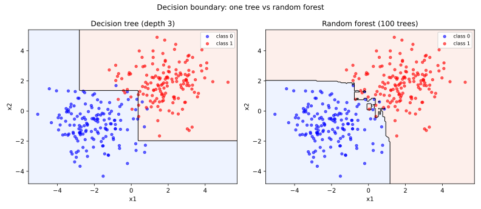
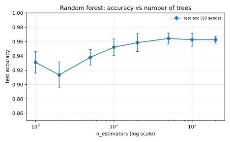
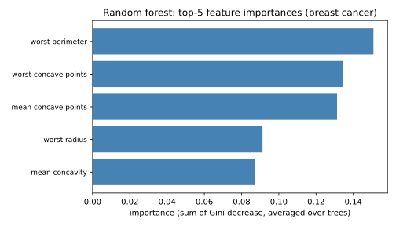

# 7.2 트리 하나에서 숲으로: 랜덤 포레스트

[](https://colab.research.google.com/github/SuminHan/book-ml/blob/main/notebooks/ml1/chapter07_2_random_forest.ipynb)

### 트리 하나에서 숲으로

트리 하나는 데이터를 완벽하게 외워버리기(과적합) 쉽다. **랜덤 포레스트**(Random
Forest)[^cs229]의 아이디어는 단순하다: 서로 조금씩 다른 트리를 여러 개 만들고, 그
트리들의 다수결로 예측한다. 두 가지 무작위성을 더한다:

1. **배깅**(Bootstrap Aggregating): 각 트리는 원본 데이터에서 복원추출(중복
   허용)로 같은 크기의 데이터셋을 뽑아 학습한다 — 트리마다 조금씩 다른 데이터를
   본다.
2. **특징 무작위화**: 각 분기(split)에서 전체 특징이 아니라, 무작위로 고른
   일부 특징 중에서만 최선의 질문을 찾는다.

이 두 무작위성이 트리들을 서로 덜 닮게 만들고, 그래야 다수결(또는 평균)을 냈을
때 개별 트리의 과적합 성향이 서로 상쇄된다 — "완전히 같은 실수를 하는 전문가
100명"보다 "서로 다른 실수를 하는 전문가 100명"의 평균이 훨씬 안정적인 것과
같은 원리다.

### 역사: "군중의 지혜"에서 배깅으로

이 "여러 전문가의 평균이 더 안정적"이라는 직관은 알고리즘이 아니라, 오래된
관찰에서 왔다. 1889년, 영국 통계학자 프랜시스 골튼(Francis Galton)은 한 시골
박람회의 "시상 소" 체중 맞추기 이벤트 결과를 조사했다. 787명이 쓴 체중
추정치의 **평균**(1,251파운드)은 실제 체중(1,198파운드)과 불과 1% 이내였으며,
개별 추정치 중 거의 어느 것보다 정확했다. "많은 사람 각각은 틀리지만 그 평균은
놀라울 만큼 정확하다"는 이 관찰은 **군중의 지혜**(wisdom of crowds)로 불린다 —
랜덤 포레스트의 직관 그 자체다. 골튼의 "평균이 개인을 이긴다"는 발견은, 개별
트리의 흔들림(분산)을 다수결로 없애겠다는 배깅의 목표와 정확히 같은 말이다.

골튼이 발견한 원리는 약 100년 뒤, 통계학에서 **부트스트랩**(bootstrap)이라는
이름의 도구로 돌아왔다. "데이터에서 복원추출로 원본과 같은 크기의 샘플을 계속
뽑으면, 그 샘플들의 통계량 분포가 진짜 분포를 근사한다"는 아이디어로(에프론
& 팀시라이니, 1993)[^efron1993], 모델의 불확실성을 "무작위로 데이터를 다시 뽑아 다시
학습시키는 횟수"로 직접 재는 방법이다. 랜덤 포레스트는 이 부트스트랩을
**트리의 학습 데이터**에 그대로 적용한 것이다 — 각 트리가 "다르게 보게 만드는"
것, 즉 배깅(bagging)[^bagging]이다.

마지막 퍼즐 조각, **특징 무작위화**는 2001년 레오 브레이만(Leo Breiman)의
"Random Forests" 논문[^breiman2001]에서 완성됐다. 그는 배깅만으로는(특히 어떤 특징이 유난히
강한 데이터에서) 트리들이 너무 닮는다는 문제를, "각 분기에서 특징의 무작위
하위 집합만 고려하자"는 두 번째 무작위성으로 풀었다. 이 두 가지의
조합(부트스트랩 + 특징 무작위화)이 바로 우리가 쓰는 랜덤 포레스트다.

### 실습: sklearn으로 결정 트리 시각화하기[^scikitlearn]

트리가 실제로 "어떤 질문들을 순서대로 던지는지" 눈으로 확인해보자 —
유방암 진단 데이터셋(양성/악성)[^breast_cancer]에 깊이 3짜리 트리를 학습시킨다:

```python
from sklearn.datasets import load_breast_cancer
from sklearn.model_selection import train_test_split
from sklearn.tree import DecisionTreeClassifier, export_text

data = load_breast_cancer()
X_train, X_test, y_train, y_test = train_test_split(
    data.data, data.target, test_size=0.3, random_state=0)

tree = DecisionTreeClassifier(max_depth=3, random_state=0).fit(X_train, y_train)
print(export_text(tree, feature_names=list(data.feature_names), max_depth=2))
print("트리 정확도:", round(tree.score(X_test, y_test), 3))
```

실행해보면 루트 노드가 `worst concave points`(가장 오목한 부분의 정도)로
먼저 나누는 것을 볼 수 있다 — 정보이득이 가장 큰 질문을 알고리즘이
스스로 찾아낸 것이다. 은행 대출 심사 예시에서처럼, 이 트리 하나는
"왜 이렇게 예측했는가"를 사람이 그대로 읽을 수 있다.

### 손으로 한 번: "여러 전문가의 평균"이 실제로 더 안정적인지 확인하기

7.2절 서두의 주장 — "서로 다른 실수를 하는 전문가 여러 명의 평균이 더
안정적이다" — 을 숫자로 검증해보자. 같은 유방암 데이터셋의 학습 데이터에서
**부트스트랩 샘플**(복원추출로 뽑은, 원본과 같은 크기의 데이터셋) 5개를
만들고, 각각으로 트리를 하나씩 독립적으로 학습시켜 test 정확도를 재보면
(트리에는 깊이 제한을 두지 않는다 — 7.1절에서 본 대로 이렇게 키워야
"개별 트리가 얼마나 흔들리는지"가 선명하게 보인다. 아래 실습 노트북의
2번 셀과 동일하다):

```
tree 0: test acc = 0.871
tree 1: test acc = 0.918
tree 2: test acc = 0.895
tree 3: test acc = 0.889
tree 4: test acc = 0.883
```

트리 5개의 정확도는 87.1%에서 91.8%까지 제법 흩어져 있다(평균
89.1%, 표준편차 1.55%p) — 어떤 부트스트랩 샘플을 뽑았느냐에 따라 결과가
꽤 요동친다는 뜻이다. 이제 이 트리 100개를 배깅(각자 다른 부트스트랩
샘플로 학습)해서 다수결로 합친 랜덤 포레스트를 만들면:

```
random forest (100 trees): 0.959
```

**95.9%** — 개별 트리 5개의 최댓값(91.8%)보다도 높다. 게다가 랜덤
포레스트 자체를 서로 다른 무작위 시드 5번으로 다시 학습시켜봐도
정확도가 95.9%~97.7% 사이(표준편차 0.68%p)로, 개별 트리들의 표준편차
(1.55%p)보다 훨씬 좁은 범위 안에 안정적으로 모인다. 이 두 가지
숫자(정확도 상승 + 표준편차 감소)가 정확히 이 절 서두에서 말한 "서로
다른 실수를 하는 전문가들의 평균이 더 안정적이다"를 실측으로 보여주는
증거다.

### 왜? — 두 가지 무작위성이 "분산"을 줄이는 이유

위 실측이 "무엇이" 일어나는지를 보여줬다면, 이제 "왜" 일어나는지를
수학으로 보자. Chapter 1.1에서 배운 편향-분산 분해를 떠올리자. 예측
오차는 "모델이 본질적으로 못 맞히는 부분(편향)"과 "데이터가 조금만
바뀌어도 예측이 흔들리는 부분(분산)"으로 나뉘고, 깊이 제한이 없는 결정
트리는 **분산이 매우 크다**(7.1절에서 `max_depth=None` 트리가 test에서
91.2%로, 오히려 깊이 3짜리 94.7%보다 나빴던 이유가 그것이다).

같은 설계의 트리를 \\(T\\)개 만들고 각각을 다른 부트스트랩 샘플로 학습시키자.
각 트리의 test 예측 오차의 표준편차를 \\(\sigma\\), 두 트리 간 상관계수를
\\(\rho\\)라 하면, **\\(T\\)개의 평균(다수결로 합친 앙상블)** 오차의 분산은:

\\[\text{Var}[\text{앙상블}] = \frac{\sigma^2}{T}\\,\big(1 + \rho\\,(T-1)\big)\\]

(이건 "개별 예측의 평균"의 분산에 대한 표준 공식이다: \\(T\\)개의 분산
\\(T\sigma^2\\)에 \\(T(T-1)\\)개의 공분산 \\(\rho\sigma^2\\)을 더해 \\(T^2\\)로 나누면
된다.) 이 공식을 두 극한으로 펼쳐 보면:

- \\(T\\)개를 **완전히 독립**(\\(\rho=0\\))으로 합치면 분산이 \\(\sigma^2/T\\) —
  표준편차는 \\(\sigma/\sqrt{T}\\)로 줄어든다.
- 모든 트리가 **완전히 같으면**(\\(\rho=1\\)) 분산은 \\(\sigma^2\\) 그대로 —
  평균을 내도 아무 효과가 없다. "완전히 같은 실수를 하는 전문가 100명"은
  전문가 1명과 같다.
- 현실은 둘 사이다(\\(0<\rho<1\\)). **무작위성이 클수록** 트리들이 서로
  달라져 \\(\rho\\)가 작아지고, 그 결과 \\(\sigma/\sqrt{T}\\)에 가까워진다.

**손으로 계산해보자.** 앞에서 잰 개별 트리의 표준편차는
\\(\sigma \approx 1.55\\%\text{p}\\)였다. 이 트리들이 독립(\\(\rho=0\\))이라면
100개의 평균은 표준편차 \\(\frac{1.55}{\sqrt{100}} = 0.155\\%\text{p}\\)까지
흔들림이 줄어야 한다. 실제로는 앞 실측에서 랜덤 포레스트를 5번 다른
시드로 다시 만들어도 정확도가 95.9%~97.7%(표준편차 0.68%p)로 모였다 —
"완전히 독립(0.155%p)은 아니지만, 개별 트리(1.55%p)보다 훨씬
안정"하다는 그림이다. 이 0.68%p를 위 공식에 대입하면
\\(\rho \approx 0.2\\) 수준, 즉 트리들은 완전히 독립은 아니지만(같은
강한 특징을 다 본다) 상관이 낮은 쪽에 있다. 두 가지 무작위성(배깅,
특징 무작위화)의 역할은 정확히 이 \\(\rho\\)를 줄이는 것이며, \\(\rho\\)가
1에 가깝지 않다는 것이 "앙상블이 단일 트리보다 좋은 이유"의 전부다.

### 결정 경계를 눈으로: "계단"에서 "곡선"으로

유방암 데이터는 30개 특징이라 2D로 그릴 수 없으니, 2개 특징짜리 작은
데이터(두 덩어리, 300개 샘플)를 만들어 단일 트리와 랜덤 포레스트의
**결정 경계**를 그리면:



왼쪽(트리 하나, 깊이 3)의 경계는 **축에 평행한 직선 조각이 이어진
계단형**이다 — 결정 트리는 언제나 "\\(x\_1 > t\\)?" 같은 축에 평행한 질문만
하므로, 그 경계는 필연적으로 계단으로밖에 나올 수 없다. 오른쪽(랜덤
포레스트, 100개)은 100개 트리의 **다수결**을 취하므로, 각 트리의 계단
모양이 조금씩 달라 그 평균은 훨씬 부드러운 곡선에 가까워진다.

이 "부드러짐"이 바로 앞 절에서 쓴 분산 감소의 시각화다. 단일 트리의
날카로운 계단은 학습 데이터의 잡음에도 쉽게 모양이 변하지만(높은
분산), 100개 계단의 평균은 잡음이 서로 상쇄되어 안정적이다. 데이터가
2D인 덕분에 "트리가 하나일 때 계단, 숲이 될 때 곡선"이라는 앙상블의
본질을 눈으로 직접 볼 수 있다.

### 검증 세트 없이도 일반화 성능을 가질 수 있다: OOB(out-of-bag)

각 트리는 **복원추출**된 부트스트랩 샘플로 학습하는데, 복원추출은
원본 샘플 중 약 37%를 자동으로 "한 번도 안 고른다". 그 트리는 이 37%를
**보지 못한**(out-of-bag, bag 밖의)[^oob] 샘플이다. 이 트리들이 "그 트리가
보지 못한" 샘플을 예측하게 하면, 학습을 마치자마자 **새 데이터에 대한
예측**을 할 수 있다 — 별도 검증 세트를 떼어놓을 필요가 없다.

```python
rf = RandomForestClassifier(n_estimators=100, oob_score=True, random_state=0)
rf.fit(X_train, y_train)
print("OOB score:", round(rf.oob_score_, 3))
print("test score:", round(rf.score(X_test, y_test), 3))
```

```
OOB score: 0.955
test score: 0.959
```

OOB 점수(0.955)가 진짜 test(0.959)와 거의 붙는 것을 볼 수 있다. 실무적으로
중요한 점: **데이터가 적어 검증 세트를 따로 떼기 아까울 때**에도
"이 모델이 과적합이 아닌가"를 학습 중 즉시 확인할 수 있다. (주의할
점: `oob_score_`는 `oob_score=True`로 학습했을 때만 생기며, `oob_score()`
라는 메서드가 아니다 — 실습 노트북 5번 셀 참고.)

### 트리 개수를 늘리면: 정확도는 오르고 흔들림은 줄어든다

아래 "자주 하는 실수" 섹션과 연결해, `n_estimators`를 적게 쓰지 말아야
하는 이유를 곡선으로 보자. `n_estimators`를 1→200까지 늘리며, 각각 10개
무작위 시드로 평균한 test 정확도와 표준편차를 측정하면:



세 가지가 보인다:

1. 정확도는 트리를 1→10개 정도로 빠르게 올랐다가, 그 뒤로 거의
   **수평**(수확체감).
2. 표준편차(오차막대)는 트리가 늘어날수록 **줄어든다** — "전문가"가
   많을수록 소수 의견에 흔들리지 않기 때문.
3. 여기서 정확도가 **떨어지는 지점이 없다** — 트리를 더 늘려도 과적합이
   오지 않는다(아래 GBDT[^friedman2001] 비교 참조). 그래서 실전에서는 검증 성능이
   "정체"되는 지점보다 여유를 두어(예: 100~300) 쓰는 편이 안전하다.

### 숲 전체가 어떤 특징을 보는가

단일 트리의 `feature_importances_`가 "그 트리가" 어떤 특징을 많이 봤는지
말해준다면, 100개 트리의 그것들은 "숲 전체가" 어떤 특징을 많이 봤는지
말한다 — 각 트리가 분기마다 줄인 지니불순도(7.1절)를 특징별로 누적해
100개 트리에 걸쳐 평균한 값이다.



유방암 데이터에서는 `worst perimeter`(0.151), `worst concave points`
(0.135), `mean concave points`(0.131) 순으로 중요하다. "worst(최악)"
특징들이 상위권을 점한 것은, 실제 진단에서 "가장 나쁜 상태를 나타내는"
특징이 가장 결정적이었음을 뜻한다. (단, 이 중요도는 **상관관계에 편향**될
수 있다 — 7.3절의 SHAP[^shap]이 이 한계를 보완하는 "예측 단위" 설명이다.)

### 특징 무작위화의 효과: "강한 특징"이 루트를 독점하는가

자주 묻는 질문 1번의 주장 — "강한 특징이 있으면 배깅만 쓴 트리들이
모두 그 특징으로 루트를 나눠서 닮아간다" — 을 숫자로 확인하자. 배깅만
하는 `BaggingClassifier`(특징 무작위화 없음)와 랜덤 포레스트(특징
무작위화 있음)를 50개 트리로 만들고, **각 트리가 루트에서 어떤 특징을
쓰는지** 세면:

```python
dom = list(data.feature_names).index("worst concave points")
bag = BaggingClassifier(
    estimator=DecisionTreeClassifier(max_depth=6, random_state=0),
    n_estimators=50, random_state=0).fit(X_train, y_train)
rf = RandomForestClassifier(n_estimators=50, max_depth=6, random_state=0).fit(X_train, y_train)

root_frac = lambda clf: np.mean([t.tree_.feature[0] == dom for t in clf.estimators_])
print("bagging-only:  ", round(root_frac(bag), 2))
print("random forest: ", round(root_frac(rf), 2))
```

```
bagging-only:   0.40
random forest:  0.20
```

배깅만 쓴 앙상블에서는 50개 트리의 40%가 루트에서 `worst concave
points`를 썼지만, 특징 무작위화를 더한 랜덤 포레스트는 20%로 **절반**
이다. 이유: 랜덤 포레스트는 각 분기에서 전체 30개 특징 중 무작위로 고른
일부(기본값 `max_features=sqrt(30)≈5`)만 후보로 보므로, 그 강한 특징이
"이번엔 후보에 안 들어간" 경우가 생겨 루트에서 덜 자주 쓰인다. 그
결과 트리는 서로 **다른 질문**을 탐색하게 되고, 바로 이것이 앞에서 쓴
상관계수 \\(\rho\\)를 낮추어 분산 감소를 더 크게 만든다.

### 자주 하는 실수: 트리 개수(`n_estimators`)를 너무 적게 잡기

배깅의 효과는 트리 개수가 늘어날수록 (수확체감이 있긴 하지만) 꾸준히
안정된다. 만약 `n_estimators=3`처럼 트리를 너무 적게 쓰면, 위에서 본
"개별 트리 5개의 흩어짐"과 크게 다르지 않은 불안정한 결과를 얻을 수
있다 — 다수결에 참여하는 "전문가"가 너무 적으면 소수 의견에 결과가
쉽게 흔들리기 때문이다. 실전에서는 `n_estimators=100`이나 그 이상을
기본으로 시작하고, 검증 성능이 트리 개수를 늘려도 더 이상 좋아지지
않는 지점("정체 구간")을 확인하는 것이 좋다 — 트리를 더 추가하는 것은
(GBDT와 달리) 과적합을 일으키지 않으므로, "너무 많이" 쓰는 것에 대한
걱정은 GBDT의 `n_estimators`보다 훨씬 덜해도 된다(다만 학습·예측 속도는
느려진다).

### 자주 묻는 질문

**Q. 배깅과 특징 무작위화 둘 다 꼭 필요한가요?** 배깅만 써도(특징
무작위화 없이) 어느 정도 다양성은 생기지만, 만약 어떤 특징 하나가
유난히 강력하다면(예: `worst concave points`) 부트스트랩 샘플이
달라져도 거의 모든 트리가 그 특징으로 루트를 나눌 것이다 — 트리들이
서로 너무 닮아버려서 배깅의 효과가 줄어든다. 특징 무작위화까지 더하면
어떤 트리는 그 강력한 특징을 아예 후보에서 보지 못하게 되어(무작위로
제외됨), 트리들이 서로 더 다른 질문을 탐색하게 되고 앙상블의 다양성이
커진다. (앞의 "특징 무작위화의 효과" 섹션에서 이 40%→20%를 실측했다.)

**Q. `max_features`를 어떻게 골라야 하나?** 분류(classification)의
기본값은 `sqrt(n_features)`, 회귀(regression)의 기본값은
`n_features/3`이다. 특징이 많을수록(예: 1000개) `sqrt`가 31개로, 각
분기에서 더 적은 특징만 보고 더 큰 다양성을 만든다. 기본값은 "출발점"
일 뿐, 검증셋으로 `sqrt`, `log2`, `1.0`(전체) 등을 비교해보는 것이
좋다. 특징이 서로 독립적이라면 더 많은 특징을 보게(값을 크게) 하고,
특징이 서로 상관관계가 강하다면 덜 보게 해서 다양성을 더 늘리는 쪽이
유리하다.

**Q. 랜덤 포레스트의 예측 확률(`predict_proba`)은 어떻게 나오나요?**
각 트리가 내는 클래스 확률의 **평균**이다. 다수결(`predict`)은 "어느
클래스를 더 많이 말았는가"를 세지만, `predict_proba`는 "각 클래스
확률의 평균"을 내어 부드러운 확률 값을 준다. 이 부드러운 확률 덕분에
OOB 점수를 계산하고, 임계값을 튜닝할 때(Chapter 2.3) 쓰일 수 있다.

**Q. 단일 트리처럼 "이 예측이 왜 이렇게 나왔는가"를 사람이 읽을 수
있나요?** 아니요 — 바로 그것이 이번 장의 출발점에서 다룬
'설명가능성' 문제다. 단일 트리는 루트에서 리프까지의 질문을 읽으면 되지만,
100개 트리는 개별 예측 하나에 어떤 트리의 어떤 특징이 기여했는지 사람의
눈으로 따지기 어렵다. 7.3절의 SHAP이 정확히 이 문제를(앙상블 예측 하나를
각 특징의 기여로 정확히 분해하는 문제) 푼다.

**Q. 랜덤 포레스트도 `feature_importances_`를 볼 수 있나요?** 그렇다 —
7.3절에서 GBDT의 `feature_importances_`를 다루는데, 랜덤 포레스트도
같은 방식(각 트리에서 그 특징이 분기에 쓰일 때마다 줄어든 지니불순도를
전체 트리에 걸쳐 누적)으로 계산된다. 다만 랜덤 포레스트는 트리들이
서로 독립적으로 학습되는 반면 GBDT는 이전 트리의 잔차를 좇으며
순차적으로 학습되기 때문에, 같은 데이터에서도 두 모델이 "가장 중요한
특징"으로 다른 순위를 내놓을 수 있다.

### 확인 문제

**1. (개념)** 두 가지 무작위성(배깅, 특징 무작위화) 각각이 "트리들이
서로 닮지 않게" 만드는 방식을 한 문장씩으로 구분해서 설명하라.
(힌트: 하나는 *데이터*를, 다른 하나는 *각 분기에서 고려하는 특징*을
무작위화한다.)

**2. (계산)** 개별 트리의 test 정확도 표준편차가
\\(\sigma = 2\\%\text{p}\\)인 앙상블에서, 25개의 트리가 **독립**(\\(\rho=0\\))
이라면 앙상블 예측의 표준편차는 얼마인가? 만약 두 트리 간 상관계수가
\\(\rho=0.25\\)라면? (힌트:
\\(\text{Var}[\text{앙상블}]=\frac{\sigma^2}{T}\\,(1+\rho\\,(T-1))\\)을
쓰라. \\(T=25\\).)

**3. (개념)** OOB 점수가 0.90인데 test 정확도가 0.83이라면, 어떤
문제를 의심할 수 있는가, 그 이유를 설명하라.

[^cs229]: 더 깊이 보려면: Stanford CS229: Machine Learning, Lecture Notes. https://cs229.stanford.edu/main_notes.pdf — 이 절의 배깅(bootstrap aggregating)과 앙상블의 편향-분산 효과는 CS229 강의 노트의 "Ensembles" 장과 겹친다.
[^shap]: Lundberg, S. M., Lee, S.-I. (2017). "A Unified Approach to Interpreting Model Predictions." NeurIPS 2017. arXiv:1705.07874. — SHAP(Shapley Additive exPlanations)의 원 논문. Shapley 가치(게임론)를 기계학습 예측 해명에 적용해 "각 특징이 예측값에 얼마를 기여했는지"를 유일하게 공정한 분해로 정의한다.
[^bagging]: Bühlmann, P., Hüsler, J. (1997). "Bagging Predictors." *The Annals of Statistics* 25(1), 47–68. — 배깅(bootstrap aggregating)의 원 논문.
[^breiman2001]: Breiman, L. (2001). "Random Forests." *Machine Learning* 45(1), 5–32. — 랜덤 포레스트의 원 논문. 배깅 + 특징 무작위화(각 분기에서 무작위 특징 하위집합)의 조합을 제안했다.
[^scikitlearn]: Pedregosa, F. et al. (2012). "Scikit-learn: Machine Learning in Python." arXiv:1201.0490.
[^friedman2001]: Friedman, J. H. (2001). "Greedy Function Approximation: A Gradient Boosting Machine." *The Annals of Statistics* 29(5), 1189–1232. — GBDT(그라디언트 부스팅)의 원 논문. 이전 모델의 그라디언트(잔차)를 좇아 트리를 순차적으로 학습하는, 배깅 계열(랜덤 포레스트)과 다른 앙상블 방법이다.
[^efron1993]: Efron, B., Tibshirani, R. (1993). *An Introduction to the Bootstrap*. CRC Press. — 부트스트랩(bootstrap) 기법의 원서.
[^breast_cancer]: scikit-learn `load_breast_cancer` 데이터셋 — 위스콘신 진단 유방암(Wisconsin Diagnostic Breast Cancer, WDBC)의 고전 데이터로, 유방 종양 세포 핵의 30개 수치 특징과 양성/악성 이분 라벨 569개.
[^oob]: OOB(out-of-bag) 검증은 랜덤 포레스트 원 논문(Breiman 2001, 위 [^breiman2001])에서 제시된 기법이다 — 각 부트스트랩 샘플에 포함되지 않은 약 37%의 샘플로 해당 트리의 일반화 성능을 학습 중 평가하는 방법이다.
