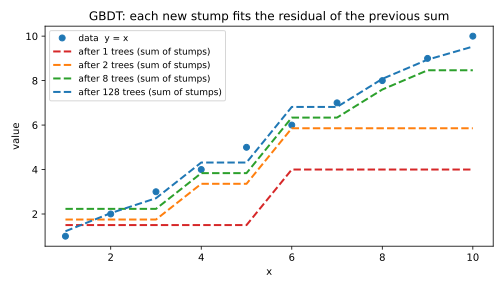
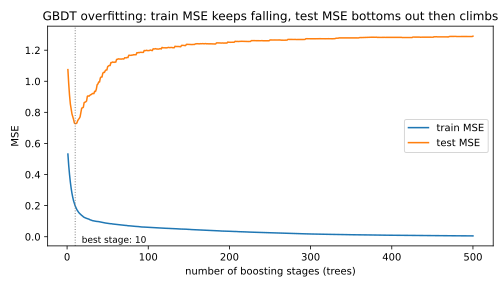
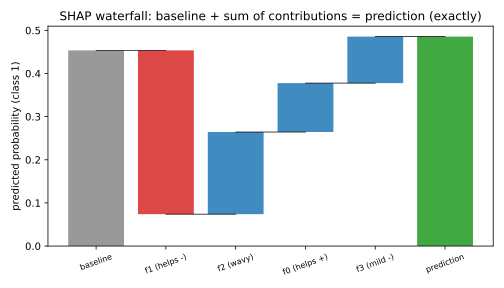
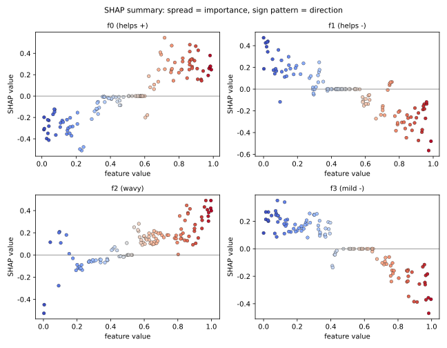

# 7.3 GBDT와 SHAP

[](https://colab.research.google.com/github/SuminHan/book-ml/blob/main/notebooks/ml1/chapter07_3_gbdt_shap.ipynb)

7.2절의 랜덤 포레스트[^randomforest]가 "서로 독립적인 전문가 100명의 다수결"이었다면,
**GBDT**[^friedman2001]는 전혀 다른 조직 방식의 전문가 그룹이다: **선임이 실수를 남기면
다음 직원이 바로 그 실수를 고치는** 순환 근무다. 이 절에서는 그 방식을
정의하고, 7.2절 실습과 같은 데이터에서 정확도 비교를 해보고, GBDT가
"더 강한 대신" 치르는 가격(과적합 취약성, early stopping)을 곡선으로
본다. 후반부에서는 GBDT 같은 "수백 개의 트리가 얽힌 블랙박스"의 예측
하나를 "각 특징이 얼마를 기여했는가"로 정확히 분해하는 도구, **SHAP**[^shap]을
게임이론의 섀플리값(Shapley value)에서부터 실전 구현까지 다룬다.

### 트리를 더 강하게: GBDT

랜덤 포레스트는 트리 여러 개를 **독립적으로** 만들고 다수결로 합쳤다.
**GBDT**(Gradient Boosted Decision Trees)는 다른 전략을 쓴다: 트리를
하나씩 **순차적으로** 추가하는데, 매번 새로운 트리는 "지금까지의 예측이 아직
못 맞힌 부분(잔차, residual)"을 목표로 학습한다.

목표: \\(T\\)개의 트리 \\(f\_1, \ldots, f\_T\\)를 순차적으로 더해서 예측
\\(F\_T(x) = \sum\_{t=1}^T f\_t(x)\\)를 만든다. \\(t\\)번째 트리를 학습할 때는,
지금까지 쌓은 예측 \\(F\_{t-1}(x)\\)의 **잔차** \\(r^{(i)} = y^{(i)} -
F\_{t-1}(x^{(i)})\\)를 새로운 목표값으로 삼아, 그 잔차를 예측하는 트리를
학습한다:

```python
def gbdt_fit(X, y, n_trees, learning_rate):
    trees = []
    predictions = [0.0] * len(y)  # F_0(x) = 0
    for t in range(n_trees):
        residuals = [y[i] - predictions[i] for i in range(len(y))]
        tree = fit_single_tree(X, residuals)  # 잔차를 목표로 트리 하나 학습
        trees.append(tree)
        for i in range(len(y)):
            predictions[i] += learning_rate * tree.predict(X[i])
    return trees
```

`learning_rate`(축소율, shrinkage)는 각 트리의 기여를 일부러 줄여서, 한 트리가
과적합하는 것을 막고 여러 트리가 조금씩 나눠서 학습하게 한다 — Chapter 2의
경사하강법 학습률과 비슷한 역할이다. 실제로 "잔차를 향해 조금씩 이동한다"는 이
과정은 함수 공간에서의 경사하강법으로 볼 수 있다(그래서 이름이 **gradient**
boosting). XGBoost[^xgboost], LightGBM[^lightgbm]은 이 아이디어를 실무에서 쓸 수 있도록 극도로
최적화한 라이브러리이며, 지금도 정형(tabular) 데이터 대회(Kaggle 등)에서 가장
자주 우승하는 축에 속한다.

(실무 라이브러리들의 스텝 단위는 보통 "깊이 3~6짜리 작은 트리"인데, 아래
1차원 실습처럼 스템(깊이 1)을 쓰기도 한다. 핵심은 "각 스텝이 잔차를 목표로
작은 함수 하나를 추가한다"는 구조이며, 스텝의 크기는 하이퍼파라미터다.
scikit-learn[^scikitlearn]의 `GradientBoosting*` 계열은 이 단계별 예측을
`staged_predict` 메서드로 돌려줄 수 있는데, 뒤의 "early stopping" 실습이
그것을 써서 "몇 번째 트리에 멈추어야 하는지"를 직접 측정한다.)

\\(F\_{t-1}\\)이 이미 어느 정도 맞히고 있다면, 남은 오차(잔차)는 원래
\\(y\\)보다 작다. 그 작은 오차를 새 트리가 다시 줄이면, 전체 예측 \\(F\_t =
F\_{t-1} + \eta f\_t\\)의 오차는 한 단계 더 작아진다. 트리를 계속 추가할수록
학습 데이터에 대한 오차는 이론상 계속 줄어든다 — 물론 실전에서는 검증 데이터
성능이 나빠지기 시작하는 시점(과적합)에서 멈춰야 한다(early stopping, Chapter
6의 검증 데이터 원칙과 동일하다).

### 잔차 추적을 눈으로: 새 트리는 이전 모델이 놓친 부분만 배운다

"새 트리가 잔차를 배운다"는 말이 실제로 무엇을 의미하는지, 1차원 데이터에서
직접 만들어보자. 목표는 단순한 직선 \\(y = x\\)인데(\\(x = 1, \ldots, 10\\)
의 10개 점), 학습할 수 있는 "모델"은 **스텀** — "threshold보다 작으면
\\(a\\), 크면 \\(b\\)"인 2단계 함수뿐이다. 스템 하나로는 직선을 절대 못
그리지만, `learning_rate=0.5`로 잔차를 8단계 추격하면:

```
tree 1: threshold=5  left=+3.000  right=+8.000   train_MSE=11.1250
tree 2: threshold=3  left=+0.500  right=+3.714   train_MSE=3.8259
tree 3: threshold=7  left=+0.617  right=+3.143   train_MSE=1.4034
tree 4: threshold=8  left=+0.342  right=+2.071   train_MSE=0.6898
tree 5: threshold=2  left=-0.729  right=+0.612   train_MSE=0.3852
tree 6: threshold=9  left=+0.054  right=+1.230   train_MSE=0.2698
tree 7: threshold=1  left=-0.892  right=+0.195   train_MSE=0.1846
tree 8: threshold=1  left=-0.446  right=+0.097   train_MSE=0.1633
```

train MSE는 스템 0개일 때(모든 점에 0 예측)의 38.5에서, 8단계 만에
0.16까지 줄었다. 숫자를 자세히 보면 "잔차를 쫓는다"의 의미를 그대로
읽을 수 있다. 1단계 스템은 왼쪽 절반에 1.5(= 잔차평균 +3.0 × 0.5),
오른쪽 절반에 4(= +8.0 × 0.5)의 상수를 준다. 하지만 목표는 직선
\\(y = x\\)이므로, 왼쪽 구간 안에서는 잔차가 x=1에서 \\(-0.5\\)부터
x=5에서 \\(+3.5\\)까지 **올라가는 기울기**로 남는다 — 2단계 함수는
기울기를 못 그리니까. 2단계 스템은 threshold=3을 골라 1단계의
**왼쪽 구간 내부**에 분기를 더한다(잔차평균 left +0.5 / right +3.714) —
그 구간에 남은 기울기를 수정하는 것이다(x=4..5의 예측이 +1.86 더
올라간다). 각 스템은 직선 전체를 다시 배우는 게 아니라,
**이전 합이 아직 못 맞춘 부분만** 분기하는 함수다. tree 7, 8은
이전 트리가 이미 쓴 threshold(=1)를 다시 골라 진폭만 미세 조정한다
(−0.892 → −0.446) — "새 트리는 항상 새 위치를 쫙쫙"가 아니라
"남은 잔차를 가장 잘 분기하는 곳"을 고른다는 것을 보여준다.



이 "각 스텝이 앞 단계의 잔차만 배운다"는 구조는 함수를 근사한다는
의미에서도 강력한 것이다: 스템이라는 2단계 함수는 표현력이 거의 없는
기초 블릭인데, 그 잔차를 순서대로 추격하는 것만으로 직선(심지어 곡선)을
자유롭게 근사한다. 7.2절의 랜덤 포레스트가 "여러 트리의 **다수결**"이었다면,
GBDT는 "여러 트리의 **연속 수정**(correction)"이다 — 같은 트리 합이지만
그 합이 만들어지는 **방식**이 정반대다.

### 왜 이름이 "Gradient" boosting인가: 잔차 = (음의) 기울기

"잔차를 맞춰라"는 지시만으로는, 왜 이 알고리즘을 **경사**(gradient)
하강이라고 부르는지 아직 안 보인다. 이유는 이렇다. 회귀에서 손실함수를
제곱오차 \\(L(F) = \tfrac{1}{2}\sum\_i (y^{(i)} - F(x^{(i)}))^2\\)로
두면, \\(L\\)을 현재의 예측 함수 \\(F\\)의 점 \\(x^{(i)}\\)에서의 값
\\(F(x^{(i)})\\)로 대해 미분하면:

\\[\frac{\partial\\, L}{\partial\\, F(x^{(i)})} = F(x^{(i)}) - y^{(i)}
= -\\, r^{(i)}\\]

— **기울기는 정확히 잔차의 음수**다(제곱손실 기준). 즉 GBDT의 스텝
"\\(F\_t(x) = F\_{t-1}(x) - \eta\\, g\_t(x)\\), 여기서 \\(g\_t\\)는
\\(-r^{(i)}\\)를 맞추는 트리"를 다시 쓰면:

\\[F\_t(x) = F\_{t-1}(x) - \eta\\, g\_t(x) \qquad \text{where } g\_t
\text{ fits the gradient of } L\\]

이건 Chapter 2의 경사하강법 \\(\theta \leftarrow \theta - \eta \nabla\_\theta
L\\)와 **구조가 완전히 같은** 식이다. 차이점 하나만: 경사하강법은
**파라미터 공간**에서 \\(\theta\\)를 옮기지만, GBDT는 **함수 공간**에서
\\(F\\) 자체를 옮긴다. "함수를 파라미터로 가지는 모델을 경사하강으로
학습한다"는 이 관점이 Friedman(2001)[^friedman2001]의 핵심 통찰이고, 이 관점 덕분에
"잔차를 맞춰라"는 규칙이 제곱손실에만 국한되지 않는다 — 손실함수만
미분가능하면, 그 손실의 기울기를 새로운 트리로 맞추면 된다(분류에서는
이것을 로지스틱 손실의 기울기로 쓰면, 7.2절의 유방암[^breast_cancer] GBDT처럼
`predict_proba`가 나오는 분류기가 만들어진다). "잔차를 쫓는 것"과
"경사하강"은 회귀+제곱손실에서는 같은 말이니, 앞으로는 편의상 "잔차를
쫓는다"고 말할 것이다.

### 역사: AdaBoost에서 XGBoost까지

"모델을 순차적으로 추가한다"는 **부스팅**(boosting) 자체는 더 오래된
아이디다. 1990년 Robert Schapire가 **부스터**(booster)라는 이름을 붙여
소개했고, 1997년 Freund와 Schapire의 **AdaBoost**[^adaboost]가 "틀린 샘플의 가중치를
올려서 다음 모델이 그쪽에 집중하게 하자"는 첫 실용 알고리즘을 만들었다.
그러나 2001년 Jerome Friedman의 논문 "Greedy Function Approximation:
A Gradient Boosting Machine"[^friedman2001] 이전까지 부스팅은 "왜 이게 동작하는가"가
분명하지 않은 경험적 트릭으로 취급되는 면이 있었다. Friedman이
"부스팅은 함수 공간의 경사하강이다"라는 해석을 내놓으면서, 부스팅은
"경사하강법의 일반화"라는 명확한 이론적 지위를 얻었고, 어떤 손실함수에
든 적용할 수 있는 일반 공식으로 정리됐다 — 그 공식이 바로 앞 절의
\\(F\_t = F\_{t-1} - \eta g\_t\\)다.

이론이 실무로 건너간 결정적 순간은 2016년 Tianqi Chen과 Carlos Guestrin의
**XGBoost**[^xgboost]다. Friedman의 공식에 **이차 타원 전개**(2차 미분까지 쓴
근사)와 **정규화 항**을 더하고, 분기 후보 탐색을 극도로 최적화한 XGBoost가
2010년대 중후반 Kaggle 대회에서 정형 데이터 문제를 쓸어담으면서,
"정형 데이터라면 먼저 GBDT를 돌려보라"가 업계의 기본 반사가 됐다.
Microsoft의 **LightGBM**(2017)[^lightgbm]은 거꾸로 "트리를 위에서 아래로 자란다"는
성장 전략과 큰 데이터에서 특징을 압축해서 보는 등으로 속도를 극대화했다.
오늘날 scikit-learn의 `GradientBoosting*`도 Friedman의 원형을 그대로
담고 있고, XGBoost/LightGBM/CatBoost[^catboost]는 "더 빠르고, 더 튜닝이 편한
GBDT"의 세 주요 변주다. 이 절의 부스팅/트리 앙상블 주제를 더 깊이 보려면
스탠포드 CS229 강의 노트의 boosting 관련 장도 참고할 만하다[^cs229].

### 실습: sklearn GBDT로 랜덤 포레스트와 비교하기

7.2절에서 쓴 유방암 데이터셋에 실제 GBDT를 돌려서, 랜덤 포레스트와
성능을 직접 비교해보자:

```python
from sklearn.ensemble import RandomForestClassifier, GradientBoostingClassifier

rf = RandomForestClassifier(n_estimators=100, random_state=0).fit(X_train, y_train)
gbdt = GradientBoostingClassifier(n_estimators=100, learning_rate=0.1, random_state=0).fit(X_train, y_train)

print("RandomForest 정확도:", round(rf.score(X_test, y_test), 3))
print("GBDT 정확도:        ", round(gbdt.score(X_test, y_test), 3))

import numpy as np
idx = np.argsort(gbdt.feature_importances_)[::-1][:3]
for i in idx:
    print(data.feature_names[i], round(gbdt.feature_importances_[i], 3))
```

```
RandomForest 정확도: 0.959
GBDT 정확도:         0.977
worst concave points 0.445
mean concave points 0.275
worst perimeter 0.071
```

실행해보면(예: RandomForest 0.959, GBDT 0.977) GBDT가 랜덤 포레스트보다
근소하게 더 높은 정확도를 낸다 — "독립적으로 여러 트리를 합치는 것"보다
"잔차를 순차적으로 쫓는 것"이 조금 더 정교하게 맞출 수 있다는, 7.2절과
이번 절의 핵심 차이가 숫자로 확인되는 지점이다. `feature_importances_`는
7.1절의 지니불순도 감소량을 트리 전체에 걸쳐 누적한 값으로, 어떤 특징이
예측에 가장 크게 기여했는지 보여준다 — 다만 이건 **모델 전체**에 대한
설명이지 "이 환자 한 명의 예측"에 대한 설명은 아니다. 개별 예측 하나를
설명하려면 다음 절의 SHAP이 필요하다.

두 모델의 특징 중요도 순위를 비교하면 또 하나의 차이가 보인다. 7.2절의
랜덤 포레스트는 `worst perimeter`(0.151) > `worst concave points`
(0.135) > `mean concave points`(0.131) 순이었는데, GBDT에서는
`worst concave points`(0.445)가 압도적 1위, `mean concave points`
(0.275)가 2위다. 같은 데이터, 같은 "중요도" 지표(지니 감소량)인데
순위가 바뀐 이유는, 두 앙상블이 트리를 **만드는 방식**이 다르기
때문이다: 랜덤 포레스트의 각 트리는 데이터 전체의 분포를 "그대로"
보지만, GBDT의 각 트리는 **이전 트리의 잔차**만 본다. 잔차에는 원래
데이터의 구조가 아니라 "아직 못 맞춘 오차의 구조"가 남아 있어서, 어떤
특징이 분기에 자주 쓰이느냐가 달라질 수 있다 — 즉 `feature_importances_`
는 "모델의 학습 과정을 반영한" 값이지 "데이터의 속성"이 아니다. 이
제한이 "예측 단위"의 SHAP으로 넘어가야 하는 두 번째 이유다.

### GBDT만이 치르는 가격: 과적합 곡선과 early stopping

7.2절에서 랜덤 포레스트의 `n_estimators`를 1→200까지 늘렸을 때 정확도는
올라갔지만 **떨어지는 지점이 없었다** — 독립적인 트리는 노이즈를 함께
"배우지" 않으니까. GBDT는 정반대다. 소음이 섞인 1차원 함수(\\(y =
\sin(1.2x) + 0.5\cos(2x) + \text{잡음}\\), 200개 학습/100개 검증)으로
GBDT를 500단계까지 학습시키며, `staged_predict`로 **매 단계의**
train/test MSE를 추적해보자:

```python
from sklearn.ensemble import GradientBoostingRegressor
from sklearn.metrics import mean_squared_error

reg = GradientBoostingRegressor(n_estimators=500, learning_rate=0.1,
                                max_depth=3, random_state=0).fit(Xtr, ytr)
train_mse = [mean_squared_error(ytr, p) for p in reg.staged_predict(Xtr)]
test_mse  = [mean_squared_error(yte, p) for p in reg.staged_predict(Xte)]
best_stage = int(np.argmin(test_mse)) + 1
print(f"검증 MSE 최저점: {best_stage}단계 (test_MSE={min(test_mse):.3f})")
print(f"500단계까지 계속하면: train_MSE={train_mse[-1]:.3f}  test_MSE={test_mse[-1]:.3f}")
```

```
검증 MSE 최저점: 10단계 (test_MSE=0.727)
500단계까지 계속하면: train_MSE=0.005  test_MSE=1.290
```



세 숫자가 전부 핵심이다. (1) **train MSE는 0.005까지 계속 하락**한다 —
500개의 트리는 학습 데이터의 잡음 하나까지도 거의 완벽히 외워버렸다.
(2) **test MSE는 10단계에서 최저(0.727**)를 찍고, (3) **500단계까지
계속하면 1.290까지 다시 오른다** — 최저점 대비 **약 두 배**로 나빠진
것이다. 즉 "더 오래 학습한 모델"이 정작 새 데이터에서는 **최고점의
절반 수준**의 성능을 내버린 것이다.

왜 GBDT만 이런 일이 일어나는가? 다시 "누가 무엇을 배우는가"를 보면
명확하다. 랜덤 포레스트의 101번째 트리는 학습 데이터 전체를 **처음부터
다시** 보므로, 노이즈 샘플 하나에 흔들릴 수는 있지만 다른 트리의 노이즈
오류를 "계속 따라잡아야" 할 의무는 없다 — 다수결이 노이즈를 희석한다.
반면 GBDT의 101번째 트리는 앞 100개 트리의 **합이 아직 못 맞춘 것
(= 학습 데이터의 노이즈 잔차**)을 **의도적으로** 목표로 삼는다. 트리가
적당히 쌓이면, 잔차의 대부분이 이미 신호가 아니라 **라벨링 노이즈**가
되는데, GBDT는 그 노이즈 잔차를 "다음 트리의 정당한 학습 목표"로
받아들인다. "남의 실수를 고치는 직원이, 실수 중엔 실제로는 고칠
필요 없던 것(노이즈)까지 고치려 한다"는 구조적 취약성이 바로 이것이다.
그래서 GBDT의 실무 규칙은 랜덤 포레스트와 다르다:

- `n_estimators`는 랜덤 포레스트처럼 "많을수록(안정적으로) 좋다"가
  **아니다** — 검증 곡선의 **정점(최저 MSE**)을 찾아 거기서 멈추는
  **early stopping**이 필수다(scikit-learn은 `validation_fraction`
  옵션으로 이 기능을 내장하고 있다).
- `learning_rate`를 작게 하면(0.1 → 0.01) 각 스텝의 크기가 줄어 같은
  수렴 수준에 도달하는 데 **더 많은 단계**가 필요해진다 — 정점의
  위치와 높이가 완만해져 early stopping이 정밀해진다. 실무에서는
  "learning_rate를 작게 하고, n_estimators를 early stopping으로
  결정"이 표준 워크플로다.

이 "정점을 지나 다시 올라가는 곡선"이 Chapter 1.1의 편향-분산
트레이드오프다. 트리가 적으면(불충분 학습) **편향**이 크고, 트리가
많으면(과적합) **분산**이 크다. 랜덤 포레스트는 오른쪽(분산) 끝이
거의 평탄해서 "많게 해두면 된다"였지만, GBDT는 오른쪽 끝이 가파르게
올라서 "정점을 찾아 멈춰야 한다"는 것이다.

### 정확한데 설명이 안 된다는 문제, 그리고 SHAP

GBDT는 강력하지만, 수백 개의 트리가 얽혀 있어 "이 예측 하나"에 어떤 특징이
얼마나 기여했는지 알기 어렵다. **SHAP**(SHapley Additive exPlanations)은
게임이론의 섀플리값(Shapley value) — "여러 사람이 협업해서 낸 성과를, 각자의
기여도에 따라 어떻게 공정하게 나눌 것인가"라는 문제의 답 — 을 빌려와서,
모델의 예측 하나를 "각 특징이 기여한 양"으로 정확히 분해한다.

원래 섀플리값은 "여러 플레이어가 협력 게임에 참여할 때, 각 플레이어의 공정한
몫은 얼마인가"를 답한다 — 모든 가능한 참여 순서에서, 그 플레이어가 합류함으로써
늘어난 가치를 평균낸다.

**역사적 배경**: 섀플리값은 1953년 로이드 섀플리(Lloyd Shapley)의
"Value of a Cooperative Game"에서 정의됐다. "10명의 건설업자들이 협력해서
건물을 지으면, 각각에게 얼마를 나눠줘야 공정할까?" — 이 질문에
"모든 참여 순서를 다 고려해서 각자의 평균 한계기여를 주라"는 답은,
2012년 섀플리가 게임이론 분석에 공헌한 공로로 **노벨 경제학상**을
받은 연구의 중심에 있다. 60년 뒤, 2017년 Scott Lundberg와 Su-In Lee의
"A Unified Approach to Interpreting Model Predictions" 논문이
이 60년 된 게임이론 도구를 **신경망과 GBDT를 포함한 거의 모든 모델의
예측 설명**으로 가져왔다 — "어떤 모델이든, 예측 하나를 특징들의 기여로
분해하려면 섀플리값이 정답"이라는 정리로 정리했다. 섀플리값은
"공정한 분배"라는 게임이론 문제와 "예측 설명"이라는 기계학습 문제가
**동일한 수식**으로 풀린다는 점에서, 이 과목에서 다루는 가장
"학계 문화를 뛰어넘는" 도구 중 하나다.

SHAP은 "특징들"을 "플레이어들"로 바꿔서 적용한다: 특징 \\(j\\)의 SHAP값
\\(\phi\_j\\)는, 특징들이 하나씩 추가되는 모든 가능한 순서에 대해 "특징
\\(j\\)가 추가됨으로써 예측값이 변한 정도"를 평균낸 것이다. 핵심 성질
(**가산성, additivity**):

\\[f(x) = \phi\_0 + \sum\_{j=1}^n \phi\_j\\]

여기서 \\(\phi\_0\\)는 기준값(baseline, 전체 데이터의 평균 예측), \\(\phi\_j\\)는
특징 \\(j\\)가 그 기준에서 예측값을 얼마나 밀어올렸는지(양수) 또는
밀어내렸는지(음수)다. 이 예측 하나에 대한 모든 \\(\phi\_j\\)의 합이 정확히
실제 예측값과 기준값의 차이와 같다는 것이 SHAP의 핵심 보장이다 — "왜 이
대출이 거절됐는가"에 대해 "신용점수 기여 -0.3, 소득 기여 +0.1, ..."처럼
정확히 합이 맞는 분해를 준다.

**작은 예제로 감 잡기**: 특징이 2개(\\(A, B\\))뿐이면, 가능한 추가 순서는
\\(A \to B\\)와 \\(B \to A\\) 두 가지뿐이다:

\\[\phi\_A = \frac{1}{2}\left[\big(f(\\{A\\})-f(\\{\\})\big) +
\big(f(\\{A,B\\})-f(\\{B\\})\big)\right]\\]

특징이 많아지면 가능한 순서의 수가 \\(n!\\)로 폭발하므로, 실제 SHAP
라이브러리는 이 평균을 근사(sampling)로 빠르게 계산한다.

이 공식을 7.2절 연습문제 5번의 장난감 모델에 그대로 대입하면:

\\[\phi\_A = \tfrac{1}{2}\big[(16-10) + (20-13)\big] = \tfrac{1}{2}[6+7] = 6.5,
\qquad
\phi\_B = \tfrac{1}{2}\big[(13-10) + (20-16)\big] = \tfrac{1}{2}[3+4] = 3.5\\]

검산: \\(\phi\_0 + \phi\_A + \phi\_B = 10 + 6.5 + 3.5 = 20 = f(\\{A,B\\})\\) —
**정확히** 맞는다. 주의할 점: \\(\phi\_A = 6.5\\)는 단순히
\\(f(\\{A\\}) - f(\\{\\}) = 6\\)이 **아니다** — 섀플리값은 "A 혼자 합류했을
때의 증가(6)"와 "B가 이미 있는 상태에서 A가 합류했을 때의 증가(7)"의
**평균**이다. 두 순서에서 A의 한계기여가 다른(6 vs 7) 이유는, B가
이미 기여한 부분이 A의 기여를 "일부 흡수"하기 때문이다(교차항,
synergy). "A 혼자 보이면 6, B와 함께 보면 7" — 이 1의 차이가
"특징 A와 B가 **함께** 있을 때의 추가 효과"를 두 플레이어에
공정하게 나누어준 것이다. 이 교차항 분배가 섀플리값을 단순한
"순서별 차이"에서 **공정한 분배 규칙**으로 만들어주는 핵심이다.

### 실습: 2개 특징 장난감 모델에서 섀플리값 직접 계산하기

위 계산은 코드로 한 줄이면 끝난다 — 연습문제 5번과 동일한 데이터:

```python
f = {frozenset(): 10, frozenset("A"): 16, frozenset("B"): 13, frozenset("AB"): 20}

phi_A = 0.5 * ((f[frozenset("A")] - f[frozenset()]) + (f[frozenset("AB")] - f[frozenset("B")]))
phi_B = 0.5 * ((f[frozenset("B")] - f[frozenset()]) + (f[frozenset("AB")] - f[frozenset("A")]))

print(f"phi_A = {phi_A},  phi_B = {phi_B}")
print(f"검산: {10} + {phi_A} + {phi_B} = {10 + phi_A + phi_B}  (f({{A,B}}) = {f[frozenset('AB')]} 와 일치해야 함)")
assert 10 + phi_A + phi_B == 20
```

```
phi_A = 6.5,  phi_B = 3.5
검산: 10 + 6.5 + 3.5 = 20.0  (f({A,B}) = 20 와 일치해야 함)
```

특징이 2개라서 가능한 **정밀 계산**이었다. 특징이 30개(유방암 데이터)가
되면 순서는 \\(30! \approx 2.65 \times 10^{32}\\)개 — 우주 나이만큼
초박사들을 동원해도 다 못 센다. 그래서 실전 SHAP은 두 가지
근사 전략을 쓴다: (1) **퍼머테이션 샘플링** — \\(n!\\)개 순서 중
작은 수(수백~수천개)를 무작위로 골라서 평균. 앞 절의 합성 데이터
실습이 바로 이 방식이다. (2) **트리 구조를 이용한 정밀 계산** —
GBDT의 경우, 각 트리의 분기 경로를 따라가면서 "특징 j가 합류했을 때
예측이 어떻게 변하는가"를 **모든 경로의 합**으로 효율적으로 계산할
수 있어서, 랜덤 포레스트/GBDT에 한해서는 근사 없이도 정밀 섀플리값을
구할 수 있다(`shap` 패키지의 `TreeExplainer`가 이것을 구현한다).
신경망처럼 "경로"가 없는 모델에서는 퍼머테이션 또는 **통합
기대**(KernelSHAP)[^kernelshap] 같은 다른 근사가 쓰인다.

### 실습: 실제 GBDT에 퍼머테이션 근사 SHAP

"특징 n개가 30개면 순서가 \\(n!\\)개"라는 문제를, 실제로 GBDT를
학습하고 **400개의 무작위 순서**로 SHAP을 근사하는 실습으로
확인해보자. 어떤 특징이 실제로 중요한지 **알고 만든** 4개 특징
합성 데이터를 쓰는데, 신호 \\(z = 0.9 f\_0 - 0.8 f\_1 + 0.5\sin(f\_2) - 0.3 f\_3 + \text{잡음}\\)이 양수면 클래스 1이다. 즉:

- \\(f\_0\\): **강한 양의** 신호 (계수 +0.9)
- \\(f\_1\\): **강한 음의** 신호 (계수 -0.8)
- \\(f\_2\\): **중간, 비선형** 신호 (\\(0.5\sin\\))
- \\(f\_3\\): **약한 음의** 신호 (계수 -0.3)

이 데이터를 GBDT(80트리, depth 2)로 학습하고, 예측 확률이 0.3~0.7
사이인 "가운데쯤"인 점 하나(모든 \\(\phi\_j\\)가 0으로 수렴하는 포화점
대신, 각 특징의 기여가 실제로 다른 점)를 골라 400회 퍼머테이션 근사
SHAP을 적용하면:

```
test accuracy: 0.758
특징과 신호 z의 상관계수: [0.51, -0.48, 0.22, -0.19]
고른 점: index=113, pred_prob=0.485, true_label=0

  f0 (helps +): phi = +0.113
  f1 (helps -): phi = -0.380
  f2 (wavy): phi = +0.190
  f3 (mild -): phi = +0.108
baseline      = 0.454
prediction    = 0.485
prediction - baseline = +0.032
sum of all phi        = +0.032
가산성 오차: 0.000000
```

두 가지를 확인해보자. **첫째, 가산성이 정확히 성립한다**:
baseline(0.454) + 모든 \\(\phi\_j\\)의 합(+0.113 - 0.380 + 0.190 + 0.108
= +0.032) = 예측값(0.485) — **오차 0.000000**. 400회 무작위 순서로
근사한 값인데도, 섀플리값의 **가산성 성질**이 샘플링 오차 없이
정확히 보존된다(각 순서에서 "기준 → 전체"로 이어지는 한계기여의
합은 항상 정확히 \\(f(x) - \phi\_0\\)가 되고, 그 평균도 동일하다).
**둘째, 부호가 신호의 방향과 대체로 일치한다**: \\(f\_0\\)는 양의
신호였는데 \\(\phi\_{f\_0} = +0.113\\), \\(f\_1\\)은 음의 신호였는데
\\(\phi\_{f\_1} = -0.380\\) — "이 점의 예측을 밀어올렸/내렸다"는
방향이 실제 신호의 방향과 맞다. \\(f\_2\\)는 \\(\sin\\) 함수라
특징 값에 따라 부호가 바뀔 수 있고(이 점에서 양), \\(f\_3\\)는
이 점에서 +0.108로 "예상(음)과 반대"가 나왔다 — 4개 특징만 있는
작은 GBDT에서 약한 신호(계수 -0.3)는 다른 특징의 교차 효과에
쉽게 덮일 수 있고, 이 점이 \\(f\_3\\)의 실제 값이 "모델이 보는
관계"에서 평균보다 높은 쪽에 있었기 때문이다. **SHAP 값은
"이 예측 하나"에 대한 국지적 설명이지, "특징의 본질적 방향"이
아니다** — 전체 데이터의 방향을 보려면 뒤의 summary 산점도(전체
test 120개 점의 \\(\phi\_j\\) 분포)를 봐야 한다.

**워터폴트(waterfall) 플롯**는 이 가산성을 시각화한 것이다. 기준값
부터 시작해 각 특징의 기여를 하나씩(크기 순으로) 쌓아가면, 마지막에
**정확히** 실제 예측값에 도착한다:



이 "합이 정확히 일치한다"는 보장은 SHAP이 "대략적인 설명"이 아니라
**정확한 분해**라는 것을 의미한다 — 은행이 대출 거절 사유를
"신용점수 -0.3, 소득 +0.1"으로 보고, 이 두 수의 합이 정확히
"승인 확률이 0.2 낮아졌다"와 일치해야 하는 것처럼, SHAP의
모든 수치가 **합산이 정확히 맞는** 분해다.

**SHAP summary 산점도**는 전체 test 데이터(120개 점)의 각 특징에
대한 \\(\phi\_j\\) 분포를 보여준다. x축은 특징 값, y축은 그 점의
SHAP 값, 점의 색은 특징 값의 크기를 나타낸다:



네 개를 비교하면: **흩어짐(중요도)** — \\(f\_0\\), \\(f\_1\\)의
\\(\phi\\)가 크게 흩어져 있어(±0.4 이상) "이 특징이 예측을
크게 움직인다", \\(f\_3\\)는 좁은 범위에 모여 있어(±0.1 이하)
"여기선 영향이 약하다" — **부호 패턴(방향)** — \\(f\_1\\)은 특징값이
클수록 \\(\phi\\)가 음의 방향으로 커지는(밀어내림) 경향, \\(f\_0\\)은
반대로 양의 방향 — 이 두 가지가 동시에 보인다. 이 summary 산점도는
**"모델 전체**"의 특징 중요도+방향을 한 그림에 압축한 것으로,
`feature_importances_`(7.1절의 지니 감소량)가 "특징의 **사용 빈도**"를
보여주는 것과 달리, SHAP summary는 "특징의 **예측에 대한 실제
기여 방향과 크기**"를 보여준다는 점에서 더 직접적이다.

이 실습이 `shap` 패키지의 `shap.plots.waterfall` / `shap.plots.summary`
가 하는 일을, 4개 특징의 작은 규모에서 numpy[^numpy]/scikit-learn만으로
재현한 것이다. 실전(30개 특징, 유방암 데이터)에서는 `shap` 패키지의
`TreeExplainer`를 쓰면 위에서 말한 "트리 구조를 이용한 정밀 계산"을
자동으로 수행한다.

**결정 트리는 인간이 읽을 수 있는 규칙(if-then)의 나무이면서 동시에, "얼마나
잘 나누는가"를 정확히 수식으로 잴 수 있는 알고리즘이다. 트리를 여러 개
합치면(랜덤 포레스트, GBDT) 정확도는 올라가지만 그 읽기 쉬움을 잃는다 —
SHAP은 그 대가로 잃은 설명가능성을, 게임이론이라는 전혀 다른 도구로
되찾아오는 시도다.**

### 자주 하는 실수: GBDT의 `n_estimators`를 랜덤 포레스트처럼 "크게" 잡기

7.2절에서 랜덤 포레스트의 `n_estimators`를 1→200까지 늘렸을 때 정확도는
올라갔지만 **떨어지는 지점이 없었다** — 그래서 실전에서는 "100~300으로
여유 있게" 잡으면 됐다. **GBDT에는 이 규칙이 적용되지 않는다.**
앞의 과적합 곡선(10단계 최저 → 500단계에서 2배 악화)이 보여주듯, GBDT의
`n_estimators`를 "랜덤 포레스트처럼 크게" 잡으면 **검증 성능이 정점
지나 다시 나빠진다**. 이 둘은 둘 다 "트리 앙상블"이지만, 트리를
**만드는 방식**이 정반대라 과적합 거동도 정반대다:

| | 랜덤 포레스트 | GBDT |
|---|---|---|
| 트리의 관계 | 독립적(다수결) | 순차적(잔차 추격) |
| 트리를 늘리면 | 정확도 ↑(수확체감), 분산 ↓ | 정확도 ↑ → **정점** → 정확도 ↓ |
| `n_estimators` | "많을수록 안정" — 100~300 권장 | **early stopping으로 결정** — 검증 곡선의 최저점 |
| `learning_rate` | 해당 없음 | 0.01~0.1, 작을수록 정밀한 early stopping |

실무 GBDT 워크플로: (1) `learning_rate=0.01~0.1`으로 시작, (2)
`n_estimators`를 충분히 크게(예: 1000) 두고 앞 실습처럼
`staged_predict`로 매 단계의 검증 MSE를 추적(또는 sklearn의
`validation_fraction` 옵션으로 내장된 early stopping 사용), (3)
**검증 MSE 최저점**에서 멈춘다. "더 오래 학습하면 더 좋다"는 직감은 GBDT에서 **틀린 직감**이다.

### 자주 묻는 질문

**Q. GBDT는 왜 랜덤 포레스트보다 과적합에 더 취약한가요?** 랜덤
포레스트는 트리들이 서로 독립적이라 트리를 아무리 추가해도 새 트리가
이전 트리의 실수를 "따라 하지" 않는다. GBDT는 정확히 그 반대로, 매
트리가 이전까지의 **잔차**를 목표로 학습한다 — 만약 학습 데이터에
라벨링 오류가 섞여 있다면, 그 오류가 만드는 이상한 잔차를 뒤따르는
트리가 계속 "그 오류를 맞히려고" 노력하게 되어, 트리를 너무 많이
추가하면 노이즈까지 학습해버리는 과적합이 랜덤 포레스트보다 훨씬 쉽게
일어난다. `learning_rate`를 작게 잡거나 `n_estimators`에 상한을 두고
검증 성능으로 조기 종료(early stopping)하는 것이 GBDT에서 특히 중요한
이유다.

**Q. SHAP 값이 크다고 항상 "좋은" 기여인가요?** 아니다 — SHAP 값의
부호가 방향을, 크기가 영향력의 세기를 나타낼 뿐 "좋다/나쁘다"를
말해주지 않는다. 예를 들어 대출 심사 모델에서 "신용점수" 특징의 SHAP
값이 \\(-0.3\\)이라면 "이 신청자의 경우 신용점수가 예측(대출 승인
확률)을 0.3만큼 **낮추는 방향으로** 기여했다"는 뜻이지, 신용점수라는
특징 자체가 나쁘다는 뜻이 아니다 — 같은 신청자의 다른 특징(소득)은
SHAP 값이 \\(+0.5\\)로 반대 방향으로 기여할 수 있고, 이 둘을 비롯한
모든 특징의 SHAP 값을 합치면 정확히 최종 예측값이 된다는 것이
가산성(additivity) 성질이 보장하는 바다.

**Q. GBDT의 `learning_rate`를 0.1에서 0.01로 바꾸면 뭐가 달라지나요?**
각 스텝의 크기가 1/10이 되므로, 같은 검증 성능에 도달하는 데
약 10배 **더 많은 단계(트리**)가 필요하다. 이 변화가 좋은 이유:
(1) early stopping의 정점이 **완만해져서** 정확히 멈추는 단계가
"10단계"처럼 극단적으로 일찍 오지 않는다, (2) 각 스텝이 작아
**한 트리의 과적합**이 전체 모델에 미치는 영향이 줄어든다.
실무에서는 `learning_rate=0.01~0.05` + `n_estimators=500~2000`(early
stopping으로 결정)가 표준 조합이다. 학습 시간은 10배가 되지만,
"정밀한 early stopping"을 위한 투자로 본다.

**Q. SHAP 값의 합이 정확히 예측값이랑 같은 건, 우연이 아닌가요?**
아니다 — 이건 섀플리값의 **가산성(additivity) 성질**이 보장하는
것이다. 앞 실습에서 400회 무작위 순서로 근사했는데도 오차가
**0.000000**이었던 이유: 각 순서에서 "빈집합 → 전체 집합"으로
이어지는 한계기여의 합은 **항상** \\(f(x) - \phi\_0\\)와 정확히
같고(경로의 총 변화량이 경로를 따르는 순서와 무관), 그 합을
무작위 순서로 평균해도 동일하다. "합이 정확히 맞는다"는 것이
SHAP을 **신뢰할 수 있는 설명**으로 만들어주는 핵심이다 — "대략
이런 특징들이 기여했다"가 아니라 "이 특징이 정확히 -0.380을
기여했고, 모든 특징의 기여를 합하면 정확히 +0.032 = 예측-기준값"이다.

### 확인 문제

**1. (개념)** GBDT의 "새 트리가 잔차를 배운다"는 말과 "새 트리가
경사(그라디언트)를 배운다"는 말이 같은 말인 이유를, 제곱손실
\\(L(F) = \tfrac{1}{2}\sum\_i (y^{(i)} - F(x^{(i)}))^2\\)을
\\(F(x^{(i)})\\)로 미분해서 보여라.

**2. (개념)** 랜덤 포레스트의 `n_estimators`를 1→200까지 늘렸을
때 정확도는 올랐지만 떨어지지 않았다. GBDT의 `n_estimators`를
같은 범위까지 늘리면 어떤 곡선이 나오고, 왜 그런지(트리의
관계: 독립적 vs 순차적) 설명하라.

**3. (계산)** 2개 특징 장난감 모델에서 \\(f(\\{\\}) = 10,
f(\\{A\\}) = 16, f(\\{B\\}) = 13, f(\\{A,B\\}) = 20\\)일 때,
\\(\phi\_A\\)와 \\(\phi\_B\\)를 계산하고, \\(\phi\_0 + \phi\_A +
\phi\_B = f(\\{A,B\\})\\)가 성립하는지 확인하라. (힌트: 순서
\\(A \to B\\)와 \\(B \to A\\)에서 각각의 한계기여를 구한 뒤
평균.)

---

## 연습문제

**1. (코딩)** 다음과 같은 함수 `gini`와 `best_split`을 완성하라(핵심 줄은
빈칸으로 남겨져 있다고 가정):

```python
def gini(labels):
    # ADD ADDITIONAL CODE HERE!!

def weighted_gini(left_labels, right_labels):
    # ADD ADDITIONAL CODE HERE!!
    # 왼쪽/오른쪽 노드 크기로 가중평균한 지니불순도

def best_split(X, y, feature_idx):
    best_threshold, best_gain = None, -1
    parent_gini = gini(y)
    for threshold in sorted(set(row[feature_idx] for row in X)):
        left_y = [y[i] for i in range(len(X)) if X[i][feature_idx] <= threshold]
        right_y = [y[i] for i in range(len(X)) if X[i][feature_idx] > threshold]
        if not left_y or not right_y:
            continue
        gain = parent_gini - weighted_gini(left_y, right_y)
        if gain > best_gain:
            best_threshold, best_gain = threshold, gain
    return best_threshold, best_gain

X = [[2.0],[3.0],[4.0],[7.0],[8.0],[9.0]]
y = ["A","A","A","B","B","B"]
print(best_split(X, y, 0))  # (4.0, 1.0) -- 완벽하게 나뉨
```

**2. (코딩)** 결정 트리 스텁 함수 `fit_stump`(깊이 1짜리 트리)가 이미 주어졌을
때, 다음과 같은 함수 `gbdt_fit`을 완성하라(핵심 줄은 빈칸으로 남겨져 있다고
가정):

```python
def gbdt_fit(X, y, n_trees, learning_rate):
    trees = []
    predictions = [0.0] * len(y)
    for t in range(n_trees):
        # ADD ADDITIONAL CODE HERE!!
        # 1. 잔차 = y - predictions 계산
        # 2. fit_stump(X, residuals)로 트리 하나 학습
        # 3. predictions에 learning_rate * 트리 예측값을 더해 누적

    return trees
```

**3. (개념 서술)** 랜덤 포레스트(트리를 독립적으로 병렬 학습)와 GBDT(트리를
순차적으로 학습)는 둘 다 "트리 여러 개를 합친다"는 앙상블이지만 학습
방식이 정반대다. 데이터에 노이즈(라벨링 오류)가 많이 섞여 있을 때 어느
쪽이 그 노이즈에 더 취약할지, 이유와 함께 답하라(힌트: GBDT는 잔차를
반복해서 좇는다는 점을 생각하라).

**4. (손유도, Tier A — 자유 유도)** 다음 8개 샘플이 있다: 클래스는
`[A,A,A,A,B,B,B,B]`이고, 특징 \\(x\\) 값은 `[1,2,3,4,5,6,7,8]`이다.

전체(8개)의 지니불순도를 손으로 계산한 뒤, \\(x \le 4\\)와 \\(x > 4\\)로
나누는 분기(threshold=4)의 정보이득(지니불순도 감소량)을 계산하라. threshold=2로
나눴을 때(왼쪽: `[A,A]`, 오른쪽: `[A,A,B,B,B,B]`)의 정보이득과 비교해 어느 쪽
분기가 데이터를 더 잘 나누는지 논하고, 문제 1의 `best_split(X, y, 0)` 결과와
일치하는지 확인하라.

**5. (손유도, Tier C — 폴백 준비 대상)** 특징이 2개(\\(A, B\\))인 장난감
모델의 예측함수 \\(f(S)\\)가 다음과 같이 주어졌다:

\\[f(\\{\\}) = 10, \quad f(\\{A\\}) = 16, \quad f(\\{B\\}) = 13, \quad f(\\{A,B\\}) = 20\\]

가능한 두 추가 순서(\\(A \to B\\), \\(B \to A\\))에서 각 특징의 한계
기여(marginal contribution)를 모두 구하고, \\(\phi\_A\\)와 \\(\phi\_B\\)를
계산하라. \\(\phi\_0 + \phi\_A + \phi\_B = f(\\{A,B\\})\\)가 정확히 성립하는지
확인하라.

**빈칸채움형 폴백 버전**(자유 계산이 어려운 경우):

```
순서 A -> B: A의 한계 기여 = f({A}) - f({}) = 16 - 10 = ______________
             B의 한계 기여 = f({A,B}) - f({A}) = 20 - 16 = ______________
순서 B -> A: B의 한계 기여 = f({B}) - f({}) = 13 - 10 = ______________
             A의 한계 기여 = f({A,B}) - f({B}) = 20 - 13 = ______________

phi_A = (A->B에서 A의 기여 + B->A에서 A의 기여) / 2 = ______________
phi_B = (A->B에서 B의 기여 + B->A에서 B의 기여) / 2 = ______________
검산: phi_0 + phi_A + phi_B = f({}) + phi_A + phi_B = ______________ (20과 같아야 함)
```

[^shap]: Lundberg, S. M., Lee, S.-I. (2017). "A Unified Approach to Interpreting Model Predictions." NeurIPS (NIPS) 2017. arXiv:1705.07874.
[^xgboost]: Chen, T., Guestrin, C. (2016). "XGBoost: A Scalable Tree Boosting System." KDD 2016. arXiv:1603.02754.
[^friedman2001]: Friedman, J. H. (2001). "Greedy Function Approximation: A Gradient Boosting Machine." The Annals of Statistics 29(5), 1189–1232. — GBDT(그래디언트 부스팅)의 원 논문.
[^cs229]: 더 깊이 보려면: Stanford CS229: Machine Learning, Lecture Notes. https://cs229.stanford.edu/main_notes.pdf — 이 절의 부스팅/그래디언트 부스팅은 CS229 강의 노트의 ensemble methods / decision trees 단원과 겹친다.
[^catboost]: Prokhorenkova, L., Gusev, G., Vorobev, A., Dorogush, A. V., Gulin, A. (2018). "CatBoost: Unbiased Boosting with Categorical Features." NeurIPS 2018. arXiv:1706.09516.
[^randomforest]: Breiman, L. (2001). "Random Forests." Machine Learning 45(1), 5–32. DOI: 10.1023/A:1010933404324. — 랜덤 포레스트의 원 논문.
[^lightgbm]: Ke, G., Meng, Q., Finley, T., et al. (2017). "LightGBM: A Highly Efficient Gradient Boosting Decision Tree." NeurIPS (NIPS) 2017. — LightGBM의 원 논문.
[^kernelshap]: Lundberg, S. M., Lee, S.-I. (2018). "From Local Explanations to Global Understanding with Explainable AI for Trees (SHAP)." ICML 2018 (PMLR 80). — KernelSHAP을 소개한 원 논문.
[^scikitlearn]: Pedregosa, F. et al. (2012). "Scikit-learn: Machine Learning in Python." arXiv:1201.0490.
[^breast_cancer]: scikit-learn `load_breast_cancer` 데이터셋 — 위스콘신 진단 유방암(Wisconsin Diagnostic Breast Cancer, WDBC)의 고전 데이터로, 유방 종양 세포 핵의 30개 수치 특징과 양성/악성 이분 라벨 569개.
[^numpy]: Harris, C. R. et al. (2020). "Array programming with NumPy." Nature 585, 357 (2020); arXiv:2006.10256.
[^adaboost]: Freund, Y., Schapire, R. E. (1995). "A Decision-Theoretic Generalization of On-line Learning and an Application to Boosting." EuroCOLT 1995, 23–37. DOI: 10.1007/3-540-59119-2_166. — AdaBoost의 원 논문.
