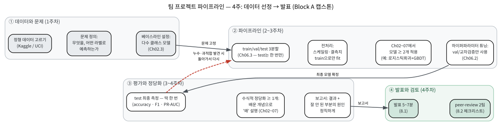
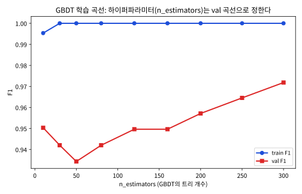

# 8.1 팀 프로젝트: 데이터 선정부터 발표까지

### 왜 지금 프로젝트를 하는가

트리 기반 모델(Chapter 7)까지 배우고 나면, 정형(tabular) 데이터를 다루는
데 필요한 대표적인 도구를 거의 다 손에 쥔 셈이다 — 이후 Block B에서 배울
신경망 없이도, 실전 데이터셋 상당수를 이 도구들만으로 충분히 다룰 수 있다.
지금이 "각 장의 코드가 실제 데이터 앞에서도 작동하는가"를 확인할 가장 좋은
시점이다. 더 깊이 보려면 이 절의 주제(회귀·분류·모델 선택·검증)를
다루는 Stanford CS229 Machine Learning 강의 노트[^cs229]도 참고할 수
있다.

이 프로젝트는 **검증의 성격**에서도 특별하다. Chapter 2~7의 각 실습은
"교재가 고른 데이터, 교재가 고른 모델"에서 코드가 돌아가는지 확인하는
것이었지만, 이번 프로젝트에서는 **데이터를 고르고, 모델을 고르고, 결과가
나빠지면 원인을 찾아 다시 고르는 것**까지가 전부 여러분의 몫이다.
"코드가 동작한다"는 증거와 "이 문제를 내가 풀 수 있다"는 증거는 다르다 —
이 프로젝트를 마친 뒤에는 후자의 증거(보고서 + 발표 + peer-review)를
가지게 된다.

### 전체 그림: 4주 파이프라인

프로젝트의 진행 순서를 한 장으로 그리면 아래와 같다. 왼쪽에서 오른쪽으로
**데이터 → 파이프라인 → 평가 → 발표**로 흘러가는데, 각 박스가
Ch02~07의 어느 장에서 배운 원칙을 집행하는지도 함께 적어두었다.
붉은 점선(평가 → 파이프라인)이 핵심이다 — test에서
**누수(Ch06.3)를 발견했거나, 과적합이 보이면(Ch04.1) 돌아가서** 다시
해야 한다는 뜻이다. 프로젝트에서 "한 번 지나가면 돌아올 수 없는" 것은
test 한 번의 측정뿐이고, 그 외 모든 단계는 되돌아갈 수 있다.

### 일정과 마일스톤

4주(각 주 = 수업 3회)는 아래처럼 나뉜다. **마일스톤 M1~M4가 제출물**이고,
M1·M2는 팀 전체가 모여 함께 결정하는 것(데이터·문제·모델 후보를
개인별로 골라온 뒤 회의에서 확정)이다.

| 주 | 해야 할 일 | 마일스톤(제출) |
|---|---|---|
| 1 | 데이터 후보 2~3개 조사(크기·결측치·클래스 비율), 팀 회의, **문제 정의 문서**: 행이 무엇인지, 라벨이 무엇인지, 주 지표가 무엇인지, 베이스라인은 무엇인지 | **M1** 문제 정의 + 데이터 선택(1페이지) |
| 2 | 3분할(Ch06.3)로 코드 스캐폴드, 전처리(train으로만 fit), 1개 모델 엔드투엔드 동작 확인, 베이스라인 측정 | **M2** 중간코드 리뷰(코드 + 베이스라인 숫자 1줄) |
| 3 | 나머지 모델 적용, val/교차검증(Ch06.2)으로 하이퍼파라미터 튜닝, **test 최종 측정(한 번만)**, 학습 곡선 도출 | **M3** 학습 곡선 1장 + 최종 test 숫자 |
| 4 | 수식적 정당화 작성, 보고서·발표 슬라이드 완성, **발표(5~7분)**, **peer-review 2팀** | **M4** 보고서 + 발표 + 리뷰 2건 |

"왜 마일스톤이 이 모양인가"를 생각해보자. M2에서 **베이스라인 숫자
한 줄**을 제출하게 하는 이유는, §"베이스라인"에서 설명하듯 이 숫자를
보고해야 "모델을 만들었다"고 말할 수 있는지 판정할 수 있기 때문이다.
M3에서 **학습 곡선 한 장**을 요구하는 이유는, "최종 성능 숫자"만
제출하면 하이퍼파라미터를 어떻게 정했는지(§"test를 한 번만, 그리고
왜") 검증할 수 없기 때문이다 — 곡선이 있으면 val 곡선이 실제로
하이퍼파라미터 선택에 쓰였는지가 그림에서 바로 드러난다.

### 프로젝트 구조

- **데이터**: Kaggle(kaggle.com/datasets), UCI Machine Learning Repository[^ucirepo]
  (archive.ics.uci.edu) 중에서 정형 데이터를 하나 고른다 — 이번 프로젝트는
  Chapter 2~7의 분류/회귀 모델을 검증하는 것이 목표이므로, 이미지나 텍스트보다
  표(행/열) 형태 데이터가 적합하다.
- **적용**: Chapter 2~7 중 **최소 두 가지 모델**(예: 로지스틱회귀와 GBDT[^gbdt])을
  같은 데이터에 적용하고 성능을 비교한다.
- **필수 요구사항 — 수식적 정당화 최소 1개**: 예를 들어 (1) 정규화를
  적용했다면 Chapter 6의 편향-분산 관점에서 왜 성능이 바뀌었는지 설명,
  (2) GBDT를 썼다면 Chapter 7의 SHAP[^shap]으로 예측 하나를 분해해서 설명,
  (3) 여러 모델을 비교했다면 Chapter 2.3의 PR-AUC[^fawcett-roc]로 클래스 불균형을 고려한
  비교를 제시.
- **검증 원칙 준수**: Chapter 6.3의 train/validation/test 3분할을 반드시
  지킨다 — 테스트 데이터 성능은 딱 한 번만 확인한다.

**데이터 고르기 실전 가이드**: 아래 기준으로 후보를 골라 "점수"를 매겨보면
팀 회의가 쉬워진다 — (1) **행(row)의 물리적 단위**가 무엇인지 한 문장으로
설명할 수 있는가(환자? 거래? 주문?). 설명이 안 되면 "이 모델이 실제로
예측 대상 단위를 일반화하는가"를 묻기 어렵다. (2) **레이아웃의 함정**이
있는가 — 같은 환자의 여러 검사 결과가 여러 행으로 흩어져 있다면
무작위 분할이 누수를 만든다(Chapter 6.3의 환자 단위 누수;
`GroupKFold`[^sklearn]가 필요). (3) **시계열은 시간순으로** 나눠야 한다(6.3절
노트북 §5). (4) **클래스 비율을 먼저 보고 지표를 정한다** — 99:1이면
지표는 정확도가 아니라 PR-AUC/재현율이 된다(Chapter 2.3의 정확도의
함정). (5) **크기** — 100행 미만이면 교차검증의 폴드가 너무 작아 숫자가
극도로 흔들리므로, 가능하면 500~10,000행이 편하다.

같은 기준으로 실제 UCI/Kaggle 데이터셋 몇 개를 미리 살펴보면, "이
데이터는 어떤 함정이 있는가"가 한 줄로 정리된다:

| 데이터셋 | 크기 | 문제 정의 | 주의할 함정 |
|---|---|---|---|
| **breast_cancer**(UCI) | 569×30, 약 4:6 | 이 환자의 조직이 악성인가 | 비교적 깨끗함 — 이 프로젝트의 "기본 코스" |
| **Heart Failure**(UCI) | 1,000×14, 약 7:3 | 입원 후 28일 내 사망 | 클래스 약간 불균형 — F1·PR-AUC 함께 보고 |
| **Poker Hand**(UCI) | 1,025×13, 10클래스 | 카드 5장에서 패 손의 등급 | 다중 클래스 — 베이스라인은 10%(무작위) |
| **Space Guests**(Kaggle) | 4,500×14, 균형 | 우주여행객의 목적지 성좌 | 결측치 다수 — 결측치 대체를 **train으로만** |
| **Credit Card**(Kaggle)[^dalpozzolo] | 28만×31, 99.8:0.2 | 이상거래(사기) 탐지 | 극단적 불균형 — 정확도 금지, PR-AUC 필수(8.2절 예) |

"기본 코스(breast_cancer)"를 먼저 끝내고 시간이 남으면 Credit Card 같은
극단 데이터로 **지표 선택의 중요성**을 재확인하는 것이, 8.2절에서
"정확도의 함정"을 근거로 리뷰를 할 수 있는 실력이 된다.

### 베이스라인: "모델보다 먼저 봐야 할 숫자"

모델을 하나도 만들지 않고도 성능을 만들 수 있는 방법이 항상 하나
있다 — train에서 **가장 많이 나온 클래스를 전부 예측하는 것**(다수
클래스, majority-class 모델). 이 숫자가 프로젝트의 제로점이다:

- 이 데이터의 클래스 비율이 50:50이면 베이스라인 정확도는 50%
  (이진 분류의 우연)이다.
- 90:10이면 90%, 99.8:0.2(8.2절의 사기 탐지 예)이면 99.8%다.

그러므로 "우리 모델의 test 정확도가 99.8%"라는 발표는, 데이터의
베이스라인을 보지 않은 한 **아직 아무것도 말하지 않은** 발표다.
Chapter 2.3에서 "정확도의 함정"을 배운 이유가 바로 이 체크를
숫자로 강제하기 위해서다. 실전 가이드 (4)의 "클래스 비율을 먼저
본다"는 것의 결론이 여기로 온다 — 비율을 보면 베이스라인이
자동으로 정해지므로, 보고서는 모델 성능 숫자와 함께 **항상
베이스라인 숫자도 함께** 제시해야 한다.

**"손으로 한 번"**: 8.2절의 사기 탐지 데이터(99.8:0.2)에서 베이스라인의
F1을 계산해보자. 다수 클래스(정상)만 찍으면 부정(fraud)에 대한
정확도는 1.0이지만 재현율(recall)은 0 — 부정 건을 하나도 못 잡으므로
\\(F\_1 = \frac{2PR}{P+R} = 0\\)이다. 반대로 부정만 전부 맞히려
하면(전부를 부정으로 찍는 극단) 재현율은 1.0이지만 정확도는 0.2%
수준으로 희석되어 \\(F\_1 \approx 0.004\\)에 불과하다. F1이 정확도보다
이런 극단적 모델을 더 가혹하게(= 정확하게) 다뤄준다는 것이 이
지표를 선택하는 이유다.

### 모델 비교의 기준: val에서 정하고, test는 한 번만

최소 두 모델을 "비교"한다는 말의 정확한 절차는 이렇다:

1. 모든 후보 모델을 train으로만 fit하고 **val 성능으로 순위를 매긴다**
   (하이퍼파라미터까지 포함하면 Chapter 6.2의 교차검증을 val 안에 쓴다).
2. **val 순위의 1등**을 최종 모델로 정한다.
3. 그 모델만 test에 적용해 **최종 숫자를 한 번** 얻는다.

제3단계가 왜 "한 번"이어야 하는지는 6.3절 노트북 §2의 선택 편향
시뮬레이션이 정량적으로 답한다 — test로 후보 \\(m\\)개를 돌려보고
제일 좋은 것을 고르면, 잡음 \\(\sigma\\) 기준으로 \\(\mathbb{E}[\max]\\)만큼
성능이 부풀어 오른다. 본 프로젝트(모델 5개 × 하이퍼파라미터 후보
10개 = 50개)의 규모로 잡음 \\(\sigma=0.02\\)(F1 스케일)를 가정하면
부풀림은 약 **0.045** — "test F1 0.97"이 실제로는 0.925일 수
있다는 뜻이다.
이것은 형식적 원칙이 아니라 **정량적으로** "한 번"이 필요한 이유다.

실습 노트북에서 이 절차를 breast_cancer 데이터로 한 흐름에 걸쳐
재현해 본다 — 5개 모델(Ch02/04/07.1/07.2/07.3)을 val F1로 비교하고,
val로 고른 kNN(k=5)로 test를 딱 한 번 측정한다(결과: test
accuracy 0.939, F1 0.950, PR-AUC 0.979 — 베이스라인 다수
클래스의 val F1 0.774보다 크게 높다). GBDT의 학습 곡선도
그려져 있다 — train F1은 10개 트리부터 거의 1.0(341건을 나무 몇
그루면 외우기 쉬움)이라, **train 곡선은 "배운 것을" 재고 val
곡선만 "재는 것을" 한다**는 6.3절의 원칙이 그림에서 바로 보인다.
같은 노트북에서 Ch07.3의 Shapley값 가산성(\\(f(x) = \phi\_0 +
\sum\_j \phi\_j\\))을 2-특징 장난감 함수로 정확히 손계산해 검증한다 —
"SHAP으로 예측 하나를 분해"라는 수식적 정당화 요구사항의 뼈대가
라이브러리 없이도 확인된다.

### 보고서 구조 (M4)

보고서(5~8페이지)와 발표 슬라이드는 같은 골격으로 쓴다 — **발표
슬라이드 = 보고서의 각 절 제목**으로, 발표는 보고서의 요약이 된다.

1. **문제 정의** (0.5p): 행의 물리적 단위, 라벨, 주 지표, 베이스라인.
   "왜 이 지표를 골랐는가" 한 문장(불균형이 심했으면 PR-AUC의 이유).
2. **데이터와 전처리** (1p): 원본 통계(크기, 결측치 비율, 이상치),
   **train으로만 fit한 전처리** 명시, 분할(3분할 비율 + stratify 여부).
3. **모델 선택과 이유** (1~2p): 후보 모델 ≥2개, **왜 이 후보들을
   골랐는가**(데이터 특성과 연결 — 거리 기반이면 스케일링,
   트리 기반이면 스케일링 불필요, Ch07.1 FAQ), val로 비교한 표.
4. **결과** (1p): 최종 test 숫자(한 번), 학습 곡선 1장, val 표.
5. **수식적 정당화** (1p): 배운 개념(편향-분산, 정규화, SHAP,
   PR-AUC 중 ≥1개)으로 "왜 이 결과가 나왔는지" — §"좋은 예"의
   문체로.
6. **잘 안 된 부분과 원인 진단** (0.5p): **필수** 절. 잘 안 된
   부분이 없었으면 "무엇을 시도했다가 안 됐는가"를 쓴다 — "모두
   잘 됐다"는 보고서는 이 절이 비어 있다는 뜻이고, 그 자체가
   8.2절 체크리스트에서 "결과의 정직성" 항목을 의심하게 한다.

### 채점 기준 (rubric)

| 항목 | 비중 | 좋은 답 |
|---|---|---|
| 문제 정의와 데이터 | 15% | 행의 단위·라벨·지표·베이스라인이 명확하고, 지표 선택이 데이터 특성에 근거함 |
| 방법론 적절성 | 25% | 데이터 특성(불균형·차원·시계열·그룹)에 맞는 모델·전처리·분할을 골랐고, 그 근거가 Ch02~07의 개념으로 설명됨 |
| 검증의 정직성 | 25% | 3분할·train-fit·test 한 번·베이스라인·학습 곡선·val 튜닝이 보고서에서 추적 가능할 정도로 명시됨 |
| 수식적 정당화 | 20% | 배운 개념 ≥1개로 "왜"를 설명했고, 그 설명이 실제로 관측(숫자)과 일치함 |
| 결과의 정직성과 반성 | 15% | 잘 안 된 부분을 숨기지 않고, 원인을 Ch02~07의 개념으로 진단함 |

"방법론 적절성"과 "검증의 정직성"이 50%를 차지하는 이유는, 이
프로젝트의 목적이 "높은 성능을 내는 것"이 아니라 **"성능 숫자를
정직하게 얻는 절차"를 실제로 수행한 것을 증명하는 것**이기 때문이다.
성능이 0.60이라도 절차가 정직하고 정당화가 타당하면 높은 점수를
받고, 성능이 0.99라도 test를 두 번 썼거나 베이스라인이 없으면
"검증의 정직성"에서 크게 감점된다 — 8.2절에서 다른 팀을 리뷰할
때도 정확히 이 우선순위로 보게 된다.

### 손으로 한 번: "수식적 정당화"의 좋은 예와 나쁜 예 비교하기

이 요구사항이 실제로 무엇을 뜻하는지, 같은 결과를 설명하는 두 문장을
나란히 놓고 비교해보자. 어떤 팀이 "정규화를 적용했더니 test 정확도가
0.89에서 0.93으로 올랐다"는 결과를 얻었다고 하자.

**나쁜 설명**: "정규화를 넣으니까 성능이 좋아졌다. 정규화가 좋은
방법인 것 같다."

**좋은 설명**: "정규화 없이 학습했을 때 train 정확도는 0.99였지만 test
정확도는 0.89로 큰 격차가 있었다 — Chapter 4.1의 언어로는 분산이 큰
과적합 상태였다. Chapter 6.1에서 배운 대로 L2 정규화를 추가하고 6.2절의
교차검증으로 \\(\lambda\\)를 튜닝하자, train 정확도는 0.95로 약간
낮아졌지만 test 정확도는 0.93으로 올랐다 — train/test 격차가 줄어든
것은 정규화가 실제로 분산을 줄이는 방향으로 작동했다는 증거다."

두 설명은 같은 숫자(0.89→0.93)를 말하지만, 좋은 설명은 **왜** 그런
결과가 나왔는지를 이 학기에 배운 개념(편향-분산, 정규화의 원리)으로
정확히 짚어낸다 — "성능이 올랐다"는 관찰과 "왜 올랐는지 설명할 수
있다"는 이해는 다른 수준의 성취라는 것이 이 요구사항의 핵심이다.

### test를 한 번만, 그리고 왜 — "살짝 훔쳐보기"가 실제로 얼마나 성능을 부풀리는가

"test는 딱 한 번"이 형식적 규칙처럼 보일 수 있지만, 6.3절에서 본
선택 편향의 계산이 그 크기를 정량적으로 보여준다. 각 후보 모델의
test 성능을 (진짜 성능 + 잡음 \\(\mathcal{N}(0,\sigma^2)\\))으로
모델링하면, 후보 \\(m\\)개 중 **최고 점**을 고르는 행위는 \\(m\\)번의
잡음 뽑기 중 max를 고르는 것과 같고, max는 평균보다 항상 위쪽
(낙관 쪽)으로 치우친다. 6.3절 노트북 §2의 시뮬레이션을 F1 스케일
(잡음 \\(\sigma=0.02\\))로 다시 돌려보면:

| 후보 수 \\(m\\) | \\(\mathbb{E}[\max]\\) (부풀림) |
|---|---|
| 1 (테스트 안 쓰고 val로만 고른 경우) | \\(\approx 0\\) |
| 5 (모델 5개만 test로 비교) | \\(\approx 0.023\\) |
| 50 (5개 모델 × 하이퍼파라미터 10개) | \\(\approx 0.045\\) |
| 100 | \\(\approx 0.050\\) |

즉, "5개 모델을 test로 돌려보고 제일 좋은 것을 골랐다"는 행위는
F1 0.97의 결과에서 **실제로 0.947일 수 있다**는 불확실성을 안고
있다는 뜻이다. 후보가 "모델 수 × 하이퍼파라미터 수"의 곱으로
커지는 것이 이 편향이 실전에서 무시할 수 없는 크기(\\(\approx
0.045\\), 4.5%p)가 되는 이유다. val로 고르면 val만 이 편향을 먹고
test는 한 번만 쓰이므로 부풀림이 test에 전이되지 않는다 — 3분할
원칙이 "정직한 test 숫자"를 사기 위한 **구조**인 이유다.

### 자주 하는 실수

프로젝트에서 반복해서 보이는 실수 5가지 — 각각이 Chapter 2~7의
어떤 원칙을 깨는지 짚어두면, 8.2절에서 다른 팀을 리뷰할 때
바로 "반박 가능한 질문"으로 바꿀 수 있다.

- **테스트로 모델 고르기** ("살짝 훔쳐보기"): §"test를 한 번만"의
  선택 편향을 test에 그대로 전이시키는 것. 리뷰 질문 예: "val F1
  순위와 test F1 순위가 같은가요? test로 고르면 두 순서가
  달라질 수 있다는 것을 시드 3개로 확인해 볼 수 있나요?"
- **정규화/결측치 통계를 전체 데이터로 fit**: 6.3절의 "정규화
  통계량 누수" — `StandardScaler`[^sklearn]의 `fit`을 train+val+test 전체에
  적용하면 test의 정보가 전처리에 스민다. `fit(X_train)` →
  `transform(X_val)`, `transform(X_test)`가 정석이다.
- **베이스라인 없이 성능 보고**: §"베이스라인"에서 본 대로,
  클래스 비율 90:10 데이터에서 "정확도 91%"는 아무것도 말하지
  않는다.
- **시계열/그룹 데이터의 무작위 분할**: 6.3절의 환자 단위·시계열
  누수 — 무작위 분할로 "비현실적으로 좋은" 성능을 얻고, 배포
  (새로운 환자/미래 시간)에서는 완전히 붕괴한다.
- **학습 곡선 없이 하이퍼파라미터 보고**: "learning_rate=0.1을
  썼다"가 왜 0.05·0.3이 아니라 0.1인지 val 곡선(또는 교차검증)
  없이 확인 불가능하다. M3 마일스톤이 학습 곡선을 요구하는 이유.

### 발표 (블록 1 마무리)

팀당 5~7분: 문제 정의(1분) → 데이터와 전처리(1분) → 적용한 모델과 이유(2분)
→ 결과와 수식적 정당화(2분) → 잘 안 됐던 부분과 원인 진단(1분). "정확도
90%를 달성했다"보다 "왜 이 모델을 골랐고, 왜 이 결과가 나왔는지"를 설명하는
쪽에 더 높은 점수를 준다.

발표의 마지막 1분("잘 안 됐던 부분")이 **가장 평가받는** 부분이
된다 — §채점 기준의 "결과의 정직성과 반성" 항목이 정확히 여기
을 본다. "모든 것이 잘 됐다"는 발표는 이 항목에서 스스로 감점
을 받는 것이며, 반대로 "이 트리의 깊이를 5로 늘리자 val F1이
0.97에서 0.95로 떨어졌다 — Chapter 7.3에서 배운 대로 GBDT가
잔차를 계속 쫓다 노이즈까지 학습하기 시작한 것으로 진단했고,
그래서 깊이를 3으로 고정했다"는 발표는 실패한 시도를 **배운
개념으로 해석한** 증거라서 더 높은 점수를 받는다. ML2의
Chapter 16.1(강화학습 캡스톤)도 동일한 구조("학습이 안 된
부분을 정직하게 보고하고 원인 진단하라")를 쓰므로, 이 습관이
Block B까지 이어진다.

### 실습: 미니 프로젝트를 한 흐름으로 코드로 돌려보기

[실습 노트북](https://colab.research.google.com/github/SuminHan/book-ml/blob/main/notebooks/ml1/chapter08_1_team_project.ipynb)
(제목 바로 위의 Colab 배지)에서 이 절의 전체 흐름을 breast_cancer
데이터(569건 × 30 특성)로 한 번에 통과시켜 본다:

1. **문제 정의** — 행=환자, 라벨=양성/악성, 주 지표 F1.
2. **3분할** (train 341 / val 114 / test 114, stratify) — unique
   id로 pairwise disjoint를 기계적으로 점검.
3. **전처리** — `StandardScaler`를 **train으로만 fit**.
4. **5개 모델 후보** (로지스틱회귀·kNN·트리·랜덤포레스트[^randomforest]·GBDT)
   를 val F1로 비교 → kNN(k=5)가 0.973로 1위.
5. **베이스라인** — 다수 클래스(malignant) 모델의 val F1 0.774.
   kNN이 이를 0.198 상회해야 "모델을 만들었다"고 말할 수 있다.
6. **test 한 번** — 최종 test: accuracy 0.939, F1 0.950,
   PR-AUC 0.979.
7. **선택 편향** — "test로 5개 후보를 골랐다면" F1이 약 0.023,
   50개면 0.045 부풀어 오르는 시뮬레이션(§"test를 한 번만").
8. **학습 곡선** — GBDT의 `n_estimators` vs train/val F1
   (본문에 삽입된 그림).
9. **Shapley값 가산성** — 2-특징 장난감 함수로 \\(\phi\_A=0.08\\),
   \\(\phi\_B=0.20\\), \\(0.50+0.08+0.20=0.78=f(\\{A,B\\})\\)를 정확히
   손계산해 검증(Ch07.3).

이 9단계가 곧 §"보고서 구조"의 6개 절로, 다시 8.2절의
체크리스트 4항목으로 매핑된다 — **같은 절차를 세 가지
언어(코드, 보고서, 리뷰)로 말할 수 있어야** 이 프로젝트가
끝난 것이다.

### 확인 문제: 프로젝트 절차를 개념으로 묻기

각 문항은 이 절의 절차와 Chapter 2~7의 개념을 동시에 확인한다 —
프로젝트를 진행하며 "이 단계가 왜 이렇게 돼야 하는가"를
스스로 답할 수 있어야, 8.2절에서 다른 팀을 리뷰할 때
반박 가능한 질문을 던질 수 있다.

**1.** 팀이 "train 70% / test 30%"만 쓰고 하이퍼파라미터를
**test로** 고르겠다고 하자. 6.3절의 선택 편향 계산(§"test를
한 번만")으로, 후보 10개·잡음 \\(\sigma=0.01\\)일 때 test 성능이
평균적으로 얼마나 부풀어 오르는지 추정하고, 이 팀에 던질
"반박 가능한 질문"을 하나 만들어 보자.
> 답: 6.3절 노트북 §2의 \\(\mathbb{E}[\max]\\) 계산(후보 10개,
> \\(\sigma=1\\)일 때 \\(\approx 1.53\\))에 \\(\sigma=0.01\\)을 곱하면
> \\(\approx 0.015\\) — test F1이 실제로 0.985인데 1.00으로
> 보고될 수 있다. 질문 예: "test로 하이퍼파라미터를 고르면
> val로 고른 경우와 test 순위가 얼마나 달라질 수 있는지,
> 시드 5개로 val/test 순위의 불일치율을 재볼 수 있나요?"

**2.** breast_cancer(악성 62.7%)에서 다수 클래스 베이스라인의
val F1이 실습 노트북의 0.774였다. 이 데이터에서 **정확도**
지표의 베이스라인은 얼마이며, 정확도가 F1보다 왜 더
"인정하기 쉬운" 숫자인지 Chapter 2.3의 관점에서 설명하자.
> 답: 정확도 베이스라인은 다수 클래스 비율인 약 62.7%(val
> 실측 0.632). 정확도는 "전체 중 몇 %를 맞혔나"로 직관적이고
> 부정(소수) 클래스를 몇 건 잡았는지를 희석시켜 버린다 —
> 비율이 50:50이 아니면 정확도는 베이스라인과 모델의 차이를
> 과소평가/과대평가한다. F1은 소수 클래스의 정확도와 재현율을
> 결합해 이 희석 효과를 없애므로, "모델이 베이스라인보다
> 좋은가"를 판정하는 지표로 적합하다.

**3.** 같은 데이터셋을 (a) 무작위 분할, (b) 환자(그룹) 분할로
나눠 kNN을 학습하면 (a)의 test RMSE가 비현실적으로 낮아진다.
6.3절의 "환자 단위 누수" 메커니즘으로 (a)가 왜 좋은 성적을
내는지 설명하고, 이 팀의 보고서가 (a)를 쓴 것을 어떻게
발견할 수 있는지(= 어떤 질문을 던지는지) 답하자.
> 답: (a)에서는 같은 환자의 여러 행이 train/test에 흩어져
> kNN이 test 행의 k-이웃을 **같은 환자의 train 행**으로
> 찾아 "환자를 인식"한다 — 관계를 배운 것이 아니라 환자를
> 외운 것. 질문 예: "같은 환자가 train과 test에 동시에
> 들어가도록 나눠졌나요? `GroupKFold`로 재분할하면 성능이
> 어떻게 변하나요?" — 그룹 키(환자 ID)가 있는지 코드를
> 보면 즉시 판정된다.

**4.** "GBDT의 `n_estimators`=300을 val 곡선으로 정했다"는
발표인데, 학습 곡선에서 **val F1이 300에서 계속 상승 중**이
다. 7.3절의 GBDT 과적합 메커니즘(잔차 학습)과 6.3절의
"val이 한 번만" 원칙을 모두 들어, 이 팀의 결론에 어떤
한계가 있는지, 그리고 곡선이 "val도 하락하기 시작한"
모양이었다면 결론이 어떻게 달라지는지 논하자.
> 답: val이 300에서 여전히 상승 중이면 "300이 최적"이 아니라
> "300이 관찰된 범위 내 최선"일 뿐 — 더 큰 \\(n\\)에서 val이
> 꺾일 수 있으므로 "현재까지의 최선"으로 보고해야 한다
> (과적합이 시작되기 전이므로 아직 분산 폭발은 아님).
> 반대로 val이 \\(n\approx150\\)에서 정점 뒤 하락했다면, 300은
> **train F1=1.0으로 포화된** 상태에서 잔차(=노이즈)를
> 계속 쫓다 overfit한 구간이므로 150 부근(early stopping)을
> 골랐어야 한다 — train 곡선이 1.0으로 포화되어 있어도
> val 곡선만 "재는 것"을 재므로 val 정점이 기준이 된다.

### 자주 묻는 질문

**Q. 두 모델의 성능이 거의 같으면 어떻게 발표하나요?** 오히려 좋은
발표 소재다 — Chapter 6.3에서 배운 대로, 성능 차이가 검증셋 표본
크기에 비해 작다면 "우연"일 수도 있다는 것 자체가 통계적으로 중요한
관찰이다. 두 모델의 예측이 실제로 어떤 데이터 포인트에서 갈리는지,
어느 쪽이 더 해석하기 쉬운지(예: 로지스틱회귀의 계수 vs GBDT의 SHAP)
같은 정성적 비교로 발표를 채울 수 있다.

**Q. 데이터에 결측치나 이상치가 많으면 감점되나요?** 아니다 — 오히려
그런 데이터일수록 전처리 결정(결측치를 어떻게 채웠는지, 이상치를
제거했는지 유지했는지)과 그 근거를 설명하는 것 자체가 좋은 평가
포인트다. "깨끗한 데이터에서 높은 정확도"보다 "지저분한 데이터를
다룬 판단 과정"이 실전 데이터 사이언스에 훨씬 가깝다.

**Q. 팀원 간 역할 분담은 어떻게 하나요?** 데이터 조사·코드·
보고서·발표를 모두 **팀 전체가 함께 결정**해야 하지만, 작성은
나눠도 된다 — 다만 "코드는 A가, 보고서는 B가"로 완전히 분리하면
B가 A의 코드를 모르는 상태에서 정당화를 쓰는(=§"나쁜 설명"이
되는) 상황이 생긴다. 마일스톤 M2(중간코드 리뷰)가 팀 전체가
코드를 함께 보는 회의를 강제하는 이유이기도 하다.

**Q. 4주 안에 안 끝날 것 같은데?** 프로젝트의 성공 기준은
"높은 성능"이 아니라 "정직한 절차"다 — 8.2절의 사기 탐지 예처럼
성능이 낮아도 절차가 정직하면 좋은 발표가 된다. 시간이 부족하면
모델을 2개로 줄이고(요구사항의 최소선은 2개), "잘 안 된 부분"
절에 "시간 부족으로 3번째 모델을 못 돌렸다"를 정직하게 쓰는 것이,
성능 숫자를 부풀리는 것보다 항상 낫다.

[^cs229]: Stanford CS229: Machine Learning, Lecture Notes. https://cs229.stanford.edu/main_notes.pdf
[^gbdt]: Friedman, J. H. (2001). "Greedy Function Approximation: A Gradient Boosting Machine." The Annals of Statistics 29(5), 1189–1232. DOI: 10.1214/AOS/1013203451
[^shap]: Lundberg, S. M., Lee, S.-I. (2017). "A Unified Approach to Interpreting Model Predictions." NeurIPS 2017. arXiv:1705.07874.
[^randomforest]: Breiman, L. (2001). "Random Forests." Machine Learning 45(1), 5–32. DOI: 10.1023/A:1010933404324
[^sklearn]: Pedregosa, F. et al. (2012). "Scikit-learn: Machine Learning in Python." arXiv:1201.0490.
[^ucirepo]: Dua, D., Graff, C. (2019). "UCI Machine Learning Repository." Irvine, CA: University of California, Irvine, School of Computer Engineering. http://archive.ics.uci.edu
[^dalpozzolo]: Dal Pozzolo, E., Caelen, O., Johnson, M. A., Bontemporal, G. (2014). "Calibrating Probability with Undersampling for Unbalanced Classification." IEEE International Joint Conference on Neural Networks (IJCNN) 2014.
[^fawcett-roc]: Fawcett, T. (2006). "An introduction to ROC analysis." Pattern Recognition Letters 27(8). DOI: 10.1016/j.patrec.2005.10.010.
