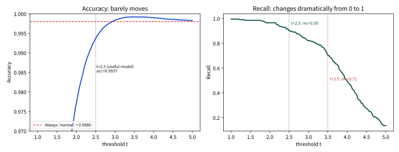
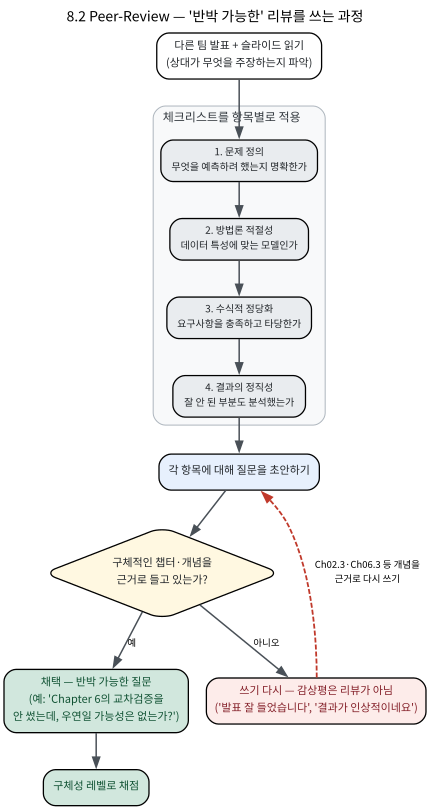

# 8.2 Peer-Review

[](https://colab.research.google.com/github/SuminHan/book-ml/blob/main/notebooks/ml1/chapter08_2_peer_review_metrics.ipynb)

### 왜 peer-review인가: "반박 가능"이 과학을 과학으로 만드는 이유

블록 1(8.1)에서 각 팀이 자기 발표를 마쳤다면, 이번 블록(8.2)에서는 역전이
일어난다 — **이번에는 네가 심사위원이다.** 다른 두 팀의 발표를 듣고, 체크리스트로
리뷰를 쓰고, 그 리뷰의 품질로 네가 채점받는다. "내가 내 팀 발표를 할 때 심사받은
것"을 이번엔 내가 남의 발표에 하는 셈이다.

왜 이 번잡한 과정을 굳이 넣는가. 답은 이 학기의 거의 모든 장에서 나온
한 문장, **"정확도 90%를 달성했다"보다 "왜 이 결과가 나왔는지"가 중요하다**
에서 나온다. ML 결과는 **잘못된 것이 아니라 우연히 좋은 것처럼 보이는 것**이
너무나 쉽다 — 테스트를 하이퍼파라미터 튜닝에 써서(Chapter 6.3의 선택 편향),
클래스가 99.8:0.2로 기울어 있어서(Chapter 2.3의 정확도의 함정), train에
과적합해서(Chapter 6.1)다. 이 세 가지는 전부 *결과를 내면서* 무심코 범할 수 있는
실수다. 그러니 "좋은 결과"는 스스로를 증명하지 못한다 — **다른 누군가가 그
결과를 뒤집을 수 있는 구체적인 방법을 찾아내는지**에 따라 판단해야 한다.

이게 과학 방법의 핵심이다. Karl Popper는 1934년 *The Logic of Scientific
Discovery*에서 **반증주의(falsifiability)**를 제시했다: 한 주장은 "그것이
틀렸음을 보여주는 관측이 *원칙적으로* 상상이 가능한가"로 판별된다고 했다.
반박될 수 없는 주장은 과학이 아니다. Peer-review에서 "좋은 리뷰란
구체적으로 **반박 가능한 질문**을 던지는 것"이라고 한 것은 정확히 이 원리의
응용이다. 좋은 질문이란 **발표팀이 그 질문에 제대로 답하지 못하면 결과 자체가
흔들리는** 질문이다. "더 잘 설명해 주세요"는 반박이 아니라 요청이고, "Chapter 6의
교차검증 없이 \\(\lambda\\)를 정했는데, 그 검증 성능이 우연일 가능성은
없는가?"는 반박이다 — 후자는 답이 나쁘면 결과가 무너지지만, 전자는 아니다.

이 "반박"의 중요성을 실감하는 가장 유명한 사례는 **Amgen 재현 실험**(2011)이다.
생물제약 회사 Amgen이 1999~2005년에 발표된 '주요(landmark)' 생물학 논문 53편을
직접 재현해 보려 했더니, **6편밖에 재현되지 못했다.** 53편 중 47편이
"잘못되었다기보다 재현이 안 된다"는 것이 문제였다. 이후 이 일화는
**재현성 위기(reproducibility crisis)**의 상징이 되었다. Peer-review는
"남의 발표를 까탈스럽게 까는 절차"가 아니라, Amgen이 스스로 했던 것과
동일한 행위 — **내 결과도 남이 재현·반박할 수 있도록 미리 방어하는 것** — 이다.
발표팀 입장에서도 마찬가지다: 네가 심사할 때 던질 수 있는 가장 날카로운
질문을, 네 발표 *전에* 스스로 던져보고 답을 준비해 두는 것이 최선의 전략이다.

### 이번 주는 어떻게 진행되는가

블록 2(이번 주, 8.2)의 목표는 **리뷰어로서 기능하는 것**이다. 일정은 8.1의
발표와 이어진다.

| 순서 | 내용 | 시간 |
|---|---|---|
| 1 | 다른 두 팀의 발표 청취(각 5~7분, 8.1 발표 형식 그대로) | 50분 중 약 30분 |
| 2 | 체크리스트 기반 **작성 리뷰** 두 통 — 팀당 4개 항목 + 반박 가능한 질문 1개 이상 | 발표 직후 |
| 3 | 질의·토론: 리뷰어가 작성한 질문을 발표팀이 그 자리에서(또는 이후) 답변 | 나머지 시간 |

핵심은 2번의 **작성 리뷰**다. 리뷰는 체크리스트의 4개 항목(아래)을 채우는
것으로 끝나지 않는다 — 각 항목 아래 **구체적인 근거**와, **이 학기에 배운
개념(장·절)을 명시한 반박 가능한 질문**을 하나 이상 써야 한다. 3번의 토론은
"발표팀이 그 질문에 실제로 답할 수 있는가"를 가르는 자리다. 8.1에서 배운
"수식적 정당화"가 발표팀의 *의무*였다면, 이번 주 그 정당화가 *타당한지*를
리뷰어가 *심사*하는 것이다.

### 체크리스트

다른 두 팀의 발표를 다음 체크리스트로 평가한다:

| 항목 | 확인할 것 |
|---|---|
| 문제 정의 | 무엇을 예측/분류하려 했는지 명확한가 |
| 방법론 적절성 | 데이터 특성(불균형, 차원 수 등)에 맞는 모델을 골랐는가 |
| 수식적 정당화 | 요구사항을 충족했고, 그 설명이 실제로 타당한가 |
| 결과의 정직성 | 잘 안 된 부분을 숨기지 않고 원인을 분석했는가 |

체크리스트 기반 리뷰는 팀 점수의 일부로 반영되며, 좋은 리뷰란 "잘했다"가
아니라 "이 부분은 Chapter 6의 교차검증을 안 썼는데, 검증 데이터 성능이
우연일 가능성은 없는가?"처럼 **구체적으로 반박 가능한 질문**을 던지는
것이다.

### 채점 기준: "채웠는가"가 아니라 "구체적인가"

체크리스트는 *도구*이고, 채점의 축은 *리뷰어의 질문이 얼마나 구체적인가*다.
"4개 항목을 모두 적었다"는 사실 자체로는 점수가 매겨지지 않는다. 아래
3단계가 그 기준이다 — 8.1의 "좋은 설명 vs 나쁜 설명" 비교와 동일한 논리
(관찰을 말하느냐, *왜*를 말하느냐)가 리뷰에도 그대로 적용된다.

| 리뷰 품질 | 특징 | 예시 |
|---|---|---|
| **1점 — 감상평** | 구체적 지적이 없음. 듣기만 하고 느낌만 적음 | "발표 잘 들었습니다. 결과가 인상적이네요." |
| **2점 — 일반 지적** | 문제를 제기하지만 *근거(어떤 개념)가* 약함. 발표팀이 "네"로 넘길 수 있음 | "모델 선정 이유가 부족해 보입니다. 데이터 특성을 더 봐주세요." |
| **3점 — 반박 가능한 질문** | 이 학기 개념(장·절)을 명시하고, *답이 나쁘면 결과가 흔들리는* 질문 | "불균형(99.8:0.2) 데이터에 정확도만 보고 비교했는데(Ch02.3), 두 모델의 Precision·Recall을 안 주면 '둘 다 항상 정상으로 찍는' 모델일 수 있는데 어떻게 구분하셨나요?" |

1점→2점→3점으로 올라가는 방향을 보면 공통 패턴이 있다: **추상적 평가어
("부족하다", "인상적이다")를 구체적 관찰 + 이 학기 개념(Ch NN)으로 교체**하는
것이다. "모델 선정이 부족하다"(2점)는 관찰과 개념이 없고, "99.8:0.2의 불균형
데이터에서 정확도만 비교했다(Ch02.3의 정확도의 함정)"(3점)는 *관찰(정확도만
쓰셨다) + 개념(Ch02.3) + 그것이 왜 문제인지(항상 정상으로 찍으면 정확도 99.8%)*
가 모두 들어 있다.

### 손으로 한 번: 가상 발표에 체크리스트를 실제로 적용해보기

가상의 발표 요약을 하나 놓고, 위 체크리스트를 실제로 적용해보자.

> **발표 요약**: "우리 팀은 신용카드 이상거래 데이터로 사기 탐지 모델을
> 만들었다. 전체 데이터의 99.8%가 정상 거래, 0.2%가 사기였다. 로지스틱
> 회귀를 학습시켰더니 정확도(accuracy) 99.7%가 나왔다. 다음으로 GBDT를
> 학습시켰더니 정확도 99.8%로 더 높았다. 그래서 GBDT가 더 좋은 모델이라고
> 결론 내렸다."

체크리스트를 하나씩 적용해보면:

- **문제 정의**: 명확하다 — 이상거래 탐지, 이진 분류.
- **방법론 적절성**: 여기서 문제가 보인다 — 클래스 비율이 99.8:0.2로
  극심하게 불균형한데, 비교 기준으로 **정확도**를 썼다. Chapter 2.3에서
  배운 "정확도의 함정"을 떠올려보면, 모든 거래를 "정상"이라고만
  찍어도 정확도는 99.8%가 나온다 — 두 모델의 정확도 차이(99.7% vs
  99.8%)가 실제로 사기를 더 잘 잡아내서 나온 차이인지, 아니면 그냥
  둘 다 "거의 항상 정상이라고 찍는" 모델이라 비슷한 것인지 이 발표만
  으로는 알 수 없다.
- **수식적 정당화**: 형식적으로는 "정확도를 계산했다"는 요구사항을
  채운 것처럼 보이지만, 클래스 불균형 상황에 맞는 지표(PR-AUC, 재현율)를
  전혀 쓰지 않아 정당화로서는 부족하다.
- **결과의 정직성**: "GBDT가 더 좋다"는 결론이 위 문제 때문에
  근거가 약하다.

**반박 가능한 질문 예시**: "두 모델의 Precision과 Recall을 각각
따로 보여줄 수 있나요? 정확도만으로는 두 모델이 실제 사기 거래를
얼마나 잡아냈는지 구분이 안 됩니다." — 이 질문은 막연한 "더 잘 설명해
주세요"가 아니라, Chapter 2.3의 구체적인 개념(클래스 불균형과 정확도의
함정)을 근거로 정확히 무엇이 부족한지 짚어낸다. 좋은 peer-review는
이런 식으로 **이 학기에 배운 개념 하나를 콕 집어** 왜 그 개념이
이 발표에 적용되어야 하는지 설명하는 질문을 던지는 것이다.

### 실습: "정확도 99.8%"를 코드로 검증해보기

위 가상 발표의 비판이 "감"에 근거한 것이 아니라 **실제 숫자**에 뿌리를
박는지, 아래 실습 노트북(페이지 상단의 Colab 배지)으로 확인한다. 노트북은
발표의 설정(거래 100,000건, 사기 200건=0.2%)을 1차원 장난감 데이터로
재현하고, 임계값 분류자로 정확도·재현율·PR-AUC를 직접 계산한다.



핵심 숫자 세 가지를 함께 보자.

**(1) '쓸모있는 모델'의 정확도는 '무조건 정상'보다 낮다.** 사기를 약 90%
잡는 분류자(임계값 \\(t=2.5\\))의 정확도는 **99.37%**다. 그런데 아무 모델 없이
전부 '정상'으로 찍기만 하면 정확도는 **99.8%**다 — 사기를 단 1건도 못 잡는데도
*정확도만으로 보면 더 낫다.* 정확도 99.8%가 "모델이 좋다"는 증거가 아니라는
것의 가장 직접적인 숫자다.

**(2) 정확도 순위와 '사기를 잡는' 순위가 반대다.** 같은 분류자에서 임계값만
바꿔도 아래처럼 정반대의 줄 서기가 나온다:

| 임계값 \\(t\\) | 정확도 | Precision | 재현율 | F1 |
|---|---|---|---|---|
| 3.5 | **99.92%** | 86.1% | 71.0% | 77.8% |
| 2.5 | 99.37% | 22.8% | 90.0% | 36.3% |
| 2.0 | 97.72% | 7.8% | **96.5%** | 14.5% |

정확도로 줄을 세우면 \\(t=3.5\\)가 최고·\\(t=2.0\\)이 최하인데, 사기를 실제로
잡는 능력(재현율)으로는 **순서가 완전히 뒤집힌다**(\\(t=2.0\\)이 최고). "정확도가
높을수록 좋은 모델"이라는 직관이, 불균형 데이터에서는 **모든 것을 더 놓치는
방식을 최고로 뽑는** 잘못된 기준이 된다는 뜻이다.

**(3) 두 모델의 정확도는 사실상 동점, 의미를 가진 지표는 PR-AUC다.** 발표
요약의 설정(로지스틱회귀 vs GBDT)을 실제 2차원 불균형 데이터에 재현하면,
두 모델의 test 정확도는 **99.86% vs 99.80%** — 0.06%p 차이, 즉 *검증셋 표본
의 잡음보다 작거나 같은 크기*다. 그런데 PR-AUC는 **0.636 vs 0.071**로 확연히
달라진다. 정확도 하나만 보면 "둘이 같다"는 결론이 나오지만, PR-AUC를 보자
니 차이는 컸다 — 이 자체가 "정확도 말고 PR-AUC/재현율을 제시하라"는 리뷰
질문을 정당화하는 숫자다. (참고로 이 장난감 실행에서는 GBDT가 50개 트리·
학습률 0.1로 양성 200개에 *과소적합*해 오히려 PR-AUC가 낮게 나왔다 —
"하이퍼파라미터(트리 수, 학습률)가 데이터의 양성 개수에 비해 충분한가"라는
리뷰 질문의 좋은 예시이기도 하다.)

이 세 숫자가 위 "손으로 한 번"의 비판을 *검증*한 것이다. "정확도만 보면
동점인데 PR-AUC를 보자니 다르다"는 리뷰어가 하는 말이, 이 실험에서 실제로
일어나는 일이었기 때문에 **반박 가능하다** — 발표팀이 반박하려면 "우리는
PR-AUC/재현율을 이렇게 계산했고, 정확도 0.1%p 차이는 이 크기보다 크다"는
*숫자*를 꺼내야만 한다.

### 좋은 리뷰를 쓰는 과정: 체크리스트 → 반박 가능한 질문

위 실습에서 보듯, 좋은 리뷰는 "발표를 듣고 → 체크리스트 4항목에 적용 →
각 항목에서 *구체적 관찰*을 적고 → 그것이 **이 학기 개념(장·절)**에 뿌리를
박은 질문인지 검사 → 아니면 다시 쓰기"의 흐름이다. 이 과정을 그림으로
정리하면 아래처럼 된다.



이 흐름을 *형식*으로 고정하면, 아래 리뷰 템플릿을 그대로 채우면 된다.
빈칸이 채워지지 않으면 리뷰가 3점에 못 미치는 이유도 바로 드러난다.

```
팀 이름: ____________    리뷰어: ____________

1. 문제 정의 — 무엇을 예측/분류하려 했는지 한 문장으로 적어라. 명확했는가?
   _______________________________________________________________
2. 방법론 적절성 — 데이터의 어떤 특성(불균형 비율, 차원 수, 결측치)에
   어떤 모델이 맞았는가? 그 선택에 동의하는가, 근거와 함께.
   _______________________________________________________________
3. 수식적 정당화 — "수식적 정당화 최소 1개"(8.1)를 채웠는가? 어떤 장의
   개념을 썼고, 그 설명이 *실제로* 타당한가?
   _______________________________________________________________
4. 결과의 정직성 — 잘 안 된 부분과 그 원인을 분석했는가?
   _______________________________________________________________
5. 반박 가능한 질문 (필수, 1개 이상) —
   근거가 되는 개념: Chapter __ 절 __ (개념: ____________)
   질문: ________________________________________________________
         (발표팀이 이 질문에 *답이 나쁘면* 결과가 흔들리는 것이어야 한다)
```

5번의 빈칸이 채워지지 않으면, 그 리뷰는 1점 또는 2점에 머문다 — "근거가 되는
개념"과 "질문" 두 칸이 모두 비어 있어야 *반박 불가능한* 리뷰다. 템플릿을
채우는 행위가 곧 "구체적인가?"라는 채점 기준(위의 3단 표)을 자기 점검하는
행위다.

### 자주 하는 실수: 리뷰가 감상평에 머무르는 것

"발표 잘 들었습니다", "결과가 인상적이네요" 같은 리뷰는 체크리스트를
형식적으로 채웠을 뿐, 발표팀에게 실제로 도움이 되는 정보를 전혀
주지 않는다. 위 예시처럼 **구체적인 챕터·개념을 근거로 든 질문**만이
"반박 가능"하다 — 발표팀이 그 질문에 답하려면 실제로 자신의 결과를
다시 들여다봐야 하기 때문이다. Peer-review 점수가 체크리스트를 "채웠는가"가
아니라 "그 안의 질문이 얼마나 구체적인가"로 매겨지는 이유가 여기 있다.

### 확인 문제

각 문항은 *리뷰어가 될 때* 쓰는 판단력을 확인한다 — 먼저 스스로 답해본 뒤
아래 답과 비교해보자.

**1.** 어떤 팀이 "우리는 5%만 양성이 되는 데이터에 신경망을 써서 정확도 95%를
냈다"고 발표한다. 이 발표의 가장 약한 부분은 어디이고, **반박 가능한 질문
하나**를 Chapter 2.3의 개념으로 쓰시오.
> 답: 정확도의 함정(Ch02.3) — 양성 5%인 데이터에서는 *모두 음성*으로만
> 찍어도 정확도 95%가 나오므로, "정확도 95%"는 모델이 쓸모있다는 증거가
> 아니다. 반박 가능한 질문: "양성 비율 5%에서 Precision과 Recall(또는
> PR-AUC)을 각각 얼마인가요? 정확도 95%는 무조건 음성 판정 모델과
> 같은 수인데, 이 모델이 실제로 양성을 얼마나 더 잡는지 보여주세요."

**2.** 어떤 팀이 "검증셋이 아니라 **테스트셋**으로 여러 \\(\\lambda\\) 중
가장 좋은 것을 골랐다"고 인정했다. Chapter 6.3의 어떤 원칙이 깨졌고, 왜
그 숫자가 낙관적인가?
> 답: "테스트는 하이퍼파라미터 선택에 쓰지 않고 딱 한 번만 쓴다"는
> 원칙(Ch06.3)을 어겼다. 후보 중 *가장 잘 나온* 것을 고르는 행위는 잡음의
> max를 고르는 것이라, 후보가 많을수록 테스트 성능은 실제보다
> 낙관적으로 읽힌다(선택 편향). 올바른 비교는 검증셋으로 \\(\\lambda\\)를
> 고른 뒤 테스트를 *한 번* 확인하는 것이다.

**3.** "왜 반박 가능한(falsifiable) 질문이 좋은 리뷰의 기준인가?" —
Peer-review와 과학 방법의 공통 구조를 한 단락으로 설명하시오.
> 답: Popper의 반증주의처럼, 과학적 주장은 "틀렸음을 보이는 관측이
> 상상이 가능한가"로 판별된다. 좋은 리뷰 질문도 마찬가지다 — 발표팀이
> *제대로 답하지 못하면* 결과가 무너지는 질문이어야 한다. 감상평
> ("인상적이다")는 답이 아무리 나빠도 결과를 흔들지 못하므로 반박이
> 아님. Peer-review는 Amgen 재현 실험처럼 "내 결과도 남이 재현·반박할 수
> 있는가"를 미리 방어하는 과학적 행위다.

**4.** 리뷰어가 "모델 선정이 적절해 보이지 않습니다"라고 적었다. 3단
채점 기준(감상평/일반 지적/반박 가능) 중 어디에 해당하는가, 그리고
**어떻게** 3점의 "반박 가능한 질문"으로 바꿀 수 있는가?
> 답: "적절해 보이지 않습니다"는 근거(어떤 개념, 어떤 데이터 특성)가
> 없으므로 2점(일반 지적)에 가깝다 — 발표팀이 "네, 알겠습니다"로 넘길 수
> 있다. 3점으로 바꾸려면 *관찰 + 개념 + 왜 문제인지*를 채운다: "99:1의
> 불균형 데이터에서 정확도로 두 모델을 비교했는데(관찰), Ch02.3의 정확도
> 함정 때문에 '둘 다 항상 다수 클래스로 찍는' 모델일 수 있어(개념)
> Precision·Recall 또는 PR-AUC로 다시 비교해야 합니다(왜)."

**5.** 어떤 팀이 95% 불균형 데이터에서 "test 정확도 93%"를 헤드라인으로
놓고, 그 뒤에 "PR-AUC 0.55"도 함께 보고했다. "모델이 쓸모있는가"를
판단할 때 *어떤* 숫자를 신뢰해야 하는가, 왜인가?
> 답: PR-AUC 0.55 쪽이다. 95% 불균형에서는 정확도 93%가 *무조건 다수
> 클래스* 모델(정확도 95%)보다도 *낮다* — 정확도는 이 모델이 '무조건
> 다수'보다 못하다는 뜻일 뿐, 유용성의 크기를 말해주지 않는다. PR-AUC
> 0.55는 베이스레이트(0.05)보다 훨씬 높아 "우연보다 더 잘 잡고 있다"는
> 정성적 신호를 주므로, *유용성*을 논할 때는 PR-AUC/재현율을 기준으로
> 삼아야 한다.

### 자주 묻는 질문

**Q. 우리 팀 발표에 대한 리뷰가 너무 비판적이면 어떻게 하나요?**
비판적인 리뷰일수록 체크리스트의 목적에 가깝다 — "이 부분이 부족했다"는
구체적인 지적은 발표팀이 못 보고 지나친 문제를 찾아주는 것이지,
인신공격이 아니다. 다만 리뷰어 쪽에서도 "왜 그 지적이 타당한지"를
이 학기에 배운 개념으로 뒷받침해야 한다는 점에서, 비판 자체도 근거가
있어야 한다.

**Q. 리뷰할 시간이 부족하면 체크리스트 중 무엇을 우선해야 하나요?**
"방법론 적절성"을 가장 먼저 보는 것을 권한다 — 문제 정의가 아무리
명확해도 데이터 특성에 안 맞는 모델(예: 위 예시처럼 불균형 데이터에
정확도만 쓰는 것)을 골랐다면, 그 뒤의 결과 해석 전체가 흔들리기
때문이다.

**Q. 발표팀이 내 반박 가능한 질문에 "좋은 지적입니다"만 하면 어떻게 하나요?**
그건 발표팀이 *아직 답하지 못했다는* 증거다. 좋은 리뷰는 "발표팀이
'좋은 지적'으로 넘길 수 없는" 질문을 만든다 — 즉, 답하려면 **새로운
계산·실험·그래프**를 꺼내야 하는 질문. "Precision·Recall을 보여주세요"는
발표팀이 그 자리에서 혼동행렬을 다시 써야 답할 수 있으므로 *반박 가능*
하고, "모델을 더 생각해보세요"는 어떤 답도 가능하므로 반박 불가능하다.
"좋은 지적"으로 끝나면, 그 질문이 2점에 머문 것이라고 판단하고
*구체적 산출물(어떤 그래프/계산)을 요구하는* 쪽으로 재작성한다.

**Q. 리뷰어의 질문을 발표팀이 실제로 반박하면(예: "우리는 이미 PR-AUC를
계산했고, 첨부했습니다") 어떻게 되나요?**
그게 peer-review가 정상 작동한 것이다. 심사(8.2)의 목표는 "발표팀을
이기는 것"이 아니라 **양쪽 다 결과를 더 단단하게 만드는 것**이다.
발표팀이 실전에서(발표 전) 스스로 같은 질문을 던지고 답을 준비해
두었다면, 리뷰어가 같은 질문을 해도 이미 방어되어 있어 아무런 감점이
없다. 결국 "좋은 발표"와 "좋은 리뷰"는 같은 코인 양면 — *서로의*
발표가 더 반박에 견디도록 만드는 행위다.
