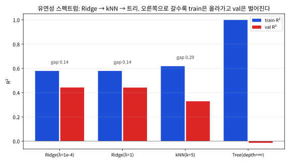

# 8.3 중간고사 대비 총정리

Block A(Chapter 2~8)의 마지막 블록이다. 이번 수업은 새 개념이 없다 — 대신
지금까지의 "알고 있는 것"이 **시험장에서 빈 종이에 스스로 재현될 수 있는
정도**인지 점검하는 자리다. "수업에선 이해했다"와 "시험장에서 유도할
수 있다"는 서로 다른 역량이다 — 특히 손유도 문제와 "왜?" 질문이 나오는
시험에서는 후자가 직접 점수로 연결된다. 그래서 이 절의 구조는 단순하다:
**시험에서 가장 자주 나오는 질문 유형을 4개로 뽑고, 그중 "손으로 써야
하는" 3가지(유도 템플릿 ①②③)를 실제로 종이에 풀고, 나머지는 자가진단
플로우와 확인 문제 9개로 채운다.** 실습 노트북(페이지 상단 Colab 배지)은
이 세 템플릿의 숫자를 코드로 검증해 준다.

### 장별 핵심 질문 정리

| 장 | 핵심 질문 | 다시 봐야 할 개념 |
|---|---|---|
| Ch02 | 같은 선형모델로 회귀와 분류를 어떻게 모두 푸는가 | 경사하강법, 정규방정식, 교차 엔트로피 |
| Ch03 | 생성적 접근과 판별적 접근의 차이는 무엇인가 | 베이즈 정리, GDA/로지스틱회귀의 관계 |
| Ch04 | "가깝다"만으로 예측하는 것의 한계는 무엇인가 | 편향-분산, 차원의 저주 |
| Ch05 | 확률이 아니라 마진으로 경계를 정하면 무엇이 달라지는가 | 서포트 벡터, 커널 트릭[^cortespapnikas95]|
| Ch06 | 과적합을 손실함수로 어떻게 통제하는가 | L1/L2 정규화, 교차검증 |
| Ch07 | 트리를 어떻게 앙상블하고, 그 예측을 어떻게 설명하는가 | 정보이득, 랜덤포레스트[^rf] vs GBDT[^gbdt], SHAP[^shap] |

중간고사는 이 여섯 장의 개념을 새로운 상황에 적용하는 문제(손유도 포함)로
구성된다 — Chapter 2, 6에서 연습한 정규방정식·Ridge 회귀 유도 패턴이
다른 손실함수에도 그대로 적용되는지 확인하는 것이 좋은 복습이다.

이 표는 "다시 봐야 할 개념"의 *목록*으로 읽지 말고, **"핵심 질문"에 한
문장으로 답할 수 있는가**의 자가진단 도구로 쓰자. 여섯 문항 전부 막힘없이
답하면 이 절의 나머지 부분은 빠르게 훑으면 되고, 답이 중간에 끊기는 장이
보이면 그 장의 "다시 봐야 할 개념"으로 돌아가 해당 절의 확인 문제를
2~3개 풀어보는 것이 가장 효율적인 시간 배분이다.

### 시험에서 반복되는 질문 유형 4가지

Block A 여섯 장의 시험 문항을 유형별로 모으면 실제로는 네 가지 밖에
없다 — 문항의 피부는 달라도 뼈대는 이 중 하나다.

| 유형 | 예 | 이 절의 어디에서 준비하나 |
|---|---|---|
| ① **유도(빈칸 완성)** | "경사하강 1스텝의 빈칸을 채우시오", "KKT 조건에서 해를 구하시오" | §유도 템플릿 ①② |
| ② **"X를 키우면?" 정성 추론** | "C를 크게 하면?", "λ를 0으로 하면?", "트리 깊이를 늘리면?" | §유도 템플릿 ②③, §편향-분산 스펙트럼 |
| ③ **모델 비교(장 넘나들기)** | "kNN과 SVM은 왜 둘 다 스케일링이 필요한가?", "RF와 GBDT의 차이는?" | §확인 문제 1~6 |
| ④ **실전 코드·절차 판정** | "이 파이프라인의 누수 지점은?", "이 발표의 약점과 질문 하나" | §누수 원칙, 8.1·8.2절 |

유형 ①과 ②가 이 절의 "손으로 한 번" 세 템플릿으로, ③이 확인 문제로,
④는 8.1·8.2절에서 이미 연습한 것(리뷰 체크리스트, "자주 하는 실수")으로
준비된다. 즉 **①②를 실제로 종이에 써보고, ③④는 기존 섹션을 훑으면**
시험 준비가 끝나는 구조다.

### 손으로 한 번: 유도 템플릿 ① — 로지스틱회귀 경사하강, 1스텝

Ch02.3에서 경사하강을 배웠을 때, "경사가 \\((\hat p - y) x\\)로 나온다는
것"을 **믿었**다. 시험에서는 그 믿음을 **재현**해야 한다. 아래 4단계가
그 템플릿이다 — 손실이 무엇이든 "예측 대입 → 미분 → 1/n 곱하기 →
업데이트"의 순서만 지킨다면 같은 모양으로 쓰인다.

**문제**: 1차원 입력 \\(n=3\\) 샘플, \\(x=(1,2,3)\\), \\(y=(0,1,1)\\),
현재 \\(w=0.1\\), \\(b=0\\), 학습률 \\(\eta=0.5\\). 교차 엔트로피 손실
\\(\ell = -\frac1n\sum\_i [y\_i\log\hat p\_i + (1-y\_i)\log(1-\hat p\_i)]\\)
(\\(\hat p\_i=\sigma(wx\_i+b)\\))에서 **경사하강 1스텝**을 손으로 수행하라.

**1단계 — 예측 대입**. \\(z\_i = wx\_i+b = (0.1, 0.2, 0.3)\\)이므로
시그모이드를 대입한다:

| 샘플 | \\(x\_i, y\_i\\) | \\(z\_i\\) | \\(\hat p\_i = \sigma(z\_i)\\) | \\(\hat p\_i - y\_i\\) |
|---|---|---|---|---|
| 1 | (1, 0) | 0.1 | 0.524979 | \\(+0.524979\\) |
| 2 | (2, 1) | 0.2 | 0.549834 | \\(-0.450166\\) |
| 3 | (3, 1) | 0.3 | 0.574443 | \\(-0.425557\\) |

**2단계 — 손실 계산**(미분 전에 대수의 정확성을 점검).

\\[\ell = -\frac13\big[\log(0.475021) + \log(0.549834) + \log(0.574443)\big]
= \frac{0.744436 + 0.597797 + 0.554336}{3} \approx 0.6322\\]

**3단계 — 경사**. Ch02.3의 \\(\frac{\partial \ell}{\partial w}
= \frac1n\sum\_i(\hat p\_i - y\_i)x\_i\\)에 대입:

\\[\frac13\Big[\underbrace{(+0.524979)(1)}\_{\text{샘플1}} +
\underbrace{(-0.450166)(2)}\_{\text{샘플2}} +
\underbrace{(-0.425557)(3)}\_{\text{샘플3}}\Big]
= \frac{0.524979 - 0.900332 - 1.276671}{3}
= \frac{-1.652024}{3} = -0.550675\\]

\\(\frac{\partial \ell}{\partial b} = \frac13\sum\_i(\hat p\_i - y\_i)
= -0.116915\\)도 함께 구한다.

**4단계 — 업데이트**. \\(w \leftarrow 0.1 - 0.5\times(-0.550675)
= 0.375338\\), \\(b \leftarrow 0 - 0.5\times(-0.116915) = +0.058457\\).

**"왜?" — 부호 읽기**: 샘플 1은 실제 0인데 0.525로 예측했으므로
\\((\hat p - y) > 0\\) — 양수 기여가 \\(w\\)를 **작아지는** 쪽으로 당긴다
(예측 확률을 0 쪽으로 낮추려는 힘). 샘플 2·3은 실제 1인데 0.55·0.57로
예측했으므로 음수 기여로 \\(w\\)를 **크는** 쪽으로 밀어올린다. 그런데
\\(x\_i\\)가 곱하기 때문에 \\(x=3\\)인 샘플 3의 기여(−1.277)는 \\(x=1\\)인
샘플 1(+0.525)의 2.4배 무게를 가진다 — **"크게 틀린" 샘플이 아니라
"큰 특징 값으로 틀린" 샘플이 더 강한 힘**을 준다. 그래서 경사가 음수이고
\\(w\\)가 0.1에서 0.375로 오른다. 시험 답안에서 이 부호·가중 해석 한 줄이
"대입만 한 답"과 "이해한 답"을 가른다.

**"왜 \\((\hat p-y)x\\)인가?"**(빈칸 문제의 빈 칸은 보통 여기다).
연쇄법칙: \\(\frac{\partial}{\partial w}[-\log\hat p] = -\frac1{\hat p}
\cdot \frac{d\hat p}{dz}\cdot\frac{dz}{dw}\\), 그리고
\\(\frac{d\sigma}{dz}=\sigma(1-\sigma)\\)이므로
\\(\frac1{\hat p}\cdot\hat p(1-\hat p) = 1-\hat p\\)로 시그모이드의 미분이
**정말 예쁜 형태**로 정리되어 \\((\hat p - y)\\)만 남는다. "시그모이드의
미분이 시그모이드 자기self를 곱한 것"이 이 깔끔함의 원인이다. 이 경사가
정말 미분인 것인지 의심이 든다면 손실 \\(\ell(w)\\)를 \\(w\\)의 함수로 직접
짜서 유한차분 \\(\frac{\ell(w+\delta)-\ell(w-\delta)}{2\delta}\\)로 교차
검증할 수 있다 — 실습 노트북 §1이 정확히 그걸 해서 −0.550675와 일치함을
보여준다.

### 손으로 한 번: 유도 템플릿 ② — SVM KKT 조건, "C가 실제로 바꾸는 것"

Ch05.2의 소프트 마진 SVM에서 "C가 커지면 마진이 커진다"는 **잘못된
직감**을 시험에서 확인하는 문제가 자주 나온다. 아래 장난감 문제로 KKT를
손으로 풀어 보면, 그 직감이 어디서 꺾이는지 숫자로 보인다.

**문제**: 1차원 4개 점(실습 노트북은 sklearn 입력용으로[^scikitlearn] 2차원으로 놓았을
뿐, 계산된 해는 모든 C에서 두 번째 특징 계수가 0이다):

| 점 | \\(x\\) | \\(y\\) | 역할 |
|---|---|---|---|
| A | −1 | +1 | |
| B | −1 | +1 | A와 같은 위치(다중점) |
| C | +2 | −1 | |
| E | −0.2 | −1 | **이상치** — −1 클래스인데 +1 쪽에 붙어 있음 |

목적함수 \\(\min\_{w,b}\ \tfrac12 w^2 + C\sum\_i \xi\_i\\)
(약분 \\(y\_i(wx\_i+b) \ge 1-\xi\_i,\ \xi\_i \ge 0\\)). Ch05.2의 KKT 세
조건을 떠올린다:

1. **0 ≤ αᵢ ≤ C** — α는 "점 i에게 쓰인 위반 예산". C가 전체 예산이면
   α는 각 점에 배정된 몫이다.
2. **αᵢξᵢ = 0** — 마진 위반(ξᵢ>0)을 하는 점은 α가 상한 C에
   꽉 차 있다.
3. **αᵢ(yᵢf(xᵢ) − 1 + ξᵢ) = 0** —
   - αᵢ = 0: 마진 바깥(\\(y\_i f(x\_i) \ge 1\\)), 해에 영향 없음.
   - 0 < αᵢ < C: **마진 위에 정확히** (\\(y\_i f(x\_i) = 1\\)).
   - αᵢ = C: 마진 안 또는 오분류(\\(y\_i f(x\_i) \le 1\\)).

그리고 정합성(stationarity): \\(w = \sum\_i \alpha\_i y\_i x\_i\\),
\\(\sum\_i \alpha\_i y\_i = 0\\)(이 문제에선 클래스가 2:2라
\\(\alpha\_A+\alpha\_B = \alpha\_C+\alpha\_E\\)). A·B가 같은 \\((x,y)\\)이므로
대칭으로 \\(\alpha\_A=\alpha\_B \triangleq a\\). 이제 C를 0에서부터 올리며
각 구간의 해를 구한다 — **이 4단계가 템플릿**이다(구간 경계는 "어떤
α가 상한/0에 닿는가"로 구한다):

| 구간 | \\(C\\) 범위 | α | \\(w, b\\) | \\(\\|w\\|^2\\) | 마진 \\(2/\\|w\\|\\) | SV |
|---|---|---|---|---|---|---|
| I | \\(C \le \tfrac{10}{57}\approx0.175\\) | 전부 = C | \\(-3.8C,\ 1.9C\\) | \\(14.44\\,C^2\\) | \\(\tfrac{2}{3.8C}\\) (52.6→3.0) | A,B,C,E |
| II | \\(\tfrac{10}{57} < C < \tfrac56\\) | \\(\alpha\_E=C\\), \\(a=\tfrac19+\tfrac{11}{30}C\\), \\(\alpha\_C=\tfrac29-\tfrac4{15}C\\) | **\\(-\tfrac23,\ \tfrac13\\) 고정** | **4/9** (고정) | **3.0** (고정) | A,B,C (E는 마진 안) |
| III | \\(\tfrac56 < C < \tfrac{25}{8}\\) | \\(\alpha\_E=C\\), \\(a=C/2\\), \\(\alpha\_C=0\\) | \\(-0.8C,\ 1-0.8C\\) | \\(0.64\\,C^2\\) | \\(\tfrac{2.5}{C}\\) (3.0→0.8) | A,B,E |
| IV | \\(C \ge \tfrac{25}{8}=3.125\\) | \\(a=\tfrac{25}{16}\\), \\(\alpha\_E=\tfrac{25}{8}\\), \\(\alpha\_C=0\\) | **\\(-\tfrac52,\ -\tfrac32\\) 고정** | **6.25** (고정) | **0.8** (고정) | A,B,E |

(구간 경계: I→II는 A·B가 마진 위에 올 때까지 \\(f(-1)=5.7C=1 \Rightarrow
C=10/57\\). II→III은 \\(\alpha\_C=0\\)가 되는 \\(C=5/6\\). III→IV은 E가
마진 위에 오기까지 \\(y\_E f(x\_E)=0.64C-1=1 \Rightarrow C=25/8\\). 참고로
E는 \\(C<25/16=1.5625\\)에서는 아직 **오분류** 상태다.)

이 표를 읽는 법 — "C가 무엇을 바꾸는가"의 정답이 여기에 있다:

- **구간 I**(C 작음): 예산이 작아 **모든 점**이 상한 C에 꽉 찬다. 경계는
  \\(x=0.5\\)에 고정(±1·+2 군의 중점)이고 C가 커지면 마진이 \\(C\\)에
  비례해 팽창한다(\\(14.44C^2\\)). "C를 올리면 마진이 커진다"는 직감이
  **유일하게** 맞는 구간이다.
- **구간 II**: A·B가 마진 위에 닿자(\\(C\approx0.175\\)) 이상치 E의
  위반(ξᵢ>0)이 αᵢ=C로 최대 배정되고, 경계는 \\(w=-\tfrac23,\ b=\tfrac13\\)
  로 **정지**한다. 마진 3.0은 +1 군(−1)과 C(+2) 사이의 최대 마진 —
  **이상치를 무시하고 가능할 만큼** 큰 마진이다. 여기서 C를 올려도
  \\(\\|w\\|^2\\)은 4/9에서 움직이지 않는다.
- **구간 III**: E의 위반 비용이 너무 커지자(C≥5/6) C(+2)가 마진에서
  빠지고(\\(\alpha\_C=0\\)), 경계가 **왼쪽으로 미끄러지며** E를 감싸기
  시작한다(\\(w=-0.8C\\)). 마진은 3.0에서 \\(\tfrac{2.5}{C}\\)로 **줄어든다**
  (C를 올리면 마진이 줄어드는 구간!). \\(C=25/16\\)에서 E가 마침내
  올바르게 분류된다.
- **구간 IV**(\\(C\ge3.125\\)): E도 마진 위에 닿으면 해는
  \\(w=-\tfrac52,\ b=-\tfrac32\\)로 **다시 정지**한다. 이제 경계는 A(−1,+1)와
  **이상치 E**(−0.2,−1)가 정한다 — 이 두 점의 중점 −0.6, 반갭 0.4, 마진
  0.8. **C를 100으로 올려도 \\(\\|w\\|^2=6.25\\), 마진 0.8, 경계 x=−0.6은
  변하지 않는다.**

**"왜?"**: C가 바꾸는 것은 마진의 *크기*가 아니라 **"이상치 E의 위반을
얼마까지 사들이는가"**다. 이 문제에서 달성 가능한 마진의 범위는 지오메트리가
정한다 — 이상치를 무시하면 최대 3.0(−1과 +2 사이), 이상치를 마진 안에
넣으려면 0.8(−1과 −0.2 사이)까지만 가능하다. C는 그 두 극단 사이의
트레이드오프를 선택할 뿐, "무한히 큰 마진"이라는 선택지는 존재하지
않는다. 시험에서 "C를 크게 하면 무엇이 변하고 무엇이 변하지 않는가"를
물으면, 이 4구간표의 **구간 IV** — "C ≥ C\* 이후 해는 C에 무관하다" —
가 정답의 뼈대다. 실습 노트북 §2가 이 4구간표를 실제 C 스위프로 검증하고
(\\(\\|w\\|^2\\)이 14.44C²로 오르면 4/9로 수평, 0.64C²로 다시 오르면
6.25로 수평), αᵢ를 `dual_coef_`로 읽어 손계산과 대조한다.

### 손으로 한 번: 유도 템플릿 ③ — "두 항의 구조"(Ridge · Lasso · SVM · GBDT)

확인 문제 3이 짚은 대로, Ch02~07의 모델들은 목적함수가 **"적합도 +
단순성"의 두 항**이라는 공통 구조를 가진다. 시험의 "~의 목적함수를 쓰고
각 항이 무엇을 하는지 설명하시오"는 이 표를 쓰는 것과 같다.

| 모델 | 목적함수 | 적합도 항 | 단순성 항 | 노브(트레이드오프) |
|---|---|---|---|---|
| Ridge (Ch06) | \\(\ell\_{\text{MSE}} + \frac{\lambda}{2}\\|w\\|^2\\) | \\(\ell\_{\text{MSE}}\\): 데이터에 맞추기 | \\(\\|w\\|^2\\): 가중치 축소(분산↓) | \\(\lambda\\) (0→무정규화, ∞→w=0) |
| Lasso (Ch06)[^tibshirani1996] | \\(\ell\_{\text{MSE}} + \lambda\\|w\\|\_1\\) | 위와 같음 | \\(\\|w\\|\_1\\): **정확히 0** 만드는 켄(kink) | \\(\lambda\\) |
| 소프트 마진 SVM (Ch05.2) | \\(\tfrac12\\|w\\|^2 + C\sum\_i \xi\_i\\) | \\(C\sum\xi\_i\\): 위반 사들이기 | \\(\tfrac12\\|w\\|^2\\): 마진 최대화 | \\(C\\) (0→w=0, ∞→하드마진) |
| GBDT (Ch07.3) | (반복) 잔차에 트리를 적합하고 \\(\eta\\)로 축소 | 트리: 잔차(적합의 잔여)를 설명 | \\(\eta\\)(학습률), \\(n\\)(트리 수) | \\(\eta\\), \\(n\\) |
| kNN (Ch04) | *(파라미터 없음 — 모든 점 memorize)* | "적합" = 전량 암기 | \\(k\\): 이웃 평균으로 매끄럽게 | \\(k\\) (1→암기, ∞→다수 클래스) |

패턴 한 줄: **적합도 항은 "데이터에 잘 맞추는 것"을, 단순성 항은
"모델을 단순하게 유지하는 것"을 재고, 노브 하나가 둘의 비중을 조절한다.**
노브를 0으로 가면 적합만 남고(과적합 위험, Ch04.1), ∞로 가면 단순성만
남는다. 두 모델의 노브가 **역방향**인 점에 주의: Ridge의 \\(\lambda\\)는
"크면 단순"인데, SVM의 \\(C\\)는 **"크면 적합(위반을 덜 허용)"**이다 —
"λ를 크게 하면?"과 "C를 크게 하면?" 문항은 정반대 방향으로 답해야 한다.
kNN은 목적함수가 아예 없으므로 이 틀에 끼지 않는다 — "kNN의 정규화 항은?"
이라는 함정 문항의 정답은 "없다. k 자체가 매끄러미(간접적 단순성)를
조절할 뿐"이다.

### 편향-분산 스펙트럼: 같은 데이터, 네 모델

"유연한 모델 vs 단순한 모델"을 **같은 데이터**에서 놓고 train/val을
동시에 보는 문제는 Ch04.1·Ch06.2·Ch07.3의 개념을 한 문항에 끼워 넣는
전형이다. diabetes(442×10)[^diabetes]로 train 265 / val 88 / test 89 (Ch06.3 원칙대로
스케일러 fit은 train으로만)를 나눠 4개 모델을 돌리면 아래 표가 나온다
(실습 노트북 §3):

| 모델 | train R² | val R² | 격차 (train − val) |
|---|---|---|---|
| Ridge(\\(\lambda{=}10^{-4}\\)) [Ch02,06] | 0.579 | 0.443 | 0.137 |
| Ridge(\\(\lambda{=}1\\)) [Ch06] | 0.579 | 0.442 | 0.137 |
| kNN(k=5) [Ch04] | 0.618 | 0.329 | 0.290 |
| Tree(무제한 깊이) [Ch07.1] | 1.000 | **−0.014** | **1.014** |

읽는 법(= 시험 답안 구조):

- **왼쪽 → 오른쪽으로 갈수록 모델의 유연성(가용 자유도)이 커진다.**
  Ridge는 10개 가중치에 \\(\lambda\\)로 매달아 자유도를 조절하는 "연속
  스펙트럼"의 한 점이고, 무제한 트리는 265건을 전부 외우는 "스펙트럼의
  끝"이다.
- 격차가 큰 모델(오른쪽)은 **분산**이 크다 — Ch04.1의 언어로는 "모델
  추정량이 train 데이터의 선택에 따라 크게 흔들린다." 격차가 작은 모델
  (왼쪽)은 **편향**이 크다 — Ch06의 언어로는 "평균적으로 진실을 향한
  systematic한 오차."
- 트리의 val R²가 **0 아래**(음수)라는 것: train에서 1.000을 찍고도
  검증 데이터에서는 *평균만 예측하는 모델보다 나쁘다*는 뜻이다. Ch06.2의
  U자 곡선에서 "\\(\lambda \to 0\\) 쪽 끝"이 실제로 이렇게 처져 있음을
  보여주는 숫자다. ("train R²=1.000이니까 좋은 모델"이라는 답안은 이
  한 줄로 반박된다.)
- **Ridge(10⁻⁴)와 Ridge(1)가 거의 같다**는 점도 읽자: 표준화한 265개
  샘플에서 \\(\lambda=1\\)은 데이터 스케일 대비 아직 매우 작은 벌금이다
  — "\\(\lambda\\)가 1로 작아 보이지만 실제로도 작을 수 있다"는 감각
  (Ch06.1의 스케일 의존성)이 여기 있다.

이 그림의 교훈은 8.1절의 GBDT 학습 곡선(§"test를 한 번만")과 동일하다 —
**train 곡선은 "배운 것을" 재고, val 곡선만 "재는 것을" 한다.**

### 장을 넘나드는 동치성: GDA와 로지스틱회귀는 정말 같은 경계인가

확인 문제 1의 답은 "둘 다 \\(P(y{=}1\mid x)=\sigma(w^Tx+b)\\)라는 같은
**형태**에 도달한다"는 것이었다. 그런데 "동치"는 어디까지 진실인가?
breast_cancer(569×30)[^breast_cancer]로 실측해보면 답이 정교해진다(실습 노트북 §4;
train/test = 70/30, stratify, 스케일러는 train으로만 fit):

| 측정 | 값 |
|---|---|
| 로지스틱회귀 test AUC (판별적, Ch02) | 0.9934 |
| GDA/LDA test AUC (생성적, Ch03) | 0.9855 |
| 두 모델의 test 출력 확률 상관계수 | 0.900 |
| 경계 벡터 방향 유사도 \\(\cos(w\_{\text{logit}}, w\_{\text{GDA}})\\) | 0.203 |
| test 클래스 라벨 일치율 | 93.6% |

즉: **결정 경계(분류)는 거의 같고(라벨 93.6% 일치, AUC 0.99 부근),
출력 확률도 꽤 비슷하지만(상관 0.900), 경계 벡터 \\(w\\)의 방향은
사실 다르다(cos 0.203).** Ch03.2의 동치성은 **\\(P(x\mid y)\\)가
정규분포라는 전제 하에** 성립하는 등식이다[^gda] — 이 데이터가 정규분포가
아니므로 전제가 약하게 깨지고, "같은 **형태**의 경계, **다른 계수**"가
나온다. 시험에서 "GDA와 로지스틱회귀는 동치인가"를 물으면 **"정규분포
가정이 성립하면 계수까지 같은 방향의 경계지만, 전제가 깨지면 경계의
*형태*(시그모이드-선형)만 같고 계수는 경로(생성적 vs 판별적)에 따라
다르다"** — 이 전제·반례 한 쌍이 있는 답이 3점 답안이다. "동치"를
"계수도 같다"로 지나치게 강하게 확장하지 않는 것이 정직한 답안이다.

### 누수 원칙, 숫자로: 전처리 통계를 어디에서 fit하는가

확인 문제 6의 "가장 흔히 깨지는 지점" — `StandardScaler`의 `fit`(평균·
표준편차)을 **전체** 데이터로 하는 것 — 의 효과를 diabetes 데이터
(위 스펙트럼과 같은 분할)에서 실측하면(실습 노트북 §5):

| 스케일러 fit 범위 | val R² |
|---|---|
| 전체(train+val+test) — **원칙 위반** | 0.4417 |
| train만 — 원칙 준수 | 0.4417 |

차이는 \\(3\times10^{-5}\\) — **거의 없다.** 이 "거의 없다"가 정답이다:
diabetes는 "행 하나 = 독립 관측"이어서 train의 평균/표준편차와 전체의
것이 거의 같다. 누수가 **크게** 벌어지는 것은 Ch06.3의 환자 예처럼
**동일 실체(환자, 계좌, 사용자)가 train과 val/test에 동시에 들어와
정보를 공유할 때**다 — 그때는 `fit`의 위치가 아니라 **분할 자체**가
문제를 만든다(§"자주 하는 실수" 2번). "누수는 항상 val 숫자를 부풀린다"
가 아니라 **"누수가 커지는 조건(공유된 실체, 시간 순서)"을 설명할 수
있는가**가 이 개념의 시험 판정 기준이다.

### 자가진단: 5문항 빠른 체크와 40분 모의 문제

시험 1주일 전, 아래 5문항을 **종이에** 답해볼 수 있다면 Block A의
핵심은 잡은 것이다(답은 전부 이 절과 8.1·8.2절에 있다).

1. **장별 핵심 질문** 6문항 중, 한 문장도 멈추지 않고 답할 수 있는 것이
   몇 개인가? (5개 이상이면 양호)
2. 유도 템플릿 ①의 4단계를 빈칸 없이 쓸 수 있는가? (\\(\hat p\\) 대입 →
   \\(\ell\\) 계산 → \\(\frac1n\sum(\hat p-y)x\\) → \\(w-\eta\nabla\\).
   숫자 −0.5507까지 재현)
3. 유도 템플릿 ②에서 "C ≥ 25/8 이후 왜 \\(\\|w\\|^2=6.25\\)로 고정되는가"를
   KKT 세 조건으로 쓸 수 있는가?
4. 같은 데이터에서 "train R² = 1.000"인 모델에 대해, 편향-분산 언어로
   2문장 진단을 쓸 수 있는가?
5. 8.2절의 가상 발표(99.8:0.2 데이터, 정확도 99.7% vs 99.8%)에 대해,
   장·절을 명시한 반박 가능한 질문 하나를 쓸 수 있는가?

**40분 모의 문제**(시험 시간 감각 연습): ① 유도 1문항 12분(템플릿 ①
또는 ②, 시계 보며) → ② "C를 키우면 / λ를 키우면" 정성 문제 8분 →
③ 장 넘나들기 비교 문제 8분(확인 문제 1~6 중 무작위) → ④ 코드 판정
문제 6분(§"자주 하는 실수" 중 하나를 "이 코드 어디가 문제인가" 형식
으로) → ⑤ 남은 6분은 ②의 답을 **반대로**(C를 0으로 하면?) 다시
쓰기. ⑤를 할 수 있으면 "노브 트레이드오프" 양방향 이해가 완성된 것이다.

### 자주 하는 실수

Block A 개념에서 시험과 복습 둘 다에서 반복되는 실수 6가지 —
각각이 "왜"를 빠뜨린 실수다.

- **경사 부호/계수 혼동**(템플릿 ①): \\(w \leftarrow w-\eta\nabla\\)의
  **마이너스**를 빼먹거나, 평균 손실의 \\(1/n\\)을 빼먹어 숫자가 n배로
  틀린다. 실습: 위 예의 경사가 −0.5507이 아니라 −1.652가 나와야 하는
  상황(= \\(1/n\\) 누락)을 의식적으로 만들어 보고, 어느 단계에서 \\(1/n\\)이
  들어가는지 확인.
- **"C를 키우면 마진이 무한히 커진다"**(템플릿 ②): 위 4구간표의
  구간 IV — C ≥ 3.125 이후 \\(\\|w\\|^2\\)은 6.25로 고정된다. "C가 바꾸는
  것은 위반 허용(어떤 점이 SV인가)이지 마진의 상한은 아니다."
- **"동치"를 "계수가 같다"로 확장**(§동치성): 정규분포 전제가 깨지면
  경계의 *형태*만 같고 \\(w\\) 방향은 다르다(cos 0.203). 답안에 "전제"
  한 단어가 없으면 2점.
- **"train R² = 1.000이면 좋은 모델"**(§스펙트럼): 무제한 트리는
  train 1.000 / val −0.014 — val(또는 gap)로만 판단.
- **스케일러를 전체로 fit하면서 "데이터가 깨끗해서 차이가 안 났을
  뿐"이라고 넘어감**(§누수): 깨끗한 데이터에서는 차이가 작아도,
  환자/계좌 단위 데이터에서는 격차가 커진다 — "누수가 커지는 조건"을
  함께 써야 만점.
- **Ridge의 \\(\lambda\\)와 SVM의 \\(C\\)를 같은 방향의 노브로 생각**
  (템플릿 ③): \\(\lambda\\)는 "크면 단순", \\(C\\)는 "크면 적합(위반을 덜 허용)"
  — 정반대. "노브를 크게 하면" 문항에서 가장 흔한 0점.

### 확인 문제: 장을 넘나드는 복습 문제 9개

각 문항은 여러 장의 개념을 동시에 확인한다 — 먼저 스스로 답해본 뒤
아래 답과 비교해보자. 1~6은 장 넘나들기(유형 ③), 7~9는 이번 절의 유도
템플릿(유형 ①②)에 대응한다.

**1.** 로지스틱회귀(Ch02)와 GDA(Ch03)는 둘 다 어떤 공통된 최종 형태에
도달하는가?
> 답: 둘 다 \\(P(y{=}1|x)=\sigma(w^Tx+b)\\)라는 같은 시그모이드-선형
> 형태에 도달한다(Ch03.2). 다만 로지ส틱회귀는 이 형태를 판별적으로
> 직접 학습하고, GDA는 정규분포를 가정한 생성적 모델링에서 베이즈
> 정리로 유도해낸다는 경로가 다르다.

**2.** kNN(Ch04)에서 \\(k\\)를 1로 두는 것과 SVM(Ch05)에서 \\(C\\)를
매우 크게 두는 것은 편향-분산 관점에서 어떤 공통점이 있는가?
> 답: 둘 다 모델을 데이터에 최대한 정확히 맞추려는 극단이라, 분산이
> 커지고(과적합 위험) 편향은 작아지는 쪽으로 치우친다 — \\(k=1\\)은
> 노이즈 하나에도 민감하고, \\(C\\)가 매우 크면 이상치 하나까지 완벽히
> 분류하려 든다(Ch05.2).

**3.** Ridge(Ch06)와 SVM의 소프트 마진(Ch05.2) 목적함수는 둘 다 "두
항의 합"이라는 공통 구조를 갖는다. 각각 어떤 두 항인가?
> 답: Ridge는 "적합도(원래 손실) + \\(\lambda\\)×가중치 크기", SVM
> 소프트 마진은 "\\(\frac{1}{2}\\|w\\|^2\\)(마진 최대화) + \\(C\\)×위반
> 정도(힌지 손실)"다. 둘 다 "데이터에 잘 맞추기"와 "모델을 단순하게
> 유지하기" 사이의 트레이드오프를 하나의 하이퍼파라미터(\\(\lambda\\)
> 또는 \\(C\\))로 조절한다는 점이 같다.

**4.** 나이브베이즈(Ch03.3)와 결정 트리(Ch07.1)는 왜 둘 다 특징
스케일링이 필요 없는가?
> 답: 나이브베이즈는 각 특징의 확률 \\(P(x\_j|y)\\)을 독립적으로
> 추정할 뿐 특징 값들 사이의 거리를 재지 않는다. 결정 트리는 "이
> 특징이 threshold보다 큰가"라는 순서 정보만 쓴다(Ch07.1 FAQ) —
> 둘 다 kNN·SVM·k-means처럼 거리를 직접 계산하지 않기 때문이다.

**5.** 랜덤 포레스트(Ch07.2)와 GBDT(Ch07.3)의 트리 학습 방식(독립
병렬 vs 순차적 잔차 학습) 차이가, 라벨링 오류에 대한 취약성에 어떤
영향을 주는가?
> 답: 랜덤 포레스트는 트리들이 서로 독립적이라 한 트리가 라벨 오류를
> 과하게 학습해도 다수결에서 다른 트리들에 의해 희석된다. GBDT는
> 각 트리가 이전까지의 잔차를 좇으므로, 라벨 오류가 만드는 이상한
> 잔차를 후속 트리들이 계속 따라가며 과적합할 위험이 더 크다(Ch07.3
> FAQ).

**6.** Chapter 6.3의 데이터 누수(leakage) 원칙이 이번 프로젝트에서
가장 흔히 깨지는 지점은 어디인가?
> 답: 정규화·표준화 통계량(평균, 표준편차)이나 결측치 대체값을
> train/val/test로 나누기 **전에** 전체 데이터로 미리 계산하는
> 경우다(Ch06.3) — 프로젝트에서 `StandardScaler`나 결측치 대체를 쓸
> 때 `fit`은 반드시 train 데이터에만 적용하고, val/test에는 `transform`
> 만 적용해야 한다.

**7.** (템플릿 ②) 유도 템플릿 ②의 4점 문제에서, \\(C=3.125\\)와
\\(C=100\\)의 해(\\(w^\*, b^\*\\), SV 집합)는 같다. KKT 조건으로 **왜**
같은지, 그리고 \\(C\\)를 더 키워도 바뀌지 않는 마진의 **상한 값(0.8)**을
두 점의 지오메트리에서 직접 구해보자.
> 답: \\(C\ge25/8\\)에서는 A·B(−1,+1)와 이상치 E(−0.2,−1)가 모두
> 마진 위에 있고(0<αᵢ<C), C(+2)는 마진 바깥(α_C=0)이다 — 이 세 상태
> (마진 위/위/바깥)는 C의 크기에 의존하지 않으므로 KKT의 해도 C에
> 무관하다. 마진의 상한은 **가장 가까운 다른 클래스 두 점**이 정한다:
> A(−1,+1)와 E(−0.2,−1) 사이의 거리 0.8이므로 경계는 중점 −0.6,
> 반갭 0.4, 마진 \\(2/\\|w\\|=0.8 \Rightarrow \\|w\\|=2.5,\ \\|w\\|^2=6.25\\).

**8.** (템플릿 ①) 유도 템플릿 ①에서 학습률을 \\(\eta=0.5\\) 대신
\\(\eta=2\\)로 쓴다면 1스텝 후의 \\(w, b\\)는? 그리고 "학습률을 크게
하면 항상 빨리 수렴한다"가 왜 성급한 결론인지, 이 숫자만으로 말할 수
있는 한계는?
> 답: \\(w=0.1-2\times(-0.550675)=1.201350\\),
> \\(b=0-2\times(-0.116915)=0.233830\\) — 스텝이 정확히 4배. 한계:
> 손실면이 볼록(교차 엔트로피는 볼록)이므로 이 방향의 큰 스텝은 손실을
> *낮추기는* 한다, 그러나 스텝이 경사 변화율에 비해 너무 크면 다음
> 스텝에서 반대쪽으로 **오버슈팅**하며 손실이 튀어오를 수 있다 —
> 1스텝만으로는 "수렴"이 아니라 "더 큰 스텝"만을 볼 수 있다.
> (Ch09 Block B에서 학습률 스케줄링이 이 주제의 일반화다.)

**9.** (템플릿 ③) Lasso(Ch06.1)의 목적함수 두 항을 쓰고, "왜 L1은
가중치를 **정확히 0**으로 만들지만 L2는 (유한한 \\(\lambda\\)에서는)
그렇지 않은가"를 한 문장으로 답하자.
> 답: \\(\min\_w \ell\_{\text{MSE}}(w) + \lambda\\|w\\|\_1\\).
> \\(\\|w\\|\_1\\)는 \\(w\_j=0\\)에 **켄(kink)**을 만들어, 원래 손실
> 기울기의 절댓값이 \\(\lambda\\) 이하이면 정답이 그 켄에 딱 붙어
> \\(w\_j=0\\)이 된다(Ch06.1의 소스 스로싱 \\(\mathcal{T}\_\lambda\\)).
> 반면 \\(\\|w\\|^2\\)은 0에서 기울기가 0인 매끄러운 볼록함수라
> \\(w\_j\\)를 0으로 *가까이* 당기지만 유한한 \\(\lambda\\)로는 정확히
> 0까지 데려가지 못한다.

**지금까지 배운 어떤 모델도 "항상 최선"이지 않다 — 실전에서는 데이터의
특성을 보고 어떤 도구를 쓸지 스스로 판단해야 한다는 것이, 이번 프로젝트가
남기는 가장 중요한 교훈이다.**

### 자주 묻는 질문

**Q. 중간고사에 코딩 문제도 나오나요?** 이번 학기의 손유도 연습문제
(Tier A/B/C)와 같은 형식의, 빈칸을 채우거나 핵심 로직을 손으로 쓰는
문제가 나올 수 있다 — Chapter 2, 6, 7에서 반복해서 연습한 "핵심 줄이
빈칸으로 남겨진 함수를 완성하라" 형식이 가장 가까운 연습이다.

**Q. 여섯 장을 전부 똑같은 비중으로 공부해야 하나요?** 위 표의
"핵심 질문"에 스스로 답할 수 있는지가 가장 빠른 자가 진단이다 — 막힘
없이 설명할 수 있는 장은 가볍게 훑고, 설명이 막히는 장에 시간을
더 쓰는 것이 효율적이다. 특히 손유도 문제(정규방정식, GDA↔로지스틱회귀
동치성, 마진 공식 등)는 시험에서 그대로 다시 나올 가능성이 높으므로
우선순위를 높게 두는 것이 좋다.

**Q. 시험 전날에 이 절의 어떤 숫자를 기억해두면 좋나요?**
**세 숫자**를 종이에 쓸 수 있으면 되며, 각각이 한 장의 핵심 유도를
압축한다: **(1) −0.5507**(템플릿 ①의 1스텝 경사, Ch02),
**(2) C\* = 3.125 이후 ‖w‖² = 6.25로 고정**(템플릿 ②의 마진 상한 0.8,
Ch05), **(3) 무제한 트리의 train 1.000 / val −0.014, 격차 ≈ 1.0**
(§스펙트럼, Ch04·06·07). 이 세 숫자를 "어떤 가정에서, 왜" 나오는 수로
설명할 수 있으면 유도 문제의 뼈대는 확보한 것이다 — 숫자 자체는
실습 노트북에서 언제든 재현된다.[^cs229]

**Q. "장 넘나들기" 문제(확인 문제 1~6)는 어떻게 연습하나요?**
한 문항을 **두 장의 언어로 각 한 문장씩** 답해보는 것이 훈련이다.
예를 들어 확인 문제 4(나이브베이즈 vs 트리, 스케일링 불필요)는
"Ch03.3의 언어: \\(P(x\_j \mid y)\\)를 독립 추정하므로 거리 계산이 없다"
+ "Ch07.1의 언어: 순서(>threshold)만 쓰므로 스케일에 불변"으로 나눠
쓰면, 시험장에서 한쪽 장만 떠올라도 다른 쪽에서 이어붙일 수 있다.

**Q. 실습 노트북의 `IMG` 경로가 로컬 경로인데 Colab에서 되나요?**
본문 상단의 Colab 배지로 열면 첫 코드 셀의 \\(IMG\\)를 `"/tmp"`로
바꾸고 실행하면 된다(노트북 첫 마크다운 셀에 메모가 있다). 그림(SVG)
생성이 목적이 아니라 **§1~§5의 숫자가 본문과 일치하는지** 확인하는 것이니,
Colab에서는 `savefig` 줄만 주석내고 출력만 보는 것도 방법이다.

[^shap]: Lundberg, S. M., Lee, S.-I. (2017). "A Unified Approach to Interpreting Model Predictions." NeurIPS 2017, arXiv:1705.07874. — 모델 예측을 해밍 가치로 분해하는 SHAP의 원 논문.
[^cs229]: 더 깊이 보려면: Stanford CS229: Machine Learning, Lecture Notes. https://cs229.stanford.edu/main_notes.pdf — 이 절의 복습 범위(경사하강, 정규화, 교차검증, 편향-분산)와 CS229 강의 노트의 핵심 단원들이 겹친다.
[^rf]: Breiman, L. (2001). "Random Forests." Machine Learning 45(1) 5–32. — 개별 트리를 무작위 특징 부분집합과 부채집합(Bagging)으로 학습해 앙상블하는 랜덤포레스트의 원 논문.
[^gbdt]: Friedman, J. H. (2001). "Greedy Function Approximation: A Gradient Boosting Machine." Annals of Statistics 29(5) 1189–1232. — 이전 트리의 잔차(구배)를 순차적으로 보완하는 GBDT(그레디언트 부스팅)의 원 논문.
[^scikitlearn]: Pedregosa, F., Varoquaux, G., Gramfort, A., et al. (2012). "Scikit-learn: Machine Learning in Python." arXiv:1201.0490. — 위 SVM 손계산 실습 노트북에서 쓰는 `SVC`·`dual_coef_`, 스펙트럼·누수 실측에서 쓰는 스케일러 등 scikit-learn API를 제공하는 라이브러리의 원 논문.
[^breast_cancer]: scikit-learn `load_breast_cancer` 데이터셋 — 위스콘신 진단 유방암(Wisconsin Diagnostic Breast Cancer, WDBC)의 고전 데이터로, 유방 종양 세포 핵의 30개 수치 특징과 양성/악성 이분 라벨 569개.
[^diabetes]: scikit-learn `load_diabetes` 데이터셋 — 442명의 환자, 10개 임상 특징, 1년 후의 질환 진행도 수치(회귀 목표값).
[^cortespapnikas95]: Cortes, C., Vapnik, V. (1995). "Support-Vector Networks." Machine Learning 20(3), 273–297. — 소프트 마진 SVM(여유 변수 + \\(C\\) 트레이드오프)의 원 논문.
[^tibshirani1996]: Tibshirani, R. (1996). "Regression Shrinkage and Selection via the Lasso." *Journal of the Royal Statistical Society: Series B (Methodological)* 58(1), 267–284. — Lasso(L1 정규화)의 원 논문.
[^gda]: Ng, A. Y., Jordan, M. I. (2001). "On Discriminative vs. Generative Classifiers." NIPS 14 (Advances in Neural Information Processing Systems). — GDA(Generalized Discriminative Analysis)를 제안한 원 논문: 판별 모델(로지스틱회귀)과 생성 모델(나이브베이즈)의 결정 경계를 비교하고, 올바른 파라미터화 시 GDA의 사후확률이 로지스틱회귀의 시그모이드와 정확히 같은 형태가 됨을 보인다.
