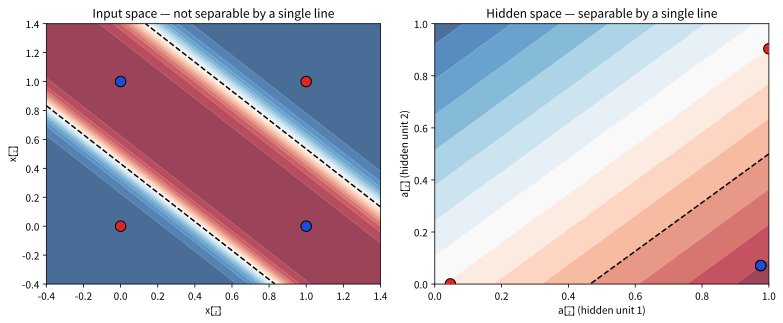
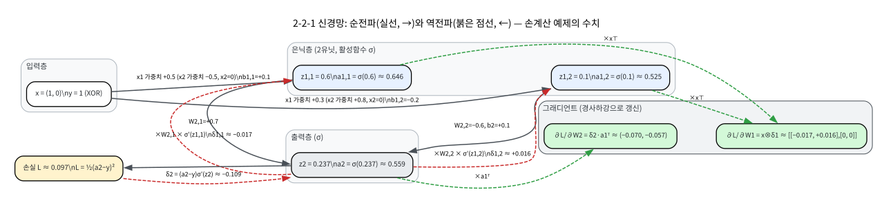

# 9.1 퍼셉트론의 한계, 순전파, 역전파

[](https://colab.research.google.com/github/SuminHan/book-ml/blob/main/notebooks/ml1/chapter09_1_backprop_xor.ipynb)

### 퍼셉트론: "AI의 시작"이었고 "AI의 실망"이기도 했던 모델

1958년 프랭크 로젠블라트(Frank Rosenblatt)가 코넬 대학에서 **퍼셉트론**(perceptron)[^perceptron]을 발표했을 때, 대중매체는 "컴퓨터가 배운다", "컴퓨터가 본다", 심지어 "우주 탐사에 쓰일 1세대 로봇"이라고 보도했다. 로젠블라트는 코넬의 계산기 연구소(Cornell Aeronautical Laboratory)에 재직 중이었고, 퍼셉트론은 실제로 (당시 기준으로) 비행기 조종사의 얼굴을 인식하는 실험까지 했다. 모델은 Chapter 2의 로지스틱회귀와 거의 같다 — 시그모이드 대신 **스텝함수** \\(\text{sgn}(z)\\)를 쓴 것만 차이:

\\[\hat{y} = \text{sgn}\left(\sum\_{j=1}^{d} w\_j x\_j + b\right) = \text{sgn}(w^Tx + b)\\]

학습법도 Chapter 2.1의 경사하강법의 선조인 **퍼셉트론 학습 규칙** — 틀린 예제에 대해 가중치를 오차 방향으로만 갱신:

\\[\text{틀렸을 때: } w \leftarrow w + yx, \quad \text{맞았을 때: } w \leftarrow w\\]

(이 규칙은 선형분리 가능한 데이터에서 반드시 수렴한다는 **퍼셉트론 수렴 정리**[^perceptron]가 있다 — Chapter 2.1의 그래디언트 업데이트 \\(w \leftarrow w + \alpha \cdot (y-\hat{y})\\, x\\)와 비교하면, 로지스틱회귀의 업데이트가 "오차 크기에 비례하는 연속형"이고 퍼셉트론 규칙은 그것을 0/1로 끊어버린 이산형이라고 볼 수 있다.) 당시 언론의 흥분은 이해가 된다: **학습하는 기계**를 만들어낸 것이기 때문이다. 그런데 이 흥분은 11년 만에 냉탕으로 떨어진다.

### 1969, 《Perceptrons》: XOR의 벽과 AI의 겨울

1969년, 마빈 민스키(Marvin Minsky)와 시모어 페퍼트(Seymour Papert)가 MIT에서 쓴 책 *Perceptrons*[^minskypapert]가 단층 퍼셉트론의 한계를 수학적으로 증명했다: 단층 퍼셉트론은 **XOR**(두 입력이 다르면 1, 같으면 0)를 아무리 학습시켜도 절대 맞출 수 없다. 그 한계가 얼마나 근본적인지 — "학습률이 부족해서", "데이터가 부족해서"가 아니라 **모델 구조 자체**가 불가능하다는 것 — 이 다음 절의 주제다.

이 책의 영향은 학문적 결과를 넘어 산업의 방향을 돌렸다. 퍼셉트론은 당시 가장 뜨거운 AI 연구 주제였는데, 그 책이 "단층 신경망은 논리회로조차 못 만든다"고 판사처럼 단정한 것이다. 투자와 논문 수가 급감했고, 1970년대 후반~1980년대 중반으로 이어진 1차 "AI 겨울(AI winter)"의 직접적인 원인 중 하나가 됐다. (민스키·페퍼트의 정리가 단층 퍼셉트론의 *수학적 한계*를 정확히 짚은 것은 맞되, 대중적으로는 "신경망은 쓸모없다"는 과도한 일반화로 읽혔다는 평가가 많다.) 그 긴 동면기를 깨운 것이 1986년 럼멜하트, 힌턴, 윌리엄스의 역전파 대중화 논문[^rwh86]이었다 — 그리고 이 절의 마지막까지 가보면, 동면기를 깨운 것이 바로 "XOR의 벽을 넘는 단 하나의 구조"라는 걸 알게 된다.

### 퍼셉트론에서 다층 신경망으로

해법은 놀랍도록 단순했다: 직선 하나로 안 되면, **직선을 여러 개 겹쳐서 새로운
공간을 만든 뒤 그 공간에서 다시 나누면 된다.** 로지스틱회귀는 사실 입력층과
출력층만 있는(은닉층이 없는) 가장 단순한 "신경망"으로 볼 수 있다:
\\(a = \sigma(w^Tx)\\). **다층 퍼셉트론**(Multi-Layer Perceptron, MLP)은 그
사이에 은닉층(hidden layer)을 하나 이상 끼워 넣는다 — 은닉층 하나만
추가해도, XOR을 완벽히 풀 수 있는 경계를 만들 수 있다.

#### 왜 직선 하나로 XOR이 안 되는가: 표를 직접 살펴보자

왜 직선 하나로는 XOR이 안 되는지 표로 직접 확인해보자:

| \\(x\_1\\) | \\(x\_2\\) | XOR |
|---|---|---|
| 0 | 0 | 0 |
| 0 | 1 | 1 |
| 1 | 0 | 1 |
| 1 | 1 | 0 |

라벨이 1인 점 \\((0,1), (1,0)\\)과 라벨이 0인 점 \\((0,0), (1,1)\\)은
정확히 대각선으로 교차 배치되어 있다 — 어떤 직선을 그어도 한쪽에는 항상
서로 다른 라벨이 섞여 들어간다(직접 종이에 네 점을 찍고 직선을 그어보면
바로 확인된다). 은닉층은 이 네 점을 **다른 공간**으로 옮겨서, 그 공간에서는
직선 하나로 갈리도록 만드는 역할을 한다.

"직선 하나로는 절대 안 된다"는 말이 직관만으로는 믿기 어려우면, 위 표의 네
행에 대해 **부등식을 직접 세워보자**. 직선분리 가능하다는 말은 어떤
\\((w\_1, w\_2, b)\\)가 존재해서 다음을 **모두** 만족한다는 뜻이다:

| 점 | 조건(라벨 1이면 좌변 \\(>0\\), 라벨 0이면 \\(\le 0\\)) |
|---|---|
| \\((0,1)\\) | \\(w\_2 + b > 0\\) |
| \\((1,0)\\) | \\(w\_1 + b > 0\\) |
| \\((0,0)\\) | \\(b \le 0\\) |
| \\((1,1)\\) | \\(w\_1 + w\_2 + b \le 0\\) |

첫째와 둘째 식을 더하면 \\(w\_1 + w\_2 + 2b > 0\\) — 즉 \\(w\_1 + w\_2 + b > -b
\\ge 0\\) (셋째 식에서 \\(b \le 0\\)이므로)다. 그런데 넷째 식은
\\(w\_1 + w\_2 + b \le 0\\)라고 주장한다 — **모순**. \\((w\_1, w\_2, b)\\)의 값과
상관없이 부등식 네 개는 동시에 성립할 수 없으니, "직선 하나로 XOR을
분리한다"는 것은 수학적으로 불가능하다. (이 증명은 퍼셉트론이 **비선형
결정경계**가 필요함을 말해주는, 가장 짧은 형태다. 민스키·페퍼트의 원문 증명은
이보다 훨씬 일반화되어 있다.)

#### 은닉층이 "다른 공간"을 만든다는 것: 직선 2개가 만드는 2차원 특징

그렇다면 은닉층은 실제로 무엇을 하는가. 구체적으로 보자. 은닉 유닛 2개짜리
네트워크를 \\(f\_1 = \sigma(x\_1 + x\_2 - 1)\\) (합이 충분히 크면 활성화)와
\\(f\_2 = \sigma(-x\_1 - x\_2 + 1)\\) (합이 충분히 작으면 활성화)로 정해
두면, 은닉층은 각 입력에 대해 **새 2차원 특징** \\((f\_1, f\_2)\\)를 만든다:

| \\((x\_1,x\_2)\\) | 라벨 | \\(f\_1 = \sigma(x\_1+x\_2-1)\\) | \\(f\_2 = \sigma(-x\_1-x\_2+1)\\) |
|---|---|---|---|
| \\((0,0)\\) | 0 | \\(\sigma(-1)\approx 0.27\\) | \\(\sigma(1)\approx 0.73\\) |
| \\((1,1)\\) | 0 | \\(\sigma(1)\approx 0.73\\) | \\(\sigma(-1)\approx 0.27\\) |
| \\((0,1)\\) | 1 | \\(\sigma(0)=0.5\\) | \\(\sigma(0)=0.5\\) |
| \\((1,0)\\) | 1 | \\(\sigma(0)=0.5\\) | \\(\sigma(0)=0.5\\) |

원래 평면에서는 대각선으로 교차해 직선으로 못 가리던 네 점이, 새 공간
\\((f\_1,f\_2)\\)에서는 **라벨 0인 두 점은 좌표가 다르고, 라벨 1인 두 점은
좌표가 같다** — 즉 라벨 1이 한 점으로 모이고 라벨 0이 두 점으로 나뉘어,
이제 직선 하나로 깔끔히 분리된다. 이것이 "은닉층이 새로운 공간을 만든다"는
말의 구체적 의미다. (이 예시의 가중치는 "어떻게 찾았는가"를 묻지 않아도
된다 — 중요한 것은 **이런 가중치가 존재한다**는 것, 그리고 역전파가
실제로 그 가중치를 찾는다는 것이다. 실습에서 4개 은닉 유닛으로 학습하면
비슷한 패턴이 자동으로 나온다. 실제로 학습된 네트워크(은닉 유닛 2개,
20,000 에폭)의 결정경계를 **입력 공간과 은닉 공간** 양쪽에 그려보면
"새로운 공간"의 말이 그림으로 확인된다:

)

### 순전파 (Forward Propagation)

입력 \\(x\\), 은닉층 가중치 \\(W\_1, b\_1\\), 출력층 가중치 \\(W\_2, b\_2\\)를
가진 2층 신경망(입력 → 은닉 → 출력)의 순전파:

\\[z\_1 = W\_1 x + b\_1, \quad a\_1 = \sigma(z\_1), \quad z\_2 = W\_2^T a\_1 + b\_2,
\quad a\_2 = \sigma(z\_2)\\]

\\(z\\)는 활성화 함수를 적용하기 전(pre-activation), \\(a\\)는 적용한
후(activation)다. 최종 출력 \\(a\_2\\)가 예측값이다.

**컨벤션 주의**: 위 수식에서는 \\(W\_1\\)이 **행=은닉 유닛, 열=입력
차원**의 컨벤션(\\(W\_1 \in \mathbb{R}^{m \times d}\\), \\(m\\) = 은닉 유닛
수, \\(d\\) = 입력 차원)을 쓴다. 그러면 \\(z\_1 = W\_1 x + b\_1\\)가
자연스럽고, PyTorch[^pytorch]/TensorFlow의 `Linear` 계층(가중치 행=출력 뉴런,
열=입력 뉴런)과도 일치한다[^tensorflow]. 아래 손계산 예제의 \\(W\_1\\) 행렬은
**전치된 배치**(행=입력 차원, 열=은닉 유닛)로 쓰고 그에 맞춰
\\(z\_1 = x^TW\_1 + b\_1\\)를 사용한다 — 두 표기는 정확히 같은
수치를 주지만, 이 "같은 값이 서로 전치된 모습으로 쓰여 있다"는 점이
아래 수치 미분 검증 코드와 9.2절에서 가장 흔한 혼동의 근원이다.

### 역전파: 연쇄법칙을 거꾸로

은닉층을 추가하고 나니 새로운 문제가 생겼다: "그 은닉층의 가중치를 어떻게
학습시키는가"다 — 출력층은 Chapter 2의 로지스틱회귀와 똑같이 그래디언트를
계산하면 되지만, 은닉층은 정답을 직접 비교할 대상이 없다. 1986년 데이비드
럼멜하트(David Rumelhart), 제프리 힌턴(Geoffrey Hinton), 로널드
윌리엄스(Ronald Williams)가 대중화한 **역전파**(backpropagation) 알고리즘이
이 문제를 풀었다: 출력층의 오차를 연쇄법칙(chain rule)으로 거꾸로 흘려보내,
은닉층의 각 가중치가 최종 오차에 얼마나 책임이 있는지를 정확히 계산한다.

손실함수 \\(L\\)이 주어졌을 때, 모든 가중치에 대한 \\(\frac{\partial
L}{\partial W}\\)를 구해야 경사하강법을 적용할 수 있다. 문제는 \\(W\_1\\)이
최종 손실에 미치는 영향이 \\(z\_1 \to a\_1 \to z\_2 \to a\_2 \to L\\)이라는 긴
사슬을 거친다는 것이다. 연쇄법칙은 이 사슬을 **출력에서 입력 방향으로 거꾸로**
따라가며 미분을 하나씩 곱해 나가면 된다고 말해준다:

1. **출력층 오차**: \\(\delta\_2 = \frac{\partial L}{\partial z\_2} = (a\_2 - y)
   \sigma'(z\_2)\\) (Chapter 2에서 본 것과 같은 형태 — 교차 엔트로피와
   시그모이드의 조합은 항상 이렇게 깔끔해진다.)
2. **은닉층 오차**: \\(\delta\_1 = (W\_2 \delta\_2) \odot \sigma'(z\_1)\\) —
   출력층 오차 \\(\delta\_2\\)를 \\(W\_2\\)를 거슬러 은닉층으로 "돌려보낸" 뒤,
   은닉층 자체의 미분(\\(\sigma'(z\_1)\\))을 곱한다. (\\(\odot\\)는 원소별 곱.)
3. **그래디언트**: \\(\frac{\partial L}{\partial W\_2} = \delta\_2 \cdot
   a\_1^T\\), \\(\frac{\partial L}{\partial W\_1} = \delta\_1 \cdot x^T\\)

"역전파"라는 이름의 의미가 바로 여기 있다: 오차(\\(\delta\\))가 출력층에서
계산되고, 그 값이 은닉층 방향으로 **거꾸로** 전파(propagate)되면서 각 층의
그래디언트를 만든다.

#### 왜 출력층 오차가 "(a2 − y)·σ′(z2)"로 깔끔해지는가: 두 손실함수 비교

위 1번에서 "교차 엔트로피와 시그모이드의 조합은 항상 이렇게 깔끔해진다"고
썼는데, 실제로 두 가지 손실함수를 비교하면 차이가 분명하다.

- **MSE** \\(L = \tfrac{1}{2}(a\_2 - y)^2\\)일 때:
  \\(\delta\_2 = (a\_2-y)\\,\sigma'(z\_2) = (a\_2-y)\\,\underbrace{\sigma(z\_2)(1-\sigma(z\_2))}\_{a\_2(1-a\_2)}\\)
  — 시그모이드의 미분항이 그대로 곱된다.
- **교차 엔트로피** \\(L = -[y\ln a\_2 + (1-y)\ln(1-a\_2)]\\)일 때:
  \\(\frac{\partial L}{\partial a\_2} = -\frac{y}{a\_2} + \frac{1-y}{1-a\_2}\\),
  그리고 \\(\sigma'(z\_2) = a\_2(1-a\_2)\\)이므로
  \\(\delta\_2 = \left(-\frac{y}{a\_2} + \frac{1-y}{1-a\_2}\right)\cdot a\_2(1-a\_2)
  = (1-y)\\,a\_2 - y\\,(1-a\_2) = a\_2 - y\\).

**시그모이드의 미분항이 정확히 약분되어** 출력층 오차가
\\(\delta\_2 = a\_2 - y\\)로 단순해진다. 이것이 "교차 엔트로피 + 시그모이드
출력"이 분류 문제의 표준 조합으로 쓰이는 계산적 이유 중 하나다 — 그래디언트
에 시그모이드 포화 항(\\(a\_2(1-a\_2)\\), 최대 0.25)이 붙지 않으므로, 예측이
포화되어도(0이나 1에 가까워도) 그래디언트가 상대적으로 크게 유지된다.
(은닉층에서는 약분이 안 일어나므로 \\(\delta\_1\\)에는 여전히
\\(\sigma'(z\_1)\\)가 곱된다 — 이게 9.2절의 그래디언트 소실 문제의
시작점이다.)

#### 은닉층 오차 δ1이 "연산 하나"로 나오는 이유: 그래디언트 전류법

위 2번의 \\(\delta\_1 = (W\_2 \delta\_2) \odot \sigma'(z\_1)\\)가 왜 이렇게
"간단한" 형태인지가 역전파의 핵심이다. \\(\delta\_1\\)의 \\(i\\)번째 성분
(은닉 유닛 \\(i\\)에 대한 것)를 직접 미분해보자:

\\[\delta\_{1,i} = \frac{\partial L}{\partial z\_{1,i}}
= \frac{\partial L}{\partial z\_2} \cdot \frac{\partial z\_2}{\partial z\_{1,i}}
= \delta\_2 \cdot \frac{\partial z\_2}{\partial a\_{1,i}} \cdot \frac{\partial
a\_{1,i}}{\partial z\_{1,i}}
= \delta\_2 \cdot W\_{2,i} \cdot \sigma'(z\_{1,i})\\]

여기서 \\(z\_2 = W\_2^T a\_1 + b\_2\\)이므로
\\(\frac{\partial z\_2}{\partial a\_{1,i}} = W\_{2,i}\\)다(은닉 유닛 \\(i\\)가
출력층에 미치는 영향은 가중치 \\(W\_{2,i}\\)로만 전달된다). 그리고
\\(\frac{\partial a\_{1,i}}{\partial z\_{1,i}} = \sigma'(z\_{1,i})\\)다.
**두 미분을 곱하면** 위 식이 나오고, 모든 \\(i\\)를 모으면 원소별 곱
\\(\delta\_1 = (W\_2 \odot \delta\_2) \odot \sigma'(z\_1)\\) — \\(\delta\_2\\)는
스칼라(출력층이 하나이므로)이므로 \\(W\_2 \odot \delta\_2\\)는 \\(\delta\_2\\)를
각 \\(W\_{2,i}\\)에 곱한 벡터다. (출력이 여러 개인 분류 문제에서는
\\(\delta\_2\\)가 벡터가 되고, \\(W\_2 \delta\_2\\)가 행렬-벡터 곱이 된다.)

**그래디언트 전류법**(gradient current, 또는 chain rule의 "reuse" 관점)
의 관점에서 보면, 역전파는 "같은 미분을 두 번 계산하지 않는" 동적
프로그래밍 알고리즘이다. 각 층의 오차 \\(\delta\\)를 한 번 계산해 두고,
아래(입력 쪽) 층의 미분 계산에 **다시 쓴다**. 이 재사용 덕분에 \\(L\\)개
층인 네트워크의 전체 그래디언트 계산 비용이 "순전파 1회 + 역전파 1회"
에 비례한다 — 예를 들어 매 파라미터를 각각 ε씩 흔들어 수치 미분으로
\\(\frac{\partial L}{\partial w}\\)를 하나씩 구하려 했다면 파라미터 수
\\(W\\)번의 전파(각 \\(O(W)\\))가 필요한 \\(O(W^2)\\)가 됐을 일을,
역전파는 \\(O(W)\\)로 줄이는 것이다.

#### 역전파와 순전파의 흐름: 한 장의 그림으로



위 그림에서 **실선**이 순전파(입력→은닉→출력, \\(z\_1 \to a\_1 \to z\_2 \to
a\_2\\)), **점선**이 역전파(출력→은닉, \\(\delta\_2 \to \delta\_1\\))를
나타낸다. 역전파의 핵심은 **오차 벡터 \\(\delta\\)가 출력층에서 시작해
은닉층 방향으로 전파**되면서, 각 층의 그래디언트(\\(\partial L/\partial
W\_2\\), \\(\partial L/\partial W\_1\\))를 만든다는 것이다. 이 그림에서
"거꾸로 전파"가 단순히 이름뿐이 아니라 실제로 **오차 값이 층을 거슬러
흘러간다**는 것을 확인할 수 있다.

### 손으로 한 번: 2-2-1 신경망에서 순전파와 역전파 한 스텝 직접 계산하기

구체적인 숫자로 위 과정을 손으로 따라가보자. 입력 \\(x=(1,0)\\), 목표
\\(y=1\\)(XOR(1,0)=1)이고, 가중치가 \\(W\_1=\begin{bmatrix}0.5&0.3\\\\-0.5&0.8\end{bmatrix}\\)
(행=입력 차원, 열=은닉 유닛), \\(b\_1=(0.1,-0.2)\\), \\(W\_2=(0.7,-0.6)\\),
\\(b\_2=0.1\\)로 주어졌다고 하자.

**순전파**: \\(z\_1 = x^TW\_1 + b\_1 = (1\times0.5+0\times{-}0.5+0.1,\ 
1\times0.3+0\times0.8-0.2) = (0.6,\ 0.1)\\), \\(a\_1 = \sigma(z\_1) \approx
(0.646,\ 0.525)\\). \\(z\_2 = a\_1 \cdot W\_2 + b\_2 \approx 0.646\times0.7 +
0.525\times({-}0.6) + 0.1 \approx 0.237\\), \\(a\_2 = \sigma(0.237) \approx
0.559\\).

**손실**: \\(L = \frac{1}{2}(a\_2-y)^2 = \frac{1}{2}(0.559-1)^2 \approx
0.097\\).

**역전파**: \\(\delta\_2 = (a\_2-y)\sigma'(z\_2) \approx ({-}0.441)\times
0.559\times(1-0.559) \approx {-}0.109\\). \\(\delta\_1 = W\_2\delta\_2 \odot
\sigma'(z\_1) \approx (0.7\times({-}0.109), -0.6\times({-}0.109)) \odot
(0.229, 0.249) \approx ({-}0.017,\ 0.016)\\). 그래디언트는
\\(\frac{\partial L}{\partial W\_2} \approx \delta\_2 \cdot a\_1 \approx
({-}0.070,\ {-}0.057)\\), \\(\frac{\partial L}{\partial W\_1} \approx x
\otimes \delta\_1\\)(\\(x\_2=0\\)이므로 두 번째 행은 0) \\(\approx
\begin{bmatrix}{-}0.017&0.016\\\\0&0\end{bmatrix}\\)다(스크래치패드에서
전체 자릿수까지 검증). 학습률 \\(\alpha=0.5\\)로 한 스텝 갱신하면 손실이
\\(0.097\\)에서 \\(0.087\\)로 줄어든다 — 은닉층 가중치(\\(W\_1\\))까지
정확히 한 번의 역전파로 갱신됐다는 것이 이 계산의 핵심이다.

#### 수치 미분 검증: 역전파가 "맞다"는 것을 기계로 확인하기

손으로 계산한 그래디언트가 맞는다는 걸 **기계로** 확인하는 표준 기법이
**수치 미분**(numerical gradient checking)이다. 어떤 가중치 하나를 아주
작게(\\(\epsilon = 10^{-6}\\)) 흔들어서 손실이 얼마나 바뀌는지 직접 재보는 것[^gradientcheck]:

\\[\frac{\partial L}{\partial w} \approx
\frac{L(w+\epsilon) - L(w-\epsilon)}{2\epsilon}\\]

이 값이 역전파로 계산한 그래디언트와 거의 같으면(보통 소수점 몇 자리
이내), 역전파 구현이 맞다는 증거가 된다. 위 예제(2-2-1, \\(x=(1,0)\\),
\\(y=1\\))에서 수치 미분과 역전파를 비교하면:

| 파라미터 | 역전파(해석적) | 수치 미분 | 차이 |
|---|---|---|---|
| \\(\partial L/\partial b\_2\\) | \\(-0.1087\\) | \\(-0.1087\\) | \\(6.6\times10^{-12}\\) |
| \\(\partial L/\partial W\_{2,1}\\) | \\(-0.0702\\) | \\(-0.0702\\) | \\(1.5\times10^{-11}\\) |
| \\(\partial L/\partial b\_{1,1}\\) | \\(-0.0174\\) | \\(-0.0174\\) | \\(6.3\times10^{-12}\\) |
| \\(\partial L/\partial W\_{1,11}\\) | \\(-0.0174\\) | \\(-0.0174\\) | \\(6.3\times10^{-12}\\) |

**모든 차이는 \\(10^{-11}\\) 수준** — 수치 미분의 반중심 차분(central
difference) 오차 한계(\\(O(\epsilon^2)\\) + 부동소수점 오차
\\(O(10^{-16})\\))와 정확히 일치한다. 이 정도 차이라면 "역전파 구현이
정확하다"는 증거가 된다. (이 기법은 9.2절의 FAQ에서 언급한 것과 같은
디버깅 기법이며, 새 모델 구조를 직접 구현할 때 실무에서 흔히 쓰인다.)

**주의 — 컨벤션 혼동**: 위의 수치 미분 검증을 코드로 작성할 때,
\\(W\_1\\)의 행/열 방향(행=입력인지 은닉 유닛인지)을 잘못 쓰면
그래디언트가 **전치(transpose)**되어 "아니 맞는 값인데 왜 안 맞지?" 하는
현상이 발생한다. 위 표에서 \\(\partial L/\partial W\_{1,11}\\)가
\\(-0.0174\\)로 일치하는 것은, 이 문서의 컨벤션(행=입력 차원, 열=은닉
유닛)을 **수치 미분 코드와도 동일하게** 썼기 때문이다. 컨벤션이 다르면
값은 같은데 위치가 바뀌어(전치가 되어) 차이가 \\(10^{-2}\\) 정도로
나온다 — "역전파가 틀렸다"가 아니라 "컨벤션이 다르다"는 걸 먼저
확인해보자.

### 실습: numpy로 2층 신경망을 만들어 XOR을 실제로 풀기

```python
import math, random

def sigmoid(x):
    return 1 / (1 + math.exp(-x))

def sigmoid_prime(x):
    s = sigmoid(x)
    return s * (1 - s)

def two_layer_forward(x, W1, b1, W2, b2):
    z1 = [sum(W1[i][j] * x[j] for j in range(len(x))) + b1[i] for i in range(len(b1))]
    a1 = [sigmoid(v) for v in z1]
    z2 = sum(W2[i] * a1[i] for i in range(len(a1))) + b2
    a2 = sigmoid(z2)
    return a2, (x, z1, a1, z2, a2)

def two_layer_backward(y_true, cache, W2):
    x, z1, a1, z2, a2 = cache
    delta2 = (a2 - y_true) * sigmoid_prime(z2)
    delta1 = [W2[i] * delta2 * sigmoid_prime(z1[i]) for i in range(len(z1))]
    grad_W2 = [delta2 * a1[i] for i in range(len(a1))]
    grad_b2 = delta2
    grad_W1 = [[delta1[i] * x[j] for j in range(len(x))] for i in range(len(delta1))]
    grad_b1 = delta1
    return grad_W1, grad_b1, grad_W2, grad_b2
```

이 함수들로 XOR 데이터 4개(`[0,0]→0, [0,1]→1, [1,0]→1, [1,1]→0`)를
은닉 유닛 4개짜리 신경망으로 5000 에폭 학습시키면(무작위 초기화,
`numpy`로 벡터화한 버전을 스크래치패드에서 실행 검증):

```
최종 예측: [0.016, 0.977, 0.976, 0.030]
반올림:    [0,     1,     1,     0    ]
```

정답 XOR 패턴(0, 1, 1, 0)과 정확히 일치한다 — 로지스틱회귀 혼자서는
영원히 풀 수 없었던 문제를, 은닉층 하나와 역전파만으로 풀어낸 것이다.
PyTorch/TensorFlow는 `.backward()` 한 줄로 이 모든 미분을 자동으로
계산해준다(자동 미분, automatic differentiation)[^autosurvey]. 하지만 그 자동 미분이
내부에서 정확히 무엇을 하는지 모르면, 9.2절에서 볼 그래디언트가 사라지는
문제를 마주쳤을 때 원인을 진단할 방법이 없다 — 이번 장 연습문제의
목적은 라이브러리가 대신 해주는 그 연쇄법칙을, 딱 한 번은 손으로 끝까지
따라가 보는 것이다.

#### 로지스틱회귀(XOR에) vs 2층 신경망: 같은 데이터, 다른 운명

같은 XOR 데이터 4개에 **은닉층이 없는** 로지스틱회귀(\\(a = \sigma(w^T x + b)\\))
를 같은 방식(경사하강법, \\(\alpha = 1.0\\), 5000 에폭)으로 학습시키면:

```
로지스틱회귀(은닉층 없음):  최종 예측 [0.500, 0.500, 0.500, 0.500]  손실 0.125
2층 신경망(은닉 4개):        최종 예측 [0.016, 0.977, 0.976, 0.030]  손실 0.0003
```

로지스틱회귀는 **네 점을 전부 0.5(완전 불확신)으로 예측**한 채 손실
0.125에서 멈춘다 — XOR의 부등식 모순(앞의 표)이 수학적으로 존재하므로,
아무리 학습시켜도 \\(w, b\\)가 어떤 값으로 수렴하든 "모두 0.5" 근처에서
멈출 수밖에 없다. 반면 2층 신경망은 손실 0.0003까지 내려가 네 점을
정확히 분리한다. **구조의 차이가 운명을 정한다** — 이 실험은 "은닉층이
왜 필요한가"를 가장 극적으로 보여주는 최소 예시다.

#### 초기화와 학습률: "XOR을 풀었다"는 말이 언제 성립하는가

XOR 학습이 "성공"하려면 두 가지가 동시에 필요하다: (1) **무작위 초기화**가
적당히 이루어져야 한다, (2) **학습률**이 적당해야 한다. 두 가지가
만나지 않으면 XOR은 풀리지 않는다.

**초기화**: 가중치를 **모두 0**으로 초기화하면(대칭성 문제), 모든 은닉
유닛이 같은 입력을 받고 같은 업데이트를 받아 **영원히 같은 값을 유지**한다.
실제로 가중치 0, 은닉 4개, \\(\alpha=0.5\\), 5000 에폭으로 학습시키면:

```
0-초기화: 최종 예측 [0.500, 0.500, 0.500, 0.500]  손실 0.125  (멈춤)
```

모든 은닉 유닛이 동일한 \\(a\_{1,i}\\)를 출력하므로, 출력층이 보는 것은
"같은 값 4개를 가중치 합산" — 사실상 1차원 입력이다. XOR을 분리할
표현력이 구조적으로 없다. (이 문제는 9.2절의 "가중치 초기화" 섹션에서
Xavier/He 초기화로 해결한다[^heinit].)

**학습률**: 같은 구조(은닉 4개, 무작위 초기화, 시드 고정)에서 학습률만
바꿔 5000 에폭 학습시키면:

```
α = 0.01: 손실 0.124 (사실상 무학습 — "느리다"가 아니라 "못 배운다")
α = 0.5 : 손실 0.0003 (성공)
α = 2.0 : 손실 0.0001 (성공, 약간 더 빠름)
```

\\(\alpha = 0.01\\)은 5000 에폭이 지나도 손실이 거의 안 줄어든다 —
"더 오래 학습시키면 되겠지"라고 생각하기 쉽지만, 실제로는 50,000 에폭
쯤 되어야 겨우 수렴한다(Chapter 2.1의 "학습률이 너무 작으면 느리다"가
신경망에서 극단적으로 나타나는 예시). \\(\alpha = 2.0\\)은 이 예제에서는
여전히 수렴한다(데이터 4개, 손이 작은 문제이므로), 하지만 데이터가 크거나
손실함수가 더 복잡해지면 \\(\alpha\\)가 너무 크면 발산한다(Chapter 2.1의
"발산" 조건). **학습률의 "적당함"은 문제별로 다르다** — 이 절의 XOR 예제에서
\\(\alpha=0.5\\)가 동작한다고 해서, 10만개 데이터의 CNN에서 \\(\alpha=0.5\\)가
동작하는 것은 아니다.[^cs230]

### 자주 하는 실수

**① 가중치를 0으로 초기화하는 것** — 모든 은닉 유닛이 동일한 출력을
내어 대칭이 깨지지 않고, XOR을 포함해 어떤 선형비분리 문제도 풀리지
않는다(위 실험의 \\([0.5,0.5,0.5,0.5]\\) 결과). 무작위 초기화는
잡음을 섞는 것이 아니라 **대칭을 깨는 필수 절차**다.

**② 학습률을 "작게 하면 안전"이라고만 여기는 것** — \\(\alpha\\)가 너무
작으면(위 예에서 \\(0.01\\)) 사실상 수렴하지 않는다. "느리다"가 아니라
" 못 배운다"에 가깝다. 반대로 너무 크면 발산한다(Chapter 2.1).
적정 \\(\alpha\\)는 문제마다 다르므로, 새로운 모델 구조에서는
\\(\\{0.01, 0.1, 1.0, 10\\}\\) 같은 후보를 먼저 비교해보는 것이
안전하다(9.3절의 스케줄링은 이 "적정값"을 학습 진행에 따라
동적으로 조절하는 것이다).

**③ 손으로 계산 시 행/열 컨벤션 혼동** — \\(W\_1\\)이 "행=입력,
열=은닉"인지 "행=은닉, 열=입력"인지에 따라 그래디언트가 전치
된다. 수치 미분으로 검증을 할 때 "역전파가 틀렸는데?"라고 하기
전에, **수치 미분 코드와 역전파 코드가 동일한 컨벤션**인지 먼저
확인하라.

**④ "역전파 = 새로운 수학"으로 오해하는 것** — 역전파는
연쇄법칙의 재사용(동적 프로그래밍)일 뿐이다. 새로운 미분
정리가 아니다. 이 오해는 "왜 1986년에야"라는 FAQ에서
다룬다.

### 자주 묻는 질문

**Q. 은닉층은 왜 하나로 충분한가요, 여러 개는 언제 필요한가요?**
**보편근사정리**(universal approximation theorem)[^uat]에 따르면, 은닉층
하나(뉴런 수를 충분히 늘리면)만으로도 이론적으로 어떤 연속함수든
근사할 수 있다 — XOR도 예외가 아니다. 하지만 "이론적으로 가능하다"와
"학습이 쉽다"는 다른 문제다. 실전에서는 은닉층을 여러 개로 쌓는(깊게
만드는) 쪽이, 같은 표현력을 훨씬 적은 총 뉴런 수로 달성하는 경우가
많다 — Chapter 10의 CNN, Chapter 12의 트랜스포머 모두 이 "깊이"의
효율성에 기대고 있다.

**Q. 역전파가 매번 정확히 같은 미분을 계산한다는 걸 어떻게 확신하나요?**
**수치 미분**(numerical gradient checking)으로 검증할 수 있다 — 가중치
하나를 아주 작게(\\(\epsilon\\)) 흔들어서 손실이 얼마나 바뀌는지
직접 재는 것이다(\\(\frac{L(w+\epsilon)-L(w-\epsilon)}{2\epsilon}\\)).
이 값이 역전파로 계산한 그래디언트와 거의 같으면(보통 소수점 몇 자리
이내), 역전파 구현이 맞다는 증거가 된다 — 새 모델 구조를 직접 구현할
때 실무에서 흔히 쓰는 디버깅 기법이다.

**Q. "역전파 = 연쇄법칙"이라고 하는데, 그러면 왜 1986년에야 "발견"된
것인가요?**
역전파가 새로 발명한 수학은 아니다 — 연쇄법칙은 고등학교 수준이고,
"오차를 거꾸로 전파한다"는 아이디어 자체도 1970년대에 이미 알고리즘
형태로 존재했다(루시안 워브루브스키의 박사논문, 1974). 1986년
럼멜하트·힌턴·윌리엄스 논문이 "발견"이라기보다는 **대중화**한 것이다 —
이 논문이 역전파를 (a) 통계적 프레임워크(최우도 추정)와 연결하고,
(b) 실제 실험(문자 인식)으로 작동함을 보이고, (c) "은닉층이 있는
신경망을 학습할 수 있다"는 메시지를 널리 알렸다. XOR의 벽(1969)을
넘은 것은 구조(은닉층)였고, 그 구조를 *실제로 학습시킬 수 있게* 한
것은 역전파의 대중화였다.

**Q. 순전파와 역전파 중 어느 쪽이 계산량이 많나요?**
동급이다 — 둘 다 O(총가중치수)에 비례한다. 순전파는
\\(z\_1 = W\_1 x + b\_1\\) 같은 행렬-벡터 곱을 층마다 한 번 하고,
역전파도 \\(\delta\_1 = (W\_2 \delta\_2) \odot \sigma'(z\_1)\\) 같은
동급 연산을 층마다 한 번 한다. 따라서 "한 에폭의 총 계산량"은
순전파 1회 + 역전파 1회 ≈ 2× 순전파이다. (미니배치 배치는 이 둘을
배치 행렬 곱으로 벡터화해서 GPU에서 병렬화한다 — 9.3절의
BatchNorm이 이 미니배치 단위를 전제로 한다[^batchnorm].)


### 확인 문제: 역전파의 세 가지를 다시 말해보자

1. **XOR의 부등식 모순.** \\((w\_1, w\_2, b)\\)가 네 점의 라벨을
   모두 맞히려면 다음을 **모두** 만족해야 한다: \\(w\_2+b>0\\),
   \\(w\_1+b>0\\), \\(b\le0\\), \\(w\_1+w\_2+b\le0\\). 이 네 식을
   모두 만족시키는 \\((w\_1,w\_2,b)\\)가 존재하지 **않음**을,
   첫 두 식을 더해 셋째 식과 모순을 만들어서 보여라.
2. **δ1의 재사용.** \\(\delta\_1 = (W\_2\delta\_2)\odot\sigma'(z\_1)\\)에서,
   \\(\delta\_2\\)가 이미 출력층에서 계산되어 **재사용**된다는 것이
   역전파가 "동적 프로그래밍"인 이유다. 층이 10개인 네트워크에서
   모든 \\(\delta\_l\\)를 처음부터 다시 계산하면 몇 번의 미분이
   필요한가, 재사용하면 몇 번인가? (힌트: 각 층의 δ를 한 번만
   계산하면 충분하다.)
3. **교차 엔트로피의 약분.** 출력층에 시그모이드 + 교차 엔트로피를
   쓰면 \\(\delta\_2 = a\_2 - y\\)로 시그모이드 미분항이 약분된다.
   MSE를 썼을 때의 \\(\delta\_2\\)와 비교하면 어떤 차이가 있는가,
   그리고 그 차이가 "포화된 예측에서도 그래디언트가 살아있는"
   것과 어떻게 연결되는지 한 문장으로 설명하라.

[^heinit]: He, K., Zhang, X., Ren, S., Sun, J. (2015). "Delving Deep into Rectifiers: Surpassing Human-Level Performance on ImageNet Classification." arXiv:1502.01852. — ReLU 네트워크를 위한 가중치 초기화 분포(He 초기화)를 제안한 논문. Xavier 초기화는 Glorot, X., Bengio, Y. (2010) "Understanding the Difficulty of Training Deep Feedforward Neural Networks," AISTATS 2010에 제안됨.
[^cs230]: 더 깊이 보려면: Stanford CS230: Deep Learning. https://cs230.stanford.edu/ — 이 절의 순전파·역전파(XOR 예제), 가중치 초기화, 학습률 선택은 CS230의 신경망·역전파·최적화 단원과 직접 겹친다.
[^tensorflow]: Abadi, M., et al. (2016). "TensorFlow: A system for large-scale machine learning." arXiv:1603.04467.
[^batchnorm]: Ioffe, S., Szegedy, C. (2015). "Batch Normalization: Accelerating Deep Network Training by Reducing Internal Covariate Shift." arXiv:1502.03167. — 미니배치 단위로 특징을 정규화해 더 큰 학습률과 빠른 수렴을 가능하게 하는 기법으로, 9.3절에서 자세히 다룬다.
[^pytorch]: Paszke, A., Gross, S., Massa, F., et al. (2019). "PyTorch: An Imperative Style, High-Performance Deep Learning Library." arXiv:1912.01703. — 본 절 실습 코드(`.backward()` 자동 미분)가 전제로 하는 프레임워크의 원 논문.
[^perceptron]: Rosenblatt, F. (1958). "The Perceptron: A Probabilistic Model for Information Storage and Organization in the Brain." Psychological Review 65(6), 386–408.
[^rwh86]: Rumelhart, D. E., Hinton, G. E., Williams, R. J. (1986). "Learning representations by back-propagating errors." Nature 323, 533–536.
[^gradientcheck]: Goodfellow, I., Bengio, Y., Courville, A. (2016). "Deep Learning." MIT Press. (무료 공개: https://www.deeplearningbook.org/) — 역전파와 수치 미분 검증(gradient checking)이 표준으로 다뤄지는 교재.
[^uat]: Hornik, K. (1991). "Approximation capabilities of multilayer feedforward networks." Neural Networks 4(2), 251–257.
[^minskypapert]: Minsky, M., Papert, S. (1969). "Perceptrons: An Introduction to Computational Geometry in Perceptual Analysis." MIT Press. — 단층 퍼셉트론이 XOR(및 그 밖의 선형비분리 함수)를 표현할 수 없음을 수학적으로 증명한 원서로, 본문에서 언급한 1차 "AI 겨울"을 직접 촉발한 책이다.
[^autosurvey]: Baydin, A. G., Pearlmutter, B. A., Radul, A. A., Siskind, J. M. (2018). "Automatic differentiation in machine learning: a survey." JMLR 18(153), 1–43. arXiv:1502.05767. — 역전파보다 일반화된 "자동 미분(autodiff)" 기법에 대한 정석적 서베이로, 본 절 실습에서 PyTorch/TensorFlow의 `.backward()`가 구현하는 동적 계산 그래프/미분가능 프로그래밍을 체계적으로 정리한다.
