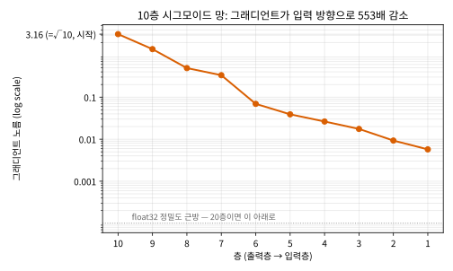
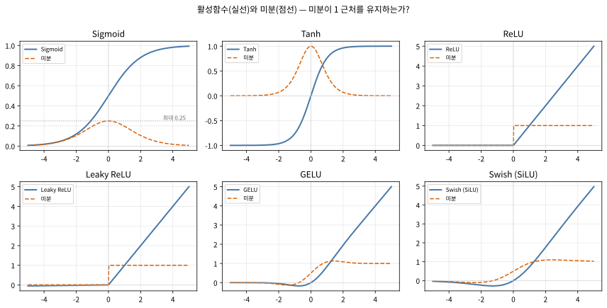
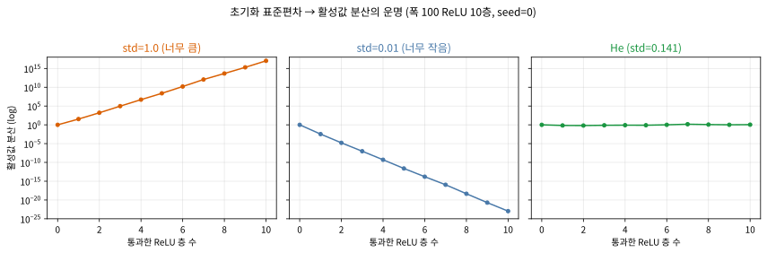

# 9.2 그래디언트 소실·폭발, 활성함수, 초기화

[](https://colab.research.google.com/github/SuminHan/book-ml/blob/main/notebooks/ml1/chapter09_2_vanishing_gradients.ipynb)

### 시그모이드의 숨은 함정: 그래디언트 소실

역전파는 이론적으로 층이 몇 개든 상관없이 그래디언트를 계산할 수 있다. 그런데
실제로 층을 10개, 20개로 깊게 쌓아보면 이상한 일이 벌어진다: 입력에 가까운
층의 가중치는 학습이 거의 진행되지 않는다. 오랫동안 신경망이 "얕게"만(2~3층)
쓰였던 이유 중 하나가 바로 이것이다 — 깊게 쌓을수록 학습이 오히려 더 안
되는 역설.

1990년대에는 이게 정말로 막막한 문제였다. 역전파를 발표(1986)한 지 겨우
10년 만에 CNN의 선구자인 얀 르쿤(Yann LeCun)이 MNIST 숫자 분류를
성공시켰을 때, 그의 네트워크도 **2~3층에 불과**했다 — 더 깊이 쌓고 싶었지
만, 입력 쪽으로 갈수록 그래디언트가 0에 수렴해서 "층을 쌓는 만큼 효과가
나지 않았다." 이 시대의 네트워크는 "깊이"가 아니라 "넓이"로 성능을 냈고,
"깊은 신경망(deep learning)"이라는 말 자체가 2006년 힌턴의 딥 벨리프
네트워크(deep belief network) 발표까지 사실상 사라져 있었다. 2012년
AlexNet[^alexnet]이 ImageNet[^imagenet]에서 승리를 거둘 때, 그 네트워크의 "깊음"(8층)은
그 자체가 뉴스가 될 수 있었던 이유가 여기 있다.


원인은 시그모이드 함수 자체에 있다. \\(\sigma'(z) = \sigma(z)(1-\sigma(z))\\)의
최댓값은 \\(z=0\\)에서 겨우 0.25다. 역전파는 층을 거슬러 올라갈 때마다 이
미분값을 **곱해서** 전달하는데(9.1절의 \\(\delta\_1 = (W\_2\delta\_2) \odot
\sigma'(z\_1)\\)이 층마다 반복된다고 생각하면), 층이 10개면 최대
\\(0.25^{10} \approx 0.00000095\\)만큼 줄어든 신호가 첫 번째 층에 도달한다 —
사실상 0이다. 이게 **그래디언트 소실(vanishing gradient)** 문제다. 반대로
가중치 초기화가 잘못되면 그래디언트가 층을 거칠수록 오히려 폭발적으로
커지는 **그래디언트 폭발**(exploding gradient)도 일어날 수 있다.

**왜 "곱"인가?** — 연쇄법칙의 구조 때문이다. \\(L\\)이 층 1의 가중치
\\(W\_1\\)에 영향을 미치는 경로는 \\(W\_1 \to z\_1 \to a\_1 \to z\_2 \to a\_2
\to \cdots \to L\\)이라는 사슬이며, 연쇄법칙은 이 사슬을 따라 미분을
**연속으로 곱**해 준다. 곱 연산은 "할인율"처럼 굴한다: 각 층이 신호의
일부만 전달하면, 10층을 거치면 \\(0.25 \times 0.25 \times \cdots\\)
(10번)으로 지수적으로 줄어든다. 10명이 순서대로 말을 전달하며 매번
"들린 것의 25%만" 다음 사람에게 속삭인다고 상상하라 — 10번째 사람에게는
원래 메시지 대비 100만 분의 1도 안 되는 신호만 남는다. 소실은 "느리다"가
아니라 **"지수적으로 0에 수렴한다**"는 것이 핵심이다.

### 사슬이 길어질 때: L개 층의 곱 형태

\\(L\\)개 층을 가진 신경망에서, 첫 번째 층의 가중치에 대한 그래디언트는
연쇄법칙으로 다음과 같은 형태가 된다(각 층의 활성함수 미분과 가중치의 곱):

\\[\frac{\partial L}{\partial W\_1} \propto \prod\_{l=2}^{L} \sigma'(z\_l) \cdot W\_l\\]

- 각 \\(\sigma'(z\_l) < 1\\)이면(시그모이드), 이 곱은 층이 많을수록 지수적으로
  0에 가까워진다 — **그래디언트 소실**.
- 각 항이 1보다 크면(예: 가중치가 너무 크게 초기화됨), 곱이 지수적으로
  커진다 — **그래디언트 폭발**.

손으로 체감해보자. \\(\sigma'(z) = 0.2\\)인 층(\\(z \approx \pm 1.1\\),
시그모이드 곡선이 "비포화"인 전형적인 지점)이 3개 이어지면
\\(0.2^3 = 0.008\\) — 그래디언트의 0.8%만 첫 번째 층에 도착한다. 10개면
\\(0.2^{10} \approx 1.0 \times 10^{-7}\\), 20개면
\\(0.2^{20} \approx 1.05 \times 10^{-14}\\). 반대로 각 항이 평균 2이면
\\(2^{10} = 1024\\), \\(2^{20} \approx 10^6\\) — 20층만 거치면 그래디언트가
백만 배로 부풀어 가중치가 발산(학습 중 NaN이 되는 전형적 전조)한다.
**소실과 폭발은 같은 연쇄법칙 곱의 두 얼굴**이다: 각 층의 "승수"가 1보다
작으면 소실, 크면 폭발. 문제는 이 승수를 우리가 제어할 수 있다는 것 —
승수는 활성함수(\\(\sigma'\\))와 가중치(\\(W\_l\\))의 크기로, 이 둘이 정확히
이번 절과 다음 절에서 다룰 "활성함수"와 "초기화·정규화"다.

### 실습: 10층 시그모이드 네트워크에서 그래디언트가 실제로 사라지는 것 확인하기

폭 10짜리 뉴런을 가진 시그모이드 층 10개를 무작위 가중치(\\(W \sim
\mathcal{N}(0,1)\\))로 쌓고, 출력에서 입력 방향으로 그래디언트(각 성분 1,
즉 노름 \\(\sqrt{10} \approx 3.16\\)에서 시작)를 역전파시키며 각 층에서의
그래디언트 노름(norm)을 측정하면:

```
출력층 →                                                    입력층
[3.162, 1.390, 0.492, 0.333, 0.0693, 0.0390, 0.0263, 0.0175, 0.0093, 0.0057]
```



출력층 근처(3.16)에서 입력층 근처(0.0057)까지, 10개 층을 거치며
그래디언트가 **약 550배(553×, seed=42, 실습 노트북에서 검증)** 줄어든다 —
\\(0.25^{10} \approx 9.5 \times 10^{-7}\\)은 활성함수 미분 **만** 곱했을 때의
극단적 하한이고, 실제로는 각 층의 가중치 행렬 곱도(여기서는
\\(\\|W\\| \approx \sqrt{10}\\) 수준으로) 일부 보상해주기 때문에 550배로
관측된다. 각 층의 평균 \\(\sigma'(z)\\)를 재보면 0.13~0.19 정도로 — 순전파
중 가중치가 축적되어 \\(z\\)가 \\(\pm 2 \sim 6\\)까지 벌어지는 **포화**
구간에 빠진 뉴런들이 많아서다. 시그모이드의 미분이 "0.25 이하"인 것
자체보다, **실제 데이터 위에서 포화로 인해 평균이 0.2를 훨씬 하회**하는
것이 더 치명적이다. 입력에 가까운 층은 사실상 그래디언트를 받지 못해
학습이 멈춘 것과 다름없는 상태가 된다. 20층으로 늘리면? 같은 계산으로
\\(0.2^{20} \approx 10^{-14}\\) 방향 — float32의 정밀도(약 \\(10^{-8}\\))
이내로 떨어져 "학습이 안 된다"가 아니라 **"그래디언트 자체가 0으로
반올림된다"** 는 수준이 된다.

### 활성함수 (Activation Functions)

이 절부터 배우는 활성함수, 초기화, 그리고 9.3절의 정규화(dropout[^dropout],
batch normalization[^batchnorm]) 같은 기법들은 전부 겉보기엔 서로 다른
트릭 같지만, 사실 대부분 이 한 가지 문제 — "깊은 네트워크에서도
그래디언트가 살아서 전달되게 하려면 어떻게 해야 하는가" — 를 푸는 여러
각도의 답이다.

먼저 활성함수가 **왜** 필요한지부터 확실히 하자. 활성함수가 없으면
\\(a\_2 = W\_2(W\_1 x) = (W\_2 W\_1) x\\) — 층을 아무리 쌓아도 **한 번의 선형
변환**과 같다. 9.1절에서 "직선 하나로 나뉘지 않는 XOR은 선형 모델로는
원칙적으로 불가"라고 배웠는데, 활성함수가 없으면 100층을 쌓아도 XOR은
영원히 못 푸는 것이다. 활성함수는 각 층 사이에 "곡선을 접어 넣는"
비선형성(non-linearity)을 제공해, 층이 쌓일수록 표현 가능 공간이
지수적으로 넓어지게 한다. 1958년 퍼셉트론의 스텝함수(\\(z \ge 0\\)이면
1, 아니면 0)가 역사적으로 가장 첫 번째 "활성함수"였다는 것도 이 맥락에서
다시 보면 자연스럽다.

| 함수 | 정의 | 미분 | 특징 |
|---|---|---|---|
| Sigmoid | \\(\frac{1}{1+e^{-z}}\\) | \\(\sigma(z)(1-\sigma(z))\\), 최댓값 0.25 | 출력이 (0,1) — 확률 해석에 유용하나 그래디언트 소실에 취약 |
| Tanh | \\(\frac{e^z-e^{-z}}{e^z+e^{-z}}\\) | 최댓값 1 | 출력이 (-1,1), sigmoid보다는 낫지만 여전히 양 끝에서 포화(saturate) |
| ReLU | \\(\max(0, z)\\) | \\(z>0\\)이면 1, \\(z<0\\)이면 0 | 양수 구간에서 미분이 항상 1 — 그래디언트가 층을 거쳐도 작아지지 않음 |



**시그모이드** — 두 가지 문제가 있다. (1) **포화(saturation)**: \\(|z| \gtrsim
3\\)이면 \\(\sigma'(z) < 0.05\\)로, 위 실습에서 본 바와 같이 깊은 망에서
소실을 가속한다. (2) **중심화(centering) 문제**: 시그모이드의 출력이
항상 (0,1)의 **양의** 값이다. 다음 층의 pre-activation
\\(z\_{l+1} = \sum\_i w\_{li} a\_{li}\\)가 \\(a\_{li} > 0\\)으로만 이루어져
있으므로, 같은 뉴런의 여러 가중치가 **동일 방향**(모두 양 또는 모두 음)으로
동시에 움직이는 경향이 생긴다 — 그래디언트 landscape가 "비대칭 골짜기"가
되어 학습이 느려진다. Chapter 2의 로지스틱회귀에서는 출력을 확률로
해석해야 하므로 시그모이드가 옳지만, **은닉층**에서는 확률 해석이
불필요한데도 이 두 불이익만 그대로 받는 셈이다.

**Tanh** — 시그모이드를 -1 방향으로 중심화한 것(\\(\tanh(z) =
2\sigma(2z) - 1\\)). 출력이 (-1,1)이라 중심화 문제는 사라지고, 미분
최댓값이 1로 시그모이드(0.25)의 4배 — 비포화 구간에서는 시그모이드보다
4배 강한 그래디언트 신호를 전달한다. 1990년대 은닉층의 사실상 표준이었다.
그러나 \\(|z| \gtrsim 3\\)에서 여전히 포화해 0.985 → 미분
\\(\approx 0.03\\) — **깊이**에는 여전히 부족하다.

**ReLU** — \\(f(z) = \max(0,z)\\). 미분이 \\(z>0\\)에서 **정확히 1**이라
곱해도 줄어지지 않는다. 계산도 가장 단순하다: 지수함수 없음, 곱셈 한 번
(실제로는 비교 연산 하나). 그리고 음수 구간에서 출력이 정확히 0이라
**희소(sparsity)** — 활성된 뉴런만 다음 층으로 신호를 보내 계산이
빠라진다. 2012년 크리즈베스키(Krizhevsky) 일행의 논문[^alexnet]은 "교정 선형
유닛(rectified linear units)은 ... 학습 시간을 **크게 줄인다**(dramatically
reduce the training time)"라고 보고했고, 같은 해 ImageNet 대회를 휩쓴
AlexNet이 시그모이드/tanh 대신 ReLU를 써 화제가 되면서 ReLU는 은닉층의
**사실상 표준**이 되었다.

**자주 하는 실수: 로지스틱회귀의 습관으로 은닉층에 시그모이드를 쓰기.**
Chapter 2에서 시그모이드를 "출력 활성함수"로 배운 뒤, 은닉층에도 그대로
넣는 것이 가장 흔한 실수다. 확률 해석이 필요한 것은 출력층뿐이고, 은닉층은
"시그모이드가 부드러우니까"라는 이유 하나로는 두 가지 불이익(포화 +
중심화)을 감수할 이유가 없다. 오늘(2020년대)의 기본값은 **은닉층 ReLU
계열, 출력층은 문제 형태에 맞게** (회귀: 항등, 이진분류: 시그모이드,
다중분류: softmax)다.

**Dying ReLU** — ReLU의 유일한 아킬레스건. \\(z<0\\)일 때 미분이 정확히 0이
되어 뉴런이 "죽는"(dying ReLU) 문제가 있지만, 계산이 단순하고 양수 구간에서
그래디언트 소실이 없어 현재 가장 널리 쓰이는 기본 선택지다. "죽는다"는
뜻을 구체적으로 보면: 어떤 뉴런의 입력 \\(z\\)가 학습 도중 **영구히** 음수
영역에 빠지면, 그 뉴런의 미분이 0 → 그래디언트가 0 → **가중치가 영영
갱신되지 않음** → \\(z\\)가 다시 양수 쪽으로 돌아올 가능성도 없어진다.
한 번 죽으면 부활이 불가능하다 — 시그모이드 포화(미분이 *작지만* 0은
아님)과는 성격이 다르다. 참고로 잘 초기화된 망의 정상 상태에서 죽은 뉴런은
\\(\mathcal{N}(0,1)\\) 입력의 절반이 음수라 대략 50% — 이 자체는 설계
값이며, "dying"이란 이 비율이 50%를 넘어 학습을 멈출 수준까지 **비정상적으로
치솟는 것**을 말한다. 그게 실제로 어떻게 생기는지 작은 실험으로 확인
해보자(실습 노트북에서 검증): \\(y = \sin x\_1 + \frac{1}{2}x\_2^2\\) 회귀
(\\(x \sim U[-2,0]^2\\), 음수 쪽으로 치우친 입력), 은닉 40개 ReLU, SGD로
학습시키며 학습률만 바꾼다:

```
ReLU        학습률=0.45: 죽은 뉴런 52% → 97% (100에폭 후)  loss: 0.406 → 0.26 → 고착
Leaky ReLU  학습률=0.45: 죽은 뉴런 0%(정의상 존재 불가)     loss: 0.408 → 0.095 → 계속 감소
```

같은 데이터·같은 학습률에서 ReLU 망은 100에폭 만에 뉴런의 97%가 사망하고
손실이 0.26 부근에 **고착**되는 반면, Leaky ReLU(음수 구간 미분 0.01)[^rectifier]는
죽은 뉴런이 *정의상 존재할 수 없어* 손실이 계속 줄어든다. "미분이 0"은
시그모이드 포화처럼 "느리게"만 만드는 게 아니라, **학습 경로의 한쪽을
완전히 차단**하는 것 — 그래서 학습률이 커서 \\(z\\)가 크게 흔들리는
상황(큰 학습률, BatchNorm 부재, outlier 입력)에서 ReLU 망은 돌이킬 수
없이 죽은 뉴런이 누적된다. (참고: 이 실험의 학습률 0.45는 "ReLU의 한계
가정"을 의도적으로 만든 값이고, 실제에서는 Adam[^adam] 같은 스케일 조정 +
BatchNorm이 \\(z\\)의 흔들림을 잡아줘서 dying ReLU가 흔치는 않다. 하지만
일단 죽으면 되살릴 수 없다는 **구조적** 취약함은 변하지 않는다.)

**ReLU 계열 변형** — 죽는 뉴런을 "완전 사망"이 아닌 "숨을 쉰다"로
만든 것들이며, 2013년경부터 등장했다:

| 함수 | 정의 | 한 줄 설명 |
|---|---|---|
| Leaky ReLU | \\(\max(0.01z, z)\\) | 음수 구간 미분을 0.01로 — 죽지 않고 "숨 쉰다" |
| ELU[^elu] | \\(\min(0,\\, \alpha(e^z-1))\\) | 음수 구간을 -\\(\alpha\\)로 완만하게 — 미분 0이 아님 |
| Softplus | \\(\log(1+e^z)\\) | ReLU의 "미분 가능한(매끄러운)" 근사 — \\(\text{softplus}' = \sigma\\) |
| Swish (SiLU) | \\(z \cdot \sigma(z)\\) | \\(z<0\\)에서 작은 음수 허용 — ReLU보다 약간 부드럽고, 깊게 쌓았을 때 손실이 더 낮다고 보고(2017)[^swish] |
| GELU[^gelu] | \\(z \cdot \Phi(z)\\) (\\(\Phi\\): 표준정규 CDF) | "z가 얼마나 양수적인가"의 확률로 가중 — Chapter 12 트랜스포머(GPT/BERT)의 표준 은닉층 활성함수 |

GELU를 여기서 기억해 두면 된다: Chapter 12에서 트랜스포머를 배울 때
"왜 GELU인가"가 바로 이번 절의 논리(미분이 1 근처에서 유지되고,
부드러워 최적화가 안정적) 위에 얹혀 있다.

### 가중치 초기화

가중치를 모두 0으로 초기화하면 모든 뉴런이 똑같이 학습돼(대칭성 문제,
symmetry breaking 실패) 층을 여러 개 쌓는 의미가 없어진다. 너무 크게
초기화하면 그래디언트 폭발, 너무 작게 하면 소실 위험이 커진다. Xavier/He
초기화 같은 방법은 층의 입출력 뉴런 수를 고려해 적절한 분산으로 가중치를
무작위 초기화한다 — 그래디언트가 층을 거쳐도 크기가 유지되도록 설계된 값이다.

**0 초기화가 왜 치명적인가 — 한 줄로 증명**: 모든 \\(w\_{ij} = 0\\)이면
\\(a\_l = f(b\_l)\\)로 층마다 **상수** 출력, 그리고 역전파 시 각 뉴런의
그래디언트가 **동일** → 모든 가중치가 **동일하게** 갱신 → 다음 스텝에도
모든 뉴런이 동일. 대칭이 영원히 깨지지 않아, 폭 100짜리 층 하나가 **폭 1
짜리 뉴런 하나**와 완전히 같은 표현력이 된다. 그래서 초기화는 무작위
(random)여야 하고, 남은 질문은 **"어떤 분산의" 무작위**인가다.

**기준: 층을 거치며 활성값의 (2차 모멘트) \\(\mathbb{E}[a^2]\\)을 보존한다.**
층 \\(l\\)의 pre-activation \\(z\_l = \sum\_{i=1}^{n\_{l-1}} w\_{li} a\_{l-1,i}\\)
에서, 가중치가 \\(\mathbb{E}[w]=0,\\ \sigma\_w^2\\) 분산의 독립 값이면
\\(\mathbb{E}[z\_l^2] = n\_{l-1}\\, \sigma\_w^2\\, \mathbb{E}[a\_{l-1}^2]\\)
(\\(n\_{l-1}\\)을 **fan-in**이라 한다). 즉 한 층은 "\\(\mathbb{E}[a^2]\\)를
\\(n\_{l-1}\sigma\_w^2\\) 배" 스케일한다. 이를 1로 만들면
\\(\sigma\_w = 1/\sqrt{n\_{l-1}}\\) — 이것이 **Xavier (Glorot) 초기화**
(2010, Xavier Glorot & Yoshua Bengio).[^glorot] (Glorot 원문이 권한한
\\(1/\sqrt{(n\_{in}+n\_{out})/2}\\)는 fan-in/fan-out 타협안이며, 여기서는
fan-in 기준으로 단순화한다.) \\(\mathbb{E}[a^2]\\)를 쓰는 이유는
정규화(9.3절)가 "스케일"을 조절하는 대상이 2차 모멘트이기 때문이며,
0-중심·대칭 활성함수(tanh)에서는 \\(\mathbb{E}[a^2]=\text{Var}(a)\\)라
"분산을 보존"과 동일하다.

**He 초기화**는 ReLU에 맞춘 것이다. ReLU는 입력의 절반(\\(z<0\\))을 0으로
버려, 2차 모멘트가 **정확히 절반**으로 줄어든다: \\(\mathbb{E}[\text{ReLU}
(z)^2] = \tfrac{1}{2}\\,\mathbb{E}[z^2]\\) (\\(z \sim \mathcal{N}(0, \sigma^2)\\)
대칭성 — \\(\text{ReLU}(z)^2 = z^2 \cdot \mathbf{1}\\{z>0\\}\\)이고 대칭
정규분포에서 \\(\mathbb{P}(z>0)=1/2\\)라 기댓값이
\\(\tfrac{1}{2}\sigma^2\\)). 이 ½을 보상하려면 가중치 2차 모멘트를
**2배**로, 즉 \\(\sigma\_w = \sqrt{2/n\_{l-1}}\\) — **He 초기화**(Kaiming He
et al., 2015, ResNet 논문[^resnet]). 한 층 통과 후 \\(\mathbb{E}[a^2]\\)의
승수를
측정하면(실습 노트북 §5, fan-in 100):

| 조합 | \\(\mathbb{E}[a^2]\\) 승수 (측정) | 해석 |
|---|---|---|
| ReLU + Xavier | 0.499 | 매 층 정확히 ½ → 10층 후 \\(0.5^{10}\\approx 10^{-3}\\) (소실) |
| ReLU + He | 0.998 | ½ × 2 = 1, 보존 (안정) |
| tanh + Xavier | 0.393 | 선형 근사(≈1)보다 작음 — 포화로 추가 압축 |

"2"라는 숫자가 정확히 ReLU가 버리는 ½을 보상한다는 것을, ReLU+Xavier=½ /
ReLU+He=1이라는 **정확한** 수치로 확인한다. (tanh+Xavier가 1이 아니라
0.39인 것은 tanh가 포화되어 선형 근사보다 신호를 더 줄이기 때문 —
실무에서 tanh도 Xavier를 쓰는 건 "1:1 보존"이 1차 근사이고, 포화
압축은 학습 중 BatchNorm·초기 스케일이 흡수하는 수준이라는 의미다.)

| 초기화 | 표준편차 | 잘 맞는 활성함수 | 핵심 아이디어 |
|---|---|---|---|
| Xavier (Glorot, 2010) | \\(1/\sqrt{\text{fan-in}}\\) | tanh, sigmoid, linear | \\(\mathbb{E}[a^2]\\)를 1:1 보존 (선형 가정) |
| He (Kaiming, 2015) | \\(\sqrt{2/\text{fan-in}}\\) | ReLU 계열 | ReLU가 버리는 ½을 2배로 보상 |

(분포는 Gaussian(\\(\mathcal{N}(0,\sigma^2)\\))이나 Uniform(\\([-k,k]\\),
\\(k = \sqrt{3}\sigma\\)로 같은 분산) 모두 가능 — 실무에서는 보통
Uniform 버전이 기본값으로 들어가 있다. PyTorch[^pytorch]의 `nn.Linear` 기본 초기화
가장 최근 버전에서는 ReLU 계열에 대해 `kaiming_uniform_`, 그 외에는
`xavier_uniform_`를 쓴다 — **프레임워크가 이미 이번 절의 결론을
기본값으로 만들어 놓은 것**이다. `nn.init.xavier_uniform_(m.weight)` /
`nn.init.kaiming_uniform_(m.weight, nonlinearity='relu')`로 직접 지정할
수 있다.)

**자주 하는 실수: 초기화 표준편차를 아무 값이나 고정해서 쓰기**. 실제로
표준편차가 다른 세 가지 초기화로 10개 층(ReLU, 각 층 100개 뉴런)을 통과한
뒤 활성값의 분산이 어떻게 변하는지 재보면(seed=0, 2000개 샘플, 실습
노트북에서 검증):

```
표준편차=1.0(너무 큼):  1.002 → 34.4 → 1.6×10^3 → 9.5×10^4 → ... → 1.1×10^17 (폭발)
표준편차=0.01(너무 작음): 1.002 → 3.4×10^-3 → 1.6×10^-5 → ... → 1.1×10^-23 (소실)
He 초기화(표준편차≈0.141): 1.002 → 0.688 → 0.650 → 0.759 → ... → 1.114 (안정)
```



표준편차를 1.0으로 고정하면 단 몇 개 층 만에 활성값이 천문학적으로
커지고(그래디언트 폭발로 이어진다), 0.01로 고정하면 몇 개 층 만에
사실상 0으로 죽어버린다(그래디언트 소실로 이어진다). He 초기화(표준편차
\\(\approx\sqrt{2/\text{입력뉴런수}}\\), 여기서는 \\(\sqrt{2/100}\approx0.141\\))만
10개 층을 거쳐도 분산이 대략 1 근처로 안정적으로 유지된다. 주목할
세부사항: He도 분산이 정확히 1이 아니라 **0.65~1.5 사이를 방황**한다 —
"½ 보상"이 정규분포 가정 하의 근사이므로 완전하지 않다. 이 "마지막
여정(last mile)"의 미세한 스케일 드리프트를 학습 중에도 붙잡아 주는 것이
9.3절의 Batch Normalization이다.

**"적당해 보이는 숫자"를 감으로 고르는 것**과 뉴런 수를 고려해 정확히
계산하는 것 사이의 차이가 이렇게 크다.

### 큰 그림: 그래디언트를 살리는 세 라인 방어선

이번 절의 논리를 한 장면에 모으면, "깊은 망을 학습 가능하게 만드는 것"은
**세 가지가 함께** 작동할 때 성립한다:

1. **활성함수**: 미분이 1 근처를 유지하는 것을 고른다 (ReLU 계열)
   → "할인율" 자체를 낮춘다.
2. **초기화**: 각 층의 입출력 스케일(분산)을 보존한다 (Xavier / He)
   → 시작점부터 "할인율 × 레버"가 1 근처로 맞춰진다.
3. **정규화(9.3절)**: 학습 도중 스케일이 다시 흐르지 않게 붙잡아 준다
   (BatchNorm, Dropout) — 그리고 그래디언트 **클리핑**(clip: 노름이
   상한을 넘으면 그 상한으로 잘라낸다)은 폭발을 하드웨어적으로 막는
   안전장치, **Adam 같은 현대 최적화기법**은 스케일 불균형을 부분적으로
   흡수한다.

이 세 가지를 "제대로" 갖추면 깊은 망이 실제로 학습되는지, 그 반대의
실패가 어떻게 보이는지 마지막으로 확인해보자. 같은 구조(은닉 7층 × 폭 16,
출력 1)로 4점 XOR을 1500에폭, SGD 학습률 0.5, MSE로 학습시키며 활성함수
만 바꾼다(초기화는 각각 Xavier / He로 "그 활성함수에 맞는" 값을 사용,
seed=5, 실습 노트북에서 검증):

```
tanh (Xavier 초기화):  ep 0:  loss=0.3796 → ep 50:  loss=NaN  (폭발 — 발산)
ReLU (He 초기화):      ep 0:  loss=0.4453 → ep 1500: loss=0.2500  (정체 — 0.5 상수 예측)
```

두 실패의 "얼굴"이 다르다는 점이 중요하다. tanh 버전은 그래디언트가
**폭발**해 loss가 NaN — "무언가가 터졌다"는 명확한 신호. ReLU 버전은
loss가 **0.2500**에 멈춰 있는데, 이 숫자는 "모든 입력에 대해 라벨 평균
\\(\bar{y}=0.5\\)를 상수로 예측"할 때의 MSE다 — 4개 XOR 라벨(0,1,1,0)의
평균은 정확히 0.5이고, 상수 0.5 예측의 MSE는
\\(\frac{1}{4}[(0.5)^2+(0.5)^2+(0.5)^2+(0.5)^2]=0.25\\). 즉 **가중치가
하나도 학습되지 않은 상태**와 손실이 정확히 같은데, "loss가 0.25로
수렴했다"고 보고하면 성공처럼 보인다 — "동은 같은데 학습이 안 된다"는
전형적 정체(stagnation) 실패다. (참고: 이 실패는 "활성함수+초기화"만으로
완전 해결되지 않는다는 뜻이기도 하다 — 7층 XOR은 평범한 SGD로는 손실이
크지 않은 **안장점(saddle point)**[^saddlepoint] 영역에 갇히기 쉬워, Adam 같은
모멘텀 기반 최적화기법이 필요하다. 실습 노트북에서 Adam(lr=0.01)을
추가하면 같은 구조가 실제로 수렴하는 것을 확인한다.)

**"더 깊은 망"이 "더 똑똑한 모델"이 되려면, 연쇄법칙의 곱이 각 층에서
"1 근처"로 유지되어야 한다. 활성함수(미분의 크기), 초기화(스케일의
시작점), 정규화(학습 중 스케일 유지) — 이번 절과 9.3절의 모든 기법은 이
하나의 조건을 서로 다른 각도에서 지키는 도구다.** 이 주제를 더 깊이 다루는
자료: [^cs230]

### 확인 문제

**1. (계산)** 20층 시그모이드 신경망에서 각 층의 \\(\sigma'(z\_l)\\)이 최댓값
0.25라고 가정하면, 그래디언트는 20개 층을 거치며 원래 크기의 몇 배로
줄어들 수 있는가? \\((1/4)^{20} = 2^{-40} \approx 9.1 \times 10^{-13}\\)
— 1조 분의 1의 1%도 안 된다. 또한: 왜 "실제" 감소는 이 값과 정확히
같지 않은가? (힌트: 연쇄법칙 곱에는 \\(\sigma'\\)만이 아니라 가중치
\\(W\_l\\)도 곱해진다 — \\(\\|W\_l\\| > 1\\)이면 보상이, \\(< 1\\)이면
추가 감소가 일어난다.)

**2. (코딩)** 다음 함수를 완성하라(핵심 줄은 빈칸으로 남겨져 있다고 가정):

```python
def he_init_std(fan_in):
    # ADD ADDITIONAL CODE HERE!!
    # He 초기화 표준편차: sqrt(2 / fan_in)

def xavier_init_std(fan_in):
    # ADD ADDITIONAL CODE HERE!!
    # Xavier (Glorot) 초기화 표준편차 (Gaussian 버전): 1 / sqrt(fan_in)

def e2_out(e2_in, fan_in, std, activation):
    # ADD ADDITIONAL CODE HERE!!
    # 입력 2차 모멘트 E[a^2]=e2_in, 가중치 표준편차 std일 때 한 층 통과 후
    # 기대 출력 2차 모멘트를 반환 (선형 근사: E[z^2]=fan_in*std^2*e2_in,
    # ReLU는 2차 모멘트를 정확히 1/2, tanh는 선형 근사에서 그대로 유지)
```

**정답 검증**: `e2_out(1.0, 100, he_init_std(100), 'relu')` ≈
1.0 (보존), `e2_out(1.0, 100, xavier_init_std(100), 'relu')`
≈ 0.5 (매 층 절반 → 소실), `e2_out(1.0, 100, he_init_std(100),
'tanh')` ≈ 2.0 (선형 근사에서 매 층 2배 → 부풀림).

**3. (개념 서술)** 폭 100 → 100 → 100 ReLU 네트워크에 Xavier 표준편차
(0.1)로 초기화하면, 층을 10개 반복했을 때 마지막 층 활성값의
\\(\mathbb{E}[a^2]\\)은 대략 얼마가 되고(각 층 0.5배 →
\\(0.5^{10} \approx 0.001\\)), 이 망은 **소실**인가 **폭발**인가? 그리고
He가 "2"라는 숫자를 왜 곱하는지, ReLU의 어떤 성질에서 오는 것인지
한 문장으로 답하라.

### 자주 묻는 질문

**Q. ReLU 미분이 0 아니면 1인데, 왜 그래디언트 문제를 "완전히"
해결하지 못하나요?**
곱의 인자가 \\(\sigma'(z\_l)\\) 하나뿐이 아니기 때문이다.
\\(\prod \sigma'(z\_l) \cdot W\_l\\)에서 (1) 가중치 \\(W\_l\\)의 크기가
나쁘면 ReLU여도 소실/폭발한다 — 초기화의 역할. (2) \\(z<0\\)이면 미분이
0이라 죽은 뉴런은 영구히 기여 0 — dying ReLU, ReLU 계열 변형이 이 부분을
보완. (3) 학습 도중 스케일이 다시 흐를 수 있다 — 9.3절 BatchNorm의
역할. 즉 "활성함수 하나"가 아니라 "활성함수 + 초기화 + 정규화" 세
라인이 함께 작동할 때 문제가 해결된다.

**Q. 프레임워크 기본값이면 초기화를 신경 쓸 필요가 없지 않나요?**
"전형적" 구조(완전연결 ReLU 계층)에는 맞다 — PyTorch 기본값이
바로 Xavier/He다. 하지만 (a) 스킵 커넥션/레지듀얼 블록, (b) 커스텀
층(합성곱, LSTM 셀 등)에서는 "fan-in"이 명확히 정의되지 않아 기본값이
적용되지 않는다. 그리고 "학습이 안 된다/발산한다"를 디버깅할 때
**첫 질문은 항상 "각 층의 그래디언트·활성 노름을 재보라"** — 이 절의
실습 노트북이 바로 그 디버깅 절차다.

**Q. 출력층 활성함수는 어떻게 고르나요?**
출력층의 역할은 "손실함수와 비교될 수 있는 숫자"를 만드는 것이라,
**문제 형태**가 결정한다: 회귀 → 활성함수 없음(항등, MSE와 짝),
이진 분류 → 시그모이드(교차엔트로피와 짝), 다중 분류 →
softmax(시그모이드의 다중 클래스 일반화 — Chapter 13의 언어모델에서
다시 만난다). "은닉층은 ReLU 계열"이라는 이번 절의 결론은 은닉층
얘기이고, 출력층 논리는 다르다.

---

## 실습 노트북

이 절의 모든 수치 검증은 [Colab 노트북](https://colab.research.google.com/github/SuminHan/book-ml/blob/main/notebooks/ml1/chapter09_2_vanishing_gradients.ipynb)에서
다시 확인할 수 있다:

1. 10층 시그모이드 네트워크에서 그래디언트 노름이 실제로 553× 줄어드는지
   (순전파 + 역전파, seed 고정)
2. 세 가지 초기화(σ=1.0 / 0.01 / He)로 10개 ReLU 층을 통과한 활성값
   분산이 폭발/소실/안정으로 갈라지는지
3. dying ReLU: 같은 학습률(0.45)에서 ReLU는 죽은 뉴런 97%로 치솟아 손실
   고착, Leaky ReLU는 계속 수렴하는지
4. 활성함수 6종(시그모이드, tanh, ReLU, Leaky, GELU, Swish)과 그 미분을
   그래프로 비교
5. 7층 XOR: tanh+Xavier(폭발→NaN) vs ReLU+He(정체→0.25) vs
   Adam(수렴) — "세 라인 방어"의 실패/성공을 직접 목격

[^alexnet]: Krizhevsky, A., Sutskever, I., Hinton, G. E. (2012). "ImageNet Classification with Deep Convolutional Neural Networks." NeurIPS 2012.
[^dropout]: Srivastava, N., Hinton, G. E., Krizhevsky, A., et al. (2014). "Dropout: A Simple Way to Prevent Neural Networks from Overfitting." JMLR 15(2014) 1929-1958.
[^batchnorm]: Ioffe, S., Szegedy, C. (2015). "Batch Normalization: Accelerating Deep Network Training by Reducing Internal Covariate Shift." arXiv:1502.03167.
[^resnet]: He, K., Zhang, X., et al. (2015). "Deep Residual Learning for Image Recognition." arXiv:1512.03385.
[^cs230]: Stanford CS230: Deep Learning. https://cs230.stanford.edu/
[^swish]: Ramachandran, P., Zoph, B., Le, Q. V. (2017). "Searching for Activation Functions." arXiv:1710.05941. — Swish(x)=x·σ(x) 활성함수를 제안하고, 깊은 망에서 ReLU보다 손실이 낮다고 보고한 원 논문.
[^gelu]: Hendrycks, D., Gimpel, K. (2016). "Gaussian Error Linear Units (GELUs)." arXiv:1606.08415. — GELU 활성함수를 제안한 원 논문 (이후 BERT 등 트랜스포머 모델의 표준 은닉층 활성함수로 채택됨).
[^adam]: Kingma, D. P., Ba, J. (2014). "Adam: A Method for Stochastic Optimization." arXiv:1412.6980. — 1차/2차 모멘트를 적응적으로 조정해 학습률을 스케일해 주는 Adam 최적화기법을 제안한 원 논문.
[^glorot]: Glorot, X., Bengio, Y. (2010). "Understanding the Difficulty of Training Deep Feedforward Neural Networks." AISTATS 2010 (Proceedings of the Thirteenth International Conference on Artificial Intelligence and Statistics) 249–256. — Xavier(Glorot) 초기화를 제안한 원 논문.
[^elu]: Clevert, D.-A., Unterthiner, T., Hochreiter, S. (2016). "Fast and Accurate Deep Network Learning by Exponential Linear Units (ELUs)." ICLR 2016. arXiv:1511.07289. — ELU 활성함수를 제안한 원 논문.
[^rectifier]: Maas, A. L., Hannun, A. Y., Ng, A. Y. (2013). "Rectifier Nonlinearities Improve Neural Network Acoustic Models." Interspeech 2013 (ICML 워크숍: Machine Learning and Speech Processing). — 음성 인식 신경망에 rectifier(ReLU) 비선형성을 도입한 원 논문으로, Leaky ReLU·PReLU 등 ReLU 계열 변형의 직접적 선구작이다.
[^pytorch]: Paszke, A., Gross, S., Massa, F., et al. (2019). "PyTorch: An Imperative Style, High-Performance Deep Learning Library." NeurIPS 2019. arXiv:1912.01703.
[^saddlepoint]: Dauphin, Y. N., Pascanu, R., Gulcehre, C., Cho, K., Ganguli, S., Bengio, Y. (2014). "Identifying and attacking the saddle point problem in high-dimensional non-convex optimization." NeurIPS 2014. arXiv:1406.2572. — 고차원 비볼록 최적화에서 안장점(saddle point)이 국소 최소점보다 훨씬 흔하며, 그 근방에서 그래디언트가 0에 수렴해 SGD 학습이 장기 정체되는 문제를 실험적으로 규명한 원 논문.
[^imagenet]: Deng, J., Dong, W., Socher, R., Li, L.-J., Li, K., Fei-Fei, L. (2009). "ImageNet: A Large-Scale Hierarchical Image Database." CVPR 2009.
