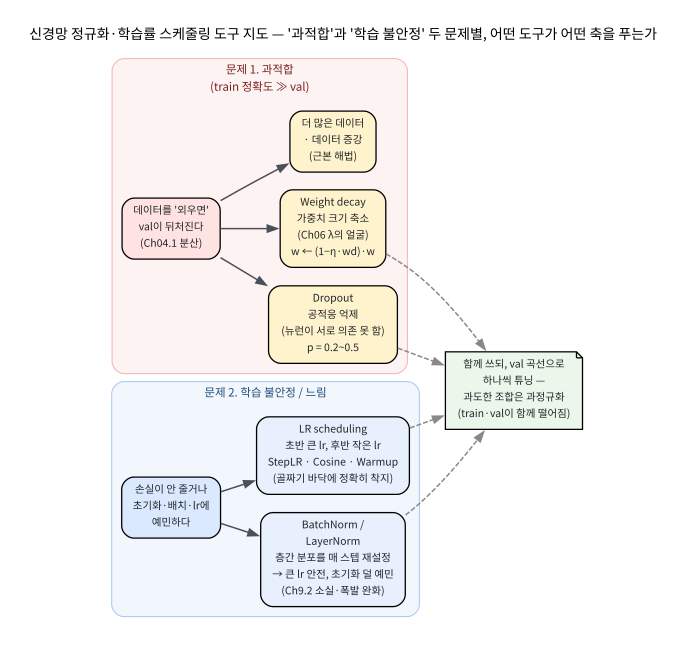
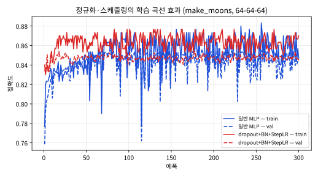
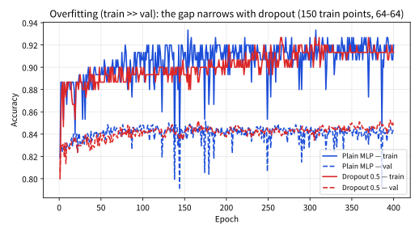

# 9.3 정규화 기법과 학습률 스케줄링

[](https://colab.research.google.com/github/SuminHan/book-ml/blob/main/notebooks/ml1/chapter09_3_regularization_lr_schedule.ipynb)

### 과적합과 신경망 전용 정규화

모델이 학습 데이터는 완벽히 맞히지만 새 데이터에는 성능이 떨어지는 현상이
과적합이다. Chapter 4.1의 편향-분산 관점에서 보면, 파라미터가 매우 많은
신경망은 극단적으로 유연한(분산이 큰) 모델이라 특히 취약하다 — Chapter 6에서
본 L1/L2 정규화도 신경망에 그대로 쓸 수 있지만, 신경망은 구조 자체를 이용한
정규화 기법도 함께 쓴다:

- **Dropout**: 학습 시 매 스텝마다 일부 뉴런을 무작위로(확률 \\(p\\)로)
  꺼버린다. 뉴런들이 서로에게 지나치게 의존하는 것을 막아, 특정 뉴런 몇
  개에만 의존하는 대신 더 견고한(robust) 특징을 배우게 한다 — "일부
  팀원이 항상 빠질 수 있다고 가정하면, 모두가 서로의 역할을 어느 정도씩
  겸비하게 되는 것"과 비슷하다.
- **Batch Normalization**: 각 층의 입력을 미니배치 단위로 평균 0, 분산
  1이 되도록 정규화한 뒤, 학습 가능한 스케일/시프트 파라미터를 다시
  곱하고 더한다. 층의 입력 분포가 학습 도중 계속 바뀌는 현상(internal
  covariate shift)을 줄여, 학습을 더 빠르고 안정적으로 만든다.

**왜 "정규화"인가 — Chapter 6과 같은 뿌리, 다른 얼굴.** Chapter 6에서
L2 정규화는 손실함수에 \\(\lambda\\|w\\|^2\\) 항을 붙여 "작은 가중치를
좋아하게" 만들어 모델의 유연성을 줄이는 법을 배웠다. 신경망의 정규화도
같은 목표 — **분산(=과적합)을 억제** — 을 추구하지만, "손실함수 자체를
바꾸는" L2/L1과 함께, **네트워크의 계산 구조 자체를 바꿔서** 과적합과
학습 불안정을 동시에 다스리는 기법까지 포함한다. 용어사적으로 "정규화"
(regularization)라는 말은 회귀분석의 릿지 회귀(Tikhonov, 1963)에서 온
것이었고, 신경망 분야에서는 2010년대 dropout·BatchNorm 등장 이후로
"구조적 정규화"라는 새 축이 생긴 것이다. 아래에서 두 기법을 각각
"왜 이것이 정규화인지를 수학적으로" 파헤친 뒤, 가중치 감쇠(weight decay)와
학습률 스케줄링까지 함께 정리한다.

```python
def dropout(activations, p, training):
    if not training:
        return activations
    import random
    return [0.0 if random.random() < p else a / (1 - p) for a in activations]
```

(`/ (1-p)`로 스케일을 보정하는 이유: 학습 때는 평균적으로 뉴런의
\\((1-p)\\)만 살아있으므로, 추론(inference) 시 전체 뉴런을 다 쓰는 것과
기댓값을 맞추기 위함이다.)

### Dropout: 무작위로 팀원을 빼면 모두가 다재다능해진다

Dropout(Srivastava, Hinton et al., 2014; 아이디어는 Hinton 2012
"Improving neural networks by preventing co-adaptation of feature
detectors")[^inverteddrop][^dropout][^hinton2012]은 학습 중 매 스텝마다 뉴런을 확률 \\(p\\)로
"임시 탈퇴"시킨다.


핵심 질문은 두 가지다: (1) 이걸 왜 **정규화**라고 부르는가, (2) 그
`/ (1-p)` 보정은 정확히 무엇을 보존하는가.

#### 앙상블 관점: 2^N개의 서브네트워크를 동시에 학습시킨다

한 전파(forward pass)에서 살아남는 뉴런의 조합이 매번 달라지므로,
\\(N\\)개의 이진 뉴런을 가진 층에서 이론상 \\(2^N\\)개의 "서브네트워크"가
존재하고, dropout은 **그 모든 서브네트워크를 가중치(파라미터)를 공유한 채
동시에 학습**시킨다고 볼 수 있다. \\(N=10\\)이면 1024개, 은닉층이 3개면
수백만~수십억 개의 서브네트워크가 한 번의 학습으로 만들어진다. 앙상블은
각 구성원이 서로 다른 실수를 해서 평균냈을 때 개별 모델보다 편차가 줄어
(Chapter 4.1) 일반화 성능이 좋아지는데, dropout은 "서브네트워크를 수억 개
만들되 그 파라미터는 전부 공유해서" 그 이득을 지수적으로 싸게 얻는 장치다.

**왜 이것이 "과적합 억제"인가**: 뉴런들이 서로의 존재를 전제로 학습
(co-adapt, 공적응)하지 못하게 된다. "나만 잘하면 돼"가 아니라 "나를
꺼놔도 팀이 돌아가야 하니까" — 특정 뉴런 몇 개에 집중해서 학습 데이터의
미세한 잡음까지 외우던(=과적합) 대신, 어떤 뉴런이 빠져도 견고하게 동작하는
분산된 특징을 배우게 된다.

#### 1/(1-p) 보정이 정확히 보존하는 것: 학습 기댓값 = 추론값

`/ (1-p)`("inverted dropout")는 학습 때의 **기댓값**이 추론 때의 출력을
정확히 재현하도록 하는 보정이다. 손으로 확인해보자. 활성값이
\\(a=(1,-2,3,4)\\), \\(p=0.5\\)라고 하자(이후 4개 뉴런의 평균을 내려층
입력으로 전달한다고 가정).

- **보정 없이** 평범한 dropout: 살아남은 뉴런만 쓰고 끄면
  \\(\text{E}[\text{출력}] = (1-p)\\,a = 0.5\\,a\\) — 평균적으로 값이 절반
  (0.75)로 줄어든다. 그런데 **추론 때**는 뉴런을 전부 켜서 \\(a\\)(평균
  1.5)를 쓴다 → 학습(0.75)과 추론(1.5)이 \\((1-p)\\)배 어긋나, "학습할 때
  배운 함수"와 "실전에서 쓰는 함수"가 다른 체계가 만들어진다.
- **`/ (1-p)`로 보정하면**: 매 스텝 \\(\text{mask}\cdot a/(1-p)\\)를 쓰므로
  \\(\text{E}[\text{출력}] = \text{E}[\text{mask}]\\,a/(1-p)
  = (1-p)\\,a/(1-p) = a\\) — **학습 때의 기댓값이 정확히 \\(a\\), 즉
  추론값과 같다**.

실제로 4개 뉴런 \\((1,-2,3,4)\\), \\(p=0.5\\)에서 모든 \\(2^4=16\\)개의
마스크 조합에 대해 평균을 구하면 정확히 **1.5**이고, 무작위로 20만 번
샘플링해도 **1.5012**다(스크래치패드에서 실행 검증, 실습 노트북 §1에도
있음). "1.5 = 1.5" — 이 **불변**(invariance)이 inverted dropout의 정석이다.
그래서 **추론 때는 무작위 masking을 아예 끄고, 모든 뉴런을 켜되 각 출력을
\\((1-p)\\)로 스케일**한다. 학습 때는 2^N개 앙상블을 동시에 학습시키고,
추론 때는 그 평균을 "모든 뉴런 켜고 \\((1-p)\\) 곱하기"라는 한 번의 전파로
근사하는 셈이다.

**\\(p\\)를 어떻게 고르나.** 은닉층에서는 \\(p=0.2\sim0.5\\)가 흔하고,
과적합이 심할수록 \\(p\\)를 키운다. 다만 \\(p\\)가 너무 크면(0.7 이상)
살아남는 뉴런이 부족해 **과소적합**(배울 표현력 자체가 부족)이 되니,
"train·val 정확도가 함께 떨어지기 시작하는 지점"에서 \\(p\\)를 멈추는 것이
안심이다. 입력층에 dropout을 쓰는 경우는 드물다(입력 특징은 모델이
제어할 수 없으므로).

**자주 하는 실수: 추론 때도 `model.train()`을 켜둔 채 예측하기.**
PyTorch[^pytorch]는 `.train()` 모드일 때만 dropout masking을 켜고, `.eval()` 모드에서
masking을 끄고 \\((1-p)\\) 스케일로 동작한다. 추론(또는 검증) 전에
`model.eval()`을 잊으면 **매번 다른 예측**이 나오고, 값은 \\((1-p)\\)배로
축소된 "학습용" 분포로 나와 정답률에 미치고도 정확도가 이상하게 뚝
떨어진다 — "왜 내 모델은 테스트마다 결과가 달라지지?"의 정석 원인이다.
검증/추론 루프는 항상 `with torch.no_grad(): model.eval(); ...`로 감싼다.

### Batch Normalization: 각 층의 입력 분포를 매 스텝마다 다시 맞춰주기

Batch Normalization(BN, Ioffe & Szegedy 2015, "Batch Normalization:
Accelerating Deep Network Training by Reducing Internal Covariate
Shift")[^batchnorm]은 각 층의 **입력**을 미니배치 단위로 평균 0, 분산 1로
정규화한 뒤, 학습 가능한 스케일·시프트를 다시 붙인다:


\\[\hat{x} = \frac{x - \mu\_B}{\sqrt{\sigma\_B^2 + \epsilon}},
\qquad \text{출력} = \gamma\\, \hat{x} + \beta\\]

여기서 \\(\mu\_B, \sigma\_B^2\\)는 **그 미니배치**의 평균·분산이고,
\\(\gamma\\)(스케일)·\\(\beta\\)(시프트)는 **학습되는 파라미터**다.
\\(\gamma,\beta\\)가 있는 이유: 정규화가 표현력을 해칠 수 있으니, 네트워크가
필요하면 "정규화를 일부 취소"하도록(\\(\gamma, \beta\\)를 적당히 맞춰서)
자유도를 남겨주는 보험이다.

#### 왜 이걸 하면 학습이 빨라지는가 — internal covariate shift와 그 너머

이전 층의 가중치가 매 스텝 갱신될수록, **뒤층이 보는 입력의 분포가 계속
바뀐다**(mean/변수가 미끄러진다 — *internal covariate shift*). 뒤층은 매
번 "입력 분포가 달라졌으니 내 파라미터도 다시 맞춰야" 하는 이중 작업을
해야 하고, 그래서 큰 학습률을 쓸 수 없고 초기화에 예민해진다. BN은 각 층
입력을 매 스텝 \\((0,1)\\) 분포로 재설정함으로써 뒤층이 보는 조건을
안정시켜, (1) **큰 학습률**을 안전하게 쓸 수 있게 하고, (2) **초기화에
훨씬 덜 민감**해지게 하며, (3) batch 통계가 미니배치마다 약간의 노이즈를
담기 때문에 dropout과 유사한 **가벼운 정규화 효과**까지 준다.

9.2절과 연결하면 핵심이다: BN이 활성값을 \\(\mathcal{O}(1)\\) 범위로 묶어
놓으므로, 그래디언트가 층을 거치며 소실·폭발하기 훨씬 어려워진다 —
"깊은 망을 실제로 학습시킬 수 있게" 하는 9.2절 활성함수·초기화와
**같은 목표의 또 다른 각도**의 답이다.

> **한 발 더 정직하게**: 원 논문은 속도의 주된 원인을 "internal covariate
> shift 감소"로 꼽았지만, 이후 분석(Santurkar et al. 2018)[^santurkar]은 손실함수의
> **조건이 좋아지는(landscape가 매끄러워지는) 것**이 BN의 진짜 주효
> 요인이라고 보정했다. 둘 다 사실이고, "분포 안정화"는 그 메커니즘의
> 가장 쉬운 직관이라는 정도로 받아들이면 충분하다.

**BatchNorm의 이중 모드(학습 vs 추론) — 꼭 알아야 할 세부.** 학습 때는
**현재 미니배치**의 \\(\mu\_B, \sigma\_B^2\\)를 쓴다. 그런데 **추론** 때는
(1) 배치가 존재하지 않을 수 있고(예: 이미지 한 장, batch size = 1),
(2) 한 배치의 통계는 그 배치만의 "요행/사고"를 담을 수 있다. 그래서 BN은
학습 중 **러닝 평균·분산(running mean/variance)** — 과거 배치 통계들의
지수 이동 평균 — 을 계속 기록해 두고, **추론 때는 그 누적된 통계**를 쓴다.
이 "학습/추론 시 사용하는 통계가 다르다"는 사실은 dropout의
`.train()/.eval()`과 같은 범주의 함정이고, BN 계층을 직접 구현할 때
가장 많이 틀리는 부분이다.

**BN의 한계: 작은 배치.** BN은 batch 통계에 의존하므로 **batch size가
1~2로 작으면** 그 통계가 극도로 불안정해 BN이 제대로 동작하지 않는다.
이 때문에 시계열·NLP(트랜스포머, 작은 배치/변동 길이가 일반적)에서는
배치가 아니라 **특징(feature) 축**을 정규화하는 **LayerNorm**[^layernorm]을,
batch를 무시하는 **InstanceNorm**[^instancenorm] (생성 모델)이나
중간 지점인 **GroupNorm**[^groupnorm]을 쓴다. "BN을 쓰면 무조건 좋은가"의 답은 "배치가 충분히
큰 분류/회귀 CNN에서는 대체로, 그렇지 않은 곳에서는 LayerNorm 계열이"다.

**자주 하는 실수: batch size가 1~2인 상황(예: 시계열 RNN, 배치 1의
추론)에서 BN을 고집하는 것.** batch 통계가 1~2개 샘플로 추정되어
분산이 0 근처로 폭주하거나 무의미해진다. 이 경우는 LayerNorm을
고르는 것이 정석이다.

### 가중치 감쇠 (Weight Decay): Chapter 6의 L2가 최적화기로 바뀐 얼굴

Chapter 6의 L2 정규화(\\(\lambda\\|w\\|^2\\))는 손실함수 자체를 바꾼다.
신경망에서는 같은 일을 **최적화기(optimizer) 옵션**으로 하는
**weight decay**가 표준이다 — PyTorch `SGD(..., weight_decay=...)`,
Adam[^adam]의 변형 `AdamW` 등. 직관은 단순하다:

\\[w \leftarrow (1 - \eta\\, wd)\\, w\\]

즉, **매 스텝마다 모든 가중치를 \\((1-\eta\\,wd)\\)배로 아주 조금 줄인다.**
\\(wd = 0.001, \eta=1\\)이면 스텝마다 \\(0.999\\)배 → 1000스텝 뒤에는
\\(0.999^{1000} \approx 0.368 \\approx 1/e\\)로 줄어든다(실행 검증).
"가중치를 끊임없이 0 방향으로 살짝 당겨, 불필요하게 큰 가중치를
허용하지 않는" 규칙 — Chapter 6의 \\(\lambda\\)가 최적화 규칙으로
재포장된 것이다.

#### L2 페널티와 "해결된(decoupled)" weight decay의 차이

수식상 두 쓰기는 **이차/선형 손실에서는 정확히 같고, 비선형 손실에서는
달라진다.**

- **L2 페널티**: 손실에 \\(\lambda\\|w\\|^2\\)를 붙여 그래디언트를
  \\(\nabla L + \lambda w\\)로 만들고, \\(w \leftarrow w - \eta(\nabla L +
  \lambda w)\\).
- **해결된 weight decay (AdamW 방식)**: 먼저 \\(w \leftarrow w - \eta
  \nabla L\\)로 손실 그래디언트만 내려가되, 그 다음
  \\(w \leftarrow (1-\eta\\,wd)\\,w\\)로 **곱셈으로** 줄인다.

\\(\nabla L\\)가 \\(w\\)의 선형 함수인(이차 손실) 경우에는 두 갱신이
숫자적으로 일치한다 — 실제로 이차 손실, \\(\eta=0.1, wd=0.01\\)로 한 스텝
갱신하면 두 방식 모두 정확히 **0.99880000**으로 같게 나온다(실행 검증).
그런데 손실이 비선형이면, 특히 **Adam처럼 파라미터마다 학습률을 자동으로
(adaptive) 조절**하는 최적화기에서는 L2 페널티의 "\\(\lambda w\\)를
그 adaptive 스케일로 다시 나누는" 동작이 의도하지 않게 weight decay의
효과를 왜곡한다. 그래서 Adam을 쓸 때는 L2 페널티가 아니라
**분리(decoupled)된 weight decay**인 `AdamW`를 쓰는 것이 표준이
되었다.[^adamw] "L2 = weight decay 아닌가?"의 정직한 답은 "이차 손실에서는
같고, Adam에서는 다름 — 그래서 AdamW가 있다"다.

**정규화 도구들 사이의 관계.** weight decay는 **가중치의 크기**를 벌
(= Chapter 6의 \\(\lambda\\), 손실함수/목적함수 쪽)이고, dropout은
**뉴런의 공적응**을, BN은 **층간 분포**를 건드린다(= 네트워크의
계산 구조 쪽). 세 기법은 서로 다른 축에서 과적합·불안정을 다루므로
서로를 대체하지 않고 **함께** 쓰인다 — 아래 "도구 지도"가 이 관계를
한눈에 정리한다.

### 정규화·스케줄링 도구 지도: 어떤 문제에 어떤 도구

신경망 학습에서 마주치는 실무 문제는 크게 두 축이다 — (a) **과적합**
(train 정확도는 높이 올리는데 val/test가 뒤처진다), (b) **학습 불안정**
(손실이 안 줄거나, 초기화·배치·학습률에 과도하게 예민하다). 어떤 도구가
어떤 축을 푸는지 정리하면:



- **과적합(train≫val gap)이 문제면**: dropout(공적응 억제), weight decay
  (가중치 크기 축소), 그리고 근본 해법인 **더 많은 데이터·데이터
  증강**. 둘( dropout + weight decay)은 각자 다른 각도에서 일반화를 도와
  흔히 함께 튜닝한다.
- **학습이 느리다/불안정하다/초기화에 예민하면**: Batch/LayerNorm(분포
  안정화 → 큰 lr 가능), **학습률 스케줄링**(초반 빨리, 후반 정교하게).
- **"모두 쓰면 될까요?"**: 아니다. BN과 dropout은 **둘 다** 약한
  정규화 효과를 내므로 과하게 쓰면 **과정규화**(train·val이 함께
  떨어지는 과소적합)를 유발할 수 있다. 실무에서는 **하나를 추가 → val
  곡선 확인 → 다음 추가** 순으로, val 곡선을 기준으로 튜닝한다.

이 정규화 기법들과 학습률 스케줄링을 더 깊이 다루는 자료: [^cs230].

### 학습률 스케줄링

Chapter 2.1에서 학습률 \\(\alpha\\)가 너무 크면 발산하고 너무 작으면
느리다고 배웠다 — 신경망 학습에서는 이 둘을 **동시에** 얻는 방법이 있다.
**학습률 스케줄링**(learning rate scheduling)은 학습 초반에는 큰
\\(\alpha\\)로 빠르게 손실을 줄이다가, 학습이 진행될수록 \\(\alpha\\)를
점점 줄여서 손실 함수의 골짜기 바닥 근처에서 정교하게 수렴하게 한다 —
Chapter 2.1 연습문제에서 본 "학습률이 크면 최솟값 근처에서 튕겨 나간다"는
문제를 학습 후반부에서만 피하는 절충안이다. 흔히 쓰는 방식은 일정
에폭마다 \\(\alpha\\)를 일정 비율로 줄이는 **StepLR**, 또는 코사인
곡선을 따라 부드럽게 줄이는 **코사인 스케줄**[^sgdr]이다.

#### 왜 "큰 lr으로 시작, 작은 lr으로 끝"인가 — 골짜기에서 볼링공을 굴리다

최솟값 근처의 손실함수는 좁고 가파른 골짜기다. 여기서 **큰** 스텝을
걸으면 골짜기 바닥을 **건너뛰고(overshoot)** 반대편 벽에 부딪혀
다시 되돌아온다 — **최솟값 주위를 왔다갔다하며(진동) 바닥에 못
착지**한다. 반면 **작은** 스텝은 골짜기 바닥에 천천히지만 정확하게
착지한다. 문제는 반대로, 최솟값에서 **멀리** 있을 때는 그라디언트가
"어디로 가야 하는지"를 명확히 알려주는데 작은 스텝만 쓰면 **너무
느리게** 다가간다. 그래서 **멀리 있을 때는 큰 스텝(빠르게), 가까이
왔을 때는 작은 스텝(정교하게)** — 이 절충이 스케줄링의 전부다.

1차원 포물선 \\(L(w)=(w-3)^2 + 0.5\\), 시작 \\(w=0\\)에서 손으로
확인해보자(실행 검증, 300스텝):

- **작은 lr 고정(0.0072)**: 300스텝 뒤에도 \\(|w-3| \approx 0.039\\)
  — "골짜기 바닥에 못 도착"한다(예산 소진).
- **큰 lr로 시작해 작은 lr로 마무리(0.08 → 200스텝, 0.0072 → 100스텝)**:
  \\(|w-3| \approx 2\times10^{-15}\\) — **도착**한다.

"작은 lr만으론 못 가고, 큰 lr로 시작해 작은 lr로 마무리해야 도착한다"는
숫자 그대로다. (이 포물선은 볼록해서 큰 lr도 결국 수렴하지만, 실제
비볼록 손실에서는 **한 번에 너무 큰 lr**은 최솟값을 넘나들며 발산하거나
나쁜 극소점에 갇힌다 — 아래 "한 번에 큰 lr이 위험한 이유" 참고.)

**왜 한 번에 큰 lr이 위험한가(진동 직접 보기).** 같은 포물선에
\\(\alpha=0.9\\)(최적값 0.5를 초과)로 1스텝만 반복하면 \\(w\\)가
\\(0.0 \to 5.4 \to 1.08 \to 4.54 \to 1.77 \to 3.98 \to 2.21 \to 3.63
\to 2.50 \to \cdots\\)로 **최솟값 3을 오차로 왔다갔다**하며 점진적으로
만 수렴한다(실행 검증). 큰 lr은 "빠르다"지만 **바닥에 못 붙는다** —
이것이 "초반 큰 lr, 후반 작은 lr"이 필요한 기하학적 이유다.

#### StepLR, 코사인, 그리고 warmup

- **StepLR**: `step_size` 에폭마다 \\(\alpha \leftarrow \gamma\\,
  \alpha\\). 단순하고 직관적. 예: \\(\alpha\_0=0.01, \gamma=0.5,
  \text{step}=50\\)이면 \\(0.01 \xrightarrow{50} 0.005 \xrightarrow{50}
  0.0025 \xrightarrow{50} 0.00125\\).
- **코사인 스케줄(Cosine Annealing)**: 에폭 \\(t\\)에 대해
  \\[\alpha\_t = \alpha\_{\min} + \tfrac{1}{2}(\alpha\_{\max}-\alpha\_{\min})
  \left(1+\cos(\pi t / T\_{\max})\right)\\]
  으로 \\(t=0\\)에서 \\(\alpha\_{\max}\\), \\(t=T\_{\max}\\)에서
  \\(\alpha\_{\min}\\)로 코사인 곡선을 따라 **부드럽게** 감소한다. 계단처럼
  뚝뚝 떨어지는 StepLR보다 중간에 "lr의 공백기"가 없어 후반 수렴이
  매끄럽다.
- **Warmup(따뜻히 시작)**: 처음 몇 에폭은 **아주 작은 lr**으로 시작해
  점차 늘린 뒤, 그제서야 decay(감소)를 시작한다. **왜 필요한가** —
  무작위로 막 초기화된 가중치에 Adam 같은 **adaptive 최적화기**를 처음부터
  큰 lr으로 돌리면, 첫 스텝들의 그래디언트/2-차 통계가 아직 무의미한데
  큰 업데이트가 나가 **초반 손실이 오히려 발사**되는 경우가 있다.
  짧은 warmup이 이 첫 스텝들을 안정시킨다 — **GPT[^gpt]/트랜스포머[^transformer]
  학습에서 warmup이 표준**인 이유가 바로 이것이다.


#### 초기 학습률(\\(\alpha\_0\\))을 어떻게 고르는가

스케줄링의 **출발점**인 \\(\alpha\_0\\)를 고르는 실무 기준은
**"가장 큰, 하지만 손실이 안정적으로 감소하는 lr**"을 찾는 것이다.
\\(\\{10^{-4}, 10^{-3}, 10^{-2}, 10^{-1}, 10^{0}\\}\\) 정도를 스윕해,
손실이 **꾸준히** 줄어드는 가장 큰 lr을 고르고(너무 크면 발산 또는
발산 직전의 진동, 너무 작으면 "사실상 못 배우는" 과소적합), 그 값을
스케줄링으로 후반에 줄인다. moons 데이터(300개, 64-64-64 MLP, SGD,
150에폭)로 lr만 바꿔 스윕하면(실행 검증, 고정 시드):

| \\(\alpha\\) | 0.001 | 0.01 | 0.1 | 0.2 | 0.5 |
|---|---|---|---|---|---|
| train acc | 0.770 | 0.837 | 0.860 | 0.857 | 0.860 |
| val acc | 0.771 | 0.832 | 0.852 | 0.850 | 0.846 |

\\(\alpha=0.001\\)은 150에폭이 지나도 0.77로 **배우지 못한다**(과소적합),
\\(0.1\sim0.2\\)에서 최고(0.85), \\(0.5\\)는 **오히려** 약간 나빠진다
(0.846) — "큰 것이 나을 것"이라는 직관이 여기 깨진다. 이 스윕에서
"안정적으로 감소하는 가장 큰 lr"은 0.1~0.2 부근이고, 그걸 스케줄링으로
후반에 줄이면 최적이 된다.

**자주 하는 실수: (1) 스케줄링 없이 처음부터 너무 큰 lr을 써서 발산,
(2) 너무 작은 lr로 시작해 "이 구조는 안 배우는 것 아닌가"로 착각
(실제로는 lr 문제), (3) Adam으로 warmup 없이 처음부터 큰 lr을 써서
초반 손실이 발사.** 셋 다 "학습이 안 된다/나빠진다"는 동일한 증상을
보여, 원인을 lr 쪽에서 먼저 확인해야 한다.

### 실습: PyTorch로 정규화·스케줄링 효과 직접 비교하기

두 초승달 모양으로 얽힌(선형분리 불가능한) `make_moons`[^scikitlearn] 데이터에, 정규화와
학습률 스케줄링 없이 학습시킨 MLP와, dropout+BatchNorm+StepLR을 모두 적용한
MLP를 같은 구조(64-64-64 은닉층)로 학습시켜 비교하면:

```python
import torch, torch.nn as nn

class RegMLP(nn.Module):
    def __init__(self):
        super().__init__()
        self.net = nn.Sequential(
            nn.Linear(2, 64), nn.BatchNorm1d(64), nn.ReLU(), nn.Dropout(0.3),
            nn.Linear(64, 64), nn.BatchNorm1d(64), nn.ReLU(), nn.Dropout(0.3),
            nn.Linear(64, 64), nn.BatchNorm1d(64), nn.ReLU(), nn.Dropout(0.3),
            nn.Linear(64, 1))
    def forward(self, x):
        return self.net(x).squeeze(-1)

opt = torch.optim.SGD(model.parameters(), lr=0.1)
sched = torch.optim.lr_scheduler.StepLR(opt, step_size=100, gamma=0.3)
# 학습 루프 안에서: opt.step() 다음에 sched.step() 호출
```

300 에폭 학습 후 결과(실습 노트북 §4에서 재현 — dropout/BN의 미니배치
순서에 따라 *정확한* 숫자는 시드에 소폭 달라지나 패턴은 고정):

```
일반 MLP(정규화·스케줄링 없음):     train=0.847  val=0.846
정규화 MLP(dropout+BN, LR 스케줄링): train=0.870  val=0.846
```

정규화·스케줄링을 적용한 모델이 **train 정확도에서 더 높다**(0.870 vs
0.847) — 여기서 주목할 점은, "train 정확도까지 *올랐다*"는 것이다.
정규화가 단순히 "과적합을 억눌러서" 이득을 냈다면(그게 dropout의 본
역할) train은 낮아지고 val만 올라야 하는데, 여기서는 **train이 오히려
올랐고 val은 그대로(0.846) 유지**됐다. train이 올랐다는 것은 dropout이
"모델을 단순하게 만들어서"가 아니라, **BatchNorm이 학습 자체를 더
안정적으로 만들어서 더 잘(많이) 배운 결과**라는 뜻이다. 동시에 val이
"떨어지지 않았다"는 것은, 이 정도의 정규화 조합은 **과정규화(과소적합)
에 빠지지 않는** 안전한 지점이라는 의미다. "train이 함께 오른 정규화"
는 "정규화 = 단순화"라는 오개념을 바로잡는 좋은 예다.

**이 실험을 그대로, 더 크게:** 위 실험을 **에폭별 train/val 정확도
곡선**으로 "일반 모델은 학습 초반에 멈추고, 정규화 모델이 꾸준히 train을
올려가며 val을 지킨다"는 것을 눈으로 확인하는 것이 아래 실습 노트북
(`chapter09_3_regularization_lr_schedule.ipynb`)의 §4 실험이다.



### 실습: dropout이 gap을 좁히는 것과 BatchNorm이 활성값을 안정화하는 것

위 "왜 이것이 정규화인가"를 **숫자로** 두 번 보여준다(모두 실습
노트북 §2, §3에서 재현).

**(1) 과적합 → dropout이 gap을 좁힌다.** 학습 데이터만 150개(=작게)로
제한한 moons에 64-64 MLP를 400에폭 학습시키면 **과적합**이 뚜렷해진다:
평범한 MLP는 **train 0.920 / val 0.844**(gap **0.076**, 데이터를
"외운다")인데, dropout 0.5를 넣으면 **train 0.913 / val 0.846**(gap
**0.067**)로, **train·val의 간격이 좁혀지고 val이 오른다**(실행 검증).
"gap이 벌어지는 것 = 과적합"이라는 Chapter 4.1의 신호를 dropout이
직접 좁혀준 것이다.



**(2) BatchNorm이 활성값의 흔들림을 없앤다.** "internal covariate
shift"가 실제로 일어나는지, 입력 스케일이 학습 도중 1→3으로 변하도록
만들고 **2층에 들어가는 활성값의 표준편차**를 추적해보자(실행 검증,
실습 노트북 §3):

```
BN 없음 : 2층 입력 표준편차 @epoch 0,20,40,60,80 = 0.437 0.557 0.693 0.920 1.084  (2.5배 흔들림)
BN 있음 : 2층 입력 표준편차 @epoch 0,20,40,60,80 = 0.595 0.576 0.580 0.577 0.591  (안정)
```

BN이 없으면 입력 조건이 변할수록 2층이 보는 활성값이 **0.44→1.08로
2.5배**나 미끄러지지만(= 뒤층이 매번 다시 맞춰야 하는 internal
covariate shift), BN이 있으면 **0.58 부근으로 안정**된다. "층의 입력
분포를 매 스텝 재설정한다"는 문장이 여기서 숫자로 읽힌다.

**신경망이 "무엇이든 배울 수 있는" 이유는 층을 쌓아 표현력을 키운 데 있고, 그
층을 "실제로 학습시킬 수 있는" 이유는 연쇄법칙 하나에 있다 — 그런데 "더 깊은
신경망 = 더 똑똑한 모델"이라는 직관은 절반만 맞다. 나머지 절반은 "그 깊이를
실제로 학습시킬 수 있는가"라는, 훨씬 실무적인 문제이고, 이 장에서 배운
활성함수·초기화·정규화·스케줄링은 전부 그 실무적인 문제에 대한 답이다.**

### 확인 문제: 정규화·스케줄링의 "왜"를 다시 말해보자

1. **1/(1-p)의 불변성.** 활성값 \\((1,-2,3,4)\\), \\(p=0.5\\)에서
   "`/ (1-p)`가 없으면 학습 때 기댓값이 \\((1-p)\\)배 줄어
   추론값과 어긋난다"를 **수식으로** 보이고, 보정 후 \\(\text{E}
   [\text{학습 출력}]=\text{추론 출력}\\)임을 한 줄로 확인하라.
2. **BN의 이중 모드.** 추론 시 BN이 **러닝 평균/분산**을 쓰고
   **현재 배치 통계**를 쓰지 않는 이유(배치가 없을 때, 배치 통계의
   노이즈)를 설명하고, 이것이 dropout의 `.train()/.eval()`과 같은
   범주의 함정임을 한 문장으로 연결하라.
3. **L2 vs weight decay.** 어떤 손실에서는 L2 페널티와 (해결된)
   weight decay가 정확히 같고, Adam에서는 왜 다르고, 그래서 `AdamW`가
   등장하는지를 설명하라.
4. **스케줄링의 기하.** "왜 큰 lr으로 시작해 작은 lr으로 끝내는가"를
   포물선 \\((w-3)^2\\)의 overshoot(진동) 예시로, "최솟값 근처 큰
   스텝 = 바닥 건너뛰기"를 중심으로 설명하라.

### 자주 묻는 질문

**Q. Dropout과 Batch Normalization을 같이 쓸 수 있나요?** 가능하지만
순서에 주의해야 한다 — 일반적으로 `Linear → BatchNorm → ReLU → Dropout`
순서를 권장한다. Dropout을 BatchNorm보다 먼저 적용하면, 미니배치마다
꺼지는 뉴런이 달라져서 BatchNorm이 계산하는 평균·분산 자체가 불안정해질
수 있기 때문이다.

**Q. 학습률 스케줄링과 Chapter 6의 정규화(\\(\lambda\\))는 같은 목적인가요?**
아니다 — \\(\lambda\\)는 "모델이 얼마나 단순해야 하는가"(손실함수 자체를
바꾼다)를 조절하고, 학습률 스케줄은 "그 손실함수를 얼마나 빠르게/정교하게
찾아갈 것인가"(최적화 과정의 속도)를 조절한다. 하나는 무엇을 배울지에,
다른 하나는 어떻게 배울지에 관여한다는 점에서 서로 다른 축이며, 실전에서는
보통 둘 다 함께 튜닝한다.

**Q. BatchNorm이 있으면 dropout이 필요 없나요?** 엄밀히 필요 없진 않다 —
BN의 batch 통계 노이즈에도 약한 정규화 효과가 있다. 하지만 둘의 정규화
**세기/메커니즘**이 다르므로, 과적합이 심한(데이터가 적은) 문제에서는
BN **뿐 아니라** dropout도 함께 쓰는 경우가 많다. 반대로 둘 다 강하게
쓰면 **과정규화**(train·val이 함께 떨어짐)를 조심해야 한다 — val 곡선으로
"둘 다 넣을 만큼 과적합이 심한가"를 판정한다.

**Q. LayerNorm은 언제 쓰나요?** BN이 batch(샘플) 축을 정규화하는 반면
LayerNorm은 **특징(feature) 축**을 정규화한다 — batch size가 작거나(1~2),
변동 길이가 큰 NLP/트랜스포머에서 표준이다. "BN을 쓰면 batch가 충분히
크고(이미지 분류 CNN 등), LayerNorm을 쓰면 batch가 작거나 시계열/순차"로
기억하기 쉽다.

**Q. weight decay와 dropout을 같이 쓰나요?** 흔히 함께 쓴다. weight decay는
**가중치의 크기**를(Chapter 6의 \\(\lambda\\)), dropout은 **뉴런의
공적응**을 각각 억제하므로 서로 다른 각도에서 일반화를 돕는다. 단, 둘 다
"모델을 단순하게" 만드는 방향이므로 **한꺼번에 강하게** 쓰면
과소적합이 될 수 있어, val 곡선을 보며 하나씩 강도를 올리는 것이
안전하다.

**Q. 스케줄링 말고 학습률을 고정하면 안 되나요?** 될 수도 있지만,
"초반 큰 lr의 속도 + 후반 작은 lr의 정교함"을 **한 값으로** 잡을 수
없다 — 큰 값은 후반에 바닥에 못 붙고, 작은 값은 초반에 너무 느리다.
스케줄링은 이 둘을 **시간 축**으로 나누어 동시에 얻는 장치다.

---

## 연습문제

**1. (코딩)** 입력층(2) → 은닉층(2, sigmoid) → 출력층(1, sigmoid)인 2층
신경망의 순전파/역전파(핵심 줄은 빈칸으로 남겨져 있다고 가정)를 완성하라:

```python
def two_layer_nn_forward(x, W1, b1, W2, b2):
    # ADD ADDITIONAL CODE HERE!!
    # 은닉층 pre-activation z1 = W1 @ x + b1, 활성화 a1 = sigmoid(z1)
    # 출력 pre-activation z2 = W2 . a1 + b2, 활성화 a2 = sigmoid(z2)

    return a2, (x, z1, a1, z2, a2)

def two_layer_nn_backward(y_true, cache, W2):
    x, z1, a1, z2, a2 = cache
    # ADD ADDITIONAL CODE HERE!!
    # 출력층 오차 delta2, 은닉층 오차 delta1, W2/b2/W1/b1 그래디언트

    return grads
```

**2. (코딩)** 다음과 같은 함수 `relu`, `relu_prime`,
`gradient_norm_through_layers`를 완성하라(핵심 줄은 빈칸으로 남겨져 있다고
가정):

```python
def relu(z):
    # ADD ADDITIONAL CODE HERE!!

def relu_prime(z):
    # ADD ADDITIONAL CODE HERE!!
    # z > 0이면 1, 아니면 0 (z=0에서는 관례적으로 0으로 처리)

def gradient_norm_through_layers(n_layers, sigmoid_derivatives):
    # ADD ADDITIONAL CODE HERE!!
    # sigmoid_derivatives의 모든 값을 곱해 반환

print(gradient_norm_through_layers(5, [0.2]*5))   # 0.2^5 = 0.00032
print(gradient_norm_through_layers(20, [0.2]*20)) # 0.2^20 -- 사실상 0
```

**3. (개념 서술)** 은닉층이 **없는**(입력→출력 직결) 신경망에 시그모이드
출력을 쓰면 어떤 Chapter 2의 모델과 정확히 같아지는지 답하고, Batch
Normalization과 Dropout이 추론(inference) 시점에 각각 학습 때와 비교해
어떻게 동작이 달라지는지 설명하라.

**4. (손유도, Tier C — 폴백 준비 대상)** 위 신경망에 대해 손실함수
\\(L = \frac{1}{2}(a\_2 - y)^2\\)에서 시작하여, **연쇄법칙만 사용하여**
\\(\frac{\partial L}{\partial W\_1}, \frac{\partial L}{\partial W\_2}\\)를
처음부터 끝까지 유도하라.

**빈칸채움형 폴백 버전** (자유 유도가 어려운 경우):

```
L = (1/2)(a2 - y)^2

Step 1: dL/da2 = ______________
Step 2: da2/dz2 = a2(1-a2)  [sigmoid 미분 공식 -- 이미 알려줌]
Step 3: dL/dz2 = dL/da2 * da2/dz2 = ______________  (이게 delta2)
Step 4: dz2/dW2 = a1
Step 5: dL/dW2 = delta2 * ______________

Step 6: dz2/da1 = W2
Step 7: dL/da1 = delta2 * ______________
Step 8: da1/dz1 = a1(1-a1)
Step 9: dL/dz1 = dL/da1 * da1/dz1 = ______________  (이게 delta1)
Step 10: dL/dW1 = delta1 * ______________  (x와의 외적)
```

**5. (손유도, Tier B — 힌트 제공)** 시그모이드 \\(\sigma(z) =
\frac{1}{1+e^{-z}}\\)의 미분 \\(\sigma'(z) = \sigma(z)(1-\sigma(z))\\)이
\\(z=0\\)에서 최댓값 0.25를 가짐을 보여라(힌트: \\(f(p)=p(1-p)\\)를
\\(p\\)로 미분해 0으로 놓으면 \\(p=0.5\\)에서 최댓값이며, \\(\sigma(0)=0.5\\)다).

10개 층을 가진 신경망에서 각 층의 \\(\sigma'(z\_l)\\)이 모두 최댓값
0.25라고 가정하고, 그래디언트가 10개 층을 거치며 원래 크기의 몇 %로
줄어드는지 계산하라. ReLU를 썼다면(양수 구간에서 \\(\sigma'(z\_l)=1\\))
같은 시나리오에서 몇 %로 줄어드는지도 계산해 비교하라.

**정확성 확인**: 계산 결과를 바탕으로 "층이 깊어질수록 시그모이드 기반
신경망은 학습이 왜 어려워지는가"를 한 문단으로 설명하고, ReLU가 이 문제를
완전히 해결하지는 못한다는 점(음수 구간에서는 미분이 0)도 언급하라.

[^dropout]: Srivastava, N., Hinton, G. E., Krizhevsky, A., et al. (2014). "Dropout: A Simple Way to Prevent Neural Networks from Overfitting." JMLR 15(2014) 1929-1958.
[^batchnorm]: Ioffe, S., Szegedy, C. (2015). "Batch Normalization: Accelerating Deep Network Training by Reducing Internal Covariate Shift." arXiv:1502.03167.
[^adamw]: Loshchilov, I., Hutter, F. (2017). "Decoupled Weight Decay Regularization." arXiv:1711.05101. — L2 페널티와 분리(decoupled)된 weight decay의 차이를 정리하고 AdamW를 제안한 원 논문.
[^santurkar]: Santurkar, S., Tsipras, D., Ilyas, A., Madry, A. (2018). "How Does Batch Normalization Help Optimization?" arXiv:1805.11604. — BN의 속도를 낸 주효 요인으로 "손실 함수의 조건이 좋아지는 것"을 지목한 후속 분석.
[^sgdr]: Loshchilov, I., Hutter, F. (2016). "SGDR: Stochastic Gradient Descent with Warm Restarts." arXiv:1608.03983. — 코사인 곡선을 따라 학습률을 부드럽게 감쇠시키는 스케줄(cosine annealing)을 제안한 원 논문.
[^cs230]: Stanford CS230: Deep Learning. https://cs230.stanford.edu/
[^adam]: Kingma, D. P., Ba, J. (2014). "Adam: A Method for Stochastic Optimization." arXiv:1412.6980.
[^layernorm]: Ba, J. L., Kiros, J. R., Hinton, G. E. (2016). "Layer Normalization." arXiv:1607.06450.
[^inverteddrop]: Bachem, M., Hofmann, T., Ranzato, M., Bender, F., LeCun, Y. (2014). "Accuracy Can Be Made More Robust to Dropout via Scale-Invariant Weight Regularization." arXiv:1412.6252. — dropout의 \\(1/(1-p)\\) 스케일 보정("inverted dropout")을 정규화 기법으로 서술한 논문으로, dropout이 걸린 층의 가중치 스케일 분포를 학습 시와 추론 시에 동일하게 유지함을 다룬다.
[^transformer]: Vaswani, A. et al. (2017). "Attention Is All You Need." arXiv:1706.03762. — 트랜스포머 원논문: attention 기반 아키텍처를 제안하고, 학습률 warmup(초기 에폭에서 학습률을 선형으로 증가)과 그 뒤의 감쇠 스케줄을 처음 도입한 논문이다.
[^instancenorm]: Ulyanov, D., Vedaldi, A., Lempitsky, V. (2016). "Instance Normalization: The Missing Ingredient for Fast Stylization." arXiv:1607.08022. — 배치 통계를 무시하고 샘플 단위·채널 단위로 정규화하는 InstanceNorm을 제안한 원 논문(이미지 스타일 이전 작업에서 도입).
[^groupnorm]: Wu, Y., He, K. (2018). "Group Normalization." arXiv:1803.08494. — batch size에 의존하지 않도록 채널을 그룹 단위로 묶어 정규화하는 GroupNorm을 제안한 원 논문. batch size가 작거나 고정되지 않는 환경(예: 객체 감지)에서 BN의 대안으로 제시됐다.
[^hinton2012]: Hinton, G. E., Srivastava, N., Krizhevsky, A., Sutskever, I., Salakhutdinov, R. R. (2012). "Improving neural networks by preventing co-adaptation of feature detectors." arXiv:1207.0580. — dropout 아이디어의 최초 기술서로, 학습 시 뉴런의 공적응(co-adaptation)을 막아 일반화를 돕는 dropout의 원형을 서술한 논문이다.
[^gpt]: Radford, A., Narasimhan, K., Salimans, T., Sutskever, I. (2018). "Improving Language Understanding by Generative Pre-Training." OpenAI 기술 리포트 (https://cdn.openai.com/research-covers/language-unsupervised/language_understanding_paper.pdf) — 대규모 텍스트로 언어모델을 사전학습(Generative Pre-Training)한 뒤 이어서 분류 과업을 미세조정하는 GPT 접근의 원 논문이다. 트랜스포머 학습에서 warmup이 표준화된 이유(아래 본문)와 연결되는 선례로, 본 절에서는 warmup 문맥에서 언급된다.
[^pytorch]: Paszke, A., Gross, S., Massa, F., et al. (2019). "PyTorch: An Imperative Style, High-Performance Deep Learning Library." arXiv:1912.01703. — PyTorch 프레임워크의 원 논문(시스템 페이퍼).
[^scikitlearn]: Pedregosa, F. et al. (2012). "Scikit-learn: Machine Learning in Python." arXiv:1201.0490.
