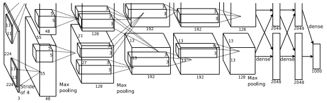
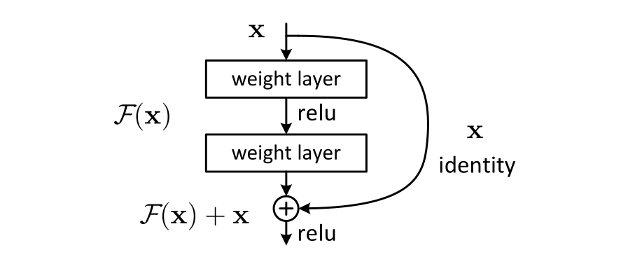

# Chapter 10. CNN 기초와 응용 (CNN Basics & Applications)

1959년, 신경생리학자 데이비드 허블(David Hubel)과 토르스텐 비셀(Torsten
Wiesel)은 고양이의 시각피질에 전극을 꽂고 다양한 시각 자극을 보여주는 실험을
했다. 그 결과 특정 뉴런은 화면 **전체**가 아니라 아주 좁은 영역(수용장,
receptive field)의 특정 방향 선분에만 반응한다는 것을 발견했다 — 뇌는 이미지를
통째로 보는 게 아니라, 작은 지역별 패턴을 감지하는 뉴런들을 층층이 쌓아 점점
더 복잡한 패턴(선 → 모서리 → 도형 → 사물)을 조합해낸다는 뜻이었다. 이 발견은
1980년대 후쿠시마 쿠니히코의 네오코그니트론을 거쳐, 지금 쓰이는 **합성곱
신경망**(Convolutional Neural Network, CNN)의 직접적인 영감이 됐다. 이번
장은 합성곱이라는 연산 자체(전반부)와, 그걸 실전에서 어떻게 재사용·확장하는지
(후반부)를 한 장에서 함께 다룬다.

이 장은 Chapter 9에서 닦은 기초 위에서 자연스럽게 이어진다. Chapter 9의
다층 퍼셉트론(MLP)으로 이미지를 다루려면 픽셀을 전부 펼쳐 긴 벡터로 만들어야
했는데, 그 방식은 파라미터가 폭발할 뿐만 아니라 "고양이가 사진 왼쪽 위나
오른쪽 아래에 있든 같은 고양이"라는 공간 구조를 전혀 활용하지 못했다. 합성곱은
바로 이 한계를 "작은 필터를 온 이미지에 걸쳐 똑같이 재사용한다"는 한 가지
아이디어로 풀어낸다. 역전파(Chapter 9)는 변하지 않는다 — 합성곱·풀링 층에도
그래디언트는 같은 연쇄법칙으로 흘러가고, 층을 깊게 쌓을수록 다시 나타나는
그래디언트 소실(10.2)은 Chapter 9에서 본 그 현상의 재발이다. 이 장을 마치면
다음 장(Chapter 11, 시퀀스 모델)으로 넘어가는데, 그 연결고리는 "재사용"이다 —
CNN이 가중치를 **공간**(이미지 위 위치)에 걸쳐 재사용한다면, RNN은 같은
가중치를 **시간**(시퀀스의 시점)에 걸쳐 재사용한다. 공간과 시간, 두 축에서
"작은 단위 패턴을 재사용해 큰 구조를 쌓는다"는 동일한 원리를 보는 셈이다.

## 학습 목표

이 장을 마치면 다음을 할 수 있다.

- 합성곱의 출력 크기를 패딩·스트라이드와 함께 손으로 계산하고, 각 층의
  파라미터 수와 FLOPs를 MLP와 비교해 "왜 합성곱이 효율적인가"를 숫자로
  설명한다.
- 합성곱과 풀링이 "좁아지고 깊어지는" CNN 구조를 만들 때 각각 (패턴 감지
  vs. 수용장 확대·해상도 축소) 어떤 역할을 하는지 설명하고, LeNet에서
  ResNet[^resnet]
  까지 구조가 어떻게 변했는지, 스킵 연결이 왜 깊은망을 가능하게 하는지
  서술한다.
- 분류 모델 위에 탐지·분할 헤드(R-CNN, IoU/NMS, 1×1 합성곱[^googlenet], U-Net)를 붙여
  새 문제를 정의하는 방식을 이해하고, 전이학습[^transferlearning] (특징 추출 vs. 미세조정)이
  언제·왜 유리한지 판단한다.

이 장을 관통하는 하나의 실은 **"재사용"**이다. 합성곱은 같은 필터를 이미지의
모든 위치에서 다시 쓰고(10.1), 풀링은 그 합성곱을 공간 해상도를 아끼며 깊이
쌓게 하며(10.2), 탐지·분할·전이학습은 배운 앞쪽 층을 전혀 다른 문제에 그대로
적용한다(10.3). 이 재사용의 감각 — "새로 배울 것을 최소화하고, 이미 배운 것을
어디든 다시 쓰자" — 를 붙잡고 있으면, 앞부분의 수식과 뒷부분의 아키텍처가
같은 이야기의 두 면임을 보게 된다. 세 수업도 이 흐름을 따른다: 10.1은 합성곱
**한 연산**을 계산하고, 10.2는 그 연산을 **구조**로 쌓아(그리고 깊이의 한계에
부딪혀) 스킵 연결을 만나고, 10.3은 그 구조를 **새 문제**에 다시 쓴다.

이번 주는 세 개의 수업 블록으로 진행된다:

- [10.1 합성곱, 출력 크기, 파라미터 수와 FLOPs](chapter10/1.md) — MLP로
  이미지를 다루면 안 되는 이유(파라미터 폭발 + 공간 정보 무시)에서 출발해,
  작은 필터를 온 이미지에 걸쳐 재사용하는 합성곱(파라미터 공유)을 다룬다.
  3×3 필터가 5×5 이미지를 스캐닝하는 것을 손으로 계산하고, 패딩·스트라이드를
  넣은 출력 크기 공식을 유도한 뒤, 각 층의 파라미터 수와 FLOPs를 계산해 MLP와
  대비한다.
- [10.2 풀링과 전형적인 CNN 구조](chapter10/2.md) — 최대·평균·전역 평균
  풀링이 공간 크기를 줄이고 미세 이동에 둔감한 특징을 주며, 층을 쌓을수록
  수용장이 넓어지는 기제를 다룬다. LeNet-5 → AlexNet[^alexnet] →
  VGGNet[^vggnet]의 구조를 10.1의 공식으로 풀어본 뒤, 깊이를 쌓을 때
  다시 나타나는 그래디언트 소실(깊이 열화)을 스킵 연결(ResNet)과 배치
  정규화[^batchnorm]로 어떻게 해결하는지 PyTorch 실습으로 확인한다.

- [10.3 분류를 넘어서: 탐지, 분할, 전이학습](chapter10/3.md) — "클래스
  벡터 1개"를 내는 분류기를 넘어, 위치까지 붙은 객체 탐지(R-CNN[^rcnn] 3단계
  파이프라인, IoU·NMS)와 픽셀 단위 분할(1×1 합성곱
  헤드, U-Net[^unet][^fcn])로 확장한다.
  마지막으로 사전학습된 CNN의 앞쪽 층을 재사용하는 전이학습(특징 추출 vs.
  미세조정)을 작은 실험으로 비교한다. 이 주제를 더 깊이 다루는 자료: [^cs230].

[^alexnet]: Krizhevsky, A., Sutskever, I., Hinton, G. E. (2012). "ImageNet Classification with Deep Convolutional Neural Networks." NeurIPS 2012.
[^resnet]: He, K., Zhang, X., et al. (2015). "Deep Residual Learning for Image Recognition." arXiv:1512.03385.
[^batchnorm]: Ioffe, S., Szegedy, C. (2015). "Batch Normalization: Accelerating Deep Network Training by Reducing Internal Covariate Shift." arXiv:1502.03167.
[^rcnn]: Girshick, R., Donahue, J., Darrell, T., Malik, J. (2014). "Rich feature hierarchies for accurate object detection and semantic segmentation." CVPR 2014. arXiv:1311.2524.
[^unet]: Ronneberger, O., Fischer, P., Brox, T. (2015). "U-Net: Convolutional Networks for Biomedical Image Segmentation." arXiv:1505.04597.
[^cs230]: 더 깊이 보려면: Stanford CS230: Deep Learning. https://cs230.stanford.edu/
[^vggnet]: Simonyan, K., Zisserman, A. (2014). "Very Deep Convolutional Networks for Large-Scale Image Recognition." ICLR 2015. arXiv:1409.1556.
[^fcn]: Long, J., Shelhamer, E., Darrell, T. (2014). "Fully Convolutional Networks for Semantic Segmentation." CVPR 2015. arXiv:1411.4038.
[^googlenet]: Szegedy, C., Liu, W., Jia, Y., et al. (2014). "Going Deeper with Convolutions." arXiv:1409.4842 (CVPR 2015).
[^transferlearning]: Pan, S. J., Yang, Q. (2010). "A Survey on Transfer Learning." IEEE Transactions on Knowledge and Data Engineering 22(10), 134–151. doi:10.1109/TKDE.2009.191.
