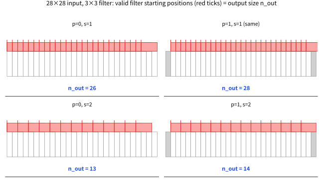

# 10.1 합성곱, 출력 크기, 파라미터 수와 FLOPs

[](https://colab.research.google.com/github/SuminHan/book-ml/blob/main/notebooks/ml1/chapter10_1_conv_output_size.ipynb)

### MLP로 이미지를 다루면 안 되는 이유

Chapter 9의 다층 퍼셉트론(MLP)에 이미지를 입력하려면, 가로세로 픽셀을 모두
펼쳐서 하나의 긴 벡터로 만들어야 한다. 200×200 흑백 이미지만 해도 4만 개의
입력이고, 첫 은닉층 뉴런이 1000개면 그것만으로 4천만 개의 가중치가 필요하다 —
게다가 이 방식은 "고양이가 사진 왼쪽 위에 있든 오른쪽 아래에 있든 같은
고양이"라는 사실을 전혀 활용하지 못한다. 픽셀 하나 위치만 옮겨도 완전히 다른
입력으로 취급된다.

### 합성곱: 작은 필터를 온 이미지에 재사용

CNN의 핵심 아이디어는 허블과 비셀[^hubelwiesel]이 발견한 것과 같다: 이미지 **전체**를 한
번에 보는 대신, 작은 필터(예: 3×3)를 이미지 전체에 걸쳐 **똑같이 재사용**하면서
슬라이드시킨다. \\(k \times k\\) 필터(커널, kernel)를 입력 위에서 슬라이드시키며,
각 위치에서 필터와 겹치는 영역의 원소별 곱의 합을 계산한다:

```python
def conv2d(image, kernel):
    img_h, img_w = len(image), len(image[0])
    k = len(kernel)
    out_h, out_w = img_h - k + 1, img_w - k + 1
    output = [[0.0] * out_w for _ in range(out_h)]
    for i in range(out_h):
        for j in range(out_w):
            total = 0.0
            for di in range(k):
                for dj in range(k):
                    total += image[i+di][j+dj] * kernel[di][dj]
            output[i][j] = total
    return output
```

각 필터는 특정 패턴(수직선, 모서리 등)에 강하게 반응하도록 **학습**된다 —
필터의 값 자체가 학습 대상 파라미터다. "모서리를 감지하는 필터"는 이미지의
어느 위치에서든 똑같이 모서리를 감지해야 하므로, 같은 가중치를 위치마다 새로
배울 필요가 없다 — 이 재사용(파라미터 공유, parameter sharing) 덕분에 MLP보다
훨씬 적은 파라미터로 훨씬 큰 이미지를 다룰 수 있다.

### "합성곱"이라는 이름의 뜻: 뒤집기(flip)는 어디로 사라졌나?

신호처리 교과서의 정의로, 두 수열 \\(f\\)와 \\(k\\)의 **합성곱**(convolution)은
이렇게 정의된다:

\\[(f \* k)(i) = \sum\_{j} k(j)\\, f(i - j)\\]

\\(i - j\\)를 주목하라 — 커널이 입력과 곱해질 때 **뒤집힌(flipped) 모습**으로
겹쳐진다. 그런데 위 `conv2d` 코드는 `image[i+di][j+dj] * kernel[di][dj]` —
뒤집기 없이 그대로 곱한다. 신호처리 용어로 우리가 실제로 구현한 것은
**상관(corrélation, correlation**)이고, "합성곱"이 아니다. 그런데도 딥러닝
세계(PyTorch[^pytorch]·TensorFlow[^tensorflow] 포함)는 이 연산을
"convolution"이라고 부른다.

왜 아무도 신경 쓰지 않는가? 세 가지 이유다. **첫째, 필터의 값은 학습 대상
파라미터**이기 때문이다. "정답 필터"가 따로 있는 게 아니라 네트워크가 스스로
찾아내므로, 뒤집힌 버전이 다른 반응을 낸다면 가중치를 뒤집힌 것으로 학습
시키면 그만이다 — 표현 가능한 함수의 *집합*은 뒤집기를 하든 안 하든 정확히
같다. **둘째, 실수 필터는 고정되어 손으로 설계되는 경우**(예: 특정 주파수만
통과시키는 DSP 필터)에 한해 뒤집기가 실질적 차이가 되는데, 학습되는 CNN에서
는 그런 경우가 사실상 없다. **셋째, 이름의 기원**이다 — 합성곱 정의로부터
"시스템 출력이 임펄스 응답의 뒤집힌 버전과 입력의 합성곱"이라는 표현이 나오는
것은 선형 시불변(LTI) 시스템 이론(스피커를 통과한 기타 소리를 예로 들자)에서
왔고, 후쿠시마의 네오코그니트론(1980)[^neocognitron] 이래 이 분야의 이름이 그대로 이어져
온 것이다. **코드와 수식에서는 "각 위치의 원소별 곱의 합"을 그냥
"합성곱"이라고 쓰면 된다 — 이 분야 전체가 그렇게 쓰고 있다.**

### 손으로 한 번: 3×3 필터가 5×5 이미지를 스캐닝하면

앞의 `conv2d`를 종이 위에서도 실제로 돌려보자. 5×5 흑백 이미지(2번 열에
수직 흰선, 밝기 1, 배경 0)에, 중심 열만 1인 3×3 필터("수직선 탐지기"의
가장 단순한 버전)를 적용한다:

입력 이미지 \\(5\times5\\):

| | 열 0 | 열 1 | **열 2** | 열 3 | 열 4 |
|---|---|---|---|---|---|
| 행 0 | 0 | 0 | **1** | 0 | 0 |
| 행 1 | 0 | 0 | **1** | 0 | 0 |
| 행 2 | 0 | 0 | **1** | 0 | 0 |
| 행 3 | 0 | 0 | **1** | 0 | 0 |
| 행 4 | 0 | 0 | **1** | 0 | 0 |

필터 \\(3\times3\\):

| | | |
|---|---|---|
| 0 | **1** | 0 |
| 0 | **1** | 0 |
| 0 | **1** | 0 |

출력은 \\(5-3+1=3\\)이므로 \\(3\times3\\)이고, 9개 위치 중 중심 위치
\\((i=1, j=1)\\) 하나를 직접 계산해본다 — 필터가 이미지의 중심 \\(3\times3\\)
영역(행 1~3, 열 1~3)을 덮는다:

\\[
\begin{aligned}
&0\\!\cdot\\!0 + 1\\!\cdot\\!1 + 0\\!\cdot\\!0 \quad (\text{행 1})\\
+&0\\!\cdot\\!0 + 1\\!\cdot\\!1 + 0\\!\cdot\\!0 \quad (\text{행 2})\\
+&0\\!\cdot\\!0 + 1\\!\cdot\\!1 + 0\\!\cdot\\!0 \quad (\text{행 3})\\
=&\ 0+1+0 + 0+1+0 + 0+1+0 = 3
\end{aligned}
\\]

나머지 위치도 같은 방식으로 계산하면(9개 위치 전부 — 실습 노트북 §1에서
numpy[^numpy]로 그대로 실행해본다):

출력 \\(3\times3\\):

| | j=0 (열 1 위) | **j=1 (열 2 위)** | j=2 (열 3 위) |
|---|---|---|---|
| i=0 | 0 | **3** | 0 |
| i=1 | 0 | **3** | 0 |
| i=2 | 0 | **3** | 0 |

필터의 유일한 nonzero인 중심 열이 선(열 2) 위에만 있을 때 반응한다 — 그래서
출력 지도에 수직선이 똑같이 그해진다. 세 가지가 한꺼번에 보인다: (1) 5×5
입력이 3×3으로 "줄어든" 것은 `out = n−k+1`의 자연스러운 결과다(다음 절에서
정리), (2) 같은 가중치가 **어느 위치에서든** 같은 패턴에 반응하는 것이
파라미터 공유의 구체적 모습이고, (3) "수직선"이라는 패턴이 *원본 스케일
그대로* 다음 층으로 전달된다 — 원본이 5칸짜리 선이든 500칸짜리 선이든,
출력 지도 위에서는 "3×3 지도의 중심 열이 밝다"로 똑같이 표현되기 때문이다.
이 마지막 점이 합성곱이 "규모를 초월한" 특징을 만든 기반이며, Chapter 10
전반부(10.2~10.3)에서 풀링·수용장이 이 아이디어를 확장한다.

### 출력 크기 공식

입력 크기 \\(n \times n\\), 필터 크기 \\(k \times k\\), 패딩(padding)
\\(p\\)(입력 가장자리에 0을 두르는 픽셀 수), 스트라이드(stride) \\(s\\)(필터가
한 번에 이동하는 칸 수)일 때, 출력 크기는:

\\[n\_{\text{out}} = \left\lfloor \frac{n + 2p - k}{s} \right\rfloor + 1\\]

예: \\(n=28, k=3, p=0, s=1\\)이면 \\(n\_{\text{out}} = 28-3+1 = 26\\). 패딩
없이는 필터를 지날 때마다 이미지가 점점 작아진다 — `p = (k-1)/2`로
설정하면(**same padding**) 출력 크기를 입력과 같게 유지할 수 있다.

#### 유도: "필터가 다 들어가는 위치를 세자"

공식은 미적분의 공식처럼 보이지만, 실제로는 **세는 문제**다. 필터의 왼쪽
끝(1D로 줄여서 생각하자)이 놓일 수 있는 위치를 세면 된다.

- 필터는 입력 *안쪽*에 완전히 들어와야 하므로, 시작 위치의 최댓값은
  \\(n-k\\)다(그 위치에서 필터의 오른쪽 끝은 \\(n-k+k-1 = n-1\\), 정확히
  마지막 픽셀).
- 스트라이드 \\(s\\)로 이동하므로 시작 위치는 \\(0, s, 2s, 3s, \ldots\\)
  중 \\(\le n-k\\)인 것들이다. 이 등차수열의 항의 개수가
  \\(\left\lfloor \frac{n-k}{s} \right\rfloor + 1\\).
- 패딩 \\(p\\)는 입력을 \\(n \to n+2p\\)로 만들어 주므로(왼쪽과 오른쪽
  **두 쪽**에 \\(p\\)씩 — 그래서 공식에는 \\(2p\\)가 들어간다), \\(n\\)을
  \\(n+2p\\)로 치환하면 위 공식이 나온다.

8×8 입력, 3×3 필터(\\(p=0\\))에서 스트라이드만 바꾸며 직접 세어보면:

| 스트라이드 \\(s\\) | 시작 위치 (0-indexed) | 개수 | 공식 \\(\lfloor(8-3)/s\rfloor+1\\) |
|---|---|---|---|
| 1 | 0, 1, 2, 3, 4, 5 | 6 | \\(\lfloor 5/1\rfloor+1=6\\) |
| 2 | 0, 2, 4 | 3 | \\(\lfloor 5/2\rfloor+1=3\\) |
| 4 | 0, 4 | 2 | \\(\lfloor 5/4\rfloor+1=2\\) |

직접 세는 것과 공식이 \\(s\\)이 1이 아닌 순간에도 일치한다 — \\(s=4\\)
경우를 보면, "5칸을 4칸씩 건너뛰면 0과 4 두 곳"이라는 세기와
\\(\lfloor 5/4 \rfloor + 1 = 2\\)가 같은 숫자임을 확인한다. (수직·수평
방향은 독립적으로 같은 계산을 하므로 2D에서는 이 값을 양쪽에 적용한다 —
사각형 입력이면 출력도 사각형이다.)

**패딩이 왜 "2p"인가 — 공식에서 가장 많이 범하는 실수**: 코드의
`padding=1`은 *한 변당* 1픽셀이지만, 총 늘어나는 길이는 왼쪽+오른쪽 =
\\(2p\\)다. TensorFlow 계열의 명명에서는 패딩 없는 경우를 `padding="valid"`
(필터가 다 들어가는 위치만, = 위 유도), 크기를 유지하는 패딩을
`padding="same"`이라고 부른다 — "same"의 의미는 \\(k\\)가 홀수일 때
\\(p=(k-1)/2\\)인 경우로, \\(n\_{\text{out}} = n\\)이 된다.



위 그림은 28×28, k=3을 1D로 줄여 네 가지 (p, s) 조합을 비교한 것이다. 회색
칸이 패딩이고 흰 칸이 원래 입력이며, 각 틱(tick)은 유효한 필터 시작
위치 하나씩이다 — **틱의 개수가 곧** \\(n\_{\text{out}}\\)이다. 네 경우의
숫자(26, 28, 13, 14)는 모두 공식
\\(\lfloor(28+2p-3)/s\rfloor+1\\)으로 그대로 계산된다.

#### 스트라이드 s=2가 실제로 하는 일

\\(s=2\\)는 1D에서 길이를 반으로, 2D에서는 **가로와 세로 둘 다** 반으로
줄인다 — 즉 공간 **면적**은 1/4로 줄어든다. 예: 224×224에 k=3, p=1, s=2
이면 \\(n\_{\text{out}} = \lfloor(224+2-3)/2\rfloor+1 = 112\\) — AlexNet[^alexnet]의
첫 합성곱 층이 정확히 이 설정(224→112)으로 다운샘플링한다. 10.2절에서
2×2 풀링도 면적을 1/4로 줄여준다는 것을 보게 되는데, 그러면 둘 중 무엇을
쓰느냐는 질문이 자연스럽게 생긴다 — 이 절 FAQ에서 비교한다.

### 파라미터 수와 연산량 계산

\\(C\_{\text{in}}\\)개 입력 채널, \\(C\_{\text{out}}\\)개 출력 채널(즉 필터
개수), 필터 크기 \\(k \times k\\)인 합성곱 층의 파라미터 수(bias 포함):

\\[\text{params} = (k \times k \times C\_{\text{in}} + 1) \times C\_{\text{out}}\\]

이걸 같은 크기의 완전연결층(fully-connected layer, 입력을 펼쳐서 다
연결)과 비교하면 CNN의 효율이 확연히 드러난다. 예: 32×32×3 이미지, 필터
3×3, 출력 채널 16개인 합성곱 층은 \\((3 \times 3 \times 3 + 1) \times 16 =
448\\)개의 파라미터만 쓴다. 같은 입력을 완전연결층(출력 뉴런도 32×32×16개라
가정)에 연결하려면 수백만 개가 필요하다.

**연산량(FLOPs)은 파라미터 수와는 다른 질문이다**: 파라미터 수는 "얼마나
많은 숫자를 저장해야 하는가"를 재지만, 실제 계산 비용(속도)은 "몇 번의
곱셈-덧셈을 하는가"로 잰다. 출력의 한 위치, 한 채널을 계산하려면 \\(k
\times k \times C\_{\text{in}}\\)번의 곱셈이 필요하고, 이걸 출력의 모든
위치(\\(n\_{\text{out}} \times n\_{\text{out}}\\)개)와 모든 필터
(\\(C\_{\text{out}}\\)개)마다 반복하므로:

\\[\text{FLOPs} \approx n\_{\text{out}}^2 \times C\_{\text{out}} \times (k
\times k \times C\_{\text{in}})\\]

파라미터 수 공식과 거의 똑같이 생겼지만, **파라미터 수엔 없던
\\(n\_{\text{out}}^2\\)이 곱해진다** — 같은 필터(같은 파라미터)를 출력
위치마다 재사용하니 파라미터는 적어도, 실제 계산은 그 위치 수만큼 반복해서
일어나기 때문이다.

예: 224×224 흑백 이미지(\\(C\_{\text{in}}=1\\))에 3×3 필터 1개
(\\(C\_{\text{out}}=1\\), 패딩 없음, 스트라이드 1)를 적용하면
\\(n\_{\text{out}}=224-3+1=222\\)이고:

\\[\text{FLOPs} = 222^2 \times 1 \times (3\times3\times1) = 49{,}284
\times 9 = 443{,}556\\]

약 44만 번의 곱셈-덧셈이다. 실제 CNN은 필터를 1개가 아니라 수십~수백 개
쓴다 — 같은 입력에 필터를 64개로 늘리면(\\(C\_{\text{out}}=64\\))
연산량도 정확히 64배인 약 2,839만 번이 된다. **커널(필터) 개수를 늘리면
파라미터 수와 연산량이 똑같이 정비례로 늘어난다**는 뜻이다. 실제 CNN은
이런 합성곱 층을 수십~수백 개 쌓으므로, 전체 연산량은 모델 설계 시
파라미터 수 못지않게 중요하게 따지는 지표다.

#### 손계산 표: 미니 LeNet 세 층의 비용[^lenet]

"비용의 대부분이 어느 층에서 오는가"에 대한 감각을 만들기 위해, 28×28
흑백 이미지를 세 합성곱 층과 한 풀링으로 줄여가는 작은 네트워크를 층별로
계산해보자(실습 노트북 §3에서 numpy로 그대로 재계산한다):

| 층 | 연산 | 출력 크기 | 파라미터 | FLOPs |
|---|---|---|---|---|
| 입력 | 28×28×1 | — | — | — |
| conv 1 | k=3, \\(C\_{out}=4\\), p=0, s=1 | 26×26×4 | 40 | 24,336 |
| conv 2 | k=3, \\(C\_{in}=4\\), \\(C\_{out}=8\\), p=0, s=1 | 24×24×8 | 296 | 165,888 |
| pool | 2×2 max pooling (s=2) | 12×12×8 | 0 | (비교 연산 864회) |
| conv 3 | k=3, \\(C\_{in}=8\\), \\(C\_{out}=16\\), p=0, s=1 | 10×10×16 | 1,168 | 115,200 |
| **합계** | | 10×10×16 | **1,504** | **305,424** |

예를 하나 직접 따라가보자 — conv 2의 FLOPs: \\(n\_{\text{out}}=26-3+1=24\\),
\\(24^2 = 576\\)개 출력 위치, 각 위치에서 \\(C\_{out}=8\\)개 필터 ×
\\(k^2 C\_{in} = 9\times4=36\\)회 곱셈-덧셈 → \\(576\times8\times36 =
165{,}888\\). 표에서 세 가지 관찰이 가능하다:

1. **파라미터 수는 뒤로 갈수록 커지지만(40 → 296 → 1,168), FLOPs의
   최댓값은 conv 2다**(165,888). FLOPs는 \\(n\_{\text{out}}^2\\)에
   비례하는데, conv 2가 공간적으로 가장 크기(24×24) 때문이다 —
   conv 3은 채널이 2배지만 공간은 1/4(10×10)라 연산량은 오히려 적다.
   **파라미터는 "재고"(층당 고정 저장), FLOPs는 "유량"(출력 위치마다
   반복되는 계산**)이다 — 네트워크를 설계할 때 한쪽만 보고서는 안 된다.
2. **풀링은 파라미터가 0**이고, 비용도 곱셈-덧셈이 아니라 *비교*(4개 중
   최댓값 찾기)다 — 보통 FLOPs 합계에서 무시할 만큼 작다(위 표에서는
   괄호로 따로 표기).
3. 위 세 합성곱 층을 **같은 출력 체적**(10×10×16 = 1,600개 값)의
   완전연결층 하나로 대체하면 — 784(=28×28)개 입력을 1,600개 뉴런에
   다 연결하면 — 파라미터는 \\(784\times1{,}600+1{,}600 = 1{,}256{,}000\\),
   즉 합성곱 스택 전체의 **약 835배**다. FLOPs도 \\(784\times1{,}600 =
   1{,}254{,}400\\)으로 합성곱 스택(305,424)의 **약 4.1배**. 같은
   양의 정보를 "한 번에" 보는 대신 작은 패치를 재사용하는 합성곱이
   **약 0.12%의 파라미터와 1/4의 연산**으로 같은 체적의 특징을 만든
   것이다 — 게다가 위치 불변성이라는 귀납적 편향까지 덤으로 가진다.


### 자주 하는 실수: 이 절의 공식이 걸리는 두 곳

**실수 1 — "패딩은 출력에 더해지는 거다."** 출력 크기 공식을 처음 쓸
때 가장 흔한 혼란이다. n=28, k=3, p=1, s=1의 출력이 "28+2=30"이라고
생각하는 것 — 패딩 픽셀 자체가 출력을 만든다고 오해하는 것이다. **패딩은
출력 위치를 새로 만들지 않는다** — "벗어나갈 것 같았던" 위치(필터가
원본 이미지의 경계를 넘는 위치)를 유효하게 만들어 주는 역할뿐이다.
정리하면: 출력 = "패딩된 입력 안에서 필터가 완전히 들어가는 위치 수" =
\\(\lfloor(28+2-3)/1\rfloor+1 = 28\\). 패딩의 정당한 용도는
"same padding으로 *크기를 유지*하는 것"이지, "출력을 키우는 것"이 아니다.

**실수 2 — "FLOPs = 파라미터 수 × 고정 계수."** 완전연결층에서는 샘플
당 FLOPs가 약 2×(파라미터 수) — 각 가중치가 한 번의 곱셈-덧셈을 하므로 —
라, 이 습관을 합성곱 층에도 무의식적으로 적용하기 쉽다. 그러나 합성곱
층의 FLOPs/파라미터 비율은 \\(n\_{\text{out}}^2\\)이며 **층마다 다르다**.
구체적으로, 같은 224×224(\\(C\_{in}=1\\)) 입력, 64개 출력 채널인 두
층을 비교하자:

| 층 | 필터 | 파라미터 | FLOPs |
|---|---|---|---|
| A: 3×3 | p=0, s=1 | (9+1)×64 = 640 | 222²×64×9 ≈ 2,839만 |
| B: 1×1 | p=0, s=1 | (1+1)×64 = 128 | 224²×64×1 ≈ 321만 |

파라미터 비율은 5배(640/128)인데, FLOPs 비율은 약 **8.8배**
(28,387,584 / 3,211,264)다 — A가 출력 위치마다 9배의 곱셈-덧셈을 하기
때문이다. **연산량을 비교할 때는 "파라미터 몇 배"가 아니라 공식으로
직접 계산**해야 한다는 뜻이다. (1×1 합성곱 — 위 B — 은 공간 크기를
그대로 둔 채 채널만 선형 결합하는 연산이라, "경량으로 채널을 섞는다"는
용도로 VGG[^vgg]와 ResNet[^resnet]의 중간층에서 실전에서 많이 쓰인다. 10.2에서 구조
속에서 다시 만난다.[^ingoresnet])

### 실습

앞의 표들을 코드 한 페이지로 묶어둔다(패딩/스트라이드 그림까지 포함한
완전 버전은 실습 노트북 §2·§3에서 실행한다):

```python
def out_size(n, k, p=0, s=1):
    return (n + 2*p - k) // s + 1          # 1D 한 방향의 출력 크기

def conv_cost(n_in, k, c_in, c_out, p=0, s=1):
    n_out = out_size(n_in, k, p, s)
    params = (k*k*c_in + 1) * c_out        # bias 포함
    flops  = n_out**2 * c_out * (k*k*c_in) # 출력 위치마다 반복
    return n_out, params, flops

print(conv_cost(28, 3, 1, 4))    # (26, 40, 24336)   <- 표의 conv 1
print(conv_cost(26, 3, 4, 8))    # (24, 296, 165888) <- 표의 conv 2
print(conv_cost(12, 3, 8, 16))   # (10, 1168, 115200) <- 표의 conv 3
print(sum(conv_cost(n, k, ci, co)[1]
          for n, k, ci, co in [(28,3,1,4), (26,3,4,8), (12,3,8,16)]))
# 1504  <- 표의 파라미터 합계와 일치
```

세 줄의 출력과 합계 1,504가 손계산 표와 정확히 일치하는 것을 확인하면,
"수식 → 코드 → 표"가 하나의 계산을 세 번으로 확인한 셈이다 — 이 절의
세 공식(\\(n\_{\text{out}}\\), params, FLOPs)이 서로 독립이 아니라
**같은 입력 \\((n,k,p,s,C\_{in},C\_{out})\\)에서 나란히 계산되는 하나의
패키지**라는 감각이 이 코드에 담겨 있다.

### 핵심 공식 한눈에

| 항목 | 공식 | 무엇을 재나 |
|---|---|---|
| 출력 크기 | \\(n\_{\text{out}}=\lfloor(n+2p-k)/s\rfloor+1\\) | 합성곱 후 공간 크기 (가로/세로 각각) |
| 파라미터 | \\((k^2 C\_{\text{in}}+1)\\,C\_{\text{out}}\\) | 저장해야 할 가중치 수 (bias 포함) |
| FLOPs | \\(n\_{\text{out}}^2\\,C\_{\text{out}}\\,k^2 C\_{\text{in}}\\) | 곱셈-덧셈 횟수 (출력 위치마다 반복) |
| 관계 | FLOPs ≈ (bias 뺀 params) × \\(n\_{\text{out}}^2\\) | "재고"와 "유량"의 차이 |

### 자주 묻는 질문

**Q. 필터 크기는 왜 보통 홀수(3×3, 5×5)인가요?** 홀수 필터는 정확히
중심 픽셀이 하나 있어서, "이 필터가 어느 픽셀을 중심으로 패턴을 본다"는
해석이 자연스럽다 — 짝수 필터(예: 2×2)는 중심이 픽셀과 픽셀 사이에
걸쳐서 이런 대칭적인 해석이 어려워진다. 실전에서는 3×3 필터를 여러 겹
쌓는 것이 5×5나 7×7 필터 하나를 쓰는 것보다 같은 수용장을 더 적은
파라미터로 만들 수 있어(예: 3×3 두 개는 5×5 하나와 같은 수용장을
\\((3\times3\times2)=18\\) vs \\(5\times5=25\\) 파라미터로 만든다) 더
널리 쓰인다.

**Q. 파라미터가 적으면 항상 좋은 건가요?** 파라미터가 적으면 학습이
빠르고 과적합(Chapter 6) 위험이 줄어들지만, 표현력도 함께 줄어든다 —
Chapter 4.1의 편향-분산 트레이드오프가 여기서도 그대로 적용된다. CNN이
MLP보다 이미지에서 항상 유리한 이유는 단순히 "파라미터가 적어서"가
아니라, 그 적은 파라미터가 "위치 불변성"이라는 이미지의 실제 구조에
정확히 맞는 가정(귀납적 편향, inductive bias)을 인코딩하고 있기
때문이다.

**Q. 스트라이드 2와 2×2 풀링은 무슨 차이인가요? 둘 다 면적을 1/4로 줄이는데.**
세 가지 차이다. (1) **정보 처리 방식**: max pooling은 4개 픽셀 중 3개를
**버리고** 최댓값 하나만 남긴다(미분 불가, 정보가 돌이킬 수 없이 사라짐).
반면 stride-2 합성곱은 겹치지 않는 각 창 안의 \\(k^2C\_{in}\\)개 값을
**가중치로 합성**해 한 값으로 만든다(미분 가능, 그리고 "다운샘플링
직전에는 뭘 살릴지"가 학습 대상이 된다). (2) **자유도**: 풀링은 창
크기(2×2)와 축소율(1/2)이 함께 묶여 있지만, stride 합성곱은 필터
크기와 스트라이드를 독립적으로 고를 수 있다(예: 5×5, s=2). (3) **역사**:
LeNet·AlexNet·VGG 시절에는 max pooling이 표준 다운샘플러였지만, ResNet
이후 고해상도 네트워크에서는 **stride-2 합성곱**이 주류가 됐다 —
다운샘플링 자체를 네트워크가 학습하게 하기 때문이다. 현대 네트워크는
둘을 섞어 쓰는 경우가 많다.[^hrnet]

**Q. FLOPs 공식에 bias의 "+1"이 없는데, 빠뜨린 것인가요?** bias는
출력 위치당 **한 번만 더해지는** 값이라, 그 비용은
\\(n\_{\text{out}}^2 C\_{\text{out}}\\) — 주항
\\(n\_{\text{out}}^2 C\_{\text{out}} k^2 C\_{\text{in}}\\) 대비 1 차수
낮은 차수 항이다(\\(k^2C\_{\text{in}}\ge 9\\)인 일반적 3×3 층에서는
약 10% 미만). 그래서 표준 FLOPs 관례는 곱셈-덧셈(MAC) 수
\\(k^2 C\_{\text{in}}\\)으로 세고 bias를 무시한다. (엄밀히
"곱셈 k²C_in 회 + 덧셈 k²C_in 회"를 다 세면 2×MAC 관례도 있는데,
비율 계산에는 양쪽이 동일한 계수로 약분되므로 관례를 정해 두면 된다.)

**Q. PyTorch에서 28×28 입력의 3×3 conv 출력이 정말 26×26인가요?**
맞다 — `nn.Conv2d(1, 4, 3)`(기본값 padding=0, stride=1)의 출력은 26×26,
`nn.Conv2d(1, 4, 3, padding=1)`의 출력은 28×28이다. PyTorch의
`padding` 인자는 이 절 공식의 **한 변당 패딩 수 p** 그대로다(총
2p). `same`/`valid` 이름은 쓰지 않지만, p=(k−1)/2의 same padding
트릭은 똑같이 동작한다. (참고: 26×26 입력에 또 p=0의 3×3을 쓰면 24×24 —
짝수/홀수가 층을 지나며 바뀌지만, 이건 순수한 "크기 장부" 문제일 뿐
오류가 아니다.)[^cs230]

### 확인 문제: 숫자 네 개

1. **출력 크기.** 56×56 입력, 3×3 필터, 패딩 1, 스트라이드 2일 때 출력
   크기를 계산하라. (힌트: \\(\lfloor(56+2-3)/2\rfloor+1\\) — LeNet 계열
   네트워크의 224→112 다운샘플링이 이 계산의 2배 크기 버전이다.)
2. **파라미터와 FLOPs.** 28×28(\\(C\_{in}=16\\))에 5×5 필터,
   \\(C\_{out}=32\\), p=0, s=1인 합성곱 층의 (a) 출력 크기, (b)
   파라미터 수(bias 포함), (c) FLOPs를 계산하라. (힌트:
   \\(n\_{\text{out}}=24\\), params=(25×16+1)×32, FLOPs=
   \\(24^2\times32\times(25\times16)\\).)
3. **MLP 비교.** 앞의 "손계산 표" 네트워크(파라미터 합계 1,504, FLOPs
   305,424)와 같은 출력 체적(1,600개 값)을 내는 완전연결층 하나
   (784개 입력 → 1,600개 뉴런)의 파라미터 수와 샘플당 FLOPs를 계산하고
   각각 몇 배인지 구하라. (힌트: FLOPs 비율은 "4배 안팎"이고 파라미터
   비율은 그보다 훨씬 크다 — 왜 둘의 비율이 다른지 한 문장으로도
   설명해보자.)
4. **실수 찾기.** 동기 노트: "28×28, k=3, p=1, **s=2** → 출력
   (28−3+1)/2 + 2 = 15." 정답은 14다 — 이 계산 과정의 개념적 오류를
   짚어라. (힌트: 패딩은 스트라이드로 나누기 **전**에 입력에 더해져야
   한다: \\(\lfloor(28+2-3)/2\rfloor+1 = 14\\). s=1에서는 두 계산이
   우연히 일치하지만, s≥2에서 갈린다.)

[^alexnet]: Krizhevsky, A., Sutskever, I., Hinton, G. E. (2012). "ImageNet Classification with Deep Convolutional Neural Networks." NeurIPS 2012.
[^pytorch]: Paszke, A., Gross, S., Massa, F., et al. (2019). "PyTorch: An Imperative Style, High-Performance Deep Learning Library." arXiv:1912.01703. — PyTorch 프레임워크의 원 논문(시스템 페이퍼).
[^tensorflow]: Abadi, M., Agarwal, A., Barham, P., et al. (2016). "TensorFlow: Large-Scale Machine Learning on Heterogeneous Distributed Systems." arXiv:1603.04467. — TensorFlow 프레임워크의 원 논문(시스템 페이퍼).
[^vgg]: Simonyan, K., Zisserman, A. (2014). "Very Deep Convolutional Networks for Large-Scale Image Recognition." arXiv:1409.1556. — 16·19층의 매우 깊은 CNN(VGGNet)의 원 논문.
[^resnet]: He, K., Zhang, X., et al. (2015). "Deep Residual Learning for Image Recognition." arXiv:1512.03385.
[^cs230]: 더 깊이 보려면: Stanford CS230: Deep Learning. https://cs230.stanford.edu/ — 이 절의 합성곱 출력 크기/패딩/스트라이드 "크기 장부"와 파라미터·FLOPs 계산은 CS230의 Convolutional Neural Networks 강의와 직접 겹친다.
[^ingoresnet]: Szegedy, C., Liu, W., Jia, Y., Sermanet, P., Reed, S., Anguelov, D., Erhan, D., Vanhoucke, V., Rabinovich, A. (2014). "Going Deeper with Convolutions." arXiv:1409.4842. — GoogLeNet의 원 논문. "inception" 모듈(여러 크기 필터의 병렬 조합)과 1×1 합성곱(채널 믹싱을 위한 경량 투영)을 이 논문에 의해 실전에 널리 퍼뜨렸다.
[^neocognitron]: Fukushima, K. (1980). "Neocognitron: A Self-Organizing Neural Network Model for a Mechanism of Pattern Recognition Unaffected by Shift in Position." *Biological Cybernetics* 36(4), 193–200. — 시각피질의 단순세포·복합세포 계층 구조를 모방한 CNN의 선구 모델. "합성곱층"이라는 용어 자체가 이 논문에서 처음 쓰였다.
[^lenet]: LeCun, Y., Bottou, L., Bengio, Y., Haffner, P. (1998). "Gradient-Based Learning Applied to Document Recognition." *Proceedings of the IEEE* 86(11), 2278–2324. — 학습 가능한 CNN(LeNet-5)을 실전에서 검증한 원 논문. 이 절의 미니 LeNet(28×28, 세 합성곱 층 + 풀링)은 이 구조를 축소한 것이다.
[^hubelwiesel]: Hubel, D. H., Wiesel, T. N. (1962). "Receptive Fields, Cells and Columns of the Cat's Visual Cortex." *Journal of Physiology* 160(1), 106–154. — 시각피질의 단순세포·복합세포가 위치를 가리지 않고 방향·모서리 패턴에 선택적으로 반응한다는 수용장(receptive field) 연구로, 합성곱의 "작은 필터를 온 이미지에 재사용한다"는 설계 원형의 생물학적 근거다. (참고: 허블과 비셀은 1981년 노벨상 수상 논문인 "Receptive Fields of Single Neurons in the Cat's Striate Cortex"(*J. Physiol.* 1943)으로 이미 수용장을 기술해 두었고, 1962년 논문은 이 계층적 조직을 확장한 것이다.)
[^numpy]: Harris, C. R. et al. (2020). "Array programming with NumPy." Nature 585, 357 (2020); arXiv:2006.10256.
[^hrnet]: Wang, J., Sun, K., Cheng, T., et al. (2019). "Deep High-Resolution Representation Learning for Visual Recognition." arXiv:1908.07919. — HRNet은 풀링로 내린 해상도를 다시 되살리는 구조 대신, 처음부터 끝까지 고해상도 특성을 유지하며 학습된다. 그래서 다운샘플링을 풀링이 아닌 스트라이드 합성곱으로 처리하는 것이 이 계열 고해상도 네트워크의 표준 관행이다.
