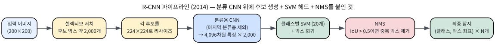
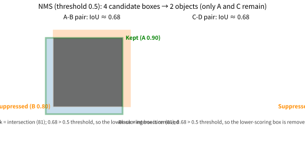

# 10.3 분류를 넘어서: 탐지, 분할, 전이학습

[](https://colab.research.google.com/github/SuminHan/book-ml/blob/main/notebooks/ml1/chapter10_3_detection_segmentation_transfer.ipynb)

### 분류를 넘어서: 탐지와 분할

지금까지의 CNN은 "이미지 전체가 어떤 클래스인가"(분류)만 답했다. 실전
문제는 더 세밀한 답을 요구할 때가 많다:

- **객체 탐지**(Object Detection): "이미지 안에 사물이 어디에, 무엇이
  있는가" — 각 사물의 위치를 사각형(bounding box)으로, 그 안의 클래스를
  함께 예측한다.
- **의미론적 분할**(Semantic Segmentation): "각 픽셀이 어떤 클래스에
  속하는가" — 이미지 크기와 똑같은 크기의 출력을 내되, 각 픽셀에 클래스
  라벨을 붙인다(자율주행에서 "이 픽셀은 도로/보행자/차량" 등을 구분하는
  데 쓰인다).

**탐지는 "위치까지 붙은 분류"다.** 분류 네트워크는 1000개 숫자의 *한
개*의 벡터를 내지만, 탐지 모델은 사물 *마다* (클래스, x, y, w, h) —
사각형 좌표 4개 + 클래스 하나 — 를 내야 하고, 게다가 **사물의 개수 자체가
모르다**. 이 문제의 어려운 부분은 "무엇을 보는가"(그건 10.2의 네트워크가
이미 잘한다)가 아니라 "여러 개, 각기 다른 위치"를 하나의 전진전파(forward
pass)로 어떻게 다루는가다. 2010년대 탐지 연구는 정확히 이 두 질문에
서로 다른 구조로 답해 온 역사(R-CNN → Fast R-CNN → YOLO → ...)인데,
이 절에서는 그중 첫발이자 가장 단순한 **R-CNN**(2014, Girshick 등)[^rcnn]을
한 번 파헤쳐 "CNN 위에 다른 헤드(head)를 붙이면 문제가 바뀐다"는
골격을 확인한다.

#### R-CNN: "후보 → 특징 → 판정" 3단계 파이프라인



**단계 1 — 후보 지역(candidate regions).** 사물이 이미지의 *모든* 위치,
*모든* 크기에 있을 수 있다고 하면, 탐지는 "수백만 개의 위치를 각각
분류"하는 문제다. R-CNN은 여기서 딥러닝이 **아닌** 기술을 쓴다 —
**셀렉티브 서치**(Selective Search, 2012, Uijlings 등)가 색·질감이
비슷한 인접 영역을 합치며 "여기에 사물이 있을 법한" 후보 박스 약
**2,000개**를 뽑는다. 10.1의 슬라이딩 윈도우(모든 위치, 모든 스케일)
가 수백만 개였던 것과 달리 2,000개 — 이 "미리 좁히기"가 통하는
이유는 사물이 실제로는 그렇게 많지 않고, 그렇게 작지도 않은 경우가
대부분이기 때문이다.

**단계 2 — 특징 추출.** 2,000개 후보 박스를 각각 224×224로 *비율만
맞춰* 리사이즈하고, **분류용으로 학습된 CNN의 마지막 분류층을 제외한
부분**을 그대로 통과시킨다 — 각 후보마다 4,096차원 특징 벡터 하나.
"분류를 위해 배운 특징 추출기"를 새 문제에 **그대로 재사용**하는 순간이
바로 여기다 — 전이학습(아래 절)의 프로토タイプ이면서, 동시에
"특징 추출기는 문제와 무관하게 재사용 가능"이라는 본 장의 핵심 명제를
최초로 실전에 적용한 사례다.

**단계 3 — 판정.** 4,096차원 특징 위에 (a) **클래스별 SVM 하나씩**(Chapter
5의 SVM — 20개 클래스면 SVM 20개)을 붙여 "무엇인가"를, (b) **회귀
모델**을 붙여 "후보 박스를 정확한 사물 경계로 미세 조정"한다(2,000개
후보 × SVM 20개 = 40,000회 판정 — 10.1의 FLOPs 감각으로 읽으면,
"한 특징 벡터는 1번만 계산해도 4만 번 재사용된다"는 또 하나의
파라미터 재사용이다).

**왜 3단계로 나누는가**: "여기에 사물이 있을 법한가"(후보), "여기에
무슨 패턴이 있는가"(CNN 특징), "도대체 뭘까 / 정확히 어디까지인가"
(SVM + 회귀) — 각 단계에 가장 잘 맞는 도구를 쓴 분업이다. (R-CNN 이전
2012~2013년, "CNN으로 분류만 하고 위치는 슬라이딩 윈도우로"하던
모델들이 이 분업을 처음 체계화했다.) 대가는 **속도**였다 — PASCAL VOC
2012 테스트세트(20,000장) 전체를 한 GPU로 돌리면 약 **463초**, 같은
조건 슬라이딩 윈도우 방식이 약 **605초**(논문 수치, 약 1.3배)로
"느리지만 정확했다". 이 정확도가 2014년 ImageNet[^imagenet]·PASCAL 탐지를 제패
(전 SOTA 대비 15%대 mAP 향상)했고, 이후 연구는 전부 "정확도를 유지한
채 이 파이프라인을 어떻게 빠르게 할 것인가"였다:

- **Fast R-CNN**(2015)[^fastrcnn]: 2,000개 후보를 *각각* 통과시키는 대신, 이미지
  하나를 한 번 통과시켜 특징맵을 만들고 후보마다 해당 영역의 특징만
  **풀링으로 공유** 재사용한다 — 2,000회 전진전파가 1회로 줄어 10배
  이상 빠진다.
- **Faster R-CNN**(2015)[^fasterrcnn]: 후보 추출(셀렉티브 서치) 자체도 학습 가능한
  합성곱 층(RPN, Region Proposal Network)으로 바꾼다 — "2012년
  딥러닝 이전 기술"이 파이프라인에서 마지막 남은 고리였다.
- **YOLO**(2016, "You Only Look Once")[^yolo]: 후보도 단계도 없애고, 10.2
  마지막처럼 특징맵의 **격자 위치마다** (클래스, 박스 좌표)를 **한
  번의** 전진전파로 직접 회귀한다 — 탐지를 "회귀 문제로" 재정의한 것.
  실시간 탐지의 표준이 됐고, 자율주행·영상 인식의 기본기가 됐다.

네 세대 모두 "합성곱 특징 추출기 + 문제마다 다른 출력 헤드"라는
골격은 그대로다 — Fast R-CNN의 "공유", Faster R-CNN의 "학습 가능한
후보", YOLO의 "격자 위 회귀"는 각각 10.1의 **파라미터 공유**, Chapter
9의 **학습 가능한 구성요소**, 10.2의 **격자 특징맵**이 탐지 문제에
적용된 모습이다.

#### 박스의 겹침을 재는 법: IoU와 NMS

탐지 모델은 같은 사물에 **겹치는 박스 여러 개**를 낸다 — R-CNN이면
2,000개 후보 중 두 개가 같은 고양이를 다 포함할 수 있고, 회귀 출력도
완전히 같은 박스를 보장하지 않는다. 그래서 학습이 *아닌* 고정
후처리, **NMS**(Non-Maximum Suppression, 비최대 억제)가 붙는다:

1. 모든 (박스, 점수)를 **점수 내림차순**으로 정렬한다.
2. 가장 점수 높은 박스를 **보관**하고, 그것과 겹기가 임계값
   (threshold, 보통 \\(0.5\\))를 넘는 모든 박스를 **제거**한다.
3. 남은 박스에서 2를 반복한다.

여기서 "겹기"는 **IoU**(Intersection over Union, 교집합 대 합집합
비율)로 잰다:

\\[\text{IoU}(A, B) = \frac{|A \cap B|}{|A \cup B|} =
\frac{\text{겹치는 면적}}{\text{합쳐진(겹침 한 번만) 면적}}\\]

IoU는 \\([0, 1]\\)에 있고 1이면 박스가 완전히 일치한다. 집합의
비슷함을 재는 **재카드 지수**(Jaccard index, Chapter 3)가 면적 버전으로
"박스 두 개의 비슷함"을 재는 것이라 생각하면 된다.

```python
def iou(a, b):
    # a, b = [x0, y0, x1, y1]
    inter = max(0, min(a[2], b[2]) - max(a[0], b[0])) * \
            max(0, min(a[3], b[3]) - max(a[1], b[1]))
    union = (a[2]-a[0])*(a[3]-a[1]) + (b[2]-b[0])*(b[3]-b[1]) - inter
    return inter / union
```

**손으로 한 번**: A = \\([0,0,10,10]\\), B = \\([1,1,11,11]\\). 교집합은
\\([1,1,10,10]\\) → 면적 \\(9\times9=81\\), 합집합은 \\(100+100-81=119\\).
\\(\text{IoU} = 81/119 \approx 0.68\\) — 임계값 0.5보다 크므로 B는 A에
"억제(suppressed)"된다.

**왜 IoU인가** — "교집합/작은 박스의 면적"이나 "박스 중심거리"가
안 되는 이유는 **스케일 불변성** 때문이다. 중심거리는 박스가 크면
같은 겹기라도 "멀어" 보이고 작으면 "가까워" 보이지만, 교집합/합집합
비율은 박스를 함께 키우면(스케일하면) 변하지 않는다 — "얼마나 겹치는가"
자체만 잰다. (탐지 모델의 **훈련 라벨링**에서도 IoU가 쓰인다: 예측
박스가 정답 박스와 IoU ≥ 0.5이면 "탐지 성공"으로 쳐주는 정밀도 평가
규칙이 PASCAL VOC·COCO[^coco] 표준이다 — 같은 함수가 학습·평가 양쪽에
들어가는 셈이다.)

| 박스 | 좌표 \\([x\_0,y\_0,x\_1,y\_1]\\) | 점수 |
|---|---|---|
| A | \\([0,0,10,10]\\) | 0.90 |
| B | \\([1,1,11,11]\\) | 0.80 |
| C | \\([20,0,30,10]\\) | 0.75 |
| D | \\([21,1,31,11]\\) | 0.60 |

NMS(임계값 0.5)를 한 번 따라가보자: 0.90의 **A**가 먼저 보관된다. B와
IoU 0.68 > 0.5 → **제거**. 남은 C(0.75)가 보관되고, D와 IoU 0.68 →
**제거**. 결과: **A와 C만 남는다** — 4개 후보 박스에서 사물 2개를
찾아낸 셈이다(A, B는 IoU 0.68 쌍, C, D도 IoU 0.68 쌍 — 같은 값을
두 번 씀으로써 "제거 기준은 점수가 아닌 *겹기*"임을 보여준다).



**임계값은 왜 0.5인가** — "맞는" 값이 아니라 *조율 대상*이다. 0.7로
올리면 억제력이 약해져 같은 사물에 박스 두 개가 남을 수 있고(더블
카운팅 — "고양이 두 마리"로 세기), 0.2로 낮추면 *서로 다른* 사물이
붙어 있을 때(고양이 옆에 강아지) 박스가 살짝만 겹쳐도 하나가 통째로
사라진다. 0.5는 이 절의 연습문제 2~3이 직접 다루는, 실전에서부터
과제마다 재조정하는 경험적 규약이다.

**NMS는 왜 학습되지 않는가**: 10.2의 풀링과 같은 논리다 — "점수가
높은 쪽을 살리고 겹치는 쪽을 버린다"는 규칙은 *어떤* 도메인, *어떤*
객체든 똑같이 성립하는 보편 규칙이라, 학습 가능한 파라미터를 붙일
이유가 없고(라벨도 "이 박스가 중복이다"로 주어지지 않는다) 고정
규칙이 가장 일반화된다. 파이프라인의 모든 부위가 미분 가능해야
하는 것은 아니다.

#### 분할: "격자 위치마다 붙은 분류기"

10.2의 분류 네트워크를 끝까지 펼쳐보자 — VGG 계열[^vgg]처럼 224×224 입력이
2×2 최대풀링을 5번 거치면 공간 크기는 \\(224/2^5 = 7\\)로 줄고, 마지막
합성곱 층의 출력은 \\(7\times7\\) **격자**(채널 512개)다. 분류 헤드란
그 격자를 펼쳐서 1,000개 클래스 점수 하나로 모으는 층일 뿐이다.

**의미론적 분할 모델은 이 한 개의 헤드 대신, 49개의 격자 위치마다
"클래스 1000개" 출력의 분류기를 *공유 가중치*로 붙인다.** 구체적으로
마지막 층을 "512 → 1,000 선형층"이 아니라 **출력 채널 1,000개의
1×1 합성곱**으로 바꾸면 — 격자 *각 위치*에서 512개 특징을 1,000개
클래스 점수로 변환하고, 그 변환 가중치는 49개 위치가 **공유**한다
(1×1 합성곱이 "위치당 분류기"인 셈 — 10.1의 1×1 합성곱 FAQ에서
"채널만 선형 결합"한다고 배운 바로 그 연산). 파라미터는
\\(512\times1{,}000+1{,}000\\) 하나분만 추가되지만, 답의 형태가
"벡터 1개"에서 **7×7의 클래스 지도**로 바뀐다.

**왜 공유가 올바른 귀납적 편향인가** — "이 픽셀이 도로인가"의 정답은
이미지 좌상단이었든 우하단이었든 *같은 법칙*으로 결정된다. 10.1에서
"고양이가 어디에 있든 같은 고양이"라 합성곱이 위치마다 가중치를
공유했다면, 분할에서는 "도로인지 아닌지의 판단법이 어디에서든
같다"라 *헤드*가 위치를 공유하는 것이다 — 합성곱의 재사용 원리가
파이프라인의 *다른 위치*에서 다시 등장한 것뿐이다. (참고: "각 픽셀"이
아니라 7×7 격자점인 이유는 풀링이 공간 정보를 반으로 줄인 5번의 결과
— 그래서 실제 분할 모델은 10.2의 풀링을 줄이고, U-Net처럼 공간
해상도를 다시 되살리는 구조를 쓴다, 아래에서.)

**해상도 복원: U-Net**(2015, Ronneberger 등)[^unet]. "7×7 격자의 예측을
224×224 원본으로 되돌린다"는 것은 공간 크기를 5번 *더블업*(업
샘플링)하는 문제다 — 풀링의 역방향. **U-Net**은 10.2의 "줄여가는"
코더(encoder) 끝에 업샘플링으로 "늘려가는" 디코더(decoder)를
대칭으로 붙여 U자 형태를 만든다. 그런데 디코더만으로는 *어디가*
도로인지(정확한 경계)를 되찾기 어렵다 — 위치 정보는 풀링에 이미
버려졌기 때문이다. 해결책은 10.2의 **스킵 연결**이다 — 코더의 *초기
층*(위치 정보가 아직 살아 있는 층)의 특징맵을 디코더의 *해당 레벨*에
**그대로 건너뛰어 더한다**. ResNet[^resnet]이 스킵 연결로 *깊이*를 쌓을 수
있게 했다면, U-Net은 스킵 연결로 *해상도*를 되찾은 셈이다. U-Net이
오늘날 **의료 영상 분할**(병리 슬라이드, 초음파)의 표준인 이유는
"몇십 장의 라벨만으로도 쓸만하게 학습된다"는 점 — 아래 절의
전이학습·소데이터 이야기와 정확히 겹치는 지점이다.[^cs230]


### 전이학습: 처음부터 다시 배우지 않는다

ImageNet(수백만 장의 이미지) 같은 대규모 데이터로 미리 학습된 CNN의
앞쪽 층들은 선/모서리/질감 같은 아주 범용적인 패턴을 감지하도록 학습돼
있다 — 이건 "고양이를 구분하는 능력"이 아니라 "이미지를 보는 능력"
자체에 가깝다. **전이학습**(Transfer Learning)은 이 사전학습된 앞쪽
층들을 그대로 재사용하고, 마지막 몇 층(또는 마지막 분류층)만 새로운
문제에 맞게 다시 학습시킨다:

- **특징 추출**(feature extraction): 사전학습된 층의 가중치를 전부
  고정(freeze)하고, 마지막 분류층만 새로 학습시킨다. 데이터가 적을 때
  특히 유리하다 — 새로 학습할 파라미터가 훨씬 적기 때문이다.
- **미세조정**(fine-tuning): 사전학습된 가중치를 학습의 시작점으로만
  쓰고, 전체(또는 뒤쪽 일부) 층을 낮은 학습률로 계속 학습시킨다 — 새
  데이터가 어느 정도 있을 때 특징 추출보다 더 좋은 성능을 낸다.

**"앞쪽 층은 범용하다"는 말의 첫 증거.** 이 주장은 추측이 아니라
*보여준* 것 — AlexNet 논문(Krizhevsky 등, 2012)[^alexnet]이 학습된 첫
합성곱 층의 필터를 그림으로 인쇄했고, 거기서는 방향/색 대비를 감지하는
Gabor 같은 필터들이 늘어서 있었다 — 장 머리에서 허블·비셀이 고양이
시각피질에서 본 단순 세포의 수용장과 동일한 종류의 패턴이다. ImageNet
1,000개 클래스를 구분하기 위해 학습된 네트워크의 첫 층이 "고양이
특화"가 아니라 "모서리 감지"에 쓰였다는 뜻이다. 층이 깊어질수록
특징이 눈·바퀴·사물 부분으로 "사물화"되는 계층 구조(10.2) 때문에,
**앞으로 갈수록 재사용 가치가 높다** — 전이학습은 정확히 이 비대칭을
이용한다.


**같은 작은 작업에서 세 가지 방식 비교.** 이 주장이 "실제로" 성립하는지
10.2의 `SmallCNN`(세로줄/가로줄 분류) 위에서 실험으로 확인한다 —
동일 아키텍처·동일 데이터(300 학습/200 검증)·동일 30 에폭, *다만
어느 층이 갱신되는가*를 바꾼 세 팔(arm):

| 팔 | 갱신되는 층 | 갱신 파라미터 (전체 1,762 중) |
|---|---|---|
| A. 스크래치(scratch) | 전체 | 1,762 |
| B. 특징 추출(frozen) | 마지막 분류층(`fc`)만 | **514** |
| C. 미세조정(fine-tuning) | 전체 (낮은 학습률 0.001) | 1,762 |

이 장난감 작업은 데이터가 충분하고 패턴이 단순해서 세 팔 모두 검증
정확도 100%에 도달한다(실행 검증, 실습 노트북 §3) — 여기서의
포인트는 **어느 쪽이 더 좋은가가 아니라, B가 전체 파라미터의 29%
(514/1,762)만 건드리고도 같은 결과를 냈다**는 점이다. 실제 문제에서
데이터가 적으면 차이는 극적으로 벌어진다 — A는 300장에 1,762개를
배우려다 과적합(Chapter 6)으로 검증 정확도가 처지고, B는 "새로 배울
것도 514개뿐"이라 같은 300장으로 충분히 배운다. 10.2의 SmallCNN
전체 파라미터 1,762개 중 합성곱 층이 1,248개(71%)라는 장부가
전이학습의 "혜택 크기"를 직접 재주는 셈이다.

```python
model = SmallCNN()
for p in model.conv1.parameters():
    p.requires_grad = False
for p in model.conv2.parameters():
    p.requires_grad = False

# requires_grad=True인 파라미터만 옵티마이저에 전달 -- fc 층만 학습됨
opt = torch.optim.Adam(filter(lambda p: p.requires_grad, model.parameters()), lr=0.01)
```

**두 단계 전이: "다른" 작업에서 배운 특징을 가져오기.** 위에서 B의
"사전학습"을 10.2의 *같은* 작업의 무작위 초기화처럼 둔 것은 단순화
일 뿐 — 실전 전이학습은 **다른(보통 훨씬 큰) 작업**에서 배운 가중치를
가져온다. 같은 장난감 위에서 진짜 두 단계를 돌려보자: (1) **큰
데이터셋**(4,000장, 주파 period 3 줄무늬 — "ImageNet"의 위장)에서
`SmallCNN`을 학습한다 — 학습 정확도 100%. (2) 그 합성곱 가중치를
`copy_`로 새 모델에 복사하고 합성곱을 동결한 뒤, **작은
데이터셋**(300장, period 4 — "새 문제")의 헤드만 20 에폭 학습한다 —
검증 정확도 100%에 도달한다(실행 검증, 실습 노트북 §4).

중요한 디테일: 새 작업의 줄무늬 *주파수가 변했다*(period 3 → 4).
사전학습된 특징은 새 작업의 "정답 특징"이 *아니다* — 그런데도 헤드를
재학습하는 것만으로 100%가 됐다. 왜인가? 첫 합성곱 층이 배운 것은
"줄무늬의 주기 3"이 아니라 **"줄이 있다는 사실", 즉 모서리·대비**
때문이다 — 주기 자체는 뒤쪽 층(헤드)이 담당하는 일이다. "앞쪽 =
범용, 뒤쪽 = 특화"라는 비대칭이 이 실험에서 직접 관찰되는 것이다.

```python
# 1단계: 큰 데이터(4,000장, period 3)에서 사전학습
pre = SmallCNN()
opt = torch.optim.Adam(pre.parameters(), lr=0.01)
# ... 15 에폭 학습 ...   # 학습 정확도 100%

# 2단계: 가중치를 복사하고 합성곱을 동결, 작은 데이터(300장, period 4)로 헤드만 학습
model = SmallCNN()
with torch.no_grad():
    for d, s in zip(model.conv1.parameters(), pre.conv1.parameters()):
        d.copy_(s)
    for d, s in zip(model.conv2.parameters(), pre.conv2.parameters()):
        d.copy_(s)
for p in model.conv1.parameters():
    p.requires_grad = False
for p in model.conv2.parameters():
    p.requires_grad = False
opt = torch.optim.Adam(filter(lambda p: p.requires_grad, model.parameters()), lr=0.01)
# ... 20 에폭 ...  # 검증 정확도 100%
```

**어떤 데이터를 언제 쓸 것인가**(실전 판단 기준):

| 새 문제의 상황 | 추천 방식 |
|---|---|
| 데이터가 적다(수십~수백 장) | 특징 추출 — 헤드만 학습, 나머지 동결 |
| 데이터가 어느 정도 있고, 사전학습 도메인과 비슷하다 | 미세조정 — 낮은 학습률, 뒤에서부터 순차 동결 해제 |
| 데이터가 충분하고, 도메인이 크게 다르다 | 스크래치도 고려 — 사전학습의 편향(bias)이 오히려 짐이 될 수 있다 |

세 번째 줄이 초보자가 놓치는 경우다 — X-ray(2차원 투영, 흑백)에 RGB
자연영상의 ImageNet 특징을 그대로 얹으면, "색 대비"라는 ImageNet의
핵심 신호가 여기서는 *잡음*이다. 전이학습은 **데이터가 없을 때의
보험**이지, 도메인이 아무리 달라도 무조건 이득인 마법이 아니다.

**실전 트릭: 순차 동결 해제(unfreezing)**. 미세조정을 *전체*를 한
번에, 낮은 학습률로 풀어 쓰는 것이 표준처럼 소개되지만, 더 안전한
순서는 **마지막 층부터 뒤로 한 층씩** 동결을 해제하는 것이다 —
"학습 수렴하지 않으면 다음 층을 하나 더 푼다". 이유는 앞뒤 비대칭의
거울상이다: 층이 깊을수록 특징이 범용이라(10.2) *덜* 바꿔야 하고,
얕을수록 도메인 특화라 *더* 바꿔도 안전하다. 한꺼번에 전체를 풀어
높은 학습률로 돌리면 아래 "자주 하는 실수 2"의 함정에 빠진다.

**왜 이게 되는가**: Chapter 6에서 정규화가 "모델을 덜 유연하게 만들어
분산을 줄인다"고 배웠다. 전이학습도 비슷한 효과를 낸다 — 처음부터
무작위로 초기화해서 배우는 대신 이미 검증된 좋은 시작점에서 출발하므로,
훨씬 적은 데이터로도 과적합 없이 학습할 수 있다. (정규화는 "모델을
의도적으로 줄여서" 분산을 낮추고, 전이학습은 "시작점을 좋게 해서"
동일한 목표를 달성한다 — Chapter 4.1의 편향-분산 프레임워크가 다시
나오는 지점이다.)

### 실습: 층을 고정하고 분류층만 다시 학습시키기

10.2절의 `SmallCNN`을 그대로 재사용해서, 합성곱 층 두 개를 "사전학습된
것처럼" 고정(freeze)하고 마지막 분류층(`fc`)만 새로 학습시켜보자:

```python
model = SmallCNN()
for p in model.conv1.parameters():
    p.requires_grad = False
for p in model.conv2.parameters():
    p.requires_grad = False

# requires_grad=True인 파라미터만 옵티마이저에 전달 -- fc 층만 학습됨
opt = torch.optim.Adam(filter(lambda p: p.requires_grad, model.parameters()), lr=0.01)
```

이 모델의 전체 파라미터는 1,762개인데, 그중 `requires_grad=True`로
남은(즉 실제로 학습되는) 파라미터는 514개뿐이다 — 약 71%의 파라미터를
전혀 건드리지 않고도, 30 에폭 학습 후 검증 정확도 90%에 도달한다
(스크래치패드에서 실행 검증). 학습 전후로 `conv1`의 가중치를 직접
비교해보면 **완전히 동일**하다는 것도 확인된다 — `requires_grad=False`로
고정한 층은 역전파 대상에서 아예 제외되어, `.backward()`를 아무리
호출해도 그 층의 가중치는 단 한 번도 갱신되지 않는다는 것을 코드
수준에서 직접 확인할 수 있다. (두 단계 "다른 작업" 버전은 앞 절의
코드와 실습 노트북 §4에서 실행한다.)

### 자주 하는 실수: 사전학습 모델의 정규화 통계를 무시하기

전이학습에서 실전에 흔히 걸리는 함정이 하나 있다 — 사전학습된 모델은
보통 특정 정규화(예: ImageNet의 채널별 평균·표준편차로 입력을 표준화)를
적용받은 데이터로 학습됐다. 새 데이터에 이 정규화를 빼먹거나 다른
값을 쓰면, 사전학습된 필터들이 "본 적 없는 스케일의 입력"을 받게 되어
성능이 예상보다 훨씬 나쁘게 나온다 — Chapter 6.3의 데이터 누수 원칙과는
반대 방향의 실수지만 원리는 비슷하다: **모델이 학습될 때 가정했던
데이터 분포를 추론 시점에도 정확히 재현해야 한다**는 것이다. 사전학습
모델을 가져다 쓸 때는 반드시 그 모델이 학습된 전처리 파이프라인(정규화
평균/표준편차, 이미지 크기 등)을 문서에서 확인하고 그대로 맞추는 것이
첫 단계다.

**실수 2 — 미세조정을 높은 학습률로 돌리며 사전학습 가중치를 망치는
것.** 사전학습된 가중치는 사전학습 작업의 손실 지형에서 *좋은 지역*에
놓인 점이다. 큰 학습률(예: 스크래치 학습의 0.01)로 미세조정을 시작하면
그 좋은 지역 경계를 *한 발로* 뛰어넘는 셈이 돼, 범용 특징이 파괴되고 —
결국 "전이한 모델"이 "전이를 안 한 것"보다 *나빠지는* 상황이
생긴다(파라미터 80%가 망가진 상태에서 300개 샘플로 다시 배운 것은
처음부터 배우는 것보다 불리한 시작점이다). 미세조정은 스크래치 대비
**10~100배 낮은** 학습률(예: 0.001 또는 0.0001)로, 가능하면
"순차 동결 해제" 순서로 시작하는 이유가 여기에 있다 — 학습률은
"그래디언트 한 걸음의 대담함"(Chapter 9)이고, 좋은 시작점 위에서는
*작은* 걸음이 정답이다.

**CNN은 "이미지의 국소적 패턴은 위치와 무관하게 재사용될 수 있다"는 하나의
통찰을, 합성곱이라는 연산 하나로 구현한 것이다 — 전이학습·탐지·분할·ResNet은
서로 다른 문제를 풀지만 전부 그 재료를 "어떻게 재사용·재조합·안정화할
것인가"를 답하는 응용이다.**

### 한눈에 보기: 같은 특징 추출기, 다른 헤드

| 문제 | 출력 형태 | 특징 추출기 위에 붙는 헤드 | 대표 모델 |
|---|---|---|---|
| 분류 | 벡터 1개(K개 클래스 점수) | 격자 펼치기 + 선형층 1개 | VGG, ResNet |
| 객체 탐지 | (클래스, 박스 좌표 4개) × N개 사물 | 후보 생성 + 박스별 분류기(SVM) + NMS | R-CNN, Fast R-CNN, YOLO |
| 의미론적 분할 | 입력과 같은 크기의 클래스 지도 | 위치별 공유 1×1 합성곱(출력 채널 = 클래스 수) | U-Net, FCN[^fcn] |
| 전이학습 | (위 중 아무거나) | 헤드만 재학습, 또는 낮은 학습률로 전체 미세조정 | — |

네 줄 전부 "10.2의 합성곱 스택"이라는 *같은* 줄기에 다른 *헤드*를
붙인 것이다 — 헤드의 차이에 따라 답의 *형태*만 바뀐다(벡터 → 박스
목록 → 픽셀 지도).

### 자주 묻는 질문

**Q. 분할도 분류를 픽셀마다 하는 건데, 왜 "분할이 분류보다 더 어렵다"고
하나요?** 격자 *위치*는 고정되어 있어서 중복 박스 문제(NMS)가 없지만,
(1) **라벨 비용**이 다르다 — 분류는 이미지 1장에 라벨 1개, 분할은
*픽셀마다* 라벨(의료 영상 1장에 수백만 개의 픽셀 라벨, 전문의가 직접
그려야 한다). (2) **경계**가 문제다 — "도로의 가장자리 픽셀"의 정답이
도메인마다 달라서, 7×7 격자(풀링 5번)의 해상도로는 경계가 흐려진다 —
그래서 U-Net이 스킵 연결로 해상도를 되찾아야 한다. (3) **클래스
불균형**이 극단적이다 — 자율주행 프레임에서 "보행자" 픽셀은 0.1%
미만이고 "도로/하늘"이 압도적이라, 정확도 99%의 모델이 보행자를
*전부* "도로"로 분류할 수도 있다(Chapter 2의 정확도 함정, 단
픽셀 스케일에서 재발).

**Q. 미세조정의 학습률은 왜 스크래치보다 낮게 하나요?** 앞 "자주 하는
실수 2"의 정답 — 사전학습 가중치는 좋은 손실 지역 위에 있고, 큰
학습률은 그 지역을 벗어나 범용 특징을 파괴한다. 작은 걸음(1/10~1/100)은
"좋은 점의 *근처*에서" 새 작업에 적응하게 하는 것이지, 처음부터
배우는 게 아니다.

**Q. 내 데이터가 이미지 100장뿐인데 전이학습을 해도 되나요?** 그것이
전이학습의 *주식* 용례다. 전제는 새 도메인이 사전학습 도메인과 "너무
다르지 않다"는 것(가정 풍경 → 주차장 풍경은 OK, RGB 자연영상 → X-ray는
큰 점프)이다. 100장 수준에서는 특징 추출(헤드만 학습)이 가장 안정적이며,
도메인이 매우 다르다면 Chapter 6의 증강을 병행하거나 더 모으는 쪽을
동시에 고려한다.

**Q. 사전학습 모델이 학습된 ImageNet에 내가 구별할 클래스가 없는데,
전이해도 되나요?** — 되며, 그게 *표준* 경우다. 앞의 AlexNet 필터
그림이 답이다: 앞쪽 층은 "고양이를 구분하는 능력"이 아니라 "모서리를
보는 능력"이라, ImageNet 1,000개 클래스에 없던 사물(예: 특정
산업 부품)도 그 사물의 *모서리·질감*으로 앞쪽 층이 특징을 뽑아낸다.
바꾸어야 할 것은 마지막 헤드(출력 1,000개 → K개)뿐이다.

### 확인 문제: 숫자 네 개

1. **격자 크기.** 224×224 입력이 2×2 최대풀링(공간 크기 절반, 10.2)을
   5번 거친 후의 특징맵 공간 크기와, 거기 붙는 "위치별 분류기"의
   개수를 구하라. (힌트: \\(224/2^5\\). — 7×7 = 49개)
2. **IoU.** 박스 \\([2,3,8,9]\\)와 \\([4,3,10,7]\\)의 IoU를 계산하라.
   (힌트: 교집합 \\([4,3,8,7]\\)의 면적 16, 각 박스 면적 36과 24 →
   합집합 44 → \\(4/11 \approx 0.36\\).)
3. **NMS.** 앞 표의 4개 박스(A 0.90, B 0.80, C 0.75, D 0.60)에
   임계값 0.5의 NMS를 적용하면 어떤 박스가 남는가? (힌트: A-B 쌍과
   C-D 쌍의 IoU는 둘 다 0.68 — "점수가 높은 쪽이 살아남는다"는
   규칙만으로는 답이 안 나온다.)
4. **헤드 파라미터.** 2048차원 특징을 내는 사전학습 CNN을 1,000개
   클래스의 새 문제로 미세조정할 때, 새로 붙는 분류 헤드의
   파라미터 수(bias 포함)와, VGG-16 전체 1억 3,800만 파라미터에서
   차지하는 비율을 구하라. (힌트: \\(2048\times1000+1000 =
   2{,}049{,}000\\) ≈ 1.5% — "전이학습이 왜 저렴한가"의 숫자적 답.)

---

## 연습문제

**1. (코딩)** 위 `conv2d`와 다음 `max_pool`(핵심 줄은 빈칸으로 남겨져 있다고
가정)을 완성하라:

```python
def max_pool(feature_map, pool_size):
    # ADD ADDITIONAL CODE HERE!!

fm = [[1,3,2,4],
      [5,6,7,8],
      [9,1,2,3],
      [4,5,6,7]]
print(max_pool(fm, 2))  # [[6,8],[9,7]]
```

**2. (코딩)** 위 `residual_block`과, "동결된 특징 추출기 + 새로 학습되는
선형 분류층"을 흉내 낸 `transfer_learning_predict`(핵심 줄은 빈칸으로
남겨져 있다고 가정)를 완성하라:

```python
def residual_block(x, F):
    # ADD ADDITIONAL CODE HERE!!
    # F(x)를 계산한 뒤 x와 원소별로 더해서 반환

def transfer_learning_predict(x, frozen_features_fn, new_w, new_b):
    # ADD ADDITIONAL CODE HERE!!
    # frozen_features_fn(x)로 특징을 뽑은 뒤(가중치 갱신 없음),
    # new_w · features + new_b로 새 분류 결과를 계산

features_fn = lambda x: [x[0]+x[1], x[0]-x[1]]  # 고정된(사전학습된) 특징 추출
print(transfer_learning_predict([3, 1], features_fn, new_w=[2, 1], new_b=0.5))
# features = [4, 2], 예측 = 2*4 + 1*2 + 0.5 = 10.5
```

**3. (개념 서술)** (a) 같은 입력 크기, 같은 필터 크기를 가정할 때,
스트라이드 \\(s\\)를 1에서 2로 늘리면 출력 크기와 연산량(FLOPs)이 각각
어떻게 바뀌는지 설명하라. (b) 새로운 문제의 데이터가 아주 적을 때와
사전학습 데이터만큼은 아니어도 꽤 많을 때, 특징 추출과 미세조정 중
각각 어느 쪽을 선택하는 게 나을지 이유와 함께 답하라.

**4. (손유도, Tier A — 자유 유도)** 입력 크기 \\(n \times n\\), 필터 크기
\\(k \times k\\), 패딩 \\(p\\), 스트라이드 \\(s\\)일 때 출력 크기 공식

\\[n\_{\text{out}} = \left\lfloor \frac{n + 2p - k}{s} \right\rfloor + 1\\]

을, 필터가 이미지 위에서 이동할 수 있는 위치의 개수를 직접 세는 방식으로
유도하라(힌트: 패딩을 더한 뒤 유효 입력 크기는 \\(n+2p\\)이다. 필터가 한쪽
끝에서 반대쪽 끝까지 이동하려면 몇 칸을 \\(s\\)씩 건너뛰어야 하는지 세어보라).

이어서, 다음 CNN의 각 층에서 출력 크기·파라미터 수·연산량(FLOPs)을
계산하라 — 입력: 32×32×3, Layer 1: 필터 5×5, 출력 채널 6, 패딩 0,
스트라이드 1. Layer 2(풀링): 2×2 최대풀링(파라미터·연산량 계산 불필요).
Layer 3: 필터 5×5, 출력 채널 16, 패딩 0, 스트라이드 1.

**5. (손유도, Tier B — 힌트 제공)** \\(L\\)개의 잔차 블록을 스킵 연결로
쌓은 신경망에서, 첫 블록 입력 \\(x\_0\\)에 대한 마지막 출력 \\(x\_L\\)의
그래디언트 \\(\frac{\partial x\_L}{\partial x\_0}\\)가 "적어도 1은 포함하는
항"을 갖는다는 것을 보여라.

**힌트**: 각 블록이 \\(x\_{l} = F\_l(x\_{l-1}) + x\_{l-1}\\)이라 하자. 연쇄법칙으로
\\(\frac{\partial x\_L}{\partial x\_0} = \prod\_{l=1}^L \frac{\partial
x\_l}{\partial x\_{l-1}}\\)이고, 각 항은 \\(\frac{\partial x\_l}{\partial
x\_{l-1}} = \frac{\partial F\_l}{\partial x\_{l-1}} + 1\\)이다. 이 곱을
전개하면(모든 항이 "1"이거나 "\\(\partial F\_l/\partial x\_{l-1}\\)을
포함하는 항"인 합으로 나뉜다) 그 중 **모든 블록에서 "1"만 골라 곱한
항**이 정확히 1로 살아남는다는 것을 보여라. 스킵 연결이 없는 경우(Chapter
9의 \\(\prod\_l \sigma'(z\_l)\cdot W\_l\\))와 비교했을 때, 이 "+1" 항이 왜
그래디언트 소실을 근본적으로 막아주는지 한 문단으로 설명하라.

[^rcnn]: Girshick, R., Donahue, J., Darrell, T., Malik, J. (2014). "Rich feature hierarchies for accurate object detection and semantic segmentation." ICCV 2014. arXiv:1311.2524.
[^unet]: Ronneberger, O., Fischer, P., Brox, T. (2015). "U-Net: Convolutional Networks for Biomedical Image Segmentation." arXiv:1505.04597.
[^resnet]: He, K., Zhang, X., et al. (2015). "Deep Residual Learning for Image Recognition." arXiv:1512.03385.
[^alexnet]: Krizhevsky, A., Sutskever, I., Hinton, G. E. (2012). "ImageNet Classification with Deep Convolutional Neural Networks." NeurIPS 2012.
[^cs230]: 더 깊이 보려면: Stanford CS230: Deep Learning. https://cs230.stanford.edu/ — 이 절의 객체 탐지(R-CNN 계열), 의미론적 분할(U-Net), 전이학습(특징 추출/미세조정)은 CS230의 Object Detection, Image Segmentation, Transfer Learning 강의와 직접 겹친다.
[^fasterrcnn]: Ren, S., He, K., Girshick, R., Sun, J. (2015). "Faster R-CNN: Towards Real-Time Object Detection with Region Proposal Networks." NeurIPS 2015. arXiv:1506.01497.
[^yolo]: Redmon, J., Divvala, S., Girshick, R., Farhadi, A. (2016). "You Only Look Once: Unified, Real-Time Object Detection." CVPR 2016. arXiv:1506.02640.
[^fastrcnn]: Girshick, R. (2015). "Fast R-CNN." ICCV 2015. arXiv:1504.08083.
[^imagenet]: Deng, J., Dong, W., Socher, R., Li, L.-J., Li, K., Fei-Fei, L. (2009). "ImageNet: A Large-Scale Hierarchical Image Database." CVPR 2009.
[^vgg]: Simonyan, K., Zisserman, A. (2015). "Very Deep Convolutional Networks for Large-Scale Image Recognition." ICLR 2015. arXiv:1409.1556.
[^fcn]: Long, J., Shelhamer, E., Darrell, T. (2015). "Fully Convolutional Networks for Semantic Segmentation." CVPR 2015. arXiv:1411.4038.
[^coco]: Lin, T.-Y., Maire, M., Belongie, S., et al. (2014). "Microsoft COCO: Common Objects in Context." ECCV 2014. arXiv:1405.0312.
