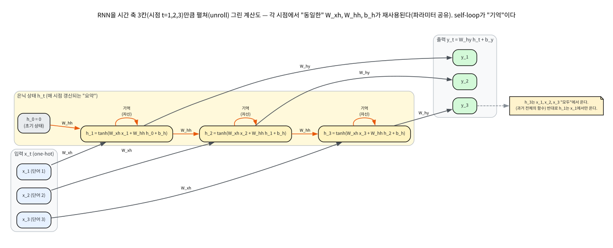
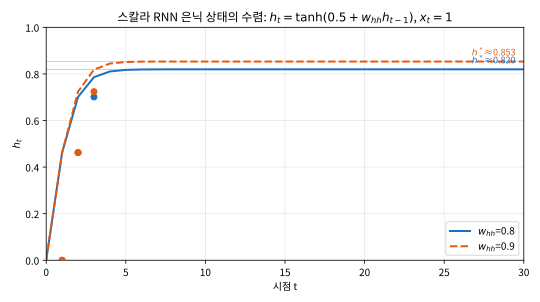

# 11.1 RNN: 은닉 상태와 순전파

[](https://colab.research.google.com/github/SuminHan/book-ml/blob/main/notebooks/ml1/chapter11_1_rnn_forward.ipynb)

### 왜 순서가 중요한가

"강아지가 고양이를 쫓는다"와 "고양이가 강아지를 쫓는다"는 똑같은 단어 세
개로 이루어져 있지만 완전히 다른 문장이다. 지금까지 배운 MLP나 CNN에 이
문장을 넣으려면 단어들을 그냥 벡터 하나로 뭉쳐야 했는데, 그러면 순서
정보가 사라진다 — "누가 누구를 쫓는지"를 구분할 방법이 없어진다.

순서가 중요한 데이터는 언어뿐 아니다. 주가 시계열에서는 같은 100개의
숫자라도 어떤 순서로 오는지에 따라 "상승 후 조정"이든 "조정 후 상승"이든
다른 신호이고, DNA나 단백질 서열에서는 같은 염기 네 개(A, C, G, T)의
**배열** 자체가 의미를 결정한다. Chapter 10의 CNN은 이미지의 공간적
인접성을(픽셀은 이웃 픽셀과 유사하다), 그리고 위치 불변성(고양이가 왼쪽에
있든 오른쪽에 있든 고양이)을 활용했지만, 시퀀스의 "왼쪽~오른쪽"은
"과거~미래"라는 **시간의 방향성**을 가진다. 앞의 단어는 뒤의 단어를
영향주지만 뒤의 단어는 앞의 단어를 알 수 없다 — 이 비대칭을 모델이
반영할 수 있어야 한다.

### 역사: Elman 네트워크와 "시간 속의 구조"

RNN의 원형은 1990년 인지과학자 제프리 엘먼(Jeffrey Elman)의 논문
"Finding Structure in Time"[^elman1990]에서 나왔다. Elman은 언어를 배우는 아이가
단어 목록을 외우는 게 아니라 **시간에 걸친 패턴**을 추출한다고 보고,
그 메커니즘을 신경망으로 모델링하려 했다. 그의 구조는 지금의 RNN과
거의 똑같다: 은닉층을 "센트럴 유닛"(지금의 입력을 처리)과 "라테럴
유닛"(그저 이전 상태의 복사본을 저장)으로 나누고, 라테럴 유닛의 출력을
다음 시점의 입력으로 다시 돌린다. 그 자체로 단순한 반복(connection)을
"시간을 기억하는 장치"로 재해석한 것이 핵심이다.

Elman 네트워크로 유명한 실험이 하나 있다. "pits"와 같은 어미가 붙은
단어("the cat sat on the **pits**")를 모델에게 제시하면, 문맥에 따라
같은 어미가 "pit(구덩이)"의 복수인가, "pitch(공)"의 복수인가를 은닉
상태가 구분해 내는 듯이 행동한다는 관찰이다(사실 이 실험은 나중에
비판받기도 했지만, "같은 토큰도 맥락에 따라 다른 내적 표현을 가져야
한다"는 직관의 원형이 되었다). 1997년 호흐하이터(Hochreiter)와 슘드허버(Schmidhuber)가 제안한
**LSTM**[^hochreiter1997lstm] — "이 요약을 영원히 안 버리겠다"는 장치를 추가한 RNN — 가
2010년대 음성인식·번역에서 비약적인 성능을 보여주면서 RNN은 비로소
주류가 되었다(11.3절에서 다시 만난다).

### 은닉 상태: 지금까지 읽은 것의 요약

RNN의 핵심 아이디어는 **은닉 상태**(hidden state)다: 문장을 한 단어씩
읽어가면서, "지금까지 읽은 내용의 요약"을 하나의 벡터에 계속 갱신해나간다.
두 번째 단어를 처리할 때는 두 번째 단어 자체뿐 아니라 "첫 번째 단어를
읽고 남은 요약"도 함께 입력받는다 — 이렇게 하면 지금 시점의 출력이 과거
전체의 맥락에 영향을 받을 수 있다.

이 "요약"을 조금 더 구체적으로 상상해보자. \\(h\_t\\)는 길이가 \\(T\\)인
문장 전체(단어 \\(T\\)개의 임베딩[^word2vec]을 이으면 \\(Td\\)차원)를 \\(h\\)차원의
벡터로 **압축**하는 것이다. \\(h\\)가 작을수록 압축률이 높아지고 정보
손실이 커진다 — Chapter 3의 주성분분석(PCA)이 "데이터를 저차원 공간에
내리는 것"이었다면, RNN은 "시간 축을 따라 데이터를 저차원 공간에
내리며, 내리는 과정 자체가 학습된다"는 것이다. 게다가 이 압축은 **순간적**
이 아니라 **순차적**이다: \\(h\_t\\)는 \\(x\_1, \\ldots, x\_t\\)을
**다시 읽을 수 없도록** 압축해야 한다(언어 모델처럼 다음 단어를 예측하는
과제에서는 미래 정보가 없는 것이 오히려 정확하다). "한 번 읽고 잊되,
잊지 말아야 할 것은 벡터에 남기는" 이 장치가 RNN의 전부다.

### RNN의 순전파

시점 \\(t\\)마다 입력 \\(x\_t\\)와 이전 은닉 상태 \\(h\_{t-1}\\)을 받아, 새
은닉 상태 \\(h\_t\\)와 (필요하면) 출력 \\(y\_t\\)를 낸다:

\\[h\_t = \tanh(W\_{xh} x\_t + W\_{hh} h\_{t-1} + b\_h), \qquad y\_t = W\_{hy} h\_t + b\_y\\]

**핵심은 \\(W\_{xh}, W\_{hh}, W\_{hy}\\)가 모든 시점에서 동일한 가중치를
재사용한다는 것**이다(파라미터 공유 — Chapter 10의 CNN 필터 재사용과 같은
아이디어를 시간 축에 적용한 것). CNN은 공간 축(이미지의 각 위치)에서
같은 필터를 재사용했고, RNN은 시간 축(시퀀스의 각 시점)에서 같은 가중치를
재사용한다. 둘 다 "입력이 얼마나 길든/크든 **파라미터 수는 일정**하다"는
결과를 얻는다 — 10단어 문장인지 100단어 문장인지에 관계없이 같은
\\(W\_{xh}, W\_{hh}, W\_{hy}\\) 세 개의 행렬만 쓴다.

시퀀스 전체를 한눈에 보여주는 가장 좋은 방법은 **시간을 펼쳐서(unroll)**
그리는 것이다. 같은 네트워크가 시점마다 반복되어 있는 것이지, 각 시점에
별개의 층이 있는 것이 아니다:



이 전개도를 보면 한 가지가 명확해진다: **출력 \\(y\_t\\)는 \\(x\_1, x\_2,
\ldots, x\_t\\) 전부에서 온다.** \\(y\_3\\)는 \\(x\_3\\)만 보고 나오는
것이 아니라, \\(h\_3\\)를 통해 \\(x\_1, x\_2\\)의 영향도 함께 받는 것이다.
반대로 \\(y\_1\\)은 \\(x\_1\\)에서만 온다 — "과거만 보고 미래는 못
본다"는 시간의 비가역성이 이 도식 안에 정확히 들어 있다.

#### 파라미터 수: 시퀀스 길이와 무관

11.2절 실습에 등장하는 문자 단위 언어모델(어휘 \\(V=26\\) — a~z, 은닉
크기 \\(H=8\\))의 파라미터를 세어보자:

| 매개변수 | 크기 | 개수 |
|---|---|---|
| \\(W\_{xh}\\) (입력 → 은닉) | \\(H \times V\\) | 8 × 26 = 208 |
| \\(W\_{hh}\\) (은닉 → 은닉) | \\(H \times H\\) | 8 × 8 = 64 |
| \\(W\_{hy}\\) (은닉 → 출력) | \\(V \times H\\) | 26 × 8 = 208 |
| \\(b\_h\\) | \\(H\\) | 8 |
| \\(b\_y\\) | \\(V\\) | 26 |
| **합계** | | **514** |

입력이 "10글자 문자열"이든 "1000글자 문자열"이든 **514개**다 —
파라미터가 시퀀스 길이에 비례하지 않는다는 것이 RNN(과 CNN)의
파라미터 공유가 주는 직접적 혜택이다. 비교로, 같은 문자열을 MLP에
넣으려면 "직전 5글자" 윈도우를 펼쳐서 \\(5 \times 26 = 130\\)차원 입력을
만들어야 하는데(더 긴 맥락이 필요하면 윈도우를 키워야 하고, 그러면
입력 차원이 선형적으로 늘어난다), 첫 은닉층만 8개 뉴런이어도
\\(130 \times 8 + 8 = 1048\\)개의 가중치가 필요해 **파라미터 수만
이미 RNN 전체(514)의 두 배**다. (MLP는 어휘가 2만 개인 실제
언어에서는 이 차이가 더 벌어진다 — RNN은 어휘 크기에 선형, MLP
윈도우 접근은 어휘 × 윈도우 길이에 비례.)

```python
def rnn_step(x_t, h_prev, Wxh, Whh, b_h):
    z = [sum(Wxh[i][j]*x_t[j] for j in range(len(x_t))) +
         sum(Whh[i][j]*h_prev[j] for j in range(len(h_prev))) + b_h[i]
         for i in range(len(h_prev))]
    return [tanh(v) for v in z]

def rnn_forward(inputs, h0, Wxh, Whh, b_h):
    h = h0
    hidden_states = []
    for x_t in inputs:
        h = rnn_step(x_t, h, Wxh, Whh, b_h)
        hidden_states.append(h)
    return hidden_states
```

`rnn_forward`를 한 줄로 요약하면: **"같은 \\(rnn\_step\\)을 \\(T\\)번
순서대로 반복하는 것**"이다. 이 순차성(\\(t=1\\)이 끝나야 \\(t=2\\)를
시작)이 RNN의 장점(파라미터 효율)이자 동시에 단점(병렬화 불가 —
11.3절)이다.

#### 은닉 상태에 "무엇을" 담느냐: 누적합 예제

은닉 상태가 "과거의 요약"이라는 말은 추상적으로 들린다. 아주 단순한
**누적합(running sum**)을 RNN 구조가 어떻게 수행해낼 수 있는지를
스칼라 예제로 직접 추적해보자 — 11.2절에서 같은 구조를 학습시키는
모델이 등장한다.

스칼라 RNN, \\(w\_{xh}=0.1\\), \\(w\_{hh}=0.9\\), \\(b\_h=0\\), 입력이
\\([2, 3, 1, 4]\\)로 주어졌다고 하자. pre-activation \\(z\_t\\)(\\(\tanh\\)
전)를 따라가면:

\\[
\begin{aligned}
z\_1 &= 0.1\cdot 2 + 0.9\cdot 0 = 0.200 \\
z\_2 &= 0.1\cdot 3 + 0.9\cdot 0.200 = 0.480 \\
z\_3 &= 0.1\cdot 1 + 0.9\cdot 0.480 = 0.532 \\
z\_4 &= 0.1\cdot 4 + 0.9\cdot 0.532 = 0.879
\end{aligned}
\\]

이제 \\(z\_t\\)를 재귀적으로 풀어보자 — \\(z\_t = 0.1 x\_t + 0.9 z\_{t-1}\\)에
\\(z\_{t-1}\\)을 대입하면:

\\[z\_t = 0.1 x\_t + 0.1\cdot 0.9\\, x\_{t-1} + 0.1\cdot 0.9^2\\, x\_{t-2} + \cdots\\]

**주의: \\(\tanh\\)가 없어야 성립하는 전개다.** 실제로는 \\(h\_t =
\tanh(z\_t)\\)이라 이 재귀는 비선형이고 아래 식은 문자 그대로의
등식이 아니라 \\(z\\)가 작은(\\(\tanh z \approx z\\) 근사가 좋은)
구간에서의 **근사**다 — 이 예제의 \\(z\_t\\)가 0.2~0.9로 커지는
점에서는 근사가 점점 거칠어진다. 그래도 *감쇠의 구조*는 정확히
보여준다: **\\(z\_t\\)는 (비선형 효과 무시 시) 과거 입력들의
기하급수적으로 감쇠된 가중합**이며, \\(0.9^k\\)가 \\(k\\)칸 전
입력의 "기억 세기"다. \\(k=10\\)이면
\\(0.9^{10} \approx 0.35\\), \\(k=20\\)이면 \\(\approx 0.12\\) — 10단어
전 정보의 35%, 20단어 전 정보의 12%가 아직 \\(z\_t\\)에 남아 있다.
\\(w\_{hh}\\)를 0.5로 바꾸면 \\(0.5^{10} \approx 0.001\\) — 거의 잊는다.
**"기억의 길이"는 \\(w\_{hh}\\) 하나의 값으로 조절된다**는 감각을 여기서
갖는 것이, 11.3절에서 "그래디언트도 같은 \\(w\_{hh}\\)의 곱으로
소실된다"는 이야기가 이해되는 열쇠가 된다.

실제로 \\(\tanh\\)를 거친 은닉 상태 \\(h\_t = \tanh(z\_t)\\)는
\\([0.197, 0.444, 0.462, 0.673]\\)이고, 이 \\(h\_t\\)를 "지금까지
누적합"의 추정치로 쓰면 — 출력층을 \\(\hat{s}\_t = 10 \cdot h\_t\\)로
두면 — 누적합 \\([2, 5, 6, 10]\\)의 추정은 \\([1.97, 4.44, 4.62,
6.73]\\)이다. 초기에는 거의 정확하고, 입력이 클수록 \\(\tanh\\)의
포화로 점점 아래로 벗어나는 모양은 (1) \\(\tanh\\)의 "요약 벡터는
\\([-1, 1]\\) 안에 갇힌다"는 한계, (2) 큰 숫자의 누적합을 저차원 벡터
하나에 담으려 할 때 생기는 왜곡을 잘 보여준다. (실전 RNN은 이 문제를
여러 차원의 은닉 상태 — 11.2절의 \\(H=8\\) — 과 11.3절의 게이트
구조로 다룬다. 실제로 11.2절의 `"abcabc..."` 모델은 이 누적합을
*스스로 학습*한 것이 아니라 **단 3글자 주기라는 더 쉬운 요령**을
배운다 — 같은 구조라도 데이터가 무엇이냐에 따라 "기억"의 내용이
바뀐다는 점에 주목하라.)

### 손으로 한 번: 스칼라 RNN의 순전파 세 스텝 직접 계산하기

은닉 상태가 스칼라(숫자 하나)인 가장 단순한 RNN으로 순전파를 손으로
따라가보자. \\(w\_{xh}=0.5\\), \\(w\_{hh}=0.8\\), \\(b\_h=0\\), 입력이 매
시점 \\(x\_t=1.0\\)으로 고정, \\(h\_0=0\\)에서 시작한다고 하자.

\\[h\_1 = \tanh(0.5\times1.0 + 0.8\times0 + 0) = \tanh(0.5) \approx 0.462\\]

\\[h\_2 = \tanh(0.5\times1.0 + 0.8\times0.462) = \tanh(0.870) \approx 0.701\\]

\\[h\_3 = \tanh(0.5\times1.0 + 0.8\times0.701) = \tanh(1.061) \approx 0.786\\]

같은 입력(\\(x\_t=1.0\\))이 반복되는데도 \\(h\_t\\)가 매 시점 다른 값으로
갱신되는 것을 볼 수 있다(0.462 → 0.701 → 0.786) — "이전 은닉 상태"가
매번 입력에 새로 더해지기 때문이다. \\(h\_t\\)가 점점 커지다가 어떤
값 근처로 수렴해가는 것도 눈에 띄는데, 이는 \\(\tanh\\)가 큰 입력에서
포화(saturate)되어 1에 가까워지기 때문이다 — 이 "포화" 현상이 11.3절의
그래디언트 소실과 정확히 같은 뿌리(미분이 0에 가까워짐)를 공유한다.

#### 수렴이 실제로 일어나는가: 고정점과 그 "속도"

위 계산을 10단계까지 이어가면:

| \\(t\\) | 1 | 2 | 3 | 4 | 5 | 6 | 8 | 10 |
|---|---|---|---|---|---|---|---|---|
| \\(z\_t = 0.5 + 0.8 h\_{t-1}\\) | 0.500 | 0.870 | 1.061 | 1.129 | 1.149 | 1.154 | 1.156 | 1.156 |
| \\(h\_t = \tanh(z\_t)\\) | 0.462 | 0.701 | 0.786 | 0.811 | 0.817 | 0.819 | 0.820 | 0.820 |

\\(h\_t\\)는 **고정점**(fixed point) \\(h^\* = \tanh(0.5 + 0.8 h^\*)\\)으로
수렴한다 — 이 방정식의 해는 \\(h^\* \approx 0.8196\\)이고, \\(t=10\\)에서
0.8196과 차이가 \\(<10^{-3}\\)으로 줄어드는 것을 확인했다(실습
노트북 §3에서 반복 대입으로 직접 계산한다). "같은 입력이 계속 오면
은닉 상태가 결국 한 곳에 정지한다"는 이 사실은 RNN의 **동적(dynamics)**
을 이해하는 출발점이다.

수렴 **속도**는 고정점 근처에서의 "증폭 인자"로 결정된다. \\(h\_t =
\tanh(0.5 + 0.8 h\_{t-1})\\)를 \\(h^\*\\) 근처에서 미분하면:

\\[\frac{dh\_t}{dh\_{t-1}} = 0.8 \cdot \tanh'(0.5 + 0.8 h\_{t-1})\\]

\\(h^\* \approx 0.82\\)에서 \\(\tanh'(z^\*) = 1 - (h^\*)^2 \approx
0.325\\)이므로 증폭 인자는 \\(0.8 \times 0.325 \approx 0.26\\) — 각
단계마다 차이가 약 4분의 1로 줄어든다. 이것이 표에서 \\(h\_5\\) 이후
숫자가 거의 움직이지 않는 이유다.

**이 "증폭 인자"가 11.3절의 그래디언트 소실과 정확히 같은 수식이다.**
순전파에서 \\(h\_{t-1}\\)의 작은 변화가 \\(h\_t\\)에 얼마나 전달되는지
재는 \\(\tanh'(z\_t) \cdot w\_{hh}\\)의 곱이, 역전파에서 손실의
그래디언트가 시점을 거슬러 올라갈 때 곱해지는 인자
\\(\tanh'(z\_t) \cdot W\_{hh}\\)(11.2절)와 **구조적으로 동일한 것**이다.
순전파의 "기억이 빠르게 잊히는 속도"와 역전파의 "그래디언트가 빠르게
사라지는 속도"는 같은 연쇄법칙 곱의 두 얼굴 — 11.3절이 다룰 그래디언트
소실을 11.1절의 순전파에서 미리 체감하고 있는 셈이다.

\\(w\_{hh}\\)를 0.9로 키우면? 고정점은 \\(h^\* \approx 0.853\\)로
조금 높아지고, 증폭 인자는 \\(0.9 \times (1 - 0.853^2) \approx
0.245\\)로 0.8 경우(0.263)보다 오히려 약간 *작아져* — 둘 다
6단계 만에 고정점의 \\(10^{-3}\\) 이내로 정착한다. 여기서 중요한
것은 **"발산"은 여전히 하지 않는다**는 것: 증폭 인자가 1보다
작기 때문이다. 스칼라 RNN에서는
\\(\tanh\\)의 범위가 \\([-1,1]\\)에 갇혀 있어 발산 자체가 불가능하지만,
**은닉 크기가 큰(\\(H > 1\\)) RNN에서는 \\(W\_{hh}\\)의 고유값이 1보다
크면 \\(h\_t\\)가 실제로 발산하거나 진동할 수 있다** — 11.2절의
"자주 하는 실수"에서 다룰 그래디언트 폭발과 같은 뿌리다.[^pascanu2013]



### 자주 하는 실수: 두 가지

**실수 1 — "\\(h\_t\\)는 \\(x\_t\\)만 의존한다."** RNN을 처음 접할 때
가장 흔한 오해는 순전파 수식에서 \\(W\_{hh} h\_{t-1}\\) 항을 "보조적인
정규화 항"쯤으로 여기는 것이다. \\(h\_t\\)는 **과거 전체
(\\(x\_1, \\ldots, x\_t\\))의 함수**이며, \\(x\_t\\) 하나만 의존하지
않는다 — "은닉 상태가 과거를 기억한다"는 이 절의 모든 주장이 이 한 항에
달려 있다. \\(W\_{hh} = 0\\)으로 두면 \\(h\_t = \tanh(W\_{xh} x\_t + b\_h)\\)로
"시점을 독립적으로 처리하는 MLP"로 퇴화하고, 10단어 문장의 10번째
단어를 예측할 때 앞의 9단어를 완전히 잊는 모델이 된다.

**실수 2 — "시점마다 가중치가 달라진다(학습도 시점마다 따로)."**
전개도에서 각 시점에 하나의 "박스"가 그려져 있어서, "시점 1에는
\\(W^{(1)}\_{xh}\\), 시점 2에는 \\(W^{(2)}\_{xh}\\)…" 같은 **별개의**
가중치가 있는 것으로 오해하기 쉽다. 아니다 — **세 개의 행렬
\\(W\_{xh}, W\_{hh}, W\_{hy}\\)가 시점 전체에서 공유**된다(파라미터
공유). 이 공유 덕분에 (a) 시퀀스 길이에 관계없이 파라미터 수가 일정하고,
(b) "5번째 단어를 처리하는 능력"을 학습한 것이 "150번째 단어를
처리하는 능력"에도 자동으로 전이된다. 이 공유가 없다면 RNN은
"시퀀스 길이 = 층 수"로 고정된, 학습할 파라미터가 시퀀스 길이에
비례하는 단순 MLP 스택과 다를 바가 없다.

### 실습

앞의 수치(3단계 손계산, 10단계 수렴 표, 고정점, 누적합 예제,
파라미터 수)를 코드 하나로 묶어둔다(완전 버전 — 수렴 곡선과
unroll 다이어그램 포함 — 은 실습 노트북에서 실행한다):

```python
import math

def rnn_step(x, h, wxh, whh, b=0.0):
    return math.tanh(wxh * x + whh * h + b)

# 3단계 손계산 (w_xh=0.5, w_hh=0.8, x=1, h0=0)
h = 0.0
for _ in range(3):
    h = rnn_step(1.0, h, 0.5, 0.8)
    print(f"h = {h:.4f}")
# h = 0.4621 / 0.7012 / 0.7860

# 고정점 반복 대입: h = tanh(0.5 + 0.8h)
h = 0.0
for _ in range(100):
    h = rnn_step(1.0, h, 0.5, 0.8)
print(f"고정점 h* ≈ {h:.4f}")   # 0.8196

# 누적합 예제 (w_xh=0.1, w_hh=0.9), 입력 [2,3,1,4]
h = 0.0
for x in [2.0, 3.0, 1.0, 4.0]:
    h = rnn_step(x, h, 0.1, 0.9)
    print(f"h = {h:.4f}")       # 0.1974 / 0.4444 / 0.4621 / 0.6728
```

### 핵심 공식 한눈에

| 항목 | 공식 | 무엇을 말하나 |
|---|---|---|
| 순전파 (재귀) | \\(h\_t = \tanh(W\_{xh} x\_t + W\_{hh} h\_{t-1} + b\_h)\\) | 시점마다 은닉 상태를 갱신 |
| 출력 | \\(y\_t = W\_{hy} h\_t + b\_y\\) | 시점별 예측 (선형, 활성함수 없음) |
| 파라미터 | \\((H V + 1) + H^2 + (V H + 1)\\) | **시퀀스 길이 \\(T\\)와 무관** |
| 기억의 감쇠 | \\(z\_t \approx \sum\_{k} w\_{hh}^{k-1} \cdot w\_{xh} x\_{t-k+1}\\) | \\(w\_{hh}\\)가 "기억의 길이"를 결정 |

### 자주 묻는 질문

**Q. 은닉 상태의 크기는 어떻게 정하나요?** 은닉 상태 벡터의 차원(\\(h\_t\\)의
길이)은 "지금까지의 맥락을 얼마나 풍부하게 요약할 수 있는가"를 결정하는
하이퍼파라미터다 — Chapter 9의 은닉층 뉴런 수와 같은 종류의 선택이다.
너무 작으면 긴 문맥을 다 담지 못하고, 너무 크면 파라미터가 늘어나
과적합·계산비용 문제가 커진다.

**Q. 입력과 출력의 길이가 다른 경우(번역처럼)는 어떻게 하나요?** 위
`rnn_forward`는 입력 시퀀스 전체를 다 읽고 매 시점 출력을 내는 구조지만,
"입력을 끝까지 다 읽은 뒤 마지막 은닉 상태 하나로부터 새로운 시퀀스를
순차적으로 생성"하는 **인코더-디코더**(encoder-decoder)[^sutskever2014seq2seq] 구조를 쓰면 입력과
출력 길이가 달라도 된다 — Chapter 12에서 배울 Attention이 정확히 이
구조의 한계(긴 입력을 하나의 벡터로 압축하면 정보가 손실된다)를 보완하는
데서 출발한다[^bahdanau2014attention].

**Q. 왜 입력 벡터를 그냥 길게(문장 전체를 펼쳐서) MLP에 넣지 않는가?**
세 가지 이유다. (1) **파라미터**: 문장 길이 \\(T\\) × 임베딩 차원 \\(d\\)
개 입력을 100개 뉴런의 은닉층에 연결하면 \\(100 T d\\)개 가중치 — \\(T\\)에
비례해 팽창한다. RNN은 \\(T\\)와 무관하게 \\(HV + H^2 + VH\\)개만 쓴다.
(2) **길이 가변성**: 실제 문장은 길이가 일정하지 않다 — "5단어짜리
입력"과 "200단어짜리 입력"을 하나의 MLP로 처리하려면 패딩이나
분리된 모델이 필요하다. RNN은 같은 가중치로 어떤 길이든 처리한다.
(3) **위치 인코딩 불필요**: MLP에 "100번째 단어"를 입력하려면
"이건 100번째 위치의 단어"라는 정보(위치 인코딩, Chapter 12)를
별도로 주어야 하는데, RNN은 순차적 처리 자체가 위치 정보를
자동으로 반영한다. (그럼에도 불구하고, "어차피 RNN은 순차적이라
느리다"는 이유로 Transformer[^transformer]가 주류가 된 이유도 11.3절에서
본다.)

**Q. 은닉 상태는 왜 \\(\tanh\\)를 쓰나요? 시그모이드(\\(0 \sim 1\\))도 되는데.**
두 가지 이유다. (1) **중심화**: \\(\tanh\\)의 출력 범위는
\\([-1, 1]\\)이라 0을 중심으로 대칭인데, 시그모이드(\\([0,1]\\))는
항상 양수 — 같은 뉴런의 여러 성분이 "동일 방향"으로 움직이는 경향이
생겨 학습이 느려진다(9.2절의 시그모이드 "비대칭 골짜기" 문제). (2)
**미분의 크기**: \\(\tanh'\\)의 최댓값은 1로, 시그모이드 미분의
최댓값 0.25의 4배 — 같은 깊이에서 그래디언트가 4배 강하게 전달된다.
반대로 **출력층** \\(y\_t = W\_{hy} h\_t + b\_y\\)는 활성함수 없이 선형을
쓴다 — 시점별 예측이 "다음 문자의 확률 분포"(소프트맥스)나
"실수값"(회귀)으로 해석되어야 하므로, \\([-1,1]\\)로 자르는
\\(\tanh\\)가 오히려 방해가 되기 때문이다. 은닉층과 출력층은
"역할"이 다르다.

**Q. \\(h\_0\\)는 항상 0이어야 하나요?** 꼭 아니다 — \\(h\_0\\)는
"시퀀스를 읽기 **전**에 알고 있는 것"을 담을 수 있는 초기 조건이다.
실전에서는 (a) 0으로 고정(가장 흔함), (b) 학습 가능한 파라미터
벡터로, (c) 이전 시퀀스의 최종 은닉 상태를 이어받아 **이어지는
시퀀스**를 처리하는 데 쓰기도 한다 — 음성인식에서 "전 문장의
마지막 상태를 다음 문장의 초기 상태로" 쓰는 방식이 이 (c)다[^cs224n].

---

## 연습문제

**1. (코딩)** 다음 `rnn_forward_scalar`(은닉 상태가 스칼라인 가장
단순한 RNN, \\(h\_t = \tanh(w\_{xh} x\_t + w\_{hh} h\_{t-1} + b\_h)\\))와
`fixed_point`를 완성하라(핵심 줄은 빈칸으로 남겨져 있다고 가정):

```python
import math

def rnn_forward_scalar(inputs, h0, w_xh, w_hh, b_h=0.0):
    hs = []
    h = h0
    for x in inputs:
        # h = ...   <-- tanh(w_xh * x + w_hh * h + b_h)를 계산해 h 갱신
        # hs.append(h)
    return hs

def fixed_point(w_xh, w_hh, b_h=0.0, x=1.0, iters=200):
    h = 0.0
    for _ in range(iters):
        # h = ...   <-- 같은 갱신식을 iters번 반복
    return h

print(rnn_forward_scalar([1.0, 1.0, 1.0], 0.0, 0.5, 0.8))
# 기대 출력: [0.4621..., 0.7012..., 0.7860...]  (본문 "손으로 한 번"과 일치)
print(fixed_point(0.5, 0.8))   # 0.8196 근처
```

**2. (개념 서술)** RNN의 파라미터(\\(W\_{xh}, W\_{hh}, W\_{hy}\\))는
시퀀스 길이 \\(T\\)에 관계없이 일정하다고 배웠다. (a) "10단어
문장을 처리하는 RNN"과 "100단어 문장을 처리하는 RNN"의 가중치
행렬 크기가 같다는 것이 구체적으로 무엇을 뜻하는지(어떤
계산이 재사용되는지) 한 문장으로 설명하고, (b) 이 재사용의 **비용**
은 무엇인지(어떤 일반성(generality)을 포기하게 되는지) 한
문장으로 설명하라. (힌트: "10번째 단어에서 배운 능력"이
"100번째 단어에서도 자동으로 쓰인다"는 장점의 반대편에 무엇이
있는가 — 같은 시점마다 **동일한** 연산을 해야 한다는 제약.)

**3. (손계산)** \\(w\_{xh}=1.0\\), \\(w\_{hh}=0.5\\), \\(b\_h=0\\),
\\(h\_0=0\\), 입력이 \\([2, 1, 0]\\)인 스칼라 RNN에서 \\(h\_1, h\_2,
h\_3\\)를 계산하라. (힌트: \\(\tanh(2) \approx 0.964\\),
\\(\tanh(1.482) \approx 0.901\\)을 사용해도 되고, 계산기로 바로
구해봐도 된다.) 그리고 "본문 예제(\\(w\_{xh}=0.5, w\_{hh}=0.8\\))보다
수렴이 빠른지, 느린지"를 고정점 근처의 증폭 인자
\\(w\_{hh}(1 - (h^\*)^2)\\)로 설명하라. (힌트: \\(w\_{hh}\\)가 작을수록
증폭 인자가 작아져 수렴이 빠르지만, **기억도 빨리 잊는다**
— "수렴 속도"와 "기억 길이"는 같은 파라미터의 두 얼굴이다.)

**4. (정확성 확인)** 문제 1의 `rnn_forward_scalar`와 `fixed_point`를
실행해서 (a) 3단계 손계산 값(0.4621, 0.7012, 0.7860)이 코드 출력과
일치하는지, (b) 고정점 0.8196에 반복 대입이 도달하는지 확인하고,
"\\(\tanh\\)의 포화"가 수렴을 **부추기는** 동시에 11.3절의
그래디언트 소실을 **조성하는** 동일한 원인임을 한 문단으로
설명하라.

[^sutskever2014seq2seq]: Sutskever, I., Vinyals, O., Le, Q. V. (2014). "Sequence to Sequence Learning with Neural Networks." NeurIPS 2014. arXiv:1409.3215.
[^bahdanau2014attention]: Bahdanau, D., Cho, K., Bengio, Y. (2014). "Neural Machine Translation by Jointly Learning to Align and Translate." arXiv:1409.0473.
[^cs224n]: 더 깊이 보려면: Stanford CS224N: Natural Language Processing with Deep Learning. https://web.stanford.edu/class/cs224n/
[^transformer]: Vaswani, A. et al. (2017). "Attention Is All You Need." arXiv:1706.03762.
[^elman1990]: Elman, J. L. (1990). "Finding Structure in Time." *Cognitive Science* 14(2), 179–211. — RNN의 원 논문. 은닉 상태의 출력을 다음 시점 입력으로 되돌리는 라테럴 유닛(순환 연결)을 도입한 Elman 네트워크를 제안했다.
[^hochreiter1997lstm]: Hochreiter, S., Schmidhuber, J. (1997). "Long Short-Term Memory." *Neural Computation* 9(8), 1735–1780. — LSTM의 원 논문. RNN의 그래디언트 소실을 완화하기 위해 셀 상태(cell state)를 다루는 게이트 구조를 제안했다.
[^word2vec]: Mikolov, T., Chen, K., Corrado, G., Dean, J. (2013). "Efficient Estimation of Word Representations in Vector Space." arXiv:1301.3781. — 단어 임베딩(word embedding)의 대표 논문으로, 문맥에서 단어의 분포적 의미를 학습하는 CBOW/Skip-gram을 제안했다.
[^pascanu2013]: Pascanu, R., Mikolov, T., Bengio, Y. (2013). "On the difficulty of training recurrent neural networks." ICML 2013, 1310–1318. arXiv:1211.5063. — RNN 학습의 그래디언트 소실/폭발 문제를 분석한 논문으로, \\(W\\_{hh}\\)의 스펙트럼 규범(가장 큰 고유값 크기)이 1보다 작으면 그래디언트가 기하급수적으로 소실되고, 1보다 크면 폭주한다는 것을 정리했다. 이 절의 고정점 "증폭 인자" 분석과 정확히 같은 주제다.
