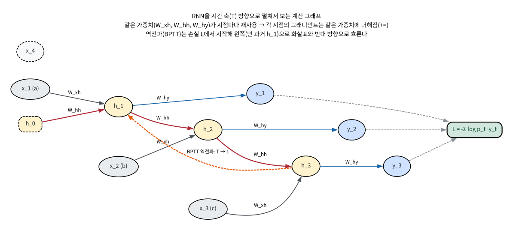
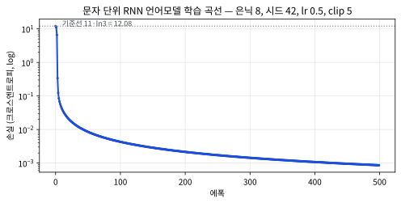

# 11.2 BPTT와 numpy RNN 언어모델 실습

[](https://colab.research.google.com/github/SuminHan/book-ml/blob/main/notebooks/ml1/chapter11_2_bptt_char_rnn.ipynb)

11.1절에서 우리는 RNN이 `W_{hh}`라는 자기-루프를 통해 "지금까지 읽은 것의
요약" \\(h\_t\\)를 매 시점 갱신한다는 **순전파** 구조를 봤다. 그런데
"요약을 계속 갱신한다"는 구조를 *배우게* 만들려면, 순전파만으로는 부족하다 —
손실을 줄이기 위해 각 가중치에 대한 그래디언트를 구해야 하는데,
\\(h\_t\\)가 \\(h\_{t-1}\\)에, \\(h\_{t-1}\\)이 \\(h\_{t-2}\\)에 의존하는
**사슬**을 이루고 있기 때문에, Chapter 9의 "출력층에서 입력층으로" 거슬러
올라가던 역전파를 **시간 축을 따라** 펼쳐서 적용해야 한다. 이 절은 그
기법(BPTT)을 한 단계씩 유도하고, 숫자로 손으로 따라가본 뒤, numpy로
문자 단위 언어모델을 실제로 학습시켜 BPTT가 "다음 토큰 예측"을 어떻게
구현하는지 끝까지 확인한다.

### BPTT: 시간을 펼쳐서 역전파하기

이 "요약을 계속 갱신한다"는 구조를 학습시키려면, 역전파를 시간 축을 따라
펼쳐서 적용해야 한다. 시퀀스 길이 \\(T\\)만큼 신경망을 "펼쳐서(unroll)"
각 시점을 독립된 층처럼 취급한 뒤 Chapter 9의 역전파를 그대로 적용하는 이
방법을 **BPTT**(Backpropagation Through Time)라 부른다. \\(h\_t\\)가
\\(h\_{t-1}\\)에, \\(h\_{t-1}\\)이 \\(h\_{t-2}\\)에 의존하는 사슬을 거슬러
올라가야 하므로, \\(h\_1\\)에 대한 그래디언트는 다음과 같은 형태의 곱을
포함하게 된다:

\\[\frac{\partial h\_T}{\partial h\_1} = \prod\_{t=2}^T \frac{\partial h\_t}{\partial
h\_{t-1}} = \prod\_{t=2}^T \text{diag}(\tanh'(z\_t)) \\, W\_{hh}\\]

여기서 \\(z\_t = W\_{xh}x\_t + W\_{hh}h\_{t-1}+b\_h\\)이고
\\(\tanh'(z\_t) = 1-h\_t^2\\)이다. 이 식이 말해주는 것은, **먼과 가까운
시점 사이를 건너는 그래디언트가 \\(W\_{hh}\\)를 \\(T-1\\)번 곱하는 곱적
(product)이 된다**는 것이다. \\(W\_{hh}\\)의 고유값이 1보다 작으면 이 곱은
지수적으로 0으로, 1보다 크면 지수적으로 ∞로 발산한다 — 11.3절에서
"그래디언트 소실·폭발"이라는 이름으로 다시 만나는 바로 그 문제다. 이번
절에서는 그 *양*보다 먼저, 이 곱적 구조를 *정확히* 따라가며 각 파라미터
의 그래디언트가 어떻게 누적되는지 유도한다.

#### 펼쳐진 계산 그래프: 시점이 곧 "층"

BPTT의 핵심 그림은 RNN을 시간 방향으로 **펼쳐서** 보는 것이다. 아래
그림에서 \\(x\_t\\)는 시점 \\(t\\)의 입력, \\(h\_t\\)는 은닉 상태,
\\(y\_t\\)는 출력이다. 중요한 것은 세 가지다:

1. **수직 화살표(\\(W\_{hh}\\))**: 같은 시점 내, 이전 은닉 상태
   \\(h\_{t-1}\\) → \\(h\_t\\)로 흐르는 자기-루프. 역전파에서는
   **아래에서 위로가 아니라 위에서 아래로** — 즉 \\(h\_t\\)에서
   \\(h\_{t-1}\\)로 — 이 화살표를 거슬러 올라간다.
2. **각 시점의 출력 화살표(\\(W\_{hy}\\))**: \\(h\_t\\) → \\(y\_t\\).
   손실은 모든 시점의 \\(y\_t\\)에서 나므로, 역전파는 이 화살표들에서
   시작한다.
3. **같은 색 박스가 모든 시점에서 반복된다**: 시점 1의 \\(W\_{xh},
   W\_{hh}, W\_{hy}\\)와 시점 2의 것은 *동일한* 가중치다(파라미터
   공유). 이 때문에 각 시점에서 계산된 그래디언트는 **같은 가중치의
   그래디언트에 더해진다** — 이 "누적"이 BPTT에서 가장 실수하기 쉬운
   지점이다.



### BPTT 유도: 시점마다 "본 시점 오차 + 뒤에서 온 그래디언트"

펼쳐진 그래프 위에서 역전파를 실제로 수행해보자. 손실을 모든 시점의
크로스엔트로피 합으로 놓는다:

\\[L = -\sum\_{t=1}^T \sum\_k y\_{t,k}^{(true)} \log p\_{t,k}\\]

(여기서 \\(p\_t = \text{softmax}(W\_{hy}h\_t+b\_y)\\)는 시점 \\(t\\)의
다음-문자 분포, \\(y\_t^{(true)}\\)는 원-핫 정답이다.) 역전파는 **마지막
시점 \\(T\\)에서 첫 시점 1로** 순차적으로 내려간다. 핵심은 각 시점
\\(t\\)에서 은닉 상태에 대한 그래디언트 \\(\frac{\partial L}{\partial
h\_t}\\)가 **두 부분의 합**이라는 것이다:

\\[\underbrace{W\_{hy}^{\top}\left(p\_t - y\_t^{(true)}\right)}\_{\text{(A) 본 시점의 출력 오차}}
\\;+\\; \underbrace{W\_{hh}^{\top}\left[\frac{\partial L}{\partial
h\_{t+1}} \odot (1 - h\_{t+1}^2)\right]}\_{\text{(B) 시점 } t{+1}
\text{에서 흘러온 그래디언트}}\\]

이 "다음 시점에서 온 그래디언트 + 그 시점 자체의 출력 오차"를 합친다는
점에서, 각 시점의 역전파는 Chapter 9.1의 2층 신경망 역전파와 형태가
같다 — 다만 "은닉층에서 입력층으로" 대신 **"시점 \\(t\\)에서 시점
\\(t{-}1\\)로"** 거슬러 올라간다는 점이 다를 뿐이다. 이 재귀 구조를
코드적으로 정리하면 (실습 노트북 §1의 `bptt` 함수가 바로 이 코드다):

```python
# 역전파: t = T-1, T-2, ..., 0 순으로 (0-indexed)
# 순전파 때 hs[t] = h_t, hps[t] = h_{t-1}(이전 은닉 상태)을 함께 저장해 둔다
dh_next = np.zeros(H)                 # ∂L/∂h_{t+1} (첫 루프에선 최신 시점이므로 0)
dWxh = dWhh = dWhy = 0; dbh = dby = 0
for t in reversed(range(T)):
    p = softmax(Why @ hs[t] + by)
    dp = p.copy(); dp[targets[t]] -= 1 # ∂L/∂z_t^{out} = p_t − onehot (p − onehot)
    dWhy += np.outer(dp, hs[t]); dby += dp   # (A) 본 시점 출력
    dh = Why.T @ dp + dh_next             # ∂L/∂h_t = (A)+(B)의 합
    dz = dh * (1 - hs[t]**2)              # ∂L/∂z_t = dh ⊙ tanh'(z_t)
    dh_next = Whh.T @ dz                 # ∂L/∂h_{t-1} → 다음(이전) 시점 B로 전달
    dWhh += np.outer(dz, hps[t]); dbh += dz
    dWxh += np.outer(dz, one_hot(inputs[t]))   # += 주의: 시점마다 누적!
```

코드 첫 줄 `dp = p; dp[targets[t]] -= 1`이 왜 그렇게 간단한지 짚어두자.
크로스엔트로피(\\(-\log p\_k\\), \\(k\\)가 정답 클래스)를 softmax 출력
\\(p\_j = \text{softmax}(z)\_j\\)에 대해 미분하면 **경악할 정도로 깔끔한
결과**가 나온다:

\\[\frac{\partial L}{\partial z\_j} = p\_j - \mathbb{1}[j=k]\\]

즉 "softmax의 출력에서, 정답 클래스 자리에만 1을 빼고 나머지는 그대로" —
이것을 `p - onehot`이라 부른다. Chapter 9.1에서 로지스틱 회귀+
크로스엔트로피의 그래디언트가 "(예측 − 정답)"이었던 것과 정확히 같은
패턴의 다항분류 버전이다. 왜 이렇게 단순해지는가? 연쇄법칙으로
펼치면(\\(y\_k\\)는 원-핫 정답, \\(\sum\_k y\_k=1\\)):

\\[\frac{\partial L}{\partial z\_j} = \sum\_k \frac{\partial L}{\partial
p\_k}\frac{\partial p\_k}{\partial z\_j}
= \sum\_k \left(-\frac{y\_k}{p\_k}\right) p\_k(\delta\_{kj}-p\_j)
= \sum\_k -y\_k(\delta\_{kj}-p\_j)\\]

\\[= -\underbrace{\sum\_k y\_k\delta\_{kj}}\_{=\\,y\_j}
+ p\_j\underbrace{\sum\_k y\_k}\_{=\\,1} = -y\_j + p\_j\\]

즉 \\(\frac{\partial L}{\partial z\_j} = p\_j - y\_j = p\_j -
\mathbb{1}[j=k]\\) — softmax의 \\(p\_k\\)가 크로스엔트로피의
\\(1/p\_k\\)와 **상쇄**되기 때문에 남은 게 예측·정답의 차이뿐이다.

이는 곧 **예측 \\(p\_j\\)가
정답 \\(y\_j\\)에 가까울수록 그래디언트가 작아진다**는 뜻이다 — "이미 잘
맞힌 클래스는 거의 건드리지 않는다"는 직관이 수식으로 확인되는
지점이다.

두 가지를 꼭 새겨두자. **첫째, `dh = Why.T @ dp + dh_next`** — 본 시점의
오차(`Why.T @ dp`)에 *앞서(더 새로운) 시점에서 흘러온* 그래디언트
(`dh_next`)를 더한다. 이것이 위에서 유도한 (A)+(B)다. **둘째,
`dWhh += ...`는 `=`가 아니라 `+=`**이다. \\(W\_{hh}\\)가 모든 시점에서
공유되므로, 각 시점에서 계산된 기여를 **같은 텐서에 계속 더해**야
한다. 이 `+=`를 `=`로 쓰면 가장 마지막 시점 기여만 남고 나머지가
사라져 BPTT가 틀어진다 — 이번 절의 "자주 하는 실수"에서 다시 만난다.

### 손으로 한 번: 시점 2개짜리 RNN에 BPTT 직접 적용

은닉 크기가 2(\\(H=2\\)), 어휘가 3(\\(V=3\\), 문자 a·b·c)인 아주 작은
RNN으로 BPTT를 숫자로 끝까지 따라가보자. 시퀀스 `"ab"`(\\(T=2\\))를
읽고, 매 시점에서 **다음 문자**를 예측한다고 하자(목표: 1번째는 `b`,
2번째는 `c`). 가중치(편의상 전부 0.1 이하의 작은 값, bias는 0)는:

\\[W\_{xh}=\begin{bmatrix}0.3 & -0.2 & 0.0\\\\0.5 & 0.1 & -0.3\end{bmatrix}, \quad
W\_{hh}=\begin{bmatrix}0.4 & 0.2\\\\-0.3 & 0.5\end{bmatrix}, \quad
W\_{hy}=\begin{bmatrix}0.6 & -0.4\\\\0.1 & 0.5\\\\-0.2 & 0.3\end{bmatrix}\\]

**순전파**를 먼저 끝낸다. 시점 1(입력 `a` = one-hot \\([1,0,0]\\)):

\\[h\_1 = \tanh(W\_{xh}e\_a) = \tanh(\begin{bmatrix}0.3\\\\0.5\end{bmatrix})
= \begin{bmatrix}0.2913\\\\0.4621\end{bmatrix}\\]

(여기서 \\(e\_a=[1,0,0]^{\top}\\). \\(\tanh(0.3)\approx0.2913\\),
\\(\tanh(0.5)\approx0.4621\\).) 시점 2(입력 `b` = \\([0,1,0]\\)):

\\[z\_2 = W\_{xh}e\_b + W\_{hh}h\_1 = \begin{bmatrix}-0.2\\\\0.1\end{bmatrix}
+ \begin{bmatrix}0.4&0.2\\\\-0.3&0.5\end{bmatrix}\begin{bmatrix}0.2913\\\\0.4621\end{bmatrix}
= \begin{bmatrix}0.0089\\\\0.2437\end{bmatrix}, \quad
h\_2 = \tanh(z\_2) = \begin{bmatrix}0.0089\\\\0.2390\end{bmatrix}\\]

이제 각 시점의 출력 분포(softmax):

\\[p\_1 = \text{softmax}(W\_{hy}h\_1) = \begin{bmatrix}0.2937\\\\0.3848\\\\0.3215\end{bmatrix},
\qquad
p\_2 = \text{softmax}(W\_{hy}h\_2) = \begin{bmatrix}0.2934\\\\0.3622\\\\0.3444\end{bmatrix}\\]

손실(다음-문자 크로스엔트로피, 시점 1 목표 `b`(인덱스1), 시점 2 목표
`c`(인덱스2)):

\\[L = -\log p\_1[b] - \log p\_2[c] = -\log 0.3848 - \log 0.3444 = 0.9550+1.0660
= \boxed{2.0210}\\]

**역전파**를 시점 2 → 1 순서로. 시점 2부터:

- \\(\delta^{(y)}\_2 = p\_2\\), 단 목표 인덱스 2를 \\(-1\\) 감소
  → \\(\delta^{(y)}\_2 = [0.2934, 0.3622, -0.6556]\\)
- \\(\frac{\partial L}{\partial W\_{hy}} \mathrel{+}= \delta^{(y)}\_2
  h\_2^{\top}\\), \\(\frac{\partial L}{\partial b\_y} \mathrel{+}=
  \delta^{(y)}\_2\\)
- \\(\frac{\partial L}{\partial h\_2} = W\_{hy}^{\top}\delta^{(y)}\_2 +
  \underbrace{0}\_{\text{시점 3 없음}}\\)
- \\(\frac{\partial L}{\partial z\_2} = \frac{\partial L}{\partial h\_2}\odot
  (1-h\_2^2)\\), 그리고 \\(\frac{\partial L}{\partial h\_1} \mathrel{+}=
  W\_{hh}^{\top}\frac{\partial L}{\partial z\_2}\\)

시점 1에서도 같은 과정(단 이번엔 \\(\frac{\partial L}{\partial h\_1}\\)에
시점 2에서 흘러온 기여가 **더해진** 뒤 곱해진다)을 반복하면, 5개
파라미터의 최종 그래디언트는:

\\[\frac{\partial L}{\partial W\_{hy}}=\begin{bmatrix}0.0882&0.2058\\\\-0.1760&-0.1977\\\\0.0878&-0.0081\end{bmatrix},
\quad
\frac{\partial L}{\partial W\_{hh}}=\begin{bmatrix}0.1000&0.1587\\\\-0.0365&-0.0579\end{bmatrix}\\]

\\[\frac{\partial L}{\partial W\_{xh}}=\begin{bmatrix}0.2062&0.3434&0\\\\-0.2537&-0.1254&0\end{bmatrix}, \quad
\frac{\partial L}{\partial b\_h}=\begin{bmatrix}0.5496\\\\-0.3791\end{bmatrix},
\quad
\frac{\partial L}{\partial b\_y}=\begin{bmatrix}0.5871\\\\-0.2530\\\\-0.3341\end{bmatrix}\\]

이 값들을 numpy 코드(위 스넵릿)가 자동미분 없이 그대로 재현하는지,
그리고 **수치 미분**(각 가중치를 \\(\pm10^{-6}\\) 흔들어서
\\(\frac{L(w+\epsilon)-L(w-\epsilon)}{2\epsilon}\\)으로 근사)과 비교하면
전부 \\(10^{-10}\\) 수준으로 일치한다 — 실습 노트북 §2에서 이 검증까지
끝까지 실행한다. 여기서 눈여겨볼 것은 \\(\frac{\partial L}{\partial
W\_{hh}}\\)다: 시점 2에서 온 그래디언트가 \\(h\_1\\)을 통해 시점 1의
\\(W\_{hh}\\) 기여에 **덧붙었다**는 사실을, 이 작은 예제가 한 박스 안에
담고 있다. 11.1절의 "자기-루프가 시간 축의 파라미터 공유다"라는 말이
여기서 *그래디언트도* 공유된다는 뜻임을 숫자가 보여준다.

### 곱적의 양: 소실·폭발이 여기서 시작된다

앞의 유도에서 \\(\frac{\partial L}{\partial h\_t}\\)가 시점을 거슬러
내려올 때마다 매번 \\(W\_{hh}^{\top}\\)과 \\((1-h^2)\\)(즉
\\(\tanh'\\))를 곱받는다는 것을 봤다. 이 곱이 \\(T\\)번 반복되면
\\(\prod\_t \tanh'(z\_t) W\_{hh}\\)가 된다. \\(\tanh'\\)은 \\((0,1]\\)에
있고(최대 1, 대부분 그 이하) \\(W\_{hh}\\)의 크기도 보통 1 근처이므로,
이 곱적은 시퀀스가 길어질수록 **지수적으로 0으로 수렴하거나 발산**한다.
숫자로(\\(\tanh'\approx0.5\\), \\(W\_{hh}\\) 크기 \\(0.9\\), \\(T=20\\))
\\((0.5\times0.9)^{20}\approx4.5\times10^{-7}\\)으로 사실상 0 — 11.3절의
"그래디언트 소실" 예습이다. 반대로 고유값이 1을 넘으면 발산(폭발)한다.
즉 **BPTT의 산술적 구조 자체가, 시퀀스 길이에 따라 그래디언트가
지수적으로 줄어들거나 커지는 원천**이라는 것을 기억해두자 — 이 절의
실습에서 "그래디언트 클리핑"을 왜 넣는지 그 이유가 바로 이것이다.

### 실습: numpy로 문자 단위 RNN 언어모델 학습시키기

"abc"가 계속 반복되는 문자열 `"abcabcabcabc"`(12문자)를 **문자 단위**로
예측하는 아주 작은 RNN 언어모델을 numpy로 직접 학습시켜보자 — 입력은 각
시점의 문자, 목표는 "다음 문자가 무엇인가"다. 어휘는 {a, b, c}(\\(V=3\\)),
은닉 크기는 8, 시퀀스가 12문이므로 **다음-문자 예측 대상이 11개**
(\\(T=11\\))다. 초기화: 시드 42, \\(\mathcal{N}(0, 0.1^2)\\) scale 0.1,
학습률 0.5, 500 에폭, 그래디언트 클리핑 5. (전체 코드는 실습
노트북 §3에 있고, 아래 스넵릿은 핵심만 골라둔 것이다.)

```python
import numpy as np

chars = "abc"; vocab_size = 3
hidden_size = 8
rng = np.random.RandomState(42)
Wxh = rng.randn(hidden_size, vocab_size) * 0.1
Whh = rng.randn(hidden_size, hidden_size) * 0.1
Why = rng.randn(vocab_size, hidden_size) * 0.1
bh, by = np.zeros(hidden_size), np.zeros(vocab_size)

text = "abcabcabcabc"
inputs  = [chars.index(c) for c in text[:-1]]   # a b c ... a b  (11개)
targets = [chars.index(c) for c in text[1:  ]]  # b c a ... b c  (11개)

def forward(inputs, h0):
    h = h0
    hs, ps, hps = [], [], []
    for idx in inputs:
        x = one_hot(idx)
        hps.append(h)                       # h_{t-1} 저장 (BPTT의 dWhh에 필요)
        h = np.tanh(Wxh @ x + Whh @ h + bh)
        p = softmax(Why @ h + by)
        hs.append(h); ps.append(p)
    return hs, ps, hps
# BPTT로 dWxh, dWhh, dWhy, dbh, dby를 구해(위 유도 코드 참고, += 누적)
# 매 스텝 경사하강: P -= 0.5 * np.clip(dP, -5, 5)
```

**초기 손실이 12.09인 이유**: 학습을 시작하기 전, 모델은 3개 문자를
거의 균등하게(랜덤 초기화라 softmax 출력이 \\(\approx[1/3,1/3,1/3]\\))
예측한다. 균등 분포의 한 위치 크로스엔트로피는
\\(-\log(1/3)=\log 3\approx1.099\\), 예측 대상이 11곳이므로 기준선은
\\(11\times\log 3\approx12.08\\) — **"아무것도 모를 때"의 최대 불확실성
(엔트로피 \\(\log 3\\)) × 시점 수**다. 실측 초기 손실 12.09가 이 기준선과
거의 같은 것은, 초기 가중치가 0 근처라 모델이 사실상 균등 분포를 내고
있음을 뜻한다. 이 숫자가 "모델이 지금 무작위 추측을 하고 있다"는
기준선(baseline)이다.

500 에폭 학습시키면(실습 노트북에서 실행 검증):

```
초기 손실: 12.09   (≈ 11·ln3)
10에폭:    0.045
100에폭:   0.0043
최종 손실: 0.00086
```

손실이 기준선 12.09에서 **약 14,000배** 줄었다. 학습이 끝난 뒤 `'a'`
부터 시작해서 모델이 다음 문자를 계속 예측하게 시켜보면:

```
생성된 문자열: "abcabcabcabc"
```

정확히 원본 패턴을 재현한다 — 이 작은 예제가 하는 일이 바로 Chapter 13
의 LLM이 "다음 토큰을 예측한다"고 할 때 말하는 것의 가장 축소된
형태다: 지금까지 본 시퀀스(은닉 상태에 요약된)를 바탕으로 다음 하나를
맞히는 것을, 아주 긴 텍스트와 훨씬 큰 모델로 확장한 것이 LLM이다.
**"다음 문자를 맞추는 것"과 "언어모델"의 차이가 크기뿐 원리가
같다**는 점을, 8차원 은닉으로 확인할 수 있는 것이 이 실습의 가치다.



위 손실 곡선이 보여주는 것은, BPTT가 "시점 11곳의 오차를 전부 모아
시간을 거슬러 전달"하기 때문에 **한 번의 에폭마다 모든 시점의
예측이 동시에** 개선된다는 점이다. 시점마다 독립적으로 학습했다면
이렇게 가파르게 떨어지지 않았을 것이다 — 아래 FAQ에서 다시 묻는다.

### 자주 하는 실수: 그래디언트 클리핑을 빼먹는 것 (그리고 `+=`을 `=`로 쓰는 것)

위 학습 코드에는 `np.clip(dP, -5, 5)`로 그래디언트를 일정 범위로
잘라내는(clipping) 단계가 들어 있다 — 이걸 빼먹으면 어떻게 될까?
앞에서 유도했듯 그래디언트는 시점을 거슬러 내려올 때마다
\\(W\_{hh}^{\top}\tanh'\\)를 계속 곱하므로, 학습 초반 가중치가 아직
"좋지 않은" 상태일 때 이 곱적이 1보다 커질 수 있고, 그러면 그래디언트가
**지수적으로 커져** 손실이 갑자기 튀거나 \\(\text{NaN}\\)이 된다.
실제로 이 예제에서 학습률을 2.0으로 올려 클리핑을 **끄고** 학습하면,
500 에폭 동안 세 가중치 행렬의 절대값 최댓값 합이 **약 47만**
(467,172)까지 불어난다. 같은 설정으로 클리핑(상한 5)을 **켜면**
그 합은 **약 83**에 머문다(실습 노트북 §4가 이 두 값을 직접 출력) —
약 **5,600배** 차이다. 11.3절에서 다룰 그래디언트 폭발이 학습 초반부터
발생해서, 가중치가 `NaN`이나 발산하는 큰 값으로 튀어버릴 수 있다는
것의 정량적 모습이다. Chapter 2.1의 학습률 발산과 원인은 다르지만
(학습률이 아니라 **시퀀스 길이에 걸친 곱셈**이 원인) 증상은 똑같다 —
손실이 갑자기 `NaN`이 되면 그래디언트 폭발부터 의심하고, 그래디언트
클리핑이나 더 작은 학습률을 먼저 시도하는 것이 RNN 계열 모델 디버깅의
첫 단계다.

**두 번째 실수는 더 흔하다: BPTT 루프에서 `dWhh += ...`를 `dWhh = ...`로
쓰는 것.** \\(W\_{hh}\\)가 모든 시점에서 공유되므로 각 시점의 기여를
**더해**야 하는데, `=`로 쓰면 가장 마지막(가장 과거) 시점 기여 하나만
남고 나머지가 덮어쓰인다. 증상으로는 "학습은 되는데 느리고, 긴
시퀀스일수록 더 못 배운다"가 나타나는 경우가 많다 — 손실을 한
시점만 보고 있는 것과 같으니까. 클리핑과 `+=` 둘 다, BPTT 코드를
읽을 때 **첫째로** 확인할 두 줄이다.

### 실전에서는: 잘라내기 BPTT(truncated BPTT)

실제로 긴 문장을 학습할 때, 11.1절에서 본 대로 \\(T\\)가 커지면
(1) 그래디언트 곱적이 지수적으로 소실되어 먼 과거가 거의 학습에
기여하지 못하고, (2) 계산·메모리가 \\(T\\)에 비례해 늘어난다. 그래서
실전에서는 시퀀스를 **여러 개의 짧은 창(window)으로 잘라** 각 창
별로 BPTT를 하고, 은닉 상태만 창 사이로 넘겨주는 **잘라내기
BPTT**(truncated BPTT)를 쓴다. "창 길이"는 소실되는 신호와 계산량
사이의 하이퍼파라미터다 — 11.3절의 LSTM이 이 잘라내기에 크게
의존하지 않도록 *그래디언트 경로 자체*를 수정한 구조임을 대비해서
기억해두자. **잘라내기가 "약한" 것이 아니라 "거의 같은" 이유는,
곱적이 지수적으로 소실되기 때문이다.** 초기(학습 전) 가중치에서
전체 11시점 BPTT로 \\(W\_{hh}\\)의 그래디언트 노름을 구하면, 마지막
4시점만 BPTT로 구한 것보다 상당히 크다 — 그러나 그 차이가 생각
그만큼 크지 않다. 먼 과거(시점 1~7)의 기여는 \\(W\_{hh}^{\top}\\)을
여덟 번 곱한 곱적이라 이미 많이 작아져서, **4시점 창으로 잘라도
전체 그래디언트의 상당 부분이 재현**된다. 학습을 300에폭까지
진행하면 전체 BPTT든 창 길이 4든 모두 `abcabcabcabc`를 정확히
재현한다는 것도 확인된다: 이 작은 예제에서는 잘라내기가 결과에
차이를 주지 않지만, *왜* 그런지를 보여주는 것이 의의다 — 긴
시퀀스에서 "먼 과거의 그래디언트"는 본질적으로 미미하므로
잘라내기의 비용은 생각보다 작다. (실습 노트북 §5에서 창 길이 4로
자른 BPTT와 전체 BPTT의 그래디언트 노름과 학습 후 생성 결과를
직접 비교해본다.)

### 자주 묻는 질문

**Q. 왜 손실을 시퀀스 전체에 대해 한 번에 계산하나요? 시점마다 따로
학습하면 안 되나요?** 시점마다 따로 학습시키면, 각 시점의 예측이 그
이전 시점들에 어떻게 의존하는지(BPTT가 계산하는 바로 그 의존성)를
전혀 반영하지 못한다 — "다음 문자를 맞히는 능력"은 결국 "이전
문자들을 얼마나 잘 요약했는가"에 달려 있으므로, 손실을 전체 시퀀스에
대해 계산하고 역전파도 시간을 거슬러 전체에 대해 해야 은닉 상태가
실제로 유용한 요약을 배우게 된다. 이 절의 손실 곡선이 10에폭 만에
12.09 → 0.045로 뚝 떨어지는 것은, 11개 시점의 오차가 한 번에
모여서 시간을 거슬러 전달되기 때문인 것이다.

**Q. 왜 이렇게 많은 에폭이 필요했나요?** 이 예제는 일부러 아주 단순한
구조(은닉 크기 8)와 기본 경사하강법(Adam이 아니라)으로 손으로
따라가기 쉽게 만들었다 — 실전에서는 Adam 같은 더 정교한
옵티마이저(Chapter 9의 SGD를 개선한 방법)와 더 큰 은닉 크기를 쓰면
훨씬 적은 반복으로도 수렴한다. 중요한 것은 몇 에폭이 걸렸는가가
아니라, 손실이 실제로 0에 가깝게(12.09 → 0.00086) 줄었고 생성된
문자열이 정답과 일치했다는 사실 자체다.

**Q. `W_{hh}`가 파라미터 공유니까, BPTT에서도 "한 번만" 미분하면
아니 되나요?** 아니다 — **미분은 각 시점에서 각각** 해야 하고, 그
결과를 같은 \\(W\_{hh}\\)의 그래디언트 텐서에 **더해야** 한다
(`+=`). 공유된 파라미터에 대한 그래디언트는, 그 파라미터가 계산
그래프에서 *몇 번이나 쓰였는지*만큼의 기여가 합쳐진 것이다. CNN의
필터도(Chapter 10) 같은 원리: 하나의 필터가 이미지 위에 \\(n^2\\)
번 쓰이면, 그 필터의 그래디언트는 \\(n^2\\)개 위치의 기여 합이다.

### 확인 문제: 숫자 세 개

1. **초기 손실.** 어휘가 3문자인 이 언어모델에서, 무작위 초기화(≈ 균등
   분포) 상태의 초기 손실을 "시점 수 × \\(\log V\\)"로 예상하라.
   12문자 시퀀스(11개 예측)라면 얼마인가? (힌트: \\(11\times\log 3\\).)
   이 "기준선"을 아는 것이 왜 중요한지 한 문장으로 설명하라.
2. **그래디언트 누적.** 위 손계산 예제에서 \\(\frac{\partial L}{\partial
   W\_{hh}} = \begin{bmatrix}0.1000&0.1587\\\\-0.0365&-0.0579\end{bmatrix}\\)
   이다. 이 값이 **두 시점의 기여 합**임(시점 2에서 온 그래디언트가
   \\(h\_1\\)을 통해 시점 1의 기여에 더해짐)을, 유도 식 (A)+(B)로
   한 문단으로 설명하라. 만약 `dWhh = ...`(덧셈이 아닌 대입)를 썼다면
   어떤 값만 남았을지 추정하라.
3. **곱적의 양.** \\(\tanh'(z)\approx0.5\\), \\(W\_{hh}\\)의 크기가
   \\(1.2\\)일 때, \\(T=20\\)이면 그래디언트 곱적
   \\(\prod\_{t=2}^{20}(0.5\times1.2)\\)은 몇 배인가? (힌트:
   \\(0.6^{20}\\).) 소실인지 폭발인지, 왜 그 결론을 내리는지 한
   문장으로 답하라. (힌트: \\(0.6^{20}\approx3.7\times10^{-5}\\).)
