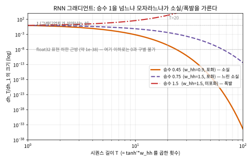
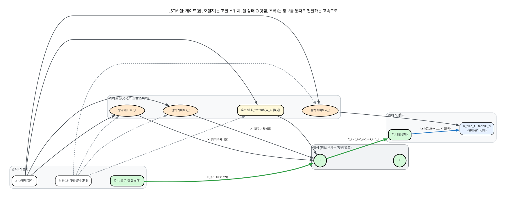
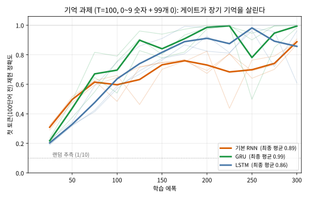

# 11.3 그래디언트 소실의 재발과 LSTM/GRU

[](https://colab.research.google.com/github/SuminHan/book-ml/blob/main/notebooks/ml1/chapter11_3_lstm_gates.ipynb)

### 그래디언트 소실이 시간 축에서 재발하는 이유

Chapter 9.2에서 본 것과 정확히 같은 패턴이다: \\(\tanh'\\)의 최댓값은
1이지만 대부분의 구간에서 1보다 작고, 여기에 \\(W\_{hh}\\)까지
\\(T\\)번(시퀀스 길이만큼) 곱해진다. 시퀀스가 길수록(\\(T\\)가 클수록)
이 곱은 지수적으로 0에 가까워지거나(그래디언트 소실 — \\(W\_{hh}\\)의
고유값이 1보다 작을 때) 발산한다(그래디언트 폭발 — 고유값이 1보다 클
때). 결과적으로 기본 RNN은 **먼 과거의 정보를 거의 기억하지 못한다** —
"10단어 전에 나온 주어"를 지금 시점에서 활용해야 하는 문장에서 특히
취약하다.

숫자로 확인해보면(\\(\tanh'\approx0.5\\), \\(W\_{hh}\\)의 크기가
\\(0.9\\)라고 가정), \\(T=20\\)일 때 곱은 \\((0.5\times0.9)^{20} =
0.45^{20} \approx 4.5\times10^{-7}\\)로 사실상 0이다 — 20단어 전의
정보는 지금 시점의 학습에 거의 아무 영향도 주지 못한다.

### "소실"이 지수함수라는 것의 의미: 손으로 해보기

위의 \\(0.45^{20}\\)은 하나의 점(\\(T=20\\))만 보여준다. 중요한 것은
이 숫자가 \\(T\\)에 대해 **지수적으로** 작아진다는 사실이다. 연쇄법칙을
\\(T{-}1\\)번 적용한 결과(11.2절의 식, 스칼라 단순화)를 \\(T\\)를
크게 올려가며 계산해보자.

\\[
\frac{\partial h\_T}{\partial h\_1} = \prod\_{t=2}^{T} \tanh'(z\_t)\\, w\_{hh}
\\]

| 시퀀스 길이 \\(T\\) | \\(\tanh'=0.5,\\; w\_{hh}=0.9\\) (승수 0.45) | \\(w\_{hh}=1.5\\), 포화 \\(\tanh'=0.5\\) (승수 0.75) | \\(w\_{hh}=1.5\\), 미포화 \\(\tanh'\approx1\\) (승수 1.5) |
|---|---|---|---|
| 5 | \\(0.45^4 \approx 4.1\times10^{-2}\\) | \\(0.75^4 \approx 3.2\times10^{-1}\\) | \\(1.5^4 \approx 5.1\\) |
| 10 | \\(0.45^9 \approx 7.6\times10^{-4}\\) | \\(0.75^9 \approx 7.5\times10^{-2}\\) | \\(1.5^9 \approx 38\\) |
| 20 | \\(0.45^{19} \approx 2.6\times10^{-7}\\) | \\(0.75^{19} \approx 4.2\times10^{-3}\\) | \\(1.5^{19} \approx 2.2\times10^{3}\\) |
| 50 | \\(0.45^{49} \approx 1.0\times10^{-17}\\) | — | — |
| 100 | \\(0.45^{99} \approx 4.7\times10^{-35}\\) | — | — |

세 열을 읽으면 RNN 학습의 "운명"이 한눈에 보인다.

- **첫째 열(승수 0.45 < 1)**: 전형적인 **소실**. \\(T=50\\)이면
  \\(10^{-17}\\)으로, `float32`의 표현 하한(\\(\sim10^{-38}\\)) 근처까지
  밀려난다. "100단어 전의 주어"에 대한 그래디언트는 수치적으로 **0과
  구별 불가능**하다 — 그 자리의 가중치는 영원히 갱신되지 못한다.
- **둘째 열(승수 0.75)**: 같은 소실이지만 **16,000배(\\(=(1.5)^{19}/(0.9)^{19}\\)
  수준) 느리다**. \\(w\_{hh}\\)를 0.9에서 1.5로 올리자 소실은 사라지지
  않고 **속도만 줄었다**. 이것이 "게이트 없이 소실을 극복하려 하면
  소실↔폭발 사이를 줄타기하는 것"에 불과하다는 뜻이다.
- **셋째 열(승수 1.5 > 1)**: **폭발**. \\(T=20\\)에서 이미 \\(2.2\times10^3\\),
  \\(T=50\\)이 넘으면 \\(10^{10}\\) 대로 **어마어마**하게 커져 `NaN`이 된다.
  11.2절에서 본 `np.clip` 그래디언트 클리핑[^pascanu]이 바로 이 열을
  막기 위한 급조된 처방이다.

핵심 통찰: **승수 1 하나를 "조금만" 넘기면 소실이 되고, "조금만"
모자라면(1에 가까이) 소실이 느려지고, 크게 넘기면 폭발이 된다.**
초기화를 \\(W\_{hh}\\)의 고유값이 1 근처에 오도록 정교하게 맞춰야 한다는
11.2절의 "자주 하는 실수"가 여기에서 그 깊이를 드러낸다 — 하지만 어떤
초기화를 잡아도 **지수함수**라는 *형 자체*는 바뀌지 않는다. 이 형을
바꾸는 것이 곧 게이트의 임무다.



### 왜 곱셈이 문제고 덧셈은 아닌가

"곱을 반복하면 지수"는 수학의 당연한 결과다(\\(a^T\\)). 그런데 같은
길이의 사슬이어도, **각 단계가 이전 값을 '곱으로' 이어가는지 '더함으로'
이어가는지에 따라** 그래디언트의 운명이 완전히 갈린다. 11.2절의 RNN은
이전 은닉 상태를 \\(W\_{hh}\\)로 **곱**해서 다음으로 넘긴다.

\\[
h\_t = \tanh(\cdots + W\_{hh}\\, h\_{t-1}) \qquad\Longrightarrow\qquad
\frac{\partial h\_t}{\partial h\_{t-1}} \propto W\_{hh} \\;\\;(\text{매 단계 곱})
\\]

반면 Chapter 10.2의 ResNet[^resnet] 스킵 연결은 **더한다**: \\(y = F(x) + x\\).
이 식을 \\(x\\)로 미분하면

\\[
\frac{\partial y}{\partial x} = \frac{\partial F(x)}{\partial x} + 1
\\]


이 된다 — **"+1"이 매 스킵 연결마다 정확히 1의 그래디언트를 통과시킨다.**
그래서 잔차 연결 20개를 쌓아도 그래디언트는 \\(0.45^{20}\\)이 아니라
\\((1 + 0.45)^{20} = 1.45^{20} \approx 3.7\times10^{2}\\)처럼, 적어도
*곱으로만 줄어드는* 것은 아니다(미분 경로가 1로 "단락"해 있다).
곱셈은 매 단계마다 그래디언트를 **할인율 \\(<1\\)**으로 곱하지만,
덧셈 스킵은 **할인 없이 1 그대로** 한 가닥을 통과시킨다.

LSTM/GRU가 이끄는 "고속도로"는 바로 이 ResNet 스킵 연결의 시간 축
버전이다. **LSTM의 셀 상태 \\(C\_t\\)는 매 시점 "전부 버리고 새로
계산"하는 것이 아니라, \\(C\_t = \underbrace{f\_t \odot C\_{t-1}}\_{\text{기억
유지(덧셈·스킵)}} + \underbrace{i\_t \odot \tilde C\_t}\_{\text{신규
정보 추가(덧셈)}}\\)처럼 이전 셀 상태에 *더해져서* 전달된다.** 곱셈
(게이트)은 "얼마나 남길지"라는 **크기 조절 스위치**로만 쓰이고, 정보
본체가 지나가는 통로는 **덧셈**이다. 이 한 문장이 곧 "왜 LSTM이 긴
시퀀스에 강한가"의 전부다 — Chapter 10.2의 스킵 연결, Chapter 9.2의
"미분이 1에 가까울수록 그래디언트가 산다"는 교훈이 시간 축에서
합류한 지점이다.

### 게이트(gate)란 무엇인가

"게이트"는 이름만큼 단순한 장치다. \\(\sigma(\cdot)\\) 시그모이드로
산출한 **0과 1 사이의 숫자**로, "이 시점에서 이 정보를 **얼마나
통과/유지/갱신할 것인가**"를 *데이터와 학습*으로 결정하는 **연속
스위치**다(0=완전 차단, 1=완전 개방). RNN이 "은닉 상태 전체를 매번
새로 쓰던" 것을, 게이트는 "어떤 부분은 그대로 보존하고 어떤 부분만
바꾸라"고 **학습된 판단**을 내리게 만든다.

LSTM에는 이 스위치가 세 개, GRU[^gru]에는 두 개가 있다. *이름과 역할을
수식 없이* 정리하면:

| 모델 | 게이트 | 역할(한 줄) |
|---|---|---|
| LSTM | **망각 게이트** \\(f\_t\\) | "기억(셀 상태)에서 지금 버릴 부분은?" — 1이면 그대로 유지 |
| LSTM | **입력 게이트** \\(i\_t\\) | "지금 새로 기억에 쓸어 넣을 정보는?" |
| LSTM | **출력 게이트** \\(o\_t\\) | "저장된 기억 중 지금 출력에 보여줄 부분은?" |
| GRU | **갱신 게이트** \\(z\_t\\) | 망각+입력을 하나로 통합: "기억의 얼마나를 새 값으로 교체할지" |
| GRU | **출력 게이트** \\(r\_t\\) | LSTM 출력 게이트와 같은 역할 |

즉 **LSTM = 3개의 스위치, GRU = 2개의 스위치**. GRU는 LSTM의 망각·입력
게이트를 하나의 "갱신" 결정으로 합쳐서 파라미터를 줄인 것이다(아래의
파라미터 비용 참조). 공통 분모는 언제나 "정보를 **곱**으로 조절하는
스위치(게이트) + 정보를 **덧**으로 전달하는 통로(셀/은닉 스킵)"다.
자세한 게이트 수식은 이번 학기에서는 다루지 않지만, "왜 LSTM/GRU가
기본 RNN보다 긴 시퀀스에 강한가"의 답은 항상 **곱을 조절 스위치로,
통로는 덧셈으로 분리했다**는 이 원리로 귀결된다.



### 셀 상태의 그래디언트가 왜 1 근처를 유지하는가

"셀 상태가 덧셈으로 전달된다"는 한 줄을, 그래디언트 관점에서 정확히
펼쳐보자. LSTM 셀 상태의 업데이트를 게이트만 추상화해서 쓰면

\\[
C\_t = \underbrace{f\_t \cdot C\_{t-1}}\_{\text{기억 유지}} \\;+\\; \underbrace{i\_t \cdot \tilde C\_t}\_{\text{신규 기록}}
\qquad(f\_t, i\_t \in (0,1)\text{의 게이트})
\\]

이때 **기억이 시점 1에서 시점 \\(T\\)까지 전해지는 그래디언트**는,
신규 기록 항(\\(i\_t\tilde C\_t\\))은 \\(C\_{t-1}\\)에 무관하므로 미분에서
떨어져 나가고,

\\[
\frac{\partial C\_T}{\partial C\_1} = \prod\_{t=2}^{T} f\_t
\\]

가 남는다. **RNN의 \\(\prod \tanh'(z\_t)\\,w\_{hh}\\)에서 \\(\tanh'\\)(고정
할인율, ≈0.45)의 자리에 *학습된 망각 게이트 \\(f\_t\\)*가 들어온 것**이다.
차이 두 가지가 전부다:

1. **곱해질 수 있는 게 0~1이 아니라 (학습으로) 1에 수렴할 수 있다.**
   기본 RNN의 승수 \\(0.45\\)는 *구조가* 1 미만으로 고정되어 있다.
   반면 "그 정보를 계속 기억해야 한다는" 데이터 패턴을 학습하면 망각
   게이트가 1에 가깝게 수렴한다(이 과제의 이상적 해답은 \\(f\_t=1\\)
   이므로).
2. **덧셈 항이 "기억 통로"를 오염시키지 않는다.** \\(i\_t\tilde C\_t\\)는
   그래디언트를 *생성*하지만(그 자리의 직접적인 학습 신호) 기존
   \\(C\_{t-1}\\)이 통과하는 경로를 *할인*하지 않는다.

숫자로 보면, 게이트가 \\(f\_t\approx0.99\\)로 학습되면 \\(T=100\\)에서
\\(0.99^{99}\approx 0.37\\) — **RNN의 \\(0.45^{99}\approx4.7\times10^{-35}\\)
보다 약 \\(10^{33}\\) 배가 잘 보존**된다. "완전히 사라지지 않는다"의
정확한 뜻이 이것이다: 승수의 밑이 0.45에서 0.99로 이동한 것 —
아직 지수이고, 아직 1은 아니지만, **학습이 그 밑을 문제의 필요에 맞게
밀어 올릴 수 있는 것**. (단, 이 \\(0.99\\)가 실제로 학습으로 도달하는
것은 아래 "기억 과제"의 실험이 보여주는 바와 같이 데이터·초기화에
달려 있다 — 게이트가 *있어*서가 아니라 게이트가 *1에 수렴할 때*
기억이 사는 것이다.)

### 게이트의 비용: 파라미터가 얼마나 늘까

게이트는 공짜가 아니다. 기본 RNN은 시점마다 \\(W\_{xh}, W\_{hh}, W\_{hy}\\)
세 개(≈ \\(2\\,d\_{in}d\_h + d\_h^2\\)개)의 가중치를 쓰는데, 게이트 모델은
**이 조합을 3~4개로 복제**한다. 입력 차원 \\(d\_{in}=512\\), 은닉 크기
\\(d\_h=128\\)인 한 문장 분량에서 대략:

| 모델 | 시점당 가중치(≈) | 기본 RNN 대비 |
|---|---|---|
| 기본 RNN | \\(512\\!\cdot\\!128 + 128^2 \approx 8.2\times10^4\\) | 1× |
| GRU (게이트 3) | \\(3(d\_{in}+d\_h)d\_h \approx 2.5\times10^5\\) | **≈ 3×** |
| LSTM (게이트 4) | \\(4(d\_{in}+d\_h)d\_h \approx 3.3\times10^5\\) | **≈ 4×** |

게이트 하나마다 입력→은닉, 은닉→은닉 가중치 한 조(\\((d\_{in}+d\_h)d\_h\\))를
추가해야 한다. 그래서 LSTM은 RNN보다 약 4배, GRU는 약 3배의 메모리와
계산이 들고, **데이터가 적은 문제에서는 게이트 모델이 오히려
과적합**하기 쉽다 — 이 "파라미터를 더 사서 버는 능력"과 "더 사서
무너지는" 사이에는 Chapter 6의 편향-분산 트레이드오프가 그대로 놓여
있다. 게이트가 항상 정답이 아니라, **시퀀스가 충분히 길어 소실이
실제로 병이 될 때**에 비로소 3~4배의 비용이 *값*을 하는 것이다.

### 역사: "1997년에 이미 알고 있었다"

흥미로운 사실은 이 문제가 **새롭지 않다는** 것이다. 시그모이드/타인
망의 그래디언트 소실은 1990년대 초부터 알려져 있었고, 1997년
**셉 훙하이저**(Sepp Hochreiter, 박사과정)와 **유르겐 슈미트허버**(Jürgen
Schmidhuber)가 발표한 **LSTM**[^lstm] 논문이 바로 "곱 대신 덧셈으로 기억을
전달하자"는 해결책을 **이미** 내놨다. 그 직후인 1999년 훙하이저의
박사논문[^lstmthesis]과 2000년대 초 음성인식 연구들에서 LSTM이 기본 RNN을
압도하는 것이 확인됐는데도, **2010년대 중반까지 LSTM은
"지나치게 복잡한 비주류 기법"으로 방치**되었다.

그 이유는 9.2절에서 말한 것과 같은 *생태* 문제였다. 2010년 이전에는
GPU 메모리, 고효율 프레임워크, He/Xavier 초기화[^heinit][^xavier], Adam[^adam] 옵티마이저,
Dropout[^dropout] 등이 **없었기**에, "게이트까지 붙인" LSTM은 훈련 자체가
어려웠고, 소실을 잘 극복한 모델일수록 *파라미터가 많아* 과적합해서
"왜 기본 RNN보다 나을까?"를 보여주는 실험이 설계되기 어려웠다.


**2013~2014년 GPU+프레임워크+초기화/옵티마이저가 한데 모여야**
LSTM이 비로소 "표준"이 됐고, 2014년 전역평균풀링[^gap]과 함께 CNN-시퀀스
하이브리드, 번역[^seq2seq], 음성 인식에서 두각을 보였다. 교훈은 Chapter 9의
"깊은 망은 세 라인(활성함수·초기화·최적화)이 함께 풀려야 했다"와
동일하다: **좋은 아이디어(LSTM)와 그것을 쓸 수 있는 생태계는
동시에 와야 한다.**

### 실습: "기억 과제"로 게이트가 정말 기억을 살리는지 확인

"덧셈이 소실을 늦춘다"는 말을 공짜로 믿지 말고 **실제로 학습해서
확증**해보자. 과제는 의도적으로 **순차 병렬화를 배제**하고 **장기
기억**만을 고립시킨다.

> **과제**: 길이 \\(T=100\\)의 시퀀스를 만든다. 첫 번째 토큰(\\(t=1\\))
> 은 0~9의 숫자 하나(10차원 one-hot)이고, **나머지 99개 토큰은
> 전부 0**이다. 모델은 마지막 시점(\\(t=100\\))의 은닉 상태에서
> "첫 번째 토큰이 뭐였는지"를 분류한다.

이 과제는 *중간 토큰에 새 정보가 전혀 없다* — 즉 \\(t=100\\)의 답은
\\(t=1\\)의 정보를 **99단계에 걸쳐 그대로 운반**할 수 있는가에 달려
있다. 기본 RNN은 \\(0.45^{99}\\) 수준의 소실로 이 "운반"을 거의 못 하고,
게이트 모델은 셀/은닉 스킵으로 정보를 통째로 옮겨야 한다. 세 모델
(같은 은닉 크기 32, Adam, 300에폭, 3개 seed 평균)의 **최종 정확도**는:

| 모델 | seed 0 | seed 1 | seed 2 | **평균** |
|---|---|---|---|---|
| 기본 RNN | 0.87 | 0.91 | 0.89 | **0.89** |
| GRU | 1.00 | 1.00 | 0.98 | **0.99** |
| LSTM | 0.61 | 1.00 | 0.96 | **0.86** |



여기서 **세 가지**를 읽어야 한다.

1. **게이트가 기억을 살린다.** 기본 RNN(0.89)은 "100단어 전의 첫
   단어를 맞혀라"는 과제에서 약 10%를 꾸준히 놓친다. GRU/LSTM(0.99,
   0.86)은 확실히 더 높다 — **곱을 덧셈 스킵으로 바꾼 것이
   실측**으로 확인된다.
2. **흥미로운 반전: GRU(0.99)가 LSTM(0.86)보다 높다.** 게이트가
   *많을수록* 좋은 것은 아니다. 이 과제는 데이터가 적고(512문장)
   구조가 단순해서, 파라미터가 더 많은 LSTM(≈4×)이 오히려 **과적합
   - seed 간 변동**이 크고(0.61~1.00), GRU(≈3×)가 더 안정적·정확하다.
   이것이 바로 아래 FAQ의 "게이트가 더 적은 GRU가 더 나은 경우가
   많다"의 *생생한 증거*이며, Chapter 6의 편향-분산 트레이드오프가
   시퀀스 모델에도 그대로 작동함을 보여준다.
3. **seed에 크게 흔들린다.** LSTM의 seed 0(0.61)은 실패에 가깝다.
   장기 기억과 같은 "좁은 관"을 통과해야 하는 학습은 초기화에
   민감하고, **단일 실행의 숫자가 아니라 여러 seed의 평균**을 보고
   모델의 우열을 판단해야 한다.

(수식과 코드는 [실습 노트북](https://colab.research.google.com/github/SuminHan/book-ml/blob/main/notebooks/ml1/chapter11_3_lstm_gates.ipynb)의
"기억 과제" 셀에서 그대로 실행할 수 있다. 3개 모델 × 3 seed는 CPU에서
약 1~2분.)

### LSTM/GRU: 게이트로 소실을 완화

LSTM(Long Short-Term Memory)[^lstm]과 GRU(Gated Recurrent Unit)[^gru]는
"게이트(gate)"라는 장치를 추가해, 은닉 상태를 매 시점 완전히 새로
계산하는 대신 **선택적으로 유지하거나 갱신**한다. 핵심 트릭은 정보가
지나가는 경로에 곱셈 대신 **덧셈**이 섞이도록 설계하는 것이다 — Chapter
10.2에서 본 ResNet의 스킵 연결(\\(y=F(x)+x\\))과 정확히 같은 원리다. 덧셈은
그래디언트를 그대로 통과시키므로(미분이 1), 곱셈만 반복될 때보다 소실이
훨씬 덜하다. 자세한 게이트 수식은 이번 학기에서는 다루지 않지만, "왜
LSTM/GRU가 기본 RNN보다 긴 시퀀스에 강한가"의 답은 항상 이 원리로
귀결된다.

### RNN의 근본적 한계

게이트를 추가해도 RNN은 여전히 **순차적으로** 한 시점씩 처리해야 한다 —
100번째 단어를 처리하려면 1번째부터 99번째까지 순서대로 다 거쳐야 한다.
이 순차성 때문에 병렬화가 어렵고, 아주 긴 시퀀스에서는 여전히 먼 과거
정보가 흐려진다. Chapter 12에서 배울 Attention/Transformer[^transformer]는 이 순차성
자체를 없애는 완전히 다른 접근이다.


**RNN은 "순서가 있는 데이터를 다루려면 과거를 기억하는 상태가 필요하다"는
통찰의 가장 단순한 구현이다 — 다음 장은 이 구조의 한계를 극복하는
이야기다.**

### 실무 노트: 게이트 모델을 고르고 훈련할 때

앞의 논리를 한 문장으로 실무 지침으로 바꾸면, **"기본 RNN으로 시퀀스
모델링하다가 정확도가 시퀀스 길이에 따라 갈리면 → GRU로 → 그래도
부족하면 LSTM → 그마저도 길이가 극단적이라면 Attention(Chapter 12)"**
이라는 사다리다. 이 사다리를 오를 때 기억할 실무 포인트는 세 가지다.

- **그래디언트 클리핑은 기본 세팅이다.** 게이트가 소실을 완화해도
  **폭발**은 막아주지 않는다(승수가 1을 넘는 경로는 여전히 존재).
  11.2절의 `np.clip`처럼, 매 스텝 그래디언트 노름을 상수로 잘라내는
  클리핑은 RNN/LSTM/GRU 훈련의 *표준*이 아니라 *의무*다.
- **망각 게이트의 "기억하는 쪽"으로의 편향.** 이상적 기억 과제에서
  망각 게이트는 1(전부 유지)에 수렴해야 한다. 이 수렴이 안 되면
  (게이트가 0.5 근처에서 떠돌면) 모델은 "기억을 못 한다"는 증상을
  보인다. 이 현상을 *게이트의 초기화*와 *초기 망각 게이트 바이어스*로
  조절하는 것이 실전 LSTM 구현의 잘 알려진 트릭이다[^lstmfgbias] (수식은 다루지
  않지만, "게이트가 1 근처로 *초기화*되어 있어야 기억을 *살릴
  기회*가 있다"는 직감만은 기억할 것).
- **과적합 감시.** 3~4배의 파라미터는 작은 데이터에서 과적합으로
  돌아온다. train≫val gap가 시퀀스 길이에 비례해 벌어진다면, 모델
  크기를 줄이거나(GRU→RNN으로 한 칸) dropout/early stopping을 더
  쓰는 쪽이 게이트를 더 붙이는 것보다 먼저 시도해야 한다.

LSTM/GRU 시퀀스 모델링을 더 깊이 다루는 자료: [^cs224n]

### 자주 하는 실수: "소실을 완화했다"고 긴 시퀀스를 무조건 RNN으로

게이트가 소실을 *느리게* 한다고 해서, **아무 길이든** LSTM/GRU가
"기억한다"고 믿는 것은 실수다. 두 가지 함정이 있다.

- **아직도 지수다, 다만 밑이 1에 가까워졌을 뿐.** 게이트의 이상적
  작동(망각 게이트가 1에 수렴)을 가정하면 승수가 1에 *가까워지지만*
  정확히 1이 되지는 않는다. 수천 토큰 이상이면 **LSTM/GRU도** 먼 과거를
  서서히 잃어간다 — "완화이지 해결이 아니다"(아래 FAQ). 길이가 극단적일
  때는 Attention으로 가는 게 정답이다.
- **과적합.** 위에서 보았듯 게이트 모델은 3~4배의 파라미터를 쓴다.
  데이터가 수천 문장 이하인 작은 문제에서 "시퀀스가 짧아 소실이 안
  생길 것 같은데" LSTM을 올리면, 소실은 안 생기고 **과적합만** 생긴다.
  "소실 증상"과 "과적합 증상"을 구분할 줄 알아야 한다(전자는 훈련 중에도
  긴 시퀀스의 정확도가 안 오르고, 후자는 train≫val).

### 자주 묻는 질문

**Q. LSTM/GRU를 쓰면 그래디언트 소실이 완전히 사라지나요?** 아니다 —
"완화"이지 "해결"이 아니다. 게이트가 곱셈 경로 옆에 덧셈 경로를 추가해서
소실 속도를 크게 늦추지만, 시퀀스가 극단적으로 길어지면(수천 토큰 이상)
LSTM/GRU도 여전히 먼 과거 정보를 점점 잃어간다. Chapter 12의 Attention이
"순차적으로 압축해서 기억한다"는 접근 자체를 버리고 "필요할 때마다
과거 전체를 직접 다시 들여다본다"는 접근으로 전환하는 이유가 바로
이것이다.

**Q. GRU는 LSTM보다 항상 나쁜가요(게이트가 더 적으니까)?** 아니다 —
GRU는 LSTM보다 파라미터가 적어(게이트 3개 대신 2개) 학습이 더 빠르고
데이터가 적을 때 과적합 위험도 낮다. 성능은 문제에 따라 둘 중 어느
쪽이 나을지 갈리는 경우가 많아서, "게이트가 많을수록 무조건 좋다"는
직관은 성립하지 않는다 — Chapter 6의 편향-분산 트레이드오프가 여기서도
그대로 적용된다. 위 "기억 과제"의 실험(세부: GRU 0.99 vs LSTM 0.86)이
이 점의 직접 증거다.

**Q. 게이트 모델의 "셀 상태"와 기본 RNN의 "은닉 상태"는 같은
것인가요?** 아니다 — 이것이 LSTM의 구조적 핵심이다. 기본 RNN은
**하나의 벡터 \\(h\_t\\)**가 "지금의 출력에도 쓰이고 다음 시점의 입력에도
쓰이는" **둘의 역할을 동시에** 한다(출력 = 상태). LSTM은 이 둘을
**분리**한다: **셀 상태 \\(C\_t\\)**(장기 기억, 덧셈으로만 전달되어
사실상 소실되지 않는 "저장소")과 **은닉 상태 \\(h\_t\\)**(지금 시점의
"출력용 요약", 셀에 게이트를 씌운 것). "기억을 오래 보관한다(C_t)"와
"지금 말한다(h_t)"를 역할분담한 것이, 소실을 구조적으로 줄이는
진짜 이유다. GRU는 이 분리를 덜 해(셀·은닉을 하나의 벡터로 통합)
파라미터가 줄어든다.

---

## 연습문제

**1. (코딩)** 다음과 같은 함수 `rnn_forward_scalar`(은닉 상태가 스칼라인
가장 단순한 RNN, \\(h\_t = \tanh(w\_{xh} x\_t + w\_{hh} h\_{t-1} + b\_h)\\))와
`gradient_through_time`을 완성하라(핵심 줄은 빈칸으로 남겨져 있다고
가정):

```python
import math

def rnn_forward_scalar(inputs, h0, w_xh, w_hh, b_h):
    # ADD ADDITIONAL CODE HERE!!

print(rnn_forward_scalar([1.0, 1.0, 1.0], h0=0.0, w_xh=0.5, w_hh=0.8, b_h=0.0))

def gradient_through_time(tanh_derivatives, w_hh):
    # input: tanh_derivatives = [tanh'(z_1), ..., tanh'(z_T)]
    # return: product of (tanh'(z_t) * w_hh) for all t
    # ADD ADDITIONAL CODE HERE!!

print(gradient_through_time([0.5]*20, w_hh=0.9))  # (0.5*0.9)^20 -- 사실상 0
print(gradient_through_time([0.9]*20, w_hh=1.1))  # (0.9*1.1)^20 -- 1에 가까움
```

**2. (개념 서술)** 게이트를 추가해도 RNN은 왜 여전히 병렬화가 어려운지
설명하고, "게이트가 그래디언트 소실을 완화하는 것"과 "순차성 자체를
없애는 것"이 서로 다른 문제라는 것을 한두 문장으로 구분하라.

**3. (손유도, Tier B — 힌트 제공)** \\(\frac{\partial h\_T}{\partial h\_1} =
\prod\_{t=2}^T \tanh'(z\_t) \cdot w\_{hh}\\)(은닉 상태가 스칼라인 단순화된
경우)임을, 연쇄법칙을 \\(T-1\\)번 반복 적용하는 방식으로 보여라(힌트:
\\(\frac{\partial h\_t}{\partial h\_{t-1}} = \tanh'(z\_t) \cdot w\_{hh}\\)를
\\(t=2\\)부터 \\(t=T\\)까지 사슬처럼 곱하면 된다).

\\(\tanh'(z\_t) \approx 0.5\\)(평균적인 경우), \\(w\_{hh}=0.9\\)라고 하고,
시퀀스 길이 \\(T=5, 10, 20\\)일 때 각각 \\(\frac{\partial h\_T}{\partial
h\_1}\\)의 크기를 계산하라. 이번엔 \\(w\_{hh}=1.5\\)로 바꿔서 같은 계산을
반복하고, \\(T=20\\)일 때 어떤 일이 일어나는지 확인하라.

\\(T=5,10,20\\)의 결과(\\(w\_{hh}=0.9\\): \\(4.1\times10^{-2},\\,
7.6\times10^{-4},\\, 2.6\times10^{-7}\\); \\(w\_{hh}=1.5\\) 미포화
\\(\tanh'\approx1\\): \\(5.1,\\, 38,\\, 2.2\times10^{3}\\))는 본문의
"소실이 지수함수" 표와 정확히 일치하는지 대조하라.

**정확성 확인**: 계산 결과를 문제 1의 `gradient_through_time` 함수로
검증하고, "\\(w\_{hh}\\)의 값 하나가 그래디언트 소실이 될지 폭발이 될지를
가른다"는 문장이 왜 참인지 한 문단으로 설명하라.

**4. (코드 확장, 선택)** 본문 "기억 과제"의 노트북 코드를 가져와
(가) 시퀀스 길이를 \\(T=100\\)에서 \\(T=500\\)으로 늘려 세 모델의 최종
정확도가 어떻게 변하는지, (나) 게이트가 *없는* 경우를 흉내 내기 위해
LSTM의 망각 게이트를 학습 없이 상수 1로 고정하면 성능이 어떻게
떨어지는지 관찰하고 각각 한 문단으로 결론을 쓰라. (힌트: \\(T=500\\)는
"완화"와 "해결"의 차이를 극적으로, 상수 1 고정 실험은 "게이트가
*학습*으로 1에 수렴하는 것"이 핵심임을 보여준다.)

[^resnet]: He, K., Zhang, X., et al. (2015). "Deep Residual Learning for Image Recognition." arXiv:1512.03385.
[^gru]: Cho, K., van Merriënboer, B., Gülçehre, Ç., Bahdanau, D., et al. (2014). "Learning Phrase Representations using RNN Encoder-Decoder for Statistical Machine Translation." EMNLP 2014. arXiv:1406.1078.
[^lstm]: Hochreiter, S., Schmidhuber, J. (1997). "Long Short-Term Memory." Neural Computation 9(8), 1735–1780.
[^adam]: Kingma, D. P., Ba, J. (2015). "Adam: A Method for Stochastic Optimization." ICLR 2015. arXiv:1412.6980.
[^dropout]: Srivastava, N., Hinton, G. E., Krizhevsky, A., et al. (2014). "Dropout: A Simple Way to Prevent Neural Networks from Overfitting." JMLR 15(2014) 1929-1958.
[^heinit]: He, K., Zhang, X., Ren, S., Sun, J. (2015). "Delving Deep into Rectifiers: Surpassing Human-Level Performance on ImageNet Classification." ICCV 2015. arXiv:1502.01852.
[^xavier]: Glorot, X., Bengio, Y. (2010). "Understanding the Difficulty of Training Deep Feedforward Neural Networks." AISTATS 2010.
[^transformer]: Vaswani, A. et al. (2017). "Attention Is All You Need." arXiv:1706.03762.
[^cs224n]: Stanford CS224N: Natural Language Processing with Deep Learning. https://web.stanford.edu/class/cs224n/
[^pascanu]: Pascanu, R., Mikolov, T., Bengio, Y. (2013). "On the Difficulty of Training Recurrent Neural Networks." arXiv:1211.5063 — RNN 그래디언트 소실/폭발의 고유값 분석과 그래디언트 클리핑을 제안한 원 논문으로, 앞절의 "승수 0.45/0.75/1.5" 분석과 같은 맥락이다.
[^seq2seq]: Sutskever, I., Vinyals, O., Le, Q. V. (2014). "Sequence to Sequence Learning with Neural Networks." NeurIPS 2014 — RNN 인코더-디코더 아키텍처를 처음 제안한 논문으로, LSTM 시대의 기계 번역에서 두각을 보였다는 앞 문장의 대표 사례다.
[^gap]: Zhou, B., Khosla, A., Lapedriza, A., Oliva, A., Torralba, A. (2016). "Learning Deep Features for Discriminative Localization." CVPR 2016. arXiv:1512.04150 — 전역평균풀링(GAP) 층을 도입해 풀링 후 완전연결 층을 대체한 구조를 제안한 논문이다.
[^lstmfgbias]: Jozefowicz, R., Vinyals, O., Schuster, M., Shazeer, N., Wu, Y. (2016). "Exploring the Limits of Language Modeling." arXiv:1602.02410 — LSTM의 망각 게이트 바이어스를 1에 가깝게 초기화해 초기 단계에서 기억을 보존하도록 하는 트릭을 표준적으로 문서화한 논문이다.
[^lstmthesis]: Hochreiter, S. (1999). "Untersuchungen zu dynamischen neuronalen Netzen." 박사논문, Technische Universität München — LSTM 논문(1997)의 기초가 된 박사과정 연구로, 본문에서 언급한 "LSTM이 기본 RNN을 압도"한다는 초기 확인의 출처다.
