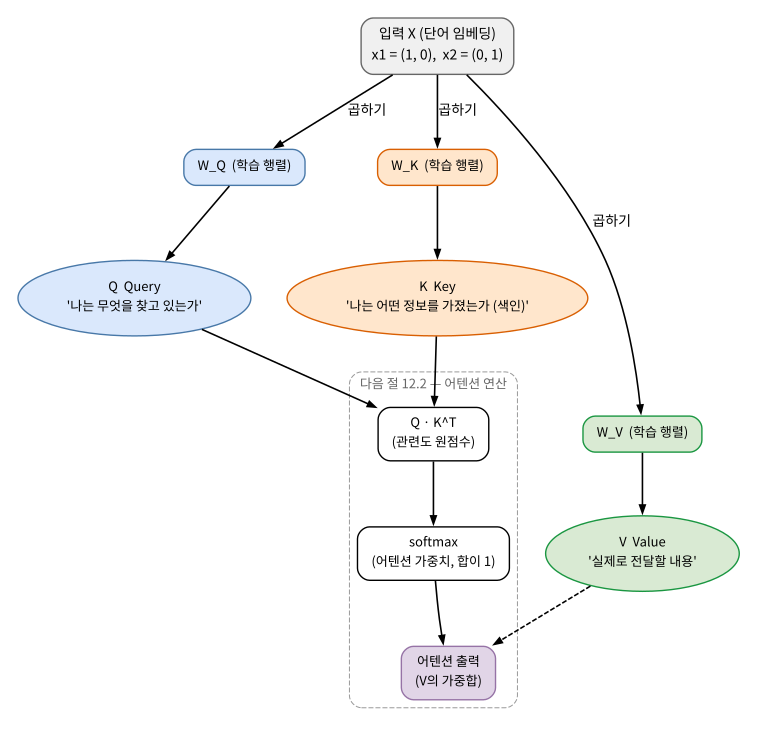
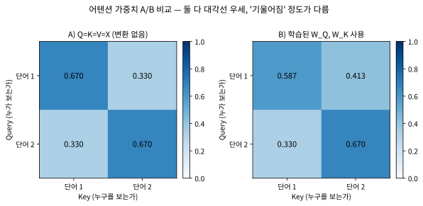

# 12.1 어텐션 아이디어와 Query·Key·Value

[](https://colab.research.google.com/github/SuminHan/book-ml/blob/main/notebooks/ml1/chapter12_1_qkv.ipynb)

### RNN의 순차성이라는 근본 문제

Chapter 11에서 본 RNN은 한 단어씩 순서대로 처리해야 했다 — 100번째
단어를 보려면 1번째부터 99번째까지 순서대로 거쳐야 한다. 이건 두 가지
문제를 만든다: (1) GPU는 병렬 연산에 특화됐는데, 순차적 구조는 그
병렬성을 활용하지 못해 느리다. (2) 먼 과거의 정보가 여러 단계를 거치며
흐려진다(Chapter 11의 그래디언트 소실과 정확히 같은 문제).

이 두 문제 외에, 덜 눈에 띄지만 실무에서 상당한 제약을 주는 구조적 한계
가 하나 더 있다: RNN의 \\(t\\)번째 은닉 상태는 \\(1\\)~\\(t\\)번의
입력만 볼 수 있다 — 과거를 "뒤돌아보는" 것은 자연스러워도, **미래**의
정보는 순전파 단계에서는 아예 현재에 도달하지 못한다. 기계번역처럼
"원문을 전부 읽은 뒤에야 번역을 시작해야 하는" 작업에서는, RNN이 원문을
처음부터 끝까지 한 번 읽은 뒤 **마지막 은닉 상태 한 개**에 원문 전체의
의미를 압축해서 담아두고, 그것을 기반으로 번역을 시작할 수밖에 없는
형태를 강제받는다[^seq2seq]. 2014년 연구(Bahdanau et al.[^bahdanau])가 보여준
것은 바로 이 압축 병목(compression bottleneck)을 우회하는 길이다 — 생성의 각 단계에서
"원문의 각 단어를 다시 돌아가서 보고, 적절한 비율로 쓴다." 그게 바로
"어텐션"이다.

### "어텐션"이라는 아이디어

어텐션의 직관은 단순하다: "지금 이 단어를 이해하려면, 문장의 **다른 모든
단어를 한 번에** 보고, 그중 관련 있는 단어에 더 집중(attend)한다." "그
동물은 도로를 건너지 않았다, 왜냐하면 **그것은** 너무 지쳐 있었기
때문이다"라는 문장에서, "그것은"이 가리키는 게 "그 동물"인지 "도로"인지는
문장 전체를 동시에 봐야 판단할 수 있다.

이 "모든 단어를 한 번에 보는 것"을 수식으로 쓰면 RNN과의 차원이 달라
진다. 어텐션은 현재 단어의 새로운 표현을 만들 때 문장의 \\(n\\)개
단어 각각에 대해 **가중치 하나씩, 총 \\(n\\)개의 가중치**를 계산한다 —
"단어 위의 분포(distribution over words)"를 만든다. 이 \\(n\\)차원
벡터를 **어텐션 가중치(attention weights**)라 부른다. "그것은"의
어텐션 가중치는 (0.56, 0.01, 0.01, 0.42) 같은 형태 — "동물"에 56%,
자기 자신에 42%, 나머지 두 단어에 거의 0%의 주의를 분배한다는 뜻이다
(실제 숫자는 12.2절 실습에서 나온다). RNN이 주던 것은 "과거의 압축
요약(한 벡터)"이었는데, 어텐션이 주는 것은 **"관련 단어들의 내용을
적절한 비율로 섞은 것**”이다.

### 역사: 어텐션 메커니즘이 어떻게 등장했는가

"어텐션"이라는 용어는 트랜스포머보다 3년 앞서, **기계번역** 분야에서
등장했다. 2014년 Bahdanau·Cho·Bengio(Google Research, 몬트리올)의
논문 "Neural Machine Translation by Jointly Learning to Align and
Translate"[^bahdanau]다. 당시 RNN 번역기는 긴 문장을 다룰 때 한 가지 어색한 짓을
하고 있었다 — 문장의 **전체** 의미를 은닉 상태 **하나**에 담아야
했다. 문장이 길수록 한 벡터에 더 많은 정보를 구겨 넣어야 했고,
그만큼 잘 안 됐다. (BPTT가 길어질수록 그래디언트가 약해지는,
Chapter 11.3에서 본 것과 같은 "길이에 대한 취약성"의 또 다른 모습이다.)

그들의 해결책은 지금의 어텐션과 거의 동일하다: 번역의 각 단계에서
"이제 만들려는 번역 단어가, 원문의 각 단어와 얼마나 관련 있는가"를
점수 하나로 계산하고, 그것을 softmax로 분포로 바꿔, **원문 쪽
은닉 상태들을 그 가중치로 다시 합산**한다(이 합산된 벡터를
"context vector"라 불렀다). 즉 어텐션의 기원은 "새로운 아키텍처"가
아니라 **RNN에 붙인 패치**였다 — RNN이 입력을 한 번만 읽던 구조를,
"필요할 때마다 입력을 다시 참고할 수 있게" 만든 장치.

그리고 3년 뒤, 2017년의 Vaswani et al.("Attention Is All You Need"[^transformer],
이 장의 주인공)은 한 발 더 나아간 질문을 던진다: "이 메커니즘 하나가
이렇게 효과가 있다면, RNN 본체 자체는 정말 필요한 걸까?" — 그리고
순환을 **통째로 걷어내고** 어텐션 레이어만 쌓아 RNN보다 좋은 성능을
내보인다. 이번 장을 읽으며 "어텐션의 기원은 RNN의 패치였고,
트랜스포머는 그 논리의 귀결"이었다는 점을 기억해 두면, 12.2/12.3의
각 구성요소가 왜 그 형태인지가 훨씬 빨리 이해된다.

### Query, Key, Value

각 단어(정확히는 각 단어의 임베딩 벡터)는 세 가지 벡터로 변환된다:
**Query**(Q) "내가 지금 무엇을 찾고 있는가", **Key**(K) "나는 어떤
정보를 갖고 있는가", **Value**(V) "실제로 전달할 내용". 세 벡터 모두
같은 입력 임베딩 \\(x\\)에 서로 다른 학습 가능한 가중치 행렬을 곱해서
얻는다:

\\[Q = XW\_Q, \qquad K = XW\_K, \qquad V = XW\_V\\]



이 셋을 도서관에 비유하면 감이 잡힌다 — Query는 "내가 찾는 책의
주제"(질문), Key는 "각 책의 색인 카드에 적힌 요약"(색인), Value는
"실제 책의 내용"이다. Query를 모든 책의 Key와 비교해서 가장 관련
있는 책들을 찾고, 그 관련도만큼 실제 내용(Value)을 섞어서 가져오는
것이 바로 다음 절의 어텐션 연산이다.

한 가지 덧붙이자: 2014년 Bahdanau 버전에서는 Q, K, V가 모두
RNN 은닉 상태에서 나왔고(번역 쪽 이전 단계 은닉 상태 = Q, 원문 쪽
은닉 상태 = K = V), Q/K/V라는 이름 체계는[^luong] 2017년 트랜스포머가
이것을 행렬 곱 \\(XW\_Q, XW\_K, XW\_V\\)로 일반화하면서야 표준
정착했다. 구조는 같다 — "찾는 쪽(질문)", "답변 쪽(색인)", "내용
그 자체"의 삼각 관계.

### 손으로 한 번: 같은 입력에서 Q, K, V가 서로 다르게 계산되는 것 확인하기

단어 2개, 각 임베딩이 \\(x\_1=(1,0)\\), \\(x\_2=(0,1)\\)인 아주 작은 예로,
서로 다른 세 변환 행렬 \\(W\_Q=\begin{pmatrix}1&0\\\\0&2\end{pmatrix}\\),
\\(W\_K=\begin{pmatrix}0.5&0\\\\0&0.5\end{pmatrix}\\),
\\(W\_V=\begin{pmatrix}2&1\\\\1&2\end{pmatrix}\\)을 적용해보자.
\\(Q=XW\_Q\\), \\(K=XW\_K\\), \\(V=XW\_V\\)를 계산하면:

\\[Q=\begin{pmatrix}1&0\\\\0&2\end{pmatrix}, \quad
K=\begin{pmatrix}0.5&0\\\\0&0.5\end{pmatrix}, \quad
V=\begin{pmatrix}2&1\\\\1&2\end{pmatrix}\\]

같은 입력 \\(X\\)에서 출발했는데도 \\(Q, K, V\\)가 서로 완전히 다른
값으로 나온다 — 이 세 행렬이 각각 독립적인 학습 파라미터를 가지고
있기 때문이다. \\(W\_Q\\)는 두 번째 차원을 2배로 확대하고, \\(W\_K\\)는
모든 차원을 절반으로 축소하며, \\(W\_V\\)는 두 차원을 서로 섞는다(비대각
원소가 0이 아니다) — 이렇게 서로 다른 "역할"을 하는 변환들이 학습을
통해 만들어진다.

### 왜 "관련성"은 내적으로 재는가

12.2절에서 관련성은 **내적(dot product**)으로 잰다고 배운다. 공식이
나오기 전에 "왜 내적이냐"의 직관을 먼저 정리해 두자. 두 벡터의 내적은
\\(a \cdot b = \\|a\\|\\,\\|b\\|\\,\cos\theta\\) — **두 벡터의 방향이 얼마나
맞는가**에 비례하고(노름을 나눠낸 \\(\cos\theta\\)가 곧 14.2절에서
다룰 코사인 유사도), 직각이면 0, 반대 방향이면 음수가 된다.

"내가 찾는 정보의 방향"을 Query 벡터로, "내가 가진 정보의 방향"을
Key 벡터로 표현한다면, **Q·K는 "찾는 것"과 "가진 것"의 방향이
일치할수록 큰 숫자가 되는** — 바로 "관련성"의 정의 그 자체다.
어텐션이 "두 단어의 공간적 거리가 얼마나 가까운가"(유클리드 거리)를
재는 게 아니라 **내적**을 쓰는 이유도 이 때문이다: 어텐션이 묻는
것은 "얼마나 가까운가"가 아니라 "얼마나 잘 맞는가(matching)"다.
(부수적 함의 하나: 벡터의 크기가 크면 내적이 자동으로 커진다 —
12.2절이 \\(\sqrt{d\_k}\\)로 스케일링하는 이유가 여기에도 있다.)

### 전체 파이프라인 미리보기: QK^T, softmax, AV의 형태

위 2단어 × 2차원 예 하나로, 12.2절의 "어텐션 연산" 전체가 어떤
모습인지 미리 볼 수 있다. 3단계다:

1. 모든 단어 쌍의 **원점수(raw score)** \\(QK^T\\)를 계산한다.
2. 각 행에 **softmax**를 적용해 분포(어텐션 가중치)를 만든다.
3. 그 가중치로 \\(V\\)의 행을 **가중합**한다 → 출력.

계산해보자. 원점수는:

\\[QK^T = \begin{pmatrix} 1 & 0 \\\\ 0 & 2 \end{pmatrix}
\begin{pmatrix} 0.5 & 0 \\\\ 0 & 0.5 \end{pmatrix}
= \begin{pmatrix} 0.5 & 0 \\\\ 0 & 1 \end{pmatrix}\\]

단어 1의 Query (1,0)은 단어 1의 Key (0.5,0)와 잘 맞고, 단어 2의 Key
(0,0.5)와는 직각(내적 0)이다. 단어 2의 Query (0,2)는 단어 2의 Key와
방향 일치(\\(2 \times 0.5 = 1\\)), 단어 1의 Key와는 0. 이 예에서는
\\(W\_Q, W\_K\\)를 각 단어의 Query·Key가 서로를 교차하지 않는 방향이
되도록 **직접 설계**했기 때문에, 점수만 봐도 "단어 1↔단어 1,
단어 2↔단어 2가 관련 있다"가 대각선 형태로 보여 — 실전에서는 이
설계가 학습으로 대체된다고 생각하면 된다.

12.2절의 스케일링(\\(\sqrt{d\_k} = \sqrt{2}\\)로 나누기)과 softmax를
적용하면:

- 행 1: softmax(0.354, 0) = (0.587, 0.413)
- 행 2: softmax(0, 0.707) = (0.330, 0.670)

(0.354 = 0.5/\\(\sqrt{2}\\), 0.707 = 1/\\(\sqrt{2}\\).) 그리고 최종
출력:

- 단어 1 출력 = 0.587·V₁ + 0.413·V₂ = (1.587, 1.413)
- 단어 2 출력 = 0.330·V₁ + 0.670·V₂ = (1.330, 1.670)

두 가지를 눈여겨볼 것. 첫째, 섞였는데도 **단어 1의 출력이 V₁ 쪽에,
단어 2의 출력이 V₂ 쪽에 기울어 있다**(각각 0.59, 0.67의 가중치) —
"관련 단어의 내용을 관련도만큼 섞는다"가 숫자로 성립한 것이다.
둘째, 출력이 순수한 복사(정답이라면 (2,1)과 (1,2))는 아니다 —
다른 단어의 내용이 **조금** 섞여 있다. 어텐션 출력은 "가장 관련 있는
단어 하나를 고르는" 것이 아니라 **"모든 Value의 가중평균**”이라는
점을 여기서 체감해 두면, 12.2절의 softmax가 "왜 합이 1인 분포여야
하는지"가 자동으로 이해된다.

또 하나의 관찰: 점수 차이가 클수록 어텐션 가중치는 더 집중된다.
단어 2의 점수 간격(1 vs 0)이 단어 1(0.5 vs 0)보다 크므로, 가중치도
더 기울어 있다(0.67/0.33 vs 0.59/0.41). 어떤 Key의 점수가 압도적으로
높으면 softmax는 가중치를 거의 전부를 거기로 몰아넣는다 — 12.2절
실습의 "그것은"이 "동물"에 0.56을 주는 현상은 바로 이 메커니즘의
더 극단적인 버전이다.

### 변환 없이 쓰면 무엇이 깨지는가: Q=K=V=X의 A/B 비교

자주 묻는 질문 첫 번째의 답을 계산으로 한 번 확인해 보자. 같은
2단어 예에서 **변환 없이** Q = K = V = X(\\(X =
\begin{pmatrix}1&0\\\\0&1\end{pmatrix}\\))로 어텐션을 돌려본다:

- 점수: \\(XX^T = \begin{pmatrix}1&0\\\\0&1\end{pmatrix}\\) →
  \\(\sqrt{2}\\) 스케일링 후 (0.707, 0), (0, 0.707) →
  softmax 후 (0.670, 0.330) / (0.330, 0.670)
- 출력: 단어 1 = (0.670, 0.330), 단어 2 = (0.330, 0.670)

변환이 있는 경우(위 미리보기)와 나란히 놓으면:

| 경우 | 어텐션 가중치 (단어 1 행) | 단어 1의 출력 |
|---|---|---|
| Q=K=V=X (변환 없음) | (0.670, 0.330) | (0.670, 0.330) |
| 학습된 \\(W\_Q, W\_K, W\_V\\) 사용 | (0.587, 0.413) | (1.587, 1.413) |

변환 없는 경우의 문제가 두 가지다. (1) 이 예에서 각 단어의 임베딩이
서로 직각인 단위 벡터이므로, 각 단어는 **자기 자신과만** 높은 점수를
얻을 수밖에 없다 — 출력이 "내 임베딩에 남의 것을 약간 섞은 것"으로
고정된다. 임베딩이 서로 직각이 아닌 데이터라면 조금은 섞이겠지만,
어쨌든 (2) 더 근본적인 문제는 **학습할 여지가 없다**는 것이다:
\\(W\_Q, W\_K, W\_V\\)는 모델이 "무엇을 찾고, 무엇으로 색인하고, 무엇을
전달할지"를 데이터로부터 배울 수 있는 **유일한** 자리다. 처음부터
Q=K=V=X로 고정하면 데이터에 무엇을 더 넣어도 어텐션 구조는 변하지
않는다 — "데이터가 구조를 결정"할 틈이 없는 고정 템플릿과 같다.
트랜스포머에서 기울기가 실제로 흘러 \\(W\_Q, W\_K, W\_V\\)가 갱신되는
부분이, 곧 모델이 "어떤 관계를 보게 될지"를 결정하는 부분이라는
점에서, 이 세 행렬의 존재는 어텐션 메커니즘의 핵심이다.



### 자주 묻는 질문

**Q. Q, K, V는 왜 같은 입력에서 서로 다른 세 가지로 나뉘나요? 그냥
입력 자체를 비교하면 안 되나요?** 만약 Q=K=V=X(변환 없이 원본 입력을
그대로 씀)라면, "이 단어가 자기 자신과 얼마나 비슷한가"만 재게 되어
표현력이 크게 제한된다. \\(W\_Q, W\_K, W\_V\\)라는 서로 다른 학습 가능한
변환을 두면, "무엇을 찾을지"와 "무엇을 제공할지"를 모델이 데이터로부터
독립적으로 학습할 수 있다 — 예를 들어 대명사는 "나는 나를 가리키는
명사를 찾는다"는 방향으로 \\(W\_Q\\)가 학습되고, 명사는 "나는 대명사가
찾는 대상이 될 수 있다"는 방향으로 \\(W\_K\\)가 학습되는 식이다.

**Q. 이 구조가 Chapter 3의 나이브베이즈나 Chapter 5의 SVM과 관련이
있나요?** 직접적인 수학적 연결은 없지만, "무엇이 무엇과 관련 있는지를
내적(유사도)으로 잰다"는 아이디어 자체는 Chapter 5.3의 커널 함수
\\(K(x,x')\\)(두 점의 유사도를 재는 함수)와 정신적으로 닮아 있다 —
둘 다 "원래 특징을 그대로 비교하는 대신, 학습되거나 설계된 변환을
거친 뒤 비교한다"는 패턴을 공유한다.

**Q. Q, K가 같은 X에서 나오는데, 출력은 결국 "X를 하나의 행렬로
변환한 것"과 같지는 않나요? Q와 K가 중복되는 것 아닌가요?** 중복이
아니다. 점수(Q·K^T)는 **두 행렬의 곱**으로 결정되는데, 같은 X여도
\\(W\_Q\\)와 \\(W\_K\\)가 무엇이냐에 따라 "어떤 단어 쌍이 서로를
만나고 어떤 쌍이 안 만나는지"가 완전히 달라진다. 같은 X를
"질문 카드·색인 카드·내용 카드" 세 장으로 찍어 내는 것과 같다 —
세 카드는 각각 다른 단계에서 역할을 한다(질문 카드와 색인 카드는
"비교" 단계에서만, 내용 카드는 "전달" 단계에서만 쓰인다). 또
Q=K로 고정하면 점수 행렬 QK^T가 **대칭**이 되어, "내가 너를 찾는
정도"와 "너가 나를 찾는 정도"가 정확히 같은 숫자가 된다 — "대명사는
명사를 찾지만, 명사는 대명사를 찾지 않는다"는 **비대칭적 관계**를
표현할 수 없게 된다. 실제 모델에서 어텐션의 방향성(어떤 헤드는
뒤쪽 단어를, 어떤 헤드는 앞쪽 단어를 본다)은 바로 이 비대칭성에서
나온다.

**Q. 왜 편항(bias)을 더하는 것으로는 부족하고, 행렬 곱이어야
하나요?** 편항은 모든 단어에 **같은** 벡터를 더하는 것이라
"단어 A는 대명사고 단어 B는 명사"를 구분하는 데 쓸 수가 없다 —
단어 사이의 **상대적 기하학**(각도, 방향)이 그대로다. 내적 점수는
바로 그 상대적 기하학으로 결정되므로, 점수의 의미를 바꾸려면
방향 자체를 돌리거나 늘이거나 섞을 수 있어야 한다 — 그게 선형
변환(행렬 곱)이 하는 일이다(손으로 한 번 예시의 \\(W\_V\\)가 비대각
원소로 두 차원을 섞고 있다). "왜 MLP에도 선형변환+비선형이
필요한가"와 같은 이유의 반복이다 — 선형 변환만으로는 공간을
"접을" 수 없고, 어텐션에서는 그 "접는 역할"을 **점수 비교**가
대신 맡는다(Chapter 9.2의 논리 참조).

**Q. 실제 모델에서는 \\(W\_Q, W\_K, W\_V\\)가 얼마나 큰가요?** 2017년
원논문은 모델 차원 \\(d\_{model} = 512\\)로, 각각 512×512 행렬
(각각 약 26만 개의 파라미터 — Chapter 6의 당뇨 회귀 문제가 특성이
10개인 것과 비교하면 감각을 잡기 좋은 스케일이다). 12.3절의
멀티헤드에서는 이 512차원을 \\(h=8\\)개 헤드에 나눠 쓰므로 각 헤드
의 행렬은 64×64가 된다. 세 행렬 모두 **학습으로 결정**되며, 사람이
"이 행렬은 대명사 담당"이라고 설계하지 않는다 — 12.3절에서 보듯
헤드들이 각자 다른 역할로 **스스로 분화**한다.

### 자주 하는 실수: 어텐션을 "가중평균"으로만 보고 '검색' 단계를 건너뛰기

어텐션을 처음 접할 때 가장 흔한 오해는, 3단계의 중간 — **관련도
계산** — 을 건너뛰고 "V의 가중평균"만 기억해 두는 것이다. 그런데
V의 어떤 행이 많이 섞이게 될지를 결정하는 것은 **점수(Q·K^T**)이며,
V가 아니라 **\\(W\_Q, W\_K\\)가** 그 점수를 만든다. V는 "무엇을
mix할지", 점수는 "얼마나 mix할지" — 점수가 엉뚱하면(즉,
\\(W\_Q, W\_K\\)가 의미 없는 방향으로 초기화/학습된 상태라면) V의
가중평균은 **무관한 단어들의 평균**이 되는 것이다.

정말 어텐션을 구현하거나, 학습된 모델의 어텐션을 "어떻게 동작하는지"
디버깅할 때 첫 단계는 항상 **점수 행렬의 패턴을 보는 것**이다:
- 대각선이 압도적으로 큰가(각 단어가 자기 자신만 보는 "self만" 패턴)
- 특정 열이 압도적인가(많은 단어가 하나의 단어를 보고 있다 —
  "그것은"의 "동물"처럼 하나의 중심어가 많은 단어를 끌어당기는 경우)
- 거의 균일한가(어떤 대상도 집중하지 못한다 — 가중치 행렬이 아직
  역할을 찾지 못한 상태, 또는 임베딩이 서로 구별이 안 되는 상태)

이 세 가지 얼굴을 이번 실습 노트북에서 직접 그려 볼 수 있다.

이 주제를 더 다루는 자료: [^cs224n]

---

## 연습문제

**1. (계산)** 이번 절의 손으로 계산 예에서 \\(W\_Q = W\_K = I\\)(단위
행렬, 즉 Q = K = X)이고 \\(W\_V = \begin{pmatrix}2&1\\\\1&2\end{pmatrix}\\)
뿐이라고 하자. 어텐션 가중치 행렬과 최종 출력을 구하라. (힌트:
점수는 "Q=K=V=X" 케이스와 **동일**하므로 가중치도 (0.670, 0.330) /
(0.330, 0.670) — 변하는 것은 V의 가중합인 "출력의 내용"뿐이다. 이
대조가 "가중치는 Q·K가 정하고, 내용은 V가 정한다"는 말을
숫자로 확인시켜 준다.)

**2. (개념 서술)** 도서관 비유를 이용해 Q, K, V가 각각 무엇에
대응하는지 한 문장씩 쓰고, "입력 자체를 그대로 비교하는 것
(Q=K=V=X)"이 왜 표현력이 제한되는지 — 구체적으로 **점수 행렬의
대칭화** 논거를 들어 어떤 관계를 표현할 수 없게 되는지 — 1~2문장으로
설명하라.

**3. (코딩)** 다음 함수를 완성하라(핵심 줄은 빈칸으로 남겨져 있다고
가정):

```python
def mat_vec_mul(M, v):
    # ADD ADDITIONAL CODE HERE!!
    # M (2x2 행렬) @ v (크기 2 벡터) -> 크기 2 벡터

def qkv(X, WQ, WK, WV):
    # ADD ADDITIONAL CODE HERE!!
    # X의 각 행(단어 임베딩)에 각각 WQ, WK, WV를 곱해
    # (Q, K, V) 세 행렬을 반환

X  = [[1,0],[0,1]]
WQ = [[1,0],[0,2]]
WK = [[0.5,0],[0,0.5]]
WV = [[2,1],[1,2]]
Q, K, V = qkv(X, WQ, WK, WV)
# 검증: Q=[[1,0],[0,2]], K=[[0.5,0],[0,0.5]], V=[[2,1],[1,2]] 여야 함
```

**정확성 확인**: `qkv`의 출력이 이번 절의 손으로 계산한 Q, K, V와
**정확히** 일치하는지 대조하라. "같은 입력에서 세 가지 다른 결과"가
나오는 것 자체가 이 절의 포인트다.

---

## 실습 노트북

이 절의 모든 수치 검증은 [Colab 노트북](https://colab.research.google.com/github/SuminHan/book-ml/blob/main/notebooks/ml1/chapter12_1_qkv.ipynb)에서
다시 확인할 수 있다:

1. 손으로 계산한 Q, K, V(2단어 × 2차원)를 코드로 재계산해 정확히 일치하는지
2. \\(QK^T = \begin{pmatrix}0.5&0\\\\0&1\end{pmatrix}\\) → 스케일링 + softmax로
   가중치 (0.587, 0.413) / (0.330, 0.670), 가중합 출력 (1.587, 1.413) / (1.330, 1.670)
3. Q=K=V=X(정체 변환) 케이스 A/B: 가중치 (0.670, 0.330), 출력 = "자기 자신 + 남의 것 약간"
4. 두 어텐션 가중치 행렬의 시각화 — "학습된 W_Q·W_K" vs "변환 없음"

[^bahdanau]: Bahdanau, D., Cho, K., Bengio, Y. (2014). "Neural Machine Translation by Jointly Learning to Align and Translate." arXiv:1409.0473.
[^transformer]: Vaswani, A. et al. (2017). "Attention Is All You Need." arXiv:1706.03762.
[^seq2seq]: 이 장(인코더-디코더) 구조의 원류를 세는 논문: Sutskever, I., Vinyals, O., Le, Q. V. (2014). "Sequence to Sequence Learning with Neural Networks." arXiv:1409.3215. — Bahdanau et al.와 같은 NeurIPS 2014에서 발표됐고, Bahdanau 논문이 바로 이 구조의 압축 병목을 어텐션으로 해결한 후속작이다.
[^cs224n]: Stanford CS224N: Natural Language Processing with Deep Learning. https://web.stanford.edu/class/cs224n/
[^luong]: Luong, M.-T., Pham, H., Manning, C. D. (2015). "Effective Approaches to Attention-based Neural Machine Translation." arXiv:1508.04025. — Query·Key·Value라는 세 용어(과거의 압축 벡터 대신 입력을 다시 참고한다는 아이디어는 Bahdanau et al.의 것이지만)를 도서관 비유의 "질문·색인·내용"에 비유하며 처음 쓴 논문으로, additive/multiplicative/dot-product 어텐션 스코어링을 비교했다. 2017년 트랜스포머는 이 이름 체계를 행렬 곱 \\(XW\_Q, XW\_K, XW\_V\\)로 일반화하며 표준화했다.
