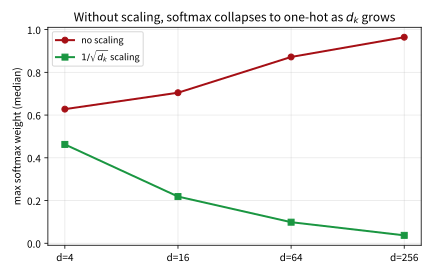
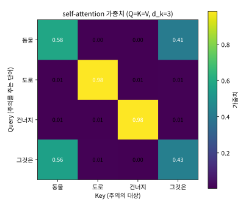

# 12.2 Scaled Dot-Product Attention과 Self-Attention

[](https://colab.research.google.com/github/SuminHan/book-ml/blob/main/notebooks/ml1/chapter12_2_scaled_dot_attention.ipynb)

### Scaled Dot-Product Attention

Scaled dot-product attention은 Transformer 원논문[^transformer]의 핵심
연산이다.


한 단어의 Query가 모든 단어의 Key와 얼마나 "관련 있는지"[^bahdanau]를
내적(dot product)으로 잰다[^luong]:

\\[\text{Attention}(Q, K, V) = \text{softmax}\left(\frac{QK^T}{\sqrt{d\_k}}\right)V\\]

단계별로 뜯어보면:

1. \\(QK^T\\): 모든 단어 쌍의 Query-Key 내적을 한 번에 계산한 행렬(각
   행 = 한 단어가 다른 모든 단어와 얼마나 관련 있는지에 대한 원점수).
2. \\(\sqrt{d\_k}\\)(Key 벡터의 차원의 제곱근)로 나눈다: 내적값이 차원이
   커질수록 커지는 경향이 있어, softmax가 극단적인 값(0 또는 1에 가까운)만
   내뱉게 되는 것을 막기 위한 스케일 조정이다.
3. **softmax**로 각 행을 확률분포(합이 1)로 바꾼다 — "이 단어가 다른
   단어들에 나눠 주는 주의(attention)의 비율".
4. 그 확률로 \\(V\\)(각 단어가 실제로 전달할 내용)의 가중합을 낸다 —
   결과는 "관련 있는 단어들의 내용을 그 관련도만큼 섞어 담은" 새로운
   벡터다.

```python
import math

def softmax(row):
    m = max(row)
    exps = [math.exp(v - m) for v in row]
    total = sum(exps)
    return [e / total for e in exps]

def attention(Q, K, V, d_k):
    scores = [[sum(Q[i][t] * K[j][t] for t in range(d_k)) / math.sqrt(d_k)
               for j in range(len(K))] for i in range(len(Q))]
    weights = [softmax(row) for row in scores]
    output = [[sum(weights[i][j] * V[j][t] for j in range(len(V)))
               for t in range(len(V[0]))] for i in range(len(Q))]
    return output, weights
```

**코드 읽기.** `scores[i][j]`는 \\(Q[i] \cdot K[j] / \sqrt{d\_k}\\) — 즉
\\(QK^T\\)의 \\((i,j)\\) 성분에 해당하는 값이므로, `scores` 리스트 전체가
\\(n \times n\\) 원점수 행렬 자체다. `weights[i]`는 `scores[i]`에 softmax를
적용한 결과 — i번째 단어(행)가 j번째 단어들(열)에 나눠준 주의의 비율,
합이 1이다. 마지막 `output[i]`는 `weights[i]`라는 가중치로 `V`의 n개
행을 **가중합**한 값 — "i번째 단어가 다른 단어들에게 요청한 정보
(V)들을 관련도만큼 섞은 결과"다. 3중 중첩 리스트 컴프리헨션이
처음엔 눈에 거슬리겠지만, 각각 \\(QK^T\\) → \\(\sqrt{d\_k}\\) 스케일 →
softmax → \\(V\\) 가중합의 4단계를 그대로 번역한 것일 뿐이다(실전에서는
이 4단계를 `numpy`[^numpy] 행렬 곱으로 한 줄씩 줄인다 — 실습 노트북에서
확인).

### softmax를 다시 볼 이유: "차이"를 증폭하는 함수

어텐션의 핵심 연산이 softmax인데, 이 함수를 **어텐션의 맥락**에서
한 번 더 들여다보자. Chapter 2.3에서 로지스틱 회귀의 출력을 확률로
바꿔준 함수로 만나고, Chapter 3의 다중 분류에서도 "합이 1인 분포"를
만드는 도구로 썼다. 그런데 어텐션에서 softmax가 하는 역할은 그보다 더
예리한 것이 있다 — **원점수 간 차이를 증폭(또는 감쇠)한다**.

2개 단어만 있는 가장 단순한 경우에서 보면 직관이 선명하다. 두 원점수가
\\(s\_1 = 0, s\_2 = g\\)일 때, 두 번째 단어에 할당되는 가중치는:

\\[p\_2 = \frac{e^{g}}{1 + e^{g}} = \frac{1}{1 + e^{-g}} = \sigma(g)\\]

**어텐션 원점수 차이에 대한 softmax는 정확히 시그모이드 함수
\\(\sigma(g)\\)다** — Chapter 2.3에서 로지스틱 회귀의 결정 함수로 본 바로
그 함수가, 이번엔 "원점수 *차이*"를 입력으로 받는 모습이다. \\(g = 0\\)
이면 0.5(완전 동점), \\(g\\)가 커질수록 1에, 작아질수록 0에 수렴한다.
여기서 결정적 관찰은 **두 원점수 사이의 "차이"가 얼마나 크느냐가
가중치의 극단적 정도를 사실상 단독으로 결정한다**는 점이다.
실습 노트북에서 두 원점수를 \\([0, g]\\)로 두고 \\(g\\)만 바꿔보자:

\\[
\begin{array}{c|c}
\text{원점수 차이 } g \ \text{(softmax를 } [0, g] \text{에 적용)} & \text{가중치 } (p\_1, p\_2) \\
\hline
g = 0.5 & (0.378,\ 0.622) \ \text{— 아직 균형} \\
g = 2 & (0.119,\ 0.881) \ \text{— 한쪽 우세} \\
g = 8 & (0.0003,\ 0.9997) \ \text{— 사실상 하드 선택}
\end{array}
\\]

차이가 0.5에서 8로 16배가 되자 "62:38의 균형"이 "99.97:0.03의 독주"로
바뀌었다. softmax는 입력 차이를 **지수적으로** 증폭하는 함수라,
원점수가 큰 차원의 내적(아래에서 보듯 차원에 비례해 커진다)을 그대로
넣으면 **거의 one-hot(하나만 1, 나머지는 0)으로 수렴**한다. one-hot이 된 어텐션은
"관련이 있는 단어 *하나*를 선택해서 그 내용만 가져오는" 하드
경로로 바뀌고, (a) 선택된 단어의 가중치 미분은 0이 되어 그 방향으로
학습 신호가 흐르지 못하며, (b) 원점수의 미세한 변화가 가중치를 급격히
뒤집어 학습이 불안정해진다. \\(\sqrt{d\_k}\\) 스케일링이 정확히 이
"softmax의 극단화"를 막기 위한 안전장치인 것이다 — 다음 절에서 이
주장을 숫자로 확인한다.

### \\(\sqrt{d\_k}\\)로 나누는 이유: 내적의 분산이 차원에 비례한다

**"내적값이 차원이 커질수록 커진다"는 말이 수학적으로 정확히 무엇을
뜻하는가?** \\(q = (q\_1, \dots, q\_{d\_k})\\), \\(k = (k\_1, \dots,
k\_{d\_k})\\)이 서로 독립이고 각 성분이 평균 0·분산 1의 분포에서 나온
벡터라고 하자. 내적 \\(\sum\_{t=1}^{d\_k} q\_t k\_t\\)는 **독립한 0평균
곱 \\(d\_k\\)개의 합**이다. 각 항 \\(q\_t k\_t\\)의 분산은 1(독립
0평균·분산 1 변수 두 개의 곱은 분산 1)이고, 독립 변수의 합은
분산이 더해지므로:

\\[\mathbb{E}[q \cdot k] = 0, \qquad \text{Var}[q \cdot k] = d\_k \quad
\Longrightarrow \quad \text{표준편차} = \sqrt{d\_k}\\]

즉 **스케일링하지 않은 내적은 \\(\sqrt{d\_k}\\) 스케일로 "자라난다"** —
차원 64이면 표준편차가 약 8, 차원 512이면 약 23. 원점수가 ±20~30
스케일로 벌어지면, 앞 절의 증폭 논리대로 softmax는 one-hot으로
붙어버린다.

이걸 실제로 재보면 의외로 직관이 선명해진다. 무작위 벡터(각 성분
\\(\mathcal{N}(0,1)\\)) 두 개를 200쌍 만들어 내적을 계산하면(d=64):

```
200회 무작위 내적: min = -19.1, 중간값 ≈ 0.5, max = +22.3
  (표준편차 √64 = 8 — 관측된 최대치 22.3 ≈ 2.8σ, 기대와 일치)
√64로 나눈 뒤:  min ≈ -2.4,  max ≈ +2.8
```

스케일링 *전*의 원점수는 -19~+22로 벌어져 있어 softmax가 사실상
one-hot을 내뱉지만(실제로 \\(\sigma(22) \approx 1 - 2.7 \times 10^{-10}\\)),
\\(\sqrt{64}=8\\)으로 나누면 **-2.4~+2.8**으로, softmax가 "분화된
가중치"를 정상적으로 내어줄 적절한 범위로 들어온다. \\(\sqrt{d\_k}\\)가
"마법 숫자"가 아니라 **내적의 표준편차를 정확히 1로 되돌리는 상수**
라는 점이 보인다 — 내적이 "무작위 기준선"에서 얼마나 벗어났는지를
*표준편차 단위로* 재게 만드는 것.

이 "차원이 커질수록 스케일링이 필수"라는 주장을 차원별로 한 번 더
재보면 선명하다. Query 1개·Key \\(d\\)개(각 \\(\mathcal{N}(0,1)\\))를
무작위 생성하고, softmax의 **최대 가중치**를 500회 평균해서 \\(d\\)에
대해 그리면: 스케일링 없이 넣으면 \\(d\\)가 4→256으로 커질수록
최대 가중치가 0.63→0.96으로 **one-hot에 붙어** 가지만,
\\(1/\sqrt{d\_k}\\) 스케일링은 \\(d\\)와 무관하게 0.46→0.04로 **낮게(
분화되게) 유지**된다. \\(\sqrt{d\_k}\\)가 "차원을 모르는 마법 상수"
가 아니라 "내적의 표준편차를 1로 환원하는" 스케일이라, 원점수가
*의미 있는 차이*를 가질 때 softmax가 정상적으로 분화되는 범위를
*어떤 차원이든* 유지해주는 것이다(실습 노트북의 실험 6).



이 "무작위 내적의 표준편차 = \\(\sqrt{d\_k}\\)" 사실은 실습 노트북에서
직접 재서 확인한다.

**\\(\sqrt{d\_k}\\)이 아니라 \\(d\_k\\)로 나누면 안 되나?** \\(d\_k\\)로 나누면
내적의 표준편차가 \\(1/\sqrt{d\_k}\\)까지 *과도하게* 줄어든다 — 원점수가
모두 0에 붙어 softmax가 균등분포(1/n)에 가까워지고, "어떤 단어가
관련 있는가"를 구분하는 신호가 소실된다. 스케일링은 "정확히
정규화"의 문제라, \\(\sqrt{d\_k}\\)가 아니라 \\(d\_k\\)나 1이면 softmax의
출력이 극단적으로 한쪽(one-hot)이나 반대쪽(균등)으로 치우친다.
실습 노트북에서 이 세 가지 스케일(1, \\(\sqrt{d\_k}\\), \\(d\_k\\))을
같은 원점수에 적용해 가중치 분포를 나란히 비교한다.

**"온도(temperature) 파라미터"로 본 스케일링.** 위 논리를 더 일반적으로
발표하면, 어텐션 원점수를 **온도 \\(t\\)**로 나눠
\\(\text{softmax}(s/t)\\)로 적용하는 것이다. \\(t\\)가 크면 softmax의
입력 차이가 작아져 가중치가 **균등에 가까워지고**(어디에도
집중 못 함), \\(t\\)가 작으면 차이가 증폭되어 가중치가 **극단적
(한 단어 독주)**이 된다. \\(\sqrt{d\_k}\\) 스케일링은 "초기 무작위
상태에서 원점수의 표준편차가 \\(\sqrt{d\_k}\\)"라는 사실을 이용해
**\\(t = \sqrt{d\_k}\\)라는 "정규" 온도**를 선택한 것에 불과하다 —
"무작위 내적은 표준편차 1인 값으로 환산하자"는 설계 원칙. 이
온도 관점은 실전에서 어텐션을 *의도적으로* 더 "분산"하게(예:
생성 샘플링을 다양하게 하고 싶을 때) 또는 더 "집중"하게(예:
가장 관련 있는 단어 하나만 정확히 선택하고 싶을 때) 조절하는
도구로 직접 쓰이기도 한다.

### 실습: 원점수가 2개뿐인 작은 예로 전체 흐름 손으로 따라가기

\\(n=2, d\_k=2\\)인 아주 작은 예로, 4단계의 숫자가 실제로 어떻게 흐르는지
한 번 손으로(또는 코드로) 따라가보자.

\\[Q = K = \begin{pmatrix} 1 & 0 \\ 0 & 1 \end{pmatrix}, \qquad
V = \begin{pmatrix} 10 & 0 \\ 0 & 10 \end{pmatrix}\\]

**Step 1 — \\(QK^T\\).** 행렬 곱을 직접 쓰면:

\\[QK^T = \begin{pmatrix} 1 & 0 \\ 0 & 1 \end{pmatrix}
\begin{pmatrix} 1 & 0 \\ 0 & 1 \end{pmatrix}^T =
\begin{pmatrix} 1 & 0 \\ 0 & 1 \end{pmatrix}\\]

(Q가 항등행렬이므로 자기 자신의 전치를 곱해도 같은 결과. (1,1) 성분이
\\(1 \times 1 + 0 \times 0 = 1\\), (1,2) 성분이 \\(1 \times 0 + 0 \times 1
= 0\\), 대칭으로 나머지도 같다.)

**Step 2 — \\(\sqrt{d\_k} = \sqrt{2} \approx 1.414\\)로 나누기.**

\\[\frac{QK^T}{\sqrt{2}} = \begin{pmatrix} 0.707 & 0 \\ 0 & 0.707
\end{pmatrix}\\]

**Step 3 — 첫 행 \\([0.707, 0]\\)에 softmax.**
\\(e^{0.707} \approx 2.028\\), \\(e^{0} = 1\\), 합 \\(3.028\\):

\\[p\_1 = \frac{2.028}{3.028} \approx 0.670, \qquad
p\_2 = \frac{1}{3.028} \approx 0.330\\]

첫 번째 단어는 *자기 자신*에 67%, 다른 단어에 33%의 주의를 준다 —
두 단어가 "동일하게" 관련되긴 하나, Q·K가 *같은* 벡터라 **자기
비교가 항상 한 번 더 유리한 구조**(아래 "자기 주입" 참고)가 여기서도
동작한다.

**Step 4 — 가중합으로 출력.**
\\(\text{out}\_1 = 0.670 \times V\_1 + 0.330 \times V\_2 = 0.670 \times
(10, 0) + 0.330 \times (0, 10) = (6.70, 3.30)\\).

출력 \\((6.70, 3.30)\\)을 V의 원행들 \\((10,0), (0,10)\\)과 비교하면,
**첫 번째 V에 67%의 "분량"이 더 섞여 있다**는 것이 직접 보인다 —
"관련도가 높은 단어의 Value가 더 많이 기여한다"는 어텐션의 핵심
행동이 숫자로 구현된 모습이다. 이 예는 12.3절 연습문제 3의 설정과
정확히 같으므로, 그때 그 문제와 대조하면서 읽으면 좋다.

### 어텐션 출력이 "가중 평균"인 것의 의미: 항상 입력들의 볼록 내부에 있다

마지막 단계(가중합)가 **가중치의 합이 1인 가중 평균**이라는 사실은
출력의 *범위*에 대해 강한 제약을 준다: 각 출력 \\(o\_i = \sum\_j w\_{ij}
v\_j\\) (\\(\sum\_j w\_{ij} = 1\\), \\(w\_{ij} \ge 0\\))는 **V의 원행들의
볼록 결합(convex combination)**이므로, V의 원행들로 만드는
**볼록 껍질(convex hull) 안에 항상 존재**한다.

앞 실습(네 단어 예시)의 숫자로 확인해보자. "동물"의 출력은
\\([2.898, 0.133, 0.010]\\)인데, V의 원행(= E의 원행)들의 범위는
각 차원에서 0~3이다. 출력의 각 성분(2.898, 0.133, 0.010)은 모두
0~3 안에 있고, **성분 합도 3.041로 V 원행의 성분 합(= 3)과 거의
같다**. 반면 "균등 어텐션"(모든 가중치 1/4)의 출력은 V 행들의
단순 평균 \\([1.45, 0.825, 0.75]\\)로, "동물"의 실제 출력
\\([2.898, 0.133, 0.010]\\)과는 *완전히 다른* 벡터다 — **어텐션
가중치가 0~1 사이에서 "분포"에 따라, 출력은 V 원행들의 볼록 껍질
안에서 *아무 위치나*를 만들 수 있다**는 것. 이 볼록성
(convexity)은 실전에서 두 가지로 이어진다:

- **출력의 스케일이 입력 스케일의 범위 안에 갇혀 있다.** V가 큰
  값으로 학습되면 출력도 그 스케일 범위 안에서만 "미세 조정"될
  뿐, 새로운 스케일을 만들어내지 못한다. (이 제약이 때로는
  장점 — 안정성 — 이고 때로는 한계 — "V가 표현할 수 없는 값"은
  어텐션 한 층으로 만들 수 없음 — 이기도 하다.)
- **가중치가 극단적(one-hot)이면 출력은 V의 어떤 *원행*에
  가까워지고**, 균등이면 *평균*에 가까워진다 — softmax가
  "어떤 원행들을 얼마나 섞을지"를 결정하는 비율이지, *새로운*
  값이 아니라 *섞임*을 만드는 도구라는 것.

### Self-Attention: 문장이 자기 자신을 본다

Q, K, V가 모두 **같은 문장**에서 나오면 "self-attention"이라
부른다 — 각 단어가 같은 문장 안의 다른 모든 단어(자기 자신 포함)
와의 관련도를 계산한다. 이게 이번 장 도입부에서 본 "그것은"이
"그 동물"을 가리키는지 판단하는 메커니즘이다: "그것은"의 Query가
문장 안 모든 단어의 Key와 내적을 계산했을 때, "그 동물"의 Key와
가장 높은 점수가 나오도록 학습된다.

Self-attention의 구조를 한 줄로 요약하면: **각 단어의 "새로운
표현"은, 같은 문장 안의 *모든* 단어(자기 자신 포함)의 Value
벡터를, "그 단어가 각각과 얼마나 관련 있는가"를 softmax로
나눠 가중평균한 값**이다. 여기서 주목할 것은 **각 단어의
출력이 서로 *독립*이 아니라는 점** — 앞 네 단어 예에서 "동물"의
출력에 "그것은"의 Value가 41.2% 섞여 있는 동시에, "그것은"의
출력에도 "동물"의 Value가 56.1% 섞여 있다. 두 단어는 서로의
표현을 *서로에게* 공급하면서 동시에 업데이트되는 것이다(이
"동시 업데이트"가 RNN의 순차적 은닉 상태 업데이트와 가장 근본적으로
다른 점 — 12.1절에서 RNN의 병렬성 문제를 지적한 바로 그 차이).

또 하나 구조적으로 중요한 것: **어텐션 연산 자체에는 "단어의
위치"라는 정보가 전혀 없다.** \\(QK^T\\)는 단어의 *내적*만 계산
하므로, 단어를 순서대로 *재배열*해도 각 쌍의 원점수는 그대로
고유하고(순서 불변, permutation-invariant), softmax와 가중합도
그 쌍의 조합만 바라본다. 이 순서 불변성은 "병렬 처리의 자유"를
주는 이점이 되기도 하지만, **"단어의 *위치*" 정보는 어텐션
연산 자체에서 *원칙적으로* 사라진다**는 것도 의미한다 —
"강아지가 고양이를 쫓는다"와 "고양이가 강아지를 쫓는다"가
*같은* 어텐션 출력을 내는 것은, 이 순서 불변성의 *직접 결과*다.
이 문제를 해결하는 **positional encoding**(각 단어의 임베딩에
위치 정보를 더하는 고정된 사인/코사인 벡터[^transformer][^posenc])은 12.3절의 주제다 —
여기서는 "어텐션이 *순서를 모른다*"는 사실 자체를 기억해 두자.
(왜 이 구분이 중요한지는 12.3절의 "자주 하는 실수" 섹션에서
"positional encoding을 빼먹으면 어떨까"를 통해 다시 확인한다.
이 주제를 더 깊이 다루는 자료: Stanford CS224N[^cs224n].)

### 실습: 대명사 지시 관계를 어텐션 가중치로 시각화하기

이번 장 도입부의 "그 동물은 도로를 건너지 않았다, 그것은 지쳐 있었기
때문이다" 문장을 아주 단순화해서, 네 단어 [동물, 도로, 건너지,
그것은]에 직접 설계한 임베딩을 주고 self-attention을 계산해보자
(실전에서는 이 임베딩도 학습되지만, 여기서는 "그것은"이 의미적으로
"동물"과 가깝게 설계된 임베딩을 손으로 지정했다):

```python
words = ["동물", "도로", "건너지", "그것은"]
E = [[3,0,0], [0,3,0], [0,0,3], [2.8,0.3,0]]  # "그것은"이 "동물"과 유사하게 설계됨
Q = K = V = E
output, weights = attention(Q, K, V, d_k=3)
for w, row in zip(words, weights):
    print(w, [round(x, 3) for x in row])
```

```
동물:   [0.582, 0.003, 0.003, 0.412]
도로:   [0.005, 0.980, 0.005, 0.009]
건너지: [0.005, 0.005, 0.984, 0.005]
그것은: [0.561, 0.007, 0.004, 0.427]
```

"그것은" 행을 보면 "동물"에 56.1%, 자기 자신에 42.7%의 가중치를 주고,
"도로"(0.7%)와 "건너지"(0.4%)는 사실상 무시한다 — 이게 정확히 이번 장
도입부에서 말한 "그것은이 무엇을 가리키는지, 문장 전체를 보고
판단한다"는 것이 숫자로 구현된 모습이다. 실제 트랜스포머에서는 이
임베딩과 \\(W\_Q, W\_K, W\_V\\)를 전부 데이터로부터 학습해서, 이런
"의미적으로 관련된 단어에 집중하는" 패턴이 스스로 만들어지게 한다.

**같은 계산을 "원점수" 단계에서 한 번 더 펼쳐보면** 왜 softmax가
이렇게 극단적인 가중치를 내는지 더 선명해진다. \\(QK^T/\sqrt{3}\\)의
"그것은" 행(각 단어가 "그것은"과 얼마나 관련 있는지를 \\(1/\sqrt{3}\\)
스케일로 재서)은 \\([4.85, 0.52, 0.0, 4.578]\\) — "동물"(4.85)과
자기 자신(4.578)이 다른 두 단어(0.52, 0.0)보다 *크게* 벌어져 있다.
softmax가 이 4.85 vs 0.52의 차이를 지수적으로 증폭(≈ \\(e^{4.33}
\approx 75\\)배)해서 56% vs 0.7%의 가중치로 변환한 것이다. **softmax
이전 단계에서는 "동물"과 "도로"의 원점수 차이가 4.33**이라는
"절대적 크기"가 있고, **softmax 이후 단계에서는 "56배의 가중치
비"**라는 "상대적 비율"이 있다 — 이 두 단계의 *스케일이 다른*
사실이, 앞 절에서 강조한 "softmax가 차이를 증폭한다"는 관찰의
*구체적 수치*다.



**이 예의 한계를 정확히 짚어두자.** 위 계산은 *임베딩을 손으로 설계*한
것이라, "그것은이 동물과 관련 있다"는 *설계*가 결과에 그대로
담기는 "확인 실험"(confirmation experiment)에 가깝다 — 실제
모델에서는 이 임베딩과 \\(W\_Q, W\_K, W\_V\\)가 데이터로부터 *학습*되어
"의미적으로 관련된 단어가 서로 높은 원점수를 낸다"는 패턴이 *스스로*
만들어진다. 또, 이 예의 \\(d\_k = 3\\)은 너무 작아 \\(\sqrt{d\_k}\\)
스케일링의 "극단화 방지" 효과가 실제로는 *약하게* 보인다(원점수가
0~5 범위라 softmax가 이미 충분히 분화되어 있음) — \\(d\_k\\)가
크면(예: 512) 원점수가 \\(\sqrt{d\_k} \approx 23\\) 스케일로 벌어져
스케일링이 없으면 one-hot으로 붙는 것이, 앞 절의 "무작위 내적
분산" 논리의 본 장면이다.

### 자주 하는 실수: \\(QK^T\\)의 "행/열" 방향을 혼동하기

\\(QK^T\\)가 \\(n \times n\\) 행렬이라는 것 자체는 알지만, **\\((i, j)\\)
성분이 "i번째 Query가 j번째 Key와 관련 있는 점수"인지, 그 반대인지**를
헷갈리는 것이 이 절에서 가장 흔한 실수다. 확인법은 단순하다 —
\\(QK^T\\)의 \\((i,j)\\) 성분은 \\(Q\\)의 *i번째 행*과 \\(K^T\\)의 *j번째
열*, 즉 \\(Q\\)의 i번째 행과 **\\(K\\)의 j번째 *행***의 내적이다.
그러므로:

- **행 = "어떤 단어가 (Query로) 보고 있는가"** (누가 주의를 주고 있나)
- **열 = "어떤 단어가 (Key로) 보고받고 있는가"** (누가 주의의 대상인가)

위 네 단어 예에서 "그것은"의 *행*(4번째 행, \\([0.561, 0.007, 0.004,
0.427]\\))을 읽으면 "그것은이 *각 단어에* 주는 주의"이고, "동물"의
*열*(1번째 열, \\([0.582, 0.005, 0.005, 0.561]^T\\))을 읽으면 "*각
단어가* '동물'에 주는 주의"다. 두 개가 *서로 다른* 정보라는 점에
주의: "그것은 → 동물"의 가중치 0.561은 "동물 → 그것은"의 가중치
0.412와 *같지 않다* — 어텐션은 **대칭적이지 않다**. (대칭이
되지 않는 이유는, \\(QK^T\\)가 \\(KQ^T\\)와 일반적으로 다르기
때문 — 내적이 *대칭*이지만 \\(Q\\)와 \\(K\\)가 *서로 다른* 변환
\\(W\_Q, W\_K\\)를 거치므로 "내가 찾는 것"과 "내가 가진 것"이
서로 다를 수 있다. 12.1절 FAQ에서 "왜 Q, K, V를 나눕는가"의
정답이 바로 이 비대칭에서 온다.)

실습에서는 이 행/열 읽기를 **어텐션 행렬을 시각화**해서 한눈에
확인한다(위 그림) — "행 = Query, 열 = Key"라 적힌 열/행 라벨을
보고, "그것은"의 *행*이 "동물" *열*과 만나는 칸(= 0.561)이
"그것은이 동물에 주는 주의"임을 직접 확인하는 것. 이 "어떤
칸을 읽고 있는지"를 직관적으로 잡는 것이, 뒤이어서 오는
멀티헤드(12.3절)에서 "각 헤드가 어떤 관계를 포착하는가"를
읽는 기초가 된다.

### 자주 하는 실수: \\(d\_k\\)를 "임베딩 차원"으로 오해하기

\\(\sqrt{d\_k}\\)의 \\(d\_k\\)가 "임베딩 차원"이라는 것은 *아니다*.
\\(d\_k\\)는 **Key 벡터의 차원**, 즉 \\(W\_K\\)가 *만들어낸* 벡터의
길이다. 12.1절에서 \\(K = XW\_K\\)로, \\(W\_K\\)가 입력 임베딩
차원 \\(d\_{model}\\)에서 **\\(d\_k\\)차원으로 *투영***하는 변환임을
보았다. \\(d\_{model} = 512\\)인데 \\(d\_k = 64\\)라면, \\(K\\)는 64차원
벡터이고 스케일 상수는 \\(\sqrt{64} = 8\\)이다. 이 투영 자체가
**파라미터 수를 줄이는 효과**(512×512의 행렬 대신 512×64)를
주기도 하지만, *그것보다 중요한 역할*은 "Query와 Key의 *비교
차원*"을 별도로 조절할 수 있게 해준다는 점이다 — "비교에 쓸
차원"(\\(d\_k\\))과 "전달할 내용의 차원"(\\(d\_v\\), Value의 차원)을
*독립적으로* 설계할 수 있게 되는 것. 이 "비교 차원 vs 내용
차원을 분리"하는 아이디어가 12.3절의 멀티헤드 설계(각 헤드가
*자신의* 작은 \\(d\_k, d\_v\\)를 가짐)의 직접적 전제 조건이 된다.

### 확인 문제

**1. (원점수 손 계산)** \\(n=3, d\_k=2\\)로,
\\(Q = \begin{pmatrix} 1 & 0 \\ 0 & 1 \\ 1 & 1 \end{pmatrix}\\),
\\(K = \begin{pmatrix} 1 & 0 \\ 1 & 1 \\ 0 & 1 \end{pmatrix}\\)
이다. \\(QK^T\\)를 구하고 (3,3) 성분과 (1,3) 성분을 지목한 뒤,
\\(\sqrt{2}\\) 스케일링 후 3번째 행(\\(Q\\)의 세 번째 행이 모든 \\(K\\)에
주는 원점수)을 softmax로 가중치로 변환하라. (힌트: \\(Q\\)의 3번째
행 \\((1,1)\\)과 \\(K\\)의 1·2·3번째 행 \\((1,0),(1,1),(0,1)\\)의 내적은
각각 1, 2, 1이다. 스케일링 후
\\([1/\sqrt{2},\ 2/\sqrt{2},\ 1/\sqrt{2}] = [0.707,\ 1.414,\ 0.707]\\)
→ softmax ≈ \\([0.248,\ 0.503,\ 0.248]\\) — 가운데 \\(K\\)에
가장 높은 가중치.)

**2. (스케일링의 효과 서술)** 앞 실습(네 단어 예)에서 \\(d\_k = 3\\)
이므로 \\(\sqrt{d\_k} \approx 1.73\\). 만약 이 예의 임베딩을
**10배로 확대**(각 성분 ×10)한다면, \\(d\_k\\)는 그대로 3인 채로
스케일링을 \\(\sqrt{3}\\)로만 한다면 원점수는 몇 배로 커지고,
softmax의 가중치는 어떻게 변하는가? (힌트: \\(Q, K\\)를 동시에
10배 하면 \\(QK^T\\)는 \\(10 \times 10 = 100\\)배, \\(\sqrt{d\_k}\\)
스케일링은 그대로이므로 원점수가 100배 → softmax가 극단적으로
one-hot에 가까워진다. "스케일링 상수는 *초기* 분산 기준이라,
임베딩 스케일이 변하면 *다시* 조정해야 한다"는 점을 서술로
답하라.)

**3. (순서에 대한 대칭 확인)** 12.3절 연습문제 1의 `attention` 함수를
사용해, 임베딩 두 개 \\([x\_1, x\_2]\\)와 순서를 뒤집은 \\([x\_2, x\_1]\\)에
각각 self-attention(\\(Q=K=V\\))을 적용한다. (a) "x₁의 출력"(첫 번째
경우의 1번째 행)과 "x₁의 출력"(두 번째 경우의 *2번째* 행)은 같은가?
(b) 두 경우의 **어텐션 가중치 행렬** \\(W\\)는 어떤 관계인가? (힌트:
\\(QK^T\\)의 각 *쌍*의 원점수는 순서와 무관하게 같은 값이므로,
행/열이 순서대로 *재배열*된 행렬이 된다. softmax는 *행 단위*라
그 재배열이 그대로 유지된다 — 즉 "각 단어의 *대표(출력)*"는 순서에
관하지 않고 *같지만*, \\(W\\) *행렬*은 행/열 인덱스가 재배열된
퍼뮤테이션-등변(permutation-equivariant, 순서-등변) 관계다. 이 "각
단어의 표현은 같지만 순서는 어딘가에 남아 있어야 한다"는 *순서
정보의 결핍*이 12.3절 positional encoding의 동기임을 한 문장으로
더붙이라.)

**4. (볼록성 검증 — 코드)** 앞 실습(네 단어 예)의 `output`
행렬(4×3)과 V(=E, 4×3)를 `numpy`로 가지고, 각 출력 벡터가
V의 4개 원행들의 볼록 껍질 안에 있는지 확인하는 *단순한*
방법을 작성하라. (힌트: 2D 평면에서는 "세 꼭짓점의 삼각형 안에
있는지"를 면적법으로, 3D에서는 *직접* 볼록 껍질을 구하기
어려우므로, **각 출력 벡터가 V의 *최소/최대* 성분 범위 안에
있는지**를 *필요 조건*으로만 확인해도 충분 — "볼록 껍질 안에
있으면 범위에 반드시 있지만, 범위에 있어도 볼록 껍질 안에
있지는 않다"는 한계를 한 문장으로 덧붙이라.)

### 자주 묻는 질문

**Q. 어텐션 가중치가 항상 "문법적으로 옳은" 대상에 집중하나요?** 항상
그렇지는 않다 — 학습된 모델의 어텐션 헤드를 실제로 들여다보면, 어떤
헤드는 정확히 대명사-선행사 관계에 집중하지만, 다른 헤드는 그냥
바로 이웃한 단어나 문장부호에 집중하는 등 사람이 보기에 "덜 해석
가능한" 패턴을 학습하기도 한다[^heads] — 12.3절에서 배울 멀티헤드 구조가 바로
이런 "서로 다른 역할을 가진 여러 헤드"를 병렬로 두는 이유다.

**Q. softmax를 안 쓰고 그냥 내적값을 바로 가중치로 쓰면 안 되나요?**
내적값은 범위가 정해져 있지 않고(음수도 가능) 단어마다 스케일이 달라질
수 있어서, 그대로 가중합에 쓰면 "가중치의 합이 1"이라는 보장이 없어
출력의 스케일이 불안정해진다. softmax는 Chapter 2.3에서 로지스틱회귀의
출력을 확률로 바꿔준 것과 같은 역할 — 임의의 실수를 "합이 1인, 항상
양수인" 분포로 바꿔서 가중합을 안정적인 보간(interpolation)으로 만들어
준다.

**Q. \\(V\\)도 \\(Q, K\\)와 같은 임베딩에서 나오는데, 왜 *서로 다른*
\\(W\_V\\) 변환이 필요한가요? 그냥 V = X(변환 없음)로 못 하나?**
가능은 하지만, *표현력*이 제한된다. \\(V = X\\)라면, 어텐션 출력이
"입력 임베딩들의 가중합"이므로, **어텐션 한 층의 출력은 항상
*입력 임베딩 공간* 안에 갇혀 있다** — \\(W\_V\\)를 두면 "전달할
내용"을 *별도의* 공간으로 투영할 수 있어, "비교에 쓰는 표현(Q,K)"
과 "전달하는 내용(V)"을 *서로 독립적으로* 학습할 수 있다. 예:
대명사 "그것은"의 *Key* 표현은 "나를 가리킬 명사"에 *높은 점수*를
줘야 하지만(비교용), *Value* 표현은 "동물의 속성(지쳐 있음)" 같은
*내용*을 담아줘야 한다 — 이 두 *역할*을 *같은* 벡터로 동시에
충당하기는 어렵다. (실제로 "Q=K=V=X"만으로도 *어텐션 가중치*
자체는 *일단* 계산되긴 한다 — 앞 실습이 정확히 그 설정. 가중치
패턴이 "의미적으로" *잘* 나오는지는 \\(W\_Q, W\_K, W\_V\\)가
*학습*되었을 때의 문제다.)

**Q. softmax의 "경사(gradient)"는 어떤 형태인가요? (학습 관점)**
\\(p\_i = e^{s\_i}/\sum\_j e^{s\_j}\\)의 \\(s\_k\\)에 대한 미분은
\\(\frac{\partial p\_i}{\partial s\_k} = p\_i(\delta\_{ik} - p\_k)\\)
(크로네커 델타 \\(\delta\_{ik}\\)) — "내 확률 \\(p\_i\\)가, *내* 원점수
\\(s\_k\\)를 *올리면* \\(p\_i(1 - p\_k)\\)만큼 *증가*하고, *다른*
원점수 \\(s\_j (j \ne k)\\)를 올리면 \\(p\_i p\_j\\)만큼 *감소*"한다.
중요한 관찰: **\\(p\_i\\)가 1에 가까우면(one-hot) \\(1 - p\_k
\approx 1 - p\_i \approx 0\\)**이 되어 그 방향의 그래디언트가
*사실상 0* — "이미 한 단어를 독점하면, 그 선택을 바꿀 학습
신호가 거의 안 온다." 이게 "softmax가 one-hot으로 붙으면
*학습이 멈춘다*"는 앞 절 관찰의 *정확한 미분적* 근거다.
(이 미분 공식 자체는 Chapter 3의 다중 분류 교차엔트로피
그라디언트 \\((p - y)\\)와 *정확히 같은* 구조 — "softmax +
교차엔트로피"의 그라디언트가 *선형*으로 단순해지는 이유를
Chapter 3에서 본 바로 그 사실.)

**Q. "자기 주입(self-injection)" — Q=K=V일 때 *왜* 대각선 값이
높나요?** Q와 K가 *같은* 임베딩이면, \\(q\_i \cdot k\_i = \\|q\_i\\|^2
\ge 0\\)(자기 자신과의 내적 = 노름 제곱, *항상* 0 이상)이다.
Cauchy-Schwarz 부등식 \\(q\_i \cdot q\_j \le \\|q\_i\\| \\, \\|q\_j\\|\\)
에 따르면, 다른 단어와의 내적이 *자기 자신과의 내적보다* 클
수 있는 경우는 \\(q\_j\\)의 노름이 \\(q\_i\\)보다 *크고* 방향까지
비슷할 때뿐이다 — 임베딩 노름이 서로 비슷하면 **자기 자신과의
내적이 *최대*가 되는 구조**다. 위 네 단어 예에서 "도로"가
자기 자신에 98.0%를 주는 것이 정확히 이 구조의 산출물이다 —
"도로"와 *다른* 단어(동물 \\((3,0,0)\\), 건너지 \\((0,0,3)\\))
와의 내적이 0인 반면, "도로"와 *자기 자신* \\((0,3,0)\\)과의
내적이 \\(3^2 = 9\\)이어서 softmax에서 압도적으로 크다.
이 "자기 주입"은 *단점*이 *아니다* — 각 단어의 표현에 *자기
자신의* Value를 *기본적으로* 포함시켜, "이 단어의 *기존*
정보가 *완전히* 사라지지 않고" *다른* 단어의 정보가
*추가*되는 형태로 동작하게 해주는 것이, 학습 안정성에 *긍정적*
이다. (이 "자기 주입 + 잔차" 조합이, 10.2절에서 본 ResNet[^resnet]의
\\(y = F(x) + x\\)와 *정신적으로* 닮아 있다 — "출력 = 입력의
일부 + 새로운 정보" 패턴.)


**Q. 어텐션 가중치의 "합이 1"이라는 것은, *출력*의 "스케일
보존"을 *정확히* 보장하나요?** *대부분*의 경우 *거의* 그렇지만,
*정확히*는 아니다. 출력 \\(o\_i = \sum\_j w\_{ij} v\_j\\)는 V의 *원행*
들의 볼록 결합이므로, V 원행들의 *범위* 안에는 *항상* 갇혀
있다(위 "볼록성" 섹션). 그러나 *성분 합*이나 *노름* 같은
*특정* 스케일 측도가 *정확히* 보존되지는 않는다 — V의 원행들
끼리 *스케일이 서로* 다르면, 가중합의 스케일은 *그* 스케일
들의 *가중 평균*이 된다. (위 네 단어 예에서 V 원행의 성분
합이 모두 3이라 *우연히* 출력의 성분 합도 3 근처였으나,
V 원행의 스케일이 *다르*면 출력 스케일도 *그* 스케일의
가중 평균이 된다.) "합이 1인 가중치"가 *보장*하는 것은
**"출력이 V 원행들 *사이에* 있는(볼록성)"** 것이지,
"출력의 *스케일*이 V의 *어떤* 스케일을 *정확히* 유지"하는
것은 아니다.

[^transformer]: Vaswani, A. et al. (2017). "Attention Is All You Need." arXiv:1706.03762.
[^resnet]: He, K., Zhang, X., et al. (2015). "Deep Residual Learning for Image Recognition." arXiv:1512.03385.
[^cs224n]: Stanford CS224N: Natural Language Processing with Deep Learning. https://web.stanford.edu/class/cs224n/
[^heads]: Michel, P., Levy, O., Neubig, G. (2019). "Are Sixteen Heads Really Better than One?" arXiv:1905.10650.
[^bahdanau]: Bahdanau, D., Cho, K., Bengio, Y. (2014). "Neural Machine Translation by Jointly Learning to Align and Translate." ICLR 2015. arXiv:1409.0473. — 어텐션 메커니즘을 처음 제안한 논문으로, "하나의 입력(인코더) 단어가 다른 모든 입력 단어와 얼마나 관련 있는지"를 배율로 계산해 출력에 가중합하는 구조다.
[^luong]: Luong, M.-T., Pham, H., Manning, C. D. (2015). "Effective Approaches to Attention-based Neural Machine Translation." ICLR 2016. arXiv:1508.04025. — additive/multiplicative/dot-product의 세 가지 어텐션 스코어링 방식을 제안한 논문으로, dot-product attention은 Transformer의 scaled dot-product attention의 직접적 전신이다.
[^posenc]: Vaswani, A. et al. (2017)의 Transformer 원논문 Section 3.5 "Positional Encoding" — 어텐션이 순서에 불변이므로, sin/cos 함수의 다양한 주파수 합성으로 만든 고정 벡터를 각 단어의 임베딩에 더해 위치 정보를 주입하는 방식을 제안했다.
[^numpy]: Harris, C. R. et al. (2020). "Array programming with NumPy." Nature 585, 357 (2020); arXiv:2006.10256.
