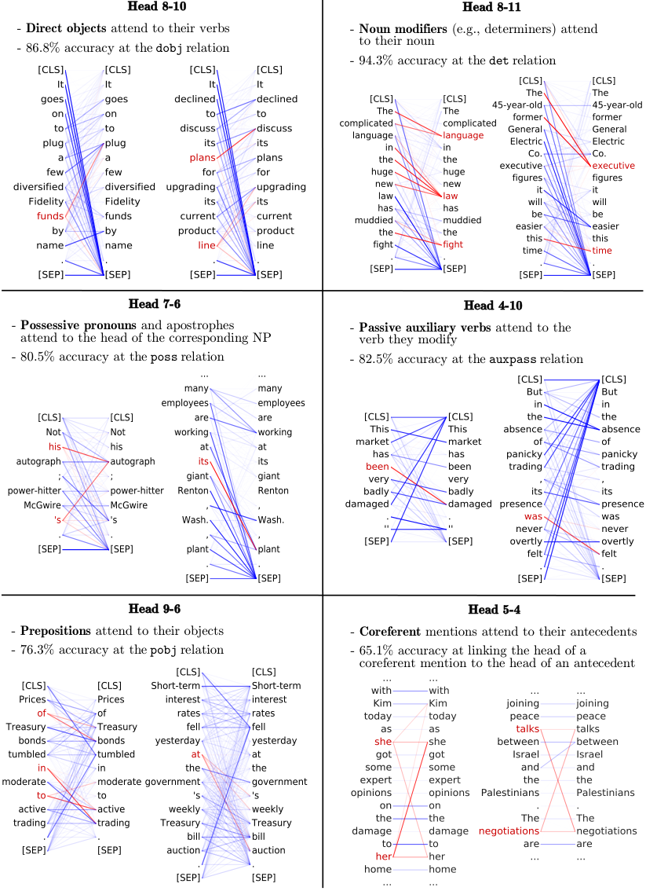
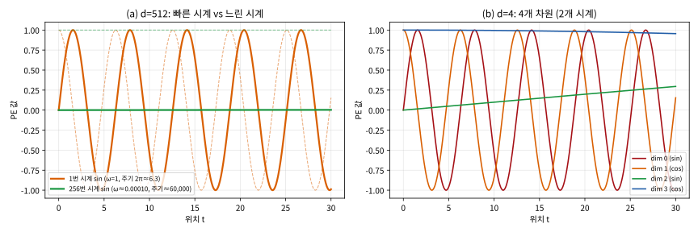
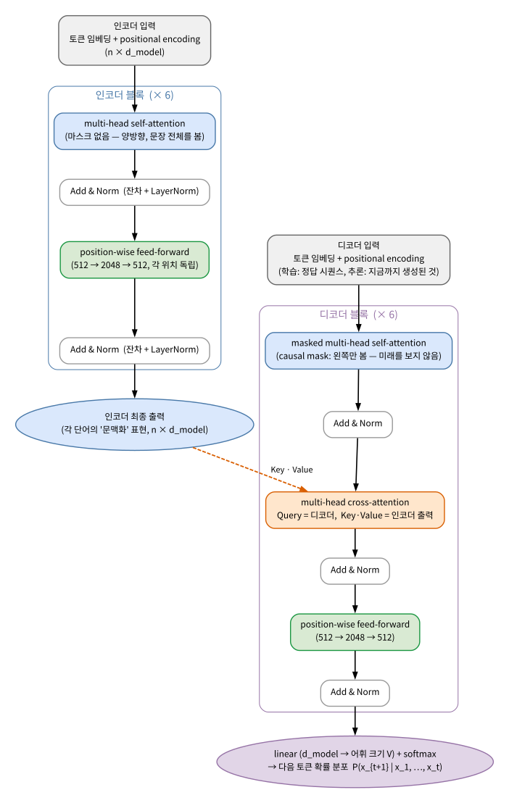

# 12.3 Multi-Head Attention과 Positional Encoding

[](https://colab.research.google.com/github/SuminHan/book-ml/blob/main/notebooks/ml1/chapter12_3_multihead_positional.ipynb)

### Multi-Head Attention

Q, K, V를 한 세트만 쓰는 대신, 여러 세트("헤드", head)를 병렬로 두고[^transformer]
각각 다른 관점의 관련성을 학습하게 한다 — 한 헤드는 문법적 관계(주어-동사)에,
다른 헤드는 의미적 관계(동의어)에 집중하는 식으로 역할이 나뉘는 경향이
관찰된다. 여러 헤드의 결과를 이어붙인(concatenate) 뒤 다시 한 번
선형변환해서 최종 출력을 만든다.

Chapter 7.2에서 랜덤 포레스트[^breiman2001]가 "서로 다른 트리 여러 개의 다수결"로
단일 트리보다 안정적인 예측을 얻었던 것과 비슷한 직관이다 — 헤드
하나만으로는 한 종류의 관계만 포착할 수 있지만, 여러 헤드를 병렬로
두면 서로 다른 종류의 관계를 동시에 포착해서 합칠 수 있다. 다만
랜덤 포레스트의 트리들은 서로 독립적으로 무작위성만으로 다양해지는
반면, 멀티헤드의 각 헤드는 역전파를 통해 "서로 다른 역할을 맡는 것이
전체 손실을 줄이는 데 유리하다"는 방향으로 스스로 분화한다는 차이가
있다.

**왜 헤드 하나가 부족할까 — "크기"의 문제가 아니라 "관점"의 문제.**
한 개의 어텐션 헤드는 단어 쌍마다 **점수(내적) 하나**를 만든다 — 그
하나의 숫자가 그 쌍의 *모든* 관계를 짊어져야 한다. 그런데 실제
언어에서 "단어 i와 j가 얼마나 관련 있는가"는 여러 독립적 요인의
합이다: 문법적 관계(주어-동사, 대명사-선행사), 의미적 관계(동의어,
상위어), 위치적 관계(바로 앞의 단어), 문장부호 등. 두 요인이
**거의 반대 방향**으로 작용하는 쌍이 항상 존재한다 — "그것은"은
문법적으로는 "동물"을 봐야 하지만(선행사), "도로"와 문맥상 더
가깝게 쓰일 수도 있다(의미). 한 개의 점수는 이 둘을 한 숫자로
**타협**해야 하지만, 두 개의 헤드는 각자 하나의 요인에 *전부*
집중할 수 있다 — 헤드가 두 개라 "타협 대신 전담"이 가능해지는
것이다.

기하학적으로도 이 주장을 날카롭게 쓸 수 있다. 12.2절의 볼록성 논리
를 떠올리면, 한 헤드는 각 단어에 대해 V 원행들의 **볼록 결합
하나**(볼록 껍질 안의 점 하나)를 만든다. 한 개의 헤드로는 각
단어에 "하나의 혼합 비율"만 표현되지만, h개의 헤드는 "V₁·V₂를
이 비율로 섞은 것"과 "V₃·V₄를 저 비율로 섞은 것"을 **서로
독립적으로** 표현할 수 있다 — 표현 가능한 영역이 단일 볼록
결합에서 여러 부분공간의 볼록 결합의 *직합(direct sum)*으로
넓어진다. (랜덤 포레스트 비유를 다시 읽어보면, 단일 트리가
"한 번의 투표"라면 포레스트는 여러 투표의 *병합* — 그리고 헤드
들도 마찬가지로 "한 관점의 투표를 여러 개 붙여 놓는" 것이다.)

**멀티헤드 공식.** 모델 차원 \\(d\_{model}\\)을 \\(h\\)개의 헤드에
나눠, i번째 헤드는 \\(d\_k = d\_{model}/h\\) 차원의 Q, K, V 위에서
12.2절의 어텐션을 계산한다:

\\[
\text{MultiHead}(Q,K,V) = \text{Concat}(\text{head}\_1, \dots, \text{head}\_h)\\, W\_O,
\qquad \text{head}\_i = \text{Attention}\\!\left(QW\_i^Q,\\; KW\_i^K,\\; VW\_i^V\right)
\\]

- \\(W\_i^Q, W\_i^K \in \mathbb{R}^{d\_{model} \times d\_k}\\),
  \\(W\_i^V \in \mathbb{R}^{d\_{model} \times d\_v}\\): **헤드별**
  투영 행렬 — 각 헤드가 "무엇과 무엇을 비교할지"(Q·K)와
  "무엇을 전달할지"(V)를 *각자* 학습한다(12.1절의 Q/K/V 삼분
  구조가 헤드마다 하나씩 있다는 뜻).
- \\(W\_O \in \mathbb{R}^{h d\_v \times d\_{model}}\\): 이어붙인 결과를
  다시 \\(d\_{model}\\) 차원으로 — "각 헤드의 정보를 어떻게 섞어
  다음 층에 줄지"를 결정하는 최종 선형변환.

**\\(d\_{model}\\)을 h로 나눈 이유 — 헤드를 "크게" 만드는 것이
아니라 "다" 만드는 것이다.** 헤드 수를 늘리되 헤드당 차원을 줄이지
않으면(각 헤드도 \\(d\_{model}\\) 차원 그대로), QKV 파라미터가
헤드 수만큼 *배*로 늘어난다. \\(d\_k = d\_{model}/h\\)로 나눠야
파라미터 수가 **단일 헤드와 (거의) 같다**:

\\[
\underbrace{h \times 3 \times d\_{model} \times \frac{d\_{model}}{h}}\_{\text{h 헤드의 QKV 합계}}
= 3\\, d\_{model}^2 \\;=\\; \underbrace{3 \times d\_{model} \times d\_{model}}\_{\text{단일 헤드 QKV}}
\\]

\\(d\_{model}=512, h=8\\)으로 숫자를 대면: \\(8 \times 3 \times 512
\times 64 = 786{,}432 = 3 \times 512 \times 512\\) — **정확히
같다**. (여기에 \\(W\_O\\)(512×512 = 262,144)만 더해진다.)
즉 멀티헤드 설계는 **파라미터 비용을 거의 그대로 유지한 채
독립적 관점의 수를 h배로 사는** 것 — 더 많은 파라미터가 아니라
*같은* 파라미터를 재배분하는 설계다. (이것이 12.2절의 "자주
하는 실수"에서 짚었던 "\\(d\_k\\)는 임베딩 차원이 아니라 헤드당
Key 차원"이라는 사실의 설계적 귀결이기도 하다 — \\(d\_k\\)를
별로 정할 수 있게 되는 순간, "헤드당 비교 차원"이 자유 변수가
된다.)

**손으로 한 번: 같은 입력, 서로 다른 "관점"의 두 헤드.**
단어 2개(임베딩 \\(x\_1=(1,0),\\; x\_2=(0,1)\\)) 예에서 두 헤드를
직접 설계해보자. 헤드 A는 \\(W\_Q = W\_K = W\_V = I\\)(12.2절의
"자기 주입" 헤드 — 각 단어가 자기 자신에 높은 점수를 주는
패턴), 헤드 B는 그것과 **\\(W\_K\\) 하나만**
\\(\begin{pmatrix}0&1\\\\1&0\end{pmatrix}\\)(두 차원을 바꾸는
행렬)로 달라도, \\(Q=K=V=X\\)에서 \\(K\\)만 이 행렬을 거치면
각 단어가 *다른* 단어의 Key와 더 잘 맞게 되어 "이웃 우선"
헤드가 된다:

| 헤드 | \\(W\_K\\) | 어텐션 가중치 (행=Query) | 읽기 |
|---|---|---|---|
| A (자기) | \\(I\\) | (0.670, 0.330) / (0.330, 0.670) | 각 단어가 **자기 자신**에 67% |
| B (이웃) | \\(\begin{pmatrix}0&1\\\\1&0\end{pmatrix}\\) | (0.330, 0.670) / (0.670, 0.330) | 각 단어가 **다른 단어**에 67% |

두 행렬은 **완전한 미러**다 — A 헤드의 "자기 우위" 방향이 바로
B 헤드의 "이웃 우위" 방향. V가 같은데도 **출력이 다르다**:
헤드 A의 단어 1 출력 = \\([0.670, 0.330]\\)인데, 헤드 B의 단어
1 출력 = \\([0.330, 0.670]\\) — 가중치가 반대라 섞임 비율이
뒤집힌 것이다. \\(W\_O = I\_4\\)(연결만 하고 더 이상 섞지 않는
가장 단순한 경우)로 이어붙이면, 단어 1의 4차원 출력은
\\([0.670,\\; 0.330,\\; 0.330,\\; 0.670]\\), 단어 2는
\\([0.330,\\; 0.670,\\; 0.670,\\; 0.330]\\). 읽어보면: 앞 2차원
(헤드 A)은 "단어 1의 자기는 V₁, 단어 2의 자기는 V₂"라는
사실을, 뒤 2차원(헤드 B)은 "단어 1의 이웃은 V₂, 단어 2의
이웃은 V₁"이라는 **다른** 사실을 담고 있다. 단일 헤드의 2차원
출력은 이 두 사실 중 **하나**만 담을 수 있었는데, 멀티헤드는
두 사실을 **같은 벡터 안의 서로 다른 부분공간**에 나란히 넣었다.
(실제 학습에서는 이 "자기 헤드"와 "이웃 헤드를 누가 맡을지"를
사람이 설계하지 않는다 — 아까 랜덤 포레스트 비유의 마지막
대조가 여기서 실체로 돌아온다: 손실이 줄어드는 방향으로
역전파가 각 헤드의 \\(W\_i^Q, W\_i^K, W\_i^V\\)를 *스스로*
다른 역할로 벌려놓는다.)

**그런데 왜 "이어붙이기(concatenate)"인가? "합치기"면 되지 않나?**
첫 번째 직감은 "h개 헤드의 출력을 평균하면 되는 거 아닌가"일
것이다. 안 된다 — 이어붙이는 이유와 *동일한* 이유로: 합하면
h개 헤드의 정보가 다시 하나의 벡터로 **재혼합**되어 "각 헤드의
독립적 관점"이 희석된다. 아까 미러 예에서 이 희석의 결과를
숫자로 바로 볼 수 있다 — 두 헤드의 출력을 *더하면*,
단어 1 = \\([0.670,0.330]+[0.330,0.670] = [1.0, 1.0]\\),
단어 2도 = \\([1.0, 1.0]\\) — **두 단어의 출력이 정확히
같아진다!** 미러였던 두 관점이 합산되는 순간 "이 단어와 저
단어가 다르다"는 정보가 *소거*된 것이다. 이어붙임은 각 헤드
출력을 **서로 다른 차원(부분공간**)에 두어 이런 소거를 막고,
\\(W\_O\\)가 "출력 차원 j는 i번째 헤드의 몇번째 성분을 얼마
신뢰할지"를 결정하게 한다 — 즉 "관점의 조합"을 다음 층(피드
포워드로)이 결정하도록 자유도를 남겨둔다. (실제 학습된
\\(W\_O\\)를 들여다보면 대각선 근방의 "출력 차원 j ← 헤드 i의
k번째 성분" 같은 희소 패턴이 자주 관찰된다 — 각 출력 차원이
"특정 헤드의 특정 관점"을 담당하는 모습.)

![세 단어 [개, 고양이, 쫓는다]에 대해 패턴이 서로 다른 3개 헤드의 어텐션 가중치 행렬. (a) 자기-우위 헤드(Q=K=V, 자기 주입으로 대각선 우세), (b) 위치-유사 헤드(Key를 1위치 순환 시켜 "다음 단어"에 집중), (c) 역할 없음(균일 0.333) — 학습된 모델에는 (a)(b) 같은 서로 다른 패턴의 헤드들이 실제로 공존한다](../../images/ch12_3_multihead_weights.svg)

**그림 한 장으로 "헤드가 서로 다른 패턴"을 이해하자.**
위 미러 예는 2단어라 단순하지만, 3단어 [개, 고양이, 쫓는다]
(각 임베딩 2차원, 노름 3)에서 패턴이 다른 3개 헤드를 그려보자
(아래 그림, 실습 노트북 실험 2). (a) **자기-우위 헤드**:
Q=K=V로 self-attention — 12.2절의 "자기 주입" 효과(자기
자신과의 내적 \\(\\|q\_i\\|^2\\)가 최대)로 대각선이 우세
("개" 0.78, "고양이" 0.74, "쫓는다" 0.93의 자기 가중치).
(b) **위치-유사 헤드**: *Key만* 1위치 순환 이동(\\(K\_i = E\_{i+1}\\))
— 그러면 각 단어는 **다음 단어**의 Key와 가장 잘 맞아, "개"→고양이
0.78, "고양이"→쫓는다 0.74, "쫓는다"→개 0.93으로 *위상(순서)*
정보가 가중치에 새겨진다. (c) **역할 없음**: 모든 Key를
\\((1,1)\\)로 — 모든 가중치가 0.333으로 균일, "아직 아무 역할도
분화하지 못한" 헤드. 학습된 모델의 여러 헤드 중에 (a)형과 (b)형에
해당하는 패턴이 실제로 공존한다는 것이 아래에서 보듯 관측
사실이다.

**역사: 헤드들이 정말로 "역할을 나눈다"는 것은 관측된 사실인가?**
네 — "인터프리테이빌리티"[^bertinterpretability] 연구로 실제로 확인된 바 있다. 2018년
Clark·Khandelwal·Levy·Manning의 "What does BERT look at?"[^bertbert]
연구는 BERT[^bert]의 어텐션 헤드를 하나씩 분석했는데, (1) **바로 앞
단어만** 보는 "위치 헤드", (2) **같은 품사**의 단어끼리 집중하는
헤드, (3) **문법적 통사(주어-구문**)를 추적하는 헤드가 각각
분명히 존재함을 보였다 — 이번 절 도입부가 "경향이 관찰된다"고
한 것이 바로 이런 관측들이다. 부수적 결과도 있다: 헤드의 50~60%
를 *임의*로 제거해도 성능 저하가 매우 작다 — 역할 분화는 실제로
있으면서도, 헤드끼리 **여분(여분, redundancy**)이 크다는 뜻.
(이 "여분" 때문에 추론 속도를 내기 위한 헤드 프루닝(head
pruning)이 실무 기법으로 쓰인다[^heads16]. 다만 주의: *어떤* 헤드가
*어떤* 역할을 맡는가는 학습 run마다 달라 — "이런 종류의 역할이
존재한다"가 안정적이지, "3번 헤드가 대명사 담당이다"는 아니다.)



**참고: 헤드 수는 얼마가 적당할까?** 2017년 원논문의[^transformer] 파라미터
변동(ablation) 표를 보면, 헤드를 8개에서 **1개로 줄이면**
BLEU가 약 1점 떨어진다(EN-DE 24.16 → 23.48, EN-FR 38.19 →
37.19) — "관점 하나만"이면 눈에 띄게 손해. 반대로 8개를 더
늘여도 이득은 미미하다 — 관점 다양성에 **감소수익**이 있는
것이다. 헤드당 차원(\\(d\_k = d\_{model}/h\\))이 너무 작아지면
(예: \\(d\_{model}=512, h=32\\)이면 \\(d\_k=16\\)) 각 헤드의
"관점 공간"이 역할을 담기엔 너무 얇아져 이득이 사라진다. 현재
대형 LLM(GPT[^gpt], LLaMA[^llama] 등)은 헤드를 수십~100개 이상 쓰지만,
\\(d\_{model}\\)이 4096~8192로 *비례*로 커진 덕분이며,
**헤드당 차원은 여전히 64~128 부근** — 2017년 설계가 그대로
살아 있는 값이다.

### Positional Encoding: 순서 정보는 어떻게 넣는가

어텐션 연산 자체는 순서를 전혀 구분하지 않는다 — \\(QK^T\\)는 단어들의
순서를 뒤섞어도 각 쌍의 관련도 자체는 똑같이 계산된다(집합처럼 취급).
그런데 "강아지가 고양이를 쫓는다"에서는 순서가 의미를 바꾼다. 그래서
Transformer는 각 단어의 임베딩에 그 단어의 위치 정보를 담은 벡터
(positional encoding, 사인/코사인 함수로 만든 고정된 패턴)를 **더해서**
넣는다 — 이러면 같은 단어라도 위치가 다르면 입력 벡터 자체가 달라지므로,
어텐션이 간접적으로 순서를 활용할 수 있다.

**"두 문장이 같은 출력을 낸다"는 것을 먼저 *증명*하자.**
위 설명을 한 박자 더 강하게 — "어텐션은 순서를 구분 못 한다"는
말은 단순한 직관이 아니라, *코드로 확인할 수 있는 정리*다.
단어 3개 [개, 고양이, 쫓는다](임베딩 \\((1,0), (0,1), (2,0)\\))
와 그 앞 두 단어를 바꾼 [고양이, 개, 쫓는다]에 PE 없이
self-attention(\\(Q=K=V\\))을 적용하면, 두 문장의 어텐션
가중치 행렬은

\\[ W\_{\text{B}} = P\\, W\_{\text{A}}\\, P^T \\]

(**완전히** 같은 관계 — P는 1·2행을 바꾼 퍼뮤테이션 행렬)이고,
각 단어의 출력도 정확히 퍼뮤테이션된다: 문장 A에서 "고양이"의
출력은 \\([0.745,\\; 0.503]\\), 문장 B에서 "고양이"의 출력도
**\\([0.745,\\; 0.503]\\)** — *같은 단어의 표현이 위치에
무관하게 정확히 같다.* "누가 누구를 쫓는지"는 통째로 사라졌다
(구체적 숫자와 코드는 실습 노트북 실험 4). 자기 어텐션 전체
연산이 **퍼뮤테이션-등변(permutation-equivariant)** — 입력을
재배열하면 출력도 같은 방식으로 재배열 — 이므로, 순서 정보를
*어딘가*에 덧붙여 주지 않는 한 "개가 고양이를 쫓는다"와
"고양이가 개를 쫓는다"를 구분하는 것은 **수학적으로
불가능**하다. 이 정리가 이번 절 나머지(PE가 *왜* 그 형태인지)
의 출발점이다.

**PE의 수식.** 위치 \\(t\\)의 \\(d\_{model}\\)차원 벡터를, 짝수
차원에 사인·홀수 차원에 코사인을 두는 식으로 정의한다:

\\[ PE\_{(t,\\,2i)} = \sin\\!\left( \frac{t}{10000^{2i/d\_{model}}} \right),
\qquad PE\_{(t,\\,2i+1)} = \cos\\!\left( \frac{t}{10000^{2i/d\_{model}}} \right) \\]

차원 쌍 \\((2i, 2i+1)\\) 하나하나가 **"시계(clock)"** 하나다 —
주파수 \\(\omega\_i = 1/10000^{2i/d\_{model}}\\)의 사인/코사인
파동이 위치 \\(t\\)를 따라 *tock-tock*하는 것. 가장 작은
\\(d\_{model}=4\\)로 값을 써보면:

| 위치 \\(t\\) | \\(PE(t)\\) (d=4) |
|---|---|
| 0 | (0.000, 1.000, 0.000, 1.000) |
| 1 | (0.841, 0.540, 0.010, 1.000) |
| 2 | (0.909, −0.416, 0.020, 0.9998) |
| 10 | (−0.544, −0.839, 0.0998, 0.995) |

(1번 시계(앞 짝)는 \\(\omega=1\\)이라 빠르게, 2번 시계(뒤 짝)는
\\(\omega=0.01\\)이라 아주 천천히 돈다 — 첫 행에서 뒤 짝이
\\((0,1)\\)→\\((0.01,1)\\)→\\((0.02, 0.9998)\\)로 거의 제자리인
것과 대조.) \\(d\_{model}=512\\)이면 시계는 256개 — 가장 빠른
시계의 주기 약 \\(2\pi \approx 6.3\\), 가장 느린 시계의 주기
약 \\(60{,}000\\). 이 256개의 시계가 *모두를* 합치면, 수만
단어 범위 안의 서로 다른 위치마다 거의 유일한 512차원
패턴이 생긴다 — 2017년 모델이 512 길이의 문장을 다룰 수 있었던
이유이기도 하다.



**사인/코사인을 쓴 수학적 이유: "시계"와 회전 성질.**
한 시계 쌍을 보면, 위치 \\(t\\)의 패턴은 *각도 \\(t\omega\\)*에
있는 "시계 바늘"이다. 여기서 핵심 성질: **위치 \\(k\\)만큼
앞서는 것은, 시계 바늘을 각도 \\(k\omega\\)만큼 *돌리는 것*과
동일하다** — 즉, \\(\omega\\)에만 의존하는 *고정된* 2×2
회전행렬 \\(R(\omega)\\)가 존재해

\\[ PE\_{(t+k)} = R(\omega)^k \\, PE\_{(t)} \\]

가 성립한다(중학 수학의 "각도 \\(k\\) 회전 = 사인/코사인
가산 정리의 행렬 버전"). 2시계로 묶어 \\(R = \text{blockdiag}
(R(\omega\_1), R(\omega\_2))\\)로 쓰면, **\\(k\\)개의 위치
이동은 입력 벡터에 *선형 변환* \\(R^k\\)를 적용한 것과
정확히 같다.**

그것이 왜 좋은가? 원논문의 표현으로[^transformer]: "각 위치 \\(t\\)의 PE는
*상대 위치* \\(k\\)에 대한 **선형 함수**로 표현된다"
(\\(PE\_{(t+k)}\\)의 각 성분이 \\(PE\_{(t)}\\)의 성분들의
선형 결합이고, 그 결합 계수는 \\(k\\)에만 의존). 즉 **어텐션의
선형 도구(Q·K 내적, \\(W\_O\\) 선형변환)만으로 "그 단어가 나
보다 \\(k\\)칸 뒤"라는 *상대* 관계를 읽을 수 있다** — "절대
위치 7"이 아니라 "그 단어와의 *거리 3*"이 학습 대상이 되는
것이다. 실습 노트북 실험 5에서 이 등식과, 그에 수반되는
*차분* 성질 \\(PE\_{(t+k)} - PE\_{(t)} = (R^k - I)\\,PE\_{(t)}\\)
(차분은 *절대 위치 \\(t\\)에 무관하고* \\(k\\)만 담는 패턴을
만듦)를 \\(t=3, k=2\\)에서 양쪽을 계산해 *정확히* 일치하는
것을 확인한다. (절대 시계만 있었다면 모델은 "내가 7번째"만
알고 "그것과 3번째 차이"를 *계산*할 도구가 없었을 것이다.)

**왜 "더하기"인가 — 그리고 왜 고정된 함수인가.** (1) 임베딩에
**더하면** 총 차원이 \\(d\_{model}\\) 그대로라, 12.1절 이후의
모든 행렬 크기(\\(W\_Q, W\_K, W\_V\\)의 크기)와 파라미터 예산이
*변하지 않는다*. (붙여 넣는 concatenate도 변형으로 가능하지만
차원이 두 배가 되는 비용이 있다.) (2) **학습하지 않고 고정
함수를 쓰는** 이유는 FAQ 두 번째에서 상세히 하지만, 한 줄로
— 학습된 위치 임베딩은 "학습 때 본 최대 위치"가 정의의 경계인
반면, \\(\sin(t/10000^i)\\)는 *아무* \\(t\\)에도 정의된다.
(원논문은[^transformer] 학습된 위치 임베딩도 *실제* 시도해 봤고, 결과
차이는 거의 없었으나, "더 긴 문장 외삽(extrapolation)"
가능성을 이유로 사인/코사인 버전을 택했다고 명시한다 — 아래
FAQ 참고.)

### 자주 하는 실수: Positional Encoding을 빼먹고 어텐션만 쓰기

12.2절 실습에서 쓴 `attention` 함수를 그대로 문장 두 개 —
"강아지가 고양이를 쫓는다"와 "고양이가 강아지를 쫓는다" — 에 적용하면
어떻게 될까? 두 문장은 같은 세 단어(강아지, 고양이, 쫓는다)로
이루어져 있으므로, 각 단어의 임베딩이 위치와 무관하게 고정되어 있다면
(positional encoding 없이) **두 문장에 대해 완전히 동일한 어텐션
가중치와 출력이 나온다** — "누가 누구를 쫓는지"가 통째로 사라지는
것이다. 이는 Chapter 11.1 도입부에서 지적한, MLP/CNN에 단어를 그냥
벡터 집합으로 넣었을 때 순서 정보가 사라지는 문제가 어텐션에서도
**형태만 바뀐 채 그대로 재발**한 것이다 — RNN은 순차 처리 구조 자체가
순서를 암묵적으로 인코딩했지만, 어텐션은 병렬 처리를 얻은 대신 그
암묵적인 순서 정보를 잃었고, positional encoding으로 그걸 명시적으로
다시 넣어줘야 한다. 실전에서 트랜스포머 구조를 처음부터 구현할 때
이 단계를 빼먹으면, 모델이 학습되긴 하지만 어순에 둔감한 이상한
결과를 낼 수 있다.

*위 "증명" 섹션의 3단어 실험이 정확히 이 실수의 정량화*다 —
PE를 넣자 같은 문장에서 "쫓는다"의 가중치 행이 (0.187, 0.045,
0.768)에서 (0.013, 0.008, 0.979)로 *달라진다* — 같은 단어라도
**위치에 따라 어텐션이 달라진다**는 것, 이것이 PE가 실제로
하는 일이다(실습 노트북 실험 4).

### 보너스: Masked Attention — 디코더는 왜 "왼쪽만" 보는가

트랜스포머의 전체 구성에 필요한 조각이 하나 더 있다 — 어텐션
점수 행렬에 **마스크(mask**)를 하는 것. 디코더가 \\(t\\)번째
단어를 *만드는* 순간, \\((t+1)\\)번째 이후("미래")의 정보를
*보아서는 안 된다* — 실제 생성(추론) 시점엔 미래가 아직 존재
하지 않으므로, 학습 때만 미래를 보고 훈련하면 *학습과 추론이
불일치*한다(Chapter 6.1의 과적합 문제와 같은 종류). 해법은
단순하다: softmax *이전*의 원점수 행렬에서, 상삼각("미래"
위치)에 \\(-\infty\\)(실제로는 \\(-10^9\\) 같은 아주 작은 음수)를
*더한다* — \\(e^{-10^9} \approx 0\\)이므로 softmax 후 해당
위치의 가중치가 정확히 0이 된다. 3단어 예에서(실습 노트북
실험 6):

| 위치 | 마스크 *없*은 가중치 행 | 마스크 *있*(causal) 가중치 행 |
|---|---|---|
| 1 (개) | (0.284, 0.140, 0.576) | **(1.000, 0, 0)** |
| 2 (고양이) | (0.248, 0.503, 0.248) | (0.330, 0.670, **0**) |
| 3 (쫓는다) | (0.187, 0.045, 0.768) | (0.187, 0.045, 0.768) |

첫 번째 단어는 이제 *자기 자신*만 본다. 이 **causal(인과)
마스크**가 있는 덕분에, "학습"은 *모든 위치를 병렬로* 계산하되
각 위치가 *왼쪽만* 보는 것이 가능해진다 — **학습의 병렬성과
생성의 순차성을 하나의 마스크가 통일**한다. Chapter 13에서 다룰
LLM의 자기회귀(autoregressive) 생성은 정확히 이 메커니즘 위에
있다(디코더의 self-attention이 "masked attention" 또는 "causal
attention"이라 불리는 이유).

### 전체 트랜스포머 블록: 지금까지의 조각을 조립하면

12.1~12.3의 조각(Q/K/V 투영, scaled dot-product, self/multi-head,
PE, causal mask)을 조립하면, **트랜스포머 블록(transformer
block**)이 완성된다:

1. **multi-head self-attention** (+ 잔차 연결, layer norm[^layernorm])
2. **position-wise feed-forward network**: 각 위치의 벡터를 *독립적으로*
   2층 MLP(\\(d\_{model} \to 4\\,d\_{model} \to d\_{model}\\))에
   통과 (+ 잔차 연결, layer norm)

2017년 논문은 인코더에 이 블록을 **6개** 쌓고, 디코더에는 변형
(masked self-attention + 인코더 출력에 대한 *cross*-attention을
추가)을 6개 쌓는다. 두 가지 "왜?"를 짚자:

- **잔차 연결 \\(y = x + F(x)\\)은 10.2절의 ResNet**[^resnet]과 같은
  구조다 — 여기서는 6~12층을 쌓아 그래디언트 경로가 길어지는
  상황에서 그 "단축로" 역할이 더 중요해진다(Chapter 11의
  소실 그래디언트 문제와 같은 맥락). layer norm은 ResNet의
  batch norm[^batchnorm]과 비슷한 "층마다 스케일을 정규화"
  역할(Chapter 6.2의 정규화 논리 참조).

- **왜 attention 뒤에 "position-wise FFN"이 필요한가?**
  self-attention은 *단어 *사이*의 정보를 섞는* 연산이지만,
  그 연산 자체는 **선형**이다(점수 \\(QK^T\\), 가중합
  \\(AV\\) 모두 선형 — Chapter 9.2의 "선형만으로는 접을 수
  없다" 기억하자). *섞은 결과*에 비선형 변환을 적용하는
  역할이 FFN의 몫이다. 즉 attention은 **"어떤 정보를, 어떤
  단어끼리, 얼마나 섞을지**"를, 그 뒤의 FFN은 **"섞인
  정보를 어떻게 *처리*할지**"를 담당한다 — 9장 이후
  반복된 "선형 + 비선형" 논리의 또 다른 실체.



**참고: 파라미터 스케일의 감각.** base 모델(\\(d\_{model}=512\\),
6 블록)에서 한 블록의 파라미터 대부분은 attention(QKV+\\(W\_O\\)
합계 약 39만)보다 **FFN**이 차지한다(512→2048→512 =
\\(2 \times 512 \times 2048 \approx 210\\)만). "트랜스포머의
지식이 어디에 있는지"를 찾는 연구(예: FFN을 "키-값 메모리"로
본 해석들[^geva2020])에서, 사실상의 대부분이 FFN의 가중치에 담겨 있다는
관찰이 이 비율과 맞닿아 있다.

### RNN 대비 이점

Self-attention은 모든 단어 쌍을 **한 번에** 병렬로 계산한다 — 순차적으로
처리할 필요가 없어 GPU 병렬성을 최대한 활용하고, "1번째 단어와 100번째
단어의 관련성"도 중간 99단계를 거치지 않고 직접 계산된다(그래디언트 소실
문제가 구조적으로 훨씬 덜하다). 대신 문장 길이의 제곱에 비례하는
계산량(\\(QK^T\\)가 \\(n \times n\\) 행렬)이라는 새로운 비용이 생긴다 —
이건 아주 긴 문서를 다룰 때의 실무적 한계로 이어진다.

| 관점 | RNN/LSTM (Ch.11) | Self-Attention (Ch.12) |
|---|---|---|
| 1번째 → 100번째 단어 경로 | 99 단계(순차 언폴딩) | **1 단계**(Q·K 직접) |
| 병렬성 | 없음(순차 필수) | 모든 쌍 동시 |
| 긴 거리 의존 | BPTT로 그래디언트 소실 | 구조적으로 없음(경로 항상 1) |
| 계산 복잡도(문장 길이 \\(n\\)에 대해) | \\(O(n \cdot d^2)\\) (선형) | \\(O(n^2 \cdot d)\\) (제곱) |
| 순서 정보 | *암묵적*(순차 구조 자체가) | *명시적*(PE를 입력에 추가) |

마지막 행이 앞 네 행의 **대가(trade-off**)다 — 병렬성과
경로 길이 이점을 *사면*, 그 대가로 (1) 제곱 계산량과 (2)
"순서를 *스스로* 인코딩해야 하는" PE라는 명시적 장치 두 가지를
받는다. RNN은 순서 정보를 *계산 구조 안에* 숨겼고(대가: 순차성
+ 소실), 어텐션은 *입력 안에* 넣었다(대가: \\(n^2\\) + PE
설계). 두 구조는 같은 "순서" 정보를 *다를 곳에* 둔 것이다.

**"모든 단어를 한 번에 보고, 서로의 관련성을 직접 계산한다"는 이 아이디어
하나가 지난 몇 년간 딥러닝을 가장 크게 바꾼 변화다.** 더 깊이 보고
싶다면 이 주제를 NLP 관점에서 계속 다루는 스탠포드 CS224N 강의도
참고할 만하다[^cs224n].

### 확인 문제

**1. (계산 — 파라미터 동일성)** \\(d\_{model} = 512, h = 8,
d\_k = d\_v = 64\\)일 때, (a) h개 헤드의 QKV 파라미터 총합
(\\(h \times 3 \times d\_{model} \times d\_k\\))을 계산하고, 단일
헤드 QKV(\\(3 \times d\_{model}^2\\))와 *정확히* 같은지 확인하라.
(b) \\(W\_O\\)(\\(512 \times 512\\))까지 포함하면 총합은 얼마가
되고, 이는 단일 헤드에 \\(W\_O\\)를 추가한 것과 *비교*하면 어떤가?
(힌트: (a)는 786,432 = 3×512², (b)는 786,432 + 262,144 =
1,048,576 = \\(4 \times 512^2\\).)

**2. (개념 — "합치면" 왜 안 되는지 숫자로)** "손으로 한 번"의
미러 예(헤드 A 자기 / 헤드 B 이웃)에서, 두 헤드의 출력을 *더하면*
단어 1과 단어 2의 출력이 **정확히 같아짐**([1.0, 1.0])을 확인
하라. 이 "소거"가 *왜* 일어났는지 — "서로 다른 관점"이 같은
차원에서 *같은 크기의 반대 성분*을 가진 경우 — 1~2문장으로
설명하고, 이어붙임이 이 문제를 *구조적으로* 피하는 이유를 덧붙이라.

**3. (계산 — PE의 회전 성질)** \\(d\_{model}=4\\)의 1번 시계
(\\(\omega=1\\))에 대해, \\(PE(3)\\)의 앞 2성분
\\((\sin 3, \cos 3) \approx (0.141, -0.990)\\)에 회전행렬
\\(R(1) = \begin{pmatrix}\cos 1 & \sin 1\\\\ -\sin 1 & \cos
1\end{pmatrix} \approx \begin{pmatrix}0.540 & 0.841\\\\ -0.841 &
0.540\end{pmatrix}\\)을 곱해 보라. 결과가 \\(PE(4)\\)의 앞
2성분 \\((\sin 4, \cos 4) \approx (-0.757, -0.654)\\)와 일치
하는지 확인하라. (이것이 \\(PE\_{(t+1)} = R(\omega)\\,PE\_{(t)}\\)
의 직접 확인 — "1위치 이동 = 1라디안 회전".)

**4. (개념 — RNN 대비, 비교표의 마지막 행)** 비교표의 마지막 행
("순서 정보: RNN은 암묵적, 어텐션은 명시적")을 중심으로, *왜*
RNN은 PE 같은 장치가 *불필요*했고 *왜* 어텐션에는 *필요*한지 —
두 구조가 "순서"를 *어디에* 두는지(계산 구조 vs 입력 벡터)를
대조해 2~3문장으로 서술하라. (힌트: RNN의 \\(t\\)번째 은닉
상태는 1~\\(t\\)번 *경로를 거치는* 과정 그 자체에 순서가
코딩되어 있다 — 대가는 순차성. 어텐션은 *경로 없이* 병렬이라,
순서를 *입력 자체에* 새겨 넣어야 한다.)

### 자주 묻는 질문

**Q. 문장 길이의 제곱에 비례하는 계산량이 실전에서 얼마나 문제가
되나요?** 문장이 1,000단어면 \\(1000^2=100\text{만}\\) 쌍, 10,000단어면
\\(1\text{억}\\) 쌍을 계산해야 한다 — 길이가 10배 늘면 계산량은 100배
늘어난다. 이 때문에 아주 긴 문서(책 한 권 분량)를 다루는 LLM은 이
제곱 비용을 줄이는 다양한 근사 기법(희소 어텐션[^sparsetransformer], 슬라이딩 윈도우 등)을
함께 쓴다 — Chapter 13에서 LLM을 다룰 때 이 한계가 실전 문맥
길이(context length)에 어떤 제약을 주는지 다시 언급한다.

**Q. Positional encoding은 왜 학습하지 않고 고정된 사인/코사인
함수를 쓰나요?** 학습 가능한 위치 임베딩을 쓰는 것도 가능하고 실제로
쓰이지만(예: BERT[^bert]), 사인/코사인 기반 고정 인코딩은 학습 데이터에서 본
적 없는 더 긴 문장에도 자연스럽게 확장된다는 장점이 있다 — 학습된
위치 임베딩은 학습 때 본 최대 길이를 넘어서면 정의조차 안 되지만,
수학 함수는 어떤 위치값에도 정의되기 때문이다.

**Q. "헤드가 역할 분화를 한다"는 말, 2개만 있으면 8개가 필요한
이유 — 구체적으로 뭐가 달라지나요?** (a) *표현력*: 한 헤드는 각
단어 쌍에 *하나의* 점수만 주므로, 두 독립적 요인(문법 vs 의미)을
*하나의* 숫자로 타협해야 한다 — 두 요인이 *반대 방향*이면 그
타협은 둘 다 *부정확*해진다. 두 개(이상의) 헤드는 각 요인에
*전담*할 수 있다. (b) *수치적 증거*: 2017년 ablation(상기)과,
BERT 해석 연구의 "50~60% 헤드 제거해도 성능 유지" — 헤드가
*여럿*이어야 "여러 역할의 공존 + 여분"이 성립한다. (c) *학습
역학*: 단일 헤드는 *하나의* 역할을 학습해야 하므로 그 역할에
합치하는 경사만 받지만, 여러 헤드는 *서로 다른* 역할을 *경쟁
없이* 각자 학습할 수 있다(역전파가 "헤드 i는 이 방향, 헤드 j는
저 방향"으로 *분화*시키는 힘 — 랜덤 포레스트의 "무작위
다양성"에 해당하는 것이 여기서는 *손실 기반 분화*).

**Q. PE가 고정되어 "학습하지 않는"데, 모델은 "위치"를 실제로
*배우는* 건가요?** 학습되는 것은 *PE의 형태*가 아니라 *PE를
*활용*할* 방법이다. PE는 "지도에 좌표를 찍어 주는" 고정 장치
이고, 모델이 학습하는 것은 *"좌표가 이런(상대) 관계로 다를 때
어텐션 점수를 이렇게 준다"*는 *가중치*
(\\(W\_Q, W\_K, W\_O\\) 안의 패턴)다. 회전 성질(\\(PE\_{(t+k)} =
R^k PE\_{(t)}\\)) 덕분에 *상대* 거리 \\(k\\)가 *선형 도구*로
읽힐 수 있어, 이 가중치가 "3칸 뒤의 단어" 같은 *상대* 관계를
학습할 수 있다. — "PE는 고정, *PE를 쓰는 가중치*가 학습"이라는
구분이 핵심이다.

**Q. 사인/코사인이 "아무 위치에도 정의"되므로, 512로 학습한
모델이 1000 길이를 *자동으로* 처리할 수 있는 건 아닌가요?**
*아니다* — 주의할 뉘앙스다. "정의된다"는 *PE 벡터 자체*가
\\(t>512\\)에서도 *유효한(비 NaN) 숫자*를 낸다는 뜻이지, *그
위치에서의 어텐션 동작*이 학습되었다는 뜻은 *아니다*. 512까지
학습한 모델이 1000 길이를 보면, 512~1000 위치의 PE는 "정상
숫자"이지만 *그 위치에서 어떻게 어텐션할지*는 학습 *부족*한
영역이다 — 그래서 *실제* "장문 컨텍스트" LLM(LLaMA-2 4K, GPT-4
128K 등)은 단순 PE 외삽이 *아니라* *추가 학습*(위치 보간[^posinterpolation],
컨텍스트 연장 미세조정 등)이 필요하다. "함수가 정의된다"와
"동작이 학습된다"는 *서로 다른* 두 문장이다(Chapter 13에서
다시).

**Q. RNN에도 "메모리(은닉 상태)"가 있는데, 어텐션이 대체한
것은 정확히 그 "메모리"인가?** RNN의 은닉 상태는 *순차 압축*된
"과거 요약" — \\(t\\)번째 상태가 1~\\(t\\)번을 *하나의* 벡터로
*구겨 넣은* 것. 어텐션은 *압축이 아닌 랜덤 접근*: *모든*
과거(과 미래, mask 없으면)에 *직접* 접근한다. "과거를 *담아
두는* 메모리(RNN 은닉 상태)"와 "과거에 *임의로 접근하는*
메커니즘(어텐션)"은 *다른* 두 장치이며, 어텐션이 *더 좋은*
것은 (1) GPU 병렬성과 (2) 경로 길이(→ 소실) — 12.1절 제목
"Attention Is All You Need"[^transformer]의 "All"이 정확히 이 두 가지
이점을 가리킨다.

---

## 연습문제

**1. (코딩)** 다음과 같은 함수 `scaled_dot_product_attention`을
완성하라(핵심 줄은 빈칸으로 남겨져 있다고 가정):

```python
import math

def softmax(row):
    m = max(row)
    exps = [math.exp(v - m) for v in row]
    total = sum(exps)
    return [e / total for e in exps]

def scaled_dot_product_attention(Q, K, V, d_k):
    # ADD ADDITIONAL CODE HERE!!
    # 1. scores[i][j] = (Q[i] . K[j]) / sqrt(d_k)
    # 2. weights = 각 행에 softmax 적용
    # 3. output[i] = weights[i]로 V의 가중합

    return output, weights

Q = [[1,0],[0,1]]
K = [[1,0],[0,1]]
V = [[10,0],[0,10]]
output, weights = scaled_dot_product_attention(Q, K, V, d_k=2)
print(weights)  # 각 단어가 "자기 자신"에 더 높은 가중치를 줌
```

**2. (개념 서술)** Self-attention이 RNN보다 그래디언트 소실에 덜 취약한
이유를, "1번째 단어와 100번째 단어 사이의 경로 길이"라는 관점에서
설명하라(Chapter 11의 BPTT와 비교).

**3. (손유도, Tier C — 폴백 준비 대상)** 단어 2개짜리 문장에 대해, 다음
벡터가 주어졌다: \\(Q = \begin{pmatrix}1 & 0\\\\ 0 & 1\end{pmatrix}\\),
\\(K = \begin{pmatrix}1 & 1\\\\ 1 & 0\end{pmatrix}\\), \\(V =
\begin{pmatrix}5 & 0\\\\ 0 & 5\end{pmatrix}\\)(\\(d\_k=2\\)).

\\(QK^T\\)를 손으로 계산하고, \\(\sqrt{d\_k}\\)로 나눈 뒤, 각 행에
softmax를 적용해 어텐션 가중치 행렬을 구하고, 마지막으로 \\(V\\)와의
가중합으로 최종 출력을 계산하라.

**빈칸채움형 폴백 버전**(자유 계산이 어려운 경우):

```
Step 1: QK^T 계산 (2x2 행렬)
  (QK^T)[0][0] = Q[0].K[0] = 1*1 + 0*1 = ______________
  (QK^T)[0][1] = Q[0].K[1] = 1*1 + 0*0 = ______________
  (QK^T)[1][0] = Q[1].K[0] = 0*1 + 1*1 = ______________
  (QK^T)[1][1] = Q[1].K[1] = 0*1 + 1*0 = ______________

Step 2: sqrt(d_k) = sqrt(2) ≈ 1.41 로 모든 원소를 나눈다
  scaled[0] = [______________, ______________]
  scaled[1] = [______________, ______________]

Step 3: 첫 번째 행에 softmax 적용
  exp(scaled[0][0]) = ______________  (계산기 사용)
  exp(scaled[0][1]) = ______________
  weights[0] = [______________, ______________]  (합이 1이 되도록 정규화)

Step 4: 출력[0] = weights[0][0] * V[0] + weights[0][1] * V[1]
       = [______________, ______________]
```

**정확성 확인**: 완성한 계산을 문제 1의
`scaled_dot_product_attention(Q, K, V, d_k=2)` 출력과 대조해 일치하는지
확인하라.

**4. (코딩 — 멀티헤드)** 12.2절의 `attention` 함수를 *멀티헤드*로
확장하라. \\(Q, K, V\\)(각 \\(n \times d\_{model}\\))를 \\(h\\)개
헤드로 잘라(각 헤드 \\(n \times d\_{model}/h\\)), 각 헤드에
attention을 적용한 뒤 결과를 이어붙여라. 검증: 단어 2개,
\\(d\_{model}=4, h=2\\), 임베딩 \\(x\_1=(1,0,1,0), x\_2=(0,1,0,1)\\),
\\(Q=K=V=X\\)로 놓으면 두 헤드는 *동일한* 2차원 입력(각
\\([[1,0],[0,1]]\\))을 받으므로 *동일한* 출력을 낸다 —
이어붙인 4차원 출력이 각 *절반이 같은* 2차원 벡터
(\\([0.670, 0.330, 0.670, 0.330]\\) / \\([0.330, 0.670, 0.330,
0.670]\\))이 되는지 확인하라. (이것이 "헤드가 *동일*하면
이어붙임이 *쓸모없다*" — 관점의 *차이*가 멀티헤드의 전부임을
숫자로 보여준다.)

**5. (개념 서술 — causal mask의 "학습/추론 일치")** "보너스:
Masked Attention"의 마스크를 이용해, (a) "softmax *이전*에
\\(-\infty\\)를 더하면 *정확히* \\(t\\)번째 위치가 \\(\le t\\)
위치만 본다"를 1~2문장으로, (b) 이것이 *왜* "학습 때의
\\(t\\)번째 출력"과 "실제 생성 때의 \\(t\\)번째 토큰"이 *동일한
정보*에 의존하게(train/test *일치*) 만드는지 1~2문장으로
설명하라. (힌트: (b)는 "학습 때 미래를 *보게* 하면, 추론 때
미래가 *없는* 상황이 *분포적으로* 달라져 모델이 학습 시
익숙하지 않은 상태에 처한다" — 과적합/분포 불일치의 관점.)

---

## 실습 노트북

이 절의 모든 수치 검증은 [Colab 노트북](https://colab.research.google.com/github/SuminHan/book-ml/blob/main/notebooks/ml1/chapter12_3_multihead_positional.ipynb)에서
다시 확인할 수 있다:

1. 두 헤드(자기 / 이웃)의 가중치가 *미러*임을 확인 + 이어붙임 4차원 출력
2. 3단어 [개, 고양이, 쫓는다]에 *패턴이 다른* 3개 헤드(자기/위치/균일)의
   어텐션 가중치 히트맵 3종 — "헤드가 서로 다른 패턴" 시각화
3. \\(d\_{model}=4\\)의 PE 테이블(\\(PE(0), PE(1), PE(2), PE(10)\\)) +
   시계 파동 그래프(1번 시계 vs 256번 시계, d=512)
4. PE *없*는 [개, 고양이, 쫓는다] vs [고양이, 개, 쫓는다] —
   "같은 단어의 출력이 정확히 같음" + \\(W\_B = P W\_A P^T\\)
   (퍼뮤테이션-등변) 확인; PE *있*으면 달라지는 것 확인
5. PE 회전 성질 \\(PE\_{(t+k)} = R^k PE\_{(t)}\\)와 차분 성질
   \\(PE\_{(t+k)} - PE\_{(t)} = (R^k - I)PE\_{(t)}\\)의 수치 확인
6. causal mask — softmax 전에 상삼각에 \\(-10^9\\)를 더하면
   "왼쪽만" 보는 가중치 행렬

[^transformer]: Vaswani, A. et al. (2017). "Attention Is All You Need." arXiv:1706.03762.
[^bertbert]: Clark, K., Khandelwal, U., Levy, O., Manning, C. D. (2019). "What Does BERT Look At? An Analysis of BERT's Attention." BlackBoxNLP 2019. arXiv:1906.04341.
[^bert]: Devlin, J., Chang, M.-W., Lee, K., Toutanova, K. (2018). "BERT: Pre-training of Deep Bidirectional Transformers for Language Understanding." arXiv:1810.04805.
[^resnet]: He, K., Zhang, X., et al. (2015). "Deep Residual Learning for Image Recognition." arXiv:1512.03385.
[^batchnorm]: Ioffe, S., Szegedy, C. (2015). "Batch Normalization: Accelerating Deep Network Training by Reducing Internal Covariate Shift." arXiv:1502.03167.
[^cs224n]: Stanford CS224N: Natural Language Processing with Deep Learning. https://web.stanford.edu/class/cs224n/
[^layernorm]: Ba, J. L., Kiros, J. R., Hinton, G. E. (2016). "Layer Normalization." arXiv:1607.06450.
[^posinterpolation]: Chen, S., Wong, S., Chen, L., Tian, Y. (2023). "Extending Context Window of Large Language Models via Positional Interpolation." arXiv:2306.15595.
[^geva2020]: Geva, M., Schuster, R., Berant, J., Levy, O. (2020). "Transformer Feed-Forward Layers Are Key-Value Memories." EMNLP 2020. arXiv:2012.14913.
[^heads16]: Michel, P., Levy, O., Neubig, G. (2019). "Are Sixteen Heads Really Better than One?" ACL 2019. arXiv:1905.10650.
[^llama]: Touvron, H. et al. (2023). "LLaMA: Open and Efficient Foundation Language Models." arXiv:2302.13971.
[^breiman2001]: Breiman, L. (2001). "Random Forests." *Machine Learning* 45(1), 5–32. — 랜덤 포레스트의 원 논문. 배깅 + 특징 무작위화(각 분기에서 무작위 특징 하위집합)의 조합을 제안했다.
[^gpt]: Radford, A., Narasimhan, K., Salimans, T., Sutskever, I. (2018). "Improving Language Understanding by Generative Pre-Training." OpenAI 기술 리포트 (https://cdn.openai.com/research-covers/language-unsupervised/language_understanding_paper.pdf) — 대규모 텍스트로 언어모델을 사전학습(Generative Pre-Training)한 뒤 그 위에 다양한 과업을 미세조정하는 GPT 접근의 원 논문.
[^bertinterpretability]: Tenney, I., Kim, P., Smith, N. A. (2019). "What do you learn from context? Probing for sentence structure in BERT." ICLR 2019. arXiv:1905.05846. — "인터프리테이빌리티(해석 가능성)" 관점에서의 문장 통사 구조 탐지(probing) 연구로, BERT를 포함해 여러 어텐션 모델이 문법적 구조를 학습한다는 증거를 제시했다.
[^sparsetransformer]: Child, R., Gray, S., Radford, A., Sutskever, I. (2019). "Generating Long Sequences with Sparse Transformers." arXiv:1904.10509. — O(n²) 어텐션 비용을 줄이기 위한 희소 어텐션(경량 희소 패턴, 로컬·글로벌 토큰)과 슬라이딩 윈도우 마스크를 제안한 논문. (같은 문제의 또 다른 대표적 접근: Longformer — Beltagy, I., Peters, M. E., Cohan, A. (2020). "Longformer: The Long-Document Transformer." arXiv:2004.05150.)
