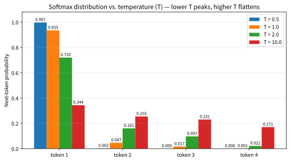
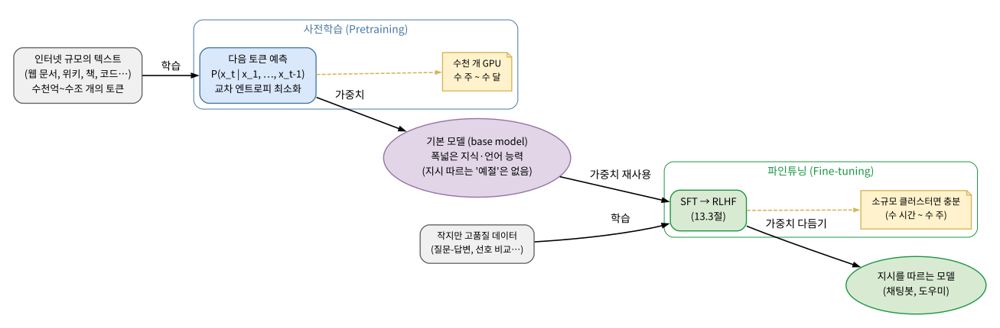

# 13.1 언어모델링: 다음 토큰 예측과 사전학습·파인튜닝

[](https://colab.research.google.com/github/SuminHan/book-ml/blob/main/notebooks/ml1/chapter13_1_next_token_lm.ipynb)

### 언어모델: "다음 토큰을 예측하는 함수"

LLM은 텍스트를 **토큰**(token)(단어 전체이거나, 더 흔하게는 단어의 일부
조각)의 시퀀스로 다룬다. 사전학습의 목표는 지금까지의 토큰들이 주어졌을
때, 다음 토큰의 확률분포를 예측하는 것이다:

\\[P(x\_t \mid x\_1, x\_2, \ldots, x\_{t-1})\\]

"프랑스의 수도는 ___"이라는 문장을 잘 완성하려면, 모델은 "파리"라는
사실을 어딘가에 담고 있어야 한다. 이런 문장이 수십억 개 쌓이면, "다음
단어 맞히기"라는 단순한 목표를 잘 해내기 위해 모델은 자연스럽게 문법,
사실 지식, 심지어 어느 정도의 추론 능력까지 습득하게 된다.

이 식이 왜 "언어모델(language model)"의 **정의**가 되는지 한 번
정리해 두자. 어떤 분포 \\(P(x\_1, \ldots, x\_n)\\)가 "이 문장만큼
그럴듯한 문장을 만들어내는 법"을 압축해 갖고 있다면, 그 분포는
"어떤 문장을 고르는 기준"으로서 언어 전체를 설명하는 것이 된다 —
이것이 바로 언어모델이다. 그리고 이 식의 우변, 즉 **조건부 확률의
사슬 분해**를 이용하면,

\\[P(x\_1, \ldots, x\_n) = \prod\_{t=1}^{n} P(x\_t \mid x\_1, \ldots, x\_{t-1})\\]

즉 "문장 전체의 확률"을 **한 토큰씩 예측하는 확률의 곱**으로
부서질 수 있다. 모델이 각 단계에서 "다음 토큰의 분포"를 잘 만들어준다면
그 곱이 곧 문장의 합리적인도를 재는 척도가 되고, 반대로 이 곱을
최대화하는 방향으로 학습하는 것이 곧 문장 전체를 잘 만들어내는 법을
배우는 것이다. "다음 토큰 예측"이 사소한 게임이 아니라, 문장 전체의
분포를 학습하는 것과 **정확히 동일한 과제**인 이유는 여기에 있다.
(이 사슬 분해는 Chapter 11에서 RNN으로 시퀀스를 모델링할 때, 각
시간 단계의 예측을 곱해서 문장 확률을 계산했던 것과 같은 수학적
근거다.)

이 확률은 Chapter 12에서 배운 Transformer(정확히는 미래 토큰을 보지
못하게 마스킹한 decoder-only Transformer)로 계산된다. 학습은 실제 다음
토큰과 예측 확률분포 사이의 교차 엔트로피 손실(Chapter 2.3에서 섀넌의
정보이론으로부터 도입한 그 손실과 정확히 같은 형태)을 최소화하는 방향으로
진행된다. 이 손실(토큰 단위 평균 \\(-\log p\\))에 지수
(\\(e\\))를 취하면 **퍼플렉시티**(perplexity)라는 지표가
되는데(아래 "교차 엔트로피 손실"에서 \\(\text{PPL} = e^{\mathcal{L}}\\)
으로 엄밀히 정의한다), "모델이 다음 토큰을 고를 때 평균적으로 몇
개의 선택지를 두고 헤매는 것과 같은가"를 뜻한다 — 낮을수록 모델이
확신을 갖고 예측한다는 뜻이다.

```python
def next_token_probs(logits):
    # logits: 어휘 사전의 각 토큰에 대한 원점수(raw score)
    # softmax를 적용하면 "다음 토큰이 각각일 확률"이 된다
    return softmax(logits)
```

### 토큰은 단어 조각: BPE

"토큰"이 단어의 일부 조각일 수 있다는 점은 실용적 이유가 있다. 문법상
단어는 유한하지만 실제 쓰이는 단어는 거의 무한하다(합성어, 고유명사,
새로 지어지는 말), 반면 모델이 표현할 수 있는 벡터 수(= 어휘 사전 크기)는
유한하다(실제 모델은 대략 3만~20만). **BPE**(Byte Pair Encoding)는 이
모순을 해결하는 표준 방법이다: 처음에 토큰을 문자(한글 글자, 바이트) 단위로
쪄놓고, **"문서에서 가장 자주 함께 나타나는 두 인접 토큰"을 반복해서
병합(merge)**하며 어휘 사전이 목표 크기(예: 32,768개)가 될 때까지
진행한다. 병합된 "조각"도 어휘 사전에 한 단위로 추가되므로, 잦은 단어
조각(예: "은", "의", "하다")은 한 토큰이 되고, 드문 단어는 여러 조각으로
나뉘는 자연스러운 계층이 생긴다.

앞 "손으로 한 번"에서 쓸 한국어 문장 세 줄("서울의 겨울은 춥다 /
서울의 봄은 따뜻하다 / 파리의 겨울은 춥다")을 **여백 없이** 문자
단위로 토큰화하면 25개의 글자(서·울·의·겨·울·은·춥·다·…·파·리,
서로 다른 글자 13종)가 된다. 이 문자들을 놓고 "가장 자주 함께
나타나는 인접 쌍"을 반복 병합해 가보자:

| 병합 | 병합 내용(빈도) | 토큰 수 | 어휘 사전 크기 |
|---|---|---|---|
| 처음 | 각 문자 | 25 | 13 |
| 1 | `서`+`울` → `서울` (2회) | 23 | 14 |
| 2 | `서울`+`의` → `서울의` (2회) | 21 | 15 |
| 3 | `겨`+`울` → `겨울` (2회) | 19 | 16 |
| 4 | `겨울`+`은` → `겨울은` (2회) | 17 | 17 |
| 5 | `겨울은`+`춥` → `겨울은춥` (2회) | 15 | 18 |
| 6 | `겨울은춥`+`다` → `겨울은춥다` (2회) | 13 | 19 |

6회 병합 후 25개의 글자는 **13개 토큰**으로 줄었다. 두 가지를
눈여겨보자. 첫째, **반복되는 조각이 먼저 묶인다** — "서울의"와
"겨울은"은 corpus에 각 2번 등장하므로, 한 번만 등장하는 글자
조합보다 **먼저** 하나의 토큰이 됐다. BPE는 "단어란 무엇인가"를
사람이 알려주지 않아도 **빈도 통계만으로** 자연스러운 단위를
발견하는 것이다. 둘째, **경계는 모른다** — "겨울은 춥다"라는
**문장 전체**가 `겨울은춥다` 하나로 묶였다. BPE는 여백을
제외했으므로 단어 경계를 알지 못하고, 오직 "이 글자 뒤에는 그
글자가 자주 온다"는 통계만 보기 때문이다. corpus가 수조 토큰에
이르면 이 과정이 자연스럽게 **형태소 단위**(의, 은, ㄴ, ㅏ…)로
수렴하지만, 이토록 작은 corpus에서는 과하게 큰 토큰까지
만들게 된다 — "BPE는 규모에 의존한다"는 점을 체감하는 좋은
예다.

이 "드문 것이라도 **아는 조각**으로 분해된다"는 성질 덕분에,
사전학습 데이터에 없던 전혀 새로운 단어(예: 전혀 새로운
고유명사)도 이미 아는 조각의 조합으로 분해되어 **OOV(out-of-
vocabulary) 문제를 원천적으로 피하게 된다** — n-gram 모델이
"보지 못한 단어 = 확률 0"이었으나, BPE 기반 모델은 **보지 못한
단어라도 아는 조각으로 분해**해 여전히 예측할 수 있다.

### 손으로 한 번: 다음 토큰 분포를 직접 세어보기

신경망에 들어가기 전에, "다음 토큰 예측"의 뼈대를 가장 단순한
**n-gram 언어모델**으로 손으로 만들어 보자. (세는 데 집중하기 위해
이 예에서는 **단어 단위** 토큰 — `.split()`으로 여백에서 나눈 것 —
를 쓰고, 실제 모델이 쓰는 BPE **조각 단위** 토큰은 앞 절에서
봤다. 둘 다 "다음 토큰 예측"의 토큰일 뿐, 세는 법은 동일하다.)
n-gram 모델은 "다음 토큰의 확률"을 **앞의 \\(n-1\\)개
토큰만으로 조건부**로 근사한다:

\\[P(x\_t \mid x\_1, \ldots, x\_{t-1}) \approx
P(x\_t \mid x\_{t-n+1}, \ldots, x\_{t-1})\\]

\\(n=1\\)이면 "앞 토큰" 자체를 보지 않는 무조건분포(어휘 사전 전체에
나눈 단어 빈도), \\(n=2\\)이면 바로 앞 토큰 하나만 보는
**bigram** 모델이다. 학습은 단순히 세는 것이다:

```python
from collections import defaultdict
import math

def next_token_distribution(corpus_tokens, context_word):
    # context_word가 등장한 모든 위치에서, 바로 다음 토큰을 세어
    # {다음단어: 확률} 딕셔너리로 반환 (bigram 모델, n=2)
    counts = defaultdict(int)
    for i in range(len(corpus_tokens) - 1):
        if corpus_tokens[i] == context_word:
            counts[corpus_tokens[i + 1]] += 1
    total = sum(counts.values())
    if total == 0:
        return {}   # 문맥이 한 번도 등장한 적 없으면 예측 근거 없음
    return {w: c / total for w, c in counts.items()}

corpus = "서울의 겨울은 춥다 서울의 봄은 따뜻하다 파리의 겨울은 춥다".split()
print(next_token_distribution(corpus, "서울의"))
# {'겨울은': 0.5, '봄은': 0.5}  -- "서울의" 뒤에는 겨울/봄이 각 50%
```

"서울의" 뒤에는 이 corpus에서 "겨울은"과 "봄은"이 각 1번씩 나타나므로
분포는 (0.5, 0.5) — 모델이 **완전히 확신이 없는 상태**(두 후보를
동등하게 봄)다. 실제 LLM의 다음 토큰 분포도 이 딕셔너리의
"어휘 사전 전체 버전"에 불과하다 — 3만~20만 개의 토큰을 키로 하는
확률 테이블, 다만 그 값들이 **문장 전체(앞의 모든 토큰)** 에
조건부이고, 값들이 **학습으로** 결정된다는 두 가지 차이뿐이다.

이 단순한 모델에서 이미 두 가지 근본 한계가 보이자. **첫째, 과소표본
(sparsity)**: "파리의 겨울은"이라는 bigram이 corpus에 한 번밖에 없으면
모델은 P(춥다 | 파리의, 겨울은) = 1/1 = 1.0으로 "파리의 겨울은
확실히 춥다"라고 확신한다 — 하지만 이 확신은 **관찰 1개**에
기반한 것이다. 같은 문맥에 반대 증거를 단 한 줄만("파리의 겨울은
덥다") 추가해도 그 확률은 1/2로 반토막 난다. 학습 데이터가
짧을수록 확률이 **데이터의 우연한 빈도**를 그대로 답습한다. **둘째,
OOV**: corpus에 한 번도 등장하지 않은 토큰(예: "뉴욕의")에 대해서는
`next_token_distribution`이 빈 딕셔너리를 반환한다 — 근거 자체가
없으므로. 이 두 한계(데이터가 부족한 곳에 확신을 가질 수 없고,
보지 못한 토큰에는 아무것도 말할 수 없다)이 바로 "더 긴 문맥을 보는
신경망 + 더 큰 어휘(조각 기반 BPE)로 OOV를 피한다"는 다음 절과
BPE의 존재 이유다.

이 corpus 전체로 **퍼플렉시티**도 손으로 계산해 보자. bigram
모델(\\(n=2\\))의 경우, 각 위치 \\(t\\)에서 "실제로 온 다음 토큰"에
모델이 부여한 확률 \\(P(x\_t \mid x\_{t-1})\\)을 모두 곱한 뒤,
토큰 수 \\(N\\)제곱근을 취하면:

\\[\\text{PPL} = \exp\left(-\frac{1}{N}\sum\_{t=2}^{N}\log
P(x\_t \mid x\_{t-1})\right)
= \left(\prod\_{t=2}^{N} P(x\_t \mid x\_{t-1})\right)^{1/N}\\]

위 corpus(9개 토큰)에서 bigram 확률을 한 위치씩 세어보거나(각
"서울의→겨울은", "서울의→봄은"은 0.5, "파리의→겨울은"은 1.0 등),
unigram(\\(n=1\\), 문맥 무시) 모델의 PPL을 대조해보면, 문맥을
볼수록 PPL이 낮아진다는 것을 직접 확인할 수 있다 — **좋은
언어모델 = PPL이 낮은 모델**이라는 말이 숫자로 체감된다.
(정확한 계산은 [Colab 노트북](https://colab.research.google.com/github/SuminHan/book-ml/blob/main/notebooks/ml1/chapter13_1_next_token_lm.ipynb)의
Section 2에서 `assert`로 검증한다.)

### softmax: 원점수를 확률로

모델이 각 토큰에 대해 산출하는 것은 확률이 아니라 **원점수(raw score,
logit)** \\(z\_j \\in \mathbb{R}\\)다. 이를 확률 분포로 바꾸는 것이
**softmax** (Chapter 2.3에서 로지스틱회귀의 2클래스 버전으로 본
시그모이드의 다클래스 일반화)다:

\\[P(x\_t = j) = \frac{e^{z\_j}}{\sum\_{k} e^{z\_k}}\\]

왜 \\(e^{z}\\)를 나눠서 "정규화"해야 하는가 — 두 가지 성질을 동시에
얻고 싶어서다. (1) 모든 확률이 0~1 사이이고 합이 1이어야 분포가 된다
(분모의 역할). (2) **원점수의 차이가 그대로 확률 비율로 변환**되어야
"확신"이 선형 스케일로 표현된다. \\(z\_a - z\_b = 1\\)이면
\\(P(a)/P(b) = e^1 \approx 2.7\\)배 — 원점수 차이가 1 증가할
마다 확률 비율이 \\(e\\)배로 커진다. 이 성질 덕분에 "모델이 A를
B보다 확실히 믿는 정도"가 logit의 차이로 직접 읽혀, 학습(교차
엔트로피 최소화)이 logit을 **선형**으로 갱신하면 된다.

숫자로 한 번. 어휘가 4개라 하고 원점수가 \\(z = (4, 1, 0, -3)\\)
이라고 하자(첫 번째 토큰이 압도적으로 높게 점수를 받은 상태).
softmax를 적용하면:

- \\(e^{4}, e^{1}, e^{0}, e^{-3}\\) \\(\approx\\) (54.6, 2.72, 1.0, 0.05)
- 합 \\(\approx\\) 58.37 → 확률 \\(\approx\\) **(0.935, 0.047, 0.017, 0.001)**

첫 번째 토큰에 93.5%의 확률이 모였다 — "확신 있는 예측"의 숫자적
모습이다. (정확한 값은 노트북 Section 3에서 `assert`로 검증한다.)
반면 \\(z = (1, 1, 1, 1)\\)처럼 모든 원점수가 같으면 softmax는
(0.25, 0.25, 0.25, 0.25) — **완전한 무지(무차별 우연)** 다.
**softmax의 출력은 곧 "모델의 확신 정도"를 실수 벡터로 표현한 것**이며,
이 벡터를 실제 정답과 비교하는 것이 교차 엔트로피 손실이다.

### 온도(Temperature): 확신도를 조절하는 손

softmax에 **온도(temperature)** \\(T > 0\\)를 넣으면,

\\[P(x\_t = j) = \frac{e^{z\_j/T}}{\sum\_{k} e^{z\_k/T}}\\]

원점수를 \\(T\\)로 나눠준 뒤 softmax를 하는 것과 같다. \\(T < 1\\)이면
원점수 차이가 **늘어** 분포가 더 **점근(peaky)** 해지고(확신이 강해짐),
\\(T > 1\\)이면 차이가 **줄어** 분포가 더 **평탄(flatter)** 해진다
(더 무작위해짐). \\(T \to \infty\\)에서 모든 토큰이 등확률
(무작위 선택)로 수렴한다.

위 \\(z = (4, 1, 0, -3)\\) 예에서 온도를 바꿔가며 확률 분포가 어떻게
변하는지 직접 확인해보자(정확한 숫자는 노트북 Section 4에서 그래프로
그려 검증한다):

- \\(T = 0.5\\): \\(\approx\\) (0.997, 0.003, 0.000, 0.000) — 거의
  "최고 점수 토큰만"
- \\(T = 1.0\\): \\(\approx\\) (0.935, 0.047, 0.017, 0.001) — 기본
- \\(T = 2.0\\): \\(\approx\\) (0.720, 0.161, 0.098, 0.022) — 확신
  완화
- \\(T = 10.0\\): \\(\approx\\) (0.344, 0.255, 0.231, 0.171) — 거의
  무작위



이 "온도"가 바로 실전 LLM 채팅봇의 **`temperature` 파라미터**다.
"창의적인 글"을 원하면 \\(T > 1\\)(확률을 넓혀 덜 예상적인 토큰도
뽑게), "사실/코드"처럼 정확한 것을 원하면 \\(T \to 0\\)(가장
확신 있는 토큰만)으로 조절한다. 이는 **다음 절(13.2)의 샘플링 전략**
과 **13.3절의 포스트트레이닝**(보상모델로 "좋음"을 재정의한 뒤
고온 샘플링으로 다양한 후보를 만들어 비교)의 기초가 된다 — **동일한
softmax 분포를, 어떻게 "토큰을 고를 것인가"에 따라 확신도를 조절
한다는** 것이 핵심이다.

### 교차 엔트로피 손실: "정답이 받은 확률"을 최대화

모델이 토큰 \\(j\\)에 확률 \\(p\_j\\)를 부여했고, **실제로 정답이
\\(j\\)** 였을 때 그 한 토큰의 손실은:

\\[\\mathcal{L}\_{\text{token}} = -\log p\_j\\]

이 식의 행동을 세 가지 값으로 읽자(정확히는 노트북 Section 5):

- 정답 확률 \\(p\_j = 0.9\\) → 손실 \\(-\log 0.9 \approx 0.105\\)
  (거의 맞힘, 거의 벌 없음)
- \\(p\_j = 0.5\\) → 손실 \\(-\log 0.5 \approx 0.693\\) (동전 던지기
  수준, 중간 벌)
- \\(p\_j = 0.001\\) → 손실 \\(-\log 0.001 \approx 6.908\\) (거의
  0 확률에 정답이 실수, 큰 벌)

**왜 로그를 쓰는가** — 두 가지다. (1) 확률의 곱(사슬 분해에서 문장
확률 = 각 토큰 확률의 곱)은 토큰이 길어질수록 극단적으로 작아져
underflow(0이 되어 버림)한다. 로그를 취하면 **곱이 합**이
되어 수치적으로 안정하다. (2) 로그는 **양(+) 확률에 음(−) 손실**을
대칭적으로 매긴다 — 확률이 2배가 되면 손실이 정확히
\\(\log 2\\)만큼 **절대량** 줄어든다(비례가 아닌 로그 스케일).
그래서 "확신을 높이는 것"의 효용이 diminishing(감소)한다 —
확률을 0.1→0.35로(3.5배) 올리는 것이 손실을 \\(1.25\\) 줄이지만,
0.5→0.75로(1.5배) 올리는 것은 \\(0.41\\)밖에 줄이지 못한다. 이
성질 덕분에 정답에 확률이 이미 0.99까지 모였다면 그래디언트가
거의 0이 되어 **더 이상 크게 갱신하지 않고** 수렴할 수 있다 —
softmax + 교차 엔트로피의 조합이 **안정적으로 학습**되는
이유다(Chapter 2.3에서 로지스틱회귀가 이 동일한 손실을 썼던
것과 정확히 같은 논리).

**문장(또는 minibatch) 전체의 손실**은 각 토큰 손실의 평균:

\\[\mathcal{L} = -\frac{1}{N}\sum\_{t=1}^{N}\log
P(x\_t \mid x\_1, \ldots, x\_{t-1})\\]

그리고 **퍼플렉시티는 이 손실의 지수**다:

\\[\text{PPL} = e^{\mathcal{L}}\\]

즉 PPL = "모델이 **평균적으로** 다음 토큰을 고를 때, 그 확률의
역수 평균" — "무작위적으로 \\(\text{PPL}\\)개의 균등한 후보 중 하나를
고르는 것과 얼마나 비슷한가"의 척도다. \\(\mathcal{L} = 2.3\\)
이면 PPL = \\(e^{2.3} \approx 10\\) — "평균 10개의 선택지 중
하나를 고르는 것과 같음". 이 연결(교차 엔트로피 ↔ PPL, 로그 ↔
지수)이 바로 앞 softmax의 "원점수 차이가 확률 비율로" 변환과
**같은 수학적 구조**다 — logits, 확률, 손실, PPL이 하나의 사슬로
이어져 있다는 점을 기억해 두면 13.3절의 보상모델 손실(또다시
\\(-\log\\) 형태)까지 자연스럽게 이어진다.

### 역사: n-gram에서 신경망까지

"다음 단어를 맞히기"는 현대 LLM이 발명한 것이 아니다. 1940년대
**클로드 섀넌**(Claude Shannon)의 정보이론 논문에서 영어 텍스트의
"엔트로피"를 추정할 때 쓰던 것이 바로 다음-단어 예측 모델(n-gram)
이었다 — 섀넌은 "영어의 다음 단어 예측 엔트로피"를 인간이 직접
추정해(사람에게 문장을 읽고 다음 단어를 맞히게 해서) 기계의 상한을
재는 유명한 실험까지 했다. 1990~2000년대에는 **n-gram
언어모델**(위에서 만든 bigram 모델의 \\(n\\)을 3~5로 늘린 것)이
음성인식·기계번역의 표준이었다. 그러나 n-gram의 두 벽이 있었다:
(1) **문맥 길이** — 앞의 \\(n-1\\)개만 보고, 그 이상은 무시(위
"과소표본"의 극단), (2) **OOV와 조합 폭발** — 가능한 n-gram의
수는 어휘 \\(V\\)의 \\(n\\)제곱(\\(V^n\\))에 비례(\\(V =
50{,}000, n = 3\\)이면 \\(1.25 \times 10^{14}\\)개의 3-gram
조합) — 이 중 대다수가 corpus에 한 번도 등장하지 않아 0 확률이
되고, **스무딩**(smoothing, 등장하지 않은 조합에도 작은 확률을
분배하는 기술)이 필수가 되었다.

2013년 **word2vec**(Mikolov et al.)이 "단어의 의미 = 그 단어 주변에
자주 등장하는 다른 단어들의 분포"라는 분포 가설을 효율적으로 학습
하는 **임베딩(embedding)**을 만들어, 단어 단위의 의미 벡터를
구현했다. 그리고 2017년 **Transformer**(Chapter 12)가 **자기-
어텐션**으로 "문장 전체의 모든 토큰을 동시에 조건부로" 보고,
**스케일(scale)만** 키워가면 성능이 계속 올라간다는 것을
보여주면서, "다음 토큰 예측"이라는 80년 된 과제가 **LLM**이라는
새로운 현상을 만들어낸 것이다. 이번 절이 "단순한 게임"이 아니라
"문장 전체 분포 학습"과 동일하다는 것과, BPE가 OOV를 원천적으로
피한다는 것은, 이 역사적 흐름(단어 → 임베딩 → 조각)이 **어휘의
유한성**이라는 한계를 어떻게 우회해왔는지를 보여준다.

### 사전학습 vs 파인튜닝

| | 사전학습(Pretraining) | 파인튜닝(Fine-tuning) |
|---|---|---|
| 데이터 | 인터넷 규모의 방대한 텍스트 | 특정 목적에 맞는 비교적 적은 데이터 |
| 목표 | 다음 토큰 예측(비지도) | 특정 작업(대화, 지시 따르기 등)에 맞춘 지도학습 |
| 결과 | 폭넓지만 다듬어지지 않은 능력 | 목적에 맞게 다듬어진 행동 |



사전학습은 계산 비용이 막대하지만(수천 개의 GPU로 몇 주~몇 달),
파인튜닝은 상대적으로 적은 자원으로 가능하다 — "기초를 다시 배우지
않고, 이미 아는 것을 특정 방향으로 다듬는다"는 것이 파인튜닝의 효율성의
핵심이다. Chapter 10.3의 전이학습(사전학습된 CNN의 앞쪽 층은 고정하고
마지막 층만 다시 학습)과 정확히 같은 논리다 — 이미지 대신 텍스트,
합성곱 필터 대신 Transformer 가중치일 뿐, "폭넓게 학습된 표현을
재사용한다"는 아이디어 자체는 동일하다.

이 "가중치 재사용"을 숫자로 감각해 보자. Chapter 10.3에서 CNN의
**앞쪽 층(저수준 특징: 모서리, 색상)은 이미지에 공통**이라 고정하고
**마지막 층(고수준 특징: 고양이인지 개인지)만 작업마다 재학습**한다고
배웠다. LLM에서도 같은 층별 역할 분화가 성립한다 — **앞쪽 Transformer
층**은 "이 토큰 주변에서 어떤 문법/의미 패턴이 반복되는가"라는
**문언어적(low-level linguistic) 특징**을, **뒤쪽 층**은 "이
질문에 어떤 내용/톤/형식의 답변이 적절할 것인가"라는 **고수준
의미/행동 특징**을 담당한다. 사전학습이 앞쪽 층에 "언어와 세상에
대한 폭넓은 지식"을 이미 집어넣었으므로, 파인튜닝은 **뒤쪽 층
중심으로** "어떤 상황에서 어떤 답변을 할 것인가"라는 **행동
매핑만** 다듬으면 된다 — 전체 파라미터의 소수%(LoRA, 13.3절)만
갱신해도 효과가 큰 이유다. **앞쪽을 재학습하면(= 사전학습을 다시
하면) 이미 축적한 지식을 파괴하면서** 작업에 맞지 않는 방향으로
편향시키는 위험이 있어, 파인튜닝에서는 앞쪽을 **고정하거나 아주
작은 학습률로만** 갱신하는 것이 표준이다.

이 2단계 구조의 **비용 비례**도 직관적으로 이해할 수 있다.
사전학습은 **데이터의 양**(수조 토큰)에 비례하는 비용이라 "한 번만"
하는 것이 합리적이며, 파인튜닝은 **작업의 수**(대화, 코드, 요약,
역할극…)에 비례하는 비용이라 "작업마다" 하는 것이 합리적이다.
**하나의 기본 모델 + 여러 파인튜닝**이 "여러 개의 별도 사전학습
모델"보다 훨씬 효율적인 구조인 이유는 이 **비용의 비대칭성**(데이터
비례 vs 작업 비례)에 있다.

### 자주 묻는 질문

**Q. 퍼플렉시티가 낮으면 모델이 항상 더 똑똑한가요?** 퍼플렉시티는
"다음 토큰을 얼마나 확신 있게 예측하는가"만 잰다 — 사실 관계를
정확히 아는지, 추론을 잘하는지는 별도로 평가해야 한다. 극단적인
예로, 같은 문장만 반복하는 데이터로 학습한 모델은 퍼플렉시티가
매우 낮게 나올 수 있지만 실제로는 쓸모가 없다. 실전에서는
퍼플렉시티(사전학습 단계의 품질 지표)와 별개로, 실제 작업 성능을
재는 벤치마크를 항상 함께 본다.

**Q. 사전학습 데이터의 양과 모델 크기는 어떤 관계인가요?** 모델
파라미터 수, 학습 데이터 양, 계산량 사이에는 경험적으로 관찰된
관계(스케일링 법칙, scaling law)가 있다 — 셋 중 하나만 키우고
나머지를 그대로 두면 성능 개선이 금방 한계에 부딪히고, 셋을 함께
적절한 비율로 키워야 계속 성능이 좋아진다는 것이 관찰됐다. 이
관계가 최근 몇 년간 "모델을 얼마나 크게, 데이터를 얼마나 많이 모아야
하는가"를 결정하는 실무적 지침으로 널리 쓰인다.

**Q. "다음 토큰 예측"이라는 목표는 너무 단순한 것 아닌가요? 추론이나
사실을 어떻게 배울 수 있나요?** 다음 토큰 예측이 단순해 보이지만,
**데이터의 분포**가 단순하지 않다. 인터넷 텍스트에는 "질문 → 추론 →
정답"의 패턴이 수십억 개 포함되어 있고, "A가 B이므로 C"라는
인과/추론 구조가 문장 전체를 걸쳐 반복된다. 모델이 이 분포의 **전체
확률**을 재현하려면, 단순히 "단어 빈도"를 외우는 것만으로는
충분하지 않고 **문장 전체의 논리 구조(인과, 조건, 수량)**를
압축해야 한다 — "1 + 1 = ?" 다음에 "2"가 확실히 오는 분포를
만들려면 "덧셈"이라는 연산의 **규칙**을(외운 것 이상으로)
일반화해야 한다. 이 "단순한 목표 + 복잡한 분포 = 일반화되는 능력"이
바로 **신흥 능력(emergent ability)**의 기원이며, 13.2절의
chain-of-thought(중간 추론을 출력하게 함)가 이 일반화 능력을
**의식적으로 유도**하는 메커니즘이다.

**Q. BPE의 "병합" 횟수(어휘 크기)를 어떻게 정하나요?** 경험적으로
**3만~20만** 범위가 표준이다. 작으면(예: 3만) 토큰이 길어져(한
문장이 더 많은 토큰으로 분해) **문맥 길이 제한**(Chapter 12의
\\(O(n^2)\\) 어텐션)에 부딪히고, 커지면(예: 20만) **임베딩
매트릭스의 파라미터**(\\(V \times d\\), \\(V = 200{,}000,
d = 4096\\)이면 약 \\(8 \times 10^8\\))가 커져 저장/계산 비용이
늘어난다. 이는 **토큰 길이 vs 임베딩 비용**의 트레이드오프이며,
어떤 언어/도메인(한글은 음절 단위, 코드는 기호 단위)에 따라
병합 순서(= 어휘 구성)가 달라져 **같은 문장도 모델마다 다른 토큰
수**로 측정된다.

### 자주 하는 실수: "다음 토큰 예측"을 "다음 단어 예측"으로만 읽기

가장 흔한 오해는 "다음 토큰 예측"을 **단어 단위**의 게임으로만
읽어, (1) BPE의 **조각 단위**(위 "서울의" 예처럼 한 토큰이 단어의
일부일 수 있음)를 놓치고, (2) **문맥이 앞의 모든 토큰** 전체
(단순히 "직전 단어"가 아님)라는 것을 잊는 것이다. 이 둘을
구분하지 않으면, (a) "모델이 단어를 모르니 OOV 문제가 있다"는
오해(BPE가 이미 원천 해결), (b) "모델이 직전 단어만 보고
예측한다"는 오해(Transformer의 자기-어텐션이 문장 전체를
조건부로 봄, Chapter 12)에 빠진다. **토큰 ≠ 단어, 문맥 = 앞의
모든 토큰** — 이 두 구분이 BPE와 Transformer를 "왜" 쓰는지의
핵심이다.

또 한 가지: **퍼플렉시티(PPL)와 작업 성능을 혼동**하기 쉽다.
PPL은 "다음 토큰을 얼마나 확신 있게 예측하는가"를 잰 **사전학습
단계의 내부 지표**일 뿐, "사실을 정확히 아는가", "추론을 잘
하는가"는 **별개**다. 13.2절의 환각(hallucination) — "그럴듯
하지만 사실이 아닌 문장" — 은 PPL이 낮아도(모델이 그 문장을
확신 있게 예측해도) 발생할 수 있다. **PPL = 언어의 그럴듯함,
벤치마크 = 작업의 정확성** — 둘을 함께 봐야 한다.

---

## 연습문제

**1. (계산)** 위 "손으로 한 번"의 corpus
("서울의 겨울은 춥다 서울의 봄은 따뜻하다 파리의 겨울은 춥다")에
대해, (a) bigram 모델(\\(n=2\\))에서 **P(춥다 | 파리의, 겨울은)**
과 **P(춥다 | 서울의, 겨울은)** 각각을 구하고, 두 확률이 같은
이유(= 이 corpus에서의 빈도)를 한 문장으로 설명하라. (b) unigram
모델(\\(n=1\\), 문맥 무시)에서 **P(춥다)** = "춥다"가 corpus
전체에서 차지한 빈도를 구하고, 이 값이 bigram의 (a)와 어떤
관계(크기 비교)에 있는지 말하라. (힌트: corpus에서 "춥다"는 2번,
전체 토큰 9개. (a)의 두 bigram은 각각 "파리의→겨울은→춥다"와
"서울의→겨울은→춥다" 경로로 **각각 1번** 나타남.)

**2. (개념 서술)** softmax의 "원점수 차이가 확률 비율로
변환된다"는 성질을 이용해, (a) 원점수 차이가 1에서 2로
**2배**가 되면 확률 비율이 어떻게 변하는지(\\(e\\)배 →
\\(e^2\\)배) 설명하고, (b) 이 성질이 "모델이 A를 B보다 확실히
믿는 정도"가 logit의 **차이**(absolute 값이 아닌)로 결정됨을
뜻하는 것 — 즉, 모든 logit에 동일한 상수(예: +100)를 더해도
softmax 출력(= 확률 분포)이 **변하지 않음**(softmax가
**shift-invariant**) — 을 한 문장씩 설명하라.

**3. (코딩)** 다음 함수를 완성하라(핵심 줄은 빈칸으로 남겨져 있다고
가정):

```python
import math
from collections import defaultdict

def softmax(z):
    # ADD ADDITIONAL CODE HERE!!
    # z: 원점수 리스트 -> 확률 분포 리스트 (합이 1)
    # (수치 안정을 위해 max(z)를 먼저 빼고 지수를 취하라)

def cross_entropy_loss(probs, true_idx):
    # ADD ADDITIONAL CODE HERE!!
    # probs: 확률 분포 리스트, true_idx: 정답 토큰 인덱스
    # -> -log(probs[true_idx]) 반환

def perplexity(token_losses):
    # ADD ADDITIONAL CODE HERE!!
    # token_losses: 각 토큰의 -log p 리스트
    # -> exp(평균 손실) 반환

# 검증 (본문 "softmax" 예: z=(4,1,0,-3))
p = softmax([4.0, 1.0, 0.0, -3.0])
print([f"{x:.3f}" for x in p])
# [0.935, 0.047, 0.017, 0.001]
assert abs(p[0] - 0.935) < 1e-3

# 교차 엔트로피: 정답이 0번(확률 0.935) -> 손실 -log(0.935) ≈ 0.067
print(f"{cross_entropy_loss(p, 0):.3f}")
assert abs(cross_entropy_loss(p, 0) - 0.067) < 1e-3

# PPL: 각 토큰 손실 [0.067, 0.693, 3.912] -> exp(평균)
print(f"{perplexity([0.067, 0.693, 3.912]):.2f}")
```

**정확성 확인**: `softmax([4,1,0,-3])`의 첫 값이 0.935(≈)인지,
`cross_entropy_loss(p, 0)`가 0.067(≈)인지 대조하라.
**"확률이 높을수록 손실이 작아진다"** 는 것이 숫자로 확인되어야
한다. (힌트: 0.067, 0.693, 3.912의 평균은 1.557이므로 PPL =
\\(e^{1.557} \\approx 4.75\\) — "평균 4.75개 선택지 중 하나를
고르는 것과 같음".)

---

## 실습 노트북

이 절의 모든 수치 검증은 [Colab 노트북](https://colab.research.google.com/github/SuminHan/book-ml/blob/main/notebooks/ml1/chapter13_1_next_token_lm.ipynb)에서
다시 확인할 수 있다:

1. **BPE 토큰화** — "서울의 겨울은 춥다"를 문자 단위에서 시작해 5회
   병합 후 `서울의` / `겨울은` / `춥다`(3개 토큰)가 되는 과정, 어휘
   사전 크기 변화
2. **n-gram 언어모델** — bigram `next_token_distribution`으로
   "서울의" → (겨울은 0.5, 봄은 0.5), unigram PPL ≈ 5.67 vs
   bigram PPL ≈ 1.19(문맥을 쓸수록 낮아짐, 과소표본·OOV 한계 체감)
3. **softmax** — \\(z = (4,1,0,-3)\\) → (0.935, 0.047, 0.017, 0.001)
   검증, shift-invariance(모든 logit에 +100를 더해도 분포 불변) 확인
4. **온도(Temperature)** — \\(T = 0.5, 1.0, 2.0, 10.0\\)의 softmax
   분포 비교(점근 → 평탄), "확신도 조절" 시각화
5. **교차 엔트로피 & PPL** — \\(-\log p\\)의 세 가지 값(0.9→0.105,
   0.5→0.693, 0.001→6.908), PPL = \\(e^{\text{평균손실}}\\) 확인
6. **미니 신경망 언어모델 학습** — 실제 작은 Transformer(또는
   단순 MLP)를 한국어 corpus로 다음 토큰 예측 학습시켜, **학습
   곡선(손실 감소)**을 그려 "다음 토큰 예측 = 분포 학습"을
   수치로 확인
