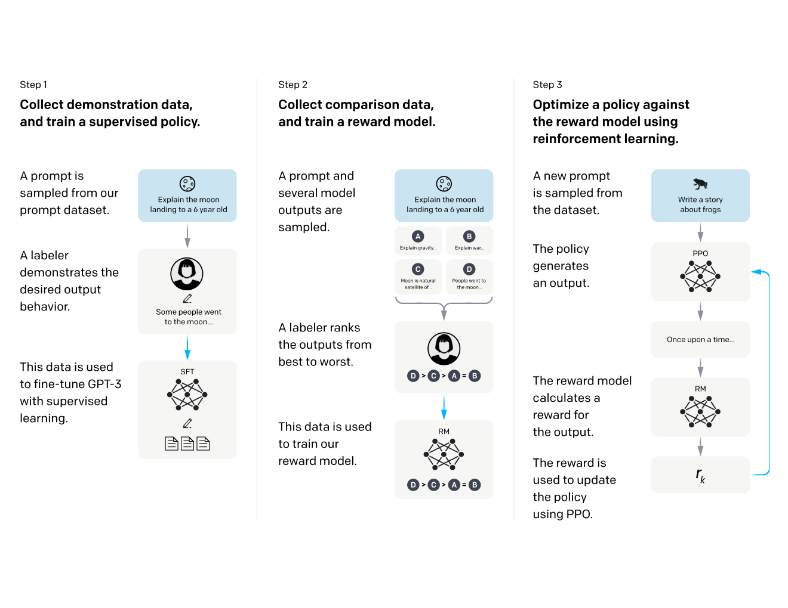
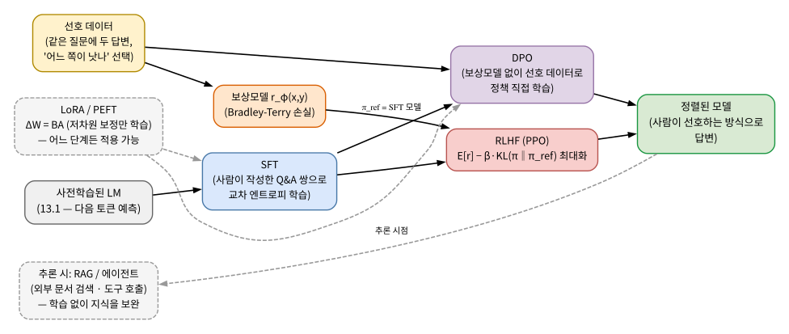
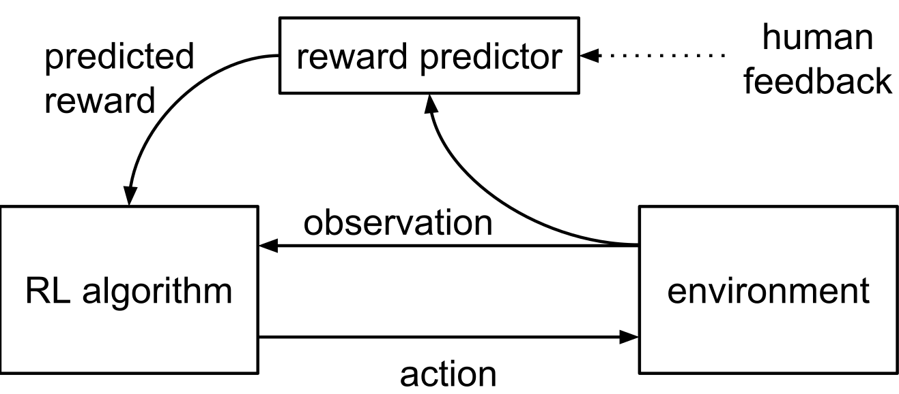
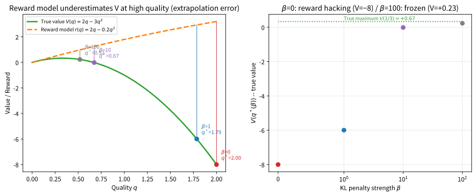
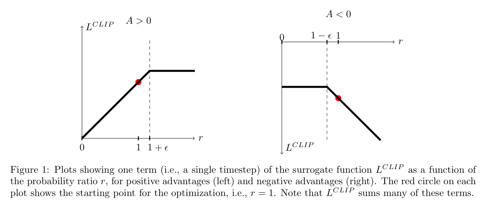

# 13.3 포스트트레이닝: SFT, RLHF, DPO

[](https://colab.research.google.com/github/SuminHan/book-ml/blob/main/notebooks/ml1/chapter13_3_posttraining_alignment.ipynb)

### 사전학습만으로는 부족한 이유

2022년, OpenAI는 InstructGPT 논문[^instructgpt]에서 놀라운 관찰을 보고했다 — 파라미터가
100배 더 적은 모델이라도, 사람이 원하는 방식으로 다듬어졌다면 사전학습만
거친 거대 모델보다 사람들이 훨씬 더 선호했다. 13.1절의 사전학습(다음
토큰 예측)은 "그럴듯한 텍스트"를 만들어내지만, 그게 곧 "사람이 원하는
대답"이라는 보장은 없다 — 사전학습 데이터에는 훌륭한 글도, 엉뚱하거나
무례한 글도 섞여 있기 때문이다. 여기서부터는 사전학습된 모델을 "사람이
실제로 원하는 방향"으로 다듬는 **포스트트레이닝** 단계를 다룬다.



**SFT(지도 파인튜닝, Supervised Fine-Tuning)**: 가장 단순한
포스트트레이닝이다 — 사람이 직접 작성한 "이상적인 (질문, 답변)" 쌍을 모아,
13.1절의 다음 토큰 예측 손실 그대로, 다만 데이터가 인터넷 텍스트가 아니라
사람이 직접 쓴 고품질 예시로 바뀐다. 문제는 확장성이다: "좋은 답변이
무엇인가"를 사람이 매번 처음부터 **작성**하는 것은 비용이 크다.

**왜 "그럴듯한 것"은 "원하는 것"과 다를까.** 13.1절에서 다음 토큰
예측의 목표는 **데이터 분포를 재현**하는 것이었다 — 그런데 데이터
분포와 인간 선호는 다른 것이다. 같은 질문에 대해 (a) 정확하지만 단조로운
답변, (b) 길고 화려하지만 핵심을 회피하는 답변, (c) 무례하지만 유익한
답변이 인터넷 텍스트에 모두 섞여 있다. 사전학습 모델은 이 셋을 **모두**
"그럴듯한" 다음 토큰으로 취급한다 — 분포에 존재하는 것이라면 다
그럴듯하니까. 포스트트레이닝이 하는 일은, 이 분포 **안에서** 사람이
선호하는 쪽(여기선 (a))의 확률을 끌어올리는 것이다. 13.1절의 언어
모델 분포 \\(P(x\_1,\ldots,x\_n)\\)가 "그럴듯한 문장을 고르는 기준"
이었다면, 정렬(alignment)은 그 기준을 "사람이 고를 문장" 쪽으로
**재조정(reweighting**)하는 과정이다 — 새로운 능력(예: 수학 지식)을
넣는 게 아니라, 이미 있는 능력의 **선택 기준**을 바꾼다는 점에
주의하라.



위 그림은 이번 절 전체의 지도다. 세 개의 학습 단계(SFT → 보상모델 →
RLHF)와, RLHF의 2단계를 한 단계로 압축한 DPO, 그리고 어느 단계에
든 "파라미터 효율"을 더해주는 LoRA, 학습을 통하지 않고 **추론
시점**에서 지식을 보완하는 RAG/에이전트가 한 장에 모여 있다.
"학습 단계"와 "추론 단계"를 구별하는 것(어느 것이 가중치를
고치느냐, 가중치 밖의 컨텍스트에 무엇을 넣느냐)이 이 지도의
핵심 축이다.

### SFT: "이상적인 답변"을 그대로 흉내 내기

SFT의 학습 목표는 13.1절과 **완전히 같은 식**이다. (질문 \\(x\\),
사람이 쓴 답변 \\(y^\*\\)) 쌍의 집합 \\(\\{(x\_i, y\_i^\*)\\}\\)에 대해,
답변 부분의 토큰에만 다음 토큰 예측 교차 엔트로피를 부과한다:

\\[\mathcal{L}\_{\text{SFT}}(\theta) = -\sum\_i \sum\_{t} \log
\pi\_\theta(y^\*\_{i,t} \mid x\_i, y^\*\_{i,<t})\\]

변한 것은 데이터뿐이다 — 인터넷 텍스트 대신 "질문을 잘 따라오는
이상적인 답변". 13.2절에서 "프롬프팅이 작동하려면 SFT가 미리
깔려 있어야 한다"고 했다 — 그 '미리 깔려 있는 것'이 바로 이 단계의
산출물이다.

**손으로 한 번: SFT가 분포를 어떻게 바꿀까.** 어휘를 7개
\\({A\_1,\ldots,A\_7}\\)로 줄이고, 7단계로 이루어진 이상적인 답변을
"각 단계에서 정답 토큰에 얼마의 확률을 주어야 하는가"로 압축해 보자.
사전학습 모델(= SFT 이전의 기준 모델)은 각 단계에서 정답에
\\((0.2, 0.5, 0.3, 0.4, 0.3, 0.5, 0.6)\\)의 확률을, SFT 이후 모델은
\\((0.8, 0.7, 0.5, 0.6, 0.4, 0.6, 0.8)\\)의 확률을 준다고 하자.
13.1절의 사슬 분해로 두 모델이 이 이상적 답변 전체에 주는 확률은
각 단계 확률의 곱이다:

\\[P\_{\text{ref}}(y^\*) = 0.2 \times 0.5 \times 0.3 \times 0.4
\times 0.3 \times 0.5 \times 0.6 \approx 0.0011\\]

\\[P\_{\text{SFT}}(y^\*) = 0.8 \times 0.7 \times 0.5 \times 0.6
\times 0.4 \times 0.6 \times 0.8 \approx 0.0323\\]

**약 30배**다. 토큰 하나당 손실(평균 \\(-\log p\\), = 13.1절의
퍼플렉시티 지수)으로 보면 \\(0.98 \to 0.49\\) — 두 모델 모두
"잘 예측한다"로 보이지만, SFT는 *정답 답변 전체의 합적* 확률을
30배로 끌어올렸다. "각 단계는 0.2에서 0.8로만 올랐는데"라는
느낌과 달리, **곱**으로 쌓이므로 짧은 답변에서도 큰 격차가 난다.
(정확한 값과 평균 손실은 [Colab
노트북](https://colab.research.google.com/github/SuminHan/book-ml/blob/main/notebooks/ml1/chapter13_3_posttraining_alignment.ipynb)
Section 1에서 검증한다.)

**왜 SFT는 "사람이 작성할 수 있는 품질"이 상한인가.** SFT 손실은
\\(y^\*\\)에 **확률 1**을 몰아주는 방향으로만 작용한다 — \\(y^\*\\)가
아닌, "사람이 쓰지 않았을 것 같은" 더 나은 답변을 탐색하는 압력이
없다. 학습 데이터에 없는 표현은 확률을 올릴 수 없고, 작성자가 쓴
답변이 실제로 최선의 답변인지도 데이터가 말해준다. SFT는
**모작(copy**)을 가르칠 뿐, **비판(비교**)을 가르치지 않는다.
이 한계가 바로 다음 단계의 동기가 된다.

### RLHF: 작성 대신 비교로 보상모델을 학습한다

**RLHF**(Reinforcement Learning from Human Feedback)[^rlhf]는 다른 전략을
쓴다 — 사람이 매번 "정답"을 새로 쓰는 대신, 모델이 만든 **여러 답변 중
어느 쪽이 더 나은지 고르기만** 하면 된다(비교가 작성보다 훨씬 쉽고
빠르다). 이 선호 데이터로 **보상모델**(Reward Model)을 학습시킨 뒤, 그
보상모델의 점수를 최대화하도록 언어모델 자체를 조정한다.



**1단계 — 보상모델 학습**: 같은 질문 \\(x\\)에 대해 모델이 만든 두 답변
\\(y\_w\\)(사람이 더 선호한 쪽, winner)와 \\(y\_l\\)(덜 선호한 쪽,
loser)이 있을 때, 보상모델 \\(r\_\phi(x,y)\\)가 \\(y\_w\\)에 더 높은
점수를 주도록 학습한다. 브래들리-테리 모델(Bradley-Terry model)은 이
선호 확률을 시그모이드로 모델링한다:

\\[P(y\_w \succ y\_l \mid x) = \sigma\big(r\_\phi(x,y\_w) - r\_\phi(x,y\_l)\big)\\]

이 확률을 최대화하는 손실은 **정확히 Chapter 2의 로지스틱회귀와 같은
교차 엔트로피 형태**다 — "정답 라벨"이 "\\(y\_w\\)가 이겼다"는 사실
하나뿐인 이진분류 문제이기 때문이다:

```python
import math

def sigmoid(z):
    return 1 / (1 + math.exp(-z))

def reward_model_loss(r_win, r_lose):
    # Bradley-Terry: P(y_w > y_l) = sigmoid(r_win - r_lose)
    return -math.log(sigmoid(r_win - r_lose))
```

**왜 시그모이드인가.** Chapter 2에서 로지스틱회귀가 시그모이드를 쓴
이유와 같다 — (1) 점수 차이 \\(r\_\phi(x,y\_w) - r\_\phi(x,y\_l) \in
\mathbb{R}\\)을 [0,1]의 확률로 매핑해야 하고, (2) **점수 차이가
선형 스케일**로 선호 확률의 로그-odds가 되도록 해야 한다.
차이가 1 증가하면 선호 확률의 odds가 \\(e\\)배, 2 증가하면
\\(e^2\\)배 — 13.1절 softmax의 "원점수 차이 = 확률 비율"과
동일한 구조다. (3) 극단적으로 점수 차이가 커져도 손실이 0에
**유한하게** 접근(\\(-\log \sigma(z) \sim e^{-z}\\))하므로, 이미
잘 구분하는 쌍이 학습을 지배하지 않는다 — 이 성질 때문에
Chapter 2에서 "정답 확률이 0.99에 수렴하면 그래디언트가 0에
가까워진다"는 안정성 논리가 여기에서도 그대로 살아 있다.

**손으로 한 번: BT 손실의 수치.** \\(r\_\phi(x,y\_w) = 1\\),
\\(r\_\phi(x,y\_l) = -1\\)이라고 하자. margin \\(z = 2\\)이므로

\\[\mathcal{L} = -\log \sigma(2) \approx -\log 0.8808 \approx
0.1269\\]

반대로 점수가 **거꾸로**인 경우(\\(r\_w = -1, r\_l = 1\\))는
\\(-\log \sigma(-2) \approx 2.1269\\) — 잘 구분한 쌍보다 약 17배
커다. margin이 0(무작위 추측)이면 \\(\log 2 \approx 0.693\\)이다.
로그-odds 관점에서도 한 번 읽어보자: \\(z=2\\)일 때 odds는
\\(e^2 \approx 7.4\\) — "이 사람이 \\(y\_w\\)를 \\(y\_l\\)보다
선호할 odds가 약 7:1"이라는 의미다.

**손으로 한 번: 2차원 보상모델을 실제로 학습해 보기.** BT 손실은
로지스틱회귀와 같은 모양이므로, **로지스틱회귀의 기계(구현,
SGD)를 그대로** 재사용할 수 있다. 특징 벡터를
\\((\text{길이},\ \text{거절 여부})\\) 2차원으로 줄인 장난감
보상모델 \\(r\_\phi(x,y) = w\_1 \cdot \text{길이} + w\_2 \cdot
\text{거절 여부}\\)로, 사람이 선호한 5쌍을 SGD로 분류해 보자
(모든 쌍의 winner는 더 **짧고** 거절하지 않는 쪽이다):

| 질문 | winner (길이, 거절) | loser (길이, 거절) |
|---|---|---|
| Q1 | (2, 0) | (5, 0) |
| Q2 | (3, 0) | (7, 1) |
| Q3 | (4, 0) | (8, 2) |
| Q4 | (2, 0) | (3, 1) |
| Q5 | (5, 0) | (4, 1) |

초기 \\(w = (0,0)\\)에서는 모든 margin이 0이 되어 손실이
\\(5 \times \log 2 \approx 3.47\\)이고 5쌍 모두를 50% 확률로
"동점"으로 본다. \\(\eta = 0.5\\)로 몇 백 번 갱신하면
\\(w \approx (-1.90, -6.69)\\)로 수렴하며 5쌍을 **모두**
정확히 구분하고 평균 손실이 약 \\(0.002\\)까지 떨어진다
(실제 실행은 실습 노트북 Section 2). 세 가지를 눈여겨보자.
(1) 두 특징 모두 **부호가 음수**로 수렴했다 — "짧을수록, 거절하지
않을수록 높게" 점수를 준다는 **방향**을 모델이 스스로 찾은 것이다.
(2) **특징의 스케일이 다르면 크기가 다르다** — '거절 여부'의 차이는
모든 쌍에서 ±1이지만 '길이'의 차이는 ±3~4까지 벌어지므로,
같은 분류 효과를 내기 위해 \\(w\_2\\)가 \\(w\_1\\)의 약 3.5배
크게 수렴했다. (3) 5쌍은 2차원 특징 공간에서 **선형분리 가능**이라
완전 분리(손실 → 0)가 가능했다 — 실제 LLM의 보상모델이 다루는
(질문, 답변) 쌍은 이보다 훨씬 고차원이고 선형분리 불가능한
경우가 많다. 그 경우 손실이 0으로 안 떨어져도 **margin의 순서**만
맞으면 되고, "손실이 잘 안 떨어진다"는 사실 자체가 선호 데이터의
**모순**(같은 답변을 다른 질문에 대해선 이긴 적도 진 적도 있는
경우)을 알려주는 신호가 된다.

이 장난감 실험은 "보상모델이 **점수**를 만드는 것"이 아니라
"**상대 비교**의 일관성 있는 순서를 만드는 것"에 불과하다는 점도
보여준다. \\(r\_\phi\\)에 상수를 더해도(모든 점수 +100) 모든
margin이 불변이므로 BT 손실도 불변이다 — 보상모델의 점수는
**절대값에 의미가 없고 차이(margin)에만** 의미가 있다.

**2단계 — 강화학습으로 정책 학습**: 보상모델이 준비되면, 언어모델을
"질문 \\(x\\)라는 상태에서, 답변 \\(y\\)라는 행동을 순차적으로(토큰
하나씩) 고르는 정책(policy)"으로 취급하고, 보상모델의 점수
\\(r\_\phi(x,y)\\)를 보상 삼아 **강화학습**(Reinforcement Learning, 상태·
행동·보상으로 이루어진 문제를 다루는 학습 방식 — 이번 학기에서는 다루지
않고, ML2가 전문으로 다룬다. 대표적으로 Atari 게임에서 Q학습에
신경망을 결합한 DQN(Deep Q-Network)[^dqn] 등이 있다)[^suttonbarto]으로 언어모델의 파라미터를 조정한다. 이때
가장 널리 쓰이는 알고리즘이 **PPO**(Proximal Policy Optimization)[^ppo]다.
자세한 유도는 ML2에서 다루지만, 여기서는 목적함수의 형태만 짚어본다:

\\[J(\theta) = \mathbb{E}\left[r\_\phi(x,y)\right] - \beta \\, D\_{KL}\big(\pi\_\theta(\cdot|x) \\,\\|\\, \pi\_{\text{ref}}(\cdot|x)\big)\\]

**왜 "토큰 하나씩"이 강화학습인가.** 답변 생성은 13.1절의 시퀀스
모델링과 같지만, **목표 함수의 관점**에서는 전혀 다른 문제다.
SFT에서는 정답 토큰이 주어지므로 각 토큰의 손실을 **독립**으로
계산할 수 있었지만, RLHF에서는 정답이 **없다** — 보상모델은
**완성된 답변 전체**에 하나의 점수 \\(r\_\phi(x,y)\\)를 줄 뿐이다.
"이번 답변이 높게 점수를 받은 **공로**가 어느 토큰에 있는가"를
가르는 것(credit assignment)은 강화학습이 존재하는 이유다.
13.2절의 chain-of-thought[^cot]와 대비해보자 — CoT는 "중간 결과를
출력물에 써서" 다음 토큰 예측의 **조건**으로 쓴 것이고, RLHF는
"출력 전체의 보상을 출력 경로의 확률(로그-우도)에 비례해
분배"하는 **역방향** 문제다. 두 기법 모두 "중간 결과를 조건으로
쓴다"는 구조를 활용하지만, CoT는 *추론 시점*에서 조건을
직접 공급하는 반면 RLHF는 *학습 시점*에서 보상을
역분배한다 — 이 차이가 "프롬프팅은 즉각적이고 파인튜닝은
영구적"이라는 13.2절의 구분을 다시 한 번 확인시켜 준다.

**왜 뒤쪽의 페널티 항이 필요한가: KL 수치의 감각.** 2.3절에서
\\(D\_{KL}(p\\|q) = \sum p \log(p/q)\\)로 배운 그 함수다.
"정책" \\(\pi\\)와 \\(\pi\_{\text{ref}}\\)가 두 토큰 어휘
\\(\\{A,B\\}\\)에 대한 분포라 하면(\\(\pi\_{\text{ref}} =
(0.5, 0.5)\\)): 정책이 기준과 **정확히 같으면**
(\\(\pi = \pi\_{\text{ref}}\\)) KL은 정확히 \\(0\\)이고
(동일 분포는 이탈이 없으므로), A에 확률을 몰아붙인 극단적
정책 \\(\pi = (0.95, 0.05)\\)의 KL은

\\[D\_{KL}(\pi\\|\_{\text{ref}}) = 0.95 \cdot \log(0.95/0.5)
+ 0.05 \cdot \log(0.05/0.5) \approx 0.610 - 0.115
\approx 0.495\\]

— 기준에서 **약 0.5**만큼 벗어남을 나타낸다. \\(\beta = 1\\)이면
이 이탈에 0.5의 **벌**이 붙는 셈이다. KL이 0(동일)에서 0.5(극단적
편향)으로 커지는 모습이, "기준 모델의 말투에서 얼마나 벗어났는가"를
단일 숫자로 재는 **이탈 거리**의 감각이다.

**보상 해킹을 숫자로.**[^rewardhacking] KL 항을 없애면(\\(\beta = 0\\)) 최적화는
"보상모델 점수 \\(r(q)\\)를 그냥 최대화"로 단순해진다. 1차원
장난감 문제로 만들어 보자. 품질 변수 \\(q \in [0,2]\\)를 놓고
(사람이 실제로 원하는) **진짜 가치** \\(V(q) = 2q - 3q^2\\)와
(보상모델이 근사한) **보상** \\(r(q) = 2q - 0.2q^2\\)를 둔다.
둘은 저품질 구간(\\(q \lesssim 0.6\\))에서 거의 일치하지만,
고품질 구간으로 갈수록 보상모델은 **실제 가치의 하락을 과소평가**
한다 — 보상모델의 학습 데이터가 대체로 "보통 품질" 답변에
집중되어 있었기 때문(외삽 오차). 각 \\(\beta\\)에서의 최적
\\(q^\*(\beta) = \arg\max\_q \\{ r(q) - \beta \cdot \tfrac{1}{2}(q -
0.5)^2 \\}\\)(\\(\pi\_{\text{ref}}\\)가 \\(q = 0.5\\)에 집중된
가우시안이라 KL이 \\(\tfrac{1}{2}(q-0.5)^2\\)로 근사)를
계산하면:

| \\(\beta\\) | \\(q^\*\\) | 보상점수 \\(r(q^\*)\\) | KL | **진짜 가치** \\(V(q^\*)\\) |
|---|---|---|---|---|
| 0 | **2.00** | 3.20 | 1.125 | **−8.00** |
| 1 | 1.79 | 2.93 | 0.827 | −5.99 |
| 10 | 0.67 | 1.26 | 0.015 | −0.01 |
| 100 | 0.52 | 0.98 | 0.0002 | **+0.23** |
| (참고: \\(V\\)의 진짜 최대값) | 0.33 | — | — | **+0.67** |

\\(\beta = 0\\)에서는 정책이 \\(q = 2\\)라는 **경계**까지 밀려가
보상모델 점수 3.20을 얻지만, **진짜 가치는 −8**이다 — 보상모델
점수는 계속 오르는 데 실제 품질은 무참히 추락하는, 전형적인
**보상 해킹**의 모습이다. \\(\beta = 10\\)이면 \\(q^\* \approx
0.67\\)로 돌아와 KL은 \\(0.015\\)로 거의 0이 되지만, 여전히
\\(V\\)의 진짜 최대(\\(q = 0.33, V = +0.67\\))를 놓친다.
\\(\beta = 100\\)이면 거의 \\(\pi\_{\text{ref}}\\)로 동결
(\\(q^\* \approx 0.52\\)) — **안정적이지만 학습 효과도 거의
없어진다**. \\(\beta\\)가 작으면 보상 해킹, 크면 **과정제약
(under-optimization)** — 이 트레이드오프가 RLHF 실무에서 가장
어려운 튜닝 중 하나다. (표의 값은 실습 노트북 Section 3에서
계산·그려 확인한다.)



**역사: PPO는 어디서 왔나.** PPO는 원래 LLM 정렬을 위해 발명된
알고리즘이 아니다. 2017년 OpenAI가 발표한 PPO는 **로봇 제어
(인공신경망 정책 + 연속 행동**)에서 "정책 업데이트를 한 번에
크게 하지 마라"는 안전 장치를 **클리핑(clipping**)이라는 단순한
수단으로 구현한 것이었다 — 업데이트 후의 정책이 이전 정책의
\\(\tfrac{\pi\_\theta}{\pi\_{\text{old}}} \\in [1-\epsilon,
1+\epsilon]\\)(보통 \\(\epsilon = 0.2\\))을 벗어나면 그 영역에서
만 목적함수의 기울기를 0으로 만든다. 이 "한 단계만 조심스럽게
걸어가자"는 사상이, LLM 정렬에서는 **KL 페널티**라는 또 다른
형태로 구현된다 — 둘은 같은 목적("기준 정책에서 크게 벗어나지
말 것")을 실현하는 서로 다른 수학적 장치다. ML2에서 PPO의
클리핑 목적함수를 직접 유도·구현할 때, 이 13.3절의 KL 항과
**같은 문제의 다른 얼굴**임을 다시 확인할 수 있다.



**왜 보상모델이 "근사"인가 — 과적합의 숙명.** 보상모델은 수천~수만
개의 (질문, 답변-답변) 쌍에서 학습되므로, Chapter 6에서 배운
**과적합**에 그대로 노출된다. 훈련 데이터에서 일관된 선호를 보이는
특정 *형식*(예: 특정 어미, 특정 길이)을 **지나치게** 높은 점수로
매기면, 정책이 그 형식만 반복하는 "보상 해킹의 특화판"이
생긴다 — 형식은 맞는데 내용은 공허한 답변이다. RLHF 실무에서
보상모델을 **여러 개로 학습해 평균**하거나, **KL 항을
동적으로 조절**하는 것은 모두 이 과적합을 완화하기 위한
장치다.

### DPO, PEFT/LoRA, 에이전트·RAG 개관

**DPO**(Direct Preference Optimization, 2023)[^dpo]: RLHF는 (1) 보상모델을
따로 학습하고 (2) 그 보상모델로 강화학습을 돌리는 2단계 과정이라 복잡하고
불안정할 수 있다. DPO는 수학적으로, RLHF 목적함수의 최적 정책이 보상함수를
\\(\pi\_\theta\\)와 \\(\pi\_{\text{ref}}\\)의 비율로 직접 표현할 수 있음을
보이고, 그 관계를 보상모델 손실에 대입해 **보상모델도 강화학습 루프도
없이, 선호 데이터에서 정책을 곧바로 학습**하는 손실을 유도한다 — 즉
바로 위 RLHF의 2단계 과정 전체를, 지도학습 손실 하나로 대체한다:

\\[\mathcal{L}\_{\text{DPO}} = -\log \sigma\left(\beta \log
\frac{\pi\_\theta(y\_w|x)}{\pi\_{\text{ref}}(y\_w|x)} - \beta \log
\frac{\pi\_\theta(y\_l|x)}{\pi\_{\text{ref}}(y\_l|x)}\right)\\]

**형태를 보면 여전히 위의 보상모델 손실과 똑같은 로지스틱 손실이다 —
다만 "보상"의 역할을 \\(\beta \log(\pi\_\theta/\pi\_{\text{ref}})\\)(정책이
기준 모델보다 그 답변을 얼마나 더 선호하게 됐는가)이 대신한다. 별도의
보상모델과 강화학습 루프 없이 지도학습 한 번으로 RLHF와 이론적으로 같은
지점에 도달한다는 것이 DPO의 매력이다.**

**왜 \\(\pi\_{\text{ref}}\\)의 비율인가 — DPO의 3단계 논리.**
RLHF 목적함수 \\(J(\theta) = \mathbb{E}[r] - \beta D\_{KL}\\)를
\\(\pi\_\theta\\)에 대해 최적화하면(각 토큰 위치에서 독립적이라
인수분해), 최적 정책이

\\[\pi^\*(y|x) = \frac{1}{Z(x)} \\,
\pi\_{\text{ref}}(y|x) \\, e^{r(x,y)/\beta}\\]

라는 **닫힌 형태**(closed form)로 표현된다는 것을 보일 수
있다(\\(Z(x)\\)는 질문 \\(x\\)에 대한 노멀라이제이션
상수). 다시 말해, **보상함수 \\(r\\) 자체가**

\\[r(x,y) = \beta \log \frac{\pi^\*(y|x)}{\pi\_{\text{ref}}(y|x)}
+ \beta \log Z(x)\\]

로 **역산(inversion**)된다 — "RLHF에서 최적 정책과 보상함수는
서로의 변환"이라는 관계다. 이 \\(r\\)을 BT 손실에 대입하면,
\\(\beta \log Z(x)\\)가 \\(y\_w\\), \\(y\_l\\) **둘에 공통**으로
들어와 차이를 취하면서 **소거**된다 — 결과적으로 \\(Z(x)\\)를
계산할 필요 없이, \\(\pi\_\theta\\)와 \\(\pi\_{\text{ref}}\\)의
**비율**만으로 BT 손실이 쓰여지는 것이다. 이 소거가 DPO의
핵심 한 줄이다: "보상함수를 **분리**해서 학습(RLHF)"과 "보상함수를
정책 자체에 **내장**시켜 학습(DPO)"은 같은 BT 손실을 최적화
하지만, 전자는 *보상모델*이라는 별도 파라미터를 두고, 후자는
*정책 파라미터*가 보상의 역할을 **겸임**한다.

**숫자로: DPO 손실의 그래디언트 방향.** 13.2절의 장난감 상황
(두 후보 답변 \\(y\_w, y\_l\\)에 대한 정책 확률)로 DPO 손실을
직접 계산해보자(\\(\beta = 1\\)). 초기에는 정책이 두 답변을
거의 동등하게 봄: \\(\pi\_\theta(y\_w|x) = 0.6\\),
\\(\pi\_\theta(y\_l|x) = 0.2\\), 기준 모델은
\\(\pi\_{\text{ref}}(y\_w|x) = 0.4\\),
\\(\pi\_{\text{ref}}(y\_l|x) = 0.3\\). 두 로그-비율은

\\[\log \frac{0.6}{0.4} \approx 0.4055, \qquad
\log \frac{0.2}{0.3} \approx -0.4055\\]

이므로 margin \\(z = 0.4055 - (-0.4055) \approx 0.811\\)이고,
손실 \\(\mathcal{L} = -\log \sigma(0.811) \approx 0.368\\)다.
BT 손실의 그래디언트(연습문제 3의 결과)를 그대로 쓰면,
\\(\partial \mathcal{L}/\partial \log
\frac{\pi\_\theta(y\_w)}{\pi\_{\text{ref}}(y\_w)} =
\sigma(z) - 1 \approx -0.308\\)이고
\\(\partial \mathcal{L}/\partial \log
\frac{\pi\_\theta(y\_l)}{\pi\_{\text{ref}}(y\_l)} =
1 - \sigma(z) \approx +0.308\\) — 즉 **\\(y\_w\\)의
로그-비율을 올리고 \\(y\_l\\)의 로그-비율을 내리는** 방향이
정확히 BT 손실을 줄이는 방향이다. 학습이 진행되어
\\(\pi\_\theta(y\_w|x) = 0.7\\), \\(\pi\_\theta(y\_l|x) = 0.1\\)로
수렴하면 \\(z \approx 1.658\\), 손실 \\(\approx 0.174\\) —
**같은 BT 손실 곡선**을, 별도 보상모델 없이 **정책 확률로
직접** 내림한 것이다. (정확한 값은 실습 노트북 Section 4에서
검증한다.) \\(\beta\\)를 \\(0.1\\)으로 줄이면 margin도 10분의 1
(\\(z \approx 0.081\\)), 손실은 \\(0.653\\) — \\(\beta\\)는
**"선호를 얼마나 강하게 반영할 것인가"의 강도 조절**이며,
RLHF의 KL 항 강도와 같은 역할을 한다.

**DPO가 "RLHF의 단순화"일 뿐인 이유.** DPO의 유도에서
**보상함수가 정책의 로그-비율로 표현**된다는 것은, "RLHF에서
최적화된 정책 = DPO에서 최적화된 정책"이 **같은 BT 손실을
최적화**한다는 것에 불과하다 — *동일한 데이터, 동일한
하이퍼파라미터*에서 **동일한 손실 곡선**을 따라간다는
말이다. 실전에서는 DPO가 (i) **강화학습 루프의 불안정성**
(정책-보상모델의 co-adaptation, 보상 해킹)을 피하고, (ii) **1
번의 학습 루프**로 끝난다는 점에서 실무적으로 우월하지만,
(iii) **RLHF의 보상모델을 별도로 재사용**할 수 있다는
유연성(예: 같은 보상모델로 다른 작업에 대한 평가
기준으로 활용)은 DPO에 없다. "DPO가 항상 낫다"가 아니라
**"RLHF의 2단계를 1단계로 압축하되, 그 2단계의 부가 가치를
포기하는"** trade-off라는 것이 정확한 그림이다.

**PEFT/LoRA**(Parameter-Efficient Fine-Tuning / Low-Rank Adaptation)[^peft][^lora]:
수십~수백억 개 파라미터 전체를 파인튜닝하는 것은 계산·저장 비용이 크다.
LoRA는 원래 가중치 \\(W\\)를 고정한 채, 훨씬 작은 두 저차원 행렬의 곱
\\(\Delta W = BA\\)(\\(B, A\\)의 차원이 \\(W\\)보다 훨씬 작다)만 학습해서
\\(W + \Delta W\\)를 새 가중치로 쓴다 — 학습해야 할 파라미터 수를
수백 분의 1로 줄이면서도 실전에서 전체 파인튜닝과 비슷한 성능을 낸다.
Chapter 10.3의 "합성곱 층을 고정하고 분류층만 학습"하는 전이학습과 같은
정신을 공유하되, "일부 층을 통째로 고정"하는 대신 "모든 층에 아주 작은
저차원 보정치만 추가로 학습"한다는 점이 다르다.

**"저차원"이 왜 충분한가 — SVD로 숫자를 보자.** LoRA의 가설은
"파인튜닝이 가지는 **효과적 변화** \\(\Delta W\\)가 본래
\\(W\\)의 전체 차원보다 **낮은 계수(rank**)를 가진다"는 것이다.
\\(W \in \mathbb{R}^{20 \times 20}\\)에 rank-4인 \\(\Delta W\\)를
SVD로 분해해, 계수를 4/3/1로 줄여 **근사**하는 상대 오차를
계산하면:

| rank \\(r\\) | 파라미터 수 (vs 전체 400) | 상대 오차 |
|---|---|---|
| 4 (정확) | 160 (40%) | \\(\approx 0\\) |
| 3 | 120 (30%) | 0.326 |
| 1 | 40 (10%) | 0.701 |

rank-4인 행렬을 **rank-4로** 표현하면 오차가 0(정확 재현)이고
파라미터가 전체의 40%로 줄어든다 — **저차원 표현이 정확한
경우**의 원형이다. rank-3으로만 줄여도 오차 33%, rank-1이면
70% — **계수를 줄일수록 오차가 급격히** 커지는 것은,
"진짜 rank"를 넘는 순간 **정보 손실**이 불가피하기 때문이다.
실제 LLM(\\(4096 \times 4096\\) 한 층, 약 \\(1.7 \times 10^7\\)
파라미터)에서 \\(r = 8\\)이면 LoRA 파라미터는
\\(2 \times 4096 \times 8 = 65{,}536\\) — **전체의 0.39**%에
불과하다. "파라미터 수를 수백 분의 1로 줄인다"는 말이
숫자로 읽히는 순간이다. (실제 실행은 실습 노트북 Section 5.)

**왜 "모든 층에" 작은 보정인가.** Chapter 10.3의 전이학습은
**앞쪽 층을 통째로** 고정하고 마지막 층만 학습했다 — "저수준
특징(모서리, 색상)은 이미지에 공통"이라는 **층별 역할
분화**에 기반한다. LLM에서는 13.1절에서 본 것처럼,
**앞쪽 층**은 문언어적 특징, **뒤쪽 층**은 고수준
의미/행동 특징을 담당한다. LoRA는 이 분화를 **통째로 고정 vs
전체 학습**의 이분법 대신, **모든 층에 저차원 보정**을
추가하는 방식으로 "앞쪽은 거의 건드리지 않고(보정 크기가 작
도록 학습률이 조절), 뒤쪽은 충분히"라는 **연속 스펙트럼**을
가능하게 한다. 실전에서는 **어떤 층에 LoRA를 적용할지**(Q/K/V
어텐션만? FFN도? Embedding도?)를 하이퍼파라미터로
조절하는데, 이 선택 자체가 "어느 층의 **어떤 방향**을
바꾸고 싶은가"의 **가설**을 반영한다.

**에이전트와 RAG**(Retrieval-Augmented Generation)[^rag]: 프롬프팅만으로는
모델이 모르는 최신 정보나 외부 문서를 답할 수 없다. RAG는 질문과 관련된
문서를 먼저 검색해 프롬프트에 함께 넣어주고, 에이전트(agent)는 여기서
한 걸음 더 나아가 모델이 검색·계산기·코드 실행 같은 **도구를 스스로
호출**하도록 만든다[^react] — 둘 다 "모델의 파라미터 안에 모든 지식을 우겨넣는"
대신 "모델이 필요할 때 바깥 정보/도구에 접근하게 한다"는 같은 방향의
해법이다.

**RAG를 13.2절의 언어로 한 번 더.** RAG는 **프롬프팅의 확장**이다.
13.2절에서 few-shot 예시[^fewshot]가 "모델이 *조건*으로 삼는 토큰"을
확장한다면, RAG는 **검색된 문서**를 그 조건으로 삼는 것이다 —
모델의 파라미터는 **아무것도** 바뀌지 않고, **컨텍스트에
문서를 넣는** 행위 자체가 학습을 대체한다. "8.3 / 5.2 = ?"라는
질문에 RAG가 계산기 **도구**를 호출해 1.596을 얻고, "그 값을
3으로 곱해줘"는 4.788을 산출하는 과정은, 13.2절의
"도구를 **프롬프트 바깥**에서 덧붙인다"는 환각 완화 수단의
**자동화**된 버전이다 — 사람이 매번 "계산기를 써"라고
프롬프트에 쓰지 않아도, **모델이 스스로** "이 질문에는
계산기가 필요하겠다"고 판단하고 도구를 호출한다. 이
**스스로 판단**하는 것이 바로 **에이전트**의 핵심 — "다음
토큰 예측"의 범주 안에서도, "다음 토큰이 **도구 호출**이라는
특수 토큰"일 가능성을 모델이 학습한 것이다.

**LLM 자체는 새로운 알고리즘이 아니라, Chapter 12에서 배운 Transformer를[^transformer]
극단적으로 큰 규모로 학습시킨 결과다. 사전학습이 "무엇이든 그럴듯하게
잇는 법"을 가르친다면, 포스트트레이닝은 그중 "사람이 실제로 원하는
것"만 골라내는 단계다 — 그리고 그 정교화 과정은 지도학습(SFT, DPO)과
강화학습(RLHF)이라는 이번 학기에 배운 서로 다른 두 도구가 함께 쓰이는
자리이기도 하다.**

**세 방식 비교 — 한 장에 모으면:**

| | SFT | RLHF | DPO |
|---|---|---|---|
| **사람이 주는 데이터** | "이 답변이 좋다"(작성) | "이쪽이 더 낫다"(비교) | "이쪽이 더 낫다"(비교) |
| **학습 대상** | 정책 \\(\pi\_\theta\\) | 보상모델 \\(r\_\phi\\) + 정책 \\(\pi\_\theta\\) | 정책 \\(\pi\_\theta\\) |
| **손실** | 다음 토큰 예측 CE | BT(RM) + PPO(RL) | BT(정책 로그-비율) |
| **보상모델** | 없음 | 별도 학습 | 없음(정책이 겸임) |
| **강화학습 루프** | 없음 | 있음(불안정, 보상 해킹 위험) | 없음 |
| **KL 항의 역할** | — | 보상 해킹 방지(\\(\beta\\) 튜닝) | \\(\beta\\)가 같은 역할 |
| **상한** | 사람이 작성할 수 있는 품질 | (보상모델의 근사 한계) | (데이터의 선호 순서 한계) |
| **LoRA 적용** | 가능 | 가능(RM도, 정책도) | 가능 |

**LoRA와 RAG/에이전트의 "계층**"도 구분하자. LoRA는 **학습 단계**
의 효율화(어느 파인튜닝 단계든 적용 가능), RAG/에이전트는 **추론
단계**의 지식 보완(학습 없이 컨텍스트에 넣음)이다 — 둘을 **동시에**
쓰는 것이 실무 표준이다. "LoRA로 파인튜닝한 모델 + RAG로 최신
정보 공급 + 에이전트로 도구 호출"은 각각 **서로 다른 단계**의
문제(가중치 비용 / 지식 시효 / 계산 능력)를 해결하는
**독립 축**이다.

### 자주 하는 실수: "보상모델 = 사람이 직접 쓴 점수"

가장 흔한 오해는 보상모델을 **사람이 각 (질문, 답변)에 직접
점수를 매긴 데이터**로 학습된다고 생각하는 것이다 — 아니다.
보상모델은 **사람이 "A vs B 중 어느 쪽이 더 나은가"라고
만 답한 비교 데이터**에서 BT 손실을 최적화한 것뿐이다.
**절대 점수**(이 답변은 7점)가 아니라 **상대 순위**(이쪽이
더 낫다)를 학습한다. 이 차이가 실무적으로 중요하다:
(1) **사람이 절대 점수를 매기는 것은 비용이 크고 일관성이
나쁘다**(같은 답변을 10초 간격으로 두 번 평가하면 7점/5점으로
다를 수 있지만, "A vs B" 비교는 상대적으로 일관적),
(2) **보상모델의 점수는 절대값에 의미가 없고 차이만**
의미가 있다(앞에서 본 +100 불변성), (3) **보상 해킹**이
일어나는 것 자체가 "절대 점수를 올리는" 방향의 학습이
아니라 "상대 margin을 조작하는" 방향의 학습이기
때문이다. "보상모델이 9점을 줬다"는 문장은 엄밀히
말하면 "보상모델이 다른 답변보다 9점 **높은 margin**을
줬다"로 번역해야 정확하다.

두 번째 흔한 실수는 **DPO를 "RLHF의 무료 대체재"로
간주**하는 것이다. DPO는 RLHF의 2단계를 1단계로 **압축**
하지만, 그 2단부가 가지는 **부가 가치**(보상모델의 별도
재사용, 보상 해킹의 **시각적 진단** — 보상점수가 계속
오르는 걸 *보면서* 훈련하는 것)를 포기한다. "DPO가 더
단순해서 더 낫다"가 아니라, **RLHF의 2단계를 1단계로
압축하되 그 부가 가치를 포기하는 trade-off**라는 것이
정확하다. 특히 **보상모델을 다른 용도**(예: 추론
시점의 **생성된 답변 자동 평가** — 13.2절의 self-consistency[^selfconsistency]
에서 다수결 대신 "보상모델이 높은 답변을 고르기")에
재사용하고 싶은 경우, RLHF의 2단계 구조가 여전히
유리하다.

세 번째: **LoRA의 rank \\(r\\)을 "작을수록 좋다"고
판단**하는 것이다. 앞의 SVD 예에서 rank-1은 70%
오차 — **진짜 rank를 넘으면 정보 손실**이다. 실무에서
\\(r = 8, 16, 64\\)를 탐색하는 것은 "작을수록
효율적"이 아니라 **"이 파인튜닝이 실제로 바꾸고
싶은 방향의 차원수"를 추정**하는 것이다. 너무 작으면
**과소적합**(원하는 변화가 rank-r보다 고차원이라
표현 불가), 너무 크면 **전체 파인튜닝과의 차이
축소**(비용 절감 효과 감소) — **bias-variance
트레이드오프**(Chapter 6)의 또 다른 얼굴이다.

이 절의 주제(포스트트레이닝·정렬)를 더 깊이 다루는 자료:
Stanford CS224N(Natural Language Processing with Deep Learning)의
RLHF 관련 강의.[^cs224n]

### 확인 문제

**1. (손 계산)** BT 손실에서 \\(r\_\phi(x, y\_w) = 2\\),
\\(r\_\phi(x, y\_l) = 1\\)이면 \\(\mathcal{L} =
-\log \sigma(1) \approx 0.3133\\)이 된다. (a) 이 값이
"margin 2(= 0.1269)"보다 **크다**는 것을, "margin이
작을수록 모델이 확신이 없어 손실이 커진다"는 논리로
한 문장 설명하고, (b) 손실이 정확히 \\(0.1269\\)가
되는 margin \\(z^\*\\)를 구하라(힌트: \\(-\log
\sigma(z^\*) = 0.1269 \Rightarrow \sigma(z^\*) = 0.8808
\Rightarrow z^\* = 2\\)).

**2. (개념 서술 + 코딩)** DPO 손실에서 \\(\beta = 1\\)일 때,
\\(\log \frac{\pi\_\theta(y\_w|x)}{\pi\_{\text{ref}}(y\_w|x)}
= 1.0\\), \\(\log \frac{\pi\_\theta(y\_l|x)}
{\pi\_{\text{ref}}(y\_l|x)} = -0.5\\)이면 손실의 값과
\\(\sigma(z)\\)를 구하고, 이 \\(\sigma(z)\\)가 "모델이
\\(y\_w\\)를 \\(y\_l\\)보다 선호할 **확률**"로 읽히는
것을 BT 손실과의 형태 동등성으로 설명하라. (힌트:
\\(z = 1.0 - (-0.5) = 1.5\\) → \\(\sigma(1.5) \approx
0.8176\\), 손실 \\(\approx 0.2014\\).) 이어서
\\(\beta = 0.5\\)로 바꾸면 margin과 손실이 어떻게
변하는지 한 줄로 비교하라(힌트: margin \\(0.75\\),
\\(\sigma \approx 0.6792\\), 손실 \\(\approx 0.3869\\) —
\\(\beta\\)가 작을수록 margin이 축소되어 손실이
커진다).

### 자주 묻는 질문

**Q. SFT만으로는 왜 부족한가요? RLHF/DPO가 꼭 필요한가요?** SFT는
사람이 작성한 "이상적인 답변"을 그대로 흉내 내도록 가르칠 뿐이라,
사람이 작성할 수 있는 답변 품질을 넘어서기 어렵다. RLHF/DPO는 "여러
후보 중 어느 게 더 나은지 비교"하는 훨씬 쉬운 형태의 데이터로부터
학습하므로, 모델이 사람이 직접 쓰지 않은 새로운 표현이라도 "더 선호될
만한" 방향을 스스로 탐색할 여지가 생긴다 — 다만 그만큼 학습이
불안정해질 위험(보상 해킹 등)도 함께 커진다.

**Q. DPO가 RLHF보다 항상 나은가요?** 이론적으로 같은 최적점에
도달한다고 알려져 있지만, 실전에서는 데이터 품질이나 하이퍼파라미터에
따라 어느 쪽이 더 나은 결과를 내는지가 갈린다. DPO는 구현이 단순하고
학습이 안정적이라는 실무적 장점이 커서 최근 널리 채택되지만, RLHF의
2단계 구조(별도의 보상모델)가 특정 상황(보상 신호를 다른 곳에도
재사용하고 싶을 때 등)에서는 여전히 유리할 수 있다.

**Q. LoRA의 rank \\(r\\)은 어떻게 정하나요?** 앞의 SVD 예가
말해주는 것처럼, **진짜 rank를 넘으면 정보 손실**이다. 실무에서는
\\(r = 8\\)에서 시작해, (a) **과소적합**(원하는 변화가
저차원으로 표현되지 않아 성능이 안 오름)이 보이면 \\(r\\)을
크게, (b) **전체 파인튜닝과의 성능 차이가 작아짐**(= 비용
절감 효과가 사라짐)이 보이면 \\(r\\)을 작게 — **bias-variance
트레이드오프**(Chapter 6)의 관점에서 탐색한다. 특정 작업
(예: 의료 도메인 특화)는 **저차원**(도메인 스타일 변화가
몇 가지 패턴에 집중), 다른 작업(예: 다국어 확장)은 **고차원**
(새로운 언어의 표현 공간이 넓음)일 수 있다.

**Q. RAG가 "더 좋은 파인튜닝"을 대체할 수 있나요?**
**대부분의 경우 대체 불가** — 둘이 **다른 단계**의 문제를
해결한다. RAG는 **지식의 시효**(모르는 최신 정보)를
컨텍스트로 해결, 파인튜닝은 **행동의 형식**(어떤 톤/
형식으로 답할지)을 가중치로 학습한다. "이 도메인의
답변 형식"을 RAG로 넣을 수도 있지만, **매번** 프롬프트에
넣는 것은 (i) 컨텍스트 \\(n^2\\) 비용(12.3절), (ii)
**모든** 질문에 같은 형식 제약을 걸어야 한다는
비효율이 있다. **형식은 파인튜닝, 지식은 RAG**가
표준 분업이다.

### 실습 노트북

이 절의 모든 수치 검증은 [Colab 노트북](https://colab.research.google.com/github/SuminHan/book-ml/blob/main/notebooks/ml1/chapter13_3_posttraining_alignment.ipynb)에서
다시 확인할 수 있다:

1. **BT 손실 & 그래디언트** — \\(r\_w=1, r\_l=-1 \Rightarrow
   0.1269\\), 거꾸로 \\(2.1269\\), margin 0 \\(\Rightarrow \log 2
   \approx 0.693\\) 검증; 그래디언트 \\(\sigma(z)-1\\)가
   "\\(y\_w\\)를 확신하면 → 0"임을 확인
2. **장난감 보상모델 학습** — 2차원 특징(길이, 거절 여부), 5쌍,
   SGD(\\(\eta=0.5\\)): 손실 \\(3.47 \to 0.002\\), 5/5 정확,
   \\(w \approx (-1.90, -6.69)\\)(부호·크기 해석)
3. **KL & 보상 해킹** — \\(D\_{KL}((0.95,0.05)\\|(0.75,0.25)) \approx
   0.495\\)(정확히 같은 분포는 0); 1차원 해킹 문제에서
   \\(\beta = 0,1,10,100\\)의
   \\(q^\*\\)·\\(V(q^\*)\\) 계산·그래프(\\(\beta=0\\)에서
   \\(V=-8\\), \\(\beta=100\\)에서 \\(V=+0.23\\), 진짜 최대
   \\(V=+0.67\\)@\\(q=1/3\\))
4. **DPO 손실** — 초기(0.6, 0.2 vs 0.4, 0.3) \\(\Rightarrow z
   \approx 0.811\\), 손실 \\(0.368\\); 수렴(0.7, 0.1) \\(\Rightarrow z
   \approx 1.658\\), 손실 \\(0.174\\); \\(\beta = 0.1\\)의
   margin 축소 확인
5. **LoRA/SVD** — 20×20, rank-4 \\(\Delta W\\)를 rank 4/3/1로
   근사: 상대 오차 0 / 0.326 / 0.701; \\(4096 \times 4096, r=8
   \Rightarrow 0.39\\%\\)
6. **SFT 분포 재조정** — 7단계 이상적 답변: \\(P\_{\text{ref}} \approx
   0.0011\\) vs \\(P\_{\text{SFT}} \approx 0.0323\\)(약 30배),
   평균 \\(-\log p\\): \\(0.98 \to 0.49\\)

---

## 연습문제

**1. (코딩)** 다음과 같은 함수 `next_token_distribution`을 완성하고(아주
단순화된 언어모델 시뮬레이션), 위 `reward_model_loss`와 DPO 손실
`dpo_loss`를 작성하라(핵심 줄은 빈칸으로 남겨져 있다고 가정):

```python
def next_token_distribution(corpus_tokens, context_word):
    # ADD ADDITIONAL CODE HERE!!
    # context_word가 등장한 모든 위치에서, 바로 다음 토큰을 세어
    # {다음단어: 확률} 딕셔너리로 반환

corpus = "나는 학교에 간다 나는 집에 간다 나는 학교에 있다".split()
print(next_token_distribution(corpus, "나는"))
# {"학교에": 2/3, "집에": 1/3}

import math

def sigmoid(z):
    return 1 / (1 + math.exp(-z))

def reward_model_loss(r_win, r_lose):
    # ADD ADDITIONAL CODE HERE!!
    # -log(sigmoid(r_win - r_lose))

def dpo_loss(logp_win_theta, logp_win_ref, logp_lose_theta, logp_lose_ref, beta):
    # ADD ADDITIONAL CODE HERE!!
    # log_ratio_win = beta * (logp_win_theta - logp_win_ref)
    # log_ratio_lose = beta * (logp_lose_theta - logp_lose_ref)
    # -log(sigmoid(log_ratio_win - log_ratio_lose))

print(round(reward_model_loss(r_win=2.0, r_lose=-1.0), 3))  # 0.049 -- 잘 구분하면 손실이 작다
print(round(reward_model_loss(r_win=-1.0, r_lose=2.0), 3))  # 3.049 -- 거꾸로면 손실이 크다
```

**2. (프롬프트 설계 + 개념 서술)** (a) 다음 두 프롬프트 중 어느 쪽이
chain-of-thought 기법을 쓴 것인지 표시하고, 왜 복잡한 산술/논리 문제에서
chain-of-thought 프롬프트가 더 정확한 답을 내는 경향이 있는지 설명하라.

> (A) "23×17은 얼마인가? 답만 말해줘."
>
> (B) "23×17을 계산해줘. 단계별로 어떻게 계산하는지 먼저 보여준 다음
> 최종 답을 말해줘."

(b) RLHF의 목적함수에 있는 KL 발산 페널티를 만약 완전히 없앤다면 어떤
문제가 생길 수 있는지, "보상 해킹"이라는 용어를 써서 설명하라.

**3. (손유도, Tier C — 폴백 준비 대상)** 브래들리-테리 손실
\\(\mathcal{L} = -\log\sigma(r\_\phi(x,y\_w) - r\_\phi(x,y\_l))\\)를
\\(r\_\phi(x,y\_w)\\)로 미분한 결과가, Chapter 2의 로지스틱회귀 손실을
미분했을 때와 같은 \\((\text{예측} - \text{정답})\\) 꼴의 그래디언트로
정리됨을 보여라.

**힌트**: \\(z = r\_\phi(x,y\_w) - r\_\phi(x,y\_l)\\)로 치환하면
\\(\mathcal{L} = -\log\sigma(z)\\)이고, 이는 "정답 라벨이 항상 1인"
로지스틱회귀 손실 \\(-\log h\_w(x)\\)와 정확히 같은 형태다. Chapter
2.3에서 유도한 \\(\frac{d}{dz}(-\log\sigma(z)) = \sigma(z) - 1\\)을
그대로 재사용해서 \\(\frac{\partial \mathcal{L}}{\partial
r\_\phi(x,y\_w)}\\)를 구하라.

**정확성 확인**: 구한 그래디언트의 부호를 보고, 모델이 이미
\\(y\_w\\)를 확신 있게 선호하고 있을 때(\\(\sigma(z) \to 1\\))
그래디언트가 왜 0에 가까워지는지(즉 더 이상 크게 갱신하지 않는지)
한 문장으로 설명하라.

[^instructgpt]: Ouyang, L. et al. (2022). "Training language models to follow instructions with human feedback." arXiv:2203.02155. — SFT → 보상모델(RM) → PPO의 3단계 파이프라인을 정립한 InstructGPT의 원 논문.
[^rlhf]: Christiano, P. et al. (2017). "Deep reinforcement learning from human preferences." NeurIPS 2017. arXiv:1706.03741. — 사람 비교 피드백으로 보상모델을 학습한 뒤 강화학습으로 정책을 최적화하는 RLHF를 제시한 원 논문.
[^ppo]: Schulman, J. et al. (2017). "Proximal Policy Optimization Algorithms." arXiv:1707.06347.
[^dpo]: Rafailov, R., Sharma, A., Mitchell, E., Ermon, S., Manning, C. D., Finn, C. (2023). "Direct Preference Optimization: Your Language Model is Secretly a Reward Model." NeurIPS 2023. arXiv:2305.18290. — 보상모델과 RL 루프 없이 선호 데이터로 정책을 직접 학습하는 DPO의 원 논문.
[^lora]: Hu, E. J. et al. (2021). "LoRA: Low-Rank Adaptation of Large Language Models." ICLR 2022. arXiv:2106.09685. — 원 가중치를 고정하고 저랭크 보정 \\(\Delta W = BA\\)만 학습하는 LoRA의 원 논문.
[^peft]: Houlsby, N. et al. (2019). "Parameter-Efficient Transfer Learning for NLP." NeurIPS 2019. arXiv:1902.00751. — "파라미터 효율적 학습(PEFT)"이라는 용어와 adapter 모듈을 처음 제안한 논문 — 원 가중치를 고정하고 소수의 훈련 가능 모듈만 추가하는 방향의 LoRA 이전 선행 연구.
[^suttonbarto]: Sutton, R. S., Barto, A. G. (2018). "Reinforcement Learning: An Introduction" (2nd ed.). MIT Press. 저자 공식 무료 공개: http://incompleteideas.net/book/the-book-2nd.html
[^rag]: Lewis, P., Perez, E., Piktus, A., Petroni, F., Karpukhin, V., Goyal, N., Küttler, H., Lewis, M., Yih, W., Rocktäschel, T., Riedel, S., Kiela, D. (2020). "Retrieval-Augmented Generation for Knowledge-Intensive NLP Tasks." NeurIPS 2020. arXiv:2005.11401. — 검색된 문서를 컨텍스트에 넣어 생성의 지식을 보완하는 RAG의 원 논문.
[^cs224n]: Stanford CS224N: Natural Language Processing with Deep Learning. https://web.stanford.edu/class/cs224n/
[^rewardhacking]: Gao, L., Schulman, J., Hilton, J. (2022). "Scaling Laws for Reward Model Overoptimization." arXiv:2210.10760. — 보상모델의 점수를 극대화하는 것(over-optimization)이 실제 가치 하락(보상 해킹)으로 이어지는 현상과, KL 제약 강도(under-optimization)과의 트레이드오프를 정량적으로 분석한 논문.
[^cot]: Wei, J., Wang, X., Schuurmans, D., Bosma, M., Ichter, B., Xia, F., Chi, E., Le, Q., Zhou, D. (2022). "Chain-of-Thought Prompting Elicits Reasoning in Large Language Models." arXiv:2201.11903. — 문제를 단계별로 풀어가는 사슬 사고(chain-of-thought) 프롬프팅이 대규모 언어모델의 추론 정확도를 크게 높인다는 것을 처음 체계적으로 보여준 원 논문.
[^selfconsistency]: Wang, X., Wei, J., Schuurmans, D., Le, Q., Chi, E., Narang, S., Chowdhery, A., Zhou, D. (2022). "Self-Consistency Improves Chain of Thought Reasoning in Language Models." arXiv:2203.11171. — 사슬 사고 사본을 여러 개 생성해 가장 빈번하게 나온 답을 채택하는 self-consistency의 원 논문.
[^react]: Yao, S., Zhao, J., Yu, D., Du, N., Shafran, I., Narasimhan, K., Cao, Y. (2022). "ReAct: Synergizing Reasoning and Acting in Language Models." ICLR 2023. arXiv:2210.03629. — 추론(reasoning) 텍스트와 도구 호출(acting)을 대안적으로 생성하게 해서 LLM이 외부 도구를 스스로 쓰는 에이전트 방식을 정립한 원 논문.
[^transformer]: Vaswani, A. et al. (2017). "Attention Is All You Need." arXiv:1706.03762.
[^fewshot]: Brown, T. B., Mann, B., Ryder, N., et al. (2020). "Language Models are Few-Shot Learners." arXiv:2005.14165. — 프롬프트에 든 소수의 예시만으로 새로운 작업을 수행하는 few-shot(컨텍스트 학습) 능력을 보고한 GPT-3의 원 논문.
[^dqn]: Mnih, V. et al. (2015). "Human-level control through deep reinforcement learning." Nature 518, 529–533. (Earlier preprint: Mnih, V. et al. (2013). arXiv:1312.5602.)
