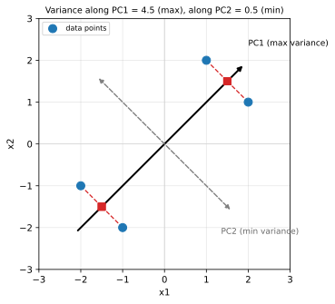
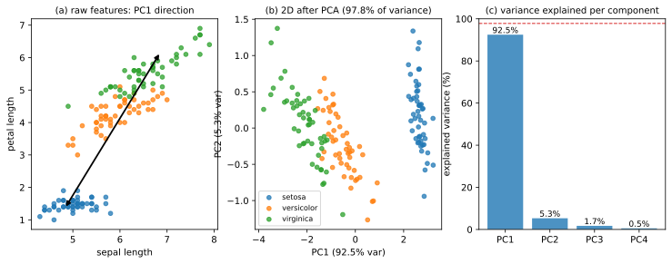

# 14.1 PCA: 분산을 최대로 보존하는 축 찾기

[](https://colab.research.google.com/github/SuminHan/book-ml/blob/main/notebooks/ml1/chapter14_1_pca.ipynb)

### 정답 없이 배운다는 것

지금까지 배운 모든 모델은 "정답(\\(y\\))"이 있었다 — 집값, 스팸 여부, 클래스
라벨. **비지도학습**은 그 정답이 없다. 대신 데이터 \\(x\\) 자체의 구조를
찾는다: "이 고객들은 몇 개의 그룹으로 자연스럽게 나뉘는가"(군집화), "이 1000개
특징 중 실제로 중요한 정보는 몇 차원짜리인가"(차원축소).

Chapter 4.3에서 이미 다룬 k-means도 비지도학습이다 — kNN이나 지금까지의
회귀·분류는 정답 라벨 \\(y\\)를 향해 맞춰가지만, k-means는 라벨 없이 데이터
\\(x\\)의 위치만 보고 "가까운 점끼리 묶는다"는 구조 하나로 그룹을 만들어낸다.
\\(k\\)를 고르는 법(팔꿈치 방법)도 Chapter 4.3과 동일하다.

### 왜 차원을 줄이고 싶은가

Chapter 4.2에서 배운 차원의 저주를 떠올려보자 — 특징이 너무 많으면 "가까움"이라는
개념 자체가 무너진다. PCA[^cs229]는 원본 데이터의 분산(정보)을 최대한 보존하면서,
서로 상관관계가 높아 사실상 중복인 특징들을 몇 개의 새로운 축(주성분)으로
압축한다.

차원을 줄이는 데는 세 가지 실용적인 이유가 겹친다. 첫째, **차원의 저주**
(4.2절) — 특징이 100개면 kNN·k-means 같은 거리 기반 방법은 "가까움"을 재는 것
부터가 무의미해지므로, 중요한 축 2~3개만 남기는 것 자체가 모델을 살리는
방법이다. 둘째, **비용과 속도** — 특징 1000개인 데이터를 분류기에 돌리는 것보다
중요한 성분 50개만 골라 돌리는 쪽이 학습·예측이 훨씬 빠르고, 저장 용량도
줄어든다. 셋째, **시각화와 해석** — 4차원 이상의 데이터는 사람이 눈으로 볼 수
없는데, 2~3차원으로 압축한 결과를 `scatter`로 그리면 "데이터의 구조가
대체로 어떤 모양인지"를 눈으로 판독할 수 있게 된다(아래 실습의 붓꽃 그림이
그것이다). 세 이유가 모두 "정보를 잃으면서도 잃는 양을 최소화하라"는 한
목표로 수렴한다 — PCA는 그 목표를 **분산 보존**이라는 정량적 기준으로
정리해낸 것이다.

### PCA: 분산을 최대로 보존하는 축 찾기

데이터를 저차원으로 투영(project)하되, **투영된 데이터의 분산이 최대**가
되는 방향을 찾는 것이 목표다 — 정보를 가장 적게 잃는 방향이라는 뜻이다.

**절차**:

1. 데이터를 평균이 0이 되도록 중심화(centering)한다.
2. 공분산 행렬(covariance matrix) \\(\Sigma = \frac{1}{m}X^TX\\)를 계산한다.
3. \\(\Sigma\\)의 고유벡터(eigenvector)와 고유값(eigenvalue)을 구한다.
4. 고유값이 큰 순서대로 고유벡터를 정렬한다 — 각 고유벡터가 "주성분(principal
   component)"이고, 대응하는 고유값이 그 방향의 분산 크기다.
5. 상위 \\(d\\)개의 고유벡터에 데이터를 투영하면, \\(d\\)차원으로 압축된
   표현을 얻는다.

**왜 고유벡터인가**(직관): 공분산 행렬 \\(\Sigma\\)에 대해 \\(\Sigma v =
\lambda v\\)를 만족하는 \\(v\\)(고유벡터)는 "그 방향으로 데이터를
투영했을 때, 그 결과의 분산이 정확히 \\(\lambda\\)(고유값)가 되는" 특별한
방향이다. 분산을 최대화하는 문제를 라그랑주 승수법으로 풀면, 정확히 이
고유값 문제로 귀결된다는 것이 이번 장 연습문제의 핵심이다.

아래 두 섹션에서 이 "왜"를 두 단계로 풀어본다. 먼저 "방향 \\(v\\)로 투영한
데이터의 분산"이 행렬 계산으로 어떻게 \\(v^T \Sigma v\\)라는 한 줄이 되는지
보이겠고, 다음으로 그 값을 최대화하는 \\(v\\)를 구하는 라그랑주 승수법
풀이가 **고유값 문제**로 귀결됨을 직접 유도한다.

### 투영 분산이란: \\(v^T \Sigma v\\)라는 한 줄

"방향으로 투영한 분산"이라는 표현이 아직 막막하다면, 한 번 손으로
풀어보자. 데이터를 **중심화**했다고 가정하자(평균이 0). 어떤 단위벡터
\\(v\\)(\\(\\|v\\|=1\\))를 잡고, 각 데이터 점 \\(x\_i\\)를 \\(v\\) 방향으로
투영하면, 투영 값은 내적 \\(p\_i = v^T x\_i\\)다(스칼라 하나). 투영된 데이터
집합 \\(\\{p\_1, \dots, p\_m\\}\\)의 분산은:

\\[\underbrace{\frac{1}{m}\sum\_{i=1}^{m} p\_i^2}\_{\text{중심화돼 있으므로 평균 }0} =
\frac{1}{m}\sum\_{i=1}^{m} (v^T x\_i)(x\_i^T v) = v^T \Big( \frac{1}{m} \sum\_{i=1}^{m} x\_i x\_i^T \Big) v = v^T \Sigma v\\]

여기서 중간 단계에서 \\(v^T x\_i\\)는 스칼라라 순서를 바꿔 \\((v^T x\_i)(x\_i^T
v) = v^T(x\_i x\_i^T)v\\)로 묶은 것에 주의. 결국 **"방향 \\(v\\)로 투영했을
때의 분산"은 \\(v^T \Sigma v\\)라는 단일 스칼라**로 완전히 결정된다. PCA의
목표 — 분산을 최대화하는 방향 찾기 — 는 곧 다음 문제로 정리된다:

\\[\text{단위 조건 } v^T v = 1 \text{ 하에 } f(v) = v^T \Sigma v \text{를 최대화하는 } v \text{를 구하라}\\]

이 문제는 "제약이 붙은 최대화" 문제다 — \\(v\\)를 마음대로 키우면 \\(v^T
\Sigma v\\)도 같이 커지므로, 방향만 비교하도록 \\(\\|v\\|=1\\)이라는 제약을
걸어야 한다. 제약 최댓값 문제의 표준 도구가 **라그랑주 승수법**이다.



### 라그랑주 승수법으로 고유값 문제로: "왜 고유벡터인가"의 완전한 유도

위 문제를 라그랑주 승수법으로 풀어보겠다. 제약 \\(v^T v = 1\\)을 목적함수에
라그랑주 승수 \\(\lambda\\)로 붙인다:

\\[\mathcal{L}(v, \lambda) = v^T \Sigma v - \lambda (v^T v - 1)\\]

\\(v\\)로 미분해서 0으로 놓는다(\\(\frac{\partial}{\partial v}(v^T \Sigma v) =
2\Sigma v\\), \\(\frac{\partial}{\partial v}(v^T v) = 2v\\)임을 이용 —
\\(\Sigma\\)가 대칭이므로 성립):

\\[\frac{\partial \mathcal{L}}{\partial v} = 2\Sigma v - 2\lambda v = 0 \quad\Longrightarrow\quad \Sigma v = \lambda v\\]

**이것이 바로 고유값 방정식이다.** 분산을 최대화하는 방향 \\(v\\)는 공분산
행렬의 고유벡터여야 하고, 그 분산값은 대응하는 고유값 \\(\lambda\\)다.
실제로 최적점 \\(v\\)를 원래 목적함수에 대입하면 \\(v^T \Sigma v = v^T(\lambda
v) = \lambda\\, (v^T v) = \lambda\\)가 되어, "그 방향의 분산"과 "고유값"이
정확히 같음을 직접 확인할 수 있다.

이 유도로부터 세 가지가 한꺼번에 따라온다:

- **첫 번째 주성분** = 가장 큰 고유값 \\(\lambda\_1\\)의 고유벡터 \\(v\_1\\).
  분산이 가장 큰 방향이므로, 이 방향에 투영하면 정보를 가장 많이 보존한다.
- **분산값 = 고유값**: \\(i\\)번째 주성분으로 투영했을 때의 분산은 정확히
  \\(\lambda\_i\\)다. 그래서 "고유값이 큰 순서대로 정렬"한다는 절차가 곧
  "정보량이 많은 축부터 남긴다"는 뜻이다.
- **상호 직교성**: \\(\Sigma\\)가 대칭 행렬이라서 서로 다른 고유값을 가진
  고유벡터는 자동으로 직교한다(\\(v\_i^T v\_j = 0\\), \\(i\ne j\\)). 즉 두 번째
  주성분은 "첫 번째 주성분과 직교하는" 방향 중 분산이 큰 것으로
  정해진다 — 주성분끼리 정보가 겹치지 않도록 수학이 알아서 보장해주는
  것이다. 이 직교성이 "차원이 줄어도 각 축이 서로 독립적인 정보를 담는다"는
  직관의 근拠다.

한 줄 요약: **"분산을 최대화하라"는 말과 "가장 큰 고유벡터를 찾아라"는 말은
같은 문제를 다른 말로 한 것이다.** 이것이 PCA 전체의 심장을 이루는 결과다.

### 손으로 한 번: 4개 점에서 PCA를 직접 따라가기

수식을 한 번 손으로 다뤄보면 추상적이던 "고유벡터 = 최대 분산 방향"이
구체적으로 붙는다. 아래 4개 점을 쓰자(의도적으로 **원점 중심**이 되도록
잡았다 — 중심화 단계를 생략할 수 있어 계산을 단순하게 하기 위함이다):

\\[P = \big[ (-2,-1),\ (-1,-2),\ (2,1),\ (1,2) \big]\\]

평균이 \\((0,0)\\)이라 이미 중심화된 상태다. 이 4개 점은 원점 주위로 대칭인데,
눈으로 보면 **45도 대각선 방향으로 늘어서** 있다. 이걸 확인하는 것이 PCA의
역할이다.

**1단계 — 공분산 행렬**: \\(\Sigma = \frac{1}{4}\sum x\_i x\_i^T\\)를
직접 계산한다.

\\[\Sigma = \frac{1}{4}\begin{pmatrix} 4+1+4+1 & 2+2+2+2 \\ 2+2+2+2 & 1+4+1+4 \end{pmatrix}
= \frac{1}{4}\begin{pmatrix} 10 & 8 \\ 8 & 10 \end{pmatrix}
= \begin{pmatrix} 2.5 & 2.0 \\ 2.0 & 2.5 \end{pmatrix}\\]

(\\((2,1)\\)의 외적에서 대각에 \\(2^2=4\\), 비대각(off-diagonal) 성분에
\\(2\cdot1=2\\)가 들어가는 식으로 각 점을 더해갔다. 대칭 행렬이 나온 것에
주목하라 — 공분산 행렬은 항상 대칭이다.)

**2단계 — 고유값**: 특성방정식 \\(\det(\Sigma - \lambda I) = 0\\).

\\[(2.5-\lambda)^2 - (2.0)^2 = 0 \quad\Longrightarrow\quad
\lambda^2 - 5\lambda + 2.25 = 0 \quad\Longrightarrow\quad \lambda = 4.5,\ 0.5\\]

(구현 공식 \\(\lambda = \frac{5 \pm \sqrt{25-9}}{2} = \frac{5\pm 4}{2}\\).)
검산: 고유값의 합 = 대각합(trace) = \\(2.5+2.5 = 5.0 = 4.5+0.5\\) ✓.

**3단계 — 고유벡터(주성분)**: \\(\lambda\_1 = 4.5\\)에 해당하는 고유벡터는
\\(v\_1 = \frac{1}{\sqrt2}(1,1)^T\\)(45도 대각선), \\(\lambda\_2 = 0.5\\)에
해당하는 \\(v\_2 = \frac{1}{\sqrt2}(1,-1)^T\\)(수직 방향)이다. 대각합이 같은
\\(2.5\\)인데 비대각(off-diagonal) 성분 \\(2.0\\)이 양수(양의 상관)이므로,
데이터가 "첫 좌표가 크면 둘째도 크다"는 방향으로 기울어져 있고 — 그래서
최대 분산 방향이 45도 대각선으로 **기울어져** 있다.

**4단계 — 분산을 비교해보자**: 각 후보 방향으로 투영했을 때의 분산이 얼마인지
직접 계산하면 PCA가 왜 대각선을 고르는지 눈으로 확인된다.

| 방향 | 단위벡터 \\(v\\) | 투영 분산 \\(v^T\Sigma v\\) |
|---|---|---|
| x축 | \\((1,0)\\) | \\(2.5\\) |
| 45도(대각선) | \\((1,1)/\sqrt2\\) | **\\(4.5\\) (최대)** |
| 수직 | \\((1,-1)/\sqrt2\\) | \\(0.5\\) (최소) |
| 45도와 x축 사이 | \\((1, 0.5)/\\|{\cdot}\\|\\) | \\(\approx 4.1\\) |

원본 x축 분산(\\(2.5\\))보다 대각선 분산(\\(4.5\\))이 더 크다 — **축을
"올바른" 방향으로 돌리면 같은 데이터에서 더 많은 분산(정보)을 한 축에
담을 수 있다**는 것이 PCA의 본질이다. 그리고 \\(4.5 + 0.5 = 5.0\\)이 원래
전체 분산과 정확히 일치한다 — 투영 분산의 합은 축을 아무리 돌려도 보존된다는
성질이다.

**5단계 — 투영하고, k-means와 이어붙이기**: \\(v\_1 = (1,1)/\sqrt2\\)에
투영하면 각 점의 좌표는 \\(p = v\_1^T x = (x\_1+x\_2)/\sqrt2\\)이다.

- \\((-2,-1) \to -3/\sqrt2 \approx -2.12\\)
- \\((-1,-2) \to -3/\sqrt2 \approx -2.12\\)
- \\((2,1) \to +3/\sqrt2 \approx +2.12\\)
- \\((1,2) \to +3/\sqrt2 \approx +2.12\\)

1차원으로 줄어든 값이 \\(\\{-2.12, -2.12, +2.12, +2.12\\}\\) — **두 그룹이
완벽히 갈라진다.** 여기서 1차원 k-means를 \\(k=2\\)로 돌리면 중심점이
\\(-2.12\\)와 \\(+2.12\\)에 정확히 오르고, 할당은 \\([0,0,1,1]\\)이다.
"차원을 줄인 뒤 군집화한다"는 파이프라인(PCA → k-means)이 작은 예시에서
제대로 작동하는 모습을 본 것이다.

**6단계 — 재구성 오차가 정확히 얼마인지**: 주성분 하나(\\(v\_1\\))만 남기고
재구성하면, 각 원본 점에서 대각선까지의 수직 거리가 재구성 오차다. 이 예시
에서는 4개 점에서 모두 \\(|x\_1-x\_2|/\sqrt2 = 1/\sqrt2 \approx 0.707\\)이다.
전체 제곱오차의 평균은 \\(4 \times (0.707)^2 / 4 = 0.5\\) — **버린 주성분의
고유값 \\(\lambda\_2 = 0.5\\)와 정확히 같다.** "상위 성분만 남길 때 잃는 정보량
= 버린 성분들의 고유값의 합"이라는 PCA의 핵심 성질을 손으로 확인한 것이다.

### 실습: 4차원 붓꽃 데이터를 2차원으로 압축하고 얼마나 정보가 남는지 확인하기

붓꽃(iris) 데이터셋(꽃받침·꽃잎의 길이·너비 4개 특징, 150개 샘플)에
PCA를 직접 적용해보자:

```python
import numpy as np

Xc = X - X.mean(axis=0)  # 중심화
cov = (Xc.T @ Xc) / len(Xc)
eigvals, eigvecs = np.linalg.eigh(cov)
order = np.argsort(eigvals)[::-1]
eigvals, eigvecs = eigvals[order], eigvecs[:, order]

print("고유값(각 축의 분산):", eigvals)
print("설명 분산 비율:", eigvals / eigvals.sum())

X2d = Xc @ eigvecs[:, :2]  # 상위 2개 주성분에 투영
```

실행 결과(스크래치패드에서 실행 검증):

```
고유값: [4.200, 0.241, 0.078, 0.024]
설명 분산 비율: [0.925, 0.053, 0.017, 0.005]
상위 2개 주성분의 설명 분산 비율 합: 0.978
```

원본 4개 차원 중 **상위 2개의 주성분만으로 전체 분산의 97.8%**를
그대로 보존한다 — 나머지 2개 차원을 통째로 버려도 정보 손실이
2.2%뿐이라는 뜻이다. 이게 가능한 이유는 애초에 4개의 원본 특징(꽃받침
길이·너비, 꽃잎 길이·너비)이 서로 상당히 상관되어 있어서(예: 꽃잎이
길면 보통 넓기도 하다), 사실상 "독립적인 정보"는 2~3개 차원어치밖에
안 됐기 때문이다 — PCA는 이 숨겨진 중복을 정확히 찾아내 제거한다.

아래 그림에서 왼쪽은 원본 특징 좌표(꽃받침 길이 × 꽃잎 길이)에 PC1 방향을
그린 것이고, 가운데는 PCA로 압축한 2차원 공간, 오른쪽은 각 주성분이
설명하는 분산 비율이다. 가운데 패널에서 세 종류(색상)가 2차원 공간에서도
거의 완벽히 갈라져 있음을 확인할 수 있다 — 4차원에서 2차원으로 떨어뜨렸을
때도 "종류 구분"에 필요한 구조가 거의 사라지지 않는다는 뜻이다.



이 결과를 `sklearn`의 `PCA` 클래스[^scikitlearn]로 다시 한번 확인하면 동일한 고유값이
나온다. 다만 `sklearn.decomposition.PCA`는 `fit` 시 내부적으로
**중심화**를 해주고, `components_`에 주성분(고유벡터)을,
`explained_variance_ratio_`에 설명 분산 비율을, `fit_transform` 결과에
압축된 좌표를 돌려준다 — 위 numpy 코드가 하는 것과 정확히 같은 일을
한다.

```python
from sklearn.decomposition import PCA
pca = PCA(n_components=2)
X2d_sk = pca.fit_transform(X)
print("sklearn 설명 분산 비율:", pca.explained_variance_ratio_)
# [0.9246 0.0531] — 위 numpy 계산을 그대로 재현
```

두 구현(numpy의 `eigh` vs sklearn)의 결과가 거의 같은 것을 보면, PCA가
"특정 라이브러리의 마법"이 아니라 **공분산 행렬의 고유분해**라는
명확한 선형대수 연산이라는 것을 확인할 수 있다.

**주의 — 공분산(covariance)과 상관(correlation) 기준의 차이**: 위 코드는
공분산 행렬 \\(\Sigma\\)의 고유분해다. `sklearn`의 `PCA`도 기본이
**공분산** 기준이다(중심화만 해주고 스케일링은 안 해준다). 그런데 특징을
먼저 표준화한 뒤 PCA를 하는 것 — 이 경우 고유분해의 대상이 공분산이 아니라
**상관행렬**(correlation matrix)이 된다. 공분산 기준과 상관 기준의 결과가
언제, 얼마나 달라지는지(그리고 왜 실전에서 표준화 없이 PCA를 돌리면
안 되는지)는 아래 "자주 하는 실수" 섹션에서 바로 확인한다.

### 실용: 몇 차원을 남길 것인가 (스크리 플롯)

"상위 2개가 97.8%"처럼 **누적** 설명 분산 비율을 그려서, 어느 차원부터는
"더 남겨도 거의 의미 없는 작은 고유값"인지를 고르는 것이 표준적
방법이다. 이 누적 곡선을 **스크리 플롯**(scree plot, "벼랑"이라는 뜻 —
곡선이 급격히 떨어졌다가 평평해지는 모양에서 유래)이라고 부른다.

\\[\text{누적 설명 분산} = \frac{\sum\_{i=1}^{k} \lambda\_i}{\sum\_{i=1}^{d} \lambda\_i}\\]

"누적이 90%(또는 95%)를 넘는 가장 작은 \\(k\\)"를 고르는 것이 가장 흔한
기준이다. 붓꽃 데이터의 누적 값은 \\([92.5\\%,\ 97.8\\%,\ 99.5\\%,\ 100\\%]\\) —
1개만 남겨도 이미 92.5%, 2개면 97.8%다. "95% 기준"이라면 \\(k=2\\)가
된다. 이 판단은 아래 "자주 묻는 질문"의 첫 답변에서 더 상세히 다룬다.

### 자주 하는 실수: 표준화(스케일링) 없이 PCA를 돌리기

PCA가 **분산**을 기준으로 축을 고르는 순간, "수치가 큰(분산이 큰) 특징"이
자동으로 더 큰 비중을 차지하게 된다. 이것은 의도적으로 원할 때는 장점이지만,
특징들의 **단위가 서로 다른** 경우에는 거의 항상 **버그**가 된다.

**예를 들어보자.** 키(센티미터, 예: 평균 170, 표준편차 8)와 몸무게(킬로그램,
예: 평균 65, 표준편차 6)라는 두 특징이 있다고 하자. 키의 분산(\\(\approx
64\\))이 몸무게의 분산(\\(\approx 36\\))보다 크면, 표준화 없이 PCA를 돌렸을
때 첫 번째 주성분은 **거의 키 쪽에 쏠려** 있다 — 키와 몸무게가 실제로
얼마나 상관되는지와 별개로. 데이터가 "키가 크면 무겁다"와 같은 **상관
구조**를 담고 있어도, 분산 크기의 차이가 그것을 가려버린 것이다.

실제로 확인해보자(장난감 데이터, 키 40명):

```python
import numpy as np
rng = np.random.RandomState(0)
h  = rng.normal(170, 8, 40)                     # 키 (cm)
wt = (h - 170) * 0.5 + rng.normal(0, 4, 40)      # 몸무게 (kg), 키와 상관 있음
raw = np.column_stack([h, wt])

# (1) 표준화 없이 PCA
cov_raw = np.cov(raw.T)
w_raw, v_raw = np.linalg.eigh(cov_raw)
o = np.argsort(w_raw)[::-1]
print("RAW   PC1 방향:", v_raw[:, o[0]].round(3), " 1차원 설명분산:", round(w_raw[o[0]]/w_raw.sum()*100,1), "%")

# (2) 표준화(각 컬럼 / 표준편차) 후 PCA
scaled = (raw - raw.mean(axis=0)) / raw.std(axis=0)
cov_s = np.cov(scaled.T)
w_s, v_s = np.linalg.eigh(cov_s)
o2 = np.argsort(w_s)[::-1]
print("SCALED PC1 방향:", v_s[:, o2[0]].round(3), " 1차원 설명분산:", round(w_s[o2[0]]/w_s.sum()*100,1), "%")
```

실행 결과(스크래치패드에서 실행 검증):

```
RAW    PC1 방향: [-0.851 -0.525]  1차원 설명분산: 92.7 %   ← 키(수치가 큰 축)에 쏠림
SCALED PC1 방향: [ 0.707  0.707]  1차원 설명분산: 91.3 %   ← 두 축을 동등하게 대우
```

표준화 **없이**는 PC1이 키 축(첫 특징)에 크게 쏠린 방향(약 \\((-0.85,-0.53)\\))으로
나오고, 표준화 **후**에는 두 축을 동등하게 대우한 45도 방향(약 \\((0.71,0.71)\\))으로
바뀐다. **같은 데이터인데, 단위를 어떻게 줬는지에 따라 주성분의 방향이
달라지는 것** — 이것이 "스케일링 없이 PCA"가 왜 위험한지의 구체적 모습이다.
키와 몸무게가 실제로 강하게 상관되어 있어 표준화 후에도 PC1이 45도 방향을
지키는 것(설명분산 91%)은 "상관 구조를 정확히 찾았다"는 뜻이지만, 표준화
없이 했을 때는 그 방향이 **단위의 인위적 차이**의 영향을 받은 것이다.

**실무 규칙**: PCA를 돌리기 전에 **항상** `sklearn.preprocessing.StandardScaler`
(또는 `StandardScaler().fit_transform(X)`)로 각 특징을 평균 0·표준편차 1로
정규화한다. 특징들이 이미 같은 단위를 공유하고(예: 붓꽃처럼 전부 센티미터)
의도적으로 공분산 기준으로 PCA를 하고 싶을 때만 표준화를 생략해도 된다 —
그리고 그 선택을 **의식적으로** 해야 한다, "잊어서" 생략하는 것은 아니다.
`sklearn`의 `PCA` 클래스는 표준화를 **자동으로 해주지 않는다**(중심화만
해준다) — 스케일링은 사용자의 몫이다.

### PCA의 한계: 직선·분산·라벨의 세 가지 전제

PCA가 강력한 이유는 단순함 때문이지만, 그 단순함은 세 가지 전제를
의미한다 — 데이터가 이 전제에서 벗어나면 PCA는 "잘못된" 축을
반환할 수 있다.

- **직선 축만 찾는다**: PCA는 **직교한 직선**(평면) 좌표계만 찾는다.
  데이터가 원·나선·곡면처럼 **비선형**으로 늘어서 있으면, PCA는 그 곡선을
  잘 잘라버린 직선으로 근사할 뿐이다. "곡면 위에서는 가까운데 원본
  좌표계에서는 먼" 점을 PCA는 이해하지 못한다. 이 한계를 비선형으로
  일반화한 것이 Chapter 5.3의 커널 트릭을 차원축소에 적용한 **커널 PCA**
  (kernel PCA)다 — 데이터를 임의의 재생성 가능 사상(커널 함수)으로
  고차원에 올린 뒤 그 공간에서 PCA를 하는 것. "주성분분석의 비선형 버전"이
  정확히 무엇인지 궁금하다면 커널 PCA를 보라.
- **분산이 곧 정보라고 가정한다**: PCA는 "분산이 큰 방향 = 정보가
  많은 방향"이라고 **정의**한다. 그런데 실제로는 **분산이 큰 방향이
  라벨(정답)과는 무관**인 경우도 있다. 예를 들어 이미지 데이터에서
  "조명 밝기"는 분산이 큰 축이지만 분류에 쓸모없을 수 있다 — PCA는
  라벨을 모르므로(비지도학습) 이를 구분할 수 없다. "라벨을 이용해
  유용한 방향을 찾는다"는 **지도 차원축소**(예: LDA, Linear
  Discriminant Analysis)가 이 한계를 보완한다. PCA는 "데이터의
  구조"를, LDA는 "라벨을 구분하는 방향"을 찾는다 — 목적 자체가 다르다.
- **아웃라이어에 민감하다**: 공분산 행렬은 **평균**과 **2차 모멘트**를
  쓰므로, 멀리 떨어진 아웃라이어 하나가 공분산(따라서 고유벡터)을
  그쪽으로 확 잡아당길 수 있다. Chapter 4.3에서 k-means의 중심점(평균)
  이 아웃라이어에 끌려간 것과 같은 구조의 취약성이다.

세 가지 전제 — 직선, 분산, (라벨 무시) — 을 기억해두면, "PCA 결과를
믿을 수 있는가?"를 데이터의 성격으로 판단하는 기준이 된다.

### 역사: 피어슨에서 스피어먼, 그리고 아이겐페이스까지

PCA의 뿌리는 이 장의 서두에서 말한 대로 **1901년 칼 피어슨(Karl
Pearson)**의 논문 "On Lines and Plans of Closest Fit to Systems of
Points in Space"다. 피어슨은 "여러 개의 변수로 측정한 점들의 집합에
**가장 잘 맞는 직선(평면)**은 무엇인가"를 물었고, 그 답이 "분산이 최대인
방향"이었다. 120년이 지난 지금 이 아이디어는 그대로 쓰인다.

피어슨의 바로 다음 단계로, 1904년 **찰스 스피어먼(Charles Spearman)**이
심리측정(psychometrics) 연구에서 **"요인 분석"(factor analysis)**을
제시했다. 여러 가지 능력 테스트(언어, 기억, 공간 지각, …) 점수를
측정했는데, 그 점수들이 서로 꽤 상관관계가 있는 것을 발견했다 — 스피어먼은
이것을 "모든 테스트 점수를 동시에 움직이는 **단 하나의 공통 요인(general
factor, 'g')**이 있다"고 해석했다. 이건 사실상 **요인 1개짜리 PCA**의
정서적 선구다. "여러 측정값이 서로 상관된 이유는, 그 뒤의 잠재 요인이
몇 개인가?"라는 질문은 PCA가 해결하는 문제와 정확히 같은 모양이다.

PCA가 현대 ML에서 널리 쓰이기 시작한 계기는 1990년대의 **얼굴 인식**
연구였다. 1991년, MIT의 **마틴 트루엑스(Martin Turk)와 압바스 팻랜드먼
(Anil Pentland)**가 "얼굴을 이미지(벡터)로 보고, 그 공간의 주성분
방향을 **'고유얼굴'(eigenface)**이라 부르자"는 아이디어를 발표했다.
수많은 얼굴 이미지를 쌓아 PCA를 하면, "사람 얼굴의 변화 축" — 예를 들어
"눈이 가늘다/크다", "광대가 좁다/넓다" 같은 축 — 을 자동으로 추출할
수 있다. 새로운 얼굴을 그 고유얼굴들에 투영해서 얻은 **계수 벡터**가
곧 그 얼굴의 압축된 표현(임베딩)이고, 계수 벡터 간 거리로 유사도를
잴 수 있다. 이것이 "이미지를 사람이 볼 수 있는 축으로 줄이는" 임베딩
의 초기 형태다 — Chapter 14.2의 word2vec[^word2vec]이 단어를, 14.3의
Node2Vec[^node2vec]이
그래프 노드를 벡터로 만들 때, "데이터 자체에서 구조를 찾아 저차원
벡터를 만든다"는 동일한 정신을 공유한다.

**"분산이 큰 방향을 찾아라"는 120년 전의 단순한 질문에, 얼굴 인식·단어
임베딩·그래프 임베딩까지 이어지는 하나의 줄기가 있다 — PCA는 표현학습
(representation learning)의 가장 오래된, 가장 단순한 원형이다.**


### 확인 문제: 1차원 데이터에 PCA를 적용하기

PCA가 1차원에서는 "분산이 최대인 방향 = 데이터가 퍼져 있는 방향"임을
직접 확인해보자. 점 세 개 \\(x = (-2,\ 0,\ 2)\\)(1차원, 이미 평균
\\(0\\)이다)에 대해:

**단계 1**: 공분산(1차원이라 단순한 분산)을 계산하라.

**단계 2**: 1차원의 "방향"은 \\(+1\\) 또는 \\(-1\\)만 가능하다(단위벡터).
두 방향으로 각각 투영했을 때의 분산은 얼마인가? (힌트: 1차원이므로
투영은 그냥 부호만 바꾸는 일이다 — 분산은 동일할 것이다.)

**단계 3**: 고유값이 얼마인가? (힌트: 1×1 행렬 \\([\sigma^2]\\)의 고유값은
그 값 자체다.) 이 고유값이 단계 1의 분산과 일치하는가?

정답(확인용): 단계 1 — 분산 = \\(\frac{(-2)^2 + 0^2 + 2^2}{3} = \frac{8}{3}
\approx 2.67\\). 단계 2 — \\(+1\\) 방향으로 투영하면 \\(\\{-2,0,2\\}\\),
\\(-1\\) 방향으로 투영하면 \\(\\{2,0,-2\\}\\) — 분산은 모두 \\(8/3\\)로
동일(부호만 바뀌므로). 단계 3 — 고유값 = \\(8/3\\), 단계 1의 분산과 정확히
일치. 1차원에서는 "방향을 고르는" 것이 본질적으로 없으므로, PCA는
"데이터의 분산 자체를 돌려주는" 자명한 결과를 낸다 — 차원이 2 이상에서
"어떤 방향으로 돌릴 것인가"가 비로소 질문이 된다.

### 자주 묻는 질문

**Q. 몇 개의 주성분을 남겨야 하는지 어떻게 정하나요?** 위 "설명 분산
비율"의 누적 합이 90%나 95% 같은 기준을 넘는 지점까지 주성분을
남기는 것이 흔한 방법이다 — Chapter 7.2의 랜덤 포레스트에서 트리
개수를 정할 때 "더 늘려도 성능이 거의 안 오르는 지점"을 찾던 것과
비슷한 실용적 기준이다.

**Q. PCA와 Chapter 6의 정규화(L1/L2)는 둘 다 "모델을 단순하게 만든다"는
점에서 비슷한가요?** 목적은 비슷하지만 작동 방식이 다르다 — 정규화는
학습 중에 손실함수에 페널티를 더해 가중치를 작게 유지하는 반면, PCA는
학습 이전에 데이터 자체의 차원을 미리 줄인다(전처리 단계). 둘을 함께
쓰는 것도 흔하다 — 특징을 PCA로 먼저 압축한 뒤, 그 압축된 특징으로
정규화된 모델을 학습시키는 파이프라인이 실전에서 자주 쓰인다.

**Q. PCA는 "압축"이라서 정보를 완전히 보존하지 못하는 건가요?**
PCA는 **손실 있는 압축**(lossy compression)이다 — 상위 \\(d\\)개의
주성분만 남기면 나머지 정보(버린 주성분들의 기여)는 **영구히**
사라진다. 그러나 "분산 기준"으로 가장 중요한 부분부터 보존하므로,
버린 정보의 양은 (버린 고유값의 합으로) 정확히 계산할 수 있다 —
무작위로 특징을 고르거나 잘라내는 것과 달리, "얼마나 잃는지"가
정량적으로 알려진 것이 PCA의 장점이다. 모든 정보를 보존하려면
(lossless) 전체 주성분을 모두 남겨야 한다.

**Q. PCA가 클러스터링(k-means) 전에 항상 필요한가요?** 아니다 —
"항상"은 아니다. PCA가 특히 잘 맞는 경우는 (a) 특징들이 서로 상관되어
있어 중복이 있을 때, (b) 차원이 높아 차원의 저주가 문제가 될 때,
(c) 노이즈(분산이 작은 성분)를 제거하고 싶을 때, 이 세 가지다. 특징들이
서로 무관하고 차원이 낮다면 PCA를 거치는 것은 불필요한 단계(오히려
해석성을 잃을 수 있다). "k-means를 돌리기 전에 PCA"라는 습관은
"분산 기준으로 노이즈/중복을 정리한 뒤 군집화"라는 의도가 있을 때
만 뜻이 있다.

**Q. PCA는 라벨을 모르는데, 분류 문제에도 쓸 수 있나요?**
PCA 자체는 라벨을 쓰지 않는다(비지도). 그러나 **전처리**로서 분류
파이프라인에 자주 쓰인다 — "PCA로 차원 축소 → 축소된 특징으로
분류기 학습"은 표준적이다. 이 경우 PCA는 "라벨을 구분하는 방향"을
알아내지는 못하지만, 중복/노이즈 축을 정리해주는 역할은 한다.
"라벨을 아는" 차원축소(지도 차원축소, 예: LDA)를 쓰고 싶다면
Chapter 15의 GMM/EM이나 다른 지도 기법을 보라.

**Q. 주성분(고유벡터)의 방향을 "해석"할 수 있나요?** 주성분은 원본
특징의 **선형 결합**이므로, "PC1 = 0.8×꽃잎길이 + 0.6×꽃잎너비 − …"
처럼 원본 특징의 가중 합으로 쓸 수 있다. 가중치의 **크기와 부호**를
보아 "이 주성분은 원본 특징 중 어떤 것의 변동을 주로 담고 있는가"를
판독할 수 있다(이 가중치를 **로딩**(loading)이라고 부른다). 다만
"이 방향이 '꽃의 크기'다"처럼 의미를 부여하는 것은 해석자의 몫이며,
PCA가 자동으로 "의미"를 알려주는 것은 아니다.

---

## 연습문제

**1. (코딩)** 아래 `pca` 함수를 완성하라 — 중심화, 공분산 행렬 계산,
`np.linalg.eigh`로 고유값/고유벡터, 고유값 내림차순 정렬, 상위
`n_components`개의 주성분으로 투영한 좌표를 반환한다.

```python
import numpy as np

def pca(X, n_components):
    # ADD ADDITIONAL CODE HERE!!
    # (힌트: Xc = X - X.mean(axis=0); cov = (Xc.T @ Xc) / len(Xc);
    #        np.linalg.eigh(cov) -> 고유값, 고유벡터(단위길이 보장);
    #        np.argsort(...)[::-1]로 내림차순 정렬;
    #        Xc @ eigvecs[:, :n_components])

X = np.array([[-2,-1],[-1,-2],[2,1],[1,2]], dtype=float)  # 본문 "손으로 한 번"의 4개 점
Z = pca(X, n_components=1)
print(Z)  # 각 점이 PC1(45도 대각선)에 투영된 값 — [-2.12, -2.12, +2.12, +2.12] 근처
```

**확인**: 반환된 좌표가 본문 5단계의 투영 값(\\(\approx \pm 2.12\\))과
일치하는지, 그리고 `Z`의 분산이 \\(\lambda\_1 = 4.5\\)와 일치하는지
확인하라(\\(Z\\)가 이미 1차원이므로 `Z.var()`).

**2. (손계산)** 2차원 데이터가 4개 점 \\((-3,0),(0,0),(3,0),(0,0)\\)
이라고 하자(모두 x축 위에, 평균은 \\((0,0)\\)).
(a) 중심화한 뒤 공분산 행렬을 계산하라. (b) 고유값 두 개를 구하라.
(c) 첫 번째 주성분의 방향과, 이 방향으로 투영했을 때의 분산은?
정답 힌트: 모든 점이 x축 위에 있으므로 y축 방향의 분산은 0이고,
공분산 행렬은 \\(\begin{pmatrix} \* & 0 \\ 0 & 0 \end{pmatrix}\\) 형태가
된다 — PC1 = x축, PC2의 분산 = 0이어야 한다. 중심화 후 x좌표
\\((-3,0,3,0)\\)의 분산을 계산하면 (a)의 \\(\*\\)와 (b),(c)의 답이
다 나온다.

[^cs229]: 더 깊이 보려면: Stanford CS229: Machine Learning, Lecture Notes. https://cs229.stanford.edu/main_notes.pdf — 이 절의 차원축소(PCA·공분산 행렬의 고유분해)는 CS229의 Unsupervised Learning / Dimensionality Reduction 강의와 직접 겉친다.
[^word2vec]: Mikolov, T., Chen, K., Corrado, G., Dean, J. (2013). "Efficient Estimation of Word Representations in Vector Space." arXiv:1301.3781.
[^node2vec]: Grover, A., Leskovec, J. (2016). "node2vec: Scalable Feature Learning for Networks." arXiv:1607.00653.
[^scikitlearn]: Pedregosa, F. et al. (2011). "Scikit-learn: Machine Learning in Python." JMLR 12(2011), arXiv:1201.0490.

**3. (개념 서술)** "PCA는 데이터를 축을 돌리는(회전) 것이다. 회전은
점과 점 사이의 **거리**를 보존한다(등거리 변환)." 이 문장이
**그대로** 성립하는가, 아니면 조건이 있는가? 1차원으로 축소(투영)
할 때 점 사이 거리가 어떻게 변하는지, 그리고 이것이 "PCA로
축소하면 kNN 같은 거리 기반 분류기의 성능이 떨어질 수 있다"는
말과 어떻게 연결되는지 두세 문장으로 설명하라. (힌트: "회전"만 하면
거리를 보존하지만, PCA는 회전 **이후** 일부 좌표를 버리는 **투영**
도 포함한다 — 버리는 단계에서 거리가 변한다.)
