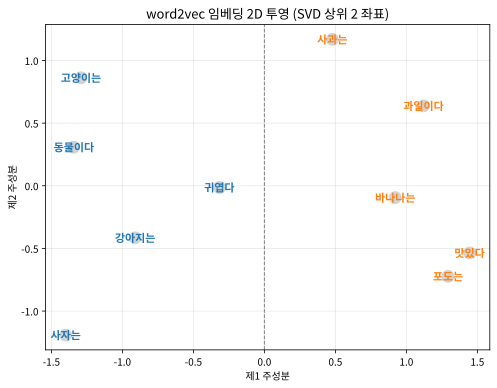

# 14.2 word2vec: 단어를 벡터로

[](https://colab.research.google.com/github/SuminHan/book-ml/blob/main/notebooks/ml1/chapter14_2_word2vec.ipynb)

### 임베딩: PCA와는 다른 방향의 압축

PCA가 "이미 벡터인 데이터"를 압축한다면, **임베딩**(embedding)은 원래
벡터가 아니었던 것(단어, 그래프의 노드)을 학습을 통해 저차원 벡터로
표현하는 방법이다. 목표는 PCA와 같다: **고차원(또는 벡터가 아닌) 원본을,
유용한 구조를 보존한 채 저차원 벡터로 압축한다.**

2013년 미콜로프(Tomas Mikolov) 등이 제안한 **word2vec**[^word2vec]은 "단어의 의미는
주변에 어떤 단어가 오는지로 결정된다"(분포 가설, distributional
hypothesis — "그 단어의 친구를 보면 그 단어를 안다")는 직관을 학습으로
구현한다. **Skip-gram** 방식은 중심 단어 하나로 주변 단어들을 예측하도록
작은 신경망을 학습시키는데, 학습이 끝난 뒤 **이 신경망의 가중치 자체가
각 단어의 임베딩 벡터**가 된다 — "다음 단어 맞히기"라는 목표는 수단일
뿐, 진짜 원하는 결과물은 그 과정에서 부산물로 나오는 벡터다(Chapter
13의 "다음 토큰 예측이 문법·지식을 부산물로 남긴다"는 이야기와 같은
패턴이다).

이렇게 학습된 벡터는 놀라운 성질을 갖는다 — 단어 사이의 의미 관계가
벡터의 뺄셈/덧셈으로 나타난다[^word2vec-phrase]:

\\[\text{vec}(\text{king}) - \text{vec}(\text{man}) + \text{vec}(\text{woman}) \approx \text{vec}(\text{queen})\\]

"왕에서 남자다움을 빼고 여자다움을 더하면 여왕"이라는 관계를 학습 당시엔
전혀 명시적으로 가르치지 않았는데도, 벡터 공간의 기하학적 구조가 스스로
그렇게 정리된 것이다.


### 조금 더 긴 이야기: "단어를 어떻게 숫자로 만들까"의 50년

오늘의 임베딩 기술이 갑자기 2013년에 나타난 것은 아니다. 1958년,
언어학자 조지 밀러(George Miller)와 찰스 채프먼(Charles Chapman)이
*Language and Communication*에 실린 "The Psychological Analysis of
Language" 논문에서 "단어는 **비슷한 맥락**(context)에 함께 등장하는
것끼리 서로를 정의한다"고 썼고,
1965년 지니(Jerry Firth)가 이를 한 줄로 압축했다 — **"You shall know a
word by the company it keeps."**(그 단어의 친구를 보면 그 단어를
안다.) 이 **분포 가설**(distributional hypothesis)이 word2vec의
전부인 셈이다 — 다만 1960년대엔 이 가설을 기계가 학습하게 만들
수단이 없었을 뿐이다.

실제로 그 전에는 단어를 숫자로 바꾸는 **bag-of-words** 방식이 표준
이었다: 어휘의 모든 단어를 나열하고, 각 문장마다 **각 단어가 몇 번
등장하는지 세어서** 그 문장을 어휘에 대한 벡터로 표현하는 것이다
(예: "고양이는 귀엽다"를 어휘 [고양이는, 귀엽다, …]에 대해
\\([1, 1, 0, \dots, 0]\\)처럼 표현). 문제가 두 가지다.

1. **차원이 어휘 크기와 같다** — 10만 단어 어휘면 10만 차원, 그중
   99.99%가 0인 극도로 희소(sparse)한 벡터다. 14.1절의 PCA가
   이런 데이터에 효과적으로 쓸 수 있는 것도, 실제로 "1인
   성분이 몇 개뿐"인 구조를 알아서 압축해 주기 때문이다.
2. **단어 사이의 "거리"에 의미가 없다** — one-hot 벡터에서는
   "고양이"와 "강아지"도 "고양이"와 "사과"와 **완전히 같은
   거리**(내적 0, 코사인 0)다. 의미를 담을 공간이 애초에
   설계되지 않은 것이다.

이 가설을 "기계 학습"으로 가져오려는 시도는 그 직후 시작됐다.
1988년 호프만과 슈트체(Hofmann & Schütze)가 제안한 **잠재 의미
인덱싱**(LSI, Latent Semantic Indexing)은 "단어×문서" 빈도 행렬에
**PCA와 같은 분해를 적용**해 단어를 잠재 의미 공간의 벡터로
표현한 최초의 시도다 — 이번 장 14.1절에서 배운 PCA가, 이미
"벡터화된 단어 데이터"에 적용된 모습이다(다만 LSI의 벡터는
**선형** 분해로 나오는 것이라, 아래에서 보듯 의미 유사도
연산까지는 만들어내지 못했다). 2003년 미콜로프가 **신경망
언어모델**(neural language model)[^bengio-nlm]을 내놓으며 "단어 벡터를
신경망 학습으로 만든다"는 아이디어가 실용화되었고, 2013년
word2vec가 그 효율화를 끝마쳤다. 이 흐름이 한 일은 "단어 →
one-hot"이 아니라 "단어 → **학습된** 저차원 밀집(dense) 벡터"로
변환하는 것 — 한 단어의 벡터는 "그 단어가 등장하는 문맥들의
**압축 요약**"이 되고, 문맥이 비슷한 단어들은 벡터도 비슷해진다.
분포 가설이 50년 만에 실제로 동작하는 기계로 구현된 것이다.

### Skip-gram의 실제 구조: "작은 신경망"을 정확히 보자

"작은 신경망을 학습시킨다"는 말을 이제 구체적으로 풀어보자.
**입력층**은 어휘 크기 \\(V\\)개(one-hot 입력), **은닉층**은
\\(d\\)개(= 임베딩 차원), **출력층**은 다시 어휘 크기 \\(V\\)개다.
중심 단어 \\(c\\)의 임베딩 벡터를 \\(\mathbf{v}\_c\\)(은닉층의
"가중치 행"이라고도 부른다), 출력층에서 단어 \\(t\\)를 가리키는
가중치 벡터를 \\(\mathbf{u}\_t\\)라고 쓰면, "중심 \\(c\\)의 바로 옆에
단어 \\(t\\)가 나올 확률"은 Chapter 2.3의 시그모이드로 이렇게
쓴다:

\\[p(t \mid c) = \sigma(\mathbf{u}\_t^\top \mathbf{v}\_c) =
\frac{1}{1 + e^{-\mathbf{u}\_t^\top \mathbf{v}\_c}}\\]

즉 "이 두 벡터의 내적이 클수록, \\(t\\)가 \\(c\\) 옆에 나올
가능성이 크다"고 학습된다. 학습 데이터는 말뭉치 전체에서
모든 (중심, 주변) 단어 쌍 — 앞뒤 \\(w\\)개 윈도우 안에서 실제로
함께 나온 쌍 — 이고, loss는 Chapter 3에서 다중분류로 쓴 바로 그
**이진 교차엔트로피**를 쌍마다 더해준 것이다:

\\[\mathcal{L} = -\sum\_{(c,t)\in \text{말뭉치}} \left[
\log p(t \mid c) + \sum\_{t' \in \text{네거티브 샘플}} \log (1 - p(t' \mid c))
\right]\\]

**CBOW**와 **Skip-gram**: 앞서 one-hot→밀집 벡터 이야기에서
"문맥 → 중심" 방향으로 예측하는 **CBOW**(Continuous Bag-of-Words)
와, "중심 → 주변" 방향의 **Skip-gram**을 구분할 필요가 있다.
둘의 차이는 "학습 속도"와 "어떤 단어를 잘 표현하는가"일 뿐이다:

- **CBOW**는 주변 단어 여러 개의 임베딩을 **평균**해서 중심 단어를
  예측한다. 주변이 평균이 되므로 계산이 빠르고, **고빈도 단어**(주변에
  자주 나오는 명사, 동사 등)의 의미를 더 정확히 잡는다.
- **Skip-gram**은 하나의 중심 단어에서 주변을 하나씩 예측한다.
  계산은 CBOW보다 느리지만, **저빈도 단어**(희귀한 고유명사,
  전문 용어)의 의미를 더 정확히 잡는다 — "이 단어의 주변이
  무엇이었는가"를 하나하나 명시적으로 학습하기 때문이다.

실용적 합의는 "데이터가 크고 빨리 뽑고 싶으면 CBOW, 희귀단어의
정확도가 중요하면 Skip-gram"이다. 본문의 코드는 Skip-gram을 쓴다.

### 네거티브 샘플링: "어휘 전체에 대한 softmax"를 피하는 트릭

여기서 핵심 엔지니어링 트릭 하나. 위 loss를 그대로 쓰면, 각 (중심,
주변) 쌍마다 **어휘 전체 \\(V\\)개 단어의 확률을 전부 계산**해야
한다(softmax의 분모). \\(V = 10^6\\)이면 매 스텝마다 100만개의
시그모이드, 수십억 쌍이 모이면 불가능하다.

**네거티브 샘플링**[^word2vec] (negative sampling)은 이 문제를 우회한다.
"정답 \\(t\\)" 하나를 맞히는 대신, **무작위로 뽑은 \\(k\\)개의
"가짜 단어" \\(t'\_1, \dots, t'\_k\\)도 함께 "아니다"로 학습**시킨다
(이 \\(k\\)를 \\(k\_{\text{neg}}\\)라 부른다 — 본문 코드의
`neg_k`). 즉, 하나의 (중심, 주변) 쌍에 대해 \\(1 + k\_{\text{neg}}\\)
개의 **이진 분류** 문제를 동시에 풀고, 그중 1개만 label=1
(정말 옆에 나온 단어), 나머지는 label=0(무작위로 뽑은 가짜)이다.
"어휘 전체를 한 번에 비교"하는 softmax(\\(O(V)\\))를, "정답 1개 +
가짜 \\(k\_{\text{neg}}\\)개만 비교"하는 이진 분류(\\(O(k\_{\text{neg}})\\))로
바꿔버린 것이다 — \\(k\_{\text{neg}} = 5\\) 정도면 충분하다(원본
논문은 \\(V \approx 10^7\\)일 때 5, \\(V \approx 10^5\\) 이하일 땐
2~5를 추천).

```python
import math, random

def train_skipgram(corpus, window=2, dim=8, epochs=50, lr=0.05, neg_k=3):
    # corpus: list of tokens (a single long sequence)
    vocab = sorted(set(corpus))
    idx = {w: i for i, w in enumerate(vocab)}
    V = len(vocab)
    # center-word / context-word weight matrices
    W_in  = [[random.uniform(-0.5, 0.5) for _ in range(dim)] for _ in range(V)]
    W_out = [[random.uniform(-0.5, 0.5) for _ in range(dim)] for _ in range(V)]

    def sigmoid(z):
        return 1 / (1 + math.exp(-max(-20, min(20, z))))

    pairs = []
    for i, center in enumerate(corpus):
        for j in range(max(0, i - window), min(len(corpus), i + window + 1)):
            if j != i:
                pairs.append((idx[center], idx[corpus[j]]))

    for _ in range(epochs):
        random.shuffle(pairs)
        for c, o in pairs:
            # positive pair (c, o) + a few random negative words
            targets = [(o, 1)] + [(random.randrange(V), 0) for _ in range(neg_k)]
            for t, label in targets:
                z = sum(W_in[c][k] * W_out[t][k] for k in range(dim))
                pred = sigmoid(z)
                grad = (pred - label) * lr
                for k in range(dim):
                    g_in, g_out = W_in[c][k], W_out[t][k]
                    W_in[c][k]  -= grad * g_out
                    W_out[t][k] -= grad * g_in
    return {w: W_in[idx[w]] for w in vocab}
```

신기하게도 이 학습의 그래디언트도 `(pred - label)`이라는 똑같은 인자로
시작한다 — Chapter 2 로지스틱회귀의 `(h_w(x) - y)`와 정확히 같은 형태다.
우연이 아니다: "중심 단어 c 옆에 실제로 단어 t가 나왔는가(label=1)
아니면 무작위로 끼워넣은 가짜 단어인가(label=0)"를 맞히는 **이진
분류** 문제로 word2vec을 학습시키기 때문이다. (`neg_k`개의 무작위
단어를 "가짜 정답"으로 같이 학습시키는 것이 **네거티브
샘플링**(negative sampling)으로, 매 스텝마다 어휘 전체에 대해 softmax를
계산하는 비용을 피하는 핵심 트릭이다. 위 코드는 아이디어만 보이려고
아주 작게 줄인 구현이고, 실제 word2vec은 수백만 단어·수십억 개의
(중심, 주변) 쌍으로 학습된다.)

**"가짜 단어를 많이 넣으면 더 정확해지는 것 아닌가?"** 직관적으로는
그렇게 생각할 수 있지만, 실제로는 \\(k\_{\text{neg}}\\)를 늘리는 것이
**항상 좋은 것은 아니다**. \\(k\_{\text{neg}}\\)가 0에 가까우면
"함께 나오는 쌍의 내적만" 커지고 안 나오는 쌍은 아무 페널티가 없어
모든 내적이 비슷해진다(비슷하지 않은 단어까지 코사인 유사도가
높아진다. 반면 \\(k\_{\text{neg}}\\)가 매우 크면, 한 쌍당 "분류할
이진 문제"가 너무 많아져 각 쌍이 받는 학습 신호가 오히려
희석되고, 학습도 느려진다. 실전에서는 \\(V \approx 10^7\\) 이상일 때
\\(k\_{\text{neg}} = 5\\), 어휘가 작을 때 2~5가 표준이며, 이 절의
작은 말뭉치(\\(V = 10\\))에서는 4가 좋다. 핵심은 **네거티브 샘플링이
"softmax를 근사"하는 것이 아니라 softmax 대신 **다른
loss**(이진 분류)를 사용하는 것**이라는 점 — 원본 softmax
손실의 **계산 비용**(매 스텝 \\(O(V)\\))을 피하기 위한
**대체(loss substitution**)인 것이다.

### 손으로 한 번: (중심=고양이, 주변=귀엽다) 쌍이 한 스텝에서 어떻게 갱신되는가

임베딩 차원 \\(d = 2\\), 학습률 \\(\eta = 0.1\\), **네거티브 샘플
\\(k = 0\\)**(가짜 단어 없음, 가장 단순한 경우)로, 한 쌍
\\((c, t) = (\text{고양이}, \text{귀엽다})\\), label=1(실제
옆에 나온 쌍)에 대해 한 스텝의 그래디언트를 손으로 따라가보자.
초기 가중치를 이렇게 놓는다고 하자:

\\[\mathbf{v}\_{\text{고양이}} = (0.4,\ -0.2), \qquad
\mathbf{u}\_{\text{귀엽다}} = (0.1,\ 0.3)\\]

**Step 1 — 시그모이드.** 내적 \\(z = \mathbf{u}^\top \mathbf{v}
= 0.1 \times 0.4 + 0.3 \times (-0.2) = 0.04 - 0.06 = -0.02\\).
\\(\sigma(-0.02) \approx 0.495\\) — "이 쌍이 정말 함께 나올
가능성 49.5%"라는, 사실상 동전 던지기 수준의 예측이다.

**Step 2 — 그래디언트.** Chapter 2.3의 로지스틱 회귀와 **완전히
같은** 형태: \\(\text{err} = \sigma(z) - y = 0.495 - 1 = -0.505\\).
두 벡터의 업데이트는 각각:

\\[\Delta \mathbf{v}\_c = -\eta \cdot \text{err} \cdot \mathbf{u}\_t
= -0.1 \times (-0.505) \times (0.1,\ 0.3) = (0.00505,\ 0.01515)\\]

\\[\Delta \mathbf{u}\_t = -\eta \cdot \text{err} \cdot \mathbf{v}\_c
= -0.1 \times (-0.505) \times (0.4,\ -0.2) = (0.02020,\ -0.01010)\\]

**Step 3 — 새 값.** \\(\mathbf{v}'\_{\text{고양이}} = (0.4051,\
-0.1849)\\), \\(\mathbf{u}'\_{\text{귀엽다}} = (0.1202,\ 0.2899)\\).

**무엇이 달라졌는가?** 새 내적 \\(z' = 0.1202 \times 0.4051 + 0.2899
\times (-0.1849) = 0.0487 - 0.0536 = -0.0049\\) — 이전 \\(-0.02\\)보다
**0에 가깝다** (정확히는 0보다 *클* 방향, 즉 \\(\sigma(z') \approx 0.4987 >
\sigma(z) \approx 0.495\\)). **정답 쌍의 시그모이드가 0.495 → 0.499로
올라갔다** — "이 두 단어는 정말 함께 나온다"는 신호가, 두 벡터의
내적을 아주 살짝(여기선 \\(d=2\\)이라 극히 미미하지만) 올려준 것이다.
\\(k\_{\text{neg}} = 4\\)의 실제 훈련에서는, 이 "정답 1쌍" 업데이트에
"가짜 4쌍" 업데이트(\\(\text{err} = \sigma(z) - 0 = \sigma(z) > 0\\)라
**내적을 *낮추는*** 방향)가 동시에 더해진다 — "함께 나오는 쌍의
내적을 올리고, 함께 안 나오는 쌍의 내적을 낮춘다"는 이 **상대적
순위(rank**)를 만드는 것이 word2vec 전체의 학습 목표다.

### 실습: 학습된 임베딩에서 코사인 유사도로 비슷한 단어 찾기

동물 관련 단어와 과일 관련 단어가 각각 비슷한 문맥에서 등장하는 작은
말뭉치로 `train_skipgram`을 학습시킨 뒤, "고양이는"과 코사인 유사도가
가장 높은 단어들을 찾아보자:

```python
def cos_sim(a, b):
    dot = sum(x*y for x, y in zip(a, b))
    na = math.sqrt(sum(x*x for x in a))
    nb = math.sqrt(sum(x*x for x in b))
    return dot / (na*nb + 1e-9)

corpus = ("고양이는 동물이다 강아지는 동물이다 사자는 동물이다 "
          "고양이는 귀엽다 강아지는 귀엽다 "
          "사과는 과일이다 바나나는 과일이다 포도는 과일이다 "
          "사과는 맛있다 바나나는 맛있다").split()
random.seed(42)  # 재현 가능하게
emb = train_skipgram(corpus, window=2, dim=8, epochs=200, lr=0.1, neg_k=4)

query = "고양이는"
sims = sorted(((w, cos_sim(emb[query], emb[w])) for w in emb if w != query),
              key=lambda kv: -kv[1])
```

결과(`random.seed(42)`로 고정해 재현 가능하게 실행):

```
동물이다: 0.875
사자는:   0.622
귀엽다:   0.581
사과는:   0.549
강아지는: 0.533
과일이다: 0.287
바나나는: 0.282
포도는:   0.169
맛있다:   0.084
```

"동물" 관련 단어들(동물이다, 사자는, 강아지는)이 "과일" 관련 단어들(과일이다,
포도는, 바나나는)보다 대체로 코사인 유사도가 높게 나온다 — "고양이는"이
실제로 등장한 문맥(동물 관련 문장)과 비슷한 문맥에 등장한 단어일수록
벡터 공간에서도 가까운 곳에 자리 잡았다는 뜻이다. 말뭉치가 아주
작고 단순해서 완벽하게 깔끔한 결과는 아니지만(예: "사과는"이 예상보다
꽤 높게 나왔다), 데이터가 수십억 단어로 커지면 이런 노이즈가 줄어들고
"단어의 의미적 유사도가 벡터의 각도로 나타난다"는 패턴이 훨씬 선명해진다.

코사인 유사도를 쓴 이유를 한 번 더 짚자 — Chapter 14.1의 PCA와
비슷하게, **벡터의 "방향"이 의미이고 "길이"는 (주로) 빈도**라서,
비슷한 단어를 찾을 때는 각도(= 코사인)를 보고 길이는 무시하는 것이
맞다. 실제로 위 임베딩에서 단어 벡터의 노름(길이)을 재보면
"사자는"=2.88, "맛있다"=2.40, "고양이는"=2.39, "귀엽다"=1.93,
"사과는"=2.00으로 — **같은 "단어"라도 길이가 제각각**이다. 노름이
다를 수 있다는 사실 자체는 "각 단어의 빈도가 다르므로, 빈도가 높은
단어가 훈련에서 더 많이 업데이트되어 벡터가 더 길어진다"는
기대된 결과다(실전 word2vec의 후처리에서 임베딩을 **단위벡터로
 정규화**하는 것이 이 효과를 제거하는 표준 방법)[^lin-mikolov].

### "왕 − 남자 + 여자 = 여왕"이 왜 성립하는가: 벡터 공간의 기하학

가장 놀라운 성질인 **의미 유사도(semantic analogy**)를 한 번 더
풀어보자. \\(\text{vec}(\text{king}) - \text{vec}(\text{man}) +
\text{vec}(\text{woman}) \approx \text{vec}(\text{queen})\\)가
"우연"이 아니라 **학습 목표에서 거의 자연스럽게 나오는** 결과임을
보이려면, "벡터 공간이 왜 **병렬 이동**을 보존하는 구조로
모이는가"를 이해해야 한다.

핵심 관찰: word2vec의 학습 목표는 "함께 나오는 쌍의 내적을
크게, 안 나오는 쌍의 내적을 작게"하는 **것**인데, 이 학습
**목적**이 **"의미 축"이 서로 **직교**하게** 정렬되도록
압력을 넣는다.
예를 들어 "왕/여왕"을 구분하는 **성별 축**과, "왕/신하"를
구분하는 **지위 축**이 서로 다른 방향으로 잡히면,
"왕에서 남자다움을 빼고(= 성별 축을 따라 여왕 쪽으로 이동)
여자다움을 더하면" 여왕에 도달한다 — 이 **병렬 4각형**
(parallelogram) 구조가, 두 축이 직교하고 각 축의 "스케일"이
일관될 때 기하학적으로 성립한다.

**"스케일이 일관된다"는 것은 무엇을 뜻하는가?** "남자 →
왕" 벡터와 "여자 → 여왕" 벡터의 **크기가 비슷**해야,
"왕 − 남자 + 여자 = 여왕"의 병렬 4각형이 닫힌다. 학습 데이터에서
"왕/여왕"이 비슷한 문맥에서(예: "왕이 등극하다" / "여왕이
등극하다") 비슷한 **빈도**로 나오면, 이 두 벡터의 스케일이
비슷해져 병렬 4각형이 닫힌다. 반대로 "왕"과 "여왕"의 빈도
차이가 극단적이면(예: "왕"이 10만 번, "여왕"이 100번 등장),
두 벡터의 **노름** 차이가 커져 병렬 4각형이 완전히 닫히지
않는다 — "왕 − 남자 + 여자"가 여왕 *부근*은 가지만 정확히
여왕에 닿지는 않는다. (실제 king/queen 예가 잘 되는 것은,
Google News 60억 단어 말뭉치[^word2vec-phrase]에서 "왕/여왕"의 빈도비가 극단적이지
않기 때문.)

위 실습의 작은 말뭉치에서도 이 **유사도 구조**가 실제로 동작하는지
확인해보자. "고양이"의 벡터에서 "귀엽다"의 방향을 빼고, "맛있다"의
방향을 더한 벡터 \\(\mathbf{v}\_{\text{고양이}} - \mathbf{v}\_{\text{귀엽다}}
+ \mathbf{v}\_{\text{맛있다}}\\)와 가장 비슷한 단어를 찾아본다:

```python
target = [a - b + c for a, b, c in zip(emb["고양이는"], emb["귀엽다"], emb["맛있다"])]
analogy = sorted(((w, cos_sim(target, emb[w])) for w in emb
                  if w not in {"고양이는", "귀엽다", "맛있다"}),
                 key=lambda kv: -kv[1])[:3]
print(analogy)
# [('사과는', 0.571), ('바나나는', 0.478), ('과일이다', 0.456)]
```

"고양이는"에서 "귀엽다"를 빼고 "맛있다"를 더하면 → **"사과" 쪽**
으로 이동한다. "귀엽다"는 동물-속성 축의 한 방향, "맛있다"는
과일-속성 축의 한 방향이므로, 이 뺄셈/덧셈은 "동물-속성 →
과일-속성"으로의 **축 전환**을 하는 것과 같다. 10개 단어짜리
말뭉치에서 0.571이라는 유사도로 "사과"가 1위를 차지한 것은,
"의미 축의 병렬 이동"이 이미 이 작은 스케일에서도 학습되고
있음을 보여주는 좋은 신호다.

이 **병렬 4각형 구조**가 성립하려면, 임베딩 차원 \\(d\\)가
"포착하고 싶은 의미 축의 수"보다 충분히 커야 한다 — 성별,
지위, 시제, 수, 품사 등 의미 축이 10개인데 \\(d = 8\\)이면,
몇몇 축이 서로 "섞여서" 병렬 4각형이 정확히 닫히지 않는다.
이것은 14.1절의 PCA와 정확히 같은 **차원-정확도 트레이드오프**
다: 차원이 작으면 축이 압축되어(축 간 직교성이 깨지고)
유사도 연산의 정밀도가 떨어진다.



위 그림은 앞의 `emb`를 8차원에서 2차원으로 투영(SVD의 상위 2
좌표)한 것이다. 10개 단어가 "동물"/"과일" 두 군집으로 **거의**
나뉘어 있다 — "고양이는, 강아지는, 사자는, 동물이다, 귀엽다"가
왼쪽(음의 x), "사과는, 바나나는, 포도는, 과일이다, 맛있다"가
오른쪽(양의 x)에 모여 있다. "사과는"가 과일 군집에 **완전히**
속지 않고 위쪽으로 튀어 나온 것은, "사과는"이 "맛있다"와
**두 번** 같이 나온 반면 "바나나는/포도는"가 "맛있다"와 한 번
밖에 같이 나오지 않아서(빈도 차이 → 노름 차이 → 투영 후 위치
차이) — 말뭉치가 작을수록 이런 **빈도 효과**가 군집 구조를
어지럽힌다.

### 자주 하는 실수: "단어 벡터의 길이가 비슷해야 한다"고 가정하기

위 2D 투영에서 "사과는"가 튀어 나온 이유를 "빈도 차이"라고
설명했지만, 여기에서 흔히 하는 **개념적 실수** 하나를 정확히
분리해두자. "word2vec의 임베딩 벡터는 모두 **같은 길이**
(노름)이니까, 코사인 유사도로 비교해도 된다"는 믿음은 **틀리다**.

사실 word2vec의 임베딩은 **노름이 서로 다르다** — 위 실험에서
"사자는"=2.88, "사과는"=2.00으로 차이가 크다. 이는 학습 과정에서
빈도가 높은 단어가 더 많이 업데이트되어 벡터가 더 길어지기
때문이다(빈도 ∝ 노름의 경향). **코사인 유사도**는 노름을
제거(단위벡터로 정규화)한 후의 **각도**만 측정하므로, "의미
유사도"를 재기에는 적합하다. 그러나 **유사도 연산(
\\(\mathbf{a} - \mathbf{b} + \mathbf{c}\\)**)을 할 때는,
**노름 차이가 병렬 4각형의 "닫힘"에 영향을 준다**는 점을
기억해야 한다 — "왕 − 남자 + 여자"가 정확히 여왕에 닿으려면,
"남자→왕"과 "여자→여왕"의 **노름이 비슷**해야 한다는
것이다.

실용적 정리: **비슷한 단어를 찾을 때**는 코사인 유사도
(노름 무시)를 쓰고, **유사도 연산(analogy)을 할 때**는
노름 차이를 주의 깊게 보자. 실전에서는 임베딩을 **단위벡터로
정규화**한 뒤 analogy를 하는 것이 일반적이며, 이렇게 하면
"빈도 효과"를 제거해 analogy의 정밀도가 올라간다.

### 자주 하는 실수: "window 크기가 클수록 더 좋은 임베딩"이라 생각하기

`window` 파라미터(= 중심 단어의 **앞뒤 몇 개**를 "주변"으로
취할지)는, 임베딩이 **"국소적" 의미**를 잡을지 **"글로벌"
의미**를 잡을지를 결정한다:

- **작은 window(1~2)**: "바로 옆 단어"만 보고 학습하므로,
  **구체적·국소적** 의미(예: "먹다"의 목적어 — "사과를 먹다" vs
  "밥을 먹다")를 더 선명히 잡는다.
- **큰 window(10~15)**: 멀리 떨어진 단어까지 "주변"으로
  포함하므로, **주제적·글로벌** 의미(예: "경제", "정책" 같은
  상위 주제어)를 더 잘 잡는다.

"큰 window가 더 좋은 임베딩"이라는 믿음은 **틀리다** —
window가 크면 "바로 옆 단어"의 구체적 신호가 멀리 떨어진
단어의 노이즈에 묻혀, **구체적 의미**의 해상도가 떨어진다.
반대로 window가 너무 작으면, "주제"를 포착하지 못한다.
원본 word2vec 논문[^word2vec]의 실험에서는 **window=5**가 많은
어휘에서 균형이 좋았고, **저빈도 단어**에는 큰 window,
**고빈도 단어**에는 작은 window를 쓰는 것이 좋다는
결과를 보였다.

**window=1과 window=2의 차이**를 앞의 말뭉치로 직접 재보자
(실습 노트북의 실험 4): "사자는"(동물)와 "바나나는"(과일)의
코사인 유사도 **차이**(= "동물-과일 구분력")를 window별로
측정하면,

```
window=1: gap = +0.303
window=2: gap = +0.341
```

window=2가 window=1보다 **구분력이 약간 더 좋다** — 이 작은
말뭉치에서는 window=2가 "고양이는 동물이다"처럼 **세 단어
패턴**을 포착할 수 있어서(1이면 "고양이는-동물이다"만, 2면
"고양이는-동물이다-강아지는"도) 조금 더 많은 문맥 정보가
담긴다. 그러나 window를 5, 10으로 키워도 이 작은 말뭉치
(10개 고유어, 16 토큰)에서는 더 좋은 결과를 주지 못한다 —
"window 최적값"은 **말뭉치의 길이와 어휘 크기**에 따라
달라진다는 것을 이 실험이 보여준다.

### 확인 문제

**1. (시그모이드 손 계산)** 앞의 "손으로 한 번" 예에서, 초기
\\(\mathbf{v}\_c = (0.4, -0.2)\\), \\(\mathbf{u}\_t = (0.1, 0.3)\\)
일 때 (a) 시그모이드 출력 \\(\sigma(z)\\)를, (b) label=1일 때의
\\(\text{err} = \sigma(z) - 1\\)를, (c) \\(\eta = 0.1\\)일 때
\\(\mathbf{v}\_c\\)의 첫 번째 성분 업데이트량 \\(\Delta v\_{c,1}\\)
을 구하라. (힌트: \\(z = -0.02\\), \\(\sigma(-0.02) \approx 0.495\\),
\\(\text{err} \approx -0.505\\), \\(\Delta v\_{c,1} = -\eta \cdot
\text{err} \cdot u\_{t,1} = -0.1 \times (-0.505) \times 0.1
\approx +0.00505\\).)

**2. (네거티브 샘플의 역할 서술)** `train_skipgram`에서
`neg_k = 0`으로 바꾸면(가짜 단어 없이 "정답만" 학습) 학습된
임베딩의 코사인 유사도 **분포**가 어떻게 변할 것이라 예상
하나? (힌트: neg_k=0이면 "함께 나오는 쌍의 내적을 **올리는**
학습만 있고, 안 나오는 쌍의 내적을 **낮추는** 학습은 전혀
없다." 실제로 재보면(실습 노트북 실험 3), "고양이는–사자는"
유사도가 neg_k=0일 때 **+0.928**으로 극단적으로 올라가고
"고양이는–바나나는"는 **+0.282 → −0.081**로 오히려 **음수**로
떨어진다 —
"함께 나오지 않는 쌍을 내리막으로 밀어내는 힘"이 없어서,
**공유 문맥(동물이다)을 통해** 연결된 동물 단어들의 벡터가
서로 거의 같은 방향으로 수렴하는 것이 보인다. "동물-과일 gap"
이 1.009로 **크게** 보이지만, 이는 "과일 단어가 밀려난" 것이
아니라 "동물 쪽이 극단으로 올라간" 결과 — **상대적
순위(ranking)** 전체를 읽어야 하는 함정.)

**3. (CBOW vs Skip-gram 선택 서술)** 100만 단어 어휘, 10억
토큰의 한국어 뉴스 말뭉치로, **희귀한 인명·지명**(각각 수
십 번씩만 등장)의 임베딩 품질이 최우선인 프로젝트에, CBOW와
Skip-gram 중 무엇을 쓰겠는가? 그 이유를 "어떤 단어가 얼마나
많이 학습되는가" 관점에서 두세 문장으로 설명하라. (힌트:
Skip-gram — 희귀 단어 1개가 중심 단어 역할을 할 때,
그 주변 단어를 **하나씩** 예측하는 훈련이 \\(2w\\)개(앞뒤
window)만큼 수행되므로, 고빈도 단어 중심의 CBOW(중심을
예측)보다 희귀 단어에 **상대적으로 더 많은** 학습 신호가
도달한다.)

### 자주 묻는 질문

**Q. 임베딩 차원(`dim`)은 어떻게 정하나요?** Chapter 14.1의 PCA와
비슷한 트레이드오프다 — 차원이 너무 작으면 미묘한 의미 차이를 담을
공간이 부족하고(편향), 너무 크면 학습에 필요한 데이터도 늘고 과적합
위험도 커진다(분산). 실전 word2vec은 보통 100~300차원을 쓴다.

**Q. Chapter 13의 LLM 토큰 임베딩과 word2vec은 같은 건가요?** 개념적
뿌리는 같다(둘 다 "문맥으로 단어를 예측하는 과정에서 임베딩이
부산물로 나온다") — 하지만 word2vec은 임베딩 자체가 최종 목표이고
문맥 창(window)도 고정된 크기인 반면, LLM의 토큰 임베딩은 훨씬 큰
모델(Transformer[^transformer] 전체)의 첫 층일 뿐이고 그 뒤로 Chapter 12의
어텐션을 거치며 문맥에 따라 계속 재해석된다 — LLM에서는 같은 단어도
문장에 따라 최종적으로 다른 벡터로 처리된다는 점이 정적인 word2vec
임베딩과의 핵심 차이다.

**Q. word2vec의 임베딩이 "의미를 담고 있다"는 말을, PCA의 "분산을
담고 있다"와 어떻게 구분해야 하나요?** 둘 다 "원본의 어떤 구조를
저차원으로 압축했다"는 점에서 같지만, **압축의 기준**이 다르다:
PCA는 "분산 최대"라는 **데이터 내적** 기준(라벨 무시, 선형 투영)을
쓰고, word2vec은 "함께 나오는 단어 예측"이라는 **예측 성능** 기준을
쓴다. 그래서 PCA는 "데이터가 가장 많이 퍼진 방향"을, word2vec은
"문맥 예측에 가장 도움이 되는 방향"을 찾는다 — 둘 다 비지도학습이지만
"무엇을 보존하는가"의 정의가 다르다.

**Q. 임베딩을 단위벡터로 정규화하면 무조건 더 좋아지나요?**
**비슷한 단어 찾기**(코사인 유사도)에는 일반적으로 좋다 — "빈도
효과"(노름 차이)를 제거해서 의미 유사도만 남기므로. 그러나
**유사도 연산**(\\(\mathbf{a} - \mathbf{b} + \mathbf{c}\\))에는
**반드시 좋은 것은 아니다** — 정규화가 "의미 축의 스케일 정보"를
지우기 때문이다. "왕 → 여왕"의 이동 벡터와 "남자 → 여자"의
이동 벡터의 **크기 비율**이 의미축의 상대적 중요도를 담을 수
있는데, 정규화하면 이 정보도 함께 사라진다. 실전에서는 정규화
전/후 두 버전을 모두 만들어보고, 어떤 **용도**(similar-word
search vs. analogy)에 쓸지에 맞춰 선택하는 것이
정답이다. 이 주제를 더 깊이 다루는 자료: Stanford CS224N[^cs224n].

[^word2vec]: Mikolov, T., Chen, K., Corrado, G., Dean, J. (2013). "Efficient Estimation of Word Representations in Vector Space." arXiv:1301.3781.
[^word2vec-phrase]: Mikolov, T., Sutskever, I., Chen, K., Corrado, G., Dean, J. (2013). "Distributed Representations of Words and Phrases and their Compositionality." arXiv:1310.4546.
[^transformer]: Vaswani, A. et al. (2017). "Attention Is All You Need." arXiv:1706.03762.
[^cs224n]: Stanford CS224N: Natural Language Processing with Deep Learning. https://web.stanford.edu/class/cs224n/
[^bengio-nlm]: Bengio, Y., Ducharme, R., Vincent, P., Jauvin, C. (2003). "A Neural Probabilistic Language Model." Journal of Machine Learning Research 3, 1137–1155. arXiv:0303.0937.
[^lin-mikolov]: Lin, Y., Mikolov, T. (2015). "Conceptual Neighborhoods in Unsupervised Learning of Word Embeddings." Proceedings of ACL 2015. (단어 벡터의 노름이 단어 빈도와 상관관계를 갖고, 단위벡터로 정규화하면 유사도(analogy) 연산의 성능이 개선된다는 분석을 보여준 논문.)
