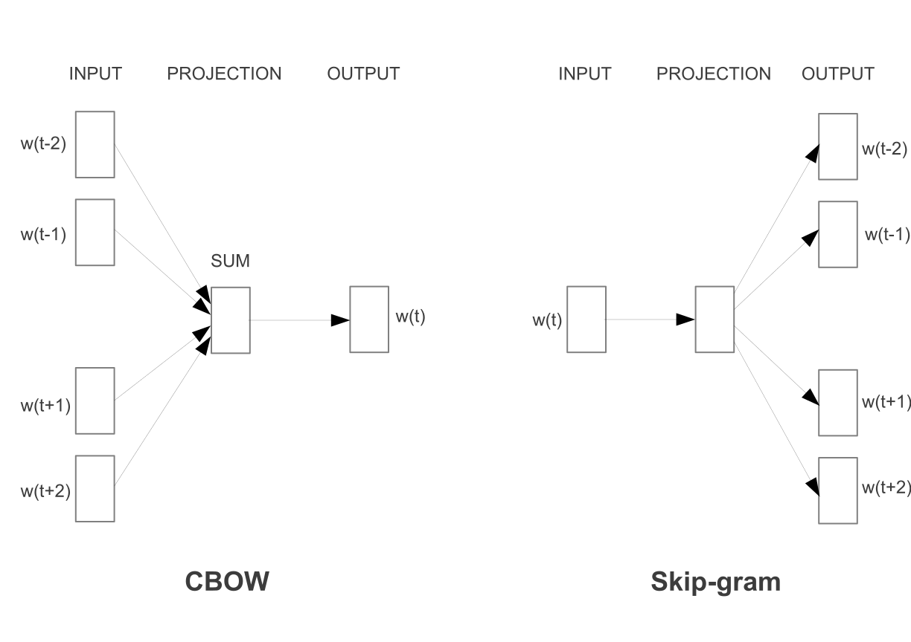
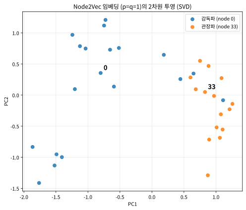
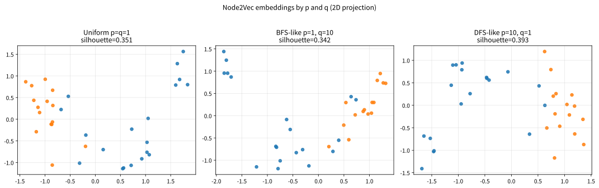
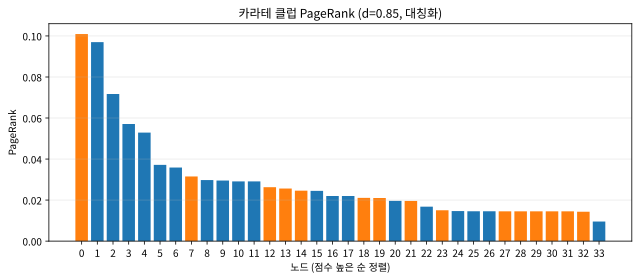
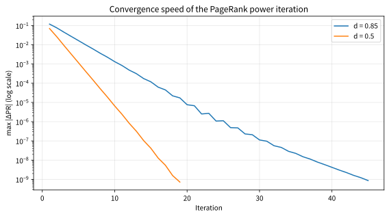

# 14.3 Node2Vec과 PageRank

[](https://colab.research.google.com/github/SuminHan/book-ml/blob/main/notebooks/ml1/chapter14_3_node2vec_pagerank.ipynb)

### Node2Vec: 같은 아이디어를 그래프로

**Node2Vec**[^node2vec]은 word2vec[^word2vec]의 skip-gram을 그대로 재사용하되, "문장" 대신
그래프 위의 **무작위 걷기**(random walk)로 만든 노드 시퀀스를 입력으로
쓴다 — 한 노드에서 출발해 무작위로 이웃을 따라가며 만든 경로가 곧
"문장"이고, 그 경로 위의 노드들이 "단어"다. "비슷한 이웃 구조를 가진
노드는 비슷한 벡터를 갖게 된다"는 것도, word2vec의 "비슷한 문맥에
나오는 단어는 비슷한 벡터를 갖는다"는 원리를 그래프에 그대로 물려준
결과다.



### 왜 "무작위 걷기"가 "문장"을 대신하는 자연스러운 선택인가

word2vec에서 "문장"이 가진 본질은 단순하다 — **어떤 것들이 어떤 순서로
함께 나타나는지**를 담고 있다. 그래프 노드의 "함께 나타남"은 무엇인가?
"엣지로 연결되어, 서로를 따라다니면 만나는 것"이다. 어떤 노드에서
출발해 이웃을 무작위로 골라 반복 이동하는 **무작위 걷기**는 정확히 이
"함께 나타남의 순서"를 만들어내는 최소 장치다 — 걷기 안에서 인접한
노드들은 서로 엣지로 연결되어 있고, 어떤 노드 주위에 자주 등장하는
노드들은 그 노드의 (구조적) "이웃"이다.

이 대입에는 또 하나의 중요한 성질이 숨어 있다. 무작위 걷기는
"모든 노드를 동등하게" 방문하지 않는다 — 무방향 그래프에서
**일괄적**(uniform) 무작위 걷기를 무한히 계속하면, 노드 \\(i\\)에 머무는
장기 비율은 그 노드의 **도(degree, 연결된 엣지 수**)에 비례한다:

\\[\pi(i) = \frac{\text{deg}(i)}{2\\,|\mathcal{E}|}\\]

(\\(|\mathcal{E}|\\)는 엣지 수, \\(2|\mathcal{E}|\\)는 모든 노도의 도의 합이다.)
즉 **허브 노드는 걷기 말뭉치에 더 자주 등장** → skip-gram 학습에서 더
많이 업데이트된다. 이는 14.2절에서 본 "빈도 높은 단어의 임베딩 벡터
노름이 크다"는 현상과 정확히 같은 메커니즘이다. 카라테 클럽 그래프에서
node 33(관장)의 도는 17, node 0(감독)의 도는 16이라 — 두 파벌
리더가 구조적으로 가장 많이 "나타나는" 단어라는 뜻이다. 임베딩 학습이
자동으로 구조적으로 중요한 노드에 더 많은 "학습 예산"을 배정해준다고
볼 수 있다.

한 가지 주석을 달아두자 — 방금 쓴 "영원히 돌아다닌 뒤 각 노드에 머무는
비율"이라는 질문은, 댐핑을 빼면 곧바로 **PageRank**[^brinpage] 그 자체다. 이
절의 후반부가 정확히 이 질문에 더 정교한 답(PageRank)을 붙인다.

**Zachary's Karate Club**[^zachary]은 이 아이디어를 테스트하는 표준 예제
데이터셋이다 — 1977년 인류학자 웨인 재커리(Wayne Zachary)가 한 가라테
동호회 34명의 친분 관계를 기록했는데, 마침 이 동호회가 감독(node 0)과
관장(node 33) 두 파벌로 실제 분열됐다. 34개 노드, 78개의 친분
관계(edge)뿐인 작은 그래프지만, 그래프 임베딩 알고리즘이 "제대로
작동하는지" 확인하는 표준 벤치마크로 지금까지도 쓰인다 — 라벨(파벌
소속) 없이 순수하게 그래프 구조만 보고 임베딩했는데도 두 파벌이 벡터
공간에서 자연스럽게 갈라지면 성공이다.

```python
KARATE_EDGES = [
    (0,1),(0,2),(0,3),(0,4),(0,5),(0,6),(0,7),(0,8),(0,10),(0,11),
    (0,12),(0,13),(0,17),(0,19),(0,21),(0,31),(1,2),(1,3),(1,7),(1,13),
    (1,17),(1,19),(1,21),(1,30),(2,3),(2,7),(2,8),(2,9),(2,13),(2,27),
    (2,28),(2,32),(3,7),(3,12),(3,13),(4,6),(4,10),(5,6),(5,10),(5,16),
    (6,16),(8,30),(8,32),(8,33),(9,33),(13,33),(14,32),(14,33),(15,32),
    (15,33),(18,32),(18,33),(19,33),(20,32),(20,33),(22,32),(22,33),
    (23,25),(23,27),(23,29),(23,32),(23,33),(24,25),(24,27),(24,31),
    (25,31),(26,29),(26,33),(27,33),(28,31),(28,33),(29,32),(29,33),
    (30,32),(30,33),(31,32),(31,33),(32,33),
]

def random_walk(neighbors, start, length):
    walk = [start]
    for _ in range(length - 1):
        cur = walk[-1]
        if not neighbors[cur]:
            break
        walk.append(random.choice(neighbors[cur]))
    return walk

def build_walks(edges, n_nodes, walks_per_node=10, walk_length=8):
    neighbors = {i: [] for i in range(n_nodes)}
    for a, b in edges:
        neighbors[a].append(b)
        neighbors[b].append(a)
    walks = []
    for node in range(n_nodes):
        for _ in range(walks_per_node):
            walks.append([str(n) for n in random_walk(neighbors, node, walk_length)])
    return walks
```

무작위 걷기로 만든 `walks`(각 걷기가 "문장", 각 노드 번호가 "단어")를
이어붙여(`corpus = sum(walks, [])`) 위 `train_skipgram`에 그대로 넣으면
34개 노드 각각의 임베딩 벡터가 나온다 — 이 벡터를 14.1절의 PCA로 2차원까지
압축해서 그려보면, 실제로 두 파벌이 공간적으로 갈라지는 것을 볼 수
있다.

**word2vec과 Node2Vec은 서로 다른 데이터(텍스트 vs. 그래프)에
적용됐을 뿐, "함께 자주 나타나는 것들은 비슷한 벡터를 갖도록 학습한다"는
같은 아이디어의 두 얼굴이다.**



위 그림은 \\(p{=}q{=}1\\)(일괄적 무작위 걷기)의 걷기 34×10개(개마다
길이 8)로 Node2Vec을 학습(\\(d{=}8\\)차원)한 임베딩을 SVD로 2차원까지
투영한 것이다. 두 파벌이 한쪽/다른 쪽으로 갈라지고, **두 파벌 리더
(node 0, node 33)이 각 군집의 중심 부근**에 있다 — 두 리더의
임베딩이 자기 파벌의 군집 중심에서 각각 약 0.2, 0.3 거리(나머지
멤버의 중앙값은 감독파 약 1.1, 관장파 약 0.4)에 있을 정도로 "자기 편"에
가까우니,
"리더는 두 파벌의 경계에 있어야" 할 것 같은 직관과 달리 실제로는
군집 내부에 잘 박혀 있는 것이다. 라벨을 전혀 보여주지 않고
구조만 본 임베딩이, 1977년의 실제 분열을 "공간적으로" 회복한
것이다. (군집 경계 근처에는 두 파벌을 연결하는 "다리" 역할을 하는
멤버들이 섞여 있어도 정상이다 — 그 멤버들이 실제로 그래프에서 두
클러스터 사이를 잇고 있다.)

### Node2Vec의 진짜 기여: 두 계수 p와 q

위 코드의 일괄적 무작위 걷기는, 원본 Node2Vec 논문(Grover &
Leskovec, 2016)의 가장 단순한 특수한 경우다 — 이 논문의 실제 기여는
걷기에 **\\(p\\)**(return)와 **\\(q\\)**(in-out)라는 두 계수를 붙여
"이웃 탐색의 스타일"을 조절하는 것이었다.

정의: 걷기가 노드 \\(x\_t\\)에 도달했을 때(직전 노드는 \\(x\_{t-1}\\)),
다음 노드 \\(x\_{t+1}\\)를 고르는 확률은 가중치 \\(w\_{x\_{t-1}}(x\_{t+1})\\)에
비례한다:

- **돌아가기** — 방금 있던 노드로 복귀(\\(x\_{t+1} = x\_{t-1}\\)): 가중치 \\(1/p\\)
- **인근 머물기** — \\(x\_{t-1}\\)의 이웃인 노드로 이동(이미 탐색한
  로컬 영역 안): 가중치 \\(1/q\\)
- **새 영토로** — 나머지(아직 탐색 안 한 이웃)로 이동: 가중치 \\(1\\)

\\(p = q = 1\\)이면 모든 가중치가 1로, 정확히 일괄적 무작위 걷기가
된다. 계수를 움직이면 탐색 스타일이 기울어진다:

- **\\(p < 1\\)** (\\(1/p > 1\\)): 직전 노드로의 **뒤로 감(backtracking)**
  확률이 올라간다.
- **\\(q < 1\\)** (\\(1/q > 1\\)): 방금 탐색한 로컬 영역 안에 **머물기**
  확률이 올라간다.
- **\\(q > 1\\)** (\\(1/q < 1\\)): 이미 본 영역을 다시 밟는 것이 *억제*되어
  걷기가 **새 영토로 확장**하려 한다.

원본 논문의 실험에 쓰인 두 표준 프리셋:

| 설정 | 탐색 스타일 | 강조하는 구조 |
|---|---|---|
| \\((p=1, q=16)\\) — "node2vec" | BFS형(넓이 우선) | **구조적 동치**(structural equivalence) — 역할의 유사성 |
| \\((p=16, q=1)\\) — "deep walk"[^deepwalk] | DFS형(깊이 우선) | **동질성**(homophily) — 같은 커뮤니티 속한 것의 유사성 |

여기서 "동질성"과 "구조적 동치"는 서로 다른 유사도다. 같은 커뮤니티의
노드는 **동질**하다(카라테 클럽에서 한 파벌의 멤버끼리 서로 비슷하다).
반대로 서로 다른 커뮤니티의 두 노드도 **역할이 같을** 수 있다(구조적
동치 — 예를 들어 다른 부서 두 곳에서 각각 "외부와의 유일한 연결고리"
역할을 하는 두 멤버). 일괄적 무작위 걷기는 둘을 섞어서 담고, \\(p, q\\)가
이 중 어느 쪽에 더 초점을 맞추게 하는 "다이얼"인 셈이다.

편향 걷기 코드(위의 `random_walk`를 대체하는 버전):

```python
def biased_walk(nb, start, length, p, q, rng):
    """Node2Vec의 편향 무작위 걷기. nb: 노드 -> 이웃 목록"""
    walk = [start]
    prev = None
    for _ in range(length - 1):
        cur = walk[-1]
        weights = []
        for nxt in nb[cur]:
            if prev is None:
                weights.append(1.0)
            elif nxt == prev:
                weights.append(1.0 / p)      # 돌아가기
            elif nxt in nb[prev]:
                weights.append(1.0 / q)      # 로컬 영역 머무르기
            else:
                weights.append(1.0)          # 새 영토로
        r = rng.random() * sum(weights)      # 가중치에 비례해 다음 노드 뽑기
        acc, chosen = 0.0, nb[cur][0]
        for nxt, w in zip(nb[cur], weights):
            acc += w
            if r <= acc:
                chosen = nxt
                break
        walk.append(chosen)
        prev, cur = cur, chosen
    return walk
```

### 작은 실험: p와 q가 임베딩을 얼마나 바꾸는가

세 가지 설정 — 일괄적 \\((1,1)\\), BFS형 \\((1,10)\\), DFS형 \\((10,1)\\) — 으로
걷기를 재생성해서 동일하게 Node2Vec을 학습해봤다(노트북:
walks\_per\_node=10, walk\_length=8, dim=8, 시드 고정):

| 설정 | 코사인 실루엣* | node 2의 유사 노드 상위 3개 |
|---|---|---|
| \\((1, 1)\\) 일괄적 | 0.351 | 7 (0.73), 13 (0.72), 9 (0.72) |
| \\((1, 10)\\) BFS형 | 0.342 | 9 (0.86), 28 (0.73), 7 (0.72) |
| \\((10, 1)\\) DFS형 | 0.393 | 12 (0.83), 19 (0.70), 17 (0.65) |

\*실루엣: 두 파벌 라벨을 "참 군집"으로 두고, 각 노드가 자기 파벌
군집의 평균 임베딩에 상대 파벌 군집의 평균 임베딩보다 얼마나 가까운지
\\(-1 \sim +1\\)으로 재는 군집 분리 품질 지수(1에 가까울수록 잘 분리).

34개 노드라는 이 작은 스케일에서 세 설정의 차이는 작고, 원본 논문이
보인 대규모 패턴까지 그대로 재현되진 않는다(데이터가 작아서 노이즈가
큰 것은 자연스러운 일). 그래도 방향을 짚자: DFS형 \\((10,1)\\) 설정에서
node 2의 상위 3개 유사 노드(12, 19, 17)가 **모두 감독 파벌**에 속하는
가장 깔끔한 파벌 분리가 나왔다. 실용적 교훈은 이 실험에서 나오지
않는다 — **\\(p, q\\)는 "커뮤니티 구조를 원하느냐, 역할 구조를 원하느냐"에
맞게 바꾸고, 그 효과가 downstream 태스크(분류·링크 예측 등)로
실제 검증**해야 한다는 것. (카라테 클럽에서 파벌 = 커뮤니티이므로,
여기서는 커뮤니티 분리 품질이 곧 "잘 됐다"의 지표다.)



### 자주 하는 실수: 무방향 엣지를 방향 그대로 넣고 돌리기

카라테 그래프는 **무방향**이고, PageRank는 **방향** 그래프 위에서
정의된다 — 표준 기법은 "친분 관계 1개"를 **양방향 링크 2개**로
바꿔주는 것(아래 `directed_edges` 줄이 그것을 한다). 이 대칭화를
누락하고 `KARATE_EDGES`를 그대로 넣으면, 결과는 **각 엣지가 어떤
방향으로 기록되었는가에 따라** — 즉 임의적인 저장 순서에 따라 — 달라진다.
실제로 돌려보면:

```python
scores_dir = pagerank(KARATE_EDGES, 34)   # 실수: 대칭화 누락
# 상위 5개: 33 (0.0759), 32 (0.0280), 31 (0.0135), 16 (0.0125), 6 (0.0080)
```

node 0(감독, 도 16의 진정한 허브)이 **상위 5개에서 완전히 사라진다** —
그래프 자체는 하나도 안 바뀌었는데, 기록 관례가 "중요도 순위"를
뒤틀어버린 것이다. 대칭화는 한 줄이지만, 이 실수는 "왜 감독이
순위에서 빠졌지?"라는 도메인 지식의 교차검증이 없으면 발견하기
힘든 종류의 버그다 — 알고리즘 결과와 "알고 있는 사실"이 충돌하면,
먼저 파이프라인의 편의 전제(여기선 방향성 처리)부터 의심하는 습관이
필요하다.

### 같은 무작위 걷기, 다른 질문: PageRank

Node2Vec은 무작위 걷기가 만들어내는 "노드의 순서(시퀀스)"를 이용했다.
같은 무작위 걷기 자체를 완전히 다른 질문에 쓸 수도 있다: **이 그래프
위를 무작위로 영원히 돌아다닌다면, 각 노드에 머물러 있을 확률은 각각
얼마나 될까?** 이 질문에 대한 답이 곧 그 노드의 "중요도"라는 것이,
1998년 래리 페이지(Larry Page)와 세르게이 브린(Sergey Brin)이 구글을
세울 때 쓴 **PageRank** 알고리즘의 핵심 아이디어다 — 많은 페이지가
링크하는 페이지일수록, 또 중요한 페이지가 링크하는 페이지일수록,
무작위로 링크를 따라다니는 서퍼(random surfer)가 그 페이지에 더 자주
머문다.

배경 이야기를 보태자. 1996~97년, 스탠퍼드 대학원생이던 페이지와 브린은
당시 웹 검색엔진들이 "페이지에 키워드가 있는가"로만 순위를 매기자,
웹이 너무 커져서 그 방식으로는 쓸모없는 결과만 뒤섞여 나왔다는
문제를 직감했다. 그들의 답은 **웹 자체를 데이터로 보는** 것이었다 —
수억 개 웹페이지 사이의 링크 구조는 그 자체로 "웹의 투표 기록"이다.
다른 사이트의 주인들이 자발적으로 그 페이지를 링크한 것이, "이
페이지가 중요하다"는 증거라는 것. PageRank는 "누가 누구를 링크하는가"를
무작위 서퍼의 이동 행렬로 정식화했고, 1998년 논문 *"The Anatomy of a
Large-Scale Hypertextual Web Search Engine"*이 이를 실용 알고리즘으로
완성했다. (사명 "Google"은 \\(10^{100}\\)를 뜻하는 "googol"에서
온 말장난으로, 조직하려던 웹의 규모에 대한 선언이었다.)

노드 \\(i\\)의 페이지랭크 \\(PR(i)\\)는 다음을 만족해야 한다 — 자신을
가리키는 모든 노드 \\(j\\)로부터, 그 노드가 가진 점수를 그 노드가 가진
바깥 링크 수(\\(\text{outdeg}(j)\\))만큼 나눠 받은 합:

\\[PR(i) = \frac{1-d}{N} + d\sum\_{j \to i} \frac{PR(j)}{\text{outdeg}(j)}\\]

\\(N\\)은 전체 노드 수, \\(d\\)(보통 0.85)는 **댐핑 팩터**(damping
factor) — 확률 \\(d\\)로 링크를 따라가고, 확률 \\(1-d\\)로 아무 노드로나
순간이동(teleport)한다는 뜻이다(막다른 골목에 갇히거나 순환에 갇히는
것을 막기 위한 장치).

이 식은 우변에 \\(PR\\) 자신이 다시 등장하는 **재귀식**이라 한 번에 풀 수
없다 — 그래서 아무 값(모든 노드에 \\(1/N\\))에서 시작해, 우변에 반복해서
대입하며 값이 더 이상 바뀌지 않을 때까지 되풀이하는
**거듭제곱법**(power iteration)으로 푼다:

```python
def pagerank(edges, n_nodes, d=0.85, iters=100):
    outgoing = {i: [] for i in range(n_nodes)}  # directed: a -> b
    for a, b in edges:
        outgoing[a].append(b)
    outdeg = {i: max(1, len(outgoing[i])) for i in range(n_nodes)}
    incoming = {i: [] for i in range(n_nodes)}  # who points to me?
    for a, b in edges:
        incoming[b].append(a)

    pr = {i: 1 / n_nodes for i in range(n_nodes)}
    for _ in range(iters):
        pr = {i: (1 - d) / n_nodes + d * sum(pr[j] / outdeg[j] for j in incoming[i])
              for i in range(n_nodes)}
    return pr

# Karate Club은 무방향 그래프이므로, 친분 관계 하나를 양방향 링크로 취급한다
directed_edges = KARATE_EDGES + [(b, a) for a, b in KARATE_EDGES]
scores = pagerank(directed_edges, 34)
print(sorted(scores.items(), key=lambda kv: -kv[1])[:3])
# node 33, node 0이 가장 높다 -- 실제 두 "허브" 노드(관장, 감독)과 정확히 일치
```

카라테 그래프(대칭화, \\(d=0.85\\), 100회 반복)에서 실제로 돌려보면
상위 3개는:

| 순위 | 노드 | 역할 | PageRank |
|---|---|---|---|
| 1 | 33 | 관장 | 0.1009 |
| 2 | 0 | 감독 | 0.0970 |
| 3 | 32 | 감독 파벌의 연결고리 | 0.0717 |

전체 점수의 합은 정확히 1이며, 최소값은 teleport 하한
\\((1-d)/34 \approx 0.0044\\)다. 두 파벌 리더가 정확히 상위 2개에
앉는다 — 라벨을 하나도 안 본 "중요도 순위"가 역사적 사실(누가 어떤
파벌이었는지)과 거의 정확히 겹치는 것이다. node 33(도 17)이 node
0(도 16)보다 앞서는 것은, "무작위 걷기가 더 자주 방문한다"는 도의
우위가 점수에 거의 그대로 드러난 모습이다.



### 손으로 한 번: 노드 4개, 순환 하나, 외딴 끝 하나

PageRank를 4개 노드의 최소 예제로 손 계산해보자(\\(d = 0.5\\)).
방향 그래프:

- \\(A \to B\\), \\(B \to C\\), \\(C \to A\\) (3-노드 순환)
- \\(D \to A\\) (D는 A만 가리킨다)

teleport 항 \\((1-d)/N = 0.5/4 =\\) **0.125**.

**1단계 — D는 들어오는 링크가 없다.** D를 가리키는 노드가 없으니
합 \\(\sum\_{j \to D}\\)는 비어 있고,

\\[PR(D) = \frac{1-d}{N} = 0.125\\]

D는 반복을 아무리 돌려도 0.125에 머문다 — "나를 가리키는 이가 없으니
teleport분밖에 받을 수 없다"는 뜻이다.

**2단계 — 순환 속 3개 노드에 방정식을 쓴다.**

\\[PR(A) = 0.125 + 0.5\left(\frac{PR(C)}{1} + \frac{PR(D)}{1}\right), \qquad
PR(B) = 0.125 + 0.5\\,PR(A), \qquad
PR(C) = 0.125 + 0.5\\,PR(B)\\]

(각 노드의 outdeg가 1이라 나누기는 일을 하지 않는다.)

**3단계 — 대입으로 푼다.** \\(PR(B), PR(C)\\)를 \\(PR(A)\\) 식에
대입하면:

\\[PR(A) = 0.125 + 0.5\left(\underbrace{0.125 + 0.5\bigl(0.125 + 0.5\\,PR(A)\bigr)}\_{PR(C)} + \underbrace{0.125}\_{PR(D)}\right)
= 0.28125 + 0.125\\,PR(A)\\]

\\[PR(A) = \frac{0.28125}{0.875} = \frac{9}{28} \approx 0.321\\]

그 다음 \\(PR(B) = 0.125 + 0.5 \times 0.321 \approx \mathbf{0.286}\\),
\\(PR(C) = 0.125 + 0.5 \times 0.286 \approx \mathbf{0.268}\\).
검산: \\(0.321 + 0.286 + 0.268 + 0.125 = 1.000\\) ✓.

여기서 읽어둘 것이 두 가지 있다. 첫째, A·B·C는 모두 도 2(들어오는 1,
나가는 1)로 "겉모습은 똑같은"데, 점수는 **균등하지 않다**
(0.321 > 0.286 > 0.268) — "D→A→B→C" 흐름을 받는 A가 D의 점수를
직접 받아 가장 크고, 순환을 돌수록 우위가 조금씩 소진된다.
**PageRank는 "엣지가 몇 개인가"가 아니라 "누가, 얼마나 중요한 위치에서
나를 가리키는가"의 문제**라는 것이 이 작은 예제의 핵심이다.
둘째, "새 값 = teleport 항 + 옛 값들의 가중 평균"이라는 방정식의
형태 — 이 형태가 반복법의 수렴을 보장하는 구조이며, 다음 절에서
본다는 정리와 정확히 연결된다.

이 거듭제곱법이 왜 수렴하는지는, **ML2 Chapter 4**에서 벨만
최적방정식의 해가 유일하게 존재함을 보일 때 쓸 **바나흐 고정점
정리**(Banach fixed point theorem)와 정확히 같은 논리다 — "어떤
변환을 값이 안 바뀔 때까지 반복해서 적용하면 결국 고정점(fixed
point)에 도달한다"는 같은 수학이, 여기서는 "그래프 위 확률분포"에,
강화학습에서는 "상태의 가치함수"에 적용된다.[^cs234]

수렴이 얼마나 빠른지: 매 반복의 변화량(전체 노드 중 최대
\\(|\Delta PR|\\))은 **지수적으로** 줄어든다. 카라테 클럽에서는
\\(d=0.85\\)일 때 대략 45회 반복이면 \\(10^{-9}\\) 이내로 수렴했고,
\\(d=0.5\\)이면 19회였다 — \\(d\\)가 클수록 서퍼가 더 "장기 기억"을
하려 하므로 수렴이 느려지는 것이다. 그래서 작~중형 그래프에서는
"100회 반복"이면 충분하고, 수십억 페이지 규모의 웹에서는 구글이
분산 계산·희소화 같은 별도 공학이 필요했던 것이다.



### 자주 하는 실수: "수렴했는지" 확인 없이 반복 횟수만 고정하기

위의 코드는 단순화를 위해 `iters=100`을 **고정**했다 — 실제
사용에서는 반복 횟수를 임의로 정하지 않고, **변화량이 기준
\\(\varepsilon\\) 아래로 떨어질 때까지** 돌리는 것이 정석이다:

```python
def pagerank_converged(edges, n_nodes, d=0.85, tol=1e-9, max_iters=1000):
    # ... (위 pagerank와 동일, 단 반복 조건이 다름)
    pr = {i: 1 / n_nodes for i in range(n_nodes)}
    for _ in range(max_iters):
        new = {i: (1 - d) / n_nodes + d * sum(pr[j] / outdeg[j] for j in incoming[i])
               for i in range(n_nodes)}
        delta = max(abs(new[i] - pr[i]) for i in range(n_nodes))
        pr = new
        if delta < tol:
            break
    return pr
```

함께 짚어둘 두 번째 세부 사항은 **dangling node**(나가야 할 링크가
하나도 없는 노드)다. 코드에서 `max(1, len(outgoing[i]))`는 분모가 0이
되는 것을 막아주지만, 출도가 0인 노드의 점수는 그 식의 합에서
**어디로도 전달되지 않는다** — 결과적으로 전체 PR의 합이 1이
**아니고** (1보다 작게) 될 수 있다. 카라테 그래프에는 그런 노드가
없어 합 = 1(위에서 확인)이지만, 웹처럼 "링크가 하나도 없는 죽은
페이지"가 흔히 있는 그래프에서는 dangling 노드의 점수를 **모든
노드에 균등하게 재분배**해 주는 보정이 표준이다. 댐핑 팩터와
같은 계열의 공학 — "확률이 새는 구멍을 하나하나 막아주는"
장치들이다.

### 자주 하는 실수: "PageRank = 도(degree)"로 읽기

"가리키는/가리켜지는 링크가 많을수록 점수가 크다"는 설명 때문에
PageRank를 "도 순위"로 단순화하는 경우가 많다. 무방향 그래프의
대칭화된 PageRank에서는 둘의 순위가 **매우 강하게** 상관난다(카라테
그래프에서도 상위권이 거의 도 순서와 일치했다). 그러나 이 둘은
**같은 것이 아니다** — PageRank의 합 \\(\sum\_{j \to i} PR(j)/
\text{outdeg}(j)\\)는 **어떤** 노드가 나를 가리키느냐를
가중한다. 방향 그래프에서는 차가 확 벌어진다: "중요하지 않은 페이지
10개가 링크"보다 "가장 중요한 페이지 1개가 링크"가 더 높은
PageRank를 만드는 것이 이 알고리즘의 원래 설계 목적이다.
"인기(도)"와 "권위(가리켜지는 쪽의 중요도)"는 다른 개념이며,
PageRank가 측정하는 쪽은 후자다.

### 지금 어디에 쓰이는가

PageRank의 본업은 웹 검색 랭킹이었지만, "방향 그래프 위 무작위
걷기의 정상분포 = 중요도"라는 틀 자체는 범용 도구가 됐다 —
학술 인용 네트워크(논문·저널 랭킹), 소셜 네트워크 영향력 분석,
그리고 "무작위 걷기를 **주어진 노드에서 다시 시작**한다"는 변형인
**개인화 PageRank**(Personalized PageRank)는 추천 시스템과
커뮤니티 감지에 쓰인다. Node2Vec 쪽은 원본 논문에서 100만 노드
규모의 그래프 분류·링크 예측·시각화를 시연했고, 이후에는
"그래프 → 노드 벡터 → 일반 ML 모델로 전달"하는 파이프라인의
첫 단계로 약물 상호작용 예측, 단백질 기능 예측, NER 등 다양한
그래프 문제에 적용된다.

**PCA·word2vec·Node2Vec·PageRank는 얼핏 서로 다른 문제처럼 보이지만,
전부 "무언가를 어떤 변환에 반복해서 통과시키면 특별한 지점(고유벡터,
임베딩, 정상분포)에 수렴한다"는 하나의 수학적 패턴을 공유한다.**

**지도학습이 "정답을 맞히는 법"을 배운다면, 비지도학습은 "데이터가 스스로
어떤 모양을 하고 있는지"를 배운다 — 둘은 서로 다른 질문에 답한다.**

### 확인 문제

2-노드 방향 그래프 \\(A \leftrightarrow B\\)(\\(A \to B\\), \\(B \to A\\))에
\\(d = 0.5\\), \\(N = 2\\)로 PageRank를 손으로 계산하라.

**단계 1**: 방정식 두 개를 쓰자 — \\(PR(A) = 0.25 + 0.5\\,PR(B)\\),
\\(PR(B) = 0.25 + 0.5\\,PR(A)\\).

**단계 2**: 대칭성을 이용해 \\(PR(A) = PR(B)\\)로 놓고 풀면
\\(PR(A) = 0.25 + 0.5\\,PR(A)\\), 즉 \\(PR(A) = PR(B) = 0.5\\) —
**\\(d\\)의 값과 무관하게** 각 0.5다. 코드로 확인하라.

**단계 3 (그 다음이 핵심)**: \\(B \to A\\) 엣지를 지우면(B는
dangling node가 됨) 다시 계산해라. \\(PR(A) = 0.25\\)(들어오는
링크 없음), \\(PR(B) = 0.25 + 0.5 \times 0.25 = 0.375\\) —
**합이 \\(0.25 + 0.375 = 0.625\\)로, 1이 아니다.** 왜 그런지 설명하고, 본문의 어떤
공학 보정을 추가하면 합이 1로 돌아올지 이름으로 답하라.
(힌트: "자주 하는 실수" 섹션의 두 번째 세부 사항.)

### 자주 묻는 질문

**Q. PageRank도 임베딩인가요?** 아니다 — Node2Vec은 각 노드를 벡터
공간의 한 점(임베딩)으로 표현하는 반면, PageRank는 각 노드에 스칼라
값(중요도 점수) 하나만 부여한다. 둘 다 같은 재료(그래프, 무작위
걷기)에서 출발하지만 묻는 질문이 다르다 — "이 노드는 다른 노드들과
구조적으로 얼마나 비슷한가"(Node2Vec) vs "이 노드는 전체 그래프에서
얼마나 중요한가"(PageRank).

**Q. 댐핑 팩터 \\(d\\)가 없으면 어떻게 되나요?** \\(d=1\\)이면
순간이동이 전혀 없어, 막다른 골목(바깥 링크가 없는 노드)에 도달한
순간 서퍼가 영원히 갇히거나, 그래프가 여러 개의 분리된 조각으로
나뉘어 있으면 어느 조각에서 시작했는지에 따라 결과가 달라지는(즉
유일한 정상분포로 수렴하지 않는) 문제가 생긴다. \\(d<1\\)의 순간이동
확률이 이런 병적인 경우에도 항상 유일한 해로 수렴하도록 보장해준다.

**Q. 걷기 개수(walks\_per\_node)와 걷기 길이를 어떻게 정하나요?**
엄격한 공식은 없지만, 표준적인 가이든라인이 있다: 원본 논문의
설정 — 노드당 10개 걷기, 걷기 길이 40, 임베딩 차원 128 — 을
출발점으로 삼아 데이터 규모에 맞춰 줄인다(이 절의 34개 노드에서는
10개×길이 8·차원 8이면 충분했다). 걷기가 너무 짧으면 "문맥"이
바로 옆 이웃에 갇히고, 너무 길면 "출발 지점"을 잊어 문맥이
노이즈가 된다.

**Q. PageRank를 무방향 그래프에 써도 되나요?** 된다 — 표준 기법은
무방향 엣지 1개를 **방향 링크 2개**로 바꿔주는 것(이 절의
`directed_edges` 줄이 정확히 그것을 한다). 이렇게 하면 PageRank는
"도 순서에 가깝되, 누가 나를 가리키느냐를 가중한" 순서가 된다 —
카라테 그래프에서는 도 순위와 거의 일치했지만, 일반적으로 둘은
동일하지 않다.

**Q. Node2Vec의 p와 q는 그래프마다 따로 튜닝해야 하나요?**
보편적 최적값은 없다 — 논문의 두 프리셋 \\((1,16)\\), \\((16,1)\\)도
"역할 구조를 원하나 커뮤니티 구조를 원하나"에 맞춘 시작점에
불과하다. 실무에서는 몇 가지 설정을 돌려보고 **downstream
태스크**(분류·링크 예측)의 성능이나 이 절의 그림 같은 시각화에서
기대된 구조가 보이나로 검증한다.

---

## 연습문제

**1. (코딩)** 다음과 같은 함수 `kmeans_assign`(k-means의 할당 단계)과
`center_data`(PCA의 전처리 단계)를 완성하라(핵심 줄은 빈칸으로 남겨져 있다고
가정):

```python
def kmeans_assign(X, centroids):
    # ADD ADDITIONAL CODE HERE!!

X = [[1,1],[1,2],[8,8],[9,9]]
centroids = [[1,1],[9,9]]
print(kmeans_assign(X, centroids))  # [0, 0, 1, 1]

def center_data(X):
    # ADD ADDITIONAL CODE HERE!!

X2 = [[1,2],[3,4],[5,6]]
print(center_data(X2))  # [[-2,-2],[0,0],[2,2]]
```

**2. (개념 서술)** word2vec은 skip-gram(중심 단어로 주변 단어 예측)을
쓴다. 만약 반대로 "주변 단어들로 중심 단어를 예측"하는 방식(CBOW,
Continuous Bag-of-Words)을 쓴다면 학습 목표가 어떻게 달라질지, 그리고
왜 두 방식 모두 결국 비슷한 임베딩 벡터를 만들어낼 것으로 예상되는지
두세 문장으로 설명하라.

**3. (손유도, Tier B — 힌트 제공)** 중심화된 데이터 \\(X\\)를 단위벡터
\\(v\\)(\\(\\|v\\|=1\\)) 방향으로 투영한 결과의 분산은 \\(v^T \Sigma v\\)이다
(단, \\(\Sigma = \frac{1}{m}X^TX\\)). 이 분산을 최대화하는 \\(v\\)를 구하고
싶다.

**힌트**: \\(\\|v\\|=1\\) 제약 하에 \\(v^T\Sigma v\\)를 최대화하는 문제를,
라그랑주 승수 \\(\lambda\\)를 이용해 \\(\mathcal{L}(v, \lambda) =
v^T\Sigma v - \lambda(v^Tv - 1)\\)로 바꾼 뒤, \\(v\\)로 미분해서 0으로
놓으면(\\(\frac{\partial}{\partial v}(v^T\Sigma v) = 2\Sigma v\\),
\\(\frac{\partial}{\partial v}(v^Tv) = 2v\\)임을 이용) \\(\Sigma v =
\lambda v\\)라는 고유값 방정식이 나온다. 이 결과를 원래 목적함수에
대입하면(\\(v^T\Sigma v = v^T(\lambda v) = \lambda\\)) 분산이 정확히
\\(\lambda\\)(고유값)가 됨을 보일 수 있다.

**정확성 확인**: 위 결과가 왜 "고유값이 가장 큰 고유벡터를 첫 번째
주성분으로 고른다"는 알고리즘의 근거가 되는지 한 문장으로 설명하라.

**4. (손계산 + 코드)** 위 "손으로 한 번"의 4-노드 방향 그래프
(\\(A \to B, B \to C, C \to A, D \to A\\), \\(d = 0.5\\))에서,
\\(PR(D) = 0.125\\)는 바로 나왔다. \\(PR(A), PR(B), PR(C)\\)에 대한
3×3 선형방정식 계를 세팅하고, 각 값의 **크기 순서**와 그 이유를
예측한 뒤(정확한 값이 필요 없다), 본문의 `pagerank` 함수로 계산해
예측이 맞는지 확인하라.

[^word2vec]: Mikolov, T., Chen, K., Corrado, G., Dean, J. (2013). "Efficient Estimation of Word Representations in Vector Space." arXiv:1301.3781.
[^deepwalk]: Perozzi, B., Al-Rfou, R., Skiena, S. (2014). "DeepWalk: Online Learning of Social Representations." KDD 2014. arXiv:1403.6652.
[^node2vec]: Grover, A., Leskovec, J. (2016). "node2vec: Scalable Feature Learning for Networks." KDD 2016. arXiv:1607.00653.
[^brinpage]: Brin, S., Page, L. (1998). "The Anatomy of a Large-Scale Hypertextual Web Search Engine." 7th International World Wide Web Conference (WWW7), Brisbane, Australia. (후에 Computer Networks 30(1-7), 107–117로 재인쇄.)
[^zachary]: Zachary, W. W. (1977). "An Information Flow Model for Social Network Structural Analysis." Journal of Anthropological Research 33(4), 195–213.
[^cs234]: 더 깊이 보려면: Stanford CS234: Reinforcement Learning. https://web.stanford.edu/class/cs234/ — 이 절의 무작위 걷기(마코프 체인)와 PageRank 거듭제곱법의 고정점 수렴은 CS234의 MDP·가치 반복(value iteration)·벨만 방정식과 직접 겹치며, 본문에서 안내하는 ML2 Chapter 4의 주제이기도 하다.
