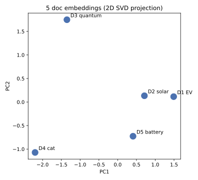
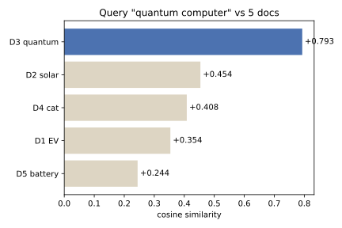

# 14.3 임베딩을 실전에 쓰기: Transformer 임베딩과 RAG

[](https://colab.research.google.com/github/SuminHan/book-ml/blob/main/notebooks/ml1/chapter14_3_embeddings_rag.ipynb)

### Transformer의 첫 층도 사실 word2vec과 같은 아이디어다

12장에서 어텐션을 배울 때, 각 단어는 이미 "임베딩 벡터"로 주어져
있다고 가정하고 시작했다. 그 임베딩이 어디서 오는지는 미뤄뒀는데,
답은 간단하다 — Transformer의 맨 첫 층은 **학습 가능한 임베딩
테이블**(각 토큰 ID → 고정 차원 벡터를 매핑하는 룩업 테이블)이다.
word2vec이 "중심 단어로 주변 단어를 맞히는" 과제를 **독립적인
목표**로 두고 학습한 벡터라면, Transformer의 토큰 임베딩은 "다음
토큰을 맞히는" 언어모델링 과제 전체를 풀면서 **부산물**로 함께
학습되는 벡터다 — 목표는 다르지만, "그 벡터가 있으면 과제를 더 잘
풀 수 있으니까 학습된다"는 메커니즘 자체는 같다.

차이는 두 가지다. 첫째, word2vec의 벡터는 문맥과 무관하게 고정이지만
(같은 단어는 항상 같은 벡터), Transformer의 토큰 임베딩은 그 뒤의
어텐션 층들을 거치며 **문맥에 따라 계속 재해석**된다 — "은행"이라는
토큰의 초기 임베딩은 하나지만, 문장에 따라 최종 표현은 달라진다.
둘째, word2vec은 그 벡터 자체가 최종 산출물이지만, Transformer의
토큰 임베딩은 훨씬 큰 모델의 한 조각일 뿐이다.

### RAG: 임베딩 공간에서 "가까운 문서"를 찾는다

**RAG**(Retrieval-Augmented Generation)를 프롬프팅 기법으로 보면(13장
참고) "관련 문서를 프롬프트에 붙여준다"는 이야기가 되지만, 그 "관련
문서를 어떻게 찾는가"는 순전히 이 장의 문제다 — **질문도 벡터로
임베딩하고, 문서(또는 문서 조각)도 미리 벡터로 임베딩해두고, 코사인
유사도(또는 내적)가 가장 큰 문서를 찾는다.** 14.2절에서 단어 벡터의
유사도를 코사인 유사도로 쟀던 것과 정확히 같은 연산이다 — 대상이
단어에서 문서로 바뀌었을 뿐이다.

이 "임베딩 → 유사도 검색"이라는 파이프라인을 **밀집 검색**(dense
retrieval)이라 부르고, 전통적인 키워드 매칭(예: TF-IDF, BM25)과
대비된다. 키워드 매칭은 "정확히 같은 단어가 있는가"를 보지만, 밀집
검색은 "의미가 비슷한가"를 벡터 공간에서 잰다 — 그래서 질문에 없는
단어로 쓰인 문서도 찾아낼 수 있다("자동차 연비"로 검색했는데 "차량
1km당 연료 소비량"이라는 문서가 걸리는 식).

RAG의 **검색(retrieval) 단계**를 제안한 원 논문이 Lewis et al. 2020[^rag]이다.
다만 그 논문은 검색 단계를 (당시엔 BM25 같은) 희소 인덱스로 했고, 그 뒤의
**생성(generation) 단계**까지 함께 연결했다 — "임베딩 → 유사도 검색"이
RAG의 검색단계를 이루는 구조는 이 논문부터다. 아래에서는 이 검색 단계를
14.2의 단어 벡터와 **동일한** 코사인 유사도 연산으로, 손으로 → 코드로
한 번씩 풀이한다.

### 손으로 한 번: 2D 밀집 검색 예제

코드를 쓰기 전에, 밀집 검색의 핵심 연산을 먼저 손으로 해보자. 차원을
768에서 2로 낮춰 종이 위에서 계산할 수 있게 만든다(실제로 이 벡터들은
배우기에서 나오지만, 여기선 "주어져 있다"고 치고 연산만 따른다).

문서가 3개인 작은 문서를 가진다고 하고, 사용자가 "자동차 연비"라고
질문을 쳤다고 하자. 질문과 각 문서를 2차원 벡터로 임베딩한 결과가
다음이라고 하자:

\\[\mathbf{q} = (4, 1), \qquad
\mathbf{d}\_1 = (3, 2), \qquad
\mathbf{d}\_2 = (2, 3), \qquad
\mathbf{d}\_3 = (1, 3)\\]

세 문서의 내용은 다음과 같다:

- \\(\mathbf{d}\_1\\): "차량의 연료 소비량은 1km당 소모 연료로 측정한다"
- \\(\mathbf{d}\_2\\): "자동차 보험을 고르는 법"
- \\(\mathbf{d}\_3\\): "양자 컴퓨터는 정보를 어떻게 처리하는가"

질문 "자동차 연비"와 문서 1 "차량의 연료 소비량…"은 **단어를
하나도 공유하지 않는다**(자동차/차량, 연비/연료 소비량) — 바로
키워드 매칭이 못 찾는 경우다. 하지만 임베딩 공간에서는 두 벡터의
**방향**이 가깝기에, 코사인 유사도가 이것을 잡는다.

**1단계 — 내적.** 질문과 각 문서:

\\[\mathbf{q} \cdot \mathbf{d}\_1 = 4 \times 3 + 1 \times 2 = 14, \qquad
\mathbf{q} \cdot \mathbf{d}\_2 = 4 \times 2 + 1 \times 3 = 11, \qquad
\mathbf{q} \cdot \mathbf{d}\_3 = 4 \times 1 + 1 \times 3 = 7\\]

**2단계 — 노름.**

\\[\\|\\mathbf{q}\\| = \sqrt{4^2 + 1^2} = \sqrt{17} \approx 4.12, \qquad
\\|\\mathbf{d}\_1\\| = \\|\\mathbf{d}\_2\\| = \sqrt{3^2 + 2^2} = \sqrt{13} \approx 3.61, \qquad
\\|\\mathbf{d}\_3\\| = \sqrt{1^2 + 3^2} = \sqrt{10} \approx 3.16\\]

**3단계 — 코사인 유사도.** 내적을 노름의 곱으로 나눈다:

\\[\cos(\mathbf{q}, \mathbf{d}\_1) = \frac{14}{\sqrt{17}\sqrt{13}}
= \frac{14}{\sqrt{221}} \approx \mathbf{0.942}\\]

\\[\cos(\mathbf{q}, \mathbf{d}\_2) = \frac{11}{\sqrt{221}}
\approx \mathbf{0.740}, \qquad
\cos(\mathbf{q}, \mathbf{d}\_3) = \frac{7}{\sqrt{17}\sqrt{10}}
= \frac{7}{\sqrt{170}} \approx \mathbf{0.537}\\]

**순위:** \\(\mathbf{d}\_1\\)(0.942) > \\(\mathbf{d}\_2\\)(0.740) >
\\(\mathbf{d}\_3\\)(0.537).

1위는 단어를 하나도 공유하지 않는 문서 1 "차량의 연료 소비량…"이다.
반면 "자동차"라는 **단어가 포함된** 문서 2는 2위에 그친다. 키워드
매칭이라면 문서 2("자동차"가 들어 있음)만 걸리고 문서 1은 아예
놓쳤을 것이다 — "같은 단어가 있는가"와 "의미가 비슷한가"의 차이는
바로 여기 있다. 이 연산은 14.2에서 단어 벡터의 유사도를 잴 때
한 것과 **정확히 같다** — 대상이 "단어"에서 "문서"로 바뀐 것뿐이다.

차원이 2라는 것만 빼면 768차원에서도 계산은 동일하다 — 768개 성분에
대해 내적과 노름을 계산할 뿐이다. "두 벡터의 각도가 작을수록
의미가 비슷하다"는 원리는 2차원과 768차원에서 같다.

### 실습: 작은 문서 집합에서 코사인 유사도로 검색하는 미니 RAG

손 계산 예제를 이제 코드로 옮긴다. 14.2의 `train_skipgram`과
`cos_sim`을 그대로 쓰고, 문서 안 단어 벡터를 **평균**해서 "문서
벡터"를 만드는 `mean_vec` 하나를 새로 추가한다. 에너지·동물·컴퓨팅
주제의 5개 문서 집합으로 만든다:

```python
# (train_skipgram, cos_sim 은 14.2와 동일)

# 문서 벡터 = 존재하는 단어 벡터의 평균
def mean_vec(words, emb):
    dim = len(next(iter(emb.values())))
    present = [w for w in words if w in emb]
    if not present:
        return None
    v = [0.0] * dim
    for w in present:
        for k in range(dim):
            v[k] += emb[w][k]
    return [x / len(present) for x in v]

tok = lambda s: s.replace(". ", " ").split()

corpus_docs = {
    "D1 전기차": "전기차는 배터리로 움직인다. 전기차 충전은 연료 대신 전기를 쓴다. 배터리 용량이 클수록 전기차 주행거리가 늘어난다.",
    "D2 태양광": "태양광 발전은 햇빛으로 전기를 만든다. 태양광 패널은 에너지를 공급한다. 화석 연료 대신 태양광이 환경에 좋다.",
    "D3 양자": "양자 컴퓨터는 큐비트로 정보를 처리한다. 큐비트는 중첩 상태에 있을 수 있다. 양자 알고리즘은 슈퍼포지션을 활용한다.",
    "D4 고양이": "고양이는 애묘인이 좋아하는 동물이다. 고양이는 털을 손질한다. 강아지도 반려동물로 인기지만 고양이는 독립적이다.",
    "D5 배터리": "배터리와 태양광 발전은 에너지 저장과 생산을 함께 한다. 전기차 충전은 배터리 기술에 의존한다.",
}
flat = []
for _n, t in corpus_docs.items():
    flat += tok(t)
print("토큰 수:", len(flat), " 고유어 수:", len(set(flat)))

random.seed(42)
emb = train_skipgram(flat, window=2, dim=8, epochs=400, lr=0.1, neg_k=3)
docvecs = {n: mean_vec(tok(t), emb) for n, t in corpus_docs.items()}
```

이제 두 개의 질문으로 "검색"을 해보자:

```python
for q in ["양자 컴퓨터", "고양이는 손질한다"]:
    qv = mean_vec(tok(q), emb)
    sims = sorted(((n, cos_sim(qv, dv)) for n, dv in docvecs.items()),
                  key=lambda kv: -kv[1])
    print("\n질문:", q)
    for n, s in sims:
        print(f"  {n}: {s:+.3f}")
```

출력(`random.seed(42)`로 재현 가능):

```
토큰 수: 70  고유어 수: 57

질문: 양자 컴퓨터
  D3 양자: +0.793
  D2 태양광: +0.454
  D4 고양이: +0.408
  D1 전기차: +0.354
  D5 배터리: +0.244

질문: 고양이는 손질한다
  D4 고양이: +0.951
  D5 배터리: +0.558
  D3 양자: +0.555
  D2 태양광: +0.481
  D1 전기차: +0.329
```

"양자 컴퓨터" 질문에서 승자는 D3 양자(0.793)이고, 나머지는 전부
0.46 아래다 — 1위와 2위 사이에 0.34라는 **깨끗한 간격**이 열린다.
"고양이는 손질한다"에서는 D4 고양이(0.951)가 압도적이다. 이 "1위가
선명하게 분리된다"는 모습이, 이 문서가 정답이라는 신호를 검색 단계
에서 줬다는 뜻이다 — RAG는 이 상위 1~k개를 프롬프트에 붙여줄 것이다.





여기서 두 가지를 짚자.

첫째, `mean_vec`가 **문서의 단어 순서를 버린다**. "양자 컴퓨터"와
"컴퓨터 양자"는 같은 문서 벡터가 된다. 이건 의도된 단순화다 —
의미 유사도 검색은 대개 "어떤 단어가 들어 있는가"를 보고, 단어
순서는 잘 보지 않는다(14.2의 bag-of-words 한계와 같은 이야기다).
단어 순서까지 살리려면 12장의 어텐션을 문서 단위로 돌리는
**문서 임베딩 모델**을 써야 하고, 그것이 실전 RAG가 하는 일이다.

둘째, 이 데모는 RAG의 **검색 단계**만 구현한다. 검색된 문서를
받아 "이 문서에 기반해 답하라"고 하는 **생성 단계**는 LLM의 일이니
Chapter 17에서 다룬다. 이 절에서 완성한 것은 "질문 벡터와 문서
벡터의 코사인 유사도로 상위 문서를 골라내는" 그 파이프라인 전체다 —
실전과 구조는 같고, (a) 임베딩을 `train_skipgram` 대신 전문
임베딩 모델로, (b) 문서를 문장 단위로 잘라(chunking) 벡터화하고,
(c) 수십억 문서에 대해 빠르게 최상을 찾게 벡터 DB(FAISS, HNSW 등)를
두는 것만 다르고, **원리는 지금 만든 이 20줄과 같다.**

### 자주 하는 실수: "내적"과 "코사인 유사도"를 같은 것으로 쓰기

실습에서 `cos_sim`을 썼지만, "내적만 하면 되지 않나" 하고
\\(\mathbf{q} \cdot \mathbf{d}\\)로만 순위를 매기는 실수가 많다.
둘은 **벡터의 길이가 다르면** 순서가 달라진다 — 14.2에서 "단어
벡터의 노름은 빈도와 비례한다"고 본 것과 같은 구조다.

위 손 계산 예제로 바로 확인해보자. 내적만 보면 \\(\mathbf{d}\_1\\)=14,
\\(\mathbf{d}\_2\\)=11, \\(\mathbf{d}\_3\\)=7로, 마침 이번엔
순위가 코사인 결과와 같다. 하지만 문서 2의 벡터를 \\((4, 6)\\)으로
바꿔보자(= 같은 "방향"을 2배로 키운 것, 문서가 두 배로 길어진 것과
같다):

- 내적: \\(\mathbf{q} \cdot \mathbf{d}\_2 = 4 \times 4 + 1 \times 6 =
22\\) — 이제 문서 2(22)가 문서 1(14)을 **넘어서** 1위가 된다.
- 코사인: \\(\cos(\mathbf{q}, \mathbf{d}\_2) = \frac{22}{\sqrt{17}\sqrt{52}}
= \frac{22}{\sqrt{884}} \approx 0.740\\) — 여전히 0.740으로 2위다.

**벡터의 "크기"를 2배로 키워도 코사인 유사도는 변하지 않는다**(분모의
노름도 2배가 되어 상쇄된다). 코사인은 **각도(방향)만** 보고, 내적은
**각도 × 크기**를 보므로, "문서가 길면 내적이 커진다"는 길이 편향이
들어간다. 그래서 의미 유사도 검색에서는 코사인(또는 벡터를 단위벡터로
정규화한 뒤의 내적)을 쓰는 것이다 — 14.2의 "비슷한 단어 찾기는
코사인"이라는 원칙의 문서 버전이다.

### 확인 문제

**1. (코사인 유사도 손 계산)** 위 2D 예제에 문서를 하나 더 추가한다. \\(\mathbf{d}\_4 = (1, 2)\\)가 "자동차 연비는 기름값에 비례한다"라고 하자. \\(\cos(\mathbf{q}, \mathbf{d}\_4)\\)를 구하고, 네 문서의 최종 순위를 매겨라. (힌트: 내적 \\(\mathbf{q}\cdot\mathbf{d}\_4 = 4\times 1 + 1\times 2 = 6\\), \\(|\mathbf{d}\_4| = \sqrt{5}\\). 답: \\(\frac{6}{\sqrt{17 \cdot 5}} = \frac{6}{\sqrt{85}} \approx 0.651\\), 순위는 \\(\mathbf{d}\_1 > \mathbf{d}\_2 > \mathbf{d}\_4 > \mathbf{d}\_3\\).)

**2. (내적 vs 코사인)** "자주 하는 실수"에서 문서 2의 벡터를 \\((2,3)\\)에서 \\((4,6)\\)으로 바꿨을 때, 내적 순위는 \\(\mathbf{d}\_2 > \mathbf{d}\_1 > \mathbf{d}\_3\\)로 바뀌지만 코사인 순위는 변하지 않는다. \\((4,6)=2(2,3)\\)이라는 사실을 이용해, (a) 내적이 11에서 22로 두 배가 되는 이유를, (b) 코사인은 그대로 0.740인 이유를 한 문장씩 설명하라. (힌트: \\((4,6)\\)이 \\((2,3)\\)의 2배이므로 내적과 노름이 모두 정확히 2배가 되는데, 코사인의 분모(노름의 곱)도 2배가 되어 상쇄된다.)

**3. (코드 검증)** 실습 코드에서 질문을 "고양이는 애묘인이 좋아하는"으로 바꿔 실행하라. 1위가 여전히 `D4` 고양이인 것을 확인한 뒤(1위 D4=0.925, 2위 D3=0.654), "양자 컴퓨터" 질문 때의 1~2위 간격(0.793 − 0.454 = 0.339)과 비교해서 이 질문의 간격(0.271)이 더 작다. 간격이 좁아진다는 것이 검색의 **확신도**(confidence)에 어떤 의미를 주는지, 그리고 간격이 좁을 때 실무에서는 무엇을 할 수 있는지(top-k를 늘리거나 임계값 아래 문서를 버리기 등) 두세 문장으로 서술하라.

### 자주 묻는 질문

**Q. 문서 벡터를 왜 단어 벡터의 평균으로 만드는가요?** 14.2의 bag-of-words와 같은 이유로, 문서를 "들어 있는 단어들의 집합"으로 보기 위함이다. 이렇게 하면 "양자 컴퓨터"와 "컴퓨터 양자"가 같은 벡터가 되고(단어 순서 무시), 문서 길이에 관계없이 하나의 벡터가 나온다. 단점을 안다: 단어 **순서**와 **문법** 정보는 버려진다. 단어 순서까지 살리려면 12장의 어텐션을 문서 전체에 돌리는 **문서 임베딩 모델**(실전 RAG가 쓰는 전문 임베딩 모델)을 써야 한다.

**Q. 이 데모가 RAG 전체인가요?** 아니다. 이 데모는 RAG의 **검색** 단계만 구현한 것이다. 검색된 문서를 받아 "이 문서에 기반해 답하라"고 하는 **생성**단계는 LLM의 일이므로 Chapter 17에서 다룬다. 또한 실제 시스템은 (a) 임베딩을 `train_skipgram` 대신 전문 모델로, (b) 문서를 문장 단위로 잘라(chunking) 벡터화하고, (c) 수십억 문서에서 빠르게 최상을 찾게 벡터 DB(FAISS, HNSW 등)를 두는 것만 다르고, **원리는 이 20줄과 같다.**

**Q. 왜 차원을 8로, 문서도 5개로 이렇게 작게 하나요?** 노트북에서 실행하고 구조를 명확히 보이려는 의도다. 실제 RAG는 전문 임베딩 모델의 384~1536차원 벡터를 쓰며, 그 모델은 "질문 ↔ 관련 문서" 쌍으로 학습된 것이므로 훨씬 정교한 임베딩을 만든다. 하지만 "질문도 벡터, 문서도 벡터, 코사인 유사도로 상위 k개 검색"이라는 파이프라인 구조는 이 작은 데모와 동일하다 — 차원과 모델 규모만 다를 뿐이다.


[^rag]: Lewis, P. et al. (2020). "Retrieval-Augmented Generation for
Knowledge-Intensive NLP Tasks." NeurIPS 2020. arXiv:2005.11401.
