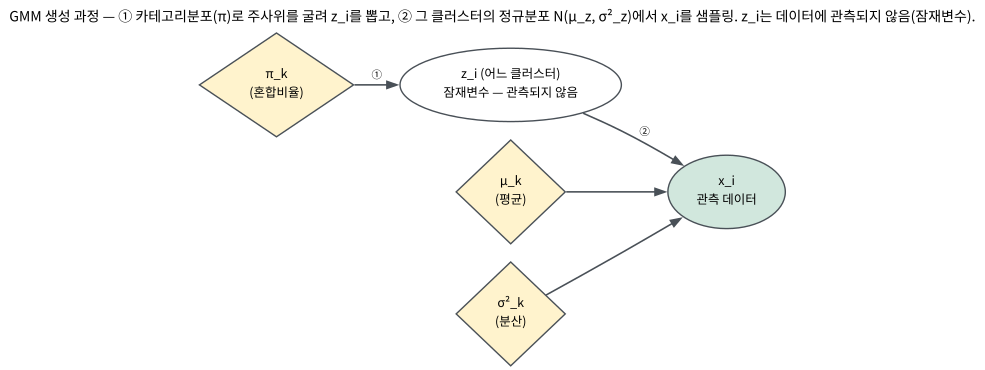
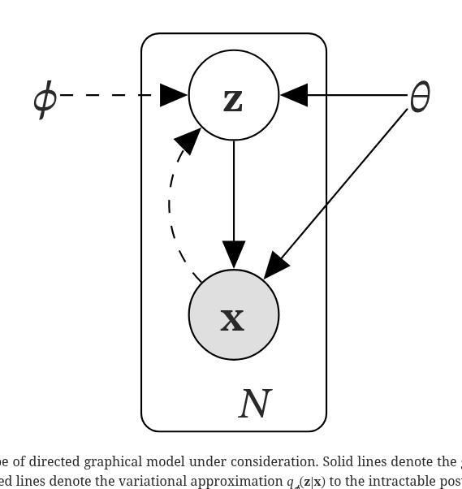
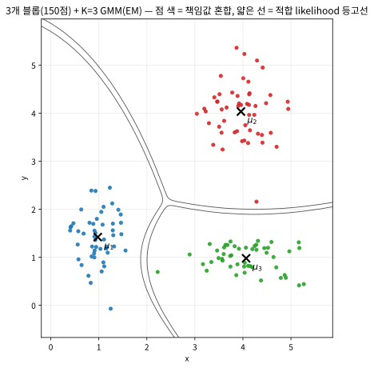
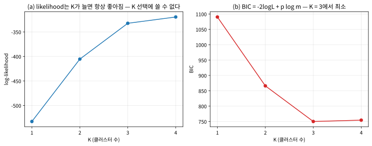
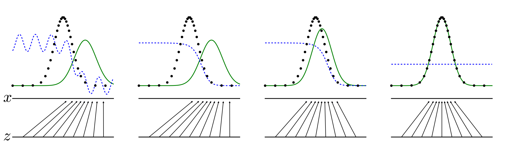

# 15.1 EM 알고리즘과 GMM

[](https://colab.research.google.com/github/SuminHan/book-ml/blob/main/notebooks/ml1/chapter15_1_em_gmm.ipynb)

### 닭이 먼저냐 달걀이 먼저냐: 잠재변수 문제

Chapter 14의 k-means는 각 점을 **딱 하나의** 클러스터에 배정했다(하드
할당, hard assignment). 그런데 실제 데이터는 클러스터 경계가 모호한
경우가 많다 — 어떤 점은 클러스터 A에 60%, B에 40% 정도 속한다고 보는 게
더 자연스러울 수 있다. **가우시안 혼합모델**[^gmm] (Gaussian Mixture Model,
GMM)은 각 클러스터를 정규분포로 표현하고(Chapter 3의 GDA[^gda]와 같은 가정),
각 점이 어느 클러스터에서 나왔는지를 **확률**로 표현한다.

문제는 이렇다 — 각 점이 어느 클러스터에서 나왔는지를 나타내는 변수
\\(z\\)는 데이터에 **관측되지 않는다**(잠재변수, latent variable):

- 만약 각 점의 \\(z\\)(진짜 클러스터)를 **안다면**, 각 클러스터의 평균과
  분산을 구하는 건 쉽다(Chapter 3의 GDA와 똑같이, 그 클러스터에 속한
  점들의 평균·분산을 계산하면 된다).
- 만약 각 클러스터의 평균과 분산을 **안다면**, 각 점이 어느 클러스터에
  속할 확률(\\(z\\)의 사후확률)을 구하는 것도 쉽다(베이즈 정리).

문제는 **둘 다 모른다**는 것이다 — 닭이 먼저냐 달걀이 먼저냐의 순환이다.
EM은 이 순환을 반복으로 풀어낸다: 하나를 (아무 값으로) 고정하고 다른
하나를 구하고, 그걸로 다시 처음 것을 고치고, 이걸 값이 더 이상 바뀌지
않을 때까지 반복한다.

### 유명한 사례: 절차의 이름이 그대로 알고리즘 이름이 된 논문

1977년, 통계학자 아서 뎀스터(Arthur Dempster), 낸 레어드(Nan Laird),
도널드 루빈(Donald Rubin)[^em1977]이 잡지 *JRSS-B*에 발표한 "Maximum Likelihood
from Incomplete Data via the EM Algorithm"은 통계학에서 가장 많이
인용된 논문 중 하나로 꼽힌다. 그런데 놀랍게도 이 논문의 '발명품'은
"전혀 새로운 수학"이 아니었다. E-step이 쓰는 계산(현재 파라미터에서의
사후확률)도, M-step의 갱신 공식도 그 전부터 이미 알려져 있었다.
세 사람이 한 일은 **통합**이었다 — 혼합모델(mixture model), 결측값
(missing data), HMM, 양자화 문제처럼 겉보기엔 별개의 여러 통계 문제가
사실 전부 같은 구조, "관측 안 된 변수가 있으면 M-step이 쉽고, 파라미터가
주어지면 E-step이 쉽다"를 공유하며, 이 둘을 번갈아 돌리면 **우도가
절대 줄지 않으니 반드시 수렴한다**는 보장을 공유한다는 것을 보였다.

"EM"이라는 이름 자체가 E-step과 M-step이라는 **두 절차의 앞글자**
그대로인 것이 이 논문의 성격을 보여준다. 기계학습 역사에서 "동시에
독립적으로 두 번 발견"된 알고리즘(k-means, 4.3절의 로이드·매퀸 이야기)
이 있는 반면, EM은 그 반대 방향의 통합 사례다 — 여러 알고리즘이 사실
하나였음을 보인 사건이다. Chapter 15 전체의 주제인 "관측되지 않은
구조가 데이터를 만든다"는 질문은, 정확히 이 논문에서 하나의 알고리즘
으로 정리되기 시작했다고 해도 과언이 아니다.

### GMM의 생성 과정: 라벨을 뽑고, 그 라벨의 분포에서 점을 뽑는다

GMM을 "데이터가 만들어지는 과정"으로 기술하면 매우 단순하다:

1. **라벨 뽑기**: \\(K\\)개의 면을 가진 주사위(카테고리분포)를 굴려
   \\(z\_i \in \\{1, \dots, K\\}\\)를 뽑는다. 각 면의 확률은 \\(\pi\_k\\).
2. **점 뽑기**: 뽑힌 클러스터 \\(z\_i = k\\)의 정규분포
   \\(\mathcal{N}(\mu\_k, \Sigma\_k)\\)에서 점 \\(x\_i\\)를 샘플링한다.

(여기서부터는 1차원 예제를 위해 \\(\Sigma\_k\\)가 그냥 스칼라
\\(\sigma\_k^2\\)로 쓰인다.) 모델의 모수는 세 종류 — 클러스터별 평균
\\(\mu\_k\\), 분산 \\(\sigma\_k^2\\), 혼합비율 \\(\pi\_k\\)(\\(\sum\_k \pi\_k = 1\\)).
이 모델이 정의하는 한 점의 likelihood는 라벨에 대한 합이다:

\\[p(x) = \sum\_{k=1}^{K} \pi\_k \\, \mathcal{N}(x; \mu\_k, \sigma\_k^2)\\]

**왜 이것이 MLE로 풀기 어려운가**: Chapter 3의 GDA나 나예브 베이즈는
"라벨이 주어지면" 파라미터별 likelihood가 곱의 합으로 깔끔하게
풀렸고, 그래서 닫힌 형태의 MLE 공식이 있었다. GMM은 라벨 \\(z\\)가
**관측되지 않아** likelihood가 \\(\prod\_i \big(\sum\_k \pi\_k
\mathcal{N}(x\_i; \mu\_k, \sigma\_k^2)\big)\\) — **곱의 합**이 된다. 합이
곱 안에 끼어 있으면 미분을 0으로 놓고 풀 수 있는 구조가 아니다.
"만약 \\(z\\)가 알렸다면"은 Chapter 3의 GDA와 똑같이 닫힌 형태로 풀린다 —
EM은 이 "만약"을 반복적으로 실행하는 알고리즘이다.



### EM 알고리즘: E-step과 M-step

**E-step (Expectation)**: 현재 각 클러스터의 파라미터(평균 \\(\mu\_k\\),
분산 \\(\sigma\_k^2\\), 클러스터 비율 \\(\pi\_k\\))가 주어졌다고 가정하고,
각 데이터 점 \\(x\_i\\)가 클러스터 \\(k\\)에 속할 사후확률(**책임값**,
responsibility) \\(\gamma\_{ik}\\)을 베이즈 정리로 계산한다:

\\[\gamma\_{ik} = P(z\_i{=}k \mid x\_i) = \frac{\pi\_k \\, \mathcal{N}(x\_i;
\mu\_k,\sigma\_k^2)}{\sum\_{j} \pi\_j \\, \mathcal{N}(x\_i;\mu\_j,\sigma\_j^2)}\\]

**M-step (Maximization)**: 방금 구한 책임값을 "가중치"로 삼아, 각
클러스터의 파라미터를 다시 추정한다 — 클러스터 \\(k\\)에 대한 책임값이
클수록 그 점이 \\(\mu\_k, \sigma\_k^2\\) 추정에 더 크게 기여한다:

\\[\mu\_k = \frac{\sum\_i \gamma\_{ik} x\_i}{\sum\_i \gamma\_{ik}}, \qquad
\sigma\_k^2 = \frac{\sum\_i \gamma\_{ik}(x\_i-\mu\_k)^2}{\sum\_i \gamma\_{ik}},
\qquad \pi\_k = \frac{\sum\_i \gamma\_{ik}}{m}\\]

```python
import math

def gaussian_pdf(x, mu, sigma):
    return (1 / (sigma * math.sqrt(2 * math.pi))) * math.exp(-((x - mu) ** 2) / (2 * sigma ** 2))

def em_step(data, means, sigmas, weights):
    K, n = len(means), len(data)
    # E-step: 책임값(responsibility) 계산
    resp = []
    for x in data:
        probs = [weights[k] * gaussian_pdf(x, means[k], sigmas[k]) for k in range(K)]
        total = sum(probs)
        resp.append([p / total for p in probs])
    # M-step: 책임값으로 가중평균한 파라미터 재추정
    Nk = [sum(resp[i][k] for i in range(n)) for k in range(K)]
    new_means = [sum(resp[i][k] * data[i] for i in range(n)) / Nk[k] for k in range(K)]
    new_sigmas = [math.sqrt(sum(resp[i][k] * (data[i] - new_means[k]) ** 2
                                  for i in range(n)) / Nk[k]) for k in range(K)]
    new_weights = [Nk[k] / n for k in range(K)]
    return new_means, new_sigmas, new_weights
```

M-step의 공식을 한 번 더 천천히 보자. 이것은 **정말** 새로운 수식이
아니다 — "라벨이 전부 \\(k\\)인 점들의 평균·분산·비율"(Chapter 3의
닫힌 형태 MLE)에서, 각 점의 "소속 여부"(0 또는 1)를 **책임값
\\(\gamma\_{ik}\\)(0과 1 사이의 실수)로 바꾼 것**뿐이다. E-step이
"하드 라벨 대신 소프트 라벨을 채워넣는" 단계이고, M-step은
"소프트 라벨이 주어졌을 때의 닫힌 형태 MLE"인 셈이다 — EM의 전부가
이 한 문장이다.

### 왜 우도가 항상 증가하는가: 옌센 부등식 1줄

"E-step → M-step을 반복하면 수렴한다"는 말을 그대로 믿지 말자 —
*왜* 우도가 매 반복마다 절대 줄지 않는지, 4줄이면 보인다. 핵심은
**ELBO**(Evidence Lower BOund)라는 이름으로 Chapter 15.2절에서
다시 만난다. 하나의 점 \\(x\\)에 대해, \\(\gamma\\)를 \\(z\\) 위의
아무 확률분포라고 놓고:

\\[p(x) = \sum\_{k} p(x, z{=}k) = \sum\_{k} \gamma\_k \frac{p(x, z{=}k)}{\gamma\_k}
= \mathbb{E}\_{z \sim \gamma}\\!\left[\frac{p(x, z)}{\gamma(z)}\right]\\]

\\(\log\\)는 **오목함수**(concave)이므로 옌센 부등식
(\\(\log \mathbb{E}[X] \ge \mathbb{E}[\log X]\\))을 적용하면:

\\[\log p(x) \ge \mathbb{E}\_{z \sim \gamma}[\log p(x, z)]
- \mathbb{E}\_{z \sim \gamma}[\log \gamma(z)] \\;\\; \stackrel{\text{def}}{=} \\; \mathcal{F}(\theta, \gamma)\\]

우변 \\(\mathcal{F}(\theta, \gamma)\\)가 우도의 **하한**이다(등호가
성립하는 조건 — \\(\frac{p(x,z)}{\gamma(z)}\\)가 \\(z\\)에 대해 상수,
즉 \\(\gamma\\)가 진짜 사후확률 \\(p(z|x)\\)인 경우 — 을 기억해두라,
바로 이 조건이 EM의 설계 원리다). 이제 EM의 두 단계를 이 하한으로
읽으면:

- **E-step**: \\(\gamma\\)를 *현재 파라미터 \\(\theta\_{\text{old}}\\)에서의
  진짜 사후확률*로 잡는다 → 등호가 성립해서
  \\(\mathcal{F}(\theta\_{\text{old}}, \gamma) = \log p(x; \theta\_{\text{old}})\\).
  (하한이 **뚫리지 않는 정도로 꽉 조인** 상태.)
- **M-step**: \\(\gamma\\)를 고정하고 \\(\theta\\)를 \\(\mathcal{F}\\)를
  최대화하도록 갱신한다 →
  \\(\mathcal{F}(\theta\_{\text{new}}, \gamma) \ge
  \mathcal{F}(\theta\_{\text{old}}, \gamma)\\).

두 걸을 합치면 \\(\log p(x; \theta\_{\text{new}}) \ge
\mathcal{F}(\theta\_{\text{new}}, \gamma) \ge
\mathcal{F}(\theta\_{\text{old}}, \gamma) =
\log p(x; \theta\_{\text{old}})\\) — **우도가 매 반복마다
절대 줄지 않는다**. 15.2절의 VAE[^vae]는 "E-step의 사후확률을 정확히
계산할 수 없을 때(연속 무한한 잠재변수) 이 하한을 신경망
\\(q\_\phi(z|x)\\)로 근사해서 역전파로 올린다"는 알고리즘이므로,
EM과 VAE는 *같은 부등식의 두 실행 전략*이다.



이 보장이 6개 데이터의 실행에서 실제로 작동하는지 확인해보자
(\\(m=6\\), 데이터 \\([1.0, 1.5, 0.8, 9.2, 10.1, 9.8]\\), 초기값
\\(\mu=[2, 8], \sigma=[1, 1], \pi=[0.5, 0.5]\\)):

| 반복 | log-likelihood |
|---|---|
| 0 (초기값) | \\(-15.56\\) |
| 1 | \\(-6.05\\) |
| 2 (수렴) | \\(-6.05\\) |

1회차에 이미 \\(-15.56\\)에서 \\(-6.05\\)까지 뛰고, 2회차에서 더 이상
변하지 않아 멈춘다. 단조증가는 성립하지만, 도달한 점이 **전역
최적해**라는 보장은 이 논증 어디에도 없다 — 하한이 "어디까지"
오르는지는 말해주지 않는 것이다.

### 실습: 2차원 데이터에서 전체 GMM

1차원에서는 \\(\mu\_k, \sigma\_k^2\\)가 각각 스칼라였지만, \\(d\\)차원
데이터에서는 \\(\mu\_k \in \mathbb{R}^d\\), \\(\Sigma\_k \in \mathbb{R}^{d \times d}\\)
(공분산 **행렬**)가 된다. E-step은 그대로(밀도를 행렬 형태로 바꾸면
되고), M-step은 가중 공분산을 추가할 뿐이다:

\\[\mu\_k = \frac{\sum\_i \gamma\_{ik} x\_i}{\sum\_i \gamma\_{ik}},
\qquad \Sigma\_k = \frac{\sum\_i \gamma\_{ik}(x\_i - \mu\_k)(x\_i - \mu\_k)^{\mathsf{T}}}{\sum\_i \gamma\_{ik}}\\]

이 \\(\Sigma\_k\\)가 GMM이 k-means보다 표현력이 많은 **정체**다. k-means의
클러스터 표현은 "위치"(\\(\mu\_k\\)) 하나뿐이어서, 경계가 항상 직선
(보로노이 셀, 4.3절의 구조적 한계)이 되고 모든 덩어리가 "동일한
크기의 원"으로 취급됐다. GMM의 \\(\Sigma\_k\\)는 (i) **크기**를, (ii)
**타원형 모양**(방향별 분산이 다름)을, (iii) **기울어진(대각 성분이
있는) 형상**을 모두 표현할 수 있다. 두 클러스터 사이의 결정 경계도
"두 정규분포의 밀도비가 1인 곡선"이 돼서 직선이 아니라 **타원호**가
된다.



(위 그림은 수반 노트북의 4절에서 생성된다.) 3개의 타원형 덩어리
(각 50점)에 \\(K=3\\) GMM을 EM으로 학습시키면, 세 \\(\mu\_k\\)가 각각의
덩어리 중심으로 수렴하고 \\(\Sigma\_k\\)가 덩어리마다 다른 "형상"을
잡는다. 책임값으로 점을 색칠하면, 덩어리 **경계 안쪽**의 점들이
두 클러스터 색을 섞어서 보이는 것이 k-means(점 하나에 딱 하나의 색)
와의 가장 눈에 띄는 차이다.

### 손으로 한 번: EM 한 라운드를 직접 따라가기

작은 데이터로 E-step과 M-step을 손으로 전부 계산해보자. 점 세 개
\\(x\_1 = 0, x\_2 = 3, x\_3 = 8\\), \\(K=2\\), 초기값 \\(\mu\_1 = 1,
\mu\_2 = 5, \sigma\_1 = \sigma\_2 = 1, \pi\_1 = \pi\_2 = 0.5\\).

**E-step** — 각 점의 두 정규밀도와 책임값:

- \\(x\_1 = 0\\): \\(\mathcal{N}(0; 1, 1) = 0.2420\\),
  \\(\mathcal{N}(0; 5, 1) \approx 0.00001\\) →
  \\(\gamma\_{1} = (1.00000,\\; 0.00001) \approx (1, 0)\\)
- \\(x\_2 = 3\\): \\(\mathcal{N}(3; 1, 1) = \mathcal{N}(3; 5, 1) = 0.0540\\)
  (3은 1과 5의 **정중앙**이라 두 밀도가 정확히 같음) →
  \\(\gamma\_{2} = (0.5, 0.5)\\)
- \\(x\_3 = 8\\): \\(\mathcal{N}(8; 1, 1) \approx 0.00000\\),
  \\(\mathcal{N}(8; 5, 1) = 0.00443\\) →
  \\(\gamma\_{3} = (0.00000,\\; 1.00000) \approx (0, 1)\\)

정중앙에 있는 \\(x\_2 = 3\\)이 정확히 **반반**으로 나눠지는 것이
soft assignment의 정수(精髓)다 — k-means에서는 이 점이 임의로 한쪽
에만 배정됐을 텐데, GMM은 "정말 확신이 없다"는 사실을 책임값에
그대로 남긴다.

**M-step** — \\(N\_1 = 1 + 0.5 + 0 = 1.5\\), \\(N\_2 = 1.5\\)로:

\\[\mu\_1 = \frac{1 \cdot 0 + 0.5 \cdot 3 + 0 \cdot 8}{1.5} = 1.0,
\qquad
\mu\_2 = \frac{0 + 0.5 \cdot 3 + 1 \cdot 8}{1.5} = 6.33\\]

\\[\sigma\_1^2 = \frac{1 \cdot (0-1.0)^2 + 0.5 \cdot (3-1.0)^2}{1.5}
= 2.0 \\;\\; (\sigma\_1 = 1.41), \qquad
\sigma\_2^2 = \frac{0.5 \cdot (3-6.33)^2 + 1 \cdot (8-6.33)^2}{1.5}
= 5.56 \\;\\; (\sigma\_2 = 2.36)\\]

\\(\pi = (0.5, 0.5)\\)는 그대로(\\(N\_1 = N\_2\\)). 두 가지가 눈에 들어온다:
(i) \\(x\_3 = 8\\)을 **전부** 받아든 클러스터 2는 \\(\mu\_2\\)가 5에서
6.33으로 **뛴다** — 책임값 1.0은 "이 점은 완전히 내 클러스터의 것"을
뜻한다. (ii) 양쪽 분산이 커졌다 — 반씩만 배정된 정중앙 점 \\(x\_2 = 3\\)
이 두 클러스터의 "분산" 추정에 모두 기여하기 때문이다(책임값
0.5를 곱한 거리가 각 \\(\Sigma\\)에 포함되는 것). 이 한 라운드로
log-likelihood가 \\(-11.14 \to -7.40\\)으로 증가하는 것을 직접
계산해서 확인할 수 있다(확인 문제 4).

### \\(K\\)를 고르는 법: BIC

"데이터가 몇 개의 덩어리인가" — \\(K\\) 선택 문제다. **주의**:
likelihood로 \\(K\\)를 골라서는 안 된다. 클러스터가 하나 더 늘면
모델이 더 유연해져서 likelihood는 **항상** 좋아진다(극단적으로
\\(K = m\\), 각 점마다 분산 0의 가우시안을 하나씩 놓으면 likelihood가
완벽해진다). "최소의 SSE로 \\(k\\)를 고르면 \\(k = n\\)이 된다"는
4.3절의 엘보우 섹션과 정확히 같은 함정이다.

대신 쓰는 것이 **BIC**(Bayesian Information Criterion):

\\[\text{BIC} = -2 \log \mathcal{L}(\hat{\theta}) + p \log m\\]

\\(\mathcal{L}(\hat{\theta})\\)는 수렴한 GMM의 likelihood, \\(p\\)는
자유 모수 개수, \\(m\\)은 점의 개수다. "likelihood를 크게 올리는
것"과 "파라미터 개수 \\(\times \log m\\) 벌점을 주는 것"의 트레이드오프
로, \\(m\\)이 크면 클수록 **과적합된** 모델(파라미터가 많은 모델)을
더 강하게 벌한다. asymptotically, 진짜 \\(K\\)를 쓰면 그 BIC가
\\(m \to \infty\\)에서 확률 1로 가장 작아진다는 성질(일관성)이 있다.

같은 3-블롭 2차원 데이터(150점)에 \\(K = 1\\)에서 \\(4\\)까지
EM을 돌려보면(노트북 5절):

| \\(K\\) | log-likelihood | BIC |
|---|---|---|
| 1 | \\(-749.1\\) | 1513.2 |
| 2 | \\(-630.6\\) | 1296.2 |
| 3 | \\(-410.1\\) | **875.4** |
| 4 | \\(-410.1\\) | 895.4 |

최소는 정확히 \\(K = 3\\)이다. \\(K=3 \to 4\\)를 보면 핵심 현상이
보인다 — log-likelihood는 **동일**하다(\\(-410.1\\)). 네 번째
클러스터를 추가해도 피팅이 나아지지 않는다는 뜻인데(기존 덩어리를
쪼개는 것뿐), BIC 벌점(\\(p\\)가 11에서 15로 늘어)이 판을 뒤집는다.
4.3절의 엘보우가 "감소폭이 꺾이는 지점"을 **눈**으로 찾았다면, BIC는
같은 결정을 하나의 **숫자**로 내리는 원리 있는 버전이다.
EM과 혼합모델을 더 깊이 다루는 자료: [^cs229].





### 자주 하는 실수

**실수 1 — EM을 한 번만 돌려 믿기 (k-means의 실수보다 더 위험하다).**
k-means의 "나쁜 초기화 → 나쁜 지역최적해"(4.3절)는 GMM에도
그대로 있지만, GMM은 **분산까지 자유**라서 실패의 모양이 k-means와
다르다. 수반 노트북에서 확인한 실패 사례: 무작위 초기화 30회 중
여러 건이 세 중심이 **모두 데이터의 중심 (2.98, 2.04)에 겹쳐서**
수렴하는 퇴화된 해에 빠진다 — 한 클러스터의 분산이 아주 작아져서
"가장 빽빽한 부분을 K개의 작은 가우시안으로 쪼갠다"는 분할이
지역적으로는 우도 최대가 되기 때문이다(log-likelihood \\(-749\\) vs
진짜 구조의 \\(-410\\) — 2.7배나 나쁘다). k-means가 60회 중 22회가
실패했던 것과 같은 구조의 문제인데, GMM은 "분산이 붕괴해 한두 점을
혼자 차지한다"는 추가 경로까지 열려 있다. 대응책은 k-means와
동일 — 여러 초기화(`n_init`) + BIC 같은 기준이 아니라 **최종
우도로** 결과를 비교(최소 우도… 아니다, **최대** 우도를 가진
결과를 채택).

**실수 2 — "likelihood가 가장 큰 \\(K\\)를 고른다".** \\(K=m\\)가
항상 이긴다(위 BIC 섹션). BIC/AIC/교차검증을 써야 한다.

**실수 3 — 책임값 0.4를 "오류"로 읽기.** 클러스터가 겹치는 영역의
점에서 \\(\gamma = (0.4, 0.6)\\)가 나온 것은 모델이 **불확실성을
바르게 보고한 것**이지, 학습이 안 된 것이 아니다. k-means로 같은
영역의 점을 색칠하면 임의로 한쪽 색이 붙어 "확실히 속한다"는
거짓된 인상을 준다 — soft assignment가 주는 불확실성 정보는
(예: 경계점만 따로 골라 인간이 재분류하는) 후속 작업에 실제로
유용하다.

### 실습: 수반 노트북이 검증하는 것들

[노트북](https://colab.research.google.com/github/SuminHan/book-ml/blob/main/notebooks/ml1/chapter15_1_em_gmm.ipynb)
은 numpy[^numpy]/matplotlib만으로 본문의 코드를 그대로 실행한다: (1) 책의
`em_step`을 6개 데이터에 돌려 수렴 과정을 추적(1차원), (2) 3개
블롭 2차원 데이터에서 2D GMM을 EM으로 학습하고 **등고선 +
책임값 기반 색칠**로 시각화, (3) 무작위 초기화 30회 돌려 **지역
최적해/분산 붕괴 실패 사례**를 실제로 만든 뒤 좋은 초기화와
log-likelihood로 비교, (4) \\(K=1\sim4\\)의 **BIC 곡선**을 그려
\\(K\\) 선택 확인. (본문에 적힌 특정 숫자 — 실패 횟수, BIC 값 등 —
는 재현을 목표로 하지 않으며, 같은 "현상"이 실제로 일어나는지
확인하는 것이다.)

### 확인 문제: 1차원에서 EM 한 라운드를 직접 계산하기

점 세 개 \\(x\_1 = 0, x\_2 = 3, x\_3 = 8\\), \\(K = 2\\), 초기값
\\(\mu\_1 = 1, \mu\_2 = 5, \sigma\_1 = \sigma\_2 = 1,
\pi\_1 = \pi\_2 = 0.5\\)를 쓴다("손으로 한 번" 섹션과 같은 설정).

**단계 1 (E-step)**: 각 점에 대해 \\(\gamma\_i = (\gamma\_{i1},
\gamma\_{i2})\\)를 계산하라. (힌트: \\(\sigma = 1\\)이라 정규밀도
\\(\mathcal{N}(x; \mu, 1) = \frac{1}{\sqrt{2\pi}}
e^{-(x-\mu)^2/2}\\)를 직접 쓰면 \\(\sqrt{2\pi} \approx 2.507\\)만
공통 인자로 들어와, **밀도끼비**만 보면 지수부만 비교하면
된다.)

**단계 2 (M-step)**: 단계 1의 \\(\gamma\\)로 새
\\(\mu\_1, \mu\_2, \sigma\_1, \sigma\_2, \pi\_1, \pi\_2\\)를 계산하라.

**단계 3 (수렴 판정)**: 새 파라미터로 likelihood
\\(\log \prod\_i \sum\_k \pi\_k \mathcal{N}(x\_i; \mu\_k, \sigma\_k^2)\\)를
계산하고, 초기 파라미터의 likelihood와 비교해서 "증가했는가"를
확인하라(옌센 부등식 섹션의 보장이 작은 예시에서도 성립하는지).

정답(확인용): 단계 1 — \\(\gamma\_1 \approx (1, 0)\\),
\\(\gamma\_2 = (0.5, 0.5)\\)(정중앙이라 정확히 반반),
\\(\gamma\_3 \approx (0, 1)\\). 단계 2 — \\(\mu\_1 = 1.0\\),
\\(\mu\_2 = 6.33\\), \\(\sigma\_1 = 1.41\\), \\(\sigma\_2 = 2.36\\),
\\(\pi = (0.5, 0.5)\\). 단계 3 — log-likelihood가
\\(-11.14 \to -7.40\\)으로 증가(보장 확인).

### 자주 묻는 질문

**Q. EM이 항상 전역 최적해로 수렴하나요?** 아니다 — E-step과 M-step을
반복할 때마다 우도(likelihood)가 절대 감소하지 않는다는 것은 보장되지만
(그래서 언젠가는 수렴한다), Chapter 4.3의 k-means와 마찬가지로 초기
파라미터에 따라 **지역 최적해**에 갇힐 수 있다. 실전에서는 여러 번
서로 다른 초기화로 EM을 돌려 가장 좋은 결과를 채택하는 방법을 흔히
쓴다 — k-means의 "여러 번 초기화해서 최선을 고른다"는 전략과
정확히 같은 대응책이다.

**Q. GMM은 k-means보다 항상 더 좋은 선택인가요?** 항상 그렇지는
않다 — GMM은 각 클러스터가 정규분포를 따른다고 가정하고(Chapter
3.2의 GDA와 같은 가정), 부드러운(soft) 할당을 계산하느라 k-means보다
계산 비용이 더 든다. 클러스터가 실제로 겹쳐 있거나 모양이 서로 다를
가능성이 있다면 GMM이 유리하고, 클러스터가 뚜렷이 분리돼 있고
속도가 중요하다면 k-means로 충분한 경우가 많다.

**Q. GMM의 E-step이 "정확한" 사후확률을 계산한다면, VAE는 왜
신경망으로 근사하나요?** GMM의 잠재변수 \\(z\\)는 **이산**이고
가능치가 \\(K\\)개(예: 3개)뿐이라, 사후확률을 K개 항의 합으로
**정확히** 계산할 수 있다 — 그래서 EM의 E-step이 닫힌 형태로
풀린다. VAE(15.2절)의 잠재변수는 **연속** 벡터라 가능한 \\(z\\)가
무한하고, 사후확률의 적분이 계산 불가능해진다(intractable).
"계산 안 되는 E-step"을 신경망 \\(q\_\phi(z|x)\\)로 대충 근사하고,
M-step도 닫힌 형태가 아니라 역전파로 근사하는 것 — VAE는
정확히 이 필요에서 나온 "EM의 약한 근사 버전"이다.

**Q. EM은 얼마나 빨리 수렴하나요?** 일반적으로 **선형(linear)
수렴**이다 — 수렴점 가까울수록 매 반복마다 오차가 "고정된 비율"로
줄어들어, 마지막 몇 자리 정밀도는 의외로 오래 걸린다. 실전에서는
"파라미터 변화가 \\(\epsilon\\) 미만"이나 "likelihood 변화가
\\(\epsilon\\) 미만" 같은 수렴 기준을 둔다. 또 차원이 높으면
공분산 행렬 \\(\Sigma\_k\\)가 특이(singular, 역행렬이 없는) 행렬에
**가깝게** 수렴하기 쉬워서, 실전 라이브러리(`sklearn.mixture.GaussianMixture`
등)[^sklearn]는 (i) 대각 공분산만 허용하거나 (ii) 모든 클러스터에 같은
공분산을 쓰거나 (iii) \\(\Sigma\_k + \epsilon I\\) 같은
정규화를 넣는 옵션을 제공한다.

**Q. GMM은 "생성 모델"이라면서 어떻게 데이터를 *만들어*냅니까?**
학습이 끝나면 모델은 **완전한** 데이터 생성 절차 \\(p(z) \to p(x|z)\\)를
가지고 있다 — 새 점을 만들려면 (1) 주사위 \\(\pi\\)로 \\(z\\)를 뽑고,
(2) 그 \\(z = k\\)의 \\(\mathcal{N}(\mu\_k, \Sigma\_k)\\)에서 \\(x\\)를
샘플링하면 된다. 이 "생성" 능력이 Chapter 15의 나머지 절
(VAE가 \\(z \sim \mathcal{N}(0, I)\\)에서, GAN[^gan]이 노이즈에서)의
"데이터 생성"과 정확히 같은 질문의 가장 단순한 버전이다 —
연습문제 1이 바로 이 함수를 작성하게 한다.

---

## 연습문제

**1. (코딩)** 학습된 GMM에서 새 데이터를 샘플링하는 함수
`sample_from_gmm(means, sigmas, weights, n, rng)`을 작성하라
(\\(1\\)차원 기준, `numpy.random.RandomState` 사용). 먼저
`rng.choice(K, size=n, p=weights)`로 라벨 배열을 뽑고, 라벨별로
`rng.normal(means[k], sigmas[k])`을 적용하면 된다.

```python
def sample_from_gmm(means, sigmas, weights, n, rng):
    # ADD ADDITIONAL CODE HERE!!
    return samples  # 길이 n의 1차원 numpy 배열

# 확인용: 6개 데이터 예제에서 EM 수렴 결과
#   means ≈ [1.1, 9.7], sigmas ≈ [0.29, 0.37], weights = [0.5, 0.5]
# 를 쓰면, 10000개 샘플링했을 때 샘플 평균 ≈ 5.4,
# "1 근처(±1.5)" 비율과 "9.7 근처(±1.5)" 비율은 각각 ≈ 0.5
# (양쪽이 대략 절반씩 — 혼합비율이 0.5/0.5이므로)
```

**2. (개념 서술)** GMM의 M-step 공식
\\(\mu\_k = \frac{\sum\_i \gamma\_{ik} x\_i}{\sum\_i \gamma\_{ik}}\\)에서,
\\(\gamma\_{ik}\\)가 0 또는 1인 하드 라벨(정수)이면 이 공식은
"클러스터 \\(k\\)에 속한 점들의 **산술 평균**"이 됨을 보이고,
소프트 \\(\gamma\\)일 때는 "책임값 가중 평균"이 됨을 설명하라.
그런데 E-step의 \\(\gamma\\)는 "아직 정답이 아닌" 파라미터에서의
사후확률인데, 왜 M-step의 공식은 여전히 "닫힌 형태"로
남는가(힌트: \\(z\\)가 *주어졌을 때*의 likelihood는
\\(z\\)에 대해 곱으로 분리되기 때문 — \\(\gamma\\)는 그 곱에
**가중치**로만 들어간다).

**3. (손유도, Tier B — 힌트 제공)** M-step의 \\(\mu\_k\\) 공식을
직접 유도하라. 라벨이 주어졌을 때(\\(z\_i = k\\)인 점의 집합
\\(\mathcal{D}\_k\\)) 클러스터 \\(k\\)의 log-likelihood
\\(\ell(\mu\_k) = \sum\_{i \in \mathcal{D}\_k}
\log \mathcal{N}(x\_i; \mu\_k, \sigma\_k^2)\\)를 \\(\mu\_k\\)로
미분해서 0으로 놓아라.

**힌트**: \\(\frac{\partial}{\partial \mu}
\log \mathcal{N}(x; \mu, \sigma^2) =
\frac{x - \mu}{\sigma^2}\\)이다(지수부의 \\(-\frac{(x-\mu)^2}{2\sigma^2}\\)
만 미분하면 된다). 이 결과가 4.3절의 "평균은 SSE를 최소화한다"는
수학(\\(\nabla\_c \sum\_j \\|x\_j - c\\|^2 = -2\sum\_j(x\_j - c)\\)이 0인
점)과 정확히 같은 구조임을 확인하고, "가중치 \\(\gamma\_{ik}\\)를
곱해도 같은 구조가 유지되는지"를 한 문장으로 설명하라.

**4. (손계산)** "확인 문제"와 동일한 설정(\\(x = 0, 3, 8\\),
\\(\mu = [1, 5], \sigma = [1, 1], \pi = [0.5, 0.5]\\))에서
(a) 세 점의 \\(\gamma\\)를 계산하고, (b) M-step 한 라운드의
모든 파라미터(\\(\mu, \sigma, \pi\\))를 계산하고, (c) 초기
파라미터와 새 파라미터의 log-likelihood를 각각 계산해서
"증가했는가"를 확인하라.

**5. (손유도, Tier C — 폴백 준비 대상)** 15.2절 ELBO
부등식의 **EM 버전**을 유도하라: \\(\log p(x) = \log \sum\_z
p(x, z)\\)에서 시작해, \\(\gamma\\)를 \\(z\\) 위의 아무 분포로 놓고
\\(\sum\_z = \sum\_z \gamma(z) \frac{p(x,z)}{\gamma(z)}\\)로
직접(직접) 쓰고, 옌센 부등식을 적용해서
\\(\log p(x) \ge \mathbb{E}\_{\gamma}[\log p(x, z)] -
\mathbb{E}\_{\gamma}[\log \gamma(z)]\\)를 얻어라.

**빈칸채움형 폴백 버전** (자유 유도가 어려운 경우):

```
Step 1:  log p(x) = log sum_z[ gamma(z) * (p(x,z) / ____________) ]
                                (아무 분포 gamma에 대해 성립)
                        = log E_gamma[ p(x,z) / gamma(z) ]

Step 2:  옌센 부등식(log가 오목함수) 적용:
  log E_gamma[ p(x,z)/gamma(z) ]  __  E_gamma[ log(______________) ]
                                  (등호/부등호 중 하나를 채워라)

Step 3:  log(a/b) = log a - log b로 분해하면:
  = E_gamma[ log p(x,z) ] - ________________

결론:  log p(x) >= E_gamma[log p(x,z)] - E_gamma[log gamma(z)]

등호 성립 조건: p(x,z)/gamma(z)가 z에 대해 상수,
                즉 gamma(z) = p(z|x)일 때 (진짜 사후확률)
```

**정확성 확인**: EM의 E-step이 "gamma를 진짜 사후확률로
고른다"는 동작이, 이 부등식의 *등호 성립 조건*과 정확히
일치함을 한 문장으로 설명하라 — 그리고 이 사실(등호가
*매* E-step에서 성립한다)이 "우도가 매 반복마다 절대
줄지 않는다"는 보증을 어떻게 만들어내는지 한 문장으로
설명하라.

**EM은 "모르면 채우고, 채운 걸로 다시 추정한다"는 두 줄짜리 절차인데,
1977년 논문의 성취는 그 두 줄이 *증명 가능하게* 우도를 올린다는 것
을 보여준 것이다 — 15.2절의 VAE는 E-step을 정확히 계산할 수
없는(연속 잠재변수) 세계에서 이 같은 하한을 신경망으로 근사해서
역전파로 올리는, 같은 수학의 다른 실행 전략이다.**

[^gan]: Goodfellow, I. J. et al. (2014). "Generative Adversarial Networks." arXiv:1406.2661.
[^vae]: Kingma, D. P., Welling, M. (2013). "Auto-Encoding Variational Bayes." arXiv:1312.6114.
[^cs229]: Stanford CS229: Machine Learning, Lecture Notes. https://cs229.stanford.edu/main_notes.pdf
[^gmm]: McLachlan, G. J., Krishnan, T. (2008). "The EM Algorithm and Extensions." 2nd ed. Wiley.
[^sklearn]: Pedregosa, F. et al. (2011). "Scikit-learn: Machine Learning in Python." JMLR 12(2011) 2825-2830. arXiv:1201.0490.
[^em1977]: Dempster, A. P., Laird, N. M., Rubin, D. B. (1977). "Maximum Likelihood from Incomplete Data via the EM Algorithm." Journal of the Royal Statistical Society, Series B (Methodological), 39(1), 1-38. https://doi.org/10.1111/j.2517-6161.1977.tb01682.x
[^numpy]: Harris, C. R. et al. (2020). "Array programming with NumPy." Nature 585, 357 (2020); arXiv:2006.10256.
[^gda]: Ng, A. Y., Jordan, M. I. (2001). "On Discriminative vs. Generative Classifiers." NIPS 14 (Advances in Neural Information Processing Systems). — GDA(Generalized Discriminative Analysis)를 제안한 원 논문: 판별 모델(로지스틱회귀)과 생성 모델(나이브베이즈)의 결정 경계를 비교하고, 올바른 파라미터화 시 GDA의 사후확률이 로지스틱회귀의 시그모이드와 정확히 같은 형태가 됨을 보인다.
