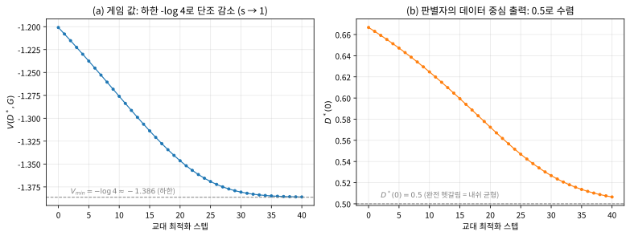

# 15.2 GAN, Diffusion, 그리고 세 원리 비교

[](https://colab.research.google.com/github/SuminHan/book-ml/blob/main/notebooks/ml1/chapter15_2_gan_diffusion.ipynb)

15.1절의 VAE[^vae]는 4.4절의 GMM/EM이 던진 질문("관측되지 않은
구조가 데이터를 만들어내는가")을 신경망으로 근사했다 — 풀리지
않는 E-step을 인코더로 대체하고, 우도의 하한(ELBO)을 역전파로
최대화하는, **우도 기반**의 마지막 방식이다. 이번 절은 그 다음,
**우도 기반과 확연히 다른** 두 방식을 만난다. GAN은 두 신경망의
**경쟁 게임**으로 학습하고, Diffusion은 노이즈를 **한 단계씩 되돌리는
회귀 문제**로 학습한다. 세 방식(VAE·GAN·Diffusion)이 나란히
놓이면 Chapter 15 전체의 그림이 완성된다(생성 모델 전반을 더 깊이
보려면 [^cs230]도 참고하라).

### GAN: 생성자와 판별자의 min-max 게임

2014년, 당시 몬트리올 대학교 얀 르쿤과 요슈아 벵기오 연구소에서
박사과정을 밟던 이언 굿펠로우(Ian Goodfellow)는 GAN[^gan] 아이디어
하나를 떠올렸다: 진짜 같은 가짜 이미지를 만드는 모델을 학습시키는 대신,
**두 개의 신경망이 서로 경쟁하게 만들면 어떨까?** 하나는 가짜를 만드는
위조범(생성자, Generator), 다른 하나는 진짜와 가짜를 구별하는
감정사(판별자, Discriminator)로 두고 서로 계속 겨루게 하면, 위조범의
실력이 점점 진짜에 가깝게 늘어나지 않을까? VAE가 "우도를 최대화한다"는
명확한 단일 목표함수가 있었던 것과 달리, GAN은 두 신경망이 서로 다른,
심지어 **반대되는** 목표를 갖고 동시에 학습된다.

(역사적 일화를 붙여둔다. 2015년 GAN 논문이 처음 ICLR 워크숍에
제출됐을 때 거절당했고, 심사평은 "평균적 품질(average
quality)"이었다. 굿펠로우는 2016년 ACM 튜링상을 받으며 한
수상 연설에서 이 일화를 직접 소개했는데 — "평균적"이라 거부당한
논문이 그해 딥러닝계를 가장 뜨겁게 달군 논문이 됐다는 아이러니는
지금도 자주 회자된다.)


- **생성자**(Generator) \\(G\\): 무작위 노이즈 \\(z \sim p(z)\\)를
  입력받아 가짜 데이터 \\(G(z)\\)를 만든다.
- **판별자**(Discriminator) \\(D\\): 데이터를 입력받아, 그것이 진짜일
  확률 \\(D(x) \in [0,1]\\)을 출력한다(Chapter 2의 로지스틱회귀와
  정확히 같은 형태).

목적함수(min-max game):

\\[\min\_G \max\_D V(D,G) = \mathbb{E}\_{x \sim p\_{\text{data}}}[\log D(x)] +
\mathbb{E}\_{z \sim p(z)}[\log(1 - D(G(z)))]\\]

```python
def discriminator_loss(D_real, D_fake):
    return -(math.log(D_real) + math.log(1 - D_fake))  # 판별자가 최소화할 손실

def generator_loss(D_fake):
    return -math.log(D_fake)  # 생성자가 최소화할 손실 (D_fake를 1에 가깝게)
```

**왜 "균형점"을 논해야 하는가**: 두 네트워크가 서로 반대 목표로 동시에
학습되므로, "학습이 끝났다"는 것이 무슨 의미인지부터 다시 정의해야
한다. 게임이론에서 이런 안정 상태를 **내쉬 균형**(Nash equilibrium)이라
부른다 — 어느 쪽도 혼자서 전략을 바꿔서 더 나아질 수 없는 상태다.
이론적으로 이 게임의 내쉬 균형은 \\(D(x) = 0.5\\)(판별자가 진짜와
가짜를 전혀 구별하지 못함)이고, \\(G\\)가 만드는 분포가 실제 데이터
분포와 정확히 같아지는 지점임이 증명돼 있다.

### 1차원 장난감: 균형을 손으로 계산해보기

"내쉬 균형"이 추상적으로 들리면, **파라미터가 딱 1개인** 장난감
GAN으로 균형을 직접 계산해보자. 데이터는 \\(x \sim \mathcal{N}(0,1)\\),
생성자의 분포는 \\(p\_G = \mathcal{N}(0, s^2)\\) — **표준편차 \\(s\\)
하나**로 가짜 분포의 "너비"만 바꿀 수 있는 생성자(평균은 0으로
고정한다. 데이터와 가짜가 모두 0에 대칭이라 평균 0이 당연히
최고이고, 그러면 게임이 "너비 맞추기"라는 한 가지 문제로
깔끔하게 축소되기 때문이다).

판별자 \\(D\\)는 \\(x\\) 위의 로지스틱회귀(Chapter 2.3)다.
\\(G\\)를 고정하고 \\(D\\)를 **완전히** 최적화하면(미니배치가
아니라 전체 데이터에서 MLE로), 해는 닫힌 형태:

\\[D^\*(x) = \frac{p\_{\text{data}}(x)}{p\_{\text{data}}(x) + p\_G(x)}\\]

여기서 놀라운 사실은, 이 \\(D^\*\\)를 목적함수에 대입하면 게임의
값이 **닫힌 형태**로 나온다는 것이다(GAN 원논문의 Theorem 7):

\\[V(D^\*, G) = 2\\,\mathrm{JSD}(p\_{\text{data}} \\| p\_G) - \log 4\\]

**JSD**(Jensen-Shannon Divergence)는 KL 발산의 "양방향 평균"
버전 — \\(\mathrm{JSD}(p \\| q) = \tfrac{1}{2}
D\_{KL}(p \\| m) + \tfrac{1}{2} D\_{KL}(q \\| m)\\)이고
\\(m = \tfrac{1}{2}(p + q)\\)다. (KL은 \\(p, q\\) 순서가
바뀌면 값이 달라지는 **비대칭** 발산인데, JSD는 두 방향의
평균이라 대칭이다.) JSD의 성질이 이 식의 모든 것을 말해준다:

- \\(\mathrm{JSD} \ge 0\\)이고 두 분포가 **정확히 같을 때만** 0
  → \\(V\\)의 최솟값은 \\(p\_G = p\_{\text{data}}\\)에서의
  \\(-\log 4\\).
- \\(\mathrm{JSD} \le \log 2\\)(두 분포의 지지가 완전히
  겹치지 않을 때 최대) → 게임의 값은 항상
  \\([-\log 4,\\; 0)\\) 안에 있다.

즉 생성자 관점에서 "게임 값을 낮추라"는 것은 **"가짜와 데이터
분포의 JSD를 줄이라**"는 것과 정확히 같은 명령 — 두 분포를
일치시키는 것, 즉 내쉬 균형 \\(s^\* = 1\\)으로 수렴하게 된다.

**이 장난감의 "학습 루프"를 들여다보자.** (1) \\(G\\)를 고정하고
\\(D\\)를 최적화(장난감에서는 닫힌 형태 \\(D^\*\\)라 바로
점프), (2) \\(D^\*\\)를 고정하고 \\(G\\)의 파라미터 \\(s\\)를
그라디언트 스텝으로 한 스텝 갱신 — 하는 **교대 반복**이다.
4.4절 EM의 뼈대(E-step: 파라미터 고정 → 잠재변수 채우기 /
M-step: 잠재변수 고정 → 파라미터 갱신)과 같은 **좌표별
최적화**(coordinate optimization) 구조가, "잠재변수"를 "한
네트워크"로 바뀐 형태로 그대로 나타난다.

그런데 EM과의 **결정적 차이**도 여기서 처음 보인다. EM의
E-step은 **정확한** 사후확률을 채워 넣었기 때문에 "우도가
매 반복 절대 줄지 않는다"는 보장이 **증명 가능**했다. GAN의
루프에서는 (1)이 일반적으로 **완전 최적화가 아닌 근사**라, 매
\\(D\\) 갱신마다 \\(G\\)가 내려다보는 경사면 자체가 바뀌고 —
게임 값에 **단조 감소 보장이 없다**. 이 1차원 장난감은 운 좋게
게임 값이 \\(s\\)의 매끄러운 함수로 **유일하게** 최소가
\\(s = 1\\)에 있어 아래처럼 **단조하게** 수렴한다 — 실전
GAN의 "나쁜 소식들"(등락, 발산, 모드 붕괴)이 아직은 안 보이는
이유가, 이 장난감에 **국소 균형이 딱 하나**뿐이라는 것이다.
여러 개의 국소 균형이 존재하려면, 데이터 분포의 "여러 모드 중
일부만 덮는" 가짜 분포도 균형 후보가 되는 고차원 세계가
필요하다.

\\(s\_0 = 2.0\\), 학습률 \\(\eta = 0.15\\)로 40스텝을 돌려보면
(수반 노트북 2절):

| 스텝 | \\(s\\) | \\(V(D^\*, G)\\) | \\(D^\*(0)\\) |
|---|---|---|---|
| 0 | 2.000 | \\(-1.201\\) | 0.667 |
| 10 | 1.664 | \\(-1.276\\) | 0.625 |
| 20 | 1.339 | \\(-1.346\\) | 0.572 |
| 30 | 1.113 | \\(-1.381\\) | 0.527 |
| 40 | 1.026 | \\(-1.386\\) | 0.507 |
| \\(\infty\\) | 1.000 | \\(-\log 4 \approx -1.386\\) | 0.500 |

세 가지를 기억하라. **(i)** 균형점의 게임 값은 \\(-\log 4 \approx
-1.386\\)인데 **0이 아니다** — "생성자 손실이 0에 가까워지면
성공"은 틀린 읽기다. 성공 신호는 \\(V\\)가 더 이상 줄지 않고
\\(-\log 4\\) 근방에서 **안정**되는 것. **(ii)** \\(D^\*(0)\\)
(판별자가 데이터의 중심 \\(x = 0\\)을 "진짜"로 판정하는
확률)이 0.667에서 0.5로 **점점 구별력을 잃는** 궤적 — 이것이
이론에서 약속했던 "내쉬 균형 = 판별자가 완전히 헷갈리는 점"의
실행이다. **(iii)** \\(V\\)는 줄지만 **0으로 가지 않는다** —
게임 값의 하한은 \\(-\log 4\\)이고(위 JSD 성질), 양쪽이 완벽히
헷갈리는 상태에서도 손실은 양쪽 로그 항이 \\(\log 0.5 =
-\log 2\\)씩 기여해 합계 \\(-\log 4\\)다. 그림 1은 \\(V\\)와
\\(D^\*(0)\\)의 궤적을 나란히 그린 것이다.



**한계를 먼저 말해둔다.** 이 장난감의 생성자는 평균을 못
움직이므로 "데이터의 질량이 어디에 놓이는지"를 **선택할
자유가 없다** — 너비만 맞출 뿐이다. 일반적인 GAN의 생성자는
이 자유까지 갖고, **모드 붕괴는 정확히 이 자유를 남용하는**
실패 모드다(다음 섹션).

### 실전에서는 어떻게 학습하나: 교대 최적화의 함정

실제 GAN의 학습 루프는 위 장난감과 같은 교대 구조다 — 다만
닫힌 형태가 없어서 "최적 판별자로 점프" 대신 **그라디언트 스텝**을
걸을 뿐이다:

```python
for step in range(N):
    real = sample_from_data(batch_size)     # 진짜 배치
    fake = G(noise(batch_size))             # 가짜 배치 (미분 가능하게!)

    # (1) 판별자 갱신: G를 고정, D만 한 스텝
    D_loss = discriminator_loss(D(real), D(fake))
    D.backward(D_loss); D.step()

    # (2) 생성자 갱신: D를 고정, G만 한 스텝
    #     G_loss의 그래디언트는 D를 "지나" G의 파라미터로 흐름
    fake = G(noise(batch_size))
    G_loss = generator_loss(D(fake))
    G.backward(G_loss); G.step()
```

(두 줄째 `fake`를 다시 계산하는 이유는 미분 그래프가
`D.step()` 이후에 갱신된 \\(D\\)를 거쳐야 생성자 파라미터까지
흐르기 때문이다 — 9장의 역전파가 "연산 그래프를 따라 거슬러
올라가는 것"임을 떠올리면 당연하다.)

여기서 4.4절 EM과의 차이를 한 번 더 명확히 하자. EM은 E-step이 **정확한
사후확률**을 채워넣었기 때문에 "우도가 단조증가한다"가
**증명 가능**했다. GAN의 (1)은 \\(D\\)를 완전하게 최적화하지도,
(2)가 \\(G\\)를 완전하게 최적화하지도 못하는 **근사적인** 게임
최적화다 — 그래서 학습 곡선이 "꾸준히 하강하는 우도"처럼
보이지 않고, 오히려 **등락을 거듭한다**. 실전에서 확인하는
불안정성의 대표적 양상:

- **\\(D\\)가 너무 강해지면 \\(G\\)의 그래디언트가 무용화된다.**
  \\(D\\)가 모든 가짜를 \\(D \approx 0\\)으로 확신하면,
  \\(\log(1 - D(G(z))) \approx 0\\)(판별자 손실의 가짜 항)과
  \\(\log D(G(z)) \to -\infty\\) 사이에서 \\(G\\)가 받는 신호는
  "네가 만든 건 전부 가짜"라는 **방향 없는** 신호에 가까워진다 —
  Chapter 9의 "그라디언트 소실"과 정확히 같은 구조다.
- **\\(D\\)가 너무 약하면 \\(G\\)는 "약한 판별자만" 속이는 법을
  배운다.** \\(D\\)의 빈틈을 파고드는 가짜가 손실을 최소화하지만,
  데이터 분포 자체를 잘 본 것은 아니다 — \\(D\\)가 다음에 더
  강해지면 다시 무너진다.
- **두 네트워크의 "학습 속도 밸런스**"가 중요하다 — 한쪽이
  너무 빨리 수렴하면 다른 쪽의 학습 신호가 사라진다. 실전에서는
  \\(D\\)에 배터치 정규화(batch norm)[^batchnorm]를 쓰거나(9장의
  배터치 정규화와 같은 기법), \\(G\\)에 학습률을 작게 맞추거나,
  그래디언트 페널티(아래 WGAN-GP)를 붙이는 등 여러 대응이
  개발됐다.

**실수 1 — "D의 정확도가 50%면 실패한 거다"라고 읽기.**
거꾸다. 이 게임에서 \\(D\\)의 정확도 50%는 **가장 이상적인
운영점**(내쉬 균형)이다. 학습 중 \\(D\\)의 정확도가 50%
부근에서 머물면 "양쪽이 서로를 잘 따라가고 있다"는 신호이고,
반대로 \\(D\\)의 정확도가 90%+로 치솟으면 **\\(G\\)가 이미
학습에서 이탈한** 전형적 실패 신호다 — "D가 잘 learned
하고 있다"가 아니라 "G가 D를 못 따라가고 있다"는 뜻이다.

### 모드 붕괴: 게임의 "성공"이 생성의 "실패"가 되는 지점

실전에서는 이론과 달리 GAN 학습이 자주 불안정하다 — 생성자가 판별자를
속이는 몇 가지 패턴에만 몰려서 다양성을 잃는 현상(**모드 붕괴, mode
collapse**)이 대표적인 문제다. VAE가 이론적으로 안정적이지만 생성
품질이 다소 흐릿한(blurry) 경향이 있는 반면, GAN은 선명한 결과를
내지만 학습이 까다롭다.

위 1차원 장난감이 이미 그 메커니즘을 보여줬다 — 왜 기본 GAN의
목적함수에는 **"다양성을 유지하라는 항"이 없기** 때문이다.
생성자의 손실 \\(-\log D(G(z))\\)는 오직 "이 가짜가 D를 얼마나
속였는가"에 의존한다. 데이터 분포가 세 개의 모드(예: 세 종류의
동물)를 갖고 있다 해도, 만약 그 중 **하나의** 모드만 집중적으로
만들어도 D를 잘 속일 수 있다면 — 고차원 공간에서 D가 "세 모드
모두를 동시에 감시"할 수 없는 한 — 생성자 입장에서는 그 하나에
집중하는 것이 손실을 줄이는 **가장 확실한** 전략이다. 내쉬 균형
\\(p\_G = p\_{\text{data}}\\)(모든 모드를 덮는 분포)가 "완전한
균형"이지만, 실제 학습이 풀고 있는 **근사적인** 게임에서는
"일부 모드를 덮고 D를 속이는" 분포도 국소적으로 균형처럼
작용할 수 있는 상태가 될 수 있다.

반대로 15.1절의 VAE에서는 KL 항 \\(D\_{KL}(q\_\phi(z|x) \\| p(z))\\)
이 "인코더의 출력 분포가 표준정규분포에 가깝게 유지된다"를
**목적함수 안에 명시적으로** 요구한다 — 잠재 공간 전체가 쓰이게
되는 구조적 압력이 있어서, "잠재 공간의 일부만 쓰는" 퇴화는
ELBO를 직접적으로 낮추는 행위다. GAN에는 이 대응 항이
없다 — 이것이 이 절의 VAE/GAN 비교에서 반복되는 **핵심
구조적 차이**다.

### 2014년 이후의 GAN 계열: "안정화"가 3년의 주제였다

기본 GAN의 불안정성을 고치려는 시도가 GAN 연구의 줄기를 이뤘다 —
(각 방법의 정확한 수학은 넘기고, "무엇을 고치려 했는지"만
한 줄씩):

- **WGAN / WGAN-GP (2017, Arjovsky et al. / Gulrajani et
  al.)**[^wgan]: 기본 GAN의 "D가 G를 완전히 이기면 G의 그래디언트가
  사라진다"는 문제를 정조준한다. 게임의 값을 두 분포의
  **워터스톤 거리**(Wasserstein-1, 두 분포를 "이동시켜
  일치시키는 최소 비용 — 어스무버 거리)으로 바꾼 뒤, \\(D\\)를
  **1-Lipschitz**(입력 변화에 대한 출력 변화가 너무 크지
  않음)로 제한하면(처음에는 가중치 클리핑, WGAN-GP는
  **그래디언트 페널티**로), 게임의 값이 두 분포의 실제
  거리와 일치해 \\(G\\)가 **분포가 어디로 옮겨가야 하는지
  방향 신호**를 계속 받는다. 그래디언트가 "0"으로 죽지
  않으므로 학습이 훨씬 안정적으로, 모드 붕괴도 줄어든다.
- **pix2pix (2016), CycleGAN (2017)**[^pix2pix]: "이미지 → 이미지"
  변환으로 확장. CycleGAN은 **레이블된** 데이터 없이도(말의
  사진만, 기린의 사진만) 두 분포 사이의 대응을 학습해서
  "말 → 기린" 같은 스타일 변환을 만들어 — GAN이 "단순히
  비슷한 이미지를 만드는 것"을 넘어, **구조를 보존하며
  변환**하는 도구로 확장했음을 보여준 대표 사례다.
- **StyleGAN (2018–2019)**[^stylegan]: 초고해상도 합성 인간 얼굴 생성.
  잠재 벡터를 "스타일 수준별로" 나눠 조작하면 "얼굴 표정만
  바꾸고 얼굴 형태는 그대로" 같은 **제어된** 생성이 가능
  해졌다. (팀 프로젝트에서 생성 모델 프로젝트를 고를 때
  16장에서 다시 만난다.)
- **BigGAN (2019)**[^biggan]: 데이터셋(예: ImageNet) 전체에 걸친
  대규모 조건부 생성 — "이 클래스의 이미지를 만들어라"를
  1024×1024 해상도로.

(참고로 이 시기의 또 다른 일화: 굿펠로우는 2016년 튜링상
수상 연설에서 GAN을 "딥러닝에서 최근 몇 년간 가장 멋진
아이디어"라 말했는데 — 그 "가장 멋진 아이디어"의 원본이
바로 "평균적 품질"이라 거절당한 그 논문이었다.)

### Diffusion: 노이즈를 점진적으로 되돌리기

**Diffusion 모델**은 세 번째 완전히 다른 접근이다. **정방향
과정**(forward process)은 진짜 이미지 \\(x\_0\\)에 아주 작은 노이즈를
\\(T\\)번 반복해서 더해, 결국 \\(x\_T\\)가 순수한 무작위 노이즈가
되게 만든다(이 과정은 고정된 절차이지 학습 대상이 아니다). **역방향
과정**(reverse process)은 신경망이 "한 단계 전 노이즈가 어땠는지"를
예측하도록 학습된다 — 학습이 끝나면, 순수 노이즈 \\(x\_T\\)에서 시작해
이 역방향 단계를 \\(T\\)번 반복하면 새로운 이미지가 만들어진다.

GAN이 "한 번에" 노이즈를 이미지로 바꾸려 하는 것과 달리, Diffusion은
그 어려운 문제를 아주 작은 단계 \\(T\\)개로 잘게 쪼갠다 — 각 단계는
"노이즈를 아주 조금만 제거하는" 훨씬 쉬운 문제이므로, 전체적으로 훨씬
안정적으로 학습된다. 대신 이미지 하나를 생성하는 데 \\(T\\)번의 반복이
필요해 GAN보다 생성 속도가 느리다는 대가가 있다. 지금 가장 널리 쓰이는
이미지 생성 모델들(Stable Diffusion[^stablediffusion] 등)이 이 원리를 쓴다.

**왜 정방향 과정은 "학습 대상이 아닌가"**: 정방향 과정은
**고정된, 알려진** 절차 — \\(x\_t = \sqrt{1-\beta\_t}\\,x\_{t-1} +
\sqrt{\beta\_t}\\,\epsilon\_t\\)(\\(\epsilon\_t \sim
\mathcal{N}(0, I)\\))처럼, 각 단계에 "얼마나 큰 노이즈를
추가하는지"가 미리 정해진 스케줄(\\(\beta\_t\\) 스케줄)에
따라 기계적으로 진행된다. 노이즈를 **추가하는** 것은 역산이
되므로(정확한 노이즈 값을 알면 \\(x\_{t-1}\\)을 바로 구한다),
"어려운" 부분은 **노이즈 값을 관측하지 못한** 상태에서
"이 상태 \\(x\_t\\)에서 한 단계 전은 어땠을까"를 추측하는
**역방향** 쪽이다 — 그래서 학습 대상은 역방향 모델
\\(p\_\theta(x\_{t-1} \mid x\_t)\\) 하나뿐이다.

**학습하는 것은 정확히 무엇인가 — "노이즈 예측" 회귀 문제.**
실전(DDPM, 아래)에서는 역방향 분포를 직접 매개변수화하지
않고, 대신 신경망 \\(\epsilon\_\theta(x\_t, t)\\)가 **\\(x\_t\\)에
추가된 노이즈 \\(\epsilon\_t\\)를 예측**하도록 학습한다:

\\[\mathcal{L}(\theta) = \mathbb{E}\_{t, x\_0, \epsilon}
\left[\\, \lVert \epsilon - \epsilon\_\theta(x\_t, t) \rVert^2
\\,\right]\\]

이 식이 **MSE 회귀 손실**이라는 점에 주목하라 — 이 장에서
본 모든 방식(EM의 M-step, VAE의 ELBO 역전파)과 달리, GAN의
min-max 게임도 아니고, 우도의 적분 근사도 아닌, **가장
보통의 단일 회귀 최적화**다. "안정적으로 학습된다"의
정체가 바로 이것이다. (수학적으로 이 \\(\epsilon\\) 예측은
\\(\nabla\_x \log p\_t(x)\\), 즉 데이터 분포의 **스코어
함수**를 추정하는 것과 동치임을 Song & Ermon (2019)[^songermon19]가
보였다 — "노이즈를 잘 예측할 수 있는" 것은 곧 "데이터가
어디에 빽빽한지 그 기울기를 아는" 것과 같은 셈이다.)

역방향 단계(DDPM)는 한 줄로:

\\[x\_{t-1} = \frac{1}{\sqrt{\alpha\_t}}\Big( x\_t -
\frac{1-\alpha\_t}{\sqrt{1-\bar\alpha\_t}}\\,
\epsilon\_\theta(x\_t,t) \Big) + \sigma\_t\\, z, \quad
z \sim \mathcal{N}(0, I)\\]

"\\(\epsilon\_\theta\\)만큼 빼고(조금 깨끗해지고), \\(\sigma\_t z\\)
만큼 다시 더한다(다시 노이즈를 조금)" — **역방향에도 노이즈를
다시 추가**하는 이 마지막 항이 처음엔 의외로 보일 수 있는데,
이유는 \\(x\_{t-1} \mid x\_t\\)가 "하나의 점"이 아니라
**가우시안 분포**(불확실성이 있는)이기 때문이다 — "한 단계
전"도 관측되지 않았으므로, 그 분포에서 샘플링하는 것이
절차의 일부다.

**역사적 맥락**: Diffusion의 "정방향/역방향" 아이디어 자체는
2015년 Sohl-Dickstein 외의 논문(Deep Unsupervised Learning
using Nonequilibrium Thermodynamics)[^sohldickstein15]에서 처음
딥러닝에
제안됐다 — 하지만 당시에는 학습이 너무 느려 실용화되지
못했다. 2020년 **DDPM**[^ddpm] (Ho, Jain & Abbeel, "Denoising
Diffusion Probabilistic Models")이 (i) 노이즈 예측
매개변수화 \\(\epsilon\_\theta\\), (ii) 단순한 MSE 손실,
(iii) 실용적 스케줄을 조합해 **실제로 쓸 만한** 알고리즘으로
만들었고, 같은 해 **DDIM**(Song et al.)[^ddim]이 역방향 과정을
**거의 결정적으로** 만들어서 \\(T\\)를 1000에서 약 50
단계로 줄였다. 2022년 **Stable Diffusion**(Stability AI)[^stablediffusion]은
여기에 15.1절의 **VAE**를 조합했다 — 이미지를 VAE 인코더로
8× 압축한 **잠재 공간**에서 Diffusion을 돌리는 구조로,
계산량이 1/8²으로 줄었다. 15.1에서 "VAE의 매끄러운 잠재
공간"이 왜 중요한지 배웠는데, 그것이 곧 Diffusion을 **안정
있게** 학습·추론할 수 있게 하는 전제 조건이었다 — 세 원리가
각자 독립적으로 끝나는 것이 아니라 **서로 연결**되어 실전
시스템으로 합쳐진다는 점이, 이번 장을 "세 개를 나란히" 보는
이유다.
(같은 해 DALL·E 2[^dalle2], Midjourney, 2024년 Sora 같은 영상
생성까지, 이미지 생성의 주류가 Diffusion으로 이동했다.)

**GAN vs Diffusion — "학습할 것"을 한 줄로 비교하면**:

| | GAN | Diffusion |
|---|---|---|
| 학습할 네트워크 | 2개 (G, D) | 1개 (\\(\epsilon\_\theta\\)) |
| 학습 목표 | 게임의 균형(닫힌 형태 없음) | \\(\lVert\epsilon - \epsilon\_\theta\rVert^2\\) (MSE) |
| 샘플링 시 순전파 횟수 | 1회 | \\(T\\)회 (DDIM으로 ~50회) |

**이미지 밖으로: Waymo SceneDiffuser[^scenediffuser].**
Diffusion의 "노이즈를 점진적으로 되돌린다"는 원리는 픽셀
공간에 머물지 않는다. 2024년 Waymo는 자율주행 개발을 위한
시뮬레이션 도구 **SceneDiffuser**를 내놓았는데, 자연어
지시("자신의 차가 저속 차량을 따라가는 장면" 같은)로부터
**3차원 교통 장면의 초기 배치**(차량·보행객의 위치, 진행
방향, 크기를 포함)를 생성하고, 그 장면을 **앞으로 전개될
미래(롤아웃**)까지 시뮬레이션한다. 핵심은 "장면 수준
(scene-level)의 Diffusion 사전분포" — 장면 전체의 상태가
시간에 따라 어떻게 흘러갈지를 하나의 **스페이오-템포럴
(spatio-temporal, 공간-시간 차원)** Diffusion 모델로
예측하는 것인데, roadgraph·교통 신호 같은 제약 조건으로
노이즈 제거를 유도하는 **조건부 생성**이라는 점에서
Stable Diffusion의 "텍스트 → 이미지"와 정확히 같은
패턴이다. 즉 Stable Diffusion이 **이미지 하나**의 잠재
공간에서 노이즈를 되돌렸다면, SceneDiffuser는 **시간을
축으로 한 장면 전체**에서 되돌리는 셈이다. (이 덕분에
자율주행 시스템을 테스트할 **상상 속 시나리오**를 대량으로
만들어낼 수 있게 됐는데 — "생성 모델이 안전 검증 도구로
쓰인다"는 점을 보여주는 대표 사례다. 추론에 필요한
모델 호출 횟수도 16배 줄였다고 보고했다.)

### 세 원리 비교

| | VAE (우도 기반) | GAN (적대적) | Diffusion (스코어 기반) |
|---|---|---|---|
| 잠재변수 | 연속 벡터 | 없음(노이즈를 직접 변환) | 연속(노이즈 단계) |
| 학습 방법 | ELBO 최대화(역전파) | min-max 게임의 균형 | 각 단계 노이즈 예측 오차 최소화 |
| 학습 안정성 | 비교적 안정적 | 불안정하기 쉬움 | 안정적 |
| 생성 속도 | 빠름(한 번에) | 빠름(한 번에) | 느림(반복 필요) |

**잠재변수 행을 다시 읽으면** "관측 안 된 구조"가 세 방식에서
무엇이었는지 보인다. (참고로 4.4절의 GMM도 같은 질문의
**이산 잠재변수** 버전이다 — \\(z\\)가 클러스터 번호라
E-step이 닫힌 형태로 **정확히** 계산되므로, "정밀하지만
이산"으로 여기 추가하지 않았다.) VAE의 \\(z\\)는 **연속
벡터** — 가능치가 무한해서 E-step을 신경망으로 **근사**해야
한다(15.1절). GAN의
\\(z\\)는 **분포가 아니라 그냥 랜덤 입력** — "데이터를 설명하는
잠재변수"의 역할을 하지 않고, 생성자가 입력으로 받는
**다양성의 원천**일 뿐이다(\\(z\\)의 분포를 학습하지도,
\\(z \mid x\\)를 추론하지도 않는다). Diffusion의 "잠재변수"는
**중간 상태 \\(x\_t\\)** — 연속적이지만 단계 \\(t\\)가
이산적으로 \\(T\\)개인, "점진적으로 오염된 데이터" 그
자체다.

**학습 방법 행을 다시 읽으면** "안정성"의 원인이 보인다.
VAE는 ELBO(단일 목적함수)를 역전파로 최대화하는 **보통의**
최적화라 안정하고, Diffusion은 MSE 회귀라 **가장** 보통의
최적화라 안정하다(대조적으로 4.4절 EM은 닫힌 형태의
좌표별 최적화라 **증명 가능하게** 안정했다). GAN만 **두
개의 최적화 알고리즘이 서로의 목표함수를 바꾸어놓는** 게임이라
— 단조증가도, 볼록성도, "수렴했다는 것" 자체의 정의로도 —
안정성의 근거가 **없다**.

**생성 속도 행**은 "안정성의 대가"를 읽는 열이다. 가장
안정한 Diffusion은 생성에 \\(T\\)회 반복이 필요하고(DDIM으로
줄여도 수십 회), 가장 빠른 GAN/VAE는 **한 번의** 순전파로
생성한다. 이 트레이드오프는 이번 장을 관통한다 —
"데이터를 설명할 수 있다(안정성, 평가 가능)"와 "빨리
만들 수 있다(속도)" — 그리고 위에서 본 Stable Diffusion과
SceneDiffuser가 보여주는 것처럼, 실전 시스템은 이 세 원리를
**하나씩 고르는 것이 아니라 조합**해서 쓴다.

**하나의 원리만 배우고 끝냈다면 "생성형 모델 = 이런 것"이라고 좁게
오해했을 것이다 — 세 원리를 나란히 보고 나서야, "관측되지 않은 구조가
데이터를 만들어낸다"는 하나의 질문이 얼마나 다양한 방식으로 풀릴 수
있는지가 보인다.**

### 자주 하는 실수

**실수 2 — "생성자의 loss가 계속 줄어야 정상"이라고 기대하기.**
GAN의 loss 곡선은 **등락한다** — \\(D\\)가 갱신될 때마다 \\(G\\)의
손실 함수 자체가 바뀌므로, "loss가 튀었다"가 반드시 실패를
뜻하지 않는다(반대로, EM의 우도처럼 단조증가하는 곡선을
기대하면 GAN의 "정상"을 "이상"으로 오독한다). 실전에서는
**샘플 품질**을 직접 보고, \\(D\\)의 정확도가 50% 부근에서
**균형**을 유지하는지를 대시보드로 본다.

**실수 3 — Diffusion의 역방향에서 "다시 노이즈를 추가하는 항"을
빠뜨리기.** 직관은 "denoise = 계속 깨끗해지는 과정"인데,
DDPM의 역방향 단계에는 \\(+\sigma\_t z\\)(다시 노이즈 추가)가
있다 — 이 항을 빼면 역방향 과정이 더 이상
\\(p(x\_{t-1}\mid x\_t)\\)가 아니라 "점 추정"으로 바뀌고,
생성 품질이 크게 떨어진다. \\(x\_{t-1} \mid x\_t\\)가
**분포**라는 점(위 "역방향에도 노이즈를 다시 추가" 섹션)을
잊지 말자.

**실수 4 — "D의 정확도 50%"를 "잘 안 하고 있다"로 읽기.**
반대다 — 50%는 이 게임의 **목표** operating point(내쉬
균형)다. 정확도가 90%+로 치솟는 쪽이 진짜 문제 신호다
(위 "실전 학습" 섹션의 "실수 1" 참고).

### 확인 문제

**1. (손계산, Tier A)** 1차원 장난감 GAN에서 \\(\mu = 0.5\\)일 때
게임의 값 \\(V(D^\*, G) = \log(1 + 1/\phi(0.5))\\)를 계산하라
(\\(\phi(0.5) = 0.3521\\) — 표준정규 밀도표를 쓰거나
\\(e^{-0.125}/\sqrt{2\pi}\\)로 직접 계산). 그리고 균형점
\\(\mu = 0\\)에서의 값 \\(V(D^\*, G) = \log(1 + 1/\phi(0)) =
\log(1 + 1/0.3989)\\)와 비교해서 "\\(\mu = 0.5\\)에서는 아직
균형이 아니며, 생성자는 \\(\mu\\)를 어떤 방향으로 움직일 유인이
있는가"를 한 문장으로 확인하라. (힌트: \\(\mu = 0\\)에서의
값이 **더 작아야** \\(\mu = 0\\)가 \\(G\\)의 최소 — 즉
\\(G\\)의 관점의 내쉬 균형 — 다.)

**2. (개념 서술)** 1차원 장난감에서 생성자는 결국 \\(\mu = 0\\)
**하나의 점**을 만든다 — 게임의 관점에서는 "판별자를 완전히
속였다"의 성공이지만, 생성 품질의 관점에서는 "다양성 0"의
실패다. VAE의 ELBO에는 이 문제를 막는 **명시적인 항**이
있는데, 그 항이 무엇이며 GAN의 목적함수에는 왜 대응하는 항이
없는지를 두세 문장으로 설명하라.

### 자주 묻는 질문

**Q. 모드 붕괴(mode collapse)는 왜 생기나요?** 생성자는 판별자를
속이기만 하면 손실이 줄어든다 — 만약 어떤 한 종류의 가짜가 판별자를
아주 잘 속인다는 것을 발견하면, 생성자 입장에서는 굳이 다른 다양한
가짜를 만들 이유가 없다(그 하나만 계속 만들어도 손실이 낮게
유지된다). 판별자가 그 "치팅"을 알아채고 대응하기 전까지, 생성자는
그 좁은 영역에만 몰릴 유인이 있다 — VAE의 ELBO처럼 "다양성을
명시적으로 요구하는 항"이 GAN의 기본 목적함수에는 없다는 것이 근본
원인이다.

**Q. Diffusion이 지금 가장 널리 쓰이는데, VAE나 GAN은 이제 안
쓰이나요?** 이미지 생성 분야에서는 Diffusion이 최근 주류가 됐지만,
VAE의 핵심 아이디어(잠재 공간을 매끄럽게 만든다)는 여러 최신
시스템에서 Diffusion과 결합되어 쓰인다(예: 픽셀 공간이 아니라 VAE로
압축한 잠재 공간에서 Diffusion을 돌리는 구조 — Stable Diffusion이
정확히 이 방식이다). GAN도 실시간성이 중요한(반복 없이 한 번에
생성해야 하는) 응용에서는 여전히 쓰인다 — "하나가 다른 셋을 완전히
대체했다"기보다, 각자 강점이 있는 도구로 함께 남아 있다.

**Q. Diffusion은 정말 \\(T\\)번의 단계를 다 돌리나요?**
원래 DDPM은 \\(T = 1000\\)인데, **DDIM**(2020)이 역방향
과정을 거의 **결정적**으로 만들어 약 50단계로 줄였고,
이후 **증류**(distillation) 계열 기법(LCM[^lcm],
progressive distillation[^progdistill] 등)으로 **10단계 이하**까지도
가능해졌다 — 대가는 "완전한 DDPM에 비하면 품질이 조금
떨어진다"는 점. "GAN보다 느리다"는 GAN 기준에서
**상대적**이고, 50단계 × 0.1초 ≈ 5초의 이미지 생성은
실제 응용에 충분히 빠르기 때문에 Diffusion이 주류가
될 수 있었다. (영상 생성처럼 샘플 수백 장을 만들어야 하는
분야에서는 이 차이가 더 중요해진다.)

**Q. GAN은 ELBO 같은 "높을수록 좋은 단일 숫자"가 없는데,
어떻게 학습 품질을 평가하나요?** GAN 계열은 단일 "우도"
숫자가 없어서 **샘플 기반** 지표가 따로 발전했다 —
대표적으로 **FID**(Fréchet Inception Distance)[^fid]:
실제 이미지와 생성 이미지를 InceptionNet[^inceptionv3] 같은 **특징
추출기**로 변환한 뒤, 두 특징 분포의 평균·공분산
(가우시안으로 근사) 사이의 거리를 계산한다. FID가
**작을수록** 생성 분포가 실제 분포와 가깝다. VAE/GMM
계열은 "ELBO를 높인다"는 단일 숫자가 있어 비교가
쉬웠는데, GAN은 FID처럼 **외부 지표**가 필요했다는 점이,
(이것도 하나의 요인) 이후 연구가 "평가 가능한"
Diffusion 쪽으로 이동하는 데 일조했다.

---

## 연습문제

**1. (코딩)** 위 `em_step`과, 다음 `kl_divergence_gaussian`(정규분포
\\(\mathcal{N}(\mu, \sigma^2)\\)와 표준정규분포 사이의 KL divergence)을
완성하라(핵심 줄은 빈칸으로 남겨져 있다고 가정):

```python
def em_step(data, means, sigmas, weights):
    # ADD ADDITIONAL CODE HERE!!
    return new_means, new_sigmas, new_weights

data = [1.0, 1.5, 0.8, 9.2, 10.1, 9.8]
means, sigmas, weights = [2.0, 8.0], [1.0, 1.0], [0.5, 0.5]
for _ in range(20):
    means, sigmas, weights = em_step(data, means, sigmas, weights)
print(means)  # 대략 [1.1, 9.7] 근처로 수렴

def kl_divergence_gaussian(mu, log_var):
    # log_var = log(sigma^2), D_KL = -0.5*(1 + log_var - mu^2 - exp(log_var))
    # ADD ADDITIONAL CODE HERE!!

print(kl_divergence_gaussian(mu=0.0, log_var=0.0))  # 0.0
print(kl_divergence_gaussian(mu=2.0, log_var=0.0))  # 2.0
```

**2. (코딩)** 위 `discriminator_loss`와 `generator_loss`를 완성하라:

```python
def discriminator_loss(D_real, D_fake):
    # ADD ADDITIONAL CODE HERE!!

def generator_loss(D_fake):
    # ADD ADDITIONAL CODE HERE!!

print(discriminator_loss(D_real=0.9, D_fake=0.1))
print(generator_loss(D_fake=0.9))
```

**3. (개념 서술)** GMM에서 각 클러스터의 분산을 아주 작은 값으로 고정하고
학습하지 않는다면 왜 k-means와 같아지는지 설명하고, VAE(우도 기반)와
GAN(적대적)의 생성 품질·학습 안정성 트레이드오프를 두세 문장으로
비교하라.

**4. (손유도, Tier B — 힌트 제공)** 데이터 3개 \\(x\_1=1, x\_2=9, x\_3=10\\),
2개 클러스터, 현재 파라미터가 \\(\mu\_1=0, \sigma\_1=1, \mu\_2=9,
\sigma\_2=1, \pi\_1=\pi\_2=0.5\\)라 하자. \\(x\_1\\)에 대한 책임값
\\(\gamma\_{1,1}\\)과 \\(\gamma\_{1,2}\\)를 손으로 계산하라.

**힌트**: 정규분포 확률밀도 \\(\mathcal{N}(x;\mu,\sigma^2) =
\frac{1}{\sigma\sqrt{2\pi}}e^{-(x-\mu)^2/2\sigma^2}\\)를 \\(x\_1=1\\)에
대해 두 클러스터 각각 계산한 뒤 대입하라. \\(\pi\_1=\pi\_2\\)이므로
실제로는 \\(\pi\\)가 약분되어 사라진다는 것도 확인하라.

**5. (손유도, Tier C — 폴백 준비 대상)** \\(\log p\_\theta(x) = \log
\int p\_\theta(x,z)\\,dz\\)에서 시작해서, 옌센 부등식(\\(\log
\mathbb{E}[X] \ge \mathbb{E}[\log X]\\))을 이용해 15.1절의 ELBO 부등식을
유도하라.

**빈칸채움형 폴백 버전** (자유 유도가 어려운 경우):

```
Step 1: log p(x) = log integral[ q(z|x) * (p(x,z) / q(z|x)) dz ]
                  = log E_q[ ______________ ]

Step 2: 옌센 부등식(log가 오목함수) 적용:
  log E_q[ p(x,z)/q(z|x) ] >= E_q[ log(______________) ]

Step 3: p(x,z) = p(x|z) * p(z)로 분해하면:
  = E_q[ log p(x|z) ] + E_q[ ______________ ]

Step 4: E_q[ log p(z) - log q(z|x) ] = -D_KL(q(z|x) || p(z))

결론: log p(x) >= E_q[log p(x|z)] - D_KL(q(z|x) || p(z))   [ELBO]
```

**정확성 확인**: Step 2에서 부등호가 등호가 아니라 부등식인 이유를 한
문장으로 설명하라(옌센 부등식이 언제 등식이 되는지: \\(X\\)가 상수일 때).

[^vae]: Kingma, D. P., Welling, M. (2013). "Auto-Encoding Variational Bayes." arXiv:1312.6114.
[^gan]: Goodfellow, I. J. et al. (2014). "Generative Adversarial Networks." arXiv:1406.2661.
[^batchnorm]: Ioffe, S., Szegedy, C. (2015). "Batch Normalization: Accelerating Deep Network Training by Reducing Internal Covariate Shift." arXiv:1502.03167.
[^wgan]: Arjovsky, M., Chintala, S., Bottou, L. (2017). "Wasserstein GAN." arXiv:1701.07875. (WGAN-GP: Gulrajani, I., Ahmed, F., Arjovsky, M., Dumoulin, V., Courville, A. (2017). "Improved Training of Wasserstein GANs." arXiv:1704.00028.)
[^ddpm]: Ho, J., Jain, A., Abbeel, P. (2020). "Denoising Diffusion Probabilistic Models." arXiv:2006.11239.
[^cs230]: Stanford CS230: Deep Learning. https://cs230.stanford.edu/
[^sohldickstein15]: Sohl-Dickstein, J., Weiss, E. A., Maheswaranathan, N., Ganguli, S. (2015). "Deep Unsupervised Learning using Nonequilibrium Thermodynamics." arXiv:1503.03585.
[^ddim]: Song, J., Meng, C., Ermon, S. (2020). "Denoising Diffusion Implicit Models." arXiv:2010.02502.
[^songermon19]: Song, Y., Ermon, S. (2019). "Generative Modeling by Estimating Gradients of the Data Distribution." NeurIPS 2019. arXiv:1907.05600.
[^stablediffusion]: Rombach, R., Blattmann, A., Lorenz, D., Esser, P., Ommer, B. (2022). "High-Resolution Image Synthesis with Latent Diffusion Models." CVPR 2022. arXiv:2112.10752.
[^pix2pix]: Isola, P., Zhu, J.-Y., Zhou, T., Efros, A. A. (2016). "Image-to-Image Translation with Conditional Adversarial Networks." arXiv:1611.07004. (CycleGAN: Zhu, J.-Y., Park, T., Isola, P., Efros, A. A. (2017). "Unpaired Image-to-Image Translation using Cycle-Consistent Adversarial Networks." arXiv:1703.10593.)
[^stylegan]: Karras, T., Laine, S., Aila, T. (2018). "A Style-Based Generator Architecture for Generative Adversarial Networks." CVPR 2019. arXiv:1812.04948.
[^biggan]: Brock, A., Donahue, J., Simonyan, K. (2019). "Large Scale GAN Training for High Fidelity Natural Image Synthesis." ICLR 2019. arXiv:1809.11096.
[^fid]: Heusel, M., Ramsauer, H., Unterthiner, T., Nessler, B., Hochreiter, S. (2017). "GANs Trained by a Two Time-Scale Update Rule Converge to a Local Nash Equilibrium." NeurIPS 2017. arXiv:1706.08500. (FID — Fréchet Inception Distance — 지표를 제안한 논문.)
[^dalle2]: Ramesh, A., Dhariwal, P., Nichol, A., Chu, C., Chen, M. (2022). "Hierarchical Text-Conditional Image Generation with CLIP Latents." arXiv:2204.06125. (DALL·E 2)
[^inceptionv3]: Szegedy, C., Vanhoucke, V., Ioffe, S., Shlens, J., Wojna, Z. (2015). "Rethinking the Inception Architecture for Computer Vision." CVPR 2016. arXiv:1512.00567. (Inception v2/v3)
[^progdistill]: Salimans, T., Ho, J. (2022). "Progressive Distillation for Fast Sampling of Diffusion Models." ICLR 2022. arXiv:2202.00512.
[^lcm]: Luo, S., Tan, Y., Huang, L., Li, J., Zhao, H. (2023). "Latent Consistency Models: Synthesizing High-Resolution Images with Few-Step Inference." arXiv:2310.04378.
[^scenediffuser]: Jiang, C. M., Bai, Y., Cornman, A., et al. (2024). "SceneDiffuser: Efficient and Controllable Driving Simulation Initialization and Rollout." NeurIPS 2024. arXiv:2412.12129.
