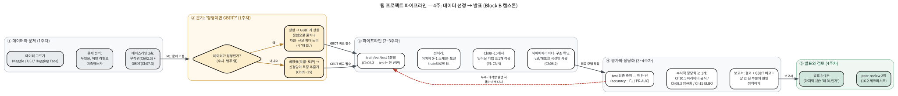
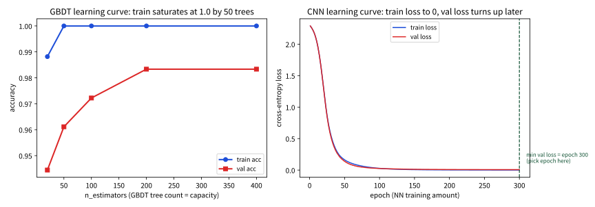

# 16.1 팀 프로젝트: 구조와 발표

### 왜 Block B의 시작에 또 프로젝트를 하는가

Chapter 8.1(Block A 캡스톤)에서 이미 한 번 프로젝트를 했으니, "왜 또
하는가"가 먼저 나올 질문이다. 답은 이 두 프로젝트가 **검증하는 대상이
달라서**다. Chapter 8의 프로젝트가 검증한 것은 "Chapter 2~7의 도구가
실제 데이터 앞에서도 작동하는가" — 즉 **정형 데이터를 다루는 고전 ML의
완결**이었다. 이번 프로젝트(Chapter 9~15의 도구)가 검증해야 하는 것은
또 다른 문장이다: **"신경망과 그 이후의 도구가, 이 데이터에 정말 필요한
것인가"**. 이 두 문장은 모양은 같지만 무게가 다르다. 전자는 "도구가
맞는가"를, 후자는 "**도구가 필요한가**"를 묻기 때문이다 — 후자는
"아예 안 쓰는 것(GBDT[^friedman], Chapter 7)과 비교해서" 물어야 성립한다.

이 차이는 실전에서도 그대로 나타난다. 산업 현장의 많은 팀은 이미지나
텍스트 데이터를 처음 만났을 때 "신경망을 돌려보자"가 아니라
"**이 문제를 정형 문제로 치환해서 GBDT로 해결할 수 있는가**"부터
묻는다. Chapter 7.3에서 보듯, 정형 데이터에서는 지금도 GBDT 계열이
신경망과 비등하거나 이기는 경우가 흔하기 때문이다. 그러니 이번
프로젝트를 "딥러닝을 써야 한다"는 대명제로 시작하는 팀은 이미
채점 기준에서 감점된 상태다 — **딥러닝이 필요한 이유를 스스로
증명하는 쪽**이어야 한다. 이 절은 그 증명의 구조(일정·구조·채점)를
정한다.

### 전체 그림: 4주 파이프라인

진행 순서를 한 장으로 그리면 Chapter 8.1과 같은 4박스 흐름인데, **박스에
써진 장이 Ch09~15로 바뀐 것**이 차이다. 왼쪽에서 오른쪽으로
**데이터 → 파이프라인 → 평가 → 발표**로 흐르고, 각 박스가 Block B의
어느 장에서 배운 원칙을 집행하는지 함께 적어두었다. 붉은 점선(평가 →
파이프라인)이 핵심이다 — test에서 **누수(Ch06.3)를 발견했거나,
train/val 곡선이 과적합의 모양이면(Ch09.3, 10.2) 돌아가서** 다시 해야
한다는 뜻이다.

Block A와 한 가지 구조적 차이가 있다. 8.1의 파이프라인에서는
"모델 고르기"가 Box②의 한 박스였지만, 16.1에서는 **"이 문제를 정형
(→Ch07 GBDT)으로 풀 것인가, 비정형(→Ch09~15 신경망)으로 풀 것인가"
라는 분기가 Box①과 Box② 사이에 들어온다** — 이 분기의 결과가
뒤의 모든 선택을 결정하므로, M1(문제 정의)에서 이미 정해야 한다.
프로젝트에서 "한 번 지나가면 돌아올 수 없는" 것은 test 한 번의 측정
뿐이고, 그 외 모든 단계는 되돌아갈 수 있다.

### 일정과 마일스톤

4주(각 주 = 수업 3회)는 아래처럼 나뉜다. **마일스톤 M1~M4가 제출물**이고,
M1·M2는 팀 전체가 모여 함께 결정하는 것(데이터·문제·모델 후보를
개인별로 골라온 뒤 회의에서 확정)이다.

| 주 | 해야 할 일 | 마일스톤(제출) |
|---|---|---|
| 1 | 데이터 후보 2~3개 조사(크기·라벨·결측치), **정형/비정형 판정(§"왜 딥러닝")**, 팀 회의, **문제 정의 문서**: 행이 무엇인지, 라벨이 무엇인지, 주 지표는 무엇인지, 베이스라인(무작위·GBDT)은 무엇인지, **"왜 딥러닝인가" 초안** | **M1** 문제 정의 + 데이터 선택 + "왜 DL" 1페이지 |
| 2 | 3분할(Ch06.3)로 코드 스캐폴드, 전처리(train으로만 fit), **1개 신경망 엔드투엔드 동작 확인**(최소 CNN 또는 Transformer[^transformer] 1블록; Ch11~12의 어텐션/트랜스포머를 더 깊이 보려면 Stanford CS224N[^cs224n]), **GBDT 베이스라인 측정** | **M2** 중간코드 리뷰(코드 + GBDT·신경망 베이스라인 숫자 각 1줄) |
| 3 | 나머지 기법 적용/조합, val/교차검증(Ch06.2)으로 하이퍼파라미터·구조 튜닝, **test 최종 측정(한 번만)**, 학습 곡선(에포크 vs train/val) 도출 | **M3** 학습 곡선 1장 + 최종 test 숫자 + GBDT 비교 숫자 |
| 4 | 수식적 정당화 작성, 보고서·발표 슬라이드 완성, **발표(5~7분, 마지막에 "왜 DL" 답변)**, **peer-review 2팀** | **M4** 보고서 + 발표 + 리뷰 2건 |

"왜 마일스톤이 이 모양인가"는 Chapter 8.1의 논리와 같다 — M2에서
**베이스라인 숫자 한 줄**을 제출하게 하는 이유는, 이 숫자를
보고해야 "신경망을 만들었다"고 말할 수 있는지 판정할 수 있기
때문이다(§"두 층의 베이스라인"). M3에서 **학습 곡선 한 장**을
요구하는 이유는, "최종 성능 숫자"만 제출하면 에포크 수를 어떻게 정했는지
검증할 수 없기 때문이다 — 곡선이 있으면 val 곡선이 실제로 하이퍼파라미터
선택에 쓰였는지가 그림에서 바로 드러난다. 단, Block B의 곡선은
**에포크(또는 배치)를 x축**으로 한다 — 8.1이 `n_estimators`를 x축으로
했던 것과 다르다. 이유는 아래 §"학습 곡선"에서 설명한다.

### 프로젝트 구조

- **데이터**: Kaggle, UCI[^ucirepo] 외에 Hugging Face Datasets(huggingface.co/datasets)도
  후보에 추가한다 — Chapter 11~13에서 배운 시퀀스/LLM 관련 프로젝트라면
  텍스트 데이터를 몇 줄로 불러올 수 있어 특히 편리하다.
- **적용**: Chapter 9~15 중 최소 하나의 딥러닝 기법(CNN, RNN/Transformer,
  프롬프팅 응용, 또는 EM/VAE[^vae] 계열 생성모델)을 실제 데이터에 적용한다.
- **필수 요구사항 — 수식적 정당화 최소 1개**: 예를 들어 (1) CNN
  구조를 골랐다면 Chapter 10.1의 파라미터 수/연산량 공식으로 설계를
  정당화, (2) 정규화 기법(dropout 등)을 썼다면 Chapter 9.3에서 그
  효과를 설명, (3) 생성모델 프로젝트라면 Chapter 15의 ELBO나 min-max
  목적함수[^gan] 중 하나를 실제 구현에 연결.

- **GBDT 비교(필수)**: 같은 데이터에 Chapter 7.3의 GBDT(또는
  랜덤포레스트)를 **베이스라인으로** 돌려, 신경망이 이보다 나은지
  확인한다. 이 숫자가 §"발표"의 "왜 딥러닝인가" 질문에 대한 근거의
  출발점이다.
- Chapter 8의 프로젝트와 마찬가지로 train/validation/test 분리(Chapter
  6.3)를 지킨다.

**데이터 고르기 실전 가이드**: Chapter 8.1의 5개 기준(행의 물리적
단위, 레이아웃의 함정, 시계열, 클래스 비율, 크기)은 그대로 적용된다.
그 위에 Block B에서만 추가되는 기준이 하나 있다 — **(6) 이 데이터의
"원시 특징"이 이미 정형으로 추출되어 있는가.** 이 기준이 정형/비정형
판정(§"왜 딥러닝")의 실전판이다. (1) 이미 수치·범주 열로만 구성된
표(UCI 대부분)라면 정형 — GBDT와 비교해야 한다. (2) 원소가
**픽셀·음파·토큰**인 원시 배열(이미지 32×32×3, 오디오 웨이브폼,
문장)이라면 비정형 — 여기에 "손으로" 특징을 만들기는 어려우므로
신경망이 특징 추출기 역할을 하는 것이다. (3) 애매한 경우(예: 이미
워드임베딩[^word2vec]으로 벡터화된 텍스트)라면, "원시 토큰으로 직접
모델링한다"는 선택을 해 Ch13 도구의 필요성을 스스로 만드는 것도
합법이다 — 단, 그 선택의 이유를 M1에 적어야 한다.

같은 기준으로 실제 후보 데이터셋을 미리 살펴보면, "이 데이터는
정형인가, 비정형인가, 그리고 함정은 무엇인가"가 한 줄로 정리된다:

| 데이터셋 | 크기 | 정형/비정형 | 문제 정의 | 주의할 함정 |
|---|---|---|---|---|
| **sklearn digits**[^scikitlearn] (실습용) | 1,797×64 (8×8 회색) | 정형(이미지지만 이미 64-dim 벡터로 flattening됨) | 숫자 이미지 → 0~9 분류 | 데이터가 작아(64차원) 신경망이 GBDT를 **이기지 못하는 것이 정상** — 이 점이 바로 §"왜 DL"의 교육 포인트 |
| **CIFAR-10**[^cifar10] (HF) | 60,000×32×32×3 | 비정형(원시 픽셀) | 10개 물체 이미지 분류 | 레이블 불균형 없음 — 정확도 OK. 데이터 증강(회전·뒤집기, Ch10) 없이는 train/val 격차 큼 |
| **CIFAR-100** (HF) | 60,000×32×32×3 | 비정형 | 100개 물체 분류 | 클래스 100개 — macro-F1 또는 top-1 정확도 + 베이스라인(무작위 1%) 명시 |
| **IMDb Movie Reviews**[^imdb] (HF) | 50,000 문장 | 비정형(텍스트) | 긍정/부정 감지 | 문장 길이 불균형 — Ch11의 패딩/마스킹. BERT 토크나이저 vs 단순 토큰화 비교 가능 |
| **Kaggle Toxic Comments** | 159,576×6(라벨) | 비정형(텍스트) | 6개 독성 라벨 다중 라벨 분류 | **다중 라벨**(한 문장이 여러 독성) — 시그모이드 출력 + 각 라벨별 F1. 클래스 불균형 라벨 있음 → 라벨별 PR-AUC |
| **EMNIST**[^emnist] (HF) | 112,800×28×28 | 비정형(원시 픽셀) | 글자 분류(10개 숫자 + 26개 알파벳 대소문자) | 클래스 62개 — digits보다 어려우며, CNN이 "8×8로 flatten한 GBDT"보다 확실히 앞서는 규모(28×28=784-dim) |

"기본 코스"를 정한다면 **sklearn digits → EMNIST**의 2단계가 좋다.
digits에서 "정형(64-dim)으로는 GBDT와 대등하거나 못 이긴다"를
**스스로 눈으로 확인**한 뒤, 같은 이미지 문제를 28×28(784-dim)으로
확대하면 CNN의 우위가 드러나는 모습을 비교하는 것 — 이 2단 구조가
§"왜 딥러닝인가" 질문에 **숫자로** 답하는 가장 깔끔한 경로다. (단,
시간이 부족하면 EMNIST만 하고, digits의 GBDT 대등성은 이 절의
실습 노트북 §"GBDT vs CNN"에서 이미 확인한 것을 인용하면 된다.)

### 두 층의 베이스라인: "무작위"와 "GBDT"

Chapter 8.1에서 배운 **다수 클래스 베이스라인**(train에서 가장 많이
나온 클래스를 전부 예측)은 이번에도 제로점이다. 다만 Block B에서는
그 위에 **두 번째 층 — GBDT 베이스라인**을 의무로 올린다. 이 두 층이
"모델을 만들었다"는 주장을 단계별로 검증한다:

1. **1층: 무작위(또는 다수 클래스)** — 모델이 *아무것도* 배운
   상태의 하한. 10클래스 균형 데이터라면 무작위 정확도는 10%다.
2. **2층: GBDT(Ch07.3)** — *정형 도구의* 상한에 가까운 기준.
   "신경망이 정형 도구보다 나은가"를 묻는 기준선이다.
3. **본인 모델(신경망)** — 위 두 층을 **둘 다** 넘어야 "이 데이터에
   딥러닝이 필요했다"고 말할 수 있다.

이 3층 구조가 왜 중요한지는 실습 노트북의 숫자가 보여준다.
sklearn digits(1,797개, 8×8=64차원)를 8:1:1로 stratify 분할
(train 1,437 / val 180 / test 180)하면:

- 다수 클래스(숫자 '1', train에서 146개) 베이스라인의 val 정확도
  **0.100**, test 정확도 **0.100** — 10클래스 균형 데이터의
  우연(Chapter 2.3의 베이스레이트).
- **GBDT(200트리, 학습률 0.1)**: val 정확도 **0.983**, test
  정확도 **0.944**, test macro-F1 **0.944**.
- **작은 CNN**(아래 §"손으로 한 번"의 구조, 35,914 파라미터):
  test 정확도 **0.939** — GBDT(0.944)에 **비등~소폭 열세.**

**여기서 핵심**: digits 같은 작은 정형 데이터에서는 **신경망이
GBDT를 (소폭) 이기지 못하는 것이 *예상되는* 결과**다. Grinsztajn,
Oyallon, Varoquaux의 2022년 분석("Why do tree-based models still
outperform deep learning on typical tabular data?")이 실증한
결론이 바로 이것 — **저차원의 정형 데이터에서는 GBDT가 신경망을
이기고, 신경망의 우위는 (a) 차원이 높은 데이터(텍스트를 원시
토큰으로 보면 10⁴~10⁵차원), (b) 데이터가 아주 큰 경우, (c)
특징이 *공유되는* 국소 구조(이미지)일 때** 나타난다[^grinsztajn]. digits는
64차원(저차원)이므로 GBDT가 앞서는 쪽이 *예상*이다 — 그리고
실습 노트북의 실험은 정확히 그렇게 나온다(64차원에서 GBDT
0.944 ≻ CNN 0.939, 격차 0.006).

이 "예상대로 졌다"를 **한 단계 더** 밀어본 것이 이번 절의 핵심
실험이다. *같은* digits 이미지를 8×8에서 **28×28으로 확대**
(784차원)해서 다시 비교하면, 64차원에서는 GBDT가 0.006 앞섰던
것과 **반대로** 784차원에서는 CNN(0.961)이 GBDT(0.944)를
**0.017로 역전**시킨다. *변수를 하나만(차원) 바꿨는데* 격차가
**닫히고 심지어 뒤집히는** 것 — 이 0.006 → −0.017이 바로
축 2(규모)의 *증거*다. 8×8에서는 "이미지"라고 해도 64개
수치로 flattening되어 **정형**이고, 28×28(784개 픽셀)에서는
"국소 구조를 공유하는 원시 픽셀"에 가까워지는 순간 CNN의
공유·평행불변 편향이 일을 시작하는 것이다. 이 실험까지
스스로 세운 팀의 "왜 DL" 답변은 이렇다:

**"64차원 정형에서는 GBDT 0.944가 상한이고 내 CNN(0.939)은 이를
어깨너머로 확인했으며, 같은 데이터를 784차원으로 확대하자 CNN이
오히려 0.961로 GBDT를 역전시켰다 — 즉, *내 문제가* 차원·규모가
크다면(EMNIST, CIFAR) CNN의 우위는 이 추세의 연장선이라는 것을
숫자로 보여준다."** 이 논리가 "왜 DL" 질문에 대한 **정직한**
답이다 — "신경망이 좋다"가 아니라 **"언제(어떤 차원·구조에서)
신경망이 좋은지"를 한 차원 변화로 실증**한 것이다.

### "왜 고전 ML이 아니라 딥러닝인가" — 이 프로젝트의 핵심 질문

이 절의 제목이 "구조와 발표"지만, 실제 채점이 가장 강하게 보는 것은
이 한 문장이다. 아래는 이 질문에 **구조적으로** 답하는 방법 —
"감"이 아니라 **두 개의 축과 두 개의 숫자**로 답한다.

**(축 1) 데이터의 구조: 정형인가, 원시(비정형)인가.** §"데이터
고르기"의 기준 (6)다. 정형(수치/범주 열)이면 기본 전제는 "GBDT와
비교하라"이고, 비정형(픽셀/음파/토큰)이면 "신경망이 특징 추출기"
라는 주장이 성립할 *가능*이 생긴다.

**(축 2) 데이터의 규모: 특징이 *공유*되는가, 크기만큼 비용이
오르는가.** 이 축은 "왜 CNN"을 수학적으로 설명한다 — Chapter 10.1의
파라미터 수 공식이다. 아래 §"손으로 한 번"에서 같은 이미지 크기에
"flatten해서 FC"와 "3×3 conv"의 파라미터 수를 나란히 놓으면,
**해상도 S가 커질수록 FC는 \\(S^2\\)배로, conv는 *상수*로
남는** 것을 직접 계산한다. 이 차이가 "이미지가 커질수록 CNN이
필요해진다"의 *수학*이다.

**(숫자 1) GBDT 베이스라인** — "신경망이 정형 상한을 넘는가".
**(숫자 2) 학습 곡선에서 train/val의 격차** — 신경망이
**데이터가 커질수록 val 곡선이 계속 상승**한다면(GBDT는 일찍
포화), "이 문제는 규모가 커지면 딥러닝에 유리하다"는 **전망**까지
제시할 수 있다.

이 네 가지(축 2개 + 숫자 2개)를 보고서와 발표에 담으면, "왜
딥러닝인가"는 막연한 의문이 아니라 **반박 가능한 주장**이 된다 —
16.2에서 peer-review가 이 주장을 *심사*하는 기준이기도 하다.

**역사적 일화로 이 축을 붙잡자.** 2011년까지 이미지 분류의 최선은
"사람이 손으로 만든 특징(HOG, SIFT) + 선형 분류자/GBDT"였는데,
2012년 AlexNet[^alexnet]
(ImageNet[^imagenet], 128만 이미지)가 오차율을 기존보다 **절대 10%p 가까이
줄여** ImageNet 경쟁을 사실상 끝냈다. 이 전회의 본질은 "신경망이
마법"이 아니라, **① 데이터(ImageNet)가 갑자기 충분히 커지고 ②
GPU가 학습을 가능하게 한** 순간이었다[^imagenet] — 축 2(규모)가 축 1(비정형)을
결정지운 대표 사례다. 반대로, "정형 표 데이터"에서는 2020년대에도
GBDT가 최선에 가까운 것이 Grinsztajn et al. 2022의 결과다. 두 사례를
나란히 두면, "왜 DL"의 답이 **데이터의 구조와 규모**에서 나와야
하는 이유가 직관적으로 보인다.

### 손으로 한 번: CNN의 파라미터 수로 "왜 CNN"을 계산하기

수식적 정당화(필수 요구사항 1번)의 가장 빠른 예시를, Chapter 10.1의
공식으로 손으로 해보자. 실습 노트북의 구조

\\[
1\times8\times8 \\;\xrightarrow{\text{Conv2d}(1,32,3,\ \text{padding}=1,\ \text{stride}=2)}\\;
32\times4\times4 \\;\xrightarrow{\text{MaxPool2d}(2)}\\; 32\times2\times2
\\;\xrightarrow{\text{Flatten}}\\; 128 \\;\xrightarrow{\text{FC}}\\; 256
\\;\xrightarrow{\text{ReLU}}\\; 256 \\;\xrightarrow{\text{FC}}\\; 10
\\]

에 대해 각 층의 파라미터 수(Chapter 10.1: conv는
\\(\text{in\\_ch}\times k\times k\times\text{out\\_ch}+\text{out\\_ch}\\),
FC는 \\(\text{in}\times\text{out}+\text{out}\\))를 계산한다:

| 층 | 공식 | 파라미터 수 |
|---|---|---|
| Conv2d(1→32, 3×3) | \\(1\times3\times3\times32 + 32\\) | **320** |
| MaxPool2d(2) | (파라미터 없음) | 0 |
| FC 128→256 | \\(128\times256 + 256\\) | **33,024** |
| FC 256→10 | \\(256\times10 + 10\\) | **2,570** |
| **합계** | | **35,914** |

이 합계를 PyTorch[^pytorch]로 `sum(p.numel() for p in model.parameters())`를
돌려 **정확히 일치(35,914**)하는지 확인하는 것 — "10.1의 공식으로
설계를 정당화"라는 요구사항의 뼈대가 라이브러리 없이도 성립하는
것이다.

그런데 이 숫자의 *의미*는 비교해야 보인다. 같은 8×8 입력을
**flatten(64-dim)해서** `64→64→10`의 단순 MLP를 만들면 파라미터는
**4,810**개뿐이다 — conv 층(320)보다 **작다.** 즉, 작은 데이터에서는
"신경망을 깊게/넓게 하는 것" 자체가 비용을 더 씀이 아니라,
**입력 차원(flatten)이 작으면** 오히려 GBDT(특수한 파라미터가 아예
없음)가 효율적이다. 여기서 "왜 CNN"의 진짜 이유가 드러난다 —
CNN이 유리한 것은 *작을 때*가 아니라 **해상도 S가 커질 때**다:

| 해상도 \\(S\\) | "flatten → 256" FC 파라미터 (\\(S^2\times256\\)) | 3×3 conv(1→32) 파라미터 | 비율 |
|---|---|---|---|
| 8 | 16,384 | 320 | 51× |
| 32 | 262,144 | 320 | 819× |
| 64 | 1,048,576 | 320 | 3,277× |
| 224 | 12,845,056 | 320 | 40,141× |

**flatten은 해상도 제곱(\\(S^2\\))으로** 파라미터가 폭증하지만,
**conv는 해상도와 무관하게 320으로 일정**하다 — 이 *상수 vs
제곱*의 차이가 "이미지가 커질수록 CNN(파라미터 공유,
평행불변)이 필수"를 수학적으로 말하는 것이다. 이 표 한 장이
"왜 CNN을 골랐는가"에 대한 **수식적 정당화**로 그대로 쓰인다 —
발표 슬라이드에 그대로 올리면 되는 형태다.

### 발표

형식은 Chapter 8.1과 동일하다(문제 정의 → 방법론 → 결과와 정당화 → 한계
분석, 팀당 5~7분). 다만 이번엔 발표 마지막에 "왜 고전 ML이 아니라
딥러닝을 선택했는가"라는 질문에 반드시 답해야 한다 — 데이터가
이미지/텍스트처럼 비정형이라 신경망이 필요했는지, 아니면 정형
데이터인데도 신경망을 썼다면 그 이유가 무엇인지(Chapter 7의 GBDT와
비교했을 때) 명확히 설명할 수 있어야 한다. Chapter 8의 프로젝트가
"어떤 고전 ML 모델이 이 데이터에 맞는가"를 물었다면, 이번 프로젝트는
한 단계 더 나아가 "애초에 딥러닝이 필요한 문제인가"부터 스스로
판단해야 한다.

발표의 **마지막 1분을 "왜 DL" 질문에 전념**하도록 시간 배분을
고정한다: 문제 정의(1분) → 데이터와 정형/비정형 판정(1분) →
적용한 딥러닝 기법과 구조(2분) → 결과와 GBDT 비교·수식적
정당화(2분) → **"왜 DL인가"(1분)** — 이 1분은 §"왜 고전 ML이
아니라"의 2축+2숫자로 채워야 하며, "정형인데도 신경망"이라면
GBDT와의 숫자 비교를 **반드시** 포함한다. 8.1처럼 "잘 안 된
부분"을 정직하게 말하는 습관도 유지한다 — 학습이 안 된
부분을 Chapter 9(역전파/그래디언트)·9.3(정규화)·10.2(과적합)의
개념으로 진단하는 것이 "방법론을 실제로 이해했는가"의 증거다.

### 학습 곡선: Block B에서 x축이 "에포크"인 이유

8.1의 학습 곡선은 `n_estimators`(트리 개수)를 x축으로 했다 —
GBDT는 "모델을 *크게* 만드는" 파라미터가 트리 수이므로,
x축이 곧 **용량(capacity**)였다. Block B의 신경망에서는
**x축이 에포크(데이터를 반복해서 보는 횟수**)로 바뀐다. 이유는
신경망의 "용량"은 구조(층 수·너비)로 고정하고, **학습량(에포크)을
바꾸어** train/val 곡선을 그리는 것이 표준이기 때문이다 —
구조를 바꾸면 모델 자체가 달라지므로(GBDT의 트리 수만큼 "같은
모델의 크기"가 아님) 에포크를 x축으로 한다.

아래가 실습 노트북에서 그렸을 때의 모습이다 — 왼쪽이 GBDT의
`n_estimators` 곡선(train이 50트리에서 1.0으로 포화), 오른쪽이
CNN의 에포크 곡선(train 손실이 0으로 가는데 val 손실은 꺾임
포인트 이후로 상승 — 그 꺾임이 에포크를 정하는 근거).

GBDT(200트리 기준)의 곡선을 실습에서 보면: `n_estimators` 20에서
train 정확도 0.988·val 0.944, 50에서 **train 1.000·val 0.961**,
200에서 **train 1.000·val 0.983** — **train은 50트리에서 이미
1.0으로 포화**되고 val은 그 사이에서만 느리게 오른다. "train
곡선은 배운 것을 재고, val 곡선만 재는 것을 한다"는 6.3절의
원칙이 그대로 적용된다. 신경망도 마찬가지다 — **에포크를 늘리면
train 손실은 0으로 가지만 val 손실은 어느 에포크 이후에
오른다**(과적합, Ch09.3). 이 val 곡선의 *곡률(언제 꺾이는가)*이
에포크 수·학습률·정규화 강도를 정하는 근거가 되며, M3에서 요구하는
"학습 곡선 1장"이 바로 이 val 꺾임 포인트를 보여야 한다.

### 보고서 구조 (M4)

Chapter 8.1의 6절 구조를 그대로 쓰되, **2절과 5절이 Block B용으로
바뀐다**.

1. **문제 정의** (0.5p): 행의 물리적 단위, 라벨, 주 지표, **두 층의
   베이스라인(무작위·GBDT)**. **정형/비정형 판정 + 그 근거**(§"왜
   DL"의 축 1).
2. **데이터와 전처리** (1p): 원본 통계, **train으로만 fit한
   전처리** 명시(이미지는 0~1 스케일, 텍스트는 토크나이저/패딩),
   분할 비율 + stratify/패딩 여부.
3. **모델 선택과 이유** (1~2p): **적용한 딥러닝 기법 ≥1개**와
   **그 구조(층·크기**)를 Chapter 10.1 공식으로 정당화(§"손으로
   한 번"), 그리고 **왜 GBDT가 아니라** 이 기법인가(축 2).
4. **결과** (1p): 최종 test 숫자(한 번), **에포크 학습 곡선 1장**,
   **GBDT·무작위와의 비교 표**.
5. **수식적 정당화** (1p): 필수 1개(10.1 파라미터 공식 / 9.3
   정규화 / 15 ELBO) — §"손으로 한 번"의 표를 그대로 쓴다.
6. **잘 안 된 부분과 원인 진단** (0.5p): **필수**. "학습이
   안 된/과적합된 부분을 Ch09·09.3·10.2의 개념으로 진단" —
   8.1의 "모두 잘 됐다" 경고가 그대로 적용된다.

### 채점 기준 (rubric)

| 항목 | 비중 | 좋은 답 |
|---|---|---|
| 문제 정의와 데이터 | 15% | 행·라벨·지표·**두 층 베이스라인**이 명확하고, **정형/비정형 판정**이 데이터 특성에 근거함 |
| 방법론 적절성 | 25% | **GBDT와 비교해서** "왜 이 딥러닝 기법"의 근거가 Ch07·Ch10의 개념(차원·구조·공유)으로 설명됨 |
| 검증의 정직성 | 25% | 3분할·train-fit·test 한 번·베이스라인·**에포크 학습 곡선**·val 튜닝이 보고서에서 추적 가능 |
| 수식적 정당화 | 20% | Ch09~15의 공식(10.1 파라미터, 9.3 정규화, 15 ELBO 중 ≥1개)으로 "왜"를 설명했고, 관측(숫자)과 일치 |
| 결과의 정직성과 반성 | 15% | GBDT보다 못 한 부분·학습이 안 된 부분을 숨기지 않고 Ch09~15의 개념으로 진단 |

"방법론 적절성"이 8.1의 "이 데이터에 맞는 *고전 ML 모델*"에서
**"이 데이터에 딥러닝이 필요한가, 그리고 그 중 왜 *이* 기법인가**"로
확장된 것이 차이다 — 이 항목이 25%를 차지하는 이유는, 이번
프로젝트의 성공이 "신경망을 돌렸는가"가 아니라 **"신경망이
*필요했는지*를 GBDT와 비교해 판정했는가**"이기 때문이다. 성능이
GBDT보다 0.5%p 낮아도, "64차원 정형이므로 GBDT가 상한이고,
그래서 나는 EMNIST(784차원)로 확대해 검증했다"는 논리까지 세우면
"방법론 적절성"과 "반성"에서 높은 점수를 받는다.

### 자주 하는 실수

프로젝트에서 반복해서 보이는 실수 — 각각이 Chapter 9~15의 어떤
원칙을 깨는지 짚어두면, 16.2에서 다른 팀을 리뷰할 때
"반박 가능한 질문"으로 바꿀 수 있다.

- **GBDT 베이스라인 없이 "신경망 정확도 0.95" 발표**: §"두 층의
  베이스라인"의 2층이 빠진 것. "정형이면 GBDT와 비교" 원칙(Ch07.3)
  위반. 리뷰 질문 예: "같은 데이터에 GBDT를 돌리면 몇 %인가요?
  신경망의 0.95가 GBDT보다 *상대*로 얼마나 좋은지 알려주세요."
- **"신경망이 최신이라서"라는 이유**: §"왜 DL"의 2축+2숫자가
  전부 빠져 있다. "최신"은 근거가 아니다 — 2022년 Grinsztajn et al.
  결과가 보여주듯 정형에서는 GBDT가 여전히 경쟁적이다.
- **에포크를 test로 정하기**: "test 정확도가 더 높아지는 에포크까지
  돌렸다" — 6.3절의 test-한-번 원칙 위반. 에포크·학습률·구조는
  **val 곡선만**으로 정한다(§"학습 곡선").
- **flatten해서 GBDT와 비교하는 것 자체를 "신경망이 졌다"로
  결론**: digits(64-dim)에서 GBDT와 비등한 것은 *예상된* 결과다
  (§"두 층의 베이스라인"). "64차원 정형"과 "28×28 원시 픽셀"을
  구분하지 않고 "신경망이 형편없다"거나 "GBDT가 더 좋다"로
  단순 결론내는 것 — 차원/구조의 효과를 분리해서 논해야 한다.
- **데이터 증강 없이 "val 과적합"만 보고 dropout[^dropout]만 올리기**:
  Ch10.2의 과적합이 *데이터가 부족해서*인지, *모델이 너무 커서*인지
  먼저 구분해야 한다 — 증강(데이터 쪽)과 dropout/L2(모델 쪽)은
  다른 처방이다(Ch09.3).

### 실습: "왜 DL"의 숫자를 코드로 검증해보기

[실습 노트북](https://colab.research.google.com/github/SuminHan/book-ml/blob/main/notebooks/ml1/chapter16_1_dl_baseline.ipynb)
(제목 바로 위의 Colab 배지)에서 이 절의 핵심 주장 —
"정형·저차원에서는 GBDT가 상한이고, CNN의 우위는 구조(공유)와
규모에서 온다" — 를 sklearn digits만으로(외부 데이터 다운로드
없이, CPU에서도 충분히) 한 흐름에 걸쳐 검증한다:

1. **문제 정의** — digits(1,797×64), 0~9 분류, 주 지표 정확도.
2. **3분할** (train 1,437 / val 180 / test 180, stratify).
3. **두 층 베이스라인** — 다수 클래스(숫자 '1') val/test 정확도
   0.100.
4. **GBDT 베이스라인** — GBDT(200트리) val 0.983 / test 0.944 /
   macro-F1 0.944.
5. **CNN 파라미터 공식** — §"손으로 한 번"의 표를 코드로 재계산,
   torch와 **정확히 일치(35,914)** 확인.
6. **GBDT vs CNN (64차원)** — torch로 §"손으로 한 번"의 작은 CNN
   학습 → test **0.939**. GBDT(0.944)에 소폭 열세(격차 0.006) —
   §"두 층"의 *"예상된 결과"* 확인.
7. **8×8 → 28×28 확대 실험** — *같은* digits를 784차원으로
   확대해서 다시 GBDT(0.944) vs CNN(0.961) — 64차원의 0.006
   열세가 **0.017로 역전(신경망 우위**)되는 것이 축 2(규모)의
   증거.
8. **해상도 vs 파라미터** — flatten FC(\\(S^2\\))와 conv(상수)의
   파라미터 수 표를 코드 생성.
9. **학습 곡선** — GBDT의 `n_estimators` 곡선(train 50트리에서
   1.0 포화) + CNN의 **에포크** 곡선(train 손실 0으로, val 손실은
   그 뒤로 꺾임).
10. **선택 편향** — "에포크·구조 후보를 test로 골랐다면"의
    \\(\mathbb{E}[\max]\\) 부풀림(§8.1과 동일, Ch06.3).

이 흐름이 §"보고서 구조"의 6절로, 다시 16.2의 체크리스트
("왜 DL" 추가 항목 포함)로 매핑된다 — **같은 절차를 세 가지
언어(코드, 보고서, 리뷰)로 말할 수 있어야** 이 프로젝트가
끝난 것이다.

### 확인 문제

각 문항은 이 절의 절차와 Chapter 9~15의 개념을 동시에 확인한다.

**1.** 어떤 팀이 CIFAR-10(60,000개 32×32 이미지)으로 CNN을 만들어
test 정확도 0.82를 내고, "신경망이 GBDT보다 좋다"고 결론냈다.
§"두 층의 베이스라인"과 §"왜 DL"의 관점에서, 이 결론이 성립하려면
**먼저 확인해야 할 숫자 하나**와, 그 이유를 답하라.
> 답: **같은 flatten(32×32×3=3,072-dim) 데이터에 GBDT를 돌려 얻은
> test 정확도**다. "신경망이 *좋다*는 것은 GBDT보다 *상대*로
> 좋은지"를 보여줘야 성립하며(2층 베이스라인), flatten하면 CIFAR
> 32×32는 3,072차원(64차원의 digits보다 훨씬 고차원)이라 GBDT가
> CNN에 육박할 수도 있다 — 그 비교 없이는 "신경망이 좋다"는
> 주장이 1층(무작위)만 이긴 것에 그칠 수 있다.

**2.** Chapter 10.1의 공식으로, 입력 3×32×32에 `Conv2d(3,64,3,
padding=1)` 한 층의 파라미터 수를 계산하고, "이 공식이 flatten
FC와 달리 해상도와 무관하다"는 것을 S=32일 때 flatten(→256)의
파라미터와 비교해 보여라.
> 답: conv는 \\(3\times3\times3\times64 + 64 = 1{,}792\\)
> (해상도 32와 무관). flatten FC(3×32×32→256)는
> \\(3{,}072\times256 + 256 = 786{,}688\\) — conv의 약 439배.
> 해상도가 64가 되면 FC는 \\(12{,}288\times256\\)으로 4배가
> 되는데 conv는 그대로 1,792 — 이 *상수 vs 제곱*이 "커질수록
> CNN"의 근거다.

**3.** 신경망의 학습 곡선에서 **train 손실이 0.01, val 손실이
0.40**인 에포크까지 "test가 더 좋아질 때까지" 돌렸다고 보고했다.
Ch09.3의 과적합과 Ch06.3의 test-한-번 원칙을 들어, 이 행위가
깨진 원칙 *두 가지를* 짚고, 올바르게 에포크를 정하는 방법을
말하라.
> 답: (1) train/val 격차 0.39는 **과적합**(Ch09.3) — train 손실이
> 0으로 가는데 val이 오르는 구간이다. (2) "test가 좋아질 때까지"
> 는 **test를 튜닝에 쓰는** 선택 편향(Ch06.3) — test는 *한 번*
>만. 올바르게는 **val 손실의 최솟값(또는 plateau)이 나는 에포크**를
> 정한 뒤, 그 에포크로 **test를 딱 한 번** 측정한다.

**4.** "우리 팀은 정형 표 데이터(5,000행×12열)인데 LLM을
fine-tune했다"고 발표한다. §"왜 DL"의 2축(구조·규모)과
Grinsztajn et al. 2022의 결과를 들어, 이 선택에 **반박 가능한
질문 하나**를 Ch07의 개념을 근거로 만들어라.
> 답: 축 1(구조)이 정형이고 축 2(규모)도 작아 12열이므로,
> Grinsztajn et al. 2022에 따르면 **GBDT가 신경망에 경쟁적/우위**
>인 영역이다. 질문: "12열·5,000행 정형에서 LLM fine-tune의
> test 성능이, 같은 데이터의 GBDT(Ch07.3)와 비교해서 *절대적으로*
> 얼마나 더 좋나요? 그리고 그 차이가 '특징의 국소 공유' 같은
> *구조적* 이득이 아니라 단순히 용량 때문이라면, 이 문제는
> 정형이므로 GBDT가 상한인데 왜 LLM을 선택했나요?" — "최신이라서"
>로 답할 수 없는, Ch07(GBDT)를 근거로 둔 질문이다.

### 자주 묻는 질문

**Q. 정형 데이터에 굳이 신경망을 써도 되나요?** 된다 — 다만 Chapter
7.3에서 배웠듯, 정형 데이터에서는 지금도 GBDT 계열이 신경망보다
경쟁력 있는 경우가 흔하다. 신경망을 선택했다면 "왜 GBDT보다 신경망이
이 문제에 더 적합하다고 판단했는지"(예: 특징 사이의 복잡한 상호작용을
자동으로 학습하고 싶었다, 다른 딥러닝 모듈과 결합할 계획이 있다 등)를
발표에서 설명할 수 있어야 한다 — "그냥 딥러닝이 최신이라서"는 충분한
근거가 아니다. §"두 층의 베이스라인"에서 요구하는 GBDT 비교 숫자가
이 질문에 대한 *증거*가 되어야 한다.

**Q. Chapter 9~15 중 여러 기법을 동시에 써도 되나요?** 권장한다 —
예를 들어 CNN으로 이미지 특징을 뽑은 뒤 어텐션으로 그 특징들을
조합하는 식으로 여러 장의 도구를 함께 쓰면, "왜 이 조합을
골랐는가"라는 추가적인 설계 근거를 보여줄 기회가 된다. 다만 필수
요구사항(수식적 정당화 최소 1개)은 그중 하나의 기법에 대해서만
충족하면 된다.

**Q. GPU가 없는데 CNN을 돌릴 수 있나요?** 됩니다 — 이 프로젝트의
"기본 코스"(digits 8×8, EMNIST 28×28, CIFAR-32×32)는 Colab의
**무료 CPU/T4**로도 4주 안에 충분합니다. 실습 노트북의 작은
CNN(35,914 파라미터)은 CPU에서도 수 분이면 수렴합니다.
대규모(ResNet[^resnet], BERT[^bert] full fine-tune)가 필요하면 Hugging Face의
**pretrained** 모델을 *transfer*해 마지막 층만 학습하는 방식을 쓰면
된다 — 이 경우 수식적 정당화는 "왜 이 pretrained 구조를
선택했는가"(Ch13의 사전학습)로 바꾸면 됩니다.

**Q. "왜 DL" 질문에 GBDT가 이기면(신경망이 못 이기면) 점수가
떨어지나요?** 떨어지지 않는다 — 오히려 **정직한 결과**다.
§"두 층의 베이스라인"에서 보듯, 64차원 정형(digits)에서 GBDT와
비등한 것은 *예상*된 결과이며, 이걸 "그래서 내 문제는 차원이 더
큰(784-dim) EMNIST여야 CNN 우위를 검증할 수 있다"는 논리로
연결하면 "방법론 적절성"과 "반성"에서 **높은** 점수를 받는다.
감점이 되는 것은 GBDT를 돌려놓고도 "신경망 0.94"만 보고
"신경망이 좋다"고 *단순* 결론내는 경우다.

[^grinsztajn]: Grinsztajn, L., Oyallon, E., Varoquaux, G. (2022). "Why do tree-based models still outperform deep learning on tabular data?" arXiv:2207.08815 — 저차원 정형(타불러) 데이터에서 트리 기반 모델이 여전히 딥러닝보다 낫고, 딥러닝의 우위가 특징의 국소 구조·규모에서 온다는 실증 분석.
[^alexnet]: Krizhevsky, A., Sutskever, I., Hinton, G. E. (2012). "ImageNet Classification with Deep Convolutional Neural Networks." NeurIPS 2012. — GPU로 학습한 8층 CNN이 ImageNet ILC에서 오차율을 크게 줄이며 딥러닝의 시대를 연 논문.
[^friedman]: Friedman, J. H. (2001). "Greedy Function Approximation: A Gradient Boosting Machine." Annals of Statistics 29(5), 1189–1232. — GBDT(그래디언트 부스팅)의 원 논문으로, 이 절의 "2층: GBDT" 베이스라인이 근거 두는 고전적 결과.
[^imagenet]: Deng, J., Dong, W., Socher, R., Li, L.-J., Li, K., Fei-Fei, L. (2009). "ImageNet: A Large-Scale Hierarchical Image Database." CVPR 2009. — 1,400만 장의 이미지에 WordNet 기반 위계 라벨을 부여한 데이터셋으로, 2012년 AlexNet 전후의 딥러닝 붐을 가능하게 한 "데이터 축(축 1)"의 대표 사례.
[^dropout]: Srivastava, N., Hinton, G. E., Krizhevsky, A., et al. (2014). "Dropout: A Simple Way to Prevent Neural Networks from Overfitting." JMLR 15(2014) 1929-1958.
[^transformer]: Vaswani, A., Shazeer, N., Parmar, N., et al. (2017). "Attention Is All You Need." NeurIPS 2017, arXiv:1706.03762 — 순환 없이 self-attention만으로 시퀀스를 모델링하는 트랜스포머를 처음 제안한 논문으로, 본 책의 어텐션(Ch11~12)과 BERT/LLM 사전학습(Ch13)의 출발점이다.
[^vae]: Kingma, D. P., Welling, M. (2013). "Auto-Encoding Variational Bayes." arXiv:1312.6114 — 변분 자기인코더(VAE)의 원 논문으로, "수식적 정당화" 요구사항이 언급하는 ELBO(하한)는 이 논문에서 유도된다.
[^resnet]: He, K., Zhang, X., et al. (2015). "Deep Residual Learning for Image Recognition." CVPR 2016, arXiv:1512.03385 — shortcut 연결로 깊은 망의 수렴 문제를 풀어낸 ResNet으로, "대규모 pretrained 구조를 transfer한다"는 시나리오의 대표 사례다.
[^emnist]: Cohen, G., Afshar, S., Tapson, J., van Schaik, A. (2017). "EMNIST: an extension of MNIST to handwritten letters." arXiv:1702.05373 — MNIST의 숫자에 대소문자를 더한 62클래스 데이터셋으로, 이 절의 "기본 코스" 2단계(784차원)로 쓰인다.
[^bert]: Devlin, J., Chang, M.-W., Lee, K., Toutanova, K. (2018). "BERT: Pre-training of Deep Bidirectional Transformers for Language Understanding." arXiv:1810.04805 — 트랜스포머 기반 양방향 사전학습 모델로, "BERT 토크나이저 vs 단순 토큰화" 비교와 full fine-tune의 대상이 된다.
[^cifar10]: Krizhevsky, A., Nair, V., Hinton, G. (2009). "CIFAR-10 and CIFAR-100 datasets." Multiple Layers of Features from Tiny Images, Technical Report 306, University of Toronto. — 32×32 컬러 이미지 60,000장으로, 이 절의 "기본 코스" 3단계(CNN의 우위를 검증할 규모)로 쓰인다.
[^imdb]: Maas, A. L., Daly, R. E., Pham, P. T., Huang, D., Ng, A. Y., Potts, C. (2011). "Learning Word Vectors for Sentiment Analysis." ACL 2011, pp. 142–150. — 5만 편의 IMDb 영화 리뷰로 된 이진 감성 데이터셋으로, 이 절의 텍스트(비정형) 프로젝트 후보다.
[^cs224n]: Stanford CS224N: Natural Language Processing with Deep Learning. https://web.stanford.edu/class/cs224n/
[^gan]: Goodfellow, I. J. et al. (2014). "Generative Adversarial Networks." arXiv:1406.2661.
[^word2vec]: Mikolov, T., Chen, K., Corrado, G., Dean, J. (2013). "Efficient Estimation of Word Representations in Vector Space." arXiv:1301.3781 — CBOW·skip-gram으로 단어를 밀도 벡터(워드임베딩)로 표현하는 원 논문으로, 기준 (3)의 "이미 워드임베딩으로 벡터화된 텍스트" 사례가 이 계열의 산물이다.
[^pytorch]: Paszke, A., Gross, S., Massa, F., et al. (2019). "PyTorch: An Imperative Style, High-Performance Deep Learning Library." arXiv:1912.01703. — PyTorch 프레임워크의 원 논문(시스템 페이퍼).
[^scikitlearn]: Pedregosa, F. et al. (2012). "Scikit-learn: Machine Learning in Python." arXiv:1201.0490.
[^ucirepo]: Dua, D., Graff, C. (2019). "UCI Machine Learning Repository." Irvine, CA: University of California, Irvine, School of Computer Engineering. http://archive.ics.uci.edu
