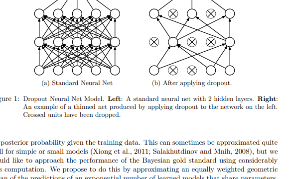
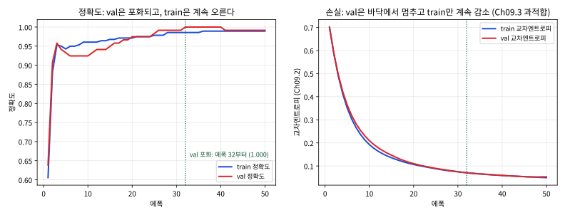

# 16.2 Peer-Review

[](https://colab.research.google.com/github/SuminHan/book-ml/blob/main/notebooks/ml1/chapter16_2_deep_review.ipynb)

### 왜 이번 주가 "역전"의 주인가

16.1에서 각 팀은 **발표팀**으로서 자신의 딥러닝 프로젝트를 5~7분 안에
설명해야 했다. 이번 블록(16.2)에서는 역할이 역전된다 — **이번에는 네가
심사위원이다**[^cs224n]. 다른 두 팀의 발표를 듣고, Chapter 8.2의 체크리스트를
적용해서 리뷰를 쓰고, 그 리뷰의 품질로 네가 채점받는다. 8.2에서 한
"Block A의 발표를 심사"하는 행위의 Block B 버전이므로, "왜 반박
가능한 질문이 좋은 리뷰인가"에 대한 논의(Popper의 반증주의, Amgen
재현 실험[^amgen2011])는 8.2절을 다시 읽으면 된다. 이번 절은 그 위의 **두 가지를
추가**한다.

첫째, 심사 대상이 달라졌다. 8.2의 발표는 로지스틱회귀, kNN, GBDT[^friedman] 같은
고전 ML 모델의 발표였는데, 이번엔 CNN, RNN/Transformer, VAE[^vae] 계열
딥러닝 모델의 발표다. 같은 발표라도 "이 모델 선택이 데이터에 맞는가"를
판단하는 데 필요한 개념이 더 많아진다 — 데이터가 비정형인지, 그
비정형성에 맞는 아키텍처를 골랐는지, 그리고 "정형 데이터인데 왜
신경망인가"라는 16.1의 필수 질문에 근거 있는 답을 했는지.

둘째, 8.2에서 다룬 "정확도의 함정"이 Block B에서는 새로운 얼굴로
돌아온다. 신경망은 고전 ML보다 **더 많고 더 복잡한 하이퍼파라미터**를
가지고(Chapter 9.3의 학습률 스케줄, 드롭아웃률, 배치크기), 학습 자체가
**에폭이라는 시간 차원**을 가진다. 그러므로 같은 "반박 가능한 질문"도
Block B에서는 "에폭 300을 골랐는데, 학습 곡선에서 val 곡선은 언제
꺾였나"(Chapter 8.1의 M3 마일스톤 — val 곡선으로 에폭 수를 정하는
원리) 같은 새로운 형태로
쏟아진다. 이번 절의 대부분은 이 "블록 B 전용" 부분이다.

### 이번 주는 어떻게 진행되는가

16.1의 발표와 이어지는 일정은 8.2와 동일한 구조다.

| 순서 | 내용 | 시간 |
|---|---|---|
| 1 | 다른 두 팀의 발표 청취(각 5~7분, 16.1의 발표 형식 — 마지막에 "왜 딥러닝인가" 질문 포함) | 50분 중 약 30분 |
| 2 | 체크리스트 기반 **작성 리뷰** 두 통 — 팀당 5개 항목 + 반박 가능한 질문 1개 이상 | 발표 직후 |
| 3 | 질의·토론: 리뷰어가 작성한 질문을 발표팀이 그 자리에서 답변, **교수가 양쪽의 리뷰 품질을 함께 채점** | 나머지 시간 |

8.2와 같은 4개 항목에 **5번째 항목("왜 딥러닝인가" 답변의 타당성)**이
추가된 것이 이번 주 체크리스트의 차이이며, 3번의 토론에서 발표팀이
"좋은 지적입니다"로 넘긴 질문은 그 리뷰가 2점에 머물렀다는 증거로
채점된다(8.2의 FAQ "좋은 지적이로 끝나면" 항목과 동일한 논리).

### 체크리스트

다른 두 팀의 발표를 다음 체크리스트로 평가한다:

| 항목 | 확인할 것 |
|---|---|
| 문제 정의 | 무엇을 예측/분류하려 했는지 명확한가 |
| 방법론 적절성 | 데이터 특성(비정형, 불균형, 시퀀스 등)에 맞는 아키텍처를 골랐는가 |
| 수식적 정당화 | 16.1의 요구사항(최소 1개)을 충족했고, 그 설명이 실제로 타당한가 |
| 결과의 정직성 | 잘 안 된 부분을 숨기지 않고 원인을 분석했는가 |
| "왜 딥러닝인가" | 16.1의 필수 질문에 구체적 근거로 답했는가 |

**"왜 딥러닝인가" 항목을 어떻게 채점하는가.** 이 질문을 *형식적으로만*
채우는 리뷰와 *내용적으로* 채우는 리뷰의 차이는, 8.2의 "1점 vs 3점"
구별과 정확히 같은 구조다.

- **형식(2점)**: "왜 고전 ML이 아니라 딥러닝을 선택했는가"에 대한
  답변이 있었는지 확인만 — "팀이 '데이터가 이미지라서'라고 답했다"로
  끝나는 리뷰.
- **내용(3점)**: 그 답변이 **이 학기의 개념으로 반박 가능한
  근거**인가까지 따지는데 — "이미지 데이터에 CNN을 썼는데, CNN의
  국소 receptive field + 파라미터 공유가 이 데이터의 어떤 구조
  (Chapter 10.1)에 맞는지 설명할 수 있나요?"처럼, 발표팀이
  Chapter 10.1의 공식이나 자기 코드에 다시 들어가야만 답할 수
  있는 질문.

체크리스트는 Chapter 8.2와 동일하되(문제 정의, 방법론 적절성, 수식적
정당화, 결과의 정직성), 이번엔 "왜 고전 ML이 아니라 딥러닝을
선택했는가"에 대한 답변의 타당성도 평가 항목에 추가한다 — 발표팀이
그 질문에 구체적인 근거(데이터의 비정형성, Chapter 7 GBDT와의
비교 등)로 답했는지, 아니면 막연하게 넘어갔는지를 살펴보는 것이 좋은
리뷰의 출발점이다.

### 채점 기준: "채웠는가"가 아니라 "구체적인가"

8.2의 3단계(감상평 / 일반 지적 / 반박 가능한 질문)가 그대로 적용되며,
Block B에서 "3점의 리뷰"가 실제로 어떻게 생기는지 한 가지만 더
구체화한다. Block A에서는 3점 리뷰의 "근거가 되는 개념"이 Chapter
2~7 범위였는데, Block B에서는 **아키텍처-데이터 매칭**이 가장
높은 확률로 3점짜리 질문을 만들어내는 영역이다. 아래 결정나무가 그
"아키텍처-데이터 매칭"을 정리한 것이다.


이 그림을 읽는 방법은 8.2의 "리뷰 쓰는 과정" 그림과 동일하다 —
**체크리스트의 "방법론 적절성" 항목을 채울 때, 왼쪽에서 오른쪽으로
한 번만 따라가면 된다.** 분기점에서 "예/아니오"가 정해지지 않는
발표(예: 데이터가 "의미 있는 단위가 있는 표"인지 애매한 이미지
표 데이터)라면, 그 자체를 질문으로 바꾼다 — "행의 물리적 단위가
무엇인지, 그 단위 기준으로 3분할(Ch06.3)을 했는지"가 곧 3점
리뷰가 된다.[^gan]

### 딥러닝 발표를 리뷰할 때 보는 것: Block A와 무엇이 다른가

같은 체크리스트라도, 심사 대상이 신경망이 되면 **같은 개념이 더
날카로워진다.** Block A의 발표에서 "모델을 어떻게 고르셨나요?"라는
질문은 "kNN의 k를 5로 한 이유는?"에 머물렀지만, Block B의 발표에서는
같은 질문이 아래처럼 깊어진다.

**(1) 데이터 구조 ↔ 아키텍처의 귀납적 편향.** Chapter 10.1에서 배운
대로, CNN[^alexnet]의 국소 receptive field + 파라미터 공유는 "이미지의 인접
픽셀이 서로 상관 있다"는 *인과적* 가정을 코드 속에 심어 넣는 것이다.
이 가정이 데이터에 맞아야 CNN은 GBDT보다 유리해지고(Chapter 7.3의
"GBDT vs 신경망" 비교), 안 맞으면(예: 이미지가 아니라 "셀 하나 =
이미지 파일"인 경우) 그 가정은 아무 가치를 주지 못한다. 리뷰 질문
예: "여러분의 이미지에서 *위치*가 실제로 정보인가요 — 이미지를
무작위로 회전·이동시켰을 때 val 정확도가 얼마나 변하나요?" 이
질문은 발표팀이 **새 실험**(데이터 증강의 효과를 측정하는 run)을
해야만 답할 수 있으므로 8.2의 기준대로 3점이다.


**(2) 학습의 시간 차원 — 에폭.** 고전 ML 모델은 "fit() 한 번"으로
끝나지만, 신경망은 에폭을 돌리는 **과정**이 모델의 일부분이다.
Chapter 8.1의 M3 마일스톤("학습 곡선 1장", 하이퍼파라미터는
val 곡선으로만 정한다)이 신경망에서는 **에폭 수를 정하는 것**
까지 포함한다 — "에폭 300을 돌렸다"는 문장은 그 전제(val 곡선이
300 부근에서 포화)를 만족할 때만 성립한다. 리뷰 질문 예: "에폭
300을 골랐는데, val 곡선이 언제 정점에 도달했나요? 정점 이후에
돌린 100개 에폭이 val에서 무엇을 바꾸었나요?" — 이 질문에 답하려면
학습 곡선(16.1의 M3 마일스톤)을 다시 꺼내 봐야 한다.

**(3) 확률의 신뢰도 — 교정.**[^guo2017calibration] "정확도 95%"를 넘겨도 "모델이
0.99 확률로 예측한 건 중 99%가 정말 맞았는가"(calibration)는
별개의 질문이다. Chapter 9.2의 교차엔트로피가 낮더라도, 확률
스케일 전체가 왜곡된 모델(0.99를 말해도 실제로는 0.87)은
"위험도 기반 결정"(의료, 사기 탐지)에서 정확도 기반 결정과
완전히 다른 결정을 만든다. Block A의 모델(로지스틱회귀)은
교정이 *구조적으로* 좋아서 이 질문이 잘 나오지 않았지만,
신경망+드롭아웃에서는 드롭아웃 *ON* 상태에서 확률을 뽑으면
교정이 악화되는 것이 알려져 있어, 리뷰어가 "드롭아웃 off로
확률을 뽑았나요?"라고 묻는 것은 합리적인 3점 질문이다.[^dropout]




### 자주 하는 실수: "정확도가 높으니 좋은 모델"이라는 리뷰

Chapter 8.2에서 다룬 "구체적으로 반박 가능한 질문"의 원칙이 여기서도
그대로 적용된다. 딥러닝 프로젝트에서 특히 자주 나오는 부실한 리뷰
패턴은 "테스트 정확도가 95%나 되니 정말 잘 만들었다"처럼 숫자
하나만으로 판단하는 것이다 — 그 정확도가 Chapter 6.3의 원칙(train/val/test
분리, 데이터 누수 방지)을 지키고 나온 숫자인지, 데이터가 불균형하다면
Chapter 2.3의 PR-AUC 같은 지표까지 함께 확인했는지를 먼저 따져 묻는
것이 훨씬 건설적인 리뷰다 — "왜 검증셋과 테스트셋을 나눈 기준을
설명해주시겠어요?"처럼, 발표팀이 실제로 다시 확인해봐야 답할 수 있는
질문을 던지는 것이 좋다.

이 실수가 Block B에서 특히 위험한 이유는, **딥러닝 프로젝트에서
"좋은 정확도"가 우연일 가능성이 Block A보다 훨씬 높기** 때문이다.
Chapter 6.3의 선택 편향 계산(후보 $m$개 중 max를 고르면
$\mathbb{E}[\max]$만큼 부풀어 오름)은 $m$이 커질수록 부풀림이
커진다고 했지만, Block B의 프로젝트는
Block A보다 후보 공간이 훨씬 크다 — 모델 2~3개 × (에폭 ×
드롭아웃률 × 학습률) 10~30개 조합이면 $m$은 30~90이고,
$\sigma=0.02$로 잡으면 부풀림은 8.1의 표에서 0.045~0.052
부근이다. "test 정확도 0.95"가 실제로 0.90대 초반일 수 있다는
뜻이다 — 8.2의 "0.1%p 차이가 잡음 수준" 논리가 그대로 적용
되는데, **Block B에서는 그 잡음이 더 크고, 후보가 더 많다.**
실습 노트북(§4)은 이 잡음의 두 기원을 같이 정량화한다 —
*같은 모델*의 test 100건만 바꿔도 정확도 범위가 약 0.06
(표본 잡음), 후보 $m$개 중 최고를 고르는 $\mathbb{E}[\max]$가
약 0.04~0.05(선택 편향). 모델 간 정확도 차이가 이 두 숫자보다
작다면, 그 차이는 모델이 아니라 표본·선택에서 나온 것이다.

### 손으로 한 번: 가상의 딥러닝 발표에 체크리스트를 적용하기

8.2의 "가상 발표"와 동일한 구조로, 이번엔 Block B의 발표를 하나
놓고 체크리스트를 적용해보자.

> **발표 요약**: "우리 팀은 breast_cancer 데이터(569건 × 30 특성,
> 악성 63%:양성 37%)로 악성 여부 분류 모델을 만들었다. 30차원
> 특징을 64개 히든 뉴런의 1층 신경망에 입력하고, dropout 0.5를
> 넣어서 50에폭 학습했다. test 정확도가 0.95가 나왔다 — 로지스틱
> 회귀(0.94)와 GBDT(0.94)보다 높다. 이미지/텍스트는 아니지만,
> 신경망이 특징의 복잡한 상호작용을 자동으로 학습할 수 있어서
> 고른 것이다."

체크리스트를 하나씩 적용해보면:

- **문제 정의**: 명확하다 — 이진 분류, 행=환자, 라벨=악성/양성.
- **방법론 적절성**: **여기가 핵심**이다. breast_cancer는 *정형
  표 데이터*다 — 16.1의 "왜 딥러닝인가" 질문에 대한 발표팀의
  답변("복잡한 상호작용을 자동으로 학습")은 16.1의 FAQ에서
  명시적으로 허용한 근거 중 하나("특징 사이의 복잡한 상호작용을
  자동으로 학습하고 싶었다")다. *형식상*은 통과하나, 16.1의
  FAQ가 요구하는 **"Chapter 7의 GBDT와 비교했을 때"**라는
  조건을 발표가 *정량적으로* 충족했는가 — "GBDT 0.94 vs
  신경망 0.95"는 정확도로 0.01(1%p) 차이이고, 위 §"자주 하는
  실수"의 선택 편향 계산($m$이 크면 부풀림 $\approx 0.05$)에
  비하면 **잡음보다 작은 차이**다. "신경망이 GBDT보다 좋다"는 결론은
  이 발표만으로 성립하지 않는다.
- **수식적 정당화**: 16.1의 "수식적 정당화 최소 1개" 요구사항을
  "왜 이 신경망 구조인가"로 채웠는가 — 발표 요약을 보면
  "64개 히든 뉴런"이라는 *숫자만* 있고, Chapter 9.1의
  파라미터 수 공식($30 \times 64 + 64 + 64 \times 2 + 2 = 2114$개)
  또는 Chapter 10.1의 CNN 설계 공식으로 *왜* 64인가를 설명한
  흔적이 없다. 형식상 "신경망 구조를 정의했다"는 것이지
  "정당화"한 것은 아니다.
- **결과의 정직성**: "잘 안 된 부분"이 발표에 없다 — 8.1의
  보고서 구조 §6이 *필수*로 요구하는 절이다.
- **"왜 딥러닝인가"**: 답변은 있었으나(위 방법론 항목) 정량적
  근거(GBDT와 val에서의 비교 *표*)가 없다.

**반박 가능한 질문 예시**(3점짜리, "방법론 적절성"에 해당):
"breast_cancer는 정형 데이터인데, Chapter 7.3에서 배운 GBDT와
*같은 val 분할*에서 F1로 비교한 표를 보여줄 수 있나요? 발표의
0.95 vs 0.94 차이는 Chapter 6.3의 선택 편향(후보 $m$개 중
max를 고르는 부풀림)과 같은 크기인지 — 즉, 이 1%p 차이가
'신경망이 더 좋다'는 결론을 뒷받침할 만큼 큰 근거인지 —
정량적으로 알려주세요." 이 질문은 8.2의 3점 기준으로
*관찰(정확도만 비교) + 개념(Ch06.3 선택 편향, Ch07.3 GBDT) +
왜 문제인지(1%p는 잡음 범위)*가 모두 들어 있다.

**같은 발표에서 2점짜리 질문으로 떨어지는 버전**: "정형
데이터에 신경망을 쓴 이유가 잘 모르겠네요, GBDT랑 비교해
보셨으면 좋겠어요." — 관찰은 있지만 개념(어떤 장의 어떤
원리)이 없고, 발표팀이 "네, 알겠습니다"로 넘길 수 있다.
8.2의 3단 채점 기준표(감상평/일반 지적/반박 가능)의 2점에
정확히 해당한다.

### 딥러닝 발표에서 자주 발견되는 "반박 가능한 질문" 6가지

위 예시는 하나의 가상 발표였지만, 실제 Block B 프로젝트에서는
아래 6가지 패턴이 반복해서 나온다. 각 패턴이 **어떤 개념에
뿌리를 박는지** 함께 적어두면, 발표를 들으며 체크리스트에
적어 넣기 쉽다.

| # | 발표팀의 흔한 말 | 반박 가능한 질문 (3점) | 근거 개념 |
|---|---|---|---|
| 1 | "test 정확도 95%를 달성했다" | "베이스라인(다수 클래스) 정확도는 얼마였나요? Ch02.3의 정확도 함정 기준으로, 이 95%가 '무조건 다수로 찍는' 모델과 얼마나 다른지 F1·PR-AUC로 보여주세요." | Ch02.3 정확도의 함정, Ch08.1 베이스라인 |
| 2 | "에폭 300으로 학습했다" | "val 곡선이 언제 정점에 도달했나요? Ch08.1 M3의 '하이퍼파라미터(에폭 포함)는 val 곡선으로만 정한다' 기준으로, 정점 이후에 돌린 에폭이 val에서 무엇을 바꾸었나요 — 학습 곡선을 다시 보여주세요." | Ch08.1 M3 학습 곡선, Ch09.3 과적합 |
| 3 | "dropout 0.5를 넣었다" | "dropout률 0.0/0.3/0.5/0.7을 val로 스윕한 결과가 있나요? Ch09.3의 정규화 효과 기준으로, 이 0.5가 *val 곡선으로 정한* 값인지, 아니면 그냥 0.5를 쓴 것인지?" | Ch09.3 정규화/드롭아웃 |
| 4 | "CNN을 썼다"(이미지 데이터) | "이 이미지에서 *위치*가 실제로 정보인가요 — 무작위 회전·이동(데이터 증강)을 하면 val 정확도가 얼마나 변하나요? Ch10.1의 국소 편향이 이 데이터에서 실제로 작동하는 증거가 되나요?" | Ch10.1 CNN의 국소 구조 |
| 5 | "정형 데이터인데 신경망을 썼다" | "Ch07.3의 GBDT를 *같은 val 분할*에서 F1로 비교했나요? Ch06.3의 선택 편향 기준으로, 두 모델의 차이는 잡음보다 큰 근거인가?" | Ch07.3 GBDT, Ch06.3 |
| 6 | "RNN/Transformer[^transformer]로 시퀀스를 처리했다" | "시퀀스를 *시간순으로* 3분할(Ch06.3)했나요? 무작위 분할이면 같은 시퀀스의 앞뒤가 train/test에 섞여 누수가 됩니다 — 분할 방법을 코드로 보여주세요." | Ch06.3 시계열/그룹 분할, Ch11 RNN |

이 6개가 "Block A의 8.2 체크리스트에 Block B의 개념을 넣은"
버전이다 — 8.2의 사기 탐지 예(Ch02.3)가 여기 #1로 그대로 살아
있고, #2~#6이 Block B에서 새로 등장하는 패턴이다. 리뷰를 쓸 때
이 표를 한 번 보고, *발표에서 실제로 나온 것*에 해당하는 행의
"근거 개념" 칸을 리뷰 템플릿(아래)의 5번 빈칸에 옮기면 된다.


### 리뷰 템플릿

8.2의 템플릿과 동일한 구조에 "왜 딥러닝인가" 항목(5번)을
추가했다.

```
팀 이름: ____________    리뷰어: ____________

1. 문제 정의 — 무엇을 예측/분류하려 했는지 한 문장으로 적어라. 명확했는가?
   _______________________________________________________________
2. 방법론 적절성 — 데이터의 구조(비정형? 정형? 시퀀스? 불균형?)에
   어떤 아키텍처가 맞았는가? 그 선택에 동의하는가, 근거와 함께.
   _______________________________________________________________
3. 수식적 정당화 — 16.1의 "수식적 정당화 최소 1개"를 채웠는가?
   어떤 장(Ch09~15)의 개념을 썼고, 그 설명이 실제로 타당한가?
   _______________________________________________________________
4. 결과의 정직성 — 잘 안 된 부분과 그 원인을 Ch09~15의 개념으로
   분석했는가? (없으면 "무엇을 시도했다가 안 됐는가"를 확인)
   _______________________________________________________________
5. "왜 딥러닝인가" 답변의 타당성 — 16.1의 필수 질문에 대해:
   데이터가 비정형(이미지/텍스트/오디오)인가?
     예 → 그 비정형성의 *구조*와 아키텍처의 귀납적 편향이 일치하는가?
     아니오 → GBDT/로지스틱회귀 베이스라인과 val에서 정량 비교했는가?
   _______________________________________________________________
6. 반박 가능한 질문 (필수, 1개 이상) —
   근거가 되는 개념: Chapter __ 절 __ (개념: ____________)
   질문: ________________________________________________________
         (발표팀이 이 질문에 *답이 나쁘면* 결과가 흔들리는 것이어야 한다)
```

8.2와 동일하게, 6번의 "근거가 되는 개념"과 "질문" 두 칸이 비어
있으면 그 리뷰는 1~2점에 머문다. 이번 주에는 5번의 분기
(비정형/정형)를 *실제로* 채우러 가는 것 — 즉, "비정형인가"의
판단 자체를 리뷰어가 내리는 것 — 이 8.2와 가장 다른 작업이다.

### 실습: 가상의 "딥러닝 발표"를 코드로 검증해보기

8.2의 실습("정확도 99.8%"를 코드로 검증)과 동일한 구조로, 이번
절의 가상 발표("breast_cancer에 MLP를 써서 정확도 0.95")를
코드로 검증한다. 노트북(페이지 상단의 Colab 배지)은 다음을
순서대로 보여준다.

1. **같은 데이터에 세 모델 + 베이스라인**(로지스틱회귀, GBDT,
   MLP, 다수 클래스)을 *같은 test 분할*에서 정확도·F1·PR-AUC·
   AUC·log-loss로 비교 — "정확도 0.95 vs 0.94"가 실제로
   *얼마나 큰* 차이인지 숫자로 확인.
2. **MLP의 학습 곡선** — train/val 정확도·손실을 에폭 단위로
   그려, "에폭 50이 정당한가"를 val 곡선의 포화 지점으로
   확인.
3. **표본 잡음 실험** — *같은 모델·같은 가중치*로 test 100건
   하위샘플을 60번 뽑아 정확도 범위를 재서, 모델 간 차이가
   표본의 선택에 의존하는지 확인.
4. **교정(calibration) 체크** — MLP가 "0.90 이상 확률로
   예측한 건"이 실제로 얼마나 자주 맞는지를 계수 비교로
   확인 — 정확도 0.95가 "신뢰할 수 있는 확률"인지 분리.



노트북에서 나오는 핵심 숫자 세 가지를 미리 짚어두면, 발표를
들으며 "이 숫자가 나오면 3점 질문을 쓸 수 있다"는 감각이
생긴다.

**(1) 정확도 차이는 표본 잡음보다 작다.** breast_cancer(569건,
악성 63%)에서 세 모델의 test 정확도는 로지스틱회귀 0.959,
MLP 0.953, GBDT 0.942 — **max−min 0.018**. 그런데 §"자주 하는
실수"의 논리(선택 편향 $\approx 0.05$)보다 더 직접적인 증거가
노트북 §4에 있다 — **같은 모델·같은 가중치**를 두고 test
100건 하위샘플만 60번 바꾸면 정확도는 **0.930~0.990**(범위
0.06, 표준편차 0.013)으로 흔들린다. 모델 간 차이(0.018)는
*모델이 아무것도 안 바꿨을 때의* 표본 흔들림(0.06)의
약 3분의 1 — "MLP(또는 로지스틱회귀)가 정확도 1위"라는
결론은 모델의 본질적 차이가 아니라 **표본의 선택**에
의존한다는 뜻이다.

**(2) 학습 곡선은 에폭 수를 정한다.** 노트북 §3의 val 곡선은
119건 val(상한 1.0)에서 에폭 25~32 부근으로 **포화**(1.00)
되고, 그 뒤에도 train 손실은 계속 떨어져(0.70→0.05)
train/val 손실 간격이 벌어진다(Ch09.3의 과적합 신호).
"에폭 50"이라는 숫자가 val 곡선의 포화 지점(≈에폭 30)을
근거로 한 것이라면 3점 리뷰를 통과하지만, *시간 제약*에서
나온 숫자라면 "에폭 30에서 멈췄을 때와 val이 다른가"를
증명해야 한다 — 8.1의 M3 마일스톤(학습 곡선 1장)이
존재하는 이유다.

**(3) 교정은 정확도와 별개다.** MLP가 "0.90 이상 확률로
예측한 샘플" 100건의 실제 악성 비율을 세어보면 **0.980**
— *대략*은 맞지만, "0.90 이상"이라 말하면서 실제로 90%로
맞는 의미가 *완전히*는 아니다(0.98은 0.9보다 위지만, 확률
스케일 전체가 정확히 맞는다는 증거는 아니다). **정확도
0.953**이라는 *분류* 성능과 **0.98**이라는 *확률의 신뢰도*는
두 개의 다른 숫자이며, "이 모델의 확률을 위험도 결정에 쓸
수 있는가"를 묻는 리뷰 질문(§"딥러닝 발표를 리뷰할 때 보는
것"의 (3))이 의미를 갖는 이유가 여기 있다.

이 세 숫자가 §"손으로 한 번"의 비판을 *검증*한 것이다 —
"정확도 0.95 vs 0.94는 잡음 수준"이라는 리뷰어가 하는 말이,
이 실험에서 실제로 일어나는 일이었기 때문에 **반박
가능**하다.

### 확인 문제

각 문항은 *리뷰어가 될 때* 쓰는 판단력을 확인한다 — 먼저 스스로
답해본 뒤 아래 답과 비교해보자.

**1.** 어떤 팀이 "569×30의 breast_cancer에 MLP를 써서 test
정확도 0.95를 냈다. 로지스틱회귀(0.94)보다 높으니 MLP가 더
좋은 모델이다"라고 발표한다. Chapter 6.3의 선택 편향과 Chapter
7.3의 GBDT 비교를 근거로, **반박 가능한 질문 하나**를 쓰시오.
> 답: "GBDT(Ch07.3)를 *같은 val 분할*에서 F1로 비교했나요?
> 정확도 0.95 vs 0.94의 1%p 차이는 Ch06.3의 선택 편향
> 부풀림(후보 $m$개 중 max를 고르는 부풀림, $m \approx 30$일 때
> $\approx 0.04$)보다 작거나 같은 크기일 수 있습니다 — 이
> 차이가 'MLP가 더 좋다'는 결론을 뒷받침할 만큼 큰 근거인지
> val에서의 F1 차이와 함께 정량적으로 보여주세요."

**2.** 어떤 팀이 "CNN을 100에폭 학습했다"고 발표했는데, 학습
곡선에서 val 정확도가 에폭 40에서 정점(0.93)에 도달한 뒤
0.92까지 내려왔다. Chapter 8.1 M3의 "하이퍼파라미터(에폭 포함)는
val 곡선으로만 정한다" 기준으로, 이 발표의 "100에폭" 결론에
어떤 한계가 있고, **어떤 질문**을 던져야 하나요?
> 답: val 곡선이 에폭 40에서 꺾였으므로, 100에폭 중 60개는
> *val 성능을 떨어뜨린* 과적합 구간을 학습한 것이다(Ch09.3의
> 과적합 신호 — train/val 간격이 벌어지는 것).
> "100에폭으로 학습했다"는 "모델의 성능이 100에폭 학습
> 결과"라는 주장이 되는데, val 정점(0.93) 이후에 돌린 60개
> 에폭이 val을 0.92로 *내려*보낸 것이므로, 이 주장이 성립하려면
> "왜 val이 더 나빠졌는지"를 Ch09.3의 개념(정규화 부족?
> dropout 부족? 학습률이 너무 높았나?)으로 설명해야 한다.
> 질문: "val 정점(에폭 40) 이후에 돌린 60개 에폭이 val을
> 0.93에서 0.92로 *내려*보냈는데, 이 하락을 Ch09.3의 개념으로
> 진단해줄 수 있나요? val 곡선 기준(Ch08.1 M3)으로 에폭 40에서
> 멈췄다면 최종 val 정확도는 0.93이었을 텐데, 왜 0.92를 발표
> 수치로 쓰셨나요?"

**3.** 어떤 팀이 "텍스트 데이터에 RNN을 썼다"고 발표했는데,
시퀀스를 무작위로 70/15/15로 분할했다. Chapter 6.3의 어떤
원칙이 깨졌고, 왜 그 test 숫자가 낙관적인가?
> 답: Ch06.3의 "시계열/시퀀스는 *시간순(또는 그룹 단위)으로*
> 나눠야 한다"는 원칙이다 — 무작위 분할이면 같은 시퀀스의
> 앞뒤가 train/test에 섞여, RNN이 *학습한 문맥의 잔해*를 test
>에서 보고 "예측"하는 것이 되어 (환자 단위 누수와 동일한
> 메커니즘의) 그룹 단위 누수가 발생한다. test 숫자는
> "새로운 시퀀스에 얼마나 잘 일반화하는가"가 아니라 "같은
> 시퀀스의 나머지 부분을 얼마나 잘 외웠는가"를 재게 되어
> 낙관적이다.

**4.** "왜 고전 ML이 아니라 딥러닝을 선택했는가"에 대한
발표팀의 답변이 "데이터가 이미지라서 CNN을 썼다"일 때,
이 답변이 "형식(2점)"에 머무르는 이유와, **어떻게** 3점
"반박 가능한 질문"으로 바꿀 수 있는가?
> 답: "이미지라서 CNN"은 Ch10.1의 *왜*를 설명하지 않는다 —
> CNN의 국소 receptive field + 파라미터 공유가 *어떤 데이터
> 구조적 특성*에 맞는지(예: 인접 픽셀의 상관)를 말해야
> "구조-편향 매칭"이 성립한다. 3점으로 바꾸면: "여러분의
> 이미지에서 *위치*가 실제로 정보인가요 — 이미지를 무작위로
> 회전·이동시키면 val 정확도가 얼마나 변하나요? 이 변화의
> 크기가 Ch10.1의 국소 편향이 실제로 작동하고 있음을
> 뒷받침하는 근거인가요?"

**5.** 어떤 팀이 "dropout 0.5를 넣었더니 val F1이 0.88에서
0.91로 올랐다"고 발표했다. Chapter 9.3의 정규화 효과와
Chapter 8.1의 "좋은 설명 vs 나쁜 설명" 기준으로, 이 발표의
"왜 올랐는지" 설명이 *타당한* 조건은 무엇인가?
> 답: "정규화를 넣으니까 올랐다"(Ch08.1의 나쁜 설명)로는
> 안 되고, *train/val 격차가 줄었는지*를 함께 보여줘야 한다 —
> "dropout 없이 train F1 0.99 / val F1 0.88이었는데,
> dropout 0.5를 넣자 train F1 0.95 / val F1 0.91로 격차가
> 줄었다"고 말해야 Ch09.3의 "정규화가 분산을 줄인다"는
> 설명이 관측(숫자)과 일치하게 된다. train/val 격차가 *안
> 줄고* val만 올랐다면, 그 0.03%p 상승은 Ch06.3의 잡음
> 범위일 수 있다는 것을 스스로 인정해야 한다.

### 자주 묻는 질문

**Q. Chapter 8의 peer-review와 이번 peer-review는 뭐가 다른가요?**
체크리스트의 뼈대(문제 정의, 방법론, 수식적 정당화, 결과의
정직성)는 동일하지만, "방법론 적절성"을 판단하는 기준이 늘어난다
— Chapter 8에서는 "이 데이터에 맞는 고전 ML 모델을 골랐는가"만
물었다면, 이번엔 거기에 "고전 ML이 아니라 딥러닝이 정말
필요했는가"까지 함께 판단해야 한다.

**Q. 정형 데이터에 딥러닝을 쓴 팀의 발표를 리뷰할 때, "GBDT로
다시 돌려라"는 질문이 너무 가혹한 것은 아닌가요?**
가혹하지 않다 — 16.1의 FAQ가 *발표팀*에게 "정형 데이터에서
신경망을 썼다면 GBDT와 비교했을 때의 근거를 설명하라"고
요구했으므로, 리뷰어가 *그 비교가 실제로 있는지*를 묻는 것은
16.1의 요구사항을 집행하는 것에 불과하다. 다만 비교 *결과*가
GBDT가 이기더라도(정형 데이터에서는 흔함, Ch07.3), 그 자체로
발표가 "실패"하는 것은 아니다 — 16.1의 FAQ가 "신경망을 선택
했다면 *왜* GBDT보다 신경망이 더 적합하다고 판단했는지"를
설명할 수 있어야 한다고 한 것이므로, "GBDT가 이기긴 했지만,
우리는 다른 딥러닝 모듈(예: Chapter 12의 어텐션)과 결합할
계획이 있어 신경망을 고랐다"는 답변이 *충분한* 근거가 될 수
있다. 리뷰어가 판정할 것은 "비교를 했는가, 근거가 개념에
뿌리를 박는가"이지 "비교에서 신경망이 이겼는가"가 아니다.

**Q. 학습 곡선이 val도 계속 상승 중(정점 도달 전)이면 어떻게
리뷰하나요?**
"에폭 $N$이 정점이 아니다"를 지적하면 된다 — 8.1의 확인 문제 4와
동일한 논리다. val이 에폭 $N$에서 여전히 상승 중이면 "$N$이
최적"이 아니라 "$N$이 관찰된 범위 내 최선"일 뿐이며, "에폭
$2N$까지 돌리면 val이 더 좋아질 것"이라는 주장이 성립할
가능성이 있다. 리뷰 질문: "에폭 $2N$까지 돌린 val 곡선을
보여줄 수 있나요? val이 $N$ 이후에 꺾였는지, 아니면 계속
상승 중인지." 이 질문은 발표팀이 *새 실험*을 해야만 답할 수
있으므로 3점이다.

**Q. "왜 딥러닝인가" 항목에서, 데이터가 이미지인데도 GBDT를
쓴 팀(= 딥러닝을 *안* 쓴 팀)이 있다면 어떻게 채점하나요?**
16.1의 "적용" 요구사항은 "Chapter 9~15 중 최소 하나의 딥러닝
기법을 실제 데이터에 적용한다"이므로, 이미지 데이터에 GBDT만
써서 딥러닝을 한 개도 적용하지 않았다면 **요구사항 미충족**이
되며, "왜 딥러닝인가" 항목은 "해당 없음(요구사항 미충족)"으로
채점하고, 그 사유를 리뷰에 명시한다. "왜 딥러닝을 *안* 썼
는가"를 리뷰어가 판단하는 것이 아니라, 16.1의 요구사항
충족 여부를 확인하는 것이 이 항목의 범위다.

**Q. Block B의 프로젝트는 Block A(Chapter 8)보다 규모가 크면
안 되나요 — 즉, "Block A와 같은 수준"이면 되나요?**
같은 수준이면 된다 — 16.1의 요구사항(딥러닝 기법 최소 1개 +
수식적 정당화 최소 1개)이 Block A(고전 ML 2개 + 수식적
정당화 1개)와 *구조적으로* 동일하므로, 리뷰어의 기준도 동일
하다. "Block B이므로 더 어려워야 한다"는 추가 기준은 없고,
"Block B이므로 *딥러닝 특유의* 하이퍼파라미터(에폭, dropout,
학습률 스케줄)를 val 곡선으로 정했는가"를 추가로 확인하는
것이 유일한 차이이며, 이는 위 §"딥러닝 발표를 리뷰할 때
보는 것"의 (2)(3)에 해당한다.

[^alexnet]: Krizhevsky, A., Sutskever, I., Hinton, G. E. (2012). "ImageNet Classification with Deep Convolutional Neural Networks." NeurIPS 2012.
[^dropout]: Srivastava, N., Hinton, G. E., Krizhevsky, A., et al. (2014). "Dropout: A Simple Way to Prevent Neural Networks from Overfitting." JMLR 15(2014) 1929-1958.
[^transformer]: Vaswani, A. et al. (2017). "Attention Is All You Need." arXiv:1706.03762.
[^cs224n]: Stanford CS224N: Natural Language Processing with Deep Learning. https://web.stanford.edu/class/cs224n/ — 이 절에서 다루는 Transformer·RNN 계열 발표를 더 깊이 보려면.
[^vae]: Kingma, D. P., Welling, M. (2013). "Auto-Encoding Variational Bayes." arXiv:1312.6114.
[^guo2017calibration]: Guo, C., Pleiss, G., Sun, Y., Weinberger, K. Q. (2017). "On Calibration of Modern Neural Networks." arXiv:1706.04599 — 현대 신경망이 확률적으로 잘 교정되어 있지 않음을 실증하고, temperature scaling 등 교정 방법을 제안한 논문.
[^amgen2011]: Amgen 사의 내부 재현성 연구(2011년 보도): 1999~2005년에 발표된 '주요(landmark)' 생물학 논문 53편을 자체 재현한 결과, 재현에 성공한 것은 6편뿐 — '재현성 위기' 논쟁의 대표 사례. (본 책 8.2절에서 다루고 있다.)
[^friedman]: Friedman, J. H. (2001). "Greedy Function Approximation: A Gradient Boosting Machine." Annals of Statistics 29(5), 1189–1232. — GBDT(그래디언트 부스팅)의 원 논문으로, 이 절의 "GBDT 베이스라인"(딥러닝 모델과 Ch07.3에서의 비교)이 근거 두는 고전적 결과.
[^gan]: Goodfellow, I. J. et al. (2014). "Generative Adversarial Networks." arXiv:1406.2661. — GAN의 원 논문. 이 절의 판단나무 '잠재변수 생성→VAE·GAN, Ch15' 분기에 해당하며, Ch15에서 다룬다.
