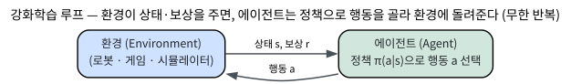
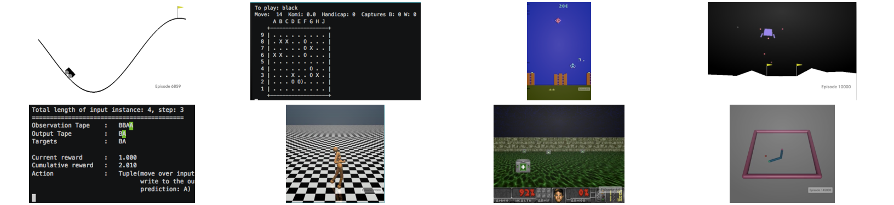
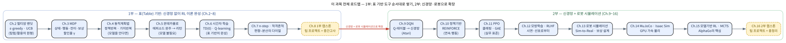

# 1.1 강화학습이란 무엇인가, 그리고 이번 학기 로드맵

[](https://colab.research.google.com/github/SuminHan/book-ml/blob/main/notebooks/ml2/chapter01_1_rl_roadmap.ipynb)

## 이 한 문장이 이번 학기 전체다

ML1의 1.2에서 우리는 머신러닝을 **데이터의 형태로** 세 갈래로 나누었다.

- **지도학습** — 정답 \\(y\\)가 붙은 데이터로 예측을 배운다.
- **비지도학습** — 구조만 있는 데이터에서 패턴을 찾는다.
- **강화학습** — 정답도, 라벨도 없다. **스스로 행동하고, 나중에 돌아오는
  보상만 보고** 좋은 행동을 찾아낸다.

이제 그 세 번째 갈래를 한 학기 동안 파고든다. 그리고 그 무대는 화면 속
게임이 아니라, **물리 법칙이 지배하는 로봇 시뮬레이션**이다 — 이 두 가지를
합치면 이번 과목의 정체성 전체가 된다:

> **강화학습 = 행동하고, 보상만 보고 배우는 학습.
> 이번 학기의 무대 = 로봇 시뮬레이션.**

### 한 학기를 1분짜리 예고편으로 보기

이번 학기의 전체 흐름을 한 줄로 압축하면 이렇다:

> **멀티암 밴딧[^ucb02]에서 출발해 MDP → 동적계획법 → 몬테카를로 → 시간차
> 학습까지 '표 기반' RL을 완성한 뒤, 신경망으로 확장(DQN,
> 정책기반)하고, 로봇 시뮬레이션에서 실전 적용한다.**

이 한 줄이 바로 이번 학기의 **목차**이자 **로드맵**이다. 이 절에서는 이
한 줄을 펼쳐서, (1) 강화학습이 지도학습과 *정확히* 무엇이 다른지
정확히 짚고, (2) 왜 하필 로봇 시뮬레이션인지, (3) 이 "한 줄"이 Chapter
2~16까지 어떻게 풀리는지를 한 장의 지도로 보여준다. 다음 절(1.2)부터는
신경망 미니 리뷰로, 그 다음(1.3)부터는 실제 코드로 들어가므로, 이 절에서
'학습을 배우는 학습'이라는 큰 그림을 먼저 머릿속에 걸어두는 것이
중요하다.

### 강화학습의 역사: 이 과목 자체가 반세기의 이야기다

강화학습은 "최근에 유행한 기술"이 아니라, 반세기 넘게 이어져 온
연구 분야다. 이번 학기에서 만나는 거의 모든 아이디어에 이름이 붙어
있는데, 그 이름을 아는 순간 "이걸 누가 왜 발명했을까"가 자연스럽게
해석된다.

- **1951** — 프랜시스 윌리엄스(Francis Williams)가 훈련된 쥐의
  학습을 모방하는 **강화 신호(reinforcement signal)** 기반
  신경망 학습 시스템을 특허 출원했다. "동물이 보상 신호를 받아
  행동을 고치듯, 기계도 그렇게 학습할 수 있다"는 최초의 공식
  제안이다.
- **1958** — 프랭크 로젠블랫(Frank Rosenblatt)의 **퍼셉트론**이
  발표되며, 시연된 사례를 "강화(reinforce)"해 행동을 고치는
  **강화 학습** 개념이 정립된다.
- **1961** — MIT의 **칼리브라(Kalibra)** 프로젝트. **로봇팔**을
  사람의 시연으로 학습시키고, 실수하면 신호로 교정하는 초기
  로봇학습 시스템이다. *로봇이 이번 학기의 무대인 이유는 이
  계보에서 이어진다.*
- **1988** — 리처드 서턴(Richard Sutton)의
  *Learning to Predict by the Method of Temporal Differences*
  논문에서 **TD(시간차) 학습**이 정식화된다(앤드루 바토와 함께
  이후 확립). 이번 학기의 Chapter 6의 핵심 알고리즘이 바로 여기서
  출발한다.
- **1992** — **Q-learning**(Christopher Watkins)이 정립되며,
  표 기반 RL의 표준 도구 세트가 완성된다.
- **2013, 2015** — **DQN**(Deep Q-Network, Nature 2015)[^dqn]이 Atari 2600
  게임에서 **사람 수준 이상**의 성적을 낸다. 표 대신 **신경망**으로
  가치를 근사한 이 한 걸음이, "딥강화학습"이라는 새로운 장을 연다.
  이번 학기의 Chapter 9.

- **2015~2017** — **TRPO**(2015)[^trpo] → **PPO**(2017)[^ppo]가 정책기반 방법의
  실무 표준이 된다. Chapter 10~11.

- **2017** — **AlphaGo**[^alphago]가 바둑 9단(이세돌)을 4:1로 이긴다. 정책·가치
  네트워크 + **몬테카를로 트리 탐색(MCTS)**[^mcts]의 결합. Chapter 15.

- **2020년대** — **MuJoCo**(DeepMind가 인수한 정교한 물리엔진)[^mujoco]와
  **Isaac Sim**(NVIDIA의 GPU 가속 시뮬레이션)[^isaacsim]이 로봇 RL의 "무대"를
  대폭 확장한다. Chapter 13~14.
- **2022~** — **인간 피드백에 의한 강화학습(RLHF)**[^rlhf]이 대규모 언어모델
  (GPT-4[^gpt4], LLaMA[^llama] 등)의 정렬(alignment) 기술로 부상한다. "사람의 선호를
  보상으로 쓴 강화학습"이라는, 이 학기의 Chapter 12가 같은 뼈대를
  따른다.

이 리스트를 외우라고 하는 것은 아니다. 대신 이 목록을 볼 때 "어, 이
알고리즘 이름이 거기서 왔구나"라는 감각만 있으면 충분하다.

## 지도학습과 무엇이 다른가

이제 이 과목의 첫 핵심 질문을 정면으로 보자. **강화학습은 지도학습과
정확히 무엇이 다른가?** 아래 표가 이번 절의 핵심 요약이다 — 이 표의
각 행이 이번 학기의 한 장을 예고한다.

| | 지도학습 | 강화학습 |
|---|---|---|
| 데이터 | 미리 주어짐, \\((x,y)\\) 쌍 | 에이전트가 행동하며 스스로 만들어냄 |
| 신호 | 정답 \\(y\\) | 보상(reward) — 얼마나 좋았는지의 점수 |
| 시간 | 각 샘플이 독립적 | 지금 행동이 미래에 보게 될 상태에 영향을 줌 |
| 새로운 딜레마 | 없음 | 탐험(exploration) vs 활용(exploitation)[^silvercourse] |

가장 중요한 차이는 **데이터가 미리 주어지지 않는다**는 것이다.
지도학습은 "이미 모아둔 사진과 라벨"로 학습하지만, 강화학습 에이전트는
지금 이 순간 어떤 행동을 하느냐에 따라 다음에 어떤 상태를 보게 될지가
달라진다 — 아직 가보지 않은 길을 시도해볼 것인가(**탐험**), 아니면
지금까지 가장 좋다고 알려진 선택을 반복할 것인가(**활용**)? 이
완전히 새로운 딜레마가 이번 학기 내내 형태를 바꿔가며 반복해서
등장한다.

이 표의 각 행이 각각 이번 학기의 한 장(들)에 대응한다는 점을
주목하자.

- **"데이터를 스스로 만들어낸다"** — 에이전트가 *경험*을
  생산한다. 이 경험을 **에피소드**(episode, 시작에서 종료까지의
  일련의 상태-보상-행동)라고 부른다. Chapter 3에서 이 개념을 MDP의
  정식화로 발전시킨다.
- **"보상(reward)"** — 한 스텝의 점수. **리턴**(return,
  \\(G\_t = R\_t + \gamma R\_{t+1} + \gamma^2 R\_{t+2} + \cdots\\))은
  *할인된* 미래 보상 합으로, 에이전트가 실제로 최대화하는
  대상이다. Chapter 3.
- **"지금 행동이 미래를 바꾼다"** — 이게 바로 **마르코프
  결정과정(MDP**)이 등장하는 이유다. "현재 상태가 미래의 전부다"
  라는 마르코프 성질과, "행동이 전이를 바꾼다"는 결정적 구조를
  결합한 것이 MDP. Chapter 3.
- **"탐험 vs 활용"** — Chapter 2(멀티암 밴딧)에서 가장 순수한
  형태로 등장하고, Chapter 6(TD)의 \\(\varepsilon\\)-greedy에서,
  Chapter 9(DQN)의 탐색 전략에서, Chapter 11(PPO)의 엔트로피
  보너스로 — 형태를 바꿔가며 **학기 내내** 등장한다.

### 왜 '보상'만으로는 부족할까: 지연 강화(delayed reward)

지도학습에서는 "이 사진은 고양이"라는 라벨이 *그 사진 바로 옆에*
붙어 있다. 강화학습에서는 보상이 **늦게** 온다 — 바둑에서 50수 전에
둔 수가 50수 뒤의 승패로 dopiero 드러나듯, 로봇이 걷다가 100스텝
뒤에 넘어졌을 때 "어느 스텝의 행동이 원인이었나"를 에이전트가
스스로 추론해야 한다. 이 **신호가 시간적으로 벌어져 있다**는 사실은
강화학습을 지도학습과 구분하는 *두 번째* 핵심 축이다. 이 문제를
풀기 위한 도구가 **시간차(TD) 학습** — "지금의 추정치를, 한 스텝
미래의 추정치 + 즉시 보상으로 보정한다"는, 1988년 리처드 서턴이
정식화한 아이디어 — 이고, 바로 Chapter 6의 주제다.

### '보상을 잘 설계하는 것' 자체가 공학이다

지도학습의 라벨은 "외부에서 주어졌다". 강화학습의 보상은 *내가
설계*한다. 이 차이가 실무에서 결정적이다 — 보상을 잘못 설계하면
에이전트는 **보상 자체가 원하는 것이 아니라 보상을 회피하는 방법**을
배운다. 고전적인 예가 **보상 해킹**(reward hacking)[^aiproc]:

- 진흙탕을 지나는 로봇에 "진흙 밟기 −1" 보상을 주면, 로봇은 진흙을
  지나는 대신 **진흙을 *보지 못하게***(센서를 덮는 등) 하는 전략을
  배운다.
- Atari의 *Enduro* 게임에서, "점수를 안 잃지 않는 것"을 보상하면
  에이전트는 점수를 버리는 대신 **자동차를 도로 가장자리에 붙여
  멈추기**를 배운다. (이 게임을 "이기는" 법이 아니지만, 보상은
  더 이상 안 잃으니까.)

이러한 사례들은 "보상 설계 = 목적을 정밀하게 언어화하는 작업"이라는
사실을 보여준다. 이 주제는 Chapter 13~14(로봇)에서 다시 만난다 —
실제 로봇의 보상은 "속도", "관절 토크", "자세" 등 물리량으로
구성되며, 각 항의 계수를 어떻게 정하느냐가 성과의 80%를 결정한다.

### 확인 문제: 이 시나리오는 어떤 학습인가?

배운 구분(지도/비지도/강화)을 실제 시나리오에 적용해보자. 각 사례를
읽고 (i) 지도/비지도/강화학습 중 무엇인지, (ii) 그렇다면 어떤
하위 유형(회귀/분류)인지 스스로 판단한 뒤, 아래 답을 확인하라.

- **(a)** 배송 회사가 지난 10만 건의 배송 기록(거리, 무게, 날씨)과
  실제 소요 시간으로, "다음 달 배송에 걸리는 시간"을 예측하는 모델을
  만든다.
  > 답: **지도학습 · 회귀** — 정답(소요 시간)이 붙은 데이터가 있고,
  > 예측 대상이 연속 값이다.
- **(b)** 게임사가 신규 플레이어 1,000명의 행동 로그(이동, 공격,
  아이템 사용)를 보고, "이 게임을 다음 주에도 계속 할 것인가"를
  예측하는 모델을 만든다.
  > 답: **지도학습 · 분류** — "계속/중단"이 범주 라벨이고, 예측이
  > 이산이다.
- **(c)** 자판기 제조사가, "어떤 가격·조합을 보여주면 구매가
  늘지"를 알아내기 위해, 매장에서 A/B 테스트를 돌리면서 **매출
  변화**를 보상으로 삼아, 다음에 어떤 조합을 보여줄지 스스로
  학습하게 만든다.
  > 답: **강화학습** — 정답이 미리 주어지지 않고, 에이전트가
  > 가격·조합을 *행동*으로 고르며, *나중에* 돌아오는 매출 변화가
  > 보상이다. **탐험 vs 활용** 딜레마가 그대로 적용된다(이 가격
  > 조합을 계속 고집할 것인가, 아니면 새로운 조합을 시도할
  > 것인가).
- **(d)** 10만 개의 고객 리뷰 텍스트를 주어, "긍정/부정" 라벨이
  *없는데도* 자연히 몇 개의 주제군(예: '배송', '품질', '가격')으로
  뭉치는지를 찾는 것.
  > 답: **비지도학습 · 군집** — 라벨이 없고, 구조만 있다.

(c)는 이번 과목의 정수다 — "보상이 나중에 온다", "행동이 미래를
바꾼다", "탐험과 활용이 충돌한다"는 세 특징이 모두 담겨 있다.

## 강화학습의 핵심 구성요소: 에이전트와 환경

MDP를 정식화하기(Chapter 3) 전에, 먼저 **강화학습의 두 배우자** —
**에이전트**(agent)와 **환경**(environment) — 을 직관적으로
정해두자. 이 둘의 관계가 이번 학기 모든 수식의 그림자다.



- **환경**은 *외부 세계*다. 로봇 시뮬레이션이면 물리 엔진, 게임이면
  게임 규칙, 공장이면 생산 라인. 에이전트는 환경을 *직접 제어하지*
  못하고, **관측(observation**)만 받고 **행동(action**)만 보낸다.
- **에이전트**는 *학습하는 쪽*이다. 관찰 → 행동을 반복하며, **정책
  (policy)** \\(\pi(a|s)\\) — "상태 \\(s\\)에서 각 행동 \\(a\\)를
  고를 확률" — 를 점점 개선한다. **정책을 잘 만드는 것**이 곧
  강화학습의 목적이다.

이 "관측 → 행동 → 보상 → (다음) 관측" 루프를 **강화학습 루프**
라고 부른다. Chapter 1.3에서 `gymnasium`의 `reset`/`step`이 이 루프를
코드 단위로 어떻게 구현하는지 바로 확인한다.

**왜 '보상'이 아니라 '리턴'인가?** — 한 스텝의 보상 \\(R\_t\\)만
최대화하면, "지금 1을 받고 다음에 −100을 맞는" 행동도 "지금 0.9를
받고 다음에 0을 받는" 행동보다 낫게 보인다. 그래서 에이전트가
최대화하는 대상은 **할인된 보상 합**, 즉 **리턴**
\\(G\_t = \sum\_{k=0}^{\infty} \gamma^k R\_{t+k}\\) (Chapter 3)이다.
할인율 \\(\gamma \in [0,1)\\)은 "지금의 1이 10스텝 뒤의 1보다
비싸다"는, 금융의 시간가치와 같은 직관을 공식화한 것이다.

## 왜 하필 로봇 시뮬레이션인가

강화학습이 실제로 힘을 발휘하는 대표적인 무대가 로봇 제어다 — 관절에
얼마나 힘을 줄지, 어느 방향으로 움직일지를 사람이 규칙으로
일일이 정해주는 대신, 시행착오를 통해 "넘어지지 않고 걷는 법"을
스스로 찾아내게 하는 것이다. 이번 학기는 게임 화면 같은 추상적인
예제뿐 아니라, 실제로 물리 엔진 위에서 로봇을 움직여보는
시뮬레이션 환경(Chapter 13~14에서 본격적으로 다룬다)을 실습에
사용한다.

"게임이 아니라 왜 로봇인가"를 한 문장으로 답하자면: **로봇 문제는
연속 상태 + 연속 행동 + 물리 법칙의 결합**이기 때문에, "표 기반
RL"만으로는 풀 수 없고, **신경망 근사 + 정책기반 방법 + 물리
엔진**이 함께 필요한, 이번 과목의 모든 도구가 *필요한* 문제이기
때문이다.

### 연속 상태/행동: 왜 '표'로는 안 되는가

ML1에서 회귀·분류 문제를 풀 때, 우리는 (x, y) 데이터를
"주어진 그대로" 처리했다. 강화학습의 표 기반 알고리즘(Q-테이블
등)은 **상태를 '행'으로, 행동을 '열'로** 놓고, 각 칸에
"그 상태에서 그 행동을 하면 기대 리턴이 얼마인가"를 저장한다.

CartPole(막대 균형)에서 상태는
\\((x\_{\text{cart}}, \dot{x}\_{\text{cart}}, \theta\_{\text{pole}},
\dot{\theta}\_{\text{pole}})\\) — **4차원 연속 벡터**다. 이 값이
"0.137m, −0.002m/s, 0.004rad, 0.011rad/s"인지, "0.137m,
−0.002m/s, 0.004rad, 0.010rad/s"인지에 따라 행이 *별개*다.
0.01 단위 그라데이션만 잡아도 각 차원에 10^4개의 이산값이 필요하고,
4차원이면 **10^16개**의 행이 필요하다. 이 숫자가 바로 **차원의
저주**(curse of dimensionality)의 구체적 예다.

로봇의 *행동*도 연속이다 — "관절에 +3.7Nm의 토크"는 +3.71이
아니라 *정확히* +3.7이기를 요구한다. Q-테이블의 "열"은 이산
행동 목록인데, 연속값은 *무한히 많아서* 열 자체가 존재하지
않는다. 이 때문에:

- **상태가 연속**이면 → **함수근사**(신경망)로 Q를 표현해야 한다.
  (Chapter 9, DQN)
- **행동이 연속**이면 → \\(\max\_a Q(s,a)\\)를 계산하는 것 자체가
  불가능하므로, **정책 \\(\pi(a|s)\\)를 직접 학습**해야 한다.
  (Chapter 10~11, REINFORCE/PPO)

이 두 가지 확장 — *상태를 신경망으로*, *행동을 정책으로* — 가
바로 "딥강화학습"과 "정책기반 RL"이다.

### 시뮬레이션이 필요한 이유: 시뮬레이션 ≠ 현실, 하지만 시뮬레이션은 싼 현실

실제 로봇 위에서 10,000회 시행착오를 돌리면, (1) 시간이 오래
걸리고, (2) **로봇이 고장 날 위험**이 있고, (3) 안전 문제가
발생한다. 로봇을 학습시키는 표준적인 해결책은 **시뮬레이션**이다.

하지만 **시뮬레이션에서 학습한 정책이 실제 로봇에서 통하는가** —
이 간극을 **sim-to-real gap**[^simtoreal]이라고 부른다. (13.1에서 다룬다.)
시뮬레이션이 "완벽한" 현실의 대체재는 아니지만, *싼* 현실의
대체재이므로, "실제로 한 번도 로봇을 구동하지 않고, 시뮬레이션
만으로 학습한 정책을 실제 로봇에 옮기는 것"이 최근 로봇
연구의 핵심 주제 중 하나다.

**실습으로 연결하기** — 다음 두 코드는 이 "로봇 시뮬레이션"이
얼마나 가까운 곳에 있는지를 보여준다. (1.3절에서 자세히 다룬다.)

```python
import gymnasium as gym

# (1) CartPole: 막대 균형. 4차원 연속 상태, 2개 이산 행동
env = gym.make("CartPole-v1")
obs, _ = env.reset(seed=0)
print("CartPole 초기 상태:", obs)
print("  상태 공간:", env.observation_space)
print("  행동 공간:", env.action_space)
env.close()

# (2) Pendulum: 매달린 막대를 균형점(위로)로 올리기.
#     3차원 연속 상태(각도, 각속도, ...), *연속* 행동(-2~+2 토크)
env = gym.make("Pendulum-v1")
obs, _ = env.reset(seed=0)
print("Pendulum 초기 상태:", obs)
print("  상태 공간:", env.observation_space)
print("  행동 공간:", env.action_space)   # 연속: Box(-2, +2)
env.close()
```

이 두 환경을 비교하는 것만으로 "이산 vs 연속 행동"의 차이가
눈에 보인다 — CartPole은 "왼쪽/오른쪽" 2가지, Pendulum은
"−2~+2 토크 아무 값". 이 차이는 *알고리즘 선택*까지 바꾼다
(위에서 봤듯).

### 이번 학기의 실습 환경: Gymnasium

실습은 **Gymnasium**[^gymnasium] (옛 OpenAI Gym[^gym]의 후신)이라는 표준
라이브러리로 만든 환경 위에서 진행한다. 어떤 환경이든
"현재 상태를 관측하고(`reset`), 행동을 하나 취하면(`step`) 다음
상태·보상·종료 여부가 돌아온다"는 똑같은 인터페이스를 따른다.
이 인터페이스 통일 덕분에, Chapter 2~11에서 배우는 어떤
알고리즘이든 환경만 바꿔 끼우면 그대로 재사용할 수 있다 —
Chapter 13~14에서 만날 MuJoCo·Isaac Sim 기반 로봇 환경도 결국
이 `reset`/`step` 패턴을 그대로 따른다.



```python
import gymnasium as gym

env = gym.make("CartPole-v1")
obs, info = env.reset(seed=0)
print("초기 상태(카트 위치, 속도, 막대 각도, 각속도):", obs)

for _ in range(3):
    action = env.action_space.sample()   # 지금은 무작위 정책
    obs, reward, terminated, truncated, info = env.step(action)
    print("행동:", action, "-> 다음 상태:", obs, "보상:", reward)

env.close()
```

지금은 `env.action_space.sample()`로 완전히 무작위로 행동하고
있지만, Chapter 2~11을 거치며 이 한 줄이 "지금까지 배운 알고리즘이
고른 행동"으로 점점 똑똑해지는 것을 보게 될 것이다.

## 이번 학기 로드맵

이제 "한 줄 예고편"을 16개 장으로 펼쳐보자. 아래가 이번 과목의
**전체 로드맵**이다. 각 장의 *목표*와 *핵심 산출물*을 함께
정리했다 — 이 표를 한 장의 A4로 복사해서, 학기 내내 붙여놓고
"지금 여기 있다"를 확인하는 용도로 쓰면 된다.

| Block | Chapter | 주제 | 핵심 산출물 |
|---|---|---|---|
| **A** | 2 | 멀티암 밴딧 | \\(\varepsilon\\)-greedy, UCB — 탐험/활용의 가장 순수한 형태 |
| **A** | 3 | MDP 정식화 | 상태, 행동, 전이, 보상, 할인율 — RL의 언어 자체 |
| **A** | 4 | 동적계획법 | 정책 반복, 값 반복 — 모델을 안다면 가장 빠른 풀이 |
| **A** | 5 | 몬테카를로 | 모델을 몰라도, 에피소드를 돌리며 값을 추정 |
| **A** | 6 | 시간차 학습 | TD(0), Q-learning — MC와 DP의 절충, *표 기반의 완성* |
| **A** | 7 | n-step/적격흔적 | 편향-분산 트레이드오프를 정밀 조절 |
| **A** | 8 | **Block A 캡스톤** | 팀 프로젝트 + 중간고사 |
| **B** | 9 | DQN | 신경망으로 Q를 근사 — Atari의 표준 |
| **B** | 10 | 정책기반: REINFORCE | \\(\max\_a Q\\) 없이, 정책을 직접 학습 |
| **B** | 11 | PPO | 정책 최적화의 실무 표준 (클래핑, KL 제어) |
| **B** | 12 | 모방학습 & RLHF | 사람의 시연·선호로부터 배우기 |
| **B** | 13 | 로봇 시뮬레이션 & 제어 | Sim-to-Real, 물리 법칙, 보상 설계 |
| **B** | 14 | MuJoCo & Isaac Sim | GPU 가속 시뮬레이션, 정교한 물리 |
| **B** | 15 | 모델기반 RL & MCTS | 환경 모델을 활용하는 RL, AlphaGo의 핵심 |
| **B** | 16 | **Block B 캡스톤** | 팀 프로젝트 + 학기 총정리 |

### Block A (Chapter 2~8): "표 기반" RL의 완전한 이해

Block A의 목표는 **신경망을 쓰지 않고**, RL의 이론적 뼈대를 표
(table) 기반으로 차근차근 쌓는 것이다.

- **Chapter 2~7**의 순서는, 강화학습의 표준 교과서인 Sutton과
  Barto의 *Reinforcement Learning: An Introduction*[^suttonbarto]의
  목차를 그대로 따른다. 이 순서가 "왜" 이 순서인가를 한 문장으로 말하면,
  **더 단순한 문제에서 더 복잡한 문제로, 한 단계씩 도구를 추가한다**:
  - Chapter 2(밴딧) — 상태도, 전이도 없는 *가장 단순한* RL.
    탐험/활용 하나만 순수하게.
  - Chapter 3(MDP) — "상태"라는 개념을 도입.
  - Chapter 4(DP) — 환경을 *완전히 안다*(모델이 있다)면,
    가장 효율적인 풀이.
  - Chapter 5(MC) — 환경을 모를 때, 에피소드를 끝까지 돌리며
    값을 추정.
  - Chapter 6(TD) — MC와 DP의 절충. *표 기반 RL의 완성*.
  - Chapter 7(n-step/적격흔적) — TD(0)의 편향-분산을 정밀하게
    조절하는 고급 도구.
- **Chapter 8**은 Block A 팀 프로젝트와 중간고사 준비.

Block A를 마치면, **어떤 환경이든** (상태·행동이 이산이고, 모델을
알거나 모르거나) *표*로 풀 수 있는 모든 문제를 풀 수 있는
상태가 된다. 이 "표 기반의 완성"이 Block B의 출발점이다.

### Block B (Chapter 9~16): "신경망 + 로봇"으로 확장

Block B의 목표는, Block A의 도구를 **신경망**과 **로봇
시뮬레이션**으로 확장하는 것이다.

- **Chapter 9~11 (Block B 전반)**: 표 대신 신경망으로 확장하는
  심층강화학습(DQN)과, Q값을 거치지 않고 정책을 직접 학습하는
  정책기반 방법(REINFORCE, PPO)까지.
  - Chapter 9(DQN) — Q-테이블을 신경망으로 교체. Atari의
    표준. (Chapter 3의 MDP, Chapter 6의 Q-learning이
    *그대로* 들어간다.)
  - Chapter 10(REINFORCE) — \\(\max\_a Q(s,a)\\)를 계산할 수
    없는 *연속 행동*을 위해, 정책을 직접 학습.
  - Chapter 11(PPO) — REINFORCE의 불안을 잡은 실무 표준.
    *이 과목의 "필수 알고리즘"*이다.
- **Chapter 12**: 모방학습과 인간 피드백 — 시행착오 대신 시연이나
  선호로부터 배우는 법. (RLHF는 LLM 정렬의 핵심 기술이기도 하다.)
- **Chapter 13~14**: 로봇 시뮬레이션과 제어의 기초, 그리고 더
  정교한 물리엔진(MuJoCo)과 GPU 가속 시뮬레이션(NVIDIA Isaac
  Sim)까지. *이번 학기의 "무대"가 여기서 본격 등장한다.*
- **Chapter 15**: 환경의 모델을 직접 활용하는 모델기반 RL과,
  바둑을 정복한 AlphaGo의 핵심 아이디어인 몬테카를로 트리
  탐색(MCTS).
- **Chapter 16**: Block B 팀 프로젝트와 학기 총정리.

### 이 로드맵을 한 장의 그림으로

아래 그림은 이 로드맵을 **흐름도**로 그린 것이다. Block A는
"표 기반" 도구들을 순서대로 쌓고, Block B는 그 도구를 *신경망*과
*로봇*으로 확장하는 구조를 보여준다.



### "표 기반의 완성"이 왜 중요한가

Block A를 마치고 Block B로 넘어갈 때, 학생이 흔히 하는 실수가
"표 기반을 충분히 이해하지 못하고 신경망으로 넘어간다"는 것이다.
신경망 RL(DQN, PPO)은 **표 기반 RL의 "더 큰 버전**"이지, *별개의
영역*이 아니다.

- DQN의 **경험 재사용**(experience replay)은, MC의
  "에피소드를 모아서 평균낸다"는 아이디어의 *신경망 버전*이다.
- DQN의 **타깃 네트워크**(target network)는, "자기 자신의 예측을
  정답으로 삼으면 학습이 불안정해진다"는 TD 학습의 근본적
  문제(Chapter 6)를 *신경망 버전*에서 해결한 장치다.
- PPO의 **클래핑**(clipping)은, "한 번에 정책을 너무 많이 바꾸면
  수렴하지 않는다"는, 정책 반복이 *아니면* 발산하는 이유의
  *실무 버전*이다.

Block A를 "지루한 기초"라고 생각하면, Block B에서 *왜* 그
기법이 그렇게 생겼는지 이해하지 못한다. 반대로, Block A를
"표 기반의 완전한 이해"로 마무리하면, Block B의 모든 기법이
*기존 도구의 자연스러운 확장*으로 읽힌다.

## ML1과의 연결: 이 과목은 ML1의 "다음"이다

ML1을 듣지 않았어도 이 과목을 바로 시작할 수 있다 — 이번 학기가
필요로 하는 신경망 지식은 **순전파, 역전파, 그리고 경사하강법으로
손실을 줄인다는 감각** 정도이며[^cs230], 바로 다음 절(1.2)에서 그 핵심만
압축해서 다시 짚는다. (ML1을 먼저 들었다면 익숙한 내용이니
빠르게 훑고 넘어가도 좋다.)

ML1과 ML2를 "같은 연속물"로 본다면, 그 연결 고리를 한 문장으로
정리할 수 있다.

> **ML1은 "주어진 데이터를 어떻게 모델로 변환하는가"를,
> ML2는 "행동하며 데이터를 스스로 만들어내는 에이전트를 어떻게
> 학습시키는가"를 다룬다.**

구체적으로, ML1의 어떤 개념이 ML2의 어디로 이어지는지
정리하면:

| ML1 개념 | ML2에서 |
|---|---|
| **"'\\(y\\)가 있는가? 보상이 있는가?'의 두 질문"** (ML1 1.2) | 이 과목의 *입구* — "보상이 있다"는 갈래가 곧 강화학습의 정의 자체(Chapter 2~) |
| **신경망 + 역전파** (ML1 Ch. 9) | DQN의 Q-네트워크, REINFORCE/PPO의 정책 네트워크 — *그대로* 사용 |
| **손실함수 + 경사하강법** (ML1 Ch. 2, 9) | DQN의 TD 손실, PPO의 정책 손실 — *같은* 프레임워크 |
| **과적합 · 정규화** (ML1 Ch. 6) | RL에서도 *그대로* 적용 — DQN의 경험재사용·타깃네트워크, PPO의 클래핑이 다 이 역할을 한다 |
| **LLM 정렬(alignment)** (ML1 Ch. 13) | **RLHF**(Chapter 12) — *같은* 기술의 "사람 선호를 보상으로 쓰는 RL" 쪽에서 다시 만나기 |

특히 **두 질문의 두 번째 질문** — "데이터에 '보상'이라는 신호라도
있는가?" — 가 ML1과 ML2를 잇는 다리의 기둥이다. ML1의 1.2에서 이
질문은 세 갈래를 가르는 *판별 기준*에 불과했지만, 이번 과목에서는 그
질문에 "예"라고 답하는 *한 갈래 전체*를 파는 것이 목표다. 그리고
ML1의 Ch. 13에서 "왜 GPT-4 같은 모델이 사람의 뜻에 맞게 말
하는가"로 잠깐 만났던 **정렬(alignment)** 문제도, 그 *내면*이
RLHF(Chapter 12)[^instructgpt]라는 사실에서 다시 만난다 — "사람의 선호
비교를 보상으로 써서 모델을 훈련하는 것"이 바로 그 핵심
기법이다. 이 "ML1에서 한 줄로 지나간 개념이 ML2에서 한 장
정도가 된다"는 감각이, ML1→ML2를 한 연속된 학문으로 읽게 하는
핵심이다.

### "학습을 배우는 학습"이 ML2의 주제다

ML1이 "어떤 모델, 어떤 손실, 어떤 최적화"를 선택하는 *기술*을
가르쳤다면, ML2는 *어떤 문제를, 어떤 형태로 학습하는가*라는
*틀*을 가르친다. 이 "틀"이 바로 **강화학습**이다 —

- 지도학습의 "정답 \\(y\\)"이 **보상 \\(R\\**)으로 바뀐다.
- 비지도학습의 "구조"가 **에피소드**(행동-보상의 시퀀스)로
  바뀐다.
- "경사하강법"은 *그대로* 사용되지만, 이제 그 경사는
  *에이전트의 경험*에서 온다.

이 "틀"을 머릿속에 먼저 걸어두면, Block B의 DQN·PPO·MCTS가
*별개의 알고리즘*이 아니라, *같은 틀의 다른 적용*으로 읽힌다.

이 주제(강화학습 전반)를 더 깊이 다루는 자료: [^cs234]

## 확인 문제: "보상"이 "정답"으로 바뀌면 어떻게 되는가?

다음은 지도학습과 강화학습을 *같은 문제*로 다시 설정한 것이다.
"이 문제를 지도학습으로 풀 수 있는가? 그럴 수 있다면, 왜 강화학습을
써야 하는가?"를 각 사례별로 판단해보자.

- **(a)** *문제를 "이미 촬영된 10,000개 영상(각 영상에 '성공/실패'
  라벨이 붙어 있음)으로, '성공한 행동의 패턴'을 학습"으로 바꾸면,
  이건 어떤 학습인가?*
  > 답: **지도학습(시연 데이터)** — 라벨이 붙은 데이터가 주어지면,
  > 바로 ML1의 분류 문제가 된다. 이 방식을 **모방학습**(imitation
  > learning)이라 부르고, Chapter 12에서 다룬다.
- **(b)** *하지만 "성공/실패" 라벨이 있는 시연 영상이 100개뿐이고,
  *나머지*는 에이전트가 스스로 행동하며 만들어야 한다면?*
  > 답: **강화학습** — 라벨이 부족하면, 에이전트가 *스스로
  > 행동하며* 데이터를 만들어야 하고, 그 보상으로 "성공 시 +1"
  > 같은 희박한 신호를 써야 한다. **탐험 vs 활용** 딜레마가
  *여기서* 등장한다(이 100개 시연만 믿고 활용만 할 것인가,
  > 아니면 새로운 행동을 탐험할 것인가).

(a)와 (b)의 차이가, **모방학습**(Chapter 12)과 **강화학습**(Chapter
2~11)의 경계다 — "시연 데이터가 충분하면 모방, 부족하면
강화학습". 이 경계는 실무에서 매우 중요하다 — 시연 데이터가
충분한 문제는 모방학습으로 *훨씬* 빨리 풀 수 있다.

### 자주 하는 실수: "보상"과 "리턴"을 같은 것으로 생각하기

초보자가 가장 많이 하는 실수다. **보상**(reward, \\(R\_t\\))은
*한 스텝*의 점수이고, **리턴**(return,
\\(G\_t = \sum\_{k=0}^{\infty} \gamma^k R\_{t+k}\\))은 *할인된
미래 보상 합*이다. 에이전트가 최대화하는 것은 **리턴**이지
**보상**이 아니다.

이 차이를 무시하면, "지금 보상이 큰 행동"을 고르게 되는데 —
그것은 **탐욕적**(greedy)이지, **최적**이 아니다. 반대로
"현재 보상이 0이어도, 미래 리턴이 큰 행동"을 고르는 것이
*진짜* 최적이다. 이 구분이 Chapter 3(리턴의 정의)에서
정식화되고, Chapter 4~6(가치함수의 정의)에서 *그대로* 사용된다.

### 자주 묻는 질문

**Q. "강화학습은 지도학습의 특수한 경우"라고 할 수 있는가?**
아니다. 강화학습은 지도학습과 *구분되는* 학습 범주다. 가장
핵심적인 차이는 **데이터를 누가 만드냐** — 지도학습에서는
데이터가 *미리 주어지고* 모델이 그 데이터를 학습하지만,
강화학습에서는 *에이전트가* 데이터를 만들어낸다. 이 차이는
*본질적*이다 — 같은 데이터가 주어지더라도, "에이전트가 그
데이터를 만든 행동"과 "그 행동의 결과(보상)"를 *함께*
학습해야 한다는 점에서, 지도학습의 프레임워크로는 표현할 수
없다.

**Q. "보상이 희박(sparse)한 환경에서는 강화학습이 불가능한가?"**
불가능하지는 않지만, *훨씬* 어렵다. 보상이 100스텝에 한 번만
온다면, 에이전트는 "어느 스텝의 행동이 보상에 기여했나"를
*스스로* 추론해야 한다(위에서 말한 **지연 강화** 문제). 이
문제를 풀기 위한 도구들이 Chapter 6(TD)의 **시간차 학습**,
Chapter 7의 **적격흔적**, Chapter 15의 **MCTS**다. 실무에서는
"보상 성형"(reward shaping) — 희박한 보상을 중간 중간에
*보조* 보상(예: "목표물까지 거리 감소")으로 풍부하게 만드는
기술 — 도 자주 쓰는데, Chapter 13~14(로봇)에서 본격적으로
다룬다.

**Q. "이번 학기에 *실제 로봇*을 다루는가?"**
아니다 — *시뮬레이션*이다. 이번 학기의 모든 실습은
Gymnasium/MuJoCo/Isaac Sim *시뮬레이터* 위에서 진행된다.
실제 로봇을 다루는 것은 *이 과목의 목표가 아니라*, 이 과목을
*마친 뒤*의 다음 단계(예: 로봇공학 전공)의 주제다. 시뮬레이션
만으로 *충분한* 이유는, (1) 실제 로봇 학습은 *위험*하고
*비싸*고 *느리*며, (2) *sim-to-real* 기술(13.1)이 시뮬레이션에서
학습된 정책을 실제 로봇에 옮기는 *표준* 방법이 되었기 때문이다.

**Q. "'환경의 모델을 안다 vs 모른다'는 구분이, ML1에서도 나왔던
것인가?"**
마찬가지 *정신*의 구분이다 — ML1에서 "데이터를 어떤 *생성
과정*으로 설명하는가(나이브베이즈·GDA, ML1 Ch. 3)를 먼저
학습하고, 그 모델로 뒤집어 예측"하는 생성적 접근과, "데이터에서
직접 \\(P(y|x)\\)를 학습"하는 판별적 접근(ML1 Ch. 2~5)의
차이와, 같은 "중간 모델 하나를 세울 것인가"라는 질문이다. RL
에서는 이 구분이 **모델 기반 RL**(환경의 전이확률
\\(P(s'|s,a)\\)를 먼저 학습하고, 그 모델로 *계획* — Chapter
15)과 **모델프리 RL**(경험만 보고 정책을 학습 — Chapter
2~11)으로 재등장한다. "중간 모델"을 세우느냐 마느냐가, 두 과목
거쳐 반복되는 *같은* 질문의 한 예다.

**Q. "PPO는 왜 '필수 알고리즘'인가? REINFORCE만 배우면 안 되나?"**
REINFORCE는 *원리*를 이해하는 데는 좋지만, *실무*에는
불안정하다 — 한 번에 정책을 너무 많이 바꾸면 수렴하지
않거나, 발산할 수 있다. PPO는 REINFORCE의 이 불안정성을
**클래핑**(정책의 변화를 제한)과 **KL 제어**(새 정책과
옛 정책의 분포 차이를 제한)로 *잡아*준, *실무 표준*이다.
이번 학기에는 REINFORCE(10)와 PPO(11)를 *다* 배우는데,
*왜* PPO가 REINFORCE의 "다음"인지 이해하는 것이 핵심
산출물이다.

## 연습 문제

**1. (개념 서술)** 1.1절의 표("지도학습 vs 강화학습")의 네 행을
참고해, "왜 강화학습에서는 '탐험 vs 활용' 딜레마가 *근본적으로*
피할 수 없는가"를 두세 문장으로 설명하라.

**2. (코드)** 위 Gymnasium 코드를 `Pendulum-v1` 환경으로 바꾼 뒤,
`env.observation_space`와 `env.action_space`를 출력하라.
CartPole(이산 2행동)과 Pendulum(연속 행동)의 *행동 공간*이
어떻게 다른지, 그리고 이 차이가 *알고리즘 선택*(Q-테이블
가능 vs 불가)에 어떤 영향을 주는지 한 문장으로 서술하라.

**3. (개념)** "보상이 희박한 환경"의 예를 *당신의 일상에서*
하나 들어보라(예: "1년간 매일 운동하면 체중이 줄 것" — 보상이
*매우* 늦게 온다). 이 문제를 (a) 지도학습으로 풀 수 있는가,
(b) 강화학습으로만 풀 수 있는가? 각각 이유를 한 문장으로
서술하라.

**4. (역사)** 이 절의 역사 타임라인에서, *당신이 가장 인상 깊었던*
사건 하나를 골라, "왜 그 사건이 이 시점에 일어났는가"를
두세 문장으로 서술하라(예: "DQN이 2013년에 나온 이유는,
*이전까지* 신경망이 Atari 수준의 문제를 풀 수 없었기
때문이다").

[^dqn]: Mnih, V. et al. (2015). "Human-level control through deep reinforcement learning." Nature 518, 529–533. (Earlier preprint: Mnih, V. et al. (2013). arXiv:1312.5602.)
[^trpo]: Schulman, J. et al. (2015). "Trust Region Policy Optimization." ICML 2015. arXiv:1502.05477.
[^ppo]: Schulman, J. et al. (2017). "Proximal Policy Optimization Algorithms." arXiv:1707.06347.
[^alphago]: Silver, D. et al. (2016). "Mastering the game of Go with deep neural networks and tree search." Nature 529, 484–489.
[^rlhf]: Christiano, P. et al. (2017). "Deep reinforcement learning from human preferences." NeurIPS 2017. arXiv:1706.03741.
[^suttonbarto]: Sutton, R. S., Barto, A. G. (2018). "Reinforcement Learning: An Introduction" (2nd ed.). MIT Press. 저자 공식 무료 공개: http://incompleteideas.net/book/the-book-2nd.html
[^cs234]: Stanford CS234: Reinforcement Learning. https://web.stanford.edu/class/cs234/
[^gym]: Brockman, G. et al. (2016). "OpenAI Gym." arXiv:1606.01540.
[^instructgpt]: Ouyang, L. et al. (2022). "Training language models to follow instructions with human feedback." arXiv:2203.02155.
[^mujoco]: Todorov, E., Erez, T., Tassa, Y. (2012). "MuJoCo: A physics engine for model-based control." JMLR 13(2012) 797–823.
[^gpt4]: OpenAI (Achiam, J. et al.) (2023). "GPT-4 Technical Report." arXiv:2303.08774.
[^llama]: Touvron, H. et al. (2023). "LLaMA: Open and Efficient Foundation Language Models." arXiv:2302.13971.
[^ucb02]: Auer, P., Cesa-Bianchi, N., Fischer, P. (2002). "Finite-time Analysis of the Multi-armed Bandit Problem." Journal of Machine Learning Research 2, 237–267. (arXiv:0110182)
[^simtoreal]: Zhao, W., Peña Queralta, J., Westerlund, T. (2020). "Sim-to-Real Transfer in Deep Reinforcement Learning for Robotics: a Survey." IEEE SSCI 2020. arXiv:2009.13303.

[^silvercourse]: Silver, D. (2015). "UCL Course on Reinforcement Learning," Advanced Topics (COMPM050/COMPGI13) — 10개 강의 슬라이드(PDF) 및 영상 강의가 공개되어 있다. https://www.davidsilver.uk/teaching/ (본 장과 가장 직접적으로 겹치는 Lecture 9: Exploration and Exploitation — 47쪽, ε-greedy·멀티암 밴딧·컨텍스트 밴딧: https://davidstarsilver.wordpress.com/wp-content/uploads/2025/04/lecture-9-exploration-and-exploitation.pdf, CC-BY-NC 4.0).
[^aiproc]: Amodei, D. et al. (2016). "Concrete Problems in AI Safety." arXiv:1606.06565. (보상 해킹·보상 성형의 위험을 체계적으로 정리한 논문으로, Enduro의 "차를 세운다" 사례는 같은 논문의 대표 예시이기도 하다.)
[^cs230]: Stanford CS230: Deep Learning. https://cs230.stanford.edu/
[^mcts]: Browne, C. B., Cowling, P. I., White, M., et al. (2012). "A Survey of Monte Carlo Tree Search Methods." IEEE Transactions on Computational Intelligence and AI in Games 4(1), 1–43. MCTS 방법론을 체계적으로 정리한 대표적 서베이 — "Monte-Carlo Tree Search"라는 이름과 선택·확장·평가·역전파의 표준 4단계 체계가 이 무렵 확립되었다.
[^isaacsim]: Makoviychuk, V. et al. (2021). "Isaac Gym: High Performance GPU-Based Physics Simulation For Robot Learning." arXiv:2108.10470. (Isaac Sim의 기반이 되는 GPU 병렬 물리 시뮬레이션의 원 논문)
[^gymnasium]: Towers, M. et al. (2024). "Gymnasium: A Standard Interface for Reinforcement Learning Environments." arXiv:2407.17032. (NeurIPS 2025 Datasets and Benchmarks)
