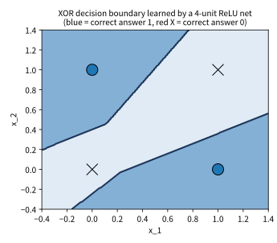
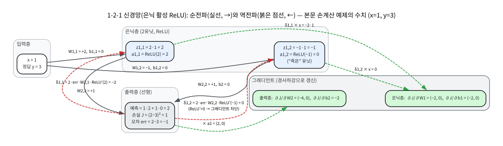
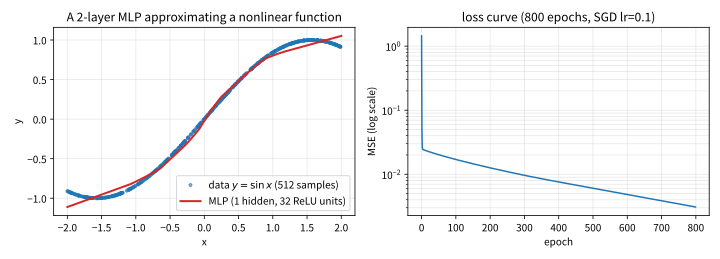

# 1.2 신경망 미니 리뷰

[](https://colab.research.google.com/github/SuminHan/book-ml/blob/main/notebooks/ml2/chapter01_2_nn_mini_review.ipynb)

이 절은 이번 학기를 시작하기 위한 "열쇠 정리" 시간이다 — 강화학습 자체는
아무것도 새로 가르치지 않는다. 대신 앞으로 16개 챕터 내내 사용하게 될
신경망 지식의 **뼈대**를 50분 안에 한 번만 더 정확히 짚는 것이다. ML1을
들었다면 대부분 익숙할 내용이지만, "한 번 더"의 이유가 있다: 이번 학기에서는
신경망이 **정책(policy)**이 된다 — 상태 \\(s\\)를 입력받아 행동 \\(a\\)를
내보내는 함수 \\(\pi\_\\theta(a|s)\\). 이 함수가 정확히 어떻게 동작하고,
어떻게 학습되는지 모르면 Chapter 9(DQN)부터 Chapter 11(PPO)까지의 모든
수식이 "마법"으로만 보인다. 그래서 이번 50분은 (1) 순전파가 정확히 뭘
하는지, (2) 왜 층을 하나 더 쌓으면 표현력이 기하급수적으로 폭발하는지,
(3) 역전파가 숫자 수준에서 실제로 무엇인지, (4) 이 모든 것이 RL에서 어떤
역할을 하는지 — 이 네 가지만 남기는 데 쓴다.

### 순전파와 학습의 정의

신경망은 입력 \\(x\\)를 층(layer)을 거치며 변환해 예측값을 만드는 함수다.
2층 신경망의 순전파:

\\[z\_1 = W\_1 x + b\_1, \quad a\_1 = \sigma(z\_1), \quad z\_2 = W\_2^T a\_1 + b\_2,
\quad a\_2 = \sigma(z\_2)\\]

각 기호가 정확히 무엇을 가리키는지 한 번 더 짚자. \\(W\_1\\)는 1층(은닉층)의
가중치 행렬로, 각 은닉 유닛이 입력의 어떤 조합을 "보느냐"를 결정하고,
\\(b\_1\\)는 그 유닛들의 **활성 임계값**(activation threshold)을 이동시키는
편향이다. \\(z\_1\\)은 활성화 전의 "선형 신호"이고, \\(\sigma\\)는 **활성
함수**(activation function)다. \\(a\_1\\)이 이 신호를 비선형으로 왜곡해서
내보낸 결과다. \\(W\_2^T a\_1 + b\_2\\)는 은닉 유닛들의 신호를 가중 합쳐
최종 예측을 만든다. 이 4개의 식이 신경망의 **전부**다 — 나머지 모든 것
(딥러닝 프레임워크, GPU, 대규모 데이터)은 이 4줄을 빠르고 안정적으로
계산하는 기술에 불과하다.

**학습**이란 예측이 얼마나 틀렸는지를 손실함수 \\(J\\)로 수치화하고,
\\(J\\)를 줄이는 방향(그래디언트의 반대 방향)으로 파라미터
\\(W\_1, W\_2, b\_1, b\_2\\)를 조금씩 옮기는 과정이다.

### 왜 하나의 층만으로는 안 되는가: 비선형성의 힘

여기서 이 절에서 가장 중요한 "왜"를 하나 짚자 — **왜 중간에 활성
함수 \\(\sigma\\)가 있는가?** 만약 \\(\sigma\\)를 빼고 (활성 함수가 없는)
2층 신경망만 쓴다면, 두 층은 다음처럼 **하나의 선형 변환으로 완전히
축소**된다:

\\[a\_2 = W\_2^T(W\_1 x + b\_1) + b\_2 = (W\_2^T W\_1)\\,x + (W\_2^T b\_1 + b\_2) \
equiv Wx + b\\]

두 층이 하나의 층으로 합쳐져 버린다 — 아무리 층을 쌓아도 **직선**
(회귀) 또는 **평행사변형의 경계**(분류)밖에 그릴 수 없다. 활성 함수가
없으면 층의 "깊이"라는 개념 자체가 존재하지 않는다.

한 층의 선형 변환이 "직선만" 그릴 수 있다면, **비선형 활성 함수를 끼운
층을 쌓으면 어떤 일이 벌어지는가?** 직관부터 보면: 은닉 유닛 하나가
"\\(x\\)가 이 방향에 있는가"를 확인하는 한 개의 **선형 경계**(hyperplane)를
만든다. 16개의 은닉 유닛은 16개의 서로 다른 경계를 만든다. 이 경계들이
\\(x\\) 공간을 여러 조각(각각 다른 선형 영역)으로 쪼개고, 마지막 선형 층은
각 조각 안에서 **각각 다른 기울기**의 직선을 이어붙인다. 층이 하나 더
쌓일 때마다 이 "조각 쪼개기"가 기하급수적으로 세진다 — **깊이가 곧
표현력의 지수**가 되는 이유다. 이 주제를 더 다루는 자료: [^cs230]

이 "조각"이 실제로 신경망 안에서 어떻게 만들어지는지, 그리고 **활성
함수 없이 두 층이 하나로 합쳐지는 것**을 코드로 직접 확인하고 싶다면
상단 **Open In Colab** 배지의 실습 노트북(chapter01_2_nn_mini_review.ipynb)
을 열자.

### 왜 비선형성이 "필요한" 구체적인 예: XOR

"직선은 안 된다"가 추상적으로 들린다면, 기계학습에서 가장 유명한
**2층 분류 문제**를 한번 보자. XOR(XOR, 배제논합) 문제다 — 두 입력
\\(x\_1, x\_2\\)가 각각 0 또는 1이고, **정답 \\(y\\)는 둘이 다를 때만 1**:

| \\(x\_1\\) | \\(x\_2\\) | 정답 \\(y\\) |
|---|---|---|
| 0 | 0 | 0 |
| 0 | 1 | 1 |
| 1 | 0 | 1 |
| 1 | 1 | 0 |

이 네 점을 2차원 평면에 그리면, **정답이 1인 점(파란 원)이 (0,1)과 (1,0)
에, 정답이 0인 점(빨간 십자)이 (0,0)과 (1,1)에** 있다. 이 두 집단을
**한 개의 직선**으로 분리할 수 있는가? 직선은 평면을 두 쪽으로 자를 수
있는데, (0,1)과 (1,0)은 평면의 "대각선 한쪽"에, (0,0)과 (1,1)은
"다른 대각선 쪽"에 있다. 한 개의 직선이 이 두 집단을 완전히 분리하는
경로는 **존재하지 않는다**. 수학적으로 말하면, XOR는 **선형 분리
불가능**(linearly inseparable)이다.

그러면 **2층 신경망**은? 핵심 아이디어는 먼저 **2개 유닛**으로 직관하자.
은닉층의 각 유닛이 \\(z = \max(0,\\; w\_1x\_1 + w\_2x\_2 + b)\\)라는
**한 개의 직선 경계**를 만들 때, 방향이 다른 두 유닛(예: "x_1+x_2가
큰 쪽"과 "x_1−x_2가 큰 쪽")이 만드는 **두 개의 직선**이 2차원을 4개의
영역으로 쪼갠다. 출력층은 이 4개 영역 각각에 다른 가중치를 두어
**파란 두 점에만 높은 값, 빨간 두 점에는 낮은 값**을 매긴다 — 두 직선이
만나는 "모서리"를 이용해, 직선 하나로만은 불가능했던 분리가 가능해지는
것이다. (실제로 이 분리를 학습시키려면, 아래 그림처럼 **4개 이상의
유닛**과 충분한 학습이 필요하다 — 2유닛은 XOR에서 잘 알려진
로컬 미니멈에 빠지기 쉽다.)



**역사적 맥락**: XOR은 1969년 프랭크 로젠블랫(Frank Rosenblatt)의
퍼셉트론(perceptron)에 대한 마빈 민스키(Marvin Minsky)와 사이먼
파핏(Simon Papert)의 저서 *Perceptrons*에서 "단층 퍼셉트론으로는
해결할 수 없는 가장 간단한 문제"로 지적된 이후, **신경망 연구가 10년
동안 거의 정지**하는 데 결정적인 역할을 한 문제다. "이토록 간단한 문제도
못 풀면 신경망은 무의미하다"는 논리가 당시 학계를 지배했다. 이 정지는
1986년 Rumelhart, Hinton, Williams의 역전파 논문으로 해소된다 —
**2층 이상**의 신경망은 XOR을 풀 수 있고, 그 그래디언트를 계산하는
방법(역전파)이 존재한다는 것. 이번 절의 "왜 비선형성/깊이가 필요한가"는
정확히 이 역사적 논쟁의 핵심이다.

**왜 ReLU인가(간단히)**: 시그모이드(\\(\sigma(z)=1/(1+e^{-z})\\))도
비선형이고 XOR을 풀 수는 있다. 하지만 시그모이드는 \\(z\\)가 아주
크거나 작아지면 도함수가 거의 0이 되어, 층이 깊어질수록 그래디언트가
지수급으로 작아지는 **사라지는 그래디언트**(vanishing gradient)
문제를 일으킨다(ML1 Chapter 9에서 자세히 다룸). ReLU
\\(\max(0,z)\\)는 \\(z>0\\)에서는 도함수가 정확히 1이므로 이 문제가
훨씬 완화된다 — 이번 학기 실습의 기본 활성 함수는 ReLU다.

### 역전파는 왜 필요한가

그 그래디언트를 구하는 방법이 **역전파**(backpropagation) — 연쇄법칙을
출력에서 입력 방향으로 거꾸로 적용해, 각 파라미터가 최종 손실에 얼마나
책임이 있는지 계산하는 것이다. 층이 하나뿐이라면 미분을 손으로 바로 계산할
수 있지만, 층을 여러 개 쌓으면 한 파라미터의 변화가 최종 손실에 도달하기까지
거치는 경로가 길어진다 — 역전파는 이 긴 경로를 "출력의 오차를 한 층씩
거슬러 올려보내며" 정확하고 효율적으로 계산하는 절차다. 이번 학기에서는
PyTorch의 `nn.Module`과 `.backward()`로 이 계산을 자동으로 처리한다[^pytorch] — 손으로
유도하는 연습은 이미 (ML1을 들었다면) 끝냈다고 가정한다.

**그래도 한 번은 숫자로** 역전파가 "출력의 오차를 거슬러 올려보낸다"는
말이 실제로 무슨 뜻인지, 손으로 계산해보자. 아래는 **1-2-1 신경망**(입력 1개,
은닉 유닛 2개, 출력 1개, 은닉 활성 ReLU)의 단일 샘플 손계산이다.
가중치를 의도적으로 단순하게 골라 정수 연산만으로 끝내자:

- **은닉층**: \\(W\_1 = \begin{bmatrix} +2 \\ -1 \end{bmatrix}\\),
  \\(b\_1 = \begin{bmatrix} 0 \\ 0 \end{bmatrix}\\)
- **출력층**: \\(W\_2 = \begin{bmatrix} 1 & 1 \end{bmatrix}\\),
  \\(b\_2 = 0\\)
- **입력/정답**: \\(x = 1\\), \\(y = 3\\)
- **손실**: \\(J = (\text{pred} - y)^2\\)

**순전파** (입력 → 출력):

\\[
z\_1 = \begin{bmatrix} 2 \cdot 1 \\ -1 \cdot 1 \end{bmatrix} =
\begin{bmatrix} 2 \\ -1 \end{bmatrix}, \quad
a\_1 = \text{ReLU}(z\_1) = \begin{bmatrix} 2 \\ 0 \end{bmatrix}
\\]

두 번째 은닉 유닛이 **죽었다**(ReLU(−1)=0). 이것이 중요하다 — 아래에서
이 유닛의 그래디언트가 정확히 0이 되는 것을 보게 된다.

\\[
\text{pred} = W\_2 a\_1 + b\_2 = 1 \cdot 2 + 1 \cdot 0 = 2, \quad
J = (2-3)^2 = 1, \quad \text{오차 } \text{err} = \text{pred} - y = -1
\\]

**역전파** (출력 → 은닉, 오차를 거슬러 올려보냄):

출력층 그래디언트(연쇄법칙, 가장 단순한 층부터):

\\[
\frac{\partial J}{\partial W\_2} = 2\\,\text{err} \cdot a\_1^T
= 2(-1)\begin{bmatrix}2 & 0\end{bmatrix} =
\begin{bmatrix}-4 & 0\end{bmatrix}, \quad
\frac{\partial J}{\partial b\_2} = 2\\,\text{err} = -2
\\]

은닉층 그래디언트(출력층의 "오차 신호" \\(2\\,\text{err}\cdot W\_2\\)를
은닉층으로 내려보내고, ReLU 도함수로 걸러냄):

\\[
\frac{\partial J}{\partial a\_1} = 2\\,\text{err}\cdot W\_2^T
= 2(-1)\begin{bmatrix}1\\1\end{bmatrix}
= \begin{bmatrix}-2\\-2\end{bmatrix}
\\]

\\[
\frac{\partial J}{\partial z\_1} = \frac{\partial J}{\partial a\_1}
\odot \text{ReLU}'(z\_1)
= \begin{bmatrix}-2\\-2\end{bmatrix} \odot \begin{bmatrix}1\\0\end{bmatrix}
= \begin{bmatrix}-2\\0\end{bmatrix}
\\]

두 번째 유닛의 그래디언트가 **정확히 0**이다 — 이 유닛은 지금 이 순간
"아무 책임도 없다"는 뜻이다. 죽은 유닛은 이번 업데이트에서 전혀 움직이지
않는다. 이것이 ReLU의 **희소 활성**(sparse activation)의 단면이다.

\\[
\frac{\partial J}{\partial W\_1} = \frac{\partial J}{\partial z\_1}\\, x^T
= \begin{bmatrix}-2\\0\end{bmatrix}\cdot 1
= \begin{bmatrix}-2\\0\end{bmatrix}, \quad
\frac{\partial J}{\partial b\_1} = \frac{\partial J}{\partial z\_1}
= \begin{bmatrix}-2\\0\end{bmatrix}
\\]

이 네 줄의 계산(\\(\partial J/\partial W\_2\\), \\(\partial J/\partial b\_2\\),
\\(\partial J/\partial W\_1\\), \\(\partial J/\partial b\_1\\))이 **역전파의
전부**다. PyTorch의 `.backward()`가 내부에서 자동으로 하는 것이 정확히
이것이다 — 층이 100개여도 같은 4줄(각 층마다 반복)이다.



**이 숫자들이 왜 중요한가**: 역전파를 "마법"으로 두면, "왜 학습이 안
되지?"를 debug할 수 없다. 위 손계산의 각 단계를 코드로 재현하면(아래 실습
노트북의 2번 섹션), `.backward()`가 채운 `model.net[i].weight.grad`가
위 손계산의 값과 **정확히 일치**하는 것을 직접 확인한다. 이 확인이
"역전파가 내가 생각한 것과 같은 것이다"라는 신뢰의 근거다.

**연쇄법칙의 구조를 한 줄로**: \\(\partial J/\partial W\_1 =
(\partial J/\partial a\_1) \odot \text{ReLU}'(z\_1) \cdot x^T\\).
"출력층에서 내려온 오차" × "이 유닛의 활성 도함수" × "입력" — 이 세
인자의 곱이 **모든 신경망의 모든 층**의 그래디언트를 만든다. 층이 깊어질
수록 이 곱이 계속 쌓이고, 이것이 역전파가 "오차를 한 층씩 거슬러
올려보낸다"는 말의 정확함이다.

### 손으로 확인하는 역전파: 작은 예제

"역전파가 자동으로 되는 것"을 신뢰하기 전에, **한 개의 가중치**에 대한
그래디언트를 손으로 계산해서 `.backward()`의 결과와 대조해보자.
1-2-1 신경망이 아니라, **단일 가중치**의 가장 작은 예제로 시작한다.

**모델**: \\(\text{pred} = w x\_1 + w\_2 x\_2 + b\\), \\(w\_2=-0.7\\),
\\(b=0.2\\) 고정, **배우려는 파라미터는 \\(w\\) 하나만**.
**데이터**: \\(x\_1=0.4\\), \\(x\_2=0.9\\), 정답 \\(y=1.0\\).
**손실**: \\(J=(\text{pred}-y)^2\\).

**손계산**: \\(\text{pred}=0.3\times0.4+(-0.7)\times0.9+0.2=0.12-0.63+0.2=-0.31\\).
\\(J=(-0.31-1)^2=(-1.31)^2=1.7161\\).
\\(\partial J/\partial w = 2(\text{pred}-y)\cdot x\_1 = 2(-1.31)(0.4)=-1.048\\).

**유한차분 확인**: \\(w\\)를 \\(+0.001\\) 이동시키면
\\(J(0.301)=1.715052\\), \\(-0.001\\) 이동시키면 \\(J(0.299)=1.717148\\).
중심차분: \\((J(0.301)-J(0.299))/(0.002)=(-1.048000)\\).
**정확히 일치**한다. 이 두 값(해석적 미분 \\(-1.048\\) vs 유한차분
\\(-1.048\\))의 일치 확인이, "역전파가 맞는가?"에 대한 가장 간단한
**단위 테스트**다. ML1에서 "그래디언트 체크"라 배운 것이 정확히 이다.

**왜 이 확인을 해야 하는가**: 역전파 코드를 직접 쓴다면(이번 학기에는
쓰지 않지만, Chapter 10의 REINFORCE에서는 정책 그래디언트를 직접 유도한다),
이 유한차분 확인이 "내 미분이 맞나?"에 대한 유일한 객관적 검증이다.
`.backward()`를 쓰는 지금도, 손계산과 autograd의 대조가 "내가 역전파를
**이해**하고 있다"는 감각을 만들어준다.

### 실습: PyTorch로 2층 신경망 학습시켜보기

```python
import torch
import torch.nn as nn

class MLP(nn.Module):
    def __init__(self, in_dim, hidden_dim, out_dim):
        super().__init__()
        self.net = nn.Sequential(
            nn.Linear(in_dim, hidden_dim),
            nn.ReLU(),
            nn.Linear(hidden_dim, out_dim),
        )

    def forward(self, x):
        return self.net(x)

# 간단한 회귀 실습: y = 2x + 1을 배우게 하기
torch.manual_seed(0)
model = MLP(1, 16, 1)
optimizer = torch.optim.Adam(model.parameters(), lr=0.01)
loss_fn = nn.MSELoss()

X = torch.rand(64, 1) * 4 - 2
y = 2 * X + 1

for epoch in range(200):
    pred = model(X)
    loss = loss_fn(pred, y)
    optimizer.zero_grad()
    loss.backward()
    optimizer.step()

print("최종 손실:", round(loss.item(), 4))
print("x=1일 때 예측:", round(model(torch.tensor([[1.0]])).item(), 3), "(정답: 3.0)")
```

이 코드를 실행하면(시드 0 기준):

- **초기**: `x=1`일 때 예측 ≈ 0.23 (가중치가 무작위로 초기화돼 아직 아무것도 모른 상태)
- **50 에포크 후**: 손실 ≈ 0.17 — 직선의 "기울기"가 대략 잡히는 단계
- **100 에포크 후**: 손실 ≈ 0.02 — 기울기와 절편 모두 거의 정답에 근접
- **200 에포크 후**: 손실 ≈ **0.0028**, `x=1`일 때 예측 ≈ **3.017** (정답 3.0)

이 "손실이 5.5 → 0.003으로 줄고, 예측이 0.23 → 3.02로 수렴한다"는
숫자 흐름이 **신경망 학습의 표준적 모습**이다. 처음에 엉뚱한 값을 내놓다가,
에포크가 쌓일수록 정답에 수렴한다 — 이 수렴의 "속도"와 "최종 정확도"를
조절하는 것이 학습률(learning rate)과 초기화의 역할이다(ML1 Chapter 2, 9
에서 자세히 다룸).

`optimizer.zero_grad()` → `loss.backward()` → `optimizer.step()`이라는 세
줄이 이번 학기 내내(Chapter 9의 DQN, Chapter 10~11의 정책 신경망) 똑같이
반복된다 — 손실을 계산하고, 역전파로 그래디언트를 채우고, 그 그래디언트로
파라미터를 갱신하는 것이 신경망 학습의 변하지 않는 뼈대다.

**세 줄이 실제로 하는 일**:

1. `optimizer.zero_grad()` — 이전 에포크에서 쌓인 그래디언트를 **초기화**.
   PyTorch는 `.backward()`를 반복 호출하면 그래디언트가 **축적**(accumulate)
   되기 때문에, 매 업데이트 전에 반드시 0으로 비워야 한다. 이 줄을 빠뜨리면
   그래디언트가 계속 쌓여 **학습이 발산**한다.
2. `loss.backward()` — 역전파를 실행. 위에서 손계산한 4줄의 그래디언트를
   모든 파라미터에 대해 자동으로 계산해 `.grad` 필드에 채운다.
3. `optimizer.step()` — \\(\theta \leftarrow \theta - \eta \nabla J\\)
   실행. Adam의 경우 "이 그래디언트 방향"을 모멘텀과 적응적 학습률로 보정해
   업데이트한다.

### 비선형성이 실제로 필요한 순간: y = sin(x)

`y = 2x+1`은 **직선**이다 — 선형 모델 하나로도 풀 수 있다. 이 예가
"비선형성이 왜 필요한가"를 보여주는 데는 부족하다. **비선형 함수**
\\(y = \sin(x)\\)를 같은 2층 MLP로 근사해보면, 직선으로는 절대 불가능했던
"곡선"이 어떻게 만들어지는지 직접 볼 수 있다.

아래는 실습 노트북의 numpy[^numpy] MLP(은닉 32유닛, ReLU, SGD lr=0.1)로
\\(y=\sin(x)\\), \\(x \in [-2, 2]\\), 512개 샘플, 800 에포크 학습을 한
결과다:



**이것이 보여주는 것**:

- **32개의 직선 조각**이 이어붙여 곡선이 된다. 은닉 유닛마다 다른 경계를
  만들고, 출력층이 각 조각의 기울기를 조정한다. 32개 조각이 \\(\sin(x)\\)의
  곡률을 따라가며 "계단식 근사"를 만든다.
- **손실 곡선**이 지수적으로 감소한다 — 1.44 → 0.017 → 0.008 → 0.003
  (1, 100, 400, 800 에포크). 이 "처음 느리다가 빠르게 떨어지는" 손실
  곡선은 신경망 학습의 전형적 패턴이다(ML1 Chapter 2의 경사하강에서 같은
  모양을 보았다).
- **직선 모델로는 불가능**했던 근사가, 비선형 활성을 가진 2층으로 **가능**
  해졌다. 이것이 "비선형성의 힘"의 구체적 의미다.

> **주의**: 32개 유닛의 계단식 근사는 \\(\sin(x)\\)의 극값
> (\\(x=\pm\pi/2\\)) 근처와 \\(x\\)의 양 끝(\\(x=\pm 2\\))에서 오차가
> 가장 크다 — "조각"이 곡률이 가장 센 곳에서 가장 급격하게 휘기 때문이다.
> 유닛을 더 늘리면 근사가 매끄러워진다(노트북에서 직접 바꿔볼 것).

### 신경망 학습의 세 가지 "왜"를 정리

| 질문 | 답 |
|---|---|
| 왜 비선형 활성이 필요한가? | 없으면 여러 층이 하나의 선형 변환으로 축소됨 → 깊이 무의미 |
| 왜 2층 이상인가? | 1층 = 선형 분리만 가능 → XOR 같은 문제 불가. 2층 = 선형 경계의 조합 → 임의의 결정 경계 근사 가능 |
| 왜 역전파인가? | 층이 깊을수록 손으로 미분 불가능 → 연쇄법칙을 출력에서 입력으로 자동 적용 |
| 왜 ReLU인가(기본)? | 시그모이드의 사라지는 그래디언트 문제 완화, \\(z>0\\)에서 도함수=1로 계산 저렴 |
| 왜 `zero_grad()`를 매번 호출하나? | PyTorch의 그래디언트 축적 → 빠뜨리면 발산 |

### 이 뼈대가 강화학습에서 어떻게 쓰이는가

이제 이 "순전파 → 손실 → 역전파 → 업데이트" 뼈대가 **강화학습의 정책
신경망**으로 바로 이어지는 것을 한 번만 보자 — 이번 학기 전체의 구조를
한눈에 잡는 것이다.

**지도학습(지금까지)**: 입력 \\(x\\) → 예측 \\(\hat{y}\\) → 손실
\\(J=(\hat{y}-y)^2\\) → 역전파 → \\(W\\) 업데이트. **정답 \\(y\\)가
미리 주어진다.**

**강화학습(이번 학기)**: 상태 \\(s\\) → 정책 \\(\pi\_\\theta(s)\\) →
**보상 \\(r\\)**로 평가 → **정책의 가치를 낮추는 방향**으로 \\(W\\)
업데이트. **정답 \\(y\\)가 없다** — 대신 "이 행동이 얼마나 좋은가"를
보상으로 간접적으로 평가한다.

구체적으로, **Q-학습의 신경망 버전(DQN, Chapter 9)**[^dqn]에서:

- **모델**: \\(Q\_\\theta(s, a)\\) — 상태-행동 쌍에 대한 "장래 누적
  보상 예측"을 내는 신경망
- **손실**: \\(J = \mathbb{E}\left[(r + \gamma \max\_{a'} Q\_{\theta^-}(s', a') -
  Q\_\theta(s, a))^2\right]\\) — **벨만 방정식**(Chapter 4)[^suttonbarto]의 "왼쪽"과
  "오른쪽"의 오차
- **학습**: 동일한 `zero_grad()` → `backward()` → `step()` 세 줄


**정책 기반(REINFORCE, PPO, Chapter 10~11)**[^ppo]에서는:

- **모델**: \\(\pi\_\\theta(a|s)\\) — 상태 \\(s\\)에서 각 행동의 확률을
  내는 신경망(출력층 소프트맥스)
- **손실**: \\(-\sum\_t \log \pi\_\\theta(a\_t|s\_t) \cdot G\_t\\) —
  "보상이 큰 행동의 확률을 올린다"는 정책 그래디언트 정리
- **학습**: 여전히 동일한 세 줄


**핵심 인사이트**: 강화학습의 "새로움"은 **학습 알고리즘이 아니라
손실함수의 정의**에 있다. 손실함수만 "보상 기반"으로 바뀔 뿐,
`zero_grad()` → `backward()` → `step()`의 세 줄은 **하나도 변하지
않는다**. 이 인식이 이번 학기를 통과하는 가장 중요한 열쇠다 —
"신경망 학습"이라는 기계는 그대로이고, **그 기계에 무엇을 "정답"으로
넣을 것인가**가 지도/강화를 가른다.

**하나의 표로 정리**:

| | 지도학습(ML1) | DQN(ML2 Ch.9) | REINFORCE/PPO(ML2 Ch.10-11) |
|---|---|---|---|
| 모델 출력 | \\(\hat{y}\\) (라벨 예측) | \\(Q(s,a)\\) (가치 예측) | \\(\pi(a\\|s)\\) (행동 확률) |
| 손실 정의 | \\((\hat{y}-y)^2\\) 또는 교차엔트로피 | 벨만 오차의 MSE | 정책 로그-가능성 × 보상 |
| "정답"의 출처 | 데이터셋 라벨 | 보상 + 다음 상태의 Q값 | 보상(누적) |
| 학습 루프 | 3줄 동일 | 3줄 동일 | 3줄 동일 |

### 자주 하는 실수

**실수 1: "층을 더 쌓으면 무엇이든 잘 배운다"** — 아니다. 층을 쌓아도
**초기화**가 잘못되면(가중치가 너무 크거나 작으면) 신호가 층을 거치며
폭주하거나 사라져 학습 자체가 시작되지 않는다(ML1 Chapter 9의
"초기화의 중요성"). 이번 절의 `MLP(1, 16, 1)`에서 `hidden_dim=16`이
"적당히" 큰 이유는, PyTorch의 `nn.Linear`가 **Kaiming 초기화**(입력
차원에 반비례하는 균등 분포)[^kaiming]를 기본적으로 쓰기 때문이다. `hidden_dim`을
1024로 늘리면 학습이 느려지거나 발산할 수 있다 — **깊이는 표현력을
주지만, 안정성은 초기화가 보장**한다.

**실수 2: `zero_grad()`를 빼먹기** — PyTorch는 `.backward()`를 반복하면
그래디언트가 **축적**된다. `zero_grad()` 없이 `backward()`만 반복하면,
에포크 2에서 에포크 1의 그래디언트가 아직 남아 있어 "에포크 1 + 에포크 2
의 그래디언트"로 업데이트하게 된다. 손실이 발산하거나 수렴하지 않는
"이상한" 현상의 가장 흔한 원인이 이 한 줄이다. **매 업데이트 전에
`zero_grad()`** — 이것이 이번 학기 내내 반복되는 리듬이다.

**실수 3: 손실이 NaN(Not a Number)이 되는 것 무시하기** — 손실이
갑자기 `nan`이 되면, 그 순간부터 모든 예측이 `nan`이 되고 학습은
영원히 멈춘다. 원인은 대개 (a) 학습률이 너무 커서 업데이트 폭이 손실
함수의 "오목한" 영역을 벗어나 **발산**하거나, (b) log(0) 또는
0/0 같은 **수치적 특이점**에 빠진 것이다. 이번 절의 `y=2x+1` 예제에서
`lr=1.0`으로 바꿔보면 50 에포크도 안 돼 `nan`이 되는 것을 직접
확인할 수 있다. **손실이 `nan`이 되면, 그 직전 에포크의 손실 값을
확인해 "갑자기 튀었는가"를 먼저 봐라** — 대개 학습률 문제다.

**실수 4: "역전파가 자동으로 되니까 원리는 몰라도 된다"** — 이번 절
에서 가장 경계해야 할 태도다. `.backward()`가 "마법"인 줄 알면,
"왜 학습이 안 되지?"를 debug할 수 없다. Chapter 10에서 정책 그래디언트를
직접 유도할 때, 그리고 Chapter 12(모방학습)에서 "왜 이 손실을 쓰나?"를
질문할 때, 역전파의 **구조**(위 "연쇄법칙의 구조를 한 줄로" 섹션)가
직접적으로 필요하게 된다. **자동화가 알아서 하니까 원리를 모를 필요는
없다** — 하지만 **디버깅과 설계**를 하려면 원리가 필요하다. 이 주제를 더 다루는 자료: [^cs234]

### 확인 문제

**(a) (개념)** 2층 신경망에서 은닉층의 활성 함수를 **제거**(항등 함수로
교체)하면, 이 네트워크가 표현할 수 있는 함수의 집합은 어떻게
변하는가? 한 문장으로 답하라.

> **힌트**: "두 층이 하나로 축소된다"는 등식(\\(W\_2^T W\_1 \equiv W\\))을
> 떠올려라.

**(b) (계산)** 위의 1-2-1 신경망 손계산에서, 출력층 가중치를
\\(W\_2 = \begin{bmatrix} 2 & 0 \end{bmatrix}\\)로 바꾼다(두 번째 은닉
유닛의 기여를 0으로). 이 경우 \\(\partial J/\partial W\_2\\),
\\(\partial J/\partial b\_2\\), \\(\partial J/\partial W\_1\\)를 다시
계산하라. 두 번째 은닉 유닛의 그래디언트는 여전히 0인가?

> **힌트**: \\(a\_1 = (2, 0)\\)은 변하지 않는다(은닉층은 \\(W\_2\\)와
> 무관). \\(W\_2\\)가 변하면 **출력층 그래디언트**의 값은 변하지만,
> **은닉층으로 내려가는 신호** \\(2\\,\text{err}\cdot W\_2^T\\)도 변한다.
> \\(\text{err}\\)는 \\(W\_2\\)가 바뀌면 **pred가 달라져** 변한다.

**(c) (코딩)** 위 PyTorch `MLP` 클래스를 사용해, `y = x^2`
(\\(x \in [-2, 2]\\), 64개 샘플)를 근사하게 학습시켜라. `hidden_dim=32`,
200 에포크 이상 학습한 뒤, \\(x=1.5\\)에서의 예측값이 실제 값
\\(2.25\\)에 충분히 가까운지 확인하라. \\(y=x^2\\)은 \\(x=0\\)에 대해
**대칭인 포물선**인데, MLP는 이 대칭을 얼마나 잘 재현하는지
(\\(x=1.5\\)와 \\(x=-1.5\\)의 예측이 거의 같은가)도 함께 확인하라.

**(d) (개념 서술)** "강화학습의 새로움은 학습 알고리즘이 아니라
손실함수의 정의에 있다"는 문장을, 위 표를 참고해 두세 문장으로
자신의 말로 풀어쓰라.

**(e) (디버깅)** `lr=0.01`인 위의 `y=2x+1` 코드를 `lr=1.0`으로
바꿔 실행한다. 몇 에포크부터 손실이 `nan`이 되는지 확인하고,
**그 직전 에포크의 손실 값**이 갑자기 튀었는지(예: 0.02 → 15.3)
관찰하라. 이 "튀는" 순간에 무슨 일이 일어나고 있는가(학습률이 손실
함수의 어떤 영역을 벗어나는가)를 한 문장으로 설명하라.

### 자주 묻는 질문

**Q. "은닉 유닛이 16개면, 16개의 직선을 그리는 것 아닌가? 그러면
유닛을 1000개만 만들면 아무 곡선이든 완벽하게 그릴 수 있는
것 아닌가?"**
대충 맞다 — **보편 근사 정리**(universal approximation theorem)가
"은닉 유닛이 충분히 많은 1은닉층 신경망은 임의의 연속 함수를 임의의
정밀도로 근사할 수 있다"는 것을 보장한다. 하지만 "근사할 수 있다"는
"효율적으로 **학습**할 수 있다"를 보장하지는 않는다. 유닛이 너무 많으면
**과적합**(ML1 Chapter 4)에 빠지고, 너무 적으면 **표현력 부족**에
빠진다. "얼마나 많은가"는 데이터의 복잡도와 과적합/부족의 균형(용량,
capacity)으로 정하는 **하이퍼파라미터**다.

**Q. "ReLU의 '죽은 유닛'이 영구적으로 죽으면, 그 유닛의 가중치는
영원히 학습되지 않는 것 아닌가? (dying ReLU 문제)"**
맞다 — \\(z\_1 < 0\\)인 상태에서 그래디언트가 0이면 그 유닛의 \\(W\_1, b\_1\\)은
**그 에포크에** 업데이트되지 않는다. 하지만 다음 에포크에 다른 유닛의
업데이트가 \\(z\_1\\)을 \\(>0\\) 영역으로 밀면 다시 "살아난다".
문제는 **모든** 유닛이 동시에 죽으면(일반적으로 학습률이 너무 클 때)
그려지는 경우다. 이번 학기에서는 기본 ReLU를 쓰되, "학습이 갑자기
멈추면 유닛이 다 죽은 것은 아닌가"를 debug 체크리스트에 넣으라.
(대안 활성: Leaky ReLU[^rectifier], GELU[^gelu] — ML1 Chapter 9에서 다룸)

**Q. "이번 학기에서 역전파를 직접 쓸 일이 정말 없는가?"**
`.backward()`를 **호출**하는 것은 항상 PyTorch가 한다. 하지만
**손실함수를 정의**하는 것은 항상 **네가** 한다. Chapter 10의
REINFORCE에서 손실 \\(-\log\pi(a|s)\cdot G\\)를 직접 쓰고, Chapter 11의
PPO에서 클리핑 목적함수(\\(L^{CLIP}\\))를 직접 쓰는 순간, "이 손실의
그래디언트는 어떤 방향인가?"를 **직접** 생각해야 한다. 역전파가
"자동"이지만, **손실의 방향**을 설계하는 것은 자동화되지 않는다.
이번 절에서 역전파의 구조를 이해해두는 것이, 바로 이 "손실 설계"
능력의 기초다.

**Q. "Adam이 뭔데, 그냥 경사하강(SGD)하면 안 되나?"**[^adam]
Adam은 **적응적 학습률**을 가진 경사하강의 변형이다. SGD는 모든
파라미터에 같은 \\(\eta\\)를 쓰지만, Adam은 각 파라미터의 **과거
그래디언트의 평균과 분산**을 추적해 "이 파라미터는 자주 큰 그래디언트를
보냈다 → 학습률을 줄이자" / "이 파라미터는 드물게만 움직인다 →
학습률을 늘리자"고 자동 조절한다. 이 덕분에 **초기 학습률 선택이
덜 민감**하고, **희소 그래디언트**(NLP, 추천시스템)에서 특히 좋다.
이번 학기 실습의 기본 옵티마이저는 Adam(lr=0.01)이다. SGD는
"왜 Adam이 좋은가"를 이해한 후에 비교 실험으로 써라(ML1 Chapter 2에서
SGD의 기본 원리를 배웠다).

**이 절을 마치며**: 순전파가 "입력을 층을 거치며 변환한다"는 것,
비선형 활성이 "직선을 조각내어 곡선을 만든다"는 것, 역전파가
"출력의 오차를 연쇄법칙으로 한 층씩 거슬러 올려보낸다"는 것, 그리고
이 모든 것이 `zero_grad()` → `backward()` → `step()` 세 줄로
축약된다는 것 — 이 네 가지가 이번 학기 16개 챕터의 **공통 언어**다.
다음 절(1.3)에서는 이 언어를 처음 사용할 **무대**, 즉 Gymnasium
시뮬레이션 환경[^gym],를 세팅한다.

[^dqn]: Mnih, V. et al. (2015). "Human-level control through deep reinforcement learning." Nature 518, 529–533. (Earlier preprint: Mnih, V. et al. (2013). arXiv:1312.5602.)
[^ppo]: Schulman, J. et al. (2017). "Proximal Policy Optimization Algorithms." arXiv:1707.06347.
[^suttonbarto]: Sutton, R. S., Barto, A. G. (2018). "Reinforcement Learning: An Introduction" (2nd ed.). MIT Press. 저자 공식 무료 공개: http://incompleteideas.net/book/the-book-2nd.html
[^cs234]: Stanford CS234: Reinforcement Learning. https://web.stanford.edu/class/cs234/
[^cs230]: Stanford CS230: Deep Learning. https://cs230.stanford.edu/
[^adam]: Kingma, D. P., Ba, J. (2015). "Adam: A Method for Stochastic Optimization." ICLR 2015 (arXiv:1412.6980).
[^kaiming]: He, K., Zhang, X., Ren, S., Sun, J. (2015). "Delving Deep into Rectifiers: Surpassing Human-Level Performance on ImageNet Classification." arXiv:1502.01852.
[^pytorch]: Paszke, A. et al. (2019). "PyTorch: An Imperative Style, High-Performance Deep Learning Library." arXiv:1912.01703.
[^gym]: Brockman, G., Cheung, V., Pettersson, L., Schneider, J., Schulman, J., Tang, J., Zaremba, W. (2016). "OpenAI Gym." arXiv:1606.01540. (Gymnasium은 이 프로젝트의 현대적 후속판이다.)
[^gelu]: Hendrycks, D., Gimpel, K. (2016). "Gaussian Error Linear Units (GELUs)." arXiv:1606.08415.
[^rectifier]: Maas, A. L., Hannun, A. Y., Ng, A. Y. (2013). "Rectifier Nonlinearities Improve Neural Network Acoustic Models." Interspeech 2013 (ICML 워크숍: Machine Learning and Speech Processing). — 음성 인식 신경망에 rectifier(ReLU) 비선형성을 도입한 원 논문으로, Leaky ReLU·PReLU 등 ReLU 계열 변형의 직접적 선구작이다.
[^numpy]: Harris, C. R. et al. (2020). "Array programming with NumPy." Nature 585, 357 (2020); arXiv:2006.10256.
