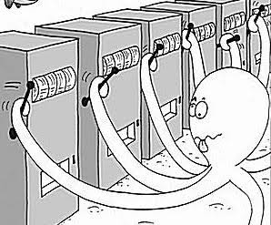

# 2.1 탐험과 활용: ε-greedy

[](https://colab.research.google.com/github/SuminHan/book-ml/blob/main/notebooks/ml2/chapter02_1_epsilon_greedy.ipynb)

### 이 절에서 무엇을 만들 것인가

강화학습의 **가장 오래되고 가장 어려운 질문**이 하나 있다. "아직 모르는
게 많다"는 상태에서 매 순간 결정을 내려야 할 때, **알아보려고 쓰는
시간(탐험, exploration**)과 **지금까지 가장 좋았던 것에 집중하는
시간(활용, exploitation**)을 어떻게 나눌 것인가 — 이것이
**탐험-활용의 딜레마**(exploration-exploitation dilemma)[^silvercourse]다. 슬롯머신
비유로 말하면, "이 손잡이가 좋은 것 같긴 한데 확신은 못 하겠네"라는
판단을 내린 순간부터, "한 번 더 당겨서 확인해볼 것인가, 아니면 지금
가장 좋아 보이는 다른 손잡이에 집중할 것인가"가 매 스텝마다 다시
제시된다.



이 딜레마는 이 책의 **거의 모든 장**에서 다시 등장한다 — Chapter 5의
몬테카를로, Chapter 6의 TD 학습, Chapter 9~16의 딥러닝 기반 방법까지.
그래서 이 장의 첫 절에서 가장 단순한 알고리즘 하나를 **완전히 뜯어
볼** 가치가 있다. 이번 절에서는:

- **\\(\varepsilon\\)-greedy** 전략 — "탐험의 비율을 하나의 확률
  \\(\varepsilon\\)로 직접 조종한다"는, 이 책에서 처음 등장할
  **정책(policy)** — 을 정의하고 코드로 구현한다.
- 추정치를 갱신하는 **증분 갱신식**(incremental update)의 수학적
  정체를 확인한다 — 이 식은 "지금까지 관찰한 보상의 평균을 하나씩
  온라인으로 갱신하는 것"과 수학적으로 **동일**하며, 이 한 줄이
  Chapter 5·6의 모든 학습 규칙의 뼈대가 된다.
- **탐험에도 비용이 있다**는 감각을 숫자로 만든다 —
  \\(\varepsilon\\)를 0에 가깝게 잡으면 "한 번의 나쁜 운"에 최적해를
  영영 잃을 수 있고, 1에 가깝게 잡으면 이미 찾아낸 최선의 팔을
  외면한 채 보상을 계속 낭비한다. \\(\varepsilon\\)를 훑어보면
  양쪽 끝이 아니라 **가운데 어딘가**에 최대치가 존재한다.

"총보상"과 "후회(regret)"라는 두 잣대의 직감은 이 절에서 심고,
Chapter 5(몬테카를로)에서 후회가 **정식적으로 정의**된다.

### 밴딧 문제의 정적 설정

처음부터 변수를 정리하자. \\(k\\)개의 팔(arm)이 있고, 각 팔 \\(a\\)는
우리가 **모르는** 진짜 평균 보상 \\(q^\*(a)\\)를 가진 "보상 기계"다.
매 스텝 \\(t = 1, 2, \ldots, T\\)에서 에이전트는 팔 하나를 골라
당기고, 보상 \\(R\_t\\)를 받는다. 보상은 해당 팔의 분포에서 나온
것이라서 매번 달라진다 — 이 책의 모든 예에서는
\\(R\_t \sim \mathcal{N}(q^\*(a\_t), 1)\\)(평균 \\(q^\*(a\_t)\\),
표준편차 1의 정규분포)를 쓴다. **판별할 수 있는 신호는 "평균"
하나뿐**이고, 매번 받는 보상은 그 평균 주변의 잡음에 가려져 있다.

목표는 \\(T\\)스텝 동안의 **총 보상** \\(\sum\_{t=1}^{T} R\_t\\)를
최대화하는 것이다. 여기서 "완전한 정보"를 가진 오라클(cheater)의
성적을 떠올려보자 — 오라클은 매 스텝마다 진짜 최선의 팔
\\(a^\* = \arg\max\_a q^\*(a)\\)를 골라 \\(T \cdot q^\*(a^\*)\\)를
벌어간다. 우리는 \\(q^\*(a)\\)를 몰라서 오라클의 성적을 **원칙적으로**
맞출 수 없지만, "오라클과의 차이"를 잣대로 쓰면 탐험이 얼마나
합리적이었는지를 한 숫자로 압축할 수 있다:

\\[\text{후회(regret)} \\;\\; \mathcal{R}\_T = T \cdot q^\*(a^\*) -
\sum\_{t=1}^{T} R\_t\\]

"\\(T\\)스텝을 오라클처럼 보냈더라면 벌었을 총보상에서, 실제로
벌어간 총보상을 뺀 것"이다. \\(\varepsilon\\)-greedy를 비롯한 모든
탐험 전략의 궁극적인 목표는 **\\(\mathcal{R}\_T\\)를 0으로
가까이**하는 것이다 — 이 절에서는 직감으로, Chapter 5에서는
정식적으로 이 후회를 다룬다.

**왜 "상태가 없는" 문제가 강화학습의 출발점인가?** 밴딧은 "지금
한 선택이 다음 상황을 바꾼다"는 MDP의 복잡성(Chapter 3)을 걷어내고
**탐험-활용의 딜레마 하나만** 순수하게 남긴 문제다. 상태가 없으므로
에이전트의 "정책"은 단순해진다 — "지금 \\(Q, N\\)이 이렇다면,
어떤 팔을 고를 것인가"라는 **한 줄 규칙**이다. 이 한 줄 규칙이
\\(\varepsilon\\)-greedy다.

### 탐욕적 선택의 함정

\\(k\\)개의 손잡이(팔) 각각의 실제 평균 보상을 \\(q^\*(a)\\)라
하자(우리는 모른다). 지금까지 관찰한 것을 바탕으로 한 추정치를
\\(Q\_t(a)\\)라 하면, 가장 단순한 전략은 **탐욕적**(greedy) 선택 —
매번 \\(Q\_t(a)\\)가 가장 큰 팔을 당기는 것이다. 문제는 초반에
우연히 나쁜 결과가 나온 팔을 그 뒤로 영원히 외면하게 될 수 있다는
것이다 — 진짜 최선의 팔을 충분히 시도해보지 못한 채 잘못된 결론에
갇히는 것이다.

이 함정이 "가끔 운이 없으면" 수준이 아니라 **구조적으로** 일어나는
것인지 생각해보자. 매 팔의 첫 관찰은 그 팔의 진짜 평균의 **무작위
샘플** 하나에 불과하다 — 표준편차 1의 잡음이 섞인 상태에서 한 번의
보상이 평균을 정확히 반영할 리 없다. 그런데 순수 탐욕 전략은
"추정치가 낮은 팔"을 **한 번도** 다시 골라주지 않는다. 즉,

1. 팔 A가 사실 최선인데(\\(q^\*(A)=2.0\\)), 첫 보상이 잡음 때문에
   0.1로 낮게 나와 \\(Q(A)=0.1\\)이 된다.
2. 팔 B의 첫 보상이 1.4로 나와 \\(Q(B)=1.4\\)이면, 이제
   \\(Q(B) > Q(A)\\)다.
3. 탐욕 규칙은 이후 **영원히** B를 고른다 — \\(Q(A)\\)가 2.0에
   접근할 기회는 **구조적으로** 사라졌다. A를 다시 당기는
   확률이 0이므로, \\(Q(A)\\)는 0.1에 박혀 영원히
   "A는 나쁜 팔"이라는 **틀린 확신**이 된다.

관찰 데이터가 늘어날수록 추정치는 더 **정확해져야** 하는데,
이 시나리오에서는 데이터가 늘어날수록 **틀린 결론에 대한 확신만
늘어난다** — 데이터가 늘면 늘수록 잘못을 확신하게 되는,
통계적으로는 가장 불쌍한 실패 모드다. 추천시스템의 **콜드 스타트
(cold start)** 문제가 바로 이것이다 — 새로 들어온 영화(팔)는
평점이 하나도 없어서(또는 우연히 낮은 첫 평점을 받아서) 추천
순위에서 영영 밀려나는 현상. "실제로 좋아도 아직 데이터가 없는
것"과 "실제로 나쁜 것"을 구분할 능력이 이 시점의 알고리즘에는
**전혀** 없는 셈이다.

### ε-greedy 전략

**\\(\varepsilon\\)-greedy**[^suttonbarto]는 확률 \\(1-\varepsilon\\)로는
지금까지 가장 좋다고 아는 팔을 당기고(활용), 확률 \\(\varepsilon\\)로는
무작위 팔을 당긴다(탐험) — Chapter 6(시간차 학습)에서 다시 만날 바로 그
전략이다. 각 팔의 추정치는 실제로 관찰한 보상의 평균으로 갱신한다:

\\[Q\_{t+1}(a) = Q\_t(a) + \frac{1}{N\_t(a)}\big(R\_t - Q\_t(a)\big)\\]

\\(N\_t(a)\\)는 팔 \\(a\\)를 지금까지 당긴 횟수다. 이 갱신 규칙은
"새로 관찰한 값과 지금 추정치의 차이만큼, 그 차이의 크기에 비례해서
추정치를 옮긴다"는 형태 — Chapter 5(몬테카를로)와 Chapter 6(시간차
학습)에서 계속 재사용될 패턴이다.

**왜 확률 \\(\varepsilon\\)로 "무작위 팔"인가?** 순수 무작위 선택
(\\(\varepsilon=1\\))은 "모든 팔의 선택 확률이 \\(1/k\\)로 같다"는
전략이다 — 정보를 **전혀** 쓰지 않는 것이다. 순수 탐욕
(\\(\varepsilon=0\\))은 반대로 정보를 **완전히** 믿는다 — 한 번의
샘플로 영원히 틀릴 수 있다는 게 방금 본 함정이다.
\\(0<\varepsilon<1\\)의 \\(\varepsilon\\)-greedy는 이 두 극단을
**혼합**(convex combination)한 것이다. 팔 \\(a\\)가 "현재의 최대
\\(Q\\) 팔"(greedy 팔)이 아닐 때와 맞을 때를 나누면, \\(\varepsilon\\)
-greedy가 팔 \\(a\\)를 고를 확률은:

\\[P(a\_t = a) = \begin{cases} (1-\varepsilon) + \dfrac{\varepsilon}{k}
& \text{if } a \text{가 greedy 팔} \\[6pt] \dfrac{\varepsilon}{k} &
\text{그 외} \end{cases}\\]

두 가지가 눈에 들어와야 한다. **첫째**, 어떤 팔이든 선택 확률이
\\(\varepsilon/k \\ge 0\\)로 **0이 아니다** — "한 번의 나쁜
운"에 영원히 박힐 구조적 경로가 **수학적으로 막혀** 있다.
\\(\varepsilon=0.1\\), \\(k=3\\)라면 "확실히 나쁜 팔"도 매 스텝
\\(0.1/3 \approx 3.3\\%\\)의 확률로 다시 시도된다 — 그 3.3%가
"틀린 확신에서 탈출하는" 출구다. **둘째**, greedy 팔의 확률은
\\(1-\varepsilon + \varepsilon/k\\)로, 나머지 팔 \\((k-1)\\)개와
**불균형**하다 — 정보가 "이 팔이 좋아 보여"라고 말하면, 그
판단을 \\((1-\varepsilon)\\)만큼 **존중**한다. \\(\varepsilon\\)이
이 전략의 **유일한** 조종장치라는 점에 주목하라 — 탐험의 "양"을
한 하이퍼파라미터가 완전히 결정한다.

```python
import random

def epsilon_greedy_bandit(true_means, epsilon, steps):
    k = len(true_means)
    Q = [0.0] * k
    N = [0] * k
    for t in range(steps):
        if random.random() < epsilon:
            a = random.randrange(k)          # 탐험
        else:
            a = max(range(k), key=lambda i: Q[i])  # 활용
        r = random.gauss(true_means[a], 1.0)  # 실제 보상은 평균 true_means[a], 잡음 섞임
        N[a] += 1
        Q[a] += (r - Q[a]) / N[a]
    return Q
```

### 손으로 한 번: 증분 갱신식을 직접 따라가기

팔이 2개(A, B)뿐인 아주 작은 예로, \\(Q\_{t+1}(a) = Q\_t(a) +
\frac{1}{N\_t(a)}(R\_t - Q\_t(a))\\)가 실제로 어떻게 값을 갱신하는지
손으로 따라가보자. \\(Q\_A = Q\_B = 0\\), \\(N\_A = N\_B = 0\\)에서
시작해서, 팔 A, A, B, B 순서로 당기고 각각 보상 \\(2, 0, 3, 1\\)을
관찰했다고 하자:

| 시도 | 당긴 팔 | 보상 \\(R\\) | 갱신 계산 | 갱신 후 \\(Q\\) |
|---|---|---|---|---|
| 1 | A | 2 | \\(Q\_A \leftarrow 0 + \frac{1}{1}(2-0)\\) | \\(Q\_A{=}2.0,\ Q\_B{=}0.0\\) |
| 2 | A | 0 | \\(Q\_A \leftarrow 2 + \frac{1}{2}(0-2)\\) | \\(Q\_A{=}1.0,\ Q\_B{=}0.0\\) |
| 3 | B | 3 | \\(Q\_B \leftarrow 0 + \frac{1}{1}(3-0)\\) | \\(Q\_A{=}1.0,\ Q\_B{=}3.0\\) |
| 4 | B | 1 | \\(Q\_B \leftarrow 3 + \frac{1}{2}(1-3)\\) | \\(Q\_A{=}1.0,\ Q\_B{=}2.0\\) |

최종적으로 \\(Q\_A=1.0\\)은 A에서 관찰한 두 보상 \\(2, 0\\)의 평균과
정확히 같고, \\(Q\_B=2.0\\)도 B에서 관찰한 \\(3, 1\\)의 평균과 정확히
같다 — 연습문제 3번에서 증명하듯, 이 증분 갱신식은 그냥 "지금까지
관찰한 보상들의 평균을 하나씩 온라인으로 갱신하는 것"과 수학적으로
완전히 동일하다. 이 시점에서 탐욕적 선택을 한다면 \\(Q\_B > Q\_A\\)이므로
팔 B를 고르게 된다.

### 증분 갱신식 = "온라인 평균": 왜 그런가

위의 표에서 "우연히" 평균과 맞았다기보다, **항상** 그렇다는 것을
짧게 확인해두자. 팔 하나를 \\(n\\)번 당겨 관찰한 보상이
\\(R\_1, \ldots, R\_n\\)일 때(\\(Q\_0 = 0\\)에서 시작), 귀납으로
\\(Q\_n = \frac{1}{n}\sum\_{i=1}^{n} R\_i\\)임을 보여보자.

- **기초 단계** \\(n=1\\): \\(Q\_1 = Q\_0 + \frac{1}{1}(R\_1 - Q\_0)
  = R\_1\\) — 평균 \\(\frac{R\_1}{1}\\)과 일치.
- **귀납 단계**: \\(Q\_n = \frac{1}{n}\sum\_{i=1}^{n} R\_i\\)라고
  가정하고 한 번 더 갱신하면,

\\[Q\_{n+1} = Q\_n + \frac{1}{n+1}(R\_{n+1} - Q\_n)
= \frac{n}{n+1}Q\_n + \frac{1}{n+1}R\_{n+1}
= \frac{1}{n+1}\sum\_{i=1}^{n} R\_i + \frac{R\_{n+1}}{n+1}
= \frac{1}{n+1}\sum\_{i=1}^{n+1} R\_i.\\]

완결이다. \\(\frac{1}{n+1}\\)의 가중치가 "이전 평균에 \\(n\\)번,
새 관측에 1번"을 나눠주는 구조라서 정확히 실효 평균이 유지되는
것이다.

**이 등치가 왜 중요한가?** (1) "학습 규칙"이라고 복잡하게 들리던
식 뒤에 **평균**이라는 잘 아는 개념이 그대로 숨어 있다는 뜻이다 —
\\(Q\_t(a)\\)는 "불확실한 마법의 숫자"가 아니라 **그 팔에 대한 현재
최우량 추정치(평균)** 그 자체다. (2) \\(\frac{1}{N\\)}의
**학습률**이 시도에 비례해 줄어든다는 것을 직접 보여준다 —
100번째 관찰은 100분의 1만 움직이고, 1000번째는 1000분의 1.
이 "새로운 정보가 많아질수록 보수적으로"라는 성질이 Chapter 6의
"\\(1/N\\) vs 고정 \\(\alpha\\)" 논쟁(2.2절 FAQ)의 한쪽 극이 된다.
(3) **온라인**(online)이라는 점: 보상을 전부 기억할 필요 없이
\\(Q, N\\) 두 숫자만으로 전체 평균을 갱신할 수 있다 — 실전에서
수백만 스텝을 돌릴 때 메모리가 \\(O(k)\\)로 유지되는 이유다.

### 자주 하는 실수: \\(\varepsilon=0\\)(순수 탐욕적 선택)을 그대로 쓰기

이 절 도입부의 "탐욕적 선택의 함정"이 실제로 얼마나 치명적인지
시뮬레이션 숫자로 확인해보자. 진짜 평균 보상이 \\([2.0, 1.0]\\)(팔
A가 진짜 최선)인 밴딧에서, \\(random.seed(11)\\)로 200번
시행해보면:

```
Q = [-0.113, 0.894],  N = [1, 199]
```

팔 A를 **딱 한 번**만 시도해본 뒤(그 한 번의 보상이 우연히 잡음
때문에 낮게 나왔다), 그 이후 199번 내내 팔 B만 당겼다 — 진짜 최선인
팔 A의 추정치(\\(-0.113\\))가 팔 B의 추정치(\\(0.894\\))보다 낮다고
"확신"해버린 뒤로는 다시 시도할 방법이 없기 때문이다. 정확히 같은
무작위 시드(11)에서 \\(\varepsilon=0.1\\)만 섞어주면:

```
Q = [1.974, 0.739],  N = [183, 17]
```

진짜 최선인 팔 A를 183번이나 시도해서 추정치(\\(1.974\\))가 진짜
평균(\\(2.0\\))에 훨씬 가깝게 수렴한다. 이 대비가 정확히 "초반에
우연히 나쁜 결과가 나온 팔을 영원히 외면하게 될 수 있다"는 도입부
문장의 실제 사례다 — \\(\varepsilon=0\\)은 이론상 가장 "효율적으로
활용만 한다"는 전략처럼 보이지만, 실전에서는 단 한 번의 나쁜 운으로
최적해를 영원히 놓칠 수 있는 가장 위험한 선택이다. (위 두 숫자는
실습 노트북 2번 섹션에서 바로 재현할 수 있다 —
\\(random.seed(11)\\)를 걸고 \\(\varepsilon=0\\)과 0.1을 각각
돌리면 그대로 나온다.)

### 역사적 일화: "밴딧"이라는 이름, 그리고 70년 된 문제

"멀티암 밴딧(multi-armed bandit)"이라는 이름은 카지노의
**슬롯머신**(구식 이름이 *bandit machine*)에서 왔고, 문제는
1930년대 말부터 수학적으로 연구되기 시작해, 1952년 Robbins가
"어떤 전략이든 후회가 \\(O(\ln T)\\) 이하가 될 수 없다"는 유명한
**하한**을 증명하면서 본격 확립됐다. 이 하한은 "탐험을 **최소한**
이만큼은 해야 한다"는 뜻인데, 2.2절의 UCB[^ucb]가 이 하한에 도달하는
전략 중 하나다 — 즉, 이 절의 \\(\varepsilon\\)-greedy는 "가장
단순한" 전략이면서, 70년 넘게 연구된 문제의 **출발점**이기도 하다.

\\(\varepsilon\\)-greedy가 실제로 쓰이는 분야는 넓다. **A/B
테스트**(두 광고 문구의 클릭률 비교)에서 "이긴 쪽에 트래픽을 점점
더 몰아주는" 적응형 테스트, **뉴스 기사 추천**(어떤 제목을
보여줄지)[^li2010news], **임상시험**(어떤 치료법에 다음 환자를 배정할지 —
2.3절에서 다시 다룬다), **온라인 광고 배너 선택**까지. 공통점은
"한 번의 선택이 다음 선택지를 바꾸지 않고" **매 스텝 같은 후보
집합에서 다시 고르는** 구조라는 것이다 — 상태가 하나뿐인 MDP
(2.3절)의 정확한 형태다. 이 주제를 더 깊이 보려면 [^cs234]

### 자주 하는 실수: "모든 \\(Q\\)가 0인 첫 스텝"의 숨겨진 임의성

\\(\varepsilon\\)-greedy 코드를 처음 돌릴 때, **첫 번째 선택은
사실상 "운**"이라는 점을 놓치기 쉽다. \\(t=1\\)에서는 모든
\\(Q(a)=0\\)이므로 "최대 \\(Q\\)의 팔"이 **모든 팔**이다 —
greedy와 무작위가 구별되지 않는 **완전 동점**(tie) 상태다.
위 코드의 `max(range(k), key=lambda i: Q[i])`는 동점 시 **첫 팔**(인덱스
0)을 반환하므로, \\(\varepsilon=0\\)라면 **처음 당기는 팔이
알고리즘이 정해버리는** 숨겨진 편향(hidden bias)이 생긴다.
"첫 팔을 우연히 좋게 뽑으면 그 팔에 평생 남는" 운이 코드 안에
고정되어 있는 셈이다. \\(\varepsilon>0\\)이면 이 임의성은
무해해진다 — 첫 스텝이 어떤 팔이든, \\(\varepsilon\\)의 확률로
나머지 팔이 계속 재시험되므로 **처음의 운이 영원한 운이 되지
않기** 때문이다. 그런데 \\(\varepsilon=0\\)라면 이 "첫 스텝의 운"이
**결정적인** 결과를 결정한다 — "자주 하는 실수:
\\(\varepsilon=0\\)" 섹션의 seed=11 예가 정확히 이 시나리오
(첫 팔 A가 첫 관찰에서 불운하게 낮게 나온 경우)다. 구현할 때는
동점 처리(첫 팔 / 무작위 중 하나)를 **의도적으로** 정하고,
\\(\varepsilon>0\\)를 유지하는 한 그 선택이 장기 성능에 영향을
미치지 않음을 알아두면 된다.

### 확인 문제: 선택 확률 직접 계산

\\(\varepsilon\\)-greedy의 "선택 확률" \\(P(a\_t = a)\\) 식을
직접 써먹어보자(답은 각 문항 아래에 있다):

- **(a)** \\(k=5\\), \\(\varepsilon=0.2\\). 팔 A가 현재 greedy
  팔이고, 나머지 4개 팔이 B·C·D·E일 때, 각 팔을 선택할 확률을
  계산하라.
  > 답: A는 \\((1-0.2) + 0.2/5 = 0.84\\), B·C·D·E 각각은
  > \\(0.2/5 = 0.04\\). 합을 확인하면
  > \\(0.84 + 4 \times 0.04 = 1.0\\).
- **(b)** 같은 설정에서, "B가 사실은 A보다 좋은 팔이다"는
  정보를 **알고 있는** 우리(교과서 저자) 관점에서, 에이전트가
  B를 선택할 **단일 스텝 확률**은 몇 퍼센트인가? 이 숫자가
  "탐험의 출구"가 얼마나 넓은지 보여준다.
  > 답: \\(0.04\\), 즉 **4%** — "확실히 나빠 보이는" 팔이라고
  > 생각되는 B도 매 스텝 4%로 재시험된다. \\(T=2000\\)스텝이면
  > B는 기대 \\(2000 \times 0.04 = 80\\)번 재시험되는 셈이다.
- **(c)** \\(\varepsilon=0\\)라면 (b)의 출구 확률은?
  > 답: \\(0\\) — **구조적으로** 출구가 닫힌다.
  > "자주 하는 실수: \\(\varepsilon=0\\)" 섹션의 함정이
  > 바로 이 0%의 직접적 결과다.

세 문항을 한 줄로 묶으면: **\\(\varepsilon\\)는 "틀린 확신에서
탈출할 출구의 폭"을 결정하는 숫자**다.

### 탐험에도 비용이 있다: \\(\varepsilon\\)를 훑으면 나타나는 곡선

지금까지의 논리는 "탐험이 필요하다"는 쪽에 무게가 있었다.
그런데 **탐험 한 스텝에도 대가가 있다**는 점을 숫자로 확인해보자.
\\(\varepsilon\\)-greedy가 무작위 팔을 고르는 스텝에서, 그
"무작위 팔"의 기대 보상은 \\(k\\)개 팔의 평균
\\(\frac{1}{k}\sum\_a q^\*(a)\\)다 — 최선의 팔
\\(q^\*(a^\*)\\)보다 **작다**. 즉, 탐험 스텝 하나당 기대 손실은
\\(q^\*(a^\*) - \frac{1}{k}\sum\_a q^\*(a)\\) — **활용했을 때
받을 것을 포기한 값**이다. \\(k=3\\), \\(q^\* = [1.0, 1.5, 2.0]\\)
(2.2절 실습과 같은 표준 설정)라면 이 손실은 스텝마다
\\(2.0 - 1.5 = 0.5\\)다.

그렇다면 \\(\varepsilon\\)를 0에서 1까지 훑으면 총보상은
어떻게 변할까? **너무 작으면** (탐험이 부족해서) "한 번의 나쁜
운"에 걸려 최적 팔을 놓칠 확률이 높아진다(위 "자주 하는 실수"
섹션). **너무 크면** (탐험이 과도해서) 이미 찾아낸 최선의 팔을
외면한 채 스텝마다 \\(0.5\\)씩의 기대 손실을 계속 낸다. 양쪽
끝이 나쁘면 **가운데 어딘가**에 최대치가 있어야 한다 — 시뮬레이션
으로 확인해보자.

**실험 설정**: \\(k=3\\), \\(q^\* = [1.0, 1.5, 2.0]\\),
\\(T=2000\\)스텝, \\(\varepsilon \in \\{0, 0.01, 0.05, 0.1, 0.2,
0.5\\}\\). 각 \\(\varepsilon\\)마다 **200번 독립 실험**(시드
1000~1199)을 돌려 **평균** 총보상과 **평균** 후회
(= \\(4000 - \\)총보상, 오라클 총보상 2000×2.0 = 4000)를
계산한다. 실습 노트북 3번 섹션에서 이 실험이 그대로 실행된다:

| \\(\varepsilon\\) | 평균 총보상 | 평균 후회 \\(\mathcal{R}\_{2000}\\) | "최선 팔(C)에 몰림" 실험 비율 |
|---|---|---|---|
| 0.00 | 2245.6 | **1754.4** | 3% (97%가 "막히"는 실패) |
| 0.01 | 3657.1 | 342.9 | 84% |
| 0.05 | **3872.4** | **127.6** | 98% |
| 0.10 | 3862.8 | 137.2 | 100% |
| 0.20 | 3785.9 | 214.1 | 100% |
| 0.50 | 3498.1 | 501.9 | 100% |

(*"최선 팔에 몰림" 비율 = 실험 종료 시 최선 팔 C를 전체의 50%
이상을 차지하도록 선택한 실험의 비율 — "최선을 찾아냈는가"의
조용한 판정.*)

![ε를 0→1로 훑을 때 ε-greedy의 평균 총보상(왼쪽)과 평균 후회(오른쪽) — 3팔 밴딧(q*=[1.0,1.5,2.0], T=2000, 각 ε당 200번 독립 실험). ε=0(순수 탐욕)은 "한 번의 나쁜 운"에 최적 팔을 잃어 후회가 1754로 폭주하고, ε=0.5(반은 무작위)는 이미 찾아낸 최선 팔을 외면한 채 후회가 502로 늘어난다. 최대치는 양쪽 극단이 아닌 ε≈0.05~0.1의 "가운데"에 있다](../../images/ch02_1_epsilon_tradeoff.svg)

**세 가지 관찰.** (1) **\\(\varepsilon=0\\)의 후회 1754**는
"단 한 번의 나쁜 운"이 **약 2000스텝 × 2.0의 절반**에 달하는
손실을 만든다는 뜻이다 — 같은 조건에서 \\(\varepsilon=0.1\\)만
달리면(표 4행) 평균후회가 약 137로 **약 13배** 줄어든다.
(2) **최대가 \\(\varepsilon=0.05\\)** (3872.4) — 0.10(3862.8)이
그냥 "아주 비슷"한 2위다. "\\(\varepsilon=0.1\\)이 마법 수"가
아니라 **문제(\\(k\\), 잡음 스케일)에 따라 움직이는** 절충점이라는
걸 알 수 있다. (3) **\\(\varepsilon=0.01\\)도 16% 실패** —
"좀만 섞어주면 되겠지"라는 \\(\varepsilon=0.01\\)이
\\(\varepsilon=0\\)의 "영원히 박히기"를 **완전히** 막아주진
않는다. 탐험은 "많을수록"도 "적을수록"도 안 되는, **적정량**
의 문제다.

**왜 \\(\varepsilon=0.1\\)의 후회 137이 "예측 가능"한가?**
위의 "탐험 스텝당 기대 손실 0.5"를 쓰면, \\(\varepsilon=0.1\\)는
\\(2000 \times 0.1 = 200\\)스텝을 무작위 팔에 쓰므로, 그
**순수 탐험 손실**은 \\(200 \times 0.5 = 100\\)이다. 실제 후회
137의 대부분(100)은 이 "활용을 포기한 대가"에서 오고, 나머지
약 37은 "최선 팔을 **아직 못 찾은** 초반"의 손실(추정치가
불신실한 초기 구간에서 greedy 선택도 가끔 오판)이다. 이
분해 — **탐험 손실 + 초기 불확실성 손실** — 가 \\(\varepsilon\\)
곡선의 모양을 만든다: \\(\varepsilon\\)를 줄이면 "탐험 손실"은
줄지만 "초기 불확실성 손실"(= 최선 팔을 못 찾아 오래
돌아다니는 대가)은 커진다. 두 손실의 합이 최소가 되는 지점이
바로 곡선의 꼭대기다.

### 실습: \\(\varepsilon\\) 곡선을 직접 그리기

위 실험을 실습 노트북에서 직접 돌려보자. 핵심 코드는
\\(\varepsilon\\)를 훑고, 각 \\(\varepsilon\\)마다 200번 독립
실험을 돌린 뒤 **평균 총보상·평균 후회**를 모은다:

```python
import random

def total_reward_epsilon_greedy(true_means, epsilon, steps, seed=0):
    random.seed(seed)
    k = len(true_means)
    Q, N, total = [0.0]*k, [0]*k, 0.0
    for t in range(steps):
        a = random.randrange(k) if random.random() < epsilon \
            else max(range(k), key=lambda i: Q[i])
        r = random.gauss(true_means[a], 1.0)
        N[a] += 1
        Q[a] += (r - Q[a]) / N[a]
        total += r
    return Q, N, total

true_means = [1.0, 1.5, 2.0]
steps = 2000
oracle = steps * max(true_means)   # 오라클 총보상 = 4000
epsilons = [0.0, 0.01, 0.05, 0.1, 0.2, 0.5]

for eps in epsilons:
    tots, stuck = [], 0
    for trial in range(200):
        Q, N, tot = total_reward_epsilon_greedy(true_means, eps, steps,
                                                seed=1000 + trial)
        tots.append(tot)
        if N[2] >= 0.5 * steps:      # 최선 팔(C)이 50% 이상 차지한 실험
            stuck += 1
    mean_tot = sum(tots) / len(tots)
    print(f"eps={eps:<5}  mean_total={mean_tot:8.1f}  "
          f"mean_regret={oracle - mean_tot:8.1f}  found_best={stuck/200:.2f}")
```

노트북 3번 섹션에서 이 코드가 위 표의 숫자를 그대로 출력하고,
4번 섹션에서는 **\\(\varepsilon=0\\)의 "막힘"이 실험마다 어떻게
퍼져 있는가**를 히스토그램으로 보여준다 — 200번 실험 중 97%가
"최선 팔을 못 찾은" 실패로 끝나지만, 3%는 운이 좋아 최선 팔을
찾아내는 **양분포**(bimodal)가 나와 "\\(\varepsilon=0\\)이
*가끔*은 잘 동작한다"는 착시를 깨는 그림이 된다.

### 자주 묻는 질문

**Q. \\(\varepsilon\\)을 크게 잡을수록 항상 더 좋은가요?** 아니다 —
\\(\varepsilon\\)가 크면 나쁜 팔을 계속 무작위로 다시 시도하느라
그만큼 누적 보상을 손해 본다(탐험에도 비용이 있다는 2.2절 실습의
핵심). 위 사례처럼 \\(\varepsilon\\)이 아예 0이면 최적해를 영영
놓칠 위험이 있고, \\(\varepsilon\\)이 지나치게 크면(예: 0.5) 이미
최선의 팔을 찾은 뒤에도 계속 나쁜 팔을 절반 확률로 시도하며
보상을 낭비한다 — 연습문제 2번에서 다루듯, 학습이 진행될수록
\\(\varepsilon\\)을 점점 줄여나가는 것이(decay) 실전에서 널리
쓰이는 절충안이다.

**Q. 증분 갱신식에서 \\(\frac{1}{N\_t(a)}\\) 대신 고정된 학습률
\\(\alpha\\)를 쓰면 어떻게 되나요?** \\(\frac{1}{N\_t(a)}\\)는
시도 횟수가 늘어날수록 갱신 폭이 점점 작아져서, 결국 정확한
평균으로 수렴한다(연습문제 3번). 고정된 \\(\alpha\\)를 쓰면
평균에 정확히 수렴하지는 않지만, 대신 **최근 관찰**에 더 큰
가중치를 계속 유지한다 — 진짜 평균 보상 \\(q^\*(a)\\) 자체가
시간에 따라 서서히 바뀌는 **비정상**(non-stationary)
환경(Chapter 6의 TD 학습에서 다시 만난다)에서는, 옛날 관찰에
매몰되지 않는 고정 \\(\alpha\\) 쪽이 오히려 더 유리하다.

**Q. \\(\varepsilon=0.1\\)이 "마법 수"인가요?** 아니다 — 위의
\\(\varepsilon\\) 곡선에서 보듯 **최대는 문제마다 다른 위치에
있다**(이번 실험에서는 0.05). 특히 \\(k\\)가 커질수록(예:
수천 개의 광고 배너), \\(\varepsilon\\)의 "무작위 팔"이
**나쁜 팔에 떨어질 확률**이 \\((k-1)/k\\)로 높아져
\\(\varepsilon=0.1\\)의 탐험이 거의 전부 낭비가 된다. \\(k\\)가
큰 문제는 2.2절의 UCB처럼 **불확실성에 비례**해 탐험을
조절하는 전략이 유리하다 — "\\(\varepsilon\\)-greedy가
언제 약해지는가"를 아는 것 자체가 다음 절로 가는 다리다.

**Q. "학습이 진행될수록 \\(\varepsilon\\)을 줄인다"(decay)는
구체적으로 어떻게 하나요?** 두 가지 흔한 규칙이 있다.
**\\(\varepsilon\_t = \varepsilon\_0 / t\\)**(예:
\\(\varepsilon\_0=100\\)로 시작해 1스텝마다 1/t로 감쇠) —
초반은 거의 무작위, 후반은 거의 순수 탐욕으로 **매우** 공격적으로
줄인다. **\\(\varepsilon\_t = \max(\varepsilon\_{\min},
\varepsilon\_0 / \sqrt{t})\\)** — 감소 속도가 느리고,
\\(\varepsilon\_{\min}\\)로 하한을 두어 **영원히** 완전히
탐험을 끊지 않는다(비정상 환경 대비). 실전에서는 "최선 팔을
찾은 뒤에도 환경이 변할 수 있다"는 가정(2.2절 FAQ의
"비정상 환경")에 따라 \\(\varepsilon\_{\min} > 0\\)를 두는
경우가 많다. 어떤 규칙을 쓰든, 핵심은 **\\(\varepsilon\\)를
"학습의 진행도"에 비례해** 줄인다는 것이다 — 초반엔 "아직
모르는 게 많다"는 사실에 비례해 탐험을 하고, 후반엔 "이미
아는 게 많다"는 사실에 비례해 탐험을 줄이는, **정보에
비례하는** 탐험의 가장 단순한 근사다.

---

**\\(\varepsilon\\)-greedy는 "탐험의 양을 하나의 확률
\\(\varepsilon\\)로 조종한다"는, 이 책에서 첫 번째로 배우는
정책이다. \\(\varepsilon=0\\)은 "한 번의 나쁜 운"에 최적해를
영원히 잃을 수 있고(2000스텝 후회 1754), \\(\varepsilon\\)가
지나치면 이미 찾아낸 최선 팔을 외면한 채 보상을 계속 낭비한다
(2000스텝 후회 502) — 탐험에도 **비용**이 있고, 그 비용과
"탐험 부족"의 대가를 줄이면 **가운데 어딘가**에 최적의
\\(\varepsilon\\)이 존재한다. 이 "탐험의 비용" 감각은
2.2절(UCB·낙관적 초기화)에서 **불확실성에 비례해** 탐험을
조절하는 방식으로 정교화되고, Chapter 5(몬테카를로)에서
**후회(regret**)로 정식 정의된다.**

[^suttonbarto]: Sutton, R. S., Barto, A. G. (2018). "Reinforcement Learning: An Introduction" (2nd ed.). MIT Press. 저자 공식 무료 공개: http://incompleteideas.net/book/the-book-2nd.html — ε-greedy를 비롯한 탐험-활용 전략과 밴딧 문제는 이 표준 교과서 2장에서 체계적으로 다뤄진다.
[^cs234]: 이 주제를 더 깊이 보려면 — Stanford CS234: Reinforcement Learning. https://web.stanford.edu/class/cs234/
[^ucb]: Auer, P., Cesa-Bianchi, N., Fischer, P. (2002). "Finite Time Analysis of the Multi-armed Bandit Problem." *Machine Learning* 47(2), 235–252. UCB1 전략을 제안한 원논문으로, Robbins 하한(\\(O(\ln T)\\))에 도달하는 대표적 탐험 전략이다.
[^li2010news]: Li, L., Chu, W., Langford, J., Schapire, R. E. (2010). "A Contextual-Bandit Approach to Personalized News Article Recommendation." WWW 2010. arXiv:1003.0146 — 실제 뉴스 사이트(AOL)에 적용한 컨텍스트 밴딧 기법으로, "기사 추천"을 밴딧/탐험-활용 프레임으로 다룬 대표 사례다.
[^silvercourse]: Silver, D. (2015). "UCL Course on Reinforcement Learning," Advanced Topics (COMPM050/COMPGI13) — 10개 강의 슬라이드(PDF)와 영상 강의가 공개되어 있다. https://www.davidsilver.uk/teaching/ 본 장과 가장 직접적으로 겹치는 Lecture 9: Exploration and Exploitation(47쪽, ε-greedy·멀티암 밴딧·컨텍스트 밴딧) — https://davidstarsilver.wordpress.com/wp-content/uploads/2025/04/lecture-9-exploration-and-exploitation.pdf (CC-BY-NC 4.0).
